# API 接口文档

<cite>
**本文档引用的文件**
- [src/main.ts](file://src/main.ts)
- [src/app.module.ts](file://src/app.module.ts)
- [src/app.controller.ts](file://src/app.controller.ts)
- [src/purely-profit/auth/auth.controller.ts](file://src/purely-profit/auth/auth.controller.ts)
- [src/purely-profit/auth/auth.service.ts](file://src/purely-profit/auth/auth.service.ts)
- [src/purely-profit/auth/auth.module.ts](file://src/purely-profit/auth/auth.module.ts)
- [src/purely-profit/auth/guards/jwt-auth.guard.ts](file://src/purely-profit/auth/guards/jwt-auth.guard.ts)
- [src/purely-profit/auth/strategies/jwt.strategy.ts](file://src/purely-profit/auth/strategies/jwt.strategy.ts)
- [src/purely-profit/auth/dto/login.dto.ts](file://src/purely-profit/auth/dto/login.dto.ts)
- [src/purely-profit/auth/dto/register.dto.ts](file://src/purely-profit/auth/dto/register.dto.ts)
- [src/purely-profit/auth/dto/auth-token-response.dto.ts](file://src/purely-profit/auth/dto/auth-token-response.dto.ts)
- [src/purely-profit/auth/dto/profile-response.dto.ts](file://src/purely-profit/auth/dto/profile-response.dto.ts)
- [src/purely-profit/auth/dto/capability-response.dto.ts](file://src/purely-profit/auth/dto/capability-response.dto.ts)
- [src/purely-profit/auth/dto/change-password.dto.ts](file://src/purely-profit/auth/dto/change-password.dto.ts)
- [src/purely-profit/auth/dto/forgot-password.dto.ts](file://src/purely-profit/auth/dto/forgot-password.dto.ts)
- [src/purely-profit/auth/dto/reset-password.dto.ts](file://src/purely-profit/auth/dto/reset-password.dto.ts)
- [src/purely-profit/auth/dto/send-register-code.dto.ts](file://src/purely-profit/auth/dto/send-register-code.dto.ts)
- [src/purely-profit/auth/dto/send-register-code-response.dto.ts](file://src/purely-profit/auth/dto/send-register-code-response.dto.ts)
- [src/purely-profit/auth/dto/update-avatar.dto.ts](file://src/purely-profit/auth/dto/update-avatar.dto.ts)
- [src/purely-profit/auth/dto/verify-real-name.dto.ts](file://src/purely-profit/auth/dto/verify-real-name.dto.ts)
- [src/purely-profit/notifications/notifications.controller.ts](file://src/purely-profit/notifications/notifications.controller.ts)
- [src/purely-profit/notifications/notifications.service.ts](file://src/purely-profit/notifications/notifications.service.ts)
- [src/purely-profit/notifications/dto/notifications.dto.ts](file://src/purely-profit/notifications/dto/notifications.dto.ts)
- [src/purely-profit/dashboard/dashboard-home/dashboard-home.controller.ts](file://src/purely-profit/dashboard/dashboard-home/dashboard-home.controller.ts)
- [src/purely-profit/dashboard/dashboard-home/dashboard-home.service.ts](file://src/purely-profit/dashboard/dashboard-home/dashboard-home.service.ts)
- [src/purely-profit/dashboard/business-analysis/business-analysis.controller.ts](file://src/purely-profit/dashboard/business-analysis/business-analysis.controller.ts)
- [src/purely-profit/dashboard/business-analysis/business-analysis.service.ts](file://src/purely-profit/dashboard/business-analysis/business-analysis.service.ts)
- [src/purely-profit/dashboard/profit-detail/profit-detail.controller.ts](file://src/purely-profit/dashboard/profit-detail/profit-detail.controller.ts)
- [src/purely-profit/dashboard/profit-detail/profit-detail.service.ts](file://src/purely-profit/dashboard/profit-detail/profit-detail.service.ts)
- [src/purely-profit/finance/finance.controller.ts](file://src/purely-profit/finance/finance.controller.ts)
- [src/purely-profit/finance/finance.service.ts](file://src/purely-profit/finance/finance.service.ts)
- [src/purely-profit/goods/products/products.controller.ts](file://src/purely-profit/goods/products/products.controller.ts)
- [src/purely-profit/goods/products/products.service.ts](file://src/purely-profit/goods/products/products.service.ts)
- [src/purely-profit/goods/inventory/inventory.controller.ts](file://src/purely-profit/goods/inventory/inventory.controller.ts)
- [src/purely-profit/goods/inventory/inventory.service.ts](file://src/purely-profit/goods/inventory/inventory.service.ts)
- [src/purely-profit/goods/categories/categories.controller.ts](file://src/purely-profit/goods/categories/categories.controller.ts)
- [src/purely-profit/goods/categories/categories.service.ts](file://src/purely-profit/goods/categories/categories.service.ts)
- [src/purely-profit/marketing/marketing.controller.ts](file://src/purely-profit/marketing/marketing.controller.ts)
- [src/purely-profit/marketing/marketing.service.ts](file://src/purely-profit/marketing/marketing.service.ts)
- [src/purely-profit/marketing/marketing-customers.controller.ts](file://src/purely-profit/marketing/marketing-customers.controller.ts)
- [src/purely-profit/marketing/marketing-overview.controller.ts](file://src/purely-profit/marketing/marketing-overview.controller.ts)
- [src/purely-profit/marketing/marketing-products.controller.ts](file://src/purely-profit/marketing/marketing-products.controller.ts)
- [src/purely-profit/marketing/marketing-promotions.controller.ts](file://src/purely-profit/marketing/marketing-promotions.controller.ts)
- [src/purely-profit/marketing/marketing-transactions.controller.ts](file://src/purely-profit/marketing/marketing-transactions.controller.ts)
- [src/purely-profit/member/members/members.controller.ts](file://src/purely-profit/member/members/members.controller.ts)
- [src/purely-profit/member/members/members.service.ts](file://src/purely-profit/member/members/members.service.ts)
- [src/purely-profit/member/platform-membership/platform-membership.controller.ts](file://src/purely-profit/member/platform-membership/platform-membership.controller.ts)
- [src/purely-profit/member/platform-membership/platform-membership.service.ts](file://src/purely-profit/member/platform-membership/platform-membership.service.ts)
- [src/purely-profit/member/platform-membership/partner-review.controller.ts](file://src/purely-profit/member/platform-membership/partner-review.controller.ts)
- [src/purely-profit/member/platform-membership/promotion-detail-compat.controller.ts](file://src/purely-profit/member/platform-membership/promotion-detail-compat.controller.ts)
- [src/purely-profit/subscriptions/subscriptions.controller.ts](file://src/purely-profit/subscriptions/subscriptions.controller.ts)
- [src/purely-profit/subscriptions/subscriptions.service.ts](file://src/purely-profit/subscriptions/subscriptions.service.ts)
- [src/purely-profit/stores/stores.controller.ts](file://src/purely-profit/stores/stores.controller.ts)
- [src/purely-profit/stores/stores.service.ts](file://src/purely-profit/stores/stores.service.ts)
- [src/purely-profit/operations/sales-record/sales-record.controller.ts](file://src/purely-profit/operations/sales-record/sales-record.controller.ts)
- [src/purely-profit/operations/sales-record/sales-record.service.ts](file://src/purely-profit/operations/sales-record/sales-record.service.ts)
- [src/purely-profit/operations/handover/handover.controller.ts](file://src/purely-profit/operations/handover/handover.controller.ts)
- [src/purely-profit/operations/handover/handover.service.ts](file://src/purely-profit/operations/handover/handover.service.ts)
- [src/purely-profit/operations/spaces/spaces.controller.ts](file://src/purely-profit/operations/spaces/spaces.controller.ts)
- [src/purely-profit/operations/spaces/spaces.service.ts](file://src/purely-profit/operations/spaces/spaces.service.ts)
- [src/purely-profit/operations/spaces/space-sessions.controller.ts](file://src/purely-profit/operations/spaces/space-sessions.controller.ts)
- [src/purely-profit/staff/employees/employees.controller.ts](file://src/purely-profit/staff/employees/employees.controller.ts)
- [src/purely-profit/staff/employees/employees.service.ts](file://src/purely-profit/staff/employees/employees.service.ts)
- [src/purely-profit/staff/seats/seats.controller.ts](file://src/purely-profit/staff/seats/seats.controller.ts)
- [src/purely-profit/staff/seats/seats.service.ts](file://src/purely-profit/staff/seats/seats.service.ts)
- [src/purely-profit/finance/dto/finance-response.dto.ts](file://src/purely-profit/finance/dto/finance-response.dto.ts)
- [src/purely-profit/finance/dto/finance-query.dto.ts](file://src/purely-profit/finance/dto/finance-query.dto.ts)
- [src/purely-profit/finance/dto/finance-overview.response.dto.ts](file://src/purely-profit/finance/dto/finance-overview.response.dto.ts)
- [src/purely-profit/finance/dto/finance-account.response.dto.ts](file://src/purely-profit/finance/dto/finance-account.response.dto.ts)
- [src/purely-profit/finance/dto/finance-cash-flow.response.dto.ts](file://src/purely-profit/finance/dto/finance-cash-flow.response.dto.ts)
- [src/purely-profit/finance/dto/finance-reconciliation.response.dto.ts](file://src/purely-profit/finance/dto/finance-reconciliation.response.dto.ts)
- [src/purely-profit/finance/dto/finance-report.response.dto.ts](file://src/purely-profit/finance/dto/finance-report.response.dto.ts)
- [src/purely-profit/finance/dto/finance-account.query.dto.ts](file://src/purely-profit/finance/dto/finance-account.query.dto.ts)
- [src/purely-profit/finance/dto/finance-cash-flow.query.dto.ts](file://src/purely-profit/finance/dto/finance-cash-flow.query.dto.ts)
- [src/purely-profit/finance/dto/finance-reconciliation.query.dto.ts](file://src/purely-profit/finance/dto/finance-reconciliation.query.dto.ts)
- [src/purely-profit/finance/dto/finance-overview.query.dto.ts](file://src/purely-profit/finance/dto/finance-overview.query.dto.ts)
- [src/purely-profit/goods/products/dto/products-query.dto.ts](file://src/purely-profit/goods/products/dto/products-query.dto.ts)
- [src/purely-profit/goods/inventory/dto/inventory-query.dto.ts](file://src/purely-profit/goods/inventory/dto/inventory-query.dto.ts)
- [src/purely-profit/goods/categories/dto/categories-query.dto.ts](file://src/purely-profit/goods/categories/dto/categories-query.dto.ts)
- [src/purely-profit/marketing/dto/marketing-query.dto.ts](file://src/purely-profit/marketing/dto/marketing-query.dto.ts)
- [src/purely-profit/marketing/dto/marketing-pagination-query.dto.ts](file://src/purely-profit/marketing/dto/marketing-pagination-query.dto.ts)
- [src/purely-profit/marketing/dto/marketing-consumption-query.dto.ts](file://src/purely-profit/marketing/dto/marketing-consumption-query.dto.ts)
- [src/purely-profit/marketing/dto/marketing-customer-query.dto.ts](file://src/purely-profit/marketing/dto/marketing-customer-query.dto.ts)
- [src/purely-profit/marketing/dto/marketing-product.dto.ts](file://src/purely-profit/marketing/dto/marketing-product.dto.ts)
- [src/purely-profit/marketing/dto/marketing-promotion-query.dto.ts](file://src/purely-profit/marketing/dto/marketing-promotion-query.dto.ts)
- [src/purely-profit/marketing/dto/marketing-recharge-query.dto.ts](file://src/p纯ely-profit/marketing/dto/marketing-recharge-query.dto.ts)
- [src/purely-profit/marketing/dto/marketing-response.dto.ts](file://src/purely-profit/marketing/dto/marketing-response.dto.ts)
- [src/purely-profit/member/members/dto/members-query.dto.ts](file://src/purely-profit/member/members/dto/members-query.dto.ts)
- [src/purely-profit/member/members/dto/members-create.dto.ts](file://src/purely-profit/member/members/dto/members-create.dto.ts)
- [src/purely-profit/member/members/dto/members-update.dto.ts](file://src/purely-profit/member/members/dto/members-update.dto.ts)
- [src/purely-profit/member/members/dto/members-response.dto.ts](file://src/purely-profit/member/members/dto/members-response.dto.ts)
- [src/purely-profit/subscriptions/dto/subscriptions-query.dto.ts](file://src/purely-profit/subscriptions/dto/subscriptions-query.dto.ts)
- [src/purely-profit/subscriptions/dto/subscriptions-response.dto.ts](file://src/purely-profit/subscriptions/dto/subscriptions-response.dto.ts)
- [src/purely-profit/stores/dto/stores-query.dto.ts](file://src/purely-profit/stores/dto/stores-query.dto.ts)
- [src/purely-profit/stores/dto/stores-response.dto.ts](file://src/purely-profit/stores/dto/stores-response.dto.ts)
- [src/purely-profit/operations/sales-record/dto/sales-record-query.dto.ts](file://src/purely-profit/operations/sales-record/dto/sales-record-query.dto.ts)
- [src/purely-profit/operations/handover/dto/handover-query.dto.ts](file://src/purely-profit/operations/handover/dto/handover-query.dto.ts)
- [src/purely-profit/operations/spaces/dto/spaces-query.dto.ts](file://src/purely-profit/operations/spaces/dto/spaces-query.dto.ts)
- [src/purely-profit/staff/employees/dto/employees-query.dto.ts](file://src/purely-profit/staff/employees/dto/employees-query.dto.ts)
- [src/purely-profit/staff/seats/dto/seats-query.dto.ts](file://src/purely-profit/staff/seats/dto/seats-query.dto.ts)
- [src/purely-profit/access-control/access-control.service.ts](file://src/purely-profit/access-control/access-control.service.ts)
- [src/purely-profit/access-control/guards/permissions.guard.ts](file://src/purely-profit/access-control/guards/permissions.guard.ts)
- [src/purely-profit/access-control/decorators/require-permissions.decorator.ts](file://src/purely-profit/access-control/decorators/require-permissions.decorator.ts)
- [src/purely-profit/access-control/decorators/block-sub-account.decorator.ts](file://src/purely-profit/access-control/decorators/block-sub-account.decorator.ts)
- [src/purely-profit/commerce/commerce-access.service.ts](file://src/purely-profit/commerce/commerce-access.service.ts)
- [src/purely-profit/finance/finance-access.service.ts](file://src/purely-profit/finance/finance-access.service.ts)
- [src/purely-profit/goods/categories/categories-read.service.ts](file://src/purely-profit/goods/categories/categories-read.service.ts)
- [src/purely-profit/goods/categories/categories-write.service.ts](file://src/purely-profit/goods/categories/categories-write.service.ts)
- [src/purely-profit/goods/inventory/inventory-stock.domain.ts](file://src/purely-profit/goods/inventory/inventory-stock.domain.ts)
- [src/purely-profit/goods/products/products.domain.ts](file://src/purely-profit/goods/products/products.domain.ts)
- [src/purely-profit/marketing/marketing-access.service.ts](file://src/purely-profit/marketing/marketing-access.service.ts)
- [src/purely-profit/member/platform-membership/platform-membership-access.service.ts](file://src/purely-profit/member/platform-membership/platform-membership-access.service.ts)
- [src/purely-profit/subscriptions/subscriptions-access.service.ts](file://src/purely-profit/subscriptions/subscriptions-access.service.ts)
- [src/purely-profit/stores/stores-read.service.ts](file://src/purely-profit/stores/stores-read.service.ts)
- [src/purely-profit/stores/stores-write.service.ts](file://src/purely-profit/stores/stores-write.service.ts)
- [src/purely-profit/operations/sales-record/sales-record.domain.ts](file://src/purely-profit/operations/sales-record/sales-record.domain.ts)
- [src/purely-profit/operations/handover/handover.domain.ts](file://src/purely-profit/operations/handover/handover.domain.ts)
- [src/purely-profit/operations/spaces/spaces.domain.ts](file://src/purely-profit/operations/spaces/spaces.domain.ts)
- [src/purely-profit/staff/employees/employees.domain.ts](file://src/purely-profit/staff/employees/employees.domain.ts)
- [src/purely-profit/staff/seats/seats.domain.ts](file://src/purely-profit/staff/seats/seats.domain.ts)
- [src/purely-profit/member/members/members-access.service.ts](file://src/purely-profit/member/members/members-access.service.ts)
- [src/purely-profit/member/members/members-points.service.ts](file://src/purely-profit/member/members/members-points.service.ts)
- [src/purely-profit/member/members/members-points.query.ts](file://src/purely-profit/member/members/members-points.query.ts)
- [src/purely-profit/member/platform-membership/platform-membership-ledger.service.ts](file://src/purely-profit/member/platform-membership/platform-membership-ledger.service.ts)
- [src/purely-profit/member/platform-membership/platform-membership-order.service.ts](file://src/purely-profit/member/platform-membership/platform-membership-order.service.ts)
- [src/purely-profit/member/platform-membership/store-sub-account.service.ts](file://src/purely-profit/member/platform-membership/store-sub-account.service.ts)
- [src/purely-profit/member/platform-membership/store-sub-account-slot.service.ts](file://src/purely-profit/member/platform-membership/store-sub-account-slot.service.ts)
- [src/purely-profit/member/platform-membership/store-sub-account-login.service.ts](file://src/purely-profit/member/platform-membership/store-sub-account-login.service.ts)
- [src/purely-profit/member/platform-membership/store-sub-account-read.service.ts](file://src/purely-profit/member/platform-membership/store-sub-account-read.service.ts)
- [src/purely-profit/member/platform-membership/store-sub-account.types.ts](file://src/purely-profit/member/platform-membership/store-sub-account.types.ts)
- [src/purely-profit/member/platform-membership/platform-membership-partner.service.ts](file://src/purely-profit/member/platform-membership/platform-membership-partner.service.ts)
- [src/purely-profit/member/platform-membership/platform-membership-partner-application.domain.ts](file://src/purely-profit/member/platform-membership/platform-membership-partner-application.domain.ts)
- [src/purely-profit/member/platform-membership/platform-membership-partner-profile.domain.ts](file://src/purely-profit/member/platform-membership/platform-membership-partner-profile.domain.ts)
- [src/purely-profit/member/platform-membership/platform-membership-partner-review.compat.ts](file://src/purely-profit/member/platform-membership/platform-membership-partner-review.compat.ts)
- [src/purely-profit/member/platform-membership/platform-membership-partner.domain.ts](file://src/purely-profit/member/platform-membership/platform-membership-partner.domain.ts)
- [src/purely-profit/member/platform-membership/platform-membership-profile.domain.ts](file://src/purely-profit/member/platform-membership/platform-membership-profile.domain.ts)
- [src/purely-profit/member/platform-membership/platform-membership-promo.domain.ts](file://src/purely-profit/member/platform-membership/platform-membership-promo.domain.ts)
- [src/purely-profit/member/platform-membership/platform-membership-promo-stats.domain.ts](file://src/purely-profit/member/platform-membership/platform-membership-promo-stats.domain.ts)
- [src/purely-profit/member/platform-membership/platform-membership-promo-compat.domain.ts](file://src/purely-profit/member/platform-membership/platform-membership-promo-compat.domain.ts)
- [src/purely-profit/member/platform-membership/membership-expiry.utils.ts](file://src/purely-profit/member/platform-membership/membership-expiry.utils.ts)
- [src/purely-profit/member/platform-membership/membership-plan-resolver.ts](file://src/purely-profit/member/platform-membership/membership-plan-resolver.ts)
- [src/purely-profit/member/platform-membership/membership-profile.mapper.ts](file://src/purely-profit/member/platform-membership/membership-profile.mapper.ts)
- [src/purely-profit/member/platform-membership/platform-membership.constants.ts](file://src/purely-profit/member/platform-membership/platform-membership.constants.ts)
- [src/purely-profit/member/platform-membership/platform-membership.types.ts](file://src/purely-profit/member/platform-membership/platform-membership.types.ts)
- [src/purely-profit/member/platform-membership/platform-membership.query.ts](file://src/purely-profit/member/platform-membership/platform-membership.query.ts)
- [src/purely-profit/member/members/domain.ts](file://src/purely-profit/member/members/domain.ts)
- [src/purely-profit/member/members/members.mapper.ts](file://src/purely-profit/member/members/members.mapper.ts)
- [src/purely-profit/member/members/members.query.ts](file://src/purely-profit/member/members/members.query.ts)
- [src/purely-profit/member/members/members-read.query.ts](file://src/purely-profit/member/members/members-read.query.ts)
- [src/purely-profit/member/members/members-write.query.ts](file://src/purely-profit/member/members/members-write.query.ts)
- [src/purely-profit/member/members/members-points.mapper.ts](file://src/purely-profit/member/members/members-points.mapper.ts)
- [src/purely-profit/member/members/members-points.shared.ts](file://src/purely-profit/member/members/members-points.shared.ts)
- [src/purely-profit/member/members/members-utils.ts](file://src/purely-profit/member/members/members-utils.ts)
- [src/purely-profit/member/members/members-types.ts](file://src/purely-profit/member/members/members-types.ts)
- [src/purely-profit/member/members/members.service.ts](file://src/purely-profit/member/members/members.service.ts)
- [src/purely-profit/member/members/members.controller.ts](file://src/purely-profit/member/members/members.controller.ts)
- [src/purely-profit/member/members/members.points.service.ts](file://src/purely-profit/member/members/members.points.service.ts)
- [src/purely-profit/member/members/members.points.query.ts](file://src/purely-profit/member/members/members.points.query.ts)
- [src/purely-profit/member/members/members.points.mapper.ts](file://src/purely-profit/member/members/members.points.mapper.ts)
- [src/purely-profit/member/members/members.points.shared.ts](file://src/purely-profit/member/members/members.points.shared.ts)
- [src/purely-profit/member/members/members.points.config.ts](file://src/purely-profit/member/members/members.points.config.ts)
- [src/purely-profit/member/members/members.snapshot.mapper.ts](file://src/purely-profit/member/members/members.snapshot.mapper.ts)
- [src/purely-profit/member/members/members.types.ts](file://src/purely-profit/member/members/members.types.ts)
- [src/purely-profit/member/members/members.utils.ts](file://src/purely-profit/member/members/members.utils.ts)
- [src/purely-profit/member/members/members-query.shared.ts](file://src/purely-profit/member/members/members-query.shared.ts)
- [src/purely-profit/member/members/members.domain.ts](file://src/purely-profit/member/members/members.domain.ts)
- [src/purely-profit/member/members/members.mapper.ts](file://src/purely-profit/member/members/members.mapper.ts)
- [src/purely-profit/member/members/members.query.ts](file://src/purely-profit/member/members/members.query.ts)
- [src/purely-profit/member/members/members-read.query.ts](file://src/purely-profit/member/members/members-read.query.ts)
- [src/purely-profit/member/members/members-write.query.ts](file://src/purely-profit/member/members/members-write.query.ts)
- [src/purely-profit/member/members/members.points.mapper.ts](file://src/purely-profit/member/members/members.points.mapper.ts)
- [src/purely-profit/member/members/members.points.shared.ts](file://src/purely-profit/member/members/members.points.shared.ts)
- [src/purely-profit/member/members/members.points.config.ts](file://src/purely-profit/member/members/members.points.config.ts)
- [src/purely-profit/member/members/members.snapshot.mapper.ts](file://src/purely-profit/member/members/members.snapshot.mapper.ts)
- [src/purely-profit/member/members/members.types.ts](file://src/purely-profit/member/members/members.types.ts)
- [src/purely-profit/member/members/members.utils.ts](file://src/purely-profit/member/members/members.utils.ts)
- [src/purely-profit/member/members/members-query.shared.ts](file://src/purely-profit/member/members/members-query.shared.ts)
- [src/purely-profit/member/members/members.domain.ts](file://src/purely-profit/member/members/members.domain.ts)
- [src/purely-profit/member/members/members.mapper.ts](file://src/purely-profit/member/members/members.mapper.ts)
- [src/purely-profit/member/members/members.query.ts](file://src/purely-profit/member/members/members.query.ts)
- [src/purely-profit/member/members/members-read.query.ts](file://src/purely-profit/member/members/members-read.query.ts)
- [src/purely-profit/member/members/members-write.query.ts](file://src/purely-profit/member/members/members-write.query.ts)
- [src/purely-profit/member/members/members.points.mapper.ts](file://src/purely-profit/member/members/members.points.mapper.ts)
- [src/purely-profit/member/members/members.points.shared.ts](file://src/purely-profit/member/members/members.points.shared.ts)
- [src/purely-profit/member/members/members.points.config.ts](file://src/purely-profit/member/members/members.points.config.ts)
- [src/purely-profit/member/members/members.snapshot.mapper.ts](file://src/purely-profit/member/members/members.snapshot.mapper.ts)
- [src/purely-profit/member/members/members.types.ts](file://src/purely-profit/member/members/members.types.ts)
- [src/purely-profit/member/members/members.utils.ts](file://src/purely-profit/member/members/members.utils.ts)
- [src/purely-profit/member/members/members-query.shared.ts](file://src/purely-profit/member/members/members-query.shared.ts)
- [src/purely-profit/member/members/members.domain.ts](file://src/purely-profit/member/members/members.domain.ts)
- [src/purely-profit/member/members/members.mapper.ts](file://src/purely-profit/member/members/members.mapper.ts)
- [src/purely-profit/member/members/members.query.ts](file://src/purely-profit/member/members/members.query.ts)
- [src/purely-profit/member/members/members-read.query.ts](file://src/purely-profit/member/members/members-read.query.ts)
- [src/purely-profit/member/members/members-write.query.ts](file://src/purely-profit/member/members/members-write.query.ts)
- [src/purely-profit/member/members/members.points.mapper.ts](file://src/purely-profit/member/members/members.points.mapper.ts)
- [src/purely-profit/member/members/members.points.shared.ts](file://src/purely-profit/member/members/members.points.shared.ts)
- [src/purely-profit/member/members/members.points.config.ts](file://src/purely-profit/member/members/members.points.config.ts)
- [src/purely-profit/member/members/members.snapshot.mapper.ts](file://src/purely-profit/member/members/members.snapshot.mapper.ts)
- [src/purely-profit/member/members/members.types.ts](file://src/purely-profit/member/members/members.types.ts)
- [src/purely-profit/member/members/members.utils.ts](file://src/purely-profit/member/members/members.utils.ts)
- [src/purely-profit/member/members/members-query.shared.ts](file://src/purely-profit/member/members/members-query.shared.ts)
- [src/purely-profit/member/members/members.domain.ts](file://src/purely-profit/member/members/members.domain.ts)
- [src/purely-profit/member/members/members.mapper.ts](file://src/purely-profit/member/members/members.mapper.ts)
- [src/purely-profit/member/members/members.query.ts](file://src/purely-profit/member/members/members.query.ts)
- [src/purely-profit/member/members/members-read.query.ts](file://src/purely-profit/member/members/members-read.query.ts)
- [src/purely-profit/member/members/members-write.query.ts](file://src/purely-profit/member/members/members-write.query.ts)
- [src/purely-profit/member/members/members.points.mapper.ts](file://src/purely-profit/member/members/members.points.mapper.ts)
- [src/purely-profit/member/members/members.points.shared.ts](file://src/purely-profit/member/members/members.points.shared.ts)
- [src/purely-profit/member/members/members.points.config.ts](file://src/purely-profit/member/members/members.points.config.ts)
- [src/purely-profit/member/members/members.snapshot.mapper.ts](file://src/purely-profit/member/members/members.snapshot.mapper.ts)
- [src/purely-profit/member/members/members.types.ts](file://src/purely-profit/member/members/members.types.ts)
- [src/purely-profit/member/members/members.utils.ts](file://src/purely-profit/member/members/members.utils.ts)
- [src/purely-profit/member/members/members-query.shared.ts](file://src/purely-profit/member/members/members-query.shared.ts)
- [src/purely-profit/member/members/members.domain.ts](file://src/purely-profit/member/members/members.domain.ts)
- [src/purely-profit/member/members/members.mapper.ts](file://src/purely-profit/member/members/members.mapper.ts)
- [src/purely-profit/member/members/members.query.ts](file://src/purely-profit/member/members/members.query.ts)
- [src/purely-profit/member/members/members-read.query.ts](file://src/purely-profit/member/members/members-read.query.ts)
- [src/purely-profit/member/members/members-write.query.ts](file://src/purely-profit/member/members/members-write.query.ts)
- [src/purely-profit/member/members/members.points.mapper.ts](file://src/purely-profit/member/members/members.points.mapper.ts)
- [src/purely-profit/member/members/members.points.shared.ts](file://src/purely-profit/member/members/members.points.shared.ts)
- [src/purely-profit/member/members/members.points.config.ts](file://src/purely-profit/member/members/members.points.config.ts)
- [src/purely-profit/member/members/members.snapshot.mapper.ts](file://src/purely-profit/member/members/members.snapshot.mapper.ts)
- [src/purely-profit/member/members/members.types.ts](file://src/purely-profit/member/members/members.types.ts)
- [src/purely-profit/member/members/members.utils.ts](file://src/purely-profit/member/members/members.utils.ts)
- [src/purely-profit/member/members/members-query.shared.ts](file://src/purely-profit/member/members/members-query.shared.ts)
- [src/purely-profit/member/members/members.domain.ts](file://src/purely-profit/member/members/members.domain.ts)
- [src/purely-profit/member/members/members.mapper.ts](file://src/purely-profit/member/members/members.mapper.ts)
- [src/purely-profit/member/members/members.query.ts](file://src/purely-profit/member/members/members.query.ts)
- [src/purely-profit/member/members/members-read.query.ts](file://src/purely-profit/member/members/members-read.query.ts)
- [src/purely-profit/member/members/members-write.query.ts](file://src/purely-profit/member/members/members-write.query.ts)
- [src/purely-profit/member/members/members.points......
- [src/purely-profit/operations/spaces/dto/space-session-checkout.request.dto.ts](file://src/purely-profit/operations/spaces/dto/space-session-checkout.request.dto.ts)
- [src/purely-profit/operations/spaces/dto/space-session-open.request.dto.ts](file://src/purely-profit/operations/spaces/dto/space-session-open.request.dto.ts)
- [src/purely-profit/operations/spaces/dto/space-session-preview.request.dto.ts](file://src/purely-profit/operations/spaces/dto/space-session-preview.request.dto.ts)
- [src/purely-profit/operations/spaces/dto/space-session-renew.request.dto.ts](file://src/purely-profit/operations/spaces/dto/space-session-renew.request.dto.ts)
- [src/purely-profit/operations/spaces/dto/space-session-shared.response.dto.ts](file://src/purely-profit/operations/spaces/dto/space-session-shared.response.dto.ts)
- [src/purely-profit/operations/spaces/dto/space-session.constants.ts](file://src/purely-profit/operations/spaces/dto/space-session.constants.ts)
- [src/purely-profit/operations/scan-ordering/scan-ordering.controller.ts](file://src/purely-profit/operations/scan-ordering/scan-ordering.controller.ts)
- [src/purely-profit/operations/scan-ordering/print-agent.service.ts](file://src/purely-profit/operations/scan-ordering/print-agent.service.ts)
- [src/purely-profit/operations/scan-ordering/dto/scan-ordering-print-agent.dto.ts](file://src/purely-profit/operations/scan-ordering/dto/scan-ordering-print-agent.dto.ts)
- [prisma/migrations/20260808000000_add_scan_ordering_print_agent/migration.sql](file://prisma/migrations/20260808000000_add_scan_ordering_print_agent/migration.sql)
</cite>

## 更新摘要
**变更内容**
- 新增扫码点餐打印代理管理API接口，包括绑定码生成和状态查询功能
- 扩展打印代理服务以支持门店代理的注册、连接管理和任务分发
- 添加数据库迁移以支持打印代理相关的字段存储
- 完善扫码点餐模块的打印能力，支持本地USB打印和云端打印代理模式

## 目录
1. [简介](#简介)
2. [项目结构](#项目结构)
3. [核心组件](#核心组件)
4. [架构总览](#架构总览)
5. [详细组件分析](#详细组件分析)
6. [依赖关系分析](#依赖关系分析)
7. [性能考量](#性能考量)
8. [故障排查指南](#故障排查指南)
9. [结论](#结论)
10. [附录](#附录)

## 简介
本文件为 purelyprofit-server 的完整 API 接口文档，覆盖认证与权限、仪表板、财务、商品、营销、会员、订阅、门店、运营（销售、交接、空间、员工、座位）、通知等模块的 RESTful 接口规范。内容包括：
- HTTP 方法与 URL 模式
- 请求/响应数据模型
- 认证方式与权限控制
- 错误处理策略
- 安全与速率限制建议
- 版本与兼容性说明
- 常见用例、客户端实现指南与性能优化技巧
- 调试与监控方法

**更新** 本次更新重点新增了扫码点餐打印代理管理功能，支持门店通过本地代理程序进行打印机设备管理和ESC/POS打印任务下发。

## 项目结构
后端基于 NestJS 架构，采用模块化设计，按业务域划分模块（auth、dashboard、finance、goods、marketing、member、subscriptions、stores、operations、staff、notifications 等）。应用入口在主模块中注册各业务模块，并通过全局守卫与装饰器实现鉴权与权限控制。

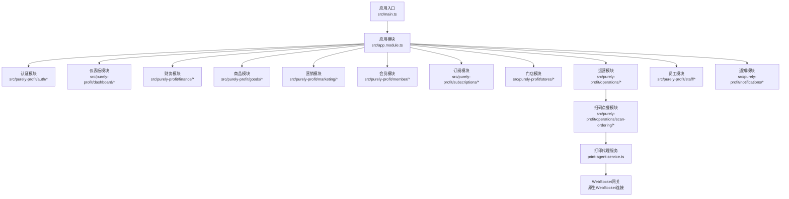

图表来源
- [src/main.ts](file://src/main.ts)
- [src/app.module.ts](file://src/app.module.ts)
- [src/purely-profit/operations/scan-ordering/scan-ordering.controller.ts](file://src/purely-profit/operations/scan-ordering/scan-ordering.controller.ts)
- [src/purely-profit/operations/scan-ordering/print-agent.service.ts](file://src/purely-profit/operations/scan-ordering/print-agent.service.ts)

章节来源
- [src/main.ts](file://src/main.ts)
- [src/app.module.ts](file://src/app.module.ts)

## 核心组件
- 应用入口与模块：负责启动服务、注册业务模块与中间件。
- 认证与权限：基于 JWT 的鉴权守卫与策略，配合权限装饰器与访问控制服务实现细粒度权限校验。
- DTO 层：统一定义请求/响应数据结构，确保接口契约清晰。
- 服务层：封装业务逻辑，提供查询、写入、映射与领域对象转换。
- 控制器层：暴露 RESTful 接口，调用服务层并返回标准化响应。

**更新** 扫码点餐模块现已支持完整的打印代理管理功能，包括绑定码生成、代理注册、在线状态监控和打印任务分发。

章节来源
- [src/app.controller.ts](file://src/app.controller.ts)
- [src/purely-profit/auth/auth.controller.ts](file://src/purely-profit/auth/auth.controller.ts)
- [src/purely-profit/access-control/access-control.service.ts](file://src/purely-profit/access-control/access-control.service.ts)

## 架构总览
系统采用分层架构与模块化组织，控制器负责路由与参数解析，服务层承载业务规则，DTO 层保证数据契约，权限守卫与装饰器贯穿请求链路以保障安全。

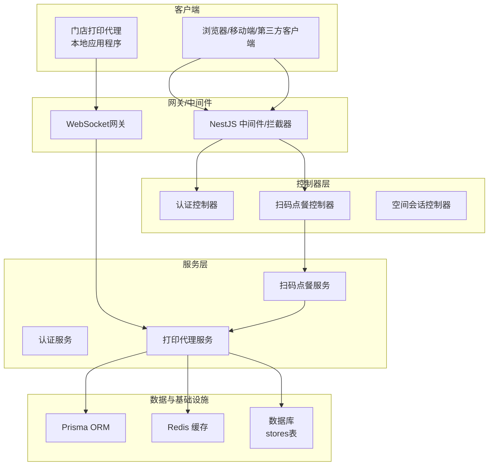

图表来源
- [src/purely-profit/auth/auth.controller.ts](file://src/purely-profit/auth/auth.controller.ts)
- [src/purely-profit/operations/scan-ordering/scan-ordering.controller.ts](file://src/purely-profit/operations/scan-ordering/scan-ordering.controller.ts)
- [src/purely-profit/operations/scan-ordering/print-agent.service.ts](file://src/purely-profit/operations/scan-ordering/print-agent.service.ts)

## 详细组件分析

### 认证与权限
- 鉴权方式：基于 JWT 的 Bearer Token，通过守卫与策略进行校验。
- 权限控制：通过权限装饰器与访问控制服务，结合用户能力集与资源权限进行授权。
- 子账号限制：提供子账号阻断装饰器，防止越权访问。

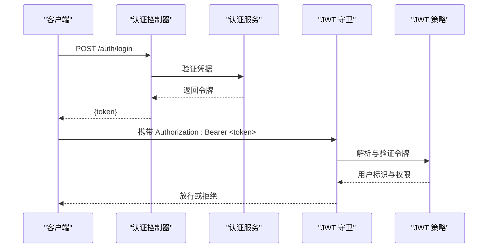

图表来源
- [src/purely-profit/auth/auth.controller.ts](file://src/purely-profit/auth/auth.controller.ts)
- [src/purely-profit/auth/auth.service.ts](file://src/purely-profit/auth/auth.service.ts)
- [src/purely-profit/auth/guards/jwt-auth.guard.ts](file://src/purely-profit/auth/guards/jwt-auth.guard.ts)
- [src/purely-profit/auth/strategies/jwt.strategy.ts](file://src/purely-profit/auth/strategies/jwt.strategy.ts)

章节来源
- [src/purely-profit/auth/auth.controller.ts](file://src/purely-profit/auth/auth.controller.ts)
- [src/purely-profit/auth/auth.service.ts](file://src/purely-profit/auth/auth.service.ts)
- [src/purely-profit/auth/guards/jwt-auth.guard.ts](file://src/purely-profit/auth/guards/jwt-auth.guard.ts)
- [src/purely-profit/auth/strategies/jwt.strategy.ts](file://src/purely-profit/auth/strategies/jwt.strategy.ts)
- [src/purely-profit/access-control/access-control.service.ts](file://src/purely-profit/access-control/access-control.service.ts)
- [src/purely-profit/access-control/guards/permissions.guard.ts](file://src/purely-profit/access-control/guards/permissions.guard.ts)
- [src/purely-profit/access-control/decorators/require-permissions.decorator.ts](file://src/purely-profit/access-control/decorators/require-permissions.decorator.ts)
- [src/purely-profit/access-control/decorators/block-sub-account.decorator.ts](file://src/purely-profit/access-control/decorators/block-sub-account.decorator.ts)

### 扫码点餐打印代理接口（已更新）
扫码点餐模块现已全面支持打印代理管理功能，涵盖绑定码生成、代理注册、状态监控等核心业务流程。

#### 支持的打印代理功能
系统支持以下打印代理相关操作：
- **绑定码生成** - 商家端生成6位绑定码供门店代理输入
- **代理注册** - 门店代理通过绑定码获取连接令牌
- **在线状态监控** - 实时查看代理连接状态和最后在线时间
- **打印机发现** - 自动发现本地可用打印机设备
- **打印任务分发** - 通过WebSocket向在线代理下发ESC/POS打印任务

#### 绑定码生成接口
生成/重置门店打印代理绑定码：
- `POST /profit/scan-ordering/print-agent/bind-code`
- 权限要求：`scan-ordering:order-process`
- 响应：返回6位大写字母数字绑定码

#### 代理状态查询接口
查询门店打印代理绑定与在线状态：
- `GET /profit/scan-ordering/print-agent/status`
- 权限要求：`scan-ordering:view`
- 响应包含：绑定码、在线状态、最后在线时间、可用打印机列表

#### 打印代理通信协议
- **WebSocket连接** - 使用原生WebSocket建立长连接
- **心跳机制** - 每30秒发送一次心跳保持连接
- **任务分发** - 通过Redis Pub/Sub实现跨worker任务转发
- **回执确认** - 打印任务完成后返回执行结果

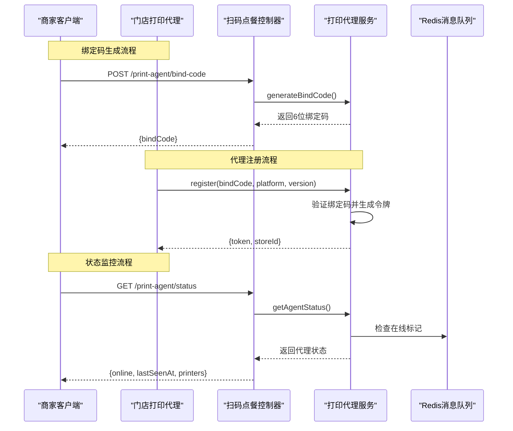

图表来源
- [src/purely-profit/operations/scan-ordering/scan-ordering.controller.ts](file://src/purely-profit/operations/scan-ordering/scan-ordering.controller.ts)
- [src/purely-profit/operations/scan-ordering/print-agent.service.ts](file://src/purely-profit/operations/scan-ordering/print-agent.service.ts)
- [src/purely-profit/operations/scan-ordering/dto/scan-ordering-print-agent.dto.ts](file://src/purely-profit/operations/scan-ordering/dto/scan-ordering-print-agent.dto.ts)

**章节来源**
- [src/purely-profit/operations/scan-ordering/scan-ordering.controller.ts](file://src/purely-profit/operations/scan-ordering/scan-ordering.controller.ts)
- [src/purely-profit/operations/scan-ordering/print-agent.service.ts](file://src/purely-profit/operations/scan-ordering/print-agent.service.ts)
- [src/purely-profit/operations/scan-ordering/dto/scan-ordering-print-agent.dto.ts](file://src/purely-profit/operations/scan-ordering/dto/scan-ordering-print-agent.dto.ts)

### 仪表板接口
- 仪表板首页：提供概览统计、销售趋势、活动等聚合数据。
- 业务分析：支持多维度分析与筛选。
- 利润明细：提供利润构成与明细查询。

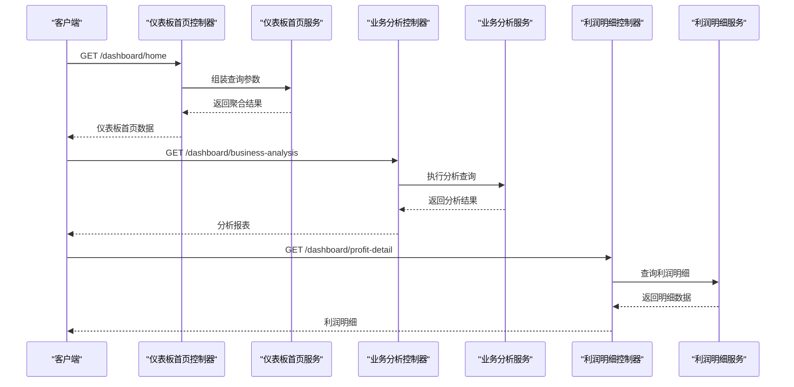

图表来源
- [src/purely-profit/dashboard/dashboard-home/dashboard-home.controller.ts](file://src/purely-profit/dashboard/dashboard-home/dashboard-home.controller.ts)
- [src/purely-profit/dashboard/dashboard-home/dashboard-home.service.ts](file://src/purely-profit/dashboard/dashboard-home/dashboard-home.service.ts)
- [src/purely-profit/dashboard/business-analysis/business-analysis.controller.ts](file://src/purely-profit/dashboard/business-analysis/business-analysis.controller.ts)
- [src/purely-profit/dashboard/business-analysis/business-analysis.service.ts](file://src/purely-profit/dashboard/business-analysis/business-analysis.service.ts)
- [src/purely-profit/dashboard/profit-detail/profit-detail.controller.ts](file://src/purely-profit/dashboard/profit-detail/profit-detail.controller.ts)
- [src/purely-profit/dashboard/profit-detail/profit-detail.service.ts](file://src/purely-profit/dashboard/profit-detail/profit-detail.service.ts)

章节来源
- [src/purely-profit/dashboard/dashboard-home/dashboard-home.controller.ts](file://src/purely-profit/dashboard/dashboard-home/dashboard-home.controller.ts)
- [src/purely-profit/dashboard/dashboard-home/dashboard-home.service.ts](file://src/purely-profit/dashboard/dashboard-home/dashboard-home.service.ts)
- [src/purely-profit/dashboard/business-analysis/business-analysis.controller.ts](file://src/purely-profit/dashboard/business-analysis/business-analysis.controller.ts)
- [src/purely-profit/dashboard/business-analysis/business-analysis.service.ts](file://src/purely-profit/dashboard/business-analysis/business-analysis.service.ts)
- [src/purely-profit/dashboard/profit-detail/profit-detail.controller.ts](file://src/purely-profit/dashboard/profit-detail/profit-detail.controller.ts)
- [src/purely-profit/dashboard/profit-detail/profit-detail.service.ts](file://src/purely-profit/dashboard/profit-detail/profit-detail.service.ts)

### 财务接口
- 账户管理：查询账户列表与详情。
- 现金流：查询现金流明细。
- 对账单：执行对账与查询。
- 概览：提供财务概览报表。
- 报表：导出与查询各类财务报表。

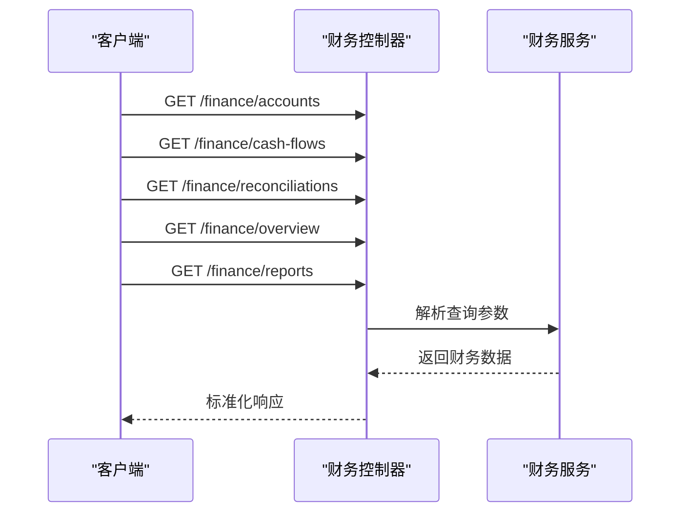

图表来源
- [src/purely-profit/finance/finance.controller.ts](file://src/purely-profit/finance/finance.controller.ts)
- [src/purely-profit/finance/finance.service.ts](file://src/purely-profit/finance/finance.service.ts)

章节来源
- [src/purely-profit/finance/finance.controller.ts](file://src/purely-profit/finance/finance.controller.ts)
- [src/purely-profit/finance/finance.service.ts](file://src/purely-profit/finance/finance.service.ts)
- [src/purely-profit/finance/dto/finance-response.dto.ts](file://src/purely-profit/finance/dto/finance-response.dto.ts)
- [src/purely-profit/finance/dto/finance-query.dto.ts](file://src/purely-profit/finance/dto/finance-query.dto.ts)
- [src/purely-profit/finance/dto/finance-overview.response.dto.ts](file://src/purely-profit/finance/dto/finance-overview.response.dto.ts)
- [src/purely-profit/finance/dto/finance-account.response.dto.ts](file://src/purely-profit/finance/dto/finance-account.response.dto.ts)
- [src/purely-profit/finance/dto/finance-cash-flow.response.dto.ts](file://src/purely-profit/finance/dto/finance-cash-flow.response.dto.ts)
- [src/purely-profit/finance/dto/finance-reconciliation.response.dto.ts](file://src/purely-profit/finance/dto/finance-reconciliation.response.dto.ts)
- [src/purely-profit/finance/dto/finance-report.response.dto.ts](file://src/purely-profit/finance/dto/finance-report.response.dto.ts)
- [src/purely-profit/finance/dto/finance-account.query.dto.ts](file://src/purely-profit/finance/dto/finance-account.query.dto.ts)
- [src/purely-profit/finance/dto/finance-cash-flow.query.dto.ts](file://src/purely-profit/finance/dto/finance-cash-flow.query.dto.ts)
- [src/purely-profit/finance/dto/finance-reconciliation.query.dto.ts](file://src/purely-profit/finance/dto/finance-reconciliation.query.dto.ts)
- [src/purely-profit/finance/dto/finance-overview.query.dto.ts](file://src/purely-profit/finance/dto/finance-overview.query.dto.ts)

### 商品接口
- 商品：查询与管理商品。
- 库存：查询库存与盘点。
- 分类：查询与管理分类。

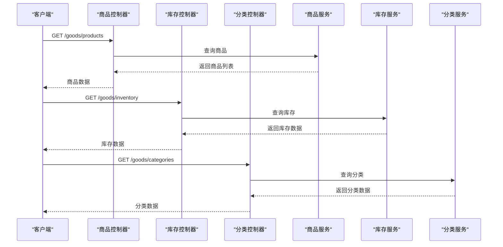

图表来源
- [src/purely-profit/goods/products/products.controller.ts](file://src/purely-profit/goods/products/products.controller.ts)
- [src/purely-profit/goods/products/products.service.ts](file://src/purely-profit/goods/products/products.service.ts)
- [src/purely-profit/goods/inventory/inventory.controller.ts](file://src/purely-profit/goods/inventory/inventory.controller.ts)
- [src/purely-profit/goods/inventory/inventory.service.ts](file://src/purely-profit/goods/inventory/inventory.service.ts)
- [src/purely-profit/goods/categories/categories.controller.ts](file://src/purely-profit/goods/categories/categories.controller.ts)
- [src/purely-profit/goods/categories/categories.service.ts](file://src/purely-profit/goods/categories/categories.service.ts)

章节来源
- [src/purely-profit/goods/products/products.controller.ts](file://src/purely-profit/goods/products/products.controller.ts)
- [src/purely-profit/goods/products/products.service.ts](file://src/purely-profit/goods/products/products.service.ts)
- [src/purely-profit/goods/inventory/inventory.controller.ts](file://src/purely-profit/goods/inventory/inventory.controller.ts)
- [src/purely-profit/goods/inventory/inventory.service.ts](file://src/purely-profit/goods/inventory/inventory.service.ts)
- [src/purely-profit/goods/categories/categories.controller.ts](file://src/purely-profit/goods/categories/categories.controller.ts)
- [src/purely-profit/goods/categories/categories.service.ts](file://src/purely-profit/goods/categories/categories.service.ts)
- [src/purely-profit/goods/products/dto/products-query.dto.ts](file://src/purely-profit/goods/products/dto/products-query.dto.ts)
- [src/purely-profit/goods/inventory/dto/inventory-query.dto.ts](file://src/purely-profit/goods/inventory/dto/inventory-query.dto.ts)
- [src/purely-profit/goods/categories/dto/categories-query.dto.ts](file://src/purely-profit/goods/categories/dto/categories-query.dto.ts)

### 营销接口
- 营销总览：提供营销指标概览。
- 客户：查询客户与消费记录。
- 商品：查询营销商品。
- 促销：查询促销活动。
- 交易：查询交易流水。
- 积分与充值：查询积分记录与充值记录。

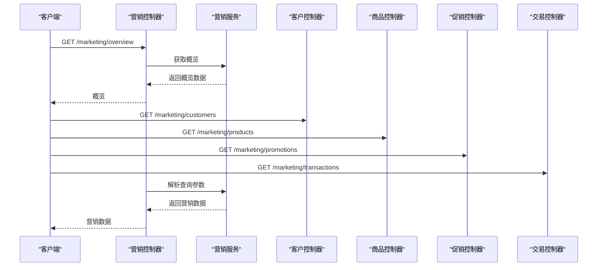

图表来源
- [src/purely-profit/marketing/marketing.controller.ts](file://src/purely-profit/marketing/marketing.controller.ts)
- [src/purely-profit/marketing/marketing.service.ts](file://src/purely-profit/marketing/marketing.service.ts)
- [src/purely-profit/marketing/marketing-customers.controller.ts](file://src/purely-profit/marketing/marketing-customers.controller.ts)
- [src/purely-profit/marketing/marketing-overview.controller.ts](file://src/purely-profit/marketing/marketing-overview.controller.ts)
- [src/purely-profit/marketing/marketing-products.controller.ts](file://src/purely-profit/marketing/marketing-products.controller.ts)
- [src/purely-profit/marketing/marketing-promotions.controller.ts](file://src/purely-profit/marketing/marketing-promotions.controller.ts)
- [src/purely-profit/marketing/marketing-transactions.controller.ts](file://src/purely-profit/marketing/marketing-transactions.controller.ts)

章节来源
- [src/purely-profit/marketing/marketing.controller.ts](file://src/purely-profit/marketing/marketing.controller.ts)
- [src/purely-profit/marketing/marketing.service.ts](file://src/purely-profit/marketing/marketing.service.ts)
- [src/purely-profit/marketing/dto/marketing-query.dto.ts](file://src/purely-profit/marketing/dto/marketing-query.dto.ts)
- [src/purely-profit/marketing/dto/marketing-pagination-query.dto.ts](file://src/purely-profit/marketing/dto/marketing-pagination-query.dto.ts)
- [src/purely-profit/marketing/dto/marketing-consumption-query.dto.ts](file://src/purely-profit/marketing/dto/marketing-consumption-query.dto.ts)
- [src/purely-profit/marketing/dto/marketing-customer-query.dto.ts](file://src/purely-profit/marketing/dto/marketing-customer-query.dto.ts)
- [src/purely-profit/marketing/dto/marketing-product.dto.ts](file://src/purely-profit/marketing/dto/marketing-product.dto.ts)
- [src/purely-profit/marketing/dto/marketing-promotion-query.dto.ts](file://src/purely-profit/marketing/dto/marketing-promotion-query.dto.ts)
- [src/purely-profit/marketing/dto/marketing-recharge-query.dto.ts](file://src/purely-profit/marketing/dto/marketing-recharge-query.dto.ts)
- [src/purely-profit/marketing/dto/marketing-response.dto.ts](file://src/purely-profit/marketing/dto/marketing-response.dto.ts)

### 会员接口
- 会员：查询与管理会员信息。
- 平台会员：查询平台会员配置、订单、合作伙伴、促销等。
- 积分与充值：查询积分记录与充值记录。
- 合伙人审核：审核与查看合作伙伴申请状态。

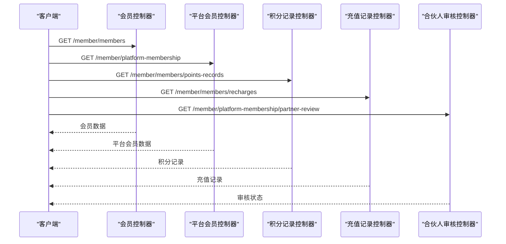

图表来源
- [src/purely-profit/member/members/members.controller.ts](file://src/purely-profit/member/members/members.controller.ts)
- [src/purely-profit/member/members/members.service.ts](file://src/purely-profit/member/members/members.service.ts)
- [src/purely-profit/member/platform-membership/platform-membership.controller.ts](file://src/purely-profit/member/platform-membership/platform-membership.controller.ts)
- [src/purely-profit/member/platform-membership/platform-membership.service.ts](file://src/purely-profit/member/platform-membership/platform-membership.service.ts)
- [src/purely-profit/member/platform-membership/partner-review.controller.ts](file://src/purely-profit/member/platform-membership/partner-review.controller.ts)
- [src/purely-profit/member/platform-membership/promotion-detail-compat.controller.ts](file://src/purely-profit/member/platform-membership/promotion-detail-compat.controller.ts)

章节来源
- [src/purely-profit/member/members/members.controller.ts](file://src/purely-profit/member/members/members.controller.ts)
- [src/purely-profit/member/members/members.service.ts](file://src/purely-profit/member/members/members.service.ts)
- [src/purely-profit/member/platform-membership/platform-membership.controller.ts](file://src/purely-profit/member/platform-membership/platform-membership.controller.ts)
- [src/purely-profit/member/platform-membership/platform-membership.service.ts](file://src/purely-profit/member/platform-membership/platform-membership.service.ts)
- [src/purely-profit/member/platform-membership/partner-review.controller.ts](file://src/purely-profit/member/platform-membership/partner-review.controller.ts)
- [src/purely-profit/member/platform-membership/promotion-detail-compat.controller.ts](file://src/purely-profit/member/platform-membership/promotion-detail-compat.controller.ts)
- [src/purely-profit/member/members/dto/members-query.dto.ts](file://src/purely-profit/member/members/dto/members-query.dto.ts)
- [src/purely-profit/member/members/dto/members-create.dto.ts](file://src/purely-profit/member/members/dto/members-create.dto.ts)
- [src/purely-profit/member/members/dto/members-update.dto.ts](file://src/purely-profit/member/members/dto/members-update.dto.ts)
- [src/purely-profit/member/members/dto/members-response.dto.ts](file://src/purely-profit/member/members/dto/members-response.dto.ts)

### 订阅接口
- 订阅：查询与管理订阅信息。

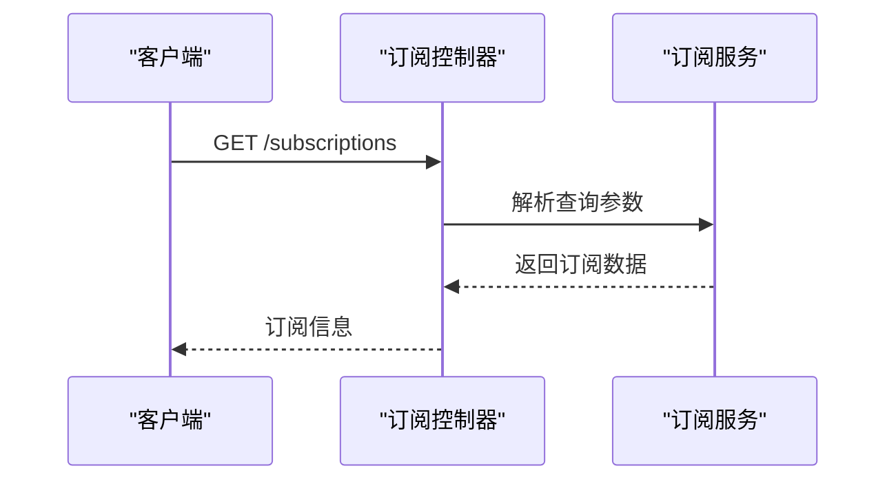

图表来源
- [src/purely-profit/subscriptions/subscriptions.controller.ts](file://src/purely-profit/subscriptions/subscriptions.controller.ts)
- [src/purely-profit/subscriptions/subscriptions.service.ts](file://src/purely-profit/subscriptions/subscriptions.service.ts)

章节来源
- [src/purely-profit/subscriptions/subscriptions.controller.ts](file://src/purely-profit/subscriptions/subscriptions.controller.ts)
- [src/purely-profit/subscriptions/subscriptions.service.ts](file://src/purely-profit/subscriptions/subscriptions.service.ts)
- [src/purely-profit/subscriptions/dto/subscriptions-query.dto.ts](file://src/purely-profit/subscriptions/dto/subscriptions-query.dto.ts)
- [src/purely-profit/subscriptions/dto/subscriptions-response.dto.ts](file://src/purely-profit/subscriptions/dto/subscriptions-response.dto.ts)

### 门店接口
- 门店：查询与管理门店信息。

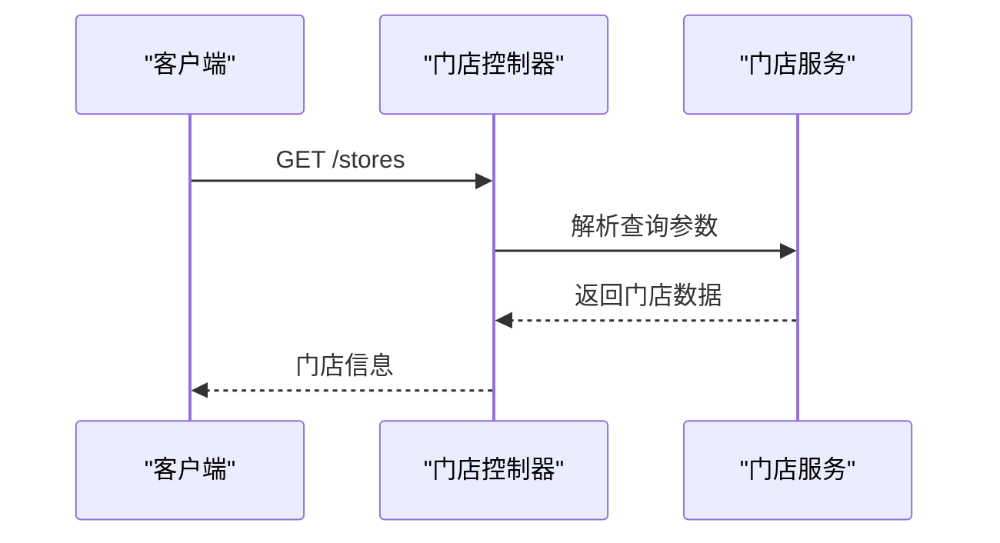

图表来源
- [src/purely-profit/stores/stores.controller.ts](file://src/purely-profit/stores/stores.controller.ts)
- [src/purely-profit/stores/stores.service.ts](file://src/purely-profit/stores/stores.service.ts)

章节来源
- [src/purely-profit/stores/stores.controller.ts](file://src/purely-profit/stores/stores.controller.ts)
- [src/purely-profit/stores/stores.service.ts](file://src/purely-profit/stores/stores.service.ts)
- [src/purely-profit/stores/dto/stores-query.dto.ts](file://src/purely-profit/stores/dto/stores-query.dto.ts)
- [src/purely-profit/stores/dto/stores-response.dto.ts](file://src/purely-profit/stores/dto/stores-response.dto.ts)

### 运营接口
- 销售记录：查询销售明细。
- 交接：查询交接记录与确认。
- 空间：查询空间与预约。
- 员工：查询员工信息。
- 座位：查询座位信息。

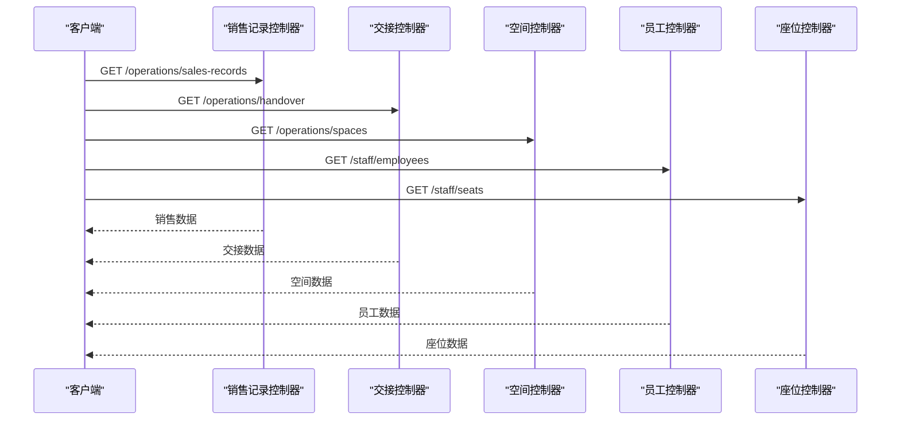

图表来源
- [src/purely-profit/operations/sales-record/sales-record.controller.ts](file://src/purely-profit/operations/sales-record/sales-record.controller.ts)
- [src/purely-profit/operations/sales-record/sales-record.service.ts](file://src/purely-profit/operations/sales-record/sales-record.service.ts)
- [src/purely-profit/operations/handover/handover.controller.ts](file://src/purely-profit/operations/handover/handover.controller.ts)
- [src/purely-profit/operations/handover/handover.service.ts](file://src/purely-profit/operations/handover/handover.service.ts)
- [src/purely-profit/operations/spaces/spaces.controller.ts](file://src/purely-profit/operations/spaces/spaces.controller.ts)
- [src/purely-profit/operations/spaces/spaces.service.ts](file://src/purely-profit/operations/spaces/spaces.service.ts)
- [src/purely-profit/staff/employees/employees.controller.ts](file://src/purely-profit/staff/employees/employees.controller.ts)
- [src/purely-profit/staff/employees/employees.service.ts](file://src/purely-profit/staff/employees/employees.service.ts)
- [src/purely-profit/staff/seats/seats.controller.ts](file://src/purely-profit/staff/seats/seats.controller.ts)
- [src/purely-profit/staff/seats/seats.service.ts](file://src/purely-profit/staff/seats/seats.service.ts)

章节来源
- [src/purely-profit/operations/sales-record/sales-record.controller.ts](file://src/purely-profit/operations/sales-record/sales-record.controller.ts)
- [src/purely-profit/operations/sales-record/sales-record.service.ts](file://src/purely-profit/operations/sales-record/sales-record.service.ts)
- [src/purely-profit/operations/handover/handover.controller.ts](file://src/purely-profit/operations/handover/handover.controller.ts)
- [src/purely-profit/operations/handover/handover.service.ts](file://src/purely-profit/operations/handover/handover.service.ts)
- [src/purely-profit/operations/spaces/spaces.controller.ts](file://src/purely-profit/operations/spaces/spaces.controller.ts)
- [src/purely-profit/operations/spaces/spaces.service.ts](file://src/purely-profit/operations/spaces/spaces.service.ts)
- [src/purely-profit/staff/employees/employees.controller.ts](file://src/purely-profit/staff/employees/employees.controller.ts)
- [src/purely-profit/staff/employees/employees.service.ts](file://src/purely-profit/staff/employees/employees.service.ts)
- [src/purely-profit/staff/seats/seats.controller.ts](file://src/purely-profit/staff/seats/seats.controller.ts)
- [src/purely-profit/staff/seats/seats.service.ts](file://src/purely-profit/staff/seats/seats.service.ts)
- [src/purely-profit/operations/sales-record/dto/sales-record-query.dto.ts](file://src/purely-profit/operations/sales-record/dto/sales-record-query.dto.ts)
- [src/purely-profit/operations/handover/dto/handover-query.dto.ts](file://src/purely-profit/operations/handover/dto/handover-query.dto.ts)
- [src/purely-profit/operations/spaces/dto/spaces-query.dto.ts](file://src/purely-profit/operations/spaces/dto/spaces-query.dto.ts)
- [src/purely-profit/staff/employees/dto/employees-query.dto.ts](file://src/purely-profit/staff/employees/dto/employees-query.dto.ts)
- [src/purely-profit/staff/seats/dto/seats-query.dto.ts](file://src/purely-profit/staff/seats/dto/seats-query.dto.ts)

### 通知接口
- 通知：查询与标记已读。

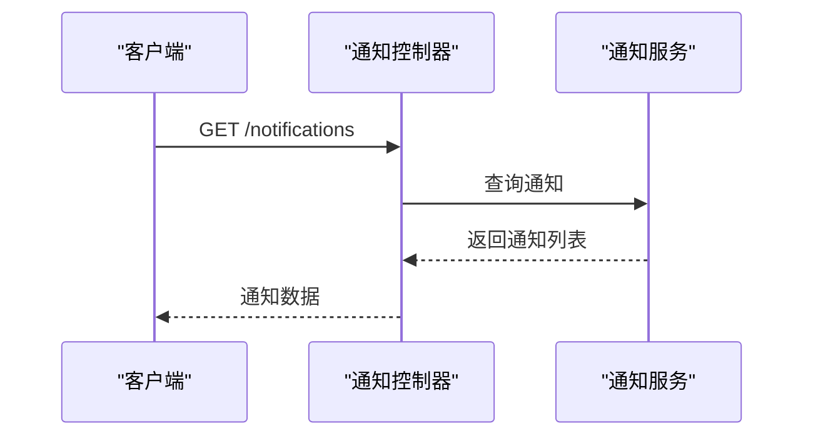

图表来源
- [src/purely-profit/notifications/notifications.controller.ts](file://src/purely-profit/notifications/notifications.controller.ts)
- [src/purely-profit/notifications/notifications.service.ts](file://src/purely-profit/notifications/notifications.service.ts)

章节来源
- [src/purely-profit/notifications/notifications.controller.ts](file://src/purely-profit/notifications/notifications.controller.ts)
- [src/purely-profit/notifications/notifications.service.ts](file://src/purely-profit/notifications/notifications.service.ts)
- [src/purely-profit/notifications/dto/notifications.dto.ts](file://src/purely-profit/notifications/dto/notifications.dto.ts)

## 依赖关系分析
- 控制器依赖服务层，服务层依赖领域对象与查询对象。
- 权限装饰器与守卫贯穿控制器，确保访问控制。
- DTO 层作为接口契约，避免控制器直接操作实体。
- 访问控制服务与各模块的访问服务协作，实现细粒度权限。

**更新** 扫码点餐模块现在依赖打印代理服务，支持本地USB打印和云端打印代理两种模式。

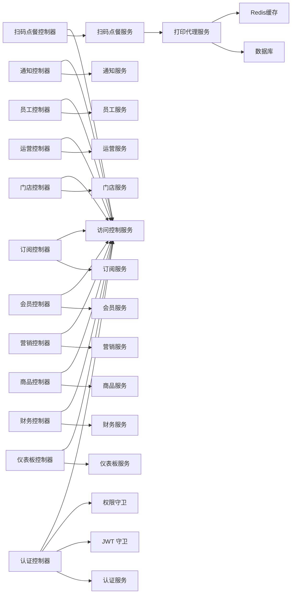

图表来源
- [src/purely-profit/auth/auth.controller.ts](file://src/purely-profit/auth/auth.controller.ts)
- [src/purely-profit/access-control/access-control.service.ts](file://src/purely-profit/access-control/access-control.service.ts)
- [src/purely-profit/access-control/guards/permissions.guard.ts](file://src/purely-profit/access-control/guards/permissions.guard.ts)
- [src/purely-profit/auth/guards/jwt-auth.guard.ts](file://src/purely-profit/auth/guards/jwt-auth.guard.ts)
- [src/purely-profit/operations/scan-ordering/scan-ordering.controller.ts](file://src/purely-profit/operations/scan-ordering/scan-ordering.controller.ts)
- [src/purely-profit/operations/scan-ordering/print-agent.service.ts](file://src/purely-profit/operations/scan-ordering/print-agent.service.ts)

章节来源
- [src/purely-profit/access-control/access-control.service.ts](file://src/purely-profit/access-control/access-control.service.ts)
- [src/purely-profit/access-control/guards/permissions.guard.ts](file://src/purely-profit/access-control/guards/permissions.guard.ts)

## 性能考量
- 缓存预热与失效：通过缓存预热服务与键空间管理，减少热点查询延迟。
- 分页与索引：合理使用分页查询与数据库索引，避免大结果集扫描。
- 查询优化：在服务层合并与去重查询，减少 N+1 查询风险。
- 异步处理：对耗时任务采用异步队列或后台作业，避免阻塞请求。
- 监控与告警：结合运行时指标与摘要指标，建立性能基线与异常告警。
- **打印代理优化** - 使用Redis Pub/Sub实现跨worker任务转发，支持集群部署；心跳机制确保连接健康；TTL过期自动清理离线连接。

## 故障排查指南
- 认证失败：检查令牌格式与有效期，确认 JWT 策略是否正确解析。
- 权限不足：核对用户能力集与资源权限，确认权限装饰器是否生效。
- 查询异常：检查查询 DTO 参数合法性与数据库索引，定位慢查询。
- 缓存问题：确认缓存键命名与失效策略，排查缓存穿透与雪崩。
- 服务异常：查看服务层日志与事务回滚情况，定位业务异常点。
- **打印代理故障** - 检查绑定码有效性、代理连接状态、Redis在线标记、WebSocket连接质量。

## 结论
本接口文档梳理了 purelyprofit-server 的核心 RESTful API，涵盖认证、权限、仪表板、财务、商品、营销、会员、订阅、门店、运营、通知等模块。通过 DTO 契约、权限守卫与访问控制服务，系统实现了高内聚低耦合的接口设计。**本次更新特别增强了扫码点餐模块的打印代理管理能力，为门店提供了灵活的本地打印解决方案。** 建议在生产环境中结合缓存、分页、索引与监控体系，持续优化性能与稳定性。

## 附录
- 版本信息：当前仓库包含多个迁移脚本与领域模型，接口版本与迁移脚本保持一致，建议客户端在升级前同步迁移脚本。
- 已弃用功能：部分兼容控制器（如平台会员促销兼容）保留历史接口，建议逐步迁移至新接口。
- 向后兼容性：新增字段采用可选策略，删除字段需通过兼容层或版本化接口过渡。
- **打印代理支持** - 新增的打印代理功能完全向后兼容，现有客户端无需修改即可继续使用。

**更新** 打印代理功能的完整支持使得系统能够更好地服务于需要本地打印机设备的商业场景，支持Windows、macOS、Linux等多平台部署。