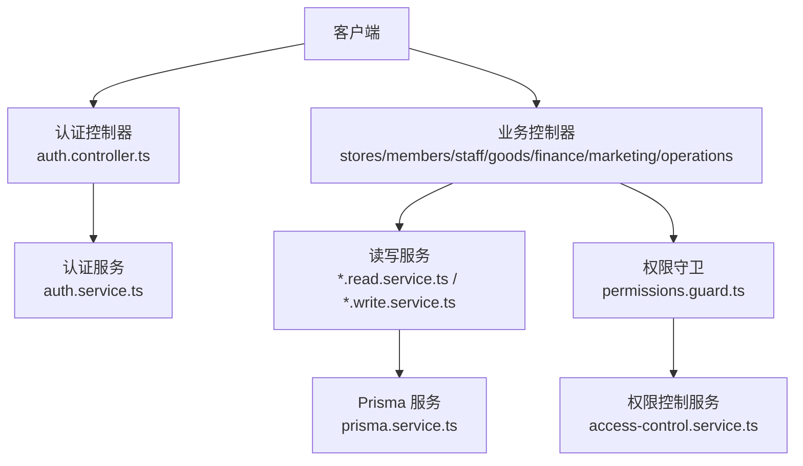
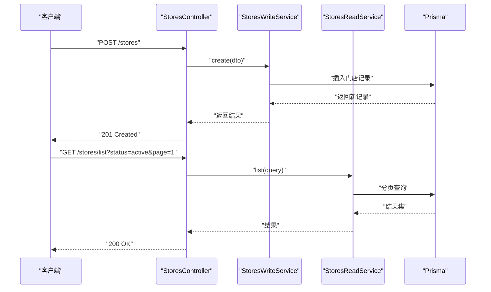
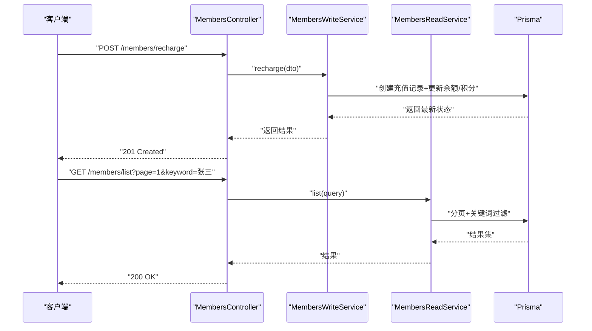
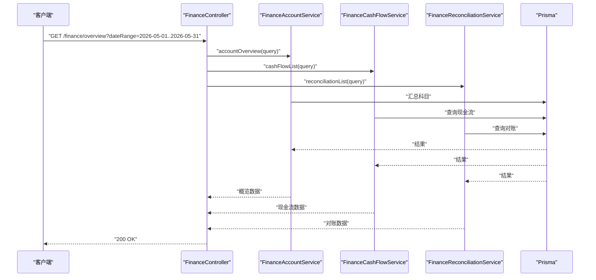
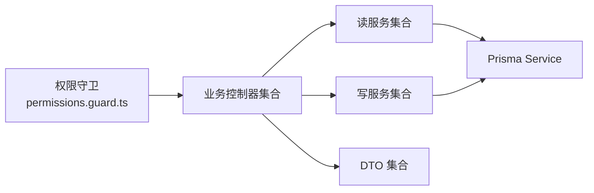

# 业务模块接口

<cite>
**本文引用的文件**
- [src/app.module.ts](file://src/app.module.ts)
- [src/app.controller.ts](file://src/app.controller.ts)
- [prisma/schema.prisma](file://prisma/schema.prisma)
- [src/purely-profit/stores/stores.controller.ts](file://src/purely-profit/stores/stores.controller.ts)
- [src/purely-profit/stores/stores.service.ts](file://src/purely-profit/stores/stores.service.ts)
- [src/purely-profit/stores/stores.types.ts](file://src/purely-profit/stores/stores.types.ts)
- [src/purely-profit/member/members/members.controller.ts](file://src/purely-profit/member/members/members.controller.ts)
- [src/purely-profit/member/members/members.service.ts](file://src/purely-profit/member/members/members.service.ts)
- [src/purely-profit/member/members/members.types.ts](file://src/purely-profit/member/members/members.types.ts)
- [src/purely-profit/staff/employees/employees.controller.ts](file://src/purely-profit/staff/employees/employees.controller.ts)
- [src/purely-profit/staff/employees/employees.service.ts](file://src/purely-profit/staff/employees/employees.service.ts)
- [src/purely-profit/staff/employees/employees.types.ts](file://src/purely-profit/staff/employees/employees.types.ts)
- [src/purely-profit/goods/products/products.controller.ts](file://src/purely-profit/goods/products/products.controller.ts)
- [src/purely-profit/goods/products/products.service.ts](file://src/purely-profit/goods/products/products.service.ts)
- [src/purely-profit/goods/products/products.types.ts](file://src/purely-profit/goods/products/products.types.ts)
- [src/purely-profit/goods/inventory/inventory.controller.ts](file://src/purely-profit/goods/inventory/inventory.controller.ts)
- [src/purely-profit/goods/inventory/inventory.service.ts](file://src/purely-profit/goods/inventory/inventory.service.ts)
- [src/purely-profit/goods/inventory/inventory.types.ts](file://src/purely-profit/goods/inventory/inventory.types.ts)
- [src/purely-profit/finance/finance.controller.ts](file://src/purely-profit/finance/finance.controller.ts)
- [src/purely-profit/finance/finance.service.ts](file://src/purely-profit/finance/finance.service.ts)
- [src/purely-profit/finance/finance.types.ts](file://src/purely-profit/finance/finance.types.ts)
- [src/purely-profit/marketing/marketing.controller.ts](file://src/purely-profit/marketing/marketing.controller.ts)
- [src/purely-profit/marketing/marketing.service.ts](file://src/purely-profit/marketing/marketing.service.ts)
- [src/purely-profit/marketing/marketing.types.ts](file://src/purely-profit/marketing/marketing.types.ts)
- [src/purely-profit/operations/sales-record/sales-record.controller.ts](file://src/purely-profit/operations/sales-record/sales-record.controller.ts)
- [src/purely-profit/operations/sales-record/sales-record.service.ts](file://src/purely-profit/operations/sales-record/sales-record.service.ts)
- [src/purely-profit/operations/sales-record/sales-record.types.ts](file://src/purely-profit/operations/sales-record/sales-record.types.ts)
- [src/purely-profit/operations/handover/handover.controller.ts](file://src/purely-profit/operations/handover/handover.controller.ts)
- [src/purely-profit/operations/handover/handover.service.ts](file://src/purely-profit/operations/handover/handover.service.ts)
- [src/purely-profit/operations/handover/handover.types.ts](file://src/purely-profit/operations/handover/handover.types.ts)
- [src/purely-profit/operations/costs/costs.controller.ts](file://src/purely-profit/operations/costs/costs.controller.ts)
- [src/purely-profit/operations/costs/costs.service.ts](file://src/purely-profit/operations/costs/costs.service.ts)
- [src/purely-profit/operations/costs/costs.types.ts](file://src/purely-profit/operations/costs/costs.types.ts)
- [src/purely-profit/member/platform-membership/platform-membership.controller.ts](file://src/purely-profit/member/platform-membership/platform-membership.controller.ts)
- [src/purely-profit/member/platform-membership/platform-membership.service.ts](file://src/purely-profit/member/platform-membership/platform-membership.service.ts)
- [src/purely-profit/member/platform-membership/platform-membership.types.ts](file://src/purely-profit/member/platform-membership/platform-membership.types.ts)
- [src/purely-profit/member/withdrawals/withdrawals.controller.ts](file://src/purely-profit/member/withdrawals/withdrawals.controller.ts)
- [src/purely-profit/member/withdrawals/withdrawals.service.ts](file://src/purely-profit/member/withdrawals/withdrawals.service.ts)
- [src/purely-profit/member/withdrawals/withdrawals.types.ts](file://src/purely-profit/member/withdrawals/withdrawals.types.ts)
- [src/purely-profit/finance/finance-account.service.ts](file://src/purely-profit/finance/finance-account.service.ts)
- [src/purely-profit/finance/finance-cash-flow.service.ts](file://src/purely-profit/finance/finance-cash-flow.service.ts)
- [src/purely-profit/finance/finance-reconciliation.service.ts](file://src/purely-profit/finance/finance-reconciliation.service.ts)
- [src/purely-profit/marketing/marketing-customers.controller.ts](file://src/purely-profit/marketing/marketing-customers.controller.ts)
- [src/purely-profit/marketing/marketing-products.controller.ts](file://src/purely-profit/marketing/marketing-products.controller.ts)
- [src/purely-profit/marketing/marketing-promotions.controller.ts](file://src/purely-profit/marketing/marketing-promotions.controller.ts)
- [src/purely-profit/marketing/marketing-transactions.controller.ts](file://src/purely-profit/marketing/marketing-transactions.controller.ts)
- [src/purely-profit/marketing/marketing-overview.controller.ts](file://src/purely-profit/marketing/marketing-overview.controller.ts)
- [src/purely-profit/marketing/marketing-product-categories.controller.ts](file://src/purely-profit/marketing/marketing-product-categories.controller.ts)
- [src/purely-profit/operations/spaces/spaces.controller.ts](file://src/purely-profit/operations/spaces/spaces.controller.ts)
- [src/purely-profit/operations/spaces/spaces.service.ts](file://src/purely-profit/operations/spaces/spaces.service.ts)
- [src/purely-profit/operations/spaces/spaces.types.ts](file://src/purely-profit/operations/spaces/spaces.types.ts)
- [src/purely-profit/operations/purchases/purchases.controller.ts](file://src/purely-profit/operations/purchases/purchases.controller.ts)
- [src/purely-profit/operations/purchases/purchases.service.ts](file://src/purely-profit/operations/purchases/purchases.service.ts)
- [src/purely-profit/operations/purchases/purchases.types.ts](file://src/purely-profit/operations/purchases/purchases.types.ts)
- [src/purely-profit/stores/stores-read.service.ts](file://src/purely-profit/stores/stores-read.service.ts)
- [src/purely-profit/stores/stores-write.service.ts](file://src/purely-profit/stores/stores-write.service.ts)
- [src/purely-profit/member/members/members-read.service.ts](file://src/purely-profit/member/members/members-read.service.ts)
- [src/purely-profit/member/members/members-write.service.ts](file://src/purely-profit/member/members/members-write.service.ts)
- [src/purely-profit/staff/employees/employees-read.service.ts](file://src/purely-profit/staff/employees/employees-read.service.ts)
- [src/purely-profit/staff/employees/employees-write.service.ts](file://src/purely-profit/staff/employees/employees-write.service.ts)
- [src/purely-profit/goods/products/products-read.service.ts](file://src/purely-profit/goods/products/products-read.service.ts)
- [src/purely-profit/goods/products/products-write.service.ts](file://src/purely-profit/goods/products/products-write.service.ts)
- [src/purely-profit/goods/inventory/inventory-read.service.ts](file://src/purely-profit/goods/inventory/inventory-read.service.ts)
- [src/purely-profit/goods/inventory/inventory-write.service.ts](file://src/purely-profit/goods/inventory/inventory-write.service.ts)
- [src/purely-profit/finance/finance-account-read.service.ts](file://src/purely-profit/finance/finance-account-read.service.ts)
- [src/purely-profit/finance/finance-account-write.service.ts](file://src/purely-profit/finance/finance-account-write.service.ts)
- [src/purely-profit/marketing/marketing-customers-read.service.ts](file://src/purely-profit/marketing/marketing-customers-read.service.ts)
- [src/purely-profit/marketing/marketing-customers-write.service.ts](file://src/purely-profit/marketing/marketing-customers-write.service.ts)
- [src/purely-profit/marketing/marketing-products-read.service.ts](file://src/purely-profit/marketing/marketing-products-read.service.ts)
- [src/purely-profit/marketing/marketing-products-write.service.ts](file://src/purely-profit/marketing/marketing-products-write.service.ts)
- [src/purely-profit/marketing/marketing-promotions-read.service.ts](file://src/purely-profit/marketing/marketing-promotions-read.service.ts)
- [src/purely-profit/marketing/marketing-promotions-write.service.ts](file://src/purely-profit/marketing/marketing-promotions-write.service.ts)
- [src/purely-profit/operations/sales-record/sales-record-read.service.ts](file://src/purely-profit/operations/sales-record/sales-record-read.service.ts)
- [src/purely-profit/operations/sales-record/sales-record-write.service.ts](file://src/purely-profit/operations/sales-record/sales-record-write.service.ts)
- [src/purely-profit/operations/costs/costs-read.service.ts](file://src/purely-profit/operations/costs/costs-read.service.ts)
- [src/purely-profit/operations/costs/costs-write.service.ts](file://src/purely-profit/operations/costs/costs-write.service.ts)
- [src/purely-profit/operations/handover/handover-read.service.ts](file://src/purely-profit/operations/handover/handover-read.service.ts)
- [src/purely-profit/operations/handover/handover-write.service.ts](file://src/purely-profit/operations/handover/handover-write.service.ts)
- [src/purely-profit/operations/spaces/spaces-read.service.ts](file://src/purely-profit/operations/spaces/spaces-read.service.ts)
- [src/purely-profit/operations/spaces/spaces-write.service.ts](file://src/purely-profit/operations/spaces/spaces-write.service.ts)
- [src/purely-profit/operations/purchases/purchases-read.service.ts](file://src/purely-profit/operations/purchases/purchases-read.service.ts)
- [src/purely-profit/operations/purchases/purchases-write.service.ts](file://src/purely-profit/operations/purchases/purchases-write.service.ts)
- [src/purely-profit/member/platform-membership/store-sub-account.service.ts](file://src/purely-profit/member/platform-membership/store-sub-account.service.ts)
- [src/purely-profit/member/platform-membership/store-sub-account.types.ts](file://src/purely-profit/member/platform-membership/store-sub-account.types.ts)
- [src/purely-profit/access-control/access-control.service.ts](file://src/purely-profit/access-control/access-control.service.ts)
- [src/purely-profit/access-control/subject-capability.service.ts](file://src/purely-profit/access-control/subject-capability.service.ts)
- [src/purely-profit/access-control/guards/permissions.guard.ts](file://src/purely-profit/access-control/guards/permissions.guard.ts)
- [src/purely-profit/access-control/decorators/require-permissions.decorator.ts](file://src/purely-profit/access-control/decorators/require-permissions.decorator.ts)
- [src/purely-profit/access-control/decorators/block-sub-account.decorator.ts](file://src/purely-profit/access-control/decorators/block-sub-account.decorator.ts)
- [src/purely-profit/auth/current-user.decorator.ts](file://src/purely-profit/auth/current-user.decorator.ts)
- [src/purely-profit/auth/guards/jwt-auth.guard.ts](file://src/purely-profit/auth/guards/jwt-auth.guard.ts)
- [src/purely-profit/auth/strategies/jwt.strategy.ts](file://src/purely-profit/auth/strategies/jwt.strategy.ts)
- [src/purely-profit/auth/auth.controller.ts](file://src/purely-profit/auth/auth.controller.ts)
- [src/purely-profit/auth/auth.service.ts](file://src/purely-profit/auth/auth.service.ts)
- [src/purely-profit/auth/auth-capability.service.ts](file://src/purely-profit/auth/auth-capability.service.ts)
- [src/purely-profit/auth/auth-profile.service.ts](file://src/purely-profit/auth/auth-profile.service.ts)
- [src/purely-profit/auth/auth-account.service.ts](file://src/purely-profit/auth/auth-account.service.ts)
- [src/purely-profit/auth/auth-session.service.ts](file://src/purely-profit/auth/auth-session.service.ts)
- [src/purely-profit/auth/dto/login.dto.ts](file://src/purely-profit/auth/dto/login.dto.ts)
- [src/purely-profit/auth/dto/register.dto.ts](file://src/purely-profit/auth/dto/register.dto.ts)
- [src/purely-profit/auth/dto/profile-response.dto.ts](file://src/purely-profit/auth/dto/profile-response.dto.ts)
- [src/purely-profit/auth/dto/auth-token-response.dto.ts](file://src/purely-profit/auth/dto/auth-token-response.dto.ts)
- [src/purely-profit/auth/dto/capability-response.dto.ts](file://src/purely-profit/auth/dto/capability-response.dto.ts)
- [src/purely-profit/auth/dto/password-operation-response.dto.ts](file://src/purely-profit/auth/dto/password-operation-response.dto.ts)
- [src/purely-profit/auth/dto/send-register-code.dto.ts](file://src/purely-profit/auth/dto/send-register-code.dto.ts)
- [src/purely-profit/auth/dto/send-register-code-response.dto.ts](file://src/purely-profit/auth/dto/send-register-code-response.dto.ts)
- [src/purely-profit/auth/dto/reset-password.dto.ts](file://src/purely-profit/auth/dto/reset-password.dto.ts)
- [src/purely-profit/auth/dto/forgot-password.dto.ts](file://src/purely-profit/auth/dto/forgot-password.dto.ts)
- [src/purely-profit/auth/dto/forgot-password-response.dto.ts](file://src/purely-profit/auth/dto/forgot-password-response.dto.ts)
- [src/purely-profit/auth/dto/change-password.dto.ts](file://src/purely-profit/auth/dto/change-password.dto.ts)
- [src/purely-profit/auth/dto/update-avatar.dto.ts](file://src/purely-profit/auth/dto/update-avatar.dto.ts)
- [src/purely-profit/auth/dto/verify-real-name.dto.ts](file://src/purely-profit/auth/dto/verify-real-name.dto.ts)
- [src/purely-profit/auth/auth-profile.types.ts](file://src/purely-profit/auth/auth-profile.types.ts)
- [src/purely-profit/auth/auth.constants.ts](file://src/purely-profit/auth/auth.constants.ts)
- [src/purely-profit/auth/auth.utils.ts](file://src/purely-profit/auth/auth.utils.ts)
- [src/purely-profit/auth/auth-account.types.ts](file://src/purely-profit/auth/auth-account.types.ts)
- [src/purely-profit/auth/auth-password.types.ts](file://src/purely-profit/auth/auth-password.types.ts)
- [src/purely-profit/auth/auth-password.service.ts](file://src/purely-profit/auth/auth-password.service.ts)
- [src/purely-profit/auth/auth-sms.service.ts](file://src/purely-profit/auth/auth-sms.service.ts)
- [src/purely-profit/auth/auth-account-lookup.service.ts](file://src/purely-profit/auth/auth-account-lookup.service.ts)
- [src/purely-profit/auth/auth-account-membership.service.ts](file://src/purely-profit/auth/auth-account-membership.service.ts)
- [src/purely-profit/auth/auth-authentication.service.ts](file://src/purely-profit/auth/auth-authentication.service.ts)
- [src/purely-profit/auth/auth-code.service.ts](file://src/purely-profit/auth/auth-code.service.ts)
- [src/purely-profit/auth/request-audit-context.decorator.ts](file://src/purely-profit/auth/request-audit-context.decorator.ts)
- [src/purely-profit/auth/request-id.decorator.ts](file://src/purely-profit/auth/request-id.decorator.ts)
- [src/purely-profit/auth/user-with-request-id.decorator.ts](file://src/purely-profit/auth/user-with-request-id.decorator.ts)
- [src/purely-profit/finance/dto/finance-account.response.dto.ts](file://src/purely-profit/finance/dto/finance-account.response.dto.ts)
- [src/purely-profit/finance/dto/finance-cash-flow.response.dto.ts](file://src/purely-profit/finance/dto/finance-cash-flow.response.dto.ts)
- [src/purely-profit/finance/dto/finance-reconciliation.response.dto.ts](file://src/purely-profit/finance/dto/finance-reconciliation.response.dto.ts)
- [src/purely-profit/finance/dto/finance-overview.response.dto.ts](file://src/purely-profit/finance/dto/finance-overview.response.dto.ts)
- [src/purely-profit/finance/dto/finance-report.response.dto.ts](file://src/purely-profit/finance/dto/finance-report.response.dto.ts)
- [src/purely-profit/finance/dto/finance-response.dto.ts](file://src/purely-profit/finance/dto/finance-response.dto.ts)
- [src/purely-profit/finance/dto/finance-shared.response.dto.ts](file://src/purely-profit/finance/dto/finance-shared.response.dto.ts)
- [src/purely-profit/finance/dto/finance-query.dto.ts](file://src/purely-profit/finance/dto/finance-query.dto.ts)
- [src/purely-profit/finance/dto/finance-account.query.dto.ts](file://src/purely-profit/finance/dto/finance-account.query.dto.ts)
- [src/purely-profit/finance/dto/finance-cash-flow.query.dto.ts](file://src/purely-profit/finance/dto/finance-cash-flow.query.dto.ts)
- [src/purely-profit/finance/dto/finance-reconciliation.query.dto.ts](file://src/purely-profit/finance/dto/finance-reconciliation.query.dto.ts)
- [src/purely-profit/finance/dto/finance-overview.query.dto.ts](file://src/purely-profit/finance/dto/finance-overview.query.dto.ts)
- [src/purely-profit/finance/dto/finance-report.query.dto.ts](file://src/purely-profit/finance/dto/finance-report.query.dto.ts)
- [src/purely-profit/marketing/dto/marketing-response.dto.ts](file://src/purely-profit/marketing/dto/marketing-response.dto.ts)
- [src/purely-profit/marketing/dto/marketing-query.dto.ts](file://src/purely-profit/marketing/dto/marketing-query.dto.ts)
- [src/purely-profit/marketing/dto/marketing-customer-query.dto.ts](file://src/purely-profit/marketing/dto/marketing-customer-query.dto.ts)
- [src/purely-profit/marketing/dto/marketing-product.dto.ts](file://src/purely-profit/marketing/dto/marketing-product.dto.ts)
- [src/purely-profit/marketing/dto/marketing-promotion-query.dto.ts](file://src/purely-profit/marketing/dto/marketing-promotion-query.dto.ts)
- [src/purely-profit/marketing/dto/marketing-consumption-query.dto.ts](file://src/purely-profit/marketing/dto/marketing-consumption-query.dto.ts)
- [src/purely-profit/marketing/dto/marketing-recharge-query.dto.ts](file://src/purely-profit/marketing/dto/marketing-recharge-query.dto.ts)
- [src/purely-profit/marketing/dto/marketing-pagination-query.dto.ts](file://src/purely-profit/marketing/dto/marketing-pagination-query.dto.ts)
- [src/purely-profit/member/members/dto/members-create.dto.ts](file://src/purely-profit/member/members/dto/members-create.dto.ts)
- [src/purely-profit/member/members/dto/members-update.dto.ts](file://src/purely-profit/member/members/dto/members-update.dto.ts)
- [src/purely-profit/member/members/dto/members-query.dto.ts](file://src/purely-profit/member/members/dto/members-query.dto.ts)
- [src/purely-profit/member/members/dto/members-points-change.dto.ts](file://src/purely-profit/member/members/dto/members-points-change.dto.ts)
- [src/purely-profit/member/members/dto/members-recharge.dto.ts](file://src/purely-profit/member/members/dto/members-recharge.dto.ts)
- [src/purely-profit/stores/dto/stores-create.dto.ts](file://src/purely-profit/stores/dto/stores-create.dto.ts)
- [src/purely-profit/stores/dto/stores-update.dto.ts](file://src/purely-profit/stores/dto/stores-update.dto.ts)
- [src/purely-profit/stores/dto/stores-query.dto.ts](file://src/purely-profit/stores/dto/stores-query.dto.ts)
- [src/purely-profit/stores/dto/stores-status-change.dto.ts](file://src/purely-profit/stores/dto/stores-status-change.dto.ts)
- [src/purely-profit/staff/employees/dto/employees-create.dto.ts](file://src/purely-profit/staff/employees/dto/employees-create.dto.ts)
- [src/purely-profit/staff/employees/dto/employees-update.dto.ts](file://src/purely-profit/staff/employees/dto/employees-update.dto.ts)
- [src/purely-profit/staff/employees/dto/employees-query.dto.ts](file://src/purely-profit/staff/employees/dto/employees-query.dto.ts)
- [src/purely-profit/staff/employees/dto/employees-status-change.dto.ts](file://src/purely-profit/staff/employees/dto/employees-status-change.dto.ts)
- [src/purely-profit/goods/products/dto/products-create.dto.ts](file://src/purely-profit/goods/products/dto/products-create.dto.ts)
- [src/purely-profit/goods/products/dto/products-update.dto.ts](file://src/purely-profit/goods/products/dto/products-update.dto.ts)
- [src/purely-profit/goods/products/dto/products-query.dto.ts](file://src/purely-profit/goods/products/dto/products-query.dto.ts)
- [src/purely-profit/goods/inventory/dto/inventory-create.dto.ts](file://src/purely-profit/goods/inventory/dto/inventory-create.dto.ts)
- [src/purely-profit/goods/inventory/dto/inventory-update.dto.ts](file://src/purely-profit/goods/inventory/dto/inventory-update.dto.ts)
- [src/purely-profit/goods/inventory/dto/inventory-query.dto.ts](file://src/purely-profit/goods/inventory/dto/inventory-query.dto.ts)
- [src/purely-profit/finance/dto/finance-account-create.dto.ts](file://src/purely-profit/finance/dto/finance-account-create.dto.ts)
- [src/purely-profit/finance/dto/finance-account-update.dto.ts](file://src/purely-profit/finance/dto/finance-account-update.dto.ts)
- [src/purely-profit/finance/dto/finance-account-query.dto.ts](file://src/purely-profit/finance/dto/finance-account-query.dto.ts)
- [src/purely-profit/finance/dto/finance-cash-flow-create.dto.ts](file://src/purely-profit/finance/dto/finance-cash-flow-create.dto.ts)
- [src/purely-profit/finance/dto/finance-cash-flow-update.dto.ts](file://src/purely-profit/finance/dto/finance-cash-flow-update.dto.ts)
- [src/purely-profit/finance/dto/finance-cash-flow-query.dto.ts](file://src/purely-profit/finance/dto/finance-cash-flow-query.dto.ts)
- [src/purely-profit/finance/dto/finance-reconciliation-create.dto.ts](file://src/purely-profit/finance/dto/finance-reconciliation-create.dto.ts)
- [src/purely-profit/finance/dto/finance-reconciliation-update.dto.ts](file://src/purely-profit/finance/dto/finance-reconciliation-update.dto.ts)
- [src/purely-profit/finance/dto/finance-reconciliation-query.dto.ts](file://src/purely-profit/finance/dto/finance-reconciliation-query.dto.ts)
- [src/purely-profit/operations/sales-record/dto/sales-record-create.dto.ts](file://src/purely-profit/operations/sales-record/dto/sales-record-create.dto.ts)
- [src/purely-profit/operations/sales-record/dto/sales-record-update.dto.ts](file://src/purely-profit/operations/sales-record/dto/sales-record-update.dto.ts)
- [src/purely-profit/operations/sales-record/dto/sales-record-query.dto.ts](file://src/purely-profit/operations/sales-record/dto/sales-record-query.dto.ts)
- [src/purely-profit/operations/costs/dto/costs-create.dto.ts](file://src/purely-profit/operations/costs/dto/costs-create.dto.ts)
- [src/purely-profit/operations/costs/dto/costs-update.dto.ts](file://src/purely-profit/operations/costs/dto/costs-update.dto.ts)
- [src/purely-profit/operations/costs/dto/costs-query.dto.ts](file://src/purely-profit/operations/costs/dto/costs-query.dto.ts)
- [src/purely-profit/operations/handover/dto/handover-create.dto.ts](file://src/purely-profit/operations/handover/dto/handover-create.dto.ts)
- [src/purely-profit/operations/handover/dto/handover-update.dto.ts](file://src/purely-profit/operations/handover/dto/handover-update.dto.ts)
- [src/purely-profit/operations/handover/dto/handover-query.dto.ts](file://src/purely-profit/operations/handover/dto/handover-query.dto.ts)
- [src/purely-profit/operations/spaces/dto/spaces-create.dto.ts](file://src/purely-profit/operations/spaces/dto/spaces-create.dto.ts)
- [src/purely-profit/operations/spaces/dto/spaces-update.dto.ts](file://src/purely-profit/operations/spaces/dto/spaces-update.dto.ts)
- [src/purely-profit/operations/spaces/dto/spaces-query.dto.ts](file://src/purely-profit/operations/spaces/dto/spaces-query.dto.ts)
- [src/purely-profit/operations/purchases/dto/purchases-create.dto.ts](file://src/purely-profit/operations/purchases/dto/purchases-create.dto.ts)
- [src/purely-profit/operations/purchases/dto/purchases-update.dto.ts](file://src/purely-profit/operations/purchases/dto/purchases-update.dto.ts)
- [src/purely-profit/operations/purchases/dto/purchases-query.dto.ts](file://src/purely-profit/operations/purchases/dto/purchases-query.dto.ts)
- [src/purely-profit/member/platform-membership/dto/platform-membership-create.dto.ts](file://src/purely-profit/member/platform-membership/dto/platform-membership-create.dto.ts)
- [src/purely-profit/member/platform-membership/dto/platform-membership-update.dto.ts](file://src/purely-profit/member/platform-membership/dto/platform-membership-update.dto.ts)
- [src/purely-profit/member/platform-membership/dto/platform-membership-query.dto.ts](file://src/purely-profit/member/platform-membership/dto/platform-membership-query.dto.ts)
- [src/purely-profit/member/withdrawals/dto/withdrawals-create.dto.ts](file://src/purely-profit/member/withdrawals/dto/withdrawals-create.dto.ts)
- [src/purely-profit/member/withdrawals/dto/withdrawals-update.dto.ts](file://src/purely-profit/member/withdrawals/dto/withdrawals-update.dto.ts)
- [src/purely-profit/member/withdrawals/dto/withdrawals-query.dto.ts](file://src/purely-profit/member/withdrawals/dto/withdrawals-query.dto.ts)
</cite>

## 目录
1. [简介](#简介)
2. [项目结构](#项目结构)
3. [核心组件](#核心组件)
4. [架构总览](#架构总览)
5. [详细组件分析](#详细组件分析)
6. [依赖关系分析](#依赖关系分析)
7. [性能考量](#性能考量)
8. [故障排查指南](#故障排查指南)
9. [结论](#结论)
10. [附录](#附录)

## 简介
本文件为“业务模块接口”文档，面向多租户（单账号绑定单门店）的商业运营系统，覆盖门店管理、会员管理、员工管理、商品管理、财务管理、营销管理、运营管理等核心业务模块的 API 端点与交互流程。文档从系统架构、模块职责、数据模型、权限控制、请求/响应规范、错误处理策略等方面进行系统化梳理，并提供可视化图示帮助读者快速理解。

## 项目结构
后端采用 NestJS 架构，按领域模块划分（stores、member、staff、goods、finance、marketing、operations 等），每个模块包含控制器（controller）、服务（service）、读写服务（read/write service）、DTO、查询与映射工具、访问控制与权限守卫等。应用入口在根模块中聚合各子模块；数据库通过 Prisma 管理，schema 定义了多租户与业务实体之间的关系。

```mermaid
graph TB
Root["根模块<br/>app.module.ts"] --> Stores["门店模块<br/>stores.*"]
Root --> Member["会员模块<br/>member.*"]
Root --> Staff["员工模块<br/>staff.*"]
Root --> Goods["商品模块<br/>goods.*"]
Root --> Finance["财务模块<br/>finance.*"]
Root --> Marketing["营销模块<br/>marketing.*"]
Root --> Operations["运营模块<br/>operations.*"]
Root --> Auth["认证模块<br/>auth.*"]
Root --> AccessControl["权限控制模块<br/>access-control.*"]
Stores --> StoresCtrl["stores.controller.ts"]
Member --> MemberCtrl["members.controller.ts"]
Staff --> EmployeesCtrl["employees.controller.ts"]
Goods --> ProductsCtrl["products.controller.ts"]
Goods --> InventoryCtrl["inventory.controller.ts"]
Finance --> FinanceCtrl["finance.controller.ts"]
Marketing --> MarketingCtrl["marketing.controller.ts"]
Operations --> SalesRecordCtrl["sales-record.controller.ts"]
Operations --> CostsCtrl["costs.controller.ts"]
Operations --> HandoverCtrl["handover.controller.ts"]
Operations --> SpacesCtrl["spaces.controller.ts"]
Operations --> PurchasesCtrl["purchases.controller.ts"]
Auth --> AuthCtrl["auth.controller.ts"]
AccessControl --> Guard["permissions.guard.ts"]
```

图表来源
- [src/app.module.ts](file://src/app.module.ts)
- [src/purely-profit/stores/stores.controller.ts](file://src/purely-profit/stores/stores.controller.ts)
- [src/purely-profit/member/members/members.controller.ts](file://src/purely-profit/member/members/members.controller.ts)
- [src/purely-profit/staff/employees/employees.controller.ts](file://src/purely-profit/staff/employees/employees.controller.ts)
- [src/purely-profit/goods/products/products.controller.ts](file://src/purely-profit/goods/products/products.controller.ts)
- [src/purely-profit/goods/inventory/inventory.controller.ts](file://src/purely-profit/goods/inventory/inventory.controller.ts)
- [src/purely-profit/finance/finance.controller.ts](file://src/purely-profit/finance/finance.controller.ts)
- [src/purely-profit/marketing/marketing.controller.ts](file://src/purely-profit/marketing/marketing.controller.ts)
- [src/purely-profit/operations/sales-record/sales-record.controller.ts](file://src/purely-profit/operations/sales-record/sales-record.controller.ts)
- [src/purely-profit/operations/costs/costs.controller.ts](file://src/purely-profit/operations/costs/costs.controller.ts)
- [src/purely-profit/operations/handover/handover.controller.ts](file://src/purely-profit/operations/handover/handover.controller.ts)
- [src/purely-profit/operations/spaces/spaces.controller.ts](file://src/purely-profit/operations/spaces/spaces.controller.ts)
- [src/purely-profit/operations/purchases/purchases.controller.ts](file://src/purely-profit/operations/purchases/purchases.controller.ts)
- [src/purely-profit/auth/auth.controller.ts](file://src/purely-profit/auth/auth.controller.ts)
- [src/purely-profit/access-control/guards/permissions.guard.ts](file://src/purely-profit/access-control/guards/permissions.guard.ts)

章节来源
- [src/app.module.ts](file://src/app.module.ts)
- [prisma/schema.prisma](file://prisma/schema.prisma)

## 核心组件
- 认证与会话：基于 JWT 的登录、注册、密码操作、头像更新、实名验证等，提供用户装饰器与审计上下文装饰器。
- 权限控制：基于能力（capability）与角色的权限守卫，支持子账户拦截装饰器。
- 数据访问：每个业务模块均提供 read/write 服务，分离查询与写入逻辑，便于扩展与缓存策略。
- 多租户：单账号绑定单门店，所有写操作默认带租户上下文，避免跨租户数据越权。

章节来源
- [src/purely-profit/auth/auth.controller.ts](file://src/purely-profit/auth/auth.controller.ts)
- [src/purely-profit/auth/auth.service.ts](file://src/purely-profit/auth/auth.service.ts)
- [src/purely-profit/access-control/access-control.service.ts](file://src/purely-profit/access-control/access-control.service.ts)
- [src/purely-profit/access-control/subject-capability.service.ts](file://src/purely-profit/access-control/subject-capability.service.ts)
- [src/purely-profit/access-control/guards/permissions.guard.ts](file://src/purely-profit/access-control/guards/permissions.guard.ts)
- [src/purely-profit/access-control/decorators/block-sub-account.decorator.ts](file://src/purely-profit/access-control/decorators/block-sub-account.decorator.ts)

## 架构总览
系统采用分层架构：控制器负责路由与 DTO 校验，服务层封装业务逻辑，读写服务分离查询与写入，Prisma 负责数据持久化。权限守卫在控制器前执行，确保访问控制与多租户隔离。

图表来源
- [src/purely-profit/auth/auth.controller.ts](file://src/purely-profit/auth/auth.controller.ts)
- [src/purely-profit/auth/auth.service.ts](file://src/purely-profit/auth/auth.service.ts)
- [src/purely-profit/access-control/access-control.service.ts](file://src/purely-profit/access-control/access-control.service.ts)
- [src/purely-profit/access-control/guards/permissions.guard.ts](file://src/purely-profit/access-control/guards/permissions.guard.ts)

## 详细组件分析

### 门店管理（Stores）
- 功能范围：门店信息维护、状态变更、查询筛选。
- 控制器与服务：stores.controller.ts、stores.service.ts。
- 读写分离：stores-read.service.ts、stores-write.service.ts。
- 关键 DTO：stores-create.dto.ts、stores-update.dto.ts、stores-query.dto.ts、stores-status-change.dto.ts。
- 多租户：写操作自动绑定当前用户所属门店。
- 典型接口（示意）：
  - GET /stores/profile：获取门店资料
  - PUT /stores/status：变更门店状态
  - GET /stores/list：分页查询门店列表
  - POST /stores：创建门店（仅平台管理员）
  - PUT /stores/:id：更新门店信息
  - DELETE /stores/:id：删除门店（仅平台管理员）

图表来源
- [src/purely-profit/stores/stores.controller.ts](file://src/purely-profit/stores/stores.controller.ts)
- [src/purely-profit/stores/stores-write.service.ts](file://src/purely-profit/stores/stores-write.service.ts)
- [src/purely-profit/stores/stores-read.service.ts](file://src/purely-profit/stores/stores-read.service.ts)

章节来源
- [src/purely-profit/stores/stores.controller.ts](file://src/purely-profit/stores/stores.controller.ts)
- [src/purely-profit/stores/stores.service.ts](file://src/purely-profit/stores/stores.service.ts)
- [src/purely-profit/stores/stores.types.ts](file://src/purely-profit/stores/stores.types.ts)
- [src/purely-profit/stores/stores-read.service.ts](file://src/purely-profit/stores/stores-read.service.ts)
- [src/purely-profit/stores/stores-write.service.ts](file://src/purely-profit/stores/stores-write.service.ts)
- [src/purely-profit/stores/dto/stores-create.dto.ts](file://src/purely-profit/stores/dto/stores-create.dto.ts)
- [src/purely-profit/stores/dto/stores-update.dto.ts](file://src/purely-profit/stores/dto/stores-update.dto.ts)
- [src/purely-profit/stores/dto/stores-query.dto.ts](file://src/purely-profit/stores/dto/stores-query.dto.ts)
- [src/purely-profit/stores/dto/stores-status-change.dto.ts](file://src/purely-profit/stores/dto/stores-status-change.dto.ts)

### 会员管理（Members）
- 功能范围：会员档案、积分、储值、消费记录、充值流水等。
- 控制器与服务：members.controller.ts、members.service.ts。
- 读写分离：members-read.service.ts、members-write.service.ts。
- 关键 DTO：members-create.dto.ts、members-update.dto.ts、members-query.dto.ts、members-points-change.dto.ts、members-recharge.dto.ts。
- 多租户：所有读写均受当前门店上下文约束。
- 典型接口（示意）：
  - GET /members/profile：获取会员资料
  - POST /members/recharge：会员充值
  - POST /members/points/change：积分变动
  - GET /members/consumption-history：消费记录
  - GET /members/recharge-history：充值记录
  - GET /members/list：分页查询会员列表

图表来源
- [src/purely-profit/member/members/members.controller.ts](file://src/purely-profit/member/members/members.controller.ts)
- [src/purely-profit/member/members/members-write.service.ts](file://src/purely-profit/member/members/members-write.service.ts)
- [src/purely-profit/member/members/members-read.service.ts](file://src/purely-profit/member/members/members-read.service.ts)

章节来源
- [src/purely-profit/member/members/members.controller.ts](file://src/purely-profit/member/members/members.controller.ts)
- [src/purely-profit/member/members/members.service.ts](file://src/purely-profit/member/members/members.service.ts)
- [src/purely-profit/member/members/members.types.ts](file://src/purely-profit/member/members/members.types.ts)
- [src/purely-profit/member/members/members-read.service.ts](file://src/purely-profit/member/members/members-read.service.ts)
- [src/purely-profit/member/members/members-write.service.ts](file://src/purely-profit/member/members/members-write.service.ts)
- [src/purely-profit/member/members/dto/members-create.dto.ts](file://src/purely-profit/member/members/dto/members-create.dto.ts)
- [src/purely-profit/member/members/dto/members-update.dto.ts](file://src/purely-profit/member/members/dto/members-update.dto.ts)
- [src/purely-profit/member/members/dto/members-query.dto.ts](file://src/purely-profit/member/members/dto/members-query.dto.ts)
- [src/purely-profit/member/members/dto/members-points-change.dto.ts](file://src/purely-profit/member/members/dto/members-points-change.dto.ts)
- [src/purely-profit/member/members/dto/members-recharge.dto.ts](file://src/purely-profit/member/members/dto/members-recharge.dto.ts)

### 员工管理（Employees）
- 功能范围：员工档案、排班定义、状态变更、查询筛选。
- 控制器与服务：employees.controller.ts、employees.service.ts。
- 读写分离：employees-read.service.ts、employees-write.service.ts。
- 关键 DTO：employees-create.dto.ts、employees-update.dto.ts、employees-query.dto.ts、employees-status-change.dto.ts。
- 多租户：写操作自动绑定当前门店。
- 典型接口（示意）：
  - GET /staff/employees/profile：获取员工资料
  - PUT /staff/employees/status：变更员工状态
  - GET /staff/employees/list：分页查询员工列表
  - POST /staff/employees：创建员工
  - PUT /staff/employees/:id：更新员工信息

章节来源
- [src/purely-profit/staff/employees/employees.controller.ts](file://src/purely-profit/staff/employees/employees.controller.ts)
- [src/purely-profit/staff/employees/employees.service.ts](file://src/purely-profit/staff/employees/employees.service.ts)
- [src/purely-profit/staff/employees/employees.types.ts](file://src/purely-profit/staff/employees/employees.types.ts)
- [src/purely-profit/staff/employees/employees-read.service.ts](file://src/purely-profit/staff/employees/employees-read.service.ts)
- [src/purely-profit/staff/employees/employees-write.service.ts](file://src/purely-profit/staff/employees/employees-write.service.ts)
- [src/purely-profit/staff/employees/dto/employees-create.dto.ts](file://src/purely-profit/staff/employees/dto/employees-create.dto.ts)
- [src/purely-profit/staff/employees/dto/employees-update.dto.ts](file://src/purely-profit/staff/employees/dto/employees-update.dto.ts)
- [src/purely-profit/staff/employees/dto/employees-query.dto.ts](file://src/purely-profit/staff/employees/dto/employees-query.dto.ts)
- [src/purely-profit/staff/employees/dto/employees-status-change.dto.ts](file://src/purely-profit/staff/employees/dto/employees-status-change.dto.ts)

### 商品管理（Goods）
- 商品（Products）：商品档案、分类、上下架、查询筛选。
- 库存（Inventory）：库存盘点、出入库、批次与有效期管理。
- 控制器与服务：products.controller.ts/products.service.ts、inventory.controller.ts/inventory.service.ts。
- 读写分离：products-read.service.ts/products-write.service.ts、inventory-read.service.ts/inventory-write.service.ts。
- 关键 DTO：products-create.dto.ts、products-update.dto.ts、products-query.dto.ts；inventory-create.dto.ts、inventory-update.dto.ts、inventory-query.dto.ts。
- 多租户：写操作自动绑定当前门店。
- 典型接口（示意）：
  - 商品：GET /goods/products/list、POST /goods/products、PUT /goods/products/:id、DELETE /goods/products/:id
  - 库存：GET /goods/inventory/list、POST /goods/inventory、PUT /goods/inventory/:id、PATCH /goods/inventory/batch-adjust

章节来源
- [src/purely-profit/goods/products/products.controller.ts](file://src/purely-profit/goods/products/products.controller.ts)
- [src/purely-profit/goods/products/products.service.ts](file://src/purely-profit/goods/products/products.service.ts)
- [src/purely-profit/goods/products/products.types.ts](file://src/purely-profit/goods/products/products.types.ts)
- [src/purely-profit/goods/inventory/inventory.controller.ts](file://src/purely-profit/goods/inventory/inventory.controller.ts)
- [src/purely-profit/goods/inventory/inventory.service.ts](file://src/purely-profit/goods/inventory/inventory.service.ts)
- [src/purely-profit/goods/inventory/inventory.types.ts](file://src/purely-profit/goods/inventory/inventory.types.ts)
- [src/purely-profit/goods/products/products-read.service.ts](file://src/purely-profit/goods/products/products-read.service.ts)
- [src/purely-profit/goods/products/products-write.service.ts](file://src/purely-profit/goods/products/products-write.service.ts)
- [src/purely-profit/goods/inventory/inventory-read.service.ts](file://src/purely-profit/goods/inventory/inventory-read.service.ts)
- [src/purely-profit/goods/inventory/inventory-write.service.ts](file://src/purely-profit/goods/inventory/inventory-write.service.ts)
- [src/purely-profit/goods/products/dto/products-create.dto.ts](file://src/purely-profit/goods/products/dto/products-create.dto.ts)
- [src/purely-profit/goods/products/dto/products-update.dto.ts](file://src/purely-profit/goods/products/dto/products-update.dto.ts)
- [src/purely-profit/goods/products/dto/products-query.dto.ts](file://src/purely-profit/goods/products/dto/products-query.dto.ts)
- [src/purely-profit/goods/inventory/dto/inventory-create.dto.ts](file://src/purely-profit/goods/inventory/dto/inventory-create.dto.ts)
- [src/purely-profit/goods/inventory/dto/inventory-update.dto.ts](file://src/purely-profit/goods/inventory/dto/inventory-update.dto.ts)
- [src/purely-profit/goods/inventory/dto/inventory-query.dto.ts](file://src/purely-profit/goods/inventory/dto/inventory-query.dto.ts)

### 财务管理（Finance）
- 功能范围：会计科目、现金流、对账、财务报表、概览。
- 控制器与服务：finance.controller.ts、finance.service.ts。
- 子域服务：finance-account.service.ts、finance-cash-flow.service.ts、finance-reconciliation.service.ts。
- 关键 DTO：finance-account.response.dto.ts、finance-cash-flow.response.dto.ts、finance-reconciliation.response.dto.ts、finance-overview.response.dto.ts、finance-report.response.dto.ts、finance-query.dto.ts。
- 多租户：写操作自动绑定当前门店。
- 典型接口（示意）：
  - GET /finance/accounts：科目列表
  - GET /finance/cash-flows：现金流明细
  - GET /finance/reconciliations：对账单
  - GET /finance/overview：财务概览
  - GET /finance/reports：财务报表

图表来源
- [src/purely-profit/finance/finance.controller.ts](file://src/purely-profit/finance/finance.controller.ts)
- [src/purely-profit/finance/finance.service.ts](file://src/purely-profit/finance/finance.service.ts)
- [src/purely-profit/finance/finance-account.service.ts](file://src/purely-profit/finance/finance-account.service.ts)
- [src/purely-profit/finance/finance-cash-flow.service.ts](file://src/purely-profit/finance/finance-cash-flow.service.ts)
- [src/purely-profit/finance/finance-reconciliation.service.ts](file://src/purely-profit/finance/finance-reconciliation.service.ts)

章节来源
- [src/purely-profit/finance/finance.controller.ts](file://src/purely-profit/finance/finance.controller.ts)
- [src/purely-profit/finance/finance.service.ts](file://src/purely-profit/finance/finance.service.ts)
- [src/purely-profit/finance/finance.types.ts](file://src/purely-profit/finance/finance.types.ts)
- [src/purely-profit/finance/finance-account.service.ts](file://src/purely-profit/finance/finance-account.service.ts)
- [src/purely-profit/finance/finance-cash-flow.service.ts](file://src/purely-profit/finance/finance-cash-flow.service.ts)
- [src/purely-profit/finance/finance-reconciliation.service.ts](file://src/purely-profit/finance/finance-reconciliation.service.ts)
- [src/purely-profit/finance/dto/finance-account.response.dto.ts](file://src/purely-profit/finance/dto/finance-account.response.dto.ts)
- [src/purely-profit/finance/dto/finance-cash-flow.response.dto.ts](file://src/purely-profit/finance/dto/finance-cash-flow.response.dto.ts)
- [src/purely-profit/finance/dto/finance-reconciliation.response.dto.ts](file://src/purely-profit/finance/dto/finance-reconciliation.response.dto.ts)
- [src/purely-profit/finance/dto/finance-overview.response.dto.ts](file://src/purely-profit/finance/dto/finance-overview.response.dto.ts)
- [src/purely-profit/finance/dto/finance-report.response.dto.ts](file://src/purely-profit/finance/dto/finance-report.response.dto.ts)
- [src/purely-profit/finance/dto/finance-response.dto.ts](file://src/purely-profit/finance/dto/finance-response.dto.ts)
- [src/purely-profit/finance/dto/finance-shared.response.dto.ts](file://src/purely-profit/finance/dto/finance-shared.response.dto.ts)
- [src/purely-profit/finance/dto/finance-query.dto.ts](file://src/purely-profit/finance/dto/finance-query.dto.ts)
- [src/purely-profit/finance/dto/finance-account.query.dto.ts](file://src/purely-profit/finance/dto/finance-account.query.dto.ts)
- [src/purely-profit/finance/dto/finance-cash-flow.query.dto.ts](file://src/purely-profit/finance/dto/finance-cash-flow.query.dto.ts)
- [src/purely-profit/finance/dto/finance-reconciliation.query.dto.ts](file://src/purely-profit/finance/dto/finance-reconciliation.query.dto.ts)
- [src/purely-profit/finance/dto/finance-overview.query.dto.ts](file://src/purely-profit/finance/dto/finance-overview.query.dto.ts)
- [src/purely-profit/finance/dto/finance-report.query.dto.ts](file://src/purely-profit/finance/dto/finance-report.query.dto.ts)

### 营销管理（Marketing）
- 功能范围：客户画像、产品营销、促销活动、交易流水、积分记录、概览统计。
- 控制器与服务：marketing.controller.ts、marketing.service.ts。
- 子控制器：customers、products、promotions、transactions、overview、product-categories。
- 关键 DTO：marketing-response.dto.ts、marketing-query.dto.ts、marketing-customer-query.dto.ts、marketing-product.dto.ts、marketing-promotion-query.dto.ts、marketing-consumption-query.dto.ts、marketing-recharge-query.dto.ts、marketing-pagination-query.dto.ts。
- 多租户：写操作自动绑定当前门店。
- 典型接口（示意）：
  - GET /marketing/customers：客户列表
  - GET /marketing/products：商品营销列表
  - GET /marketing/promotions：促销活动列表
  - GET /marketing/transactions：交易流水
  - GET /marketing/overview：营销概览
  - GET /marketing/product-categories：产品分类

章节来源
- [src/purely-profit/marketing/marketing.controller.ts](file://src/purely-profit/marketing/marketing.controller.ts)
- [src/purely-profit/marketing/marketing.service.ts](file://src/purely-profit/marketing/marketing.service.ts)
- [src/purely-profit/marketing/marketing.types.ts](file://src/purely-profit/marketing/marketing.types.ts)
- [src/purely-profit/marketing/marketing-customers.controller.ts](file://src/purely-profit/marketing/marketing-customers.controller.ts)
- [src/purely-profit/marketing/marketing-products.controller.ts](file://src/purely-profit/marketing/marketing-products.controller.ts)
- [src/purely-profit/marketing/marketing-promotions.controller.ts](file://src/purely-profit/marketing/marketing-promotions.controller.ts)
- [src/purely-profit/marketing/marketing-transactions.controller.ts](file://src/purely-profit/marketing/marketing-transactions.controller.ts)
- [src/purely-profit/marketing/marketing-overview.controller.ts](file://src/purely-profit/marketing/marketing-overview.controller.ts)
- [src/purely-profit/marketing/marketing-product-categories.controller.ts](file://src/purely-profit/marketing/marketing-product-categories.controller.ts)
- [src/purely-profit/marketing/dto/marketing-response.dto.ts](file://src/purely-profit/marketing/dto/marketing-response.dto.ts)
- [src/purely-profit/marketing/dto/marketing-query.dto.ts](file://src/purely-profit/marketing/dto/marketing-query.dto.ts)
- [src/purely-profit/marketing/dto/marketing-customer-query.dto.ts](file://src/purely-profit/marketing/dto/marketing-customer-query.dto.ts)
- [src/purely-profit/marketing/dto/marketing-product.dto.ts](file://src/purely-profit/marketing/dto/marketing-product.dto.ts)
- [src/purely-profit/marketing/dto/marketing-promotion-query.dto.ts](file://src/purely-profit/marketing/dto/marketing-promotion-query.dto.ts)
- [src/purely-profit/marketing/dto/marketing-consumption-query.dto.ts](file://src/purely-profit/marketing/dto/marketing-consumption-query.dto.ts)
- [src/purely-profit/marketing/dto/marketing-recharge-query.dto.ts](file://src/purely-profit/marketing/dto/marketing-recharge-query.dto.ts)
- [src/purely-profit/marketing/dto/marketing-pagination-query.dto.ts](file://src/purely-profit/marketing/dto/marketing-pagination-query.dto.ts)

### 运营管理（Operations）
- 销售记录（Sales Records）：销售订单、退款、状态变更。
- 成本（Costs）：成本录入、分摊、查询。
- 交接班（Handover）：交班记录、班次快照、确认。
- 空间管理（Spaces）：空间资源、预约、会籍卡。
- 采购（Purchases）：采购订单、入库、退货。
- 控制器与服务：sales-record.controller.ts/sales-record.service.ts、costs.controller.ts/costs.service.ts、handover.controller.ts/handover.service.ts、spaces.controller.ts/spaces.service.ts、purchases.controller.ts/purchases.service.ts。
- 读写分离：对应 read/write service。
- 关键 DTO：sales-record-create.dto.ts、sales-record-update.dto.ts、sales-record-query.dto.ts；costs-create.dto.ts、costs-update.dto.ts、costs-query.dto.ts；handover-create.dto.ts、handover-update.dto.ts、handover-query.dto.ts；spaces-create.dto.ts、spaces-update.dto.ts、spaces-query.dto.ts；purchases-create.dto.ts、purchases-update.dto.ts、purchases-query.dto.ts。
- 多租户：写操作自动绑定当前门店。
- 典型接口（示意）：
  - 销售：GET /operations/sales-records/list、POST /operations/sales-records、PUT /operations/sales-records/:id、PATCH /operations/sales-records/:id/status
  - 成本：GET /operations/costs/list、POST /operations/costs、PUT /operations/costs/:id
  - 交接班：GET /operations/handover/list、POST /operations/handover、PUT /operations/handover/:id
  - 空间：GET /operations/spaces/list、POST /operations/spaces、PUT /operations/spaces/:id
  - 采购：GET /operations/purchases/list、POST /operations/purchases、PUT /operations/purchases/:id

章节来源
- [src/purely-profit/operations/sales-record/sales-record.controller.ts](file://src/purely-profit/operations/sales-record/sales-record.controller.ts)
- [src/purely-profit/operations/sales-record/sales-record.service.ts](file://src/purely-profit/operations/sales-record/sales-record.service.ts)
- [src/purely-profit/operations/sales-record/sales-record.types.ts](file://src/purely-profit/operations/sales-record/sales-record.types.ts)
- [src/purely-profit/operations/costs/costs.controller.ts](file://src/purely-profit/operations/costs/costs.controller.ts)
- [src/purely-profit/operations/costs/costs.service.ts](file://src/purely-profit/operations/costs/costs.service.ts)
- [src/purely-profit/operations/costs/costs.types.ts](file://src/purely-profit/operations/costs/costs.types.ts)
- [src/purely-profit/operations/handover/handover.controller.ts](file://src/purely-profit/operations/handover/handover.controller.ts)
- [src/purely-profit/operations/handover/handover.service.ts](file://src/purely-profit/operations/handover/handover.service.ts)
- [src/purely-profit/operations/handover/handover.types.ts](file://src/purely-profit/operations/handover/handover.types.ts)
- [src/purely-profit/operations/spaces/spaces.controller.ts](file://src/purely-profit/operations/spaces/spaces.controller.ts)
- [src/purely-profit/operations/spaces/spaces.service.ts](file://src/purely-profit/operations/spaces/spaces.service.ts)
- [src/purely-profit/operations/spaces/spaces.types.ts](file://src/purely-profit/operations/spaces/spaces.types.ts)
- [src/purely-profit/operations/purchases/purchases.controller.ts](file://src/purely-profit/operations/purchases/purchases.controller.ts)
- [src/purely-profit/operations/purchases/purchases.service.ts](file://src/purely-profit/operations/purchases/purchases.service.ts)
- [src/purely-profit/operations/purchases/purchases.types.ts](file://src/purely-profit/operations/purchases/purchases.types.ts)
- [src/purely-profit/operations/sales-record/sales-record-read.service.ts](file://src/purely-profit/operations/sales-record/sales-record-read.service.ts)
- [src/purely-profit/operations/sales-record/sales-record-write.service.ts](file://src/purely-profit/operations/sales-record/sales-record-write.service.ts)
- [src/purely-profit/operations/costs/costs-read.service.ts](file://src/purely-profit/operations/costs/costs-read.service.ts)
- [src/purely-profit/operations/costs/costs-write.service.ts](file://src/purely-profit/operations/costs/costs-write.service.ts)
- [src/purely-profit/operations/handover/handover-read.service.ts](file://src/purely-profit/operations/handover/handover-read.service.ts)
- [src/purely-profit/operations/handover/handover-write.service.ts](file://src/purely-profit/operations/handover/handover-write.service.ts)
- [src/purely-profit/operations/spaces/spaces-read.service.ts](file://src/purely-profit/operations/spaces/spaces-read.service.ts)
- [src/purely-profit/operations/spaces/spaces-write.service.ts](file://src/purely-profit/operations/spaces/spaces-write.service.ts)
- [src/purely-profit/operations/purchases/purchases-read.service.ts](file://src/purely-profit/operations/purchases/purchases-read.service.ts)
- [src/purely-profit/operations/purchases/purchases-write.service.ts](file://src/purely-profit/operations/purchases/purchases-write.service.ts)
- [src/purely-profit/operations/sales-record/dto/sales-record-create.dto.ts](file://src/purely-profit/operations/sales-record/dto/sales-record-create.dto.ts)
- [src/purely-profit/operations/sales-record/dto/sales-record-update.dto.ts](file://src/purely-profit/operations/sales-record/dto/sales-record-update.dto.ts)
- [src/purely-profit/operations/sales-record/dto/sales-record-query.dto.ts](file://src/purely-profit/operations/sales-record/dto/sales-record-query.dto.ts)
- [src/purely-profit/operations/costs/dto/costs-create.dto.ts](file://src/purely-profit/operations/costs/dto/costs-create.dto.ts)
- [src/purely-profit/operations/costs/dto/costs-update.dto.ts](file://src/purely-profit/operations/costs/dto/costs-update.dto.ts)
- [src/purely-profit/operations/costs/dto/costs-query.dto.ts](file://src/purely-profit/operations/costs/dto/costs-query.dto.ts)
- [src/purely-profit/operations/handover/dto/handover-create.dto.ts](file://src/purely-profit/operations/handover/dto/handover-create.dto.ts)
- [src/purely-profit/operations/handover/dto/handover-update.dto.ts](file://src/purely-profit/operations/handover/dto/handover-update.dto.ts)
- [src/purely-profit/operations/handover/dto/handover-query.dto.ts](file://src/purely-profit/operations/handover/dto/handover-query.dto.ts)
- [src/purely-profit/operations/spaces/dto/spaces-create.dto.ts](file://src/purely-profit/operations/spaces/dto/spaces-create.dto.ts)
- [src/purely-profit/operations/spaces/dto/spaces-update.dto.ts](file://src/purely-profit/operations/spaces/dto/spaces-update.dto.ts)
- [src/purely-profit/operations/spaces/dto/spaces-query.dto.ts](file://src/purely-profit/operations/spaces/dto/spaces-query.dto.ts)
- [src/purely-profit/operations/purchases/dto/purchases-create.dto.ts](file://src/purely-profit/operations/purchases/dto/purchases-create.dto.ts)
- [src/purely-profit/operations/purchases/dto/purchases-update.dto.ts](file://src/purely-profit/operations/purchases/dto/purchases-update.dto.ts)
- [src/purely-profit/operations/purchases/dto/purchases-query.dto.ts](file://src/purely-profit/operations/purchases/dto/purchases-query.dto.ts)

### 平台会员与提现（Platform Membership & Withdrawals）
- 平台会员：会员订单、合作伙伴、推广统计、生命周期管理。
- 提现：提现申请、审核、状态变更。
- 控制器与服务：platform-membership.controller.ts/platform-membership.service.ts、withdrawals.controller.ts/withdrawals.service.ts。
- 关键 DTO：platform-membership-create.dto.ts、platform-membership-update.dto.ts、platform-membership-query.dto.ts；withdrawals-create.dto.ts、withdrawals-update.dto.ts、withdrawals-query.dto.ts。
- 多租户：写操作自动绑定当前门店。
- 典型接口（示意）：
  - 平台会员：GET /member/platform-membership/orders、POST /member/platform-membership、PUT /member/platform-membership/:id
  - 提现：GET /member/withdrawals、POST /member/withdrawals、PUT /member/withdrawals/:id/status

章节来源
- [src/purely-profit/member/platform-membership/platform-membership.controller.ts](file://src/purely-profit/member/platform-membership/platform-membership.controller.ts)
- [src/purely-profit/member/platform-membership/platform-membership.service.ts](file://src/purely-profit/member/platform-membership/platform-membership.service.ts)
- [src/purely-profit/member/platform-membership/platform-membership.types.ts](file://src/purely-profit/member/platform-membership/platform-membership.types.ts)
- [src/purely-profit/member/withdrawals/withdrawals.controller.ts](file://src/purely-profit/member/withdrawals/withdrawals.controller.ts)
- [src/purely-profit/member/withdrawals/withdrawals.service.ts](file://src/purely-profit/member/withdrawals/withdrawals.service.ts)
- [src/purely-profit/member/withdrawals/withdrawals.types.ts](file://src/purely-profit/member/withdrawals/withdrawals.types.ts)
- [src/purely-profit/member/platform-membership/dto/platform-membership-create.dto.ts](file://src/purely-profit/member/platform-membership/dto/platform-membership-create.dto.ts)
- [src/purely-profit/member/platform-membership/dto/platform-membership-update.dto.ts](file://src/purely-profit/member/platform-membership/dto/platform-membership-update.dto.ts)
- [src/purely-profit/member/platform-membership/dto/platform-membership-query.dto.ts](file://src/purely-profit/member/platform-membership/dto/platform-membership-query.dto.ts)
- [src/purely-profit/member/withdrawals/dto/withdrawals-create.dto.ts](file://src/purely-profit/member/withdrawals/dto/withdrawals-create.dto.ts)
- [src/purely-profit/member/withdrawals/dto/withdrawals-update.dto.ts](file://src/purely-profit/member/withdrawals/dto/withdrawals-update.dto.ts)
- [src/purely-profit/member/withdrawals/dto/withdrawals-query.dto.ts](file://src/purely-profit/member/withdrawals/dto/withdrawals-query.dto.ts)

## 依赖关系分析
- 模块耦合：各业务模块控制器仅依赖对应读写服务，降低耦合度；权限守卫统一在控制器层生效。
- 外部依赖：Prisma 作为 ORM，Redis 用于缓存预热与失效（见 redis 模块）。
- 多租户隔离：通过 store 上下文与权限守卫实现，避免跨租户数据访问。

图表来源
- [src/purely-profit/access-control/guards/permissions.guard.ts](file://src/purely-profit/access-control/guards/permissions.guard.ts)
- [src/purely-profit/stores/stores.controller.ts](file://src/purely-profit/stores/stores.controller.ts)
- [src/purely-profit/member/members/members.controller.ts](file://src/purely-profit/member/members/members.controller.ts)
- [src/purely-profit/staff/employees/employees.controller.ts](file://src/purely-profit/staff/employees/employees.controller.ts)
- [src/purely-profit/goods/products/products.controller.ts](file://src/purely-profit/goods/products/products.controller.ts)
- [src/purely-profit/goods/inventory/inventory.controller.ts](file://src/purely-profit/goods/inventory/inventory.controller.ts)
- [src/purely-profit/finance/finance.controller.ts](file://src/purely-profit/finance/finance.controller.ts)
- [src/purely-profit/marketing/marketing.controller.ts](file://src/purely-profit/marketing/marketing.controller.ts)
- [src/purely-profit/operations/sales-record/sales-record.controller.ts](file://src/purely-profit/operations/sales-record/sales-record.controller.ts)
- [src/purely-profit/operations/costs/costs.controller.ts](file://src/purely-profit/operations/costs/costs.controller.ts)
- [src/purely-profit/operations/handover/handover.controller.ts](file://src/purely-profit/operations/handover/handover.controller.ts)
- [src/purely-profit/operations/spaces/spaces.controller.ts](file://src/purely-profit/operations/spaces/spaces.controller.ts)
- [src/purely-profit/operations/purchases/purchases.controller.ts](file://src/purely-profit/operations/purchases/purchases.controller.ts)
- [src/purely-profit/member/platform-membership/platform-membership.controller.ts](file://src/purely-profit/member/platform-membership/platform-membership.controller.ts)
- [src/purely-profit/member/withdrawals/withdrawals.controller.ts](file://src/purely-profit/member/withdrawals/withdrawals.controller.ts)

## 性能考量
- 分页与索引：查询 DTO 中包含分页字段，建议结合数据库索引优化高频查询（如会员手机号、商品编码、销售时间区间）。
- 缓存策略：使用 Redis 模块进行缓存预热与失效，减少热点数据重复查询。
- 批量操作：库存调整、销售批量导入等场景建议使用批量接口以降低网络与事务开销。
- 并发控制：财务对账、会员积分变动等敏感操作建议引入乐观锁或分布式锁。

## 故障排查指南
- 认证失败：检查 JWT 是否过期、签名是否正确、用户状态是否正常。
- 权限不足：确认用户角色与能力集合，检查权限守卫是否正确配置。
- 数据越权：核对多租户上下文是否正确传递到写服务。
- 查询异常：检查查询 DTO 字段合法性与索引是否存在。
- 财务对账不平：核对现金流与科目余额、对账单范围与时间粒度。

章节来源
- [src/purely-profit/auth/guards/jwt-auth.guard.ts](file://src/purely-profit/auth/guards/jwt-auth-guard.ts)
- [src/purely-profit/access-control/guards/permissions.guard.ts](file://src/purely-profit/access-control/guards/permissions.guard.ts)
- [src/purely-profit/auth/auth.controller.ts](file://src/purely-profit/auth/auth.controller.ts)
- [src/purely-profit/auth/auth.service.ts](file://src/purely-profit/auth/auth.service.ts)

## 结论
本系统围绕多租户架构设计，通过清晰的模块边界、严格的权限控制与完善的读写分离，实现了门店、会员、员工、商品、财务、营销、运营等核心业务的 API 覆盖。建议在生产环境中配合缓存、索引与并发控制策略，持续优化查询与写入性能，并完善监控与审计日志以保障数据一致性与可追溯性。

## 附录
- 数据模型概览（基于 Prisma schema）：包含 stores、members、employees、goods（catalog、inventory）、finance（accounts、cash-flows、reconciliations）、marketing（customers、products、promotions）、operations（sales-records、costs、handover、spaces、purchases）、member（platform-membership、partners、withdrawals）等。
- 请求/响应示例与参数说明：请参考各模块 DTO 文件与控制器注释，示例路径已在相应章节列出。
- 错误码与状态码：统一遵循 REST 规范，错误信息由服务层抛出并在控制器中转换为标准响应格式。

章节来源
- [prisma/schema.prisma](file://prisma/schema.prisma)