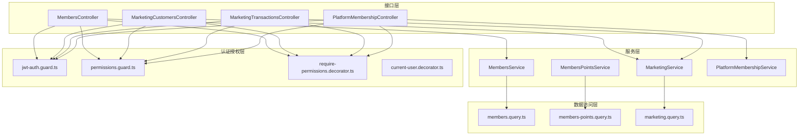
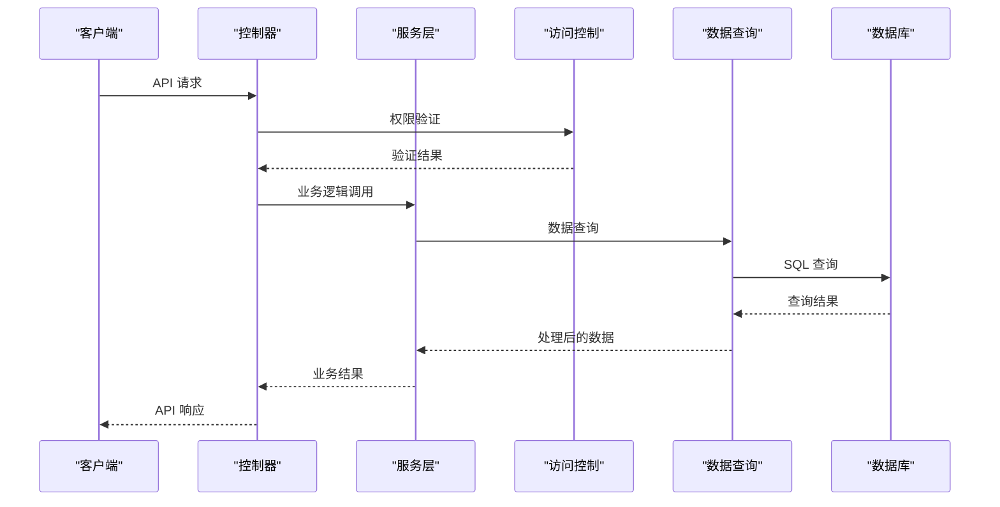
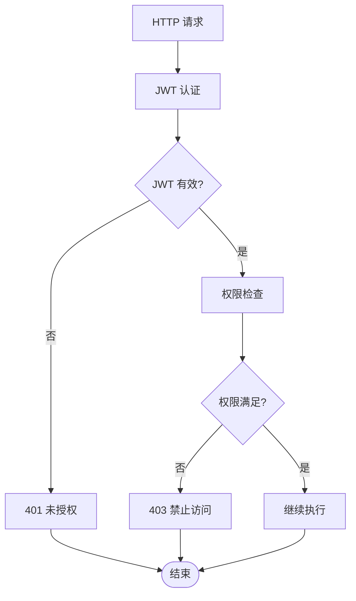
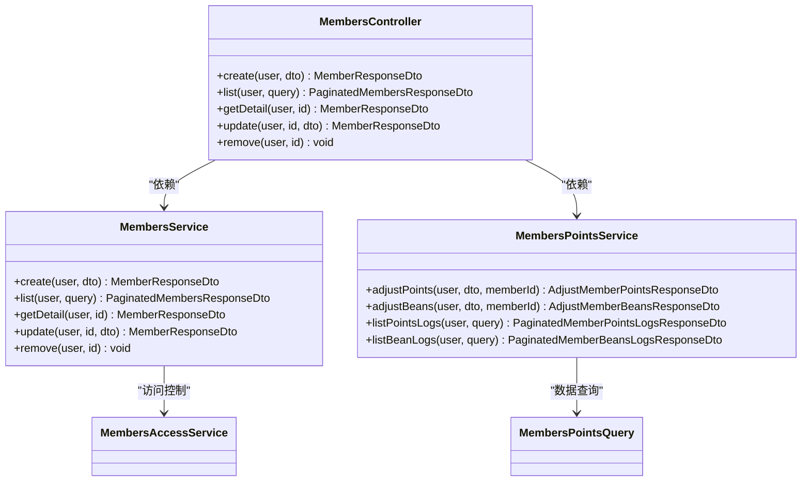
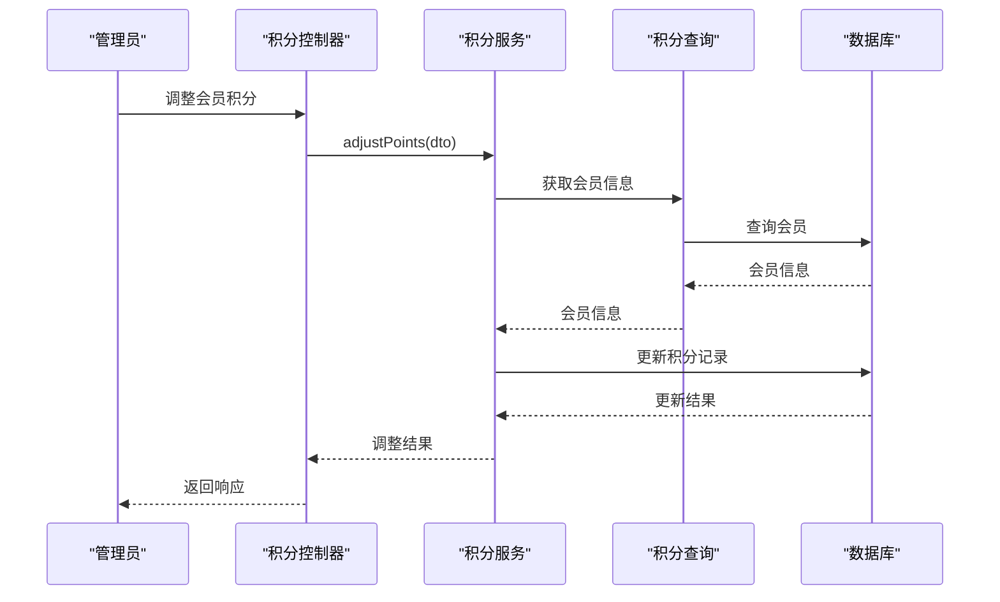
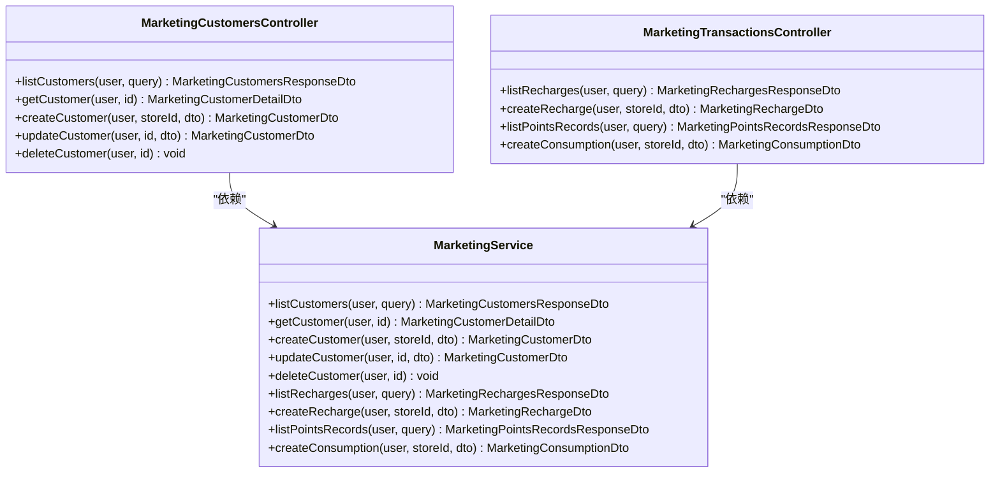
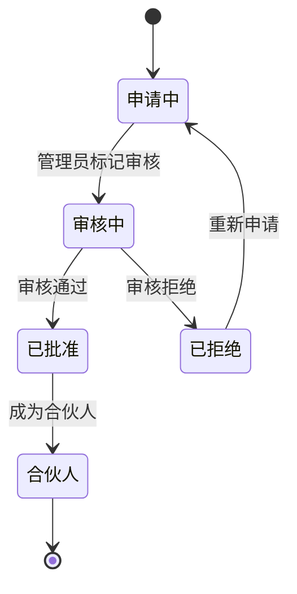
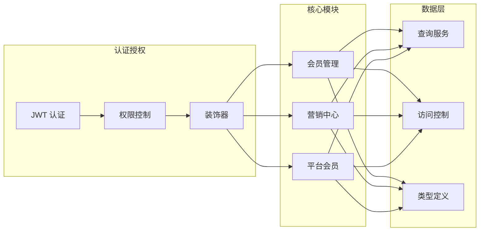
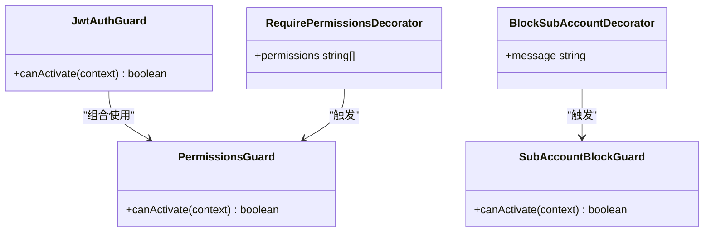
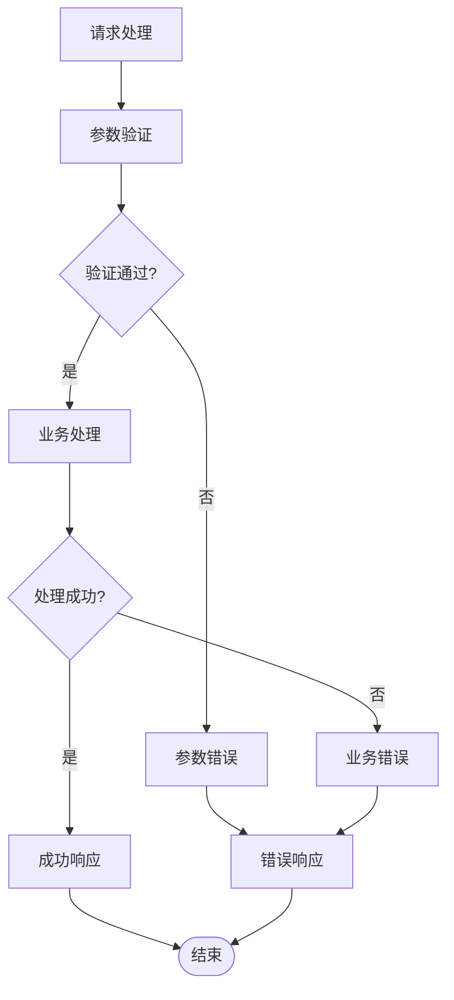

# 会员管理接口

<cite>
**本文引用的文件**
- [members.controller.ts](file://src/purely-profit/member/members/members.controller.ts)
- [members.service.ts](file://src/purely-profit/member/members/members.service.ts)
- [marketing-customers.controller.ts](file://src/purely-profit/marketing/marketing-customers.controller.ts)
- [marketing-transactions.controller.ts](file://src/purely-profit/marketing/marketing-transactions.controller.ts)
- [platform-membership.controller.ts](file://src/purely-profit/member/platform-membership/platform-membership.controller.ts)
- [members-points.service.ts](file://src/purely-profit/member/members/members-points.service.ts)
- [members-points.mapper.ts](file://src/purely-profit/member/members/members-points.mapper.ts)
- [members-points.query.ts](file://src/purely-profit/member/members/members-points.query.ts)
- [members.query.ts](file://src/purely-profit/member/members/members.query.ts)
- [marketing.service.ts](file://src/purely-profit/marketing/marketing.service.ts)
- [platform-membership.service.ts](file://src/purely-profit/member/platform-membership/platform-membership.service.ts)
- [members-access.service.ts](file://src/purely-profit/member/members/members-access.service.ts)
- [marketing-access.service.ts](file://src/purely-profit/marketing/marketing-access.service.ts)
- [jwt-auth.guard.ts](file://src/purely-profit/auth/guards/jwt-auth.guard.ts)
- [permissions.guard.ts](file://src/purely-profit/access-control/guards/permissions.guard.ts)
- [require-permissions.decorator.ts](file://src/purely-profit/access-control/decorators/require-permissions.decorator.ts)
- [block-sub-account.decorator.ts](file://src/purely-profit/access-control/decorators/block-sub-account.decorator.ts)
- [sub-account-block.guard.ts](file://src/purely-profit/access-control/guards/sub-account-block.guard.ts)
- [current-user.decorator.ts](file://src/purely-profit/auth/current-user.decorator.ts)
- [members.types.ts](file://src/purely-profit/member/members/members.types.ts)
- [marketing.types.ts](file://src/purely-profit/marketing/marketing.types.ts)
- [platform-membership.types.ts](file://src/purely-profit/member/platform-membership/platform-membership.types.ts)
- [marketing-query.dto.ts](file://src/purely-profit/marketing/dto/marketing-query.dto.ts)
- [marketing-pagination-query.dto.ts](file://src/purely-profit/marketing/dto/marketing-pagination-query.dto.ts)
- [marketing-response.dto.ts](file://src/purely-profit/marketing/dto/marketing-response.dto.ts)
- [marketing-pagination-meta.dto.ts](file://src/purely-profit/marketing/dto/marketing-pagination-meta.dto.ts)
</cite>

## 更新摘要
**变更内容**
- 更新了营销中心交易接口的分页机制，从传统的page/pageSize参数改为统一的cursor游标分页
- 调整了响应结构，移除了meta元数据字段，改为直接返回nextCursor
- 新增了基于游标的分页查询支持，提升了大数据量场景下的性能表现

## 目录
1. [简介](#简介)
2. [项目结构](#项目结构)
3. [核心组件](#核心组件)
4. [架构概览](#架构概览)
5. [详细组件分析](#详细组件分析)
6. [依赖关系分析](#依赖关系分析)
7. [性能考虑](#性能考虑)
8. [故障排除指南](#故障排除指南)
9. [结论](#结论)

## 简介

本项目是一个基于 NestJS 的会员管理系统，提供了完整的会员生命周期管理功能。系统支持会员 CRUD 操作、会员等级管理、积分系统、会员充值、会员消费记录等功能，同时还包含会员营销相关的促销活动参与、优惠券使用等接口。

系统采用模块化设计，主要分为三个核心模块：
- **会员管理模块**：处理会员基本信息管理、积分和纯利豆管理
- **营销中心模块**：处理会员消费、储值、积分流水等营销相关功能
- **平台会员模块**：处理会员套餐购买、合伙人申请、推广中心等功能

所有接口均采用 JWT 认证和权限控制，确保系统的安全性和数据完整性。

## 项目结构

会员管理模块的整体架构采用分层设计，主要包含以下层次：

**图表来源**
- [members.controller.ts:66-338](file://src/purely-profit/member/members/members.controller.ts#L66-L338)
- [marketing-customers.controller.ts:45-149](file://src/purely-profit/marketing/marketing-customers.controller.ts#L45-L149)
- [marketing-transactions.controller.ts:36-88](file://src/purely-profit/marketing/marketing-transactions.controller.ts#L36-L36-L88)
- [platform-membership.controller.ts:45-276](file://src/purely-profit/member/platform-membership/platform-membership.controller.ts#L45-L276)

**章节来源**
- [members.controller.ts:1-391](file://src/purely-profit/member/members/members.controller.ts#L1-L391)
- [marketing-customers.controller.ts:1-150](file://src/purely-profit/marketing/marketing-customers.controller.ts#L1-L150)
- [marketing-transactions.controller.ts:1-93](file://src/purely-profit/marketing/marketing-transactions.controller.ts#L1-L93)
- [platform-membership.controller.ts:1-277](file://src/purely-profit/member/platform-membership/platform-membership.controller.ts#L1-L277)

## 核心组件

### 会员管理控制器 (MembersController)

MembersController 提供了完整的会员 CRUD 操作和资产管理接口：

**主要功能**：
- 会员创建、查询、更新、删除
- 会员列表查询和筛选
- 会员元数据查询（等级、状态）
- 会员概览统计
- 会员快照查询
- 积分和纯利豆管理

**权限控制**：
- `members:create` - 创建会员
- `members:view` - 查看会员信息
- `members:update` - 更新会员信息

**章节来源**
- [members.controller.ts:66-338](file://src/purely-profit/member/members/members.controller.ts#L66-L338)

### 营销中心控制器 (MarketingControllers)

营销中心包含两个控制器，分别处理客户管理和交易操作：

**营销客户控制器 (MarketingCustomersController)**：
- 客户列表查询
- 客户详情查询
- 客户信息创建、更新、删除
- 客户储值记录查询
- 客户积分记录查询
- 客户消费记录查询

**营销交易控制器 (MarketingTransactionsController)**：
- 储值记录查询
- 创建储值记录
- 积分流水查询
- 创建消费记录

**权限控制**：
- `marketing:view` - 查看营销数据
- `marketing:manage` - 管理营销数据

**章节来源**
- [marketing-customers.controller.ts:45-149](file://src/purely-profit/marketing/marketing-customers.controller.ts#L45-L149)
- [marketing-transactions.controller.ts:36-88](file://src/purely-profit/marketing/marketing-transactions.controller.ts#L36-L88)

### 平台会员控制器 (PlatformMembershipController)

平台会员控制器提供会员套餐管理、合伙人申请、推广中心等功能：

**主要功能**：
- 会员中心首页数据
- 会员档案查询
- 会员套餐列表
- 充值订单管理
- 积分和纯利豆明细
- 推广中心数据
- 合伙人申请管理

**权限控制**：
- `partner:view` - 查看合伙人信息
- `partner:review` - 审核合伙人申请

**章节来源**
- [platform-membership.controller.ts:45-276](file://src/purely-profit/member/platform-membership/platform-membership.controller.ts#L45-L276)

## 架构概览

系统采用分层架构设计，确保关注点分离和代码可维护性：

**图表来源**
- [members.service.ts:49-381](file://src/purely-profit/member/members/members.service.ts#L49-L381)
- [marketing.service.ts](file://src/purely-profit/marketing/marketing.service.ts)
- [platform-membership.service.ts](file://src/purely-profit/member/platform-membership/platform-membership.service.ts)

### 认证和授权流程

**图表来源**
- [jwt-auth.guard.ts](file://src/purely-profit/auth/guards/jwt-auth.guard.ts)
- [permissions.guard.ts](file://src/purely-profit/access-control/guards/permissions.guard.ts)
- [require-permissions.decorator.ts](file://src/purely-profit/access-control/decorators/require-permissions.decorator.ts)

## 详细组件分析

### 会员管理组件

#### 会员 CRUD 操作

会员管理提供了完整的 CRUD 操作，包括基本的增删改查以及高级功能：

**创建会员**：
- 支持批量储值历史导入
- 手机号唯一性验证
- 自动计算会员统计数据

**查询会员**：
- 支持多条件筛选（状态、等级、关键词）
- 分页查询支持
- 会员快照查询用于积分调整

**更新会员**：
- 支持部分字段更新
- 自动处理储值历史变更
- 事务性操作确保数据一致性

**删除会员**：
- 软删除机制
- 关联数据清理

**图表来源**
- [members.controller.ts:70-338](file://src/purely-profit/member/members/members.controller.ts#L70-L338)
- [members.service.ts:49-381](file://src/purely-profit/member/members/members.service.ts#L49-L381)
- [members-points.service.ts](file://src/purely-profit/member/members/members-points.service.ts)

**章节来源**
- [members.controller.ts:76-337](file://src/purely-profit/member/members/members.controller.ts#L76-L337)
- [members.service.ts:57-322](file://src/purely-profit/member/members/members.service.ts#L57-L322)

#### 积分系统管理

系统实现了完整的积分管理体系，包括积分获取、使用、调整等功能：

**积分操作类型**：
- 管理员手动调整
- 消费获得积分
- 推广奖励积分
- 退款扣除积分

**积分查询功能**：
- 总积分统计
- 日变动统计
- 详细流水查询
- 会员维度查询

**图表来源**
- [members-points.service.ts](file://src/purely-profit/member/members/members-points.service.ts)
- [members-points.query.ts](file://src/purely-profit/member/members/members-points.query.ts)

**章节来源**
- [members-points.service.ts](file://src/purely-profit/member/members/members-points.service.ts)
- [members-points.mapper.ts](file://src/purely-profit/member/members/members-points.mapper.ts)

### 营销中心组件

#### 会员消费和储值管理

营销中心提供了完整的消费和储值管理功能：

**储值操作**：
- 支持多种支付方式
- 自动计算余额
- 储值历史记录

**消费记录**：
- 消费明细记录
- 积分抵扣计算
- 退款处理

**客户管理**：
- 客户信息维护
- 客户等级管理
- 客户行为分析

**图表来源**
- [marketing-customers.controller.ts:45-149](file://src/purely-profit/marketing/marketing-customers.controller.ts#L45-L149)
- [marketing-transactions.controller.ts:36-88](file://src/purely-profit/marketing/marketing-transactions.controller.ts#L36-L88)
- [marketing.service.ts](file://src/purely-profit/marketing/marketing.service.ts)

**章节来源**
- [marketing-customers.controller.ts:52-148](file://src/purely-profit/marketing/marketing-customers.controller.ts#L52-L148)
- [marketing-transactions.controller.ts:43-87](file://src/purely-profit/marketing/marketing-transactions.controller.ts#L43-L87)

### 平台会员组件

#### 会员套餐和合伙人管理

平台会员模块提供了高级会员服务和合伙人生态系统：

**会员套餐管理**：
- 套餐列表查询
- 套餐规则对比
- 在线购买流程

**合伙人申请**：
- 申请提交
- 审核流程
- 合伙人等级管理

**推广中心**：
- 推广码生成
- 邀请统计
- 推广奖励

**图表来源**
- [platform-membership.controller.ts:189-240](file://src/purely-profit/member/platform-membership/platform-membership.controller.ts#L189-L240)

**章节来源**
- [platform-membership.controller.ts:55-276](file://src/purely-profit/member/platform-membership/platform-membership.controller.ts#L55-L276)

## 依赖关系分析

系统采用松耦合的设计，各模块间通过清晰的接口进行交互：

**图表来源**
- [members-access.service.ts](file://src/purely-profit/member/members/members-access.service.ts)
- [marketing-access.service.ts](file://src/purely-profit/marketing/marketing-access.service.ts)
- [members.types.ts](file://src/purely-profit/member/members/members.types.ts)
- [marketing.types.ts](file://src/purely-profit/marketing/marketing.types.ts)
- [platform-membership.types.ts](file://src/purely-profit/member/platform-membership/platform-membership.types.ts)

### 组件间依赖关系

**图表来源**
- [jwt-auth.guard.ts](file://src/purely-profit/auth/guards/jwt-auth.guard.ts)
- [permissions.guard.ts](file://src/purely-profit/access-control/guards/permissions.guard.ts)
- [require-permissions.decorator.ts](file://src/purely-profit/access-control/decorators/require-permissions.decorator.ts)
- [block-sub-account.decorator.ts](file://src/purely-profit/access-control/decorators/block-sub-account.decorator.ts)
- [sub-account-block.guard.ts](file://src/purely-profit/access-control/guards/sub-account-block.guard.ts)

**章节来源**
- [jwt-auth.guard.ts](file://src/purely-profit/auth/guards/jwt-auth.guard.ts)
- [permissions.guard.ts](file://src/purely-profit/access-control/guards/permissions.guard.ts)
- [require-permissions.decorator.ts](file://src/purely-profit/access-control/decorators/require-permissions.decorator.ts)
- [block-sub-account.decorator.ts](file://src/purely-profit/access-control/decorators/block-sub-account.decorator.ts)
- [sub-account-block.guard.ts](file://src/purely-profit/access-control/guards/sub-account-block.guard.ts)

## 性能考虑

### 查询优化策略

系统采用了多种查询优化策略来提升性能：

1. **游标分页查询**：使用cursor游标替代传统的page/pageSize参数，提升大数据量场景下的查询性能
2. **索引优化**：对常用查询字段建立数据库索引
3. **缓存策略**：对静态配置和元数据进行缓存
4. **批量操作**：支持批量查询和更新操作

### 事务管理

关键业务操作采用事务保证数据一致性：

- 会员创建时的事务处理
- 积分调整的原子性操作
- 储值历史的批量更新

### 异步处理

对于耗时操作采用异步处理机制：

- 大数据量导出
- 批量数据处理
- 异步通知发送

## 故障排除指南

### 常见问题和解决方案

**权限相关问题**：
- 确认用户是否具有相应的权限标识
- 检查子账号访问限制
- 验证 JWT 令牌有效性

**数据一致性问题**：
- 检查事务是否正确提交
- 验证外键约束
- 确认并发访问控制

**性能问题**：
- 分析慢查询日志
- 检查数据库索引
- 优化查询条件

### 错误处理机制

系统实现了完善的错误处理机制：

**章节来源**
- [members.service.ts:336-357](file://src/purely-profit/member/members/members.service.ts#L336-L357)

## 结论

本会员管理模块提供了完整的企业级会员管理解决方案，具有以下特点：

1. **功能完整**：覆盖会员生命周期的所有环节
2. **安全可靠**：完善的认证授权机制
3. **扩展性强**：模块化设计便于功能扩展
4. **性能优化**：多层优化策略确保系统性能
5. **易于维护**：清晰的架构设计和文档

系统支持企业级的会员管理需求，包括基础的会员 CRUD 操作、复杂的积分体系、营销活动管理以及高级的平台会员功能。通过合理的权限控制和数据安全保障，确保系统的安全性和可靠性。

**最新更新**：营销中心交易接口已升级为基于游标的分页机制，提供更好的大数据量查询性能和用户体验。新的分页方式使用cursor参数替代传统的page/pageSize，响应结构中移除了meta元数据字段，改为直接返回nextCursor，简化了前端分页逻辑的实现。