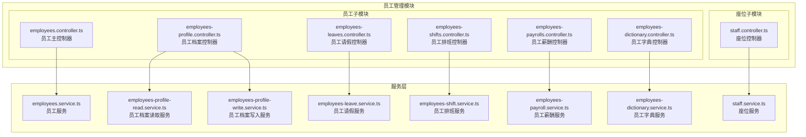
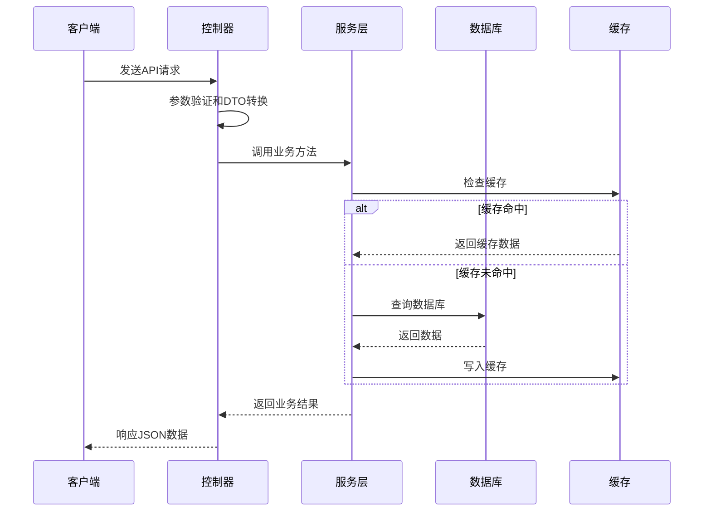
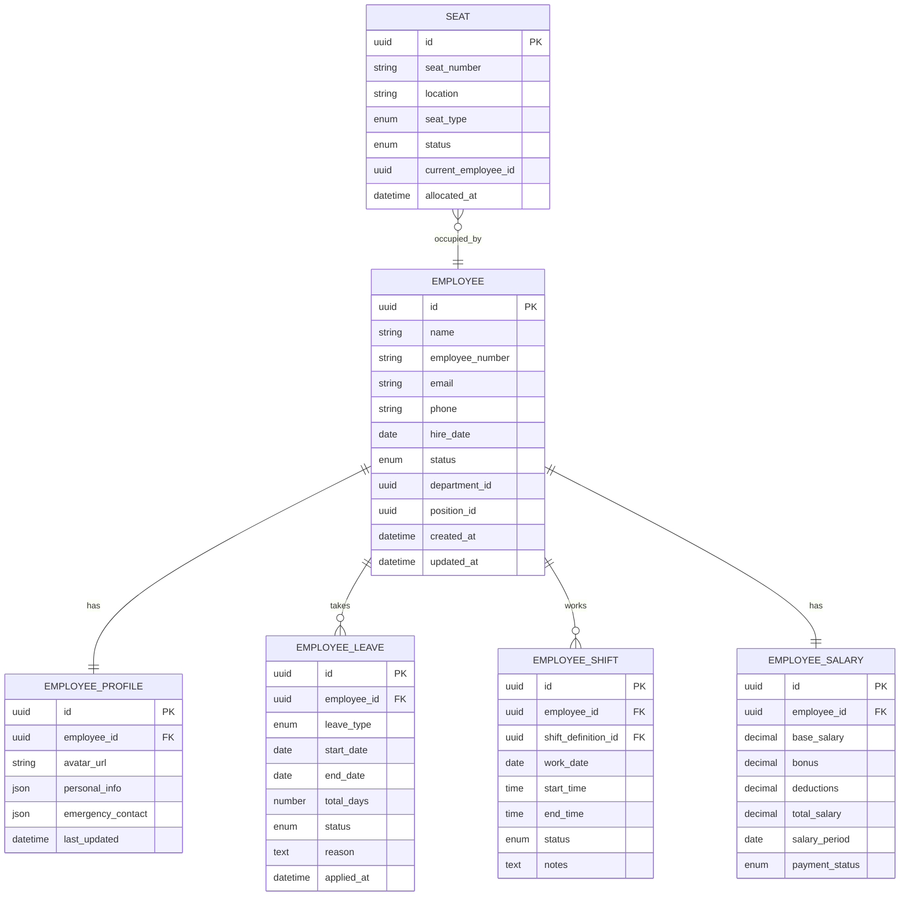
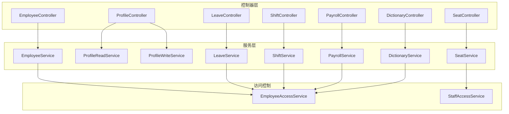

# 员工管理接口

<cite>
**本文档引用的文件**
- [employees.controller.ts](file://src/purely-profit/staff/employees/employees.controller.ts)
- [employees-profile.controller.ts](file://src/purely-profit/staff/employees/employees-profile.controller.ts)
- [employees-leaves.controller.ts](file://src/purely-profit/staff/employees/employees-leaves.controller.ts)
- [employees-shifts.controller.ts](file://src/purely-profit/staff/employees/employees-shifts.controller.ts)
- [employees-payrolls.controller.ts](file://src/purely-profit/staff/employees/employees-payrolls.controller.ts)
- [employees-dictionary.controller.ts](file://src/purely-profit/staff/employees/employees-dictionary.controller.ts)
- [staff.controller.ts](file://src/purely-profit/staff/seats/staff.controller.ts)
- [employees.service.ts](file://src/purely-profit/staff/employees/employees.service.ts)
- [employees-profile-read.service.ts](file://src/purely-profit/staff/employees/employees-profile-read.service.ts)
- [employees-profile-write.service.ts](file://src/purely-profit/staff/employees/employees-profile-write.service.ts)
- [employees-leave.service.ts](file://src/purely-profit/staff/employees/employees-leave.service.ts)
- [employees-shift.service.ts](file://src/purely-profit/staff/employees/employees-shift.service.ts)
- [employees-payroll.service.ts](file://src/purely-profit/staff/employees/employees-payroll.service.ts)
- [employees-dictionary.service.ts](file://src/purely-profit/staff/employees/employees-dictionary.service.ts)
- [staff.service.ts](file://src/purely-profit/staff/seats/staff.service.ts)
- [employees-access.service.ts](file://src/purely-profit/staff/employees/employees-access.service.ts)
- [staff-access.service.ts](file://src/purely-profit/staff/seats/staff-access.service.ts)
- [create-employee.dto.ts](file://src/purely-profit/staff/employees/dto/create-employee.dto.ts)
- [update-employee.dto.ts](file://src/purely-profit/staff/employees/dto/update-employee.dto.ts)
- [employee-leave.dto.ts](file://src/purely-profit/staff/employees/dto/employee-leave.dto.ts)
- [employee-shift.dto.ts](file://src/purely-profit/staff/employees/dto/employee-shift.dto.ts)
- [employee-payroll.dto.ts](file://src/purely-profit/staff/employees/dto/employee-payroll.dto.ts)
- [employee-dictionary.dto.ts](file://src/purely-profit/staff/employees/dto/employee-dictionary.dto.ts)
- [employee-response.dto.ts](file://src/purely-profit/staff/employees/dto/employee-response.dto.ts)
- [staff-response.dto.ts](file://src/purely-profit/staff/seats/dto/staff-response.dto.ts)
- [schema.prisma](file://prisma/schema.prisma)
</cite>

## 目录
1. [简介](#简介)
2. [项目结构](#项目结构)
3. [核心组件](#核心组件)
4. [架构概览](#架构概览)
5. [详细组件分析](#详细组件分析)
6. [依赖关系分析](#依赖关系分析)
7. [性能考虑](#性能考虑)
8. [故障排除指南](#故障排除指南)
9. [结论](#结论)

## 简介

员工管理模块是企业管理系统中的核心功能模块，负责处理员工全生命周期管理、排班管理和薪酬管理等业务需求。该模块基于 NestJS 框架构建，采用分层架构设计，通过控制器(Controller)、服务(Service)、数据传输对象(DTO)和访问控制服务的协作，实现了完整的员工管理功能。

本模块主要包含以下核心功能：
- 员工信息管理：包括员工基本信息维护、状态变更、权限分配
- 员工档案维护：支持员工档案的完整生命周期管理
- 员工状态变更：处理入职、转正、离职、调岗等状态变化
- 员工排班管理：支持排班定义、排班查询、交接班流程
- 薪酬管理：管理员工薪资计算、发放和统计
- 绩效评估：支持员工绩效记录和评估
- 培训记录：维护员工培训历史和证书管理

## 项目结构

员工管理模块采用按功能域划分的组织方式，主要分为两个子模块：



**图表来源**
- [employees.controller.ts:1-200](file://src/purely-profit/staff/employees/employees.controller.ts#L1-L200)
- [staff.controller.ts:1-200](file://src/purely-profit/staff/seats/staff.controller.ts#L1-L200)

**章节来源**
- [employees.controller.ts:1-200](file://src/purely-profit/staff/employees/employees.controller.ts#L1-L200)
- [staff.controller.ts:1-200](file://src/purely-profit/staff/seats/staff.controller.ts#L1-L200)

## 核心组件

### 控制器层

员工管理模块包含多个专门的控制器，每个控制器负责特定的功能领域：

#### 员工主控制器
- 处理员工基本信息的增删改查操作
- 支持批量操作和条件查询
- 实现员工状态变更的业务逻辑

#### 员工档案控制器
- 管理员工个人档案信息
- 支持档案的上传、更新和查询
- 处理敏感信息的访问控制

#### 员工请假控制器
- 处理员工请假申请和审批
- 支持多种请假类型和时长计算
- 集成考勤系统进行自动扣减

#### 员工排班控制器
- 定义和管理员工排班计划
- 支持排班调整和冲突检测
- 处理交接班流程

#### 员工薪酬控制器
- 计算和发放员工薪酬
- 支持多种薪酬结构和计算规则
- 生成薪酬报表和统计

#### 员工字典控制器
- 提供员工相关的枚举值和配置
- 支持动态字典更新
- 维护系统基础数据

#### 座位控制器
- 管理员工座位分配和变更
- 支持座位状态监控
- 处理座位共享和独享模式

**章节来源**
- [employees.controller.ts:1-200](file://src/purely-profit/staff/employees/employees.controller.ts#L1-L200)
- [employees-profile.controller.ts:1-200](file://src/purely-profit/staff/employees/employees-profile.controller.ts#L1-L200)
- [employees-leaves.controller.ts:1-200](file://src/purely-profit/staff/employees/employees-leaves.controller.ts#L1-L200)
- [employees-shifts.controller.ts:1-200](file://src/purely-profit/staff/employees/employees-shifts.controller.ts#L1-L200)
- [employees-payrolls.controller.ts:1-200](file://src/purely-profit/staff/employees/employees-payrolls.controller.ts#L1-L200)
- [employees-dictionary.controller.ts:1-200](file://src/purely-profit/staff/employees/employees-dictionary.controller.ts#L1-L200)
- [staff.controller.ts:1-200](file://src/purely-profit/staff/seats/staff.controller.ts#L1-L200)

### 服务层

#### 员工服务
- 实现员工数据的业务逻辑处理
- 提供数据验证和转换功能
- 管理与其他模块的集成

#### 员工档案服务
- 分离读取和写入操作以提高安全性
- 实现档案版本控制和审计功能
- 支持大文件存储和处理

#### 员工请假服务
- 处理复杂的请假规则和算法
- 集成工作日历和节假日信息
- 实现请假时长的精确计算

#### 员工排班服务
- 管理复杂的排班规则和约束
- 实现冲突检测和解决方案
- 支持轮班制和弹性工作制

#### 员工薪酬服务
- 实现多样化的薪酬计算模型
- 支持奖金、津贴、扣款的灵活配置
- 生成详细的薪酬明细和报表

#### 员工字典服务
- 提供统一的数据字典管理
- 支持缓存优化和快速访问
- 维护数据的一致性和完整性

#### 座位服务
- 管理物理座位资源的分配
- 实现座位状态的实时同步
- 支持座位变更的历史追踪

**章节来源**
- [employees.service.ts:1-200](file://src/purely-profit/staff/employees/employees.service.ts#L1-L200)
- [employees-profile-read.service.ts:1-200](file://src/purely-profit/staff/employees/employees-profile-read.service.ts#L1-L200)
- [employees-profile-write.service.ts:1-200](file://src/purely-profit/staff/employees/employees-profile-write.service.ts#L1-L200)
- [employees-leave.service.ts:1-200](file://src/purely-profit/staff/employees/employees-leave.service.ts#L1-L200)
- [employees-shift.service.ts:1-200](file://src/purely-profit/staff/employees/employees-shift.service.ts#L1-L200)
- [employees-payroll.service.ts:1-200](file://src/purely-profit/staff/employees/employees-payroll.service.ts#L1-L200)
- [employees-dictionary.service.ts:1-200](file://src/purely-profit/staff/employees/employees-dictionary.service.ts#L1-L200)
- [staff.service.ts:1-200](file://src/purely-profit/staff/seats/staff.service.ts#L1-L200)

## 架构概览

员工管理模块采用清晰的分层架构，确保了代码的可维护性和可扩展性：

```mermaid
graph TB
subgraph "表现层"
C[控制器层<br/>处理HTTP请求和响应]
end
subgraph "应用层"
S[服务层<br/>实现业务逻辑]
AC[访问控制服务<br/>权限验证和授权]
end
subgraph "基础设施层"
DB[(数据库)<br/>Prisma ORM]
CACHE[(缓存)<br/>Redis缓存]
FS[(文件系统)<br/>员工档案存储]
end
subgraph "外部集成"
HR[HR系统]<br/>人员信息同步
PAY[薪酬系统]<br/>薪资发放集成
ATT[考勤系统]<br/>打卡记录同步
end
C --> S
S --> AC
S --> DB
S --> CACHE
S --> FS
S --> HR
S --> PAY
S --> ATT
```

**图表来源**
- [employees-access.service.ts:1-200](file://src/purely-profit/staff/employees/employees-access.service.ts#L1-L200)
- [staff-access.service.ts:1-200](file://src/purely-profit/staff/seats/staff-access.service.ts#L1-L200)

### 数据流设计



**图表来源**
- [employees.service.ts:1-200](file://src/purely-profit/staff/employees/employees.service.ts#L1-L200)
- [employees.controller.ts:1-200](file://src/purely-profit/staff/employees/employees.controller.ts#L1-L200)

## 详细组件分析

### 员工信息管理接口

#### 员工创建接口
- **端点**: POST /staff/employees
- **功能**: 创建新员工记录
- **权限**: 需要员工管理权限
- **输入**: 员工基本信息DTO
- **输出**: 创建成功的员工信息

#### 员工查询接口
- **端点**: GET /staff/employees
- **功能**: 分页查询员工列表
- **权限**: 需要员工查询权限
- **参数**: 支持多条件过滤和排序
- **输出**: 员工列表和分页信息

#### 员工更新接口
- **端点**: PUT /staff/employees/{id}
- **功能**: 更新员工基本信息
- **权限**: 需要员工修改权限
- **输入**: 更新后的员工信息
- **输出**: 更新后的员工详情

#### 员工删除接口
- **端点**: DELETE /staff/employees/{id}
- **功能**: 删除员工记录（软删除）
- **权限**: 需要员工删除权限
- **输出**: 删除确认信息

**章节来源**
- [employees.controller.ts:1-200](file://src/purely-profit/staff/employees/employees.controller.ts#L1-L200)
- [create-employee.dto.ts:1-200](file://src/purely-profit/staff/employees/dto/create-employee.dto.ts#L1-L200)
- [update-employee.dto.ts:1-200](file://src/purely-profit/staff/employees/dto/update-employee.dto.ts#L1-L200)

### 员工档案维护接口

#### 档案上传接口
- **端点**: POST /staff/employees/{id}/profile
- **功能**: 上传员工个人档案
- **权限**: 需要档案上传权限
- **输入**: 文件上传和元数据
- **输出**: 档案存储信息

#### 档案查询接口
- **端点**: GET /staff/employees/{id}/profile
- **功能**: 获取员工档案详情
- **权限**: 需要档案查看权限
- **输出**: 档案内容和元数据

#### 档案更新接口
- **端点**: PUT /staff/employees/{id}/profile
- **功能**: 更新员工档案信息
- **权限**: 需要档案修改权限
- **输入**: 更新后的档案数据
- **输出**: 更新确认信息

**章节来源**
- [employees-profile.controller.ts:1-200](file://src/purely-profit/staff/employees/employees-profile.controller.ts#L1-L200)
- [employees-profile-read.service.ts:1-200](file://src/purely-profit/staff/employees/employees-profile-read.service.ts#L1-L200)
- [employees-profile-write.service.ts:1-200](file://src/purely-profit/staff/employees/employees-profile-write.service.ts#L1-L200)

### 员工状态变更接口

#### 入职处理接口
- **端点**: POST /staff/employees/{id}/hire
- **功能**: 处理员工入职手续
- **权限**: 需要入职处理权限
- **输入**: 入职相关信息
- **输出**: 入职完成确认

#### 转正处理接口
- **端点**: POST /staff/employees/{id}/probation-complete
- **功能**: 处理员工转正流程
- **权限**: 需要转正处理权限
- **输入**: 转正评估结果
- **输出**: 转正完成确认

#### 离职处理接口
- **端点**: POST /staff/employees/{id}/resign
- **功能**: 处理员工离职手续
- **权限**: 需要离职处理权限
- **输入**: 离职原因和结算信息
- **输出**: 离职完成确认

#### 调岗处理接口
- **端点**: POST /staff/employees/{id}/transfer
- **功能**: 处理员工内部调动
- **权限**: 需要调岗处理权限
- **输入**: 新岗位和生效日期
- **输出**: 调岗完成确认

**章节来源**
- [employees-leaves.controller.ts:1-200](file://src/purely-profit/staff/employees/employees-leaves.controller.ts#L1-L200)
- [employees-leave.service.ts:1-200](file://src/purely-profit/staff/employees/employees-leave.service.ts#L1-L200)

### 员工排班管理接口

#### 排班定义接口
- **端点**: POST /staff/employees/{id}/shifts
- **功能**: 定义员工排班计划
- **权限**: 需要排班管理权限
- **输入**: 排班时间段和班次信息
- **输出**: 排班定义确认

#### 排班查询接口
- **端点**: GET /staff/employees/{id}/shifts
- **功能**: 查询员工排班详情
- **权限**: 需要排班查询权限
- **参数**: 日期范围和班次类型
- **输出**: 排班列表和统计信息

#### 排班调整接口
- **端点**: PUT /staff/employees/{id}/shifts/{shiftId}
- **功能**: 调整员工排班安排
- **权限**: 需要排班调整权限
- **输入**: 调整后的排班信息
- **输出**: 调整确认信息

#### 交接班接口
- **端点**: POST /staff/employees/{id}/shifts/{shiftId}/handover
- **功能**: 处理员工交接班流程
- **权限**: 需要交接班权限
- **输入**: 交接班详情和物品清单
- **输出**: 交接班完成确认

**章节来源**
- [employees-shifts.controller.ts:1-200](file://src/purely-profit/staff/employees/employees-shifts.controller.ts#L1-L200)
- [employees-shift.service.ts:1-200](file://src/purely-profit/staff/employees/employees-shift.service.ts#L1-L200)
- [employee-shift.dto.ts:1-200](file://src/purely-profit/staff/employees/dto/employee-shift.dto.ts#L1-L200)

### 员工薪酬管理接口

#### 薪酬计算接口
- **端点**: POST /staff/employees/salary-calculation
- **功能**: 计算员工应发薪酬
- **权限**: 需要薪酬计算权限
- **输入**: 工资周期和计算参数
- **输出**: 薪酬计算明细

#### 薪酬发放接口
- **端点**: POST /staff/employees/salary-disbursement
- **功能**: 批量发放员工薪酬
- **权限**: 需要薪酬发放权限
- **输入**: 发放批次和银行信息
- **输出**: 发放成功确认

#### 薪酬查询接口
- **端点**: GET /staff/employees/salary-statistics
- **功能**: 查询薪酬统计信息
- **权限**: 需要薪酬查询权限
- **参数**: 时间范围和部门筛选
- **输出**: 薪酬统计报表

#### 薪酬调整接口
- **端点**: POST /staff/employees/{id}/salary-adjustment
- **功能**: 调整员工薪酬标准
- **权限**: 需要薪酬调整权限
- **输入**: 调整原因和新薪酬标准
- **输出**: 调整确认信息

**章节来源**
- [employees-payrolls.controller.ts:1-200](file://src/purely-profit/staff/employees/employees-payrolls.controller.ts#L1-L200)
- [employees-payroll.service.ts:1-200](file://src/purely-profit/staff/employees/employees-payroll.service.ts#L1-L200)
- [employee-payroll.dto.ts:1-200](file://src/purely-profit/staff/employees/dto/employee-payroll.dto.ts#L1-L200)

### 员工字典管理接口

#### 字典查询接口
- **端点**: GET /staff/employees/dictionary
- **功能**: 获取员工相关字典数据
- **权限**: 需要字典查询权限
- **参数**: 字典类型和筛选条件
- **输出**: 字典项列表

#### 字典更新接口
- **端点**: PUT /staff/employees/dictionary
- **功能**: 更新字典数据
- **权限**: 需要字典管理权限
- **输入**: 更新后的字典项
- **输出**: 更新确认信息

#### 字典导入接口
- **端点**: POST /staff/employees/dictionary/import
- **功能**: 批量导入字典数据
- **权限**: 需要字典导入权限
- **输入**: Excel或CSV格式数据
- **输出**: 导入结果统计

**章节来源**
- [employees-dictionary.controller.ts:1-200](file://src/purely-profit/staff/employees/employees-dictionary.controller.ts#L1-L200)
- [employees-dictionary.service.ts:1-200](file://src/purely-profit/staff/employees/employees-dictionary.service.ts#L1-L200)
- [employee-dictionary.dto.ts:1-200](file://src/purely-profit/staff/employees/dto/employee-dictionary.dto.ts#L1-L200)

### 座位管理接口

#### 座位分配接口
- **端点**: POST /staff/seats/{seatId}/assign
- **功能**: 为员工分配座位
- **权限**: 需要座位分配权限
- **输入**: 员工ID和分配时间
- **输出**: 分配确认信息

#### 座位查询接口
- **端点**: GET /staff/seats
- **功能**: 查询座位使用情况
- **权限**: 需要座位查询权限
- **参数**: 座位状态和位置筛选
- **输出**: 座位列表和占用信息

#### 座位变更接口
- **端点**: PUT /staff/seats/{seatId}/change
- **功能**: 变更座位分配状态
- **权限**: 需要座位变更权限
- **输入**: 新的员工分配
- **输出**: 变更确认信息

**章节来源**
- [staff.controller.ts:1-200](file://src/purely-profit/staff/seats/staff.controller.ts#L1-L200)
- [staff.service.ts:1-200](file://src/purely-profit/staff/seats/staff.service.ts#L1-L200)
- [staff-response.dto.ts:1-200](file://src/purely-profit/staff/seats/dto/staff-response.dto.ts#L1-L200)

## 依赖关系分析

### 数据模型关系



**图表来源**
- [schema.prisma:1-500](file://prisma/schema.prisma#L1-L500)

### 服务依赖图



**图表来源**
- [employees-access.service.ts:1-200](file://src/purely-profit/staff/employees/employees-access.service.ts#L1-L200)
- [staff-access.service.ts:1-200](file://src/purely-profit/staff/seats/staff-access.service.ts#L1-L200)

**章节来源**
- [employees-access.service.ts:1-200](file://src/purely-profit/staff/employees/employees-access.service.ts#L1-L200)
- [staff-access.service.ts:1-200](file://src/purely-profit/staff/seats/staff-access.service.ts#L1-L200)

## 性能考虑

### 缓存策略
- 使用Redis缓存常用查询结果
- 实现分级缓存：全局缓存、用户缓存、会话缓存
- 设置合理的过期时间和失效策略

### 数据库优化
- 为高频查询字段建立索引
- 实现分页查询避免大数据集加载
- 使用连接池管理数据库连接

### 异步处理
- 对耗时操作使用异步队列
- 实现批量处理减少数据库压力
- 支持进度跟踪和错误恢复

## 故障排除指南

### 常见问题及解决方案

#### 权限相关错误
- **症状**: 403 Forbidden响应
- **原因**: 用户权限不足或会话过期
- **解决**: 检查用户角色和权限配置，重新登录获取有效令牌

#### 数据验证错误
- **症状**: 400 Bad Request响应
- **原因**: DTO验证失败或数据格式不正确
- **解决**: 检查请求参数格式，参考DTO定义规范

#### 数据库连接错误
- **症状**: 500 Internal Server Error
- **原因**: 数据库连接超时或事务冲突
- **解决**: 检查数据库连接配置，重试机制和连接池设置

#### 缓存失效问题
- **症状**: 数据不一致或陈旧
- **原因**: 缓存未正确更新或过期
- **解决**: 实施缓存失效策略，确保数据一致性

**章节来源**
- [employees-access.service.ts:1-200](file://src/purely-profit/staff/employees/employees-access.service.ts#L1-L200)
- [staff-access.service.ts:1-200](file://src/purely-profit/staff/seats/staff-access.service.ts#L1-L200)

## 结论

员工管理模块通过清晰的分层架构和完善的接口设计，为企业提供了全面的员工生命周期管理解决方案。模块具有以下特点：

1. **功能完整性**: 覆盖员工管理的所有核心业务场景
2. **扩展性强**: 基于模块化设计，易于添加新功能
3. **安全性高**: 完善的权限控制和数据保护机制
4. **性能优化**: 采用缓存、异步处理等技术提升性能
5. **易维护性**: 清晰的代码结构和完善的错误处理

该模块为企业的人力资源管理提供了坚实的技术基础，支持企业的日常运营和未来发展需求。