# 商品管理接口

<cite>
**本文档引用的文件**
- [products.controller.ts](file://src/purely-profit/goods/products/products.controller.ts)
- [categories.controller.ts](file://src/purely-profit/goods/categories/categories.controller.ts)
- [inventory.controller.ts](file://src/purely-profit/goods/inventory/inventory.controller.ts)
- [product.dto.ts](file://src/purely-profit/goods/products/dto/product.dto.ts)
- [category.dto.ts](file://src/purely-profit/goods/categories/dto/category.dto.ts)
- [inventory.dto.ts](file://src/purely-profit/goods/inventory/dto/inventory.dto.ts)
- [products.service.ts](file://src/purely-profit/goods/products/products.service.ts)
- [categories.service.ts](file://src/purely-profit/goods/categories/categories.service.ts)
- [inventory.service.ts](file://src/purely-profit/goods/inventory/inventory.service.ts)
- [products.mapper.ts](file://src/purely-profit/goods/products/products.mapper.ts)
- [categories.mapper.ts](file://src/purely-profit/goods/categories/categories.mapper.ts)
- [inventory.mapper.ts](file://src/purely-profit/goods/inventory/inventory.mapper.ts)
- [products.query.ts](file://src/purely-profit/goods/products/products.query.ts)
- [categories.query.ts](file://src/purely-profit/goods/categories/categories.query.ts)
- [inventory.query.ts](file://src/purely-profit/goods/inventory/inventory.query.ts)
- [inventory-stock.domain.ts](file://src/purely-profit/goods/inventory/inventory-stock.domain.ts)
- [schema.prisma](file://prisma/schema.prisma)
- [goods.catalog.prisma](file://prisma/purely-profit/goods/catalog.prisma)
- [goods.inventory.prisma](file://prisma/purely-profit/goods/inventory.prisma)
</cite>

## 目录
1. [简介](#简介)
2. [项目结构](#项目结构)
3. [核心组件](#核心组件)
4. [架构概览](#架构概览)
5. [详细组件分析](#详细组件分析)
6. [依赖关系分析](#依赖关系分析)
7. [性能考虑](#性能考虑)
8. [故障排除指南](#故障排除指南)
9. [结论](#结论)

## 简介

商品管理模块是基于 NestJS 构建的企业级商品管理系统的核心功能模块。该模块提供了完整的商品生命周期管理能力，包括商品 CRUD 操作、商品分类管理、库存控制、采购管理等核心业务功能。

本模块采用分层架构设计，通过服务层、控制器层、数据传输对象（DTO）和查询构建器实现清晰的职责分离。系统支持商品价格管理、规格配置、图片上传、上下架控制等高级功能，并集成了销售统计、库存预警、采购订单处理等企业级特性。

## 项目结构

商品管理模块采用按功能域划分的组织结构，主要包含三个核心子模块：

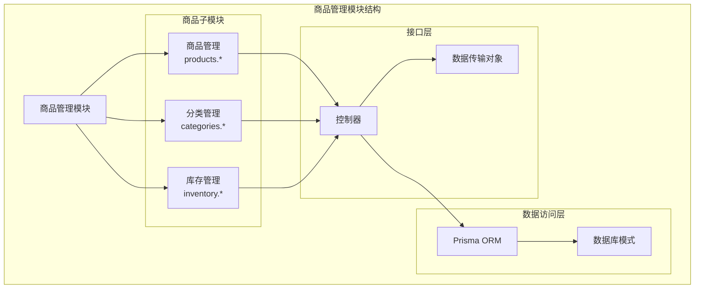

**图表来源**
- [products.controller.ts](file://src/purely-profit/goods/products/products.controller.ts)
- [categories.controller.ts](file://src/purely-profit/goods/categories/categories.controller.ts)
- [inventory.controller.ts](file://src/purely-profit/goods/inventory/inventory.controller.ts)

**章节来源**
- [products.controller.ts](file://src/purely-profit/goods/products/products.controller.ts)
- [categories.controller.ts](file://src/purely-profit/goods/categories/categories.controller.ts)
- [inventory.controller.ts](file://src/purely-profit/goods/inventory/inventory.controller.ts)

## 核心组件

### 商品管理组件

商品管理组件提供完整的商品 CRUD 操作和高级功能：

- **基础 CRUD 操作**：创建、读取、更新、删除商品信息
- **商品状态管理**：上下架控制、状态变更追踪
- **价格管理**：基础价格、销售价格、成本价管理
- **规格配置**：多规格商品支持、规格组合管理
- **图片管理**：商品图片上传、缩略图生成、存储管理
- **搜索过滤**：多维度商品搜索、批量操作支持

### 分类管理组件

分类管理组件负责商品分类体系的维护：

- **分类层级管理**：多级分类支持、父子关系维护
- **分类属性**：分类名称、描述、排序、状态管理
- **分类关联**：商品与分类的多对多关系
- **分类查询**：树形结构查询、路径查询优化

### 库存管理组件

库存管理组件提供精确的库存控制能力：

- **实时库存跟踪**：入库、出库、调拨、盘点操作
- **安全库存设置**：最低库存预警、自动补货建议
- **批次管理**：生产日期、有效期、批次号追踪
- **仓库管理**：多仓库库存分配、库存转移

**章节来源**
- [products.service.ts](file://src/purely-profit/goods/products/products.service.ts)
- [categories.service.ts](file://src/purely-profit/goods/categories/categories.service.ts)
- [inventory.service.ts](file://src/purely-profit/goods/inventory/inventory.service.ts)

## 架构概览

商品管理模块采用典型的三层架构设计，确保了良好的可维护性和扩展性：

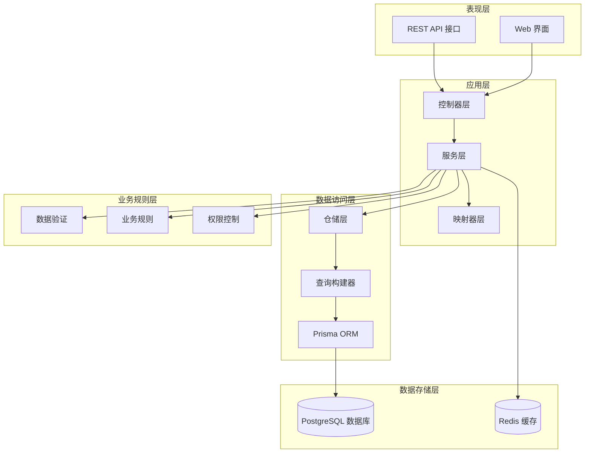

**图表来源**
- [products.controller.ts](file://src/purely-profit/goods/products/products.controller.ts)
- [categories.controller.ts](file://src/purely-profit/goods/categories/categories.controller.ts)
- [inventory.controller.ts](file://src/purely-profit/goods/inventory/inventory.controller.ts)
- [products.service.ts](file://src/purely-profit/goods/products/products.service.ts)

### 数据流架构

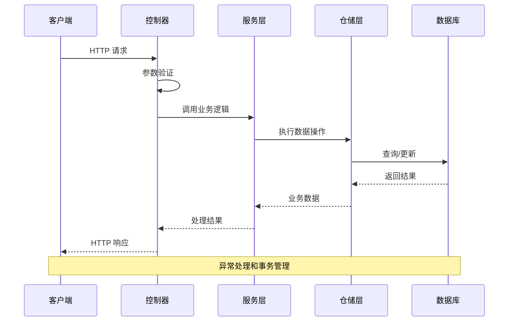

**图表来源**
- [products.controller.ts](file://src/purely-profit/goods/products/products.controller.ts)
- [products.service.ts](file://src/purely-profit/goods/products/products.service.ts)

## 详细组件分析

### 商品管理 API

#### 基础 CRUD 操作

商品管理提供完整的 CRUD 操作接口，支持批量操作和条件查询：

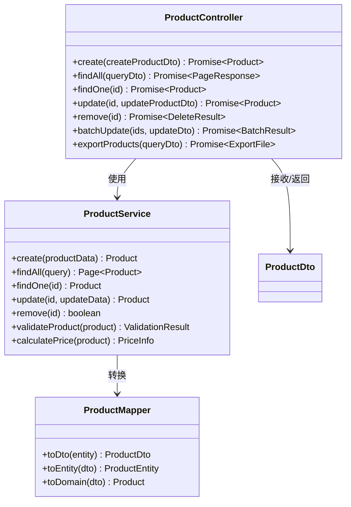

**图表来源**
- [products.controller.ts](file://src/purely-profit/goods/products/products.controller.ts)
- [products.service.ts](file://src/purely-profit/goods/products/products.service.ts)
- [products.mapper.ts](file://src/purely-profit/goods/products/products.mapper.ts)

#### 商品状态管理流程

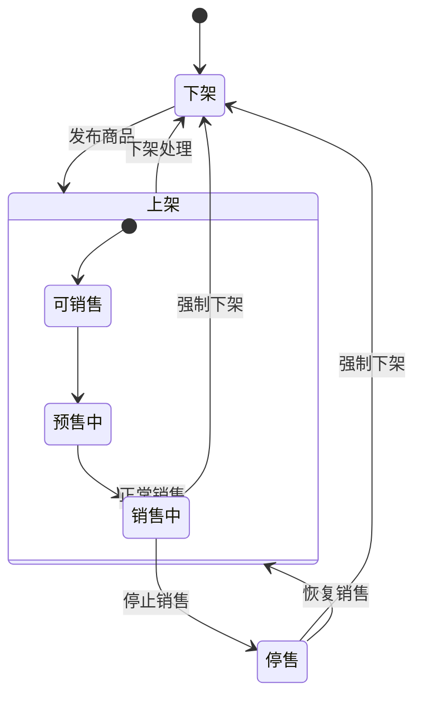

**图表来源**
- [products.service.ts](file://src/purely-profit/goods/products/products.service.ts)

#### 商品价格管理

商品价格管理支持多种定价策略和动态价格计算：

| 功能特性 | 描述 | 实现方式 |
|---------|------|----------|
| 基础价格 | 商品标价 | 固定价格字段 |
| 销售价格 | 实际销售价格 | 动态计算 |
| 成本价格 | 商品成本 | 成本追踪 |
| 会员价格 | 会员专属价格 | 会员等级差异化 |
| 促销价格 | 限时促销价格 | 促销活动集成 |

**章节来源**
- [products.controller.ts](file://src/purely-profit/goods/products/products.controller.ts)
- [product.dto.ts](file://src/purely-profit/goods/products/dto/product.dto.ts)

### 分类管理 API

#### 分类层级结构

分类管理支持多级分类体系，实现灵活的商品分类组织：

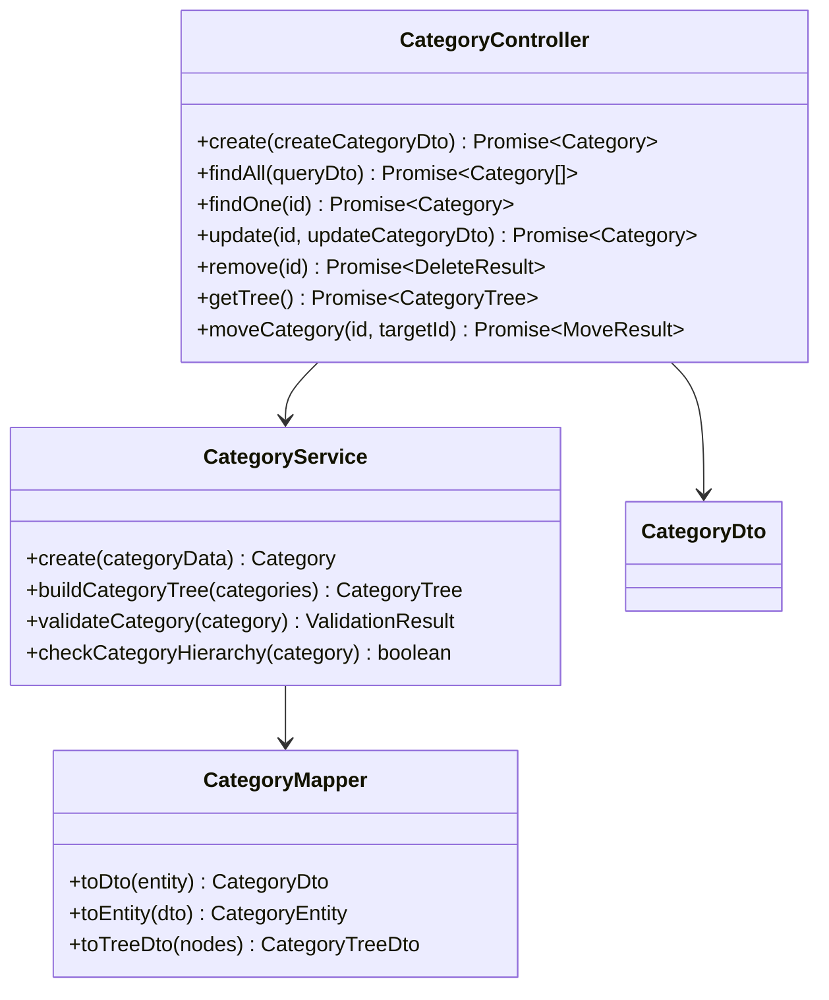

**图表来源**
- [categories.controller.ts](file://src/purely-profit/goods/categories/categories.controller.ts)
- [categories.service.ts](file://src/purely-profit/goods/categories/categories.service.ts)
- [categories.mapper.ts](file://src/purely-profit/goods/categories/categories.mapper.ts)

#### 分类查询优化

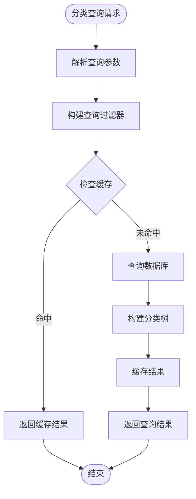

**图表来源**
- [categories.query.ts](file://src/purely-profit/goods/categories/categories.query.ts)

**章节来源**
- [categories.controller.ts](file://src/purely-profit/goods/categories/categories.controller.ts)
- [category.dto.ts](file://src/purely-profit/goods/categories/dto/category.dto.ts)

### 库存管理 API

#### 库存操作流程

库存管理提供精确的库存控制和实时更新机制：

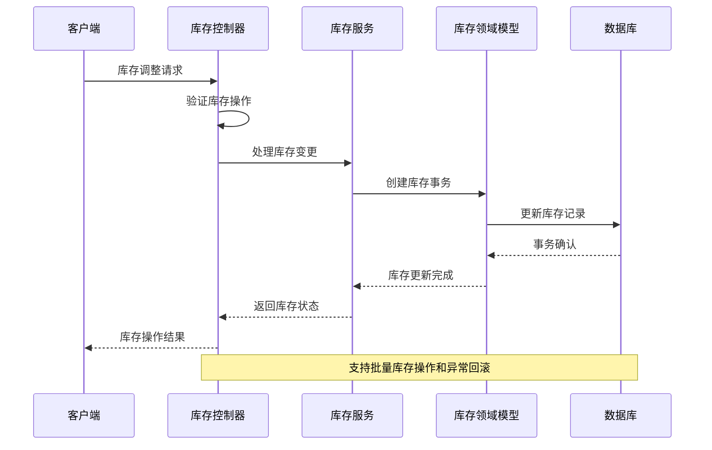

**图表来源**
- [inventory.controller.ts](file://src/purely-profit/goods/inventory/inventory.controller.ts)
- [inventory.service.ts](file://src/purely-profit/goods/inventory/inventory.service.ts)

#### 库存预警机制

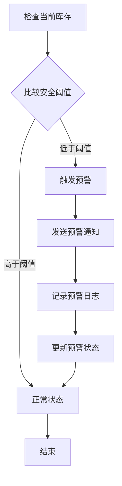

**图表来源**
- [inventory-stock.domain.ts](file://src/purely-profit/goods/inventory/inventory-stock.domain.ts)

**章节来源**
- [inventory.controller.ts](file://src/purely-profit/goods/inventory/inventory.controller.ts)
- [inventory.dto.ts](file://src/purely-profit/goods/inventory/dto/inventory.dto.ts)

### 数据模型设计

#### 商品实体关系

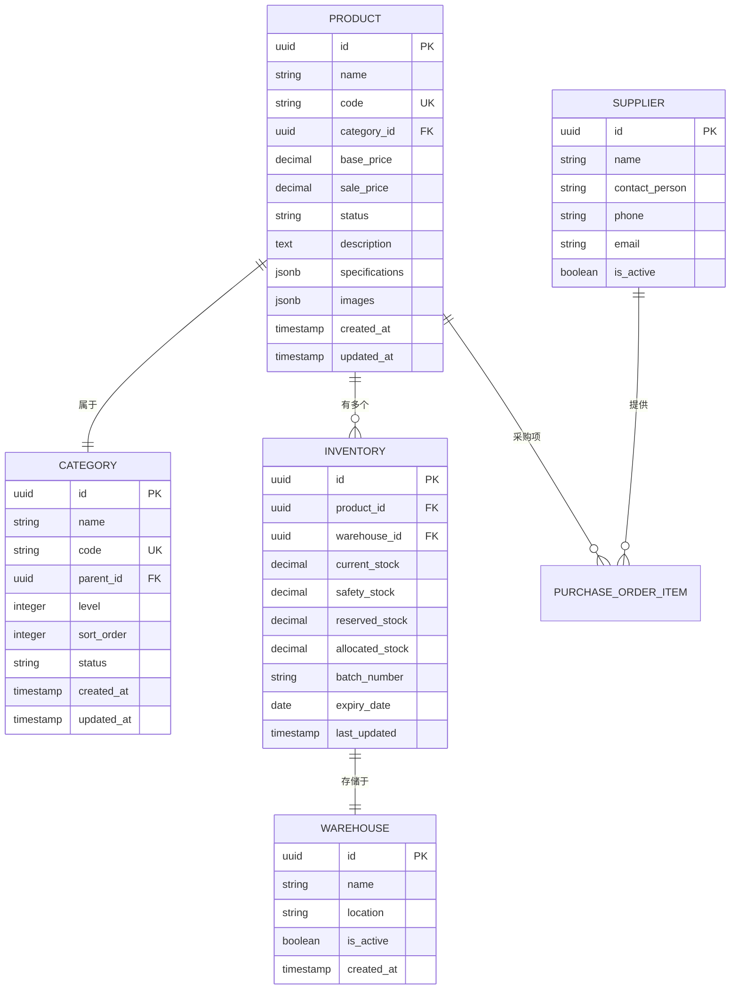

**图表来源**
- [schema.prisma](file://prisma/schema.prisma)
- [goods.catalog.prisma](file://prisma/purely-profit/goods/catalog.prisma)
- [goods.inventory.prisma](file://prisma/purely-profit/goods/inventory.prisma)

**章节来源**
- [schema.prisma](file://prisma/schema.prisma)

## 依赖关系分析

### 组件依赖图

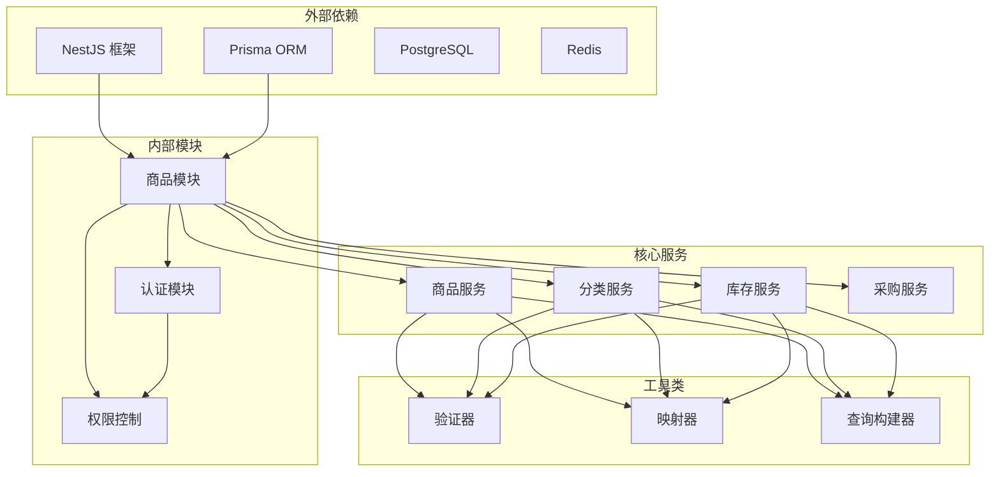

**图表来源**
- [products.controller.ts](file://src/purely-profit/goods/products/products.controller.ts)
- [categories.controller.ts](file://src/purely-profit/goods/categories/categories.controller.ts)
- [inventory.controller.ts](file://src/purely-profit/goods/inventory/inventory.controller.ts)

### 数据访问层依赖

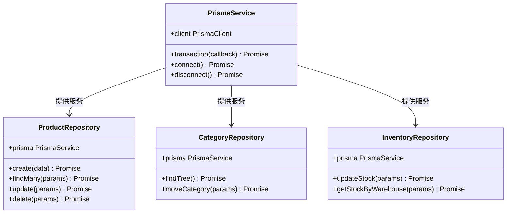

**图表来源**
- [products.service.ts](file://src/purely-profit/goods/products/products.service.ts)
- [categories.service.ts](file://src/purely-profit/goods/categories/categories.service.ts)
- [inventory.service.ts](file://src/purely-profit/goods/inventory/inventory.service.ts)

**章节来源**
- [products.service.ts](file://src/purely-profit/goods/products/products.service.ts)
- [categories.service.ts](file://src/purely-profit/goods/categories/categories.service.ts)
- [inventory.service.ts](file://src/purely-profit/goods/inventory/inventory.service.ts)

## 性能考虑

### 查询优化策略

商品管理模块采用了多层次的查询优化策略：

1. **索引优化**：在常用查询字段上建立适当索引
2. **分页查询**：大数据量场景下的分页处理
3. **缓存策略**：热点数据的缓存机制
4. **批量操作**：减少数据库往返次数

### 缓存策略

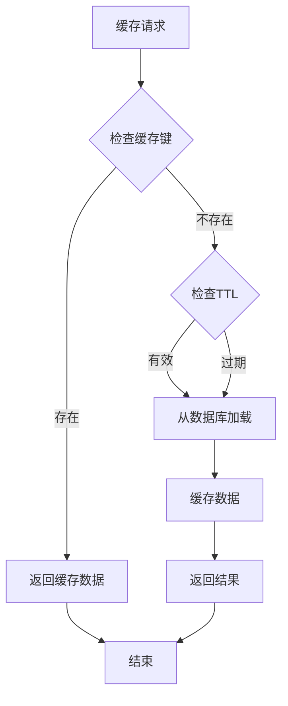

### 并发控制

系统实现了完善的并发控制机制：

- **乐观锁**：防止并发更新冲突
- **事务管理**：保证数据一致性
- **队列处理**：高并发场景下的异步处理

## 故障排除指南

### 常见问题诊断

#### 数据验证错误

当遇到数据验证错误时，检查以下方面：

1. **必填字段缺失**：确认所有必需字段都已提供
2. **数据类型不匹配**：验证数据类型是否正确
3. **范围限制**：检查数值范围和长度限制
4. **唯一性约束**：确认唯一字段的唯一性

#### 业务规则冲突

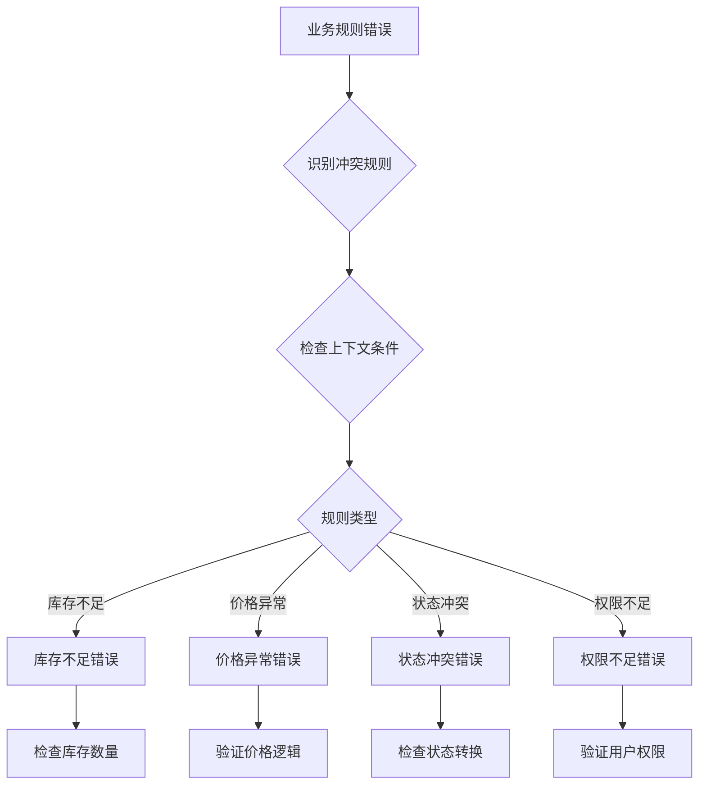

#### 数据库连接问题

当出现数据库连接问题时：

1. **检查连接字符串**：确认数据库连接配置正确
2. **网络连通性**：验证网络连接状态
3. **数据库状态**：检查数据库服务运行状态
4. **连接池配置**：调整连接池大小和超时设置

**章节来源**
- [products.service.ts](file://src/purely-profit/goods/products/products.service.ts)
- [categories.service.ts](file://src/purely-profit/goods/categories/categories.service.ts)
- [inventory.service.ts](file://src/purely-profit/goods/inventory/inventory.service.ts)

## 结论

商品管理模块是一个功能完整、架构清晰的企业级商品管理系统。通过采用分层架构设计、完善的业务规则实现和优化的数据访问策略，该模块能够满足复杂商业场景下的商品管理需求。

模块的主要优势包括：

1. **完整的功能覆盖**：从基础 CRUD 到高级业务功能的全面支持
2. **良好的扩展性**：模块化设计便于功能扩展和维护
3. **高性能设计**：多层优化策略确保系统的高效运行
4. **强健的错误处理**：完善的异常处理和恢复机制
5. **严格的权限控制**：基于角色的细粒度权限管理

该模块为企业的商品管理提供了坚实的技术基础，能够支持从小型企业到大型连锁店的各种应用场景。