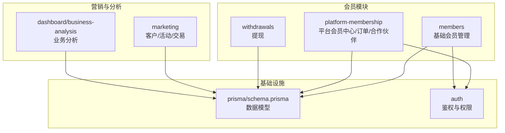
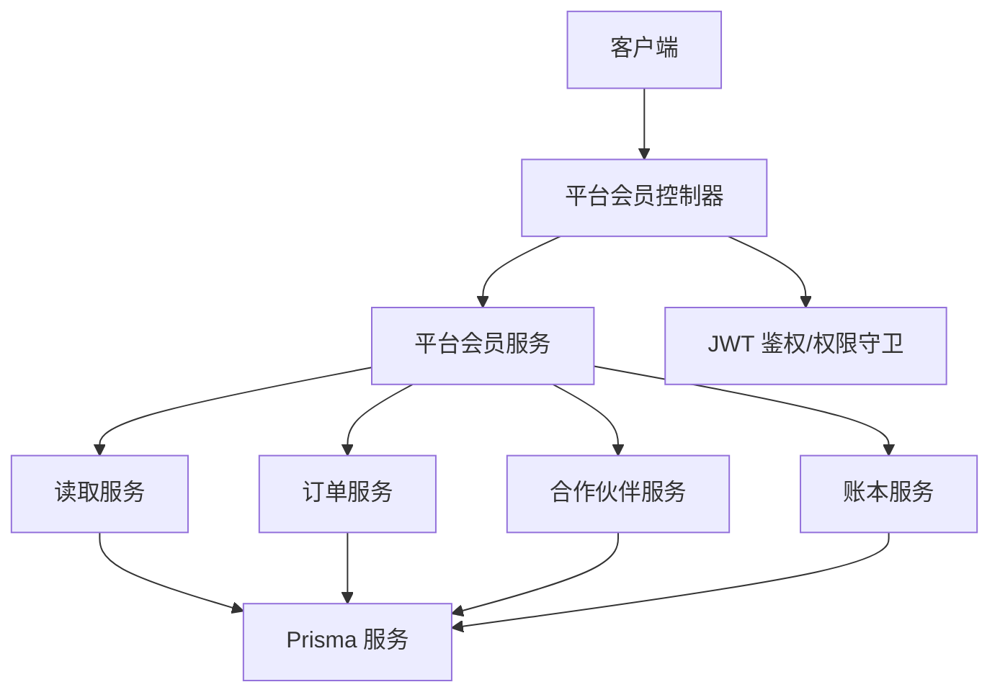
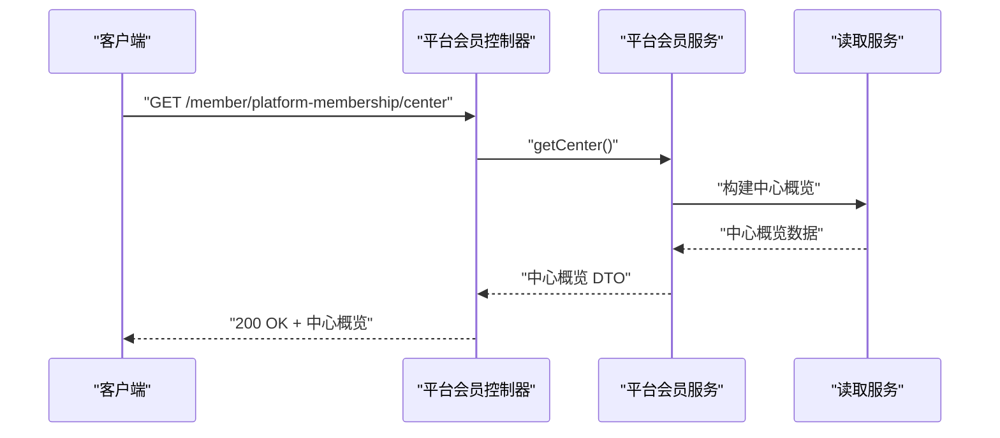
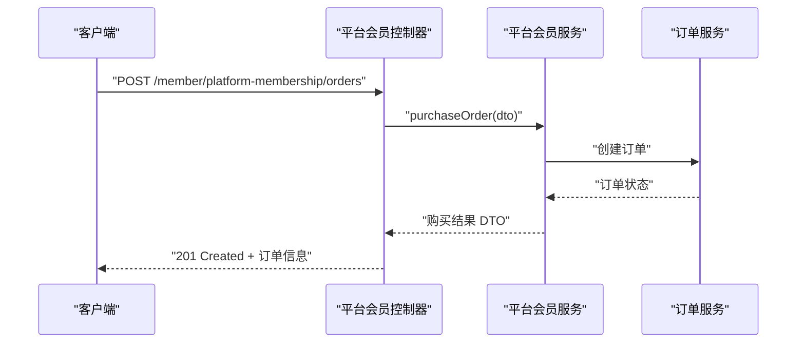
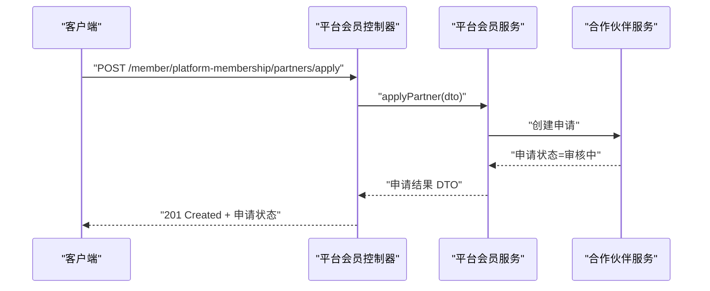
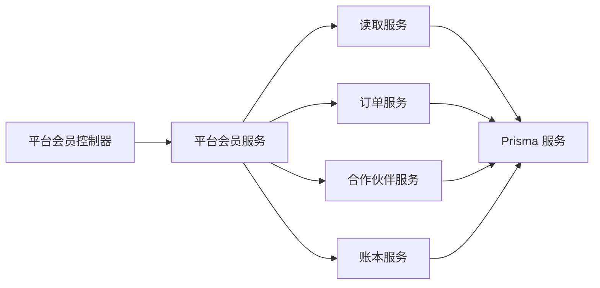

# 平台会员接口

<cite>
**本文档引用的文件**
- [src/purely-profit/member/platform-membership/platform-membership.module.ts](file://src/purely-profit/member/platform-membership/platform-membership.module.ts)
- [src/purely-profit/member/platform-membership/platform-membership.controller.ts](file://src/purely-profit/member/platform-membership/platform-membership.controller.ts)
- [src/purely-profit/member/platform-membership/platform-membership.service.ts](file://src/purely-profit/member/platform-membership/platform-membership.service.ts)
- [src/purely-profit/member/platform-membership/platform-membership-read.service.ts](file://src/purely-profit/member/platform-membership/platform-membership-read.service.ts)
- [src/purely-profit/member/platform-membership/platform-membership-order.service.ts](file://src/purely-profit/member/platform-membership/platform-membership-order.service.ts)
- [src/purely-profit/member/platform-membership/platform-membership-partner.service.ts](file://src/purely-profit/member/platform-membership/platform-membership-partner.service.ts)
- [src/purely-profit/member/platform-membership/partner-review.controller.ts](file://src/purely-profit/member/platform-membership/partner-review.controller.ts)
- [src/purely-profit/member/platform-membership/promotion-detail-compat.controller.ts](file://src/purely-profit/member/platform-membership/promotion-detail-compat.controller.ts)
- [src/purely-profit/member/platform-membership/dto/platform-membership-query.dto.ts](file://src/purely-profit/member/platform-membership/dto/platform-membership-query.dto.ts)
- [src/purely-profit/member/platform-membership/dto/platform-membership-response.dto.ts](file://src/purely-profit/member/platform-membership/dto/platform-membership-response.dto.ts)
- [src/purely-profit/member/platform-membership/platform-membership.types.ts](file://src/purely-profit/member/platform-membership/platform-membership.types.ts)
- [src/purely-profit/member/platform-membership/platform-membership.constants.ts](file://src/purely-profit/member/platform-membership/platform-membership.constants.ts)
- [prisma/schema.prisma](file://prisma/schema.prisma)
- [src/purely-profit/member/members/members.controller.ts](file://src/purely-profit/member/members/members.controller.ts)
- [src/purely-profit/member/members/members.service.ts](file://src/purely-profit/member/members/members.service.ts)
- [src/purely-profit/member/members/dto/create-member.dto.ts](file://src/purely-profit/member/members/dto/create-member.dto.ts)
- [src/purely-profit/member/members/dto/update-member.dto.ts](file://src/purely-profit/member/members/dto/update-member.dto.ts)
- [src/purely-profit/member/members/dto/member-response.dto.ts](file://src/purely-profit/member/members/dto/member-response.dto.ts)
- [src/purely-profit/member/withdrawals/withdrawals.controller.ts](file://src/purely-profit/member/withdrawals/withdrawals.controller.ts)
- [src/purely-profit/member/withdrawals/withdrawals.service.ts](file://src/purely-profit/member/withdrawals/withdrawals.service.ts)
- [src/purely-profit/member/withdrawals/dto/apply-withdrawal.dto.ts](file://src/purely-profit/member/withdrawals/dto/apply-withdrawal.dto.ts)
- [src/purely-profit/member/withdrawals/dto/review-withdrawal.dto.ts](file://src/purely-profit/member/withdrawals/dto/review-withdrawal.dto.ts)
- [src/purely-profit/member/withdrawals/dto/withdrawal-response.dto.ts](file://src/purely-profit/member/withdrawals/dto/withdrawal-response.dto.ts)
- [src/purely-profit/marketing/marketing-customers.controller.ts](file://src/purely-profit/marketing/marketing-customers.controller.ts)
- [src/purely-profit/marketing/marketing-customers.service.ts](file://src/purely-profit/marketing/marketing-customers.service.ts)
- [src/purely-profit/marketing/dto/marketing-customer-query.dto.ts](file://src/purely-profit/marketing/dto/marketing-customer-query.dto.ts)
- [src/purely-profit/marketing/dto/marketing-response.dto.ts](file://src/purely-profit/marketing/dto/marketing-response.dto.ts)
- [src/purely-profit/dashboard/business-analysis/business-analysis.controller.ts](file://src/purely-profit/dashboard/business-analysis/business-analysis.controller.ts)
- [src/purely-profit/dashboard/business-analysis/business-analysis.service.ts](file://src/purely-profit/dashboard/business-analysis/business-analysis.service.ts)
- [src/purely-profit/dashboard/business-analysis/dto/business-analysis-query-input.dto.ts](file://src/purely-profit/dashboard/business-analysis/dto/business-analysis-query-input.dto.ts)
- [src/purely-profit/dashboard/business-analysis/business-analysis.types.ts](file://src/purely-profit/dashboard/business-analysis/business-analysis.types.ts)
</cite>

## 目录
1. [简介](#简介)
2. [项目结构](#项目结构)
3. [核心组件](#核心组件)
4. [架构总览](#架构总览)
5. [详细组件分析](#详细组件分析)
6. [依赖关系分析](#依赖关系分析)
7. [性能考虑](#性能考虑)
8. [故障排除指南](#故障排除指南)
9. [结论](#结论)
10. [附录](#附录)

## 简介
本文件为平台会员模块的全面 API 接口文档，覆盖以下核心能力：
- 会员等级与权益：会员中心概览、会员档案、会员订单查询与购买、积分与豆子日志查询
- 合作伙伴管理：合作伙伴申请、审核、跟进、已批准合作伙伴列表与档案
- 会员订单处理：会员套餐购买、订单查询、订单状态流转
- 数据分析与营销：客户画像与消费分析、营销活动统计、业务分析看板
- 收益与提现：收益相关接口（如适用）、提现申请与审核
- 平台治理与合规：权限控制、子账号访问限制、审计上下文

本接口文档以实际源码为依据，提供端点定义、请求/响应结构、鉴权与权限要求、错误处理策略，并给出关键流程的时序图与类图。

## 项目结构
平台会员模块位于 `src/purely-profit/member`，主要分为三部分：
- members：基础会员管理（增删改查、积分/豆子、概览）
- platform-membership：平台会员中心、订单、合作伙伴、促销兼容、子账号服务
- withdrawals：提现相关接口

图表来源
- [src/purely-profit/member/platform-membership/platform-membership.module.ts:17-42](file://src/purely-profit/member/platform-membership/platform-membership.module.ts#L17-L42)
- [prisma/schema.prisma](file://prisma/schema.prisma)

章节来源
- [src/purely-profit/member/platform-membership/platform-membership.module.ts:17-42](file://src/purely-profit/member/platform-membership/platform-membership.module.ts#L17-L42)

## 核心组件
- 控制器层
  - 平台会员控制器：提供会员中心、订单、促销兼容、合作伙伴相关接口
  - 合伙伙伴审核控制器：处理合作伙伴审核流程
  - 提现控制器：处理提现申请与审核
  - 基础会员控制器：提供会员增删改查、积分/豆子、概览等接口
- 服务层
  - 平台会员服务：组合读取、订单、合作伙伴、账本等服务，提供业务逻辑
  - 平台会员读取服务：查询会员中心、档案、订单、计划等
  - 平台会员订单服务：处理会员购买订单
  - 平台会员合作伙伴服务：处理合作伙伴申请与审核
  - 提现服务：处理提现流程
  - 基础会员服务：处理会员生命周期管理
- DTO 层
  - 查询 DTO：定义请求参数结构
  - 响应 DTO：定义返回数据结构
- 类型与常量
  - 平台会员类型定义：枚举、联合类型、配置
  - 平台会员常量：状态码、规则、默认值

章节来源
- [src/purely-profit/member/platform-membership/platform-membership.controller.ts](file://src/purely-profit/member/platform-membership/platform-membership.controller.ts)
- [src/purely-profit/member/platform-membership/platform-membership.service.ts:1-30](file://src/purely-profit/member/platform-membership/platform-membership.service.ts#L1-L30)
- [src/purely-profit/member/platform-membership/platform-membership-read.service.ts:84-119](file://src/purely-profit/member/platform-membership/platform-membership-read.service.ts#L84-L119)
- [src/purely-profit/member/platform-membership/platform-membership-order.service.ts](file://src/purely-profit/member/platform-membership/platform-membership-order.service.ts)
- [src/purely-profit/member/platform-membership/platform-membership-partner.service.ts](file://src/purely-profit/member/platform-membership/platform-membership-partner.service.ts)
- [src/purely-profit/member/platform-membership/dto/platform-membership-query.dto.ts](file://src/purely-profit/member/platform-membership/dto/platform-membership-query.dto.ts)
- [src/purely-profit/member/platform-membership/dto/platform-membership-response.dto.ts](file://src/purely-profit/member/platform-membership/dto/platform-membership-response.dto.ts)
- [src/purely-profit/member/platform-membership/platform-membership.types.ts](file://src/purely-profit/member/platform-membership/platform-membership.types.ts)
- [src/purely-profit/member/platform-membership/platform-membership.constants.ts](file://src/purely-profit/member/platform-membership/platform-membership.constants.ts)

## 架构总览
平台会员模块采用 NestJS 模块化架构，控制器负责路由与参数校验，服务层封装业务逻辑，DTO 定义输入输出契约，Prisma 负责数据持久化。权限通过 JWT 鉴权与权限守卫控制，子账号访问在服务层进行严格限制。

图表来源
- [src/purely-profit/member/platform-membership/platform-membership.controller.ts](file://src/purely-profit/member/platform-membership/platform-membership.controller.ts)
- [src/purely-profit/member/platform-membership/platform-membership.service.ts:1-30](file://src/purely-profit/member/platform-membership/platform-membership.service.ts#L1-L30)
- [src/purely-profit/member/platform-membership/platform-membership-read.service.ts:84-119](file://src/purely-profit/member/platform-membership/platform-membership-read.service.ts#L84-L119)
- [src/purely-profit/member/platform-membership/platform-membership-order.service.ts](file://src/purely-profit/member/platform-membership/platform-membership-order.service.ts)
- [src/purely-profit/member/platform-membership/platform-membership-partner.service.ts](file://src/purely-profit/member/platform-membership/platform-membership-partner.service.ts)
- [src/purely-profit/member/platform-membership/platform-membership-ledger.service.ts](file://src/purely-profit/member/platform-membership/platform-membership-ledger.service.ts)

## 详细组件分析

### 1) 会员中心与档案
- 功能概述
  - 获取会员中心概览（会员信息、剩余天数、统计、已购订单数、当前合作伙伴申请、已批准合作伙伴）
  - 获取会员档案（基于门店 ID）
  - 列出会员订单
- 关键接口
  - GET /member/platform-membership/center
  - GET /member/platform-membership/profile
  - GET /member/platform-membership/orders
- 请求参数与响应
  - 请求参数：由查询 DTO 定义（分页、筛选条件等）
  - 响应结构：中心概览、档案、订单列表 DTO
- 权限与安全
  - 需要登录态；子账号访问在服务层被拒绝
- 错误处理
  - 未找到会员档案、权限不足、参数校验失败等

图表来源
- [src/purely-profit/member/platform-membership/platform-membership.controller.ts](file://src/purely-profit/member/platform-membership/platform-membership.controller.ts)
- [src/purely-profit/member/platform-membership/platform-membership.service.ts:1-30](file://src/purely-profit/member/platform-membership/platform-membership.service.ts#L1-L30)
- [src/purely-profit/member/platform-membership/platform-membership-read.service.ts:84-119](file://src/purely-profit/member/platform-membership/platform-membership-read.service.ts#L84-L119)

章节来源
- [src/purely-profit/member/platform-membership/platform-membership.controller.ts](file://src/purely-profit/member/platform-membership/platform-membership.controller.ts)
- [src/purely-profit/member/platform-membership/platform-membership-read.service.ts:84-119](file://src/purely-profit/member/platform-membership/platform-membership-read.service.ts#L84-L119)
- [src/purely-profit/member/platform-membership/dto/platform-membership-query.dto.ts](file://src/purely-profit/member/platform-membership/dto/platform-membership-query.dto.ts)
- [src/purely-profit/member/platform-membership/dto/platform-membership-response.dto.ts](file://src/purely-profit/member/platform-membership/dto/platform-membership-response.dto.ts)

### 2) 会员订单处理
- 功能概述
  - 创建会员购买订单
  - 查询会员订单列表
- 关键接口
  - POST /member/platform-membership/orders
  - GET /member/platform-membership/orders
- 请求参数与响应
  - 请求参数：购买订单 DTO（包含套餐 ID、数量等）
  - 响应结构：订单列表 DTO、购买结果 DTO
- 流程说明
  - 订单创建后进入待支付或待审核状态，后续由订单服务推进状态
- 错误处理
  - 套餐不存在、余额不足、参数校验失败等

图表来源
- [src/purely-profit/member/platform-membership/platform-membership.controller.ts](file://src/purely-profit/member/platform-membership/platform-membership.controller.ts)
- [src/purely-profit/member/platform-membership/platform-membership.service.ts:1-30](file://src/purely-profit/member/platform-membership/platform-membership.service.ts#L1-L30)
- [src/purely-profit/member/platform-membership/platform-membership-order.service.ts](file://src/purely-profit/member/platform-membership/platform-membership-order.service.ts)

章节来源
- [src/purely-profit/member/platform-membership/platform-membership.controller.ts](file://src/purely-profit/member/platform-membership/platform-membership.controller.ts)
- [src/purely-profit/member/platform-membership/platform-membership-order.service.ts](file://src/purely-profit/member/platform-membership/platform-membership-order.service.ts)
- [src/purely-profit/member/platform-membership/dto/platform-membership-query.dto.ts](file://src/purely-profit/member/platform-membership/dto/platform-membership-query.dto.ts)
- [src/purely-profit/member/platform-membership/dto/platform-membership-response.dto.ts](file://src/purely-profit/member/platform-membership/dto/platform-membership-response.dto.ts)

### 3) 会员权益与积分/豆子
- 功能概述
  - 查询会员积分日志
  - 查询会员豆子日志
- 关键接口
  - GET /member/platform-membership/points/logs
  - GET /member/platform-membership/beans/logs
- 请求参数与响应
  - 请求参数：分页与筛选条件
  - 响应结构：积分/豆子日志 DTO
- 权限与安全
  - 需要登录态；子账号访问在服务层被拒绝

章节来源
- [src/purely-profit/member/platform-membership/platform-membership.controller.ts](file://src/purely-profit/member/platform-membership/platform-membership.controller.ts)
- [src/purely-profit/member/platform-membership/platform-membership-read.service.ts:84-119](file://src/purely-profit/member/platform-membership/platform-membership-read.service.ts#L84-L119)
- [src/purely-profit/member/platform-membership/dto/platform-membership-query.dto.ts](file://src/purely-profit/member/platform-membership/dto/platform-membership-query.dto.ts)
- [src/purely-profit/member/platform-membership/dto/platform-membership-response.dto.ts](file://src/purely-profit/member/platform-membership/dto/platform-membership-response.dto.ts)

### 4) 合作伙伴管理
- 功能概述
  - 申请成为合作伙伴
  - 查看合作伙伴档案
  - 审核合作伙伴申请（复审控制器）
  - 添加合作伙伴跟进备注
  - 列出已批准合作伙伴
- 关键接口
  - POST /member/platform-membership/partners/apply
  - GET /member/platform-membership/partners/profile
  - POST /member/platform-membership/partners/review
  - POST /member/platform-membership/partners/follow-up
  - GET /member/platform-membership/partners/approved
- 请求参数与响应
  - 申请 DTO：包含申请资料
  - 审核 DTO：包含审核意见与状态
  - 响应结构：合作伙伴档案、申请状态、审批历史 DTO
- 流程说明
  - 申请提交后进入“审核中”状态，管理员可进行“通过/拒绝/取消”，并添加跟进备注
- 错误处理
  - 重复申请、权限不足、状态不合法等

图表来源
- [src/purely-profit/member/platform-membership/platform-membership.controller.ts](file://src/purely-profit/member/platform-membership/platform-membership.controller.ts)
- [src/purely-profit/member/platform-membership/platform-membership.service.ts:1-30](file://src/purely-profit/member/platform-membership/platform-membership.service.ts#L1-L30)
- [src/purely-profit/member/platform-membership/platform-membership-partner.service.ts](file://src/purely-profit/member/platform-membership/platform-membership-partner.service.ts)

章节来源
- [src/purely-profit/member/platform-membership/platform-membership.controller.ts](file://src/purely-profit/member/platform-membership/platform-membership.controller.ts)
- [src/purely-profit/member/platform-membership/partner-review.controller.ts](file://src/purely-profit/member/platform-membership/partner-review.controller.ts)
- [src/purely-profit/member/platform-membership/platform-membership-partner.service.ts](file://src/purely-profit/member/platform-membership/platform-membership-partner.service.ts)
- [src/purely-profit/member/platform-membership/dto/platform-membership-query.dto.ts](file://src/purely-profit/member/platform-membership/dto/platform-membership-query.dto.ts)
- [src/purely-profit/member/platform-membership/dto/platform-membership-response.dto.ts](file://src/purely-profit/member/platform-membership/dto/platform-membership-response.dto.ts)

### 5) 促销与营销兼容
- 功能概述
  - 获取促销中心
  - 兼容促销详情
- 关键接口
  - GET /member/platform-membership/promo-center
  - GET /member/platform-membership/promo-detail
- 请求参数与响应
  - 响应结构：促销中心 DTO、促销详情 DTO
- 用途
  - 为前端提供统一的促销入口与兼容层

章节来源
- [src/purely-profit/member/platform-membership/promotion-detail-compat.controller.ts](file://src/purely-profit/member/platform-membership/promotion-detail-compat.controller.ts)
- [src/purely-profit/member/platform-membership/platform-membership.controller.ts](file://src/purely-profit/member/platform-membership/platform-membership.controller.ts)
- [src/purely-profit/member/platform-membership/dto/platform-membership-response.dto.ts](file://src/purely-profit/member/platform-membership/dto/platform-membership-response.dto.ts)

### 6) 子账号与权限控制
- 功能概述
  - 子账号登录与读取服务
  - 子账号访问限制：在会员中心等敏感接口上拒绝子账号访问
- 关键接口
  - 子账号登录、读取服务接口
- 权限控制
  - 通过权限守卫与服务层判断用户主体类型，拒绝子账号访问

章节来源
- [src/purely-profit/member/platform-membership/store-sub-account-login.service.ts](file://src/purely-profit/member/platform-membership/store-sub-account-login.service.ts)
- [src/purely-profit/member/platform-membership/store-sub-account-read.service.ts](file://src/purely-profit/member/platform-membership/store-sub-account-read.service.ts)
- [src/purely-profit/member/platform-membership/platform-membership-access.service.ts](file://src/purely-profit/member/platform-membership/platform-membership-access.service.ts)
- [src/purely-profit/member/platform-membership/platform-membership.service.spec.ts:288-302](file://src/purely-profit/member/platform-membership/platform-membership.service.spec.ts#L288-L302)

### 7) 基础会员管理
- 功能概述
  - 创建会员、更新会员、查询会员、会员概览
- 关键接口
  - POST /member/members
  - PUT /member/members/{id}
  - GET /member/members/{id}
  - GET /member/members/overview
- 请求参数与响应
  - 创建/更新 DTO：包含会员基本信息
  - 响应结构：会员响应 DTO
- 与平台会员的关系
  - 基础会员是平台会员体系的底层实体，平台会员在此基础上扩展权益与订单

章节来源
- [src/purely-profit/member/members/members.controller.ts](file://src/purely-profit/member/members/members.controller.ts)
- [src/purely-profit/member/members/members.service.ts](file://src/purely-profit/member/members/members.service.ts)
- [src/purely-profit/member/members/dto/create-member.dto.ts](file://src/purely-profit/member/members/dto/create-member.dto.ts)
- [src/purely-profit/member/members/dto/update-member.dto.ts](file://src/purely-profit/member/members/dto/update-member.dto.ts)
- [src/purely-profit/member/members/dto/member-response.dto.ts](file://src/purely-profit/member/members/dto/member-response.dto.ts)

### 8) 提现管理
- 功能概述
  - 提交提现申请
  - 审核提现申请
  - 查询提现结果
- 关键接口
  - POST /member/withdrawals/apply
  - POST /member/withdrawals/review
  - GET /member/withdrawals
- 请求参数与响应
  - 申请 DTO：包含金额、账户信息
  - 审核 DTO：包含审核意见与状态
  - 响应结构：提现响应 DTO

章节来源
- [src/purely-profit/member/withdrawals/withdrawals.controller.ts](file://src/purely-profit/member/withdrawals/withdrawals.controller.ts)
- [src/purely-profit/member/withdrawals/withdrawals.service.ts](file://src/purely-profit/member/withdrawals/withdrawals.service.ts)
- [src/purely-profit/member/withdrawals/dto/apply-withdrawal.dto.ts](file://src/purely-profit/member/withdrawals/dto/apply-withdrawal.dto.ts)
- [src/purely-profit/member/withdrawals/dto/review-withdrawal.dto.ts](file://src/purely-profit/member/withdrawals/dto/review-withdrawal.dto.ts)
- [src/purely-profit/member/withdrawals/dto/withdrawal-response.dto.ts](file://src/purely-profit/member/withdrawals/dto/withdrawal-response.dto.ts)

### 9) 营销与数据分析
- 客户与消费分析
  - 查询客户列表、消费记录、充值记录
- 业务分析看板
  - 销售趋势、利润明细、概览统计
- 关键接口
  - GET /marketing/customers
  - GET /marketing/consumptions
  - GET /marketing/recharges
  - GET /dashboard/business-analysis/sales-trend
  - GET /dashboard/business-analysis/profit-detail
  - GET /dashboard/business-analysis/overview

章节来源
- [src/purely-profit/marketing/marketing-customers.controller.ts](file://src/purely-profit/marketing/marketing-customers.controller.ts)
- [src/purely-profit/marketing/marketing-customers.service.ts](file://src/purely-profit/marketing/marketing-customers.service.ts)
- [src/purely-profit/dashboard/business-analysis/business-analysis.controller.ts](file://src/purely-profit/dashboard/business-analysis/business-analysis.controller.ts)
- [src/purely-profit/dashboard/business-analysis/business-analysis.service.ts](file://src/purely-profit/dashboard/business-analysis/business-analysis.service.ts)

## 依赖关系分析
- 组件耦合
  - 控制器仅依赖服务接口，降低耦合度
  - 服务层内部通过读取、订单、合作伙伴、账本服务协作
- 外部依赖
  - Prisma 作为 ORM，负责数据模型与查询
  - JWT 鉴权与权限守卫保障接口安全
- 可能的循环依赖
  - 模块间通过 forwardRef 引入，避免循环依赖问题

图表来源
- [src/purely-profit/member/platform-membership/platform-membership.controller.ts](file://src/purely-profit/member/platform-membership/platform-membership.controller.ts)
- [src/purely-profit/member/platform-membership/platform-membership.service.ts:1-30](file://src/purely-profit/member/platform-membership/platform-membership.service.ts#L1-L30)
- [src/purely-profit/member/platform-membership/platform-membership-read.service.ts:84-119](file://src/purely-profit/member/platform-membership/platform-membership-read.service.ts#L84-L119)
- [src/purely-profit/member/platform-membership/platform-membership-order.service.ts](file://src/purely-profit/member/platform-membership/platform-membership-order.service.ts)
- [src/purely-profit/member/platform-membership/platform-membership-partner.service.ts](file://src/purely-profit/member/platform-membership/platform-membership-partner.service.ts)
- [src/purely-profit/member/platform-membership/platform-membership-ledger.service.ts](file://src/purely-profit/member/platform-membership/platform-membership-ledger.service.ts)

章节来源
- [src/purely-profit/member/platform-membership/platform-membership.module.ts:17-42](file://src/purely-profit/member/platform-membership/platform-membership.module.ts#L17-L42)

## 性能考虑
- 缓存与预热
  - 使用 Redis 缓存与预热服务，减少数据库压力
- 批量查询
  - 在读取服务中使用 Promise.all 并行加载多个数据源
- 分页与索引
  - 查询 DTO 支持分页；数据库迁移中包含索引优化
- 事务与一致性
  - 订单与账本操作建议使用事务，确保数据一致性

## 故障排除指南
- 常见错误
  - 403 Forbidden：子账号访问被拒绝
  - 404 Not Found：会员档案不存在
  - 400 Bad Request：参数校验失败
  - 409 Conflict：状态冲突（如重复申请）
- 排查步骤
  - 检查 JWT 令牌是否有效
  - 确认用户主体类型（主账号/子账号）
  - 核对请求参数与 DTO 字段
  - 查看 Prisma 日志与数据库状态

章节来源
- [src/purely-profit/member/platform-membership/platform-membership.service.spec.ts:288-302](file://src/purely-profit/member/platform-membership/platform-membership.service.spec.ts#L288-L302)

## 结论
平台会员模块提供了完整的会员等级与权益、订单处理、合作伙伴管理、积分/豆子、营销与数据分析能力。通过清晰的控制器-服务-DTO 分层与严格的权限控制，确保了接口的安全性与可维护性。建议在生产环境中结合缓存、索引与事务机制进一步提升性能与一致性。

## 附录
- 数据模型概览（与会员相关的关键表）
  - 会员表：存储会员基本信息
  - 会员订单表：存储会员购买订单
  - 合作伙伴表：存储合作伙伴申请与状态
  - 积分/豆子日志表：存储积分与豆子变动记录
  - 提现表：存储提现申请与审核记录

章节来源
- [prisma/schema.prisma](file://prisma/schema.prisma)