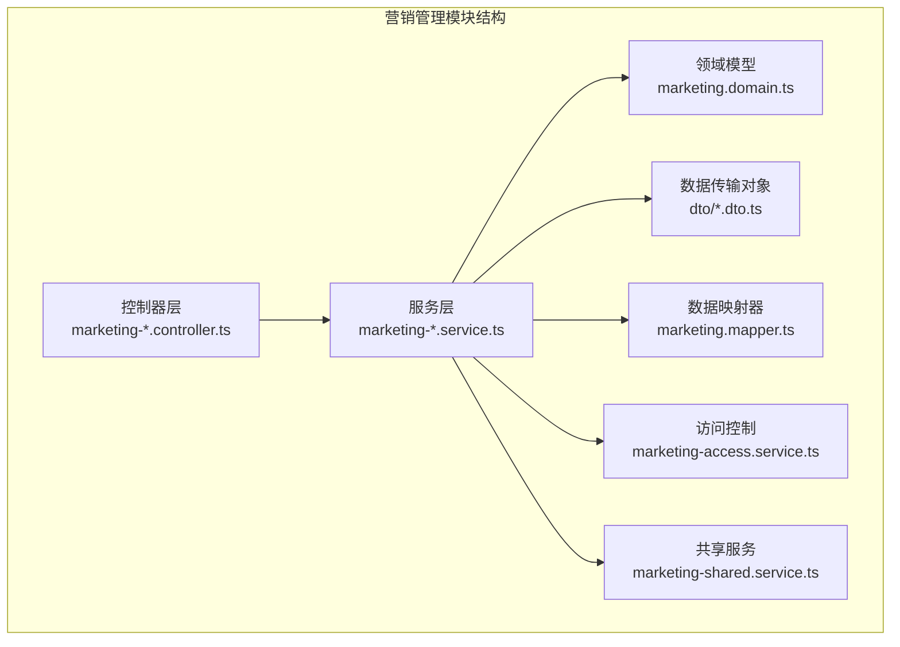
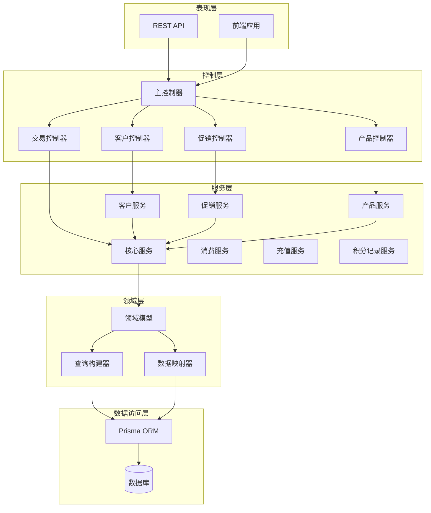
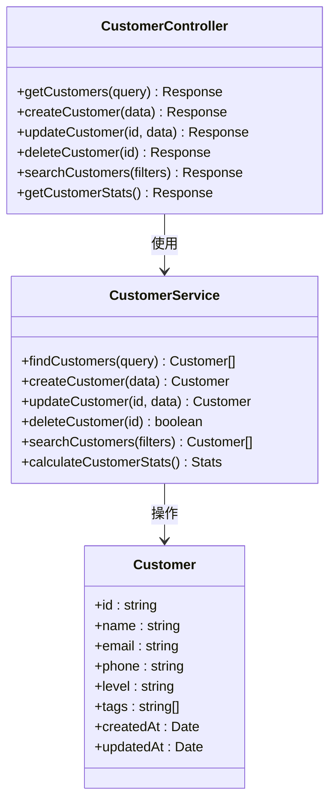
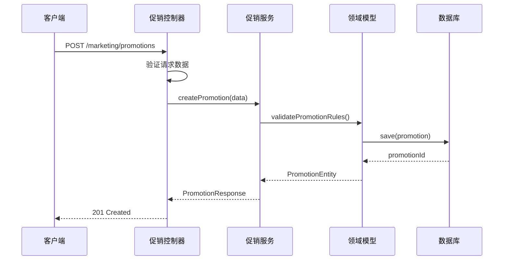
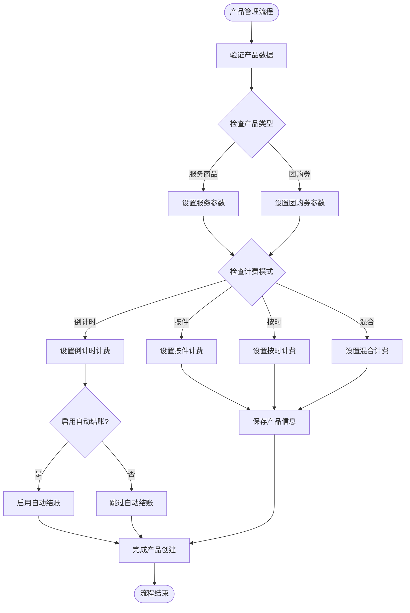
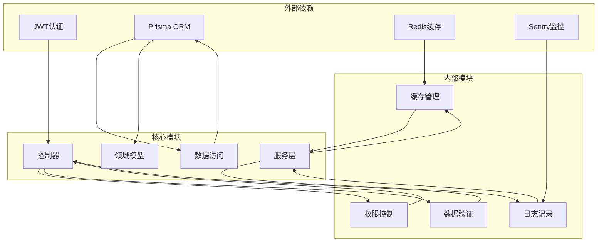

# 营销管理接口

<cite>
**本文档引用的文件**
- [marketing-products.controller.ts](file://src/purely-profit/marketing/marketing-products.controller.ts)
- [marketing-products.service.ts](file://src/purely-profit/marketing/marketing-products.service.ts)
- [marketing-products.facade.service.ts](file://src/purely-profit/marketing/marketing-products.facade.service.ts)
- [marketing-product.dto.ts](file://src/purely-profit/marketing/dto/marketing-product.dto.ts)
- [marketing.utils.ts](file://src/purely-profit/marketing/marketing.utils.ts)
- [space-session-open.service.spec.ts](file://src/purely-profit/operations/spaces/space-session-open.service.spec.ts)
- [sales-record.domain.ts](file://src/purely-profit/operations/sales-record/sales-record.domain.ts)
- [space-sessions.types.ts](file://src/purely-profit/operations/spaces/space-sessions.types.ts)
</cite>

## 更新摘要
**变更内容**
- 新增服务产品和团购券产品类型支持，扩展产品类型枚举
- 新增多种计费模式：按件、按时、混合、倒计时计费
- 新增自动结账功能，支持倒计时模式下到期自动结算
- 新增计时单价自动计算接口，支持按小时和按次两种计算模式
- 增强团购券订单处理，支持平台结算和券码核销流程

## 目录
1. [简介](#简介)
2. [项目结构](#项目结构)
3. [核心组件](#核心组件)
4. [架构概览](#架构概览)
5. [详细组件分析](#详细组件分析)
6. [依赖关系分析](#依赖关系分析)
7. [性能考虑](#性能考虑)
8. [故障排除指南](#故障排除指南)
9. [结论](#结论)

## 简介

营销管理模块是PurelyProfit平台的核心功能模块之一，负责处理所有与营销相关的业务逻辑。该模块提供了完整的客户管理、促销活动、营销产品、消费记录、积分管理等核心功能接口，并支持会员营销、社交营销、内容营销等扩展功能。

**更新** 本次更新重点增强了营销产品模块，新增服务产品和团购券产品类型，支持多种计费模式和自动结账功能，为门店提供更灵活的营销产品配置能力。

该模块采用分层架构设计，包括控制器层、服务层、领域层和数据访问层，确保了代码的可维护性和可扩展性。所有接口都遵循RESTful API规范，并实现了严格的权限控制和数据验证机制。

## 项目结构

营销管理模块位于`src/purely-profit/marketing/`目录下，采用按功能域划分的组织方式：

**图表来源**
- [marketing-products.controller.ts:50-132](file://src/purely-profit/marketing/marketing-products.controller.ts#L50-L132)
- [marketing-products.service.ts:42-368](file://src/purely-profit/marketing/marketing-products.service.ts#L42-L368)
- [marketing-products.facade.service.ts:21-109](file://src/purely-profit/marketing/marketing-products.facade.service.ts#L21-L109)

## 核心组件

营销管理模块包含以下核心组件：

### 控制器层
- **主控制器**：统一入口点，协调各个子功能
- **客户控制器**：处理客户相关操作
- **促销控制器**：管理促销活动生命周期
- **产品控制器**：维护营销产品信息，支持多种计费模式
- **交易控制器**：记录和查询交易数据
- **概览控制器**：提供营销数据分析
- **产品分类控制器**：管理产品分类体系

### 服务层
- **核心服务**：实现主要业务逻辑
- **客户服务**：处理客户数据管理
- **促销服务**：管理促销活动规则
- **产品服务**：维护产品信息，支持服务产品和团购券
- **消费服务**：处理消费记录
- **充值服务**：管理账户充值
- **积分记录服务**：跟踪积分变动

### 数据传输对象(DTO)
- 查询参数DTO：标准化查询条件
- 响应DTO：统一响应格式
- 业务DTO：封装业务实体，支持新的计费模式参数

**章节来源**
- [marketing-products.controller.ts:50-132](file://src/purely-profit/marketing/marketing-products.controller.ts#L50-L132)
- [marketing-products.service.ts:42-368](file://src/purely-profit/marketing/marketing-products.service.ts#L42-L368)
- [marketing-product.dto.ts:92-625](file://src/purely-profit/marketing/dto/marketing-product.dto.ts#L92-L625)

## 架构概览

营销管理模块采用分层架构，确保关注点分离和代码复用：

**图表来源**
- [marketing-products.controller.ts:50-132](file://src/purely-profit/marketing/marketing-products.controller.ts#L50-L132)
- [marketing-products.service.ts:42-368](file://src/purely-profit/marketing/marketing-products.service.ts#L42-L368)
- [marketing-products.facade.service.ts:21-109](file://src/purely-profit/marketing/marketing-products.facade.service.ts#L21-L109)

## 详细组件分析

### 客户管理模块

客户管理模块提供完整的客户生命周期管理功能：

#### 核心功能
- 客户信息维护
- 客户行为分析
- 客户分群管理
- 客户等级体系
- 客户标签系统

#### 主要接口
- 获取客户列表
- 创建新客户
- 更新客户信息
- 删除客户
- 客户搜索和筛选
- 客户统计分析

**章节来源**
- [marketing-customers.controller.ts](file://src/purely-profit/marketing/marketing-customers.controller.ts)
- [marketing-customers.service.ts](file://src/purely-profit/marketing/marketing-customers.service.ts)

### 促销活动模块

促销活动模块管理各种类型的营销活动：

#### 支持的促销类型
- 折扣促销
- 满减活动
- 买赠活动
- 第二件半价
- 限时秒杀

#### 核心功能
- 促销活动创建和配置
- 活动状态管理
- 参与条件设置
- 奖励规则定义
- 活动效果追踪

#### 主要接口
- 创建促销活动
- 更新活动配置
- 启停活动
- 查看活动详情
- 活动参与统计
- 奖励发放

**章节来源**
- [marketing-promotions.controller.ts](file://src/purely-profit/marketing/marketing-promotions.controller.ts)
- [marketing-promotions.service.ts](file://src/purely-profit/marketing/marketing-promotions.service.ts)

### 营销产品模块

营销产品模块管理可销售的产品和营销素材，**已更新**支持服务产品和团购券类型。

#### 产品类型
- **服务商品**：提供服务类产品的管理和销售
- **团购券商品**：支付后生成团购券，支持多平台结算
- **实体产品**：传统实物商品
- **虚拟产品**：数字产品和服务包

#### 计费模式
- **按件计费(items)**：纯消费模式，按购买数量计费
- **按时计费(timed)**：按服务时长计费，需要设置计时单价
- **混合计费(mixed)**：结合按件和按时计费
- **倒计时计费(countdown)**：预设时长和台位费，支持自动结账

#### 核心功能
- 产品信息管理
- 库存控制
- 价格策略
- 产品分类
- 产品关联
- 自动结账管理

#### 主要接口
- 获取产品列表
- 创建产品
- 更新产品信息
- 产品上下架
- 产品搜索
- 产品统计
- **新增**：计时单价自动计算

**图表来源**
- [marketing-products.service.ts:98-163](file://src/purely-profit/marketing/marketing-products.service.ts#L98-L163)
- [marketing-product.dto.ts:92-273](file://src/purely-profit/marketing/dto/marketing-product.dto.ts#L92-L273)

**章节来源**
- [marketing-products.controller.ts:50-132](file://src/purely-profit/marketing/marketing-products.controller.ts#L50-L132)
- [marketing-products.service.ts:42-368](file://src/purely-profit/marketing/marketing-products.service.ts#L42-L368)
- [marketing-product.dto.ts:92-625](file://src/purely-profit/marketing/dto/marketing-product.dto.ts#L92-L625)

### 消费记录模块

消费记录模块跟踪和分析客户的购买行为：

#### 记录类型
- 产品购买
- 服务消费
- 积分抵扣
- 优惠券使用
- **新增**：团购券消费

#### 分析维度
- 时间趋势分析
- 客户行为分析
- 产品偏好分析
- 地区分布分析

#### 主要接口
- 获取消费记录
- 消费统计分析
- 行为模式识别
- 客户价值评估

**章节来源**
- [marketing-consumptions.service.ts](file://src/purely-profit/marketing/marketing-consumptions.service.ts)

### 积分管理模块

积分管理模块处理会员的积分获取、使用和兑换：

#### 积分来源
- 消费返现
- 注册奖励
- 分享推广
- 评价奖励

#### 积分用途
- 商品抵扣
- 兑换礼品
- 升级会员
- 优惠券兑换

#### 主要接口
- 积分查询
- 积分明细
- 积分兑换
- 积分统计

**章节来源**
- [marketing-points-records.service.ts](file://src/purely-profit/marketing/marketing-points-records.service.ts)

### 交易管理模块

交易管理模块提供统一的交易处理接口：

#### 交易类型
- 在线支付
- 现金交易
- 积分支付
- 组合支付
- **新增**：团购券支付

#### 核心功能
- 交易创建
- 支付处理
- 交易确认
- 退款处理
- 交易对账

**章节来源**
- [marketing-transactions.controller.ts](file://src/purely-profit/marketing/marketing-transactions.controller.ts)

### 概览分析模块

概览分析模块提供营销数据的综合分析：

#### 分析指标
- 销售额统计
- 客户增长趋势
- 转化率分析
- ROI计算
- 市场份额

#### 主要接口
- 营销概览数据
- 实时监控面板
- 自定义报表
- 导出分析结果

**章节来源**
- [marketing-overview.controller.ts](file://src/purely-profit/marketing/marketing-overview.controller.ts)

### 新增功能详解

#### 服务产品和团购券支持

**更新** 营销产品模块现在支持两种新的产品类型：

1. **服务商品(service)**：用于管理服务类产品，如按摩、美容等服务项目
2. **团购券商品(voucher)**：支付后自动生成团购券，支持美团、大众点评等多平台

#### 多种计费模式

**更新** 支持四种计费模式：

1. **按件计费(items)**：传统的按购买数量计费模式
2. **按时计费(timed)**：按服务时长计费，需要设置每小时单价
3. **混合计费(mixed)**：结合按件消费和按时计费的混合模式
4. **倒计时计费(countdown)**：预设固定时长和台位费，支持自动结账

#### 自动结账功能

**新增** 倒计时计费模式支持自动结账功能：
- 预设时长到期后自动触发结账流程
- 支持配置是否启用自动结账
- 与空间会话系统集成，实现无缝结账体验

#### 计时单价自动计算

**新增** 提供计时单价自动计算接口：
- 支持按小时折算（per_hour）：售价÷时长×60
- 支持按次计算（per_session）：直接使用售价作为台位费
- 金额计算权在后端，前端仅传参并展示结果

**章节来源**
- [marketing-product.dto.ts:191-273](file://src/purely-profit/marketing/dto/marketing-product.dto.ts#L191-L273)
- [marketing-products.service.ts:294-312](file://src/purely-profit/marketing/marketing-products.service.ts#L294-L312)
- [marketing.utils.ts:135-148](file://src/purely-profit/marketing/marketing.utils.ts#L135-L148)

## 依赖关系分析

营销管理模块的依赖关系体现了清晰的关注点分离：

**图表来源**
- [marketing-products.controller.ts:23-32](file://src/purely-profit/marketing/marketing-products.controller.ts#L23-L32)
- [marketing-products.service.ts:1-28](file://src/purely-profit/marketing/marketing-products.service.ts#L1-L28)

**章节来源**
- [marketing-access.service.ts](file://src/purely-profit/marketing/marketing-access.service.ts)
- [marketing.service.ts](file://src/purely-profit/marketing/marketing.service.ts)

## 性能考虑

营销管理模块在设计时充分考虑了性能优化：

### 缓存策略
- 热点数据缓存
- 查询结果缓存
- 配置信息缓存
- 统计数据预计算

### 数据库优化
- 索引优化
- 查询优化
- 连接池管理
- 读写分离

### 异步处理
- 批量数据处理
- 异步任务队列
- 异步通知
- 后台统计任务

## 故障排除指南

### 常见问题及解决方案

#### 权限相关问题
- **问题**：用户无法访问某些功能
- **原因**：权限不足或角色配置错误
- **解决**：检查用户角色和权限配置

#### 数据验证错误
- **问题**：提交的数据被拒绝
- **原因**：数据格式不正确或缺少必填字段
- **解决**：检查DTO定义和前端表单验证

#### 性能问题
- **问题**：查询响应缓慢
- **原因**：缺少索引或查询复杂度过高
- **解决**：优化查询语句和添加索引

#### 新产品类型相关问题
- **问题**：服务产品或团购券创建失败
- **原因**：计费模式参数不完整或校验失败
- **解决**：检查对应计费模式的必填字段，如按时计费需要hourlyRate，倒计时计费需要countdownMinutes和countdownPrice

**章节来源**
- [marketing-access.service.ts](file://src/purely-profit/marketing/marketing-access.service.ts)
- [marketing.service.ts](file://src/purely-profit/marketing/marketing.service.ts)

## 结论

营销管理模块是一个功能完整、架构清晰的营销服务平台。通过采用分层架构设计和DDD领域驱动开发方法，该模块实现了良好的代码组织和业务逻辑分离。

**更新** 本次更新显著增强了营销产品模块的功能：

### 主要优势包括：
- **增强的产品类型支持**：新增服务产品和团购券类型，满足多样化营销需求
- **灵活的计费模式**：支持按件、按时、混合、倒计时四种计费方式
- **智能自动结账**：倒计时模式支持到期自动结账，提升用户体验
- **完善的团购券生态**：支持多平台结算和券码核销流程
- **智能费率计算**：提供计时单价自动计算接口，简化定价流程

### 未来可以考虑的功能增强包括：
- 更高级的AI推荐算法集成
- 实时个性化营销
- 多渠道营销整合
- 更丰富的分析报告功能
- 更多计费模式的扩展支持
- 自动化营销工作流引擎

**章节来源**
- [marketing-products.controller.ts:50-132](file://src/purely-profit/marketing/marketing-products.controller.ts#L50-L132)
- [marketing-products.service.ts:42-368](file://src/purely-profit/marketing/marketing-products.service.ts#L42-L368)
- [marketing-product.dto.ts:92-625](file://src/purely-profit/marketing/dto/marketing-product.dto.ts#L92-L625)
- [marketing.utils.ts:135-148](file://src/purely-profit/marketing/marketing.utils.ts#L135-L148)