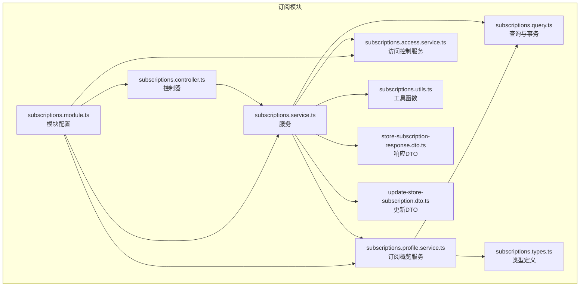
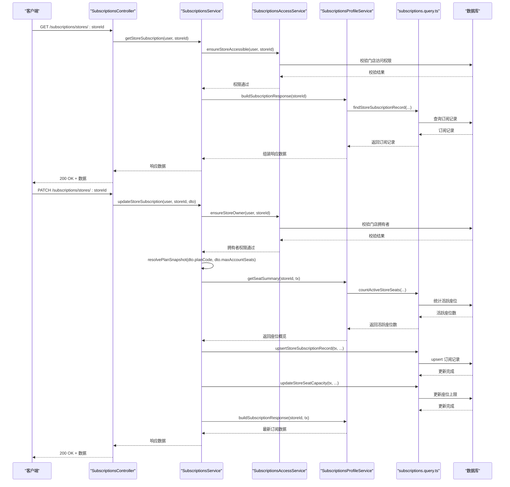
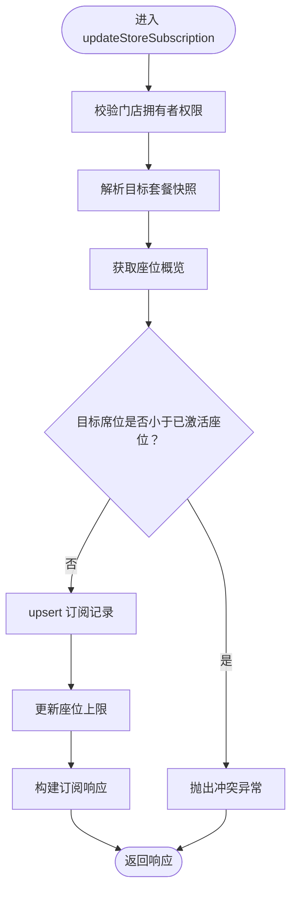
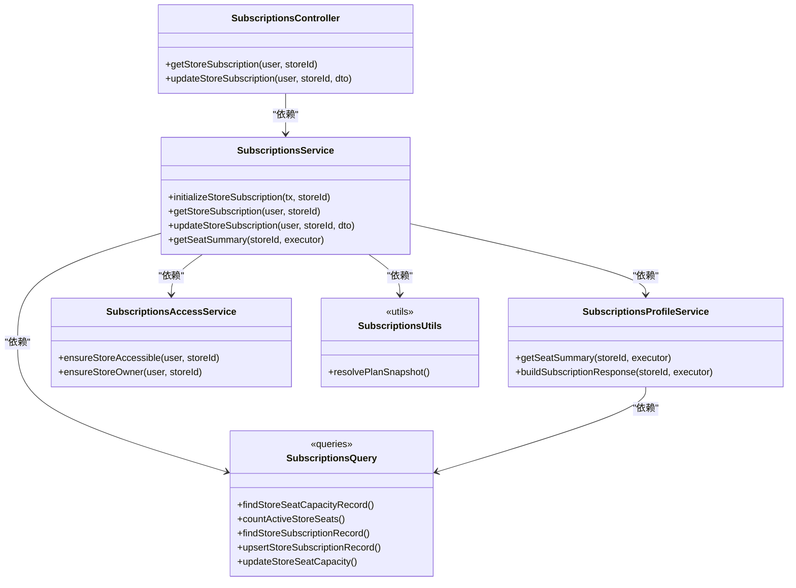

# 订阅管理接口

<cite>
**本文档引用的文件**
- [subscriptions.controller.ts](file://src/purely-profit/subscriptions/subscriptions.controller.ts)
- [subscriptions.service.ts](file://src/purely-profit/subscriptions/subscriptions.service.ts)
- [subscriptions.query.ts](file://src/purely-profit/subscriptions/subscriptions.query.ts)
- [subscriptions.profile.service.ts](file://src/purely-profit/subscriptions/subscriptions-profile.service.ts)
- [subscriptions.access.service.ts](file://src/purely-profit/subscriptions/subscriptions-access.service.ts)
- [subscriptions.types.ts](file://src/purely-profit/subscriptions/subscriptions.types.ts)
- [subscriptions.utils.ts](file://src/purely-profit/subscriptions/subscriptions.utils.ts)
- [store-subscription-response.dto.ts](file://src/purely-profit/subscriptions/dto/store-subscription-response.dto.ts)
- [update-store-subscription.dto.ts](file://src/purely-profit/subscriptions/dto/update-store-subscription.dto.ts)
- [subscriptions.module.ts](file://src/purely-profit/subscriptions/subscriptions.module.ts)
</cite>

## 目录
1. [简介](#简介)
2. [项目结构](#项目结构)
3. [核心组件](#核心组件)
4. [架构总览](#架构总览)
5. [详细组件分析](#详细组件分析)
6. [依赖关系分析](#依赖关系分析)
7. [性能考虑](#性能考虑)
8. [故障排除指南](#故障排除指南)
9. [结论](#结论)
10. [附录](#附录)

## 简介
本文件为订阅管理模块的详细 API 接口文档，覆盖门店订阅计划管理、订阅状态控制、订阅费用计算、订阅变更记录等功能接口。重点说明订阅套餐选择、自动续费设置、订阅暂停/恢复、订阅取消等相关接口，并包含订阅数据分析、费用结算、退款处理等扩展功能的 API 规范。同时提供订阅业务的自动化处理和风险控制机制。

## 项目结构
订阅管理模块位于 `src/purely-profit/subscriptions/` 目录下，采用按职责分层的设计模式：
- 控制器层：负责 HTTP 请求处理与响应封装
- 服务层：实现业务逻辑与事务控制
- 查询层：封装数据库操作与事务执行
- DTO 层：定义请求与响应的数据传输对象
- 访问控制层：校验用户对门店的访问权限
- 配置与工具层：提供套餐解析与常量定义

**图表来源**
- [subscriptions.controller.ts:1-56](file://src/purely-profit/subscriptions/subscriptions.controller.ts#L1-L56)
- [subscriptions.service.ts:1-102](file://src/purely-profit/subscriptions/subscriptions.service.ts#L1-L102)
- [subscriptions.profile.service.ts:1-64](file://src/purely-profit/subscriptions/subscriptions-profile.service.ts#L1-L64)
- [subscriptions.access.service.ts:1-56](file://src/purely-profit/subscriptions/subscriptions-access.service.ts#L1-L56)
- [subscriptions.query.ts:1-83](file://src/purely-profit/subscriptions/subscriptions.query.ts#L1-L83)
- [subscriptions.utils.ts:1-26](file://src/purely-profit/subscriptions/subscriptions.utils.ts#L1-L26)
- [subscriptions.types.ts:1-18](file://src/purely-profit/subscriptions/subscriptions.types.ts#L1-L18)
- [store-subscription-response.dto.ts:1-75](file://src/purely-profit/subscriptions/dto/store-subscription-response.dto.ts#L1-L75)
- [update-store-subscription.dto.ts:1-32](file://src/purely-profit/subscriptions/dto/update-store-subscription.dto.ts#L1-L32)
- [subscriptions.module.ts:1-19](file://src/purely-profit/subscriptions/subscriptions.module.ts#L1-L19)

**章节来源**
- [subscriptions.controller.ts:1-56](file://src/purely-profit/subscriptions/subscriptions.controller.ts#L1-L56)
- [subscriptions.service.ts:1-102](file://src/purely-profit/subscriptions/subscriptions.service.ts#L1-L102)
- [subscriptions.module.ts:1-19](file://src/purely-profit/subscriptions/subscriptions.module.ts#L1-L19)

## 核心组件
- 订阅控制器（SubscriptionsController）：暴露两个受保护的 REST 接口，分别用于获取门店订阅详情与更新订阅套餐。
- 订阅服务（SubscriptionsService）：实现初始化订阅、获取订阅详情、更新订阅套餐等核心业务逻辑，并在事务中保证数据一致性。
- 订阅概览服务（SubscriptionsProfileService）：构建订阅响应数据，包括套餐信息与席位概览。
- 访问控制服务（SubscriptionsAccessService）：确保调用者对目标门店具有相应权限（查看或拥有者权限）。
- 查询与事务（subscriptions.query.ts）：封装数据库 upsert、座位容量更新、活跃座位统计等操作。
- 工具与类型（subscriptions.utils.ts、subscriptions.types.ts）：解析套餐快照、定义计划与座位相关类型。
- DTO（store-subscription-response.dto.ts、update-store-subscription.dto.ts）：定义请求与响应的数据结构与验证规则。

**章节来源**
- [subscriptions.controller.ts:19-55](file://src/purely-profit/subscriptions/subscriptions.controller.ts#L19-L55)
- [subscriptions.service.ts:16-101](file://src/purely-profit/subscriptions/subscriptions.service.ts#L16-L101)
- [subscriptions.profile.service.ts:12-63](file://src/purely-profit/subscriptions/subscriptions-profile.service.ts#L12-L63)
- [subscriptions.access.service.ts:6-55](file://src/purely-profit/subscriptions/subscriptions-access.service.ts#L6-L55)
- [subscriptions.query.ts:10-82](file://src/purely-profit/subscriptions/subscriptions.query.ts#L10-L82)
- [subscriptions.utils.ts:9-25](file://src/purely-profit/subscriptions/subscriptions.utils.ts#L9-L25)
- [subscriptions.types.ts:3-17](file://src/purely-profit/subscriptions/subscriptions.types.ts#L3-L17)
- [store-subscription-response.dto.ts:13-74](file://src/purely-profit/subscriptions/dto/store-subscription-response.dto.ts#L13-L74)
- [update-store-subscription.dto.ts:6-31](file://src/purely-profit/subscriptions/dto/update-store-subscription.dto.ts#L6-L31)

## 架构总览
订阅管理模块遵循“控制器-服务-查询-DTO”的分层架构，通过事务确保更新流程的一致性，并使用访问控制服务保障安全。

**图表来源**
- [subscriptions.controller.ts:22-54](file://src/purely-profit/subscriptions/subscriptions.controller.ts#L22-L54)
- [subscriptions.service.ts:43-90](file://src/purely-profit/subscriptions/subscriptions.service.ts#L43-L90)
- [subscriptions.access.service.ts:10-54](file://src/purely-profit/subscriptions/subscriptions-access.service.ts#L10-L54)
- [subscriptions.profile.service.ts:16-62](file://src/purely-profit/subscriptions/subscriptions-profile.service.ts#L16-L62)
- [subscriptions.query.ts:45-82](file://src/purely-profit/subscriptions/subscriptions.query.ts#L45-L82)

## 详细组件分析

### 订阅控制器（SubscriptionsController）
- 路由与鉴权
  - 使用 JWT 守卫与 Bearer 认证，所有接口均需登录态。
  - 接口标签为 “Subscriptions”，便于 Swagger 文档生成。
- 接口一：获取门店当前套餐订阅与席位概览
  - 方法：GET
  - 路径：/subscriptions/stores/:storeId
  - 参数：storeId（路径参数，整型）
  - 响应：StoreSubscriptionResponseDto
  - 权限：任意对门店有访问权限的用户（老板或员工）
- 接口二：更新门店套餐并同步账号席位
  - 方法：PATCH
  - 路径：/subscriptions/stores/:storeId
  - 参数：storeId（路径参数，整型），请求体 UpdateStoreSubscriptionDto
  - 响应：StoreSubscriptionResponseDto
  - 权限：仅门店拥有者

**章节来源**
- [subscriptions.controller.ts:15-55](file://src/purely-profit/subscriptions/subscriptions.controller.ts#L15-L55)

### 订阅服务（SubscriptionsService）
- 初始化门店订阅
  - 在新建门店时，自动创建默认套餐（STARTER）并设置座位上限。
- 获取订阅详情
  - 校验访问权限后，构建订阅响应数据（含座位概览）。
- 更新订阅套餐
  - 校验拥有者权限
  - 解析目标套餐快照（支持预设套餐与自定义套餐）
  - 校验座位缩容限制（不可低于当前已激活座位数）
  - 在事务中执行 upsert 订阅记录与更新座位上限
  - 返回最新订阅数据

**图表来源**
- [subscriptions.service.ts:51-90](file://src/purely-profit/subscriptions/subscriptions.service.ts#L51-L90)
- [subscriptions.utils.ts:9-25](file://src/purely-profit/subscriptions/subscriptions.utils.ts#L9-L25)
- [subscriptions.profile.service.ts:16-36](file://src/purely-profit/subscriptions/subscriptions-profile.service.ts#L16-L36)
- [subscriptions.query.ts:45-82](file://src/purely-profit/subscriptions/subscriptions.query.ts#L45-L82)

**章节来源**
- [subscriptions.service.ts:24-100](file://src/purely-profit/subscriptions/subscriptions.service.ts#L24-L100)

### 订阅概览服务（SubscriptionsProfileService）
- 座位概览
  - 从门店记录获取最大座位上限
  - 统计活跃座位数量（seat.active=true 且 staff.status=ACTIVE）
  - 计算可用座位 = 最大座位上限 - 活跃座位数
- 订阅响应构建
  - 查询订阅记录（包含状态、套餐、有效期等）
  - 组装响应 DTO，包含座位概览

**章节来源**
- [subscriptions.profile.service.ts:16-62](file://src/purely-profit/subscriptions/subscriptions-profile.service.ts#L16-L62)
- [subscriptions.query.ts:12-34](file://src/purely-profit/subscriptions/subscriptions.query.ts#L12-L34)

### 访问控制服务（SubscriptionsAccessService）
- 查看权限
  - 用户必须为门店拥有者，或为门店有效员工（isActive=true 且 status=ACTIVE）
- 拥有者权限
  - 仅门店拥有者可修改套餐

**章节来源**
- [subscriptions.access.service.ts:10-54](file://src/purely-profit/subscriptions/subscriptions-access.service.ts#L10-L54)

### 查询与事务（subscriptions.query.ts）
- 座位容量记录查询
- 活跃座位统计
- 订阅记录 upsert（创建/更新）
- 门店座位上限更新

**章节来源**
- [subscriptions.query.ts:12-82](file://src/purely-profit/subscriptions/subscriptions.query.ts#L12-L82)

### 工具与类型（subscriptions.utils.ts、subscriptions.types.ts）
- 套餐快照解析
  - 预设套餐：从套餐目录映射
  - 自定义套餐：校验自定义席位数并生成套餐名称
- 类型定义
  - PlanSnapshot：套餐快照（名称、最大席位）
  - StoreSeatSummary：座位概览（上限、已激活、可用）
  - PresetSubscriptionPlanCode：排除 CUSTOM 的预设套餐枚举

**章节来源**
- [subscriptions.utils.ts:9-25](file://src/purely-profit/subscriptions/subscriptions.utils.ts#L9-L25)
- [subscriptions.types.ts:3-17](file://src/purely-profit/subscriptions/subscriptions.types.ts#L3-L17)

### DTO 定义
- StoreSubscriptionResponseDto
  - 字段：id、storeId、planCode、planName、status、maxAccountSeats、startsAt、expiresAt、seatSummary
  - 嵌套字段 SubscriptionSeatSummaryDto：maxAccountSeats、activeSeatCount、availableSeatCount
- UpdateStoreSubscriptionDto
  - 字段：planCode（必填，枚举）、maxAccountSeats（可选，CUSTOM 时必填）、expiresAt（可选）

**章节来源**
- [store-subscription-response.dto.ts:13-74](file://src/purely-profit/subscriptions/dto/store-subscription-response.dto.ts#L13-L74)
- [update-store-subscription.dto.ts:6-31](file://src/purely-profit/subscriptions/dto/update-store-subscription.dto.ts#L6-L31)

## 依赖关系分析
- 控制器依赖服务；服务依赖访问控制、概览服务与查询层；模块导入认证模块并导出服务供外部使用。
- 服务内部通过事务协调多个数据库写操作，避免并发导致的数据不一致。
- DTO 作为契约约束请求与响应，配合 Swagger 提供接口文档。

**图表来源**
- [subscriptions.controller.ts:19-55](file://src/purely-profit/subscriptions/subscriptions.controller.ts#L19-L55)
- [subscriptions.service.ts:16-101](file://src/purely-profit/subscriptions/subscriptions.service.ts#L16-L101)
- [subscriptions.profile.service.ts:12-63](file://src/purely-profit/subscriptions/subscriptions-profile.service.ts#L12-L63)
- [subscriptions.access.service.ts:6-55](file://src/purely-profit/subscriptions/subscriptions-access.service.ts#L6-L55)
- [subscriptions.query.ts:10-82](file://src/purely-profit/subscriptions/subscriptions.query.ts#L10-L82)
- [subscriptions.utils.ts:9-25](file://src/purely-profit/subscriptions/subscriptions.utils.ts#L9-L25)

**章节来源**
- [subscriptions.module.ts:8-18](file://src/purely-profit/subscriptions/subscriptions.module.ts#L8-L18)

## 性能考虑
- 事务边界：更新套餐与座位上限在单个事务内完成，减少锁竞争与中间态。
- 查询优化：活跃座位统计基于索引字段（staff.status、seat.isSeatActive、staff.isActive）进行过滤。
- 缓存策略：建议在高并发场景下对订阅概览进行短期缓存，降低数据库压力。
- 分页与筛选：若后续扩展订阅历史与变更记录，建议引入分页与索引优化。

## 故障排除指南
- 无权限访问
  - 现象：返回 403 Forbidden
  - 原因：非门店拥有者尝试修改套餐；或非门店成员尝试查看
  - 处理：确认用户与门店的关系或提升权限
- 套餐缩容失败
  - 现象：返回 409 Conflict
  - 原因：目标席位数低于当前已激活座位数
  - 处理：先释放或停用多余座位后再缩容
- 自定义套餐参数错误
  - 现象：返回 400 Bad Request
  - 原因：planCode=CUSTOM 时未提供有效席位数
  - 处理：提供 >=1 的 maxAccountSeats
- 订阅或门店不存在
  - 现象：返回 404 Not Found
  - 原因：订阅记录或门店记录缺失
  - 处理：检查 storeId 或初始化订阅流程

**章节来源**
- [subscriptions.access.service.ts:37-53](file://src/purely-profit/subscriptions/subscriptions-access.service.ts#L37-L53)
- [subscriptions.service.ts:65-69](file://src/purely-profit/subscriptions/subscriptions.service.ts#L65-L69)
- [subscriptions.utils.ts:13-16](file://src/purely-profit/subscriptions/subscriptions.utils.ts#L13-L16)
- [subscriptions.profile.service.ts:22-49](file://src/purely-profit/subscriptions/subscriptions-profile.service.ts#L22-L49)

## 结论
订阅管理模块提供了完整的门店订阅生命周期管理能力，包括套餐选择、席位控制、权限校验与事务一致性保障。通过清晰的分层设计与严格的参数校验，系统能够稳定支撑订阅业务的日常运营与扩展需求。

## 附录

### API 规范

- 获取门店订阅与席位概览
  - 方法：GET
  - 路径：/subscriptions/stores/:storeId
  - 鉴权：Bearer Token
  - 权限：任意对门店有访问权限的用户
  - 响应：StoreSubscriptionResponseDto
  - 示例响应字段：id、storeId、planCode、planName、status、maxAccountSeats、startsAt、expiresAt、seatSummary

- 更新门店订阅套餐
  - 方法：PATCH
  - 路径：/subscriptions/stores/:storeId
  - 鉴权：Bearer Token
  - 权限：仅门店拥有者
  - 请求体：UpdateStoreSubscriptionDto
    - planCode：套餐编码（枚举）
    - maxAccountSeats：自定义席位数（CUSTOM 时必填，>=1）
    - expiresAt：到期时间（可选）
  - 响应：StoreSubscriptionResponseDto

- 订阅初始化
  - 触发时机：新建门店时自动初始化默认套餐（STARTER）
  - 行为：创建订阅记录并设置座位上限

- 订阅状态控制
  - 当前实现：通过状态字段与到期时间控制有效性
  - 扩展建议：增加暂停/恢复、取消等状态流转与审计日志

- 订阅费用计算与结算
  - 当前实现：未在仓库中发现费用计算与结算逻辑
  - 建议：新增订单与账单实体，结合订阅周期与套餐价格计算费用

- 退款处理
  - 当前实现：未在仓库中发现退款处理逻辑
  - 建议：新增退款申请与审批流程，关联订单与订阅变更记录

- 自动化处理与风险控制
  - 自动化：到期前提醒、到期后自动停用无效订阅
  - 风险控制：席位缩容限制、拥有者权限校验、事务一致性

**章节来源**
- [subscriptions.controller.ts:22-54](file://src/purely-profit/subscriptions/subscriptions.controller.ts#L22-L54)
- [subscriptions.service.ts:24-41](file://src/purely-profit/subscriptions/subscriptions.service.ts#L24-L41)
- [update-store-subscription.dto.ts:6-31](file://src/purely-profit/subscriptions/dto/update-store-subscription.dto.ts#L6-L31)
- [store-subscription-response.dto.ts:27-74](file://src/purely-profit/subscriptions/dto/store-subscription-response.dto.ts#L27-L74)