# 财务管理接口

<cite>
**本文档引用的文件**
- [finance.controller.ts](file://src/purely-profit/finance/finance.controller.ts)
- [finance.service.ts](file://src/purely-profit/finance/finance.service.ts)
- [finance-account.service.ts](file://src/purely-profit/finance/finance-account.service.ts)
- [finance-cash-flow.service.ts](file://src/purely-profit/finance/finance-cash-flow.service.ts)
- [finance-reconciliation.service.ts](file://src/purely-profit/finance/finance-reconciliation.service.ts)
- [finance-overview.service.ts](file://src/purely-profit/finance/finance-overview.service.ts)
- [finance-account.domain.ts](file://src/purely-profit/finance/finance-account.domain.ts)
- [finance-cash-flow.domain.ts](file://src/purely-profit/finance/finance-cash-flow.domain.ts)
- [finance-reconciliation.domain.ts](file://src/purely-profit/finance/finance-reconciliation.domain.ts)
- [finance-overview.domain.ts](file://src/purely-profit/finance/finance-overview.domain.ts)
- [finance-account.query.ts](file://src/purely-profit/finance/finance-account.query.ts)
- [finance-cash-flow.query.ts](file://src/purely-profit/finance/finance-cash-flow.query.ts)
- [finance-reconciliation.query.ts](file://src/purely-profit/finance/finance-reconciliation.query.ts)
- [finance-overview-report.query.ts](file://src/purely-profit/finance/finance-overview-report.query.ts)
- [finance.mapper.ts](file://src/purely-profit/finance/finance.mapper.ts)
- [finance.constants.ts](file://src/purely-profit/finance/finance.constants.ts)
- [finance.types.ts](file://src/purely-profit/finance/finance.types.ts)
- [finance-money.utils.ts](file://src/purely-profit/finance/finance-money.utils.ts)
- [finance-date.utils.ts](file://src/purely-profit/finance/finance-date.utils.ts)
- [finance-string.utils.ts](file://src/purely-profit/finance/finance-string.utils.ts)
- [finance-access.service.ts](file://src/purely-profit/finance/finance-access.service.ts)
- [finance-account.response.dto.ts](file://src/purely-profit/finance/dto/finance-account.response.dto.ts)
- [finance-account.query.dto.ts](file://src/purely-profit/finance/dto/finance-account.query.dto.ts)
- [finance-cash-flow.response.dto.ts](file://src/purely-profit/finance/dto/finance-cash-flow.response.dto.ts)
- [finance-cash-flow.query.dto.ts](file://src/purely-profit/finance/dto/finance-cash-flow.query.dto.ts)
- [finance-reconciliation.response.dto.ts](file://src/purely-profit/finance/dto/finance-reconciliation.response.dto.ts)
- [finance-reconciliation.query.dto.ts](file://src/purely-profit/finance/dto/finance-reconciliation.query.dto.ts)
- [finance-overview.response.dto.ts](file://src/purely-profit/finance/dto/finance-overview.response.dto.ts)
- [finance-overview.query.dto.ts](file://src/purely-profit/finance/dto/finance-overview.query.dto.ts)
- [finance-report.response.dto.ts](file://src/purely-profit/finance/dto/finance-report.response.dto.ts)
- [finance-report.query.dto.ts](file://src/purely-profit/finance/dto/finance-report.query.dto.ts)
- [finance-response.dto.ts](file://src/purely-profit/finance/dto/finance-response.dto.ts)
- [finance-shared.response.dto.ts](file://src/purely-profit/finance/dto/finance-shared.response.dto.ts)
- [finance-query.dto.ts](file://src/purely-profit/finance/dto/finance-query.dto.ts)
- [schema.prisma](file://prisma/schema.prisma)
- [accounts.prisma](file://prisma/purely-profit/finance/accounts.prisma)
- [cash-flows.prisma](file://prisma/purely-profit/finance/cash-flows.prisma)
- [reconciliations.prisma](file://prisma/purely-profit/finance/reconciliations.prisma)
</cite>

## 目录
1. [简介](#简介)
2. [项目结构](#项目结构)
3. [核心组件](#核心组件)
4. [架构概览](#架构概览)
5. [详细组件分析](#详细组件分析)
6. [依赖关系分析](#依赖关系分析)
7. [性能考虑](#性能考虑)
8. [故障排除指南](#故障排除指南)
9. [结论](#结论)

## 简介

财务管理模块是 PurelyProfit 系统的核心子系统，负责处理企业的财务业务流程。该模块提供了完整的财务管理体系，包括财务账户管理、现金流记录、财务报表生成、银行对账、成本核算等功能。

本模块采用分层架构设计，通过控制器(Controller)接收HTTP请求，服务(Service)处理业务逻辑，领域模型(Domain)封装核心业务规则，查询构建器(Query Builder)处理复杂的数据检索，DTO(Data Transfer Objects)确保数据传输的安全性和一致性。

## 项目结构

财务管理模块位于 `src/purely-profit/finance/` 目录下，采用按功能域划分的组织方式：

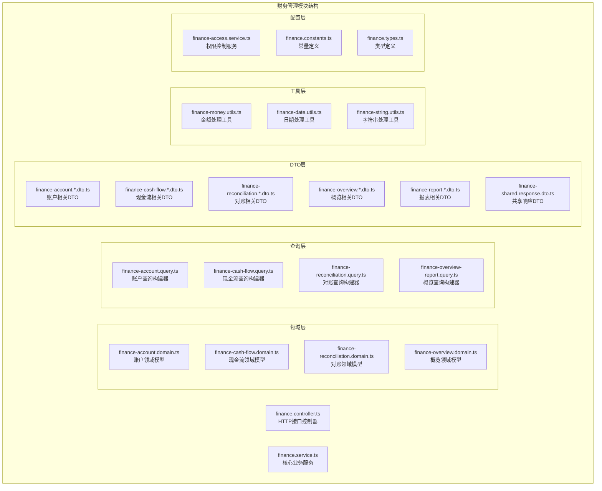

**图表来源**
- [finance.controller.ts:1-200](file://src/purely-profit/finance/finance.controller.ts#L1-L200)
- [finance.service.ts:1-300](file://src/purely-profit/finance/finance.service.ts#L1-L300)

**章节来源**
- [finance.controller.ts:1-200](file://src/purely-profit/finance/finance.controller.ts#L1-L200)
- [finance.service.ts:1-300](file://src/purely-profit/finance/finance.service.ts#L1-L300)

## 核心组件

财务管理模块包含以下核心组件：

### 控制器层
- **FinanceController**: 主要的HTTP接口控制器，负责处理所有财务相关的HTTP请求
- **权限控制**: 基于JWT的认证和基于角色的访问控制(RBAC)

### 服务层
- **FinanceService**: 核心业务逻辑服务，协调各个财务功能
- **FinanceAccountService**: 财务账户管理服务
- **FinanceCashFlowService**: 现金流记录服务
- **FinanceReconciliationService**: 银行对账服务
- **FinanceOverviewService**: 财务概览和报表服务

### 数据访问层
- **Prisma Schema**: 定义财务相关的数据库表结构
- **查询构建器**: 提供复杂的财务数据检索能力

**章节来源**
- [finance.controller.ts:1-200](file://src/purely-profit/finance/finance.controller.ts#L1-L200)
- [finance.service.ts:1-300](file://src/purely-profit/finance/finance.service.ts#L1-L300)
- [finance-account.service.ts:1-200](file://src/purely-profit/finance/finance-account.service.ts#L1-L200)
- [finance-cash-flow.service.ts:1-200](file://src/purely-profit/finance/finance-cash-flow.service.ts#L1-L200)
- [finance-reconciliation.service.ts:1-200](file://src/purely-profit/finance/finance-reconciliation.service.ts#L1-L200)
- [finance-overview.service.ts:1-200](file://src/purely-profit/finance/finance-overview.service.ts#L1-L200)

## 架构概览

财务管理模块采用经典的三层架构模式，结合领域驱动设计(DDD)原则：

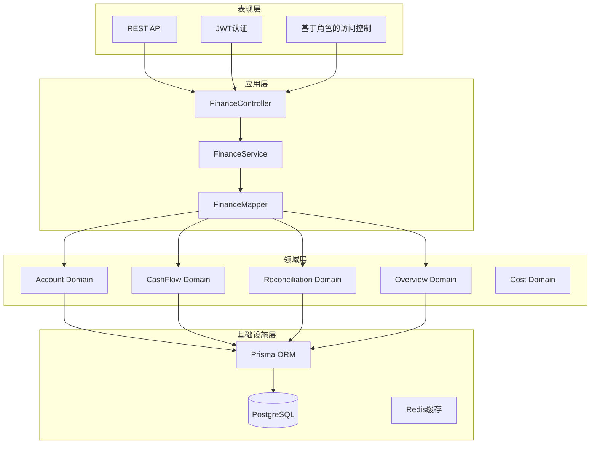

**图表来源**
- [finance.controller.ts:1-200](file://src/purely-profit/finance/finance.controller.ts#L1-L200)
- [finance.service.ts:1-300](file://src/purely-profit/finance/finance.service.ts#L1-L300)
- [finance.mapper.ts:1-200](file://src/purely-profit/finance/finance.mapper.ts#L1-L200)

### 数据模型关系

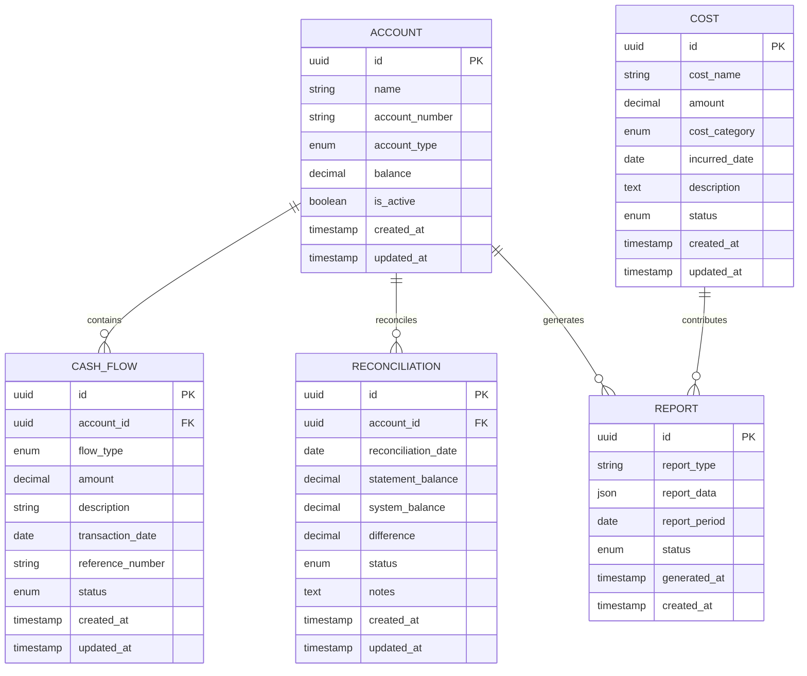

**图表来源**
- [schema.prisma:1-200](file://prisma/schema.prisma#L1-L200)
- [accounts.prisma:1-100](file://prisma/purely-profit/finance/accounts.prisma#L1-L100)
- [cash-flows.prisma:1-100](file://prisma/purely-profit/finance/cash-flows.prisma#L1-L100)
- [reconciliations.prisma:1-100](file://prisma/purely-profit/finance/reconciliations.prisma#L1-L100)

## 详细组件分析

### 财务账户管理

财务账户管理是财务管理的基础功能，支持多种类型的财务账户和完整的生命周期管理。

#### 核心功能

| 功能 | 描述 | 接口方法 |
|------|------|----------|
| 创建账户 | 支持银行账户、现金账户等多种类型 | POST /finance/accounts |
| 查询账户 | 支持条件筛选、分页查询、排序 | GET /finance/accounts |
| 更新账户 | 修改账户信息、启用/禁用账户 | PUT /finance/accounts/:id |
| 删除账户 | 软删除，保留历史记录 | DELETE /finance/accounts/:id |
| 账户余额查询 | 实时查询账户余额 | GET /finance/accounts/:id/balance |

#### 账户类型定义

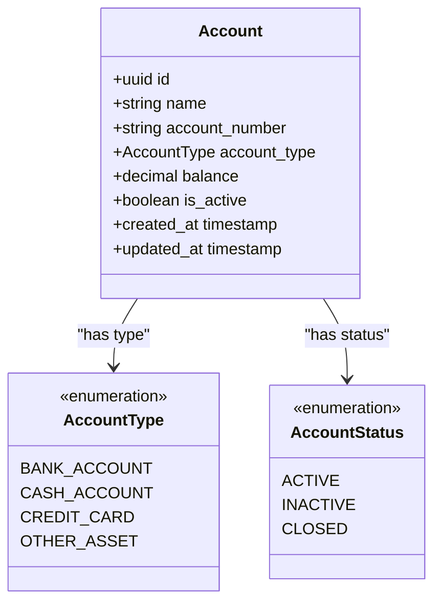

**图表来源**
- [finance-account.domain.ts:1-200](file://src/purely-profit/finance/finance-account.domain.ts#L1-L200)
- [finance.types.ts:1-150](file://src/purely-profit/finance/finance.types.ts#L1-L150)

#### 账户查询流程

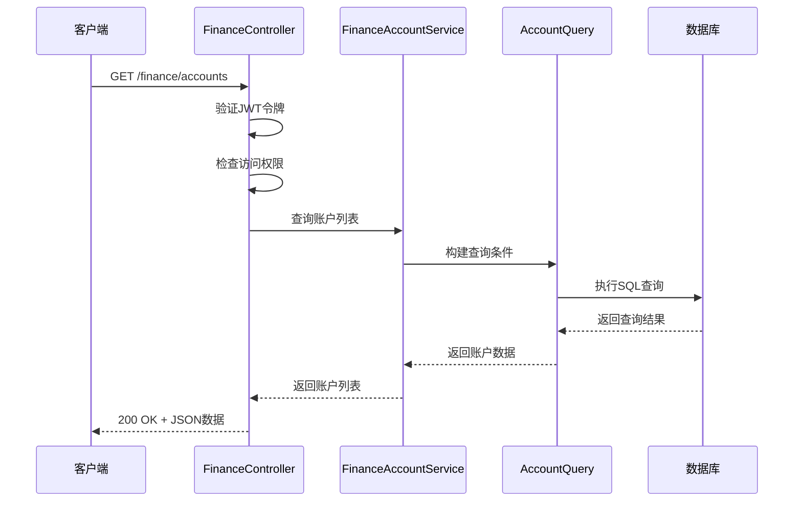

**图表来源**
- [finance.controller.ts:1-200](file://src/purely-profit/finance/finance.controller.ts#L1-L200)
- [finance-account.service.ts:1-200](file://src/purely-profit/finance/finance-account.service.ts#L1-L200)
- [finance-account.query.ts:1-200](file://src/purely-profit/finance/finance-account.query.ts#L1-L200)

**章节来源**
- [finance-account.service.ts:1-200](file://src/purely-profit/finance/finance-account.service.ts#L1-L200)
- [finance-account.query.ts:1-200](file://src/purely-profit/finance/finance-account.query.ts#L1-L200)
- [finance-account.response.dto.ts:1-150](file://src/purely-profit/finance/dto/finance-account.response.dto.ts#L1-L150)
- [finance-account.query.dto.ts:1-150](file://src/purely-profit/finance/dto/finance-account.query.dto.ts#L1-L150)

### 现金流记录

现金流记录功能支持企业日常的收入和支出业务，提供完整的现金流追踪能力。

#### 核心功能

| 功能 | 描述 | 接口方法 |
|------|------|----------|
| 记录收入 | 销售收入、投资收益等 | POST /finance/cash-flows/income |
| 记录支出 | 采购支出、人工成本等 | POST /finance/cash-flows/expense |
| 查询现金流 | 支持时间范围、账户筛选 | GET /finance/cash-flows |
| 现金流分类 | 收入、支出、转账等分类 | GET /finance/cash-flows/categories |
| 现金流统计 | 按时间段、账户统计分析 | GET /finance/cash-flows/statistics |

#### 现金流类型定义

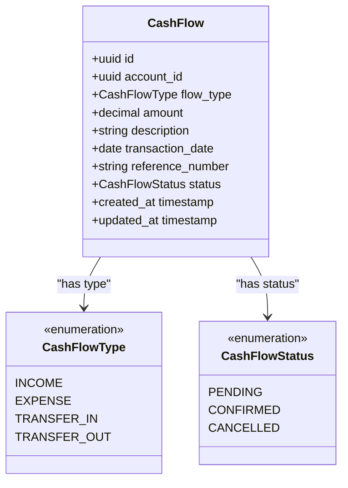

**图表来源**
- [finance-cash-flow.domain.ts:1-200](file://src/purely-profit/finance/finance-cash-flow.domain.ts#L1-L200)
- [finance.types.ts:150-300](file://src/purely-profit/finance/finance.types.ts#L150-L300)

#### 现金流处理流程

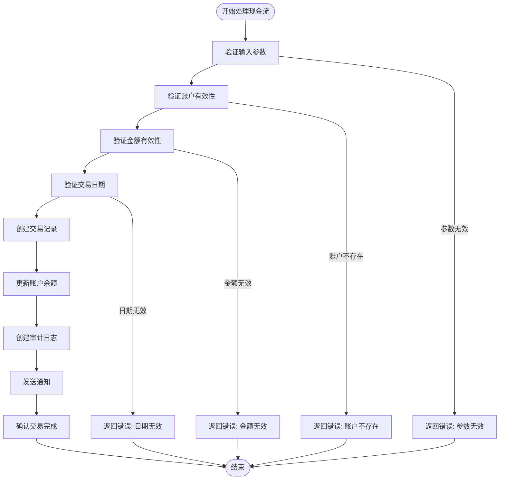

**图表来源**
- [finance-cash-flow.service.ts:1-300](file://src/purely-profit/finance/finance-cash-flow.service.ts#L1-L300)
- [finance-money.utils.ts:1-150](file://src/purely-profit/finance/finance-money.utils.ts#L1-L150)

**章节来源**
- [finance-cash-flow.service.ts:1-300](file://src/purely-profit/finance/finance-cash-flow.service.ts#L1-L300)
- [finance-cash-flow.query.ts:1-200](file://src/purely-profit/finance/finance-cash-flow.query.ts#L1-L200)
- [finance-cash-flow.response.dto.ts:1-150](file://src/purely-profit/finance/dto/finance-cash-flow.response.dto.ts#L1-L150)
- [finance-cash-flow.query.dto.ts:1-150](file://src/purely-profit/finance/dto/finance-cash-flow.query.dto.ts#L1-L150)

### 银行对账

银行对账功能提供与银行流水的自动匹配和手动调整能力，确保账实相符。

#### 核心功能

| 功能 | 描述 | 接口方法 |
|------|------|----------|
| 导入银行流水 | 支持CSV、Excel格式导入 | POST /finance/reconciliations/import |
| 自动对账 | 系统自动匹配已识别的交易 | POST /finance/reconciliations/:id/auto-reconcile |
| 手动对账 | 人工调整不匹配的记录 | POST /finance/reconciliations/:id/manual-reconcile |
| 对账差异分析 | 统计对账差异和原因 | GET /finance/reconciliations/:id/discrepancies |
| 对账报告 | 生成对账完成报告 | GET /finance/reconciliations/:id/report |

#### 对账状态管理

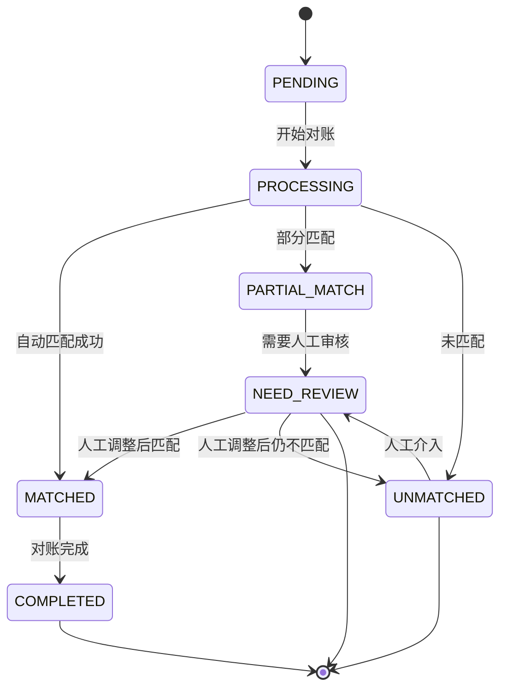

**图表来源**
- [finance-reconciliation.domain.ts:1-200](file://src/purely-profit/finance/finance-reconciliation.domain.ts#L1-L200)
- [finance.types.ts:300-450](file://src/purely-profit/finance/finance.types.ts#L300-L450)

#### 对账流程

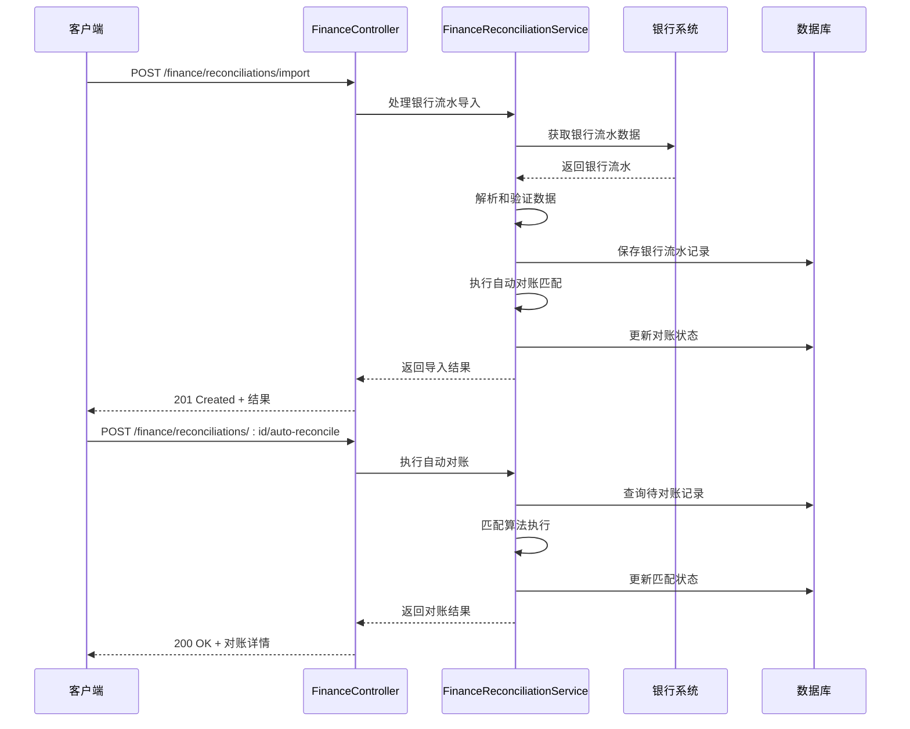

**图表来源**
- [finance.controller.ts:1-200](file://src/purely-profit/finance/finance.controller.ts#L1-L200)
- [finance-reconciliation.service.ts:1-200](file://src/purely-profit/finance/finance-reconciliation.service.ts#L1-L200)

**章节来源**
- [finance-reconciliation.service.ts:1-200](file://src/purely-profit/finance/finance-reconciliation.service.ts#L1-L200)
- [finance-reconciliation.query.ts:1-200](file://src/purely-profit/finance/finance-reconciliation.query.ts#L1-L200)
- [finance-reconciliation.response.dto.ts:1-150](file://src/purely-profit/finance/dto/finance-reconciliation.response.dto.ts#L1-L150)
- [finance-reconciliation.query.dto.ts:1-150](file://src/purely-profit/finance/dto/finance-reconciliation.query.dto.ts#L1-L150)

### 财务报表

财务报表功能提供多种标准财务报表的生成和导出能力，支持实时数据分析。

#### 报表类型

| 报表名称 | 功能描述 | 接口方法 |
|----------|----------|----------|
| 资产负债表 | 展示企业财务状况 | GET /finance/reports/balance-sheet |
| 利润表 | 展示经营成果 | GET /finance/reports/profit-loss |
| 现金流量表 | 展示现金流变动 | GET /finance/reports/cash-flow |
| 科目余额表 | 展示会计科目余额 | GET /finance/reports/account-balance |
| 科目明细账 | 展示科目详细交易记录 | GET /finance/reports/account-ledger |

#### 报表生成流程

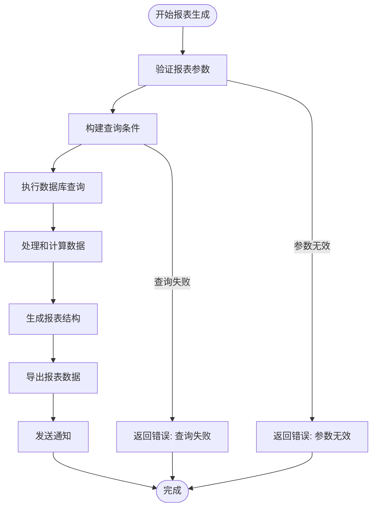

**图表来源**
- [finance-overview.service.ts:1-200](file://src/purely-profit/finance/finance-overview.service.ts#L1-L200)
- [finance-overview-report.query.ts:1-200](file://src/purely-profit/finance/finance-overview-report.query.ts#L1-L200)

**章节来源**
- [finance-overview.service.ts:1-200](file://src/purely-profit/finance/finance-overview.service.ts#L1-L200)
- [finance-report.response.dto.ts:1-150](file://src/purely-profit/finance/dto/finance-report.response.dto.ts#L1-L150)
- [finance-report.query.dto.ts:1-150](file://src/purely-profit/finance/dto/finance-report.query.dto.ts#L1-L150)

### 成本核算

成本核算功能支持多维度的成本管理和分析，提供完整的成本控制体系。

#### 核心功能

| 功能 | 描述 | 接口方法 |
|------|------|----------|
| 成本录入 | 录入各种类型的业务成本 | POST /finance/costs |
| 成本分类 | 成本按部门、项目、类别分类 | GET /finance/costs/categories |
| 成本统计 | 按时间、部门、项目统计成本 | GET /finance/costs/statistics |
| 成本分析 | 成本构成和趋势分析 | GET /finance/costs/analysis |
| 预算对比 | 实际成本与预算对比分析 | GET /finance/costs/budget-comparison |

**章节来源**
- [finance.types.ts:450-600](file://src/purely-profit/finance/finance.types.ts#L450-L600)

## 依赖关系分析

财务管理模块的依赖关系体现了清晰的分层架构和关注点分离：

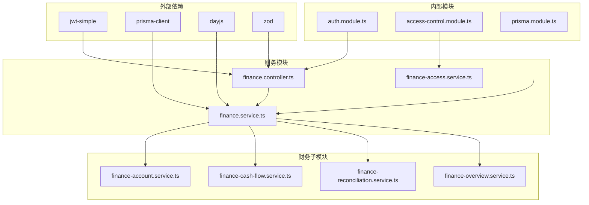

**图表来源**
- [finance.controller.ts:1-200](file://src/purely-profit/finance/finance.controller.ts#L1-L200)
- [finance.service.ts:1-300](file://src/purely-profit/finance/finance.service.ts#L1-L300)
- [finance-access.service.ts:1-200](file://src/purely-profit/finance/finance-access.service.ts#L1-L200)

### 数据流分析

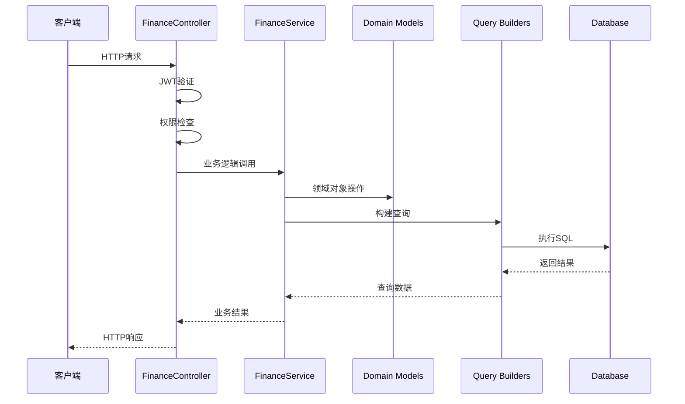

**图表来源**
- [finance.controller.ts:1-200](file://src/purely-profit/finance/finance.controller.ts#L1-L200)
- [finance.service.ts:1-300](file://src/purely-profit/finance/finance.service.ts#L1-L300)

**章节来源**
- [finance.controller.ts:1-200](file://src/purely-profit/finance/finance.controller.ts#L1-L200)
- [finance.service.ts:1-300](file://src/purely-profit/finance/finance.service.ts#L1-L300)
- [finance-access.service.ts:1-200](file://src/purely-profit/finance/finance-access.service.ts#L1-L200)

## 性能考虑

财务管理模块在设计时充分考虑了性能优化：

### 缓存策略
- **查询结果缓存**: 对常用的报表数据进行Redis缓存
- **配置信息缓存**: 财务参数和配置信息缓存
- **会话数据缓存**: 用户权限和会话信息缓存

### 数据库优化
- **索引优化**: 关键查询字段建立复合索引
- **分页查询**: 大数据量场景下的分页处理
- **批量操作**: 支持批量导入和批量更新

### 异步处理
- **报表生成**: 大型报表异步生成和通知
- **数据导入**: 大文件导入的进度跟踪
- **对账处理**: 复杂对账任务的异步执行

## 故障排除指南

### 常见问题及解决方案

| 问题类型 | 症状 | 可能原因 | 解决方案 |
|----------|------|----------|----------|
| 认证失败 | 401 Unauthorized | JWT令牌过期或无效 | 重新登录获取新令牌 |
| 权限不足 | 403 Forbidden | 用户角色权限不够 | 检查用户角色和权限设置 |
| 数据验证错误 | 400 Bad Request | 输入数据格式不正确 | 检查API参数格式和必填项 |
| 数据库连接失败 | 500 Internal Server Error | 数据库连接异常 | 检查数据库连接配置和网络 |
| 对账不匹配 | 对账差异警告 | 数据不一致或导入错误 | 检查银行流水和系统数据 |

### 错误处理机制

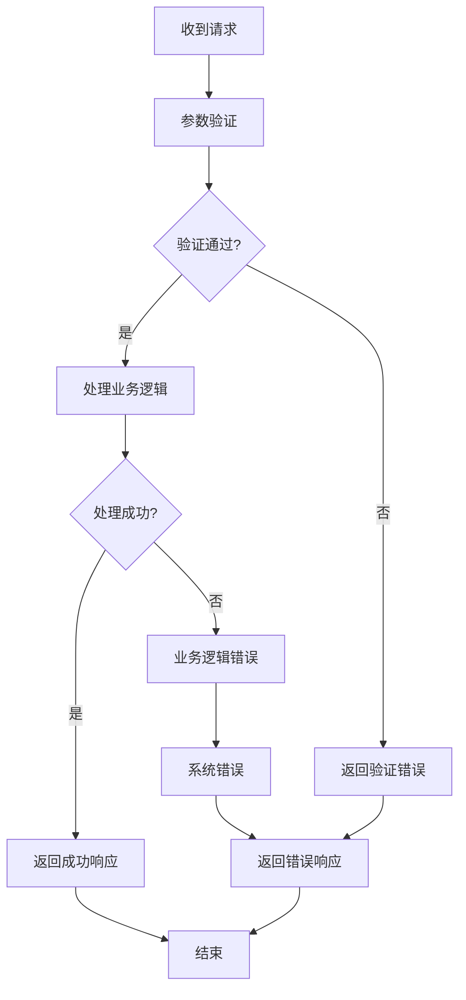

**图表来源**
- [finance.controller.ts:1-200](file://src/purely-profit/finance/finance.controller.ts#L1-L200)

### 日志记录

财务管理模块采用结构化日志记录：

- **访问日志**: 记录所有API请求的详细信息
- **业务日志**: 记录重要的财务业务操作
- **错误日志**: 记录系统错误和异常情况
- **审计日志**: 记录关键数据变更的历史

**章节来源**
- [finance.controller.ts:1-200](file://src/purely-profit/finance/finance.controller.ts#L1-L200)

## 结论

财务管理模块是一个功能完整、架构清晰的企业级财务管理系统。通过采用分层架构和领域驱动设计，该模块实现了业务逻辑与技术实现的有效分离，提供了高度可维护和可扩展的代码结构。

模块的主要优势包括：

1. **完整的财务功能覆盖**: 从基础账户管理到复杂的财务分析，满足企业财务管理的全方位需求
2. **严格的数据安全**: 通过JWT认证、RBAC权限控制和审计日志确保数据安全
3. **高性能设计**: 通过缓存策略、数据库优化和异步处理提升系统性能
4. **良好的扩展性**: 清晰的架构设计便于未来功能的扩展和维护

该模块为企业提供了可靠的财务管理基础设施，支持日常财务运营和决策分析，是PurelyProfit系统的重要组成部分。