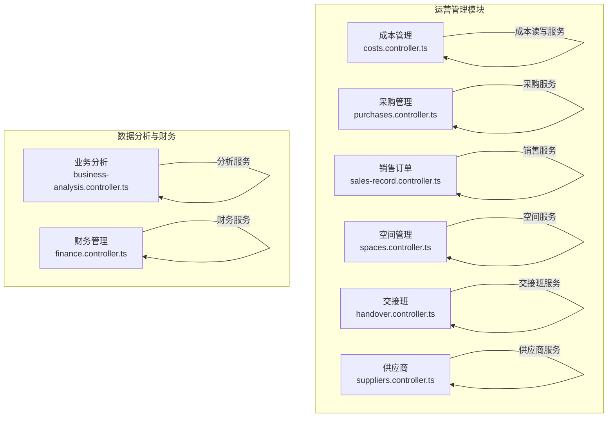
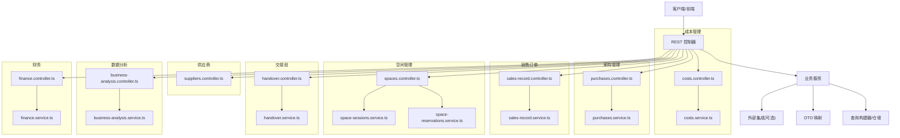
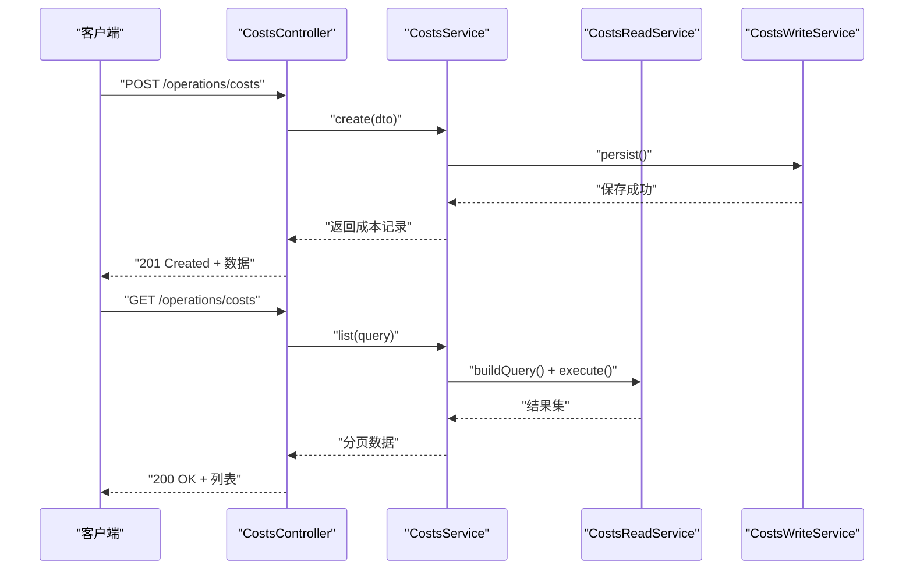
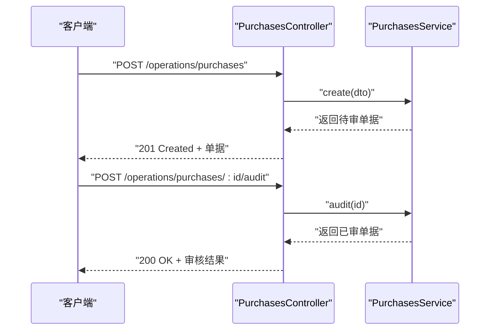
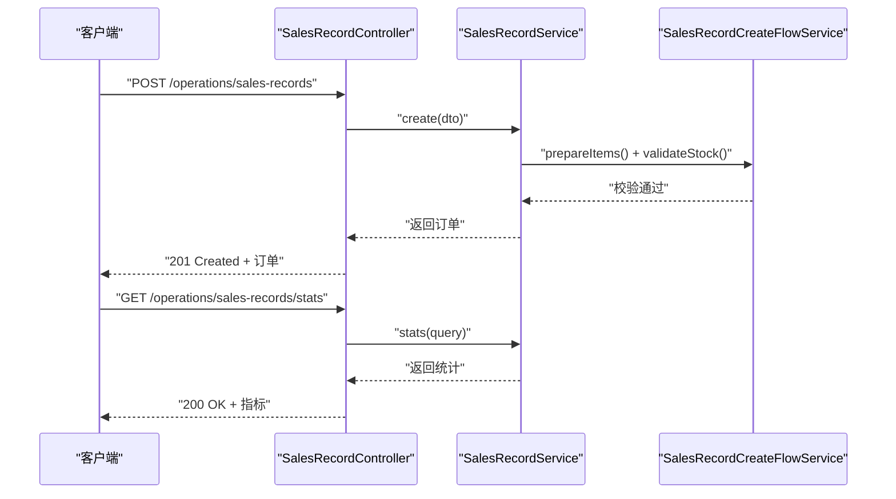
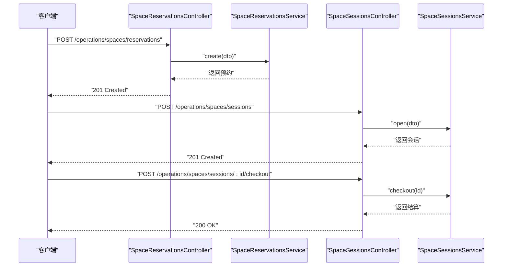
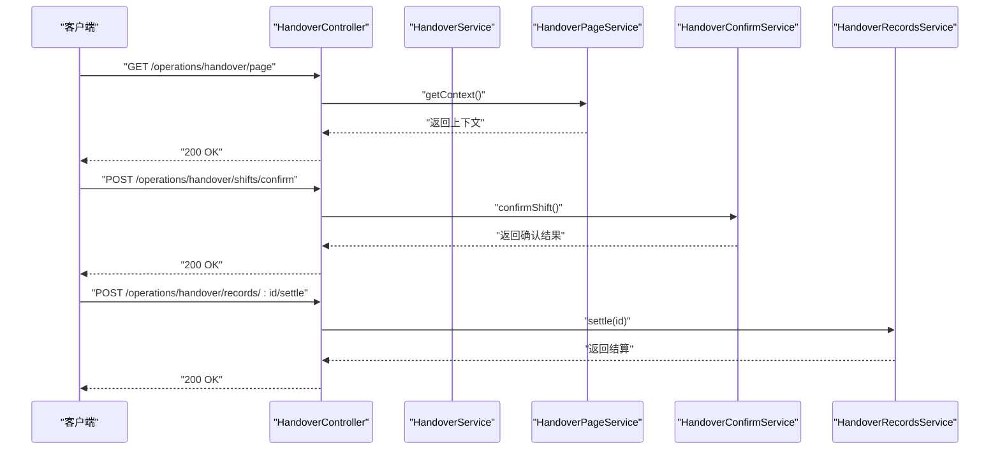
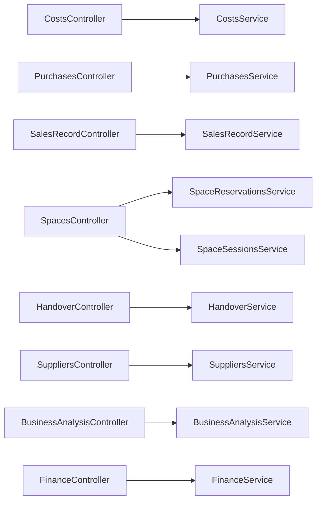

# 运营管理接口

<cite>
**本文档引用的文件**
- [costs.controller.ts](file://src/purely-profit/operations/costs/costs.controller.ts)
- [costs.service.ts](file://src/purely-profit/operations/costs/costs.service.ts)
- [costs-read.service.ts](file://src/purely-profit/operations/costs/costs-read.service.ts)
- [costs-write.service.ts](file://src/purely-profit/operations/costs/costs-write.service.ts)
- [costs.types.ts](file://src/purely-profit/operations/costs/costs.types.ts)
- [costs-query.dto.ts](file://src/purely-profit/operations/costs/dto/costs-query.dto.ts)
- [costs-response.dto.ts](file://src/purely-profit/operations/costs/dto/costs-response.dto.ts)
- [handover.controller.ts](file://src/purely-profit/operations/handover/handover.controller.ts)
- [handover.service.ts](file://src/purely-profit/operations/handover/handover.service.ts)
- [handover-records.service.ts](file://src/purely-profit/operations/handover/handover-records.service.ts)
- [handover-page.service.ts](file://src/purely-profit/operations/handover/handover-page.service.ts)
- [handover-confirm.service.ts](file://src/purely-profit/operations/handover/handover-confirm.service.ts)
- [handover-confirm-shift.service.ts](file://src/purely-profit/operations/handover/handover-confirm-shift.service.ts)
- [handover-additional-items.service.ts](file://src/purely-profit/operations/handover/handover-additional-items.service.ts)
- [handover.types.ts](file://src/purely-profit/operations/handover/handover.types.ts)
- [sales-record.controller.ts](file://src/purely-profit/operations/sales-record/sales-record.controller.ts)
- [sales-record.service.ts](file://src/purely-profit/operations/sales-record/sales-record.service.ts)
- [sales-record-create-flow.service.ts](file://src/purely-profit/operations/sales-record/sales-record-create-flow.service.ts)
- [sales-record-list.service.ts](file://src/purely-profit/operations/sales-record/sales-record-list.service.ts)
- [sales-record-stats.service.ts](file://src/purely-profit/operations/sales-record/sales-record-stats.service.ts)
- [sales-record.types.ts](file://src/purely-profit/operations/sales-record/sales-record.types.ts)
- [purchases.controller.ts](file://src/purely-profit/operations/purchases/purchases.controller.ts)
- [purchases.service.ts](file://src/purely-profit/operations/purchases/purchases.service.ts)
- [purchase.dto.ts](file://src/purely-profit/operations/purchases/dto/purchase.dto.ts)
- [space-reservations.controller.ts](file://src/purely-profit/operations/spaces/space-reservations.controller.ts)
- [space-reservations.service.ts](file://src/purely-profit/operations/spaces/space-reservations.service.ts)
- [space-sessions.controller.ts](file://src/purely-profit/operations/spaces/space-sessions.controller.ts)
- [space-sessions.service.ts](file://src/purely-profit/operations/spaces/space-sessions.service.ts)
- [spaces.controller.ts](file://src/purely-profit/operations/spaces/spaces.controller.ts)
- [space-types.controller.ts](file://src/purely-profit/operations/spaces/space-types.controller.ts)
- [space-zones.controller.ts](file://src/purely-profit/operations/spaces/space-zones.controller.ts)
- [suppliers.controller.ts](file://src/purely-profit/operations/suppliers/suppliers.controller.ts)
- [business-analysis.controller.ts](file://src/purely-profit/dashboard/business-analysis/business-analysis.controller.ts)
- [business-analysis.service.ts](file://src/purely-profit/dashboard/business-analysis/business-analysis.service.ts)
- [finance.controller.ts](file://src/purely-profit/finance/finance.controller.ts)
- [finance.service.ts](file://src/purely-profit/finance/finance.service.ts)
</cite>

## 目录
1. [简介](#简介)
2. [项目结构](#项目结构)
3. [核心组件](#核心组件)
4. [架构总览](#架构总览)
5. [详细组件分析](#详细组件分析)
6. [依赖关系分析](#依赖关系分析)
7. [性能考虑](#性能考虑)
8. [故障排除指南](#故障排除指南)
9. [结论](#结论)
10. [附录](#附录)

## 简介
本文件为运营管理模块的详细 API 接口文档，覆盖销售订单管理、成本控制、采购管理、空间预约与会话、交接班、运营数据分析与财务概览等核心运营功能。文档面向开发与产品团队，提供接口规范、数据模型、调用流程、异常处理与性能优化建议，帮助实现高效、稳定、可扩展的运营支撑系统。

## 项目结构
运营管理模块位于 `src/purely-profit/operations` 目录下，按功能域划分控制器、服务层、查询与 DTO 层，遵循 NestJS 分层架构。主要子模块包括：
- 成本管理（costs）
- 采购管理（purchases）
- 销售订单（sales-record）
- 空间管理（spaces：含空间类型、区域、预约、会话）
- 交接班（handover）
- 供应商管理（suppliers）

图表来源
- [costs.controller.ts:1-200](file://src/purely-profit/operations/costs/costs.controller.ts#L1-L200)
- [purchases.controller.ts:1-200](file://src/purely-profit/operations/purchases/purchases.controller.ts#L1-L200)
- [sales-record.controller.ts:1-200](file://src/purely-profit/operations/sales-record/sales-record.controller.ts#L1-L200)
- [spaces.controller.ts:1-200](file://src/purely-profit/operations/spaces/spaces.controller.ts#L1-L200)
- [handover.controller.ts:1-200](file://src/purely-profit/operations/handover/handover.controller.ts#L1-L200)
- [suppliers.controller.ts:1-200](file://src/purely-profit/operations/suppliers/suppliers.controller.ts#L1-L200)
- [business-analysis.controller.ts:1-200](file://src/purely-profit/dashboard/business-analysis/business-analysis.controller.ts#L1-L200)
- [finance.controller.ts:1-200](file://src/purely-profit/finance/finance.controller.ts#L1-L200)

章节来源
- [costs.controller.ts:1-200](file://src/purely-profit/operations/costs/costs.controller.ts#L1-L200)
- [purchases.controller.ts:1-200](file://src/purely-profit/operations/purchases/purchases.controller.ts#L1-L200)
- [sales-record.controller.ts:1-200](file://src/purely-profit/operations/sales-record/sales-record.controller.ts#L1-L200)
- [spaces.controller.ts:1-200](file://src/purely-profit/operations/spaces/spaces.controller.ts#L1-L200)
- [handover.controller.ts:1-200](file://src/purely-profit/operations/handover/handover.controller.ts#L1-L200)
- [suppliers.controller.ts:1-200](file://src/purely-profit/operations/suppliers/suppliers.controller.ts#L1-L200)
- [business-analysis.controller.ts:1-200](file://src/purely-profit/dashboard/business-analysis/business-analysis.controller.ts#L1-L200)
- [finance.controller.ts:1-200](file://src/purely-profit/finance/finance.controller.ts#L1-L200)

## 核心组件
- 成本管理：提供成本记录的增删改查、分页查询、统计汇总与导出能力，支持按时间范围、成本类别、责任人等维度筛选。
- 采购管理：提供采购单据的创建、审核、入库、对账与报表，支持供应商维度与商品维度的数据聚合。
- 销售订单：提供订单创建、支付、退款、核销、状态流转与统计分析，支持多门店、多商品、多渠道的统一视图。
- 空间管理：提供空间类型与区域配置、空间资源管理、预约下单、会话开启/续时/结算/转交、自动结账与状态监控。
- 交接班：提供班次定义、员工排班、班次确认、额外事项登记、交接记录查询与收入结算，支持班次过渡与现金操作。
- 供应商管理：提供供应商信息维护、资质管理、价格与账期设置、对账与付款申请，支持多级权限与审批流。
- 运营数据分析：提供销售趋势、收入构成、成本分布、库存周转等指标的多维分析与可视化。
- 财务概览：提供账户余额、现金流、对账单与报表，支持与销售订单、采购、成本的链路关联。

章节来源
- [costs.service.ts:1-200](file://src/purely-profit/operations/costs/costs.service.ts#L1-L200)
- [purchases.service.ts:1-200](file://src/purely-profit/operations/purchases/purchases.service.ts#L1-L200)
- [sales-record.service.ts:1-200](file://src/purely-profit/operations/sales-record/sales-record.service.ts#L1-L200)
- [space-reservations.service.ts:1-200](file://src/purely-profit/operations/spaces/space-reservations.service.ts#L1-L200)
- [space-sessions.service.ts:1-200](file://src/purely-profit/operations/spaces/space-sessions.service.ts#L1-L200)
- [handover.service.ts:1-200](file://src/purely-profit/operations/handover/handover.service.ts#L1-L200)
- [business-analysis.service.ts:1-200](file://src/purely-profit/dashboard/business-analysis/business-analysis.service.ts#L1-L200)
- [finance.service.ts:1-200](file://src/purely-profit/finance/finance.service.ts#L1-L200)

## 架构总览
运营管理模块采用“控制器-服务-查询/映射”的分层设计，控制器负责请求路由与参数校验，服务层封装业务逻辑，查询与 DTO 层负责数据传输与序列化。模块间通过服务依赖耦合，避免直接跨模块访问。

图表来源
- [costs.controller.ts:1-200](file://src/purely-profit/operations/costs/costs.controller.ts#L1-L200)
- [costs.service.ts:1-200](file://src/purely-profit/operations/costs/costs.service.ts#L1-L200)
- [purchases.controller.ts:1-200](file://src/purely-profit/operations/purchases/purchases.controller.ts#L1-L200)
- [purchases.service.ts:1-200](file://src/purely-profit/operations/purchases/purchases.service.ts#L1-L200)
- [sales-record.controller.ts:1-200](file://src/purely-profit/operations/sales-record/sales-record.controller.ts#L1-L200)
- [sales-record.service.ts:1-200](file://src/purely-profit/operations/sales-record/sales-record.service.ts#L1-L200)
- [spaces.controller.ts:1-200](file://src/purely-profit/operations/spaces/spaces.controller.ts#L1-L200)
- [space-reservations.service.ts:1-200](file://src/purely-profit/operations/spaces/space-reservations.service.ts#L1-L200)
- [space-sessions.service.ts:1-200](file://src/purely-profit/operations/spaces/space-sessions.service.ts#L1-L200)
- [handover.controller.ts:1-200](file://src/purely-profit/operations/handover/handover.controller.ts#L1-L200)
- [handover.service.ts:1-200](file://src/purely-profit/operations/handover/handover.service.ts#L1-L200)
- [suppliers.controller.ts:1-200](file://src/purely-profit/operations/suppliers/suppliers.controller.ts#L1-L200)
- [business-analysis.controller.ts:1-200](file://src/purely-profit/dashboard/business-analysis/business-analysis.controller.ts#L1-L200)
- [business-analysis.service.ts:1-200](file://src/purely-profit/dashboard/business-analysis/business-analysis.service.ts#L1-L200)
- [finance.controller.ts:1-200](file://src/purely-profit/finance/finance.controller.ts#L1-L200)
- [finance.service.ts:1-200](file://src/purely-profit/finance/finance.service.ts#L1-L200)

## 详细组件分析

### 成本管理 API
- 功能概述：支持成本记录的创建、更新、删除、列表查询与详情查看；支持按时间、类别、责任人等条件过滤；提供统计汇总与导出。
- 关键接口（示例）：
  - GET /operations/costs：分页查询成本记录
  - GET /operations/costs/:id：获取成本详情
  - POST /operations/costs：创建成本记录
  - PUT /operations/costs/:id：更新成本记录
  - DELETE /operations/costs/:id：删除成本记录
- 数据模型要点：
  - 查询参数：时间范围、成本类别、责任人、关键词等
  - 响应字段：成本编号、发生时间、类别、金额、责任人、备注、附件、创建/更新时间
- 处理流程：
  - 参数校验 → 权限检查 → 服务层持久化/查询 → DTO 映射 → 返回响应

图表来源
- [costs.controller.ts:1-200](file://src/purely-profit/operations/costs/costs.controller.ts#L1-L200)
- [costs.service.ts:1-200](file://src/purely-profit/operations/costs/costs.service.ts#L1-L200)
- [costs-read.service.ts:1-200](file://src/purely-profit/operations/costs/costs-read.service.ts#L1-L200)
- [costs-write.service.ts:1-200](file://src/purely-profit/operations/costs/costs-write.service.ts#L1-L200)
- [costs.types.ts:1-200](file://src/purely-profit/operations/costs/costs.types.ts#L1-L200)

章节来源
- [costs.controller.ts:1-200](file://src/purely-profit/operations/costs/costs.controller.ts#L1-L200)
- [costs.service.ts:1-200](file://src/purely-profit/operations/costs/costs.service.ts#L1-L200)
- [costs-read.service.ts:1-200](file://src/purely-profit/operations/costs/costs-read.service.ts#L1-L200)
- [costs-write.service.ts:1-200](file://src/purely-profit/operations/costs/costs-write.service.ts#L1-L200)
- [costs.types.ts:1-200](file://src/purely-profit/operations/costs/costs.types.ts#L1-L200)
- [costs-query.dto.ts:1-200](file://src/purely-profit/operations/costs/dto/costs-query.dto.ts#L1-L200)
- [costs-response.dto.ts:1-200](file://src/purely-profit/operations/costs/dto/costs-response.dto.ts#L1-L200)

### 采购管理 API
- 功能概述：支持采购单据的创建、编辑、审核、入库、对账与报表；支持按供应商、商品、状态、时间等维度查询。
- 关键接口（示例）：
  - GET /operations/purchases：分页查询采购单
  - GET /operations/purchases/:id：获取采购详情
  - POST /operations/purchases：创建采购单
  - PUT /operations/purchases/:id：更新采购单
  - POST /operations/purchases/:id/audit：提交审核
  - POST /operations/purchases/:id/receipt：执行入库
- 数据模型要点：
  - 请求字段：供应商、商品明细、数量、单价、预计到货时间、备注
  - 响应字段：单号、状态、创建人、供应商、商品清单、金额、创建/更新时间
- 处理流程：
  - 参数校验 → 权限检查 → 服务层业务编排（审核/入库）→ 持久化 → 返回响应

图表来源
- [purchases.controller.ts:1-200](file://src/purely-profit/operations/purchases/purchases.controller.ts#L1-L200)
- [purchases.service.ts:1-200](file://src/purely-profit/operations/purchases/purchases.service.ts#L1-L200)
- [purchase.dto.ts:1-200](file://src/purely-profit/operations/purchases/dto/purchase.dto.ts#L1-L200)

章节来源
- [purchases.controller.ts:1-200](file://src/purely-profit/operations/purchases/purchases.controller.ts#L1-L200)
- [purchases.service.ts:1-200](file://src/purely-profit/operations/purchases/purchases.service.ts#L1-L200)
- [purchase.dto.ts:1-200](file://src/purely-profit/operations/purchases/dto/purchase.dto.ts#L1-L200)

### 销售订单 API
- 功能概述：支持订单创建、支付、退款、核销、状态流转与统计分析；支持多门店、多商品、多渠道的统一视图。
- 关键接口（示例）：
  - POST /operations/sales-records：创建销售订单
  - GET /operations/sales-records：分页查询订单
  - GET /operations/sales-records/:id：获取订单详情
  - POST /operations/sales-records/:id/refund：发起退款
  - GET /operations/sales-records/stats：获取销售统计
- 数据模型要点：
  - 订单明细：商品、数量、单价、优惠、实收、门店、收银员
  - 统计维度：日期、商品、门店、渠道、支付方式
- 处理流程：
  - 参数校验 → 商品与库存校验 → 创建订单 → 支付回调/手动入账 → 状态更新 → 统计刷新

图表来源
- [sales-record.controller.ts:1-200](file://src/purely-profit/operations/sales-record/sales-record.controller.ts#L1-L200)
- [sales-record.service.ts:1-200](file://src/purely-profit/operations/sales-record/sales-record.service.ts#L1-L200)
- [sales-record-create-flow.service.ts:1-200](file://src/purely-profit/operations/sales-record/sales-record-create-flow.service.ts#L1-L200)
- [sales-record-stats.service.ts:1-200](file://src/purely-profit/operations/sales-record/sales-record-stats.service.ts#L1-L200)
- [sales-record.types.ts:1-200](file://src/purely-profit/operations/sales-record/sales-record.types.ts#L1-L200)

章节来源
- [sales-record.controller.ts:1-200](file://src/purely-profit/operations/sales-record/sales-record.controller.ts#L1-L200)
- [sales-record.service.ts:1-200](file://src/purely-profit/operations/sales-record/sales-record.service.ts#L1-L200)
- [sales-record-create-flow.service.ts:1-200](file://src/purely-profit/operations/sales-record/sales-record-create-flow.service.ts#L1-L200)
- [sales-record-list.service.ts:1-200](file://src/purely-profit/operations/sales-record/sales-record-list.service.ts#L1-L200)
- [sales-record-stats.service.ts:1-200](file://src/purely-profit/operations/sales-record/sales-record-stats.service.ts#L1-L200)
- [sales-record.types.ts:1-200](file://src/purely-profit/operations/sales-record/sales-record.types.ts#L1-L200)

### 空间管理 API
- 功能概述：支持空间类型与区域配置、空间资源管理、预约下单、会话开启/续时/结算/转交、自动结账与状态监控。
- 关键接口（示例）：
  - GET /operations/spaces/types：查询空间类型
  - GET /operations/spaces/zones：查询空间区域
  - GET /operations/spaces：查询空间列表
  - POST /operations/spaces/reservations：创建预约
  - POST /operations/spaces/sessions：开启会话
  - POST /operations/spaces/sessions/:id/renew：续时
  - POST /operations/spaces/sessions/:id/checkout：结算
  - POST /operations/spaces/sessions/:id/transfer：转交
- 数据模型要点：
  - 预约：开始/结束时间、空间类型、区域、用户、状态
  - 会话：占用人、开始/结束时间、费用、状态、转交记录
- 处理流程：
  - 预约校验 → 预约创建 → 会话开启/续时/结算 → 自动结账与状态同步

图表来源
- [space-reservations.controller.ts:1-200](file://src/purely-profit/operations/spaces/space-reservations.controller.ts#L1-L200)
- [space-reservations.service.ts:1-200](file://src/purely-profit/operations/spaces/space-reservations.service.ts#L1-L200)
- [space-sessions.controller.ts:1-200](file://src/purely-profit/operations/spaces/space-sessions.controller.ts#L1-L200)
- [space-sessions.service.ts:1-200](file://src/purely-profit/operations/spaces/space-sessions.service.ts#L1-L200)
- [spaces.controller.ts:1-200](file://src/purely-profit/operations/spaces/spaces.controller.ts#L1-L200)
- [space-types.controller.ts:1-200](file://src/purely-profit/operations/spaces/space-types.controller.ts#L1-L200)
- [space-zones.controller.ts:1-200](file://src/purely-profit/operations/spaces/space-zones.controller.ts#L1-L200)

章节来源
- [space-reservations.controller.ts:1-200](file://src/purely-profit/operations/spaces/space-reservations.controller.ts#L1-L200)
- [space-reservations.service.ts:1-200](file://src/purely-profit/operations/spaces/space-reservations.service.ts#L1-L200)
- [space-sessions.controller.ts:1-200](file://src/purely-profit/operations/spaces/space-sessions.controller.ts#L1-L200)
- [space-sessions.service.ts:1-200](file://src/purely-profit/operations/spaces/space-sessions.service.ts#L1-L200)
- [spaces.controller.ts:1-200](file://src/purely-profit/operations/spaces/spaces.controller.ts#L1-L200)
- [space-types.controller.ts:1-200](file://src/purely-profit/operations/spaces/space-types.controller.ts#L1-L200)
- [space-zones.controller.ts:1-200](file://src/purely-profit/operations/spaces/space-zones.controller.ts#L1-L200)

### 交接班 API
- 功能概述：支持班次定义、员工排班、班次确认、额外事项登记、交接记录查询与收入结算，支持班次过渡与现金操作。
- 关键接口（示例）：
  - GET /operations/handover/page：获取交接页面上下文
  - POST /operations/handover/shifts/confirm：确认当前班次
  - POST /operations/handover/additional-items：登记额外事项
  - GET /operations/handover/records：查询交接记录
  - POST /operations/handover/records/:id/settle：结算交接
- 数据模型要点：
  - 班次：班次定义、起止时间、值班人员
  - 交接：班次快照、现金数、收入、损耗、备注
- 处理流程：
  - 获取班次上下文 → 确认班次 → 登记额外事项 → 结算交接 → 更新状态

图表来源
- [handover.controller.ts:1-200](file://src/purely-profit/operations/handover/handover.controller.ts#L1-L200)
- [handover.service.ts:1-200](file://src/purely-profit/operations/handover/handover.service.ts#L1-L200)
- [handover-page.service.ts:1-200](file://src/purely-profit/operations/handover/handover-page.service.ts#L1-L200)
- [handover-confirm.service.ts:1-200](file://src/purely-profit/operations/handover/handover-confirm.service.ts#L1-L200)
- [handover-confirm-shift.service.ts:1-200](file://src/purely-profit/operations/handover/handover-confirm-shift.service.ts#L1-L200)
- [handover-additional-items.service.ts:1-200](file://src/purely-profit/operations/handover/handover-additional-items.service.ts#L1-L200)
- [handover-records.service.ts:1-200](file://src/purely-profit/operations/handover/handover-records.service.ts#L1-L200)
- [handover.types.ts:1-200](file://src/purely-profit/operations/handover/handover.types.ts#L1-L200)

章节来源
- [handover.controller.ts:1-200](file://src/purely-profit/operations/handover/handover.controller.ts#L1-L200)
- [handover.service.ts:1-200](file://src/purely-profit/operations/handover/handover.service.ts#L1-L200)
- [handover-page.service.ts:1-200](file://src/purely-profit/operations/handover/handover-page.service.ts#L1-L200)
- [handover-confirm.service.ts:1-200](file://src/purely-profit/operations/handover/handover-confirm.service.ts#L1-L200)
- [handover-confirm-shift.service.ts:1-200](file://src/purely-profit/operations/handover/handover-confirm-shift.service.ts#L1-L200)
- [handover-additional-items.service.ts:1-200](file://src/purely-profit/operations/handover/handover-additional-items.service.ts#L1-L200)
- [handover-records.service.ts:1-200](file://src/purely-profit/operations/handover/handover-records.service.ts#L1-L200)
- [handover.types.ts:1-200](file://src/purely-profit/operations/handover/handover.types.ts#L1-L200)

### 供应商 API
- 功能概述：支持供应商信息维护、资质管理、价格与账期设置、对账与付款申请，支持多级权限与审批流。
- 关键接口（示例）：
  - GET /operations/suppliers：分页查询供应商
  - GET /operations/suppliers/:id：获取供应商详情
  - POST /operations/suppliers：创建供应商
  - PUT /operations/suppliers/:id：更新供应商
  - POST /operations/suppliers/:id/apply-payment：申请付款
- 数据模型要点：
  - 供应商基础信息、联系人、银行账户、账期、信用额度
  - 价格与账期变更记录、对账单与付款申请
- 处理流程：
  - 参数校验 → 供应商维护 → 价格/账期更新 → 对账与付款申请

章节来源
- [suppliers.controller.ts:1-200](file://src/purely-profit/operations/suppliers/suppliers.controller.ts#L1-L200)

### 运营数据分析 API
- 功能概述：提供销售趋势、收入构成、成本分布、库存周转等指标的多维分析与可视化。
- 关键接口（示例）：
  - GET /dashboard/business-analysis/sales-trend：销售趋势分析
  - GET /dashboard/business-analysis/profit-overview：利润概览
  - GET /dashboard/business-analysis/cost-distribution：成本分布
- 数据模型要点：
  - 时间维度：日/周/月/季度/年
  - 维度过滤：门店、商品、渠道、成本中心
- 处理流程：
  - 参数解析 → 维度组合 → 聚合计算 → 结果映射 → 返回

章节来源
- [business-analysis.controller.ts:1-200](file://src/purely-profit/dashboard/business-analysis/business-analysis.controller.ts#L1-L200)
- [business-analysis.service.ts:1-200](file://src/purely-profit/dashboard/business-analysis/business-analysis.service.ts#L1-L200)

### 财务概览 API
- 功能概述：提供账户余额、现金流、对账单与报表，支持与销售订单、采购、成本的链路关联。
- 关键接口（示例）：
  - GET /finance/overview：财务概览
  - GET /finance/cash-flows：现金流明细
  - GET /finance/reconciliations：对账单
- 数据模型要点：
  - 账户余额、收入/支出明细、未达账项、对账状态
- 处理流程：
  - 参数校验 → 数据聚合 → 对账匹配 → 结果返回

章节来源
- [finance.controller.ts:1-200](file://src/purely-profit/finance/finance.controller.ts#L1-L200)
- [finance.service.ts:1-200](file://src/purely-profit/finance/finance.service.ts#L1-L200)

## 依赖关系分析
- 控制器依赖对应的服务层，服务层通过查询构建器与映射器完成数据转换。
- 各模块间低耦合，通过统一的鉴权与权限守卫进行访问控制。
- 数据一致性通过事务与幂等设计保障，异常通过统一错误码与消息返回。

图表来源
- [costs.controller.ts:1-200](file://src/purely-profit/operations/costs/costs.controller.ts#L1-L200)
- [purchases.controller.ts:1-200](file://src/purely-profit/operations/purchases/purchases.controller.ts#L1-L200)
- [sales-record.controller.ts:1-200](file://src/purely-profit/operations/sales-record/sales-record.controller.ts#L1-L200)
- [spaces.controller.ts:1-200](file://src/purely-profit/operations/spaces/spaces.controller.ts#L1-L200)
- [handover.controller.ts:1-200](file://src/purely-profit/operations/handover/handover.controller.ts#L1-L200)
- [suppliers.controller.ts:1-200](file://src/purely-profit/operations/suppliers/suppliers.controller.ts#L1-L200)
- [business-analysis.controller.ts:1-200](file://src/purely-profit/dashboard/business-analysis/business-analysis.controller.ts#L1-L200)
- [finance.controller.ts:1-200](file://src/purely-profit/finance/finance.controller.ts#L1-L200)

## 性能考虑
- 分页与索引：成本、采购、销售、空间等模块均提供分页查询接口，建议在高频查询字段建立数据库索引以提升性能。
- 缓存策略：对静态配置（如空间类型、区域、供应商信息）启用缓存预热与失效策略，降低数据库压力。
- 并发控制：交接班与空间会话涉及并发写入，需使用乐观锁或分布式锁确保数据一致性。
- 异步处理：对耗时操作（如对账、报表生成）采用异步队列，避免阻塞主流程。
- 监控与告警：对接口耗时、错误率、吞吐量进行观测，设置阈值告警以便快速定位问题。

## 故障排除指南
- 常见错误码与含义：
  - 400：参数校验失败（时间格式、必填字段缺失、数值越界）
  - 401：未授权（Token 失效或权限不足）
  - 403：禁止访问（无操作权限）
  - 404：资源不存在（ID 错误或已被删除）
  - 409：业务冲突（重复提交、库存不足、会话状态不合法）
  - 500：服务器内部错误（数据库连接失败、第三方服务异常）
- 排查步骤：
  - 检查请求参数与 DTO 字段映射是否正确
  - 核对权限与角色配置
  - 查看服务层日志与数据库事务回滚点
  - 使用接口测试工具复现并抓包分析
- 建议的日志字段：请求 ID、用户 ID、接口路径、入参摘要、耗时、错误码与堆栈

章节来源
- [costs.controller.ts:1-200](file://src/purely-profit/operations/costs/costs.controller.ts#L1-L200)
- [purchases.controller.ts:1-200](file://src/purely-profit/operations/purchases/purchases.controller.ts#L1-L200)
- [sales-record.controller.ts:1-200](file://src/purely-profit/operations/sales-record/sales-record.controller.ts#L1-L200)
- [space-reservations.controller.ts:1-200](file://src/purely-profit/operations/spaces/space-reservations.controller.ts#L1-L200)
- [space-sessions.controller.ts:1-200](file://src/purely-profit/operations/spaces/space-sessions.controller.ts#L1-L200)
- [handover.controller.ts:1-200](file://src/purely-profit/operations/handover/handover.controller.ts#L1-L200)
- [suppliers.controller.ts:1-200](file://src/purely-profit/operations/suppliers/suppliers.controller.ts#L1-L200)
- [business-analysis.controller.ts:1-200](file://src/purely-profit/dashboard/business-analysis/business-analysis.controller.ts#L1-L200)
- [finance.controller.ts:1-200](file://src/purely-profit/finance/finance.controller.ts#L1-L200)

## 结论
运营管理模块通过清晰的分层架构与完善的 API 设计，覆盖了成本、采购、销售、空间、交接班、供应商与数据分析等核心运营场景。建议在生产环境中结合缓存、异步与监控体系，持续优化接口性能与稳定性，并配合严格的权限与审计机制保障数据安全。

## 附录
- 扩展功能建议：
  - 流程审批：基于工作流引擎接入采购与付款审批
  - 异常处理：统一异常拦截器与重试策略
  - 运营效率优化：自动化对账、智能库存预警、班次排班优化
  - 质量控制：订单与会话的合规性检查与异常报警