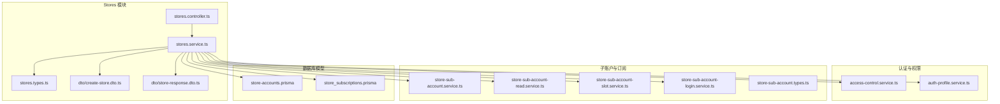
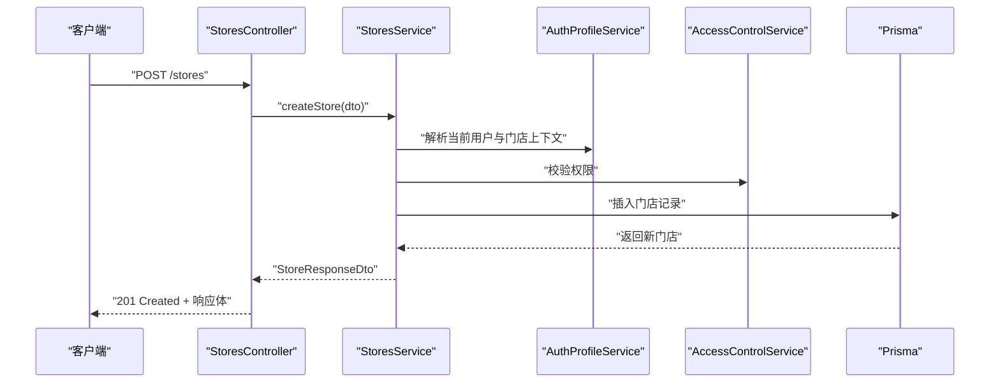
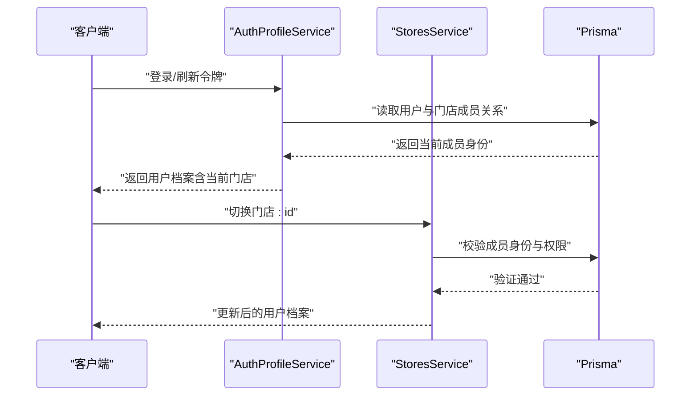
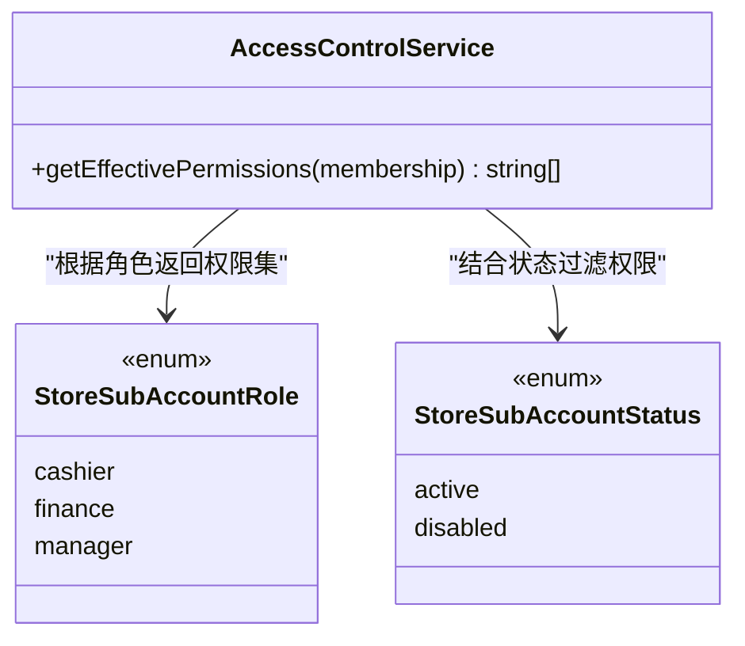
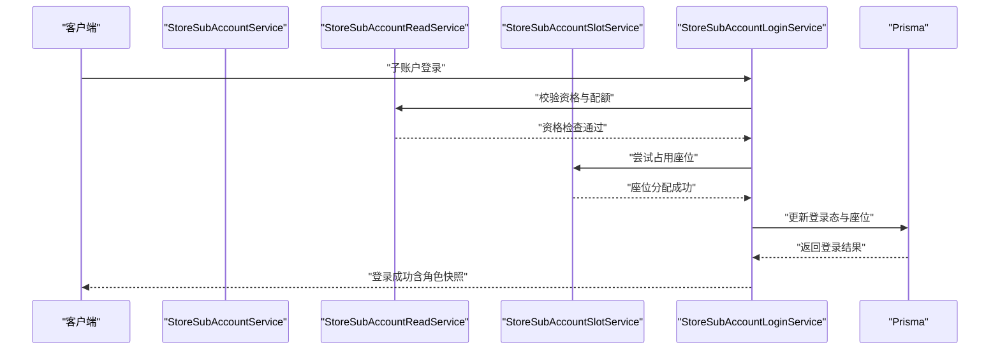
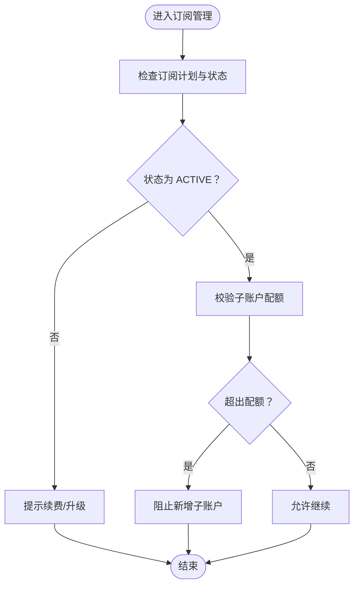
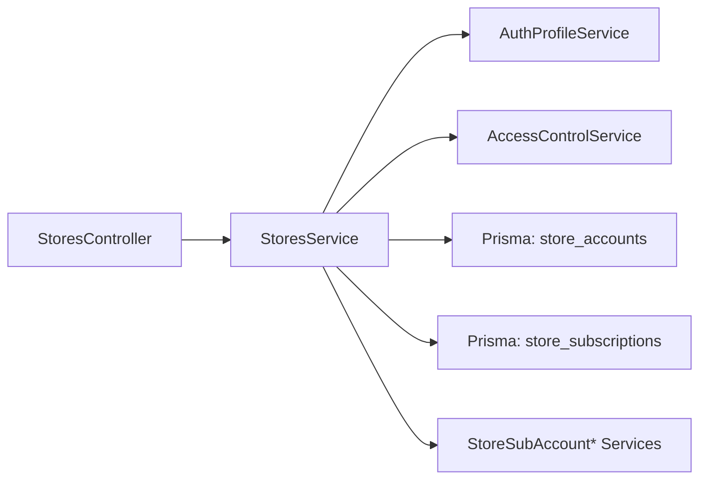

# 门店管理接口

<cite>
**本文引用的文件**
- [stores.controller.ts](file://src/purely-profit/stores/stores.controller.ts)
- [stores.service.ts](file://src/purely-profit/stores/stores.service.ts)
- [stores.types.ts](file://src/purely-profit/stores/stores.types.ts)
- [create-store.dto.ts](file://src/purely-profit/stores/dto/create-store.dto.ts)
- [store-response.dto.ts](file://src/purely-profit/stores/dto/store-response.dto.ts)
- [store-accounts.prisma](file://prisma/purely-profit/stores/store-accounts.prisma)
- [store_subscriptions.prisma](file://prisma/purely-profit/stores/store-accounts.prisma)
- [20260512110000_add_stores/migration.sql](file://prisma/migrations/20260512110000_add_stores/migration.sql)
- [20260513110000_add_store_subscriptions/migration.sql](file://prisma/migrations/20260513110000_add_store_subscriptions/migration.sql)
- [access-control.service.ts](file://src/purely-profit/access-control/access-control.service.ts)
- [auth-profile.service.ts](file://src/purely-profit/auth/auth-profile.service.ts)
- [store-sub-account.service.ts](file://src/purely-profit/member/platform-membership/store-sub-account.service.ts)
- [store-sub-account-read.service.ts](file://src/purely-profit/member/platform-membership/store-sub-account-read.service.ts)
- [store-sub-account-slot.service.ts](file://src/purely-profit/member/platform-membership/store-sub-account-slot.service.ts)
- [store-sub-account-login.service.ts](file://src/purely-profit/member/platform-membership/store-sub-account-login.service.ts)
- [store-sub-account.types.ts](file://src/purely-profit/member/platform-membership/store-sub-account.types.ts)
- [store-sub-account-read.service.spec.ts](file://src/purely-profit/member/platform-membership/store-sub-account-read.service.spec.ts)
- [store-sub-account-slot.service.spec.ts](file://src/purely-profit/member/platform-membership/store-sub-account-slot.service.spec.ts)
- [store-sub-account-login.service.spec.ts](file://src/purely-profit/member/platform-membership/store-sub-account-login.service.spec.ts)
</cite>

## 目录
1. [简介](#简介)
2. [项目结构](#项目结构)
3. [核心组件](#核心组件)
4. [架构总览](#架构总览)
5. [详细组件分析](#详细组件分析)
6. [依赖关系分析](#依赖关系分析)
7. [性能考虑](#性能考虑)
8. [故障排除指南](#故障排除指南)
9. [结论](#结论)
10. [附录](#附录)

## 简介
本文件为“门店管理模块”的完整 API 接口文档，覆盖以下核心能力：
- 门店 CRUD：创建、查询、更新、删除
- 门店配置管理：门店基础信息、扩展元数据
- 多门店切换：当前门店上下文、用户在多个门店的成员身份
- 门店状态管理：门店启用/停用、状态变更流程
- 门店权限控制：基于角色的权限矩阵、子账户权限继承
- 子账户管理：子账户配额、登录、座位占用、权限快照
- 门店订阅管理：订阅计划、到期时间、配额限制

文档提供每个接口的请求参数、响应格式、业务逻辑说明，并给出常见错误处理策略与排障建议。

## 项目结构
门店管理模块位于 `src/purely-profit/stores/`，核心文件包括控制器、服务、类型定义与 DTO；数据库模型位于 `prisma/purely-profit/stores/`，并配套迁移脚本。

图表来源
- [stores.controller.ts](file://src/purely-profit/stores/stores.controller.ts)
- [stores.service.ts](file://src/purely-profit/stores/stores.service.ts)
- [stores.types.ts](file://src/purely-profit/stores/stores.types.ts)
- [create-store.dto.ts](file://src/purely-profit/stores/dto/create-store.dto.ts)
- [store-response.dto.ts](file://src/purely-profit/stores/dto/store-response.dto.ts)
- [store-accounts.prisma](file://prisma/purely-profit/stores/store-accounts.prisma)
- [store_subscriptions.prisma](file://prisma/purely-profit/stores/store-accounts.prisma)
- [access-control.service.ts](file://src/purely-profit/access-control/access-control.service.ts)
- [auth-profile.service.ts](file://src/purely-profit/auth/auth-profile.service.ts)
- [store-sub-account.service.ts](file://src/purely-profit/member/platform-membership/store-sub-account.service.ts)
- [store-sub-account-read.service.ts](file://src/purely-profit/member/platform-membership/store-sub-account-read.service.ts)
- [store-sub-account-slot.service.ts](file://src/purely-profit/member/platform-membership/store-sub-account-slot.service.ts)
- [store-sub-account-login.service.ts](file://src/purely-profit/member/platform-membership/store-sub-account-login.service.ts)
- [store-sub-account.types.ts](file://src/purely-profit/member/platform-membership/store-sub-account.types.ts)

章节来源
- [stores.controller.ts](file://src/purely-profit/stores/stores.controller.ts)
- [stores.service.ts](file://src/purely-profit/stores/stores.service.ts)
- [stores.types.ts](file://src/purely-profit/stores/stores.types.ts)
- [create-store.dto.ts](file://src/purely-profit/stores/dto/create-store.dto.ts)
- [store-response.dto.ts](file://src/purely-profit/stores/dto/store-response.dto.ts)
- [store-accounts.prisma](file://prisma/purely-profit/stores/store-accounts.prisma)
- [store_subscriptions.prisma](file://prisma/purely-profit/stores/store-accounts.prisma)

## 核心组件
- 控制器（stores.controller.ts）：暴露 HTTP 接口，接收请求并调用服务层
- 服务（stores.service.ts）：实现业务逻辑，封装对 Prisma 的读写、权限校验、子账户与订阅联动
- 类型与 DTO（stores.types.ts、dto/*.ts）：定义请求/响应结构、枚举、约束
- 数据模型（store-accounts.prisma、store_subscriptions.prisma）：定义门店与订阅表结构
- 权限与认证（access-control.service.ts、auth-profile.service.ts）：提供权限矩阵与当前门店上下文
- 子账户与订阅（store-sub-account.*）：子账户配额、登录、座位占用、登录态

章节来源
- [stores.controller.ts](file://src/purely-profit/stores/stores.controller.ts)
- [stores.service.ts](file://src/purely-profit/stores/stores.service.ts)
- [stores.types.ts](file://src/purely-profit/stores/stores.types.ts)
- [create-store.dto.ts](file://src/purely-profit/stores/dto/create-store.dto.ts)
- [store-response.dto.ts](file://src/purely-profit/stores/dto/store-response.dto.ts)
- [store-accounts.prisma](file://prisma/purely-profit/stores/store-accounts.prisma)
- [store_subscriptions.prisma](file://prisma/purely-profit/stores/store-accounts.prisma)
- [access-control.service.ts](file://src/purely-profit/access-control/access-control.service.ts)
- [auth-profile.service.ts](file://src/purely-profit/auth/auth-profile.service.ts)
- [store-sub-account.service.ts](file://src/purely-profit/member/platform-membership/store-sub-account.service.ts)
- [store-sub-account-read.service.ts](file://src/purely-profit/member/platform-membership/store-sub-account-read.service.ts)
- [store-sub-account-slot.service.ts](file://src/purely-profit/member/platform-membership/store-sub-account-slot.service.ts)
- [store-sub-account-login.service.ts](file://src/purely-profit/member/platform-membership/store-sub-account-login.service.ts)
- [store-sub-account.types.ts](file://src/purely-profit/member/platform-membership/store-sub-account.types.ts)

## 架构总览
门店管理模块采用典型的分层架构：HTTP 层（控制器）、业务层（服务）、数据访问层（Prisma），并通过权限与认证模块进行统一的安全控制。

图表来源
- [stores.controller.ts](file://src/purely-profit/stores/stores.controller.ts)
- [stores.service.ts](file://src/purely-profit/stores/stores.service.ts)
- [auth-profile.service.ts](file://src/purely-profit/auth/auth-profile.service.ts)
- [access-control.service.ts](file://src/purely-profit/access-control/access-control.service.ts)

## 详细组件分析

### 1) 门店 CRUD 接口

#### 1.1 创建门店
- 方法与路径：POST /stores
- 请求体：CreateStoreDto（字段见下节）
- 成功响应：StoreResponseDto
- 权限要求：需具备“创建门店”相关权限
- 业务逻辑要点：
  - 校验请求参数合法性
  - 写入门店基础信息与默认配置
  - 初始化订阅记录（如未配置则创建默认订阅）
  - 返回完整门店信息（含扩展元数据）

请求参数（CreateStoreDto）
- 名称：字符串，必填
- 地址：字符串，可选
- 联系电话：字符串，可选
- 扩展元数据：JSON 对象，可选

响应体（StoreResponseDto）
- id：数字
- 名称：字符串
- 地址：字符串
- createdAt：时间戳
- updatedAt：时间戳
- 配置：对象（扩展元数据）

章节来源
- [create-store.dto.ts](file://src/purely-profit/stores/dto/create-store.dto.ts)
- [store-response.dto.ts](file://src/purely-profit/stores/dto/store-response.dto.ts)
- [stores.controller.ts](file://src/purely-profit/stores/stores.controller.ts)
- [stores.service.ts](file://src/purely-profit/stores/stores.service.ts)

#### 1.2 查询门店列表
- 方法与路径：GET /stores
- 查询参数：
  - keyword：字符串，用于名称/地址模糊搜索
  - page：数字，页码
  - pageSize：数字，每页条数
- 成功响应：分页结果，包含门店列表与总数
- 权限要求：需具备“查看门店”权限

章节来源
- [stores.controller.ts](file://src/purely-profit/stores/stores.controller.ts)
- [stores.service.ts](file://src/purely-profit/stores/stores.service.ts)

#### 1.3 查询单个门店详情
- 方法与路径：GET /stores/:id
- 路径参数：id（门店 ID）
- 成功响应：StoreResponseDto
- 权限要求：需具备“查看门店”权限

章节来源
- [stores.controller.ts](file://src/purely-profit/stores/stores.controller.ts)
- [stores.service.ts](file://src/purely-profit/stores/stores.service.ts)

#### 1.4 更新门店
- 方法与路径：PUT /stores/:id
- 路径参数：id（门店 ID）
- 请求体：部分字段更新（名称、地址、元数据等）
- 成功响应：StoreResponseDto
- 权限要求：需具备“更新门店”权限

章节来源
- [stores.controller.ts](file://src/purely-profit/stores/stores.controller.ts)
- [stores.service.ts](file://src/purely-profit/stores/stores.service.ts)

#### 1.5 删除门店
- 方法与路径：DELETE /stores/:id
- 路径参数：id（门店 ID）
- 成功响应：空或成功标志
- 权限要求：需具备“删除门店”权限
- 注意事项：删除前需确保无关联员工、库存、销售等数据

章节来源
- [stores.controller.ts](file://src/purely-profit/stores/stores.controller.ts)
- [stores.service.ts](file://src/purely-profit/stores/stores.service.ts)

### 2) 门店配置管理
- 支持通过扩展元数据存储门店个性化配置（如营业时间、通知开关、功能开关等）
- 更新时支持部分字段替换，避免全量覆盖
- 配置变更后，前端与各模块按需读取最新配置

章节来源
- [store-response.dto.ts](file://src/purely-profit/stores/dto/store-response.dto.ts)
- [stores.service.ts](file://src/purely-profit/stores/stores.service.ts)

### 3) 多门店切换
- 当前门店上下文由认证服务维护，用户可在不同门店间切换
- 切换时会更新当前会话中的 storeId、权限快照与子账户状态
- 登录后返回的用户档案包含当前门店与子账户相关信息

图表来源
- [auth-profile.service.ts](file://src/purely-profit/auth/auth-profile.service.ts)
- [stores.service.ts](file://src/purely-profit/stores/stores.service.ts)

章节来源
- [auth-profile.service.ts](file://src/purely-profit/auth/auth-profile.service.ts)
- [stores.service.ts](file://src/purely-profit/stores/stores.service.ts)

### 4) 门店状态管理
- 门店状态字段用于控制是否对外提供服务
- 状态变更需满足权限校验与业务规则（如存在未完结订单时禁止停用）
- 变更后需同步清理相关缓存与通知

章节来源
- [stores.types.ts](file://src/purely-profit/stores/stores.types.ts)
- [stores.service.ts](file://src/purely-profit/stores/stores.service.ts)

### 5) 门店权限控制
- 子账户角色与权限矩阵：
  - 收银员：有限运营权限（如销售、库存查看）
  - 财务：财务与进销存相关权限
  - 管理员：较全面的运营权限
- 权限来源：基于角色的权限集合，结合订阅配额与启用状态动态生效
- 访问控制服务提供统一权限判定与快照生成

图表来源
- [access-control.service.ts](file://src/purely-profit/access-control/access-control.service.ts)

章节来源
- [access-control.service.ts](file://src/purely-profit/access-control/access-control.service.ts)

### 6) 子账户管理
- 配额与资格：
  - 根据订阅等级计算可用子账户配额
  - 非资格状态下配额为 0
- 登录与座位：
  - 子账户登录后占用座位，退出登录释放
  - 支持座位占用上限与互斥规则
- 角色快照：
  - 将角色、状态、首页访问与交班权限打包为快照返回

图表来源
- [store-sub-account.service.ts](file://src/purely-profit/member/platform-membership/store-sub-account.service.ts)
- [store-sub-account-read.service.ts](file://src/purely-profit/member/platform-membership/store-sub-account-read.service.ts)
- [store-sub-account-slot.service.ts](file://src/purely-profit/member/platform-membership/store-sub-account-slot.service.ts)
- [store-sub-account-login.service.ts](file://src/purely-profit/member/platform-membership/store-sub-account-login.service.ts)

章节来源
- [store-sub-account.service.ts](file://src/purely-profit/member/platform-membership/store-sub-account.service.ts)
- [store-sub-account-read.service.ts](file://src/purely-profit/member/platform-membership/store-sub-account-read.service.ts)
- [store-sub-account-slot.service.ts](file://src/purely-profit/member/platform-membership/store-sub-account-slot.service.ts)
- [store-sub-account-login.service.ts](file://src/purely-profit/member/platform-membership/store-sub-account-login.service.ts)
- [store-sub-account.types.ts](file://src/purely-profit/member/platform-membership/store-sub-account.types.ts)

### 7) 门店订阅管理
- 订阅计划：
  - STARTER/GROWTH/PRO/CUSTOM
  - 每个门店绑定唯一订阅记录
- 状态与有效期：
  - ACTIVE/EXPIRED/CANCELLED
  - 记录开始时间与到期时间
- 配额与限制：
  - max_account_seats 限制子账户最大座位数
  - 与子账户服务联动，防止超配

图表来源
- [store_subscriptions.prisma](file://prisma/purely-profit/stores/store-accounts.prisma)
- [20260513110000_add_store_subscriptions/migration.sql](file://prisma/migrations/20260513110000_add_store_subscriptions/migration.sql)

章节来源
- [store_subscriptions.prisma](file://prisma/purely-profit/stores/store-accounts.prisma)
- [20260513110000_add_store_subscriptions/migration.sql](file://prisma/migrations/20260513110000_add_store_subscriptions/migration.sql)

## 依赖关系分析
- 控制器依赖服务：负责路由与参数校验
- 服务依赖认证与权限：确保操作主体具备相应权限
- 服务依赖 Prisma：读写门店与订阅数据
- 服务依赖子账户模块：校验配额、座位与登录态
- 数据模型依赖迁移：保证表结构与枚举一致

图表来源
- [stores.controller.ts](file://src/purely-profit/stores/stores.controller.ts)
- [stores.service.ts](file://src/purely-profit/stores/stores.service.ts)
- [auth-profile.service.ts](file://src/purely-profit/auth/auth-profile.service.ts)
- [access-control.service.ts](file://src/purely-profit/access-control/access-control.service.ts)
- [store-accounts.prisma](file://prisma/purely-profit/stores/store-accounts.prisma)
- [store_subscriptions.prisma](file://prisma/purely-profit/stores/store-accounts.prisma)
- [store-sub-account.service.ts](file://src/purely-profit/member/platform-membership/store-sub-account.service.ts)

章节来源
- [stores.controller.ts](file://src/purely-profit/stores/stores.controller.ts)
- [stores.service.ts](file://src/purely-profit/stores/stores.service.ts)
- [auth-profile.service.ts](file://src/purely-profit/auth/auth-profile.service.ts)
- [access-control.service.ts](file://src/purely-profit/access-control/access-control.service.ts)
- [store-accounts.prisma](file://prisma/purely-profit/stores/store-accounts.prisma)
- [store_subscriptions.prisma](file://prisma/purely-profit/stores/store-accounts.prisma)
- [store-sub-account.service.ts](file://src/purely-profit/member/platform-membership/store-sub-account.service.ts)

## 性能考虑
- 分页查询：列表接口使用分页参数，避免一次性加载过多数据
- 缓存策略：对常用配置与权限快照进行短期缓存，降低重复计算
- 并发控制：子账户登录与座位分配使用事务与锁，避免超配
- 数据索引：订阅状态与门店 ID 建有索引，提升查询效率

## 故障排除指南
- 权限不足
  - 现象：返回 403 Forbidden
  - 排查：确认当前用户在目标门店的角色与权限
  - 参考：权限矩阵与角色定义
- 子账户配额超限
  - 现象：创建子账户失败
  - 排查：检查订阅计划与已占用座位数
  - 参考：订阅配额与座位服务
- 门店不存在或状态异常
  - 现象：返回 404 或 400
  - 排查：确认门店 ID 与状态
- 参数校验失败
  - 现象：返回 400 Bad Request
  - 排查：核对请求体字段类型与长度

章节来源
- [access-control.service.ts](file://src/purely-profit/access-control/access-control.service.ts)
- [store-sub-account.service.ts](file://src/purely-profit/member/platform-membership/store-sub-account.service.ts)
- [store-sub-account-slot.service.ts](file://src/purely-profit/member/platform-membership/store-sub-account-slot.service.ts)
- [stores.service.ts](file://src/purely-profit/stores/stores.service.ts)

## 结论
门店管理模块通过清晰的分层设计与完善的权限体系，实现了从门店 CRUD、配置管理到多门店切换与子账户/订阅联动的完整能力。建议在生产环境中配合缓存、索引与事务控制，确保高并发下的稳定性与一致性。

## 附录

### A. 接口清单与示例（示意）
- 创建门店
  - 请求：POST /stores
  - 示例请求体：{ "name": "门店A", "address": "XX市XX区" }
  - 示例响应：{ "id": 1, "name": "门店A", "createdAt": "2026-01-01T00:00:00Z", "updatedAt": "2026-01-01T00:00:00Z", "config": {} }
- 查询门店列表
  - 请求：GET /stores?page=1&pageSize=20
  - 示例响应：{ "items": [...], "total": 120 }
- 查询门店详情
  - 请求：GET /stores/1
  - 示例响应：同上
- 更新门店
  - 请求：PUT /stores/1
  - 示例请求体：{ "address": "新地址" }
  - 示例响应：同上
- 删除门店
  - 请求：DELETE /stores/1
  - 示例响应：空或成功标志

### B. 错误码参考
- 400：参数校验失败、状态不合法
- 401：未认证或令牌无效
- 403：权限不足
- 404：资源不存在
- 500：服务器内部错误