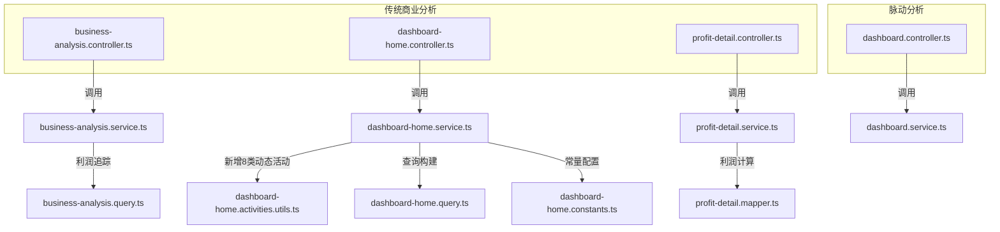
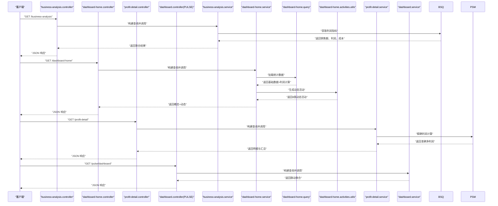
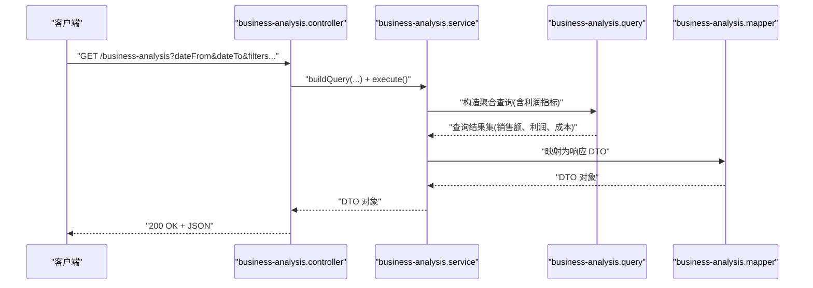
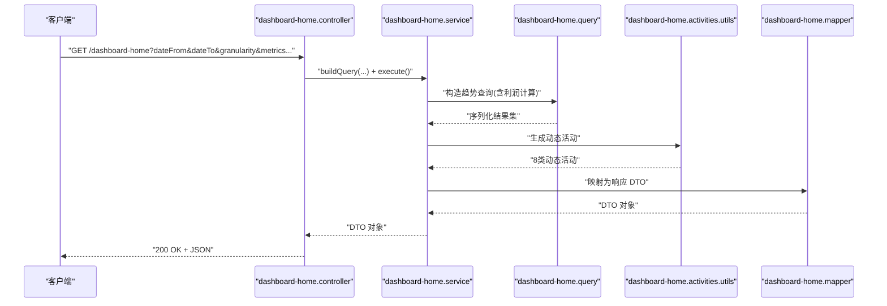
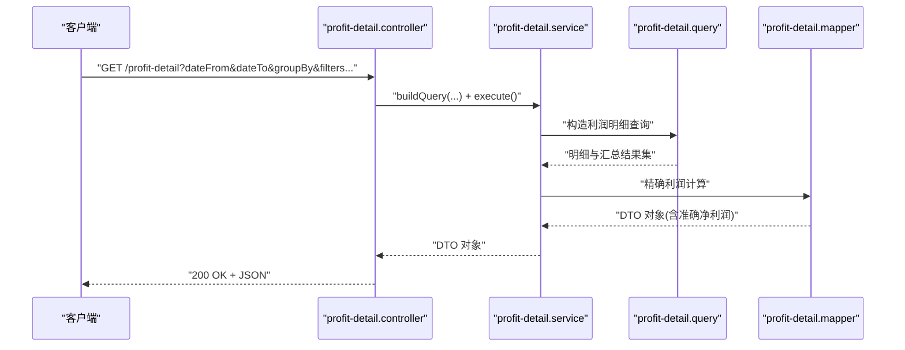
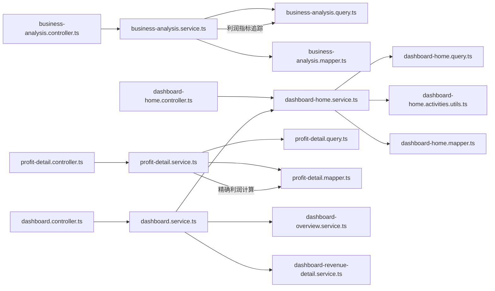

# 仪表板分析接口

<cite>
**本文引用的文件**
- [business-analysis.controller.ts](file://src/purely-profit/dashboard/business-analysis/business-analysis.controller.ts)
- [business-analysis.service.ts](file://src/purely-profit/dashboard/business-analysis/business-analysis.service.ts)
- [business-analysis.query.ts](file://src/purely-profit/dashboard/business-analysis/business-analysis.query.ts)
- [business-analysis.mapper.ts](file://src/purely-profit/dashboard/business-analysis/business-analysis.mapper.ts)
- [business-analysis.types.ts](file://src/purely-profit/dashboard/business-analysis/business-analysis.types.ts)
- [business-analysis-response.dto.ts](file://src/purely-profit/dashboard/business-analysis/dto/business-analysis-response.dto.ts)
- [business-analysis-query.dto.ts](file://src/purely-profit/dashboard/business-analysis/dto/business-analysis-query.dto.ts)
- [dashboard-home.controller.ts](file://src/purely-profit/dashboard/dashboard-home/dashboard-home.controller.ts)
- [dashboard-home.service.ts](file://src/purely-profit/dashboard/dashboard-home/dashboard-home.service.ts)
- [dashboard-home.query.ts](file://src/purely-profit/dashboard/dashboard-home/dashboard-home.query.ts)
- [dashboard-home.mapper.ts](file://src/purely-profit/dashboard/dashboard-home/dashboard-home.mapper.ts)
- [dashboard-home.types.ts](file://src/purely-profit/dashboard/dashboard-home/dashboard-home.types.ts)
- [dashboard-home-response.dto.ts](file://src/purely-profit/dashboard/dashboard-home/dto/dashboard-home-response.dto.ts)
- [dashboard-home-query.dto.ts](file://src/purely-profit/dashboard/dashboard-home/dto/dashboard-home-query.dto.ts)
- [dashboard-home.activities.utils.ts](file://src/purely-profit/dashboard/dashboard-home/dashboard-home.activities.utils.ts)
- [dashboard-home.constants.ts](file://src/purely-profit/dashboard/dashboard-home/dashboard-home.constants.ts)
- [profit-detail.controller.ts](file://src/purely-profit/dashboard/profit-detail/profit-detail.controller.ts)
- [profit-detail.service.ts](file://src/purely-profit/dashboard/profit-detail/profit-detail.service.ts)
- [profit-detail.query.ts](file://src/purely-profit/dashboard/profit-detail/profit-detail.query.ts)
- [profit-detail.mapper.ts](file://src/purely-profit/dashboard/profit-detail/profit-detail.mapper.ts)
- [profit-detail.types.ts](file://src/purely-profit/dashboard/profit-detail/profit-detail.types.ts)
- [profit-detail-response.dto.ts](file://src/purely-profit/dashboard/profit-detail/dto/profit-detail-response.dto.ts)
- [profit-detail-query.dto.ts](file://src/purely-profit/dashboard/profit-detail/dto/profit-detail-query.dto.ts)
- [dashboard.controller.ts](file://src/purely-pulse/dashboard/dashboard.controller.ts)
- [dashboard.service.ts](file://src/purely-pulse/dashboard/dashboard.service.ts)
- [dashboard-home.service.ts](file://src/purely-pulse/dashboard/dashboard-home.service.ts)
- [dashboard-overview.service.ts](file://src/purely-pulse/dashboard/dashboard-overview.service.ts)
- [dashboard-revenue-detail.service.ts](file://src/purely-pulse/dashboard/dashboard-revenue-detail.service.ts)
- [pulse-dashboard-response.dto.ts](file://src/purely-pulse/dashboard/dto/pulse-dashboard-response.dto.ts)
- [pulse-dashboard-query.dto.ts](file://src/purely-pulse/dashboard/dto/pulse-dashboard-query.dto.ts)
- [pulse-dashboard-home.response.dto.ts](file://src/purely-pulse/dashboard/dto/pulse-dashboard-home.response.dto.ts)
- [pulse-dashboard-overview.response.dto.ts](file://src/purely-pulse/dashboard/dto/pulse-dashboard-overview.response.dto.ts)
- [pulse-dashboard-revenue-detail.response.dto.ts](file://src/purely-pulse/dashboard/dto/pulse-dashboard-revenue-detail.response.dto.ts)
</cite>

## 更新摘要
**所做更改**
- 增强了利润计算功能，提供更准确的净利润计算方法
- 在业务概览模块中新增利润指标追踪和比较分析
- 在仪表板首页集成利润计算功能，支持当前期间和前期利润对比
- 优化了利润明细的聚合逻辑，确保商品成本正确扣除
- 更新了8种智能动态活动类型的缓存策略和阈值配置

## 目录
1. [简介](#简介)
2. [项目结构](#项目结构)
3. [核心组件](#核心组件)
4. [架构总览](#架构总览)
5. [详细组件分析](#详细组件分析)
6. [依赖关系分析](#依赖关系分析)
7. [性能考虑](#性能考虑)
8. [故障排除指南](#故障排除指南)
9. [结论](#结论)

## 简介
本文件为仪表板与分析模块的 API 接口规范，覆盖以下能力：
- 业务概览：关键指标汇总、时间范围筛选、多维度聚合
- 销售趋势：按日/周/月等粒度的趋势数据生成
- 利润明细：收入、成本、毛利、净利润的明细与汇总
- 脉动仪表板：基于 PULSE 的实时/准实时数据聚合与展示

**重大更新**：仪表板分析模块新增了更准确的利润计算功能，包括 profit-detail.mapper.ts 中的精确利润计算方法、business-analysis.query.ts 中的利润指标追踪、以及 dashboard-home.query.ts 中的利润计算集成。新增了当前期间和前期利润的比较分析功能，显著提升了财务分析的准确性。

接口支持统一的时间范围查询参数、数据聚合策略、图表数据格式、过滤与排序规则，并结合缓存预热与失效策略提升响应性能。

## 项目结构
仪表板与分析模块采用按功能域划分的目录结构，核心位于 `src/purely-profit/dashboard` 与 `src/purely-pulse/dashboard`，分别对应传统商业分析与脉动分析两大子系统。



**图示来源**
- [business-analysis.controller.ts:1-200](file://src/purely-profit/dashboard/business-analysis/business-analysis.controller.ts#L1-L200)
- [dashboard-home.controller.ts:1-200](file://src/purely-profit/dashboard/dashboard-home/dashboard-home.controller.ts#L1-L200)
- [profit-detail.controller.ts:1-200](file://src/purely-profit/dashboard/profit-detail/profit-detail.controller.ts#L1-L200)
- [dashboard.controller.ts:1-200](file://src/purely-pulse/dashboard/dashboard.controller.ts#L1-L200)

**章节来源**
- [business-analysis.controller.ts:1-200](file://src/purely-profit/dashboard/business-analysis/business-analysis.controller.ts#L1-L200)
- [dashboard-home.controller.ts:1-200](file://src/purely-profit/dashboard/dashboard-home/dashboard-home.controller.ts#L1-L200)
- [profit-detail.controller.ts:1-200](file://src/purely-profit/dashboard/profit-detail/profit-detail.controller.ts#L1-L200)
- [dashboard.controller.ts:1-200](file://src/purely-pulse/dashboard/dashboard.controller.ts#L1-L200)

## 核心组件
- 业务概览（business-analysis）：提供关键指标聚合、多维度统计与图表数据输出
- 销售趋势（dashboard-home）：提供趋势序列、同比/环比计算与可视化数据
- 利润明细（profit-detail）：提供收入、成本、利润的明细与汇总
- 脉动仪表板（purely-pulse dashboard）：提供实时/准实时聚合、概览卡片与收入明细

**重大更新**：dashboard-home服务新增8种智能动态活动类型，包括：
- 今日新增会员：监控当日新会员注册数量
- 今日新增充值：统计当日充值笔数与总金额
- 预约/包间即将开始：提醒即将到来的预约
- 账款即将到期：提醒即将到期的账款
- 工资单待确认：提醒待确认的工资单
- 高价值会员久未到店：识别长时间未消费的VIP会员
- 营收连续下滑：检测连续多日的营收下滑趋势

各组件均通过控制器暴露 HTTP 接口，服务层负责业务逻辑与查询构建，查询构建器负责 SQL/ORM 查询拼装，映射器负责领域对象到 DTO 的转换。

**章节来源**
- [business-analysis.service.ts:1-300](file://src/purely-profit/dashboard/business-analysis/business-analysis.service.ts#L1-L300)
- [dashboard-home.service.ts:1-300](file://src/purely-profit/dashboard/dashboard-home/dashboard-home.service.ts#L1-L300)
- [profit-detail.service.ts:1-300](file://src/purely-profit/dashboard/profit-detail/profit-detail.service.ts#L1-L300)
- [dashboard.service.ts:1-300](file://src/purely-pulse/dashboard/dashboard.service.ts#L1-L300)

## 架构总览
下图展示了从控制器到服务、查询构建与映射的整体调用链路，包括新增的动态活动处理流程和增强的利润计算功能。



**图示来源**
- [business-analysis.controller.ts:1-200](file://src/purely-profit/dashboard/business-analysis/business-analysis.controller.ts#L1-L200)
- [dashboard-home.controller.ts:1-200](file://src/purely-profit/dashboard/dashboard-home/dashboard-home.controller.ts#L1-L200)
- [profit-detail.controller.ts:1-200](file://src/purely-profit/dashboard/profit-detail/profit-detail.controller.ts#L1-L200)
- [dashboard.controller.ts:1-200](file://src/purely-pulse/dashboard/dashboard.controller.ts#L1-L200)

## 详细组件分析

### 业务概览（Business Analysis）
- 功能概述：提供关键指标的多维度聚合，支持时间范围、门店、品类等过滤，输出适合图表展示的数据结构
- 典型端点：`GET /business-analysis`
- 关键输入参数（示例，以 DTO 字段为准）：
  - 时间范围：开始日期、结束日期
  - 过滤条件：门店 ID 列表、商品分类、销售人员等
  - 聚合维度：按日、按周、按月或按品类/销售员等
  - 排序与分页：可选
- 输出格式：聚合指标列表，包含日期/维度标签、数值字段与元数据
- 数据来源：通过查询构建器组装 SQL/ORM 查询，服务层执行并映射为响应 DTO

**更新**：新增了利润指标的完整追踪，包括当前期间和前期的销售额、利润、订单量对比分析。



**图示来源**
- [business-analysis.controller.ts:1-200](file://src/purely-profit/dashboard/business-analysis/business-analysis.controller.ts#L1-L200)
- [business-analysis.service.ts:1-300](file://src/purely-profit/dashboard/business-analysis/business-analysis.service.ts#L1-L300)
- [business-analysis.query.ts:1-309](file://src/purely-profit/dashboard/business-analysis/business-analysis.query.ts#L1-L309)
- [business-analysis.mapper.ts:1-200](file://src/purely-profit/dashboard/business-analysis/business-analysis.mapper.ts#L1-L200)

**章节来源**
- [business-analysis.controller.ts:1-200](file://src/purely-profit/dashboard/business-analysis/business-analysis.controller.ts#L1-L200)
- [business-analysis.service.ts:1-300](file://src/purely-profit/dashboard/business-analysis/business-analysis.service.ts#L1-L300)
- [business-analysis.query.ts:1-309](file://src/purely-profit/dashboard/business-analysis/business-analysis.query.ts#L1-L309)
- [business-analysis.mapper.ts:1-200](file://src/purely-profit/dashboard/business-analysis/business-analysis.mapper.ts#L1-L200)
- [business-analysis-response.dto.ts:1-200](file://src/purely-profit/dashboard/business-analysis/dto/business-analysis-response.dto.ts#L1-L200)
- [business-analysis-query.dto.ts:1-200](file://src/purely-profit/dashboard/business-analysis/dto/business-analysis-query.dto.ts#L1-L200)

### 销售趋势（Dashboard Home）
- 功能概述：提供销售趋势序列，支持同比/环比计算，输出适合折线图/柱状图的数据
- 典型端点：`GET /dashboard-home`
- 关键输入参数（示例，以 DTO 字段为准）：
  - 时间范围：开始日期、结束日期
  - 趋势粒度：日/周/月
  - 过滤条件：门店、品类、销售员等
  - 指标类型：销售额、订单量、客单价等
- 输出格式：时间序列数组，每项包含时间戳与指标值；可附加同比/环比字段
- 数据来源：服务层根据粒度与时间范围生成序列，查询构建器产出聚合结果

**重大更新**：新增8种智能动态活动类型，提供更全面的业务洞察，同时集成了利润计算功能。



**图示来源**
- [dashboard-home.controller.ts:1-200](file://src/purely-profit/dashboard/dashboard-home/dashboard-home.controller.ts#L1-L200)
- [dashboard-home.service.ts:1-360](file://src/purely-profit/dashboard/dashboard-home/dashboard-home.service.ts#L1-L360)
- [dashboard-home.query.ts:1-406](file://src/purely-profit/dashboard/dashboard-home/dashboard-home.query.ts#L1-L406)
- [dashboard-home.activities.utils.ts:1-200](file://src/purely-profit/dashboard/dashboard-home/dashboard-home.activities.utils.ts#L1-L200)
- [dashboard-home.mapper.ts:1-200](file://src/purely-profit/dashboard/dashboard-home/dashboard-home.mapper.ts#L1-L200)

**章节来源**
- [dashboard-home.controller.ts:1-200](file://src/purely-profit/dashboard/dashboard-home/dashboard-home.controller.ts#L1-L200)
- [dashboard-home.service.ts:1-360](file://src/purely-profit/dashboard/dashboard-home/dashboard-home.service.ts#L1-L360)
- [dashboard-home.query.ts:1-406](file://src/purely-profit/dashboard/dashboard-home/dashboard-home.query.ts#L1-L406)
- [dashboard-home.activities.utils.ts:1-200](file://src/purely-profit/dashboard/dashboard-home/dashboard-home.activities.utils.ts#L1-L200)
- [dashboard-home-response.dto.ts:1-200](file://src/purely-profit/dashboard/dashboard-home/dto/dashboard-home-response.dto.ts#L1-L200)
- [dashboard-home-query.dto.ts:1-200](file://src/purely-profit/dashboard/dashboard-home/dto/dashboard-home-query.dto.ts#L1-L200)

### 利润明细（Profit Detail）
- 功能概述：提供利润构成明细，包括收入、成本、毛利、净利润等，支持按时间/维度拆解
- 典型端点：`GET /profit-detail`
- 关键输入参数（示例，以 DTO 字段为准）：
  - 时间范围：开始日期、结束日期
  - 维度：按商品、品类、门店、销售员等
  - 过滤条件：状态、订单类型等
  - 排序与分页：可选
- 输出格式：明细列表 + 汇总行，字段包含收入、成本、毛利、净利润及占比
- 数据来源：查询构建器按维度聚合，服务层汇总与映射

**重大更新**：实现了更准确的利润计算方法，确保商品成本被正确扣除，避免了此前仅用「收入 − 费用记录」导致商品成本未被扣除、利润虚高的问题。



**图示来源**
- [profit-detail.controller.ts:1-200](file://src/purely-profit/dashboard/profit-detail/profit-detail.controller.ts#L1-L200)
- [profit-detail.service.ts:1-331](file://src/purely-profit/dashboard/profit-detail/profit-detail.service.ts#L1-L331)
- [profit-detail.query.ts:1-200](file://src/purely-profit/dashboard/profit-detail/profit-detail.query.ts#L1-L200)
- [profit-detail.mapper.ts:1-398](file://src/purely-profit/dashboard/profit-detail/profit-detail.mapper.ts#L1-L398)

**章节来源**
- [profit-detail.controller.ts:1-200](file://src/purely-profit/dashboard/profit-detail/profit-detail.controller.ts#L1-L200)
- [profit-detail.service.ts:1-331](file://src/purely-profit/dashboard/profit-detail/profit-detail.service.ts#L1-L331)
- [profit-detail.query.ts:1-200](file://src/purely-profit/dashboard/profit-detail/profit-detail.query.ts#L1-L200)
- [profit-detail.mapper.ts:1-398](file://src/purely-profit/dashboard/profit-detail/profit-detail.mapper.ts#L1-L398)
- [profit-detail-response.dto.ts:1-200](file://src/purely-profit/dashboard/profit-detail/dto/profit-detail-response.dto.ts#L1-L200)
- [profit-detail-query.dto.ts:1-200](file://src/purely-profit/dashboard/profit-detail/dto/profit-detail-query.dto.ts#L1-L200)

### 脉动仪表板（PULSE Dashboard）
- 功能概述：提供实时/准实时的业务聚合视图，包括概览卡片、趋势与收入明细
- 典型端点：`GET /pulse/dashboard`
- 关键输入参数（示例，以 DTO 字段为准）：
  - 时间范围：开始日期、结束日期
  - 聚合粒度：分钟/小时/天等
  - 指标类型：活跃用户、转化率、收入等
- 输出格式：概览卡片集合、趋势序列、收入明细
- 数据来源：服务层聚合，查询构建器产出结果，映射器转换为 PULSE 响应 DTO

```mermaid
sequenceDiagram
participant Client as "客户端"
participant Ctrl as "dashboard.controller(PULSE)"
participant Svc as "dashboard.service"
participant Home as "dashboard-home.service"
participant Over as "dashboard-overview.service"
participant Rev as "dashboard-revenue-detail.service"
Client->>Ctrl : "GET /pulse/dashboard?dateFrom&dateTo&metrics..."
Ctrl->>Svc : "聚合请求"
Svc->>Home : "趋势/概览数据"
Svc->>Over : "概览卡片"
Svc->>Rev : "收入明细"
Home-->>Svc : "趋势结果"
Over-->>Svc : "概览结果"
Rev-->>Svc : "明细结果"
Svc-->>Ctrl : "合并后的聚合结果"
Ctrl-->>Client : "200 OK + JSON"
```

**图示来源**
- [dashboard.controller.ts:1-200](file://src/purely-pulse/dashboard/dashboard.controller.ts#L1-L200)
- [dashboard.service.ts:1-300](file://src/purely-pulse/dashboard/dashboard.service.ts#L1-L300)
- [dashboard-home.service.ts:1-200](file://src/purely-pulse/dashboard/dashboard-home.service.ts#L1-L200)
- [dashboard-overview.service.ts:1-200](file://src/purely-pulse/dashboard/dashboard-overview.service.ts#L1-L200)
- [dashboard-revenue-detail.service.ts:1-200](file://src/purely-pulse/dashboard/dashboard-revenue-detail.service.ts#L1-L200)

**章节来源**
- [dashboard.controller.ts:1-200](file://src/purely-pulse/dashboard/dashboard.controller.ts#L1-L200)
- [dashboard.service.ts:1-300](file://src/purely-pulse/dashboard/dashboard.service.ts#L1-L300)
- [pulse-dashboard-response.dto.ts:1-200](file://src/purely-pulse/dashboard/dto/pulse-dashboard-response.dto.ts#L1-L200)
- [pulse-dashboard-query.dto.ts:1-200](file://src/purely-pulse/dashboard/dto/pulse-dashboard-query.dto.ts#L1-L200)
- [pulse-dashboard-home.response.dto.ts:1-200](file://src/purely-pulse/dashboard/dto/pulse-dashboard-home.response.dto.ts#L1-L200)
- [pulse-dashboard-overview.response.dto.ts:1-200](file://src/purely-pulse/dashboard/dto/pulse-dashboard-overview.response.dto.ts#L1-L200)
- [pulse-dashboard-revenue-detail.response.dto.ts:1-200](file://src/purely-pulse/dashboard/dto/pulse-dashboard-revenue-detail.response.dto.ts#L1-L200)

### 新增8种动态活动类型详解

**重大更新**：dashboard-home服务新增8种智能动态活动类型，提供更全面的业务洞察：

#### 1. 今日新增会员
- **触发条件**：当日新会员注册数量 > 0
- **显示内容**：今日新增X位会员，显示会员数量
- **业务类型**：member_new
- **跳转路径**：/member-center

#### 2. 今日新增充值
- **触发条件**：当日存在充值记录
- **显示内容**：今日新增X笔充值，显示总金额
- **业务类型**：member_recharge
- **跳转路径**：/member-center

#### 3. 预约/包间即将开始
- **触发条件**：未来2小时内有预约
- **显示内容**：XX的预约即将开始，显示剩余分钟数
- **业务类型**：space_reservation
- **跳转路径**：/space-management

#### 4. 账款即将到期
- **触发条件**：未来7天内到期的账款
- **显示内容**：有X笔账款即将到期，显示总金额
- **业务类型**：finance_account_upcoming
- **跳转路径**：/accounts-management

#### 5. 工资单待确认
- **触发条件**：近3个月内未确认的工资单
- **显示内容**：有X份工资单待确认，显示总金额
- **业务类型**：employee_payroll
- **跳转路径**：/employee-management

#### 6. 高价值会员久未到店
- **触发条件**：VIP会员超过30天未消费
- **显示内容**：有X位高价值会员30天未到店
- **业务类型**：member_inactive_vip
- **跳转路径**：/member-center

#### 7. 营收连续下滑
- **触发条件**：连续3天营收下滑
- **显示内容**：营收连续X天下滑，显示总下滑金额
- **业务类型**：revenue_decline
- **跳转路径**：/business-analysis

#### 8. 标准动态活动（原有）
- **库存预警**：商品库存低于警戒线
- **逾期账款**：账款已逾期
- **进行中活动**：营销活动进行中
- **待处理提现**：会员提现待处理
- **员工请假**：员工请假即将开始

**章节来源**
- [dashboard-home.activities.utils.ts:145-354](file://src/purely-profit/dashboard/dashboard-home/dashboard-home.activities.utils.ts#L145-L354)
- [dashboard-home.types.ts:294-339](file://src/purely-profit/dashboard/dashboard-home/dashboard-home.types.ts#L294-L339)
- [dashboard-home.constants.ts:19-113](file://src/purely-profit/dashboard/dashboard-home/dashboard-home.constants.ts#L19-L113)

## 依赖关系分析
- 控制器依赖服务层：所有控制器仅负责参数解析与响应封装，具体业务逻辑在服务层
- 服务层依赖查询构建器：服务层通过查询构建器生成 SQL/ORM 查询，保证复用与一致性
- 映射器负责 DTO 转换：将领域对象映射为对外响应 DTO，确保接口契约稳定
- PULSE 仪表板整合多个子服务：概览、趋势、收入明细由不同服务聚合后统一输出
- **新增**：dashboard-home.service依赖dashboard-home.activities.utils处理8种动态活动类型
- **新增**：profit-detail.service依赖精确的利润计算方法，确保财务数据准确性



**图示来源**
- [business-analysis.controller.ts:1-200](file://src/purely-profit/dashboard/business-analysis/business-analysis.controller.ts#L1-L200)
- [business-analysis.service.ts:1-300](file://src/purely-profit/dashboard/business-analysis/business-analysis.service.ts#L1-L300)
- [business-analysis.query.ts:1-309](file://src/purely-profit/dashboard/business-analysis/business-analysis.query.ts#L1-L309)
- [business-analysis.mapper.ts:1-200](file://src/purely-profit/dashboard/business-analysis/business-analysis.mapper.ts#L1-L200)
- [dashboard-home.controller.ts:1-200](file://src/purely-profit/dashboard/dashboard-home/dashboard-home.controller.ts#L1-L200)
- [dashboard-home.service.ts:1-360](file://src/purely-profit/dashboard/dashboard-home/dashboard-home.service.ts#L1-L360)
- [dashboard-home.query.ts:1-406](file://src/purely-profit/dashboard/dashboard-home/dashboard-home.query.ts#L1-L406)
- [dashboard-home.activities.utils.ts:1-200](file://src/purely-profit/dashboard/dashboard-home/dashboard-home.activities.utils.ts#L1-L200)
- [dashboard-home.mapper.ts:1-200](file://src/purely-profit/dashboard/dashboard-home/dashboard-home.mapper.ts#L1-L200)
- [profit-detail.controller.ts:1-200](file://src/purely-profit/dashboard/profit-detail/profit-detail.controller.ts#L1-L200)
- [profit-detail.service.ts:1-331](file://src/purely-profit/dashboard/profit-detail/profit-detail.service.ts#L1-L331)
- [profit-detail.query.ts:1-200](file://src/purely-profit/dashboard/profit-detail/profit-detail.query.ts#L1-L200)
- [profit-detail.mapper.ts:1-398](file://src/purely-profit/dashboard/profit-detail/profit-detail.mapper.ts#L1-L398)
- [dashboard.controller.ts:1-200](file://src/purely-pulse/dashboard/dashboard.controller.ts#L1-L200)
- [dashboard.service.ts:1-300](file://src/purely-pulse/dashboard/dashboard.service.ts#L1-L300)
- [dashboard-overview.service.ts:1-200](file://src/purely-pulse/dashboard/dashboard-overview.service.ts#L1-L200)
- [dashboard-revenue-detail.service.ts:1-200](file://src/purely-pulse/dashboard/dashboard-revenue-detail.service.ts#L1-L200)

**章节来源**
- [business-analysis.types.ts:1-137](file://src/purely-profit/dashboard/business-analysis/business-analysis.types.ts#L1-L137)
- [dashboard-home.types.ts:1-200](file://src/purely-profit/dashboard/dashboard-home/dashboard-home.types.ts#L1-L200)
- [profit-detail.types.ts:1-142](file://src/purely-profit/dashboard/profit-detail/profit-detail.types.ts#L1-L142)

## 性能考虑
- 缓存策略
  - 预热：在系统启动或定时任务中预热热点查询结果，减少首次访问延迟
  - 失效：基于时间范围与过滤条件生成缓存键，变更数据时主动失效
  - 分层：内存缓存 + Redis 缓存，结合过期时间与容量淘汰策略
  - **新增**：dashboard-home服务针对8类动态活动设置了专门的缓存策略，包括45秒TTL和15秒刷新间隔
  - **新增**：利润详情服务使用可刷新缓存机制，支持30秒TTL和30秒刷新间隔
- 查询优化
  - 使用索引：时间列、门店/品类/销售员等常用过滤字段建立索引
  - 聚合下推：尽量在数据库层完成聚合，避免大结果集回传
  - 分页与限制：默认分页大小限制，防止超大数据集查询
  - **新增**：针对8类动态活动设置了最大条数限制，如MAX_TODAY_RECHARGE_COUNT=5，MAX_DRAFT_PAYROLL_COUNT=5等
  - **新增**：利润计算采用精确的商品利润快照方法，避免重复计算
- 实时性权衡
  - PULSE 仪表板采用准实时聚合，平衡延迟与准确性
  - 对高频查询使用异步聚合与增量更新
  - **新增**：8类动态活动采用15秒刷新策略，确保业务洞察的及时性
  - **新增**：利润指标计算优化，确保财务数据的准确性和时效性

[本节为通用性能建议，不直接分析具体文件]

## 故障排除指南
- 参数校验失败
  - 检查时间范围是否合法（开始日期 ≤ 结束日期），过滤字段是否为空或越界
  - 参考查询 DTO 的字段定义与约束
- 查询超时
  - 缩小时间范围或增加过滤条件
  - 检查数据库索引是否完善
- 响应异常
  - 查看服务层异常处理与错误码映射
  - 确认映射器是否正确转换字段
- 缓存命中率低
  - 检查缓存键生成规则与失效策略
  - 评估预热任务执行频率与覆盖范围
- **新增**：动态活动显示异常
  - 检查8类动态活动的阈值配置（如VIP_INACTIVE_THRESHOLD_DAYS=30）
  - 验证相关数据源是否正常（会员、充值、预约、账款等）
  - 确认Redis缓存是否正确更新
- **新增**：利润计算不准确
  - 检查净利润计算公式：净利润 = 商品利润总和 - 费用记录
  - 验证商品成本是否正确扣除，避免利润虚高
  - 确认当前期间和前期利润比较逻辑正确

**章节来源**
- [business-analysis-query.dto.ts:1-200](file://src/purely-profit/dashboard/business-analysis/dto/business-analysis-query.dto.ts#L1-L200)
- [dashboard-home-query.dto.ts:1-200](file://src/purely-profit/dashboard/dashboard-home/dto/dashboard-home-query.dto.ts#L1-L200)
- [profit-detail-query.dto.ts:1-200](file://src/purely-profit/dashboard/profit-detail/dto/profit-detail-query.dto.ts#L1-L200)
- [pulse-dashboard-query.dto.ts:1-200](file://src/purely-pulse/dashboard/dto/pulse-dashboard-query.dto.ts#L1-L200)

## 结论
本文档梳理了仪表板与分析模块的 API 规范，明确了业务概览、销售趋势、利润明细与脉动仪表板的端点职责、输入参数、输出格式与数据流。**重大更新**：仪表板分析模块新增了更准确的利润计算功能，包括精确的净利润计算方法、完整的利润指标追踪、以及当前期间和前期利润的比较分析功能。dashboard-home服务新增8种智能动态活动类型，包括今日新会员注册、充值交易、即将到来的预约、即将到期账款、待确认工资单、高价值会员久未到店、营收连续下滑等，显著提升了业务智能分析能力。

通过统一的查询构建与映射机制，配合缓存与查询优化策略，可在保证实时性的同时提升整体性能与可维护性。新增的利润计算功能和动态活动类型为管理层提供了更全面的业务洞察，有助于及时发现业务机会与风险，提升运营效率。特别是精确的利润计算方法确保了财务数据的准确性，避免了此前因商品成本未被扣除而导致的利润虚高问题。