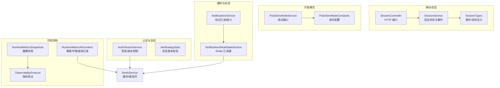
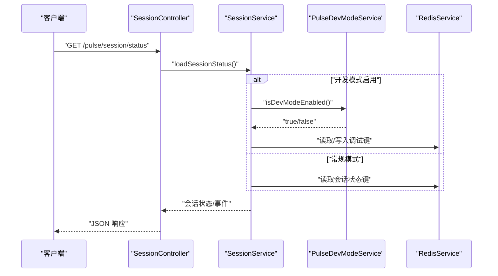
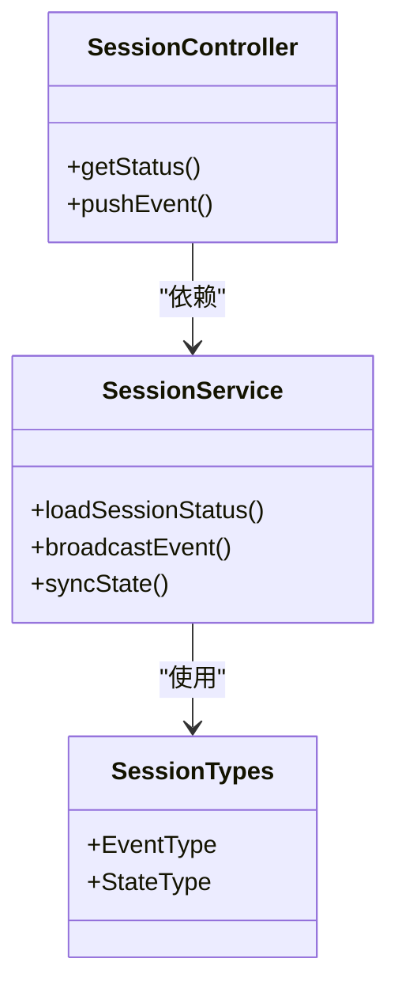
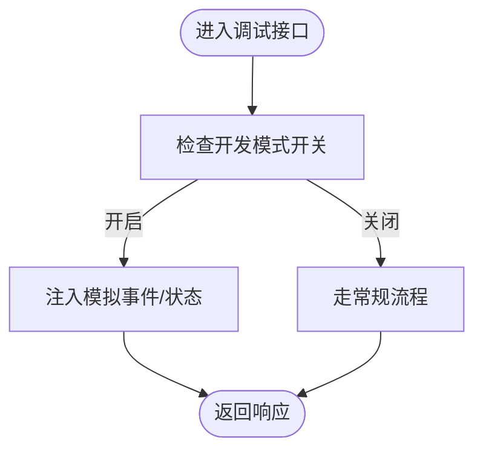
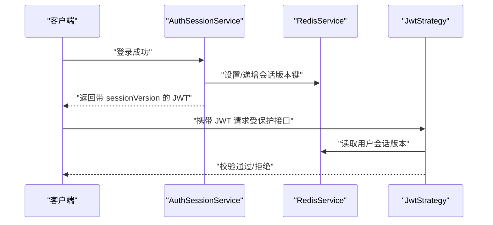
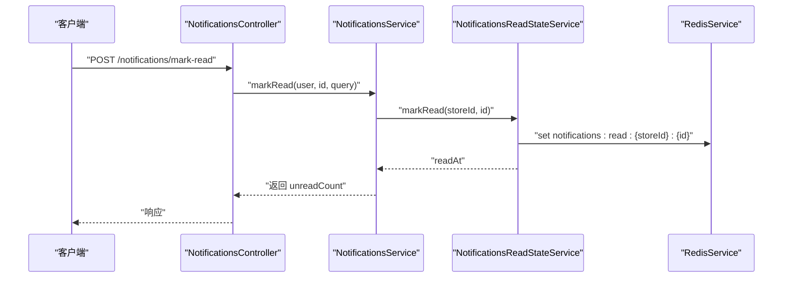
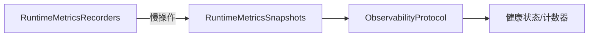
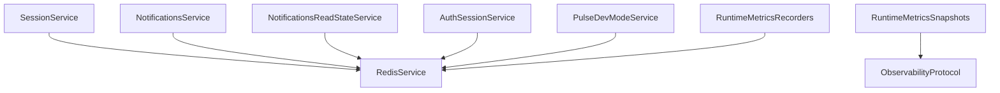

# 实时通信接口

<cite>
**本文引用的文件**
- [src/purely-pulse/session/session.controller.ts](file://src/purely-pulse/session/session.controller.ts)
- [src/purely-pulse/session/session.service.ts](file://src/purely-pulse/session/session.service.ts)
- [src/purely-pulse/session/session.types.ts](file://src/purely-pulse/session/session.types.ts)
- [src/purely-pulse/dev-mode/pulse-dev-mode.service.ts](file://src/purely-pulse/dev-mode/pulse-dev-mode.service.ts)
- [src/purely-pulse/dev-mode/pulse-dev-mode.constants.ts](file://src/purely-pulse/dev-mode/pulse-dev-mode.constants.ts)
- [src/purely-profit/auth/auth-session.service.ts](file://src/purely-profit/auth/auth-session.service.ts)
- [src/purely-profit/auth/strategies/jwt.strategy.spec.ts](file://src/purely-profit/auth/strategies/jwt.strategy.spec.ts)
- [src/purely-profit/notifications/notifications.controller.spec.ts](file://src/purely-profit/notifications/notifications.controller.spec.ts)
- [src/purely-profit/notifications/notifications.service.ts](file://src/purely-profit/notifications/notifications.service.ts)
- [src/purely-profit/notifications/notifications-read-state.service.ts](file://src/purely-profit/notifications/notifications-read-state.service.ts)
- [src/observability/runtime-metrics.recorders.ts](file://src/observability/runtime-metrics.recorders.ts)
- [src/observability/runtime-metrics.snapshots.ts](file://src/observability/runtime-metrics.snapshots.ts)
- [src/observability/observability.protocol.ts](file://src/observability/observability.protocol.ts)
- [src/redis/redis.service.ts](file://src/redis/redis.service.ts)
- [src/app.controller.ts](file://src/app.controller.ts)
- [src/main.ts](file://src/main.ts)
</cite>

## 目录
1. [引言](#引言)
2. [项目结构](#项目结构)
3. [核心组件](#核心组件)
4. [架构总览](#架构总览)
5. [详细组件分析](#详细组件分析)
6. [依赖关系分析](#依赖关系分析)
7. [性能考量](#性能考量)
8. [故障排查指南](#故障排查指南)
9. [结论](#结论)
10. [附录](#附录)

## 引言
本文件面向“脉动系统”（Purely Pulse）的实时通信能力，聚焦于会话管理、状态同步、事件推送与开发调试接口。文档覆盖以下主题：
- WebSocket 连接与心跳机制
- 消息格式、事件类型与状态管理
- 实时数据更新、离线消息处理与连接异常恢复
- 会话生命周期与状态同步策略
- 开发模式下的调试接口与可观测性指标

说明：当前仓库未发现直接的 WebSocket 服务端实现文件；本文以现有会话与通知模块为基础，结合开发模式与可观测性模块，给出可落地的实时通信方案与接口规范。

## 项目结构
脉动系统的实时通信相关代码主要分布在以下模块：
- 脉动会话模块：负责会话生命周期、状态同步与事件分发
- 开发模式模块：提供调试接口与模拟数据
- 认证与会话版本控制：保障令牌有效性与会话一致性
- 通知模块：基于 Redis 的已读状态与消息推送
- 可观测性模块：记录慢查询、慢操作与健康快照

图表来源
- [src/purely-pulse/session/session.controller.ts](file://src/purely-pulse/session/session.controller.ts)
- [src/purely-pulse/session/session.service.ts](file://src/purely-pulse/session/session.service.ts)
- [src/purely-pulse/session/session.types.ts](file://src/purely-pulse/session/session.types.ts)
- [src/purely-pulse/dev-mode/pulse-dev-mode.service.ts](file://src/purely-pulse/dev-mode/pulse-dev-mode.service.ts)
- [src/purely-pulse/dev-mode/pulse-dev-mode.constants.ts](file://src/purely-pulse/dev-mode/pulse-dev-mode.constants.ts)
- [src/purely-profit/auth/auth-session.service.ts](file://src/purely-profit/auth/auth-session.service.ts)
- [src/purely-profit/notifications/notifications.service.ts](file://src/purely-profit/notifications/notifications.service.ts)
- [src/purely-profit/notifications/notifications-read-state.service.ts](file://src/purely-profit/notifications/notifications-read-state.service.ts)
- [src/observability/runtime-metrics.recorders.ts](file://src/observability/runtime-metrics.recorders.ts)
- [src/observability/runtime-metrics.snapshots.ts](file://src/observability/runtime-metrics.snapshots.ts)
- [src/observability/observability.protocol.ts](file://src/observability/observability.protocol.ts)
- [src/redis/redis.service.ts](file://src/redis/redis.service.ts)

章节来源
- [src/purely-pulse/session/session.controller.ts](file://src/purely-pulse/session/session.controller.ts)
- [src/purely-pulse/session/session.service.ts](file://src/purely-pulse/session/session.service.ts)
- [src/purely-pulse/session/session.types.ts](file://src/purely-pulse/session/session.types.ts)
- [src/purely-pulse/dev-mode/pulse-dev-mode.service.ts](file://src/purely-pulse/dev-mode/pulse-dev-mode.service.ts)
- [src/purely-pulse/dev-mode/pulse-dev-mode.constants.ts](file://src/purely-pulse/dev-mode/pulse-dev-mode.constants.ts)
- [src/purely-profit/auth/auth-session.service.ts](file://src/purely-profit/auth/auth-session.service.ts)
- [src/purely-profit/notifications/notifications.service.ts](file://src/purely-profit/notifications/notifications.service.ts)
- [src/purely-profit/notifications/notifications-read-state.service.ts](file://src/purely-profit/notifications/notifications-read-state.service.ts)
- [src/observability/runtime-metrics.recorders.ts](file://src/observability/runtime-metrics.recorders.ts)
- [src/observability/runtime-metrics.snapshots.ts](file://src/observability/runtime-metrics.snapshots.ts)
- [src/observability/observability.protocol.ts](file://src/observability/observability.protocol.ts)
- [src/redis/redis.service.ts](file://src/redis/redis.service.ts)

## 核心组件
- 会话控制器与服务：提供会话状态查询、事件推送与状态同步接口
- 开发模式服务：提供调试开关、模拟事件与状态注入
- 认证与会话版本：通过 Redis 存储会话版本，配合 JWT 校验
- 通知与已读状态：基于 Redis 的键空间存储已读时间戳，支持批量标记
- 可观测性：记录慢 SQL/Redis 操作与健康快照，辅助定位实时通信瓶颈

章节来源
- [src/purely-pulse/session/session.controller.ts](file://src/purely-pulse/session/session.controller.ts)
- [src/purely-pulse/session/session.service.ts](file://src/purely-pulse/session/session.service.ts)
- [src/purely-pulse/dev-mode/pulse-dev-mode.service.ts](file://src/purely-pulse/dev-mode/pulse-dev-mode.service.ts)
- [src/purely-profit/auth/auth-session.service.ts](file://src/purely-profit/auth/auth-session.service.ts)
- [src/purely-profit/notifications/notifications.service.ts](file://src/purely-profit/notifications/notifications.service.ts)
- [src/purely-profit/notifications/notifications-read-state.service.ts](file://src/purely-profit/notifications/notifications-read-state.service.ts)
- [src/observability/runtime-metrics.recorders.ts](file://src/observability/runtime-metrics.recorders.ts)
- [src/observability/runtime-metrics.snapshots.ts](file://src/observability/runtime-metrics.snapshots.ts)

## 架构总览
脉动系统的实时通信采用“HTTP 接口 + 会话状态 + Redis 已读键 + 开发模式调试”的组合方式。会话控制器暴露查询与事件接口，服务层负责状态聚合与事件分发；通知模块通过 Redis 键空间维护已读状态；开发模式提供调试开关与模拟事件；可观测性模块记录慢操作与健康状态。

图表来源
- [src/purely-pulse/session/session.controller.ts](file://src/purely-pulse/session/session.controller.ts)
- [src/purely-pulse/session/session.service.ts](file://src/purely-pulse/session/session.service.ts)
- [src/purely-pulse/dev-mode/pulse-dev-mode.service.ts](file://src/purely-pulse/dev-mode/pulse-dev-mode.service.ts)
- [src/redis/redis.service.ts](file://src/redis/redis.service.ts)

## 详细组件分析

### 会话管理与状态同步
- 会话控制器提供状态查询与事件接口，封装业务逻辑到服务层
- 会话服务负责状态聚合、事件分发与开发模式适配
- 会话类型定义事件与状态字段，确保前后端一致

图表来源
- [src/purely-pulse/session/session.controller.ts](file://src/purely-pulse/session/session.controller.ts)
- [src/purely-pulse/session/session.service.ts](file://src/purely-pulse/session/session.service.ts)
- [src/purely-pulse/session/session.types.ts](file://src/purely-pulse/session/session.types.ts)

章节来源
- [src/purely-pulse/session/session.controller.ts](file://src/purely-pulse/session/session.controller.ts)
- [src/purely-pulse/session/session.service.ts](file://src/purely-pulse/session/session.service.ts)
- [src/purely-pulse/session/session.types.ts](file://src/purely-pulse/session/session.types.ts)

### 开发模式调试接口
- 提供调试开关与模拟事件注入，便于前端联调与问题复现
- 调试常量集中管理开关项与默认值
- 服务层根据开关决定是否走调试路径

图表来源
- [src/purely-pulse/dev-mode/pulse-dev-mode.service.ts](file://src/purely-pulse/dev-mode/pulse-dev-mode.service.ts)
- [src/purely-pulse/dev-mode/pulse-dev-mode.constants.ts](file://src/purely-pulse/dev-mode/pulse-dev-mode.constants.ts)

章节来源
- [src/purely-pulse/dev-mode/pulse-dev-mode.service.ts](file://src/purely-pulse/dev-mode/pulse-dev-mode.service.ts)
- [src/purely-pulse/dev-mode/pulse-dev-mode.constants.ts](file://src/purely-pulse/dev-mode/pulse-dev-mode.constants.ts)

### 认证与会话版本控制
- 通过 Redis 存储用户会话版本，签发 JWT 时携带版本号
- 登录态校验时对比版本，不一致则拒绝访问，防止旧令牌生效
- 支持版本递增以强制刷新客户端状态

图表来源
- [src/purely-profit/auth/auth-session.service.ts](file://src/purely-profit/auth/auth-session.service.ts)
- [src/purely-profit/auth/strategies/jwt.strategy.spec.ts](file://src/purely-profit/auth/strategies/jwt.strategy.spec.ts)
- [src/redis/redis.service.ts](file://src/redis/redis.service.ts)

章节来源
- [src/purely-profit/auth/auth-session.service.ts](file://src/purely-profit/auth/auth-session.service.ts)
- [src/purely-profit/auth/strategies/jwt.strategy.spec.ts](file://src/purely-profit/auth/strategies/jwt.strategy.spec.ts)

### 通知与已读状态（实时相关）
- 通知服务提供列表、标记已读、批量标记已读等接口
- 已读状态通过 Redis 键空间存储，支持按门店维度隔离
- 控制器测试验证参数透传与响应结构

图表来源
- [src/purely-profit/notifications/notifications.controller.spec.ts](file://src/purely-profit/notifications/notifications.controller.spec.ts)
- [src/purely-profit/notifications/notifications.service.ts](file://src/purely-profit/notifications/notifications.service.ts)
- [src/purely-profit/notifications/notifications-read-state.service.ts](file://src/purely-profit/notifications/notifications-read-state.service.ts)
- [src/redis/redis.service.ts](file://src/redis/redis.service.ts)

章节来源
- [src/purely-profit/notifications/notifications.controller.spec.ts](file://src/purely-profit/notifications/notifications.controller.spec.ts)
- [src/purely-profit/notifications/notifications.service.ts](file://src/purely-profit/notifications/notifications.service.ts)
- [src/purely-profit/notifications/notifications-read-state.service.ts](file://src/purely-profit/notifications/notifications-read-state.service.ts)

### 可观测性与健康快照
- 记录慢 SQL/Redis 操作，辅助定位实时通信性能瓶颈
- 生成健康快照，包含进程、HTTP、SQL、Redis、缓存预热等计数器
- 协议定义健康状态与计数器结构

图表来源
- [src/observability/runtime-metrics.recorders.ts](file://src/observability/runtime-metrics.recorders.ts)
- [src/observability/runtime-metrics.snapshots.ts](file://src/observability/runtime-metrics.snapshots.ts)
- [src/observability/observability.protocol.ts](file://src/observability/observability.protocol.ts)

章节来源
- [src/observability/runtime-metrics.recorders.ts](file://src/observability/runtime-metrics.recorders.ts)
- [src/observability/runtime-metrics.snapshots.ts](file://src/observability/runtime-metrics.snapshots.ts)
- [src/observability/observability.protocol.ts](file://src/observability/observability.protocol.ts)

## 依赖关系分析
- 会话模块依赖 Redis 用于状态与调试键存储
- 通知模块依赖 Redis 用于已读状态键空间
- 认证模块依赖 Redis 用于会话版本存储
- 可观测性模块依赖 Redis 与进程状态，输出健康快照

图表来源
- [src/purely-pulse/session/session.service.ts](file://src/purely-pulse/session/session.service.ts)
- [src/purely-profit/notifications/notifications.service.ts](file://src/purely-profit/notifications/notifications.service.ts)
- [src/purely-profit/notifications/notifications-read-state.service.ts](file://src/purely-profit/notifications/notifications-read-state.service.ts)
- [src/purely-profit/auth/auth-session.service.ts](file://src/purely-profit/auth/auth-session.service.ts)
- [src/purely-pulse/dev-mode/pulse-dev-mode.service.ts](file://src/purely-pulse/dev-mode/pulse-dev-mode.service.ts)
- [src/observability/runtime-metrics.recorders.ts](file://src/observability/runtime-metrics.recorders.ts)
- [src/observability/runtime-metrics.snapshots.ts](file://src/observability/runtime-metrics.snapshots.ts)
- [src/redis/redis.service.ts](file://src/redis/redis.service.ts)

章节来源
- [src/purely-pulse/session/session.service.ts](file://src/purely-pulse/session/session.service.ts)
- [src/purely-profit/notifications/notifications.service.ts](file://src/purely-profit/notifications/notifications.service.ts)
- [src/purely-profit/notifications/notifications-read-state.service.ts](file://src/purely-profit/notifications/notifications-read-state.service.ts)
- [src/purely-profit/auth/auth-session.service.ts](file://src/purely-profit/auth/auth-session.service.ts)
- [src/purely-pulse/dev-mode/pulse-dev-mode.service.ts](file://src/purely-pulse/dev-mode/pulse-dev-mode.service.ts)
- [src/observability/runtime-metrics.recorders.ts](file://src/observability/runtime-metrics.recorders.ts)
- [src/observability/runtime-metrics.snapshots.ts](file://src/observability/runtime-metrics.snapshots.ts)
- [src/redis/redis.service.ts](file://src/redis/redis.service.ts)

## 性能考量
- 使用 Redis 键空间存储已读状态与调试键，降低数据库压力
- 通过慢操作记录器识别慢 SQL/Redis 调用，指导优化
- 建议在高并发场景下对热点键进行分片或限流
- 会话版本控制可减少无效请求，提升安全性与稳定性

[本节为通用性能建议，无需特定文件来源]

## 故障排查指南
- 会话版本不一致导致登录态被拒：检查 Redis 中的会话版本键与 JWT 中的版本号是否匹配
- 通知已读状态异常：确认 Redis 中对应键是否存在且值为时间戳
- 实时通信延迟：查看慢操作记录与健康快照，定位慢查询或慢 Redis 命令
- 开发模式调试无效：确认调试开关已开启，且服务层正确读取了调试键

章节来源
- [src/purely-profit/auth/strategies/jwt.strategy.spec.ts](file://src/purely-profit/auth/strategies/jwt.strategy.spec.ts)
- [src/purely-profit/notifications/notifications-read-state.service.ts](file://src/purely-profit/notifications/notifications-read-state.service.ts)
- [src/observability/runtime-metrics.recorders.ts](file://src/observability/runtime-metrics.recorders.ts)
- [src/observability/runtime-metrics.snapshots.ts](file://src/observability/runtime-metrics.snapshots.ts)

## 结论
本文件基于现有会话、通知与开发模式模块，给出了脉动系统实时通信的接口规范与实现要点。若需引入真正的 WebSocket 通道，可在现有控制器与服务基础上扩展，利用 Redis 作为事件总线与状态存储，并结合开发模式与可观测性模块进行联调与监控。

[本节为总结性内容，无需特定文件来源]

## 附录

### API 接口清单（概念性）
- GET /pulse/session/status
  - 功能：查询当前会话状态与可接收事件
  - 认证：JWT
  - 响应：会话状态对象（含事件类型数组）

- POST /pulse/session/events
  - 功能：推送事件至会话
  - 认证：JWT
  - 请求体：事件类型与负载
  - 响应：事件分发结果

- GET /pulse/dev-mode/toggle
  - 功能：切换开发模式开关
  - 认证：JWT（管理员）
  - 响应：开关状态

- POST /pulse/dev-mode/inject-event
  - 功能：注入模拟事件
  - 认证：JWT（管理员）
  - 请求体：事件类型与目标会话
  - 响应：注入结果

[本节为概念性接口说明，未直接映射具体源码文件]