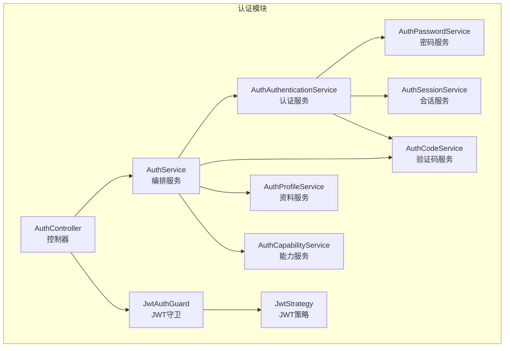
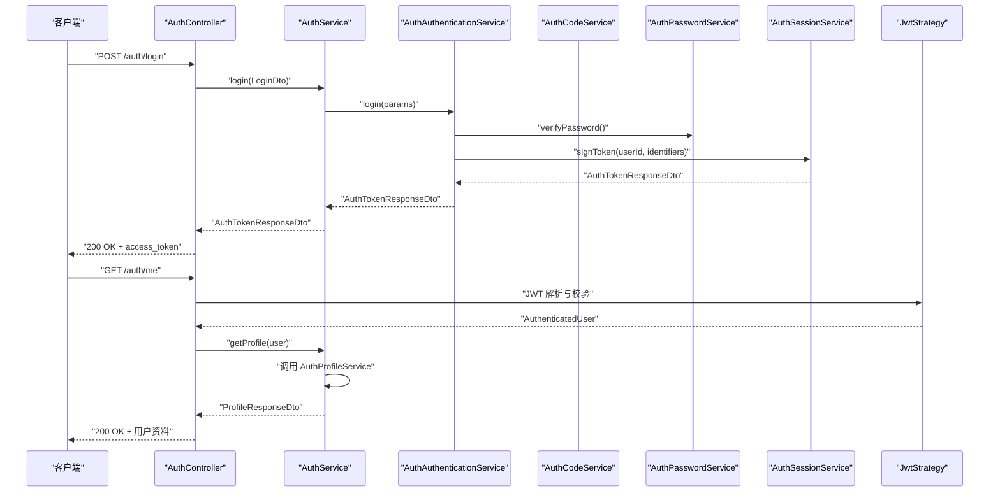
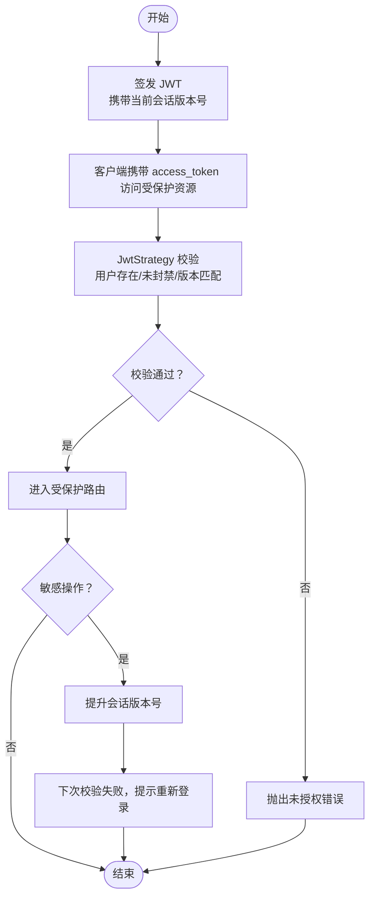
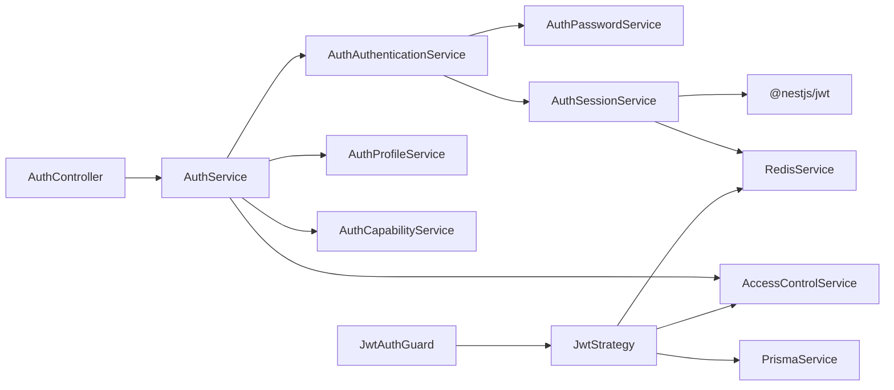

# 认证接口

<cite>
**本文引用的文件**
- [src/purely-profit/auth/auth.controller.ts](file://src/purely-profit/auth/auth.controller.ts)
- [src/purely-profit/auth/auth.service.ts](file://src/purely-profit/auth/auth.service.ts)
- [src/purely-profit/auth/auth-authentication.service.ts](file://src/purely-profit/auth/auth-authentication.service.ts)
- [src/purely-profit/auth/auth-code.service.ts](file://src/purely-profit/auth/auth-code.service.ts)
- [src/purely-profit/auth/auth-password.service.ts](file://src/purely-profit/auth/auth-password.service.ts)
- [src/purely-profit/auth/auth-session.service.ts](file://src/purely-profit/auth/auth-session.service.ts)
- [src/purely-profit/auth/auth-profile.service.ts](file://src/purely-profit/auth/auth-profile.service.ts)
- [src/purely-profit/auth/auth-capability.service.ts](file://src/purely-profit/auth/auth-capability.service.ts)
- [src/purely-profit/auth/strategies/jwt.strategy.ts](file://src/purely-profit/auth/strategies/jwt.strategy.ts)
- [src/purely-profit/auth/guards/jwt-auth.guard.ts](file://src/purely-profit/auth/guards/jwt-auth.guard.ts)
- [src/purely-profit/auth/dto/login.dto.ts](file://src/purely-profit/auth/dto/login.dto.ts)
- [src/purely-profit/auth/dto/register.dto.ts](file://src/purely-profit/auth/dto/register.dto.ts)
- [src/purely-profit/auth/dto/send-register-code.dto.ts](file://src/purely-profit/auth/dto/send-register-code.dto.ts)
- [src/purely-profit/auth/dto/forgot-password.dto.ts](file://src/purely-profit/auth/dto/forgot-password.dto.ts)
- [src/purely-profit/auth/dto/reset-password.dto.ts](file://src/purely-profit/auth/dto/reset-password.dto.ts)
- [src/purely-profit/auth/dto/change-password.dto.ts](file://src/purely-profit/auth/dto/change-password.dto.ts)
- [src/purely-profit/auth/dto/auth-token-response.dto.ts](file://src/purely-profit/auth/dto/auth-token-response.dto.ts)
- [src/purely-profit/auth/dto/profile-response.dto.ts](file://src/purely-profit/auth/dto/profile-response.dto.ts)
- [src/purely-profit/auth/dto/capability-response.dto.ts](file://src/purely-profit/auth/dto/capability-response.dto.ts)
</cite>

## 目录
1. [简介](#简介)
2. [项目结构](#项目结构)
3. [核心组件](#核心组件)
4. [架构总览](#架构总览)
5. [详细组件分析](#详细组件分析)
6. [依赖分析](#依赖分析)
7. [性能考量](#性能考量)
8. [故障排查指南](#故障排查指南)
9. [结论](#结论)
10. [附录](#附录)

## 简介
本文件为认证模块的完整 API 接口文档，覆盖用户登录、注册、密码重置、验证码发送、当前用户资料查询与能力快照等认证相关端点。文档同时阐述 JWT 令牌的签发、版本控制与失效机制，并提供请求参数、响应格式、错误码说明与安全注意事项，以及客户端集成建议。

## 项目结构
认证模块采用分层设计：控制器负责路由与装饰器标注，服务层封装业务流程，策略与守卫处理鉴权，DTO 定义请求/响应结构，Redis 与数据库用于验证码与会话状态持久化。

图表来源
- [src/purely-profit/auth/auth.controller.ts:28-181](file://src/purely-profit/auth/auth.controller.ts#L28-L181)
- [src/purely-profit/auth/auth.service.ts:29-128](file://src/purely-profit/auth/auth.service.ts#L29-L128)
- [src/purely-profit/auth/auth-authentication.service.ts:21-162](file://src/purely-profit/auth/auth-authentication.service.ts#L21-L162)
- [src/purely-profit/auth/auth-code.service.ts:22-156](file://src/purely-profit/auth/auth-code.service.ts#L22-L156)
- [src/purely-profit/auth/auth-password.service.ts:15-102](file://src/purely-profit/auth/auth-password.service.ts#L15-L102)
- [src/purely-profit/auth/auth-session.service.ts:9-46](file://src/purely-profit/auth/auth-session.service.ts#L9-L46)
- [src/purely-profit/auth/auth-profile.service.ts:21-155](file://src/purely-profit/auth/auth-profile.service.ts#L21-L155)
- [src/purely-profit/auth/auth-capability.service.ts:8-62](file://src/purely-profit/auth/auth-capability.service.ts#L8-L62)
- [src/purely-profit/auth/guards/jwt-auth.guard.ts:1-6](file://src/purely-profit/auth/guards/jwt-auth.guard.ts#L1-L6)
- [src/purely-profit/auth/strategies/jwt.strategy.ts:57-151](file://src/purely-profit/auth/strategies/jwt.strategy.ts#L57-L151)

章节来源
- [src/purely-profit/auth/auth.controller.ts:28-181](file://src/purely-profit/auth/auth.controller.ts#L28-L181)
- [src/purely-profit/auth/auth.service.ts:29-128](file://src/purely-profit/auth/auth.service.ts#L29-L128)

## 核心组件
- 控制器：暴露认证相关端点，标注 Swagger 元数据，绑定守卫与 DTO。
- 编排服务：将 DTO 参数转换为认证参数，协调各子服务执行业务。
- 认证服务：实现注册、登录、改密、重置密码的业务流程与异常处理。
- 验证码服务：生成、缓存、校验短信验证码，对接短信通道。
- 密码服务：密码哈希、校验、变更与重置。
- 会话服务：签发 JWT 并基于 Redis 的令牌版本控制。
- 资料服务：构建用户资料与当前门店上下文。
- 能力服务：聚合权限与首页模块能力快照。
- JWT 守卫与策略：基于 passport-jwt 的鉴权守卫与用户上下文解析。

章节来源
- [src/purely-profit/auth/auth.service.ts:29-128](file://src/purely-profit/auth/auth.service.ts#L29-L128)
- [src/purely-profit/auth/auth-authentication.service.ts:21-162](file://src/purely-profit/auth/auth-authentication.service.ts#L21-L162)
- [src/purely-profit/auth/auth-code.service.ts:22-156](file://src/purely-profit/auth/auth-code.service.ts#L22-L156)
- [src/purely-profit/auth/auth-password.service.ts:15-102](file://src/purely-profit/auth/auth-password.service.ts#L15-L102)
- [src/purely-profit/auth/auth-session.service.ts:9-46](file://src/purely-profit/auth/auth-session.service.ts#L9-L46)
- [src/purely-profit/auth/auth-profile.service.ts:21-155](file://src/purely-profit/auth/auth-profile.service.ts#L21-L155)
- [src/purely-profit/auth/auth-capability.service.ts:8-62](file://src/purely-profit/auth/auth-capability.service.ts#L8-L62)
- [src/purely-profit/auth/guards/jwt-auth.guard.ts:1-6](file://src/purely-profit/auth/guards/jwt-auth.guard.ts#L1-L6)
- [src/purely-profit/auth/strategies/jwt.strategy.ts:57-151](file://src/purely-profit/auth/strategies/jwt.strategy.ts#L57-L151)

## 架构总览
下图展示认证端到端调用链路与关键对象交互：

图表来源
- [src/purely-profit/auth/auth.controller.ts:56-121](file://src/purely-profit/auth/auth.controller.ts#L56-L121)
- [src/purely-profit/auth/auth.service.ts:56-121](file://src/purely-profit/auth/auth.service.ts#L56-L121)
- [src/purely-profit/auth/auth-authentication.service.ts:68-97](file://src/purely-profit/auth/auth-authentication.service.ts#L68-L97)
- [src/purely-profit/auth/auth-password.service.ts:38-43](file://src/purely-profit/auth/auth-password.service.ts#L38-L43)
- [src/purely-profit/auth/auth-session.service.ts:16-29](file://src/purely-profit/auth/auth-session.service.ts#L16-L29)
- [src/purely-profit/auth/strategies/jwt.strategy.ts:80-151](file://src/purely-profit/auth/strategies/jwt.strategy.ts#L80-L151)

## 详细组件分析

### 登录接口
- 路径：POST /auth/login
- 功能：手机号或账号+密码登录，返回 JWT 访问令牌
- 请求体：LoginDto
  - phone?: 字符串，手机号（兼容旧版）
  - account?: 字符串，登录账号别名（admin 或子账号）
  - password: 字符串，至少 6 位
- 响应体：AuthTokenResponseDto
  - access_token: 字符串，JWT
- 守卫：无（匿名）
- 业务流程要点：
  - 校验账号是否存在且密码正确
  - 同步员工与子账号关系
  - 校验用户未被封禁
  - 签发带会话版本号的 JWT

章节来源
- [src/purely-profit/auth/auth.controller.ts:56-65](file://src/purely-profit/auth/auth.controller.ts#L56-L65)
- [src/purely-profit/auth/auth.service.ts:56-63](file://src/purely-profit/auth/auth.service.ts#L56-L63)
- [src/purely-profit/auth/auth-authentication.service.ts:68-97](file://src/purely-profit/auth/auth-authentication.service.ts#L68-L97)
- [src/purely-profit/auth/dto/login.dto.ts:4-28](file://src/purely-profit/auth/dto/login.dto.ts#L4-L28)
- [src/purely-profit/auth/dto/auth-token-response.dto.ts:4-11](file://src/purely-profit/auth/dto/auth-token-response.dto.ts#L4-L11)

### 注册接口
- 路径：POST /auth/register
- 功能：手机号注册，需验证码，返回 JWT
- 请求体：RegisterDto
  - phone: 字符串，手机号
  - code: 字符串，6 位数字验证码
  - password: 字符串，至少 6 位
  - confirmPassword?: 字符串，确认密码
  - name?: 字符串，用户名
- 响应体：AuthTokenResponseDto
- 守卫：无（匿名）
- 业务流程要点：
  - 校验两次密码一致
  - 检查手机号未被注册
  - 校验注册验证码
  - 创建用户并同步员工/子账号关系
  - 清理验证码缓存
  - 签发 JWT

章节来源
- [src/purely-profit/auth/auth.controller.ts:46-54](file://src/purely-profit/auth/auth.controller.ts#L46-L54)
- [src/purely-profit/auth/auth.service.ts:44-54](file://src/purely-profit/auth/auth.service.ts#L44-L54)
- [src/purely-profit/auth/auth-authentication.service.ts:30-66](file://src/purely-profit/auth/auth-authentication.service.ts#L30-L66)
- [src/purely-profit/auth/dto/register.dto.ts:4-29](file://src/purely-profit/auth/dto/register.dto.ts#L4-L29)
- [src/purely-profit/auth/dto/auth-token-response.dto.ts:4-11](file://src/purely-profit/auth/dto/auth-token-response.dto.ts#L4-L11)

### 发送注册验证码接口
- 路径：POST /auth/register/send-code
- 功能：发送注册短信验证码
- 请求体：SendRegisterCodeDto
  - phone: 字符串，手机号
- 响应体：SendRegisterCodeResponseDto（生产环境省略验证码）
  - message: 字符串
  - expiresInSeconds: 数字，过期秒数
  - code?: 开发环境附加字段
- 守卫：无（匿名）
- 业务流程要点：
  - 校验手机号未被注册
  - 生成 6 位数字验证码并写入 Redis，设置 TTL
  - 发送短信；失败回滚删除缓存
  - 返回提示与过期时间

章节来源
- [src/purely-profit/auth/auth.controller.ts:33-44](file://src/purely-profit/auth/auth.controller.ts#L33-L44)
- [src/purely-profit/auth/auth.service.ts:38-42](file://src/purely-profit/auth/auth.service.ts#L38-L42)
- [src/purely-profit/auth/auth-code.service.ts:31-71](file://src/purely-profit/auth/auth-code.service.ts#L31-L71)
- [src/purely-profit/auth/dto/send-register-code.dto.ts:4-9](file://src/purely-profit/auth/dto/send-register-code.dto.ts#L4-L9)

### 找回密码验证码接口
- 路径：POST /auth/forgot-password
- 功能：发送重置密码短信验证码（无论手机号是否存在）
- 请求体：ForgotPasswordDto
  - phone: 字符串，手机号
- 响应体：ForgotPasswordResponseDto
  - message: 字符串
  - expiresInSeconds: 数字，过期秒数
  - resetCode?: 开发环境附加字段
- 守卫：无（匿名）
- 业务流程要点：
  - 查找用户（存在与否均可）
  - 生成验证码并写入 Redis，设置 TTL
  - 发送短信；失败回滚删除缓存
  - 生产环境返回统一提示

章节来源
- [src/purely-profit/auth/auth.controller.ts:83-94](file://src/purely-profit/auth/auth.controller.ts#L83-L94)
- [src/purely-profit/auth/auth.service.ts:80-86](file://src/purely-profit/auth/auth.service.ts#L80-L86)
- [src/purely-profit/auth/auth-code.service.ts:84-121](file://src/purely-profit/auth/auth-code.service.ts#L84-L121)
- [src/purely-profit/auth/dto/forgot-password.dto.ts:4-9](file://src/purely-profit/auth/dto/forgot-password.dto.ts#L4-L9)

### 重置密码接口
- 路径：POST /auth/reset-password
- 功能：通过验证码重置密码，返回新 JWT
- 请求体：ResetPasswordDto
  - phone: 字符串，手机号
  - code: 字符串，6 位数字验证码
  - password: 字符串，至少 6 位
  - confirmPassword?: 字符串，确认新密码
- 响应体：PasswordOperationResponseDto
  - message: 字符串
  - access_token: 字符串，JWT
- 守卫：无（匿名）
- 业务流程要点：
  - 校验两次新密码一致
  - 校验重置验证码有效
  - 查找用户（不存在则清理验证码并报错）
  - 校验新密码与当前不同
  - 更新密码
  - 清理验证码缓存并提升令牌版本
  - 签发新 JWT

章节来源
- [src/purely-profit/auth/auth.controller.ts:96-107](file://src/purely-profit/auth/auth.controller.ts#L96-L107)
- [src/purely-profit/auth/auth.service.ts:88-99](file://src/purely-profit/auth/auth.service.ts#L88-L99)
- [src/purely-profit/auth/auth-authentication.service.ts:125-161](file://src/purely-profit/auth/auth-authentication.service.ts#L125-L161)
- [src/purely-profit/auth/auth-code.service.ts:123-137](file://src/purely-profit/auth/auth-code.service.ts#L123-L137)
- [src/purely-profit/auth/auth-password.service.ts:77-90](file://src/purely-profit/auth/auth-password.service.ts#L77-L90)
- [src/purely-profit/auth/auth-session.service.ts:31-37](file://src/purely-profit/auth/auth-session.service.ts#L31-L37)
- [src/purely-profit/auth/dto/reset-password.dto.ts:4-24](file://src/purely-profit/auth/dto/reset-password.dto.ts#L4-L24)

### 修改密码接口
- 路径：POST /auth/change-password
- 功能：已登录状态下修改密码，返回新 JWT
- 请求体：ChangePasswordDto
  - currentPassword: 字符串，至少 6 位
  - newPassword: 字符串，至少 6 位
  - confirmPassword?: 字符串，确认新密码
- 响应体：PasswordOperationResponseDto
- 守卫：JwtAuthGuard（Bearer）
- 业务流程要点：
  - 校验两次新密码一致
  - 校验当前密码正确
  - 更新密码
  - 提升令牌版本并签发新 JWT

章节来源
- [src/purely-profit/auth/auth.controller.ts:67-81](file://src/purely-profit/auth/auth.controller.ts#L67-L81)
- [src/purely-profit/auth/auth.service.ts:65-78](file://src/purely-profit/auth/auth.service.ts#L65-L78)
- [src/purely-profit/auth/auth-authentication.service.ts:99-123](file://src/purely-profit/auth/auth-authentication.service.ts#L99-L123)
- [src/purely-profit/auth/auth-password.service.ts:45-75](file://src/purely-profit/auth/auth-password.service.ts#L45-L75)
- [src/purely-profit/auth/auth-session.service.ts:31-37](file://src/purely-profit/auth/auth-session.service.ts#L31-L37)
- [src/purely-profit/auth/dto/change-password.dto.ts:4-19](file://src/purely-profit/auth/dto/change-password.dto.ts#L4-L19)

### 获取当前用户资料接口
- 路径：GET /auth/me
- 功能：返回当前用户信息、当前门店与权限上下文（兼容旧版 me）
- 响应体：ProfileResponseDto
- 守卫：JwtAuthGuard（Bearer）
- 业务流程要点：
  - 通过策略解析 JWT，校验令牌版本与封禁状态
  - 查询用户资料与当前门店上下文
  - 构建返回结构（含实名认证状态与脱敏信息）

章节来源
- [src/purely-profit/auth/auth.controller.ts:109-121](file://src/purely-profit/auth/auth.controller.ts#L109-L121)
- [src/purely-profit/auth/auth.service.ts:119-121](file://src/purely-profit/auth/auth.service.ts#L119-L121)
- [src/purely-profit/auth/auth-profile.service.ts:28-35](file://src/purely-profit/auth/auth-profile.service.ts#L28-L35)
- [src/purely-profit/auth/dto/profile-response.dto.ts:182-205](file://src/purely-profit/auth/dto/profile-response.dto.ts#L182-L205)

### 获取当前用户资料接口（profile）
- 路径：GET /auth/profile
- 功能：与 /auth/me 相同，但语义更明确
- 守卫：JwtAuthGuard（Bearer）
- 响应体：ProfileResponseDto

章节来源
- [src/purely-profit/auth/auth.controller.ts:123-135](file://src/purely-profit/auth/auth.controller.ts#L123-L135)
- [src/purely-profit/auth/auth.service.ts:119-121](file://src/purely-profit/auth/auth.service.ts#L119-L121)
- [src/purely-profit/auth/auth-profile.service.ts:28-35](file://src/purely-profit/auth/auth-profile.service.ts#L28-L35)

### 获取首页能力快照接口
- 路径：GET /auth/capability
- 功能：返回身份类型、子账号状态、首页模块显隐等能力字段
- 响应体：AuthCapabilityResponseDto
- 守卫：JwtAuthGuard（Bearer）
- 业务流程要点：
  - 基于当前门店上下文与配额计算能力快照
  - 返回首页模块允许/隐藏列表与功能开关

章节来源
- [src/purely-profit/auth/auth.controller.ts:137-149](file://src/purely-profit/auth/auth.controller.ts#L137-L149)
- [src/purely-profit/auth/auth.service.ts:123-127](file://src/purely-profit/auth/auth.service.ts#L123-L127)
- [src/purely-profit/auth/auth-capability.service.ts:15-61](file://src/purely-profit/auth/auth-capability.service.ts#L15-L61)
- [src/purely-profit/auth/dto/capability-response.dto.ts:12-122](file://src/purely-profit/auth/dto/capability-response.dto.ts#L12-L122)

### 更新头像接口
- 路径：PATCH /auth/profile/avatar
- 功能：更新当前用户头像并返回最新资料
- 请求体：UpdateAvatarDto（由控制器直接接收）
- 响应体：ProfileResponseDto
- 守卫：JwtAuthGuard（Bearer）

章节来源
- [src/purely-profit/auth/auth.controller.ts:151-164](file://src/purely-profit/auth/auth.controller.ts#L151-L164)
- [src/purely-profit/auth/auth.service.ts:101-106](file://src/purely-profit/auth/auth.service.ts#L101-L106)
- [src/purely-profit/auth/auth-profile.service.ts:37-47](file://src/purely-profit/auth/auth-profile.service.ts#L37-L47)

### 实名认证接口
- 路径：POST /auth/real-name/verify
- 功能：提交实名认证信息并返回最新资料
- 请求体：VerifyRealNameDto（由控制器直接接收）
- 响应体：ProfileResponseDto
- 守卫：JwtAuthGuard（Bearer）

章节来源
- [src/purely-profit/auth/auth.controller.ts:166-180](file://src/purely-profit/auth/auth.controller.ts#L166-L180)
- [src/purely-profit/auth/auth.service.ts:108-117](file://src/purely-profit/auth/auth.service.ts#L108-L117)
- [src/purely-profit/auth/auth-profile.service.ts:49-56](file://src/purely-profit/auth/auth-profile.service.ts#L49-L56)

### DTO 结构与校验规则
- 登录：LoginDto
  - phone/account 至少提供其一，password 至少 6 位
- 注册：RegisterDto
  - phone 格式校验，code 6 位数字，password 至少 6 位
- 发送注册验证码：SendRegisterCodeDto
  - phone 格式校验
- 找回密码：ForgotPasswordDto
  - phone 格式校验
- 重置密码：ResetPasswordDto
  - phone 格式校验，code 6 位数字，password 至少 6 位
- 修改密码：ChangePasswordDto
  - currentPassword/newPassword 至少 6 位
- 响应 DTO：
  - AuthTokenResponseDto：access_token
  - ProfileResponseDto：用户、门店、当前门店上下文
  - AuthCapabilityResponseDto：身份类型、子账号状态、首页模块能力

章节来源
- [src/purely-profit/auth/dto/login.dto.ts:4-28](file://src/purely-profit/auth/dto/login.dto.ts#L4-L28)
- [src/purely-profit/auth/dto/register.dto.ts:4-29](file://src/purely-profit/auth/dto/register.dto.ts#L4-L29)
- [src/purely-profit/auth/dto/send-register-code.dto.ts:4-9](file://src/purely-profit/auth/dto/send-register-code.dto.ts#L4-L9)
- [src/purely-profit/auth/dto/forgot-password.dto.ts:4-9](file://src/purely-profit/auth/dto/forgot-password.dto.ts#L4-L9)
- [src/purely-profit/auth/dto/reset-password.dto.ts:4-24](file://src/purely-profit/auth/dto/reset-password.dto.ts#L4-L24)
- [src/purely-profit/auth/dto/change-password.dto.ts:4-19](file://src/purely-profit/auth/dto/change-password.dto.ts#L4-L19)
- [src/purely-profit/auth/dto/auth-token-response.dto.ts:4-11](file://src/purely-profit/auth/dto/auth-token-response.dto.ts#L4-L11)
- [src/purely-profit/auth/dto/profile-response.dto.ts:182-205](file://src/purely-profit/auth/dto/profile-response.dto.ts#L182-L205)
- [src/purely-profit/auth/dto/capability-response.dto.ts:12-122](file://src/purely-profit/auth/dto/capability-response.dto.ts#L12-L122)

### JWT 令牌获取、刷新、验证流程
- 令牌签发
  - 登录/注册/重置密码成功后，会话服务根据用户 ID 与标识签发 JWT，并携带当前会话版本号
- 令牌版本控制
  - 每次敏感操作（如改密、重置密码）会提升用户令牌版本
  - 策略在解析 JWT 时读取 Redis 中的当前版本，若小于 JWT 中的版本则判定为失效
- 令牌验证
  - 使用 JwtAuthGuard 与 JwtStrategy 进行解码与校验
  - 校验用户存在、未被封禁、子账号模式上下文可用
- 令牌刷新
  - 当前实现未提供独立“刷新令牌”端点；可通过重新登录获取新 access_token

图表来源
- [src/purely-profit/auth/auth-session.service.ts:16-37](file://src/purely-profit/auth/auth-session.service.ts#L16-L37)
- [src/purely-profit/auth/strategies/jwt.strategy.ts:80-151](file://src/purely-profit/auth/strategies/jwt.strategy.ts#L80-L151)
- [src/purely-profit/auth/auth-authentication.service.ts:113-118](file://src/purely-profit/auth/auth-authentication.service.ts#L113-L118)

章节来源
- [src/purely-profit/auth/auth-session.service.ts:16-46](file://src/purely-profit/auth/auth-session.service.ts#L16-L46)
- [src/purely-profit/auth/strategies/jwt.strategy.ts:80-151](file://src/purely-profit/auth/strategies/jwt.strategy.ts#L80-L151)
- [src/purely-profit/auth/auth-authentication.service.ts:113-123](file://src/purely-profit/auth/auth-authentication.service.ts#L113-L123)

## 依赖分析
- 控制器依赖服务层；服务层依赖认证、验证码、密码、会话、资料、能力等子服务
- 认证服务依赖密码与会话服务；会话服务依赖 JWT 与 Redis；策略依赖 Prisma、Redis、权限服务
- DTO 作为纯数据载体，被控制器与服务层广泛使用

图表来源
- [src/purely-profit/auth/auth.controller.ts:28-181](file://src/purely-profit/auth/auth.controller.ts#L28-L181)
- [src/purely-profit/auth/auth.service.ts:29-128](file://src/purely-profit/auth/auth.service.ts#L29-L128)
- [src/purely-profit/auth/auth-authentication.service.ts:21-162](file://src/purely-profit/auth/auth-authentication.service.ts#L21-L162)
- [src/purely-profit/auth/auth-session.service.ts:9-46](file://src/purely-profit/auth/auth-session.service.ts#L9-L46)
- [src/purely-profit/auth/strategies/jwt.strategy.ts:57-151](file://src/purely-profit/auth/strategies/jwt.strategy.ts#L57-L151)
- [src/purely-profit/auth/guards/jwt-auth.guard.ts:1-6](file://src/purely-profit/auth/guards/jwt-auth.guard.ts#L1-L6)

章节来源
- [src/purely-profit/auth/auth.controller.ts:28-181](file://src/purely-profit/auth/auth.controller.ts#L28-L181)
- [src/purely-profit/auth/auth.service.ts:29-128](file://src/purely-profit/auth/auth.service.ts#L29-L128)
- [src/purely-profit/auth/strategies/jwt.strategy.ts:57-151](file://src/purely-profit/auth/strategies/jwt.strategy.ts#L57-L151)

## 性能考量
- 验证码与令牌版本均使用 Redis 存储，具备高并发与低延迟特性
- 密码哈希使用 bcrypt，成本因子固定，保证安全性与一致性
- 资料与能力快照按需查询，避免一次性加载过多数据
- 建议客户端对频繁调用的公开接口（如发送验证码）做本地节流与缓存

## 故障排查指南
- 常见错误码与场景
  - 400：请求参数校验失败（如手机号格式、密码长度）
  - 401：账号或密码错误、验证码无效或已过期、登录态已失效、账号被封禁
  - 409：手机号已被注册
- 排查步骤
  - 确认 DTO 校验规则满足要求
  - 检查 Redis 中验证码键是否存在与过期
  - 核对 JWT 是否携带正确的会话版本号
  - 确认用户未被封禁，且子账号模式上下文可用
- 安全建议
  - 生产环境不透传验证码明文
  - 对敏感操作（改密/重置）进行二次校验与日志审计
  - 严格限制令牌有效期与刷新策略

章节来源
- [src/purely-profit/auth/auth-authentication.service.ts:69-85](file://src/purely-profit/auth/auth-authentication.service.ts#L69-L85)
- [src/purely-profit/auth/auth-code.service.ts:73-78](file://src/purely-profit/auth/auth-code.service.ts#L73-L78)
- [src/purely-profit/auth/strategies/jwt.strategy.ts:96-99](file://src/purely-profit/auth/strategies/jwt.strategy.ts#L96-L99)
- [src/purely-profit/auth/strategies/jwt.strategy.ts:236-252](file://src/purely-profit/auth/strategies/jwt.strategy.ts#L236-L252)

## 结论
本认证模块以清晰的分层设计实现了完整的登录、注册、密码管理与资料查询能力，配合 JWT 令牌版本控制与 Redis 缓存，兼顾了安全性与性能。建议客户端遵循统一的请求/响应规范与错误处理策略，确保用户体验与系统稳定。

## 附录
- 客户端集成建议
  - 登录/注册/改密/重置密码成功后，保存 access_token 并在后续请求头中携带 Authorization: Bearer {access_token}
  - 对验证码接口做本地节流，避免重复发送
  - 在敏感操作后主动刷新用户资料与能力快照
  - 处理 401 时引导用户重新登录