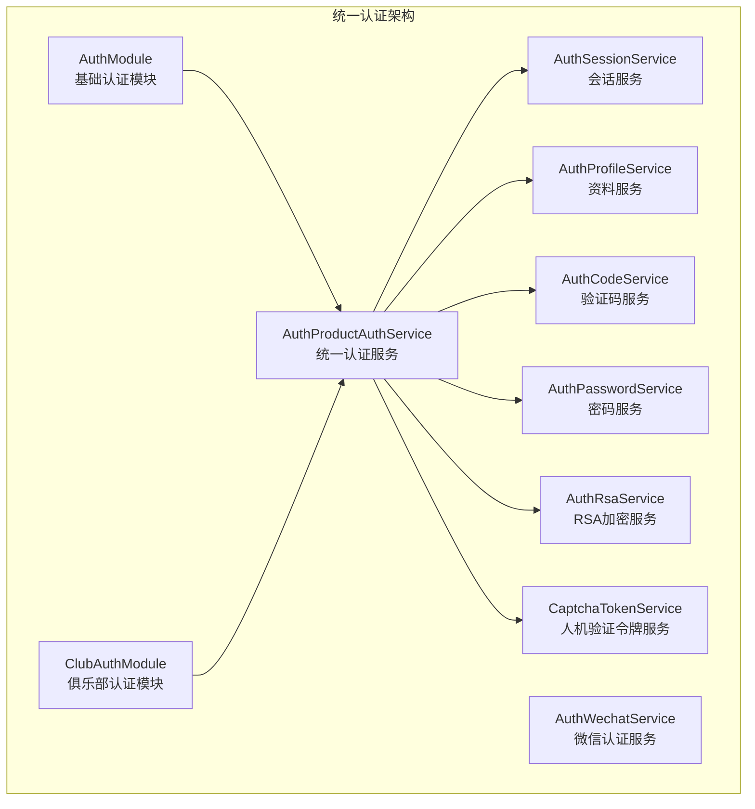
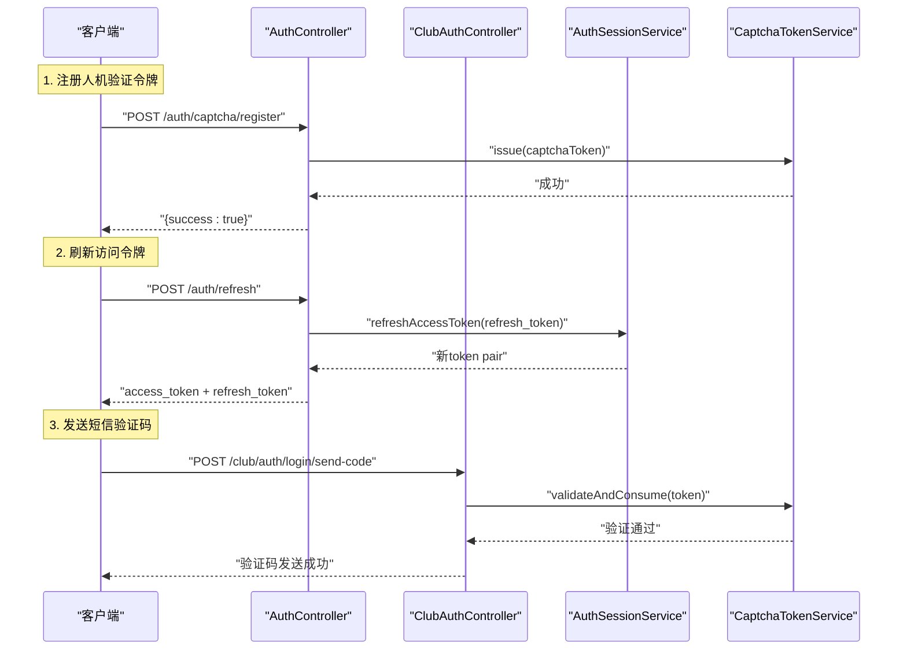
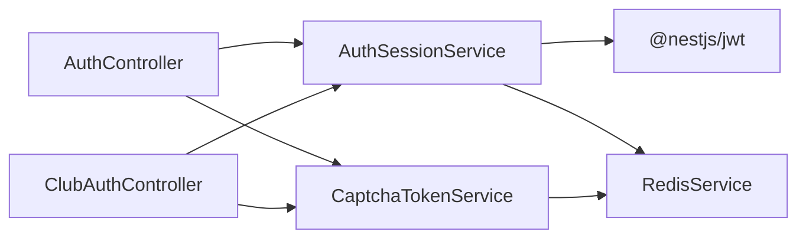

# 认证接口

<cite>
**本文引用的文件**
- [src/purely-profit/auth/auth.controller.ts](file://src/purely-profit/auth/auth.controller.ts)
- [src/purely-profit/auth/auth.service.ts](file://src/purely-profit/auth/auth.service.ts)
- [src/purely-profit/auth/auth-authentication.service.ts](file://src/purely-profit/auth/auth-authentication.service.ts)
- [src/purely-profit/auth/auth-code.service.ts](file://src/purely-profit/auth/auth-code.service.ts)
- [src/purely-profit/auth/auth-password.service.ts](file://src/purely-profit/auth/auth-password.service.ts)
- [src/purely-profit/auth/auth-session.service.ts](file://src/purely-profit/auth/auth-session.service.ts)
- [src/purely-profit/auth/auth-profile.service.ts](file://src/purely-profit/auth/auth-profile.service.ts)
- [src/purely-profit/auth/auth-capability.service.ts](file://src/purely-profit/auth/auth-capability.service.ts)
- [src/purely-profit/auth/auth-rsa.service.ts](file://src/purely-profit/auth/auth-rsa.service.ts)
- [src/purely-profit/auth/captcha-token.service.ts](file://src/purely-profit/auth/captcha-token.service.ts)
- [src/purely-profit/auth/strategies/jwt.strategy.ts](file://src/purely-profit/auth/strategies/jwt.strategy.ts)
- [src/purely-profit/auth/guards/jwt-auth.guard.ts](file://src/purely-profit/auth/guards/jwt-auth.guard.ts)
- [src/purely-profit/auth/dto/login.dto.ts](file://src/purely-profit/auth/dto/login.dto.ts)
- [src/purely-profit/auth/dto/register.dto.ts](file://src/purely-profit/auth/dto/register.dto.ts)
- [src/purely-profit/auth/dto/send-register-code.dto.ts](file://src/purely-profit/auth/dto/send-register-code.dto.ts)
- [src/purely-profit/auth/dto/forgot-password.dto.ts](file://src/purely-profit/auth/dto/forgot-password.dto.ts)
- [src/purely-profit/auth/dto/reset-password.dto.ts](file://src/purely-profit/auth/dto/reset-password.dto.ts)
- [src/purely-profit/auth/dto/change-password.dto.ts](file://src/purely-profit/auth/dto/change-password.dto.ts)
- [src/purely-profit/auth/dto/auth-token-response.dto.ts](file://src/purely-profit/auth/dto/auth-token-response.dto.ts)
- [src/purely-profit/auth/dto/profile-response.dto.ts](file://src/purely-profit/auth/dto/profile-response.dto.ts)
- [src/purely-profit/auth/dto/capability-response.dto.ts](file://src/purely-profit/auth/dto/capability-response.dto.ts)
- [src/purely-profit/auth/dto/public-key-response.dto.ts](file://src/purely-profit/auth/dto/public-key-response.dto.ts)
- [src/purely-profit/auth/dto/refresh-token.dto.ts](file://src/purely-profit/auth/dto/refresh-token.dto.ts)
- [src/purely-club/auth/club-auth.controller.ts](file://src/purely-club/auth/club-auth.controller.ts)
- [src/purely-club/auth/club-auth.service.ts](file://src/purely-club/auth/club-auth.service.ts)
- [src/purely-club/auth/club-wechat-auth.service.ts](file://src/purely-club/auth/club-wechat-auth.service.ts)
- [src/purely-club/auth/dto/wechat-login.dto.ts](file://src/purely-club/auth/dto/wechat-login.dto.ts)
- [src/purely-club/auth/dto/register-captcha-token.dto.ts](file://src/purely-club/auth/dto/register-captcha-token.dto.ts)
- [src/shared/auth/auth-product-auth.service.ts](file://src/shared/auth/auth-product-auth.service.ts)
- [src/shared/auth/auth-password.types.ts](file://src/shared/auth/auth-password.types.ts)
</cite>

## 更新摘要
**所做更改**
- 新增 /auth/refresh 端点用于刷新访问令牌，支持 refresh_token 轮换机制
- 新增 /auth/captcha/register 和 /club/auth/captcha/register 端点用于注册拼图验证令牌
- Token响应DTO扩展支持 refresh_token 字段，提供完整的令牌管理功能
- 增强登录失败锁定机制，提供渐进式警告提示
- 完善人机验证令牌管理机制，确保验证码发送的安全性

## 目录
1. [简介](#简介)
2. [项目结构](#项目结构)
3. [核心组件](#核心组件)
4. [架构总览](#架构总览)
5. [详细组件分析](#详细组件分析)
6. [依赖分析](#依赖分析)
7. [性能考量](#性能考量)
8. [故障排查指南](#故障排查指南)
9. [结论](#结论)
10. [附录](#附录)

## 简介
本文件为认证模块的完整 API 接口文档，覆盖统一认证服务模式下的用户认证能力。文档重点介绍新增的令牌刷新机制、人机验证令牌注册、增强的安全机制等最新功能特性。认证模块采用统一的服务层设计，支持多产品线（purely-profit、purely-club）的统一认证需求，同时提供 JWT 令牌的签发、版本控制与失效机制。新增的 refresh_token 轮换机制和人机验证令牌服务进一步增强了系统的安全性和用户体验。

## 项目结构
认证模块采用统一服务层架构：AuthModule 提供基础认证能力，ClubAuthModule 基于 AuthModule 扩展 WeChat 登录能力。统一认证服务（AuthProductAuthService）处理多产品线的认证需求，支持手机号+验证码、手机号+密码、WeChat 登录等多种认证方式。新增的 RSA 加密服务、人机验证令牌服务和令牌刷新机制进一步完善了系统的安全体系。



**图表来源**
- [src/purely-profit/auth/auth.module.ts](file://src/purely-profit/auth/auth.module.ts)
- [src/purely-club/auth/club-auth.module.ts](file://src/purely-club/auth/club-auth.module.ts)
- [src/shared/auth/auth-product-auth.service.ts](file://src/shared/auth/auth-product-auth.service.ts)

**章节来源**
- [src/purely-profit/auth/auth.module.ts](file://src/purely-profit/auth/auth.module.ts)
- [src/purely-club/auth/club-auth.module.ts](file://src/purely-club/auth/club-auth.module.ts)
- [src/shared/auth/auth-product-auth.service.ts](file://src/shared/auth/auth-product-auth.service.ts)

## 核心组件
- **AuthModule**：提供基础认证能力，包括用户认证、会话管理、资料查询等功能
- **ClubAuthModule**：基于 AuthModule 扩展 WeChat 小程序登录能力
- **AuthProductAuthService**：统一认证服务，处理多产品线的认证需求
- **AuthWechatService**：微信认证服务，处理微信登录相关逻辑
- **AuthSessionService**：会话服务，负责 JWT 令牌的签发和管理，支持 refresh_token 轮换
- **AuthProfileService**：用户资料服务，提供用户信息查询和更新功能
- **AuthRsaService**：RSA 密钥管理服务，提供公钥获取和密码解密功能
- **CaptchaTokenService**：人机验证令牌服务，管理拼图验证令牌的生命周期

**章节来源**
- [src/purely-profit/auth/auth.module.ts](file://src/purely-profit/auth/auth.module.ts)
- [src/purely-club/auth/club-auth.module.ts](file://src/purely-club/auth/club-auth.module.ts)
- [src/shared/auth/auth-product-auth.service.ts](file://src/shared/auth/auth-product-auth.service.ts)

## 架构总览
统一认证架构采用分层设计，通过 AuthProductAuthService 实现多产品线的统一认证服务，新增的 refresh_token 轮换机制和人机验证令牌服务进一步提升了安全性：



**图表来源**
- [src/purely-profit/auth/auth.controller.ts](file://src/purely-profit/auth/auth.controller.ts)
- [src/purely-club/auth/club-auth.controller.ts](file://src/purely-club/auth/club-auth.controller.ts)
- [src/purely-profit/auth/auth-session.service.ts](file://src/purely-profit/auth/auth-session.service.ts)
- [src/purely-profit/auth/captcha-token.service.ts](file://src/purely-profit/auth/captcha-token.service.ts)

## 详细组件分析

### 令牌刷新接口（新增）
- **路径**：POST /auth/refresh
- **功能**：使用 refresh_token 获取新的 access_token + refresh_token，支持一次性轮换机制
- **请求体**：RefreshTokenDto
  - refresh_token: 字符串，一次性使用的刷新令牌
- **响应体**：AuthTokenResponseDto
  - access_token: 字符串，新的JWT访问令牌
  - refresh_token: 字符串，新的刷新令牌（旧令牌立即失效）
  - expires_in: 数字，access_token有效期（秒）
  - userId: 数字，用户ID
- **守卫**：无（匿名）
- **限流**：每分钟最多 30 次
- **安全特性**：
  - 旧 refresh_token 立即失效（一次性使用）
  - 新 refresh_token 自动轮换
  - refresh_token 在 Redis 中存储哈希值，不存储明文
  - 支持批量使所有用户的 refresh_token 失效

**章节来源**
- [src/purely-profit/auth/auth.controller.ts:178-199](file://src/purely-profit/auth/auth.controller.ts#L178-L199)
- [src/purely-profit/auth/auth-session.service.ts:89-107](file://src/purely-profit/auth/auth-session.service.ts#L89-L107)
- [src/purely-profit/auth/dto/refresh-token.dto.ts:1-12](file://src/purely-profit/auth/dto/refresh-token.dto.ts#L1-L12)

### 人机验证令牌注册接口
- **路径**：POST /auth/captcha/register 和 POST /club/auth/captcha/register
- **功能**：前端完成拼图人机验证后，将 captchaToken 注册到 Redis
- **请求体**：RegisterCaptchaTokenDto
  - captchaToken: 字符串，前端生成的拼图验证令牌，格式为 `puzzle_{timestamp}_{counter}`
- **响应体**：{ success: boolean }
- **守卫**：无（匿名）
- **限流**：每分钟最多 30 次
- **令牌有效期**：5 分钟，一次性消费
- **安全特性**：
  - 严格的格式校验防止注入攻击
  - Token 一次性消费机制
  - 未传 token 直接拒绝请求

**章节来源**
- [src/purely-profit/auth/auth.controller.ts:75-91](file://src/purely-profit/auth/auth.controller.ts#L75-L91)
- [src/purely-club/auth/club-auth.controller.ts:49-65](file://src/purely-club/auth/club-auth.controller.ts#L49-L65)
- [src/purely-club/auth/dto/register-captcha-token.dto.ts:1-17](file://src/purely-club/auth/dto/register-captcha-token.dto.ts#L1-L17)
- [src/purely-profit/auth/captcha-token.service.ts:65-76](file://src/purely-profit/auth/captcha-token.service.ts#L65-L76)

### RSA 公钥获取接口
- **路径**：GET /auth/public-key 和 GET /club/auth/public-key
- **功能**：返回 PEM 格式的 RSA 公钥，供前端加密敏感字段（如密码）
- **响应体**：PublicKeyResponseDto
  - publicKey: 字符串，PEM 格式的 RSA 公钥
- **守卫**：无（匿名）
- **安全特性**：
  - 密钥对在服务端进程启动时生成或从环境变量加载
  - 进程重启后密钥对自动轮换，旧公钥加密的密文自动失效
  - 前端应在每次提交前重新获取公钥，避免使用过期公钥

**章节来源**
- [src/purely-profit/auth/auth.controller.ts:59-73](file://src/purely-profit/auth/auth.controller.ts#L59-L73)
- [src/purely-club/auth/club-auth.controller.ts:67-81](file://src/purely-club/auth/club-auth.controller.ts#L67-L81)
- [src/purely-profit/auth/auth-rsa.service.ts:53-58](file://src/purely-profit/auth/auth-rsa.service.ts#L53-L58)

### 短信验证码发送接口（增强版）
- **路径**：POST /auth/register/send-code 和 POST /club/auth/login/send-code
- **功能**：发送短信验证码，需先完成人机验证
- **请求体**：SendRegisterCodeDto
  - phone: 字符串，手机号码
  - captchaToken: 字符串，人机验证令牌（必需）
- **响应体**：SendLoginCodeResponseDto 或 SendRegisterCodeResponseDto
- **守卫**：无（匿名）
- **限流**：每分钟最多 3 次
- **验证码有效期**：默认 600 秒（可配置）
- **安全特性**：
  - 强制要求 captchaToken，未提供则拒绝请求
  - Token 格式校验和一次性消费机制
  - 同一手机号 60 秒内不可重复发送

**章节来源**
- [src/purely-profit/auth/auth.controller.ts:93-110](file://src/purely-profit/auth/auth.controller.ts#L93-L110)
- [src/purely-club/auth/club-auth.controller.ts:83-103](file://src/purely-club/auth/club-auth.controller.ts#L83-L103)
- [src/purely-profit/auth/captcha-token.service.ts:38-63](file://src/purely-profit/auth/captcha-token.service.ts#L38-L63)

### 手机号验证码登录接口
- **路径**：POST /club/auth/login/code
- **功能**：使用手机号 + 验证码完成登录，支持登录即注册
- **请求体**：LoginByCodeDto
  - phone: 字符串，手机号码
  - code: 字符串，短信验证码
- **响应体**：AuthTokenResponseDto
  - access_token: 字符串，JWT 访问令牌
  - refresh_token?: 字符串，刷新令牌（可选）
  - expires_in?: 数字，访问令牌有效期
  - userId?: 数字，用户ID
- **守卫**：无（匿名）
- **限流**：每分钟最多 10 次
- **业务流程**：若该手机号在 purely-club 尚无账号，将自动创建账号后签发 JWT token

**章节来源**
- [src/purely-club/auth/club-auth.controller.ts:105-121](file://src/purely-club/auth/club-auth.controller.ts#L105-L121)

### 微信小程序登录接口（增强版）
- **路径**：POST /club/auth/login/wechat
- **功能**：微信小程序一键登录，支持手机号授权和用户信息绑定
- **请求体**：WechatLoginDto
  - code: 字符串，微信小程序 wx.login() 返回的临时登录凭证
  - phoneCode?: 字符串，微信手机号授权码，用于获取真实手机号
  - nickname?: 字符串，用户昵称
  - avatar?: 字符串，用户头像
- **响应体**：AuthTokenResponseDto
  - access_token: 字符串，JWT 访问令牌
  - needPhoneBind?: 布尔值，是否需要绑定手机号
- **守卫**：无（匿名）
- **限流**：每分钟最多 10 次
- **业务流程要点**：
  - 通过 code2session 获取 openid/unionid/session_key
  - 可选：通过 phoneCode 解密获取真实手机号
  - 调用统一认证服务进行微信登录
  - 支持账号合并：已有手机号账号与微信 openid 绑定
  - 自动创建新用户：若无匹配账号则注册新用户
  - 检测手机号绑定状态，返回 needPhoneBind 标志

**章节来源**
- [src/purely-club/auth/club-auth.controller.ts:123-140](file://src/purely-club/auth/club-auth.controller.ts#L123-L140)
- [src/purely-club/auth/dto/wechat-login.dto.ts](file://src/purely-club/auth/dto/wechat-login.dto.ts)
- [src/purely-club/auth/club-wechat-auth.service.ts](file://src/purely-club/auth/club-wechat-auth.service.ts)
- [src/shared/auth/auth-product-auth.service.ts](file://src/shared/auth/auth-product-auth.service.ts)

### 手机号绑定接口
- **路径**：POST /club/auth/bind-phone/send-code 和 POST /club/auth/bind-phone
- **功能**：微信登录后绑定手机号，支持账号合并
- **请求体**：SendRegisterCodeDto 和 BindPhoneDto
- **响应体**：SendLoginCodeResponseDto 和 AuthTokenResponseDto
- **守卫**：需要 JWT 认证
- **限流**：发送验证码每分钟 3 次，绑定操作每分钟 10 次
- **业务流程**：
  - 发送绑定验证码时需携带 captchaToken
  - 绑定成功后返回新的 JWT token
  - 若手机号已有账号，自动将微信 openid 合并到手机号账号

**章节来源**
- [src/purely-club/auth/club-auth.controller.ts:142-189](file://src/purely-club/auth/club-auth.controller.ts#L142-L189)

### 传统认证接口（保留）
- **路径**：POST /auth/login, POST /auth/register, POST /auth/change-password 等
- **功能**：purely-profit 老板端/商家端账号的传统认证接口
- **安全特性**：
  - 支持 RSA 加密的密码字段传输
  - 自动识别并解密前端加密的密码
  - 支持 PKCS1 v1.5 和 OAEP 填充模式兼容

**章节来源**
- [src/purely-profit/auth/auth.controller.ts:158-176](file://src/purely-profit/auth/auth.controller.ts#L158-L176)
- [src/purely-profit/auth/auth.controller.ts:112-136](file://src/purely-profit/auth/auth.controller.ts#L112-L136)
- [src/purely-profit/auth/auth.controller.ts:201-226](file://src/purely-profit/auth/auth.controller.ts#L201-L226)

### Token响应DTO扩展（新增）
- **服务**：AuthTokenResponseDto
- **功能**：统一的令牌响应数据结构，支持多种认证场景
- **字段说明**：
  - access_token: 必填，JWT访问令牌
  - refresh_token?: 可选，刷新令牌（purely-profit支持）
  - expires_in?: 可选，访问令牌有效期（秒）
  - userId?: 可选，用户ID
  - needPhoneBind?: 可选，是否需要绑定手机号（purely-club专用）
- **安全特性**：
  - refresh_token 采用一次性使用机制
  - 支持不同产品线的差异化响应字段

**章节来源**
- [src/purely-profit/auth/dto/auth-token-response.dto.ts:1-35](file://src/purely-profit/auth/dto/auth-token-response.dto.ts#L1-L35)
- [src/purely-club/auth/dto/auth-token-response.dto.ts:1-24](file://src/purely-club/auth/dto/auth-token-response.dto.ts#L1-L24)

### 会话服务增强（新增）
- **服务**：AuthSessionService
- **功能**：增强的会话管理服务，支持 refresh_token 轮换机制
- **核心方法**：
  - signToken: 签发包含 refresh_token 的完整令牌对
  - refreshAccessToken: 使用 refresh_token 获取新的令牌对
  - invalidateAllRefreshTokens: 批量使所有 refresh_token 失效
- **安全特性**：
  - refresh_token 在 Redis 中以哈希形式存储
  - 支持用户级别的令牌索引管理
  - 自动清理过期的令牌数据

**章节来源**
- [src/purely-profit/auth/auth-session.service.ts:55-79](file://src/purely-profit/auth/auth-session.service.ts#L55-L79)
- [src/purely-profit/auth/auth-session.service.ts:89-107](file://src/purely-profit/auth/auth-session.service.ts#L89-L107)
- [src/purely-profit/auth/auth-session.service.ts:114-127](file://src/purely-profit/auth/auth-session.service.ts#L114-L127)

### RSA 加密解密机制
- **服务**：AuthRsaService
- **功能**：管理 RSA 密钥对，提供公钥获取和密码解密功能
- **安全特性**：
  - 支持 RSA-OAEP SHA-256、OAEP SHA-1 和 PKCS1 v1.5 三种填充模式
  - 优先使用更安全的 OAEP 模式，回退兼容旧客户端
  - 进程内存中持有密钥对，不落盘、不入库
  - 进程重启后密钥对自动轮换

**章节来源**
- [src/purely-profit/auth/auth-rsa.service.ts:20-51](file://src/purely-profit/auth/auth-rsa.service.ts#L20-L51)
- [src/purely-profit/auth/auth-rsa.service.ts:70-127](file://src/purely-profit/auth/auth-rsa.service.ts#L70-L127)
- [src/purely-profit/auth/auth-rsa.service.ts:140-164](file://src/purely-profit/auth/auth-rsa.service.ts#L140-L164)

### 人机验证令牌管理机制
- **服务**：CaptchaTokenService
- **功能**：管理拼图验证令牌的生命周期
- **令牌格式**：`puzzle_{timestamp}_{counter}`
- **有效期**：5 分钟
- **消费机制**：一次性使用，Redis 存储
- **安全特性**：
  - 格式校验防止注入攻击
  - 未传 token 直接拒绝请求
  - Token 过期或已消费时拒绝请求

**章节来源**
- [src/purely-profit/auth/captcha-token.service.ts:20-76](file://src/purely-profit/auth/captcha-token.service.ts#L20-L76)

### 统一认证服务（AuthProductAuthService）
- **功能**：提供多产品线的统一认证入口，支持多种认证方式
- **认证方式**：
  - 手机号+验证码登录
  - 手机号+密码登录  
  - WeChat 小程序登录
  - 登录即注册（微信小程序专用）
- **核心方法**：
  - loginByCodeOrRegister：手机号+验证码登录或注册
  - wechatLogin：微信小程序登录（支持账号合并）
  - login：传统手机号+密码登录

**章节来源**
- [src/shared/auth/auth-product-auth.service.ts](file://src/shared/auth/auth-product-auth.service.ts)

### 微信登录业务流程详解
微信登录采用"登录即注册"模式，支持三种情况：


**图表来源**
- [src/purely-profit/auth/auth-authentication.service.ts](file://src/purely-profit/auth/auth-authentication.service.ts)

**章节来源**
- [src/purely-profit/auth/auth-authentication.service.ts](file://src/purely-profit/auth/auth-authentication.service.ts)

### JWT 令牌获取、刷新、验证流程（增强版）
- **令牌签发**：统一由 AuthSessionService 负责，支持多种认证场景，现在包含 refresh_token
- **令牌版本控制**：每次敏感操作（如改密、重置密码）会提升用户令牌版本
- **令牌验证**：使用 JwtAuthGuard 与 JwtStrategy 进行解码与校验
- **令牌刷新**：通过 /auth/refresh 端点使用 refresh_token 获取新的令牌对

```mermaid
flowchart TD
Start(["开始"]) --> Issue["签发 JWT + Refresh Token<br/>携带当前会话版本号"]
Issue --> Use["客户端携带 access_token 访问受保护资源"]
Use --> Validate["JwtStrategy 校验<br/>用户存在/未封禁/版本匹配"]
Validate --> Valid{"校验通过？"}
Valid --> |否| Error["抛出未授权错误"]
Valid --> |是| Proceed["进入受保护路由"]
Proceed --> Sensitive{"敏感操作？"}
Sensitive --> |是| Bump["提升会话版本号"]
Sensitive --> |否| End(["结束"])
Bump --> Reissue["下次校验失败，提示重新登录"]
Reissue --> End
Error --> End
Note over Start,End : 新增：可通过 refresh_token 获取新令牌对
```

**图表来源**
- [src/purely-profit/auth/auth-session.service.ts](file://src/purely-profit/auth/auth-session.service.ts)
- [src/purely-profit/auth/strategies/jwt.strategy.ts](file://src/purely-profit/auth/strategies/jwt.strategy.ts)

**章节来源**
- [src/purely-profit/auth/auth-session.service.ts](file://src/purely-profit/auth/auth-session.service.ts)
- [src/purely-profit/auth/strategies/jwt.strategy.ts](file://src/purely-profit/auth/strategies/jwt.strategy.ts)

## 依赖分析
统一认证架构的依赖关系更加清晰，通过模块化设计实现职责分离，新增的 refresh_token 轮换机制和人机验证服务进一步完善了安全体系：



**图表来源**
- [src/purely-profit/auth/auth.controller.ts](file://src/purely-profit/auth/auth.controller.ts)
- [src/purely-club/auth/club-auth.controller.ts](file://src/purely-club/auth/club-auth.controller.ts)
- [src/purely-profit/auth/auth-session.service.ts](file://src/purely-profit/auth/auth-session.service.ts)
- [src/purely-profit/auth/captcha-token.service.ts](file://src/purely-profit/auth/captcha-token.service.ts)

**章节来源**
- [src/purely-profit/auth/auth.controller.ts](file://src/purely-profit/auth/auth.controller.ts)
- [src/purely-club/auth/club-auth.controller.ts](file://src/purely-club/auth/club-auth.controller.ts)
- [src/purely-profit/auth/auth-session.service.ts](file://src/purely-profit/auth/auth-session.service.ts)
- [src/purely-profit/auth/captcha-token.service.ts](file://src/purely-profit/auth/captcha-token.service.ts)

## 性能考量
- **统一认证服务**：减少重复代码，提高维护效率
- **微信登录优化**：支持手机号授权，提升用户体验
- **会话管理**：JWT 令牌版本控制确保安全性，新增 refresh_token 轮换机制
- **Redis 缓存**：验证码、会话状态和 refresh_token 使用 Redis 存储，具备高并发特性
- **RSA 加密**：内存中持有密钥对，避免磁盘 I/O 开销
- **人机验证**：令牌一次性消费机制防止重放攻击
- **令牌轮换**：refresh_token 一次性使用，提高安全性

## 故障排查指南
- **令牌刷新问题**
  - refresh_token 无效：确认使用的是有效的 refresh_token，注意其一次性使用特性
  - 刷新失败：检查 Redis 连接是否正常，确认 refresh_token 未被提前使用
  - 令牌过期：refresh_token 默认有效期为 30 天，过期后需要重新登录
- **人机验证问题**
  - captchaToken 无效：确认前端已完成拼图验证并正确传递 token
  - Token 过期：5 分钟内未完成短信发送，需要重新进行人机验证
  - Token 格式错误：检查前端生成的 token 格式是否符合规范
- **RSA 加密问题**
  - 公钥获取失败：检查服务端 RSA 服务是否正常启动
  - 密码解密失败：确认前端使用的是正确的公钥，建议刷新页面重新获取
  - 加密格式不兼容：检查前端使用的加密库版本和填充模式
- **微信登录常见问题**
  - code 无效/过期：前端需要重新发起微信登录流程
  - 微信服务端异常：检查微信配置和网络连接
  - 手机号授权失败：确认用户已授权手机号信息
  - 手机号绑定冲突：检查是否存在手机号重复绑定的情况
- **统一认证服务问题**
  - 产品线配置错误：检查 AuthProductScope 配置
  - 令牌版本冲突：敏感操作后需要重新登录
  - 用户状态异常：检查用户是否被封禁

**章节来源**
- [src/purely-profit/auth/auth-session.service.ts](file://src/purely-profit/auth/auth-session.service.ts)
- [src/purely-club/auth/club-wechat-auth.service.ts](file://src/purely-club/auth/club-wechat-auth.service.ts)
- [src/shared/auth/auth-product-auth.service.ts](file://src/shared/auth/auth-product-auth.service.ts)
- [src/purely-profit/auth/auth-rsa.service.ts](file://src/purely-profit/auth/auth-rsa.service.ts)
- [src/purely-profit/auth/captcha-token.service.ts](file://src/purely-profit/auth/captcha-token.service.ts)

## 结论
新的统一认证架构通过 AuthProductAuthService 实现了多产品线的统一认证服务，结合 RSA 公钥加密、人机验证令牌、增强的微信登录功能和 refresh_token 轮换机制，提供了完整的用户认证体验。相比传统认证方案，新架构具有更好的安全性、扩展性、维护性和用户体验。新增的令牌刷新机制和人机验证功能进一步提升了系统的安全性和用户体验。建议开发者遵循统一认证服务的设计模式，充分利用多产品线支持和微信登录能力，同时注意前端 RSA 加密的实现、人机验证的集成和令牌管理的最佳实践。

## 附录
- **客户端集成建议**
  - RSA 加密：使用 /auth/public-key 或 /club/auth/public-key 获取公钥，前端使用 jsencrypt 库进行加密
  - 人机验证：完成拼图验证后调用 /auth/captcha/register 或 /club/auth/captcha/register 注册令牌，后续发送验证码时携带该 token
  - 令牌刷新：使用 /auth/refresh 端点，通过 refresh_token 获取新的令牌对，注意 refresh_token 的一次性使用特性
  - 微信登录：使用 /club/auth/login/wechat 接口，支持手机号授权和自动绑定
  - 统一认证：通过 AuthProductAuthService 处理多种认证场景
  - 令牌管理：遵循 JWT 令牌版本控制机制，敏感操作后重新登录，妥善保存 refresh_token
  - 错误处理：针对各种认证错误的特殊处理逻辑
- **迁移指南**
  - 从传统认证接口迁移到统一认证服务
  - 集成 RSA 加密功能，替换明文密码传输
  - 添加人机验证流程，提升安全性
  - 更新微信登录流程，使用新的 WeChat 登录接口
  - 实现令牌刷新机制，使用 refresh_token 获取新 access_token
  - 调整客户端代码，适配统一认证服务的响应格式
  - 处理新增的 needPhoneBind 标志，引导用户完成手机号绑定