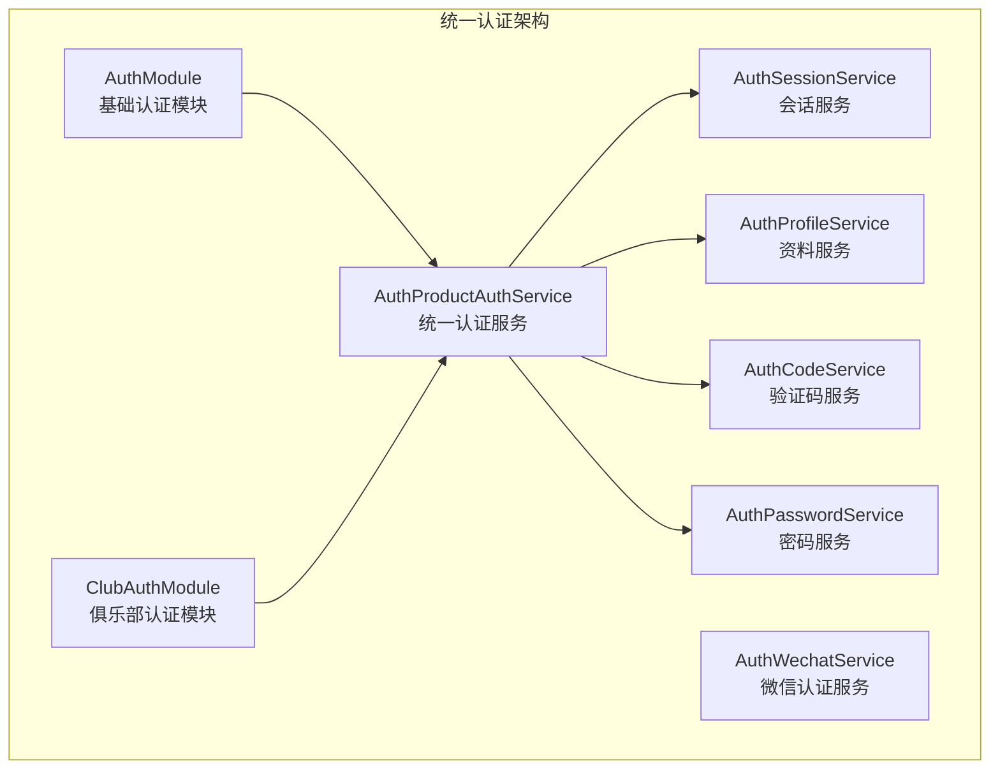
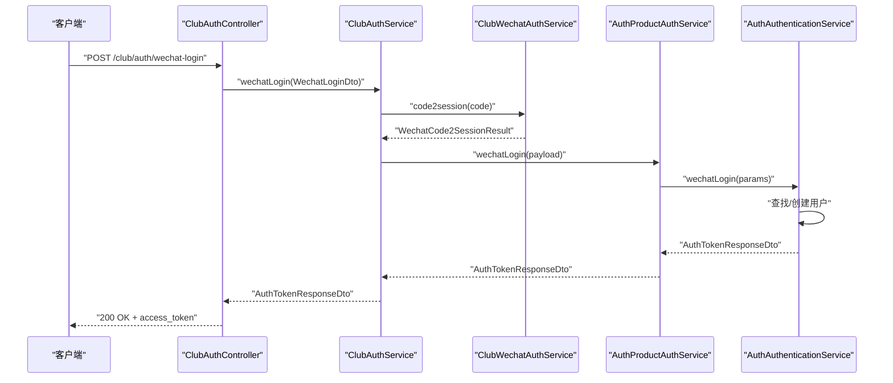
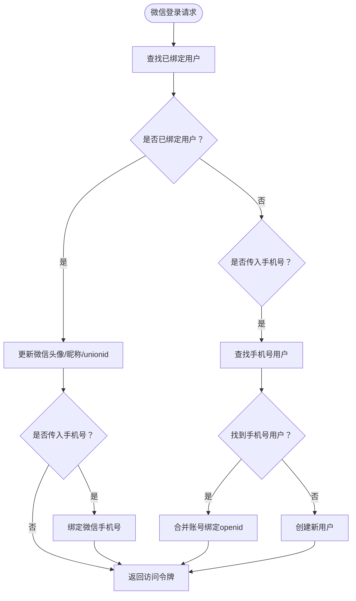
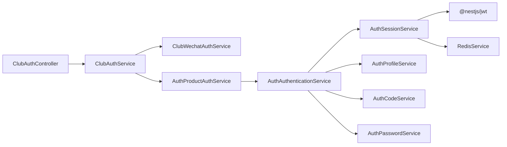

# 认证接口

<cite>
**本文引用的文件**
- [src/purely-profit/auth/auth.controller.ts](file://src/purely-profit/auth/auth.controller.ts)
- [src/purely-profit/auth/auth.service.ts](file://src/purely-profit/auth/auth.service.ts)
- [src/purely-profit/auth/auth-authentication.service.ts](file://src/purely-profit/auth/auth-authentication.service.ts)
- [src/purely-profit/auth/auth-code.service.ts](file://src/purely-profit/auth/auth-code.service.ts)
- [src/purely-profit/auth/auth-password.service.ts](file://src/purely-profit/auth/auth-password.service.ts)
- [src/purely-profit/auth/auth-session.service.ts](file://src/purely-profit/auth/auth-session.service.ts)
- [src/purely-profit/auth/auth-profile.service.ts](file://src/purely-profit/auth/auth-profile.service.ts)
- [src/purely-profit/auth/auth-capability.service.ts](file://src/purely-profit/auth/auth-capability.service.ts)
- [src/purely-profit/auth/strategies/jwt.strategy.ts](file://src/purely-profit/auth/strategies/jwt.strategy.ts)
- [src/purely-profit/auth/guards/jwt-auth.guard.ts](file://src/purely-profit/auth/guards/jwt-auth.guard.ts)
- [src/purely-profit/auth/dto/login.dto.ts](file://src/purely-profit/auth/dto/login.dto.ts)
- [src/purely-profit/auth/dto/register.dto.ts](file://src/purely-profit/auth/dto/register.dto.ts)
- [src/purely-profit/auth/dto/send-register-code.dto.ts](file://src/purely-profit/auth/dto/send-register-code.dto.ts)
- [src/purely-profit/auth/dto/forgot-password.dto.ts](file://src/purely-profit/auth/dto/forgot-password.dto.ts)
- [src/purely-profit/auth/dto/reset-password.dto.ts](file://src/purely-profit/auth/dto/reset-password.dto.ts)
- [src/purely-profit/auth/dto/change-password.dto.ts](file://src/purely-profit/auth/dto/change-password.dto.ts)
- [src/purely-profit/auth/dto/auth-token-response.dto.ts](file://src/purely-profit/auth/dto/auth-token-response.dto.ts)
- [src/purely-profit/auth/dto/profile-response.dto.ts](file://src/purely-profit/auth/dto/profile-response.dto.ts)
- [src/purely-profit/auth/dto/capability-response.dto.ts](file://src/purely-profit/auth/dto/capability-response.dto.ts)
- [src/purely-club/auth/club-auth.controller.ts](file://src/purely-club/auth/club-auth.controller.ts)
- [src/purely-club/auth/club-auth.service.ts](file://src/purely-club/auth/club-auth.service.ts)
- [src/purely-club/auth/club-wechat-auth.service.ts](file://src/purely-club/auth/club-wechat-auth.service.ts)
- [src/purely-club/auth/dto/wechat-login.dto.ts](file://src/purely-club/auth/dto/wechat-login.dto.ts)
- [src/shared/auth/auth-product-auth.service.ts](file://src/shared/auth/auth-product-auth.service.ts)
- [src/shared/auth/auth-password.types.ts](file://src/shared/auth/auth-password.types.ts)
</cite>

## 更新摘要
**所做更改**
- 新增 WeChat 登录接口文档，包括小程序登录流程和统一认证服务
- 移除传统分离式认证接口（登录、注册、忘记密码等）的相关内容
- 更新认证架构图为统一认证服务模式
- 新增 WeChat 登录的完整业务流程说明

## 目录
1. [简介](#简介)
2. [项目结构](#项目结构)
3. [核心组件](#核心组件)
4. [架构总览](#架构总览)
5. [详细组件分析](#详细组件分析)
6. [依赖分析](#依赖分析)
7. [性能考量](#性能考量)
8. [故障排查指南](#故障排查指南)
9. [结论](#结论)
10. [附录](#附录)

## 简介
本文件为认证模块的完整 API 接口文档，覆盖统一认证服务模式下的用户认证能力。文档重点介绍 WeChat 小程序登录接口，以及与传统分离式认证接口完全不同的统一认证架构。认证模块采用统一的服务层设计，支持多产品线（purely-profit、purely-club）的统一认证需求，同时提供 JWT 令牌的签发、版本控制与失效机制。

## 项目结构
认证模块采用统一服务层架构：AuthModule 提供基础认证能力，ClubAuthModule 基于 AuthModule 扩展 WeChat 登录能力。统一认证服务（AuthProductAuthService）处理多产品线的认证需求，支持手机号+验证码、手机号+密码、WeChat 登录等多种认证方式。

**图表来源**
- [src/purely-profit/auth/auth.module.ts](file://src/purely-profit/auth/auth.module.ts)
- [src/purely-club/auth/club-auth.module.ts](file://src/purely-club/auth/club-auth.module.ts)
- [src/shared/auth/auth-product-auth.service.ts](file://src/shared/auth/auth-product-auth.service.ts)

**章节来源**
- [src/purely-profit/auth/auth.module.ts](file://src/purely-profit/auth/auth.module.ts)
- [src/purely-club/auth/club-auth.module.ts](file://src/purely-club/auth/club-auth.module.ts)
- [src/shared/auth/auth-product-auth.service.ts](file://src/shared/auth/auth-product-auth.service.ts)

## 核心组件
- **AuthModule**：提供基础认证能力，包括用户认证、会话管理、资料查询等功能
- **ClubAuthModule**：基于 AuthModule 扩展 WeChat 小程序登录能力
- **AuthProductAuthService**：统一认证服务，处理多产品线的认证需求
- **AuthWechatService**：微信认证服务，处理微信登录相关逻辑
- **AuthSessionService**：会话服务，负责 JWT 令牌的签发和管理
- **AuthProfileService**：用户资料服务，提供用户信息查询和更新功能

**章节来源**
- [src/purely-profit/auth/auth.module.ts](file://src/purely-profit/auth/auth.module.ts)
- [src/purely-club/auth/club-auth.module.ts](file://src/purely-club/auth/club-auth.module.ts)
- [src/shared/auth/auth-product-auth.service.ts](file://src/shared/auth/auth-product-auth.service.ts)

## 架构总览
统一认证架构采用分层设计，通过 AuthProductAuthService 实现多产品线的统一认证服务：

**图表来源**
- [src/purely-club/auth/club-auth.controller.ts](file://src/purely-club/auth/club-auth.controller.ts)
- [src/purely-club/auth/club-auth.service.ts](file://src/purely-club/auth/club-auth.service.ts)
- [src/purely-club/auth/club-wechat-auth.service.ts](file://src/purely-club/auth/club-wechat-auth.service.ts)
- [src/shared/auth/auth-product-auth.service.ts](file://src/shared/auth/auth-product-auth.service.ts)
- [src/purely-profit/auth/auth-authentication.service.ts](file://src/purely-profit/auth/auth-authentication.service.ts)

## 详细组件分析

### WeChat 小程序登录接口
- **路径**：POST /club/auth/wechat-login
- **功能**：微信小程序一键登录，支持手机号授权和用户信息绑定
- **请求体**：WechatLoginDto
  - code: 字符串，微信小程序 wx.login() 返回的临时登录凭证
  - phoneCode?: 字符串，微信手机号授权码，用于获取真实手机号
  - nickname?: 字符串，用户昵称
  - avatar?: 字符串，用户头像
- **响应体**：AuthTokenResponseDto
  - access_token: 字符串，JWT 访问令牌
- **守卫**：无（匿名）
- **业务流程要点**：
  - 通过 code2session 获取 openid/unionid/session_key
  - 可选：通过 phoneCode 解密获取真实手机号
  - 调用统一认证服务进行微信登录
  - 支持账号合并：已有手机号账号与微信 openid 绑定
  - 自动创建新用户：若无匹配账号则注册新用户

**章节来源**
- [src/purely-club/auth/club-auth.controller.ts](file://src/purely-club/auth/club-auth.controller.ts)
- [src/purely-club/auth/club-auth.service.ts](file://src/purely-club/auth/club-auth.service.ts)
- [src/purely-club/auth/dto/wechat-login.dto.ts](file://src/purely-club/auth/dto/wechat-login.dto.ts)
- [src/purely-club/auth/club-wechat-auth.service.ts](file://src/purely-club/auth/club-wechat-auth.service.ts)
- [src/shared/auth/auth-product-auth.service.ts](file://src/shared/auth/auth-product-auth.service.ts)

### 统一认证服务（AuthProductAuthService）
- **功能**：提供多产品线的统一认证入口，支持多种认证方式
- **认证方式**：
  - 手机号+验证码登录
  - 手机号+密码登录  
  - WeChat 小程序登录
  - 登录即注册（微信小程序专用）
- **核心方法**：
  - loginByCodeOrRegister：手机号+验证码登录或注册
  - wechatLogin：微信小程序登录（支持账号合并）
  - login：传统手机号+密码登录

**章节来源**
- [src/shared/auth/auth-product-auth.service.ts](file://src/shared/auth/auth-product-auth.service.ts)

### 微信登录业务流程详解
微信登录采用"登录即注册"模式，支持三种情况：

**图表来源**
- [src/purely-profit/auth/auth-authentication.service.ts](file://src/purely-profit/auth/auth-authentication.service.ts)

**章节来源**
- [src/purely-profit/auth/auth-authentication.service.ts](file://src/purely-profit/auth/auth-authentication.service.ts)

### 传统分离式认证接口（已移除）
**重要说明**：传统分离式认证接口已在新版本中完全移除，包括：
- POST /auth/login（手机号+密码登录）
- POST /auth/register（手机号注册）
- POST /auth/register/send-code（发送注册验证码）
- POST /auth/forgot-password（找回密码验证码）
- POST /auth/reset-password（重置密码）
- POST /auth/change-password（修改密码）

这些接口不再提供，系统采用统一认证服务模式。如需传统认证功能，需要使用 AuthModule 提供的基础认证能力。

**章节来源**
- [src/purely-profit/auth/auth.controller.ts](file://src/purely-profit/auth/auth.controller.ts)

### JWT 令牌获取、刷新、验证流程
- **令牌签发**：统一由 AuthSessionService 负责，支持多种认证场景
- **令牌版本控制**：每次敏感操作（如改密、重置密码）会提升用户令牌版本
- **令牌验证**：使用 JwtAuthGuard 与 JwtStrategy 进行解码与校验
- **令牌刷新**：当前实现未提供独立"刷新令牌"端点；可通过重新登录获取新 access_token

**图表来源**
- [src/purely-profit/auth/auth-session.service.ts](file://src/purely-profit/auth/auth-session.service.ts)
- [src/purely-profit/auth/strategies/jwt.strategy.ts](file://src/purely-profit/auth/strategies/jwt.strategy.ts)

**章节来源**
- [src/purely-profit/auth/auth-session.service.ts](file://src/purely-profit/auth/auth-session.service.ts)
- [src/purely-profit/auth/strategies/jwt.strategy.ts](file://src/purely-profit/auth/strategies/jwt.strategy.ts)

## 依赖分析
统一认证架构的依赖关系更加清晰，通过模块化设计实现职责分离：

**图表来源**
- [src/purely-club/auth/club-auth.controller.ts](file://src/purely-club/auth/club-auth.controller.ts)
- [src/purely-club/auth/club-auth.service.ts](file://src/purely-club/auth/club-auth.service.ts)
- [src/purely-club/auth/club-wechat-auth.service.ts](file://src/purely-club/auth/club-wechat-auth.service.ts)
- [src/shared/auth/auth-product-auth.service.ts](file://src/shared/auth/auth-product-auth.service.ts)
- [src/purely-profit/auth/auth-authentication.service.ts](file://src/purely-profit/auth/auth-authentication.service.ts)

**章节来源**
- [src/purely-club/auth/club-auth.controller.ts](file://src/purely-club/auth/club-auth.controller.ts)
- [src/purely-club/auth/club-auth.service.ts](file://src/purely-club/auth/club-auth.service.ts)
- [src/purely-club/auth/club-wechat-auth.service.ts](file://src/purely-club/auth/club-wechat-auth.service.ts)
- [src/shared/auth/auth-product-auth.service.ts](file://src/shared/auth/auth-product-auth.service.ts)

## 性能考量
- **统一认证服务**：减少重复代码，提高维护效率
- **微信登录优化**：支持手机号授权，提升用户体验
- **会话管理**：JWT 令牌版本控制确保安全性
- **Redis 缓存**：验证码和会话状态使用 Redis 存储，具备高并发特性

## 故障排查指南
- **微信登录常见问题**
  - code 无效/过期：前端需要重新发起微信登录流程
  - 微信服务端异常：检查微信配置和网络连接
  - 手机号授权失败：确认用户已授权手机号信息
- **统一认证服务问题**
  - 产品线配置错误：检查 AuthProductScope 配置
  - 令牌版本冲突：敏感操作后需要重新登录
  - 用户状态异常：检查用户是否被封禁

**章节来源**
- [src/purely-club/auth/club-wechat-auth.service.ts](file://src/purely-club/auth/club-wechat-auth.service.ts)
- [src/shared/auth/auth-product-auth.service.ts](file://src/shared/auth/auth-product-auth.service.ts)

## 结论
新的统一认证架构通过 AuthProductAuthService 实现了多产品线的统一认证服务，WeChat 小程序登录接口提供了完整的用户认证体验。相比传统分离式认证，新架构具有更好的扩展性、维护性和用户体验。建议开发者遵循统一认证服务的设计模式，充分利用多产品线支持和微信登录能力。

## 附录
- **客户端集成建议**
  - WeChat 登录：使用 /club/auth/wechat-login 接口，支持手机号授权
  - 统一认证：通过 AuthProductAuthService 处理多种认证场景
  - 令牌管理：遵循 JWT 令牌版本控制机制，敏感操作后重新登录
  - 错误处理：针对微信登录的特殊错误码进行相应处理

- **迁移指南**
  - 从传统认证接口迁移到统一认证服务
  - 更新微信登录流程，使用新的 WeChat 登录接口
  - 调整客户端代码，适配统一认证服务的响应格式