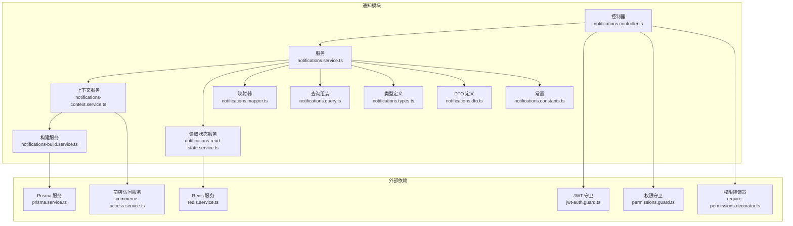
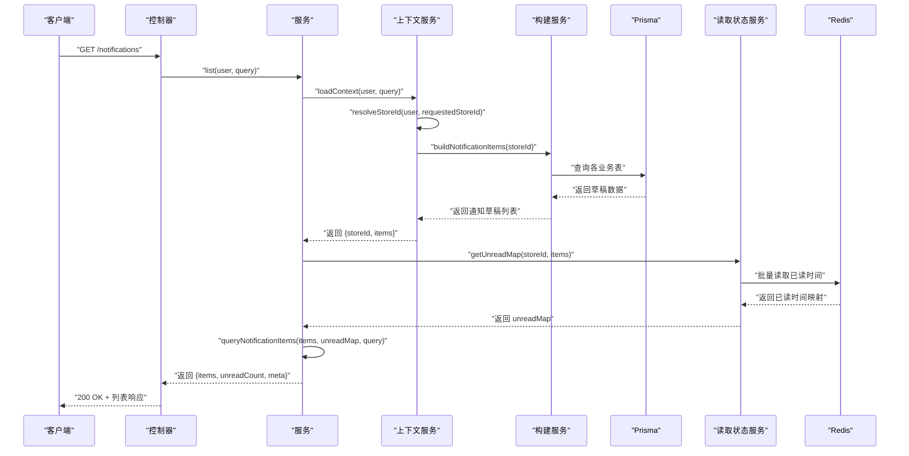
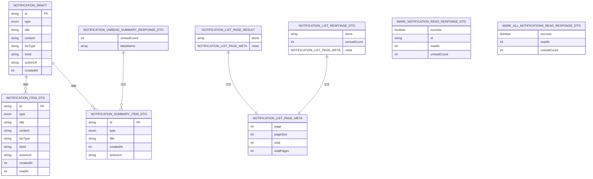
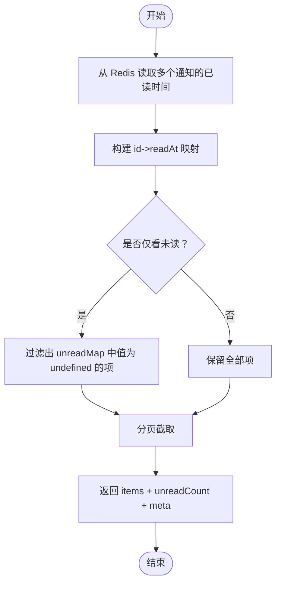
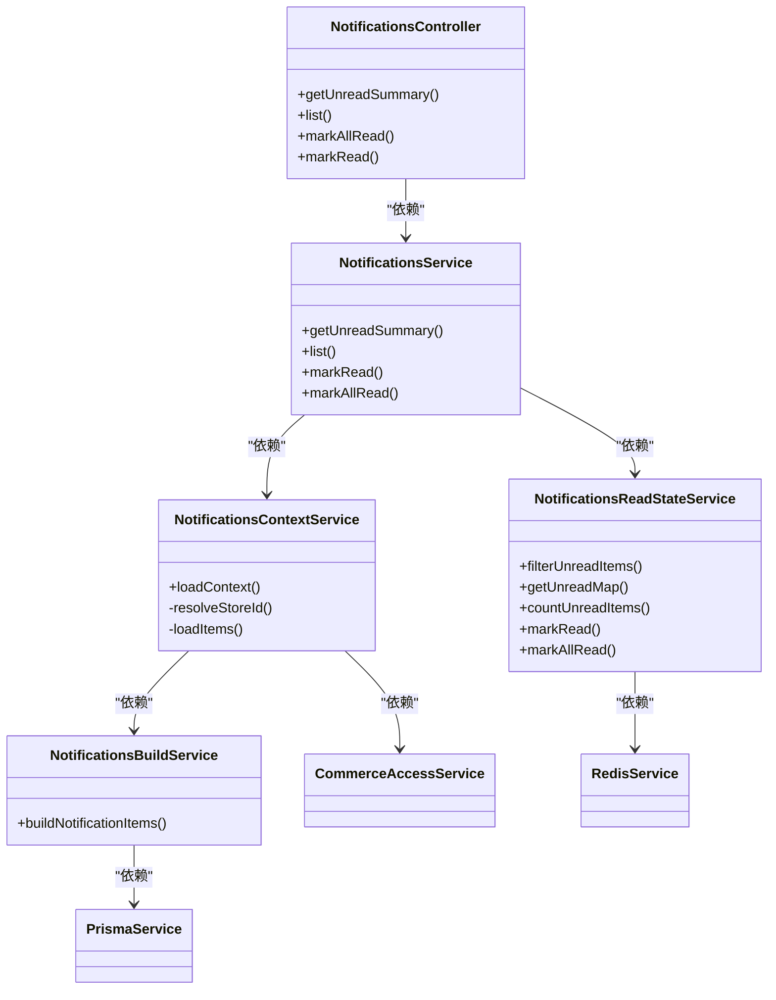

# 通知接口

<cite>
**本文引用的文件**
- [notifications.controller.ts](file://src/purely-profit/notifications/notifications.controller.ts)
- [notifications.service.ts](file://src/purely-profit/notifications/notifications.service.ts)
- [notifications.dto.ts](file://src/purely-profit/notifications/dto/notifications.dto.ts)
- [notifications.types.ts](file://src/purely-profit/notifications/notifications.types.ts)
- [notifications.constants.ts](file://src/purely-profit/notifications/notifications.constants.ts)
- [notifications.mapper.ts](file://src/purely-profit/notifications/notifications.mapper.ts)
- [notifications.query.ts](file://src/purely-profit/notifications/notifications.query.ts)
- [notifications-context.service.ts](file://src/purely-profit/notifications/notifications-context.service.ts)
- [notifications-read-state.service.ts](file://src/purely-profit/notifications/notifications-read-state.service.ts)
- [notifications-build.service.ts](file://src/purely-profit/notifications/notifications-build.service.ts)
- [jwt-auth.guard.ts](file://src/purely-profit/auth/guards/jwt-auth.guard.ts)
- [permissions.guard.ts](file://src/purely-profit/access-control/guards/permissions.guard.ts)
- [require-permissions.decorator.ts](file://src/purely-profit/access-control/decorators/require-permissions.decorator.ts)
- [commerce-access.service.ts](file://src/purely-profit/commerce/commerce-access.service.ts)
- [redis.service.ts](file://src/redis/redis.service.ts)
- [prisma.service.ts](file://src/prisma/prisma.service.ts)
</cite>

## 目录
1. [简介](#简介)
2. [项目结构](#项目结构)
3. [核心组件](#核心组件)
4. [架构总览](#架构总览)
5. [详细组件分析](#详细组件分析)
6. [依赖关系分析](#依赖关系分析)
7. [性能考量](#性能考量)
8. [故障排查指南](#故障排查指南)
9. [结论](#结论)
10. [附录](#附录)

## 简介
本文件为通知模块的详细 API 接口文档，覆盖以下能力与规范：
- 获取通知列表与未读摘要
- 标记单条通知为已读
- 批量标记当前门店所有通知为已读
- 通知类型分类、内容格式与模板
- 未读状态管理与 Redis 存储策略
- 分页查询、筛选条件与权限控制
- 客户端集成建议与多终端同步机制

## 项目结构
通知模块位于后端工程的业务域内，采用标准 NestJS 控制器-服务-DTO-类型-常量-映射-查询-上下文-读取状态-构建服务的分层设计，并通过 Redis 实现未读状态持久化，通过 Prisma 访问数据库。

**图表来源**
- [notifications.controller.ts:1-98](file://src/purely-profit/notifications/notifications.controller.ts#L1-L98)
- [notifications.service.ts:1-131](file://src/purely-profit/notifications/notifications.service.ts#L1-L131)
- [notifications.mapper.ts:1-42](file://src/purely-profit/notifications/notifications.mapper.ts#L1-L42)
- [notifications.query.ts:1-67](file://src/purely-profit/notifications/notifications.query.ts#L1-L67)
- [notifications-context.service.ts:1-47](file://src/purely-profit/notifications/notifications-context.service.ts#L1-L47)
- [notifications-read-state.service.ts:1-84](file://src/purely-profit/notifications/notifications-read-state.service.ts#L1-L84)
- [notifications-build.service.ts:1-239](file://src/purely-profit/notifications/notifications-build.service.ts#L1-L239)
- [jwt-auth.guard.ts](file://src/purely-profit/auth/guards/jwt-auth.guard.ts)
- [permissions.guard.ts](file://src/purely-profit/access-control/guards/permissions.guard.ts)
- [require-permissions.decorator.ts](file://src/purely-profit/access-control/decorators/require-permissions.decorator.ts)
- [commerce-access.service.ts](file://src/purely-profit/commerce/commerce-access.service.ts)
- [redis.service.ts](file://src/redis/redis.service.ts)
- [prisma.service.ts](file://src/prisma/prisma.service.ts)

**章节来源**
- [notifications.controller.ts:1-98](file://src/purely-profit/notifications/notifications.controller.ts#L1-L98)
- [notifications.service.ts:1-131](file://src/purely-profit/notifications/notifications.service.ts#L1-L131)

## 核心组件
- 控制器：暴露 REST 接口，负责鉴权、权限校验与参数传递。
- 服务：编排上下文加载、读取状态管理、分页与筛选、结果映射。
- 上下文服务：解析门店 ID 并构建通知源数据。
- 构建服务：从数据库聚合各类业务通知，生成草稿列表。
- 读取状态服务：基于 Redis 的未读标记存储与查询。
- 映射器与查询组装：将草稿转换为对外 DTO，并执行分页与筛选。
- 类型与 DTO：统一输入输出结构，约束字段与枚举值。
- 常量：分页默认值、时间单位、键前缀等。

**章节来源**
- [notifications.service.ts:24-131](file://src/purely-profit/notifications/notifications.service.ts#L24-L131)
- [notifications-context.service.ts:11-47](file://src/purely-profit/notifications/notifications-context.service.ts#L11-L47)
- [notifications-build.service.ts:30-239](file://src/purely-profit/notifications/notifications-build.service.ts#L30-L239)
- [notifications-read-state.service.ts:9-84](file://src/purely-profit/notifications/notifications-read-state.service.ts#L9-L84)
- [notifications.mapper.ts:1-42](file://src/purely-profit/notifications/notifications.mapper.ts#L1-L42)
- [notifications.query.ts:1-67](file://src/purely-profit/notifications/notifications.query.ts#L1-L67)
- [notifications.types.ts:1-101](file://src/purely-profit/notifications/notifications.types.ts#L1-L101)
- [notifications.dto.ts:1-238](file://src/purely-profit/notifications/dto/notifications.dto.ts#L1-L238)
- [notifications.constants.ts:1-9](file://src/purely-profit/notifications/notifications.constants.ts#L1-L9)

## 架构总览
通知模块遵循“控制器-服务-上下文-构建-读取状态”的调用链路，结合 DTO 校验与权限守卫，确保接口安全与数据一致性。

**图表来源**
- [notifications.controller.ts:51-63](file://src/purely-profit/notifications/notifications.controller.ts#L51-L63)
- [notifications.service.ts:50-74](file://src/purely-profit/notifications/notifications.service.ts#L50-L74)
- [notifications-context.service.ts:18-29](file://src/purely-profit/notifications/notifications-context.service.ts#L18-L29)
- [notifications-build.service.ts:34-141](file://src/purely-profit/notifications/notifications-build.service.ts#L34-L141)
- [notifications-read-state.service.ts:21-41](file://src/purely-profit/notifications/notifications-read-state.service.ts#L21-L41)
- [notifications.query.ts:34-66](file://src/purely-profit/notifications/notifications.query.ts#L34-L66)

## 详细组件分析

### 接口一览与规范

- 获取未读通知摘要
  - 方法与路径：GET /notifications/unread-summary
  - 权限：store:view
  - 查询参数：
    - storeId：数字，可选；不传则使用当前门店
  - 返回：未读数量与最新未读摘要列表
  - 响应 DTO：NotificationsUnreadSummaryResponseDto

- 获取通知列表
  - 方法与路径：GET /notifications
  - 权限：store:view
  - 查询参数：
    - storeId：数字，可选；不传则使用当前门店
    - type：枚举，可选；支持 inventory、finance、membership、marketing、withdrawal、employee
    - unreadOnly：布尔，可选；仅返回未读
    - page/pageSize：分页参数，默认值与上限见常量
  - 返回：通知列表、未读数量、分页元数据
  - 响应 DTO：NotificationsListResponseDto

- 标记单条通知为已读
  - 方法与路径：PATCH /notifications/:id/read
  - 权限：store:view
  - 路径参数：id（通知 ID）
  - 查询参数：storeId（可选）
  - 返回：标记结果、已读时间戳、标记后未读数量
  - 响应 DTO：MarkNotificationReadResponseDto

- 批量标记当前门店所有通知为已读
  - 方法与路径：PATCH /notifications/read-all
  - 权限：store:view
  - 查询参数：storeId（可选）
  - 返回：标记结果、已读时间戳、标记后未读数量（固定为 0）
  - 响应 DTO：MarkAllNotificationsReadResponseDto

**章节来源**
- [notifications.controller.ts:37-96](file://src/purely-profit/notifications/notifications.controller.ts#L37-L96)
- [notifications.dto.ts:48-78](file://src/purely-profit/notifications/dto/notifications.dto.ts#L48-L78)
- [notifications.dto.ts:169-237](file://src/purely-profit/notifications/dto/notifications.dto.ts#L169-L237)
- [notifications.constants.ts:2-5](file://src/purely-profit/notifications/notifications.constants.ts#L2-L5)

### 数据模型与类型

**图表来源**
- [notifications.types.ts:72-98](file://src/purely-profit/notifications/notifications.types.ts#L72-L98)
- [notifications.dto.ts:80-135](file://src/purely-profit/notifications/dto/notifications.dto.ts#L80-L135)
- [notifications.dto.ts:137-167](file://src/purely-profit/notifications/dto/notifications.dto.ts#L137-L167)
- [notifications.dto.ts:184-199](file://src/purely-profit/notifications/dto/notifications.dto.ts#L184-L199)
- [notifications.dto.ts:169-182](file://src/purely-profit/notifications/dto/notifications.dto.ts#L169-L182)
- [notifications.dto.ts:201-220](file://src/purely-profit/notifications/dto/notifications.dto.ts#L201-L220)
- [notifications.dto.ts:222-237](file://src/purely-profit/notifications/dto/notifications.dto.ts#L222-L237)

**章节来源**
- [notifications.types.ts:1-101](file://src/purely-profit/notifications/notifications.types.ts#L1-L101)
- [notifications.dto.ts:1-238](file://src/purely-profit/notifications/dto/notifications.dto.ts#L1-L238)

### 通知类型与模板
- 类型枚举：inventory、finance、membership、marketing、withdrawal、employee
- 模板来源：构建服务按业务维度生成标题与内容，统一设置 bizType、bizId、actionUrl 与 createdAt
- 示例模板（描述性说明）：
  - 库存告警：标题包含商品名与“库存不足”，内容包含当前库存与阈值，actionUrl 指向盘点页面
  - 账款逾期：标题包含对方名称与“账款已逾期”，内容包含剩余金额与到期日
  - 订阅即将到期：标题包含套餐名与“即将到期”，内容包含到期日期
  - 营销活动即将结束：标题包含活动名与“即将结束”，内容包含结束日期
  - 提现待处理：标题“有新的提现申请待处理”，内容包含金额
  - 员工请假：标题包含员工姓名与“请假即将开始”，内容包含开始时间

**章节来源**
- [notifications.types.ts:1-8](file://src/purely-profit/notifications/notifications.types.ts#L1-L8)
- [notifications-build.service.ts:149-234](file://src/purely-profit/notifications/notifications-build.service.ts#L149-L234)

### 未读状态管理与多终端同步
- 存储策略：以 Redis 作为未读标记存储，键格式为 notifications:read:{storeId}:{notificationId}
- 读取流程：批量获取各通知的已读时间戳，形成 Map；未读项在 Map 中对应值为 undefined
- 同步机制：多终端同时访问时，均从 Redis 读取最新状态；标记已读时写入当前时间戳，实现跨终端一致
- 批量标记：一次性写入多个通知的已读时间戳，确保批量操作原子性

**图表来源**
- [notifications-read-state.service.ts:21-48](file://src/purely-profit/notifications/notifications-read-state.service.ts#L21-L48)
- [notifications.query.ts:34-66](file://src/purely-profit/notifications/notifications.query.ts#L34-L66)

**章节来源**
- [notifications-read-state.service.ts:9-84](file://src/purely-profit/notifications/notifications-read-state.service.ts#L9-L84)
- [notifications.constants.ts:6-6](file://src/purely-profit/notifications/notifications.constants.ts#L6-L6)

### 权限与鉴权
- 鉴权：JWT 守卫与权限守卫组合，确保请求来自有效会话且具备 store:view 权限
- 权限装饰器：RequirePermissions 装饰器用于标注接口所需权限
- 门店解析：通过商店访问服务解析当前用户可访问的单一门店 ID，若请求携带 storeId 则进行权限校验

**章节来源**
- [notifications.controller.ts:30-33](file://src/purely-profit/notifications/notifications.controller.ts#L30-L33)
- [notifications.controller.ts:15-18](file://src/purely-profit/notifications/notifications.controller.ts#L15-L18)
- [jwt-auth.guard.ts](file://src/purely-profit/auth/guards/jwt-auth.guard.ts)
- [permissions.guard.ts](file://src/purely-profit/access-control/guards/permissions.guard.ts)
- [require-permissions.decorator.ts](file://src/purely-profit/access-control/decorators/require-permissions.decorator.ts)
- [notifications-context.service.ts:31-41](file://src/purely-profit/notifications/notifications-context.service.ts#L31-L41)

### 客户端集成方案
- 首次加载：调用 GET /notifications 获取列表与未读数量
- 未读摘要：调用 GET /notifications/unread-summary 获取最新未读摘要，用于顶部角标或全局提示
- 交互行为：
  - 点击通知：根据 actionUrl 跳转至对应业务页面
  - 标记已读：点击后调用 PATCH /notifications/:id/read 或批量 PATCH /notifications/read-all
- 多终端同步：客户端应定期轮询未读数量变化，或在切换门店/终端时重新拉取摘要与列表
- 分页与筛选：根据业务需要传入 type 与 unreadOnly 参数，结合 page/pageSize 实现分页

**章节来源**
- [notifications.controller.ts:37-96](file://src/purely-profit/notifications/notifications.controller.ts#L37-L96)
- [notifications.dto.ts:57-78](file://src/purely-profit/notifications/dto/notifications.dto.ts#L57-L78)

## 依赖关系分析

**图表来源**
- [notifications.controller.ts:34-35](file://src/purely-profit/notifications/notifications.controller.ts#L34-L35)
- [notifications.service.ts:24-29](file://src/purely-profit/notifications/notifications.service.ts#L24-L29)
- [notifications-context.service.ts:11-16](file://src/purely-profit/notifications/notifications-context.service.ts#L11-L16)
- [notifications-read-state.service.ts:9-11](file://src/purely-profit/notifications/notifications-read-state.service.ts#L9-L11)
- [notifications-build.service.ts:30-32](file://src/purely-profit/notifications/notifications-build.service.ts#L30-L32)
- [commerce-access.service.ts](file://src/purely-profit/commerce/commerce-access.service.ts)
- [redis.service.ts](file://src/redis/redis.service.ts)
- [prisma.service.ts](file://src/prisma/prisma.service.ts)

**章节来源**
- [notifications.controller.ts:1-98](file://src/purely-profit/notifications/notifications.controller.ts#L1-L98)
- [notifications.service.ts:1-131](file://src/purely-profit/notifications/notifications.service.ts#L1-L131)

## 性能考量
- 分页与限制：默认每页 20 条，最大 100 条；摘要最多展示 5 条，降低网络传输与渲染压力
- 批量读取：未读状态查询使用 Promise.all 并发读取 Redis，提升响应速度
- 数据库查询：各业务源限制数量（如低库存商品、逾期账款等），避免超大数据集扫描
- 键空间设计：Redis 键按 storeId 与通知 id 组合，便于清理与统计

**章节来源**
- [notifications.constants.ts:2-9](file://src/purely-profit/notifications/notifications.constants.ts#L2-L9)
- [notifications-read-state.service.ts:25-38](file://src/purely-profit/notifications/notifications-read-state.service.ts#L25-L38)
- [notifications-build.service.ts:52-141](file://src/purely-profit/notifications/notifications-build.service.ts#L52-L141)

## 故障排查指南
- 通知不存在或已失效
  - 现象：标记单条通知为已读时抛出异常
  - 原因：目标通知不在当前上下文范围内
  - 处理：确认通知 ID 与当前门店匹配，或重新拉取通知列表
- 权限不足
  - 现象：接口返回鉴权失败或无权限
  - 原因：缺少 store:view 权限或请求的 storeId 超出权限范围
  - 处理：检查用户角色与门店绑定，或传入正确的 storeId
- Redis 连接异常
  - 现象：未读状态无法读取或更新
  - 原因：Redis 服务不可用
  - 处理：检查 Redis 连接配置与网络连通性
- 数据库查询超时
  - 现象：通知列表加载缓慢
  - 原因：业务源数据量大或索引缺失
  - 处理：优化查询条件与索引，适当调整 SOURCE_LIMIT

**章节来源**
- [notifications.service.ts:86-88](file://src/purely-profit/notifications/notifications.service.ts#L86-L88)
- [notifications-context.service.ts:35-40](file://src/purely-profit/notifications/notifications-context.service.ts#L35-L40)
- [notifications-read-state.service.ts:27-32](file://src/purely-profit/notifications/notifications-read-state.service.ts#L27-L32)
- [notifications-build.service.ts:52-141](file://src/purely-profit/notifications/notifications-build.service.ts#L52-L141)

## 结论
通知模块通过清晰的分层设计与严格的 DTO 校验，提供了稳定可靠的接口能力。结合 Redis 的未读状态存储与多终端同步机制，满足了多端一致性的需求。建议在生产环境中配合缓存预热与合理的分页策略，持续优化性能与用户体验。

## 附录

### 接口定义汇总

- GET /notifications/unread-summary
  - 权限：store:view
  - 查询参数：storeId（可选）
  - 响应：unreadCount（未读数量）、latestItems（最新未读摘要）

- GET /notifications
  - 权限：store:view
  - 查询参数：storeId（可选）、type（可选）、unreadOnly（可选）、page、pageSize
  - 响应：items（通知列表）、unreadCount（未读数量）、meta（分页元数据）

- PATCH /notifications/:id/read
  - 权限：store:view
  - 路径参数：id（通知 ID）
  - 查询参数：storeId（可选）
  - 响应：success、id、readAt、unreadCount

- PATCH /notifications/read-all
  - 权限：store:view
  - 查询参数：storeId（可选）
  - 响应：success、readAt、unreadCount（固定为 0）

**章节来源**
- [notifications.controller.ts:37-96](file://src/purely-profit/notifications/notifications.controller.ts#L37-L96)
- [notifications.dto.ts:48-78](file://src/purely-profit/notifications/dto/notifications.dto.ts#L48-L78)
- [notifications.dto.ts:169-237](file://src/purely-profit/notifications/dto/notifications.dto.ts#L169-L237)