# 业务模块

<cite>
**本文引用的文件**
- [src/app.module.ts](file://src/app.module.ts)
- [src/purely-profit/stores/stores.controller.ts](file://src/purely-profit/stores/stores.controller.ts)
- [src/purely-profit/stores/stores.service.ts](file://src/purely-profit/stores/stores.service.ts)
- [src/purely-profit/stores/stores.types.ts](file://src/purely-profit/stores/stores.types.ts)
- [src/purely-profit/stores/stores-read.service.ts](file://src/purely-profit/stores/stores-read.service.ts)
- [src/purely-profit/stores/stores-write.service.ts](file://src/purely-profit/stores/stores-write.service.ts)
- [src/purely-profit/staff/employees/employees.controller.ts](file://src/purely-profit/staff/employees/employees.controller.ts)
- [src/purely-profit/staff/employees/employees.service.ts](file://src/purely-profit/staff/employees/employees.service.ts)
- [src/purely-profit/staff/employees/employees.types.ts](file://src/purely-profit/staff/employees/employees.types.ts)
- [src/purely-profit/staff/employees/employees-read.service.ts](file://src/purely-profit/staff/employees/employees-read.service.ts)
- [src/purely-profit/staff/employees/employees-write.service.ts](file://src/purely-profit/staff/employees/employees-write.service.ts)
- [src/purely-profit/member/members/members.controller.ts](file://src/purely-profit/member/members/members.controller.ts)
- [src/purely-profit/member/members/members.service.ts](file://src/purely-profit/member/members/members.service.ts)
- [src/purely-profit/member/members/members.types.ts](file://src/purely-profit/member/members/members.types.ts)
- [src/purely-profit/member/members/members-query.shared.ts](file://src/purely-profit/member/members/members-query.shared.ts)
- [src/purely-profit/member/members/members-read.query.ts](file://src/purely-profit/member/members/members-read.query.ts)
- [src/purely-profit/member/members/members-write.query.ts](file://src/purely-profit/member/members/members-write.query.ts)
- [src/purely-profit/goods/products/products.controller.ts](file://src/purely-profit/goods/products/products.controller.ts)
- [src/purely-profit/goods/products/products.service.ts](file://src/purely-profit/goods/products/products.service.ts)
- [src/purely-profit/goods/products/products.types.ts](file://src/purely-profit/goods/products/products.types.ts)
- [src/purely-profit/goods/categories/categories.controller.ts](file://src/purely-profit/goods/categories/categories.controller.ts)
- [src/purely-profit/goods/categories/categories.service.ts](file://src/purely-profit/goods/categories/categories.service.ts)
- [src/purely-profit/goods/categories/categories.types.ts](file://src/purely-profit/goods/categories/categories.types.ts)
- [src/purely-profit/goods/inventory/inventory.controller.ts](file://src/purely-profit/goods/inventory/inventory.controller.ts)
- [src/purely-profit/goods/inventory/inventory.service.ts](file://src/purely-profit/goods/inventory/inventory.service.ts)
- [src/purely-profit/goods/inventory/inventory.types.ts](file://src/purely-profit/goods/inventory/inventory.types.ts)
- [src/purely-profit/finance/finance.controller.ts](file://src/purely-profit/finance/finance.controller.ts)
- [src/purely-profit/finance/finance.service.ts](file://src/purely-profit/finance/finance.service.ts)
- [src/purely-profit/finance/finance.types.ts](file://src/purely-profit/finance/finance.types.ts)
- [src/purely-profit/finance/finance-account.service.ts](file://src/purely-profit/finance/finance-account.service.ts)
- [src/purely-profit/finance/finance-cash-flow.service.ts](file://src/purely-profit/finance/finance-cash-flow.service.ts)
- [src/purely-profit/finance/finance-reconciliation.service.ts](file://src/purely-profit/finance/finance-reconciliation.service.ts)
- [src/purely-profit/marketing/marketing.controller.ts](file://src/purely-profit/marketing/marketing.controller.ts)
- [src/purely-profit/marketing/marketing.service.ts](file://src/purely-profit/marketing/marketing.service.ts)
- [src/purely-profit/marketing/marketing.types.ts](file://src/purely-profit/marketing/marketing.types.ts)
- [src/purely-profit/marketing/marketing-customers.controller.ts](file://src/purely-profit/marketing/marketing-customers.controller.ts)
- [src/purely-profit/marketing/marketing-promotions.controller.ts](file://src/purely-profit/marketing/marketing-promotions.controller.ts)
- [src/purely-profit/marketing/marketing-products.controller.ts](file://src/purely-profit/marketing/marketing-products.controller.ts)
- [src/purely-profit/marketing/marketing-transactions.controller.ts](file://src/purely-profit/marketing/marketing-transactions.controller.ts)
- [src/purely-profit/operations/sales-record/sales-record.controller.ts](file://src/purely-profit/operations/sales-record/sales-record.controller.ts)
- [src/purely-profit/operations/sales-record/sales-record.service.ts](file://src/purely-profit/operations/sales-record/sales-record.service.ts)
- [src/purely-profit/operations/sales-record/sales-record.types.ts](file://src/purely-profit/operations/sales-record/sales-record.types.ts)
- [src/purely-profit/operations/costs/costs.controller.ts](file://src/purely-profit/operations/costs/costs.controller.ts)
- [src/purely-profit/operations/costs/costs.service.ts](file://src/purely-profit/operations/costs/costs.service.ts)
- [src/purely-profit/operations/costs/costs.types.ts](file://src/purely-profit/operations/costs/costs.types.ts)
- [src/purely-profit/operations/handover/handover.controller.ts](file://src/purely-profit/operations/handover/handover.controller.ts)
- [src/purely-profit/operations/handover/handover.service.ts](file://src/purely-profit/operations/handover/handover.service.ts)
- [src/purely-profit/operations/handover/handover.types.ts](file://src/purely-profit/operations/handover/handover.types.ts)
- [src/purely-profit/operations/spaces/spaces.controller.ts](file://src/purely-profit/operations/spaces/spaces.controller.ts)
- [src/purely-profit/operations/spaces/spaces.service.ts](file://src/purely-profit/operations/spaces/spaces.service.ts)
- [src/purely-profit/operations/spaces/spaces.types.ts](file://src/purely-profit/operations/spaces/spaces.types.ts)
- [src/purely-profit/operations/purchases/purchases.controller.ts](file://src/purely-profit/operations/purchases/purchases.controller.ts)
- [src/purely-profit/operations/purchases/purchases.service.ts](file://src/purely-profit/operations/purchases/purchases.service.ts)
- [src/purely-profit/operations/purchases/purchases.types.ts](file://src/purely-profit/operations/purchases/purchases.types.ts)
- [src/purely-profit/subscriptions/subscriptions.controller.ts](file://src/purely-profit/subscriptions/subscriptions.controller.ts)
- [src/purely-profit/subscriptions/subscriptions.service.ts](file://src/purely-profit/subscriptions/subscriptions.service.ts)
- [src/purely-profit/subscriptions/subscriptions.types.ts](file://src/purely-profit/subscriptions/subscriptions.types.ts)
- [src/purely-profit/notifications/notifications.controller.ts](file://src/purely-profit/notifications/notifications.controller.ts)
- [src/purely-profit/notifications/notifications.service.ts](file://src/purely-profit/notifications/notifications.service.ts)
- [src/purely-profit/notifications/notifications.types.ts](file://src/purely-profit/notifications/notifications.types.ts)
- [src/purely-profit/dashboard/dashboard-home/dashboard-home.controller.ts](file://src/purely-profit/dashboard/dashboard-home/dashboard-home.controller.ts)
- [src/purely-profit/dashboard/dashboard-home/dashboard-home.service.ts](file://src/purely-profit/dashboard/dashboard-home/dashboard-home.service.ts)
- [src/purely-profit/dashboard/dashboard-home/dashboard-home.types.ts](file://src/purely-profit/dashboard/dashboard-home/dashboard-home.types.ts)
- [src/purely-profit/dashboard/business-analysis/business-analysis.controller.ts](file://src/purely-profit/dashboard/business-analysis/business-analysis.controller.ts)
- [src/purely-profit/dashboard/business-analysis/business-analysis.service.ts](file://src/purely-profit/dashboard/business-analysis/business-analysis.service.ts)
- [src/purely-profit/dashboard/business-analysis/business-analysis.types.ts](file://src/purely-profit/dashboard/business-analysis/business-analysis.types.ts)
- [src/purely-profit/dashboard/profit-detail/profit-detail.controller.ts](file://src/purely-profit/dashboard/profit-detail/profit-detail.controller.ts)
- [src/purely-profit/dashboard/profit-detail/profit-detail.service.ts](file://src/purely-profit/dashboard/profit-detail/profit-detail.service.ts)
- [src/purely-profit/dashboard/profit-detail/profit-detail.types.ts](file://src/purely-profit/dashboard/profit-detail/profit-detail.types.ts)
- [src/purely-profit/auth/auth.controller.ts](file://src/purely-profit/auth/auth.controller.ts)
- [src/purely-profit/auth/auth.service.ts](file://src/purely-profit/auth/auth.service.ts)
- [src/purely-profit/auth/dto/login.dto.ts](file://src/purely-profit/auth/dto/login.dto.ts)
- [src/purely-profit/auth/dto/register.dto.ts](file://src/purely-profit/auth/dto/register.dto.ts)
- [src/purely-profit/auth/dto/profile-response.dto.ts](file://src/purely-profit/auth/dto/profile-response.dto.ts)
- [src/purely-profit/auth/guards/jwt-auth.guard.ts](file://src/purely-profit/auth/guards/jwt-auth.guard.ts)
- [src/purely-profit/auth/strategies/jwt.strategy.ts](file://src/purely-profit/auth/strategies/jwt.strategy.ts)
- [src/purely-profit/access-control/access-control.service.ts](file://src/purely-profit/access-control/access-control.service.ts)
- [src/purely-profit/access-control/subject-capability.service.ts](file://src/purely-profit/access-control/subject-capability.service.ts)
- [src/purely-profit/access-control/decorators/require-permissions.decorator.ts](file://src/purely-profit/access-control/decorators/require-permissions.decorator.ts)
- [src/purely-profit/access-control/guards/permissions.guard.ts](file://src/purely-profit/access-control/guards/permissions.guard.ts)
- [prisma/schema.prisma](file://prisma/schema.prisma)
- [prisma/migrations/20260512110000_add_stores/migration.sql](file://prisma/migrations/20260512110000_add_stores/migration.sql)
- [prisma/migrations/20260512113000_add_staffs/migration.sql](file://prisma/migrations/20260512113000_add_staffs/migration.sql)
- [prisma/migrations/20260513170000_add_members/migration.sql](file://prisma/migrations/20260513170000_add_members/migration.sql)
- [prisma/migrations/20260514153000_add_store_partners_and_withdrawals/migration.sql](file://prisma/migrations/20260514153000_add_store_partners_and_withdrawals/migration.sql)
- [prisma/migrations/20260514210000_add_commerce_inventory/migration.sql](file://prisma/migrations/20260514210000_add_commerce_inventory/migration.sql)
- [prisma/migrations/20260514213000_add_finance_management/migration.sql](file://prisma/migrations/20260514213000_add_finance_management/migration.sql)
- [prisma/migrations/20260514223000_add_business_analysis_sales_orders/migration.sql](file://prisma/migrations/20260514223000_add_business_analysis_sales_orders/migration.sql)
- [prisma/migrations/20260514234000_add_cost_management/migration.sql](file://prisma/migrations/20260514234000_add_cost_management/migration.sql)
- [prisma/migrations/20260515001000_link_sales_orders_to_finance_and_inventory/migration.sql](file://prisma/migrations/20260515001000_link_sales_orders_to_finance_and_inventory/migration.sql)
- [prisma/migrations/20260515013000_add_space_management_and_reservations/migration.sql](file://prisma/migrations/20260515013000_add_space_management_and_reservations/migration.sql)
- [prisma/migrations/20260515110000_expand_platform_membership_center/migration.sql](file://prisma/migrations/20260515110000_expand_platform_membership_center/migration.sql)
- [prisma/migrations/20260515123000_add_partner_application_history/migration.sql](file://prisma/migrations/20260515123000_add_partner_application_history/migration.sql)
- [prisma/migrations/20260515133000_add_marketing_points_records/migration.sql](file://prisma/migrations/20260515133000_add_marketing_points_records/migration.sql)
- [prisma/migrations/20260523120000_add_membership_plan_settings/migration.sql](file://prisma/migrations/20260523120000_add_membership_plan_settings/migration.sql)
- [prisma/migrations/20260523170000_add_lifetime_membership_cycle/migration.sql](file://prisma/migrations/20260523170000_add_lifetime_membership_cycle/migration.sql)
- [prisma/migrations/20260529120000_support_multiple_store_partners/migration.sql](file://prisma/migrations/20260529120000_support_multiple_store_partners/migration.sql)
- [prisma/migrations/20260530123935_sync_sub_account_schema/migration.sql](file://prisma/migrations/20260530123935_sync_sub_account_schema/migration.sql)
- [prisma/migrations/20260601120000_add_manager_sub_account_role/migration.sql](file://prisma/migrations/20260601120000_add_manager_sub_account_role/migration.sql)
- [prisma/migrations/20260601143000_add_handover_additional_items/migration.sql](file://prisma/migrations/20260601143000_add_handover_additional_items/migration.sql)
- [prisma/migrations/20260601170000_add_employee_shift_definitions/migration.sql](file://prisma/migrations/20260601170000_add_employee_shift_definitions/migration.sql)
- [prisma/migrations/20260605183000_add_handover_record_shift_snapshots/migration.sql](file://prisma/migrations/20260605183000_add_handover_record_shift_snapshots/migration.sql)
- [prisma/migrations/20260606123000_add_marketing_products/migration.sql](file://prisma/migrations/20260606123000_add_marketing_products/migration.sql)
</cite>

## 目录
1. [引言](#引言)
2. [项目结构](#项目结构)
3. [核心组件](#核心组件)
4. [架构总览](#架构总览)
5. [详细组件分析](#详细组件分析)
6. [依赖分析](#依赖分析)
7. [性能考虑](#性能考虑)
8. [故障排查指南](#故障排查指南)
9. [结论](#结论)
10. [附录](#附录)

## 引言
本文件面向开发者与产品团队，系统化梳理 purelyprofit-server 的业务模块设计与实现，覆盖门店管理、员工管理、会员管理、商品管理、财务管理、营销推广、运营管理等核心领域。文档从模块职责、数据模型、接口契约、服务方法到控制层实现进行分层讲解，并通过图示展示模块间的关系、数据流与业务逻辑，帮助快速理解与扩展。

## 项目结构
后端采用 NestJS 模块化组织，业务按领域拆分为 stores、staff、member、goods、finance、marketing、operations、subscriptions、notifications、dashboard 等子域；每个子域内再细分子模块（如 goods 下的 products、categories、inventory），并遵循 controller-service-domain 的分层结构。认证与权限控制由 auth 与 access-control 子域提供统一能力。

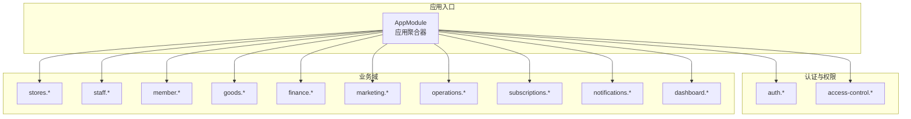

图表来源
- [src/app.module.ts](file://src/app.module.ts)
- [src/purely-profit/auth/auth.module.ts](file://src/purely-profit/auth/auth.module.ts)
- [src/purely-profit/access-control/access-control.module.ts](file://src/purely-profit/access-control/access-control.module.ts)
- [src/purely-profit/stores/stores.module.ts](file://src/purely-profit/stores/stores.module.ts)
- [src/purely-profit/staff/staff.module.ts](file://src/purely-profit/staff/staff.module.ts)
- [src/purely-profit/member/member.module.ts](file://src/purely-profit/member/member.module.ts)
- [src/purely-profit/goods/goods.module.ts](file://src/purely-profit/goods/goods.module.ts)
- [src/purely-profit/finance/finance.module.ts](file://src/purely-profit/finance/finance.module.ts)
- [src/purely-profit/marketing/marketing.module.ts](file://src/purely-profit/marketing/marketing.module.ts)
- [src/purely-profit/operations/operations.module.ts](file://src/purely-profit/operations/operations.module.ts)
- [src/purely-profit/subscriptions/subscriptions.module.ts](file://src/purely-profit/subscriptions/subscriptions.module.ts)
- [src/purely-profit/notifications/notifications.module.ts](file://src/purely-profit/notifications/notifications.module.ts)
- [src/purely-profit/dashboard/dashboard.module.ts](file://src/purely-profit/dashboard/dashboard.module.ts)

章节来源
- [src/app.module.ts](file://src/app.module.ts)

## 核心组件
- 认证与会话：提供登录、注册、密码管理、头像更新、实名验证等能力，基于 JWT 守卫与策略实现鉴权。
- 权限控制：基于“主体-能力”模型，提供装饰器与守卫，支持细粒度权限校验。
- 门店管理：提供门店读写、配置与上下文服务，支撑多门店与子账号体系。
- 员工管理：员工读写、座位管理、排班与交接等，支持多角色与权限矩阵。
- 会员管理：会员读写、积分与储值、平台会员权益与提现。
- 商品管理：商品、分类、库存管理，支撑销售与成本核算。
- 财务管理：账户、现金流、对账、财务概览与报表。
- 营销推广：客户、促销、产品、交易流水与积分记录。
- 运营管理：销售订单、采购、成本、空间预约与交接。
- 订阅与通知：订阅中心与运营通知。
- 数据看板：首页概览、经营分析、利润明细。

章节来源
- [src/purely-profit/auth/auth.controller.ts](file://src/purely-profit/auth/auth.controller.ts)
- [src/purely-profit/auth/auth.service.ts](file://src/purely-profit/auth/auth.service.ts)
- [src/purely-profit/access-control/access-control.service.ts](file://src/purely-profit/access-control/access-control.service.ts)
- [src/purely-profit/access-control/subject-capability.service.ts](file://src/purely-profit/access-control/subject-capability.service.ts)
- [src/purely-profit/stores/stores.controller.ts](file://src/purely-profit/stores/stores.controller.ts)
- [src/purely-profit/stores/stores.service.ts](file://src/purely-profit/stores/stores.service.ts)
- [src/purely-profit/staff/employees/employees.controller.ts](file://src/purely-profit/staff/employees/employees.controller.ts)
- [src/purely-profit/staff/employees/employees.service.ts](file://src/purely-profit/staff/employees/employees.service.ts)
- [src/purely-profit/member/members/members.controller.ts](file://src/purely-profit/member/members/members.controller.ts)
- [src/purely-profit/member/members/members.service.ts](file://src/purely-profit/member/members/members.service.ts)
- [src/purely-profit/goods/products/products.controller.ts](file://src/purely-profit/goods/products/products.controller.ts)
- [src/purely-profit/goods/products/products.service.ts](file://src/purely-profit/goods/products/products.service.ts)
- [src/purely-profit/finance/finance.controller.ts](file://src/purely-profit/finance/finance.controller.ts)
- [src/purely-profit/finance/finance.service.ts](file://src/purely-profit/finance/finance.service.ts)
- [src/purely-profit/marketing/marketing.controller.ts](file://src/purely-profit/marketing/marketing.controller.ts)
- [src/purely-profit/marketing/marketing.service.ts](file://src/purely-profit/marketing/marketing.service.ts)
- [src/purely-profit/operations/sales-record/sales-record.controller.ts](file://src/purely-profit/operations/sales-record/sales-record.controller.ts)
- [src/purely-profit/operations/sales-record/sales-record.service.ts](file://src/purely-profit/operations/sales-record/sales-record.service.ts)
- [src/purely-profit/subscriptions/subscriptions.controller.ts](file://src/purely-profit/subscriptions/subscriptions.controller.ts)
- [src/purely-profit/subscriptions/subscriptions.service.ts](file://src/purely-profit/subscriptions/subscriptions.service.ts)
- [src/purely-profit/notifications/notifications.controller.ts](file://src/purely-profit/notifications/notifications.controller.ts)
- [src/purely-profit/notifications/notifications.service.ts](file://src/purely-profit/notifications/notifications.service.ts)
- [src/purely-profit/dashboard/dashboard-home/dashboard-home.controller.ts](file://src/purely-profit/dashboard/dashboard-home/dashboard-home.controller.ts)
- [src/purely-profit/dashboard/dashboard-home/dashboard-home.service.ts](file://src/purely-profit/dashboard/dashboard-home/dashboard-home.service.ts)
- [src/purely-profit/dashboard/business-analysis/business-analysis.controller.ts](file://src/purely-profit/dashboard/business-analysis/business-analysis.controller.ts)
- [src/purely-profit/dashboard/business-analysis/business-analysis.service.ts](file://src/purely-profit/dashboard/business-analysis/business-analysis.service.ts)
- [src/purely-profit/dashboard/profit-detail/profit-detail.controller.ts](file://src/purely-profit/dashboard/profit-detail/profit-detail.controller.ts)
- [src/purely-profit/dashboard/profit-detail/profit-detail.service.ts](file://src/purely-profit/dashboard/profit-detail/profit-detail.service.ts)

## 架构总览
系统采用“领域驱动”的模块化架构，围绕业务子域划分模块边界，控制器负责请求编排，服务层承载业务规则，领域对象封装状态与行为，DTO 作为跨层数据载体。认证与权限贯穿全局，通过守卫与装饰器在进入业务流程前进行访问控制。

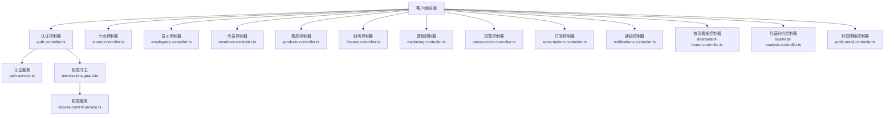

图表来源
- [src/purely-profit/auth/auth.controller.ts](file://src/purely-profit/auth/auth.controller.ts)
- [src/purely-profit/auth/auth.service.ts](file://src/purely-profit/auth/auth.service.ts)
- [src/purely-profit/access-control/guards/permissions.guard.ts](file://src/purely-profit/access-control/guards/permissions.guard.ts)
- [src/purely-profit/access-control/access-control.service.ts](file://src/purely-profit/access-control/access-control.service.ts)
- [src/purely-profit/stores/stores.controller.ts](file://src/purely-profit/stores/stores.controller.ts)
- [src/purely-profit/staff/employees/employees.controller.ts](file://src/purely-profit/staff/employees/employees.controller.ts)
- [src/purely-profit/member/members/members.controller.ts](file://src/purely-profit/member/members/members.controller.ts)
- [src/purely-profit/goods/products/products.controller.ts](file://src/purely-profit/goods/products/products.controller.ts)
- [src/purely-profit/finance/finance.controller.ts](file://src/purely-profit/finance/finance.controller.ts)
- [src/purely-profit/marketing/marketing.controller.ts](file://src/purely-profit/marketing/marketing.controller.ts)
- [src/purely-profit/operations/sales-record/sales-record.controller.ts](file://src/purely-profit/operations/sales-record/sales-record.controller.ts)
- [src/purely-profit/subscriptions/subscriptions.controller.ts](file://src/purely-profit/subscriptions/subscriptions.controller.ts)
- [src/purely-profit/notifications/notifications.controller.ts](file://src/purely-profit/notifications/notifications.controller.ts)
- [src/purely-profit/dashboard/dashboard-home/dashboard-home.controller.ts](file://src/purely-profit/dashboard/dashboard-home/dashboard-home.controller.ts)
- [src/purely-profit/dashboard/business-analysis/business-analysis.controller.ts](file://src/purely-profit/dashboard/business-analysis/business-analysis.controller.ts)
- [src/purely-profit/dashboard/profit-detail/profit-detail.controller.ts](file://src/purely-profit/dashboard/profit-detail/profit-detail.controller.ts)

## 详细组件分析

### 门店管理（Stores）
- 职责：门店读取、写入、配置与上下文解析，支持主账号与子账号维度的门店隔离。
- 关键类型：门店读写查询、上下文类型、配置类型等。
- 控制器：提供列表、详情、创建、更新、删除等接口。
- 服务：封装读写逻辑、上下文解析与权限校验。

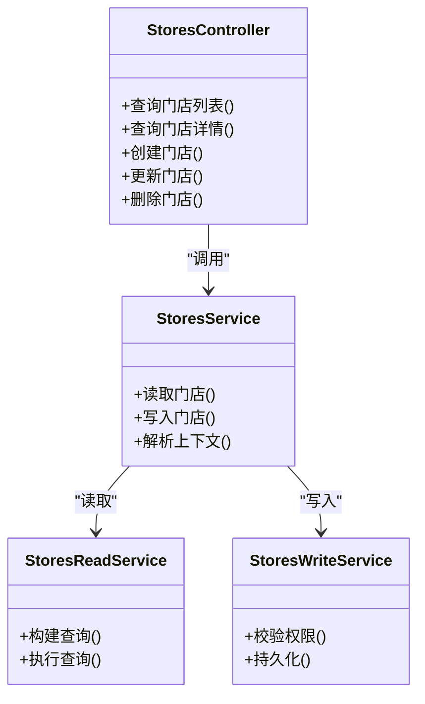

图表来源
- [src/purely-profit/stores/stores.controller.ts](file://src/purely-profit/stores/stores.controller.ts)
- [src/purely-profit/stores/stores.service.ts](file://src/purely-profit/stores/stores.service.ts)
- [src/purely-profit/stores/stores-read.service.ts](file://src/purely-profit/stores/stores-read.service.ts)
- [src/purely-profit/stores/stores-write.service.ts](file://src/purely-profit/stores/stores-write.service.ts)

章节来源
- [src/purely-profit/stores/stores.controller.ts](file://src/purely-profit/stores/stores.controller.ts)
- [src/purely-profit/stores/stores.service.ts](file://src/purely-profit/stores/stores.service.ts)
- [src/purely-profit/stores/stores.types.ts](file://src/purely-profit/stores/stores.types.ts)
- [src/purely-profit/stores/stores-read.service.ts](file://src/purely-profit/stores/stores-read.service.ts)
- [src/purely-profit/stores/stores-write.service.ts](file://src/purely-profit/stores/stores-write.service.ts)

### 员工管理（Staff/Employees）
- 职责：员工读写、座位管理、排班与交接，支持多角色与权限矩阵。
- 关键类型：员工读写查询、座位与状态类型、排班定义等。
- 控制器：提供员工列表、详情、创建、更新、删除、座位分配等接口。
- 服务：封装读写、座位分配、排班与交接逻辑。

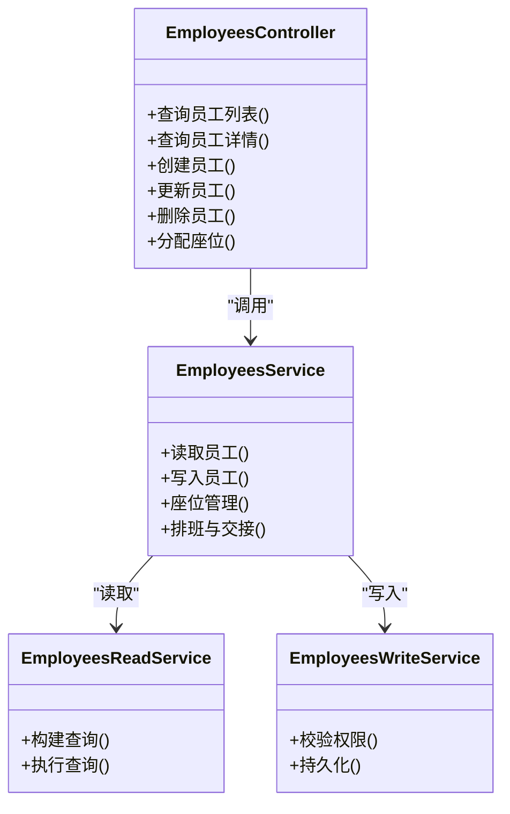

图表来源
- [src/purely-profit/staff/employees/employees.controller.ts](file://src/purely-profit/staff/employees/employees.controller.ts)
- [src/purely-profit/staff/employees/employees.service.ts](file://src/purely-profit/staff/employees/employees.service.ts)
- [src/purely-profit/staff/employees/employees.types.ts](file://src/purely-profit/staff/employees/employees.types.ts)
- [src/purely-profit/staff/employees/employees-read.service.ts](file://src/purely-profit/staff/employees/employees-read.service.ts)
- [src/purely-profit/staff/employees/employees-write.service.ts](file://src/purely-profit/staff/employees/employees-write.service.ts)

章节来源
- [src/purely-profit/staff/employees/employees.controller.ts](file://src/purely-profit/staff/employees/employees.controller.ts)
- [src/purely-profit/staff/employees/employees.service.ts](file://src/purely-profit/staff/employees/employees.service.ts)
- [src/purely-profit/staff/employees/employees.types.ts](file://src/purely-profit/staff/employees/employees.types.ts)
- [src/purely-profit/staff/employees/employees-read.service.ts](file://src/purely-profit/staff/employees/employees-read.service.ts)
- [src/purely-profit/staff/employees/employees-write.service.ts](file://src/purely-profit/staff/employees/employees-write.service.ts)

### 会员管理（Member/Members）
- 职责：会员读写、积分与储值、平台会员权益与提现。
- 关键类型：会员读写查询、积分与储值日志、平台会员订单与权益等。
- 控制器：提供会员列表、详情、创建、更新、积分与储值操作、提现申请等接口。
- 服务：封装读写、积分与储值计算、平台会员权益与提现处理。

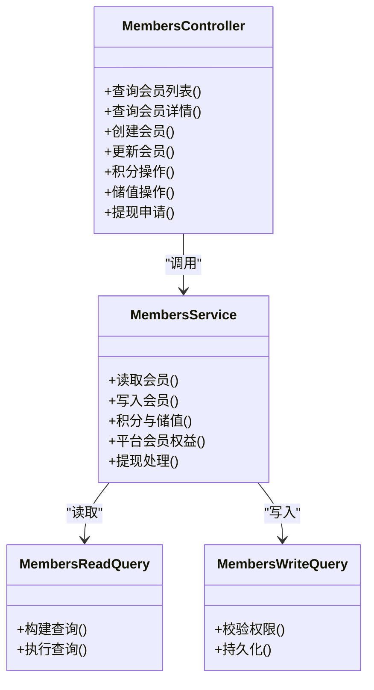

图表来源
- [src/purely-profit/member/members/members.controller.ts](file://src/purely-profit/member/members/members.controller.ts)
- [src/purely-profit/member/members/members.service.ts](file://src/purely-profit/member/members/members.service.ts)
- [src/purely-profit/member/members/members.types.ts](file://src/purely-profit/member/members/members.types.ts)
- [src/purely-profit/member/members/members-query.shared.ts](file://src/purely-profit/member/members/members-query.shared.ts)
- [src/purely-profit/member/members/members-read.query.ts](file://src/purely-profit/member/members/members-read.query.ts)
- [src/purely-profit/member/members/members-write.query.ts](file://src/purely-profit/member/members/members-write.query.ts)

章节来源
- [src/purely-profit/member/members/members.controller.ts](file://src/purely-profit/member/members/members.controller.ts)
- [src/purely-profit/member/members/members.service.ts](file://src/purely-profit/member/members/members.service.ts)
- [src/purely-profit/member/members/members.types.ts](file://src/purely-profit/member/members/members.types.ts)
- [src/purely-profit/member/members/members-query.shared.ts](file://src/purely-profit/member/members/members-query.shared.ts)
- [src/purely-profit/member/members/members-read.query.ts](file://src/purely-profit/member/members/members-read.query.ts)
- [src/purely-profit/member/members/members-write.query.ts](file://src/purely-profit/member/members/members-write.query.ts)

### 商品管理（Goods/Products/Categories/Inventory）
- 职责：商品、分类、库存管理，支撑销售与成本核算。
- 关键类型：商品、分类、库存查询与类型。
- 控制器：提供商品与分类的增删改查、库存盘点与调整等接口。
- 服务：封装读写、库存计算与成本核算。

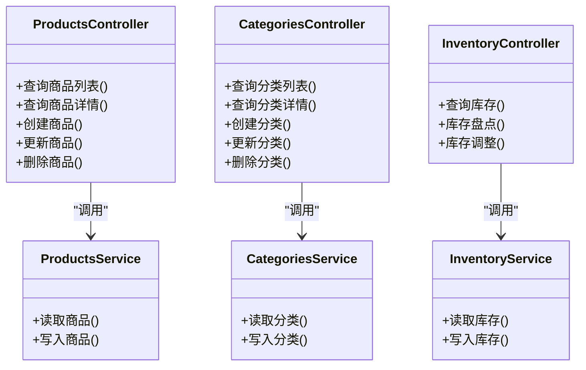

图表来源
- [src/purely-profit/goods/products/products.controller.ts](file://src/purely-profit/goods/products/products.controller.ts)
- [src/purely-profit/goods/products/products.service.ts](file://src/purely-profit/goods/products/products.service.ts)
- [src/purely-profit/goods/products/products.types.ts](file://src/purely-profit/goods/products/products.types.ts)
- [src/purely-profit/goods/categories/categories.controller.ts](file://src/purely-profit/goods/categories/categories.controller.ts)
- [src/purely-profit/goods/categories/categories.service.ts](file://src/purely-profit/goods/categories/categories.service.ts)
- [src/purely-profit/goods/categories/categories.types.ts](file://src/purely-profit/goods/categories/categories.types.ts)
- [src/purely-profit/goods/inventory/inventory.controller.ts](file://src/purely-profit/goods/inventory/inventory.controller.ts)
- [src/purely-profit/goods/inventory/inventory.service.ts](file://src/purely-profit/goods/inventory/inventory.service.ts)
- [src/purely-profit/goods/inventory/inventory.types.ts](file://src/purely-profit/goods/inventory/inventory.types.ts)

章节来源
- [src/purely-profit/goods/products/products.controller.ts](file://src/purely-profit/goods/products/products.controller.ts)
- [src/purely-profit/goods/products/products.service.ts](file://src/purely-profit/goods/products/products.service.ts)
- [src/purely-profit/goods/products/products.types.ts](file://src/purely-profit/goods/products/products.types.ts)
- [src/purely-profit/goods/categories/categories.controller.ts](file://src/purely-profit/goods/categories/categories.controller.ts)
- [src/purely-profit/goods/categories/categories.service.ts](file://src/purely-profit/goods/categories/categories.service.ts)
- [src/purely-profit/goods/categories/categories.types.ts](file://src/purely-profit/goods/categories/categories.types.ts)
- [src/purely-profit/goods/inventory/inventory.controller.ts](file://src/purely-profit/goods/inventory/inventory.controller.ts)
- [src/purely-profit/goods/inventory/inventory.service.ts](file://src/purely-profit/goods/inventory/inventory.service.ts)
- [src/purely-profit/goods/inventory/inventory.types.ts](file://src/purely-profit/goods/inventory/inventory.types.ts)

### 财务管理（Finance）
- 职责：账户、现金流、对账、财务概览与报表。
- 关键类型：财务查询、账户、现金流、对账、概览与报表类型。
- 控制器：提供账户、现金流、对账、概览与报表的查询接口。
- 服务：封装账户、现金流、对账、概览与报表的计算与聚合。

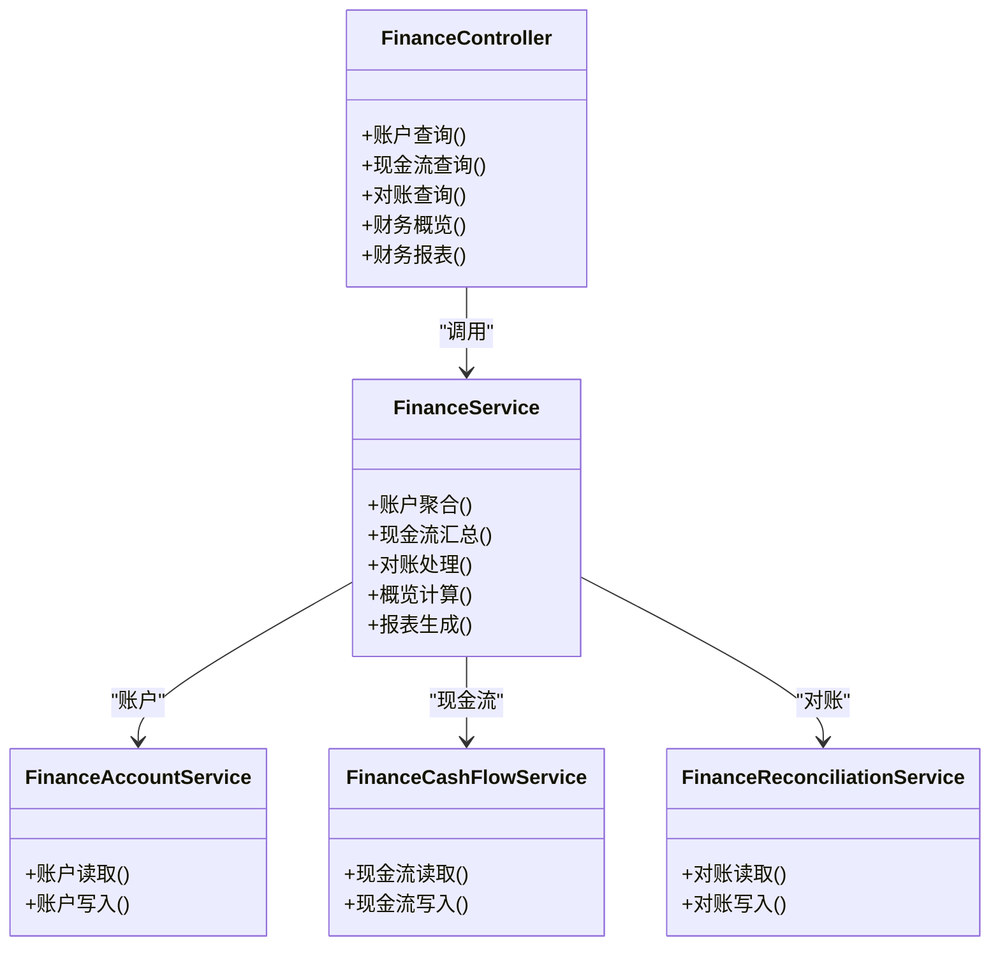

图表来源
- [src/purely-profit/finance/finance.controller.ts](file://src/purely-profit/finance/finance.controller.ts)
- [src/purely-profit/finance/finance.service.ts](file://src/purely-profit/finance/finance.service.ts)
- [src/purely-profit/finance/finance.types.ts](file://src/purely-profit/finance/finance.types.ts)
- [src/purely-profit/finance/finance-account.service.ts](file://src/purely-profit/finance/finance-account.service.ts)
- [src/purely-profit/finance/finance-cash-flow.service.ts](file://src/purely-profit/finance/finance-cash-flow.service.ts)
- [src/purely-profit/finance/finance-reconciliation.service.ts](file://src/purely-profit/finance/finance-reconciliation.service.ts)

章节来源
- [src/purely-profit/finance/finance.controller.ts](file://src/purely-profit/finance/finance.controller.ts)
- [src/purely-profit/finance/finance.service.ts](file://src/purely-profit/finance/finance.service.ts)
- [src/purely-profit/finance/finance.types.ts](file://src/purely-profit/finance/finance.types.ts)
- [src/purely-profit/finance/finance-account.service.ts](file://src/purely-profit/finance/finance-account.service.ts)
- [src/purely-profit/finance/finance-cash-flow.service.ts](file://src/purely-profit/finance/finance-cash-flow.service.ts)
- [src/purely-profit/finance/finance-reconciliation.service.ts](file://src/purely-profit/finance/finance-reconciliation.service.ts)

### 营销推广（Marketing）
- 职责：客户、促销、产品、交易流水与积分记录。
- 关键类型：营销查询、客户、促销、产品、交易与积分记录类型。
- 控制器：提供客户、促销、产品、交易与积分记录的查询接口。
- 服务：封装客户、促销、产品、交易与积分记录的读写与统计。

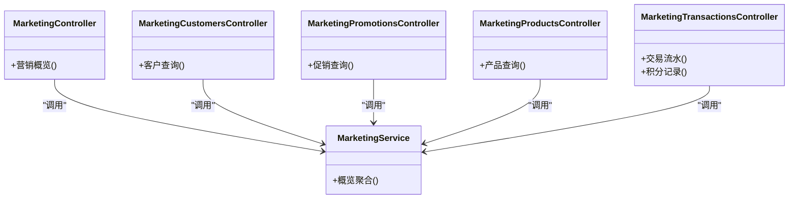

图表来源
- [src/purely-profit/marketing/marketing.controller.ts](file://src/purely-profit/marketing/marketing.controller.ts)
- [src/purely-profit/marketing/marketing.service.ts](file://src/purely-profit/marketing/marketing.service.ts)
- [src/purely-profit/marketing/marketing.types.ts](file://src/purely-profit/marketing/marketing.types.ts)
- [src/purely-profit/marketing/marketing-customers.controller.ts](file://src/purely-profit/marketing/marketing-customers.controller.ts)
- [src/purely-profit/marketing/marketing-promotions.controller.ts](file://src/purely-profit/marketing/marketing-promotions.controller.ts)
- [src/purely-profit/marketing/marketing-products.controller.ts](file://src/purely-profit/marketing/marketing-products.controller.ts)
- [src/purely-profit/marketing/marketing-transactions.controller.ts](file://src/purely-profit/marketing/marketing-transactions.controller.ts)

章节来源
- [src/purely-profit/marketing/marketing.controller.ts](file://src/purely-profit/marketing/marketing.controller.ts)
- [src/purely-profit/marketing/marketing.service.ts](file://src/purely-profit/marketing/marketing.service.ts)
- [src/purely-profit/marketing/marketing.types.ts](file://src/purely-profit/marketing/marketing.types.ts)
- [src/purely-profit/marketing/marketing-customers.controller.ts](file://src/purely-profit/marketing/marketing-customers.controller.ts)
- [src/purely-profit/marketing/marketing-promotions.controller.ts](file://src/purely-profit/marketing/marketing-promotions.controller.ts)
- [src/purely-profit/marketing/marketing-products.controller.ts](file://src/purely-profit/marketing/marketing-products.controller.ts)
- [src/purely-profit/marketing/marketing-transactions.controller.ts](file://src/purely-profit/marketing/marketing-transactions.controller.ts)

### 运营管理（Operations/Sales/Purchases/Costs/Spaces/Handover）
- 职责：销售订单、采购、成本、空间预约与交接。
- 关键类型：销售、采购、成本、空间、交接类型。
- 控制器：提供销售、采购、成本、空间、交接的查询与操作接口。
- 服务：封装销售、采购、成本、空间、交接的读写与统计。

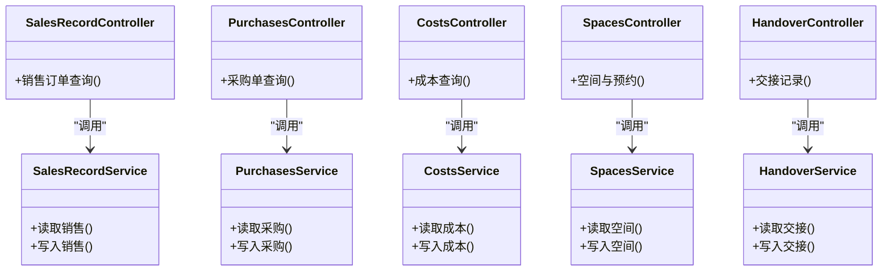

图表来源
- [src/purely-profit/operations/sales-record/sales-record.controller.ts](file://src/purely-profit/operations/sales-record/sales-record.controller.ts)
- [src/purely-profit/operations/sales-record/sales-record.service.ts](file://src/purely-profit/operations/sales-record/sales-record.service.ts)
- [src/purely-profit/operations/sales-record/sales-record.types.ts](file://src/purely-profit/operations/sales-record/sales-record.types.ts)
- [src/purely-profit/operations/purchases/purchases.controller.ts](file://src/purely-profit/operations/purchases/purchases.controller.ts)
- [src/purely-profit/operations/purchases/purchases.service.ts](file://src/purely-profit/operations/purchases/purchases.service.ts)
- [src/purely-profit/operations/purchases/purchases.types.ts](file://src/purely-profit/operations/purchases/purchases.types.ts)
- [src/purely-profit/operations/costs/costs.controller.ts](file://src/purely-profit/operations/costs/costs.controller.ts)
- [src/purely-profit/operations/costs/costs.service.ts](file://src/purely-profit/operations/costs/costs.service.ts)
- [src/purely-profit/operations/costs/costs.types.ts](file://src/purely-profit/operations/costs/costs.types.ts)
- [src/purely-profit/operations/spaces/spaces.controller.ts](file://src/purely-profit/operations/spaces/spaces.controller.ts)
- [src/purely-profit/operations/spaces/spaces.service.ts](file://src/purely-profit/operations/spaces/spaces.service.ts)
- [src/purely-profit/operations/spaces/spaces.types.ts](file://src/purely-profit/operations/spaces/spaces.types.ts)
- [src/purely-profit/operations/handover/handover.controller.ts](file://src/purely-profit/operations/handover/handover.controller.ts)
- [src/purely-profit/operations/handover/handover.service.ts](file://src/purely-profit/operations/handover/handover.service.ts)
- [src/purely-profit/operations/handover/handover.types.ts](file://src/purely-profit/operations/handover/handover.types.ts)

章节来源
- [src/purely-profit/operations/sales-record/sales-record.controller.ts](file://src/purely-profit/operations/sales-record/sales-record.controller.ts)
- [src/purely-profit/operations/sales-record/sales-record.service.ts](file://src/purely-profit/operations/sales-record/sales-record.service.ts)
- [src/purely-profit/operations/sales-record/sales-record.types.ts](file://src/purely-profit/operations/sales-record/sales-record.types.ts)
- [src/purely-profit/operations/purchases/purchases.controller.ts](file://src/purely-profit/operations/purchases/purchases.controller.ts)
- [src/purely-profit/operations/purchases/purchases.service.ts](file://src/purely-profit/operations/purchases/purchases.service.ts)
- [src/purely-profit/operations/purchases/purchases.types.ts](file://src/purely-profit/operations/purchases/purchases.types.ts)
- [src/purely-profit/operations/costs/costs.controller.ts](file://src/purely-profit/operations/costs/costs.controller.ts)
- [src/purely-profit/operations/costs/costs.service.ts](file://src/purely-profit/operations/costs/costs.service.ts)
- [src/purely-profit/operations/costs/costs.types.ts](file://src/purely-profit/operations/costs/costs.types.ts)
- [src/purely-profit/operations/spaces/spaces.controller.ts](file://src/purely-profit/operations/spaces/spaces.controller.ts)
- [src/purely-profit/operations/spaces/spaces.service.ts](file://src/purely-profit/operations/spaces/spaces.service.ts)
- [src/purely-profit/operations/spaces/spaces.types.ts](file://src/purely-profit/operations/spaces/spaces.types.ts)
- [src/purely-profit/operations/handover/handover.controller.ts](file://src/purely-profit/operations/handover/handover.controller.ts)
- [src/purely-profit/operations/handover/handover.service.ts](file://src/purely-profit/operations/handover/handover.service.ts)
- [src/purely-profit/operations/handover/handover.types.ts](file://src/purely-profit/operations/handover/handover.types.ts)

### 订阅与通知（Subscriptions/Notifications）
- 职责：订阅中心与运营通知。
- 关键类型：订阅查询、通知查询与类型。
- 控制器：提供订阅与通知的查询接口。
- 服务：封装订阅与通知的读取与推送。

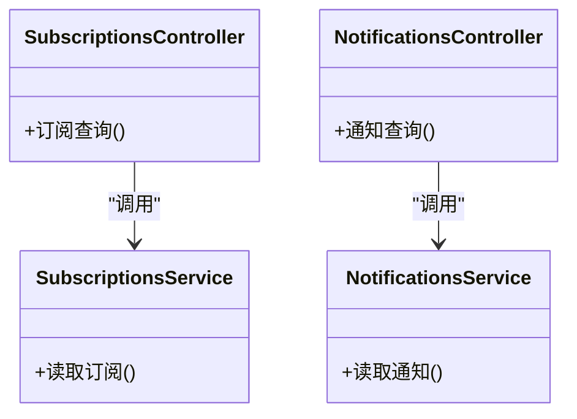

图表来源
- [src/purely-profit/subscriptions/subscriptions.controller.ts](file://src/purely-profit/subscriptions/subscriptions.controller.ts)
- [src/purely-profit/subscriptions/subscriptions.service.ts](file://src/purely-profit/subscriptions/subscriptions.service.ts)
- [src/purely-profit/subscriptions/subscriptions.types.ts](file://src/purely-profit/subscriptions/subscriptions.types.ts)
- [src/purely-profit/notifications/notifications.controller.ts](file://src/purely-profit/notifications/notifications.controller.ts)
- [src/purely-profit/notifications/notifications.service.ts](file://src/purely-profit/notifications/notifications.service.ts)
- [src/purely-profit/notifications/notifications.types.ts](file://src/purely-profit/notifications/notifications.types.ts)

章节来源
- [src/purely-profit/subscriptions/subscriptions.controller.ts](file://src/purely-profit/subscriptions/subscriptions.controller.ts)
- [src/purely-profit/subscriptions/subscriptions.service.ts](file://src/purely-profit/subscriptions/subscriptions.service.ts)
- [src/purely-profit/subscriptions/subscriptions.types.ts](file://src/purely-profit/subscriptions/subscriptions.types.ts)
- [src/purely-profit/notifications/notifications.controller.ts](file://src/purely-profit/notifications/notifications.controller.ts)
- [src/purely-profit/notifications/notifications.service.ts](file://src/purely-profit/notifications/notifications.service.ts)
- [src/purely-profit/notifications/notifications.types.ts](file://src/purely-profit/notifications/notifications.types.ts)

### 数据看板（Dashboard）
- 职责：首页概览、经营分析、利润明细。
- 关键类型：看板查询、统计与类型。
- 控制器：提供首页概览、经营分析、利润明细的查询接口。
- 服务：封装统计聚合与趋势分析。

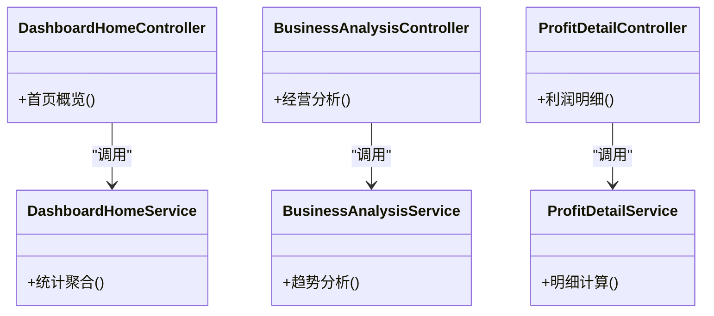

图表来源
- [src/purely-profit/dashboard/dashboard-home/dashboard-home.controller.ts](file://src/purely-profit/dashboard/dashboard-home/dashboard-home.controller.ts)
- [src/purely-profit/dashboard/dashboard-home/dashboard-home.service.ts](file://src/purely-profit/dashboard/dashboard-home/dashboard-home.service.ts)
- [src/purely-profit/dashboard/dashboard-home/dashboard-home.types.ts](file://src/purely-profit/dashboard/dashboard-home/dashboard-home.types.ts)
- [src/purely-profit/dashboard/business-analysis/business-analysis.controller.ts](file://src/purely-profit/dashboard/business-analysis/business-analysis.controller.ts)
- [src/purely-profit/dashboard/business-analysis/business-analysis.service.ts](file://src/purely-profit/dashboard/business-analysis/business-analysis.service.ts)
- [src/purely-profit/dashboard/business-analysis/business-analysis.types.ts](file://src/purely-profit/dashboard/business-analysis/business-analysis.types.ts)
- [src/purely-profit/dashboard/profit-detail/profit-detail.controller.ts](file://src/purely-profit/dashboard/profit-detail/profit-detail.controller.ts)
- [src/purely-profit/dashboard/profit-detail/profit-detail.service.ts](file://src/purely-profit/dashboard/profit-detail/profit-detail.service.ts)
- [src/purely-profit/dashboard/profit-detail/profit-detail.types.ts](file://src/purely-profit/dashboard/profit-detail/profit-detail.types.ts)

章节来源
- [src/purely-profit/dashboard/dashboard-home/dashboard-home.controller.ts](file://src/purely-profit/dashboard/dashboard-home/dashboard-home.controller.ts)
- [src/purely-profit/dashboard/dashboard-home/dashboard-home.service.ts](file://src/purely-profit/dashboard/dashboard-home/dashboard-home.service.ts)
- [src/purely-profit/dashboard/dashboard-home/dashboard-home.types.ts](file://src/purely-profit/dashboard/dashboard-home/dashboard-home.types.ts)
- [src/purely-profit/dashboard/business-analysis/business-analysis.controller.ts](file://src/purely-profit/dashboard/business-analysis/business-analysis.controller.ts)
- [src/purely-profit/dashboard/business-analysis/business-analysis.service.ts](file://src/purely-profit/dashboard/business-analysis/business-analysis.service.ts)
- [src/purely-profit/dashboard/business-analysis/business-analysis.types.ts](file://src/purely-profit/dashboard/business-analysis/business-analysis.types.ts)
- [src/purely-profit/dashboard/profit-detail/profit-detail.controller.ts](file://src/purely-profit/dashboard/profit-detail/profit-detail.controller.ts)
- [src/purely-profit/dashboard/profit-detail/profit-detail.service.ts](file://src/purely-profit/dashboard/profit-detail/profit-detail.service.ts)
- [src/purely-profit/dashboard/profit-detail/profit-detail.types.ts](file://src/purely-profit/dashboard/profit-detail/profit-detail.types.ts)

### 认证与权限（Auth/Access-Control）
- 职责：用户认证、权限校验、JWT 鉴权与装饰器。
- 关键类型：登录/注册 DTO、权限守卫与装饰器。
- 控制器：提供登录、注册、修改密码、获取资料等接口。
- 服务：封装鉴权、能力计算与权限判定。

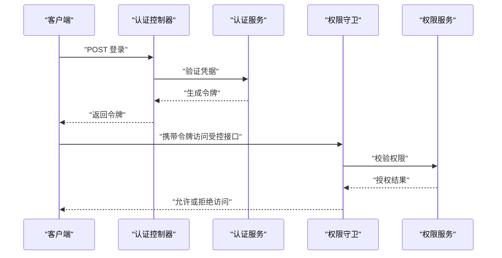

图表来源
- [src/purely-profit/auth/auth.controller.ts](file://src/purely-profit/auth/auth.controller.ts)
- [src/purely-profit/auth/auth.service.ts](file://src/purely-profit/auth/auth.service.ts)
- [src/purely-profit/auth/guards/jwt-auth.guard.ts](file://src/purely-profit/auth/guards/jwt-auth.guard.ts)
- [src/purely-profit/auth/strategies/jwt.strategy.ts](file://src/purely-profit/auth/strategies/jwt.strategy.ts)
- [src/purely-profit/access-control/guards/permissions.guard.ts](file://src/purely-profit/access-control/guards/permissions.guard.ts)
- [src/purely-profit/access-control/access-control.service.ts](file://src/purely-profit/access-control/access-control.service.ts)
- [src/purely-profit/access-control/subject-capability.service.ts](file://src/purely-profit/access-control/subject-capability.service.ts)
- [src/purely-profit/access-control/decorators/require-permissions.decorator.ts](file://src/purely-profit/access-control/decorators/require-permissions.decorator.ts)

章节来源
- [src/purely-profit/auth/auth.controller.ts](file://src/purely-profit/auth/auth.controller.ts)
- [src/purely-profit/auth/auth.service.ts](file://src/purely-profit/auth/auth.service.ts)
- [src/purely-profit/auth/dto/login.dto.ts](file://src/purely-profit/auth/dto/login.dto.ts)
- [src/purely-profit/auth/dto/register.dto.ts](file://src/purely-profit/auth/dto/register.dto.ts)
- [src/purely-profit/auth/dto/profile-response.dto.ts](file://src/purely-profit/auth/dto/profile-response.dto.ts)
- [src/purely-profit/auth/guards/jwt-auth.guard.ts](file://src/purely-profit/auth/guards/jwt-auth.guard.ts)
- [src/purely-profit/auth/strategies/jwt.strategy.ts](file://src/purely-profit/auth/strategies/jwt.strategy.ts)
- [src/purely-profit/access-control/access-control.service.ts](file://src/purely-profit/access-control/access-control.service.ts)
- [src/purely-profit/access-control/subject-capability.service.ts](file://src/purely-profit/access-control/subject-capability.service.ts)
- [src/purely-profit/access-control/decorators/require-permissions.decorator.ts](file://src/purely-profit/access-control/decorators/require-permissions.decorator.ts)
- [src/purely-profit/access-control/guards/permissions.guard.ts](file://src/purely-profit/access-control/guards/permissions.guard.ts)

## 依赖分析
- 模块耦合：各业务域模块相对独立，通过 App 平台聚合；认证与权限模块被所有业务域依赖。
- 外部依赖：Prisma Schema 与迁移脚本定义了数据库模型与演进路径；Redis 缓存与预热服务用于性能优化。
- 数据一致性：销售订单与财务、库存关联，通过迁移脚本建立约束；建议在服务层补充幂等与事务保障。

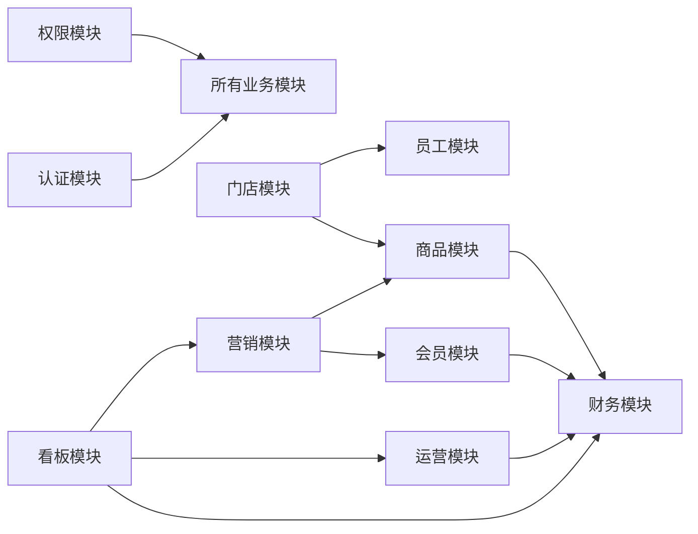

图表来源
- [src/app.module.ts](file://src/app.module.ts)
- [src/purely-profit/auth/auth.module.ts](file://src/purely-profit/auth/auth.module.ts)
- [src/purely-profit/access-control/access-control.module.ts](file://src/purely-profit/access-control/access-control.module.ts)
- [src/purely-profit/stores/stores.module.ts](file://src/purely-profit/stores/stores.module.ts)
- [src/purely-profit/staff/staff.module.ts](file://src/purely-profit/staff/staff.module.ts)
- [src/purely-profit/member/member.module.ts](file://src/purely-profit/member/member.module.ts)
- [src/purely-profit/goods/goods.module.ts](file://src/purely-profit/goods/goods.module.ts)
- [src/purely-profit/finance/finance.module.ts](file://src/purely-profit/finance/finance.module.ts)
- [src/purely-profit/marketing/marketing.module.ts](file://src/purely-profit/marketing/marketing.module.ts)
- [src/purely-profit/operations/operations.module.ts](file://src/purely-profit/operations/operations.module.ts)
- [src/purely-profit/dashboard/dashboard.module.ts](file://src/purely-profit/dashboard/dashboard.module.ts)

章节来源
- [src/app.module.ts](file://src/app.module.ts)

## 性能考虑
- 查询优化：使用分页与索引，避免 N+1 查询；对高频查询引入缓存预热。
- 写入优化：批量写入与事务合并，减少数据库往返；对大字段使用延迟加载。
- 缓存策略：热点数据使用 Redis 缓存，结合失效策略与一致性保证。
- 监控与告警：结合运行时指标与摘要指标，监控慢查询与异常峰值。

## 故障排查指南
- 认证失败：检查 JWT 签发与校验配置，确认令牌未过期；查看权限守卫是否正确注入。
- 权限不足：核对主体能力与所需权限映射，确认装饰器与守卫生效。
- 数据不一致：检查销售订单与财务、库存的关联逻辑，确保迁移脚本已执行。
- 查询性能差：审查查询条件与索引，确认分页参数合理；评估缓存命中率。

章节来源
- [src/purely-profit/auth/guards/jwt-auth.guard.ts](file://src/purely-profit/auth/guards/jwt-auth.guard.ts)
- [src/purely-profit/access-control/guards/permissions.guard.ts](file://src/purely-profit/access-control/guards/permissions.guard.ts)
- [src/purely-profit/access-control/decorators/require-permissions.decorator.ts](file://src/purely-profit/access-control/decorators/require-permissions.decorator.ts)

## 结论
purelyprofit-server 以模块化与领域驱动为核心，围绕门店、员工、会员、商品、财务、营销、运营等业务域构建清晰边界与职责分工。通过认证与权限统一治理、DTO 与服务分层、以及 Prisma 的数据模型与迁移机制，系统具备良好的可维护性与扩展性。建议在后续迭代中强化事务与一致性保障、完善缓存与监控策略，并持续细化各模块的 API 文档与测试覆盖。

## 附录
- 数据模型与迁移：参考 Prisma Schema 与迁移脚本，理解实体关系与演进路径。
- 实际使用场景：结合控制器与服务方法，按需组合接口完成业务闭环；注意权限与数据范围控制。

章节来源
- [prisma/schema.prisma](file://prisma/schema.prisma)
- [prisma/migrations/20260512110000_add_stores/migration.sql](file://prisma/migrations/20260512110000_add_stores/migration.sql)
- [prisma/migrations/20260512113000_add_staffs/migration.sql](file://prisma/migrations/20260512113000_add_staffs/migration.sql)
- [prisma/migrations/20260513170000_add_members/migration.sql](file://prisma/migrations/20260513170000_add_members/migration.sql)
- [prisma/migrations/20260514153000_add_store_partners_and_withdrawals/migration.sql](file://prisma/migrations/20260514153000_add_store_partners_and_withdrawals/migration.sql)
- [prisma/migrations/20260514210000_add_commerce_inventory/migration.sql](file://prisma/migrations/20260514210000_add_commerce_inventory/migration.sql)
- [prisma/migrations/20260514213000_add_finance_management/migration.sql](file://prisma/migrations/20260514213000_add_finance_management/migration.sql)
- [prisma/migrations/20260514223000_add_business_analysis_sales_orders/migration.sql](file://prisma/migrations/20260514223000_add_business_analysis_sales_orders/migration.sql)
- [prisma/migrations/20260514234000_add_cost_management/migration.sql](file://prisma/migrations/20260514234000_add_cost_management/migration.sql)
- [prisma/migrations/20260515001000_link_sales_orders_to_finance_and_inventory/migration.sql](file://prisma/migrations/20260515001000_link_sales_orders_to_finance_and_inventory/migration.sql)
- [prisma/migrations/20260515013000_add_space_management_and_reservations/migration.sql](file://prisma/migrations/20260515013000_add_space_management_and_reservations/migration.sql)
- [prisma/migrations/20260515110000_expand_platform_membership_center/migration.sql](file://prisma/migrations/20260515110000_expand_platform_membership_center/migration.sql)
- [prisma/migrations/20260515123000_add_partner_application_history/migration.sql](file://prisma/migrations/20260515123000_add_partner_application_history/migration.sql)
- [prisma/migrations/20260515133000_add_marketing_points_records/migration.sql](file://prisma/migrations/20260515133000_add_marketing_points_records/migration.sql)
- [prisma/migrations/20260523120000_add_membership_plan_settings/migration.sql](file://prisma/migrations/20260523120000_add_membership_plan_settings/migration.sql)
- [prisma/migrations/20260523170000_add_lifetime_membership_cycle/migration.sql](file://prisma/migrations/20260523170000_add_lifetime_membership_cycle/migration.sql)
- [prisma/migrations/20260529120000_support_multiple_store_partners/migration.sql](file://prisma/migrations/20260529120000_support_multiple_store_partners/migration.sql)
- [prisma/migrations/20260530123935_sync_sub_account_schema/migration.sql](file://prisma/migrations/20260530123935_sync_sub_account_schema/migration.sql)
- [prisma/migrations/20260601120000_add_manager_sub_account_role/migration.sql](file://prisma/migrations/20260601120000_add_manager_sub_account_role/migration.sql)
- [prisma/migrations/20260601143000_add_handover_additional_items/migration.sql](file://prisma/migrations/20260601143000_add_handover_additional_items/migration.sql)
- [prisma/migrations/20260601170000_add_employee_shift_definitions/migration.sql](file://prisma/migrations/20260601170000_add_employee_shift_definitions/migration.sql)
- [prisma/migrations/20260605183000_add_handover_record_shift_snapshots/migration.sql](file://prisma/migrations/20260605183000_add_handover_record_shift_snapshots/migration.sql)
- [prisma/migrations/20260606123000_add_marketing_products/migration.sql](file://prisma/migrations/20260606123000_add_marketing_products/migration.sql)