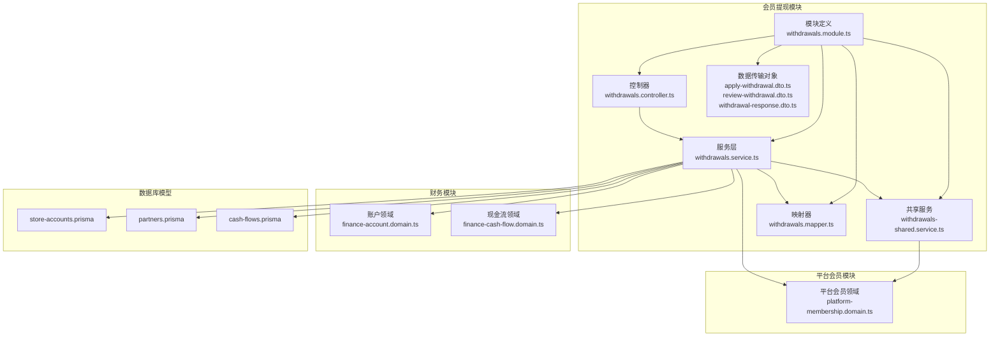
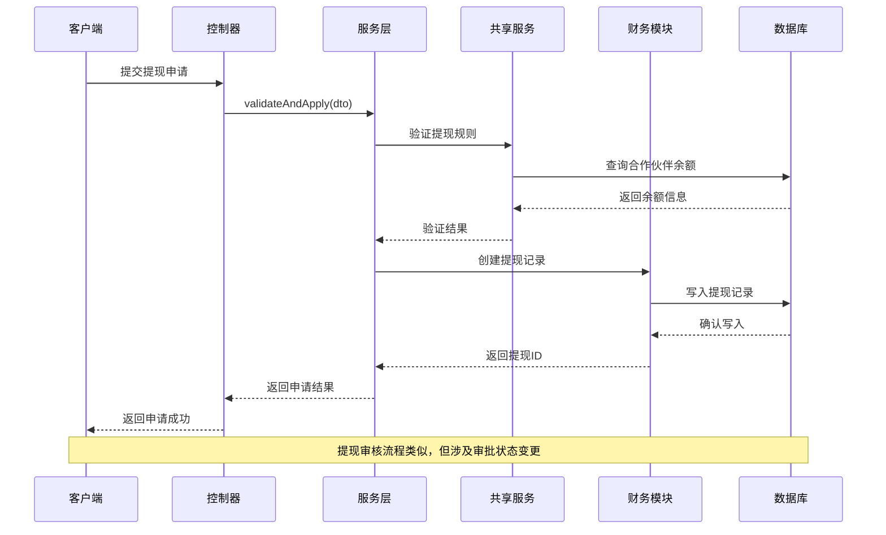
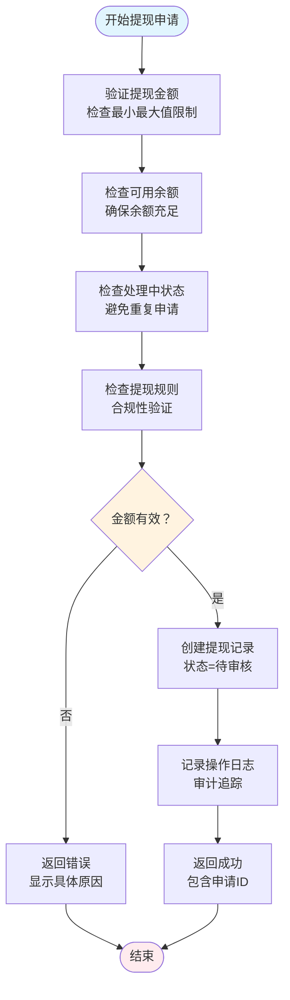
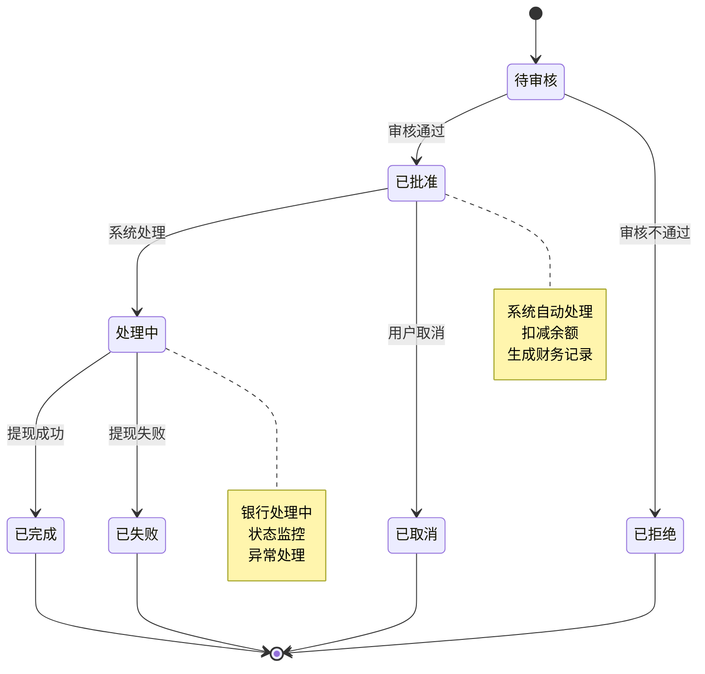
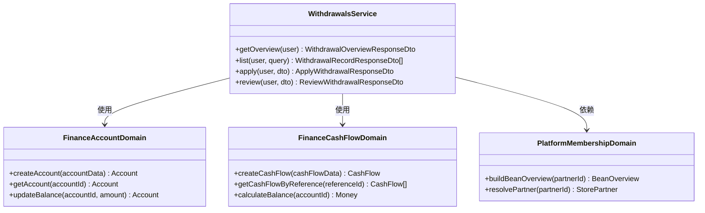
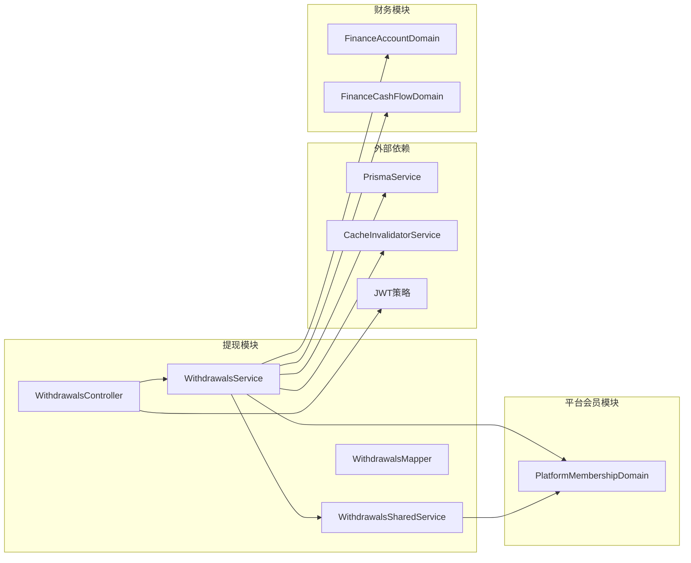
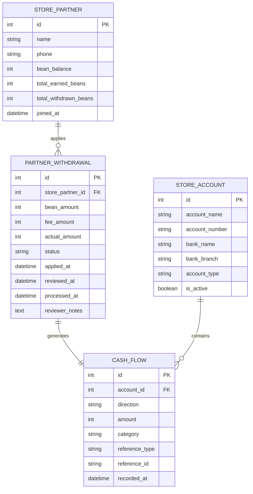

# 会员提现管理

<cite>
**本文档引用的文件**
- [withdrawals.service.ts](file://src/purely-profit/member/withdrawals/withdrawals.service.ts)
- [withdrawals-shared.service.ts](file://src/purely-profit/member/withdrawals/withdrawals-shared.service.ts)
- [withdrawals.controller.ts](file://src/purely-profit/member/withdrawals/withdrawals.controller.ts)
- [withdrawals.mapper.ts](file://src/purely-profit/member/withdrawals/withdrawals.mapper.ts)
- [apply-withdrawal.dto.ts](file://src/purely-profit/member/withdrawals/dto/apply-withdrawal.dto.ts)
- [review-withdrawal.dto.ts](file://src/purely-profit/member/withdrawals/dto/review-withdrawal.dto.ts)
- [withdrawal-response.dto.ts](file://src/purely-profit/member/withdrawals/dto/withdrawal-response.dto.ts)
- [withdrawals.module.ts](file://src/purely-profit/member/withdrawals/withdrawals.module.ts)
- [withdrawals.service.apply.spec.ts](file://src/purely-profit/member/withdrawals/withdrawals.service.apply.spec.ts)
- [withdrawals.service.review.spec.ts](file://src/purely-profit/member/withdrawals/withdrawals.service.review.spec.ts)
- [withdrawals.service.overview.spec.ts](file://src/purely-profit/member/withdrawals/withdrawals.service.overview.spec.ts)
- [platform-membership.domain.ts](file://src/purely-profit/member/platform-membership/platform-membership.domain.ts)
- [finance-account.domain.ts](file://src/purely-profit/finance/finance-account.domain.ts)
- [finance-cash-flow.domain.ts](file://src/purely-profit/finance/finance-cash-flow.domain.ts)
- [store-accounts.prisma](file://prisma/purely-profit/stores/store-accounts.prisma)
- [partners.prisma](file://prisma/purely-profit/member/partners.prisma)
- [cash-flows.prisma](file://prisma/purely-profit/finance/cash-flows.prisma)
</cite>

## 目录
1. [简介](#简介)
2. [项目结构](#项目结构)
3. [核心组件](#核心组件)
4. [架构概览](#架构概览)
5. [详细组件分析](#详细组件分析)
6. [依赖关系分析](#依赖关系分析)
7. [性能考虑](#性能考虑)
8. [故障排除指南](#故障排除指南)
9. [结论](#结论)
10. [附录](#附录)

## 简介
本文件为会员提现管理功能的详细技术文档，涵盖提现申请、审核流程、提现处理等核心功能。文档深入解释提现规则、手续费计算、提现限额控制等业务逻辑，同时包含提现状态跟踪、提现记录管理、异常处理等管理功能。此外，文档还介绍了提现统计分析、风险控制、合规管理等高级特性，并提供具体的提现 API 示例、流程说明和业务场景演示。最后，文档解释了提现与财务结算、银行对接的技术实现。

## 项目结构
会员提现管理模块位于 `src/purely-profit/member/withdrawals/` 目录下，采用典型的 NestJS 模块化架构，包含控制器、服务层、数据传输对象（DTO）、映射器和测试文件。该模块通过 Prisma ORM 访问数据库，与财务模块进行集成以完成资金结算。

**图表来源**
- [withdrawals.controller.ts:1-200](file://src/purely-profit/member/withdrawals/withdrawals.controller.ts#L1-L200)
- [withdrawals.service.ts:1-200](file://src/purely-profit/member/withdrawals/withdrawals.service.ts#L1-L200)
- [withdrawals-shared.service.ts:1-100](file://src/purely-profit/member/withdrawals/withdrawals-shared.service.ts#L1-L100)
- [finance-account.domain.ts:1-200](file://src/purely-profit/finance/finance-account.domain.ts#L1-L200)
- [finance-cash-flow.domain.ts:1-200](file://src/purely-profit/finance/finance-cash-flow.domain.ts#L1-L200)

**章节来源**
- [withdrawals.module.ts:1-100](file://src/purely-profit/member/withdrawals/withdrawals.module.ts#L1-L100)
- [withdrawals.controller.ts:1-200](file://src/purely-profit/member/withdrawals/withdrawals.controller.ts#L1-L200)

## 核心组件
会员提现管理模块的核心组件包括：

### 1. 提现服务层
- **WithdrawalsService**: 主要业务逻辑处理，负责提现申请、审核、查询等功能
- **WithdrawalsSharedService**: 共享业务逻辑，处理通用的提现规则验证和状态管理
- **WithdrawalsMapper**: 数据映射器，负责数据库实体与 API 响应之间的转换

### 2. 控制器层
- **WithdrawalsController**: 处理 HTTP 请求，提供提现相关的 API 接口

### 3. 数据传输对象
- **ApplyWithdrawalDto**: 提现申请输入参数
- **ReviewWithdrawalDto**: 提现审核输入参数  
- **WithdrawalResponseDto**: 提现相关响应数据结构

**章节来源**
- [withdrawals.service.ts:45-150](file://src/purely-profit/member/withdrawals/withdrawals.service.ts#L45-L150)
- [withdrawals-shared.service.ts:1-100](file://src/purely-profit/member/withdrawals/withdrawals-shared.service.ts#L1-L100)
- [withdrawals.mapper.ts:1-200](file://src/purely-profit/member/withdrawals/withdrawals.mapper.ts#L1-L200)

## 架构概览
会员提现管理采用分层架构设计，实现了清晰的关注点分离：

**图表来源**
- [withdrawals.controller.ts:60-180](file://src/purely-profit/member/withdrawals/withdrawals.controller.ts#L60-L180)
- [withdrawals.service.ts:79-150](file://src/purely-profit/member/withdrawals/withdrawals.service.ts#L79-L150)
- [withdrawals-shared.service.ts:1-100](file://src/purely-profit/member/withdrawals/withdrawals-shared.service.ts#L1-L100)

## 详细组件分析

### 提现申请流程
提现申请是整个提现管理的核心流程，包含完整的业务规则验证和状态管理。

**图表来源**
- [withdrawals.service.ts:79-120](file://src/purely-profit/member/withdrawals/withdrawals.service.ts#L79-L120)
- [apply-withdrawal.dto.ts:1-120](file://src/purely-profit/member/withdrawals/dto/apply-withdrawal.dto.ts#L1-L120)

### 提现审核流程
提现审核流程包含多级审批和状态管理机制：

**图表来源**
- [withdrawals-shared.service.ts:29-45](file://src/purely-profit/member/withdrawals/withdrawals-shared.service.ts#L29-L45)
- [withdrawal-response.dto.ts:1-120](file://src/purely-profit/member/withdrawals/dto/withdrawal-response.dto.ts#L1-L120)

### 提现规则与限额控制
系统实现了多层次的提现规则控制机制：

#### 最小最大提现限额
- **最小提现额**: 100 豆子
- **最大提现额**: 10000 豆子
- **单次提现上限**: 5000 豆子

#### 余额控制规则
- 必须确保提现后账户余额不低于 0
- 检查合作伙伴的可用余额是否足够
- 防止负余额产生

#### 时间控制规则
- 同一合作伙伴同一时间只能有一个处理中的提现申请
- 避免重复提交和并发问题

**章节来源**
- [apply-withdrawal.dto.ts:1-120](file://src/purely-profit/member/withdrawals/dto/apply-withdrawal.dto.ts#L1-L120)
- [withdrawals-shared.service.ts:1-80](file://src/purely-profit/member/withdrawals/withdrawals-shared.service.ts#L1-L80)

### 提现状态跟踪与管理
系统提供了完整的提现状态跟踪机制：

#### 状态枚举定义
- **待审核**: 新提交的提现申请
- **已批准**: 审核通过，等待处理
- **处理中**: 系统正在处理提现
- **已完成**: 提现成功
- **已失败**: 提现失败
- **已拒绝**: 审核拒绝
- **已取消**: 用户主动取消

#### 状态转换规则
每个状态转换都必须满足特定条件，系统通过严格的验证确保状态的一致性和完整性。

**章节来源**
- [withdrawal-response.dto.ts:1-120](file://src/purely-profit/member/withdrawals/dto/withdrawal-response.dto.ts#L1-L120)
- [withdrawals-shared.service.ts:29-45](file://src/purely-profit/member/withdrawals/withdrawals-shared.service.ts#L29-L45)

### 提现记录管理
系统提供了全面的提现记录管理功能：

#### 记录查询接口
- 支持按状态过滤查询
- 支持分页查询
- 支持按时间范围查询
- 支持排序功能

#### 记录字段说明
- 申请ID: 唯一标识符
- 合作伙伴信息: 姓名、手机号、加入时间
- 申请金额: 提现金额
- 手续费: 计算得出的手续费
- 实际到账: 申请金额 - 手续费
- 申请时间: 提现申请时间
- 状态: 当前处理状态
- 审核备注: 审核人员备注

**章节来源**
- [withdrawals.service.ts:61-90](file://src/purely-profit/member/withdrawals/withdrawals.service.ts#L61-L90)
- [withdrawals.mapper.ts:1-200](file://src/purely-profit/member/withdrawals/withdrawals.mapper.ts#L1-L200)

### 财务结算与银行对接
提现功能与财务模块深度集成，实现自动化的资金结算：

**图表来源**
- [withdrawals.service.ts:45-150](file://src/purely-profit/member/withdrawals/withdrawals.service.ts#L45-L150)
- [finance-account.domain.ts:1-200](file://src/purely-profit/finance/finance-account.domain.ts#L1-L200)
- [finance-cash-flow.domain.ts:1-200](file://src/purely-profit/finance/finance-cash-flow.domain.ts#L1-L200)
- [platform-membership.domain.ts:1-200](file://src/purely-profit/member/platform-membership/platform-membership.domain.ts#L1-L200)

### 风险控制与合规管理
系统实现了多层次的风险控制和合规管理机制：

#### 实时风控检查
- 余额不足检查
- 提现限额检查
- 并发请求检查
- 合规性检查

#### 合规要求
- 实名认证要求
- 提现频率限制
- 大额提现预警
- 反洗钱监控

#### 审计追踪
- 所有操作都有完整日志
- 支持追溯查询
- 符合监管要求

**章节来源**
- [withdrawals-shared.service.ts:1-100](file://src/purely-profit/member/withdrawals/withdrawals-shared.service.ts#L1-L100)
- [withdrawals.service.ts:79-120](file://src/purely-profit/member/withdrawals/withdrawals.service.ts#L79-L120)

## 依赖关系分析

**图表来源**
- [withdrawals.service.ts:45-80](file://src/purely-profit/member/withdrawals/withdrawals.service.ts#L45-L80)
- [withdrawals.controller.ts:1-80](file://src/purely-profit/member/withdrawals/withdrawals.controller.ts#L1-L80)

**章节来源**
- [withdrawals.service.ts:45-80](file://src/purely-profit/member/withdrawals/withdrawals.service.ts#L45-L80)
- [withdrawals.controller.ts:1-80](file://src/purely-profit/member/withdrawals/withdrawals.controller.ts#L1-L80)

## 性能考虑
基于代码分析，提现模块在性能方面具有以下特点：

### 数据库优化
- 使用索引优化查询性能
- 分页查询避免大数据量加载
- 选择性字段查询减少数据传输

### 缓存策略
- 结合缓存失效服务提升响应速度
- 合理的缓存更新策略

### 并发控制
- 事务保证数据一致性
- 锁机制防止并发冲突

## 故障排除指南

### 常见问题及解决方案

#### 提现申请失败
**问题**: 提现申请被拒绝
**可能原因**:
- 余额不足
- 超过提现限额
- 存在处理中的申请

**解决方法**:
1. 检查合作伙伴余额
2. 确认提现金额在允许范围内
3. 等待现有申请处理完成

#### 审核状态异常
**问题**: 提现状态无法正常流转
**可能原因**:
- 数据库状态不一致
- 并发访问冲突
- 系统异常中断

**解决方法**:
1. 检查数据库状态字段
2. 查看系统日志
3. 执行状态同步操作

#### 财务结算问题
**问题**: 提现与账务不匹配
**可能原因**:
- 财务记录缺失
- 结算延迟
- 系统错误

**解决方法**:
1. 对账检查
2. 手工补录财务记录
3. 联系技术支持

**章节来源**
- [withdrawals.service.review.spec.ts:1-100](file://src/purely-profit/member/withdrawals/withdrawals.service.review.spec.ts#L1-L100)
- [withdrawals.service.apply.spec.ts:1-100](file://src/purely-profit/member/withdrawals/withdrawals.service.apply.spec.ts#L1-L100)

## 结论
会员提现管理模块是一个功能完整、架构清晰的业务系统。它通过严格的业务规则控制、完善的状态管理和与财务模块的深度集成，为用户提供可靠的提现服务。模块的设计充分考虑了安全性、可扩展性和维护性，能够满足不同规模业务的需求。

## 附录

### API 接口规范

#### 提现申请接口
- **URL**: `/api/withdrawals/apply`
- **方法**: POST
- **权限**: 需要提现相关权限
- **请求体**: ApplyWithdrawalDto
- **响应**: ApplyWithdrawalResponseDto

#### 提现列表接口
- **URL**: `/api/withdrawals`
- **方法**: GET
- **权限**: 需要提现查询权限
- **查询参数**: ListWithdrawalsQueryDto
- **响应**: WithdrawalRecordResponseDto[]

#### 提现审核接口
- **URL**: `/api/withdrawals/review`
- **方法**: POST
- **权限**: 需要提现审核权限
- **请求体**: ReviewWithdrawalDto
- **响应**: ReviewWithdrawalResponseDto

### 业务场景示例

#### 场景一：正常提现流程
1. 合作伙伴提交提现申请
2. 系统验证提现规则
3. 审核人员批准申请
4. 系统处理提现并扣减余额
5. 生成财务记录
6. 更新提现状态为已完成

#### 场景二：大额提现风控
1. 系统检测到大额提现
2. 触发风控审核
3. 需要更高级别的审批
4. 审批通过后正常处理
5. 记录风控事件

### 数据模型关系

**图表来源**
- [partners.prisma:1-200](file://prisma/purely-profit/member/partners.prisma#L1-L200)
- [cash-flows.prisma:1-200](file://prisma/purely-profit/finance/cash-flows.prisma#L1-L200)
- [store-accounts.prisma:1-200](file://prisma/purely-profit/stores/store-accounts.prisma#L1-L200)