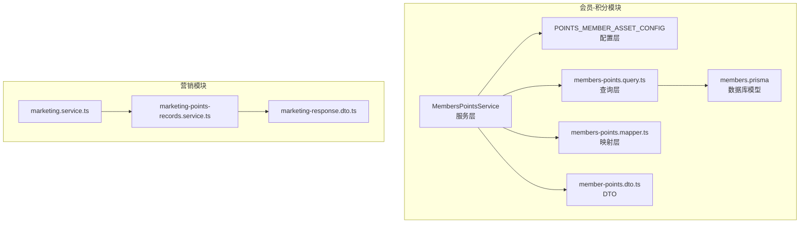
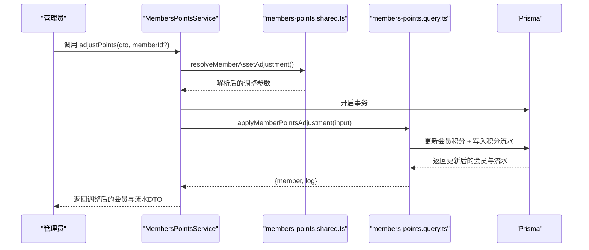
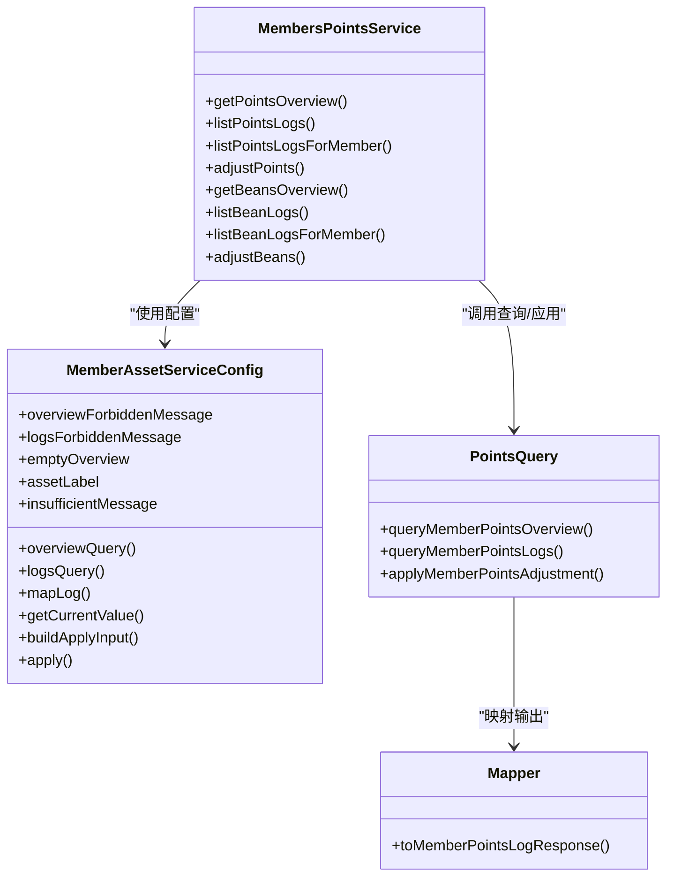
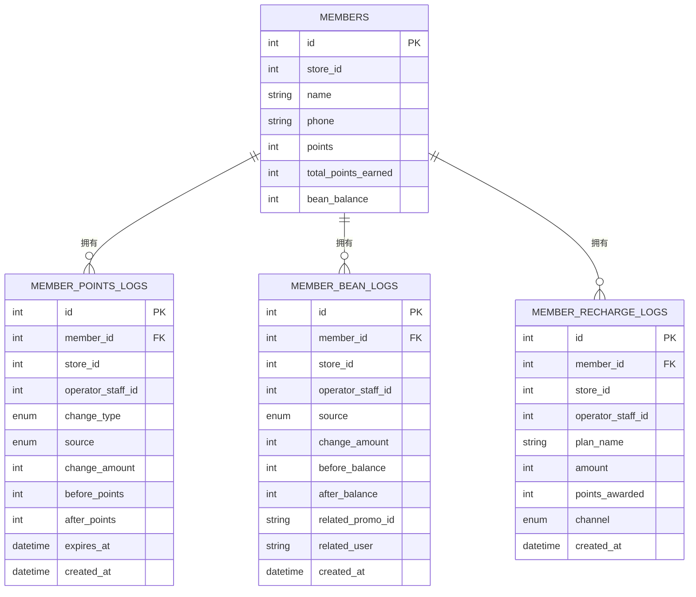
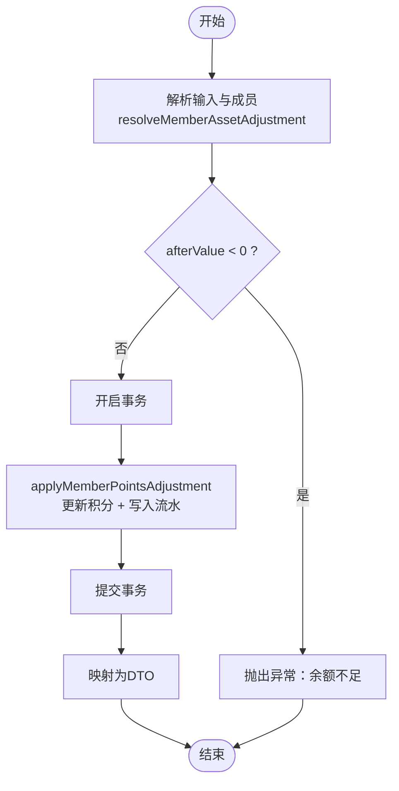

# 会员积分管理

<cite>
**本文引用的文件**
- [members-points.service.ts](file://src/purely-profit/member/members/members-points.service.ts)
- [members-points.config.ts](file://src/purely-profit/member/members/members-points.config.ts)
- [members-points.query.ts](file://src/purely-profit/member/members/members-points.query.ts)
- [members-points.mapper.ts](file://src/purely-profit/member/members/members-points.mapper.ts)
- [members-points.shared.ts](file://src/purely-profit/member/members/members-points.shared.ts)
- [member-points.dto.ts](file://src/purely-profit/member/members/dto/member-points.dto.ts)
- [members.prisma](file://prisma/purely-profit/member/members.prisma)
- [marketing-points-records.service.ts](file://src/purely-profit/marketing/marketing-points-records.service.ts)
- [marketing-response.dto.ts](file://src/purely-profit/marketing/dto/marketing-response.dto.ts)
- [marketing-consumption-query.dto.ts](file://src/purely-profit/marketing/dto/marketing-consumption-query.dto.ts)
- [marketing-recharge-query.dto.ts](file://src/purely-profit/marketing/dto/marketing-recharge-query.dto.ts)
- [marketing.service.ts](file://src/purely-profit/marketing/marketing.service.ts)
- [marketing.service.consumptions.spec.ts](file://src/purely-profit/marketing/marketing.service.consumptions.spec.ts)
- [marketing.service.recharges.spec.ts](file://src/purely-profit/marketing/marketing.service.recharges.spec.ts)
- [marketing.service.points-records.spec.ts](file://src/purely-profit/marketing/marketing.service.points-records.spec.ts)
</cite>

## 目录
1. [简介](#简介)
2. [项目结构](#项目结构)
3. [核心组件](#核心组件)
4. [架构总览](#架构总览)
5. [详细组件分析](#详细组件分析)
6. [依赖关系分析](#依赖关系分析)
7. [性能考量](#性能考量)
8. [故障排查指南](#故障排查指南)
9. [结论](#结论)
10. [附录](#附录)

## 简介
本文件面向“会员积分管理”功能，系统性阐述积分获取规则、使用与扣减、兑换与转移、有效期管理、流水记录与统计分析、异常处理、政策配置与活动联动等完整业务闭环。文档基于实际代码实现进行解读，提供可操作的API示例路径、计算逻辑说明与业务场景演示，并解释积分与营销活动、商品兑换的联动机制。

## 项目结构
积分管理模块位于会员子系统中，采用“服务层 + 配置层 + 查询层 + 映射层 + DTO + 数据库模型”的分层设计，支持通用资产（积分/纯利豆）管理能力，通过统一的服务配置适配不同资产类型。

图表来源
- [members-points.service.ts:42-328](file://src/purely-profit/member/members/members-points.service.ts#L42-L328)
- [members-points.config.ts:34-71](file://src/purely-profit/member/members/members-points.config.ts#L34-L71)
- [members-points.query.ts:176-250](file://src/purely-profit/member/members/members-points.query.ts#L176-L250)
- [members-points.mapper.ts:68-88](file://src/purely-profit/member/members/members-points.mapper.ts#L68-L88)
- [member-points.dto.ts:37-88](file://src/purely-profit/member/members/dto/member-points.dto.ts#L37-L88)
- [members.prisma:40-102](file://prisma/purely-profit/member/members.prisma#L40-L102)
- [marketing.service.ts](file://src/purely-profit/marketing/marketing.service.ts)
- [marketing-points-records.service.ts](file://src/purely-profit/marketing/marketing-points-records.service.ts)
- [marketing-response.dto.ts:62-71](file://src/purely-profit/marketing/dto/marketing-response.dto.ts#L62-L71)

章节来源
- [members-points.service.ts:42-328](file://src/purely-profit/member/members/members-points.service.ts#L42-L328)
- [members-points.config.ts:34-71](file://src/purely-profit/member/members/members-points.config.ts#L34-L71)
- [members-points.query.ts:176-250](file://src/purely-profit/member/members/members-points.query.ts#L176-L250)
- [members-points.mapper.ts:68-88](file://src/purely-profit/member/members/members-points.mapper.ts#L68-L88)
- [member-points.dto.ts:37-88](file://src/purely-profit/member/members/dto/member-points.dto.ts#L37-L88)
- [members.prisma:40-102](file://prisma/purely-profit/member/members.prisma#L40-L102)

## 核心组件
- 服务层：MembersPointsService 提供积分概览、积分流水查询、积分调整（管理员操作）等能力；同时复用通用资产服务配置，支持纯利豆管理。
- 配置层：POINTS_MEMBER_ASSET_CONFIG 定义积分资产的查询、映射、应用策略与权限提示。
- 查询层：members-points.query.ts 实现积分概览与流水的SQL构建、过滤与分页。
- 映射层：members-points.mapper.ts 将数据库记录映射为对外DTO。
- DTO层：member-points.dto.ts 定义积分查询、调整、响应等数据契约。
- 数据模型：members.prisma 定义会员表、积分流水表、充值流水表等。

章节来源
- [members-points.service.ts:49-135](file://src/purely-profit/member/members/members-points.service.ts#L49-L135)
- [members-points.config.ts:34-71](file://src/purely-profit/member/members/members-points.config.ts#L34-L71)
- [members-points.query.ts:176-250](file://src/purely-profit/member/members/members-points.query.ts#L176-L250)
- [members-points.mapper.ts:68-88](file://src/purely-profit/member/members/members-points.mapper.ts#L68-L88)
- [member-points.dto.ts:37-88](file://src/purely-profit/member/members/dto/member-points.dto.ts#L37-L88)
- [members.prisma:40-102](file://prisma/purely-profit/member/members.prisma#L40-L102)

## 架构总览
积分管理采用“配置驱动 + 统一服务 + 分层查询”的架构，通过配置对象将“类型、来源、映射、应用”解耦，便于扩展其他资产类型（如纯利豆）。服务层在事务内完成余额更新与流水写入，确保一致性。

图表来源
- [members-points.service.ts:280-306](file://src/purely-profit/member/members/members-points.service.ts#L280-L306)
- [members-points.shared.ts:239-268](file://src/purely-profit/member/members/members-points.shared.ts#L239-L268)
- [members-points.query.ts:198-250](file://src/purely-profit/member/members/members-points.query.ts#L198-L250)

## 详细组件分析

### 1) 积分获取规则与来源
- 来源枚举：积分来源包括购买返利、支付抵扣、管理员调整、过期等。
- 获取场景：
  - 购买返利：通常由订单或充值流程触发，写入对应流水并更新会员积分。
  - 充值奖励：充值流水记录包含赠送积分字段，充值完成后同步更新积分。
- 过期机制：当积分被标记为过期时，流水source为expire，金额为负，用于统计与展示。

章节来源
- [member-points.dto.ts:24-30](file://src/purely-profit/member/members/dto/member-points.dto.ts#L24-L30)
- [members.prisma:20-25](file://prisma/purely-profit/member/members.prisma#L20-L25)
- [members.prisma:128-146](file://prisma/purely-profit/member/members.prisma#L128-L146)
- [members-points.query.ts:68-91](file://src/purely-profit/member/members/members-points.query.ts#L68-L91)

### 2) 积分使用与扣减
- 扣减规则：调整金额为负数时，视为消费/扣减；系统会校验调整后余额不得小于0。
- 记录类型：消费/扣减在记录类型上归类为“spend”，来源通常为deduct_payment。
- 事务保证：使用统一的调整流程，在单事务内完成余额更新与流水写入，避免并发问题。

章节来源
- [members-points.shared.ts:256-258](file://src/purely-profit/member/members/members-points.shared.ts#L256-L258)
- [members-points.query.ts:198-250](file://src/purely-profit/member/members/members-points.query.ts#L198-L250)

### 3) 积分兑换与转移
- 兑换：通过“消费抵扣”实现，即使用积分抵扣订单金额，系统自动计算抵扣额度并生成相应流水。
- 转移：当前实现未见直接的“积分转账”接口；若需支持，可在现有配置层扩展apply逻辑与DTO约束。

章节来源
- [member-points.dto.ts:24-30](file://src/purely-profit/member/members/dto/member-points.dto.ts#L24-L30)
- [members-points.query.ts:198-250](file://src/purely-profit/member/members/members-points.query.ts#L198-L250)

### 4) 积分有效期管理
- 过期标识：当积分因到期被扣减时，流水source为expire，amount为负值。
- 展示：映射层根据source与amount综合判断记录类型，过期记录统一标记为expire。
- 统计：概览查询对admin_adjust、当日变更等维度进行统计，可用于运营监控。

章节来源
- [members-points.mapper.ts:48-56](file://src/purely-profit/member/members/members-points.mapper.ts#L48-L56)
- [members-points.query.ts:35-46](file://src/purely-profit/member/members/members-points.query.ts#L35-L46)
- [members-points.query.ts:68-91](file://src/purely-profit/member/members/members-points.query.ts#L68-L91)

### 5) 积分计算算法
- 基本算法：afterValue = beforeValue + delta；若afterValue < 0则拒绝。
- 金额符号：正数表示获得，负数表示使用/过期；映射层根据amount与source决定记录类型。
- 事务一致性：余额更新与流水写入在同一事务内完成，保证原子性。

章节来源
- [members-points.shared.ts:254-258](file://src/purely-profit/member/members/members-points.shared.ts#L254-L258)
- [members-points.mapper.ts:48-56](file://src/purely-profit/member/members/members-points.mapper.ts#L48-L56)
- [members-points.query.ts:198-250](file://src/purely-profit/member/members/members-points.query.ts#L198-L250)

### 6) 积分流水记录与查询
- 流水字段：包含memberId、memberName、memberPhone、amount、source、description、createdAt、expireAt等。
- 过滤条件：支持按类型（earn/spend/expire）、来源、关键词（姓名/电话/原因）过滤。
- 分页：统一的分页解析与最大页大小限制，保障查询性能。

章节来源
- [member-points.dto.ts:90-140](file://src/purely-profit/member/members/dto/member-points.dto.ts#L90-L140)
- [members-points.query.ts:67-91](file://src/purely-profit/member/members/members-points.query.ts#L67-L91)
- [members-points.shared.ts:150-176](file://src/purely-profit/member/members/members-points.shared.ts#L150-L176)

### 7) 积分统计分析
- 概览指标：总记录数、管理员调整次数、当日变更次数。
- 统计SQL：使用COUNT与条件过滤，快速聚合关键指标。
- 适用范围：支持按门店维度聚合，便于总部/区域监控。

章节来源
- [members-points.query.ts:35-46](file://src/purely-profit/member/members/members-points.query.ts#L35-L46)
- [members-points.query.ts:176-185](file://src/purely-profit/member/members/members-points.query.ts#L176-L185)

### 8) 积分异常处理
- 余额不足：当afterValue < 0时抛出业务异常，提示“当前积分不足，无法扣减”。
- 写入失败：流水写入返回空时抛出冲突异常，提示稍后重试。
- 权限控制：无权查看门店积分记录时，返回明确的权限提示消息。

章节来源
- [members-points.shared.ts:256-258](file://src/purely-profit/member/members/members-points.shared.ts#L256-L258)
- [members-points.query.ts:158-174](file://src/purely-profit/member/members/members-points.query.ts#L158-L174)
- [members-points.config.ts:42-43](file://src/purely-profit/member/members/members-points.config.ts#L42-L43)

### 9) 积分政策配置与活动联动
- 政策配置：通过POINTS_MEMBER_ASSET_CONFIG集中定义查询、映射、应用策略，便于扩展新来源或类型。
- 活动联动：营销模块提供积分记录查询与消费/充值场景下的积分使用，支持与促销活动关联统计。

章节来源
- [members-points.config.ts:34-71](file://src/purely-profit/member/members/members-points.config.ts#L34-L71)
- [marketing-points-records.service.ts](file://src/purely-profit/marketing/marketing-points-records.service.ts)
- [marketing-response.dto.ts:62-71](file://src/purely-profit/marketing/dto/marketing-response.dto.ts#L62-L71)

### 10) API示例与调用流程
以下为常见业务场景的调用路径与要点说明（以路径代替具体代码内容）：

- 获取积分概览
  - 路径：[MembersPointsService.getPointsOverview:49-54](file://src/purely-profit/member/members/members-points.service.ts#L49-L54)
  - 参数：MemberLogsOverviewQueryDto（含storeId）
  - 返回：MemberPointsOverviewResponseDto

- 列出积分流水
  - 路径：[MembersPointsService.listPointsLogs:56-65](file://src/purely-profit/member/members/members-points.service.ts#L56-L65)
  - 参数：ListMemberPointsLogsQueryDto（type/source/keyword/page/pageSize）
  - 返回：PaginatedMemberPointsLogsResponseDto

- 为指定会员列出积分流水
  - 路径：[MembersPointsService.listPointsLogsForMember:67-78](file://src/purely-profit/member/members/members-points.service.ts#L67-L78)
  - 参数：memberId + ListMemberPointsLogsQueryDto

- 管理员调整积分
  - 路径：[MembersPointsService.adjustPoints:80-91](file://src/purely-profit/member/members/members-points.service.ts#L80-L91)
  - 输入：AdjustMemberPointsDto（delta/amount+direction+reason）
  - 返回：AdjustMemberPointsResponseDto（用户与流水）

- 营销侧积分记录查询
  - 路径：[marketing.service.ts](file://src/purely-profit/marketing/marketing.service.ts)
  - 场景：消费/充值/活动相关的积分记录列表

章节来源
- [members-points.service.ts:49-91](file://src/purely-profit/member/members/members-points.service.ts#L49-L91)
- [member-points.dto.ts:37-88](file://src/purely-profit/member/members/dto/member-points.dto.ts#L37-L88)
- [marketing.service.ts](file://src/purely-profit/marketing/marketing.service.ts)

## 依赖关系分析

图表来源
- [members-points.service.ts:42-328](file://src/purely-profit/member/members/members-points.service.ts#L42-L328)
- [members-points.config.ts:34-71](file://src/purely-profit/member/members/members-points.config.ts#L34-L71)
- [members-points.query.ts:176-250](file://src/purely-profit/member/members/members-points.query.ts#L176-L250)
- [members-points.mapper.ts:68-88](file://src/purely-profit/member/members/members-points.mapper.ts#L68-L88)

章节来源
- [members-points.service.ts:42-328](file://src/purely-profit/member/members/members-points.service.ts#L42-L328)
- [members-points.config.ts:34-71](file://src/purely-profit/member/members/members-points.config.ts#L34-L71)
- [members-points.query.ts:176-250](file://src/purely-profit/member/members/members-points.query.ts#L176-L250)
- [members-points.mapper.ts:68-88](file://src/purely-profit/member/members/members-points.mapper.ts#L68-L88)

## 性能考量
- 分页与索引：查询层统一使用OFFSET/LIMIT分页，数据库对memberId/createdAt/source等建立索引，提升过滤与排序性能。
- 统计聚合：概览查询使用条件计数，避免全表扫描；建议结合业务量评估是否引入物化视图或缓存。
- 事务边界：调整积分在单事务内完成，避免中间状态；批量操作建议合并事务以降低锁竞争。

## 故障排查指南
- “当前积分不足，无法扣减”：检查delta与beforeValue组合，确认业务是否允许透支。
- “积分记录写入失败，请稍后重试”：检查applyMemberPointsAdjustment返回值，确认事务执行结果。
- “无权查看该门店积分记录”：确认调用者权限与storeId解析结果，确保有members:view权限。
- 流水类型显示异常：核对映射层逻辑（amount与source），确保过期记录正确标记为expire。

章节来源
- [members-points.shared.ts:256-258](file://src/purely-profit/member/members/members-points.shared.ts#L256-L258)
- [members-points.query.ts:158-174](file://src/purely-profit/member/members/members-points.query.ts#L158-L174)
- [members-points.config.ts:42-43](file://src/purely-profit/member/members/members-points.config.ts#L42-L43)
- [members-points.mapper.ts:48-56](file://src/purely-profit/member/members/members-points.mapper.ts#L48-L56)

## 结论
本模块以配置驱动的方式实现了积分的获取、使用、过期、统计与调整全流程，具备良好的扩展性与一致性保障。通过与营销模块的联动，可进一步支撑积分在消费、充值、活动中的多样化应用场景。建议后续根据业务演进补充积分转账、有效期策略配置与报表导出等能力。

## 附录

### A. 数据模型关系

图表来源
- [members.prisma:40-146](file://prisma/purely-profit/member/members.prisma#L40-L146)

### B. 关键流程图：积分调整

图表来源
- [members-points.shared.ts:239-268](file://src/purely-profit/member/members/members-points.shared.ts#L239-L268)
- [members-points.query.ts:198-250](file://src/purely-profit/member/members/members-points.query.ts#L198-L250)
- [members-points.mapper.ts:68-88](file://src/purely-profit/member/members/members-points.mapper.ts#L68-L88)