# 会员管理模块

<cite>
**本文档引用的文件**
- [club-member.controller.ts](file://src/purely-club/member/club-member.controller.ts)
- [club-member.module.ts](file://src/purely-club/member/club-member.module.ts)
- [club-member.service.ts](file://src/purely-club/member/club-member.service.ts)
- [club-member.service.spec.ts](file://src/purely-club/member/club-member.service.spec.ts)
- [club-member-profile.service.ts](file://src/purely-club/member/member-profile/club-member-profile.service.ts)
- [club-member-levels.service.ts](file://src/purely-club/member/member-levels/club-member-levels.service.ts)
- [club-member-benefits.service.ts](file://src/purely-club/member/member-benefits/club-member-benefits.service.ts)
- [club-member-transactions.service.ts](file://src/purely-club/member/member-transactions/club-member-transactions.service.ts)
- [members.controller.ts](file://src/purely-profit/member/members/members.controller.ts)
- [members.service.ts](file://src/purely-profit/member/members/members.service.ts)
- [members.domain.ts](file://src/purely-profit/member/members/members.domain.ts)
- [members.mapper.ts](file://src/purely-profit/member/members/members.mapper.ts)
- [members.query.ts](file://src/purely-profit/member/members/members.query.ts)
- [members.points.service.ts](file://src/purely-profit/member/members/members-points.service.ts)
- [members.points.config.ts](file://src/purely-profit/member/members/members-points.config.ts)
- [marketing.points.records.service.ts](file://src/purely-profit/marketing/marketing-points-records.service.ts)
- [marketing.consumptions.service.ts](file://src/purely-profit/marketing/marketing-consumptions.service.ts)
- [marketing.recharges.service.ts](file://src/purely-profit/marketing/marketing-recharges.service.ts)
- [platform.membership.controller.ts](file://src/purely-profit/member/platform-membership/platform-membership.controller.ts)
- [platform.membership.service.ts](file://src/purely-profit/member/platform-membership/platform-membership.service.ts)
- [platform.membership.domain.ts](file://src/purely-profit/member/platform-membership/platform-membership.domain.ts)
- [platform.membership.ledger.service.ts](file://src/purely-profit/member/platform-membership/platform-membership-ledger.service.ts)
- [store.sub.account.service.ts](file://src/purely-profit/member/platform-membership/store-sub-account.service.ts)
- [withdrawals.service.ts](file://src/purely-profit/member/withdrawals/withdrawals.service.ts)
- [members.types.ts](file://src/purely-profit/member/members/members.types.ts)
- [marketing.types.ts](file://src/purely-profit/marketing/marketing.types.ts)
- [schema.prisma](file://prisma/schema.prisma)
- [members.prisma](file://prisma/purely-profit/member/members.prisma)
- [member.points.logs.prisma](file://prisma/purely-profit/member/members.prisma)
- [member.recharge.logs.prisma](file://prisma/purely-profit/member/members.prisma)
- [marketing.points.records.prisma](file://prisma/purely-profit/marketing/customers.prisma)
- [marketing.consumption.records.prisma](file://prisma/purely-profit/marketing/customers.prisma)
- [marketing.recharge.records.prisma](file://prisma/purely-profit/marketing/customers.prisma)
</cite>

## 更新摘要
**所做更改**
- 新增regular会员等级，作为最低等级的普通会员
- 改进会员等级管理功能，增强等级体系的完整性
- 增强会员权益系统，完善等级解锁机制
- 更新等级排序逻辑，支持regular等级的正确排序

## 目录
1. [简介](#简介)
2. [项目结构](#项目结构)
3. [核心组件](#核心组件)
4. [架构概览](#架构概览)
5. [详细组件分析](#详细组件分析)
6. [依赖分析](#依赖分析)
7. [性能考虑](#性能考虑)
8. [故障排除指南](#故障排除指南)
9. [结论](#结论)

## 简介

会员管理模块是纯利平台的核心业务模块之一，负责管理平台的会员体系、积分系统、充值记录和会员统计等功能。该模块实现了完整的会员生命周期管理，包括会员注册、升级、降级、注销等操作，并提供了丰富的会员权益计算、积分获取规则和消费返利机制。

**更新** 模块现已重构为双层架构设计，包含纯利俱乐部会员管理和纯利平台会员管理两大子系统。纯利俱乐部会员管理模块采用全新的模块化架构，将个人资料、等级、权益、交易等功能分离为独立的子模块，提升了系统的可维护性和扩展性。新增的regular会员等级作为最低等级，为新用户提供基础会员服务，同时增强了整个会员等级体系的完整性。

## 项目结构

会员管理模块在项目中的组织结构现已重构为双层架构：

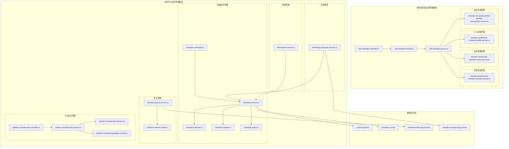

**图表来源**
- [club-member.module.ts:1-200](file://src/purely-club/member/club-member.module.ts#L1-L200)
- [members.controller.ts:1-300](file://src/purely-profit/member/members/members.controller.ts#L1-L300)
- [platform.membership.controller.ts:1-200](file://src/purely-profit/member/platform-membership/platform-membership.controller.ts#L1-L200)

**章节来源**
- [club-member.module.ts:1-200](file://src/purely-club/member/club-member.module.ts#L1-L200)
- [members.controller.ts:1-300](file://src/purely-profit/member/members/members.controller.ts#L1-L300)
- [platform.membership.controller.ts:1-200](file://src/purely-profit/member/platform-membership/platform-membership.controller.ts#L1-L200)

## 核心组件

### 纯利俱乐部会员管理核心组件

**更新** 纯利俱乐部会员管理模块采用全新的模块化设计：

1. **ClubMemberController** - 处理纯利俱乐部会员相关的HTTP请求
2. **ClubMemberModule** - 会员管理模块容器，协调各子模块
3. **ClubMemberService** - 实现纯利俱乐部会员业务逻辑
4. **MemberProfileService** - 个人资料管理服务
5. **MemberLevelsService** - 会员等级管理服务  
6. **MemberBenefitsService** - 会员权益管理服务
7. **MemberTransactionsService** - 会员交易管理服务

### 纯利平台会员管理核心组件

纯利平台会员管理模块保持原有架构：

1. **MembersController** - 处理平台会员相关的HTTP请求
2. **MembersService** - 实现平台会员业务逻辑
3. **MembersDomain** - 定义平台会员领域模型
4. **MembersMapper** - 负责数据映射转换
5. **MembersQuery** - 提供平台会员查询接口

### 积分管理组件

积分管理模块包含：
- **MembersPointsService** - 处理平台会员积分相关业务
- **MembersPointsConfig** - 平台会员积分配置管理

### 平台会员管理组件

平台会员管理模块包括：
- **PlatformMembershipController** - 平台会员相关请求处理
- **PlatformMembershipService** - 平台会员业务逻辑
- **PlatformMembershipDomain** - 平台会员领域模型
- **PlatformMembershipLedgerService** - 平台会员账本服务

**章节来源**
- [club-member.service.ts:1-300](file://src/purely-club/member/club-member.service.ts#L1-L300)
- [club-member-profile.service.ts:1-200](file://src/purely-club/member/member-profile/club-member-profile.service.ts#L1-L200)
- [club-member-levels.service.ts:1-200](file://src/purely-club/member/member-levels/club-member-levels.service.ts#L1-L200)
- [club-member-benefits.service.ts:1-200](file://src/purely-club/member/member-benefits/club-member-benefits.service.ts#L1-L200)
- [club-member-transactions.service.ts:1-200](file://src/purely-club/member/member-transactions/club-member-transactions.service.ts#L1-L200)
- [members.service.ts:1-300](file://src/purely-profit/member/members/members.service.ts#L1-L300)
- [members.points.service.ts:1-200](file://src/purely-profit/member/members/members-points.service.ts#L1-L200)
- [platform.membership.service.ts:1-250](file://src/purely-profit/member/platform-membership/platform-membership.service.ts#L1-L250)

## 架构概览

**更新** 会员管理模块采用双层模块化架构设计，实现了清晰的关注点分离：

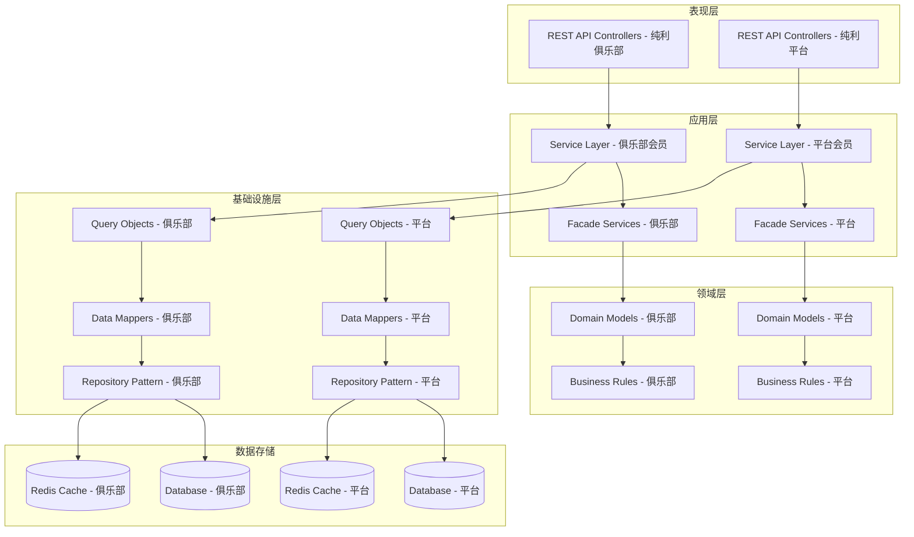

**图表来源**
- [club-member.controller.ts:1-200](file://src/purely-club/member/club-member.controller.ts#L1-L200)
- [club-member.service.ts:1-300](file://src/purely-club/member/club-member.service.ts#L1-L300)
- [members.controller.ts:1-300](file://src/purely-profit/member/members/members.controller.ts#L1-L300)
- [members.service.ts:1-300](file://src/purely-profit/member/members/members.service.ts#L1-L300)

### 数据流图

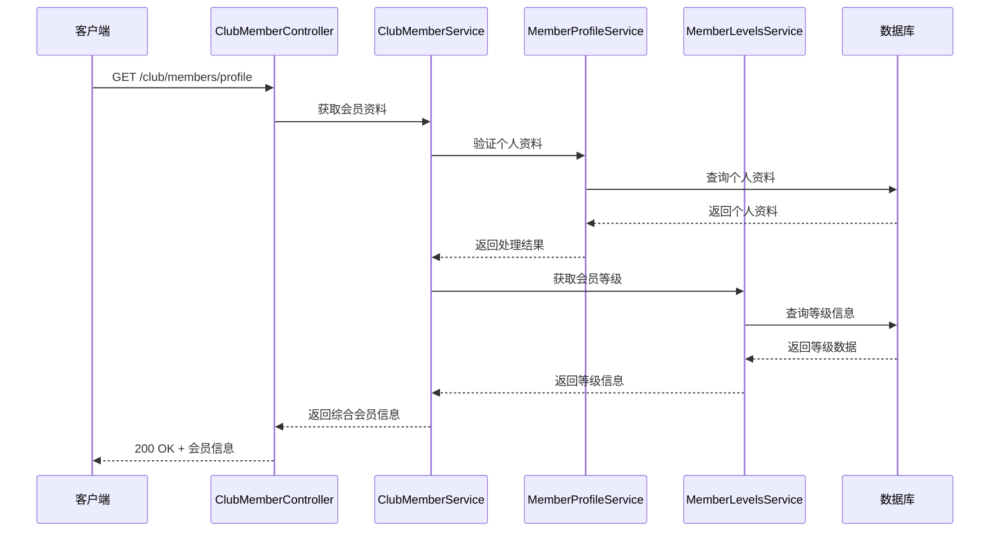

**图表来源**
- [club-member.controller.ts:1-200](file://src/purely-club/member/club-member.controller.ts#L1-L200)
- [club-member.service.ts:1-300](file://src/purely-club/member/club-member.service.ts#L1-L300)
- [club-member-profile.service.ts:1-200](file://src/purely-club/member/member-profile/club-member-profile.service.ts#L1-L200)
- [club-member-levels.service.ts:1-200](file://src/purely-club/member/member-levels/club-member-levels.service.ts#L1-L200)

## 详细组件分析

### 纯利俱乐部会员生命周期管理

**更新** 纯利俱乐部会员生命周期管理采用模块化设计，新增了regular会员等级的支持：

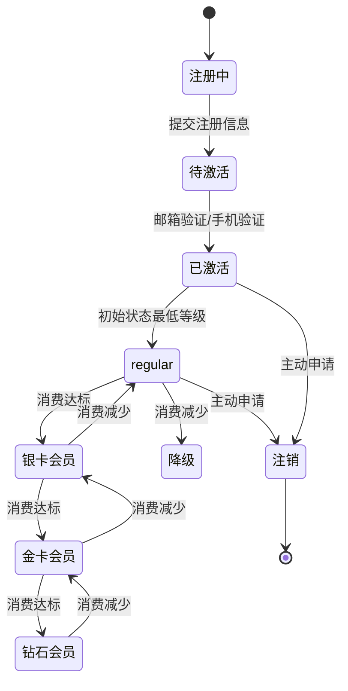

**图表来源**
- [club-member-profile.service.ts:1-200](file://src/purely-club/member/member-profile/club-member-profile.service.ts#L1-L200)
- [club-member-levels.service.ts:1-200](file://src/purely-club/member/member-levels/club-member-levels.service.ts#L1-L200)

#### 会员等级体系

**更新** 会员等级体系现已包含新增的regular会员等级：

| 等级 | 条件 | 折扣率 | 权益 |
|------|------|--------|------|
| regular（普通会员） | 新用户/无消费 | 无折扣 | 基础服务 |
| 银卡会员 | 年消费满1000元 | 9.5折 | 免费配送 |
| 金卡会员 | 年消费满5000元 | 9折 | 免费配送+生日礼物 |
| 钻石会员 | 年消费满20000元 | 8.5折 | 免费配送+生日礼物+专属客服 |

#### 个人资料管理流程

**更新** 新增全面的个人资料管理模块：

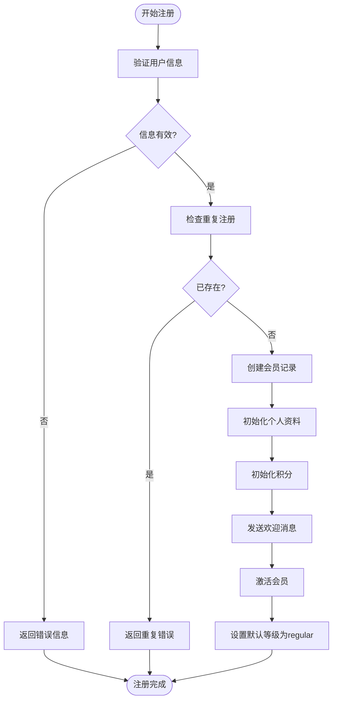

**图表来源**
- [club-member-profile.service.ts:1-200](file://src/purely-club/member/member-profile/club-member-profile.service.ts#L1-L200)
- [club-member.service.ts:1-300](file://src/purely-club/member/club-member.service.ts#L1-L300)

**章节来源**
- [club-member-profile.service.ts:1-200](file://src/purely-club/member/member-profile/club-member-profile.service.ts#L1-L200)
- [club-member-levels.service.ts:1-200](file://src/purely-club/member/member-levels/club-member-levels.service.ts#L1-L200)
- [club-member.service.ts:1-300](file://src/purely-club/member/club-member.service.ts#L1-L300)

### 纯利平台会员管理系统

纯利平台会员管理系统保持原有架构，继续提供完整的会员管理功能：

#### 会员生命周期管理

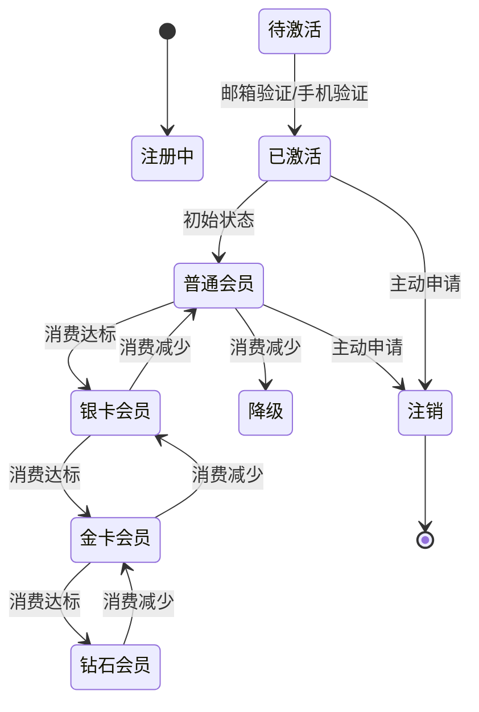

**图表来源**
- [members.domain.ts:1-200](file://src/purely-profit/member/members/members.domain.ts#L1-L200)
- [members.service.ts:1-300](file://src/purely-profit/member/members/members.service.ts#L1-L300)

#### 会员等级体系

会员等级体系采用多层级设计：

| 等级 | 条件 | 折扣率 | 权益 |
|------|------|--------|------|
| 普通会员 | 新用户 | 无折扣 | 基础服务 |
| 银卡会员 | 年消费满1000元 | 9.5折 | 免费配送 |
| 金卡会员 | 年消费满5000元 | 9折 | 免费配送+生日礼物 |
| 钻石会员 | 年消费满20000元 | 8.5折 | 免费配送+生日礼物+专属客服 |

#### 会员注册流程

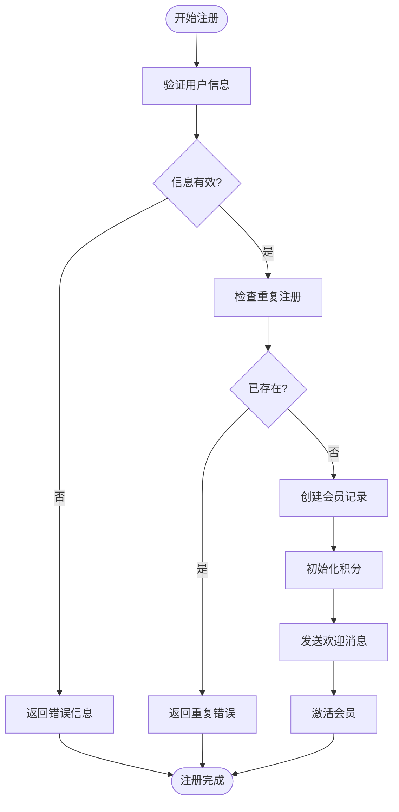

**图表来源**
- [members.controller.ts:1-200](file://src/purely-profit/member/members/members.controller.ts#L1-L200)
- [members.service.ts:1-300](file://src/purely-profit/member/members/members.service.ts#L1-L300)

**章节来源**
- [members.domain.ts:1-200](file://src/purely-profit/member/members/members.domain.ts#L1-L200)
- [members.service.ts:1-300](file://src/purely-profit/member/members/members.service.ts#L1-L300)

### 积分管理系统

积分管理系统实现了完整的积分获取、使用和管理功能：

#### 积分获取规则

| 行为类型 | 积分规则 | 说明 |
|----------|----------|------|
| 首次注册 | +100积分 | 新用户奖励 |
| 每消费1元 | +1积分 | 基础消费积分 |
| 分享推广 | +50积分 | 每成功推荐一位新用户 |
| 评价商品 | +20积分 | 每次商品评价 |
| 连续签到 | +10积分/天 | 最多30天封顶 |

#### 积分使用规则

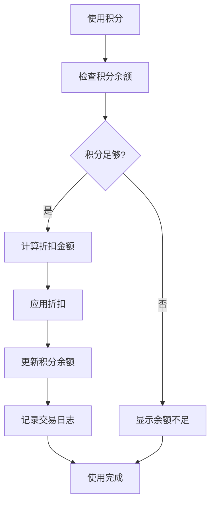

**图表来源**
- [members.points.config.ts:1-200](file://src/purely-profit/member/members/members-points.config.ts#L1-L200)
- [members.points.service.ts:1-200](file://src/purely-profit/member/members/members-points.service.ts#L1-L200)

**章节来源**
- [members.points.config.ts:1-200](file://src/purely-profit/member/members/members-points.config.ts#L1-L200)
- [members.points.service.ts:1-200](file://src/purely-profit/member/members/members-points.service.ts#L1-L200)

### 充值记录管理

充值记录管理模块提供了完整的充值流水记录和统计功能：

#### 充值类型分类

| 充值类型 | 说明 | 手续费 |
|----------|------|--------|
| 在线充值 | 支付宝/微信支付 | 0% |
| 银行转账 | 对公转账 | 0% |
| 优惠券抵扣 | 使用平台优惠券 | 不适用 |
| 积分抵扣 | 使用会员积分 | 不适用 |

#### 充值统计分析

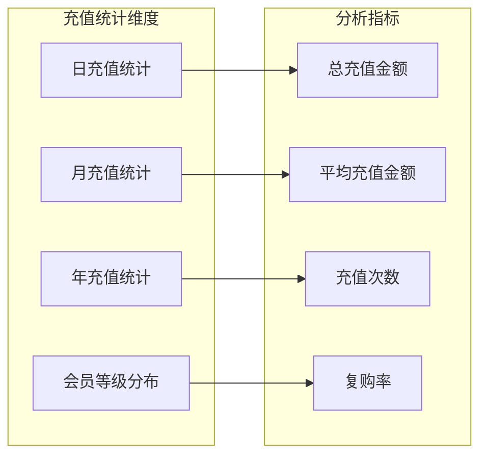

**图表来源**
- [marketing.recharges.service.ts:1-200](file://src/purely-profit/marketing/marketing-recharges.service.ts#L1-L200)
- [members.service.ts:1-300](file://src/purely-profit/member/members/members.service.ts#L1-L300)

**章节来源**
- [marketing.recharges.service.ts:1-200](file://src/purely-profit/marketing/marketing-recharges.service.ts#L1-L200)

### 会员统计分析

会员统计分析模块提供了多维度的会员数据分析功能：

#### 核心统计指标

| 指标类型 | 计算公式 | 用途 |
|----------|----------|------|
| 会员增长率 | (本期-上期)/上期*100% | 评估会员发展速度 |
| 会员留存率 | 当月活跃/当月新增*100% | 评估会员粘性 |
| ARPU值 | 总收入/总会员数 | 评估会员价值 |
| 复购率 | 有二次购买会员数/总会员数*100% | 评估客户忠诚度 |

#### 会员画像分析

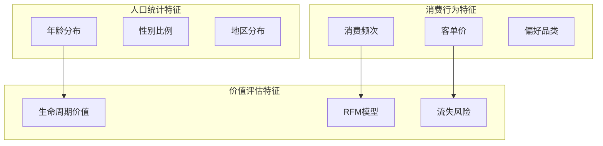

**图表来源**
- [members.service.ts:1-300](file://src/purely-profit/member/members/members.service.ts#L1-L300)
- [marketing.consumptions.service.ts:1-200](file://src/purely-profit/marketing/marketing-consumptions.service.ts#L1-L200)

**章节来源**
- [members.service.ts:1-300](file://src/purely-profit/member/members/members.service.ts#L1-L300)
- [marketing.consumptions.service.ts:1-200](file://src/purely-profit/marketing/marketing-consumptions.service.ts#L1-L200)

### 平台会员管理

平台会员管理模块提供了更高级别的会员服务：

#### 会员权益计算

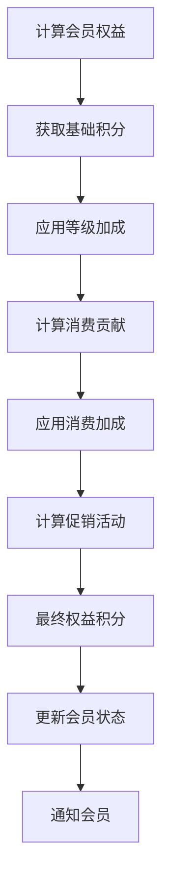

**图表来源**
- [platform.membership.service.ts:1-250](file://src/purely-profit/member/platform-membership/platform-membership.service.ts#L1-L250)
- [platform.membership.domain.ts:1-200](file://src/purely-profit/member/platform-membership/platform-membership.domain.ts#L1-L200)

**章节来源**
- [platform.membership.service.ts:1-250](file://src/purely-profit/member/platform-membership/platform-membership.service.ts#L1-L250)
- [platform.membership.domain.ts:1-200](file://src/purely-profit/member/platform-membership/platform-membership.domain.ts#L1-L200)

## 依赖分析

**更新** 会员管理模块与其他模块的依赖关系现已扩展为双层架构：

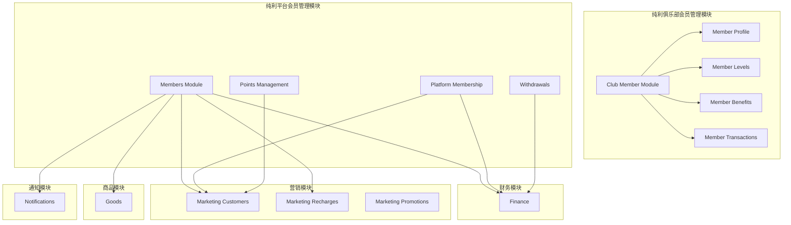

**图表来源**
- [club-member.module.ts:1-200](file://src/purely-club/member/club-member.module.ts#L1-L200)
- [members.controller.ts:1-300](file://src/purely-profit/member/members/members.controller.ts#L1-L300)
- [marketing.controller.ts:1-200](file://src/purely-profit/marketing/marketing.controller.ts#L1-L200)

### 数据模型关系

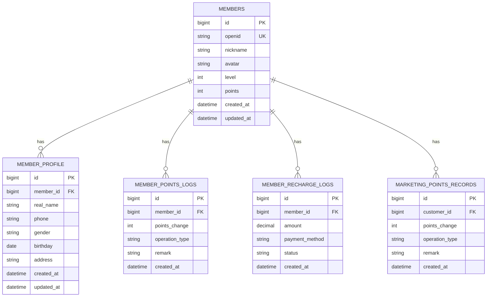

**图表来源**
- [schema.prisma:1-500](file://prisma/schema.prisma#L1-L500)
- [members.prisma:1-200](file://prisma/purely-profit/member/members.prisma#L1-L200)

**章节来源**
- [schema.prisma:1-500](file://prisma/schema.prisma#L1-L500)

## 性能考虑

### 缓存策略

**更新** 会员管理模块采用了多层次的缓存策略：

1. **Redis缓存**：缓存热门会员信息和积分数据
2. **数据库索引**：为常用查询字段建立索引
3. **查询优化**：使用预加载和批量查询减少数据库访问
4. **模块化缓存**：每个子模块都有独立的缓存策略

### 性能优化建议

1. **异步处理**：积分变更和通知发送采用异步队列处理
2. **批量操作**：支持批量会员数据导入和导出
3. **分页查询**：大数据量场景下使用分页查询避免内存溢出
4. **模块化优化**：针对不同子模块的特点进行专门的性能优化

## 故障排除指南

### 常见问题及解决方案

#### 会员积分异常

**问题描述**：会员积分显示不正确或计算错误

**可能原因**：
1. 积分规则配置错误
2. 积分日志记录异常
3. 并发操作导致的数据竞争

**解决步骤**：
1. 检查积分配置是否正确
2. 查看积分日志表是否有异常记录
3. 确认并发控制机制是否正常工作

#### 会员升级失败

**问题描述**：会员等级升级不生效

**可能原因**：
1. 升级条件计算错误
2. 数据库事务处理异常
3. 缓存数据未及时更新

**解决步骤**：
1. 验证升级条件计算逻辑
2. 检查数据库事务提交状态
3. 清除相关缓存并重试

#### 个人资料更新失败

**更新** 新增个人资料模块的故障排除：

**问题描述**：会员个人资料无法更新或保存失败

**可能原因**：
1. 个人资料验证规则错误
2. 数据库约束冲突
3. 并发更新导致的数据不一致

**解决步骤**：
1. 检查个人资料字段验证规则
2. 确认数据库唯一性约束
3. 实施乐观锁机制防止并发冲突

#### regular会员等级问题

**更新** 新增regular会员等级相关的故障排除：

**问题描述**：regular会员等级显示异常或无法正确识别

**可能原因**：
1. 等级排序逻辑错误
2. 等级解锁机制异常
3. 历史数据兼容性问题

**解决步骤**：
1. 检查等级排序映射表，确认regular等级排位正确
2. 验证等级解锁算法，确保regular等级能正确解锁其他等级
3. 清理历史数据中的等级字段，确保兼容性

**章节来源**
- [club-member-profile.service.ts:1-200](file://src/purely-club/member/member-profile/club-member-profile.service.ts#L1-L200)
- [members.service.ts:1-300](file://src/purely-profit/member/members/members.service.ts#L1-L300)
- [members.points.service.ts:1-200](file://src/purely-profit/member/members/members-points.service.ts#L1-L200)
- [club-member-levels.service.ts:48-56](file://src/purely-club/member/member-levels/club-member-levels.service.ts#L48-L56)
- [club-member-benefits.service.ts:48-56](file://src/purely-club/member/member-benefits/club-member-benefits.service.ts#L48-L56)

## 结论

**更新** 会员管理模块通过其完善的双层模块化架构设计和丰富的功能实现，为平台提供了强大的会员管理体系。模块不仅支持基础的会员管理功能，还提供了高级的会员分析和个性化服务能力。

模块的主要优势包括：

1. **双层架构设计**：纯利俱乐部和纯利平台两大会员管理系统的分离，满足不同业务场景需求
2. **模块化个人资料管理**：独立的个人资料子模块，提供全面的个人信息管理功能
3. **完整的生命周期管理**：从注册到注销的全流程覆盖
4. **灵活的等级体系**：支持多层级会员等级和动态调整，新增regular等级作为基础等级
5. **丰富的积分机制**：多样化的积分获取和使用方式
6. **强大的统计分析**：多维度的会员数据分析能力
7. **全面的测试覆盖**：新增的个人资料测试确保功能的完整性和可靠性
8. **良好的扩展性**：模块化设计便于功能扩展和维护

**更新** 新增的regular会员等级作为最低等级，为新用户提供基础会员服务，同时增强了整个会员等级体系的完整性。等级排序逻辑经过优化，确保regular等级能够正确排在最底层，为后续等级升级提供清晰的路径。

通过与其他模块的紧密协作，会员管理模块为整个平台的业务发展提供了坚实的基础支撑。新的模块化架构不仅提升了系统的可维护性，还为未来的功能扩展奠定了良好的基础。