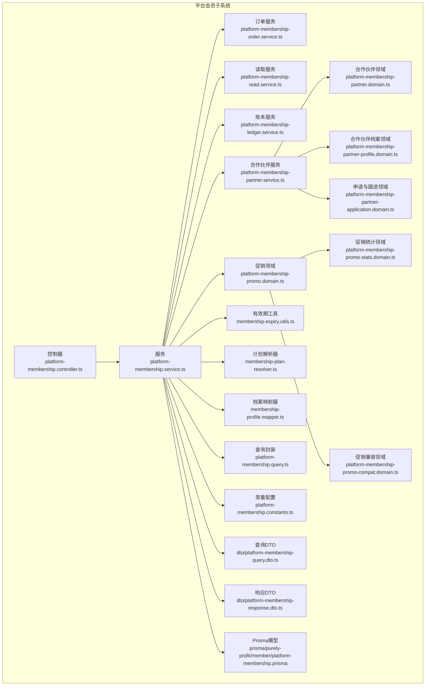
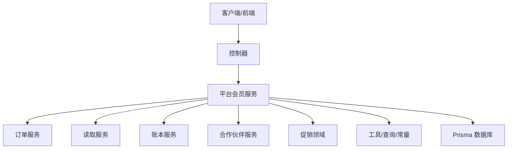
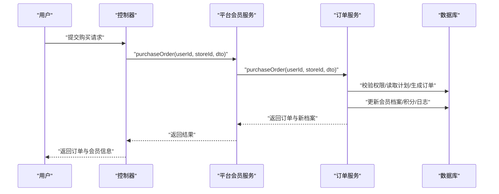
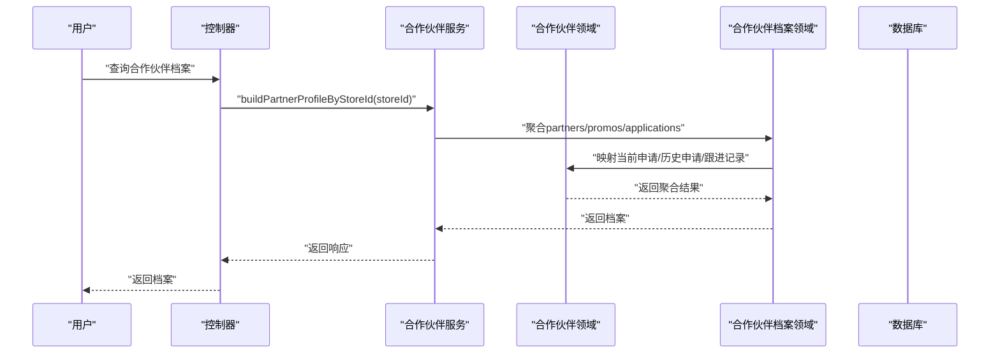
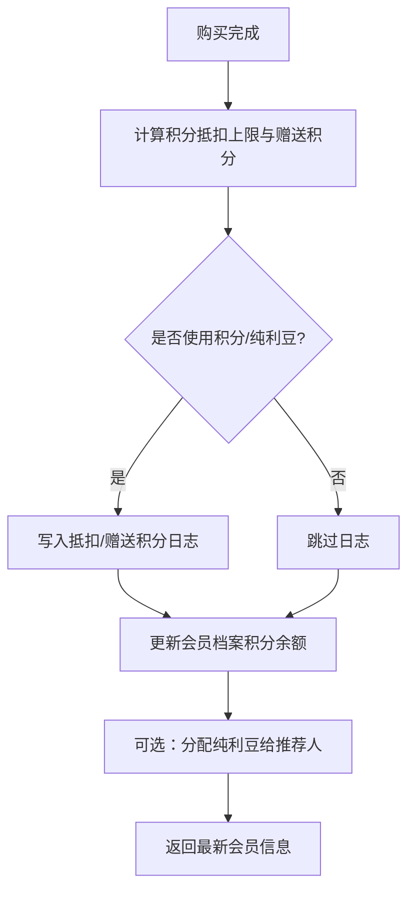
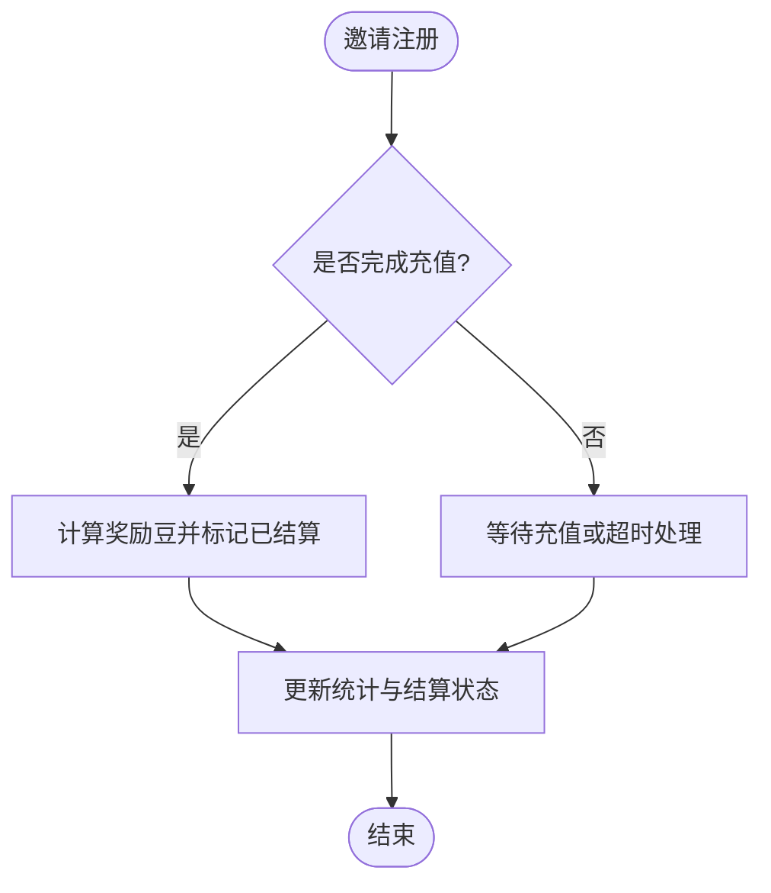
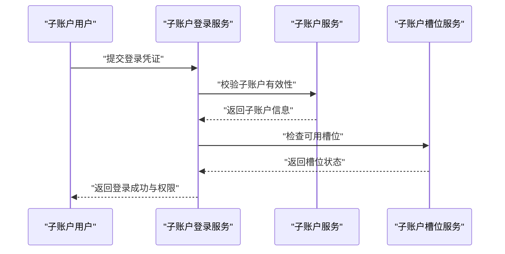
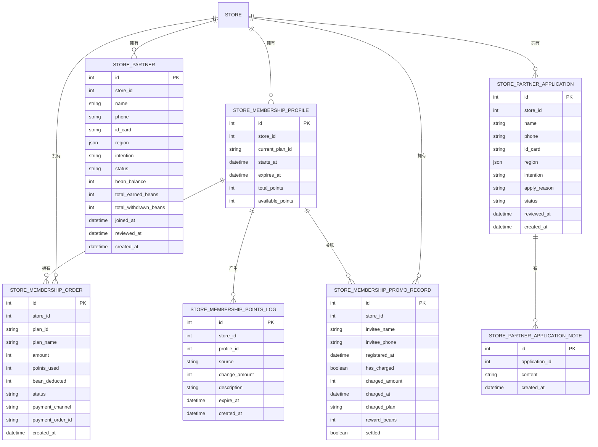
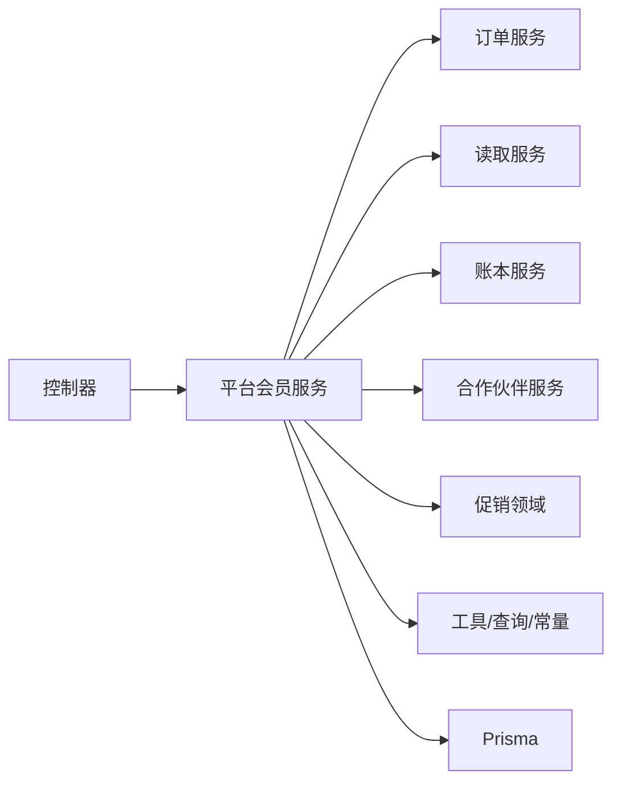

# 平台会员管理

<cite>
**本文引用的文件**
- [src/purely-profit/member/platform-membership/platform-membership.controller.ts](file://src/purely-profit/member/platform-membership/platform-membership.controller.ts)
- [src/purely-profit/member/platform-membership/platform-membership.service.ts](file://src/purely-profit/member/platform-membership/platform-membership.service.ts)
- [src/purely-profit/member/platform-membership/platform-membership-order.service.ts](file://src/purely-profit/member/platform-membership/platform-membership-order.service.ts)
- [src/purely-profit/member/platform-membership/platform-membership-read.service.ts](file://src/purely-profit/member/platform-membership/platform-membership-read.service.ts)
- [src/purely-profit/member/platform-membership/platform-membership-ledger.service.ts](file://src/purely-profit/member/platform-membership/platform-membership-ledger.service.ts)
- [src/purely-profit/member/platform-membership/platform-membership-partner.service.ts](file://src/purely-profit/member/platform-membership/platform-membership-partner.service.ts)
- [src/purely-profit/member/platform-membership/platform-membership-partner.domain.ts](file://src/purely-profit/member/platform-membership/platform-membership-partner.domain.ts)
- [src/purely-profit/member/platform-membership/platform-membership-partner-profile.domain.ts](file://src/purely-profit/member/platform-membership/platform-membership-partner-profile.domain.ts)
- [src/purely-profit/member/platform-membership/platform-membership-partner-application.domain.ts](file://src/purely-profit/member/platform-membership/platform-membership-partner-application.domain.ts)
- [src/purely-profit/member/platform-membership/platform-membership-partner-review.compat.ts](file://src/purely-profit/member/platform-membership/platform-membership-partner-review.compat.ts)
- [src/purely-profit/member/platform-membership/platform-membership-promo.domain.ts](file://src/purely-profit/member/platform-membership/platform-membership-promo.domain.ts)
- [src/purely-profit/member/platform-membership/platform-membership-promo-stats.domain.ts](file://src/purely-profit/member/platform-membership/platform-membership-promo-stats.domain.ts)
- [src/purely-profit/member/platform-membership/platform-membership-promo-compat.domain.ts](file://src/purely-profit/member/platform-membership/platform-membership-promo-compat.domain.ts)
- [src/purely-profit/member/platform-membership/membership-expiry.utils.ts](file://src/purely-profit/member/platform-membership/membership-expiry.utils.ts)
- [src/purely-profit/member/platform-membership/membership-plan-resolver.ts](file://src/purely-profit/member/platform-membership/membership-plan-resolver.ts)
- [src/purely-profit/member/platform-membership/membership-profile.mapper.ts](file://src/purely-profit/member/platform-membership/membership-profile.mapper.ts)
- [src/purely-profit/member/platform-membership/platform-membership.constants.ts](file://src/purely-profit/member/platform-membership/platform-membership.constants.ts)
- [src/purely-profit/member/platform-membership/platform-membership.query.ts](file://src/purely-profit/member/platform-membership/platform-membership.query.ts)
- [src/purely-profit/member/platform-membership/store-sub-account.service.ts](file://src/purely-profit/member/platform-membership/store-sub-account.service.ts)
- [src/purely-profit/member/platform-membership/store-sub-account-slot.service.ts](file://src/purely-profit/member/platform-membership/store-sub-account-slot.service.ts)
- [src/purely-profit/member/platform-membership/store-sub-account-login.service.ts](file://src/purely-profit/member/platform-membership/store-sub-account-login.service.ts)
- [src/purely-profit/member/platform-membership/dto/platform-membership-query.dto.ts](file://src/purely-profit/member/platform-membership/dto/platform-membership-query.dto.ts)
- [src/purely-profit/member/platform-membership/dto/platform-membership-response.dto.ts](file://src/purely-profit/member/platform-membership/dto/platform-membership-response.dto.ts)
- [src/purely-profit/member/platform-membership/dto/platform-membership-orders.response.dto.ts](file://src/purely-profit/member/platform-membership/dto/platform-membership-orders.response.dto.ts)
- [src/purely-profit/member/platform-membership/dto/platform-membership-center.response.dto.ts](file://src/purely-profit/member/platform-membership/dto/platform-membership-center.response.dto.ts)
- [src/purely-profit/member/platform-membership/dto/platform-membership-partner.response.dto.ts](file://src/purely-profit/member/platform-membership/dto/platform-membership-partner.response.dto.ts)
- [src/purely-profit/member/platform-membership/dto/platform-membership-beans.response.dto.ts](file://src/purely-profit/member/platform-membership/dto/platform-membership-beans.response.dto.ts)
- [src/purely-profit/member/platform-membership/dto/platform-membership-points.response.dto.ts](file://src/purely-profit/member/platform-membership/dto/platform-membership-points.response.dto.ts)
- [src/purely-profit/member/platform-membership/dto/platform-membership-promo.response.dto.ts](file://src/purely-profit/member/platform-membership/dto/platform-membership-promo.response.dto.ts)
- [prisma/purely-profit/member/platform-membership.prisma](file://prisma/purely-profit/member/platform-membership.prisma)
- [prisma/schema.prisma](file://prisma/schema.prisma)
</cite>

## 目录
1. [简介](#简介)
2. [项目结构](#项目结构)
3. [核心组件](#核心组件)
4. [架构总览](#架构总览)
5. [详细组件分析](#详细组件分析)
6. [依赖关系分析](#依赖关系分析)
7. [性能考虑](#性能考虑)
8. [故障排查指南](#故障排查指南)
9. [结论](#结论)
10. [附录](#附录)

## 简介
本文件系统性阐述平台会员管理功能，覆盖平台会员体系、会员订单管理、合作伙伴管理、权益与收益分配、统计分析与生命周期管理等核心能力。文档以代码级实现为依据，结合序列图、类图与流程图，帮助开发者与产品人员快速理解业务闭环与技术实现，并提供 API 使用示例与集成指引。

## 项目结构
平台会员相关模块位于 purely-profit/member/platform-membership 下，采用按领域分层组织：控制器、服务、查询、映射器、领域工具与 DTO 定义；配合 Prisma Schema 定义数据模型与迁移。核心目录与职责如下：
- 控制器与服务：对外暴露 REST 接口与业务编排
- 领域服务：订单、权益、促销、合作伙伴、子账户等子域服务
- 查询与映射：数据读取、快照与响应映射
- DTO：请求/响应契约定义
- Prisma：数据模型与迁移

图表来源
- [src/purely-profit/member/platform-membership/platform-membership.controller.ts](file://src/purely-profit/member/platform-membership/platform-membership.controller.ts)
- [src/purely-profit/member/platform-membership/platform-membership.service.ts](file://src/purely-profit/member/platform-membership/platform-membership.service.ts)
- [src/purely-profit/member/platform-membership/platform-membership-order.service.ts](file://src/purely-profit/member/platform-membership/platform-membership-order.service.ts)
- [src/purely-profit/member/platform-membership/platform-membership-read.service.ts](file://src/purely-profit/member/platform-membership/platform-membership-read.service.ts)
- [src/purely-profit/member/platform-membership/platform-membership-ledger.service.ts](file://src/purely-profit/member/platform-membership/platform-membership-ledger.service.ts)
- [src/purely-profit/member/platform-membership/platform-membership-partner.service.ts](file://src/purely-profit/member/platform-membership/platform-membership-partner.service.ts)
- [src/purely-profit/member/platform-membership/platform-membership-partner.domain.ts](file://src/purely-profit/member/platform-membership/platform-membership-partner.domain.ts)
- [src/purely-profit/member/platform-membership/platform-membership-partner-profile.domain.ts](file://src/purely-profit/member/platform-membership/platform-membership-partner-profile.domain.ts)
- [src/purely-profit/member/platform-membership/platform-membership-partner-application.domain.ts](file://src/purely-profit/member/platform-membership/platform-membership-partner-application.domain.ts)
- [src/purely-profit/member/platform-membership/platform-membership-promo.domain.ts](file://src/purely-profit/member/platform-membership/platform-membership-promo.domain.ts)
- [src/purely-profit/member/platform-membership/platform-membership-promo-compat.domain.ts](file://src/purely-profit/member/platform-membership/platform-membership-promo-compat.domain.ts)
- [src/purely-profit/member/platform-membership/platform-membership-promo-stats.domain.ts](file://src/purely-profit/member/platform-membership/platform-membership-promo-stats.domain.ts)
- [src/purely-profit/member/platform-membership/membership-expiry.utils.ts](file://src/purely-profit/member/platform-membership/membership-expiry.utils.ts)
- [src/purely-profit/member/platform-membership/membership-plan-resolver.ts](file://src/purely-profit/member/platform-membership/membership-plan-resolver.ts)
- [src/purely-profit/member/platform-membership/membership-profile.mapper.ts](file://src/purely-profit/member/platform-membership/membership-profile.mapper.ts)
- [src/purely-profit/member/platform-membership/platform-membership.query.ts](file://src/purely-profit/member/platform-membership/platform-membership.query.ts)
- [src/purely-profit/member/platform-membership/platform-membership.constants.ts](file://src/purely-profit/member/platform-membership/platform-membership.constants.ts)
- [prisma/purely-profit/member/platform-membership.prisma](file://prisma/purely-profit/member/platform-membership.prisma)

章节来源
- [src/purely-profit/member/platform-membership/platform-membership.controller.ts](file://src/purely-profit/member/platform-membership/platform-membership.controller.ts)
- [src/purely-profit/member/platform-membership/platform-membership.service.ts](file://src/purely-profit/member/platform-membership/platform-membership.service.ts)
- [prisma/purely-profit/member/platform-membership.prisma](file://prisma/purely-profit/member/platform-membership.prisma)

## 核心组件
- 平台会员控制器：统一入口，路由到各子服务（订单、权益、合作伙伴、统计）
- 平台会员服务：聚合业务编排，协调订单、权益、促销、合作伙伴与查询
- 订单服务：处理购买流程、权益计算、积分/纯利豆抵扣、状态变更与日志
- 读取服务：中心页、订单列表、合作伙伴档案等只读聚合
- 账本服务：积分流水、可用积分概览、到期计算
- 合作伙伴服务：申请、审核、档案构建、收益分配
- 促销领域：邀请奖励、结算、统计
- 工具与查询：有效期推导、计划解析、常量、查询封装
- DTO：契约定义，确保接口一致性

章节来源
- [src/purely-profit/member/platform-membership/platform-membership.controller.ts](file://src/purely-profit/member/platform-membership/platform-membership.controller.ts)
- [src/purely-profit/member/platform-membership/platform-membership.service.ts](file://src/purely-profit/member/platform-membership/platform-membership.service.ts)
- [src/purely-profit/member/platform-membership/platform-membership-order.service.ts](file://src/purely-profit/member/platform-membership/platform-membership-order.service.ts)
- [src/purely-profit/member/platform-membership/platform-membership-read.service.ts](file://src/purely-profit/member/platform-membership/platform-membership-read.service.ts)
- [src/purely-profit/member/platform-membership/platform-membership-ledger.service.ts](file://src/purely-profit/member/platform-membership/platform-membership-ledger.service.ts)
- [src/purely-profit/member/platform-membership/platform-membership-partner.service.ts](file://src/purely-profit/member/platform-membership/platform-membership-partner.service.ts)
- [src/purely-profit/member/platform-membership/platform-membership-promo.domain.ts](file://src/purely-profit/member/platform-membership/platform-membership-promo.domain.ts)
- [src/purely-profit/member/platform-membership/platform-membership.constants.ts](file://src/purely-profit/member/platform-membership/platform-membership.constants.ts)
- [src/purely-profit/member/platform-membership/platform-membership.query.ts](file://src/purely-profit/member/platform-membership/platform-membership.query.ts)

## 架构总览
平台会员管理采用“控制器-服务-领域-查询-数据模型”的分层架构。控制器负责路由与鉴权，服务编排业务，领域函数处理规则，查询封装数据库访问，数据模型由 Prisma 统一管理。

图表来源
- [src/purely-profit/member/platform-membership/platform-membership.controller.ts](file://src/purely-profit/member/platform-membership/platform-membership.controller.ts)
- [src/purely-profit/member/platform-membership/platform-membership.service.ts](file://src/purely-profit/member/platform-membership/platform-membership.service.ts)
- [prisma/schema.prisma](file://prisma/schema.prisma)

## 详细组件分析

### 1) 会员购买流程与订单处理
- 流程要点
  - 校验门店主账号权限
  - 解析套餐计划与有效期
  - 计算支付金额、积分/纯利豆抵扣上限与赠送积分
  - 创建订单、更新会员档案（生效期、积分余额）、写入积分日志
  - 分配纯利豆给推荐人（如适用）
- 关键路径
  - 控制器接收购买请求
  - 服务调用订单服务执行事务性落库
  - 更新会员档案与积分流水
  - 返回订单与最新会员信息

图表来源
- [src/purely-profit/member/platform-membership/platform-membership.controller.ts](file://src/purely-profit/member/platform-membership/platform-membership.controller.ts)
- [src/purely-profit/member/platform-membership/platform-membership.service.ts](file://src/purely-profit/member/platform-membership/platform-membership.service.ts)
- [src/purely-profit/member/platform-membership/platform-membership-order.service.ts](file://src/purely-profit/member/platform-membership/platform-membership-order.service.ts)
- [src/purely-profit/member/platform-membership/platform-membership.constants.ts](file://src/purely-profit/member/platform-membership/platform-membership.constants.ts)
- [src/purely-profit/member/platform-membership/membership-expiry.utils.ts](file://src/purely-profit/member/platform-membership/membership-expiry.utils.ts)
- [src/purely-profit/member/platform-membership/membership-plan-resolver.ts](file://src/purely-profit/member/platform-membership/membership-plan-resolver.ts)

章节来源
- [src/purely-profit/member/platform-membership/platform-membership-order.service.ts](file://src/purely-profit/member/platform-membership/platform-membership-order.service.ts)
- [src/purely-profit/member/platform-membership/platform-membership.constants.ts](file://src/purely-profit/member/platform-membership/platform-membership.constants.ts)
- [src/purely-profit/member/platform-membership/membership-expiry.utils.ts](file://src/purely-profit/member/platform-membership/membership-expiry.utils.ts)
- [src/purely-profit/member/platform-membership/membership-plan-resolver.ts](file://src/purely-profit/member/platform-membership/membership-plan-resolver.ts)

### 2) 会员状态管理与有效期
- 生效期推导：根据已付费订单与计划配置计算当前有效起止时间
- ages 显示：对部分会员显示掩码计划名，但不影响有效期叠加
- 周期与等级：支持月/季/年/终身，用于排序与优先级

图表来源
- [src/purely-profit/member/platform-membership/platform-membership-read.service.ts](file://src/purely-profit/member/platform-membership/platform-membership-read.service.ts)
- [src/purely-profit/member/platform-membership/membership-expiry.utils.ts](file://src/purely-profit/member/platform-membership/membership-expiry.utils.ts)
- [src/purely-profit/member/platform-membership/membership-plan-resolver.ts](file://src/purely-profit/member/platform-membership/membership-plan-resolver.ts)

章节来源
- [src/purely-profit/member/platform-membership/platform-membership-read.service.ts](file://src/purely-profit/member/platform-membership/platform-membership-read.service.ts)
- [src/purely-profit/member/platform-membership/membership-expiry.utils.ts](file://src/purely-profit/member/platform-membership/membership-expiry.utils.ts)
- [src/purely-profit/member/platform-membership/membership-plan-resolver.ts](file://src/purely-profit/member/platform-membership/membership-plan-resolver.ts)

### 3) 合作伙伴管理与审核
- 申请与档案：构建当前申请与历史申请列表，映射跟进记录
- 审核兼容：保留旧版审核字段与流程兼容
- 档案聚合：按门店聚合合作伙伴、促销与申请记录，输出可展示档案

图表来源
- [src/purely-profit/member/platform-membership/platform-membership-partner.service.ts](file://src/purely-profit/member/platform-membership/platform-membership-partner.service.ts)
- [src/purely-profit/member/platform-membership/platform-membership-partner-profile.domain.ts](file://src/purely-profit/member/platform-membership/platform-membership-partner-profile.domain.ts)
- [src/purely-profit/member/platform-membership/platform-membership-partner.domain.ts](file://src/purely-profit/member/platform-membership/platform-membership-partner.domain.ts)
- [src/purely-profit/member/platform-membership/platform-membership-partner-application.domain.ts](file://src/purely-profit/member/platform-membership/platform-membership-partner-application.domain.ts)
- [src/purely-profit/member/platform-membership/platform-membership-partner-review.compat.ts](file://src/purely-profit/member/platform-membership/platform-membership-partner-review.compat.ts)

章节来源
- [src/purely-profit/member/platform-membership/platform-membership-partner.service.ts](file://src/purely-profit/member/platform-membership/platform-membership-partner.service.ts)
- [src/purely-profit/member/platform-membership/platform-membership-partner-profile.domain.ts](file://src/purely-profit/member/platform-membership/platform-membership-partner-profile.domain.ts)
- [src/purely-profit/member/platform-membership/platform-membership-partner.domain.ts](file://src/purely-profit/member/platform-membership/platform-membership-partner.domain.ts)
- [src/purely-profit/member/platform-membership/platform-membership-partner-application.domain.ts](file://src/purely-profit/member/platform-membership/platform-membership-partner-application.domain.ts)
- [src/purely-profit/member/platform-membership/platform-membership-partner-review.compat.ts](file://src/purely-profit/member/platform-membership/platform-membership-partner-review.compat.ts)

### 4) 权益与积分/纯利豆管理
- 积分抵扣：按比例上限抵扣，生成抵扣日志
- 赠送积分：按套餐类型赠送积分
- 可用积分概览：基于订单与日志计算可用积分与到期时间
- 纯利豆分配：按规则分配至推荐人账户

图表来源
- [src/purely-profit/member/platform-membership/platform-membership-order.service.ts](file://src/purely-profit/member/platform-membership/platform-membership-order.service.ts)
- [src/purely-profit/member/platform-membership/platform-membership-ledger.service.ts](file://src/purely-profit/member/platform-membership/platform-membership-ledger.service.ts)
- [src/purely-profit/member/platform-membership/platform-membership.constants.ts](file://src/purely-profit/member/platform-membership/platform-membership.constants.ts)

章节来源
- [src/purely-profit/member/platform-membership/platform-membership-order.service.ts](file://src/purely-profit/member/platform-membership/platform-membership-order.service.ts)
- [src/purely-profit/member/platform-membership/platform-membership-ledger.service.ts](file://src/purely-profit/member/platform-membership/platform-membership-ledger.service.ts)
- [src/purely-profit/member/platform-membership/platform-membership.constants.ts](file://src/purely-profit/member/platform-membership/platform-membership.constants.ts)

### 5) 促销与收益分配
- 促销记录：邀请注册、充值、奖励结算
- 统计维度：总推广数、已充值推广数、奖励豆汇总
- 兼容处理：保留历史字段与流程，保证平滑升级

图表来源
- [src/purely-profit/member/platform-membership/platform-membership-promo.domain.ts](file://src/purely-profit/member/platform-membership/platform-membership-promo.domain.ts)
- [src/purely-profit/member/platform-membership/platform-membership-promo-stats.domain.ts](file://src/purely-profit/member/platform-membership/platform-membership-promo-stats.domain.ts)
- [src/purely-profit/member/platform-membership/platform-membership-promo-compat.domain.ts](file://src/purely-profit/member/platform-membership/platform-membership-promo-compat.domain.ts)

章节来源
- [src/purely-profit/member/platform-membership/platform-membership-promo.domain.ts](file://src/purely-profit/member/platform-membership/platform-membership-promo.domain.ts)
- [src/purely-profit/member/platform-membership/platform-membership-promo-stats.domain.ts](file://src/purely-profit/member/platform-membership/platform-membership-promo-stats.domain.ts)
- [src/purely-profit/member/platform-membership/platform-membership-promo-compat.domain.ts](file://src/purely-profit/member/platform-membership/platform-membership-promo-compat.domain.ts)

### 6) 子账户与登录
- 子账户登录：支持通过子账户登录平台会员中心
- 子账户槽位：管理子账户可用槽位与状态
- 登录态与权限：结合 JWT 与权限守卫

图表来源
- [src/purely-profit/member/platform-membership/store-sub-account-login.service.ts](file://src/purely-profit/member/platform-membership/store-sub-account-login.service.ts)
- [src/purely-profit/member/platform-membership/store-sub-account.service.ts](file://src/purely-profit/member/platform-membership/store-sub-account.service.ts)
- [src/purely-profit/member/platform-membership/store-sub-account-slot.service.ts](file://src/purely-profit/member/platform-membership/store-sub-account-slot.service.ts)

章节来源
- [src/purely-profit/member/platform-membership/store-sub-account-login.service.ts](file://src/purely-profit/member/platform-membership/store-sub-account-login.service.ts)
- [src/purely-profit/member/platform-membership/store-sub-account.service.ts](file://src/purely-profit/member/platform-membership/store-sub-account.service.ts)
- [src/purely-profit/member/platform-membership/store-sub-account-slot.service.ts](file://src/purely-profit/member/platform-membership/store-sub-account-slot.service.ts)

### 7) 数据模型与关系
平台会员相关模型包括：会员档案、订单、积分日志、合作伙伴、申请与跟进记录、促销记录等。Prisma Schema 定义了表结构与索引，迁移脚本确保数据库演进。

图表来源
- [prisma/purely-profit/member/platform-membership.prisma](file://prisma/purely-profit/member/platform-membership.prisma)
- [prisma/schema.prisma](file://prisma/schema.prisma)

章节来源
- [prisma/purely-profit/member/platform-membership.prisma](file://prisma/purely-profit/member/platform-membership.prisma)
- [prisma/schema.prisma](file://prisma/schema.prisma)

## 依赖关系分析
- 组件内聚：控制器仅做路由与参数校验，业务集中在服务层
- 组件耦合：服务层依赖查询、工具与映射，避免直接操作 Prisma
- 外部依赖：Prisma、Redis 缓存失效、JWT 鉴权
- 循环依赖：未见循环导入，查询与映射解耦良好

图表来源
- [src/purely-profit/member/platform-membership/platform-membership.controller.ts](file://src/purely-profit/member/platform-membership/platform-membership.controller.ts)
- [src/purely-profit/member/platform-membership/platform-membership.service.ts](file://src/purely-profit/member/platform-membership/platform-membership.service.ts)
- [src/purely-profit/member/platform-membership/platform-membership-order.service.ts](file://src/purely-profit/member/platform-membership/platform-membership-order.service.ts)
- [src/purely-profit/member/platform-membership/platform-membership-read.service.ts](file://src/purely-profit/member/platform-membership/platform-membership-read.service.ts)
- [src/purely-profit/member/platform-membership/platform-membership-ledger.service.ts](file://src/purely-profit/member/platform-membership/platform-membership-ledger.service.ts)
- [src/purely-profit/member/platform-membership/platform-membership-partner.service.ts](file://src/purely-profit/member/platform-membership/platform-membership-partner.service.ts)
- [src/purely-profit/member/platform-membership/platform-membership-promo.domain.ts](file://src/purely-profit/member/platform-membership/platform-membership-promo.domain.ts)
- [src/purely-profit/member/platform-membership/platform-membership.query.ts](file://src/purely-profit/member/platform-membership/platform-membership.query.ts)
- [src/purely-profit/member/platform-membership/platform-membership.constants.ts](file://src/purely-profit/member/platform-membership/platform-membership.constants.ts)

章节来源
- [src/purely-profit/member/platform-membership/platform-membership.service.ts](file://src/purely-profit/member/platform-membership/platform-membership.service.ts)
- [src/purely-profit/member/platform-membership/platform-membership.query.ts](file://src/purely-profit/member/platform-membership/platform-membership.query.ts)

## 性能考虑
- 批量读取：使用 Promise.all 并行查询档案、合作伙伴、促销与订单，降低 RT
- 缓存失效：订单与档案变更触发缓存失效，避免脏读
- 分页与索引：Prisma 查询使用索引与分页 DTO，控制数据量
- 事务边界：订单落库在单事务中，保证一致性与原子性

## 故障排查指南
- 订单状态异常
  - 检查订单状态枚举与流转条件
  - 核对积分/纯利豆抵扣上限与日志
- 会员状态不正确
  - 核对已付费订单与计划配置
  - 检查 ages 显示与有效期叠加逻辑
- 合作伙伴审核问题
  - 对比申请记录与跟进记录
  - 确认兼容字段与审核流程
- 积分/纯利豆异常
  - 校验抵扣比例与赠送规则
  - 查看积分日志与到期时间

章节来源
- [src/purely-profit/member/platform-membership/platform-membership-order.service.ts](file://src/purely-profit/member/platform-membership/platform-membership-order.service.ts)
- [src/purely-profit/member/platform-membership/platform-membership-read.service.ts](file://src/purely-profit/member/platform-membership/platform-membership-read.service.ts)
- [src/purely-profit/member/platform-membership/platform-membership-partner.domain.ts](file://src/purely-profit/member/platform-membership/platform-membership-partner.domain.ts)
- [src/purely-profit/member/platform-membership/platform-membership.constants.ts](file://src/purely-profit/member/platform-membership/platform-membership.constants.ts)

## 结论
平台会员管理通过清晰的分层设计与领域驱动实现了从购买到权益、从合作伙伴到收益分配的完整闭环。模块化与契约化（DTO）提升了可维护性与可测试性；事务与缓存策略保障了数据一致性与性能。建议在集成时严格遵循 DTO 约定，并关注有效期与抵扣规则的边界场景。

## 附录

### A. 平台会员 API 示例与集成指南
- 购买会员订单
  - 方法与路径：POST /platform-membership/orders
  - 请求体：包含 planId（月/季/年/终身）
  - 响应：订单信息与最新会员档案
  - 参考路径：[PurchasePlatformMembershipOrderDto](file://src/purely-profit/member/platform-membership/dto/platform-membership-query.dto.ts)
- 获取会员中心
  - 方法与路径：GET /platform-membership/profile
  - 响应：会员信息、剩余天数、统计、我的申请与已批准伙伴
  - 参考路径：[PlatformMembershipProfileResponseDto](file://src/purely-profit/member/platform-membership/dto/platform-membership-center.response.dto.ts)
- 获取积分流水
  - 方法与路径：GET /platform-membership/points/logs
  - 响应：可用积分概览与明细
  - 参考路径：[PlatformMembershipPointsLogsResponseDto](file://src/purely-profit/member/platform-membership/dto/platform-membership-points.response.dto.ts)
- 合作伙伴档案
  - 方法与路径：GET /platform-membership/partners/profile
  - 响应：已批准伙伴、历史申请与跟进记录
  - 参考路径：[PlatformMembershipPartnerProfileResponseDto](file://src/purely-profit/member/platform-membership/dto/platform-membership-partner.response.dto.ts)
- 子账户登录
  - 方法与路径：POST /platform-membership/sub-account/login
  - 响应：登录成功与权限
  - 参考路径：[store-sub-account-login.service.ts](file://src/purely-profit/member/platform-membership/store-sub-account-login.service.ts)

章节来源
- [src/purely-profit/member/platform-membership/dto/platform-membership-query.dto.ts](file://src/purely-profit/member/platform-membership/dto/platform-membership-query.dto.ts)
- [src/purely-profit/member/platform-membership/dto/platform-membership-center.response.dto.ts](file://src/purely-profit/member/platform-membership/dto/platform-membership-center.response.dto.ts)
- [src/purely-profit/member/platform-membership/dto/platform-membership-points.response.dto.ts](file://src/purely-profit/member/platform-membership/dto/platform-membership-points.response.dto.ts)
- [src/purely-profit/member/platform-membership/dto/platform-membership-partner.response.dto.ts](file://src/purely-profit/member/platform-membership/dto/platform-membership-partner.response.dto.ts)
- [src/purely-profit/member/platform-membership/store-sub-account-login.service.ts](file://src/purely-profit/member/platform-membership/store-sub-account-login.service.ts)

### B. 业务流程说明与最佳实践
- 购买流程
  - 校验权限 → 解析计划 → 计算抵扣与赠送 → 事务落库 → 更新档案与日志 → 返回结果
- 会员状态管理
  - 基于已付费订单与计划配置推导有效期，ages 显示不影响叠加
- 合作伙伴审核
  - 申请与历史记录分离，兼容旧版审核字段
- 收益分配
  - 促销奖励按规则结算，支持统计与对账

章节来源
- [src/purely-profit/member/platform-membership/platform-membership-order.service.ts](file://src/purely-profit/member/platform-membership/platform-membership-order.service.ts)
- [src/purely-profit/member/platform-membership/platform-membership-read.service.ts](file://src/purely-profit/member/platform-membership/platform-membership-read.service.ts)
- [src/purely-profit/member/platform-membership/platform-membership-partner.domain.ts](file://src/purely-profit/member/platform-membership/platform-membership-partner.domain.ts)
- [src/purely-profit/member/platform-membership/platform-membership-promo.domain.ts](file://src/purely-profit/member/platform-membership/platform-membership-promo.domain.ts)