# 平台会员管理

<cite>
**本文引用的文件**
- [src/purely-profit/member/platform-membership/platform-membership.controller.ts](file://src/purely-profit/member/platform-membership/platform-membership.controller.ts)
- [src/purely-profit/member/platform-membership/platform-membership.service.ts](file://src/purely-profit/member/platform-membership/platform-membership.service.ts)
- [src/purely-profit/member/platform-membership/platform-membership-order.service.ts](file://src/purely-profit/member/platform-membership/platform-membership-order.service.ts)
- [src/purely-profit/member/platform-membership/platform-membership-read.service.ts](file://src/purely-profit/member/platform-membership/platform-membership-read.service.ts)
- [src/purely-profit/member/platform-membership/platform-membership-ledger.service.ts](file://src/purely-profit/member/platform-membership/platform-membership-ledger.service.ts)
- [src/purely-profit/member/platform-membership/platform-membership-partner.service.ts](file://src/purely-profit/member/platform-membership/platform-membership-partner.service.ts)
- [src/purely-profit/member/platform-membership/platform-membership-partner.domain.ts](file://src/purely-profit/member/platform-membership/platform-membership-partner.domain.ts)
- [src/purely-profit/member/platform-membership/platform-membership-partner-profile.domain.ts](file://src/purely-profit/member/platform-membership/platform-membership-partner-profile.domain.ts)
- [src/purely-profit/member/platform-membership/platform-membership-partner-application.domain.ts](file://src/purely-profit/member/platform-membership/platform-membership-partner-application.domain.ts)
- [src/purely-profit/member/platform-membership/platform-membership-promo.domain.ts](file://src/purely-profit/member/platform-membership/platform-membership-promo.domain.ts)
- [src/purely-profit/member/platform-membership/platform-membership-promo-stats.domain.ts](file://src/purely-profit/member/platform-membership/platform-membership-promo-stats.domain.ts)
- [src/purely-profit/member/platform-membership/platform-membership-promo-compat.domain.ts](file://src/purely-profit/member/platform-membership/platform-membership-promo-compat.domain.ts)
- [src/purely-profit/member/platform-membership/membership-expiry.utils.ts](file://src/purely-profit/member/platform-membership/membership-expiry.utils.ts)
- [src/purely-profit/member/platform-membership/membership-plan-resolver.ts](file://src/purely-profit/member/platform-membership/membership-plan-resolver.ts)
- [src/purely-profit/member/platform-membership/membership-profile.mapper.ts](file://src/purely-profit/member/platform-membership/membership-profile.mapper.ts)
- [src/purely-profit/member/platform-membership/platform-membership.constants.ts](file://src/purely-profit/member/platform-membership/platform-membership.constants.ts)
- [src/purely-profit/member/platform-membership/platform-membership.query.ts](file://src/purely-profit/member/platform-membership/platform-membership.query.ts)
- [src/purely-profit/member/platform-membership/store-sub-account.service.ts](file://src/purely-profit/member/platform-membership/store-sub-account.service.ts)
- [src/purely-profit/member/platform-membership/store-sub-account-slot.service.ts](file://src/purely-profit/member/platform-membership/store-sub-account-slot.service.ts)
- [src/purely-profit/member/platform-membership/store-sub-account-login.service.ts](file://src/purely-profit/member/platform-membership/store-sub-account-login.service.ts)
- [src/purely-profit/member/platform-membership/platform-membership-access.service.ts](file://src/purely-profit/member/platform-membership/platform-membership-access.service.ts)
- [src/purely-profit/member/platform-membership/platform-membership-access.shared.ts](file://src/purely-profit/member/platform-membership/platform-membership-access.shared.ts)
- [src/purely-profit/member/platform-membership/platform-membership-access.messages.ts](file://src/purely-profit/member/platform-membership/platform-membership-access.messages.ts)
- [src/purely-pulse/membership/membership-admin.controller.ts](file://src/purely-pulse/membership/membership-admin.controller.ts)
- [src/purely-pulse/membership/membership-admin-member-read.service.ts](file://src/purely-pulse/membership/membership-admin-member-read.service.ts)
- [src/purely-pulse/membership/membership-admin-query.helper.ts](file://src/purely-pulse/membership/membership-admin-query.helper.ts)
- [src/purely-pulse/membership/dto/pulse-membership-admin-members.request.dto.ts](file://src/purely-pulse/membership/dto/pulse-membership-admin-members.request.dto.ts)
- [src/purely-pulse/membership/dto/pulse-membership-admin-members.shared.dto.ts](file://src/purely-pulse/membership/dto/pulse-membership-admin-members.shared.dto.ts)
- [prisma/migrations/20260701120000_add_pulse_sub_account_quota/migration.sql](file://prisma/migrations/20260701120000_add_pulse_sub_account_quota/migration.sql)
- [prisma/purely-profit/member/platform-membership.prisma](file://prisma/purely-profit/member/platform-membership.prisma)
- [prisma/schema.prisma](file://prisma/schema.prisma)
</cite>

## 更新摘要
**变更内容**
- **合作伙伴领域模型增强**：新增统一的同人判定逻辑，支持身份证和手机号归一化匹配，改进申请去重机制
- **申请流程状态管理改进**：优化审批链处理，支持多状态并发控制，增强申请拦截逻辑
- **测试覆盖全面增强**：新增合作伙伴领域模型、兼容性测试、权限控制等全面的业务规则验证
- **兼容层历史数据迁移**：完善历史数据处理，支持旧版字段映射和数据一致性保证

## 目录
1. [简介](#简介)
2. [项目结构](#项目结构)
3. [核心组件](#核心组件)
4. [架构总览](#架构总览)
5. [详细组件分析](#详细组件分析)
6. [依赖关系分析](#依赖关系分析)
7. [性能考虑](#性能考虑)
8. [故障排查指南](#故障排查指南)
9. [结论](#结论)
10. [附录](#附录)

## 简介
本文件系统性阐述平台会员管理功能，覆盖平台会员体系、会员订单管理、合作伙伴管理、权益与收益分配、统计分析与生命周期管理等核心能力。**重大更新**：系统已完成合作伙伴领域模型的重大重构，增强了统一的同人判定逻辑和改进的申请流程状态管理。新增全面的测试覆盖确保业务规则的准确性，同时完善了兼容层以支持历史数据的平滑迁移。文档以代码级实现为依据，结合序列图、类图与流程图，帮助开发者与产品人员快速理解业务闭环与技术实现，并提供 API 使用示例与集成指引。

## 项目结构
平台会员相关模块位于 purely-profit/member/platform-membership 下，采用按领域分层组织：控制器、服务、查询、映射器、领域工具与 DTO 定义；配合 Prisma Schema 定义数据模型与迁移。核心目录与职责如下：
- 控制器与服务：对外暴露 REST 接口与业务编排
- 领域服务：订单、权益、促销、合作伙伴、子账户等子域服务
- 查询与映射：数据读取、快照与响应映射
- DTO：请求/响应契约定义
- Prisma：数据模型与迁移

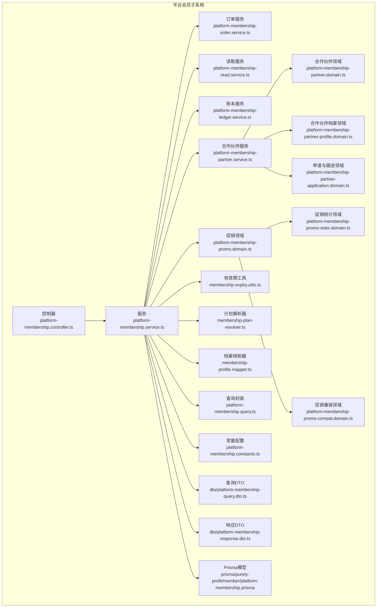

**图表来源**
- [src/purely-profit/member/platform-membership/platform-membership.controller.ts](file://src/purely-profit/member/platform-membership/platform-membership.controller.ts)
- [src/purely-profit/member/platform-membership/platform-membership.service.ts](file://src/purely-profit/member/platform-membership/platform-membership.service.ts)

## 核心组件
- 平台会员控制器：统一入口，路由到各子服务（订单、权益、合作伙伴、统计）
- 平台会员服务：聚合业务编排，协调订单、权益、促销、合作伙伴与查询
- 订单服务：实现单合作伙伴架构下的简化订单处理，支持应用启动时的自动推广记录修复
- 读取服务：中心页、订单列表、合作伙伴档案等只读聚合
- 账本服务：积分流水、可用积分概览、到期计算
- 合作伙伴服务：**重大更新** - 适配单合作伙伴架构，增强同人判定和申请流程管理
- 促销领域：邀请奖励、结算、统计，支持幂等保护和自动修复
- 工具与查询：有效期推导、计划解析、常量、查询封装
- DTO：契约定义，确保接口一致性

**章节来源**
- [src/purely-profit/member/platform-membership/platform-membership.controller.ts](file://src/purely-profit/member/platform-membership/platform-membership.controller.ts)
- [src/purely-profit/member/platform-membership/platform-membership.service.ts](file://src/purely-profit/member/platform-membership/platform-membership.service.ts)
- [src/purely-profit/member/platform-membership/platform-membership-order.service.ts](file://src/purely-profit/member/platform-membership/platform-membership-order.service.ts)
- [src/purely-profit/member/platform-membership/platform-membership-partner.service.ts](file://src/purely-profit/member/platform-membership/platform-membership-partner.service.ts)

## 架构总览
平台会员管理采用"控制器-服务-领域-查询-数据模型"的分层架构。重构为单合作伙伴架构，简化了业务流程和数据模型。控制器负责路由与鉴权，服务编排业务，领域函数处理规则，查询封装数据库访问，数据模型由 Prisma 统一管理。

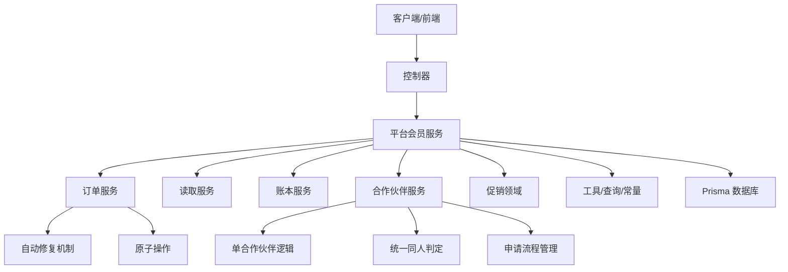

**图表来源**
- [src/purely-profit/member/platform-membership/platform-membership.controller.ts](file://src/purely-profit/member/platform-membership/platform-membership.controller.ts)
- [src/purely-profit/member/platform-membership/platform-membership.service.ts](file://src/purely-profit/member/platform-membership/platform-membership.service.ts)
- [src/purely-profit/member/platform-membership/platform-membership-order.service.ts](file://src/purely-profit/member/platform-membership/platform-membership-order.service.ts)

## 详细组件分析

### 1) 会员购买流程与订单处理
- **新流程要点**
  - 校验门店主账号权限
  - 解析套餐计划与有效期
  - 计算支付金额、积分/纯利豆抵扣上限与赠送积分
  - 使用原子更新进行纯利豆扣减，防止并发问题
  - 创建订单、更新会员档案（生效期、积分余额）、写入积分日志
  - 异步触发推广奖励发放，支持幂等保护

- **关键路径**
  - 控制器接收购买请求
  - 服务调用订单服务执行事务性落库
  - 原子更新合伙人豆余额（乐观锁模式）
  - 更新会员档案与积分流水
  - 异步推广奖励发放（hasCharged 标记作为并发锁）
  - 返回订单与最新会员信息

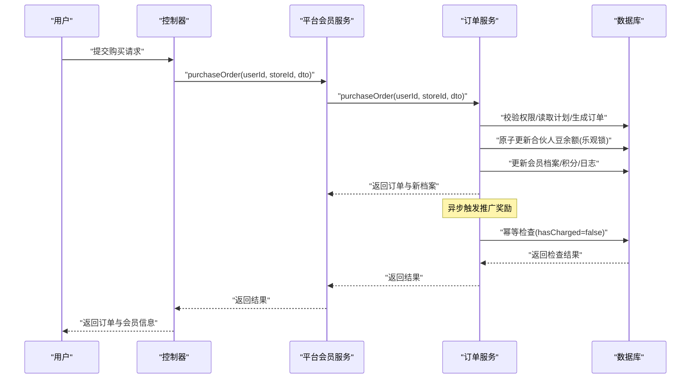

**图表来源**
- [src/purely-profit/member/platform-membership/platform-membership.controller.ts](file://src/purely-profit/member/platform-membership/platform-membership.controller.ts)
- [src/purely-profit/member/platform-membership/platform-membership.service.ts](file://src/purely-profit/member/platform-membership/platform-membership.service.ts)
- [src/purely-profit/member/platform-membership/platform-membership-order.service.ts](file://src/purely-profit/member/platform-membership/platform-membership-order.service.ts)

**章节来源**
- [src/purely-profit/member/platform-membership/platform-membership-order.service.ts](file://src/purely-profit/member/platform-membership/platform-membership-order.service.ts)
- [src/purely-profit/member/platform-membership/platform-membership.constants.ts](file://src/purely-profit/member/platform-membership/platform-membership.constants.ts)

### 2) 会员状态管理与有效期
- 生效期推导：根据已付费订单与计划配置计算当前有效起止时间
- ages 显示：对部分会员显示掩码计划名，但不影响有效期叠加
- 周期与等级：支持月/季/年/终身，用于排序与优先级

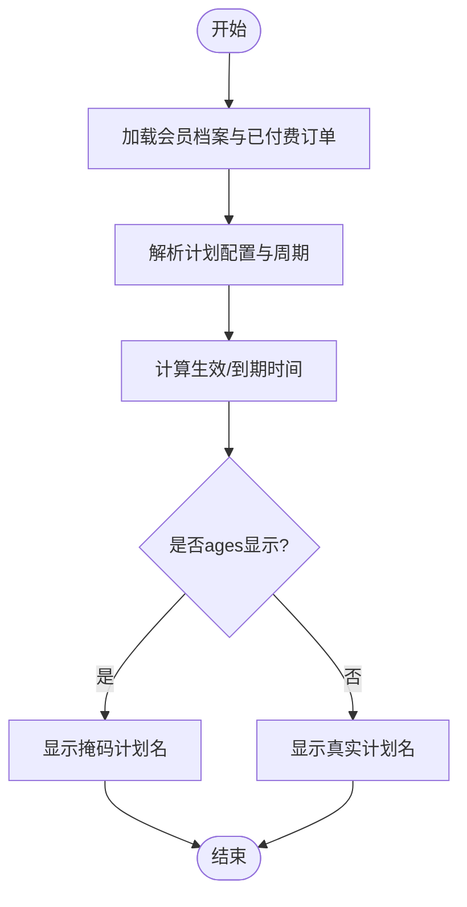

**图表来源**
- [src/purely-profit/member/platform-membership/platform-membership-read.service.ts](file://src/purely-profit/member/platform-membership/platform-membership-read.service.ts)
- [src/purely-profit/member/platform-membership/membership-expiry.utils.ts](file://src/purely-profit/member/platform-membership/membership-expiry.utils.ts)
- [src/purely-profit/member/platform-membership/membership-plan-resolver.ts](file://src/purely-profit/member/platform-membership/membership-plan-resolver.ts)

**章节来源**
- [src/purely-profit/member/platform-membership/platform-membership-read.service.ts](file://src/purely-profit/member/platform-membership/platform-membership-read.service.ts)
- [src/purely-profit/member/platform-membership/membership-expiry.utils.ts](file://src/purely-profit/member/platform-membership/membership-expiry.utils.ts)
- [src/purely-profit/member/platform-membership/membership-plan-resolver.ts](file://src/purely-profit/member/platform-membership/membership-plan-resolver.ts)

### 3) 合作伙伴管理与审核
**重大更新**：合作伙伴领域模型增强，统一的同人判定逻辑和改进的申请流程管理

- **新特性**
  - **统一同人判定**：基于身份证优先、手机号回退的匹配策略，支持号码格式归一化
  - **申请去重机制**：使用申请人身份键进行智能去重，避免重复申请
  - **审批链状态管理**：支持 pending、reviewing、approved、rejected 等多状态并发控制
  - **申请拦截逻辑**：防止同一申请人的重复或冲突申请
  - **历史数据兼容**：完善的向后兼容机制，支持旧版字段映射

- **关键改进**
  - `isSameApplicantIdentifier` 函数提供统一的同人判定逻辑
  - `normalizePartnerPhone` 实现手机号格式归一化处理
  - `findBlockingApplication` 增强申请拦截机制
  - `buildCurrentPartnerApplication` 优化当前申请展示逻辑
  - `deduplicateApplications` 实现智能申请去重

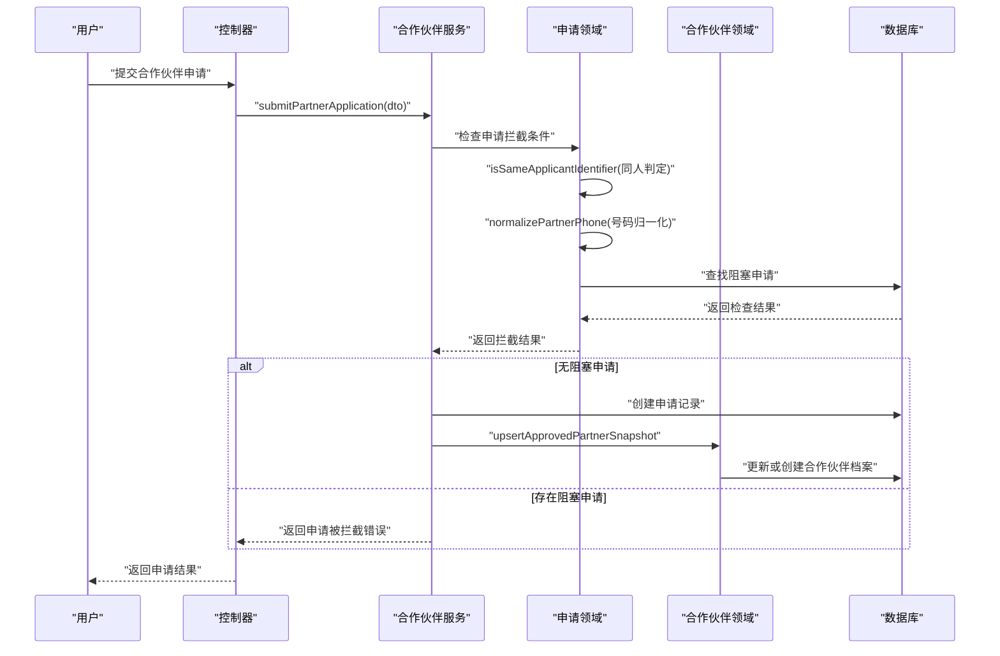

**图表来源**
- [src/purely-profit/member/platform-membership/platform-membership-partner.service.ts](file://src/purely-profit/member/platform-membership/platform-membership-partner.service.ts)
- [src/purely-profit/member/platform-membership/platform-membership-partner-application.domain.ts](file://src/purely-profit/member/platform-membership/platform-membership-partner-application.domain.ts)
- [src/purely-profit/member/platform-membership/platform-membership-partner.domain.ts](file://src/purely-profit/member/platform-membership/platform-membership-partner.domain.ts)

**章节来源**
- [src/purely-profit/member/platform-membership/platform-membership-partner.service.ts](file://src/purely-profit/member/platform-membership/platform-membership-partner.service.ts)
- [src/purely-profit/member/platform-membership/platform-membership-partner-application.domain.ts](file://src/purely-profit/member/platform-membership/platform-membership-partner-application.domain.ts)
- [src/purely-profit/member/platform-membership/platform-membership-partner.domain.ts](file://src/purely-profit/member/platform-membership/platform-membership-partner.domain.ts)
- [src/purely-profit/member/platform-membership/platform-membership-partner-profile.domain.ts](file://src/purely-profit/member/platform-membership/platform-membership-partner-profile.domain.ts)

### 4) 权益与积分/纯利豆管理
- **新特性**
  - 积分抵扣：按比例上限抵扣，生成抵扣日志
  - 赠送积分：按套餐类型赠送积分
  - 可用积分概览：基于订单与日志计算可用积分与到期时间
  - 原子豆扣除：使用 updateMany + gte 条件实现乐观锁
  - 并发安全：防止超扣和竞态条件

- **并发安全机制**
  - 使用 `beanBalance: { gte: payment.actualBeansUsed }` 作为条件
  - 原子 decrement 操作确保数据一致性
  - 失败时抛出冲突异常，提示用户刷新重试

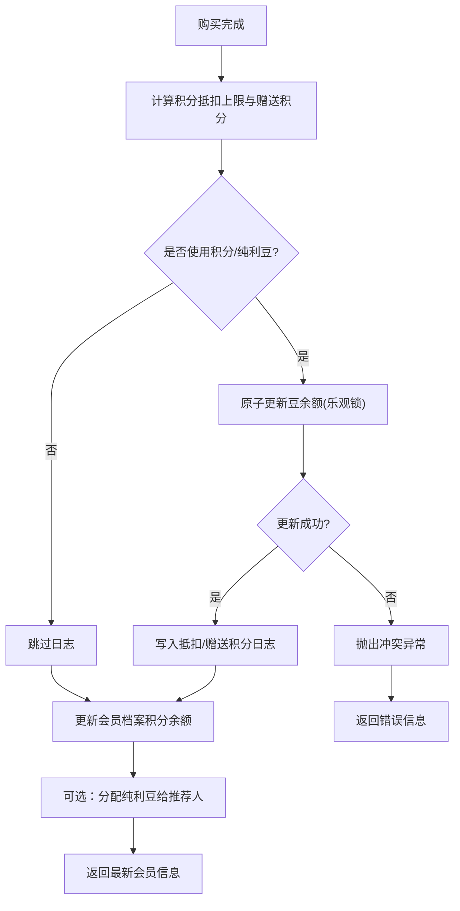

**图表来源**
- [src/purely-profit/member/platform-membership/platform-membership-order.service.ts](file://src/purely-profit/member/platform-membership/platform-membership-order.service.ts)
- [src/purely-profit/member/platform-membership/platform-membership-ledger.service.ts](file://src/purely-profit/member/platform-membership/platform-membership-ledger.service.ts)
- [src/purely-profit/member/platform-membership/platform-membership.constants.ts](file://src/purely-profit/member/platform-membership/platform-membership.constants.ts)

**章节来源**
- [src/purely-profit/member/platform-membership/platform-membership-order.service.ts](file://src/purely-profit/member/platform-membership/platform-membership-order.service.ts)
- [src/purely-profit/member/platform-membership/platform-membership-ledger.service.ts](file://src/purely-profit/member/platform-membership/platform-membership-ledger.service.ts)
- [src/purely-profit/member/platform-membership/platform-membership.constants.ts](file://src/purely-profit/member/platform-membership/platform-membership.constants.ts)

### 5) 促销与收益分配
- **新特性**
  - 促销记录：邀请注册、充值、奖励结算
  - 统计维度：总推广数、已充值推广数、奖励豆汇总
  - 应用启动自动修复：扫描未充值的推广记录并补发奖励
  - 幂等保护：hasCharged 标记防止重复发放
  - 并发安全：updateMany + hasCharged=false 作为并发锁
  - 兼容处理：保留历史字段与流程，保证平滑升级

- **自动修复流程**
  - 服务启动时执行 `backfillUnchargedPromoRecords()`
  - 查找所有 `hasCharged=false` 的记录
  - 检查被推广人是否已完成充值
  - 如果已充值则补发推广奖励
  - 清理重复豆日志并校正余额

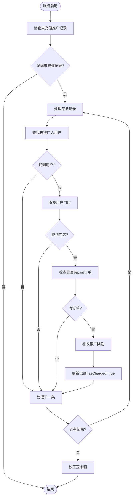

**图表来源**
- [src/purely-profit/member/platform-membership/platform-membership-order.service.ts](file://src/purely-profit/member/platform-membership/platform-membership-order.service.ts)
- [src/purely-profit/member/platform-membership/platform-membership-promo.domain.ts](file://src/purely-profit/member/platform-membership/platform-membership-promo.domain.ts)
- [src/purely-profit/member/platform-membership/platform-membership-promo-stats.domain.ts](file://src/purely-profit/member/platform-membership/platform-membership-promo-stats.domain.ts)
- [src/purely-profit/member/platform-membership/platform-membership-promo-compat.domain.ts](file://src/purely-profit/member/platform-membership/platform-membership-promo-compat.domain.ts)

**章节来源**
- [src/purely-profit/member/platform-membership/platform-membership-order.service.ts](file://src/purely-profit/member/platform-membership/platform-membership-order.service.ts)
- [src/purely-profit/member/platform-membership/platform-membership-promo.domain.ts](file://src/purely-profit/member/platform-membership/platform-membership-promo.domain.ts)
- [src/purely-profit/member/platform-membership/platform-membership-promo-stats.domain.ts](file://src/purely-profit/member/platform-membership/platform-membership-promo-stats.domain.ts)
- [src/purely-profit/member/platform-membership/platform-membership-promo-compat.domain.ts](file://src/purely-profit/member/platform-membership/platform-membership-promo-compat.domain.ts)

### 6) 子账户与登录
- 子账户登录：支持通过子账户登录平台会员中心
- 子账户槽位：管理子账户可用槽位与状态
- 登录态与权限：结合 JWT 与权限守卫
- 子账号额度配置：支持 Pulse 管理端独立配置子账号额度，实现与 Profit 订阅席位配额的解耦

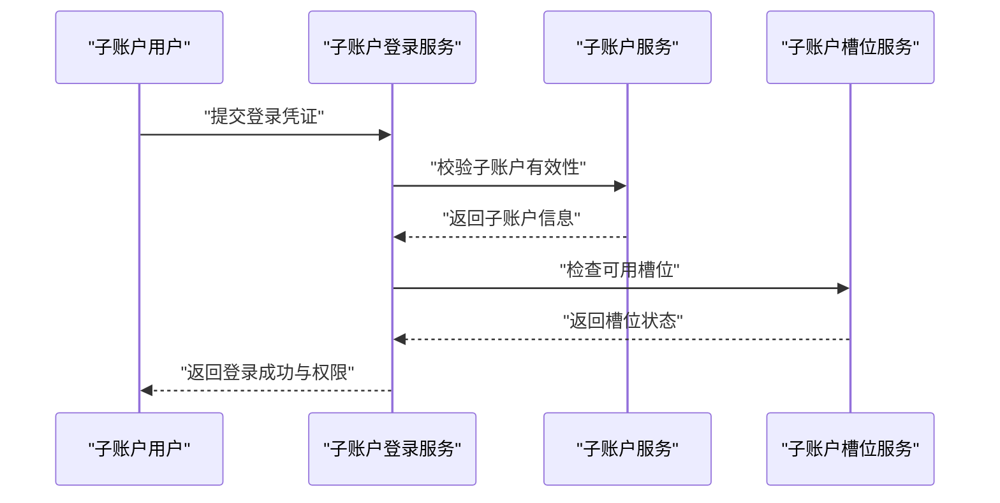

**图表来源**
- [src/purely-profit/member/platform-membership/store-sub-account-login.service.ts](file://src/purely-profit/member/platform-membership/store-sub-account-login.service.ts)
- [src/purely-profit/member/platform-membership/store-sub-account.service.ts](file://src/purely-profit/member/platform-membership/store-sub-account.service.ts)
- [src/purely-profit/member/platform-membership/store-sub-account-slot.service.ts](file://src/purely-profit/member/platform-membership/store-sub-account-slot.service.ts)

**章节来源**
- [src/purely-profit/member/platform-membership/store-sub-account-login.service.ts](file://src/purely-profit/member/platform-membership/store-sub-account-login.service.ts)
- [src/purely-profit/member/platform-membership/store-sub-account.service.ts](file://src/purely-profit/member/platform-membership/store-sub-account.service.ts)
- [src/purely-profit/member/platform-membership/store-sub-account-slot.service.ts](file://src/purely-profit/member/platform-membership/store-sub-account-slot.service.ts)

### 7) 数据模型与关系
平台会员相关模型包括：会员档案、订单、积分日志、合作伙伴、申请与跟进记录、促销记录等。适配单合作伙伴架构，优化数据模型关系。Prisma Schema 定义了表结构与索引，迁移脚本确保数据库演进。

```mermaid
erDiagram
STORE_MEMBERSHIP_PROFILE {
int id PK
int store_id
string current_plan_id
datetime starts_at
datetime expires_at
int total_points
int available_points
}
STORE_MEMBERSHIP_ORDER {
int id PK
int store_id
string plan_id
string plan_name
int amount
int points_used
int beans_used
string status
string payment_channel
string payment_order_id
datetime created_at
}
STORE_MEMBERSHIP_POINTS_LOG {
int id PK
int store_id
int profile_id
string source
int change_amount
string description
datetime expire_at
datetime created_at
}
STORE_PARTNER {
int id PK
int store_id
string name
string phone
string id_card
json region
string intention
string status
int bean_balance
int total_earned_beans
int total_withdrawn_beans
datetime joined_at
datetime reviewed_at
datetime created_at
}
STORE_PARTNER_APPLICATION {
int id PK
int store_id
string name
string phone
string id_card
json region
string intention
string apply_reason
string status
datetime reviewed_at
datetime created_at
}
STORE_PARTNER_APPLICATION_NOTE {
int id PK
int application_id
string content
datetime created_at
}
STORE_MEMBERSHIP_PROMO_RECORD {
int id PK
int store_id
string invitee_name
string invitee_phone
datetime registered_at
boolean has_charged
int charged_amount
datetime charged_at
string charged_plan
int reward_beans
boolean settled
}
STORE_SUB_ACCOUNT {
int id PK
int store_id
int slot_index
string role
string status
boolean is_assigned
int? employee_id
datetime created_at
datetime updated_at
}
STORE_MEMBERSHIP_PROFILE ||--o{ STORE_MEMBERSHIP_ORDER : "拥有"
STORE_MEMBERSHIP_PROFILE ||--o{ STORE_MEMBERSHIP_POINTS_LOG : "产生"
STORE_MEMBERSHIP_PROFILE ||--o{ STORE_MEMBERSHIP_PROMO_RECORD : "关联"
STORE ||--o{ STORE_MEMBERSHIP_PROFILE : "拥有"
STORE ||--o{ STORE_MEMBERSHIP_ORDER : "拥有"
STORE ||--o{ STORE_PARTNER : "拥有"
STORE ||--o{ STORE_PARTNER_APPLICATION : "拥有"
STORE_PARTNER_APPLICATION ||--o{ STORE_PARTNER_APPLICATION_NOTE : "有"
STORE ||--o{ STORE_MEMBERSHIP_PROMO_RECORD : "拥有"
```

**图表来源**
- [prisma/purely-profit/member/platform-membership.prisma](file://prisma/purely-profit/member/platform-membership.prisma)
- [prisma/schema.prisma](file://prisma/schema.prisma)

**章节来源**
- [prisma/purely-profit/member/platform-membership.prisma](file://prisma/purely-profit/member/platform-membership.prisma)
- [prisma/schema.prisma](file://prisma/schema.prisma)

### 8) 并发安全与数据一致性
- **原子更新机制**
  - 豆扣除：使用 `updateMany` + `beanBalance: { gte: amount }` 条件
  - 推广奖励：使用 `hasCharged=false` 作为并发锁
  - 提现操作：使用 `totalWithdrawnBeans: { gte: amount }` 条件

- **幂等保护**
  - 推广记录：`hasCharged` 标记确保不会重复发放奖励
  - 豆日志：去重检查避免重复记录
  - 状态转换：严格的状态机验证

- **数据一致性**
  - 事务边界：所有写操作在事务中执行
  - 乐观锁：基于条件的更新操作
  - 回滚机制：失败时自动回滚所有变更

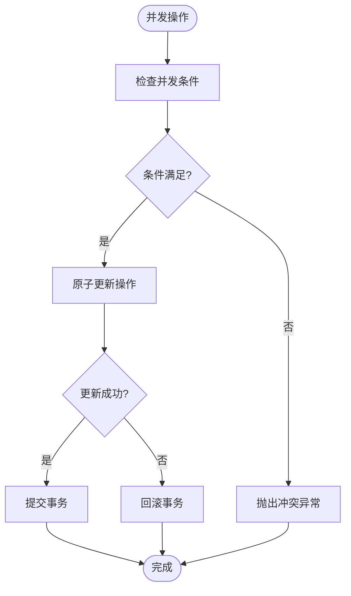

**图表来源**
- [src/purely-profit/member/platform-membership/platform-membership-order.service.ts](file://src/purely-profit/member/platform-membership/platform-membership-order.service.ts)
- [src/purely-profit/member/withdrawals/withdrawals.service.ts](file://src/purely-profit/member/withdrawals/withdrawals.service.ts)

**章节来源**
- [src/purely-profit/member/platform-membership/platform-membership-order.service.ts](file://src/purely-profit/member/platform-membership/platform-membership-order.service.ts)
- [src/purely-profit/member/withdrawals/withdrawals.service.ts](file://src/purely-profit/member/withdrawals/withdrawals.service.ts)

### 9) 测试覆盖与质量保证
**新增功能**：全面的测试覆盖确保业务规则的准确性和系统的稳定性

- **合作伙伴领域模型测试**
  - 同人判定逻辑测试：验证身份证和手机号匹配规则
  - 申请去重测试：确保相同申请人的申请被正确去重
  - 状态管理测试：验证申请流程的状态转换逻辑
  - 兼容性测试：确保历史数据的正确处理

- **权限控制测试**
  - 访问控制测试：验证不同角色的权限边界
  - 资源所有权测试：确保用户只能访问自己的数据
  - 并发安全测试：验证高并发场景下的数据一致性

- **业务规则测试**
  - 会员购买流程测试：端到端的购买流程验证
  - 积分计算测试：验证积分抵扣和赠送规则
  - 合作伙伴审核测试：完整的审核流程验证

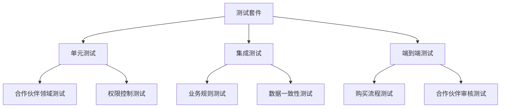

**图表来源**
- [src/purely-profit/member/platform-membership/platform-membership-partner.domain.spec.ts](file://src/purely-profit/member/platform-membership/platform-membership-partner.domain.spec.ts)
- [src/purely-profit/member/platform-membership/platform-membership-partner-review.compat.spec.ts](file://src/purely-profit/member/platform-membership/platform-membership-partner-review.compat.spec.ts)
- [src/purely-profit/member/platform-membership/platform-membership-access.service.spec.ts](file://src/purely-profit/member/platform-membership/platform-membership-access.service.spec.ts)

**章节来源**
- [src/purely-profit/member/platform-membership/platform-membership-partner.domain.spec.ts](file://src/purely-profit/member/platform-membership/platform-membership-partner.domain.spec.ts)
- [src/purely-profit/member/platform-membership/platform-membership-partner-review.compat.spec.ts](file://src/purely-profit/member/platform-membership/platform-membership-partner-review.compat.spec.ts)
- [src/purely-profit/member/platform-membership/platform-membership-access.service.spec.ts](file://src/purely-profit/member/platform-membership/platform-membership-access.service.spec.ts)

## 依赖关系分析
- 组件内聚：控制器仅做路由与参数校验，业务集中在服务层
- 组件耦合：服务层依赖查询、工具与映射，避免直接操作 Prisma
- 外部依赖：Prisma、Redis 缓存失效、JWT 鉴权
- 循环依赖：未见循环导入，查询与映射解耦良好
- 订单服务实现 OnApplicationBootstrap 接口，支持应用启动时的自动修复

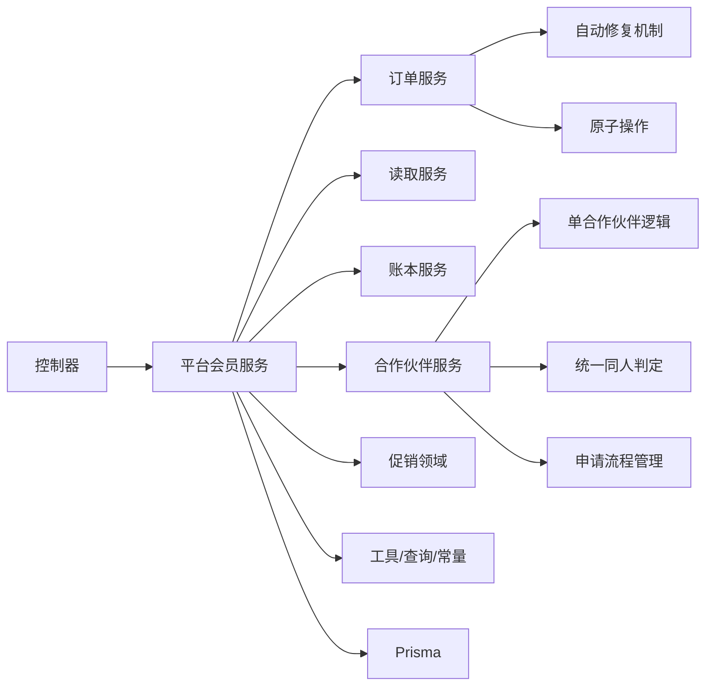

**图表来源**
- [src/purely-profit/member/platform-membership/platform-membership.controller.ts](file://src/purely-profit/member/platform-membership/platform-membership.controller.ts)
- [src/purely-profit/member/platform-membership/platform-membership.service.ts](file://src/purely-profit/member/platform-membership/platform-membership.service.ts)
- [src/purely-profit/member/platform-membership/platform-membership-order.service.ts](file://src/purely-profit/member/platform-membership/platform-membership-order.service.ts)

**章节来源**
- [src/purely-profit/member/platform-membership/platform-membership.service.ts](file://src/purely-profit/member/platform-membership/platform-membership.service.ts)
- [src/purely-profit/member/platform-membership/platform-membership.query.ts](file://src/purely-profit/member/platform-membership/platform-membership.query.ts)

## 性能考虑
- 批量读取：使用 Promise.all 并行查询档案、合作伙伴、促销与订单，降低 RT
- 缓存失效：订单与档案变更触发缓存失效，避免脏读
- 分页与索引：Prisma 查询使用索引与分页 DTO，控制数据量
- 事务边界：订单落库在单事务中，保证一致性与原子性
- 原子操作性能：updateMany 操作比多次 update 更高效
- 异步处理：推广奖励发放采用异步方式，不阻塞主流程
- 幂等优化：hasCharged 标记减少重复计算开销
- **新增** - 同人判定优化：高效的身份证和手机号匹配算法
- **新增** - 申请去重优化：基于哈希表的快速去重机制

## 故障排查指南
- 订单状态异常
  - 检查订单状态枚举与流转条件
  - 核对积分/纯利豆抵扣上限与日志
- 会员状态不正确
  - 核对已付费订单与计划配置
  - 检查 ages 显示与有效期叠加逻辑
- 合作伙伴审核问题
  - 对比申请记录与跟进记录
  - 确认兼容字段与审核流程
- 积分/纯利豆异常
  - 校验抵扣比例与赠送规则
  - 查看积分日志与到期时间
- 并发冲突问题
  - 检查豆余额不足的错误提示
  - 确认乐观锁条件是否正确设置
  - 验证事务回滚机制
- 推广奖励重复发放
  - 检查 hasCharged 标记逻辑
  - 确认幂等保护是否生效
  - 查看自动修复日志
- 自动修复失败
  - 检查应用启动日志中的修复过程
  - 确认数据库连接是否正常
  - 验证用户邮箱格式是否正确
- **新增** - 同人判定问题
  - 检查身份证格式和手机号归一化逻辑
  - 验证申请去重机制是否正常工作
  - 确认申请拦截逻辑的正确性
- **新增** - 申请流程异常
  - 检查申请状态转换逻辑
  - 验证审批链处理的正确性
  - 确认历史数据兼容性

**章节来源**
- [src/purely-profit/member/platform-membership/platform-membership-order.service.ts](file://src/purely-profit/member/platform-membership/platform-membership-order.service.ts)
- [src/purely-profit/member/platform-membership/platform-membership-read.service.ts](file://src/purely-profit/member/platform-membership/platform-membership-read.service.ts)
- [src/purely-profit/member/platform-membership/platform-membership-partner.domain.ts](file://src/purely-profit/member/platform-membership/platform-membership-partner.domain.ts)
- [src/purely-profit/member/platform-membership/platform-membership.constants.ts](file://src/purely-profit/member/platform-membership/platform-membership.constants.ts)

## 结论
平台会员管理通过清晰的分层设计与领域驱动实现了从购买到权益、从合作伙伴到收益分配的完整闭环。系统已成功重构为单合作伙伴架构，大幅简化了业务流程。新增的统一同人判定逻辑和改进的申请流程管理确保了合作伙伴管理的准确性。全面的测试覆盖保障了业务规则的正确性和系统的稳定性。应用启动自动修复机制确保了数据一致性，而基于原子更新和乐观锁模式的并发安全保障提升了系统的健壮性。模块化与契约化（DTO）提升了可维护性与可测试性；事务与缓存策略保障了数据一致性与性能。建议在集成时严格遵循 DTO 约定，并关注有效期与抵扣规则的边界场景，以及并发安全的最佳实践。

## 附录

### A. 平台会员 API 示例与集成指南
- 购买会员订单
  - 方法与路径：POST /platform-membership/orders
  - 请求体：包含 planId（月/季/年/终身）
  - 响应：订单信息与最新会员档案
  - 并发安全：支持高并发购买场景
  - 参考路径：[PurchasePlatformMembershipOrderDto](file://src/purely-profit/member/platform-membership/dto/platform-membership-query.dto.ts)
- 获取会员中心
  - 方法与路径：GET /platform-membership/profile
  - 响应：会员信息、剩余天数、统计、我的申请与已批准伙伴
  - 参考路径：[PlatformMembershipProfileResponseDto](file://src/purely-profit/member/platform-membership/dto/platform-membership-center.response.dto.ts)
- 获取积分流水
  - 方法与路径：GET /platform-membership/points/logs
  - 响应：可用积分概览与明细
  - 参考路径：[PlatformMembershipPointsLogsResponseDto](file://src/purely-profit/member/platform-membership/dto/platform-membership-points.response.dto.ts)
- 合作伙伴档案
  - 方法与路径：GET /platform-membership/partners/profile
  - 响应：已批准伙伴、历史申请与跟进记录
  - 单合作伙伴：只返回当前合作伙伴信息
  - 参考路径：[PlatformMembershipPartnerProfileResponseDto](file://src/purely-profit/member/platform-membership/dto/platform-membership-partner.response.dto.ts)
- 提交合作伙伴申请
  - 方法与路径：POST /platform-membership/partners/application
  - 请求体：包含姓名、电话、身份证号等基本信息
  - 响应：申请状态和处理结果
  - 同人判定：自动检测重复申请
  - 参考路径：[ApplyPlatformPartnerDto](file://src/purely-profit/member/platform-membership/dto/platform-membership-query.dto.ts)
- 子账户登录
  - 方法与路径：POST /platform-membership/sub-account/login
  - 响应：登录成功与权限
  - 参考路径：[store-sub-account-login.service.ts](file://src/purely-profit/member/platform-membership/store-sub-account-login.service.ts)

**章节来源**
- [src/purely-profit/member/platform-membership/dto/platform-membership-query.dto.ts](file://src/purely-profit/member/platform-membership/dto/platform-membership-query.dto.ts)
- [src/purely-profit/member/platform-membership/dto/platform-membership-center.response.dto.ts](file://src/purely-profit/member/platform-membership/dto/platform-membership-center.response.dto.ts)
- [src/purely-profit/member/platform-membership/dto/platform-membership-points.response.dto.ts](file://src/purely-profit/member/platform-membership/dto/platform-membership-points.response.dto.ts)
- [src/purely-profit/member/platform-membership/dto/platform-membership-partner.response.dto.ts](file://src/purely-profit/member/platform-membership/dto/platform-membership-partner.response.dto.ts)
- [src/purely-profit/member/platform-membership/store-sub-account-login.service.ts](file://src/purely-profit/member/platform-membership/store-sub-account-login.service.ts)

### B. 业务流程说明与最佳实践
- 购买流程
  - 校验权限 → 解析计划 → 计算抵扣与赠送 → 事务落库 → 原子更新豆余额 → 更新档案与日志 → 异步推广奖励 → 返回结果
- 会员状态管理
  - 基于已付费订单与计划配置推导有效期，ages 显示不影响叠加
- 合作伙伴审核
  - 申请与历史记录分离，兼容旧版审核字段，单合作伙伴逻辑
  - **新增** - 统一同人判定：基于身份证优先、手机号回退的匹配策略
  - **新增** - 智能申请去重：避免重复申请和资源浪费
  - **新增** - 多状态并发控制：支持复杂的审批流程
- 收益分配
  - 促销奖励按规则结算，支持统计与对账，幂等保护与自动修复
- 并发安全最佳实践
  - 使用原子更新操作替代多次数据库查询
  - 实现幂等保护防止重复操作
  - 合理设计事务边界确保数据一致性
- 自动修复流程
  - 服务启动 → 检查未充值推广记录 → 查找被推广人 → 验证充值状态 → 补发奖励 → 校正余额 → 清除缓存
- **新增** - 申请流程最佳实践
  - 同人判定标准化：确保申请识别的一致性
  - 号码格式归一化：处理各种电话号码格式差异
  - 申请状态机：严格的狀態转换控制
  - 历史数据兼容：平滑的数据迁移策略

**章节来源**
- [src/purely-profit/member/platform-membership/platform-membership-order.service.ts](file://src/purely-profit/member/platform-membership/platform-membership-order.service.ts)
- [src/purely-profit/member/platform-membership/platform-membership-read.service.ts](file://src/purely-profit/member/platform-membership/platform-membership-read.service.ts)
- [src/purely-profit/member/platform-membership/platform-membership-partner.domain.ts](file://src/purely-profit/member/platform-membership/platform-membership-partner.domain.ts)
- [src/purely-profit/member/platform-membership/platform-membership-promo.domain.ts](file://src/purely-profit/member/platform-membership/platform-membership-promo.domain.ts)
- [src/purely-profit/member/platform-membership/platform-membership-partner-application.domain.ts](file://src/purely-profit/member/platform-membership/platform-membership-partner-application.domain.ts)

### C. 数据库迁移与升级指南
- 单合作伙伴架构迁移
  - 数据模型保持不变，但业务逻辑改为单合作伙伴
  - 查询函数 `findCurrentStorePartner` 改为返回单一合作伙伴
  - 保持向后兼容性，支持历史数据
- 并发安全增强
  - 数据库约束确保豆余额非负
  - 添加检查约束防止数据不一致
  - 优化索引提升查询性能
- 自动修复机制
  - 应用启动时自动检测并修复数据不一致
  - 清理重复的豆日志记录
  - 重新计算正确的豆余额
- **新增** - 合作伙伴领域模型增强
  - 支持统一的同人判定逻辑
  - 实现申请去重和状态管理
  - 完善历史数据兼容性
- **新增** - 测试基础设施
  - 全面的单元测试覆盖
  - 集成测试确保业务流程正确性
  - 端到端测试验证系统完整性

**章节来源**
- [src/purely-profit/member/platform-membership/platform-membership-order.service.ts](file://src/purely-profit/member/platform-membership/platform-membership-order.service.ts)
- [prisma/migrations/20260627000000_safety_and_performance_indexes/migration.sql](file://prisma/migrations/20260627000000_safety_and_performance_indexes/migration.sql)
- [src/purely-profit/member/platform-membership/platform-membership-partner-application.domain.ts](file://src/purely-profit/member/platform-membership/platform-membership-partner-application.domain.ts)