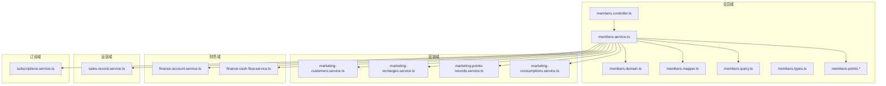
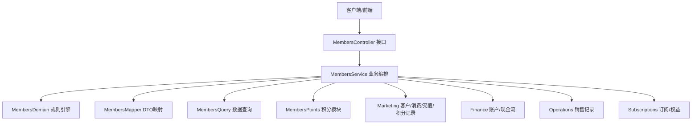
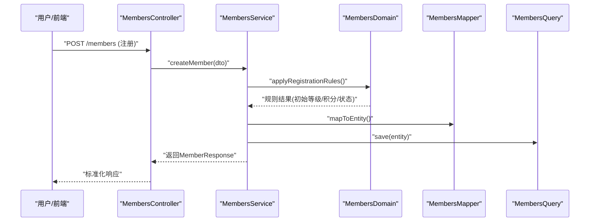
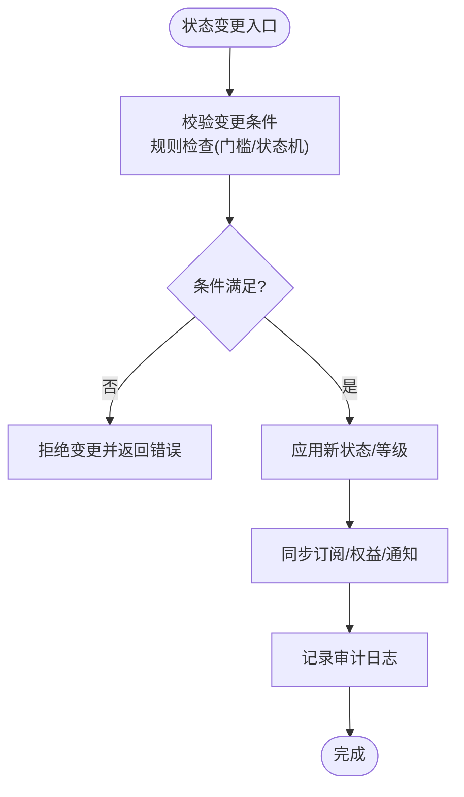
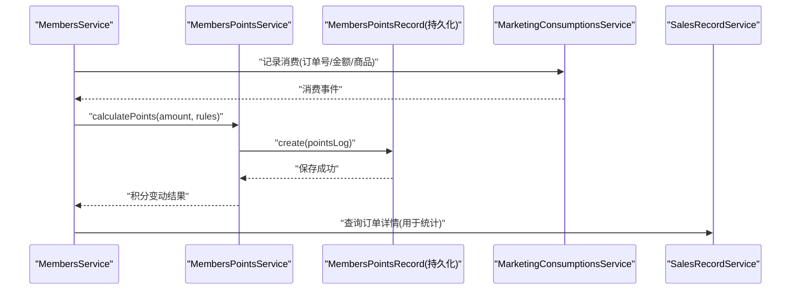
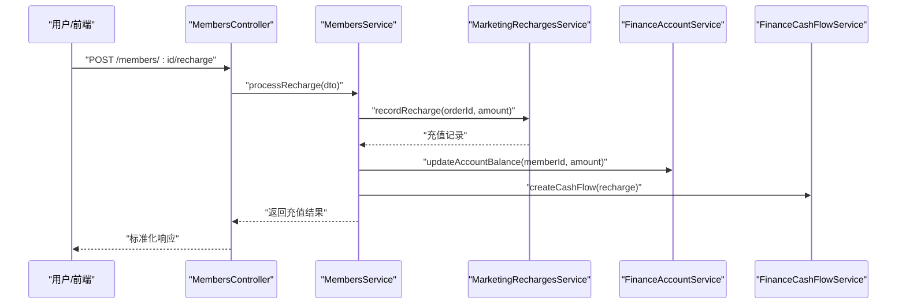
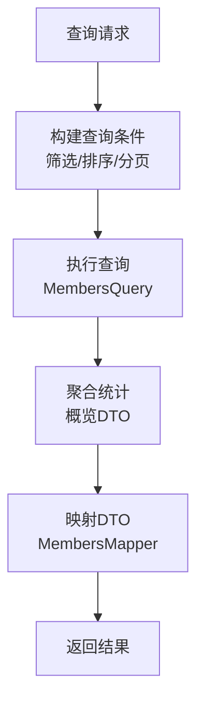
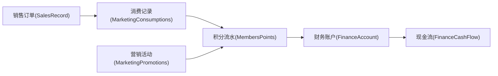
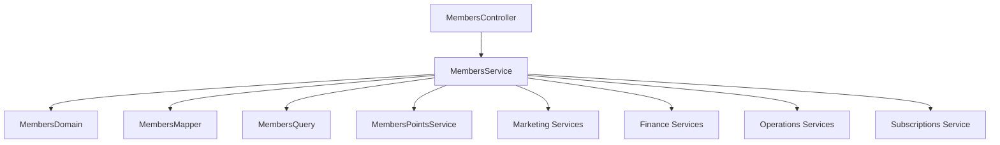

# 普通会员管理

<cite>
**本文引用的文件**
- [prisma/schema.prisma](file://prisma/schema.prisma)
- [prisma/purely-profit/member/members.prisma](file://prisma/purely-profit/member/members.prisma)
- [src/purely-profit/member/members/members.controller.ts](file://src/purely-profit/member/members/members.controller.ts)
- [src/purely-profit/member/members/members.service.ts](file://src/purely-profit/member/members/members.service.ts)
- [src/purely-profit/member/members/members.domain.ts](file://src/purely-profit/member/members/members.domain.ts)
- [src/purely-profit/member/members/members.mapper.ts](file://src/purely-profit/member/members/members.mapper.ts)
- [src/purely-profit/member/members/members.query.ts](file://src/purely-profit/member/members/members.query.ts)
- [src/purely-profit/member/members/members.types.ts](file://src/purely-profit/member/members/members.types.ts)
- [src/purely-profit/member/members/dto/create-member.dto.ts](file://src/purely-profit/member/members/dto/create-member.dto.ts)
- [src/purely-profit/member/members/dto/update-member.dto.ts](file://src/purely-profit/member/members/dto/update-member.dto.ts)
- [src/purely-profit/member/members/dto/member-response.dto.ts](file://src/purely-profit/member/members/dto/member-response.dto.ts)
- [src/purely-profit/member/members/dto/member-points.dto.ts](file://src/purely-profit/member/members/dto/member-points.dto.ts)
- [src/purely-profit/member/members/dto/member-overview.dto.ts](file://src/purely-profit/member/members/dto/member-overview.dto.ts)
- [src/purely-profit/member/members/members-points.service.ts](file://src/purely-profit/member/members/members-points.service.ts)
- [src/purely-profit/member/members/members-points.mapper.ts](file://src/purely-profit/member/members/members-points.mapper.ts)
- [src/purely-profit/member/members/members-points.query.ts](file://src/purely-profit/member/members/members-points.query.ts)
- [src/purely-profit/member/members/members-points.shared.ts](file://src/purely-profit/member/members/members-points.shared.ts)
- [src/purely-profit/member/members/members-points.config.ts](file://src/purely-profit/member/members/members-points.config.ts)
- [src/purely-profit/marketing/marketing-customers.service.ts](file://src/purely-profit/marketing/marketing-customers.service.ts)
- [src/purely-profit/marketing/marketing-consumptions.service.ts](file://src/purely-profit/marketing/marketing-consumptions.service.ts)
- [src/purely-profit/marketing/marketing-recharges.service.ts](file://src/purely-profit/marketing/marketing-recharges.service.ts)
- [src/purely-profit/marketing/marketing-points-records.service.ts](file://src/purely-profit/marketing/marketing-points-records.service.ts)
- [src/purely-profit/finance/finance-account.service.ts](file://src/purely-profit/finance/finance-account.service.ts)
- [src/purely-profit/finance/finance-cash-flow.service.ts](file://src/purely-profit/finance/finance-cash-flow.service.ts)
- [src/purely-profit/operations/sales-record/sales-record.service.ts](file://src/purely-profit/operations/sales-record/sales-record.service.ts)
- [src/purely-profit/subscriptions/subscriptions.service.ts](file://src/purely-profit/subscriptions/subscriptions.service.ts)
</cite>

## 目录
1. [简介](#简介)
2. [项目结构](#项目结构)
3. [核心组件](#核心组件)
4. [架构总览](#架构总览)
5. [详细组件分析](#详细组件分析)
6. [依赖分析](#依赖分析)
7. [性能考虑](#性能考虑)
8. [故障排除指南](#故障排除指南)
9. [结论](#结论)
10. [附录](#附录)

## 简介
本文件面向“普通会员管理”功能，系统性阐述会员注册、信息维护、等级管理、积分与消费记录、权益与状态控制、查询筛选与统计等核心能力，并结合营销、财务、销售等模块展示会员在平台中的业务闭环。文档以代码为依据，通过架构图、时序图、流程图等形式帮助读者快速理解实现方式与最佳实践。

## 项目结构
普通会员管理位于“purely-profit”领域内，采用按功能域分层组织：控制器（controller）负责HTTP接口、服务（service）封装业务逻辑、领域模型（domain）承载规则、映射器（mapper）处理DTO转换、查询（query）与共享配置（shared）支撑数据访问与策略。

图表来源
- [src/purely-profit/member/members/members.controller.ts:1-200](file://src/purely-profit/member/members/members.controller.ts#L1-L200)
- [src/purely-profit/member/members/members.service.ts:1-300](file://src/purely-profit/member/members/members.service.ts#L1-L300)
- [src/purely-profit/member/members/members.domain.ts:1-200](file://src/purely-profit/member/members/members.domain.ts#L1-L200)
- [src/purely-profit/member/members/members.mapper.ts:1-150](file://src/purely-profit/member/members/members.mapper.ts#L1-L150)
- [src/purely-profit/member/members/members.query.ts:1-200](file://src/purely-profit/member/members/members.query.ts#L1-L200)
- [src/purely-profit/member/members/members-points.service.ts:1-200](file://src/purely-profit/member/members/members-points.service.ts#L1-L200)
- [src/purely-profit/marketing/marketing-customers.service.ts:1-200](file://src/purely-profit/marketing/marketing-customers.service.ts#L1-L200)
- [src/purely-profit/marketing/marketing-recharges.service.ts:1-200](file://src/purely-profit/marketing/marketing-recharges.service.ts#L1-L200)
- [src/purely-profit/marketing/marketing-points-records.service.ts:1-200](file://src/purely-profit/marketing/marketing-points-records.service.ts#L1-L200)
- [src/purely-profit/marketing/marketing-consumptions.service.ts:1-200](file://src/purely-profit/marketing/marketing-consumptions.service.ts#L1-L200)
- [src/purely-profit/finance/finance-account.service.ts:1-200](file://src/purely-profit/finance/finance-account.service.ts#L1-L200)
- [src/purely-profit/finance/finance-cash-flow.service.ts:1-200](file://src/purely-profit/finance/finance-cash-flow.service.ts#L1-L200)
- [src/purely-profit/operations/sales-record/sales-record.service.ts:1-200](file://src/purely-profit/operations/sales-record/sales-record.service.ts#L1-L200)
- [src/purely-profit/subscriptions/subscriptions.service.ts:1-200](file://src/purely-profit/subscriptions/subscriptions.service.ts#L1-L200)

章节来源
- [src/purely-profit/member/members/members.controller.ts:1-200](file://src/purely-profit/member/members/members.controller.ts#L1-L200)
- [src/purely-profit/member/members/members.service.ts:1-300](file://src/purely-profit/member/members/members.service.ts#L1-L300)

## 核心组件
- 控制器（MembersController）
  - 负责接收HTTP请求，校验参数，调用服务层执行业务，并返回标准化响应。
  - 关键职责：会员创建、更新、详情查询、列表与筛选、积分明细与概览、等级与权益查询等。
- 服务（MembersService）
  - 封装会员生命周期业务：注册、信息变更、状态变更、等级升降、积分计算与流水、消费与充值记录、概览统计等。
  - 协调领域模型、映射器、查询器与外部模块（营销、财务、运营）。
- 领域模型（MembersDomain）
  - 定义会员实体规则、等级转换策略、积分计算规则、状态机与权限边界。
- 映射器（MembersMapper）
  - 负责数据库实体与DTO之间的双向转换，确保接口输出一致且安全。
- 查询（MembersQuery）
  - 提供筛选、排序、分页、聚合等查询能力，支持多维度统计。
- 积分模块（MembersPoints*）
  - 专门处理积分增减、来源类型、流水记录、阈值与规则配置，以及与营销活动的联动。

章节来源
- [src/purely-profit/member/members/members.controller.ts:1-200](file://src/purely-profit/member/members/members.controller.ts#L1-L200)
- [src/purely-profit/member/members/members.service.ts:1-300](file://src/purely-profit/member/members/members.service.ts#L1-L300)
- [src/purely-profit/member/members/members.domain.ts:1-200](file://src/purely-profit/member/members/members.domain.ts#L1-L200)
- [src/purely-profit/member/members/members.mapper.ts:1-150](file://src/purely-profit/member/members/members.mapper.ts#L1-L150)
- [src/purely-profit/member/members/members.query.ts:1-200](file://src/purely-profit/member/members/members.query.ts#L1-L200)
- [src/purely-profit/member/members/members-points.service.ts:1-200](file://src/purely-profit/member/members/members-points.service.ts#L1-L200)

## 架构总览
普通会员管理围绕“控制器-服务-领域-映射-查询”的分层设计，同时与营销、财务、运营、订阅等模块进行松耦合协作，形成完整的会员生命周期闭环。

图表来源
- [src/purely-profit/member/members/members.controller.ts:1-200](file://src/purely-profit/member/members/members.controller.ts#L1-L200)
- [src/purely-profit/member/members/members.service.ts:1-300](file://src/purely-profit/member/members/members.service.ts#L1-L300)
- [src/purely-profit/member/members/members.domain.ts:1-200](file://src/purely-profit/member/members/members.domain.ts#L1-L200)
- [src/purely-profit/member/members/members.mapper.ts:1-150](file://src/purely-profit/member/members/members.mapper.ts#L1-L150)
- [src/purely-profit/member/members/members.query.ts:1-200](file://src/purely-profit/member/members/members.query.ts#L1-L200)
- [src/purely-profit/member/members/members-points.service.ts:1-200](file://src/purely-profit/member/members/members-points.service.ts#L1-L200)
- [src/purely-profit/marketing/marketing-customers.service.ts:1-200](file://src/purely-profit/marketing/marketing-customers.service.ts#L1-L200)
- [src/purely-profit/marketing/marketing-consumptions.service.ts:1-200](file://src/purely-profit/marketing/marketing-consumptions.service.ts#L1-L200)
- [src/purely-profit/marketing/marketing-recharges.service.ts:1-200](file://src/purely-profit/marketing/marketing-recharges.service.ts#L1-L200)
- [src/purely-profit/marketing/marketing-points-records.service.ts:1-200](file://src/purely-profit/marketing/marketing-points-records.service.ts#L1-L200)
- [src/purely-profit/finance/finance-account.service.ts:1-200](file://src/purely-profit/finance/finance-account.service.ts#L1-L200)
- [src/purely-profit/finance/finance-cash-flow.service.ts:1-200](file://src/purely-profit/finance/finance-cash-flow.service.ts#L1-L200)
- [src/purely-profit/operations/sales-record/sales-record.service.ts:1-200](file://src/purely-profit/operations/sales-record/sales-record.service.ts#L1-L200)
- [src/purely-profit/subscriptions/subscriptions.service.ts:1-200](file://src/purely-profit/subscriptions/subscriptions.service.ts#L1-L200)

## 详细组件分析

### 1) 会员注册与信息维护
- 注册流程
  - 接口接收注册参数，调用服务层创建会员，写入基础信息与初始状态。
  - 服务层触发领域规则：如首次注册权益、默认等级、初始积分等。
  - 返回标准化响应DTO，包含会员标识、基础信息与初始状态。
- 信息维护
  - 支持字段级更新（如姓名、生日、联系方式、地址等），服务层进行字段校验与变更审计。
  - 更新后同步影响营销客户档案、订阅权益与财务账户关联。

图表来源
- [src/purely-profit/member/members/members.controller.ts:1-200](file://src/purely-profit/member/members/members.controller.ts#L1-L200)
- [src/purely-profit/member/members/members.service.ts:1-300](file://src/purely-profit/member/members/members.service.ts#L1-L300)
- [src/purely-profit/member/members/members.domain.ts:1-200](file://src/purely-profit/member/members/members.domain.ts#L1-L200)
- [src/purely-profit/member/members/members.mapper.ts:1-150](file://src/purely-profit/member/members/members.mapper.ts#L1-L150)
- [src/purely-profit/member/members/members.query.ts:1-200](file://src/purely-profit/member/members/members.query.ts#L1-L200)

章节来源
- [src/purely-profit/member/members/members.controller.ts:1-200](file://src/purely-profit/member/members/members.controller.ts#L1-L200)
- [src/purely-profit/member/members/members.service.ts:1-300](file://src/purely-profit/member/members/members.service.ts#L1-L300)
- [src/purely-profit/member/members/members.domain.ts:1-200](file://src/purely-profit/member/members/members.domain.ts#L1-L200)
- [src/purely-profit/member/members/members.mapper.ts:1-150](file://src/purely-profit/member/members/members.mapper.ts#L1-L150)
- [src/purely-profit/member/members/members.query.ts:1-200](file://src/purely-profit/member/members/members.query.ts#L1-L200)

### 2) 会员状态控制与等级管理
- 状态控制
  - 支持启用/禁用、锁定/解锁、注销等状态变更；变更需满足领域规则（如最低消费门槛、欠款清零等）。
  - 状态变更触发通知与审计日志，同步更新订阅与权益。
- 等级管理
  - 基于消费金额/频次/积分累计等指标自动或手动升降级。
  - 等级规则由配置驱动，支持阈值、有效期、专属权益映射。

图表来源
- [src/purely-profit/member/members/members.domain.ts:1-200](file://src/purely-profit/member/members/members.domain.ts#L1-L200)
- [src/purely-profit/member/members/members.service.ts:1-300](file://src/purely-profit/member/members/members.service.ts#L1-L300)
- [src/purely-profit/subscriptions/subscriptions.service.ts:1-200](file://src/purely-profit/subscriptions/subscriptions.service.ts#L1-L200)

章节来源
- [src/purely-profit/member/members/members.domain.ts:1-200](file://src/purely-profit/member/members/members.domain.ts#L1-L200)
- [src/purely-profit/member/members/members.service.ts:1-300](file://src/purely-profit/member/members/members.service.ts#L1-L300)
- [src/purely-profit/subscriptions/subscriptions.service.ts:1-200](file://src/purely-profit/subscriptions/subscriptions.service.ts#L1-L200)

### 3) 积分累积与消费记录
- 积分累积
  - 消费返点、活动奖励、签到、评价等场景产生积分流水；支持正负调整与来源分类。
  - 积分配置可动态调整比例与上限，服务层统一计算并落库。
- 消费记录
  - 关联销售订单，记录商品、金额、时间、渠道等；支持按会员维度聚合统计。

图表来源
- [src/purely-profit/member/members/members-points.service.ts:1-200](file://src/purely-profit/member/members/members-points.service.ts#L1-L200)
- [src/purely-profit/marketing/marketing-consumptions.service.ts:1-200](file://src/purely-profit/marketing/marketing-consumptions.service.ts#L1-L200)
- [src/purely-profit/operations/sales-record/sales-record.service.ts:1-200](file://src/purely-profit/operations/sales-record/sales-record.service.ts#L1-L200)

章节来源
- [src/purely-profit/member/members/members-points.service.ts:1-200](file://src/purely-profit/member/members/members-points.service.ts#L1-L200)
- [src/purely-profit/marketing/marketing-consumptions.service.ts:1-200](file://src/purely-profit/marketing/marketing-consumptions.service.ts#L1-L200)
- [src/purely-profit/operations/sales-record/sales-record.service.ts:1-200](file://src/purely-profit/operations/sales-record/sales-record.service.ts#L1-L200)

### 4) 会员权益与充值管理
- 权益
  - 等级绑定专属折扣、免邮、生日特权等；订阅服务根据会员状态实时生效。
- 充值
  - 支持余额充值与积分充值两种路径；充值事件同步至财务账户与积分流水。

图表来源
- [src/purely-profit/member/members/members.controller.ts:1-200](file://src/purely-profit/member/members/members.controller.ts#L1-L200)
- [src/purely-profit/member/members/members.service.ts:1-300](file://src/purely-profit/member/members/members.service.ts#L1-L300)
- [src/purely-profit/marketing/marketing-recharges.service.ts:1-200](file://src/purely-profit/marketing/marketing-recharges.service.ts#L1-L200)
- [src/purely-profit/finance/finance-account.service.ts:1-200](file://src/purely-profit/finance/finance-account.service.ts#L1-L200)
- [src/purely-profit/finance/finance-cash-flow.service.ts:1-200](file://src/purely-profit/finance/finance-cash-flow.service.ts#L1-L200)

章节来源
- [src/purely-profit/member/members/members.controller.ts:1-200](file://src/purely-profit/member/members/members.controller.ts#L1-L200)
- [src/purely-profit/member/members/members.service.ts:1-300](file://src/purely-profit/member/members/members.service.ts#L1-L300)
- [src/purely-profit/marketing/marketing-recharges.service.ts:1-200](file://src/purely-profit/marketing/marketing-recharges.service.ts#L1-L200)
- [src/purely-profit/finance/finance-account.service.ts:1-200](file://src/purely-profit/finance/finance-account.service.ts#L1-L200)
- [src/purely-profit/finance/finance-cash-flow.service.ts:1-200](file://src/purely-profit/finance/finance-cash-flow.service.ts#L1-L200)

### 5) 会员查询、筛选与统计
- 查询接口
  - 支持按会员ID、手机号、姓名、等级、状态、时间范围等多维筛选。
  - 分页与排序（创建时间、最近消费时间、累计消费额、积分余额等）。
- 统计报表
  - 新增趋势、活跃度、等级分布、积分产出/消耗、充值转化等指标。

图表来源
- [src/purely-profit/member/members/members.query.ts:1-200](file://src/purely-profit/member/members/members.query.ts#L1-L200)
- [src/purely-profit/member/members/members.mapper.ts:1-150](file://src/purely-profit/member/members/members.mapper.ts#L1-L150)
- [src/purely-profit/member/members/members-points.query.ts:1-200](file://src/purely-profit/member/members/members-points.query.ts#L1-L200)
- [src/purely-profit/member/members/dto/member-overview.dto.ts:1-100](file://src/purely-profit/member/members/dto/member-overview.dto.ts#L1-L100)

章节来源
- [src/purely-profit/member/members/members.query.ts:1-200](file://src/purely-profit/member/members/members.query.ts#L1-L200)
- [src/purely-profit/member/members/members.mapper.ts:1-150](file://src/purely-profit/member/members/members.mapper.ts#L1-L150)
- [src/purely-profit/member/members/members-points.query.ts:1-200](file://src/purely-profit/member/members/members-points.query.ts#L1-L200)
- [src/purely-profit/member/members/dto/member-overview.dto.ts:1-100](file://src/purely-profit/member/members/dto/member-overview.dto.ts#L1-L100)

### 6) 会员与商品购买、营销活动、财务结算的交互
- 商品购买
  - 销售订单生成后，触发消费记录与积分计算；订单状态变化影响会员等级与权益。
- 营销活动
  - 活动报名、参与、核销与奖励发放均与会员绑定；积分流水与活动来源关联。
- 财务结算
  - 充值、消费、退款等交易同步至账户与现金流，支持对账与报表。

图表来源
- [src/purely-profit/operations/sales-record/sales-record.service.ts:1-200](file://src/purely-profit/operations/sales-record/sales-record.service.ts#L1-L200)
- [src/purely-profit/marketing/marketing-consumptions.service.ts:1-200](file://src/purely-profit/marketing/marketing-consumptions.service.ts#L1-L200)
- [src/purely-profit/member/members/members-points.service.ts:1-200](file://src/purely-profit/member/members/members-points.service.ts#L1-L200)
- [src/purely-profit/finance/finance-account.service.ts:1-200](file://src/purely-profit/finance/finance-account.service.ts#L1-L200)
- [src/purely-profit/finance/finance-cash-flow.service.ts:1-200](file://src/purely-profit/finance/finance-cash-flow.service.ts#L1-L200)

章节来源
- [src/purely-profit/operations/sales-record/sales-record.service.ts:1-200](file://src/purely-profit/operations/sales-record/sales-record.service.ts#L1-L200)
- [src/purely-profit/marketing/marketing-consumptions.service.ts:1-200](file://src/purely-profit/marketing/marketing-consumptions.service.ts#L1-L200)
- [src/purely-profit/member/members/members-points.service.ts:1-200](file://src/purely-profit/member/members/members-points.service.ts#L1-L200)
- [src/purely-profit/finance/finance-account.service.ts:1-200](file://src/purely-profit/finance/finance-account.service.ts#L1-L200)
- [src/purely-profit/finance/finance-cash-flow.service.ts:1-200](file://src/purely-profit/finance/finance-cash-flow.service.ts#L1-L200)

## 依赖分析
- 内部耦合
  - MembersController 依赖 MembersService；MembersService 依赖 Domain、Mapper、Query、Points 与外部模块。
  - 积分模块与营销、财务、运营模块存在跨域依赖，但通过服务层解耦。
- 外部依赖
  - 数据持久化：Prisma Schema 定义会员、积分、充值、消费等表结构。
  - 订阅/权益：与订阅服务协作，保证状态一致性。
- 循环依赖
  - 当前分层清晰，未见循环依赖迹象。

图表来源
- [src/purely-profit/member/members/members.controller.ts:1-200](file://src/purely-profit/member/members/members.controller.ts#L1-L200)
- [src/purely-profit/member/members/members.service.ts:1-300](file://src/purely-profit/member/members/members.service.ts#L1-L300)
- [src/purely-profit/member/members/members.domain.ts:1-200](file://src/purely-profit/member/members/members.domain.ts#L1-L200)
- [src/purely-profit/member/members/members.mapper.ts:1-150](file://src/purely-profit/member/members/members.mapper.ts#L1-L150)
- [src/purely-profit/member/members/members.query.ts:1-200](file://src/purely-profit/member/members/members.query.ts#L1-L200)
- [src/purely-profit/member/members/members-points.service.ts:1-200](file://src/purely-profit/member/members/members-points.service.ts#L1-L200)

章节来源
- [src/purely-profit/member/members/members.controller.ts:1-200](file://src/purely-profit/member/members/members.controller.ts#L1-L200)
- [src/purely-profit/member/members/members.service.ts:1-300](file://src/purely-profit/member/members/members.service.ts#L1-L300)

## 性能考虑
- 查询优化
  - 使用索引与过滤条件组合，避免全表扫描；对高频筛选字段建立复合索引。
  - 分页查询限制最大页大小，防止超大数据集返回。
- 缓存策略
  - 对热点会员信息与等级配置进行缓存预热，降低数据库压力。
- 异步处理
  - 积分与权益变更可异步落库，保证接口响应时间稳定。
- 并发控制
  - 积分增减与状态变更使用乐观锁或事务，避免竞态。

## 故障排除指南
- 常见问题
  - 注册失败：检查必填字段与唯一约束（手机号/账号），查看服务层异常抛出与DTO校验。
  - 积分不更新：确认消费事件是否正确上报、积分规则是否匹配、是否存在风控拦截。
  - 等级不升降：核对阈值配置、计算周期与生效时间，检查审计日志。
  - 充值未到账：检查财务账户与现金流是否同步，排查重复订单与幂等性。
- 排查步骤
  - 查看控制器返回的状态码与错误消息。
  - 审核服务层日志与事务边界。
  - 核对Prisma迁移与Schema一致性。
  - 调用链路追踪：从Controller到Service再到各外部模块。

章节来源
- [src/purely-profit/member/members/members.controller.ts:1-200](file://src/purely-profit/member/members/members.controller.ts#L1-L200)
- [src/purely-profit/member/members/members.service.ts:1-300](file://src/purely-profit/member/members/members.service.ts#L1-L300)
- [prisma/schema.prisma:1-500](file://prisma/schema.prisma#L1-L500)

## 结论
普通会员管理通过清晰的分层设计与跨域协作，实现了从注册到等级、从积分到消费、从权益到财务的完整闭环。建议在生产环境中强化监控与告警、完善缓存与异步机制，并持续优化查询与事务性能，以支撑高并发场景下的稳定运行。

## 附录

### A. 数据模型与表结构概览
- 会员主表：存储基础信息、状态、等级、创建/更新时间等。
- 积分流水表：记录积分来源、变动、余额、时间戳与关联单据。
- 充值记录表：记录充值金额、支付方式、订单号与状态。
- 消费记录表：记录订单号、商品、金额、时间与会员标识。

章节来源
- [prisma/purely-profit/member/members.prisma:1-200](file://prisma/purely-profit/member/members.prisma#L1-L200)
- [prisma/schema.prisma:1-500](file://prisma/schema.prisma#L1-L500)

### B. API 示例与数据结构
- 创建会员
  - 请求体：参考创建DTO定义
  - 响应体：标准会员响应DTO
- 更新会员
  - 请求体：更新DTO
  - 响应体：更新后的会员信息
- 获取会员概览
  - 查询参数：会员ID/筛选条件
  - 响应体：概览DTO（含等级、积分、消费统计等）

章节来源
- [src/purely-profit/member/members/dto/create-member.dto.ts:1-100](file://src/purely-profit/member/members/dto/create-member.dto.ts#L1-L100)
- [src/purely-profit/member/members/dto/update-member.dto.ts:1-100](file://src/purely-profit/member/members/dto/update-member.dto.ts#L1-L100)
- [src/purely-profit/member/members/dto/member-response.dto.ts:1-100](file://src/purely-profit/member/members/dto/member-response.dto.ts#L1-L100)
- [src/purely-profit/member/members/dto/member-overview.dto.ts:1-100](file://src/purely-profit/member/members/dto/member-overview.dto.ts#L1-L100)