# 员工基本信息管理

<cite>
**本文档引用的文件**
- [schema.prisma](file://prisma/schema.prisma)
- [employees.prisma](file://prisma/purely-profit/staff/employees.prisma)
- [employees.module.ts](file://src/purely-profit/staff/employees/employees.module.ts)
- [employees.controller.ts](file://src/purely-profit/staff/employees/employees.controller.ts)
- [employees.service.ts](file://src/purely-profit/staff/employees/employees.service.ts)
- [employees.mapper.ts](file://src/purely-profit/staff/employees/employees.mapper.ts)
- [employees.query.ts](file://src/purely-profit/staff/employees/employees.query.ts)
- [employees-profile.controller.ts](file://src/purely-profit/staff/employees/employees-profile.controller.ts)
- [employees-profile-read.service.ts](file://src/purely-profit/staff/employees/employees-profile-read.service.ts)
- [employees-profile-write.service.ts](file://src/purely-profit/staff/employees/employees-profile-write.service.ts)
- [employees-dictionary.controller.ts](file://src/purely-profit/staff/employees/employees-dictionary.controller.ts)
- [employees-dictionary.service.ts](file://src/purely-profit/staff/employees/employees-dictionary.service.ts)
- [employees-leave.domain.ts](file://src/purely-profit/staff/employees/employees-leave.domain.ts)
- [employees-leave.service.ts](file://src/purely-profit/staff/employees/employees-leave.service.ts)
- [employees-leaves.controller.ts](file://src/purely-profit/staff/employees/employees-leaves.controller.ts)
- [employees-shift.domain.ts](file://src/purely-profit/staff/employees/employees-shift.domain.ts)
- [employees-shift.service.ts](file://src/purely-profit/staff/employees/employees-shift.service.ts)
- [employees-shifts.controller.ts](file://src/purely-profit/staff/employees/employees-shifts.controller.ts)
- [employees-shift-definition.service.ts](file://src/purely-profit/staff/employees/employees-shift-definition.service.ts)
- [employees-payroll.domain.ts](file://src/purely-profit/staff/employees/employees-payroll.domain.ts)
- [employees-payroll.service.ts](file://src/purely-profit/staff/employees/employees-payroll.service.ts)
- [employees-payrolls.controller.ts](file://src/purely-profit/staff/employees/employees-payrolls.controller.ts)
- [create-employee.dto.ts](file://src/purely-profit/staff/employees/dto/create-employee.dto.ts)
- [update-employee.dto.ts](file://src/purely-profit/staff/employees/dto/update-employee.dto.ts)
- [resign-employee.dto.ts](file://src/purely-profit/staff/employees/dto/resign-employee.dto.ts)
- [employee-response.dto.ts](file://src/purely-profit/staff/employees/dto/employee-response.dto.ts)
- [employee-dictionary.dto.ts](file://src/purely-profit/staff/employees/dto/employee-dictionary.dto.ts)
- [employee-leave.dto.ts](file://src/purely-profit/staff/employees/dto/employee-leave.dto.ts)
- [employee-shift.dto.ts](file://src/purely-profit/staff/employees/dto/employee-shift.dto.ts)
- [employee-payroll.dto.ts](file://src/purely-profit/staff/employees/dto/employee-payroll.dto.ts)
- [employee-sub-account.dto.ts](file://src/purely-profit/staff/employees/dto/employee-sub-account.dto.ts)
- [auth-profile.service.ts](file://src/purely-profit/auth/auth-profile.service.ts)
- [auth-profile.controller.ts](file://src/purely-profit/auth/auth-profile.controller.ts)
- [auth.controller.ts](file://src/purely-profit/auth/auth.controller.ts)
- [auth.service.ts](file://src/purely-profit/auth/auth.service.ts)
- [jwt-auth.guard.ts](file://src/purely-profit/auth/guards/jwt-auth.guard.ts)
- [require-permissions.decorator.ts](file://src/purely-profit/access-control/decorators/require-permissions.decorator.ts)
- [block-sub-account.decorator.ts](file://src/purely-profit/access-control/decorators/block-sub-account.decorator.ts)
- [permissions.guard.ts](file://src/purely-profit/access-control/guards/permissions.guard.ts)
- [access-control.service.ts](file://src/purely-profit/access-control/access-control.service.ts)
- [subject-capability.service.ts](file://src/purely-profit/access-control/subject-capability.service.ts)
- [current-user.decorator.ts](file://src/purely-profit/auth/current-user.decorator.ts)
- [request-id.decorator.ts](file://src/purely-profit/auth/request-id.decorator.ts)
- [user-with-request-id.decorator.ts](file://src/purely-profit/auth/user-with-request-id.decorator.ts)
- [prisma.service.ts](file://src/prisma/prisma.service.ts)
- [prisma.module.ts](file://src/prisma/prisma.module.ts)
</cite>

## 目录
1. [简介](#简介)
2. [项目结构](#项目结构)
3. [核心组件](#核心组件)
4. [架构概览](#架构概览)
5. [详细组件分析](#详细组件分析)
6. [依赖关系分析](#依赖关系分析)
7. [性能考虑](#性能考虑)
8. [故障排除指南](#故障排除指南)
9. [结论](#结论)
10. [附录](#附录)

## 简介

员工基本信息管理系统是企业资源规划（ERP）系统中的核心模块，负责管理员工的完整生命周期信息。该系统基于 NestJS 框架构建，采用模块化设计，支持完整的 CRUD 操作、数据验证、权限控制和状态管理。

系统的主要功能包括：
- 员工档案维护和个人信息管理
- 员工状态控制（在职、离职、休假等）
- 头像上传和联系方式管理
- 紧急联系人设置和子账户管理
- 薪资管理和排班调度
- 查询过滤、分页排序和字典数据管理

## 项目结构

员工管理模块采用清晰的分层架构，按照功能职责进行模块化组织：

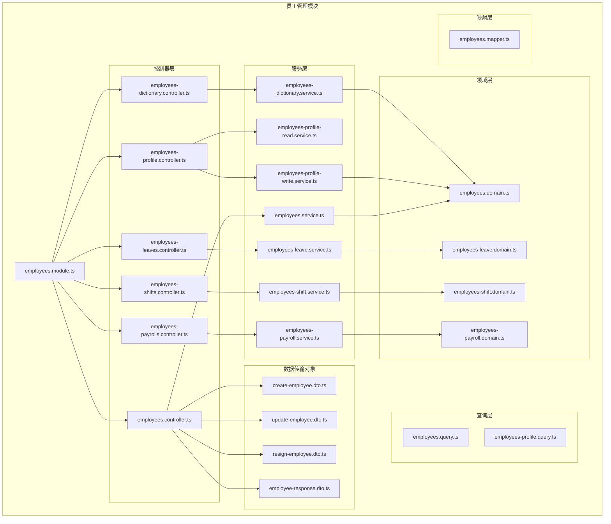

**图表来源**
- [employees.module.ts](file://src/purely-profit/staff/employees/employees.module.ts)
- [employees.controller.ts](file://src/purely-profit/staff/employees/employees.controller.ts)
- [employees.service.ts](file://src/purely-profit/staff/employees/employees.service.ts)

**章节来源**
- [employees.module.ts](file://src/purely-profit/staff/employees/employees.module.ts)
- [employees.controller.ts](file://src/purely-profit/staff/employees/employees.controller.ts)

## 核心组件

### 数据模型架构

系统基于 Prisma ORM 构建，员工数据模型具有以下核心特征：

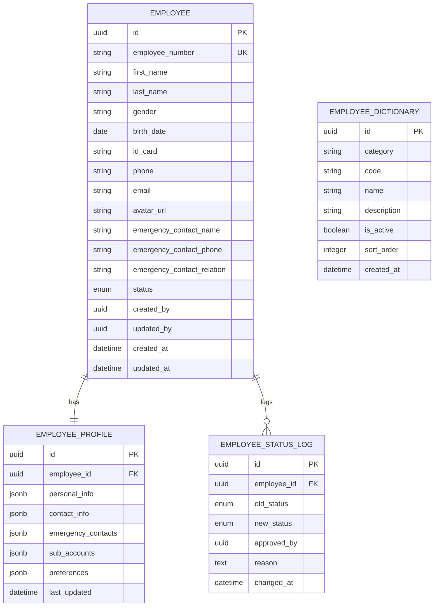

**图表来源**
- [schema.prisma](file://prisma/schema.prisma)
- [employees.prisma](file://prisma/purely-profit/staff/employees.prisma)

### 权限控制架构

系统采用多层权限控制机制，确保数据安全：

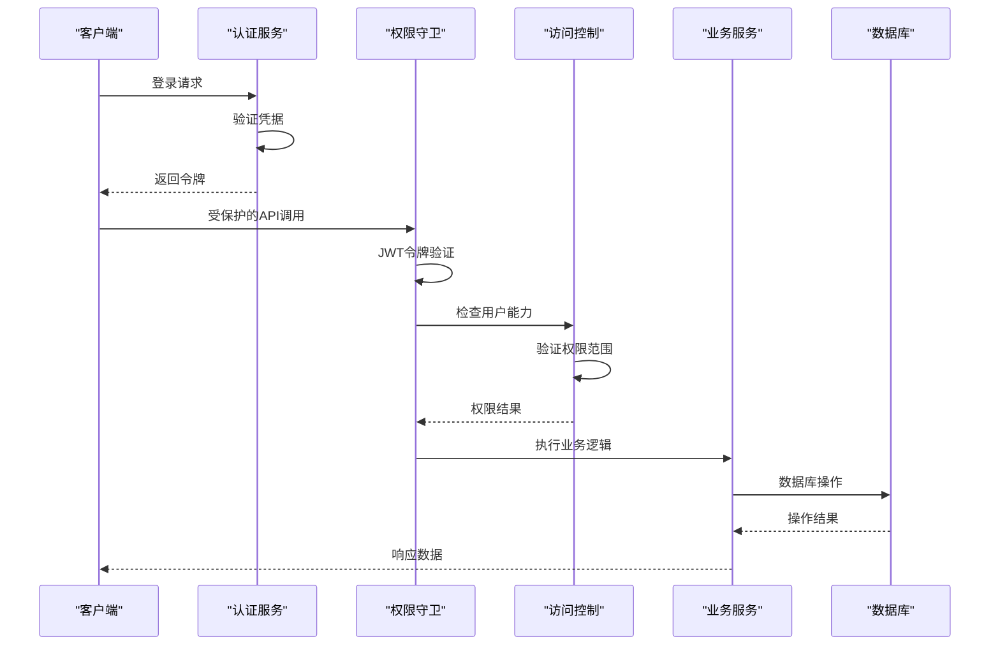

**图表来源**
- [jwt-auth.guard.ts](file://src/purely-profit/auth/guards/jwt-auth.guard.ts)
- [permissions.guard.ts](file://src/purely-profit/access-control/guards/permissions.guard.ts)
- [access-control.service.ts](file://src/purely-profit/access-control/access-control.service.ts)

**章节来源**
- [schema.prisma](file://prisma/schema.prisma)
- [employees.prisma](file://prisma/purely-profit/staff/employees.prisma)
- [jwt-auth.guard.ts](file://src/purely-profit/auth/guards/jwt-auth.guard.ts)

## 架构概览

员工管理系统的整体架构采用分层设计，确保关注点分离和可维护性：

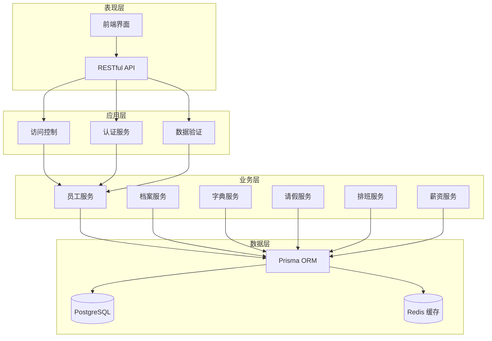

**图表来源**
- [employees.module.ts](file://src/purely-profit/staff/employees/employees.module.ts)
- [prisma.service.ts](file://src/prisma/prisma.service.ts)

### 核心业务流程

#### 员工注册流程

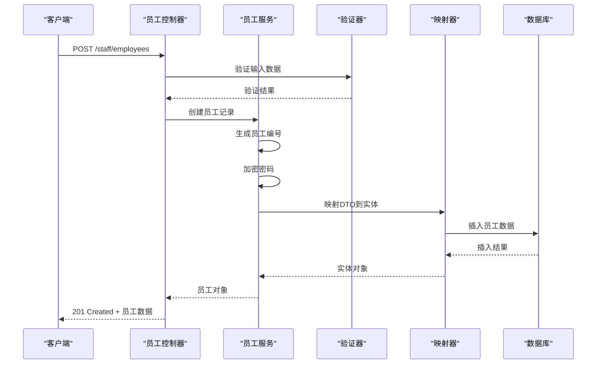

**图表来源**
- [employees.controller.ts](file://src/purely-profit/staff/employees/employees.controller.ts)
- [employees.service.ts](file://src/purely-profit/staff/employees/employees.service.ts)
- [create-employee.dto.ts](file://src/purely-profit/staff/employees/dto/create-employee.dto.ts)

#### 员工信息更新流程

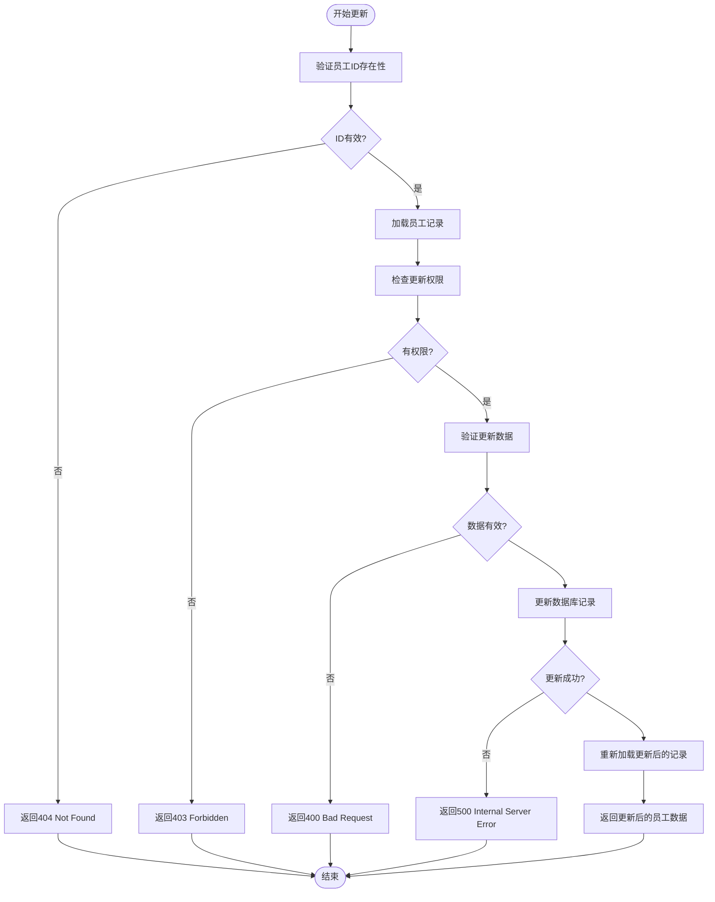

**图表来源**
- [employees.controller.ts](file://src/purely-profit/staff/employees/employees.controller.ts)
- [update-employee.dto.ts](file://src/purely-profit/staff/employees/dto/update-employee.dto.ts)

**章节来源**
- [employees.controller.ts](file://src/purely-profit/staff/employees/employees.controller.ts)
- [employees.service.ts](file://src/purely-profit/staff/employees/employees.service.ts)

## 详细组件分析

### 员工档案管理

员工档案管理是系统的核心功能，负责维护员工的完整个人信息。

#### 数据模型设计

员工档案包含以下关键字段：

| 字段名 | 类型 | 约束 | 描述 |
|--------|------|------|------|
| id | UUID | 主键 | 员工唯一标识符 |
| employee_number | String | 唯一索引 | 员工工号 |
| first_name | String | 必填 | 名字 |
| last_name | String | 必填 | 姓氏 |
| gender | Enum | 枚举值 | 性别 |
| birth_date | Date | 可选 | 出生日期 |
| id_card | String | 可选 | 身份证号 |
| phone | String | 可选 | 联系电话 |
| email | String | 可选 | 电子邮箱 |
| avatar_url | String | 可选 | 头像URL |
| emergency_contact_name | String | 可选 | 紧急联系人姓名 |
| emergency_contact_phone | String | 可选 | 紧急联系人电话 |
| emergency_contact_relation | String | 可选 | 紧急联系人关系 |
| status | Enum | 默认在职 | 员工状态 |

#### 档案服务架构

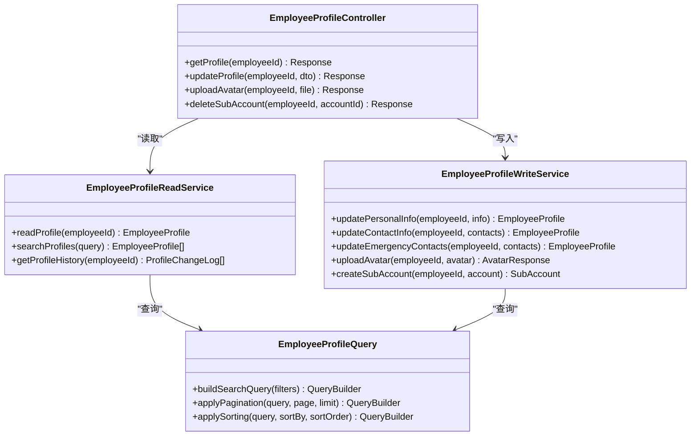

**图表来源**
- [employees-profile-read.service.ts](file://src/purely-profit/staff/employees/employees-profile-read.service.ts)
- [employees-profile-write.service.ts](file://src/purely-profit/staff/employees/employees-profile-write.service.ts)
- [employees-profile.controller.ts](file://src/purely-profit/staff/employees/employees-profile.controller.ts)

#### 头像上传功能

头像上传功能支持多种格式和尺寸优化：

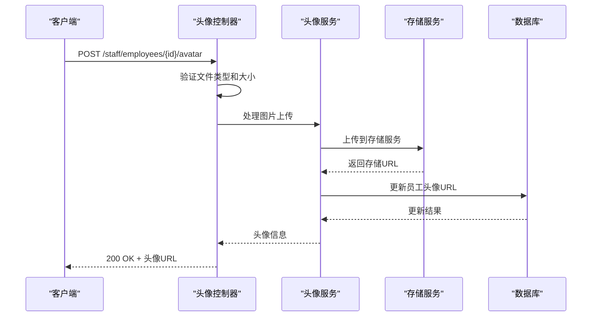

**图表来源**
- [employees-profile.controller.ts](file://src/purely-profit/staff/employees/employees-profile.controller.ts)
- [auth-profile.service.ts](file://src/purely-profit/auth/auth-profile.service.ts)

**章节来源**
- [employees-profile.controller.ts](file://src/purely-profit/staff/employees/employees-profile.controller.ts)
- [employees-profile-read.service.ts](file://src/purely-profit/staff/employees/employees-profile-read.service.ts)
- [employees-profile-write.service.ts](file://src/purely-profit/staff/employees/employees-profile-write.service.ts)

### 员工状态管理

系统支持完整的员工状态生命周期管理，包括在职、休假、离职等状态转换。

#### 状态转换流程

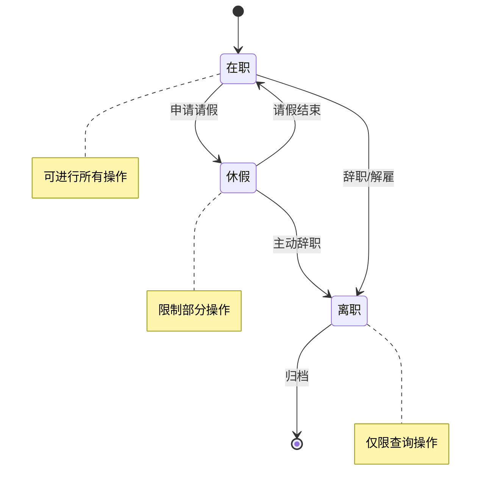

#### 状态变更控制

状态变更需要经过严格的审批流程：

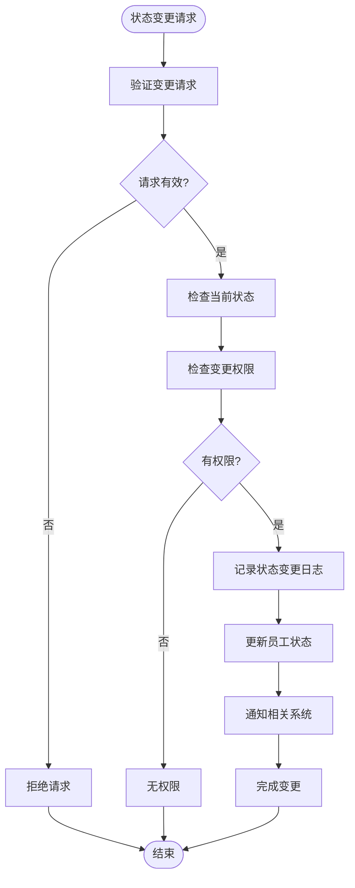

**图表来源**
- [employees-leave.domain.ts](file://src/purely-profit/staff/employees/employees-leave.domain.ts)
- [employees-leave.service.ts](file://src/purely-profit/staff/employees/employees-leave.service.ts)

**章节来源**
- [employees-leave.domain.ts](file://src/purely-profit/staff/employees/employees-leave.domain.ts)
- [employees-leave.service.ts](file://src/purely-profit/staff/employees/employees-leave.service.ts)

### 字典数据管理

系统提供灵活的字典数据管理功能，支持动态配置各种枚举值和选项。

#### 字典数据结构

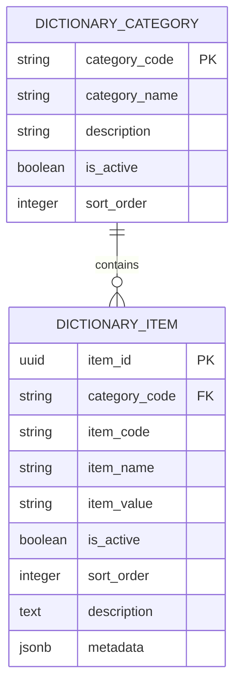

#### 字典查询接口

系统支持多种字典查询方式：

| 查询方式 | 参数 | 描述 | 示例 |
|----------|------|------|------|
| 按分类查询 | category_code | 获取指定分类的所有字典项 | GET /dictionary?category=gender |
| 按代码查询 | item_code | 获取单个字典项详情 | GET /dictionary/item/gender_male |
| 搜索查询 | keyword | 搜索匹配的字典项 | GET /dictionary?keyword=经理 |
| 分页查询 | page, limit | 分页获取字典项 | GET /dictionary?page=1&limit=50 |

**章节来源**
- [employees-dictionary.controller.ts](file://src/purely-profit/staff/employees/employees-dictionary.controller.ts)
- [employees-dictionary.service.ts](file://src/purely-profit/staff/employees/employees-dictionary.service.ts)

### 查询过滤与分页排序

系统提供强大的查询过滤功能，支持复杂的搜索条件和排序规则。

#### 查询条件过滤

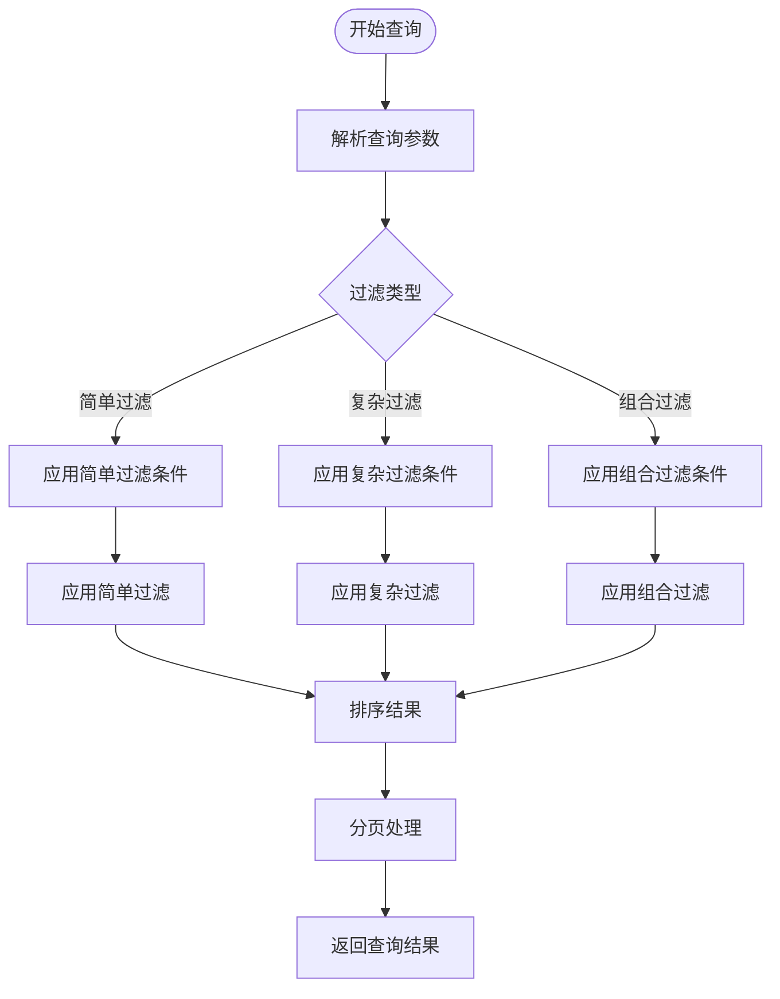

#### 支持的查询功能

| 功能类型 | 支持的操作 | 描述 |
|----------|------------|------|
| 文本搜索 | 精确匹配、模糊匹配、前缀匹配 | 支持姓名、工号等文本字段搜索 |
| 数值范围 | 大于、小于、等于、范围查询 | 支持年龄、薪资等数值字段查询 |
| 日期范围 | 开始日期、结束日期、日期区间 | 支持入职日期、生日等日期字段查询 |
| 枚举筛选 | 单选、多选 | 支持性别、状态等枚举字段筛选 |
| 组合查询 | AND、OR、NOT | 支持多个条件的复杂组合查询 |

**章节来源**
- [employees.query.ts](file://src/purely-profit/staff/employees/employees.query.ts)
- [employees-profile.query.ts](file://src/purely-profit/staff/employees/employees-profile.query.ts)

## 依赖关系分析

### 外部依赖

系统依赖以下关键外部组件：

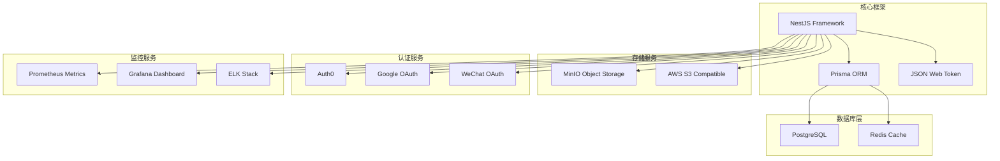

### 内部模块依赖

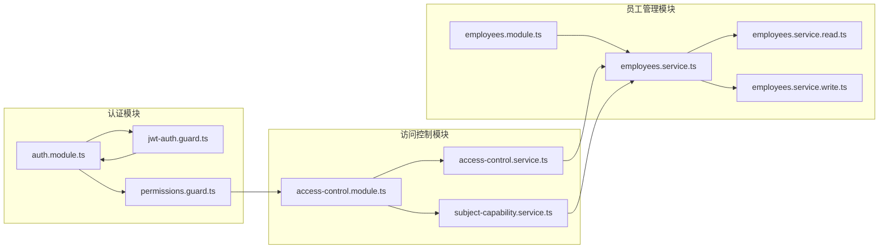

**图表来源**
- [employees.module.ts](file://src/purely-profit/staff/employees/employees.module.ts)
- [auth.module.ts](file://src/purely-profit/auth/auth.module.ts)
- [access-control.module.ts](file://src/purely-profit/access-control/access-control.module.ts)

**章节来源**
- [employees.module.ts](file://src/purely-profit/staff/employees/employees.module.ts)
- [auth.module.ts](file://src/purely-profit/auth/auth.module.ts)
- [access-control.module.ts](file://src/purely-profit/access-control/access-control.module.ts)

## 性能考虑

### 数据库优化

系统采用多种数据库优化策略：

1. **索引优化**
   - 员工编号：唯一索引，支持快速查找
   - 姓名：全文索引，支持模糊搜索
   - 状态：普通索引，支持状态过滤
   - 创建时间：索引，支持时间范围查询

2. **查询优化**
   - 使用预编译语句防止SQL注入
   - 实施查询缓存减少重复查询
   - 优化复杂查询的执行计划

3. **连接池管理**
   - 配置合适的连接池大小
   - 实施连接超时和重试机制
   - 监控数据库性能指标

### 缓存策略

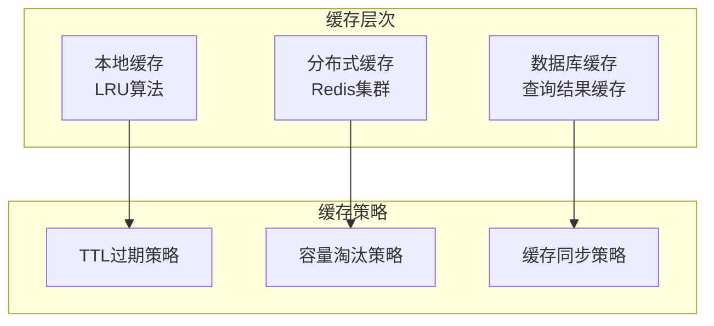

### 异步处理

对于耗时操作，系统采用异步处理机制：

1. **批量导入**
   - 支持CSV文件批量导入员工信息
   - 异步处理导入任务，避免阻塞主线程
   - 提供进度跟踪和错误报告

2. **报表生成**
   - 异步生成各类统计报表
   - 支持导出功能，避免长时间占用服务器资源

## 故障排除指南

### 常见问题诊断

#### 认证授权问题

**症状**：用户无法登录或访问受保护资源

**诊断步骤**：
1. 检查JWT令牌是否正确生成和传递
2. 验证用户权限是否正确配置
3. 确认访问控制规则是否生效

**解决方案**：
- 重新生成JWT令牌
- 检查用户角色和权限分配
- 清除权限缓存并重新加载

#### 数据验证错误

**症状**：提交表单时出现验证错误

**诊断方法**：
1. 检查输入数据格式是否符合要求
2. 验证必填字段是否完整
3. 确认数据唯一性约束

**常见错误类型**：
- 员工编号重复
- 邮箱格式不正确
- 身份证号码无效
- 电话号码格式错误

#### 数据库连接问题

**症状**：查询或保存数据时出现连接错误

**排查步骤**：
1. 检查数据库连接字符串配置
2. 验证数据库服务状态
3. 查看连接池使用情况

**解决方案**：
- 重启数据库服务
- 调整连接池配置
- 检查网络连接

### 错误处理机制

系统实现了完善的错误处理机制：

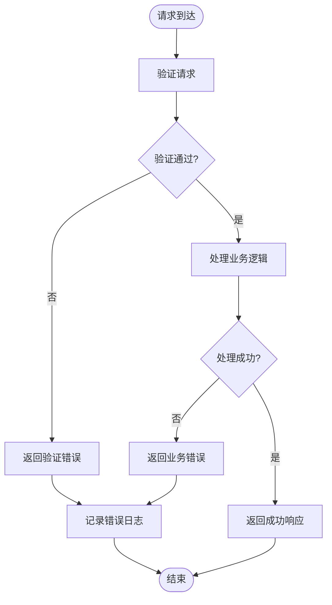

**章节来源**
- [employees.controller.ts](file://src/purely-profit/staff/employees/employees.controller.ts)
- [employees.service.ts](file://src/purely-profit/staff/employees/employees.service.ts)

## 结论

员工基本信息管理系统是一个功能完整、架构清晰的企业级应用。系统采用现代化的技术栈和设计模式，提供了以下核心优势：

1. **模块化设计**：清晰的分层架构和模块划分，便于维护和扩展
2. **安全性保障**：多层次的权限控制和数据验证机制
3. **性能优化**：数据库优化、缓存策略和异步处理
4. **可扩展性**：灵活的字典管理和插件式架构
5. **用户体验**：直观的API设计和完整的错误处理

系统能够满足企业对员工信息管理的各种需求，为人力资源管理提供强有力的技术支撑。

## 附录

### API 接口规范

#### 员工管理接口

| 方法 | 路径 | 权限 | 描述 |
|------|------|------|------|
| GET | /staff/employees | READ:EMPLOYEES | 获取员工列表 |
| GET | /staff/employees/{id} | READ:EMPLOYEES | 获取员工详情 |
| POST | /staff/employees | CREATE:EMPLOYEES | 创建新员工 |
| PUT | /staff/employees/{id} | UPDATE:EMPLOYEES | 更新员工信息 |
| DELETE | /staff/employees/{id} | DELETE:EMPLOYEES | 删除员工记录 |
| POST | /staff/employees/{id}/avatar | UPDATE:EMPLOYEES | 上传员工头像 |

#### 档案管理接口

| 方法 | 路径 | 权限 | 描述 |
|------|------|------|------|
| GET | /staff/employees/profiles | READ:EMPLOYEES | 获取员工档案 |
| PUT | /staff/employees/profiles/{id} | UPDATE:EMPLOYEES | 更新员工档案 |
| POST | /staff/employees/profiles/{id}/avatar | UPDATE:EMPLOYEES | 上传档案头像 |

#### 字典管理接口

| 方法 | 路径 | 权限 | 描述 |
|------|------|------|------|
| GET | /staff/employees/dictionaries | READ:EMPLOYEES | 获取字典数据 |
| GET | /staff/employees/dictionaries/{code} | READ:EMPLOYEES | 获取字典项详情 |

### 数据验证规则

系统实施严格的数据验证规则：

1. **必填字段验证**：员工姓名、性别、入职日期等关键字段必须填写
2. **格式验证**：邮箱、电话号码、身份证号等必须符合格式要求
3. **唯一性验证**：员工编号、邮箱地址等必须保持唯一
4. **业务规则验证**：年龄范围、雇佣期限等业务逻辑验证
5. **权限验证**：操作权限和数据访问权限验证

### 最佳实践建议

1. **数据备份**：定期备份员工数据，确保数据安全
2. **性能监控**：监控系统性能指标，及时发现和解决问题
3. **安全审计**：记录重要的数据变更操作，便于审计追踪
4. **版本管理**：对数据库结构变更进行版本控制
5. **测试覆盖**：确保核心功能有足够的测试覆盖率