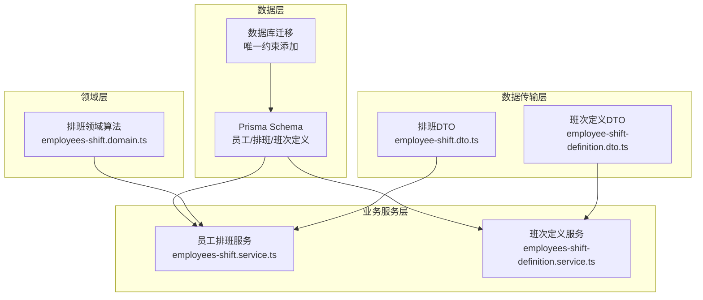
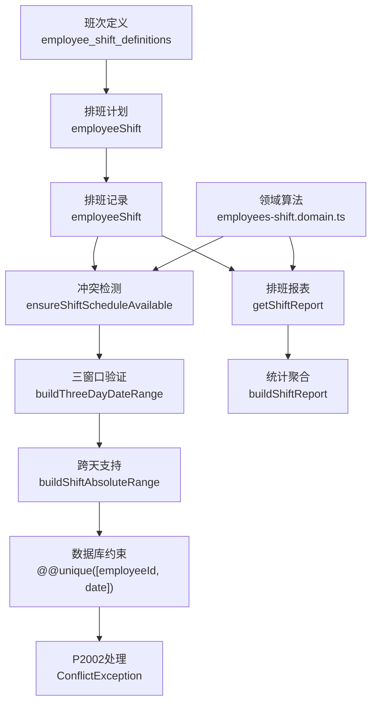
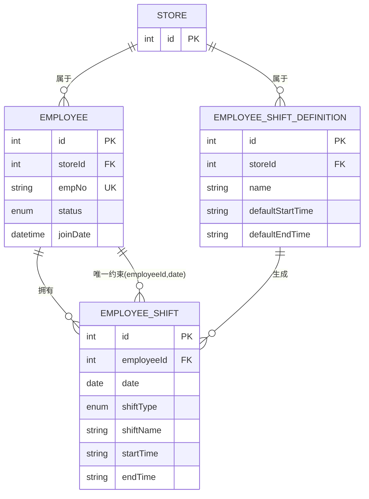
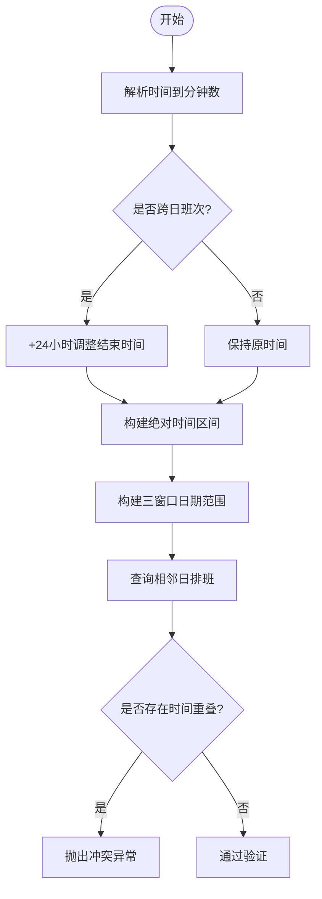
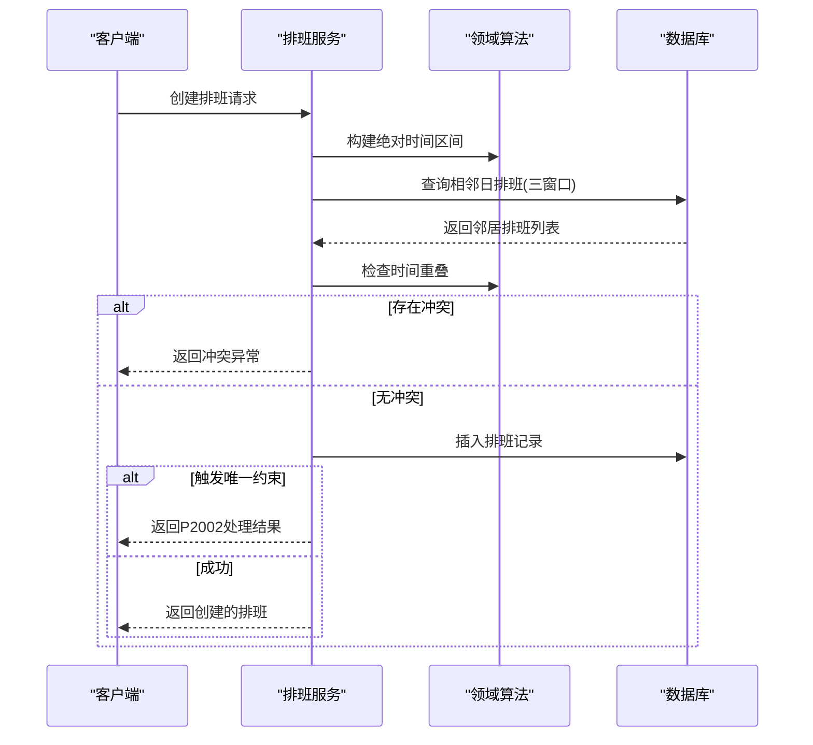
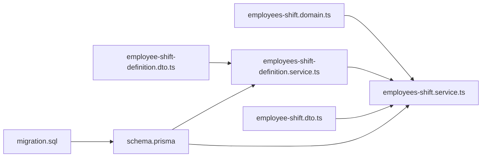

# 员工排班管理

<cite>
**本文引用的文件**
- [prisma/schema.prisma](file://prisma/schema.prisma)
- [prisma/purely-profit/staff/employees.prisma](file://prisma/purely-profit/staff/employees.prisma)
- [src/purely-profit/staff/employees/employees-shift.service.ts](file://src/purely-profit/staff/employees/employees-shift.service.ts)
- [src/purely-profit/staff/employees/employees-shift.domain.ts](file://src/purely-profit/staff/employees/employees-shift.domain.ts)
- [src/purely-profit/staff/employees/employees-shift-definition.service.ts](file://src/purely-profit/staff/employees/employees-shift-definition.service.ts)
- [src/purely-profit/staff/employees/dto/employee-shift.dto.ts](file://src/purely-profit/staff/employees/dto/employee-shift.dto.ts)
- [src/purely-profit/staff/employees/dto/employee-shift-definition.dto.ts](file://src/purely-profit/staff/employees/dto/employee-shift-definition.dto.ts)
- [prisma/migrations/20260712030000_add_employee_shift_unique/migration.sql](file://prisma/migrations/20260712030000_add_employee_shift_unique/migration.sql)
</cite>

## 更新摘要
**变更内容**
- 新增完整排班领域层，包含跨天班次冲突检测、三窗口冲突验证等核心算法
- 实现数据库级唯一约束，防止并发场景下的重复排班
- 增强P2002错误码处理机制，提供友好的业务异常提示
- 完善班次定义管理服务，支持模板化管理和引用检查
- 扩展DTO类型系统，支持完整的排班报表和分页查询

## 目录
1. [简介](#简介)
2. [项目结构](#项目结构)
3. [核心组件](#核心组件)
4. [架构总览](#架构总览)
5. [详细组件分析](#详细组件分析)
6. [依赖关系分析](#依赖关系分析)
7. [性能考量](#性能考量)
8. [故障排查指南](#故障排查指南)
9. [结论](#结论)
10. [附录](#附录)

## 简介
本文件面向"员工排班管理"功能，系统性阐述班次定义、排班计划、班次调整、排班冲突检测、排班算法、加班统计、排班规则配置、班次模板管理、特殊班次处理等核心能力。文档以代码库中的实际实现为依据，结合数据模型、服务层与查询逻辑，给出可操作的业务场景演示与可视化图示，帮助开发者与产品人员快速理解并正确使用排班模块。

**重大增强**：本次更新引入了完整的排班领域和服务层，包括跨天班次冲突检测、数据库级唯一约束、三窗口冲突验证、P2002错误码处理等核心功能，大幅提升了系统的健壮性和用户体验。

## 项目结构
排班相关能力主要分布在以下区域：
- 数据模型：Prisma Schema 定义了员工、排班记录、班次定义等核心实体及索引。
- 领域层：提供排班核心算法，包括时间计算、冲突检测、范围构建等工具函数。
- 业务服务：员工模块提供排班相关的增删改查与统计；班次定义服务负责模板管理。
- DTO层：完整的类型定义，支持API参数验证和响应格式化。
- 数据库迁移：新增唯一约束确保数据一致性。

**图表来源**
- [prisma/purely-profit/staff/employees.prisma](file://prisma/purely-profit/staff/employees.prisma)
- [src/purely-profit/staff/employees/employees-shift.service.ts](file://src/purely-profit/staff/employees/employees-shift.service.ts)
- [src/purely-profit/staff/employees/employees-shift.domain.ts](file://src/purely-profit/staff/employees/employees-shift.domain.ts)
- [src/purely-profit/staff/employees/employees-shift-definition.service.ts](file://src/purely-profit/staff/employees/employees-shift-definition.service.ts)
- [src/purely-profit/staff/employees/dto/employee-shift.dto.ts](file://src/purely-profit/staff/employees/dto/employee-shift.dto.ts)
- [src/purely-profit/staff/employees/dto/employee-shift-definition.dto.ts](file://src/purely-profit/staff/employees/dto/employee-shift-definition.dto.ts)
- [prisma/migrations/20260712030000_add_employee_shift_unique/migration.sql](file://prisma/migrations/20260712030000_add_employee_shift_unique/migration.sql)

## 核心组件
- **员工与排班记录**
  - 员工表包含员工编号、状态、部门、岗位、入职日期等字段，关联排班记录与请假记录等。
  - 排班记录包含日期、班次类型、班次名称、起止时间等，支持按日期与起止时间排序。
  - **新增**：数据库级唯一约束确保同一员工同一天只能有一个排班记录。

- **班次定义**
  - 班次定义提供默认开始/结束时间，支持按门店与名称唯一约束，便于模板化管理。
  - **新增**：删除前检查引用计数，防止误删被使用的班次定义。

- **排班领域算法**
  - **新增**：跨天班次支持（如22:00-06:00），正确处理时间区间重叠判断。
  - **新增**：三窗口冲突验证，覆盖前一日、当日、后一日的排班冲突检测。
  - **新增**：绝对时间区间计算，统一处理跨日班次的比较逻辑。

- **P2002错误码处理**
  - **新增**：统一的数据库唯一约束冲突处理，将底层错误转换为友好的业务异常。
  - **新增**：并发场景下的TOCTOU问题防护，确保数据一致性。

章节来源
- [prisma/purely-profit/staff/employees.prisma](file://prisma/purely-profit/staff/employees.prisma)
- [src/purely-profit/staff/employees/employees-shift.service.ts](file://src/purely-profit/staff/employees/employees-shift.service.ts)
- [src/purely-profit/staff/employees/employees-shift.domain.ts](file://src/purely-profit/staff/employees/employees-shift.domain.ts)
- [src/purely-profit/staff/employees/employees-shift-definition.service.ts](file://src/purely-profit/staff/employees/employees-shift-definition.service.ts)

## 架构总览
排班系统围绕"班次定义—排班计划—排班记录—班次确认—统计与展示"的闭环展开。数据模型通过 Prisma 统一建模，领域层提供核心算法，服务层实现业务逻辑，DTO层确保接口规范。

**图表来源**
- [src/purely-profit/staff/employees/employees-shift.service.ts](file://src/purely-profit/staff/employees/employees-shift.service.ts)
- [src/purely-profit/staff/employees/employees-shift.domain.ts](file://src/purely-profit/staff/employees/employees-shift.domain.ts)
- [prisma/purely-profit/staff/employees.prisma](file://prisma/purely-profit/staff/employees.prisma)

## 详细组件分析

### 数据模型与关系
- **实体与索引**
  - 员工表对 storeId、empNo 唯一，支持按状态、部门、岗位、入职日期建立索引，提升查询效率。
  - 班次定义表对 storeId 与 name 唯一，便于模板化管理。
  - 排班记录表按日期、起止时间排序，支持范围查询与去重比较。
  - **新增**：`@@unique([employeeId, date])` 确保同一员工同一天只有一个排班记录。

- **关系**
  - 员工与排班记录、请假记录、交接记录存在一对多关系。
  - 班次定义与排班记录存在一对多关系，支持通过定义生成或复用排班模板。

**图表来源**
- [prisma/purely-profit/staff/employees.prisma](file://prisma/purely-profit/staff/employees.prisma)

章节来源
- [prisma/purely-profit/staff/employees.prisma](file://prisma/purely-profit/staff/employees.prisma)

### 排班领域算法（新增）
- **跨天班次支持**
  - 支持跨日排班（如22:00-06:00），自动处理时间区间的边界情况。
  - `buildShiftAbsoluteRange` 函数将相对时间转换为绝对时间区间，正确跨越自然日边界。

- **三窗口冲突验证**
  - `buildThreeDayDateRange` 构建覆盖前一日、当日、后一日的查询范围。
  - 解决跨日班次的尾段与前一日班次、头段与后一日班次的潜在冲突。

- **时间区间重叠检测**
  - `isAbsoluteRangeOverlapping` 基于绝对时间区间进行精确的重叠判断。
  - 支持各种复杂的跨天场景，确保冲突检测的准确性。

**图表来源**
- [src/purely-profit/staff/employees/employees-shift.domain.ts](file://src/purely-profit/staff/employees/employees-shift.domain.ts)

章节来源
- [src/purely-profit/staff/employees/employees-shift.domain.ts](file://src/purely-profit/staff/employees/employees-shift.domain.ts)

### 排班服务与冲突检测
- **创建排班流程**
  - 验证员工权限和班次定义有效性。
  - 执行三窗口冲突检测和同日重复排班检查。
  - 捕获P2002错误码，转换为友好的业务异常。

- **更新排班流程**
  - 支持部分字段更新，保留未修改字段的原有值。
  - 重新计算班次类型和时间信息。
  - 再次执行冲突检测确保数据一致性。

- **数据库级防护**
  - `@@unique([employeeId, date])` 作为最终防线，拦截并发场景下的重复排班。
  - P2002错误码统一处理，提供一致的用户体验。

**图表来源**
- [src/purely-profit/staff/employees/employees-shift.service.ts](file://src/purely-profit/staff/employees/employees-shift.service.ts)
- [src/purely-profit/staff/employees/employees-shift.domain.ts](file://src/purely-profit/staff/employees/employees-shift.domain.ts)

章节来源
- [src/purely-profit/staff/employees/employees-shift.service.ts](file://src/purely-profit/staff/employees/employees-shift.service.ts)

### 班次定义管理
- **模板化设计**
  - 支持为每个门店创建多个班次模板。
  - 模板包含名称、默认上班时间、默认下班时间。
  - 按名称大小写不敏感的唯一性保证。

- **引用完整性保护**
  - 删除前检查是否有排班记录引用该模板。
  - 提供详细的错误信息，说明无法删除的原因。

- **P2002错误处理**
  - 统一的数据库约束冲突处理。
  - 将底层错误转换为业务友好的异常消息。

章节来源
- [src/purely-profit/staff/employees/employees-shift-definition.service.ts](file://src/purely-profit/staff/employees/employees-shift-definition.service.ts)

### DTO类型系统
- **完整的API契约**
  - 创建和更新排班的DTO，支持可选字段和验证规则。
  - 排班报表DTO，包含汇总信息和明细数据。
  - 分页查询DTO，支持灵活的筛选条件。

- **向后兼容性**
  - 保留旧版startTime和endTime字段，标记为废弃。
  - 服务端自动从班次定义获取时间信息。

章节来源
- [src/purely-profit/staff/employees/dto/employee-shift.dto.ts](file://src/purely-profit/staff/employees/dto/employee-shift.dto.ts)
- [src/purely-profit/staff/employees/dto/employee-shift-definition.dto.ts](file://src/purely-profit/staff/employees/dto/employee-shift-definition.dto.ts)

### 数据库迁移与约束
- **唯一约束添加**
  - 为employee_shifts表添加(employee_id, date)唯一索引。
  - 移除原有的非唯一索引，避免重复占用资源。

- **并发安全**
  - 在应用层冲突检测的基础上，增加数据库级防护。
  - 处理高并发场景下的TOCTOU问题。

章节来源
- [prisma/migrations/20260712030000_add_employee_shift_unique/migration.sql](file://prisma/migrations/20260712030000_add_employee_shift_unique/migration.sql)
- [prisma/purely-profit/staff/employees.prisma](file://prisma/purely-profit/staff/employees.prisma)

## 依赖关系分析
- **组件耦合**
  - 排班服务依赖领域算法进行核心逻辑处理。
  - 班次定义服务独立管理模板，被排班服务调用。
  - DTO层为所有服务提供统一的数据传输格式。

- **外部依赖**
  - Prisma提供ORM能力和数据库约束。
  - NestJS框架提供依赖注入和异常处理。

- **循环依赖**
  - 服务间通过接口契约交互，避免循环依赖。

**图表来源**
- [src/purely-profit/staff/employees/employees-shift.service.ts](file://src/purely-profit/staff/employees/employees-shift.service.ts)
- [src/purely-profit/staff/employees/employees-shift.domain.ts](file://src/purely-profit/staff/employees/employees-shift.domain.ts)
- [src/purely-profit/staff/employees/employees-shift-definition.service.ts](file://src/purely-profit/staff/employees/employees-shift-definition.service.ts)
- [src/purely-profit/staff/employees/dto/employee-shift.dto.ts](file://src/purely-profit/staff/employees/dto/employee-shift.dto.ts)
- [src/purely-profit/staff/employees/dto/employee-shift-definition.dto.ts](file://src/purely-profit/staff/employees/dto/employee-shift-definition.dto.ts)
- [prisma/purely-profit/staff/employees.prisma](file://prisma/purely-profit/staff/employees.prisma)
- [prisma/migrations/20260712030000_add_employee_shift_unique/migration.sql](file://prisma/migrations/20260712030000_add_employee_shift_unique/migration.sql)

## 性能考量
- **查询优化**
  - 利用复合索引：按(storeId, date)、(shiftDefinitionId, date)建立索引，加速筛选与分页。
  - 三窗口查询范围限制，避免全表扫描。
  - 选择性字段查询，减少数据传输量。

- **缓存策略**
  - 班次定义可考虑引入缓存，减少频繁查询。
  - 高频排班报表可考虑预计算和缓存。

- **时间计算优化**
  - 使用整数分钟数进行时间比较，避免字符串比较的性能损耗。
  - 绝对时间区间预计算，减少重复计算。

- **并发控制**
  - 数据库唯一约束作为最终防线，避免应用层锁的复杂性。
  - 合理的重试机制处理P2002冲突。

## 故障排查指南
- **冲突告警**
  - 若出现"该员工当天已存在排班记录"，检查该员工当日已有班次与新增班次的时间区间是否重叠。
  - 查看三窗口查询结果，确认是否与前一日或后一日的跨日班次冲突。

- **P2002错误处理**
  - 检查数据库唯一约束是否正确生效。
  - 确认应用层的冲突检测逻辑是否正常工作。
  - 查看并发场景下的日志，定位TOCTOU问题的具体位置。

- **跨天班次问题**
  - 验证时间区间转换逻辑，确认跨日班次的绝对时间计算是否正确。
  - 检查三窗口日期范围的构建，确保覆盖所有可能的冲突场景。

- **班次定义删除失败**
  - 检查是否有排班记录引用该班次定义。
  - 查看引用计数，确定需要处理的排班记录数量。

章节来源
- [src/purely-profit/staff/employees/employees-shift.service.ts](file://src/purely-profit/staff/employees/employees-shift.service.ts)
- [src/purely-profit/staff/employees/employees-shift-definition.service.ts](file://src/purely-profit/staff/employees/employees-shift-definition.service.ts)
- [src/purely-profit/staff/employees/employees-shift.domain.ts](file://src/purely-profit/staff/employees/employees-shift.domain.ts)

## 结论
本次员工排班管理系统的重大增强，通过引入完整的领域层、数据库级约束和完善的错误处理机制，显著提升了系统的健壮性和用户体验。跨天班次支持、三窗口冲突验证、P2002错误码处理等核心功能的实现，使得排班系统能够处理更复杂的业务场景，同时保证了数据的一致性和完整性。

建议在生产环境中配合适当的监控和日志记录，持续跟踪冲突率和系统性能，确保新功能的稳定运行。

## 附录
- **业务场景示例**
  - 场景A：按模板批量生成排班，随后进行个别调整与确认。
  - 场景B：节假日特殊班次叠加加班统计，自动计算加班费用。
  - 场景C：跨天班次处理，如夜班22:00-06:00的正确冲突检测。
  - 场景D：高并发场景下的排班创建，确保数据一致性。

- **API与DTO参考路径**
  - 排班CRUD操作：[employees-shift.service.ts](file://src/purely-profit/staff/employees/employees-shift.service.ts)
  - 班次定义管理：[employees-shift-definition.service.ts](file://src/purely-profit/staff/employees/employees-shift-definition.service.ts)
  - 领域算法：[employees-shift.domain.ts](file://src/purely-profit/staff/employees/employees-shift.domain.ts)
  - DTO类型定义：[employee-shift.dto.ts](file://src/purely-profit/staff/employees/dto/employee-shift.dto.ts), [employee-shift-definition.dto.ts](file://src/purely-profit/staff/employees/dto/employee-shift-definition.dto.ts)
  - 数据模型：[employees.prisma](file://prisma/purely-profit/staff/employees.prisma)
  - 数据库迁移：[20260712030000_add_employee_shift_unique](file://prisma/migrations/20260712030000_add_employee_shift_unique/migration.sql)