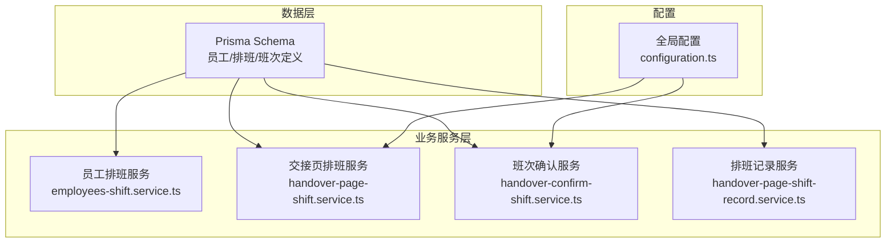
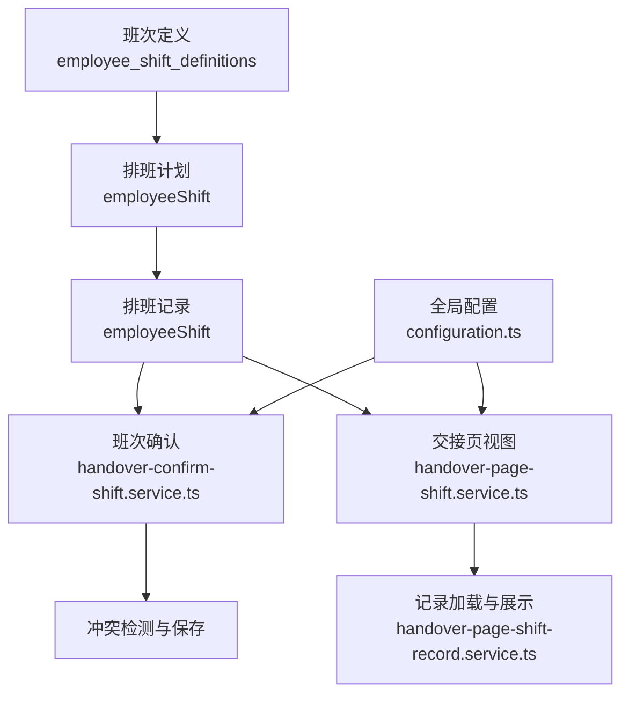
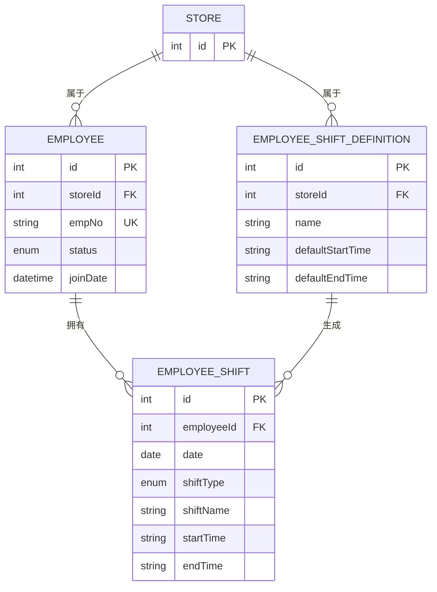
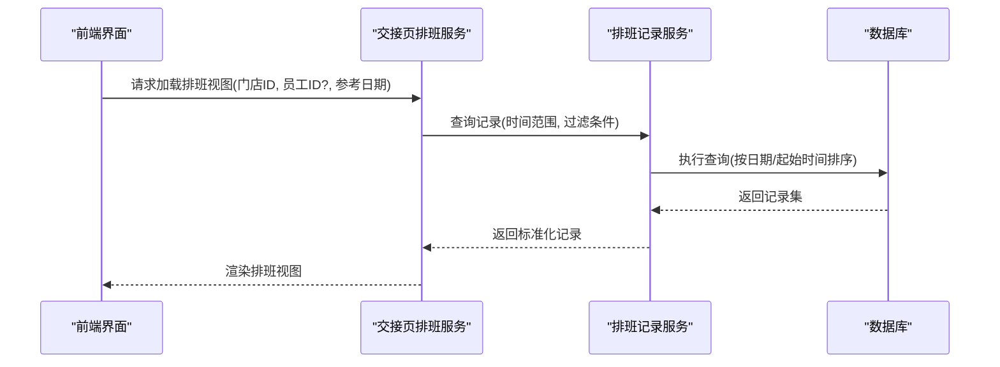
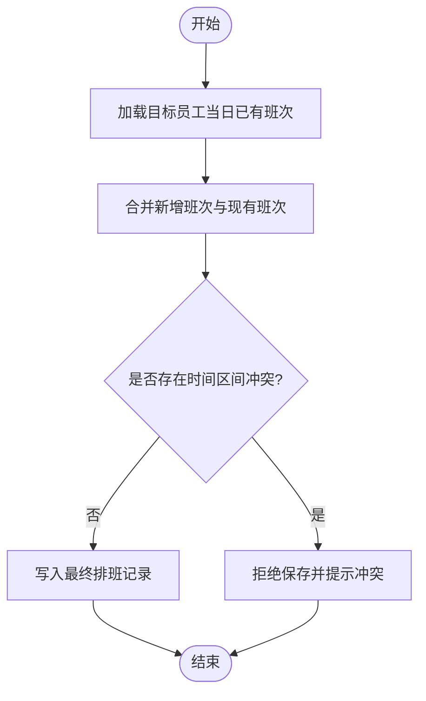
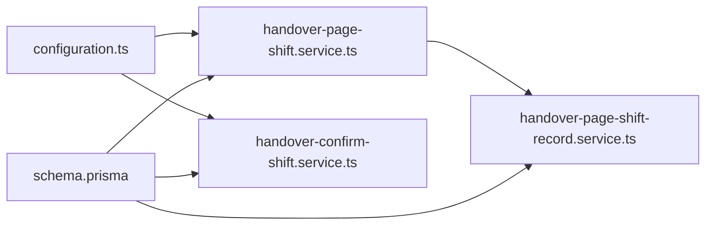

# 员工排班管理

<cite>
**本文引用的文件**
- [prisma/schema.prisma](file://prisma/schema.prisma)
- [prisma/purely-profit/staff/employees.prisma](file://prisma/purely-profit/staff/employees.prisma)
- [src/purely-profit/staff/employees/employees-shift.service.ts](file://src/purely-profit/staff/employees/employees-shift.service.ts)
- [src/purely-profit/operations/handover/handover-page-shift.service.ts](file://src/purely-profit/operations/handover/handover-page-shift.service.ts)
- [src/purely-profit/operations/handover/handover-confirm-shift.service.ts](file://src/purely-profit/operations/handover/handover-confirm-shift.service.ts)
- [src/purely-profit/operations/handover/handover-page-shift-record.service.ts](file://src/purely-profit/operations/handover/handover-page-shift-record.service.ts)
- [src/purely-profit/operations/handover/hover.spec-helpers.ts](file://src/purely-profit/operations/handover/hover.spec-helpers.ts)
- [src/config/configuration.ts](file://src/config/configuration.ts)
</cite>

## 目录
1. [简介](#简介)
2. [项目结构](#项目结构)
3. [核心组件](#核心组件)
4. [架构总览](#架构总览)
5. [详细组件分析](#详细组件分析)
6. [依赖关系分析](#依赖关系分析)
7. [性能考量](#性能考量)
8. [故障排查指南](#故障排查指南)
9. [结论](#结论)
10. [附录](#附录)

## 简介
本文件面向“员工排班管理”功能，系统性阐述班次定义、排班计划、班次调整、排班冲突检测、排班算法、加班统计、排班规则配置、班次模板管理、特殊班次处理等核心能力。文档以代码库中的实际实现为依据，结合数据模型、服务层与查询逻辑，给出可操作的业务场景演示与可视化图示，帮助开发者与产品人员快速理解并正确使用排班模块。

## 项目结构
排班相关能力主要分布在以下区域：
- 数据模型：Prisma Schema 定义了员工、排班记录、班次定义等核心实体及索引。
- 业务服务：员工模块提供排班相关的增删改查与统计；交接页服务负责排班视图与记录加载；确认服务负责班次确认与冲突校验。
- 配置：全局配置中包含自动排班开关与偏移参数，用于控制自动化行为。

图表来源
- [prisma/schema.prisma](file://prisma/schema.prisma)
- [src/purely-profit/staff/employees/employees-shift.service.ts](file://src/purely-profit/staff/employees/employees-shift.service.ts)
- [src/purely-profit/operations/handover/handover-page-shift.service.ts](file://src/purely-profit/operations/handover/handover-page-shift.service.ts)
- [src/purely-profit/operations/handover/handover-confirm-shift.service.ts](file://src/purely-profit/operations/handover/handover-confirm-shift.service.ts)
- [src/purely-profit/operations/handover/handover-page-shift-record.service.ts](file://src/purely-profit/operations/handover/handover-page-shift-record.service.ts)
- [src/config/configuration.ts](file://src/config/configuration.ts)

章节来源
- [prisma/schema.prisma](file://prisma/schema.prisma)
- [src/purely-profit/staff/employees/employees-shift.service.ts](file://src/purely-profit/staff/employees/employees-shift.service.ts)
- [src/purely-profit/operations/handover/handover-page-shift.service.ts](file://src/purely-profit/operations/handover/handover-page-shift.service.ts)
- [src/purely-profit/operations/handover/handover-confirm-shift.service.ts](file://src/purely-profit/operations/handover/handover-confirm-shift.service.ts)
- [src/purely-profit/operations/handover/handover-page-shift-record.service.ts](file://src/purely-profit/operations/handover/handover-page-shift-record.service.ts)
- [src/config/configuration.ts](file://src/config/configuration.ts)

## 核心组件
- 员工与排班记录
  - 员工表包含员工编号、状态、部门、岗位、入职日期等字段，关联排班记录与请假记录等。
  - 排班记录包含日期、班次类型、班次名称、起止时间等，支持按日期与起止时间排序。
- 班次定义
  - 班次定义提供默认开始/结束时间，支持按门店与名称唯一约束，便于模板化管理。
- 交接页排班服务
  - 负责加载指定日期范围内的排班记录，构建视图数据，支持按员工过滤与排序。
- 班次确认服务
  - 提供班次确认逻辑与冲突检测，确保同一员工在同一时间段内不重复排班。
- 排班记录服务
  - 提供排班记录的查询、选择字段与时间边界计算，支撑前端展示与统计。
- 全局配置
  - 自动排班开关与最大偏移天数，影响自动化排班策略的启用与容错范围。

章节来源
- [prisma/purely-profit/staff/employees.prisma](file://prisma/purely-profit/staff/employees.prisma)
- [src/purely-profit/operations/handover/handover-page-shift.service.ts](file://src/purely-profit/operations/handover/handover-page-shift.service.ts)
- [src/purely-profit/operations/handover/handover-confirm-shift.service.ts](file://src/purely-profit/operations/handover/handover-confirm-shift.service.ts)
- [src/purely-profit/operations/handover/handover-page-shift-record.service.ts](file://src/purely-profit/operations/handover/handover-page-shift-record.service.ts)
- [src/config/configuration.ts](file://src/config/configuration.ts)

## 架构总览
排班系统围绕“班次定义—排班计划—排班记录—班次确认—统计与展示”的闭环展开。数据模型通过 Prisma 统一建模，服务层提供查询、确认与统计能力，配置层控制自动化策略。

图表来源
- [prisma/purely-profit/staff/employees.prisma](file://prisma/purely-profit/staff/employees.prisma)
- [src/purely-profit/operations/handover/handover-page-shift.service.ts](file://src/purely-profit/operations/handover/handover-page-shift.service.ts)
- [src/purely-profit/operations/handover/handover-confirm-shift.service.ts](file://src/purely-profit/operations/handover/handover-confirm-shift.service.ts)
- [src/purely-profit/operations/handover/handover-page-shift-record.service.ts](file://src/purely-profit/operations/handover/handover-page-shift-record.service.ts)
- [src/config/configuration.ts](file://src/config/configuration.ts)

## 详细组件分析

### 数据模型与关系
- 实体与索引
  - 员工表对 storeId、empNo 唯一，支持按状态、部门、岗位、入职日期建立索引，提升查询效率。
  - 班次定义表对 storeId 与 name 唯一，便于模板化管理。
  - 排班记录表按日期、起止时间排序，支持范围查询与去重比较。
- 关系
  - 员工与排班记录、请假记录、交接记录存在一对多关系。
  - 班次定义与排班记录存在一对多关系，支持通过定义生成或复用排班模板。

图表来源
- [prisma/purely-profit/staff/employees.prisma](file://prisma/purely-profit/staff/employees.prisma)

章节来源
- [prisma/purely-profit/staff/employees.prisma](file://prisma/purely-profit/staff/employees.prisma)

### 排班计划与记录加载（交接页）
- 加载策略
  - 按门店与参考日期构建时间范围，仅加载当天及之前的排班记录，避免未来未生效计划干扰当前视图。
  - 支持按员工 ID 过滤，按日期、起始时间、记录 ID 升序排列，保证展示顺序稳定。
- 时间边界
  - 使用起止时间与日期组合计算具体开始/结束时间点，用于后续排序与对比。
- 记录选择
  - 限定返回字段，减少传输与内存占用，提升前端渲染性能。

图表来源
- [src/purely-profit/operations/handover/handover-page-shift.service.ts](file://src/purely-profit/operations/handover/handover-page-shift.service.ts)
- [src/purely-profit/operations/handover/handover-page-shift-record.service.ts](file://src/purely-profit/operations/handover/handover-page-shift-record.service.ts)

章节来源
- [src/purely-profit/operations/handover/handover-page-shift.service.ts](file://src/purely-profit/operations/handover/handover-page-shift.service.ts)
- [src/purely-profit/operations/handover/handover-page-shift-record.service.ts](file://src/purely-profit/operations/handover/handover-page-shift-record.service.ts)

### 班次确认与冲突检测
- 冲突判定
  - 同一员工在同一天内，若新旧班次时间区间存在交集，则视为冲突。
  - 比较维度包括：员工ID、日期、起始/结束时间，确保精确匹配。
- 确认流程
  - 在确认前进行冲突检测，若存在冲突则拒绝保存并提示。
  - 通过后写入最终排班记录，触发后续统计与通知流程。

图表来源
- [src/purely-profit/operations/handover/handover-confirm-shift.service.ts](file://src/purely-profit/operations/handover/handover-confirm-shift.service.ts)

章节来源
- [src/purely-profit/operations/handover/handover-confirm-shift.service.ts](file://src/purely-profit/operations/handover/handover-confirm-shift.service.ts)

### 排班算法与加班统计
- 班次时间计算
  - 将字符串形式的起止时间与日期组合，转换为具体时间点，用于排序与区间判断。
- 加班统计
  - 基于排班记录的起止时间与标准工作时长，计算超时分钟数或小时数，支持按日/周/月聚合。
  - 可扩展为多规则：如法定节假日加班倍率、调休抵扣等，由配置驱动。
- 自动化策略
  - 当开启自动排班且偏移天数范围内无冲突时，可自动填充模板班次；否则进入人工干预。

章节来源
- [src/purely-profit/operations/handover/handover-page-shift-record.service.ts](file://src/purely-profit/operations/handover/handover-page-shift-record.service.ts)
- [src/config/configuration.ts](file://src/config/configuration.ts)

### 排班规则配置与模板管理
- 规则配置
  - 自动排班开关：决定是否启用自动化排班。
  - 最大偏移天数：限制自动排班的时间窗口，避免跨度过大导致冲突。
- 模板管理
  - 班次定义提供默认起止时间，支持按门店命名，作为模板复用的基础。
  - 可基于模板批量生成排班，再进行个别调整。

章节来源
- [src/config/configuration.ts](file://src/config/configuration.ts)
- [prisma/purely-profit/staff/employees.prisma](file://prisma/purely-profit/staff/employees.prisma)

### 特殊班次处理
- 特殊班次识别
  - 通过 shiftName 或 shiftType 标识特殊班次（如夜班、节假日），用于差异化统计与计薪。
- 处理策略
  - 在确认阶段增加特殊班次校验，确保符合规则（如最长连续工作时长、强制休息间隔）。
  - 在统计阶段单独汇总特殊班次的工时与费用。

章节来源
- [src/purely-profit/operations/handover/hover.spec-helpers.ts](file://src/purely-profit/operations/handover/hover.spec-helpers.ts)

## 依赖关系分析
- 组件耦合
  - 交接页服务依赖排班记录服务进行数据加载；班次确认服务依赖排班记录进行冲突检测。
  - 配置服务贯穿视图与确认流程，统一控制自动化策略。
- 外部依赖
  - Prisma 提供 ORM 能力，负责数据访问与索引优化。
- 循环依赖
  - 服务间通过接口契约交互，未见循环依赖迹象。

图表来源
- [src/config/configuration.ts](file://src/config/configuration.ts)
- [src/purely-profit/operations/handover/handover-page-shift.service.ts](file://src/purely-profit/operations/handover/handover-page-shift.service.ts)
- [src/purely-profit/operations/handover/handover-confirm-shift.service.ts](file://src/purely-profit/operations/handover/handover-confirm-shift.service.ts)
- [src/purely-profit/operations/handover/handover-page-shift-record.service.ts](file://src/purely-profit/operations/handover/handover-page-shift-record.service.ts)
- [prisma/schema.prisma](file://prisma/schema.prisma)

章节来源
- [src/config/configuration.ts](file://src/config/configuration.ts)
- [src/purely-profit/operations/handover/handover-page-shift.service.ts](file://src/purely-profit/operations/handover/handover-page-shift.service.ts)
- [src/purely-profit/operations/handover/handover-confirm-shift.service.ts](file://src/purely-profit/operations/handover/handover-confirm-shift.service.ts)
- [src/purely-profit/operations/handover/handover-page-shift-record.service.ts](file://src/purely-profit/operations/handover/handover-page-shift-record.service.ts)
- [prisma/schema.prisma](file://prisma/schema.prisma)

## 性能考量
- 查询优化
  - 利用索引：按 storeId、empNo、状态、部门、岗位、入职日期建立索引，加速筛选与分页。
  - 排序与分页：按日期、起始时间、记录ID排序，避免全表扫描。
- 缓存与预热
  - 对高频查询（如交接页视图）可引入缓存，降低数据库压力。
- 时间计算
  - 将字符串时间转换为时间点后再比较，避免字符串比较带来的性能损耗。
- 自动化阈值
  - 合理设置最大偏移天数，避免大规模回溯导致查询膨胀。

## 故障排查指南
- 冲突告警
  - 若出现“同一员工同一时段重复排班”，检查该员工当日已有班次与新增班次的时间区间是否重叠。
- 视图异常
  - 若交接页未显示预期记录，确认时间范围构建是否包含参考日期，以及是否按日期/起始时间正确排序。
- 配置问题
  - 若自动排班未生效，检查自动排班开关与最大偏移天数设置是否合理。
- 数据一致性
  - 若发现记录缺失或重复，核对唯一约束（如员工+日期+名称）与索引是否生效。

章节来源
- [src/purely-profit/operations/handover/handover-confirm-shift.service.ts](file://src/purely-profit/operations/handover/handover-confirm-shift.service.ts)
- [src/purely-profit/operations/handover/handover-page-shift-record.service.ts](file://src/purely-profit/operations/handover/handover-page-shift-record.service.ts)
- [src/config/configuration.ts](file://src/config/configuration.ts)

## 结论
本排班系统以清晰的数据模型为基础，通过服务层实现排班计划、记录加载、班次确认与冲突检测，并以配置驱动自动化策略。结合模板化的班次定义与特殊班次处理机制，能够满足多样化的排班需求。建议在生产环境中配合缓存与索引优化，持续监控冲突率与自动化命中率，以保障系统稳定性与用户体验。

## 附录
- 业务场景示例
  - 场景A：按模板批量生成排班，随后进行个别调整与确认。
  - 场景B：节假日特殊班次叠加加班统计，自动计算加班费用。
  - 场景C：交接页实时查看当日排班，支持按员工过滤与导出。
- API 与 DTO 参考路径
  - 交接页视图与记录加载：[handover-page-shift.service.ts](file://src/purely-profit/operations/handover/handover-page-shift.service.ts)，[handover-page-shift-record.service.ts](file://src/purely-profit/operations/handover/handover-page-shift-record.service.ts)
  - 班次确认与冲突检测：[handover-confirm-shift.service.ts](file://src/purely-profit/operations/handover/handover-confirm-shift.service.ts)
  - 数据模型：[prisma/purely-profit/staff/employees.prisma](file://prisma/purely-profit/staff/employees.prisma)
  - 配置项：[src/config/configuration.ts](file://src/config/configuration.ts)