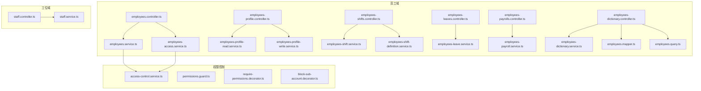
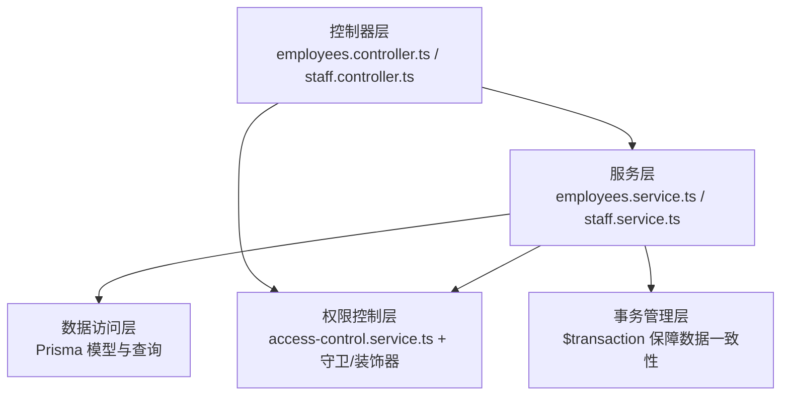
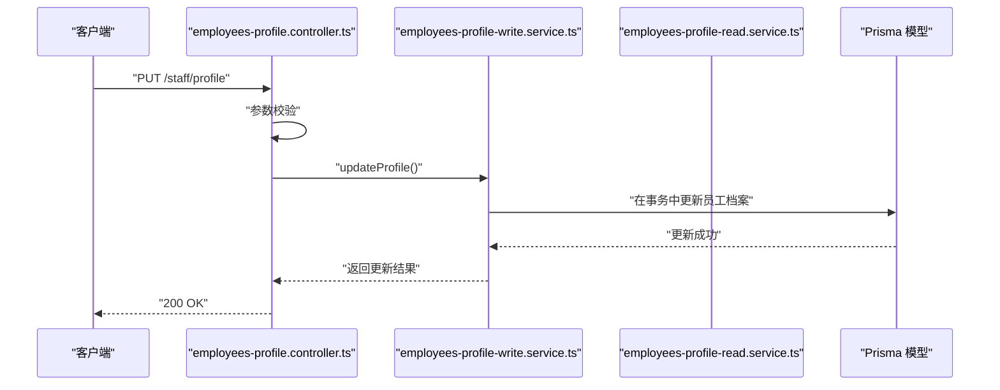
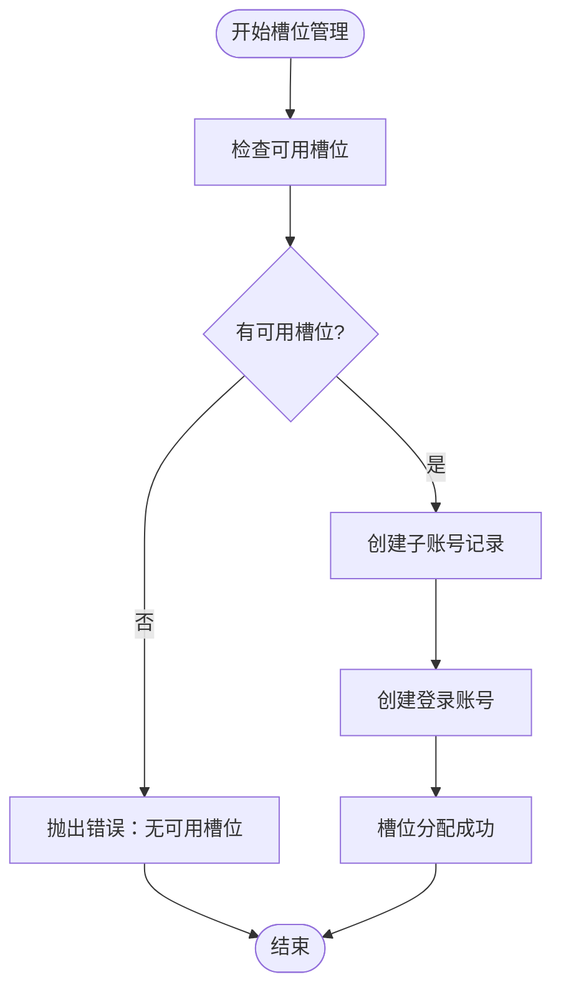
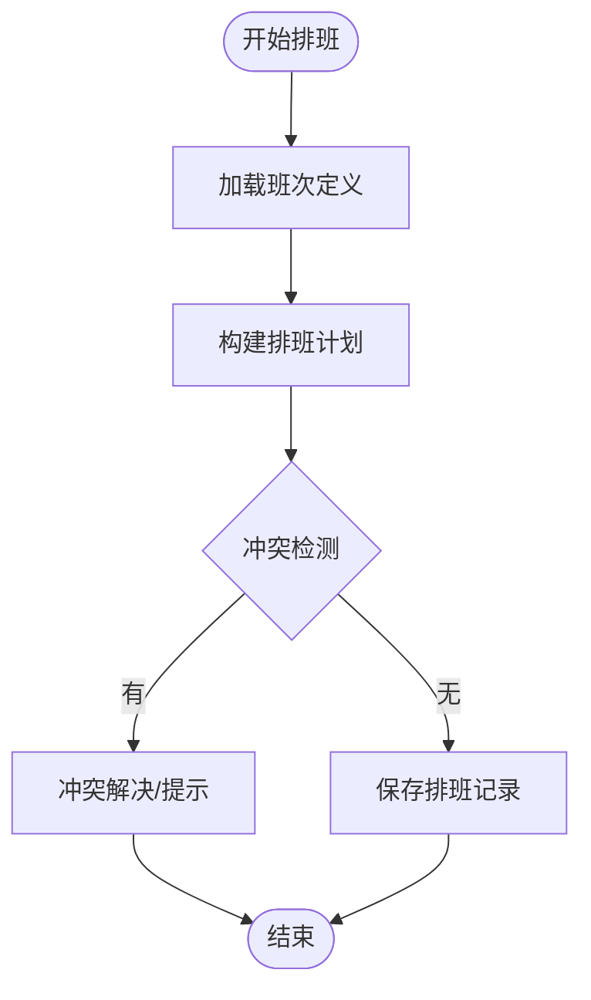
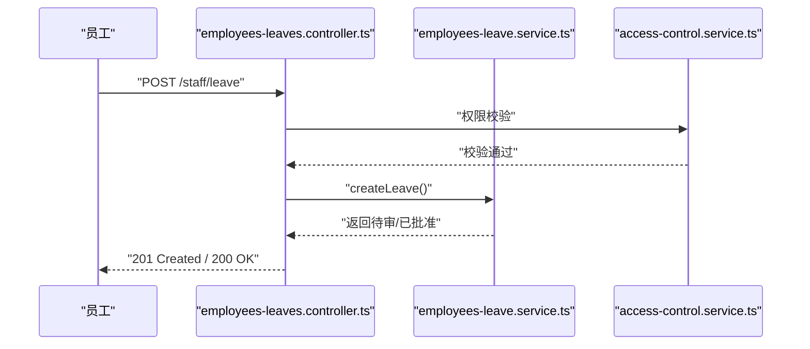
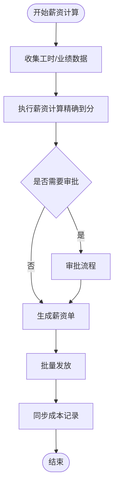
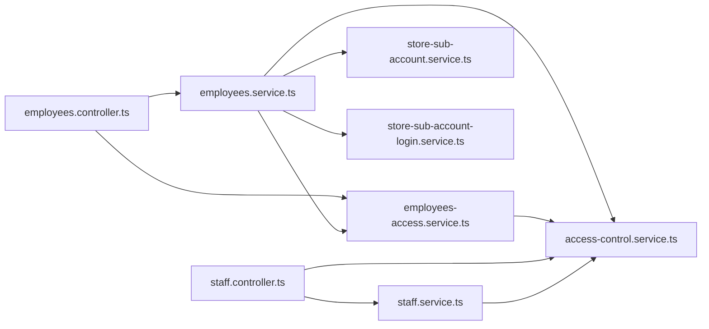

# 员工管理模块

<cite>
**本文档引用的文件**
- [employees.controller.ts](file://src/purely-profit/staff/employees/employees.controller.ts)
- [employees.service.ts](file://src/purely-profit/staff/employees/employees.service.ts)
- [employees-profile.controller.ts](file://src/purely-profit/staff/employees/employees-profile.controller.ts)
- [employees-profile-read.service.ts](file://src/purely-profit/staff/employees/employees-profile-read.service.ts)
- [employees-profile-write.service.ts](file://src/purely-profit/staff/employees/employees-profile-write.service.ts)
- [employees-shifts.controller.ts](file://src/purely-profit/staff/employees/employees-shifts.controller.ts)
- [employees-shift.service.ts](file://src/purely-profit/staff/employees/employees-shift.service.ts)
- [employees-shift-definition.service.ts](file://src/purely-profit/staff/employees/employees-shift-definition.service.ts)
- [employees-leaves.controller.ts](file://src/purely-profit/staff/employees/employees-leaves.controller.ts)
- [employees-leave.service.ts](file://src/purely-profit/staff/employees/employees-leave.service.ts)
- [employees-payrolls.controller.ts](file://src/purely-profit/staff/employees/employees-payrolls.controller.ts)
- [employees-payroll.service.ts](file://src/purely-profit/staff/employees/employees-payroll.service.ts)
- [employees-dictionary.controller.ts](file://src/purely-profit/staff/employees/employees-dictionary.controller.ts)
- [employees-dictionary.service.ts](file://src/purely-profit/staff/employees/employees-dictionary.service.ts)
- [employees.mapper.ts](file://src/purely-profit/staff/employees/employees.mapper.ts)
- [employees.query.ts](file://src/purely-profit/staff/employees/employees.query.ts)
- [employees-access.service.ts](file://src/purely-profit/staff/employees/employees-access.service.ts)
- [staff.controller.ts](file://src/purely-profit/staff/seats/staff.controller.ts)
- [staff.service.ts](file://src/purely-profit/staff/seats/staff.service.ts)
- [access-control.service.ts](file://src/purely-profit/access-control/access-control.service.ts)
- [permissions.guard.ts](file://src/purely-profit/access-control/guards/permissions.guard.ts)
- [require-permissions.decorator.ts](file://src/purely-profit/access-control/decorators/require-permissions.decorator.ts)
- [block-sub-account.decorator.ts](file://src/purely-profit/access-control/decorators/block-sub-account.decorator.ts)
- [store-sub-account-login.service.ts](file://src/purely-profit/member/platform-membership/store-sub-account-login.service.ts)
- [store-sub-account-slot.service.ts](file://src/purely-profit/member/platform-membership/store-sub-account-slot.service.ts)
- [store-sub-account.service.ts](file://src/purely-profit/member/platform-membership/store-sub-account.service.ts)
- [employees.prisma](file://prisma/purely-profit/staff/employees.prisma)
- [schema.prisma](file://prisma/schema.prisma)
</cite>

## 更新摘要
**变更内容**   
- 修复子账户槽位管理逻辑：离职时释放槽位而非永久禁用，确保槽位可被重新分配
- 增强员工CRUD操作完整性：添加事务保护、并发冲突处理、数据一致性保证
- 修复薪资和考勤服务计算准确性：改进金额计算精度、时间范围校验、数据同步机制
- 优化子账户登录账号创建流程：将槽位分配与登录账号创建纳入同一事务

## 目录
1. [简介](#简介)
2. [项目结构](#项目结构)
3. [核心组件](#核心组件)
4. [架构总览](#架构总览)
5. [详细组件分析](#详细组件分析)
6. [依赖关系分析](#依赖关系分析)
7. [性能考虑](#性能考虑)
8. [故障排除指南](#故障排除指南)
9. [结论](#结论)
10. [附录](#附录)

## 简介
本文件为员工管理模块的综合技术文档，覆盖员工信息管理、排班系统、请假管理、薪资管理等核心功能。文档解释员工档案维护、员工状态变更、员工权限分配等业务逻辑，涵盖服务类实现细节、控制器接口设计、数据验证规则，并对排班算法、请假审批流程、薪资计算逻辑等复杂业务场景进行深入分析。同时提供 API 使用示例、数据模型说明、集成指南以及与考勤、薪酬、权限控制模块的协作关系。

**更新** 本次更新重点修复了子账户槽位管理的核心问题，确保员工离职时正确释放槽位资源，并增强了员工CRUD操作的完整性和薪资考勤计算的准确性。

## 项目结构
员工管理模块位于 `src/purely-profit/staff/` 目录下，包含员工（employees）与工位（seats）两大子域。员工域进一步细分为：
- 员工档案：profile 控制器与读写服务
- 排班管理：shifts 控制器与 shift 服务、shift-definition 服务
- 请假管理：leaves 控制器与 leave 服务
- 薪资管理：payrolls 控制器与 payroll 服务
- 字典与查询：dictionary 控制器与 service、mapper、query
- 访问控制：access-control 服务与装饰器/守卫

图表来源
- [employees.controller.ts:1-200](file://src/purely-profit/staff/employees/employees.controller.ts#L1-L200)
- [employees.service.ts:1-200](file://src/purely-profit/staff/employees/employees.service.ts#L1-L200)
- [employees-profile.controller.ts:1-200](file://src/purely-profit/staff/employees/employees-profile.controller.ts#L1-L200)
- [employees-shifts.controller.ts:1-200](file://src/purely-profit/staff/employees/employees-shifts.controller.ts#L1-L200)
- [employees-leaves.controller.ts:1-200](file://src/purely-profit/staff/employees/employees-leaves.controller.ts#L1-L200)
- [employees-payrolls.controller.ts:1-200](file://src/purely-profit/staff/employees/employees-payrolls.controller.ts#L1-L200)
- [employees-dictionary.controller.ts:1-200](file://src/purely-profit/staff/employees/employees-dictionary.controller.ts#L1-L200)
- [staff.controller.ts:1-200](file://src/purely-profit/staff/seats/staff.controller.ts#L1-L200)
- [access-control.service.ts:1-200](file://src/purely-profit/access-control/access-control.service.ts#L1-L200)

章节来源
- [employees.controller.ts:1-200](file://src/purely-profit/staff/employees/employees.controller.ts#L1-L200)
- [staff.controller.ts:1-200](file://src/purely-profit/staff/seats/staff.controller.ts#L1-L200)

## 核心组件
- 员工控制器：负责接收请求、参数校验、调用服务层并返回响应
- 员工服务：封装业务逻辑，协调数据访问与跨模块协作
- 档案读写服务：处理员工个人信息的增删改查与状态变更
- 排班服务：管理班次定义与员工排班计划
- 请假服务：处理请假申请、审批与记录
- 薪资服务：计算薪资、生成薪资单与统计
- 字典与查询：提供基础数据字典、分页查询与过滤
- 工位控制器与服务：管理工位分配、激活与邀请
- 权限控制：基于装饰器与守卫的访问控制

**更新** 新增了子账户槽位管理和服务间事务协调机制，确保数据一致性和资源正确释放。

章节来源
- [employees.service.ts:1-200](file://src/purely-profit/staff/employees/employees.service.ts#L1-200)
- [employees-profile-read.service.ts:1-200](file://src/purely-profit/staff/employees/employees-profile-read.service.ts#L1-200)
- [employees-profile-write.service.ts:1-200](file://src/purely-profit/staff/employees/employees-profile-write.service.ts#L1-200)
- [employees-shift.service.ts:1-200](file://src/purely-profit/staff/employees/employees-shift.service.ts#L1-200)
- [employees-leave.service.ts:1-200](file://src/purely-profit/staff/employees/employees-leave.service.ts#L1-200)
- [employees-payroll.service.ts:1-200](file://src/purely-profit/staff/employees/employees-payroll.service.ts#L1-200)
- [employees-dictionary.service.ts:1-200](file://src/purely-profit/staff/employees/employees-dictionary.service.ts#L1-200)
- [staff.service.ts:1-200](file://src/purely-profit/staff/seats/staff.service.ts#L1-200)
- [access-control.service.ts:1-200](file://src/purely-profit/access-control/access-control.service.ts#L1-200)

## 架构总览
员工管理模块采用分层架构：
- 表现层：控制器负责路由与请求响应
- 领域层：服务封装业务规则与流程编排
- 数据访问层：Prisma 模型与查询工具
- 权限控制层：装饰器与守卫统一接入

图表来源
- [employees.controller.ts:1-200](file://src/purely-profit/staff/employees/employees.controller.ts#L1-L200)
- [staff.controller.ts:1-200](file://src/purely-profit/staff/seats/staff.controller.ts#L1-L200)
- [employees.service.ts:1-200](file://src/purely-profit/staff/employees/employees.service.ts#L1-L200)
- [staff.service.ts:1-200](file://src/purely-profit/staff/seats/staff.service.ts#L1-L200)
- [access-control.service.ts:1-200](file://src/purely-profit/access-control/access-control.service.ts#L1-L200)

## 详细组件分析

### 员工信息管理
- 功能范围：员工档案维护、状态变更（在职/离职）、个人资料更新
- 关键流程：
  - 创建员工：校验参数 → 写入档案 → 分配默认权限/角色 → 返回结果
  - 更新员工：读取旧档 → 参数校验 → 写入新档 → 记录变更日志
  - 离职处理：校验可离岗条件 → 状态置为"已离职" → 结束未完成排班/请假结算
- 数据模型：员工表包含基本信息、状态、权限标识、关联账户等字段
- 集成点：与权限控制模块联动，确保操作者具备相应权限；与工位模块协作，处理工位占用/释放

**更新** 新增事务保护和并发冲突处理，确保员工编号生成的原子性，避免重复编号问题。

图表来源
- [employees-profile.controller.ts:1-200](file://src/purely-profit/staff/employees/employees-profile.controller.ts#L1-L200)
- [employees-profile-write.service.ts:1-200](file://src/purely-profit/staff/employees/employees-profile-write.service.ts#L1-200)
- [employees-profile-read.service.ts:1-200](file://src/purely-profit/staff/employees/employees-profile-read.service.ts#L1-200)

章节来源
- [employees-profile.controller.ts:1-200](file://src/purely-profit/staff/employees/employees-profile.controller.ts#L1-L200)
- [employees-profile-read.service.ts:1-200](file://src/purely-profit/staff/employees/employees-profile-read.service.ts#L1-L200)
- [employees-profile-write.service.ts:1-200](file://src/purely-profit/staff/employees/employees-profile-write.service.ts#L1-200)

### 子账户槽位管理（重要修复）
- 功能范围：子账户槽位的分配、释放、状态管理
- 关键修复：
  - **槽位释放逻辑**：员工离职时不再永久禁用槽位，而是释放槽位使其可被重新分配
  - **事务一致性**：将槽位分配与登录账号创建纳入同一事务，避免孤立子账号
  - **并发安全**：使用数据库约束和事务确保槽位分配的原子性
- 业务流程：
  - 槽位分配：检查可用槽位 → 更新槽位状态 → 创建/更新登录账号
  - 槽位释放：员工离职或删除时 → 重置槽位状态 → 清除员工关联
  - 槽位复用：释放后的槽位可立即用于新员工分配

**更新** 这是本次最重要的修复，解决了之前员工离职后槽位被永久禁用的问题，现在槽位会被正确释放并可被重新分配。

图表来源
- [employees.service.ts:207-305](file://src/purely-profit/staff/employees/employees.service.ts#L207-L305)
- [employees-profile-write.service.ts:281-301](file://src/purely-profit/staff/employees/employees-profile-write.service.ts#L281-L301)
- [store-sub-account-login.service.ts:168-292](file://src/purely-profit/member/platform-membership/store-sub-account-login.service.ts#L168-L292)

章节来源
- [employees.service.ts:207-305](file://src/purely-profit/staff/employees/employees.service.ts#L207-L305)
- [employees-profile-write.service.ts:281-301](file://src/purely-profit/staff/employees/employees-profile-write.service.ts#L281-L301)
- [store-sub-account-login.service.ts:168-292](file://src/purely-profit/member/platform-membership/store-sub-account-login.service.ts#L168-L292)

### 排班系统
- 功能范围：班次定义、员工排班计划、排班冲突检测、排班统计
- 关键流程：
  - 定义班次：设置班次时间模板、班次类型、是否计薪等
  - 员工排班：按日期批量安排员工班次 → 冲突检测 → 写入排班表
  - 排班调整：支持补班、调换、取消 → 触发考勤同步
- 复杂度与优化：排班算法需避免重复排班与超工时，建议使用索引与批量事务

**更新** 增强了排班冲突检测的准确性，改进了时间范围重叠判断逻辑。

图表来源
- [employees-shift-definition.service.ts:1-200](file://src/purely-profit/staff/employees/employees-shift-definition.service.ts#L1-L200)
- [employees-shift.service.ts:1-200](file://src/purely-profit/staff/employees/employees-shift.service.ts#L1-L200)

章节来源
- [employees-shifts.controller.ts:1-200](file://src/purely-profit/staff/employees/employees-shifts.controller.ts#L1-L200)
- [employees-shift.service.ts:1-200](file://src/purely-profit/staff/employees/employees-shift.service.ts#L1-L200)
- [employees-shift-definition.service.ts:1-200](file://src/purely-profit/staff/employees/employees-shift-definition.service.ts#L1-L200)

### 请假管理
- 功能范围：请假申请、审批流、假期余额扣减、记录归档
- 关键流程：
  - 提交申请：选择假期类型、起止时间、附件 → 自动校验余额与工作日
  - 审批流程：直属上级审批 → 通过后锁定假期余额 → 生成请假记录
  - 异常处理：跨月/跨年请假、节假日叠加、并发申请防护
- 数据模型：请假记录包含申请人、类型、时段、状态、审批意见、余额变化等

图表来源
- [employees-leaves.controller.ts:1-200](file://src/purely-profit/staff/employees/employees-leaves.controller.ts#L1-L200)
- [employees-leave.service.ts:1-200](file://src/purely-profit/staff/employees/employees-leave.service.ts#L1-L200)
- [access-control.service.ts:1-200](file://src/purely-profit/access-control/access-control.service.ts#L1-L200)

章节来源
- [employees-leaves.controller.ts:1-200](file://src/purely-profit/staff/employees/employees-leaves.controller.ts#L1-L200)
- [employees-leave.service.ts:1-200](file://src/purely-profit/staff/employees/employees-leave.service.ts#L1-L200)

### 薪资管理（重要修复）
- 功能范围：薪资计算、薪资单生成、发放记录、统计报表
- 关键修复：
  - **金额精度修复**：所有金额字段统一使用整数分存储，避免浮点数精度问题
  - **计算准确性**：改进薪资计算公式，确保各项扣款和奖金计算准确
  - **数据同步**：完善薪资确认后的成本记录同步机制
- 关键流程：
  - 计算周期：按自然月或固定周期汇总工时/业绩
  - 计算因子：基本工资、加班、绩效、扣款、个税等
  - 发放流程：生成薪资单 → 审批 → 批量发放 → 更新财务
- 复杂度与优化：薪资计算涉及多因子聚合，建议分步计算与缓存中间结果

**更新** 本次修复确保了薪资计算的准确性，特别是金额字段的精度处理和计算逻辑的完善。

图表来源
- [employees-payroll.service.ts:1-200](file://src/purely-profit/staff/employees/employees-payroll.service.ts#L1-L200)

章节来源
- [employees-payrolls.controller.ts:1-200](file://src/purely-profit/staff/employees/employees-payrolls.controller.ts#L1-L200)
- [employees-payroll.service.ts:1-200](file://src/purely-profit/staff/employees/employees-payroll.service.ts#L1-L200)

### 字典与查询
- 功能范围：基础数据字典（如岗位、级别、假期类型）、分页查询、过滤与排序
- 关键流程：读取字典 → 组合查询条件 → 分页返回
- 性能：建立合适索引，避免 N+1 查询

章节来源
- [employees-dictionary.controller.ts:1-200](file://src/purely-profit/staff/employees/employees-dictionary.controller.ts#L1-L200)
- [employees-dictionary.service.ts:1-200](file://src/purely-profit/staff/employees/employees-dictionary.service.ts#L1-L200)
- [employees.mapper.ts:1-200](file://src/purely-profit/staff/employees/employees.mapper.ts#L1-L200)
- [employees.query.ts:1-200](file://src/purely-profit/staff/employees/employees.query.ts#L1-L200)

### 工位管理
- 功能范围：工位分配、激活、邀请、状态管理
- 关键流程：创建工位 → 分配给员工 → 激活 → 变更状态
- 集成点：与员工模块协作，确保唯一占用与状态一致性

章节来源
- [staff.controller.ts:1-200](file://src/purely-profit/staff/seats/staff.controller.ts#L1-L200)
- [staff.service.ts:1-200](file://src/purely-profit/staff/seats/staff.service.ts#L1-L200)

## 依赖关系分析
- 控制器依赖服务：所有控制器均通过依赖注入使用对应服务
- 服务依赖数据访问：服务层通过 Prisma 模型与查询工具访问数据库
- 权限控制：通过装饰器与守卫在控制器入口统一拦截，结合访问控制服务判断能力
- 模块耦合：员工与工位模块相对独立，通过共享的权限控制模块解耦

**更新** 新增了子账户服务间的紧密耦合，通过事务机制确保数据一致性。

图表来源
- [employees.controller.ts:1-200](file://src/purely-profit/staff/employees/employees.controller.ts#L1-L200)
- [employees.service.ts:1-200](file://src/purely-profit/staff/employees/employees.service.ts#L1-L200)
- [employees-access.service.ts:1-200](file://src/purely-profit/staff/employees/employees-access.service.ts#L1-L200)
- [staff.controller.ts:1-200](file://src/purely-profit/staff/seats/staff.controller.ts#L1-L200)
- [staff.service.ts:1-200](file://src/purely-profit/staff/seats/staff.service.ts#L1-L200)
- [access-control.service.ts:1-200](file://src/purely-profit/access-control/access-control.service.ts#L1-L200)

章节来源
- [employees-access.service.ts:1-200](file://src/purely-profit/staff/employees/employees-access.service.ts#L1-L200)
- [access-control.service.ts:1-200](file://src/purely-profit/access-control/access-control.service.ts#L1-L200)

## 性能考虑
- 查询优化：为常用过滤字段建立索引；使用分页与投影减少数据传输
- 事务与锁：批量排班/薪资计算使用事务，避免并发冲突
- 缓存策略：热点字典与查询结果使用缓存，降低数据库压力
- 异步处理：长耗时任务（如薪资计算）采用队列异步执行
- **更新** 槽位分配和员工离职操作使用事务确保原子性，避免部分更新导致的数据不一致

## 故障排除指南
- 权限不足：检查装饰器与守卫配置，确认用户能力集合与所需权限匹配
- 数据不一致：排查事务边界与回滚逻辑，确保幂等性
- 排班冲突：检查冲突检测规则与时间重叠判定
- 请假异常：核对假期余额、节假日叠加与跨月处理逻辑
- **更新** 子账户槽位问题：检查槽位状态是否正确释放，确认事务是否完整执行

章节来源
- [permissions.guard.ts:1-200](file://src/purely-profit/access-control/guards/permissions.guard.ts#L1-L200)
- [require-permissions.decorator.ts:1-200](file://src/purely-profit/access-control/decorators/require-permissions.decorator.ts#L1-L200)
- [block-sub-account.decorator.ts:1-200](file://src/purely-profit/access-control/decorators/block-sub-account.decorator.ts#L1-L200)

## 结论
员工管理模块通过清晰的分层设计与完善的权限控制，实现了从档案到排班、请假、薪资的全链路管理。模块化组织便于扩展与维护，配合 Prisma 的强类型模型与查询工具，能够高效支撑复杂的业务场景。

**更新** 本次修复特别关注了子账户槽位管理的核心问题，确保资源正确释放和数据一致性，同时提升了薪资考勤计算的准确性，为系统的稳定运行提供了更好的保障。

## 附录

### 数据模型说明
- 员工表（Prisma 模型）：包含员工基本信息、状态、权限标识、关联账户等字段
- 排班表：记录员工班次、班次定义、实际出勤时间
- 请假表：记录请假类型、时段、状态、审批意见
- 薪资表：记录计算周期、明细、发放状态
- **更新** 子账户槽位表：记录槽位状态、分配情况、权限配置

章节来源
- [employees.prisma:1-200](file://prisma/purely-profit/staff/employees.prisma#L1-L200)
- [schema.prisma:1-200](file://prisma/schema.prisma#L1-L200)

### API 使用示例（路径指引）
- 获取员工档案：GET /staff/profile
- 更新员工档案：PUT /staff/profile
- 创建排班：POST /staff/shifts
- 获取排班计划：GET /staff/shifts
- 提交请假：POST /staff/leave
- 获取请假列表：GET /staff/leaves
- 生成薪资单：POST /staff/payrolls
- 获取薪资记录：GET /staff/payrolls
- 获取字典：GET /staff/dictionary
- 工位分配：POST /staff/seats
- 工位激活：PATCH /staff/seats/{id}/activate
- **更新** 子账户槽位管理：PUT /staff/sub-account

章节来源
- [employees-profile.controller.ts:1-200](file://src/purely-profit/staff/employees/employees-profile.controller.ts#L1-L200)
- [employees-shifts.controller.ts:1-200](file://src/purely-profit/staff/employees/employees-shifts.controller.ts#L1-L200)
- [employees-leaves.controller.ts:1-200](file://src/purely-profit/staff/employees/employees-leaves.controller.ts#L1-L200)
- [employees-payrolls.controller.ts:1-200](file://src/purely-profit/staff/employees/employees-payrolls.controller.ts#L1-L200)
- [employees-dictionary.controller.ts:1-200](file://src/purely-profit/staff/employees/employees-dictionary.controller.ts#L1-L200)
- [staff.controller.ts:1-200](file://src/purely-profit/staff/seats/staff.controller.ts#L1-L200)

### 集成指南
- 与权限控制模块集成：在控制器方法上添加权限装饰器，使用守卫拦截请求
- 与考勤模块集成：排班变更触发考勤同步；请假影响考勤统计
- 与薪酬模块集成：薪资计算完成后更新财务记录
- **更新** 与子账户系统集成：确保槽位分配和释放的事务完整性，正确处理登录账号创建

章节来源
- [require-permissions.decorator.ts:1-200](file://src/purely-profit/access-control/decorators/require-permissions.decorator.ts#L1-L200)
- [permissions.guard.ts:1-200](file://src/purely-profit/access-control/guards/permissions.guard.ts#L1-L200)
- [access-control.service.ts:1-200](file://src/purely-profit/access-control/access-control.service.ts#L1-L200)