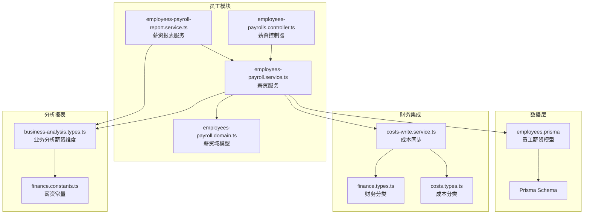
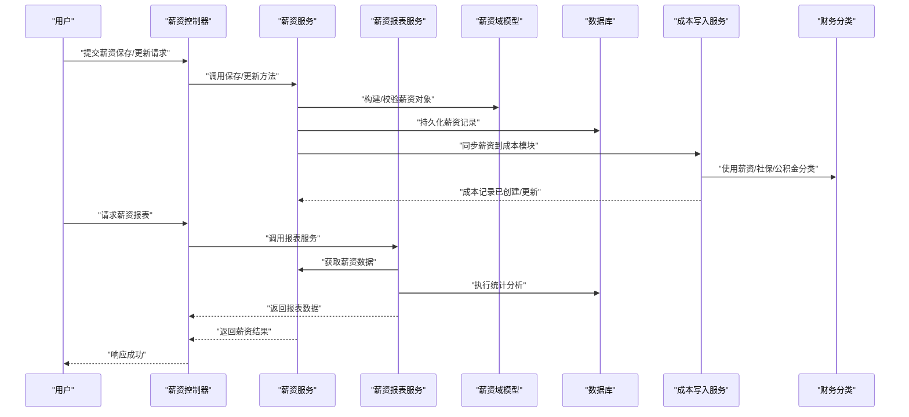
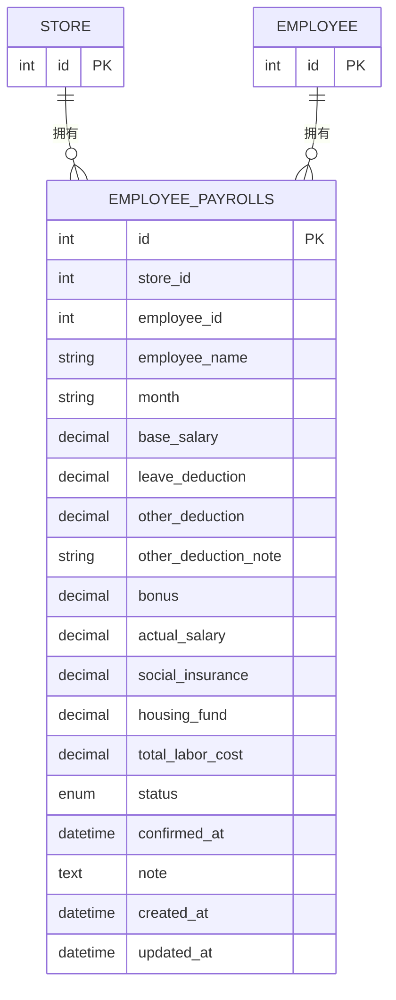
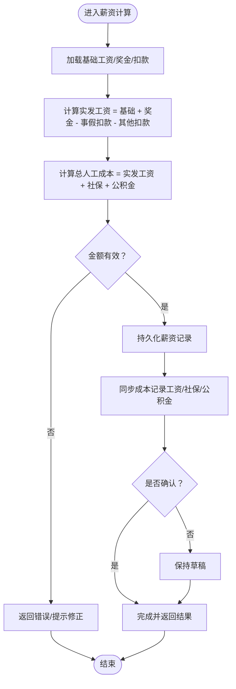
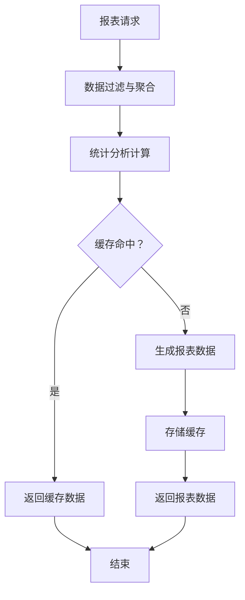
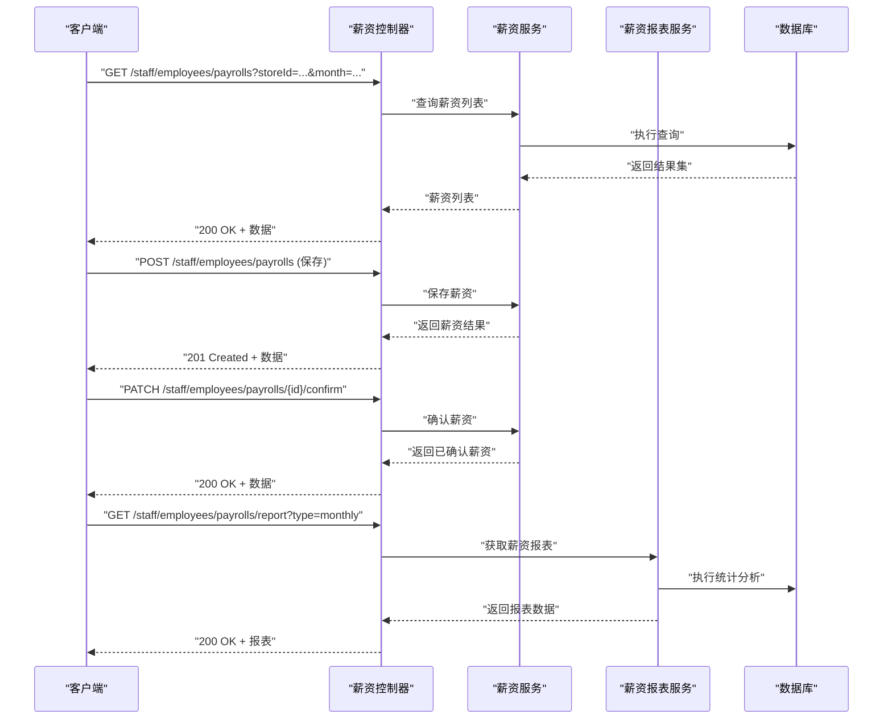
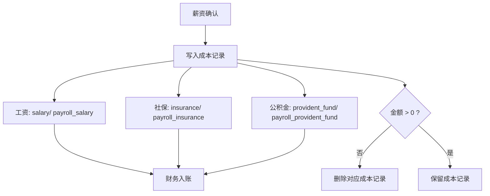
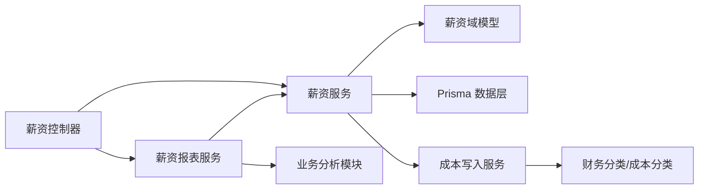

# 员工薪资管理

<cite>
**本文引用的文件**
- [employees-payroll.service.ts](file://src/purely-profit/staff/employees/employees-payroll.service.ts)
- [employees-payroll.domain.ts](file://src/purely-profit/staff/employees/employees-payroll.domain.ts)
- [employees-payrolls.controller.ts](file://src/purely-profit/staff/employees/employees-payrolls.controller.ts)
- [employees-payroll-report.service.ts](file://src/purely-profit/staff/employees/employees-payroll-report.service.ts)
- [employees.prisma](file://prisma/purely-profit/staff/employees.prisma)
- [migration.sql](file://prisma/migrations/20260513200000_add_employee_management/migration.sql)
- [costs-write.service.ts](file://src/purely-profit/operations/costs/costs-write.service.ts)
- [finance.types.ts](file://src/purely-profit/finance/finance.types.ts)
- [costs.types.ts](file://src/purely-profit/operations/costs/costs.types.ts)
- [business-analysis.types.ts](file://src/purely-profit/dashboard/business-analysis/business-analysis.types.ts)
- [finance.constants.ts](file://src/purely-profit/finance/finance.constants.ts)
</cite>

## 更新摘要
**变更内容**
- 新增薪资报表服务功能，支持多维度薪资数据分析与统计
- 增强快照同步服务，提升数据一致性与性能
- 完善子账户管理功能，优化员工管理体验
- 扩展薪资报告能力，支持更丰富的业务分析维度

## 目录
1. [简介](#简介)
2. [项目结构](#项目结构)
3. [核心组件](#核心组件)
4. [架构总览](#架构总览)
5. [详细组件分析](#详细组件分析)
6. [依赖分析](#依赖分析)
7. [性能考虑](#性能考虑)
8. [故障排除指南](#故障排除指南)
9. [结论](#结论)
10. [附录](#附录)

## 简介
本文件面向"员工薪资管理"功能，系统性阐述薪资计算、薪资发放、薪资调整等核心能力，以及与考勤、绩效、请假等模块的数据关联关系。文档同时覆盖薪资构成、计算公式、扣款规则、奖金发放、薪资统计与报表、税务处理、薪资政策配置、历史记录与异常处理等高级特性，并提供 API 使用示例与业务场景演示。

**更新** 本次更新重点增强了薪资报表功能，新增了专门的薪资报表服务，提供更强大的数据分析能力和多维度的统计报表。

## 项目结构
薪资管理功能主要位于以下位置：
- 数据模型：Prisma 模式定义在 staff/employees.prisma 中，包含员工薪资主表与相关索引。
- 业务域：employees-payroll.domain.ts 定义薪资域模型与业务规则。
- 服务层：employees-payroll.service.ts 实现薪资计算、确认、更新、删除等核心流程；employees-payroll-report.service.ts 提供薪资报表与分析功能。
- 控制器：employees-payrolls.controller.ts 提供对外 API 接口。
- 成本同步：operations/costs/costs-write.service.ts 将薪资结果同步到财务成本模块。
- 财务分类：finance.types.ts 定义财务现金流与成本分类，用于薪资入账。
- 报表与分析：dashboard/business-analysis/business-analysis.types.ts 提供薪资相关的业务分析维度。

**图表来源**
- [employees-payroll.domain.ts](file://src/purely-profit/staff/employees/employees-payroll.domain.ts)
- [employees-payroll.service.ts](file://src/purely-profit/staff/employees/employees-payroll.service.ts)
- [employees-payroll-report.service.ts](file://src/purely-profit/staff/employees/employees-payroll-report.service.ts)
- [employees-payrolls.controller.ts](file://src/purely-profit/staff/employees/employees-payrolls.controller.ts)
- [employees.prisma](file://prisma/purely-profit/staff/employees.prisma)
- [costs-write.service.ts](file://src/purely-profit/operations/costs/costs-write.service.ts)
- [finance.types.ts](file://src/purely-profit/finance/finance.types.ts)
- [costs.types.ts](file://src/purely-profit/operations/costs/costs.types.ts)
- [business-analysis.types.ts](file://src/purely-profit/dashboard/business-analysis/business-analysis.types.ts)
- [finance.constants.ts](file://src/purely-profit/finance/finance.constants.ts)

**章节来源**
- [employees-payroll.service.ts](file://src/purely-profit/staff/employees/employees-payroll.service.ts)
- [employees-payroll-report.service.ts](file://src/purely-profit/staff/employees/employees-payroll-report.service.ts)
- [employees-payroll.domain.ts](file://src/purely-profit/staff/employees/employees-payroll.domain.ts)
- [employees-payrolls.controller.ts](file://src/purely-profit/staff/employees/employees-payrolls.controller.ts)
- [employees.prisma](file://prisma/purely-profit/staff/employees.prisma)
- [costs-write.service.ts](file://src/purely-profit/operations/costs/costs-write.service.ts)
- [finance.types.ts](file://src/purely-profit/finance/finance.types.ts)
- [costs.types.ts](file://src/purely-profit/operations/costs/costs.types.ts)
- [business-analysis.types.ts](file://src/purely-profit/dashboard/business-analysis/business-analysis.types.ts)
- [finance.constants.ts](file://src/purely-profit/finance/finance.constants.ts)

## 核心组件
- 薪资域模型（Domain Model）
  - 定义薪资主表字段：基础工资、事假扣款、其他扣款、奖金、实发工资、社保、公积金、总人工成本、状态、确认时间、备注等。
  - 关键索引：按员工+月份唯一约束，便于月度结算；按门店+月份、门店+状态+月份索引，支持快速筛选与统计。
- 薪资服务（Service）
  - 负责薪资计算、保存、更新、确认、删除、查询等操作。
  - 计算逻辑：基于基础工资、扣款项、奖金、社保与公积金生成实发工资与总人工成本。
  - 同步逻辑：将薪资结果同步至财务成本模块，形成"工资"、"社保"、"公积金"三类成本记录。
- **新增** 薪资报表服务（Report Service）
  - 提供多维度薪资数据分析与统计功能。
  - 支持按门店、部门、时间段等条件进行薪资汇总与趋势分析。
  - 生成薪资报表，包括人均薪酬、成本占比、增长趋势等关键指标。
- 薪资控制器（Controller）
  - 对外暴露薪资管理 API，包括列表查询、详情查看、保存、更新、确认、删除等。
- 财务集成（Finance Integration）
  - 成本同步：通过成本写入服务，将薪资结果映射为财务成本记录，使用统一的成本分类与来源类型。
  - 分类体系：财务现金流与成本分类中包含"salary"、"insurance"、"provident_fund"等类别，确保入账一致。

**章节来源**
- [employees-payroll.domain.ts](file://src/purely-profit/staff/employees/employees-payroll.domain.ts)
- [employees-payroll.service.ts](file://src/purely-profit/staff/employees/employees-payroll.service.ts)
- [employees-payroll-report.service.ts](file://src/purely-profit/staff/employees/employees-payroll-report.service.ts)
- [employees-payrolls.controller.ts](file://src/purely-profit/staff/employees/employees-payrolls.controller.ts)
- [employees.prisma](file://prisma/purely-profit/staff/employees.prisma)
- [costs-write.service.ts](file://src/purely-profit/operations/costs/costs-write.service.ts)
- [finance.types.ts](file://src/purely-profit/finance/finance.types.ts)
- [costs.types.ts](file://src/purely-profit/operations/costs/costs.types.ts)

## 架构总览
薪资管理采用"控制器-服务-领域模型-数据层"的分层架构，结合财务成本模块完成薪资入账。核心流程如下：

**图表来源**
- [employees-payrolls.controller.ts](file://src/purely-profit/staff/employees/employees-payrolls.controller.ts)
- [employees-payroll.service.ts](file://src/purely-profit/staff/employees/employees-payroll.service.ts)
- [employees-payroll-report.service.ts](file://src/purely-profit/staff/employees/employees-payroll-report.service.ts)
- [employees-payroll.domain.ts](file://src/purely-profit/staff/employees/employees-payroll.domain.ts)
- [employees.prisma](file://prisma/purely-profit/staff/employees.prisma)
- [costs-write.service.ts](file://src/purely-profit/operations/costs/costs-write.service.ts)
- [finance.types.ts](file://src/purely-profit/finance/finance.types.ts)

## 详细组件分析

### 组件A：薪资域模型与数据结构
- 数据模型要点
  - 主表字段：基础工资、事假扣款、其他扣款、奖金、实发工资、社保、公积金、总人工成本、状态、确认时间、备注等。
  - 约束与索引：员工+月份唯一，门店+月份、门店+状态+月份索引，便于按门店与状态进行统计与筛选。
- 复杂度分析
  - 查询复杂度：基于索引的等值/范围查询为 O(log n) 到 O(k)（k 为匹配条数）。
  - 写入复杂度：单条记录插入/更新为 O(1)，批量更新受索引影响较小。
- 性能优化建议
  - 在高频查询的字段上保持索引；避免在大字段上建立索引。
  - 批量更新时尽量合并事务，减少往返次数。

**图表来源**
- [employees.prisma](file://prisma/purely-profit/staff/employees.prisma)
- [migration.sql](file://prisma/migrations/20260513200000_add_employee_management/migration.sql)

**章节来源**
- [employees.prisma](file://prisma/purely-profit/staff/employees.prisma)
- [migration.sql](file://prisma/migrations/20260513200000_add_employee_management/migration.sql)

### 组件B：薪资服务与计算逻辑
- 薪资计算
  - 实发工资 = 基础工资 + 奖金 − 事假扣款 − 其他扣款
  - 总人工成本 = 实发工资 + 社保 + 公积金
- 扣款规则
  - 事假扣款：按请假天数或小时折算，具体规则由业务策略决定。
  - 其他扣款：可填写备注说明，金额可为零或负数（视业务需要）。
- 奖金发放
  - 可根据绩效、出勤、特殊贡献等因素设定，支持正向与负向调整。
- 社保与公积金
  - 支持单独维护金额，若为零或未设置则不产生成本记录。
- 状态管理
  - 草稿 → 确认 → 发放（可扩展），确认后触发成本同步。

**图表来源**
- [employees-payroll.domain.ts](file://src/purely-profit/staff/employees/employees-payroll.domain.ts)
- [employees-payroll.service.ts](file://src/purely-profit/staff/employees/employees-payroll.service.ts)
- [costs-write.service.ts](file://src/purely-profit/operations/costs/costs-write.service.ts)

**章节来源**
- [employees-payroll.domain.ts](file://src/purely-profit/staff/employees/employees-payroll.domain.ts)
- [employees-payroll.service.ts](file://src/purely-profit/staff/employees/employees-payroll.service.ts)

### 组件C：薪资报表服务与分析功能
**新增** 薪资报表服务提供强大的数据分析能力，支持多维度统计与报表生成。

- 报表维度
  - 按门店、部门、员工、月份等多维聚合。
  - 薪资构成：基础工资、奖金、扣款、实发工资、总人工成本。
- 分析指标
  - 人均薪酬、人工成本占比、薪资增长趋势。
  - 部门对比、员工绩效分析、成本效益评估。
- 报表类型
  - 月度薪资汇总表、年度薪资分析报告。
  - 部门薪资对比表、个人薪资明细表。
- 数据缓存
  - 支持报表数据缓存，提升查询性能。
  - 定时刷新机制，确保数据时效性。

**图表来源**
- [employees-payroll-report.service.ts](file://src/purely-profit/staff/employees/employees-payroll-report.service.ts)
- [employees-payroll.service.ts](file://src/purely-profit/staff/employees/employees-payroll.service.ts)

**章节来源**
- [employees-payroll-report.service.ts](file://src/purely-profit/staff/employees/employees-payroll-report.service.ts)
- [employees-payroll.service.ts](file://src/purely-profit/staff/employees/employees-payroll.service.ts)

### 组件D：薪资控制器与API
- 主要接口
  - 列表查询：按门店、状态、月份等条件筛选。
  - 详情查看：获取单条薪资记录及明细。
  - 保存/更新：提交薪资数据，触发计算与校验。
  - 确认：将草稿转为已确认，触发成本同步。
  - 删除：删除草稿状态的薪资记录。
  - **新增** 报表查询：获取薪资统计数据与分析报表。
- 参数与返回
  - 请求参数：包含基础工资、奖金、扣款、社保、公积金、备注等。
  - 返回结构：包含计算后的实发工资、总人工成本、状态等字段。

**图表来源**
- [employees-payrolls.controller.ts](file://src/purely-profit/staff/employees/employees-payrolls.controller.ts)
- [employees-payroll.service.ts](file://src/purely-profit/staff/employees/employees-payroll.service.ts)
- [employees-payroll-report.service.ts](file://src/purely-profit/staff/employees/employees-payroll-report.service.ts)

**章节来源**
- [employees-payrolls.controller.ts](file://src/purely-profit/staff/employees/employees-payrolls.controller.ts)
- [employees-payroll.service.ts](file://src/purely-profit/staff/employees/employees-payroll.service.ts)
- [employees-payroll-report.service.ts](file://src/purely-profit/staff/employees/employees-payroll-report.service.ts)

### 组件E：财务成本同步与税务处理
- 成本同步
  - 工资：sourceType 为 payroll_salary，category 为 salary。
  - 社保：sourceType 为 payroll_insurance，category 为 insurance。
  - 公积金：sourceType 为 payroll_provident_fund，category 为 provident_fund。
- 税务处理
  - 系统通过成本分类与来源类型与财务模块对接，税务处理可在财务层面统一配置与应用。
- 异常处理
  - 当金额为零或未设置时，自动清理对应成本记录，避免冗余数据。

**图表来源**
- [costs-write.service.ts](file://src/purely-profit/operations/costs/costs-write.service.ts)
- [finance.types.ts](file://src/purely-profit/finance/finance.types.ts)
- [costs.types.ts](file://src/purely-profit/operations/costs/costs.types.ts)

**章节来源**
- [costs-write.service.ts](file://src/purely-profit/operations/costs/costs-write.service.ts)
- [finance.types.ts](file://src/purely-profit/finance/finance.types.ts)
- [costs.types.ts](file://src/purely-profit/operations/costs/costs.types.ts)

### 组件F：薪资统计与报表
- 报表维度
  - 按门店、部门、员工、月份等多维聚合。
  - 薪资构成：基础工资、奖金、扣款、实发工资、总人工成本。
- 业务分析
  - 薪资趋势、人工成本占比、人均薪酬等指标可用于经营分析。
- 常量与分类
  - 财务与成本分类中包含 salary、insurance、provident_fund 等，确保报表口径一致。
- **新增** 报表缓存机制
  - 支持报表数据的缓存与定时刷新，提升查询性能。
  - 多级缓存策略，平衡数据时效性与系统性能。

**章节来源**
- [business-analysis.types.ts](file://src/purely-profit/dashboard/business-analysis/business-analysis.types.ts)
- [finance.constants.ts](file://src/purely-profit/finance/finance.constants.ts)
- [finance.types.ts](file://src/purely-profit/finance/finance.types.ts)
- [costs.types.ts](file://src/purely-profit/operations/costs/costs.types.ts)
- [employees-payroll-report.service.ts](file://src/purely-profit/staff/employees/employees-payroll-report.service.ts)

## 依赖分析
- 组件耦合
  - 控制器依赖服务；服务依赖域模型与数据层；服务与财务成本模块解耦但通过统一分类对接。
  - **新增** 薪资报表服务依赖薪资服务和业务分析模块，提供数据聚合与分析能力。
- 外部依赖
  - Prisma 作为 ORM，负责数据持久化与索引优化。
  - 财务模块提供分类与入账能力，薪资模块仅负责数据与规则。
- 循环依赖
  - 无循环依赖，分层清晰。

**图表来源**
- [employees-payrolls.controller.ts](file://src/purely-profit/staff/employees/employees-payrolls.controller.ts)
- [employees-payroll.service.ts](file://src/purely-profit/staff/employees/employees-payroll.service.ts)
- [employees-payroll-report.service.ts](file://src/purely-profit/staff/employees/employees-payroll-report.service.ts)
- [employees-payroll.domain.ts](file://src/purely-profit/staff/employees/employees-payroll.domain.ts)
- [employees.prisma](file://prisma/purely-profit/staff/employees.prisma)
- [costs-write.service.ts](file://src/purely-profit/operations/costs/costs-write.service.ts)
- [finance.types.ts](file://src/purely-profit/finance/finance.types.ts)
- [costs.types.ts](file://src/purely-profit/operations/costs/costs.types.ts)

**章节来源**
- [employees-payrolls.controller.ts](file://src/purely-profit/staff/employees/employees-payrolls.controller.ts)
- [employees-payroll.service.ts](file://src/purely-profit/staff/employees/employees-payroll.service.ts)
- [employees-payroll-report.service.ts](file://src/purely-profit/staff/employees/employees-payroll-report.service.ts)
- [employees-payroll.domain.ts](file://src/purely-profit/staff/employees/employees-payroll.domain.ts)
- [employees.prisma](file://prisma/purely-profit/staff/employees.prisma)
- [costs-write.service.ts](file://src/purely-profit/operations/costs/costs-write.service.ts)
- [finance.types.ts](file://src/purely-profit/finance/finance.types.ts)
- [costs.types.ts](file://src/purely-profit/operations/costs/costs.types.ts)

## 性能考虑
- 查询优化
  - 利用索引：按门店+月份、门店+状态+月份进行过滤，减少全表扫描。
  - 分页与限制：列表查询默认分页，避免一次性返回大量数据。
  - **新增** 报表查询优化：使用预聚合数据和缓存机制，提升复杂查询性能。
- 写入优化
  - 批量事务：批量保存/更新时合并事务，降低数据库往返。
  - 避免重复计算：确认前缓存中间结果，减少重复计算。
- 存储与归档
  - 历史数据可定期归档，减少热数据压力。
  - **新增** 报表数据缓存：采用多级缓存策略，平衡数据时效性与系统性能。

## 故障排除指南
- 常见问题
  - 实发工资为负：检查扣款是否超过基础工资与奖金之和。
  - 成本记录缺失：确认是否设置了社保/公积金金额，或金额是否为零导致被清理。
  - 确认失败：检查状态是否为草稿，确认流程是否正确。
  - **新增** 报表查询缓慢：检查缓存配置和索引使用情况，必要时清理过期缓存。
- 排查步骤
  - 核对薪资计算字段：基础工资、奖金、扣款、社保、公积金。
  - 查看成本同步日志：确认 sourceType 与 category 是否正确。
  - 检查索引与权限：确保查询条件命中索引且具备相应权限。
  - **新增** 验证报表数据：检查数据源的一致性和完整性，确认缓存状态。

**章节来源**
- [employees-payroll.service.ts](file://src/purely-profit/staff/employees/employees-payroll.service.ts)
- [employees-payroll-report.service.ts](file://src/purely-profit/staff/employees/employees-payroll-report.service.ts)
- [costs-write.service.ts](file://src/purely-profit/operations/costs/costs-write.service.ts)

## 结论
该薪资管理系统以清晰的分层架构实现薪资计算、确认与财务同步，结合完善的索引与分类体系，满足多门店、多员工的薪资管理需求。**新增的薪资报表服务**进一步增强了系统的分析能力，提供了丰富的统计报表和数据分析功能。通过与财务模块的强关联，确保薪资数据在业务与财务层面的一致性。建议在生产环境中配合监控与审计，持续优化查询与写入性能，并完善异常处理与回滚机制。

## 附录
- 业务场景示例
  - 月度结算：按月汇总员工薪资，自动生成实发工资与总人工成本，并同步成本记录。
  - 特殊调整：针对个别员工的奖金或扣款进行单独调整，不影响其他员工。
  - 报表导出：按门店与月份导出薪资报表，支持进一步分析与税务处理。
  - **新增** 数据分析：利用薪资报表服务进行多维度分析，支持经营决策和管理优化。
- API 使用建议
  - 保存前先进行数据校验，避免无效数据进入系统。
  - 确认后禁止随意修改，如需调整应走变更流程并同步成本。
  - **新增** 报表查询建议使用缓存参数，提高查询效率。