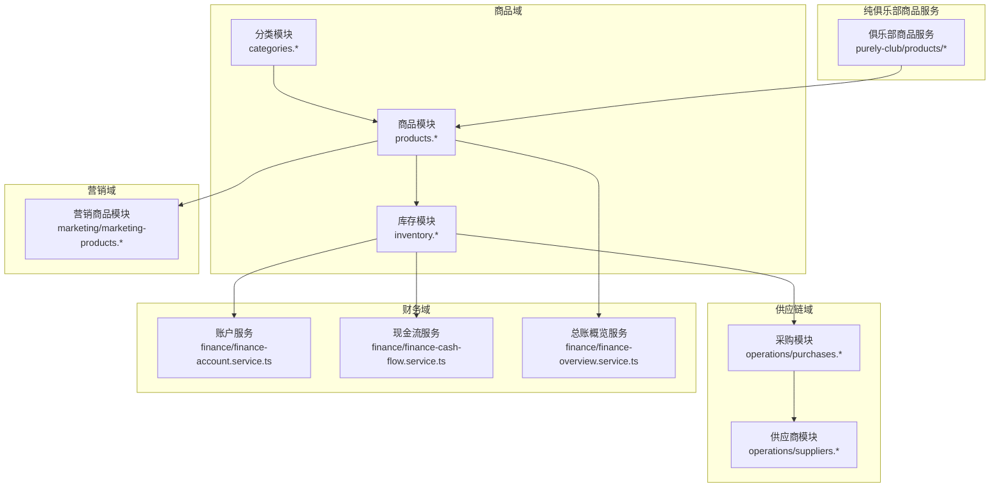
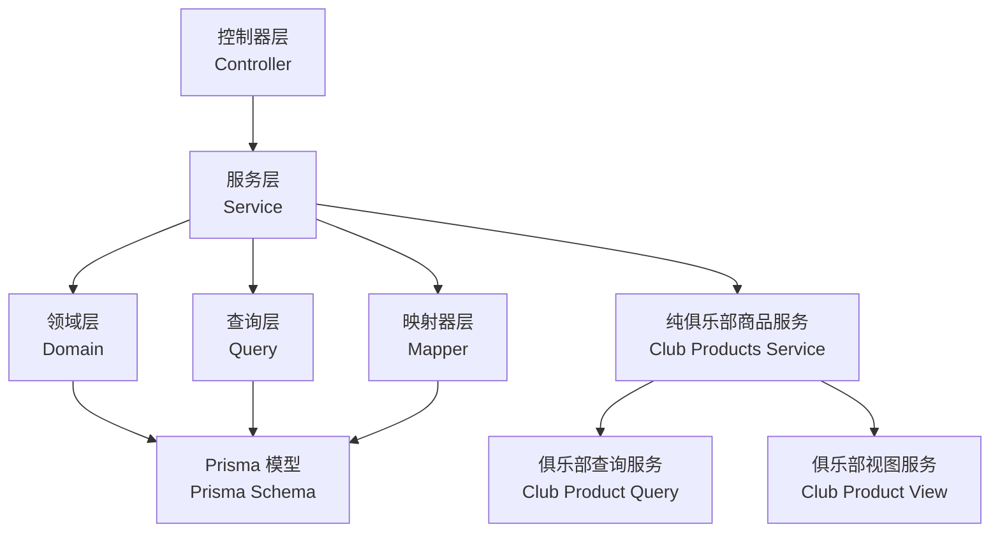
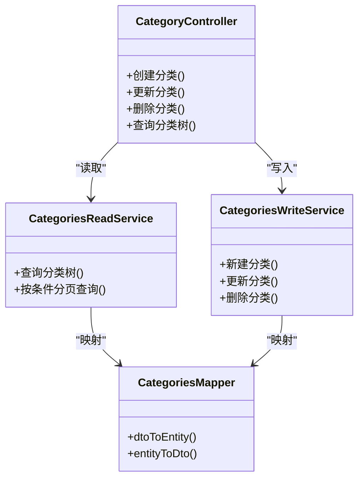
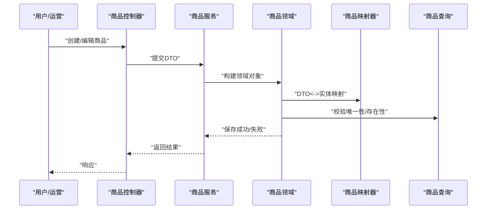
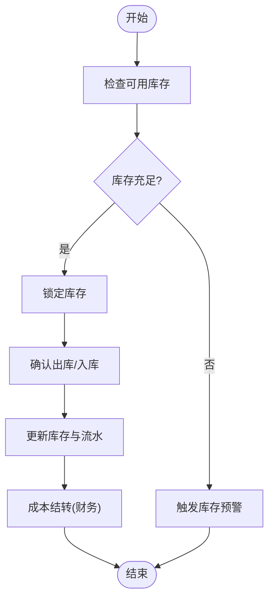
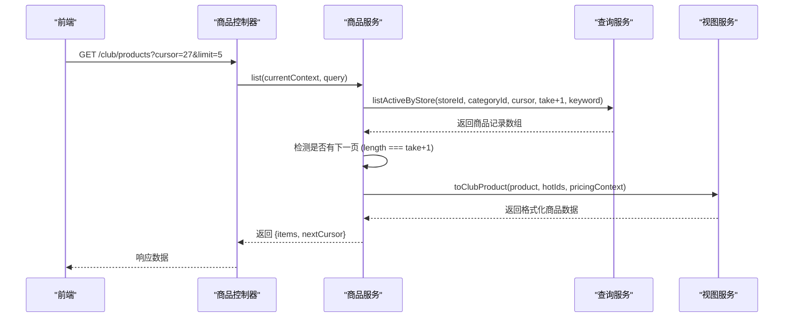
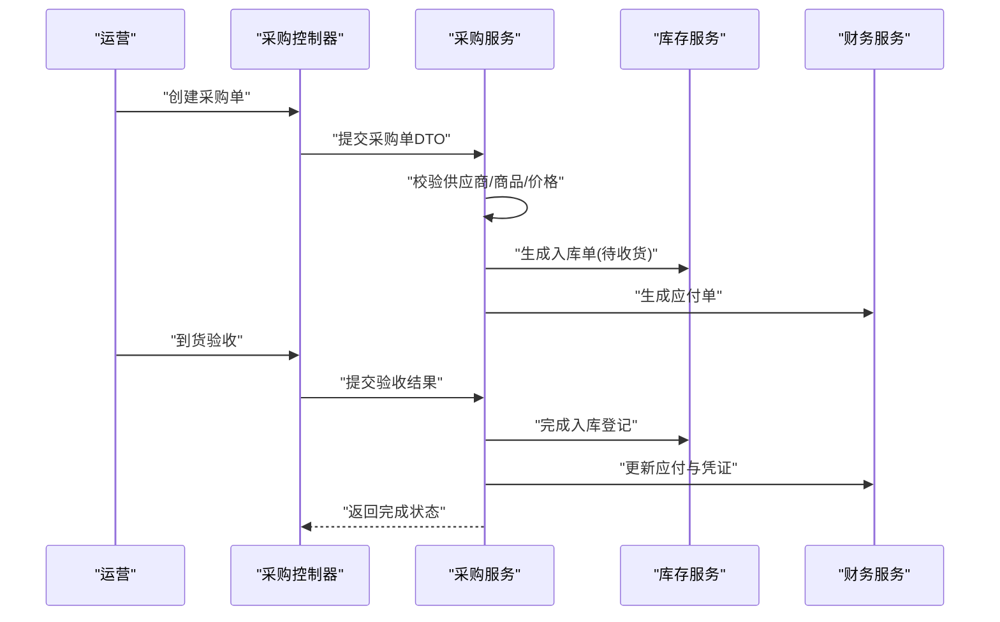
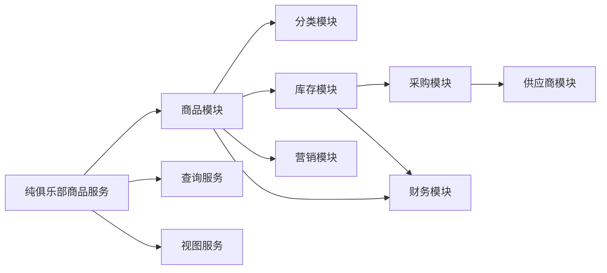

# 商品管理模块

<cite>
**本文引用的文件**
- [schema.prisma](file://prisma/schema.prisma)
- [goods/categories/categories.controller.ts](file://src/purely-profit/goods/categories/categories.controller.ts)
- [goods/categories/categories.service.ts](file://src/purely-profit/goods/categories/categories.service.ts)
- [goods/categories/categories-read.service.ts](file://src/purely-profit/goods/categories/categories-read.service.ts)
- [goods/categories/categories-write.service.ts](file://src/purely-profit/goods/categories/categories-write.service.ts)
- [goods/categories/categories.mapper.ts](file://src/purely-profit/goods/categories/categories.mapper.ts)
- [goods/categories/categories.types.ts](file://src/purely-profit/goods/categories/categories.types.ts)
- [goods/products/products.controller.ts](file://src/purely-profit/goods/products/products.controller.ts)
- [goods/products/products.service.ts](file://src/purely-profit/goods/products/products.service.ts)
- [goods/products/products.domain.ts](file://src/purely-profit/goods/products/products.domain.ts)
- [goods/products/products.mapper.ts](file://src/purely-profit/goods/products/products.mapper.ts)
- [goods/products/products.types.ts](file://src/purely-profit/goods/products/products.types.ts)
- [goods/inventory/inventory.controller.ts](file://src/purely-profit/goods/inventory/inventory.controller.ts)
- [goods/inventory/inventory.service.ts](file://src/purely-profit/goods/inventory/inventory.service.ts)
- [goods/inventory/inventory-read.service.ts](file://src/purely-profit/goods/inventory/inventory-read.service.ts)
- [goods/inventory/inventory.domain.ts](file://src/purely-profit/goods/inventory/inventory.domain.ts)
- [goods/inventory/inventory.mapper.ts](file://src/purely-profit/goods/inventory/inventory.mapper.ts)
- [goods/inventory/inventory.types.ts](file://src/purely-profit/goods/inventory/inventory.types.ts)
- [operations/purchases/purchases.controller.ts](file://src/purely-profit/operations/purchases/purchases.controller.ts)
- [operations/suppliers/suppliers.controller.ts](file://src/purely-profit/operations/suppliers/suppliers.controller.ts)
- [marketing/marketing-products.controller.ts](file://src/purely-profit/marketing/marketing-products.controller.ts)
- [marketing/marketing-products.service.ts](file://src/purely-profit/marketing/marketing-products.service.ts)
- [finance/finance-account.service.ts](file://src/purely-profit/finance/finance-account.service.ts)
- [finance/finance-cash-flow.service.ts](file://src/purely-profit/finance/finance-cash-flow.service.ts)
- [finance/finance-overview.service.ts](file://src/purely-profit/finance/finance-overview.service.ts)
- [purely-club/products/club-products.service.ts](file://src/purely-club/products/club-products.service.ts)
- [purely-club/products/club-product-query.service.ts](file://src/purely-club/products/club-product-query.service.ts)
- [purely-club/products/club-product-view.service.ts](file://src/purely-club/products/club-product-view.service.ts)
- [purely-club/products/dto/club-product.dto.ts](file://src/purely-club/products/dto/club-product.dto.ts)
</cite>

## 更新摘要
**变更内容**
- 纯俱乐部商品服务增强了游标分页功能，实现了针对大型商品目录的cursor-based pagination
- 支持featured和regular列表的不同处理策略，包含nextCursor字段用于无限滚动
- 优化了商品查询性能，支持按ID倒序的高效翻页
- 改进了首页精选商品的展示逻辑，确保新上架商品可见性

## 目录
1. [简介](#简介)
2. [项目结构](#项目结构)
3. [核心组件](#核心组件)
4. [架构总览](#架构总览)
5. [详细组件分析](#详细组件分析)
6. [依赖分析](#依赖分析)
7. [性能考虑](#性能考虑)
8. [故障排查指南](#故障排查指南)
9. [结论](#结论)
10. [附录](#附录)

## 简介
本文件系统性梳理"商品管理模块"的设计与实现，覆盖商品分类管理、商品信息管理、库存控制、采购管理、供应链协同、价格策略与库存预警、商品搜索与推荐、商品统计与报表、以及与财务、营销模块的协作关系。文档以代码为依据，结合数据模型与业务流程，提供可操作的接口说明、数据模型结构、流程图与时序图，并给出最佳实践与排障建议。

**最新更新**：纯俱乐部商品服务已实现先进的游标分页功能，支持大型商品目录的高效浏览，同时库存管理模块已完成重大重构，采用读写分离架构，显著提升查询性能和系统可维护性。

## 项目结构
商品管理模块位于后端工程的 goods 子域，包含三大子域：分类（categories）、商品（products）、库存（inventory）。同时，供应链相关能力由 operations 下的 purchases（采购）与 suppliers（供应商）提供；营销侧通过 marketing-products 提供商品维度的营销能力；财务侧通过 finance-* 服务提供账户、现金流与总账概览能力。纯俱乐部商品服务位于 purely-club/products 目录下，提供面向会员的商品浏览功能。

**图表来源**
- [goods/categories/categories.controller.ts](file://src/purely-profit/goods/categories/categories.controller.ts)
- [goods/products/products.controller.ts](file://src/purely-profit/goods/products/products.controller.ts)
- [goods/inventory/inventory.controller.ts](file://src/purely-profit/goods/inventory/inventory.controller.ts)
- [operations/purchases/purchases.controller.ts](file://src/purely-profit/operations/purchases/purchases.controller.ts)
- [operations/suppliers/suppliers.controller.ts](file://src/purely-profit/operations/suppliers/suppliers.controller.ts)
- [marketing/marketing-products.controller.ts](file://src/purely-profit/marketing/marketing-products.controller.ts)
- [finance/finance-account.service.ts](file://src/purely-profit/finance/finance-account.service.ts)
- [finance/finance-cash-flow.service.ts](file://src/purely-profit/finance/finance-cash-flow.service.ts)
- [finance/finance-overview.service.ts](file://src/purely-profit/finance/finance-overview.service.ts)
- [purely-club/products/club-products.controller.ts](file://src/purely-club/products/club-products.controller.ts)

章节来源
- [goods/categories/categories.controller.ts](file://src/purely-profit/goods/categories/categories.controller.ts)
- [goods/products/products.controller.ts](file://src/purely-profit/goods/products/products.controller.ts)
- [goods/inventory/inventory.controller.ts](file://src/purely-profit/goods/inventory/inventory.controller.ts)
- [operations/purchases/purchases.controller.ts](file://src/purely-profit/operations/purchases/purchases.controller.ts)
- [operations/suppliers/suppliers.controller.ts](file://src/purely-profit/operations/suppliers/suppliers.controller.ts)
- [marketing/marketing-products.controller.ts](file://src/purely-profit/marketing/marketing-products.controller.ts)
- [finance/finance-account.service.ts](file://src/purely-profit/finance/finance-account.service.ts)
- [finance/finance-cash-flow.service.ts](file://src/purely-profit/finance/finance-cash-flow.service.ts)
- [finance/finance-overview.service.ts](file://src/purely-profit/finance/finance-overview.service.ts)
- [purely-club/products/club-products.controller.ts](file://src/purely-club/products/club-products.controller.ts)

## 核心组件
- 分类管理：负责商品类目结构的增删改查、层级关系维护与查询。
- 商品管理：负责商品主数据的全生命周期管理（创建、上下架、编辑、删除、状态变更），并支持价格策略、SKU 管理、图片与属性管理。
- 库存管理：负责实时库存、批次/序列号、安全库存与预警、出入库流水与盘点。**已重构为读写分离架构**。
- 采购管理：负责采购订单、到货验收、入库登记、应付结算与供应商对账。
- 营销协同：基于商品维度的促销、会员价、积分兑换等营销活动配置与执行。
- 财务协同：库存成本入账、销售成本结转、现金流与总账对账。
- **纯俱乐部商品服务**：面向会员的商品浏览功能，支持游标分页、精选商品展示、价格计算与优惠应用。

章节来源
- [goods/categories/categories.service.ts](file://src/purely-profit/goods/categories/categories.service.ts)
- [goods/products/products.service.ts](file://src/purely-profit/goods/products/products.service.ts)
- [goods/inventory/inventory.service.ts](file://src/purely-profit/goods/inventory/inventory.service.ts)
- [goods/inventory/inventory-read.service.ts](file://src/purely-profit/goods/inventory/inventory-read.service.ts)
- [operations/purchases/purchases.controller.ts](file://src/purely-profit/operations/purchases/purchases.controller.ts)
- [marketing/marketing-products.service.ts](file://src/purely-profit/marketing/marketing-products.service.ts)
- [finance/finance-cash-flow.service.ts](file://src/purely-profit/finance/finance-cash-flow.service.ts)
- [purely-club/products/club-products.service.ts](file://src/purely-club/products/club-products.service.ts)

## 架构总览
商品管理模块采用分层架构：控制器层（Controller）接收请求，服务层（Service）编排业务规则，领域层（Domain）封装核心业务模型，映射器（Mapper）负责 DTO 与实体转换，查询层（Query）封装复杂查询逻辑。数据持久化通过 Prisma Schema 定义，统一在 Prisma Service 中访问。

**重要更新**：库存模块现已采用读写分离架构，将查询操作与写入操作分离到独立的服务中，提升性能和可维护性。纯俱乐部商品服务实现了先进的游标分页机制，支持高效的商品浏览体验。

**图表来源**
- [goods/products/products.controller.ts](file://src/purely-profit/goods/products/products.controller.ts)
- [goods/products/products.service.ts](file://src/purely-profit/goods/products/products.service.ts)
- [goods/products/products.domain.ts](file://src/purely-profit/goods/products/products.domain.ts)
- [goods/products/products.mapper.ts](file://src/purely-profit/goods/products/products.mapper.ts)
- [goods/products/products.query.ts](file://src/purely-profit/goods/products/products.query.ts)
- [schema.prisma](file://prisma/schema.prisma)
- [purely-club/products/club-products.service.ts](file://src/purely-club/products/club-products.service.ts)
- [purely-club/products/club-product-query.service.ts](file://src/purely-club/products/club-product-query.service.ts)
- [purely-club/products/club-product-view.service.ts](file://src/purely-club/products/club-product-view.service.ts)

## 详细组件分析

### 商品分类管理
- 职责边界
  - 分类的 CRUD、层级结构维护、树形查询、分类下商品数量统计。
  - 读写分离：读服务用于查询优化，写服务用于变更事务保障。
- 关键流程
  - 新建/更新分类：校验父级合法性、唯一性、层级深度限制。
  - 删除分类：检查是否有关联商品或子分类，必要时阻止或迁移。
  - 查询分类树：支持懒加载、分页、过滤与排序。
- 数据模型要点
  - 分类表包含 id、名称、父级、层级、排序、状态等字段。
  - 支持多语言/多站点扩展字段（如需）。
- 与商品的关系
  - 商品关联分类，用于筛选、导航与统计。

**图表来源**
- [goods/categories/categories.controller.ts](file://src/purely-profit/goods/categories/categories.controller.ts)
- [goods/categories/categories-read.service.ts](file://src/purely-profit/goods/categories/categories-read.service.ts)
- [goods/categories/categories-write.service.ts](file://src/purely-profit/goods/categories/categories-write.service.ts)
- [goods/categories/categories.mapper.ts](file://src/purely-profit/goods/categories/categories.mapper.ts)

章节来源
- [goods/categories/categories.controller.ts](file://src/purely-profit/goods/categories/categories.controller.ts)
- [goods/categories/categories.service.ts](file://src/purely-profit/goods/categories/categories.service.ts)
- [goods/categories/categories-read.service.ts](file://src/purely-profit/goods/categories/categories-read.service.ts)
- [goods/categories/categories-write.service.ts](file://src/purely-profit/goods/categories/categories-write.service.ts)
- [goods/categories/categories.mapper.ts](file://src/purely-profit/goods/categories/categories.mapper.ts)
- [goods/categories/categories.types.ts](file://src/purely-profit/goods/categories/categories.types.ts)

### 商品信息管理
- 职责边界
  - 商品主数据管理：名称、描述、图片、规格、属性、价格、成本、状态、分类、品牌等。
  - 生命周期：草稿、上架、下架、停售、删除。
  - SKU 管理：多规格变体、价格与库存绑定。
- 关键流程
  - 创建商品：生成默认 SKU、设置初始价格策略、绑定分类。
  - 上下架：校验前置条件（库存、价格、审核），记录状态变更日志。
  - 编辑商品：区分基础信息与 SKU 变更，SKU 变更走异步或队列处理。
- 价格策略
  - 基础价、会员价、促销价、阶梯价、批量折扣等策略组合。
  - 价格生效时间与失效时间控制。
- 与库存/财务/营销的协作
  - 库存：SKU 维度库存同步。
  - 财务：成本价影响销售成本结转。
  - 营销：参与促销、积分兑换、会员价等。

**图表来源**
- [goods/products/products.controller.ts](file://src/purely-profit/goods/products/products.controller.ts)
- [goods/products/products.service.ts](file://src/purely-profit/goods/products/products.service.ts)
- [goods/products/products.domain.ts](file://src/purely-profit/goods/products/products.domain.ts)
- [goods/products/products.mapper.ts](file://src/purely-profit/goods/products/products.mapper.ts)
- [goods/products/products.query.ts](file://src/purely-profit/goods/products/products.query.ts)

章节来源
- [goods/products/products.controller.ts](file://src/purely-profit/goods/products/products.controller.ts)
- [goods/products/products.service.ts](file://src/purely-profit/goods/products/products.service.ts)
- [goods/products/products.domain.ts](file://src/purely-profit/goods/products/products.domain.ts)
- [goods/products/products.mapper.ts](file://src/purely-profit/goods/products/products.mapper.ts)
- [goods/products/products.types.ts](file://src/purely-profit/goods/products/products.types.ts)

### 库存控制
- 职责边界
  - 实时库存、可用库存、锁定库存、批次/序列号管理。
  - 安全库存与预警阈值配置，自动触发补货建议。
  - 出入库流水：销售出库、采购入库、调拨、盘点、损耗等。
- **架构重构**：库存模块现已采用读写分离架构，将查询操作与写入操作分离到独立的服务中。
- 关键流程
  - 销售出库：扣减可用库存，生成出库单，联动财务成本结转。
  - 采购入库：验收合格后增加库存，更新成本价与历史均价。
  - 预警：低于安全库存触发提醒与补货建议。
- 成本核算
  - 先进先出（FIFO）、加权平均法等策略，支持切换与回滚。
- 与财务/采购/销售的协作
  - 财务：库存价值入账、销售成本结转。
  - 采购：到货验收与入库登记。
  - 销售：订单支付后扣减库存。

**更新**：库存模块现已重构为读写分离架构，新增 inventory-read.service.ts 专门处理所有查询操作，提升性能和可维护性。

**图表来源**
- [goods/inventory/inventory.domain.ts](file://src/purely-profit/goods/inventory/inventory.domain.ts)
- [goods/inventory/inventory.service.ts](file://src/purely-profit/goods/inventory/inventory.service.ts)
- [goods/inventory/inventory-read.service.ts](file://src/purely-profit/goods/inventory/inventory-read.service.ts)
- [goods/inventory/inventory.mapper.ts](file://src/purely-profit/goods/inventory/inventory.mapper.ts)
- [goods/inventory/inventory.types.ts](file://src/purely-profit/goods/inventory/inventory.types.ts)

章节来源
- [goods/inventory/inventory.controller.ts](file://src/purely-profit/goods/inventory/inventory.controller.ts)
- [goods/inventory/inventory.service.ts](file://src/purely-profit/goods/inventory/inventory.service.ts)
- [goods/inventory/inventory-read.service.ts](file://src/purely-profit/goods/inventory/inventory-read.service.ts)
- [goods/inventory/inventory.domain.ts](file://src/purely-profit/goods/inventory/inventory.domain.ts)
- [goods/inventory/inventory.mapper.ts](file://src/purely-profit/goods/inventory/inventory.mapper.ts)
- [goods/inventory/inventory.types.ts](file://src/purely-profit/goods/inventory/inventory.types.ts)

### 纯俱乐部商品服务（新增）
- **游标分页功能**：实现了基于ID的高效分页机制，支持大型商品目录的流畅浏览体验。
- **双模式处理**：
  - 精选模式（featured=true）：全量查询后截断，不分页，适用于首页展示
  - 常规模式：使用游标分页，支持无限滚动，适用于商品列表页面
- **智能探测机制**：采用take+1策略检测是否有下一页，避免额外查询开销
- **价格计算引擎**：集成会员折扣、首单优惠、满减活动等多重价格策略
- **热门商品识别**：改进的热门商品算法，确保新上架商品可见性

**核心特性**：
- nextCursor字段：用于前端实现无限滚动效果
- 支持关键词搜索和分类筛选
- 并行查询优化：定价上下文与商品列表查询并行执行
- 灵活的limit参数控制：默认50条，最大限制50条

**图表来源**
- [purely-club/products/club-products.controller.ts](file://src/purely-club/products/club-products.controller.ts)
- [purely-club/products/club-products.service.ts](file://src/purely-club/products/club-products.service.ts)
- [purely-club/products/club-product-query.service.ts](file://src/purely-club/products/club-product-query.service.ts)
- [purely-club/products/club-product-view.service.ts](file://src/purely-club/products/club-product-view.service.ts)

章节来源
- [purely-club/products/club-products.controller.ts](file://src/purely-club/products/club-products.controller.ts)
- [purely-club/products/club-products.service.ts](file://src/purely-club/products/club-products.service.ts)
- [purely-club/products/club-product-query.service.ts](file://src/purely-club/products/club-product-query.service.ts)
- [purely-club/products/club-product-view.service.ts](file://src/purely-club/products/club-product-view.service.ts)
- [purely-club/products/dto/club-product.dto.ts](file://src/purely-club/products/dto/club-product.dto.ts)

### 采购管理
- 职责边界
  - 采购订单：供应商选择、商品明细、数量、单价、交期、付款条件。
  - 到货验收：收货数量、质量检验、异常处理。
  - 入库登记：生成入库单，同步库存与应付账款。
  - 供应商对账与结算：发票核对、付款计划、坏账处理。
- 关键流程
  - 创建采购单：复制商品价格与规格，计算含税金额。
  - 到货验收：扫描/录入实收数量，差异生成差异单。
  - 入库登记：自动过账库存与应付，触发财务凭证。
- 与库存/财务的协作
  - 库存：到货入库同步。
  - 财务：应付挂账、付款与凭证生成。

**图表来源**
- [operations/purchases/purchases.controller.ts](file://src/purely-profit/operations/purchases/purchases.controller.ts)
- [goods/inventory/inventory.service.ts](file://src/purely-profit/goods/inventory/inventory.service.ts)
- [finance/finance-cash-flow.service.ts](file://src/purely-profit/finance/finance-cash-flow.service.ts)

章节来源
- [operations/purchases/purchases.controller.ts](file://src/purely-profit/operations/purchases/purchases.controller.ts)

### 供应链管理（供应商）
- 职责边界
  - 供应商档案：基础信息、银行账户、联系人、信用额度、结算周期。
  - 供应商评估：交货及时率、质量合格率、服务评分。
  - 价格与合同：历史价格、最低价保护、合同有效期。
- 关键流程
  - 供应商准入：资质审核、额度设定、合同签署。
  - 价格维护：报价导入、比价、审批流。
  - 结算与对账：月结、对账单生成、差异处理。

章节来源
- [operations/suppliers/suppliers.controller.ts](file://src/purely-profit/operations/suppliers/suppliers.controller.ts)

### 商品搜索与推荐
- 商品搜索
  - 多维检索：关键词、分类、品牌、价格区间、属性筛选、排序。
  - 搜索优化：全文索引、热门词、纠错与联想。
- 商品推荐
  - 基于行为：浏览、收藏、购买、评价。
  - 基于内容：相似商品、搭配推荐、新品/热销。
  - 协同过滤与召回重排策略。
- 与营销的协作
  - 促销商品、会员专属推荐、积分换购商品。

章节来源
- [marketing/marketing-products.controller.ts](file://src/purely-profit/marketing/marketing-products.controller.ts)
- [marketing/marketing-products.service.ts](file://src/purely-profit/marketing/marketing-products.service.ts)

### 商品统计与报表
- 销售统计：销量、销售额、客单价、转化率、品类占比。
- 库存统计：库存周转天数、滞销/积压商品、安全库存达标率。
- 价格与毛利：均价、毛利率、成本波动分析。
- 报表输出：日/周/月报、导出、可视化看板。

章节来源
- [finance/finance-overview.service.ts](file://src/purely-profit/finance/finance-overview.service.ts)

## 依赖分析
- 内部耦合
  - 商品依赖分类（外键）、库存（SKU维度）、财务（成本/收入）。
  - 采购依赖供应商、库存、财务（应付/现金流）。
  - 营销依赖商品（促销/会员价/积分）。
  - 纯俱乐部商品服务依赖商品查询服务和视图服务。
- 外部依赖
  - 数据库：Prisma Schema 定义模型与索引。
  - 缓存：Redis（可选）用于热点数据与缓存预热。
  - 消息队列：异步任务（SKU变更、报表生成、对账）。
- 循环依赖
  - 控制器仅依赖服务，避免循环依赖；服务间通过接口解耦。

**更新**：库存模块的读写分离架构减少了服务间的耦合度，提升了系统的可扩展性。纯俱乐部商品服务的模块化设计进一步增强了系统的可维护性。

**图表来源**
- [goods/products/products.controller.ts](file://src/purely-profit/goods/products/products.controller.ts)
- [goods/categories/categories.controller.ts](file://src/purely-profit/goods/categories/categories.controller.ts)
- [goods/inventory/inventory.controller.ts](file://src/purely-profit/goods/inventory/inventory.controller.ts)
- [operations/purchases/purchases.controller.ts](file://src/purely-profit/operations/purchases/purchases.controller.ts)
- [operations/suppliers/suppliers.controller.ts](file://src/purely-profit/operations/suppliers/suppliers.controller.ts)
- [marketing/marketing-products.controller.ts](file://src/purely-profit/marketing/marketing-products.controller.ts)
- [finance/finance-account.service.ts](file://src/purely-profit/finance/finance-account.service.ts)
- [purely-club/products/club-products.controller.ts](file://src/purely-club/products/club-products.controller.ts)

## 性能考虑
- 查询优化
  - 为高频查询字段建立索引（分类、品牌、状态、创建时间）。
  - 使用分页与懒加载，避免一次性拉取大列表。
- 写入优化
  - 批量写入（SKU、价格、库存变动）减少事务次数。
  - 异步处理（报表、对账、通知）降低主流程延迟。
- 缓存策略
  - 商品详情、分类树、热门商品短期缓存。
  - 预热热点数据，降低冷启动抖动。
- 成本核算
  - 合理选择计价方法（FIFO/加权平均），平衡准确性与性能。

**重要更新**：
- 库存模块的读写分离架构显著提升了查询性能，只读服务可以针对查询场景进行专门的优化，包括连接池优化、查询缓存和批量操作。
- 纯俱乐部商品服务的游标分页机制避免了传统offset分页的性能问题，特别适合大数据量的商品目录浏览。
- 采用take+1探测策略，减少不必要的数据库查询。
- 并行查询优化：定价上下文与商品列表查询并行执行，提升响应速度。

## 故障排查指南
- 商品无法上架
  - 检查价格是否设置、成本是否有效、库存是否满足最低要求。
  - 查看状态变更日志与前置校验。
- 库存不准确
  - 对照出入库流水，检查是否存在未过账单据。
  - 核对成本核算方法与切换时间点。
  - **新增**：检查库存读写服务的调用是否正确分离。
- 采购到货差异
  - 检查验收单与入库单是否一致，异常差异单是否处理。
  - 对账单与发票是否匹配。
- 财务不平
  - 核对库存价值与总账余额，检查成本结转时点。
  - 查看现金流与应付账款明细。

**新增**：
- 库存查询问题排查
  - 检查 inventory-read.service.ts 中的查询逻辑是否正确
  - 验证只读服务的数据库连接和权限配置
  - 监控查询性能指标，识别慢查询
- 纯俱乐部商品服务问题排查
  - 检查游标分页逻辑：确认cursor参数传递正确
  - 验证take+1探测机制：检查hasMore判断逻辑
  - 调试价格计算：确认会员折扣、首单优惠、满减活动的计算顺序
  - 监控数据库查询：关注listActiveByStore方法的执行效率

章节来源
- [goods/products/products.service.ts](file://src/purely-profit/goods/products/products.service.ts)
- [goods/inventory/inventory.service.ts](file://src/purely-profit/goods/inventory/inventory.service.ts)
- [goods/inventory/inventory-read.service.ts](file://src/purely-profit/goods/inventory/inventory-read.service.ts)
- [operations/purchases/purchases.controller.ts](file://src/purely-profit/operations/purchases/purchases.controller.ts)
- [finance/finance-cash-flow.service.ts](file://src/purely-profit/finance/finance-cash-flow.service.ts)
- [purely-club/products/club-products.service.spec.ts](file://src/purely-club/products/club-products.service.spec.ts)

## 结论
商品管理模块以清晰的分层与职责划分支撑了从分类、商品、库存到采购、财务、营销的完整闭环。通过严格的领域建模、查询优化与异步化处理，既能满足高并发场景下的稳定性，又能灵活应对价格策略、库存预警与推荐算法等复杂业务需求。

**最新进展**：
- 库存管理模块的重构采用了现代化的读写分离架构，不仅提升了系统性能，还增强了代码的可维护性和可扩展性。
- 纯俱乐部商品服务实现了先进的游标分页功能，为大型商品目录提供了流畅的用户体验，支持无限滚动和高效的翻页操作。
- 建议持续完善搜索与推荐算法、强化报表自动化与异常监控，进一步提升运营效率与用户体验。

## 附录

### 数据模型结构（基于 Prisma Schema）
- 商品（Product）
  - 字段：id、name、description、categoryId、brandId、status、price、cost、images、attrs、createdAt、updatedAt
  - 约束：唯一索引（name+storeId）、外键（categoryId、brandId）
- 分类（Category）
  - 字段：id、name、parentId、level、sort、status、createdAt、updatedAt
  - 约束：自引用外键（parentId）、层级限制
- 库存（Inventory）
  - 字段：id、productId、skuId、warehouseId、available、locked、reserved、safeQty、costPrice、batch、expiryDate、createdAt、updatedAt
  - 约束：唯一索引（skuId+warehouseId）、外键（productId、skuId）
- 采购单（PurchaseOrder）
  - 字段：id、supplierId、status、expectedArrival、totalAmount、currency、remark、createdAt、updatedAt
  - 约束：外键（supplierId）
- 采购明细（PurchaseItem）
  - 字段：id、purchaseOrderId、productId、skuId、quantity、unitPrice、amount、createdAt
  - 约束：外键（purchaseOrderId、productId、skuId）
- 入库单（GoodsInRecord）
  - 字段：id、purchaseOrderId、warehouseId、operatorId、processedAt、createdAt
  - 约束：外键（purchaseOrderId、warehouseId、operatorId）
- 出库单（GoodsOutRecord）
  - 字段：id、warehouseId、operatorId、bizType、bizRefId、processedAt、createdAt
  - 约束：外键（warehouseId、operatorId）

章节来源
- [schema.prisma](file://prisma/schema.prisma)

### 商品 API 接口清单（示例）
- 商品
  - GET /goods/categories/tree：获取分类树
  - GET /goods/categories/{id}：获取分类详情
  - POST /goods/categories：创建分类
  - PUT /goods/categories/{id}：更新分类
  - DELETE /goods/categories/{id}：删除分类
  - GET /goods/products：商品列表（支持分页/筛选/排序）
  - GET /goods/products/{id}：商品详情
  - POST /goods/products：创建商品
  - PUT /goods/products/{id}：更新商品
  - DELETE /goods/products/{id}：删除商品
  - POST /goods/products/{id}/publish：上架
  - POST /goods/products/{id}/unpublish：下架
- 库存
  - GET /goods/inventory/{skuId}：查询SKU库存
  - POST /goods/inventory/batch-update：批量更新库存
  - POST /goods/inventory/warning：库存预警查询
- 采购
  - GET /operations/purchases：采购单列表
  - GET /operations/purchases/{id}：采购单详情
  - POST /operations/purchases：创建采购单
  - POST /operations/purchases/{id}/receive：到货验收
  - POST /operations/purchases/{id}/goods-in：入库登记
- 供应商
  - GET /operations/suppliers：供应商列表
  - GET /operations/suppliers/{id}：供应商详情
  - POST /operations/suppliers：创建供应商
  - PUT /operations/suppliers/{id}：更新供应商
- 营销
  - GET /marketing/products：营销商品列表
  - POST /marketing/products/promotions：创建促销活动
  - GET /marketing/products/recommend：商品推荐
- **纯俱乐部商品服务（新增）**
  - GET /club/products：获取商品列表（支持游标分页）
    - 参数：featured（布尔值）、categoryId（数字）、limit（1-50）、cursor（数字）、keyword（字符串）
    - 响应：{ items: ClubProductDto[], nextCursor: number | null }
  - GET /club/products/:id：获取商品详情

**更新**：库存查询接口现在通过只读服务处理，提供更好的性能和可靠性。纯俱乐部商品服务新增了游标分页功能，支持高效的商品浏览体验。

章节来源
- [goods/categories/categories.controller.ts](file://src/purely-profit/goods/categories/categories.controller.ts)
- [goods/products/products.controller.ts](file://src/purely-profit/goods/products/products.controller.ts)
- [goods/inventory/inventory.controller.ts](file://src/purely-profit/goods/inventory/inventory.controller.ts)
- [operations/purchases/purchases.controller.ts](file://src/purely-profit/operations/purchases/purchases.controller.ts)
- [operations/suppliers/suppliers.controller.ts](file://src/purely-profit/operations/suppliers/suppliers.controller.ts)
- [marketing/marketing-products.controller.ts](file://src/purely-profit/marketing/marketing-products.controller.ts)
- [purely-club/products/club-products.controller.ts](file://src/purely-club/products/club-products.controller.ts)
- [purely-club/products/dto/club-product.dto.ts](file://src/purely-club/products/dto/club-product.dto.ts)