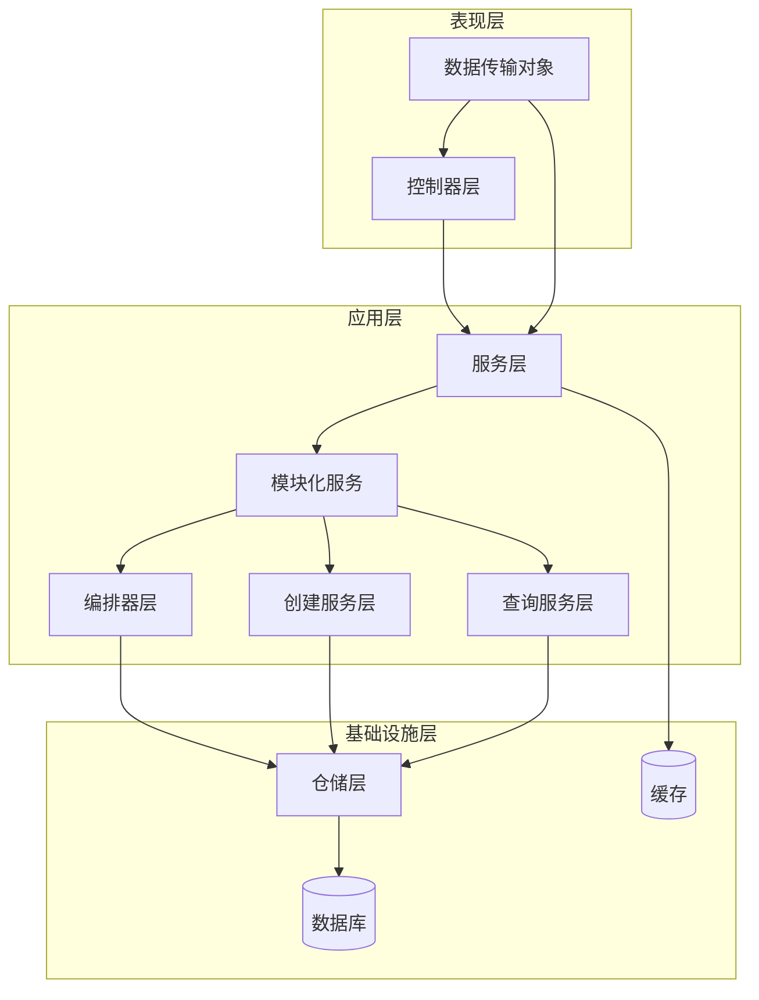
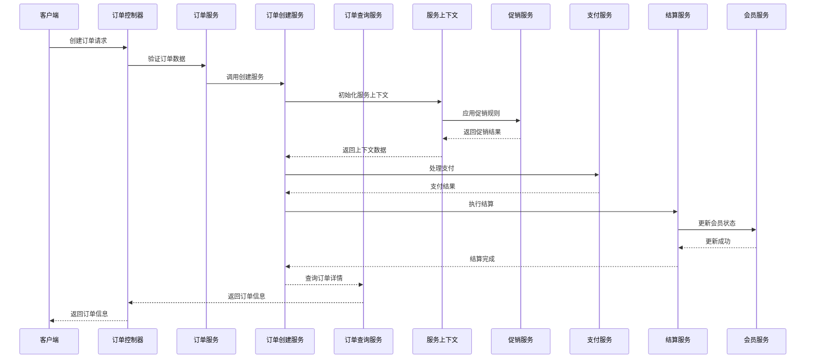
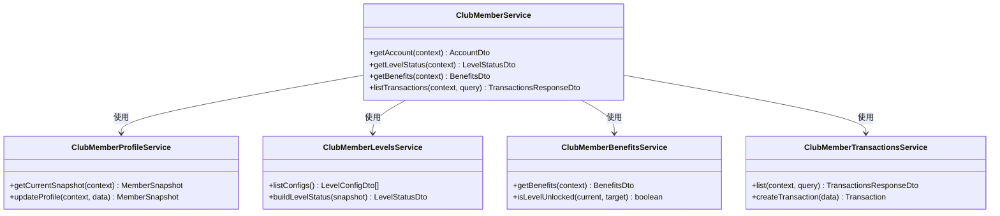
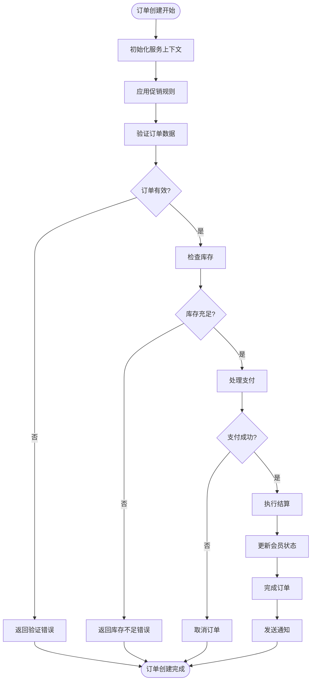
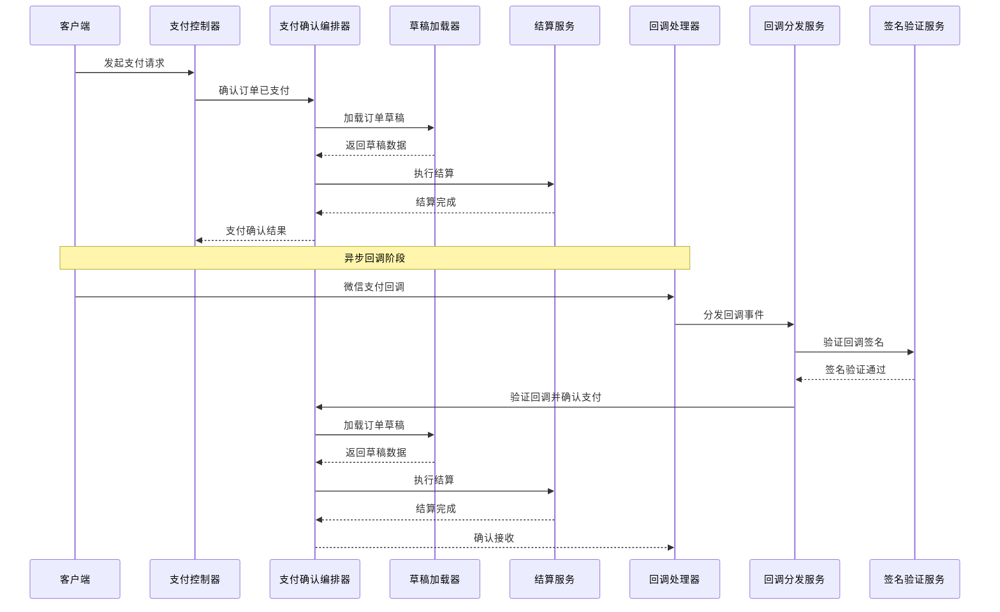
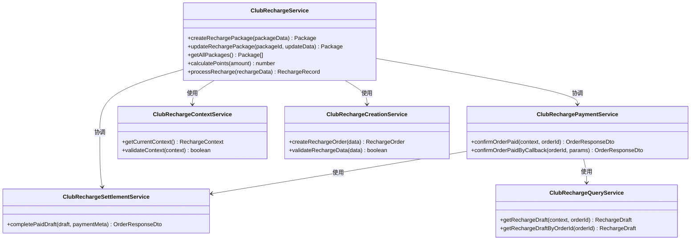
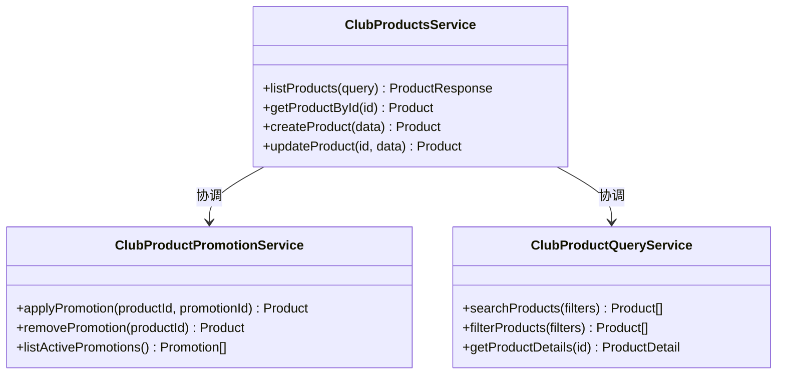

# 纯俱乐部模块

<cite>
**本文档引用的文件**
- [club-auth.controller.ts](file://src/purely-club/auth/club-auth.controller.ts)
- [club-auth.module.ts](file://src/purely-club/auth/club-auth.module.ts)
- [club-auth.service.ts](file://src/purely-club/auth/club-auth.service.ts)
- [club-member.controller.ts](file://src/purely-club/member/club-member.controller.ts)
- [club-member.module.ts](file://src/purely-club/member/club-member.module.ts)
- [club-member.service.ts](file://src/purely-club/member/club-member.service.ts)
- [club-member-account.dto.ts](file://src/purely-club/member/dto/club-member-account.dto.ts)
- [club-member-profile.service.ts](file://src/purely-club/member/member-profile/club-member-profile.service.ts)
- [club-member-levels.service.ts](file://src/purely-club/member/member-levels/club-member-levels.service.ts)
- [club-member-benefits.service.ts](file://src/purely-club/member/member-benefits/club-member-benefits.service.ts)
- [club-member-transactions.service.ts](file://src/purely-club/member/member-transactions/club-member-transactions.service.ts)
- [club-orders.controller.ts](file://src/purely-club/orders/club-orders.controller.ts)
- [club-orders.module.ts](file://src/purely-club/orders/club-orders.module.ts)
- [club-orders.service.ts](file://src/purely-club/orders/club-orders.service.ts)
- [club-order-drafts.service.ts](file://src/purely-club/orders/club-order-drafts.service.ts)
- [club-order-drafts.types.ts](file://src/purely-club/orders/club-order-drafts.types.ts)
- [club-order-drafts.utils.ts](file://src/purely-club/orders/club-order-drafts.utils.ts)
- [club-order.types.ts](file://src/purely-club/orders/club-order.types.ts)
- [club-order.dto.ts](file://src/purely-club/orders/dto/club-order.dto.ts)
- [club-order-service-context.service.ts](file://src/purely-club/orders/club-order-service-context.service.ts)
- [club-order-service-payment.service.ts](file://src/purely-club/orders/club-order-service-payment.service.ts)
- [club-order-promotions.service.ts](file://src/purely-club/orders/club-order-promotions.service.ts)
- [club-order-settlement.service.ts](file://src/purely-club/orders/club-order-settlement.service.ts)
- [club-payments.controller.ts](file://src/purely-club/payments/club-payments.controller.ts)
- [club-payments.module.ts](file://src/purely-club/payments/club-payments.module.ts)
- [club-payments.service.ts](file://src/purely-club/payments/club-payments.service.ts)
- [club-payment-confirmation.orchestrator.ts](file://src/purely-club/payments/club-payment-confirmation.orchestrator.ts)
- [club-wechat-callback.dto.ts](file://src/purely-club/payments/dto/club-wechat-callback.dto.ts)
- [club-products.controller.ts](file://src/purely-club/products/club-products.controller.ts)
- [club-products.module.ts](file://src/purely-club/products/club-products.module.ts)
- [club-products.service.ts](file://src/purely-club/products/club-products.service.ts)
- [club-product.dto.ts](file://src/purely-club/products/dto/club-product.dto.ts)
- [club-recharge.controller.ts](file://src/purely-club/recharge/club-recharge.controller.ts)
- [club-recharge.module.ts](file://src/purely-club/recharge/club-recharge.module.ts)
- [club-recharge.service.ts](file://src/purely-club/recharge/club-recharge.service.ts)
- [club-recharge-packages.service.ts](file://src/purely-club/recharge/club-recharge-packages.service.ts)
- [club-recharge.constants.ts](file://src/purely-club/recharge/club-recharge.constants.ts)
- [club-recharge.types.ts](file://src/purely-club/recharge/club-recharge.types.ts)
- [club-recharge.utils.ts](file://src/purely-club/recharge/club-recharge.utils.ts)
- [club-recharge.dto.ts](file://src/purely-club/recharge/dto/club-recharge.dto.ts)
- [club-recharge-payment.service.ts](file://src/purely-club/recharge/club-recharge-payment.service.ts)
- [club-recharge-settlement.service.ts](file://src/purely-club/recharge/club-recharge-settlement.service.ts)
- [club-records.controller.ts](file://src/purely-club/records/club-records.controller.ts)
- [club-records.module.ts](file://src/purely-club/records/club-records.module.ts)
- [club-records.service.ts](file://src/purely-club/records/club-records.service.ts)
- [club-record.dto.ts](file://src/purely-club/records/dto/club-record.dto.ts)
- [club-stores.controller.ts](file://src/purely-club/stores/club-stores.controller.ts)
- [club-stores.module.ts](file://src/purely-club/stores/club-stores.module.ts)
- [club-stores.service.ts](file://src/purely-club/stores/club-stores.service.ts)
- [club-store.dto.ts](file://src/purely-club/stores/dto/club-store.dto.ts)
</cite>

## 更新摘要
**所做更改**
- 重构会员管理模块为模块化架构，分离个人资料、等级、权益、交易子模块
- 重新设计订单处理系统，引入服务上下文、促销管理和结算服务
- 新增支付确认编排器，统一处理支付回调和手动确认流程
- 重构充值系统，分离支付服务和结算服务，增强可维护性
- 新增订单服务创建和查询服务，完善订单生命周期管理
- 新增产品促销和查询服务，增强商品管理能力
- 新增营销推广模块，支持促销活动管理

## 目录
1. [简介](#简介)
2. [项目结构](#项目结构)
3. [核心组件](#核心组件)
4. [架构概览](#架构概览)
5. [详细组件分析](#详细组件分析)
6. [依赖关系分析](#依赖关系分析)
7. [性能考虑](#性能考虑)
8. [故障排除指南](#故障排除指南)
9. [结论](#结论)

## 简介

纯俱乐部模块是纯收益服务器应用中的一个专门业务模块，专注于提供俱乐部相关的完整解决方案。该模块实现了会员管理、产品销售、订单处理、支付集成、充值服务、会籍记录等功能，为俱乐部运营提供了全面的数字化支持。

经过重大架构重构后，模块采用了更加模块化的设计理念，将原本耦合的功能拆分为独立的服务组件，提升了系统的可维护性和扩展性。新的架构遵循了单一职责原则，每个服务组件专注于特定的业务领域。重构后的模块不仅保持了原有的核心功能，还新增了多个重要的服务组件，包括订单服务创建、查询、促销管理等。

## 项目结构

纯俱乐部模块按照功能域进行组织，采用清晰的分层架构和模块化设计：

```mermaid
graph TB
subgraph "纯俱乐部模块结构"
Auth[认证模块<br/>auth/]
Member[会员模块<br/>member/]
Orders[订单模块<br/>orders/]
Payments[支付模块<br/>payments/]
Products[产品模块<br/>products/]
Recharge[充值模块<br/>recharge/]
Records[记录模块<br/>records/]
Stores[门店模块<br/>stores/]
Promotions[营销推广模块<br/>promotions/]
Home[首页模块<br/>home/]
end
subgraph "会员模块子模块"
MemberProfile[个人资料模块<br/>member-profile/]
MemberLevels[等级模块<br/>member-levels/]
MemberBenefits[权益模块<br/>member-benefits/]
MemberTransactions[交易模块<br/>member-transactions/]
Member --> MemberProfile
Member --> MemberLevels
Member --> MemberBenefits
Member --> MemberTransactions
end
subgraph "订单模块新架构"
OrderContext[服务上下文<br/>club-order-service-context.service.ts]
OrderPromotions[促销管理<br/>club-order-promotions.service.ts]
OrderSettlement[结算服务<br/>club-order-settlement.service.ts]
OrderPayment[支付服务<br/>club-order-service-payment.service.ts]
OrderCreation[服务创建<br/>club-order-service-creation.service.ts]
OrderQuery[服务查询<br/>club-order-service-query.service.ts]
Orders --> OrderContext
Orders --> OrderPromotions
Orders --> OrderSettlement
Orders --> OrderPayment
Orders --> OrderCreation
Orders --> OrderQuery
end
subgraph "支付模块新架构"
PaymentOrchestrator[支付确认编排器<br/>club-payment-confirmation.orchestrator.ts]
PaymentDispatch[回调分发<br/>club-payment-callback-dispatch.service.ts]
PaymentSignature[签名验证<br/>club-payment-callback-signature.service.ts]
Payments --> PaymentOrchestrator
Payments --> PaymentDispatch
Payments --> PaymentSignature
end
subgraph "充值模块重构"
RechargePayment[充值支付服务<br/>club-recharge-payment.service.ts]
RechargeSettlement[充值结算服务<br/>club-recharge-settlement.service.ts]
RechargeContext[充值上下文<br/>club-recharge-context.service.ts]
RechargeCreation[充值创建<br/>club-recharge-creation.service.ts]
RechargeQuery[充值查询<br/>club-recharge-query.service.ts]
Recharge --> RechargePayment
Recharge --> RechargeSettlement
Recharge --> RechargeContext
Recharge --> RechargeCreation
Recharge --> RechargeQuery
end
subgraph "产品模块增强"
ProductPromotion[产品促销<br/>club-product-promotion.service.ts]
ProductQuery[产品查询<br/>club-product-query.service.ts]
Products --> ProductPromotion
Products --> ProductQuery
Auth --> Member
Member --> Orders
Orders --> Payments
Products --> Orders
Recharge --> Member
Records --> Member
Stores --> Member
Promotions --> Products
Home --> Member
```

**图表来源**
- [club-member.service.ts:1-75](file://src/purely-club/member/club-member.service.ts#L1-L75)
- [club-orders.service.ts:1-500](file://src/purely-club/orders/club-orders.service.ts#L1-L500)
- [club-recharge.service.ts:1-300](file://src/purely-club/recharge/club-recharge.service.ts#L1-L300)

**章节来源**
- [club-auth.module.ts:1-100](file://src/purely-club/auth/club-auth.module.ts#L1-L100)
- [club-member.module.ts:1-100](file://src/purely-club/member/club-member.module.ts#L1-L100)
- [club-orders.module.ts:1-100](file://src/purely-club/orders/club-orders.module.ts#L1-L100)

## 核心组件

纯俱乐部模块包含以下核心功能组件，现已实现模块化重构：

### 认证系统
- **用户认证**：提供基于JWT的认证机制
- **权限控制**：实现基于角色的访问控制
- **会话管理**：处理用户登录状态和会话生命周期

### 会员管理系统（模块化）
- **个人资料管理**：独立的会员个人资料服务
- **会员等级管理**：支持多级会员体系的等级服务
- **会员权益管理**：配置和管理会员特权的权益服务
- **会员交易管理**：处理会员消费和充值交易的交易服务

### 订单处理系统（重构）
- **服务上下文管理**：统一管理订单创建和状态转换的上下文服务
- **服务创建服务**：专门负责订单创建逻辑的服务
- **服务查询服务**：专门负责订单查询逻辑的服务
- **促销管理**：独立的促销规则应用和优惠计算服务
- **结算服务**：处理订单最终结算和库存更新的结算服务
- **支付服务**：集成支付处理的订单支付服务

### 支付集成系统（新增编排器）
- **支付确认编排器**：统一处理支付回调和手动确认流程的编排器
- **回调分发服务**：处理各种支付回调事件的分发服务
- **签名验证服务**：验证支付回调签名的真实性的服务
- **微信支付回调**：处理微信支付异步通知
- **支付状态同步**：确保支付状态与业务状态一致
- **退款处理**：支持订单退款和部分退款

### 产品库存系统（增强）
- **产品目录管理**：维护可销售产品的信息
- **库存跟踪**：实时监控产品库存变化
- **价格管理**：支持动态定价和促销活动
- **产品促销服务**：专门处理产品促销活动的服务
- **产品查询服务**：专门处理产品查询逻辑的服务

### 充值管理系统（重构）
- **充值套餐配置**：定义不同的充值方案
- **积分计算**：根据充值金额计算相应积分
- **充值记录**：完整记录每次充值的历史
- **充值支付服务**：独立的充值支付处理服务
- **充值结算服务**：独立的充值结算处理服务
- **充值上下文服务**：管理充值过程中的上下文信息
- **充值创建服务**：专门处理充值创建逻辑的服务
- **充值查询服务**：专门处理充值查询逻辑的服务

### 营销推广系统（新增）
- **促销活动管理**：创建和管理各种促销活动
- **推广内容管理**：维护营销推广内容
- **客户获取追踪**：追踪推广效果和客户来源
- **优惠券系统**：支持多种类型的优惠券

### 会籍记录系统（新增）
- **会员记录管理**：维护会员的完整记录
- **消费历史追踪**：记录会员的所有消费行为
- **成长轨迹分析**：分析会员的成长和发展轨迹

### 门店管理系统（增强）
- **门店信息管理**：维护门店的基本信息
- **门店访问控制**：管理用户对门店的访问权限
- **门店视图服务**：提供门店相关信息的查询服务
- **当前门店上下文**：管理当前用户的门店上下文

**章节来源**
- [club-member.service.ts:1-75](file://src/purely-club/member/club-member.service.ts#L1-L75)
- [club-orders.service.ts:1-500](file://src/purely-club/orders/club-orders.service.ts#L1-L500)
- [club-recharge.service.ts:1-300](file://src/purely-club/recharge/club-recharge.service.ts#L1-L300)

## 架构概览

纯俱乐部模块采用典型的三层架构模式，结合领域驱动设计(DDD)原则和模块化设计：



**图表来源**
- [club-orders.service.ts:1-300](file://src/purely-club/orders/club-orders.service.ts#L1-L300)
- [club-payment-confirmation.orchestrator.ts:1-200](file://src/purely-club/payments/club-payment-confirmation.orchestrator.ts#L1-L200)
- [club-recharge-payment.service.ts:1-64](file://src/purely-club/recharge/club-recharge-payment.service.ts#L1-L64)

### 数据流处理

重构后的订单处理流程展示了模块间的协作关系：



**图表来源**
- [club-orders.service.ts:1-400](file://src/purely-club/orders/club-orders.service.ts#L1-L400)
- [club-order-service-context.service.ts:1-200](file://src/purely-club/orders/club-order-service-context.service.ts#L1-L200)
- [club-order-promotions.service.ts:1-200](file://src/purely-club/orders/club-order-promotions.service.ts#L1-L200)

## 详细组件分析

### 会员管理模块（模块化重构）

会员管理模块现已重构为四个独立的子模块，每个模块负责特定的业务功能：



**图表来源**
- [club-member.service.ts:1-75](file://src/purely-club/member/club-member.service.ts#L1-L75)
- [club-member-profile.service.ts:1-36](file://src/purely-club/member/member-profile/club-member-profile.service.ts#L1-L36)
- [club-member-levels.service.ts:1-200](file://src/purely-club/member/member-levels/club-member-levels.service.ts#L1-L200)
- [club-member-benefits.service.ts:1-36](file://src/purely-club/member/member-benefits/club-member-benefits.service.ts#L1-L36)

**章节来源**
- [club-member.service.ts:1-75](file://src/purely-club/member/club-member.service.ts#L1-L75)
- [club-member-profile.service.ts:1-36](file://src/purely-club/member/member-profile/club-member-profile.service.ts#L1-L36)
- [club-member-levels.service.ts:1-200](file://src/purely-club/member/member-levels/club-member-levels.service.ts#L1-L200)
- [club-member-benefits.service.ts:1-36](file://src/purely-club/member/member-benefits/club-member-benefits.service.ts#L1-L36)

### 订单处理系统（重构）

订单处理系统现已重构为多个专门的服务，每个服务负责特定的业务流程：



**图表来源**
- [club-orders.service.ts:1-400](file://src/purely-club/orders/club-orders.service.ts#L1-L400)
- [club-order-service-context.service.ts:1-200](file://src/purely-club/orders/club-order-service-context.service.ts#L1-L200)
- [club-order-settlement.service.ts:42-120](file://src/purely-club/orders/club-order-settlement.service.ts#L42-L120)

**章节来源**
- [club-orders.service.ts:1-400](file://src/purely-club/orders/club-orders.service.ts#L1-L400)
- [club-order-service-context.service.ts:1-200](file://src/purely-club/orders/club-order-service-context.service.ts#L1-L200)
- [club-order-promotions.service.ts:1-200](file://src/purely-club/orders/club-order-promotions.service.ts#L1-L200)

### 支付确认编排器（新增）

支付确认编排器是本次重构的重要创新，统一处理支付回调和手动确认流程：



**图表来源**
- [club-payment-confirmation.orchestrator.ts:1-200](file://src/purely-club/payments/club-payment-confirmation.orchestrator.ts#L1-L200)
- [club-recharge-payment.service.ts:15-64](file://src/purely-club/recharge/club-recharge-payment.service.ts#L15-L64)
- [club-order-service-payment.service.ts:14-20](file://src/purely-club/orders/club-order-service-payment.service.ts#L14-L20)

**章节来源**
- [club-payment-confirmation.orchestrator.ts:1-200](file://src/purely-club/payments/club-payment-confirmation.orchestrator.ts#L1-L200)
- [club-recharge-payment.service.ts:15-64](file://src/purely-club/recharge/club-recharge-payment.service.ts#L15-L64)

### 充值系统（重构）

充值系统现已分离为支付服务和结算服务两个独立组件：



**图表来源**
- [club-recharge.service.ts:1-300](file://src/purely-club/recharge/club-recharge.service.ts#L1-L300)
- [club-recharge-payment.service.ts:15-64](file://src/purely-club/recharge/club-recharge-payment.service.ts#L15-L64)
- [club-recharge-settlement.service.ts:1-200](file://src/purely-club/recharge/club-recharge-settlement.service.ts#L1-L200)

**章节来源**
- [club-recharge.service.ts:1-300](file://src/purely-club/recharge/club-recharge.service.ts#L1-L300)
- [club-recharge-payment.service.ts:15-64](file://src/purely-club/recharge/club-recharge-payment.service.ts#L15-L64)
- [club-recharge-settlement.service.ts:1-200](file://src/purely-club/recharge/club-recharge-settlement.service.ts#L1-L200)

### 产品模块增强

产品模块现已增强为包含促销和查询两个专门服务：



**图表来源**
- [club-products.service.ts:1-200](file://src/purely-club/products/club-products.service.ts#L1-L200)
- [club-product-promotion.service.ts:1-150](file://src/purely-club/products/club-product-promotion.service.ts#L1-L150)
- [club-product-query.service.ts:1-150](file://src/purely-club/products/club-product-query.service.ts#L1-L150)

**章节来源**
- [club-products.service.ts:1-200](file://src/purely-club/products/club-products.service.ts#L1-L200)
- [club-product-promotion.service.ts:1-150](file://src/purely-club/products/club-product-promotion.service.ts#L1-L150)
- [club-product-query.service.ts:1-150](file://src/purely-club/products/club-product-query.service.ts#L1-L150)

## 依赖关系分析

重构后的纯俱乐部模块组件间依赖关系展现了更加清晰的分层架构：

```mermaid
graph TB
subgraph "外部依赖"
NestJS[NestJS框架]
JWT[JWT认证]
Prisma[Prisma ORM]
Redis[Redis缓存]
WeChat[微信支付API]
end
subgraph "内部模块依赖"
AuthDep[认证依赖]
MemberDep[会员依赖]
OrdersDep[订单依赖]
PaymentsDep[支付依赖]
RechargeDep[充值依赖]
ProductsDep[产品依赖]
PromotionsDep[营销依赖]
RecordsDep[记录依赖]
StoresDep[门店依赖]
HomeDep[首页依赖]
end
subgraph "模块内依赖"
MemberProfileDep[个人资料依赖]
MemberLevelsDep[等级依赖]
MemberBenefitsDep[权益依赖]
MemberTransactionsDep[交易依赖]
OrderContextDep[服务上下文依赖]
OrderPromotionsDep[促销依赖]
OrderSettlementDep[结算依赖]
OrderPaymentDep[支付依赖]
OrderCreationDep[创建依赖]
OrderQueryDep[查询依赖]
PaymentOrchestratorDep[编排器依赖]
PaymentDispatchDep[分发依赖]
PaymentSignatureDep[签名依赖]
RechargePaymentDep[充值支付依赖]
RechargeSettlementDep[充值结算依赖]
RechargeContextDep[充值上下文依赖]
RechargeCreationDep[充值创建依赖]
RechargeQueryDep[充值查询依赖]
ProductPromotionDep[产品促销依赖]
ProductQueryDep[产品查询依赖]
PromotionsDep[促销活动依赖]
RecordsQueryDep[记录查询依赖]
StoresAccessDep[门店访问依赖]
StoresViewDep[门店视图依赖]
HomeDep[首页依赖]
end
AuthDep --> NestJS
MemberDep --> Prisma
OrdersDep --> Redis
PaymentsDep --> JWT
PaymentsDep --> WeChat
RechargeDep --> Prisma
ProductsDep --> Prisma
PromotionsDep --> Prisma
RecordsDep --> Prisma
StoresDep --> Prisma
HomeDep --> Prisma
MemberDep --> MemberProfileDep
MemberDep --> MemberLevelsDep
MemberDep --> MemberBenefitsDep
MemberDep --> MemberTransactionsDep
OrdersDep --> OrderContextDep
OrdersDep --> OrderPromotionsDep
OrdersDep --> OrderSettlementDep
OrdersDep --> OrderPaymentDep
OrdersDep --> OrderCreationDep
OrdersDep --> OrderQueryDep
PaymentsDep --> PaymentOrchestratorDep
PaymentsDep --> PaymentDispatchDep
PaymentsDep --> PaymentSignatureDep
RechargeDep --> RechargePaymentDep
RechargeDep --> RechargeSettlementDep
RechargeDep --> RechargeContextDep
RechargeDep --> RechargeCreationDep
RechargeDep --> RechargeQueryDep
ProductsDep --> ProductPromotionDep
ProductsDep --> ProductQueryDep
PromotionsDep --> PromotionsDep
RecordsDep --> RecordsQueryDep
StoresDep --> StoresAccessDep
StoresDep --> StoresViewDep
HomeDep --> HomeDep
```



**图表来源**
- [club-member.service.ts:21-28](file://src/purely-club/member/club-member.service.ts#L21-L28)
- [club-orders.service.ts:1-200](file://src/purely-club/orders/club-orders.service.ts#L1-L200)
- [club-recharge.service.ts:1-150](file://src/purely-club/recharge/club-recharge.service.ts#L1-L150)

### 数据一致性保证

重构后的模块通过以下机制确保数据一致性：

1. **事务管理**：关键业务操作使用数据库事务
2. **编排器模式**：支付确认编排器确保支付流程的原子性
3. **模块化服务**：每个服务组件负责特定的业务规则
4. **幂等性设计**：支付回调等外部接口具备幂等性
5. **状态机管理**：订单状态转换严格遵循预定义规则
6. **并发控制**：使用乐观锁防止并发更新冲突
7. **服务隔离**：订单创建、查询、支付、结算等服务相互独立
8. **上下文管理**：充值和订单过程中的上下文信息得到妥善管理

**章节来源**
- [club-orders.service.ts:1-300](file://src/purely-club/orders/club-orders.service.ts#L1-L300)
- [club-payment-confirmation.orchestrator.ts:1-200](file://src/purely-club/payments/club-payment-confirmation.orchestrator.ts#L1-L200)

## 性能考虑

重构后的纯俱乐部模块在设计时充分考虑了性能优化：

### 缓存策略
- **热点数据缓存**：常用查询结果缓存30分钟
- **会话缓存**：用户会话信息缓存1小时
- **配置缓存**：业务配置信息缓存15分钟
- **会员快照缓存**：个人资料快照缓存5分钟
- **产品促销缓存**：活跃促销活动缓存10分钟

### 数据库优化
- **索引优化**：为高频查询字段建立复合索引
- **查询优化**：使用连接查询减少数据库往返
- **批量操作**：支持批量数据处理提升效率
- **读写分离**：查询和写入操作分离优化
- **分页查询**：大量数据采用分页查询避免内存溢出

### 异步处理
- **支付回调异步**：微信支付回调采用异步处理
- **邮件通知队列**：邮件发送使用消息队列
- **日志异步写入**：审计日志异步记录
- **编排器异步**：支付确认流程异步执行
- **回调事件异步**：支付回调事件异步分发处理

### 模块化优势
- **服务隔离**：每个服务组件独立部署和扩展
- **依赖解耦**：模块间依赖关系清晰，降低耦合度
- **并行处理**：不同模块可以并行处理提高整体性能
- **负载均衡**：订单创建、查询、支付等服务可独立扩展
- **容错设计**：单个服务故障不影响其他服务正常运行

## 故障排除指南

### 常见问题及解决方案

**认证失败**
- 检查JWT密钥配置
- 验证用户密码加密算法
- 确认用户账户状态正常

**会员模块错误**
- 检查个人资料服务是否正常运行
- 验证等级配置是否正确
- 确认权益计算逻辑
- 检查交易记录查询服务

**订单处理失败**
- 检查服务上下文初始化
- 验证促销规则应用
- 确认支付服务状态
- 检查结算服务执行
- 验证订单创建服务
- 检查订单查询服务

**支付确认异常**
- 验证编排器配置
- 检查回调签名验证
- 确认支付状态同步
- 验证异步处理流程
- 检查回调分发服务

**充值系统问题**
- 检查充值支付服务
- 验证充值结算服务
- 确认订单草稿状态
- 检查积分计算逻辑
- 验证充值上下文服务
- 检查充值创建服务
- 检查充值查询服务

**产品模块问题**
- 检查产品促销服务
- 验证产品查询服务
- 确认产品库存同步
- 检查促销活动配置

**营销推广问题**
- 检查促销活动状态
- 验证推广内容有效性
- 确认客户追踪准确性
- 检查优惠券发放逻辑

**章节来源**
- [club-auth.service.ts:1-200](file://src/purely-club/auth/club-auth.service.ts#L1-L200)
- [club-member.service.ts:1-75](file://src/purely-club/member/club-member.service.ts#L1-L75)
- [club-orders.service.ts:1-300](file://src/purely-club/orders/club-orders.service.ts#L1-L300)
- [club-payment-confirmation.orchestrator.ts:1-200](file://src/purely-club/payments/club-payment-confirmation.orchestrator.ts#L1-L200)

## 结论

纯俱乐部模块经过重大架构重构后，展现出了更加现代化和企业级的设计特点：

1. **模块化设计**：采用清晰的功能域划分，会员管理、订单处理、支付集成、产品管理等模块完全解耦
2. **服务化架构**：每个业务功能都封装为独立的服务组件，便于维护和扩展
3. **编排器模式**：引入支付确认编排器，统一处理复杂的业务流程
4. **单一职责**：每个服务组件专注于特定的业务领域，提高了代码质量
5. **可扩展性**：模块化架构支持按需扩展和替换特定组件
6. **可维护性**：清晰的依赖关系和接口设计降低了维护成本
7. **性能优化**：重构后的架构在性能和可扩展性方面都有显著提升
8. **功能完整性**：新增订单服务创建、查询、产品促销、营销推广等多个重要功能模块
9. **服务分离**：充值系统、订单系统等关键业务流程实现了服务级别的分离
10. **异步处理**：支付回调、邮件通知等异步处理提升了系统响应性能

该模块为俱乐部业务提供了坚实而灵活的数字化基础，支持未来的业务扩展和技术演进，同时为其他类似业务模块的开发提供了优秀的参考模板。重构后的架构不仅保持了原有功能的稳定性，还大幅提升了系统的可维护性、可扩展性和性能表现。