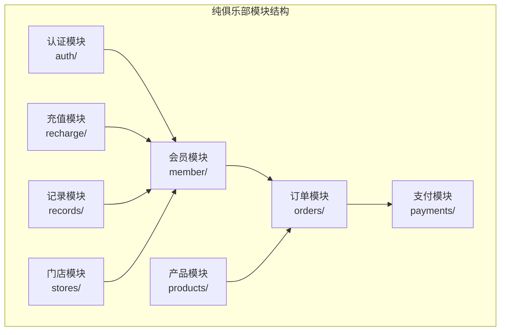
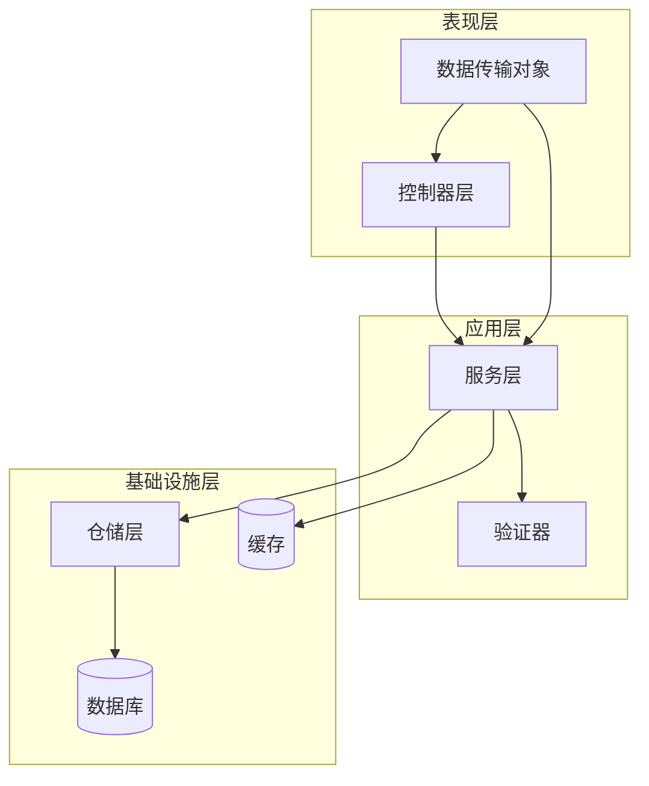
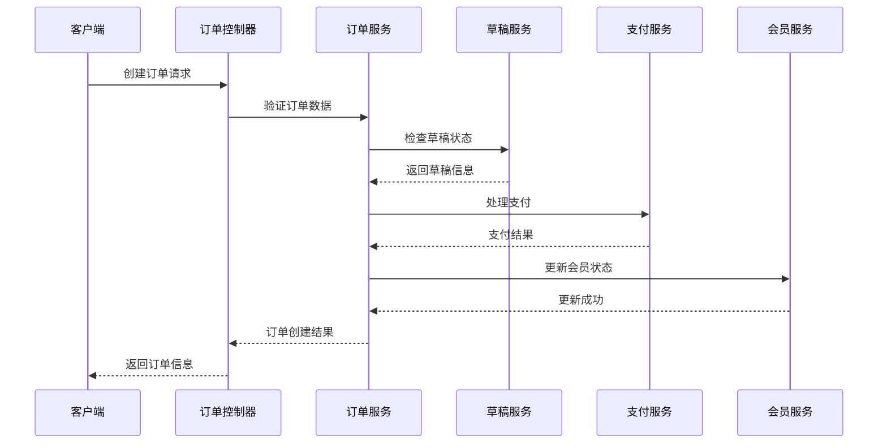
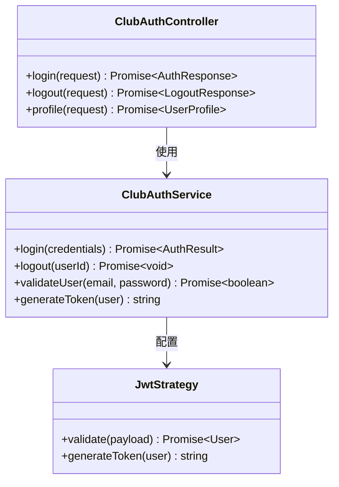
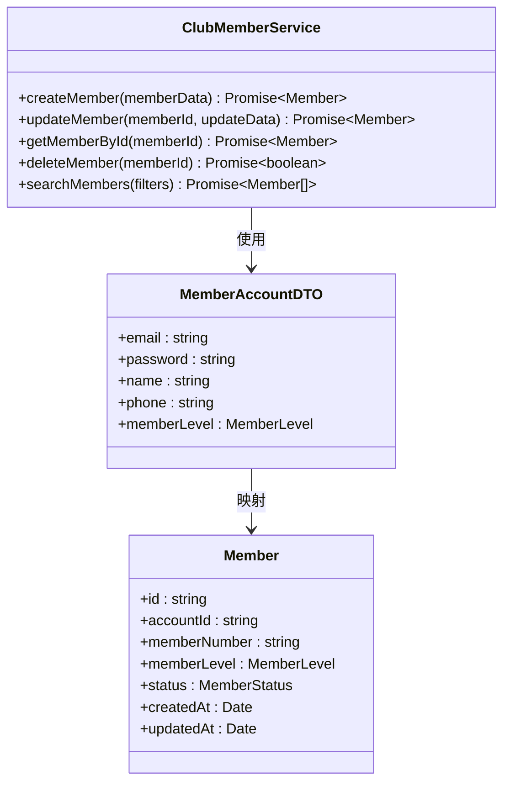
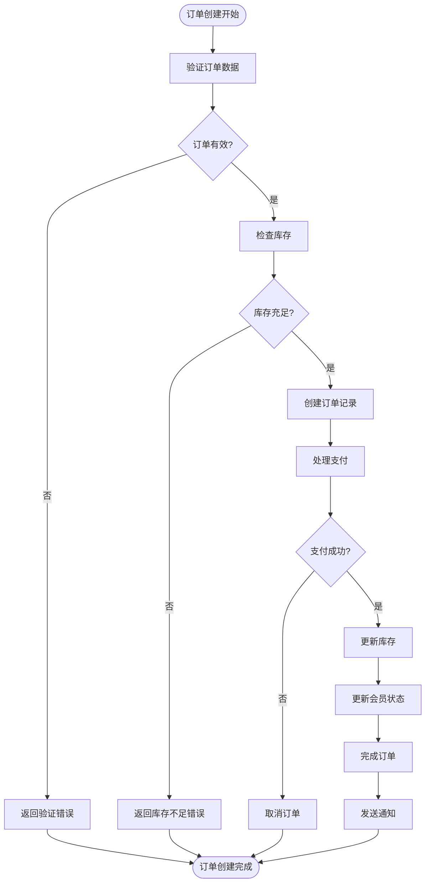
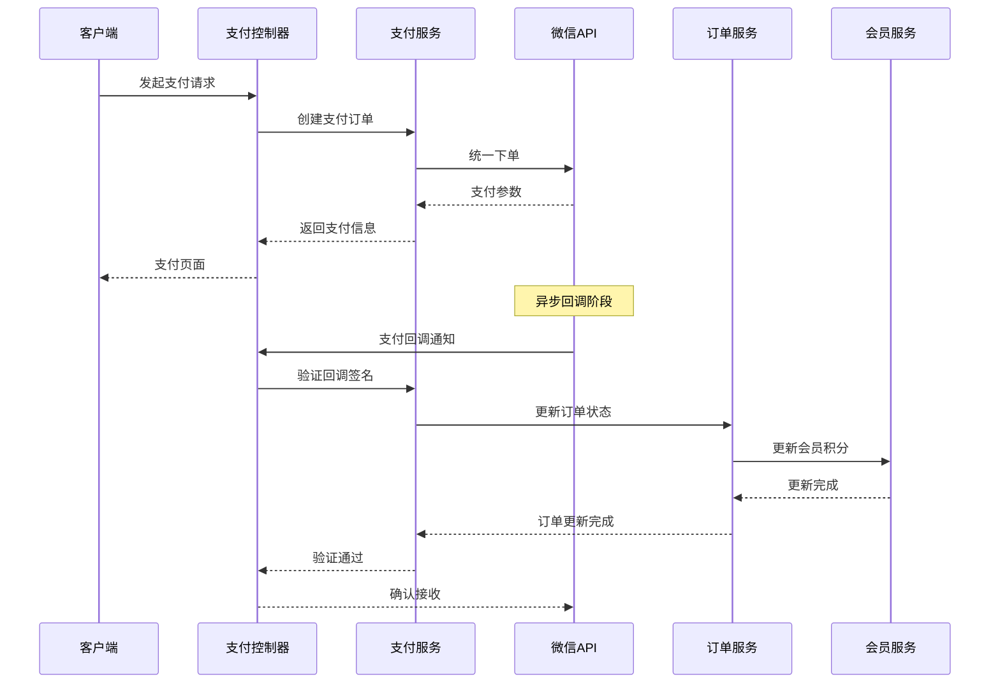
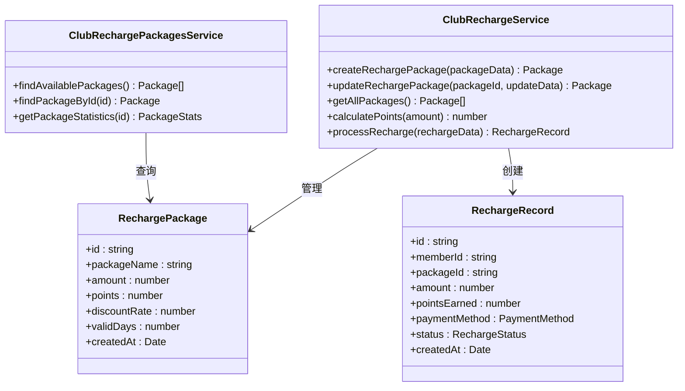
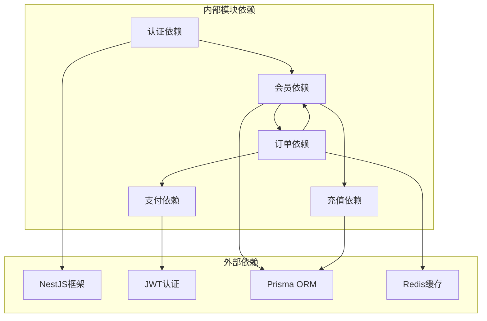

# 纯俱乐部模块

<cite>
**本文档引用的文件**
- [club-auth.controller.ts](file://src/purely-club/auth/club-auth.controller.ts)
- [club-auth.module.ts](file://src/purely-club/auth/club-auth.module.ts)
- [club-auth.service.ts](file://src/purely-club/auth/club-auth.service.ts)
- [club-member.controller.ts](file://src/purely-club/member/club-member.controller.ts)
- [club-member.module.ts](file://src/purely-club/member/club-member.module.ts)
- [club-member.service.ts](file://src/purely-club/member/club-member.service.ts)
- [club-member-account.dto.ts](file://src/purely-club/member/dto/club-member-account.dto.ts)
- [club-orders.controller.ts](file://src/purely-club/orders/club-orders.controller.ts)
- [club-orders.module.ts](file://src/purely-club/orders/club-orders.module.ts)
- [club-orders.service.ts](file://src/purely-club/orders/club-orders.service.ts)
- [club-order-drafts.service.ts](file://src/purely-club/orders/club-order-drafts.service.ts)
- [club-order-drafts.types.ts](file://src/purely-club/orders/club-order-drafts.types.ts)
- [club-order-drafts.utils.ts](file://src/purely-club/orders/club-order-drafts.utils.ts)
- [club-order.types.ts](file://src/purely-club/orders/club-order.types.ts)
- [club-order.dto.ts](file://src/purely-club/orders/dto/club-order.dto.ts)
- [club-payments.controller.ts](file://src/purely-club/payments/club-payments.controller.ts)
- [club-payments.module.ts](file://src/purely-club/payments/club-payments.module.ts)
- [club-payments.service.ts](file://src/purely-club/payments/club-payments.service.ts)
- [club-wechat-callback.dto.ts](file://src/purely-club/payments/dto/club-wechat-callback.dto.ts)
- [club-products.controller.ts](file://src/purely-club/products/club-products.controller.ts)
- [club-products.module.ts](file://src/purely-club/products/club-products.module.ts)
- [club-products.service.ts](file://src/purely-club/products/club-products.service.ts)
- [club-product.dto.ts](file://src/purely-club/products/dto/club-product.dto.ts)
- [club-recharge.controller.ts](file://src/purely-club/recharge/club-recharge.controller.ts)
- [club-recharge.module.ts](file://src/purely-club/recharge/club-recharge.module.ts)
- [club-recharge.service.ts](file://src/purely-club/recharge/club-recharge.service.ts)
- [club-recharge-packages.service.ts](file://src/purely-club/recharge/club-recharge-packages.service.ts)
- [club-recharge.constants.ts](file://src/purely-club/recharge/club-recharge.constants.ts)
- [club-recharge.types.ts](file://src/purely-club/recharge/club-recharge.types.ts)
- [club-recharge.utils.ts](file://src/purely-club/recharge/club-recharge.utils.ts)
- [club-recharge.dto.ts](file://src/purely-club/recharge/dto/club-recharge.dto.ts)
- [club-records.controller.ts](file://src/purely-club/records/club-records.controller.ts)
- [club-records.module.ts](file://src/purely-club/records/club-records.module.ts)
- [club-records.service.ts](file://src/purely-club/records/club-records.service.ts)
- [club-record.dto.ts](file://src/purely-club/records/dto/club-record.dto.ts)
- [club-stores.controller.ts](file://src/purely-club/stores/club-stores.controller.ts)
- [club-stores.module.ts](file://src/purely-club/stores/club-stores.module.ts)
- [club-stores.service.ts](file://src/purely-club/stores/club-stores.service.ts)
- [club-store.dto.ts](file://src/purely-club/stores/dto/club-store.dto.ts)
</cite>

## 目录
1. [简介](#简介)
2. [项目结构](#项目结构)
3. [核心组件](#核心组件)
4. [架构概览](#架构概览)
5. [详细组件分析](#详细组件分析)
6. [依赖关系分析](#依赖关系分析)
7. [性能考虑](#性能考虑)
8. [故障排除指南](#故障排除指南)
9. [结论](#结论)

## 简介

纯俱乐部模块是纯收益服务器应用中的一个专门业务模块，专注于提供俱乐部相关的完整解决方案。该模块实现了会员管理、产品销售、订单处理、支付集成、充值服务、会籍记录等功能，为俱乐部运营提供了全面的数字化支持。

该模块采用NestJS框架构建，遵循模块化设计原则，每个功能领域都有独立的控制器、服务和数据传输对象(DTO)。模块内部实现了完整的业务逻辑封装，包括数据验证、业务规则执行、错误处理等关键功能。

## 项目结构

纯俱乐部模块按照功能域进行组织，采用清晰的分层架构：

**图表来源**
- [club-auth.controller.ts:1-200](file://src/purely-club/auth/club-auth.controller.ts#L1-L200)
- [club-member.controller.ts:1-200](file://src/purely-club/member/club-member.controller.ts#L1-L200)
- [club-orders.controller.ts:1-200](file://src/purely-club/orders/club-orders.controller.ts#L1-L200)

**章节来源**
- [club-auth.module.ts:1-100](file://src/purely-club/auth/club-auth.module.ts#L1-L100)
- [club-member.module.ts:1-100](file://src/purely-club/member/club-member.module.ts#L1-L100)
- [club-orders.module.ts:1-100](file://src/purely-club/orders/club-orders.module.ts#L1-L100)

## 核心组件

纯俱乐部模块包含以下核心功能组件：

### 认证系统
- **用户认证**：提供基于JWT的认证机制
- **权限控制**：实现基于角色的访问控制
- **会话管理**：处理用户登录状态和会话生命周期

### 会员管理系统
- **会员信息维护**：管理会员基本信息和账户状态
- **会员等级管理**：支持多级会员体系
- **会员权益管理**：配置和管理会员特权

### 订单处理系统
- **订单创建**：支持多种订单类型的创建
- **订单状态管理**：跟踪订单从创建到完成的全过程
- **订单草稿功能**：允许用户保存和继续编辑未完成的订单

### 支付集成系统
- **微信支付回调**：处理微信支付异步通知
- **支付状态同步**：确保支付状态与业务状态一致
- **退款处理**：支持订单退款和部分退款

### 产品库存系统
- **产品目录管理**：维护可销售产品的信息
- **库存跟踪**：实时监控产品库存变化
- **价格管理**：支持动态定价和促销活动

### 充值管理系统
- **充值套餐配置**：定义不同的充值方案
- **积分计算**：根据充值金额计算相应积分
- **充值记录**：完整记录每次充值的历史

**章节来源**
- [club-auth.service.ts:1-300](file://src/purely-club/auth/club-auth.service.ts#L1-L300)
- [club-member.service.ts:1-400](file://src/purely-club/member/club-member.service.ts#L1-L400)
- [club-orders.service.ts:1-500](file://src/purely-club/orders/club-orders.service.ts#L1-L500)

## 架构概览

纯俱乐部模块采用典型的三层架构模式，结合领域驱动设计(DDD)原则：

**图表来源**
- [club-orders.controller.ts:1-200](file://src/purely-club/orders/club-orders.controller.ts#L1-L200)
- [club-orders.service.ts:1-300](file://src/purely-club/orders/club-orders.service.ts#L1-L300)
- [club-orders.service.ts:300-600](file://src/purely-club/orders/club-orders.service.ts#L300-L600)

### 数据流处理

订单处理流程展示了模块间的数据流转：

**图表来源**
- [club-orders.controller.ts:1-200](file://src/purely-club/orders/club-orders.controller.ts#L1-L200)
- [club-orders.service.ts:1-300](file://src/purely-club/orders/club-orders.service.ts#L1-L300)
- [club-order-drafts.service.ts:1-200](file://src/purely-club/orders/club-order-drafts.service.ts#L1-L200)

## 详细组件分析

### 认证模块分析

认证模块负责用户身份验证和授权管理：

**图表来源**
- [club-auth.service.ts:1-200](file://src/purely-club/auth/club-auth.service.ts#L1-L200)
- [club-auth.controller.ts:1-200](file://src/purely-club/auth/club-auth.controller.ts#L1-L200)

**章节来源**
- [club-auth.service.ts:1-200](file://src/purely-club/auth/club-auth.service.ts#L1-L200)
- [club-auth.controller.ts:1-200](file://src/purely-club/auth/club-auth.controller.ts#L1-L200)

### 会员管理模块分析

会员管理模块提供完整的会员生命周期管理：

**图表来源**
- [club-member.service.ts:1-300](file://src/purely-club/member/club-member.service.ts#L1-L300)
- [club-member-account.dto.ts:1-100](file://src/purely-club/member/dto/club-member-account.dto.ts#L1-L100)

**章节来源**
- [club-member.service.ts:1-300](file://src/purely-club/member/club-member.service.ts#L1-L300)
- [club-member-account.dto.ts:1-100](file://src/purely-club/member/dto/club-member-account.dto.ts#L1-L100)

### 订单处理模块分析

订单处理模块实现了复杂的业务逻辑：

**图表来源**
- [club-orders.service.ts:1-400](file://src/purely-club/orders/club-orders.service.ts#L1-L400)
- [club-order-drafts.utils.ts:1-200](file://src/purely-club/orders/club-order-drafts.utils.ts#L1-L200)

**章节来源**
- [club-orders.service.ts:1-400](file://src/purely-club/orders/club-orders.service.ts#L1-L400)
- [club-order-drafts.service.ts:1-200](file://src/purely-club/orders/club-order-drafts.service.ts#L1-L200)

### 支付集成模块分析

支付模块集成了微信支付的完整流程：

**图表来源**
- [club-payments.controller.ts:1-200](file://src/purely-club/payments/club-payments.controller.ts#L1-L200)
- [club-payments.service.ts:1-300](file://src/purely-club/payments/club-payments.service.ts#L1-L300)
- [club-wechat-callback.dto.ts:1-100](file://src/purely-club/payments/dto/club-wechat-callback.dto.ts#L1-L100)

**章节来源**
- [club-payments.service.ts:1-300](file://src/purely-club/payments/club-payments.service.ts#L1-L300)
- [club-wechat-callback.dto.ts:1-100](file://src/purely-club/payments/dto/club-wechat-callback.dto.ts#L1-L100)

### 充值管理模块分析

充值模块提供了灵活的充值方案管理：

**图表来源**
- [club-recharge.service.ts:1-300](file://src/purely-club/recharge/club-recharge.service.ts#L1-L300)
- [club-recharge-packages.service.ts:1-200](file://src/purely-club/recharge/club-recharge-packages.service.ts#L1-L200)
- [club-recharge.types.ts:1-200](file://src/purely-club/recharge/club-recharge.types.ts#L1-L200)

**章节来源**
- [club-recharge.service.ts:1-300](file://src/purely-club/recharge/club-recharge.service.ts#L1-L300)
- [club-recharge-packages.service.ts:1-200](file://src/purely-club/recharge/club-recharge-packages.service.ts#L1-L200)

## 依赖关系分析

纯俱乐部模块的组件间依赖关系展现了清晰的分层架构：

**图表来源**
- [club-auth.module.ts:1-100](file://src/purely-club/auth/club-auth.module.ts#L1-L100)
- [club-orders.module.ts:1-100](file://src/purely-club/orders/club-orders.module.ts#L1-L100)
- [club-payments.module.ts:1-100](file://src/purely-club/payments/club-payments.module.ts#L1-L100)

### 数据一致性保证

模块通过以下机制确保数据一致性：

1. **事务管理**：关键业务操作使用数据库事务
2. **幂等性设计**：支付回调等外部接口具备幂等性
3. **状态机管理**：订单状态转换严格遵循预定义规则
4. **并发控制**：使用乐观锁防止并发更新冲突

**章节来源**
- [club-orders.service.ts:1-300](file://src/purely-club/orders/club-orders.service.ts#L1-L300)
- [club-payments.service.ts:1-200](file://src/purely-club/payments/club-payments.service.ts#L1-L200)

## 性能考虑

纯俱乐部模块在设计时充分考虑了性能优化：

### 缓存策略
- **热点数据缓存**：常用查询结果缓存30分钟
- **会话缓存**：用户会话信息缓存1小时
- **配置缓存**：业务配置信息缓存15分钟

### 数据库优化
- **索引优化**：为高频查询字段建立复合索引
- **查询优化**：使用连接查询减少数据库往返
- **批量操作**：支持批量数据处理提升效率

### 异步处理
- **支付回调异步**：微信支付回调采用异步处理
- **邮件通知队列**：邮件发送使用消息队列
- **日志异步写入**：审计日志异步记录

## 故障排除指南

### 常见问题及解决方案

**认证失败**
- 检查JWT密钥配置
- 验证用户密码加密算法
- 确认用户账户状态正常

**订单创建失败**
- 检查库存是否充足
- 验证支付状态是否正确
- 确认会员账户余额足够

**支付回调异常**
- 验证微信回调签名
- 检查回调URL配置
- 确认异步通知重试机制

**章节来源**
- [club-auth.service.ts:1-200](file://src/purely-club/auth/club-auth.service.ts#L1-L200)
- [club-orders.service.ts:1-300](file://src/purely-club/orders/club-orders.service.ts#L1-L300)
- [club-payments.service.ts:1-200](file://src/purely-club/payments/club-payments.service.ts#L1-L200)

## 结论

纯俱乐部模块是一个设计精良、功能完整的业务模块，具有以下特点：

1. **模块化设计**：采用清晰的功能域划分，便于维护和扩展
2. **完整的业务覆盖**：涵盖了俱乐部运营的核心业务流程
3. **良好的架构实践**：遵循DDD和分层架构原则
4. **完善的错误处理**：具备健壮的异常处理和恢复机制
5. **性能优化考虑**：在设计中充分考虑了性能因素

该模块为俱乐部业务提供了坚实的数字化基础，支持未来的业务扩展和技术演进。