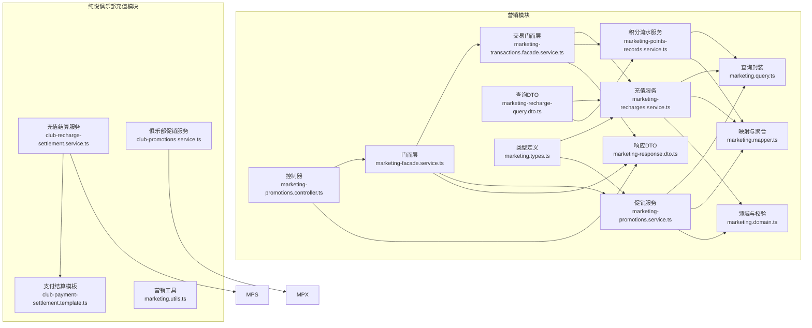
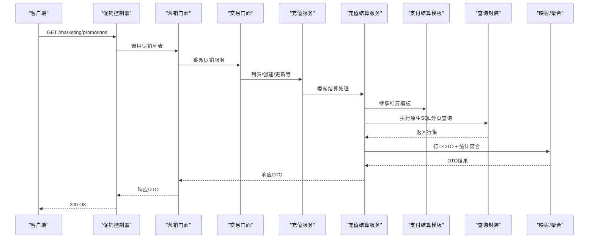
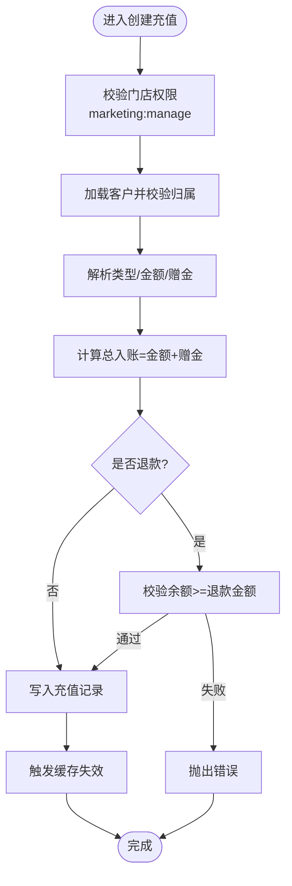
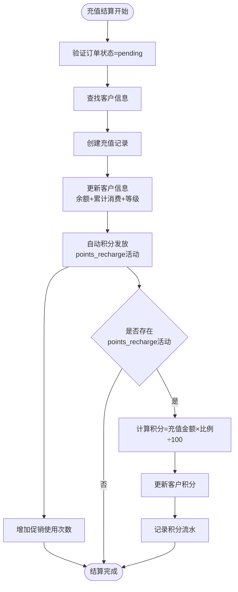
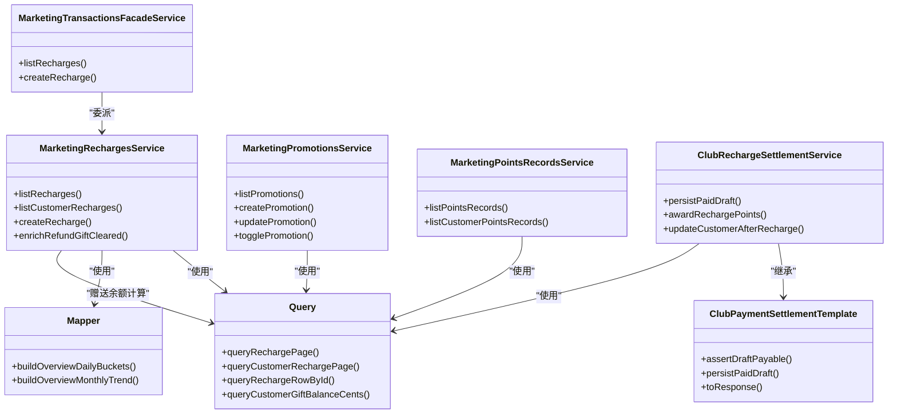

# 充值管理

<cite>
**本文引用的文件**
- [marketing-recharges.service.ts](file://src/purely-profit/marketing/marketing-recharges.service.ts)
- [marketing-transactions.facade.service.ts](file://src/purely-profit/marketing/marketing-transactions.facade.service.ts)
- [marketing-facade.service.ts](file://src/purely-profit/marketing/marketing-facade.service.ts)
- [marketing.query.ts](file://src/purely-profit/marketing/marketing.query.ts)
- [marketing.mapper.ts](file://src/purely-profit/marketing/marketing.mapper.ts)
- [marketing-promotions.service.ts](file://src/purely-profit/marketing/marketing-promotions.service.ts)
- [marketing-promotions.facade.service.ts](file://src/purely-profit/marketing/marketing-promotions.facade.service.ts)
- [marketing-promotions.controller.ts](file://src/purely-profit/marketing/marketing-promotions.controller.ts)
- [marketing-points-records.service.ts](file://src/purely-profit/marketing/marketing-points-records.service.ts)
- [marketing.domain.ts](file://src/purely-profit/marketing/marketing.domain.ts)
- [marketing.types.ts](file://src/purely-profit/marketing/marketing.types.ts)
- [marketing-response.dto.ts](file://src/purely-profit/marketing/dto/marketing-response.dto.ts)
- [marketing-recharge-query.dto.ts](file://src/purely-profit/marketing/dto/marketing-recharge-query.dto.ts)
- [club-recharge-settlement.service.ts](file://src/purely-club/recharge/club-recharge-settlement.service.ts)
- [club-payment-settlement.template.ts](file://src/purely-club/payments/club-payment-settlement.template.ts)
- [marketing.utils.ts](file://src/purely-profit/marketing/marketing.utils.ts)
- [club-promotions.service.ts](file://src/purely-club/promotions/club-promotions.service.ts)
- [migration.sql](file://prisma/migrations/20260514064726_add_marketing_module/migration.sql)
</cite>

## 更新摘要
**所做更改**
- 新增充值退款系统重大增强功能说明
- 详细说明clearRemainingGift参数支持礼品余额清空
- 完善最大可退本金验证逻辑（总充值本金-总退款）
- 增强退款时的礼品金额清理逻辑和前端显示备注生成
- 更新退款处理流程图和数据流图

## 目录
1. [简介](#简介)
2. [项目结构](#项目结构)
3. [核心组件](#核心组件)
4. [架构概览](#架构概览)
5. [详细组件分析](#详细组件分析)
6. [依赖关系分析](#依赖关系分析)
7. [性能考量](#性能考量)
8. [故障排查指南](#故障排查指南)
9. [结论](#结论)
10. [附录](#附录)

## 简介
本文件系统性阐述营销充值管理功能，覆盖客户充值记录、充值统计分析、充值优惠管理等核心能力，并扩展到充值规则配置、充值金额统计、充值渠道分析、充值查询、充值报表、充值异常监控、充值预测分析、充值优惠效果评估、充值用户分群等高级特性。文档基于实际代码实现进行分析，提供 API 使用示例、数据结构说明与业务场景演示，帮助开发者与运营人员高效理解与落地。

**更新** 本次更新重点增强了充值退款系统，新增了clearRemainingGift参数支持礼品余额清空，实现了最大可退本金验证机制，完善了退款时的礼品金额清理逻辑和前端显示备注生成，确保退款操作的准确性和完整性。

## 项目结构
营销充值管理位于营销模块中，采用"控制器-门面层-服务层-查询/映射"的分层设计，配合 Prisma 数据访问与缓存失效机制，形成可扩展、可维护的充值管理子系统。



**图表来源**
- [marketing-promotions.controller.ts:46-78](file://src/purely-profit/marketing/marketing-promotions.controller.ts#L46-L78)
- [marketing-facade.service.ts:86-138](file://src/purely-profit/marketing/marketing-facade.service.ts#L86-L138)
- [marketing-transactions.facade.service.ts:1-40](file://src/purely-profit/marketing/marketing-transactions.facade.service.ts#L1-L40)
- [marketing-recharges.service.ts:1-130](file://src/purely-profit/marketing/marketing-recharges.service.ts#L1-L130)
- [marketing-promotions.service.ts:1-133](file://src/purely-profit/marketing/marketing-promotions.service.ts#L1-L133)
- [marketing-points-records.service.ts:1-105](file://src/purely-profit/marketing/marketing-points-records.service.ts#L1-L105)
- [marketing.query.ts:97-179](file://src/purely-profit/marketing/marketing.query.ts#L97-L179)
- [marketing.mapper.ts:197-253](file://src/purely-profit/marketing/marketing.mapper.ts#L197-L253)
- [marketing.domain.ts](file://src/purely-profit/marketing/marketing.domain.ts)
- [marketing.types.ts:139-165](file://src/purely-profit/marketing/marketing.types.ts#L139-L165)
- [marketing-response.dto.ts:260-315](file://src/purely-profit/marketing/dto/marketing-response.dto.ts#L260-L315)
- [marketing-recharge-query.dto.ts:49-87](file://src/purely-profit/marketing/dto/marketing-recharge-query.dto.ts#L49-L87)
- [club-recharge-settlement.service.ts:25-223](file://src/purely-club/recharge/club-recharge-settlement.service.ts#L25-L223)
- [club-payment-settlement.template.ts](file://src/purely-club/payments/club-payment-settlement.template.ts)
- [marketing.utils.ts:60-70](file://src/purely-profit/marketing/marketing.utils.ts#L60-L70)
- [club-promotions.service.ts:161](file://src/purely-club/promotions/club-promotions.service.ts#L161)

**章节来源**
- [marketing-promotions.controller.ts:46-78](file://src/purely-profit/marketing/marketing-promotions.controller.ts#L46-L78)
- [marketing-facade.service.ts:86-138](file://src/purely-profit/marketing/marketing-facade.service.ts#L86-L138)
- [marketing-transactions.facade.service.ts:1-40](file://src/purely-profit/marketing/marketing-transactions.facade.service.ts#L1-L40)
- [marketing-recharges.service.ts:1-130](file://src/purely-profit/marketing/marketing-recharges.service.ts#L1-L130)
- [marketing-promotions.service.ts:1-133](file://src/purely-profit/marketing/marketing-promotions.service.ts#L1-L133)
- [marketing-points-records.service.ts:1-105](file://src/purely-profit/marketing/marketing-points-records.service.ts#L1-L105)
- [marketing.query.ts:97-179](file://src/purely-profit/marketing/marketing.query.ts#L97-L179)
- [marketing.mapper.ts:197-253](file://src/purely-profit/marketing/marketing.mapper.ts#L197-L253)
- [marketing.domain.ts](file://src/purely-profit/marketing/marketing.domain.ts)
- [marketing.types.ts:139-165](file://src/purely-profit/marketing/marketing.types.ts#L139-L165)
- [marketing-response.dto.ts:260-315](file://src/purely-profit/marketing/dto/marketing-response.dto.ts#L260-L315)
- [marketing-recharge-query.dto.ts:49-87](file://src/purely-profit/marketing/dto/marketing-recharge-query.dto.ts#L49-L87)
- [club-recharge-settlement.service.ts:25-223](file://src/purely-club/recharge/club-recharge-settlement.service.ts#L25-L223)
- [club-payment-settlement.template.ts](file://src/purely-club/payments/club-payment-settlement.template.ts)
- [marketing.utils.ts:60-70](file://src/purely-profit/marketing/marketing.utils.ts#L60-L70)
- [club-promotions.service.ts:161](file://src/purely-club/promotions/club-promotions.service.ts#L161)

## 核心组件
- 充值服务：负责充值记录的创建、分页查询、客户维度查询与权限校验。
- 交易门面层：统一对外暴露充值与积分流水等交易类接口。
- 促销服务：负责营销活动（含充值优惠）的创建、查询、启用/禁用与更新。
- **充值结算服务**：**新增** 基于支付结算模板的充值结算处理，集成自动积分发放机制。
- 查询封装：提供 SQL 原生查询以支持高性能分页与条件过滤。
- 映射与聚合：将数据库行映射为 DTO，并构建日/月趋势、活跃会员等统计指标。
- 领域与校验：构建查询条件、校验时间范围、充值类型与余额约束。
- 类型与 DTO：定义查询输入、响应输出的数据契约。

**章节来源**
- [marketing-recharges.service.ts:38-130](file://src/purely-profit/marketing/marketing-recharges.service.ts#L38-L130)
- [marketing-transactions.facade.service.ts:27-40](file://src/purely-profit/marketing/marketing-transactions.facade.service.ts#L27-L40)
- [marketing-promotions.service.ts:31-133](file://src/purely-profit/marketing/marketing-promotions.service.ts#L31-L133)
- [club-recharge-settlement.service.ts:25-223](file://src/purely-club/recharge/club-recharge-settlement.service.ts#L25-L223)
- [marketing.query.ts:97-179](file://src/purely-profit/marketing/marketing.query.ts#L97-L179)
- [marketing.mapper.ts:197-253](file://src/purely-profit/marketing/marketing.mapper.ts#L197-L253)
- [marketing.domain.ts](file://src/purely-profit/marketing/marketing.domain.ts)
- [marketing-response.dto.ts:260-315](file://src/purely-profit/marketing/dto/marketing-response.dto.ts#L260-L315)

## 架构概览
充值管理遵循"控制器-门面-服务-查询/映射"的分层架构，通过门面层解耦外部调用与内部实现，确保权限控制、分页与统计聚合在服务层集中处理。**新增**的充值结算服务基于支付结算模板，实现了自动积分发放的完整流程。



**图表来源**
- [marketing-promotions.controller.ts:46-78](file://src/purely-profit/marketing/marketing-promotions.controller.ts#L46-L78)
- [marketing-facade.service.ts:86-138](file://src/purely-profit/marketing/marketing-facade.service.ts#L86-L138)
- [marketing-transactions.facade.service.ts:27-40](file://src/purely-profit/marketing/marketing-transactions.facade.service.ts#L27-L40)
- [marketing-recharges.service.ts:38-130](file://src/purely-profit/marketing/marketing-recharges.service.ts#L38-L130)
- [club-recharge-settlement.service.ts:25-223](file://src/purely-club/recharge/club-recharge-settlement.service.ts#L25-L223)
- [club-payment-settlement.template.ts](file://src/purely-club/payments/club-payment-settlement.template.ts)
- [marketing.query.ts:97-179](file://src/purely-profit/marketing/marketing.query.ts#L97-L179)
- [marketing.mapper.ts:197-253](file://src/purely-profit/marketing/marketing.mapper.ts#L197-L253)

## 详细组件分析

### 充值服务（创建/查询）
- 分页查询：支持按门店、客户、时间范围过滤，返回充值明细与促销名称等。
- 客户维度查询：按客户 ID 查询其充值历史，带分页与总数统计。
- 权限校验：确保操作者对目标门店具备相应权限；客户归属校验防止跨店操作。
- 充值类型与金额：支持普通充值、退款等类型，自动计算总入账金额（含赠金），并校验退款不超过当前余额。
- 缓存失效：创建充值后触发缓存失效，保证统计与报表一致性。



**图表来源**
- [marketing-recharges.service.ts:106-130](file://src/purely-profit/marketing/marketing-recharges.service.ts#L106-L130)

**章节来源**
- [marketing-recharges.service.ts:38-130](file://src/purely-profit/marketing/marketing-recharges.service.ts#L38-L130)

### 交易门面层（统一入口）
- 对外暴露充值与积分流水等交易类接口，内部委派至具体服务。
- 保持接口稳定，便于后续扩展与版本演进。

**章节来源**
- [marketing-transactions.facade.service.ts:1-40](file://src/purely-profit/marketing/marketing-transactions.facade.service.ts#L1-L40)

### 促销服务（充值优惠管理）
- 列表/详情/创建/更新/删除/启停：围绕营销活动的全生命周期管理。
- 时间范围校验：创建/更新时校验活动起止时间。
- 权限控制：仅具备管理权限的用户可执行变更。
- 缓存失效：创建/更新促销后触发仪表盘缓存失效，保障统计实时性。

**章节来源**
- [marketing-promotions.service.ts:31-133](file://src/purely-profit/marketing/marketing-promotions.service.ts#L31-L133)
- [marketing-promotions.facade.service.ts:1-65](file://src/purely-profit/marketing/marketing-promotions.facade.service.ts#L1-L65)

### 充值结算服务（自动积分发放）
**新增** 充值结算服务基于支付结算模板，实现了完整的充值结算流程，包括自动积分发放机制。

- **结算流程**：继承支付结算模板，实现充值订单的确认、持久化和状态转换。
- **客户验证**：查找并验证客户存在性，确保充值对象有效。
- **充值记录创建**：在事务中创建充值记录，包含金额、赠金、促销信息等。
- **客户信息更新**：更新客户储值余额、累计消费额和会员等级。
- **自动积分发放**：**核心功能** 查找有效的充值积分活动，按充值金额计算积分奖励并发放。
- **促销使用统计**：增加促销使用次数统计，支持优惠效果追踪。
- **事务保证**：所有操作在单个事务中执行，确保数据一致性。



**图表来源**
- [club-recharge-settlement.service.ts:41-58](file://src/purely-club/recharge/club-recharge-settlement.service.ts#L41-L58)
- [club-recharge-settlement.service.ts:129-203](file://src/purely-club/recharge/club-recharge-settlement.service.ts#L129-L203)

**章节来源**
- [club-recharge-settlement.service.ts:25-223](file://src/purely-club/recharge/club-recharge-settlement.service.ts#L25-L223)

### 支付结算模板（基础框架）
**新增** 支付结算模板为充值结算服务提供基础框架，定义了通用的支付结算流程。

- **模板方法**：定义了结算流程的标准步骤，包括状态验证、订单持久化、响应转换等。
- **继承关系**：充值结算服务继承该模板，重写特定方法以适配充值场景。
- **错误处理**：提供标准的错误消息和异常处理机制。
- **缓存管理**：集成缓存失效机制，确保数据一致性。

**章节来源**
- [club-payment-settlement.template.ts](file://src/purely-club/payments/club-payment-settlement.template.ts)

### 自动积分发放机制
**新增** 充值结算服务的核心功能，实现了智能化的积分奖励机制。

- **活动识别**：查找门店当前有效的 `points_recharge` 类型促销活动。
- **参数解析**：支持 `rechargeRatioPercent` 和 `pointsRatio` 两种积分计算参数。
- **精确计算**：使用 Decimal 进行高精度计算，避免浮点数误差。
- **积分发放**：更新客户积分余额并记录积分流水。
- **活动记录**：记录积分发放的具体活动名称，便于审计和统计。

**积分计算公式**：
```
积分 = 充值金额（元） × 积分比例 ÷ 100（向下取整）
```

**章节来源**
- [club-recharge-settlement.service.ts:129-203](file://src/purely-club/recharge/club-recharge-settlement.service.ts#L129-L203)

### 充值退款系统重大增强
**新增** 充值退款系统进行了重大增强，新增了clearRemainingGift参数支持和最大可退本金验证机制。

#### clearRemainingGift参数支持
- **参数定义**：在CreateRechargeDto中新增clearRemainingGift布尔参数，仅在type=refund时生效。
- **礼品余额清空**：当clearRemainingGift=true时，退款操作会同时清空客户的剩余赠送金额。
- **余额计算逻辑**：实际余额变动 = -(退款金额 + 剩余赠送金额)，确保余额归零。

#### 最大可退本金验证
- **验证公式**：最大可退本金 = 总充值本金 - 总退款金额
- **预校验机制**：在事务外进行初步验证，防止明显超限的退款请求。
- **事务内重验**：在事务内重新计算并验证，防止并发退款导致超额退款。
- **错误处理**：超过最大可退本金时抛出BadRequestException。

#### 礼品金额清理逻辑
- **时间线算法**：基于时间顺序遍历充值记录，跟踪赠送金额变化。
- **清零规则**：任何退款都会清零当前赠送余额，新充值赠送重新累计。
- **余额计算**：queryCustomerGiftBalanceCents函数实现精确的赠送余额计算。

#### 前端显示备注生成
- **备注格式**：自动生成"赠送清零¥XX.XX"格式的备注信息。
- **智能拼接**：如果已有备注，则追加到原有备注后，用"|"分隔。
- **金额格式化**：使用Money工具类进行分转元的精确转换。

```mermaid
flowchart TD
Start(["退款操作开始"]) --> CheckClearGift{"clearRemainingGift<br/>是否为true?"}
CheckClearGift --> |否| NormalRefund["正常退款<br/>只扣减本金"]
CheckClearGift --> |是| CalcGift["计算剩余赠送金额<br/>queryCustomerGiftBalanceCents"]
CalcGift --> ValidatePrincipal["验证最大可退本金<br/>总充值-总退款"]
ValidatePrincipal --> |通过| CalcDelta["计算余额变动<br/>-(退款金额+赠送金额)]
ValidatePrincipal --> |失败| Error["抛出错误<br/>退款金额不能超过最大可退本金"]
CalcDelta --> GenerateNote["生成备注<br/>赠送清零¥XX.XX"]
GenerateNote --> UpdateBalance["更新客户余额"]
NormalRefund --> UpdateBalance
UpdateBalance --> Complete(["退款完成"])
Error --> Complete
```

**图表来源**
- [marketing-recharges.service.ts:218-285](file://src/purely-profit/marketing/marketing-recharges.service.ts#L218-L285)
- [marketing.query.ts:24-53](file://src/purely-profit/marketing/marketing.query.ts#L24-L53)

**章节来源**
- [marketing-recharges.service.ts:218-306](file://src/purely-profit/marketing/marketing-recharges.service.ts#L218-L306)
- [marketing.query.ts:24-53](file://src/purely-profit/marketing/marketing.query.ts#L24-L53)
- [marketing-recharge-query.dto.ts:167-172](file://src/purely-profit/marketing/dto/marketing-recharge-query.dto.ts#L167-L172)

### 查询封装（高性能分页与过滤）
- 原生 SQL：针对充值与积分流水提供原生查询，支持按门店、客户、时间范围、类型等过滤。
- 分页元信息：结合 count 查询与分页工具，返回 total/page/take/skip 等元信息。
- 关联查询：充值记录关联客户与促销，便于展示促销名称等字段。
- **赠送余额计算**：**新增** queryCustomerGiftBalanceCents函数实现基于时间线的赠送余额精确计算。

**章节来源**
- [marketing.query.ts:97-179](file://src/purely-profit/marketing/marketing.query.ts#L97-L179)
- [marketing.query.ts:24-53](file://src/purely-profit/marketing/marketing.query.ts#L24-L53)

### 映射与统计聚合
- 日趋势聚合：按自然日聚合充值金额（含赠金），支持构建最近 N 天趋势。
- 月度趋势：按年份构建 12 个月度趋势，支持同比/环比口径。
- 概览指标：构建总余额、总充值、当日/当月充值、充值笔数、活跃会员数等指标。
- **退款赠送清零信息**：**新增** enrichRefundGiftCleared方法为退款记录补充赠送清零金额信息。

**章节来源**
- [marketing.mapper.ts:197-253](file://src/purely-profit/marketing/marketing.mapper.ts#L197-L253)

### 领域与校验（查询条件构建）
- 充值查询条件：根据输入参数动态拼接 where 条件，支持客户、时间范围等。
- 促销查询条件：支持状态筛选、时间范围等。
- 充值类型与余额校验：确保退款不超过余额，避免负余额风险。
- **最大可退本金校验**：**新增** 基于总充值本金减去总退款的严格验证机制。

**章节来源**
- [marketing.domain.ts](file://src/purely-profit/marketing/marketing.domain.ts)
- [marketing-recharges.service.ts:124-130](file://src/purely-profit/marketing/marketing-recharges.service.ts#L124-L130)

### 类型与 DTO（数据契约）
- 充值查询 DTO：分页、客户 ID、时间范围等。
- 促销响应 DTO：活动名称、类型、描述、参数、起止时间、参与人次、核销优惠金额、状态、启用标志等。
- 统一分页元信息：total、page、pageSize 等。
- **退款参数增强**：**新增** CreateRechargeDto中的clearRemainingGift布尔参数。

**章节来源**
- [marketing-recharge-query.dto.ts:49-87](file://src/purely-profit/marketing/dto/marketing-recharge-query.dto.ts#L49-L87)
- [marketing-response.dto.ts:260-315](file://src/purely-profit/marketing/dto/marketing-response.dto.ts#L260-L315)
- [marketing-types.ts:139-165](file://src/purely-profit/marketing/marketing.types.ts#L139-L165)
- [marketing-recharge-query.dto.ts:167-172](file://src/purely-profit/marketing/dto/marketing-recharge-query.dto.ts#L167-L172)

## 依赖关系分析
- 充值服务依赖 Prisma 与共享服务（权限/客户/促销校验），并通过查询封装与映射层完成数据访问与转换。
- 门面层作为统一入口，降低控制器与服务层耦合度。
- 促销服务与充值服务相互独立，但共享相同的权限与缓存失效策略。
- **充值结算服务** **新增** 依赖支付结算模板，继承通用结算流程，同时扩展充值特有的积分发放功能。
- **退款增强依赖** **新增** 依赖queryCustomerGiftBalanceCents函数进行赠送余额计算，依赖Money工具类进行金额转换。



**图表来源**
- [marketing-transactions.facade.service.ts:27-40](file://src/purely-profit/marketing/marketing-transactions.facade.service.ts#L27-L40)
- [marketing-recharges.service.ts:38-130](file://src/purely-profit/marketing/marketing-recharges.service.ts#L38-L130)
- [marketing-promotions.service.ts:31-133](file://src/purely-profit/marketing/marketing-promotions.service.ts#L31-L133)
- [marketing-points-records.service.ts:29-105](file://src/purely-profit/marketing/marketing-points-records.service.ts#L29-L105)
- [club-recharge-settlement.service.ts:25-223](file://src/purely-club/recharge/club-recharge-settlement.service.ts#L25-L223)
- [club-payment-settlement.template.ts](file://src/purely-club/payments/club-payment-settlement.template.ts)
- [marketing.query.ts:97-179](file://src/purely-profit/marketing/marketing.query.ts#L97-L179)
- [marketing.mapper.ts:197-253](file://src/purely-profit/marketing/marketing.mapper.ts#L197-L253)
- [marketing.query.ts:24-53](file://src/purely-profit/marketing/marketing.query.ts#L24-L53)

**章节来源**
- [marketing-transactions.facade.service.ts:1-40](file://src/purely-profit/marketing/marketing-transactions.facade.service.ts#L1-L40)
- [marketing-recharges.service.ts:1-130](file://src/purely-profit/marketing/marketing-recharges.service.ts#L1-L130)
- [marketing-promotions.service.ts:1-133](file://src/purely-profit/marketing/marketing-promotions.service.ts#L1-L133)
- [marketing-points-records.service.ts:1-105](file://src/purely-profit/marketing/marketing-points-records.service.ts#L1-L105)
- [club-recharge-settlement.service.ts:25-223](file://src/purely-club/recharge/club-recharge-settlement.service.ts#L25-L223)
- [club-payment-settlement.template.ts](file://src/purely-club/payments/club-payment-settlement.template.ts)
- [marketing.query.ts:97-179](file://src/purely-profit/marketing/marketing.query.ts#L97-L179)
- [marketing.mapper.ts:197-253](file://src/purely-profit/marketing/marketing.mapper.ts#L197-L253)
- [marketing.query.ts:24-53](file://src/purely-profit/marketing/marketing.query.ts#L24-L53)

## 性能考量
- 原生 SQL 分页：通过 LIMIT/OFFSET 与 count 并行查询，减少 ORM 层开销，提升大数据量下的查询效率。
- 动态 where 条件：仅在有参数时拼接，避免不必要的过滤条件影响索引命中。
- 缓存失效：充值创建后触发缓存失效，避免统计延迟。
- 统计聚合：按日/月聚合在内存中完成，适合中小规模数据；如需大规模趋势分析，建议引入物化视图或离线统计任务。
- **事务优化**：充值结算在单个事务中完成，确保数据一致性的同时避免重复查询。
- **积分计算优化**：使用 Decimal 进行高精度计算，避免浮点数累积误差。
- **退款性能优化**：**新增** 赠送余额计算采用单次查询+内存遍历，避免多次数据库交互。
- **并发安全**：**新增** 双重验证机制（预校验+事务内重验）确保并发退款的安全性。

## 故障排查指南
- 权限不足：确保操作者对目标门店具备相应权限（如 marketing:manage 或 marketing:view）。
- 客户归属错误：创建充值时需校验客户归属门店，否则会抛出错误。
- 退款超限：退款金额不得高于客户当前余额，否则会抛出错误。
- 促销时间冲突：创建/更新促销时需校验起止时间，避免非法区间。
- 查询无结果：若查询不到充值记录，请检查时间范围、客户 ID、门店 ID 是否正确。
- **积分发放失败**：检查是否存在有效的 `points_recharge` 活动，确认积分比例参数正确。
- **结算状态错误**：充值结算仅允许对状态为 `pending` 的订单进行确认。
- **退款金额超限**：**新增** 检查退款金额是否超过最大可退本金（总充值本金-总退款）。
- **赠送余额计算异常**：**新增** 检查客户充值历史记录的时间顺序和类型是否正确。
- **clearRemainingGift参数无效**：**新增** 确认只在type=refund时设置clearRemainingGift=true。

**章节来源**
- [marketing-recharges.service.ts:106-130](file://src/purely-profit/marketing/marketing-recharges.service.ts#L106-L130)
- [marketing-promotions.service.ts:86-133](file://src/purely-profit/marketing/marketing-promotions.service.ts#L86-L133)
- [club-recharge-settlement.service.ts:41-58](file://src/purely-club/recharge/club-recharge-settlement.service.ts#L41-L58)
- [marketing-recharges.service.ts:218-285](file://src/purely-profit/marketing/marketing-recharges.service.ts#L218-L285)

## 结论
充值管理模块通过清晰的分层设计与严格的权限控制，实现了从充值记录、统计分析到优惠管理的完整闭环。**新增**的充值结算服务和自动积分发放机制进一步完善了充值生态，实现了充值金额与积分奖励的智能联动。**最新的充值退款系统重大增强**通过clearRemainingGift参数支持、最大可退本金验证和礼品金额清理逻辑，确保了退款操作的准确性和完整性。结合原生 SQL 查询与映射聚合，既保证了性能也提升了可维护性。建议在生产环境中配合缓存失效策略与监控告警，持续优化用户体验与运营效率。

## 附录

### 数据模型（简要）
- 充值记录表：包含门店 ID、客户 ID、充值金额、赠金、类型、促销 ID、备注、创建时间等字段。
- 促销表：包含门店 ID、名称、类型、描述、参数、起止时间、启用标志等字段。
- 积分流水表：用于记录积分变动明细，支持按客户/类型/时间范围查询。
- **客户表扩展**：新增积分字段，支持积分余额统计和流水记录。

**章节来源**
- [migration.sql:46-74](file://prisma/migrations/20260514064726_add_marketing_module/migration.sql#L46-L74)

### API 示例与业务场景

- 场景一：查询某门店的充值记录
  - 方法与路径：GET /marketing/promotions
  - 权限：marketing:view
  - 查询参数：storeId（可选）、status（可选）、page、pageSize
  - 返回：促销列表与分页元信息

  **章节来源**
  - [marketing-promotions.controller.ts:46-78](file://src/purely-profit/marketing/marketing-promotions.controller.ts#L46-L78)
  - [marketing-facade.service.ts:86-138](file://src/purely-profit/marketing/marketing-facade.service.ts#L86-L138)

- 场景二：创建充值（含赠金）
  - 方法与路径：POST /marketing/promotions
  - 权限：marketing:manage
  - 请求体：促销创建 DTO（含名称、类型、参数、起止时间、启用标志等）
  - 返回：促销详情与分页元信息

  **章节来源**
  - [marketing-promotions.controller.ts:57-78](file://src/purely-profit/marketing/marketing-promotions.controller.ts#L57-L78)
  - [marketing-facade.service.ts:190-231](file://src/purely-profit/marketing/marketing-facade.service.ts#L190-L231)

- 场景三：按客户查询充值记录
  - 方法与路径：GET /marketing/customers/{customerId}/recharges
  - 权限：marketing:view
  - 查询参数：page、pageSize
  - 返回：充值记录列表与分页元信息

  **章节来源**
  - [marketing-facade.service.ts:109-119](file://src/purely-profit/marketing/marketing-facade.service.ts#L109-L119)
  - [marketing-recharges.service.ts:78-104](file://src/purely-profit/marketing/marketing-recharges.service.ts#L78-L104)

- 场景四：充值统计与趋势
  - 方法与路径：GET /marketing/overview（示例）
  - 权限：marketing:view
  - 返回：总余额、总充值、当日/当月充值、充值笔数、活跃会员数、最近 30 天趋势、当年/去年月度趋势等

  **章节来源**
  - [marketing.mapper.ts:197-253](file://src/purely-profit/marketing/marketing.mapper.ts#L197-L253)

- 场景五：充值异常监控
  - 建议：对退款超限、促销时间异常、权限不足等情况建立告警；对长时间未刷新的缓存进行巡检。

  **章节来源**
  - [marketing-recharges.service.ts:124-130](file://src/purely-profit/marketing/marketing-recharges.service.ts#L124-L130)
  - [marketing-promotions.service.ts:86-133](file://src/purely-profit/marketing/marketing-promotions.service.ts#L86-L133)

- 场景六：自动积分发放（新增）
  - **业务流程**：客户完成充值后，系统自动检查有效的 `points_recharge` 活动，按充值金额计算积分并发放。
  - **计算规则**：积分 = 充值金额（元） × 积分比例 ÷ 100（向下取整）
  - **记录生成**：同时生成积分流水记录，便于审计和统计分析。
  - **参数支持**：支持 `rechargeRatioPercent` 和 `pointsRatio` 两种积分计算方式。

  **章节来源**
  - [club-recharge-settlement.service.ts:129-203](file://src/purely-club/recharge/club-recharge-settlement.service.ts#L129-L203)
  - [marketing.utils.ts:60-70](file://src/purely-profit/marketing/marketing.utils.ts#L60-L70)
  - [club-promotions.service.ts:161](file://src/purely-club/promotions/club-promotions.service.ts#L161)

- 场景七：充值退款增强（新增）
  - **基础退款**：不设置clearRemainingGift时，只退还本金部分，不影响赠送余额。
  - **全额退款**：设置clearRemainingGift=true时，同时退还本金和清空剩余赠送金额。
  - **最大可退本金**：系统自动计算最大可退金额 = 总充值本金 - 总退款金额，防止超额退款。
  - **备注生成**：自动在备注中添加"赠送清零¥XX.XX"信息，便于财务审计。
  - **并发安全**：双重验证机制确保在高并发环境下退款操作的准确性。

  **章节来源**
  - [marketing-recharges.service.ts:218-306](file://src/purely-profit/marketing/marketing-recharges.service.ts#L218-L306)
  - [marketing.query.ts:24-53](file://src/purely-profit/marketing/marketing.query.ts#L24-L53)
  - [marketing-recharge-query.dto.ts:167-172](file://src/purely-profit/marketing/dto/marketing-recharge-query.dto.ts#L167-L172)