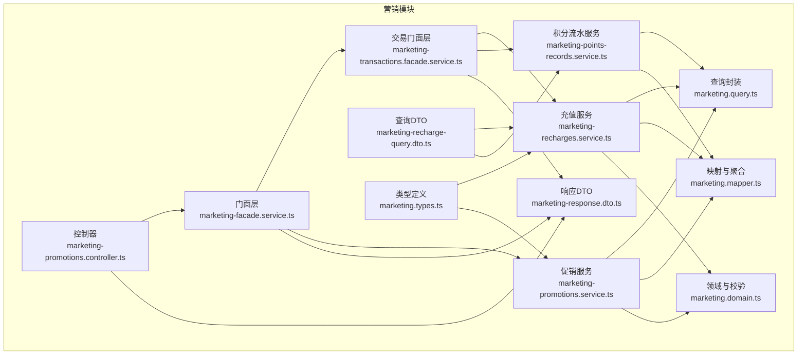
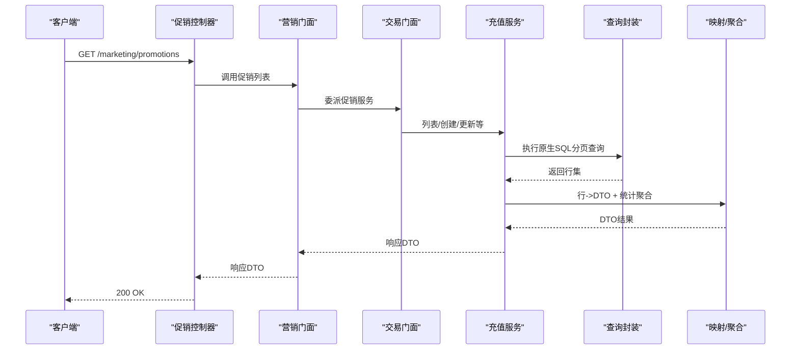
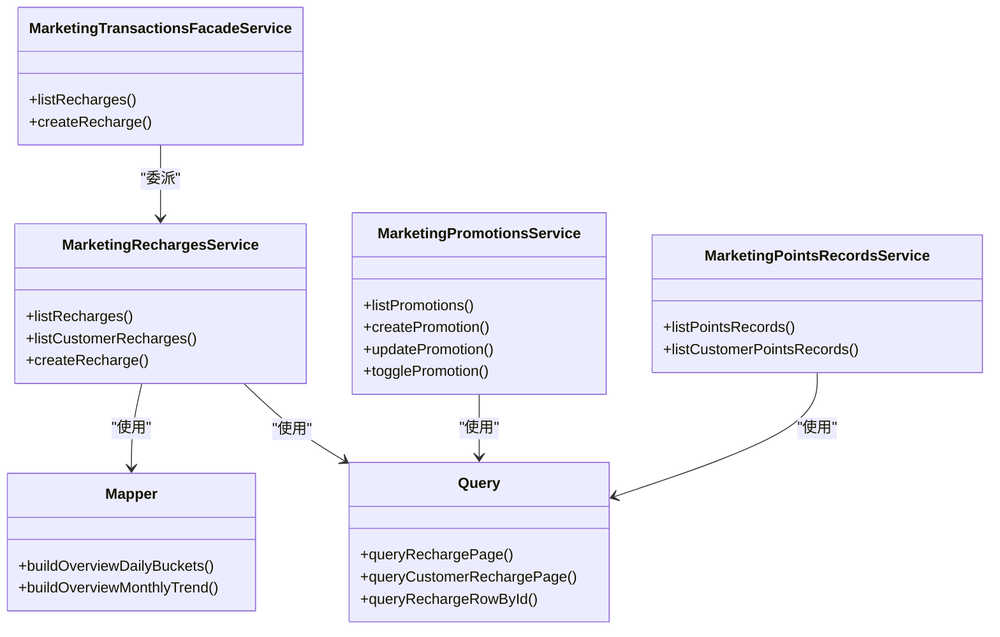

# 充值管理

<cite>
**本文引用的文件**
- [marketing-recharges.service.ts](file://src/purely-profit/marketing/marketing-recharges.service.ts)
- [marketing-transactions.facade.service.ts](file://src/purely-profit/marketing/marketing-transactions.facade.service.ts)
- [marketing-facade.service.ts](file://src/purely-profit/marketing/marketing-facade.service.ts)
- [marketing.query.ts](file://src/purely-profit/marketing/marketing.query.ts)
- [marketing.mapper.ts](file://src/purely-profit/marketing/marketing.mapper.ts)
- [marketing-promotions.service.ts](file://src/purely-profit/marketing/marketing-promotions.service.ts)
- [marketing-promotions.facade.service.ts](file://src/purely-profit/marketing/marketing-promotions.facade.service.ts)
- [marketing-promotions.controller.ts](file://src/purely-profit/marketing/marketing-promotions.controller.ts)
- [marketing-points-records.service.ts](file://src/purely-profit/marketing/marketing-points-records.service.ts)
- [marketing.domain.ts](file://src/purely-profit/marketing/marketing.domain.ts)
- [marketing.types.ts](file://src/purely-profit/marketing/marketing.types.ts)
- [marketing-response.dto.ts](file://src/purely-profit/marketing/dto/marketing-response.dto.ts)
- [marketing-recharge-query.dto.ts](file://src/purely-profit/marketing/dto/marketing-recharge-query.dto.ts)
- [migration.sql](file://prisma/migrations/20260514064726_add_marketing_module/migration.sql)
</cite>

## 目录
1. [简介](#简介)
2. [项目结构](#项目结构)
3. [核心组件](#核心组件)
4. [架构概览](#架构概览)
5. [详细组件分析](#详细组件分析)
6. [依赖关系分析](#依赖关系分析)
7. [性能考量](#性能考量)
8. [故障排查指南](#故障排查指南)
9. [结论](#结论)
10. [附录](#附录)

## 简介
本文件系统性阐述营销充值管理功能，覆盖客户充值记录、充值统计分析、充值优惠管理等核心能力，并扩展到充值规则配置、充值金额统计、充值渠道分析、充值查询、充值报表、充值异常监控、充值预测分析、充值优惠效果评估、充值用户分群等高级特性。文档基于实际代码实现进行分析，提供 API 使用示例、数据结构说明与业务场景演示，帮助开发者与运营人员高效理解与落地。

## 项目结构
营销充值管理位于营销模块中，采用“控制器-门面层-服务层-查询/映射”的分层设计，配合 Prisma 数据访问与缓存失效机制，形成可扩展、可维护的充值管理子系统。

图表来源
- [marketing-promotions.controller.ts:46-78](file://src/purely-profit/marketing/marketing-promotions.controller.ts#L46-L78)
- [marketing-facade.service.ts:86-138](file://src/purely-profit/marketing/marketing-facade.service.ts#L86-L138)
- [marketing-transactions.facade.service.ts:1-40](file://src/purely-profit/marketing/marketing-transactions.facade.service.ts#L1-L40)
- [marketing-recharges.service.ts:1-130](file://src/purely-profit/marketing/marketing-recharges.service.ts#L1-L130)
- [marketing-promotions.service.ts:1-133](file://src/purely-profit/marketing/marketing-promotions.service.ts#L1-L133)
- [marketing-points-records.service.ts:1-105](file://src/purely-profit/marketing/marketing-points-records.service.ts#L1-L105)
- [marketing.query.ts:97-179](file://src/purely-profit/marketing/marketing.query.ts#L97-L179)
- [marketing.mapper.ts:197-253](file://src/purely-profit/marketing/marketing.mapper.ts#L197-L253)
- [marketing.domain.ts](file://src/purely-profit/marketing/marketing.domain.ts)
- [marketing.types.ts:139-165](file://src/purely-profit/marketing/marketing.types.ts#L139-L165)
- [marketing-response.dto.ts:260-315](file://src/purely-profit/marketing/dto/marketing-response.dto.ts#L260-L315)
- [marketing-recharge-query.dto.ts:49-87](file://src/purely-profit/marketing/dto/marketing-recharge-query.dto.ts#L49-L87)

章节来源
- [marketing-promotions.controller.ts:46-78](file://src/purely-profit/marketing/marketing-promotions.controller.ts#L46-L78)
- [marketing-facade.service.ts:86-138](file://src/purely-profit/marketing/marketing-facade.service.ts#L86-L138)
- [marketing-transactions.facade.service.ts:1-40](file://src/purely-profit/marketing/marketing-transactions.facade.service.ts#L1-L40)
- [marketing-recharges.service.ts:1-130](file://src/purely-profit/marketing/marketing-recharges.service.ts#L1-L130)
- [marketing-promotions.service.ts:1-133](file://src/purely-profit/marketing/marketing-promotions.service.ts#L1-L133)
- [marketing-points-records.service.ts:1-105](file://src/purely-profit/marketing/marketing-points-records.service.ts#L1-L105)
- [marketing.query.ts:97-179](file://src/purely-profit/marketing/marketing.query.ts#L97-L179)
- [marketing.mapper.ts:197-253](file://src/purely-profit/marketing/marketing.mapper.ts#L197-L253)
- [marketing.domain.ts](file://src/purely-profit/marketing/marketing.domain.ts)
- [marketing.types.ts:139-165](file://src/purely-profit/marketing/marketing.types.ts#L139-L165)
- [marketing-response.dto.ts:260-315](file://src/purely-profit/marketing/dto/marketing-response.dto.ts#L260-L315)
- [marketing-recharge-query.dto.ts:49-87](file://src/purely-profit/marketing/dto/marketing-recharge-query.dto.ts#L49-L87)

## 核心组件
- 充值服务：负责充值记录的创建、分页查询、客户维度查询与权限校验。
- 交易门面层：统一对外暴露充值与积分流水等交易类接口。
- 促销服务：负责营销活动（含充值优惠）的创建、查询、启用/禁用与更新。
- 查询封装：提供 SQL 原生查询以支持高性能分页与条件过滤。
- 映射与聚合：将数据库行映射为 DTO，并构建日/月趋势、活跃会员等统计指标。
- 领域与校验：构建查询条件、校验时间范围、充值类型与余额约束。
- 类型与 DTO：定义查询输入、响应输出的数据契约。

章节来源
- [marketing-recharges.service.ts:38-130](file://src/purely-profit/marketing/marketing-recharges.service.ts#L38-L130)
- [marketing-transactions.facade.service.ts:27-40](file://src/purely-profit/marketing/marketing-transactions.facade.service.ts#L27-L40)
- [marketing-promotions.service.ts:31-133](file://src/purely-profit/marketing/marketing-promotions.service.ts#L31-L133)
- [marketing.query.ts:97-179](file://src/purely-profit/marketing/marketing.query.ts#L97-L179)
- [marketing.mapper.ts:197-253](file://src/purely-profit/marketing/marketing.mapper.ts#L197-L253)
- [marketing.domain.ts](file://src/purely-profit/marketing/marketing.domain.ts)
- [marketing-response.dto.ts:260-315](file://src/purely-profit/marketing/dto/marketing-response.dto.ts#L260-L315)

## 架构概览
充值管理遵循“控制器-门面-服务-查询/映射”的分层架构，通过门面层解耦外部调用与内部实现，确保权限控制、分页与统计聚合在服务层集中处理。

图表来源
- [marketing-promotions.controller.ts:46-78](file://src/purely-profit/marketing/marketing-promotions.controller.ts#L46-L78)
- [marketing-facade.service.ts:86-138](file://src/purely-profit/marketing/marketing-facade.service.ts#L86-L138)
- [marketing-transactions.facade.service.ts:27-40](file://src/purely-profit/marketing/marketing-transactions.facade.service.ts#L27-L40)
- [marketing-recharges.service.ts:38-130](file://src/purely-profit/marketing/marketing-recharges.service.ts#L38-L130)
- [marketing.query.ts:97-179](file://src/purely-profit/marketing/marketing.query.ts#L97-L179)
- [marketing.mapper.ts:197-253](file://src/purely-profit/marketing/marketing.mapper.ts#L197-L253)

## 详细组件分析

### 充值服务（创建/查询）
- 分页查询：支持按门店、客户、时间范围过滤，返回充值明细与促销名称等。
- 客户维度查询：按客户 ID 查询其充值历史，带分页与总数统计。
- 权限校验：确保操作者对目标门店具备相应权限；客户归属校验防止跨店操作。
- 充值类型与金额：支持普通充值、退款等类型，自动计算总入账金额（含赠金），并校验退款不超过当前余额。
- 缓存失效：创建充值后触发缓存失效，保证统计与报表一致性。

图表来源
- [marketing-recharges.service.ts:106-130](file://src/purely-profit/marketing/marketing-recharges.service.ts#L106-L130)

章节来源
- [marketing-recharges.service.ts:38-130](file://src/purely-profit/marketing/marketing-recharges.service.ts#L38-L130)

### 交易门面层（统一入口）
- 对外暴露充值与积分流水等交易类接口，内部委派至具体服务。
- 保持接口稳定，便于后续扩展与版本演进。

章节来源
- [marketing-transactions.facade.service.ts:1-40](file://src/purely-profit/marketing/marketing-transactions.facade.service.ts#L1-L40)

### 促销服务（充值优惠管理）
- 列表/详情/创建/更新/删除/启停：围绕营销活动的全生命周期管理。
- 时间范围校验：创建/更新时校验活动起止时间。
- 权限控制：仅具备管理权限的用户可执行变更。
- 缓存失效：创建/更新促销后触发仪表盘缓存失效，保障统计实时性。

章节来源
- [marketing-promotions.service.ts:31-133](file://src/purely-profit/marketing/marketing-promotions.service.ts#L31-L133)
- [marketing-promotions.facade.service.ts:1-65](file://src/purely-profit/marketing/marketing-promotions.facade.service.ts#L1-L65)

### 查询封装（高性能分页与过滤）
- 原生 SQL：针对充值与积分流水提供原生查询，支持按门店、客户、时间范围、类型等过滤。
- 分页元信息：结合 count 查询与分页工具，返回 total/page/take/skip 等元信息。
- 关联查询：充值记录关联客户与促销，便于展示促销名称等字段。

章节来源
- [marketing.query.ts:97-179](file://src/purely-profit/marketing/marketing.query.ts#L97-L179)

### 映射与统计聚合
- 日趋势聚合：按自然日聚合充值金额（含赠金），支持构建最近 N 天趋势。
- 月度趋势：按年份构建 12 个月度趋势，支持同比/环比口径。
- 概览指标：构建总余额、总充值、当日/当月充值、充值笔数、活跃会员数等指标。

章节来源
- [marketing.mapper.ts:197-253](file://src/purely-profit/marketing/marketing.mapper.ts#L197-L253)

### 领域与校验（查询条件构建）
- 充值查询条件：根据输入参数动态拼接 where 条件，支持客户、时间范围等。
- 促销查询条件：支持状态筛选、时间范围等。
- 充值类型与余额校验：确保退款不超过余额，避免负余额风险。

章节来源
- [marketing.domain.ts](file://src/purely-profit/marketing/marketing.domain.ts)
- [marketing-recharges.service.ts:124-130](file://src/purely-profit/marketing/marketing-recharges.service.ts#L124-L130)

### 类型与 DTO（数据契约）
- 充值查询 DTO：分页、客户 ID、时间范围等。
- 促销响应 DTO：活动名称、类型、描述、参数、起止时间、参与人次、核销优惠金额、状态、启用标志等。
- 统一分页元信息：total、page、pageSize 等。

章节来源
- [marketing-recharge-query.dto.ts:49-87](file://src/purely-profit/marketing/dto/marketing-recharge-query.dto.ts#L49-L87)
- [marketing-response.dto.ts:260-315](file://src/purely-profit/marketing/dto/marketing-response.dto.ts#L260-L315)
- [marketing.types.ts:139-165](file://src/purely-profit/marketing/marketing.types.ts#L139-L165)

## 依赖关系分析
- 充值服务依赖 Prisma 与共享服务（权限/客户/促销校验），并通过查询封装与映射层完成数据访问与转换。
- 门面层作为统一入口，降低控制器与服务层耦合度。
- 促销服务与充值服务相互独立，但共享相同的权限与缓存失效策略。

图表来源
- [marketing-transactions.facade.service.ts:27-40](file://src/purely-profit/marketing/marketing-transactions.facade.service.ts#L27-L40)
- [marketing-recharges.service.ts:38-130](file://src/purely-profit/marketing/marketing-recharges.service.ts#L38-L130)
- [marketing-promotions.service.ts:31-133](file://src/purely-profit/marketing/marketing-promotions.service.ts#L31-L133)
- [marketing-points-records.service.ts:29-105](file://src/purely-profit/marketing/marketing-points-records.service.ts#L29-L105)
- [marketing.query.ts:97-179](file://src/purely-profit/marketing/marketing.query.ts#L97-L179)
- [marketing.mapper.ts:197-253](file://src/purely-profit/marketing/marketing.mapper.ts#L197-L253)

章节来源
- [marketing-transactions.facade.service.ts:1-40](file://src/purely-profit/marketing/marketing-transactions.facade.service.ts#L1-L40)
- [marketing-recharges.service.ts:1-130](file://src/purely-profit/marketing/marketing-recharges.service.ts#L1-L130)
- [marketing-promotions.service.ts:1-133](file://src/purely-profit/marketing/marketing-promotions.service.ts#L1-L133)
- [marketing-points-records.service.ts:1-105](file://src/purely-profit/marketing/marketing-points-records.service.ts#L1-L105)
- [marketing.query.ts:97-179](file://src/purely-profit/marketing/marketing.query.ts#L97-L179)
- [marketing.mapper.ts:197-253](file://src/purely-profit/marketing/marketing.mapper.ts#L197-L253)

## 性能考量
- 原生 SQL 分页：通过 LIMIT/OFFSET 与 count 并行查询，减少 ORM 层开销，提升大数据量下的查询效率。
- 动态 where 条件：仅在有参数时拼接，避免不必要的过滤条件影响索引命中。
- 缓存失效：充值创建后触发缓存失效，避免统计延迟。
- 统计聚合：按日/月聚合在内存中完成，适合中小规模数据；如需大规模趋势分析，建议引入物化视图或离线统计任务。

## 故障排查指南
- 权限不足：确保操作者对目标门店具备相应权限（如 marketing:manage 或 marketing:view）。
- 客户归属错误：创建充值时需校验客户归属门店，否则会抛出错误。
- 退款超限：退款金额不得高于客户当前余额，否则会抛出错误。
- 促销时间冲突：创建/更新促销时需校验起止时间，避免非法区间。
- 查询无结果：若查询不到充值记录，请检查时间范围、客户 ID、门店 ID 是否正确。

章节来源
- [marketing-recharges.service.ts:106-130](file://src/purely-profit/marketing/marketing-recharges.service.ts#L106-L130)
- [marketing-promotions.service.ts:86-133](file://src/purely-profit/marketing/marketing-promotions.service.ts#L86-L133)

## 结论
充值管理模块通过清晰的分层设计与严格的权限控制，实现了从充值记录、统计分析到优惠管理的完整闭环。结合原生 SQL 查询与映射聚合，既保证了性能也提升了可维护性。建议在生产环境中配合缓存失效策略与监控告警，持续优化用户体验与运营效率。

## 附录

### 数据模型（简要）
- 充值记录表：包含门店 ID、客户 ID、充值金额、赠金、类型、促销 ID、备注、创建时间等字段。
- 促销表：包含门店 ID、名称、类型、描述、参数、起止时间、启用标志等字段。
- 积分流水表：用于记录积分变动明细，支持按客户/类型/时间范围查询。

章节来源
- [migration.sql:46-74](file://prisma/migrations/20260514064726_add_marketing_module/migration.sql#L46-L74)

### API 示例与业务场景

- 场景一：查询某门店的充值记录
  - 方法与路径：GET /marketing/promotions
  - 权限：marketing:view
  - 查询参数：storeId（可选）、status（可选）、page、pageSize
  - 返回：促销列表与分页元信息

  章节来源
  - [marketing-promotions.controller.ts:46-78](file://src/purely-profit/marketing/marketing-promotions.controller.ts#L46-L78)
  - [marketing-facade.service.ts:86-138](file://src/purely-profit/marketing/marketing-facade.service.ts#L86-L138)

- 场景二：创建充值（含赠金）
  - 方法与路径：POST /marketing/promotions
  - 权限：marketing:manage
  - 请求体：促销创建 DTO（含名称、类型、参数、起止时间、启用标志等）
  - 返回：促销详情与分页元信息

  章节来源
  - [marketing-promotions.controller.ts:57-78](file://src/purely-profit/marketing/marketing-promotions.controller.ts#L57-L78)
  - [marketing-facade.service.ts:190-231](file://src/purely-profit/marketing/marketing-facade.service.ts#L190-L231)

- 场景三：按客户查询充值记录
  - 方法与路径：GET /marketing/customers/{customerId}/recharges
  - 权限：marketing:view
  - 查询参数：page、pageSize
  - 返回：充值记录列表与分页元信息

  章节来源
  - [marketing-facade.service.ts:109-119](file://src/purely-profit/marketing/marketing-facade.service.ts#L109-L119)
  - [marketing-recharges.service.ts:78-104](file://src/purely-profit/marketing/marketing-recharges.service.ts#L78-L104)

- 场景四：充值统计与趋势
  - 方法与路径：GET /marketing/overview（示例）
  - 权限：marketing:view
  - 返回：总余额、总充值、当日/当月充值、充值笔数、活跃会员数、最近 30 天趋势、当年/去年月度趋势等

  章节来源
  - [marketing.mapper.ts:197-253](file://src/purely-profit/marketing/marketing.mapper.ts#L197-L253)

- 场景五：充值异常监控
  - 建议：对退款超限、促销时间异常、权限不足等情况建立告警；对长时间未刷新的缓存进行巡检。

  章节来源
  - [marketing-recharges.service.ts:124-130](file://src/purely-profit/marketing/marketing-recharges.service.ts#L124-L130)
  - [marketing-promotions.service.ts:86-133](file://src/purely-profit/marketing/marketing-promotions.service.ts#L86-L133)