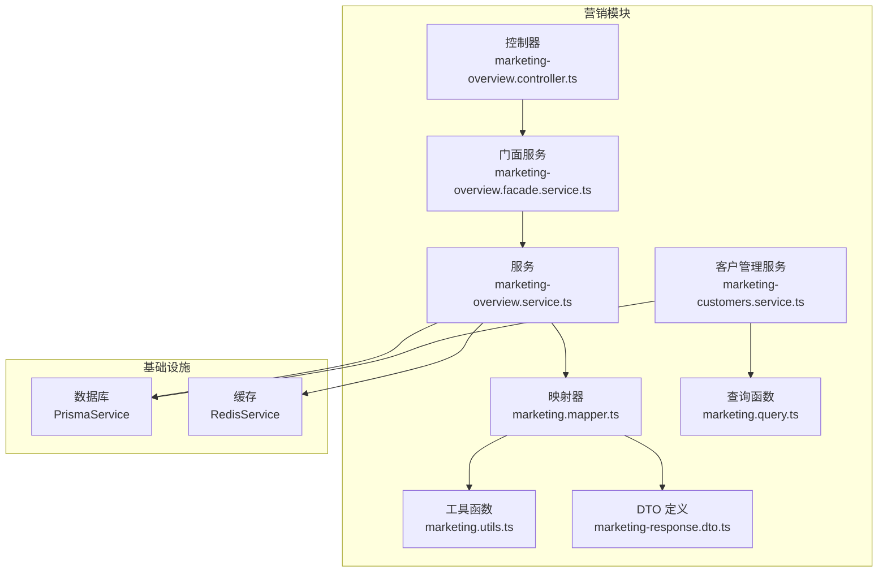
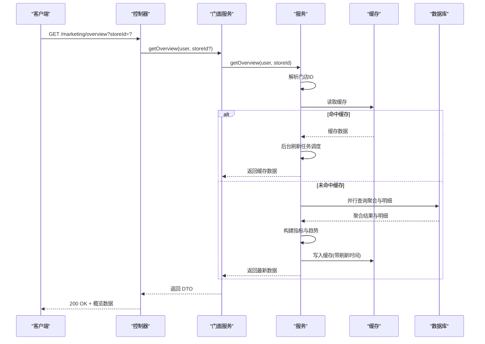
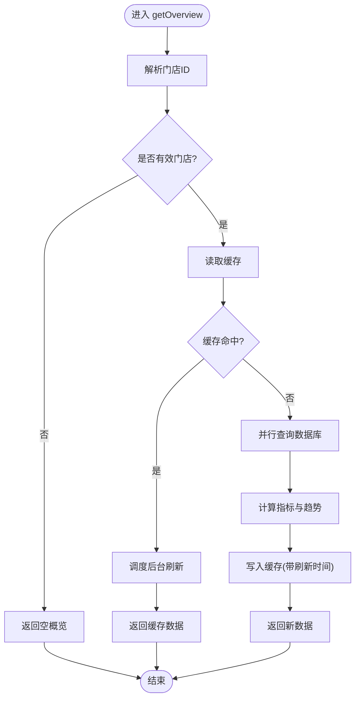
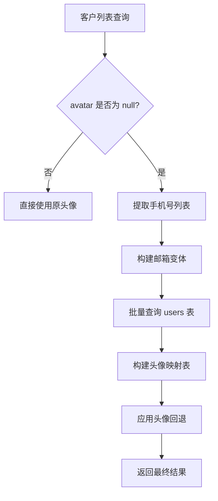
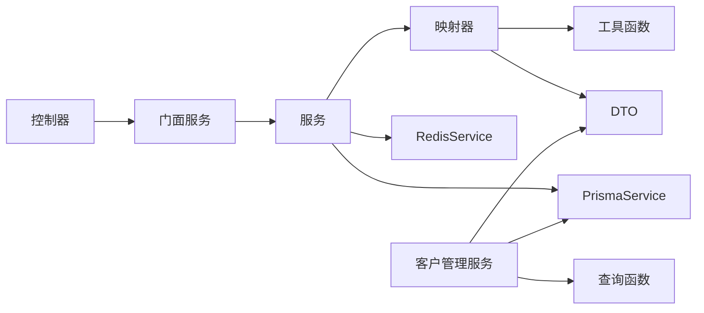

# 客户概览

<cite>
**本文引用的文件**
- [marketing-overview.controller.ts](file://src/purely-profit/marketing/marketing-overview.controller.ts)
- [marketing-overview.service.ts](file://src/purely-profit/marketing/marketing-overview.service.ts)
- [marketing.mapper.ts](file://src/purely-profit/marketing/marketing.mapper.ts)
- [marketing.utils.ts](file://src/purely-profit/marketing/marketing.utils.ts)
- [marketing-response.dto.ts](file://src/purely-profit/marketing/dto/marketing-response.dto.ts)
- [marketing.service.overview.spec.ts](file://src/purely-profit/marketing/marketing.service.overview.spec.ts)
- [marketing.service.customers.spec.ts](file://src/purely-profit/marketing/marketing.service.customers.spec.ts)
- [marketing-facade.service.ts](file://src/purely-profit/marketing/marketing-facade.service.ts)
- [marketing-overview.facade.service.ts](file://src/purely-profit/marketing/marketing-overview.facade.service.ts)
- [marketing-customers.service.ts](file://src/purely-profit/marketing/marketing-customers.service.ts)
- [marketing.query.ts](file://src/purely-profit/marketing/marketing.query.ts)
</cite>

## 更新摘要
**变更内容**
- 新增客户详情财务信息字段：refundableAmount（最大可退金额）、giftBalance（赠送金额余额）、totalPointsDeducted（积分抵扣总额）
- 增强头像回退逻辑：支持通过微信手机号和多格式邮箱匹配用户头像
- 完善客户详情聚合功能，提供更完整的财务分析数据

## 目录
1. [简介](#简介)
2. [项目结构](#项目结构)
3. [核心组件](#核心组件)
4. [架构总览](#架构总览)
5. [详细组件分析](#详细组件分析)
6. [依赖关系分析](#依赖关系分析)
7. [性能考量](#性能考量)
8. [故障排查指南](#故障排查指南)
9. [结论](#结论)
10. [附录](#附录)

## 简介
本文件围绕"营销客户概览"能力，系统化阐述客户总体统计数据、客户增长趋势、客户分布分析、客户活跃度与留存、客户价值贡献、客户画像与细分、客户行为趋势、预测分析与流失预警、生命周期价值等业务主题。文档以代码为依据，结合架构图与流程图，帮助开发者与产品人员快速理解实现方式与扩展点，并提供 API 使用示例与业务场景演示。

**更新** 本次更新重点增强了客户详情聚合功能，新增了多个重要的财务信息字段，并优化了头像回退逻辑的实现方式。

## 项目结构
营销客户概览位于营销模块中，采用"控制器 → 门面服务 → 服务"的分层设计，配合映射器与工具函数完成数据聚合与格式化输出。概览数据通过缓存机制提升访问性能，并在后台定时刷新以保证时效性。

**图表来源**
- [marketing-overview.controller.ts:1-29](file://src/purely-profit/marketing/marketing-overview.controller.ts#L1-L29)
- [marketing-overview.facade.service.ts:1-18](file://src/purely-profit/marketing/marketing-overview.facade.service.ts#L1-L18)
- [marketing-overview.service.ts:1-191](file://src/purely-profit/marketing/marketing-overview.service.ts#L1-L191)
- [marketing.mapper.ts:1-254](file://src/purely-profit/marketing/marketing.mapper.ts#L1-L254)
- [marketing.utils.ts:136-181](file://src/purely-profit/marketing/marketing.utils.ts#L136-L181)
- [marketing-response.dto.ts:319-380](file://src/purely-profit/marketing/dto/marketing-response.dto.ts#L319-L380)
- [marketing-customers.service.ts:175-235](file://src/purely-profit/marketing/marketing-customers.service.ts#L175-L235)
- [marketing.query.ts:23-88](file://src/purely-profit/marketing/marketing.query.ts#L23-L88)

章节来源
- [marketing-overview.controller.ts:1-29](file://src/purely-profit/marketing/marketing-overview.controller.ts#L1-L29)
- [marketing-overview.service.ts:1-191](file://src/purely-profit/marketing/marketing-overview.service.ts#L1-L191)
- [marketing.mapper.ts:1-254](file://src/purely-profit/marketing/marketing.mapper.ts#L1-L254)
- [marketing.utils.ts:136-181](file://src/purely-profit/marketing/marketing.utils.ts#L136-L181)
- [marketing-response.dto.ts:319-380](file://src/purely-profit/marketing/dto/marketing-response.dto.ts#L319-L380)

## 核心组件
- 控制器：负责鉴权、权限校验、参数解析与调用门面服务，返回概览 DTO。
- 门面服务：封装对外接口，统一入口。
- 服务：核心业务实现，包括缓存命中与刷新、并行查询、聚合计算与趋势构建。
- 映射器：构建概览所需的时间序列与空数据占位，格式化输出。
- 工具函数：计算客户等级、状态、活动状态等衍生指标。
- DTO：定义概览数据结构与字段含义。
- **新增** 客户管理服务：处理客户详情聚合，包含新的财务信息字段计算。
- **新增** 查询函数：提供增强的头像回退逻辑和财务数据查询。

章节来源
- [marketing-overview.controller.ts:18-27](file://src/purely-profit/marketing/marketing-overview.controller.ts#L18-L27)
- [marketing-overview.facade.service.ts:12-17](file://src/purely-profit/marketing/marketing-overview.facade.service.ts#L12-L17)
- [marketing-overview.service.ts:34-61](file://src/purely-profit/marketing/marketing-overview.service.ts#L34-L61)
- [marketing.mapper.ts:182-253](file://src/purely-profit/marketing/marketing.mapper.ts#L182-L253)
- [marketing.utils.ts:136-181](file://src/purely-profit/marketing/marketing.utils.ts#L136-L181)
- [marketing-response.dto.ts:319-380](file://src/purely-profit/marketing/dto/marketing-response.dto.ts#L319-L380)
- [marketing-customers.service.ts:280-309](file://src/purely-profit/marketing/marketing-customers.service.ts#L280-L309)

## 架构总览
概览数据的生成路径如下：控制器接收请求 → 门面服务透传 → 服务解析门店上下文 → 缓存命中则直接返回，否则并行查询数据库 → 构建聚合指标与趋势 → 写入缓存并在后台刷新 → 返回 DTO。

**图表来源**
- [marketing-overview.controller.ts:18-27](file://src/purely-profit/marketing/marketing-overview.controller.ts#L18-L27)
- [marketing-overview.facade.service.ts:12-17](file://src/purely-profit/marketing/marketing-overview.facade.service.ts#L12-L17)
- [marketing-overview.service.ts:34-98](file://src/purely-profit/marketing/marketing-overview.service.ts#L34-L98)

## 详细组件分析

### 控制器：营销概览接口
- 路径：/marketing/overview
- 方法：GET
- 鉴权：Bearer Token
- 权限：marketing:view
- 参数：storeId（可选）
- 返回：MarketingOverviewDto

章节来源
- [marketing-overview.controller.ts:18-27](file://src/purely-profit/marketing/marketing-overview.controller.ts#L18-L27)
- [marketing-response.dto.ts:319-380](file://src/purely-profit/marketing/dto/marketing-response.dto.ts#L319-L380)

### 门面服务：统一入口
- 提供 getOverview(user, storeId?) 接口，委托给底层服务实现。

章节来源
- [marketing-overview.facade.service.ts:12-17](file://src/purely-profit/marketing/marketing-overview.facade.service.ts#L12-L17)
- [marketing-facade.service.ts:57-62](file://src/purely-profit/marketing/marketing-facade.service.ts#L57-L62)

### 服务：概览数据构建
- 门店解析：通过共享服务解析可管理的门店 ID，若无可用门店则返回空概览。
- 缓存策略：缓存键包含门店 ID；命中后异步触发后台刷新，避免阻塞请求。
- 并行查询：同时获取活跃会员数、余额汇总、累计/当日/当月充值、充值笔数、过去一年充值明细。
- 指标计算：汇总充值金额、计算今日/当月充值、活跃会员数。
- 趋势构建：基于过去一年明细构建近 30 天日粒度与"今年/去年"月度趋势。

**图表来源**
- [marketing-overview.service.ts:34-98](file://src/purely-profit/marketing/marketing-overview.service.ts#L34-L98)
- [marketing-overview.service.ts:100-189](file://src/purely-profit/marketing/marketing-overview.service.ts#L100-L189)

章节来源
- [marketing-overview.service.ts:34-98](file://src/purely-profit/marketing/marketing-overview.service.ts#L34-L98)
- [marketing-overview.service.ts:107-158](file://src/purely-profit/marketing/marketing-overview.service.ts#L107-L158)

### 客户详情聚合：新增财务信息字段

**新增** 客户详情聚合功能大幅增强，新增了三个重要的财务信息字段：

#### 最大可退金额（refundableAmount）
- 计算公式：累计充值本金 - 累计退款（确保 >= 0）
- 数据来源：分别聚合充值记录和退款记录的金额总和
- 业务意义：表示客户当前可以退还的最大金额

#### 赠送金额余额（giftBalance）
- 计算公式：balance - refundableAmount
- 计算逻辑：基于时间线遍历充值记录，退款清零后重新累计赠送金额
- 业务意义：区分本金余额和赠送余额，用于精确的退款处理

#### 积分抵扣总额（totalPointsDeducted）
- 计算公式：SUM(marketing_consumptions.points_deducted)
- 数据来源：聚合所有消费记录中的积分抵扣金额
- 业务意义：统计客户使用积分抵扣的总金额

**章节来源**
- [marketing-customers.service.ts:280-309](file://src/purely-profit/marketing/marketing-customers.service.ts#L280-L309)
- [marketing.query.ts:23-53](file://src/purely-profit/marketing/marketing.query.ts#L23-L53)
- [marketing-response.dto.ts:130-150](file://src/purely-profit/marketing/dto/marketing-response.dto.ts#L130-L150)

### 头像回退逻辑：多格式邮箱匹配

**更新** 头像回退逻辑得到显著增强，现在支持多种匹配方式：

#### 匹配优先级
1. **微信手机号匹配**：优先通过 `wechatPhone` 字段匹配
2. **俱乐部邮箱匹配**：尝试 `club_phone_{手机号}@purelyprofit.local` 格式
3. **历史邮箱匹配**：尝试 `phone_{手机号}@purelyprofit.local` 格式

#### 实现细节
- 批量查询：对需要头像回退的客户进行批量查询，减少数据库往返
- 映射构建：构建 phone/email -> avatar 的高效映射表
- 头像选择：优先使用 `avatar`，其次使用 `wechatAvatar`

**图表来源**
- [marketing-customers.service.ts:182-229](file://src/purely-profit/marketing/marketing-customers.service.ts#L182-L229)
- [marketing.query.ts:77-81](file://src/purely-profit/marketing/marketing.query.ts#L77-L81)

**章节来源**
- [marketing-customers.service.ts:182-229](file://src/purely-profit/marketing/marketing-customers.service.ts#L182-L229)
- [marketing.query.ts:77-81](file://src/purely-profit/marketing/marketing.query.ts#L77-L81)

### 映射器：时间序列与空数据处理
- 近 30 天趋势：按自然日聚合，缺失日期补 0。
- 月度趋势：按 12 个月聚合，缺失月份为 null。
- 空概览：构造当前年份与 12 个月占位，确保前端渲染稳定。

章节来源
- [marketing.mapper.ts:182-253](file://src/purely-profit/marketing/marketing.mapper.ts#L182-L253)

### 工具函数：衍生指标计算
- 客户等级：根据累计消费金额阈值划分等级。
- 客户状态：根据最后消费时间划分活跃/休眠/流失。
- 活动状态：根据起止时间划分即将开始/进行中/已结束。

章节来源
- [marketing.utils.ts:136-181](file://src/purely-profit/marketing/marketing.utils.ts#L136-L181)

### DTO：概览数据结构

**更新** DTO 结构已增强，新增了以下重要字段：

#### MarketingCustomerDetailDto 新增字段
- `refundableAmount`: number - 最大可退金额（元）
- `giftBalance`: number - 赠送金额余额（元）
- `totalPointsDeducted`: number - 积分抵扣总额（元）

#### 字段说明
- 所有金额字段单位均为元
- 计算逻辑由后端统一处理，确保数据一致性
- 支持前端直接展示，无需额外计算

**章节来源**
- [marketing-response.dto.ts:319-380](file://src/purely-profit/marketing/dto/marketing-response.dto.ts#L319-L380)
- [marketing-response.dto.ts:130-150](file://src/purely-profit/marketing/dto/marketing-response.dto.ts#L130-L150)

## 依赖关系分析
- 控制器依赖门面服务；门面服务依赖服务；服务依赖映射器、工具函数与基础设施（Prisma/Redis）。
- 服务与缓存交互：读取/写入 JSON 缓存，设置 TTL 与刷新时间。
- 服务与数据库交互：并行执行多条聚合查询，减少往返延迟。
- **新增** 客户管理服务依赖查询函数，提供增强的财务数据聚合和头像回退逻辑。

**图表来源**
- [marketing-overview.controller.ts:18-27](file://src/purely-profit/marketing/marketing-overview.controller.ts#L18-L27)
- [marketing-overview.facade.service.ts:12-17](file://src/purely-profit/marketing/marketing-overview.facade.service.ts#L12-L17)
- [marketing-overview.service.ts:28-32](file://src/purely-profit/marketing/marketing-overview.service.ts#L28-L32)
- [marketing.mapper.ts:1-37](file://src/purely-profit/marketing/marketing.mapper.ts#L1-L37)
- [marketing-response.dto.ts:319-380](file://src/purely-profit/marketing/dto/marketing-response.dto.ts#L319-L380)
- [marketing-customers.service.ts:280-309](file://src/purely-profit/marketing/marketing-customers.service.ts#L280-L309)
- [marketing.query.ts:23-88](file://src/purely-profit/marketing/marketing.query.ts#L23-L88)

章节来源
- [marketing-overview.controller.ts:18-27](file://src/purely-profit/marketing/marketing-overview.controller.ts#L18-L27)
- [marketing-overview.service.ts:28-32](file://src/purely-profit/marketing/marketing-overview.service.ts#L28-L32)
- [marketing.mapper.ts:1-37](file://src/purely-profit/marketing/marketing.mapper.ts#L1-L37)

## 性能考量
- 缓存命中优先：命中直接返回，后台异步刷新，降低请求延迟。
- 并行查询：聚合与明细查询并发执行，缩短关键路径耗时。
- 数据聚合：在数据库侧完成 sum/count/orderBy，减少应用层处理。
- TTL 与刷新：合理设置缓存 TTL 与刷新周期，平衡新鲜度与性能。
- **新增** 批量头像查询：对需要头像回退的客户进行批量查询，减少数据库往返次数。
- **新增** 高效映射构建：使用 Map 数据结构构建头像映射，提高查找效率。

## 故障排查指南
- 无门店权限：解析不到有效门店时返回空概览，检查用户权限与门店绑定。
- 缓存异常：若缓存未命中或刷新失败，确认 Redis 连接与键空间配置。
- 查询超时：关注并行查询的数据库负载，必要时增加索引或拆分查询。
- 数据不一致：检查缓存刷新任务是否正常运行，以及时间范围边界（当日/当月/上年初）。
- **新增** 财务数据异常：检查充值和退款记录的完整性，验证赠送金额计算逻辑。
- **新增** 头像回退失败：确认 users 表中是否存在匹配的 wechatPhone 或邮箱记录。

章节来源
- [marketing-overview.service.ts:43-45](file://src/purely-profit/marketing/marketing-overview.service.ts#L43-L45)
- [marketing-overview.service.ts:63-78](file://src/purely-profit/marketing/marketing-overview.service.ts#L63-L78)
- [marketing-customers.service.ts:182-229](file://src/purely-profit/marketing/marketing-customers.service.ts#L182-L229)

## 结论
营销客户概览通过清晰的分层设计与高效的缓存策略，实现了高并发下的低延迟数据输出。其核心指标与趋势构建逻辑可作为后续客户画像、留存与预测分析的基石。本次更新大幅增强了客户详情聚合功能，新增了重要的财务信息字段，并优化了头像回退逻辑，为运营决策提供了更丰富的数据支撑。建议在现有基础上逐步扩展客户细分、行为趋势与预测模型，以支撑更丰富的运营决策场景。

## 附录

### API 使用示例
- 请求
  - 方法：GET
  - 路径：/marketing/overview
  - 认证：Bearer Token
  - 权限：marketing:view
  - 查询参数：storeId（可选）
- 响应：MarketingOverviewDto（见下节）

章节来源
- [marketing-overview.controller.ts:18-27](file://src/purely-profit/marketing/marketing-overview.controller.ts#L18-L27)
- [marketing-response.dto.ts:319-380](file://src/purely-profit/marketing/dto/marketing-response.dto.ts#L319-L380)

### 数据统计方法与业务场景

**更新** 数据统计方法已增强，新增了财务分析相关的数据统计：

#### 客户总体统计
- 储值总额：余额汇总（分）
- 累计充值：充值+赠款汇总（分）
- 今日/当月充值：按日期边界聚合（分）
- 充值笔数：充值记录计数
- 活跃会员数：visitCount > 0 的客户数

#### 新增财务统计
- **最大可退金额**：累计充值本金 - 累计退款，用于退款业务处理
- **赠送金额余额**：基于时间线计算的赠送部分余额，区分本金与赠送
- **积分抵扣总额**：历史所有消费中使用的积分抵扣金额汇总

#### 客户增长趋势
- 近 30 天：按自然日聚合，缺失补 0
- 今年/去年：按月聚合，缺失为 null

#### 客户分布与画像
- 等级分布：基于累计消费金额划分（常规/白银/黄金/钻石）
- 活跃状态：基于最后消费时间划分（活跃/休眠/流失）

#### 客户价值贡献
- 累计充值、累计消费、消费频次、余额余额等
- **新增** 退款历史分析、赠送余额追踪、积分使用统计

#### 客户行为趋势
- 日/月维度的充值与消费趋势，辅助促销与库存策略
- **新增** 退款行为分析、赠送使用模式、积分消耗趋势

#### 高级特性（扩展建议）
- 客户留存率：对比期初与期末活跃客户重叠度
- 客户流失预警：基于状态变化与消费周期识别风险客户
- 生命周期价值：结合历史充值、消费与留存预测建模
- **新增** 财务健康度分析、退款风险评估、赠送余额监控

**章节来源**
- [marketing-response.dto.ts:319-380](file://src/purely-profit/marketing/dto/marketing-response.dto.ts#L319-L380)
- [marketing-response.dto.ts:130-150](file://src/purely-profit/marketing/dto/marketing-response.dto.ts#L130-L150)
- [marketing.mapper.ts:182-253](file://src/purely-profit/marketing/marketing.mapper.ts#L182-L253)
- [marketing.utils.ts:136-181](file://src/purely-profit/marketing/marketing.utils.ts#L136-L181)
- [marketing-customers.service.ts:280-309](file://src/purely-profit/marketing/marketing-customers.service.ts#L280-L309)

### 单元测试要点（参考）

**更新** 测试用例已覆盖新增的财务字段和头像回退逻辑：

#### 财务字段测试
- 最大可退金额计算：验证累计充值与退款的差值计算
- 赠送金额余额：测试基于时间线的赠送金额累计逻辑
- 积分抵扣总额：验证消费记录中积分抵扣的汇总计算

#### 头像回退测试
- 微信手机号匹配：测试通过 wechatPhone 字段匹配头像
- 俱乐部邮箱匹配：测试 club_phone_ 前缀邮箱格式
- 历史邮箱匹配：测试 phone_ 前缀的历史邮箱格式
- 批量查询性能：验证批量头像查询的效率

#### 原有测试保持
- 概览返回字段完整性与数值正确性
- 近 30 天与月度趋势长度与边界值
- 空门店返回空概览
- 客户状态字段由最后消费时间推导

**章节来源**
- [marketing.service.overview.spec.ts:33-128](file://src/purely-profit/marketing/marketing.service.overview.spec.ts#L33-L128)
- [marketing.service.customers.spec.ts:140-188](file://src/purely-profit/marketing/marketing.service.customers.spec.ts#L140-L188)
- [marketing.service.customers.spec.ts:141-145](file://src/purely-profit/marketing/marketing.service.customers.spec.ts#L141-L145)