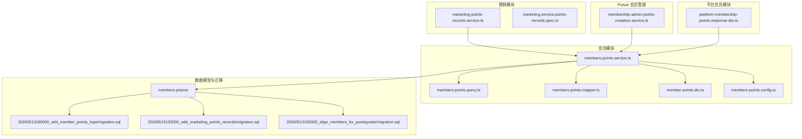
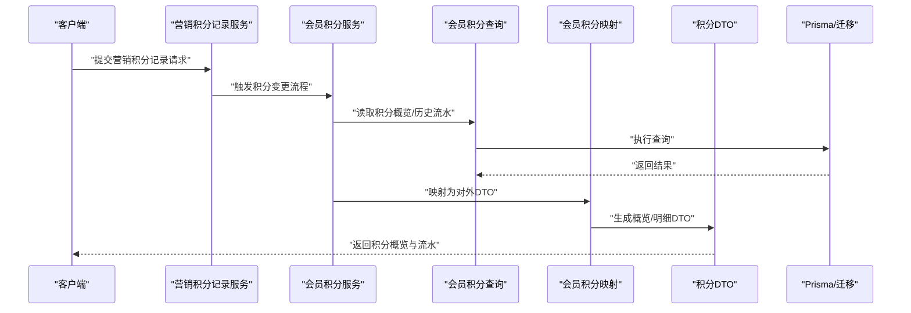
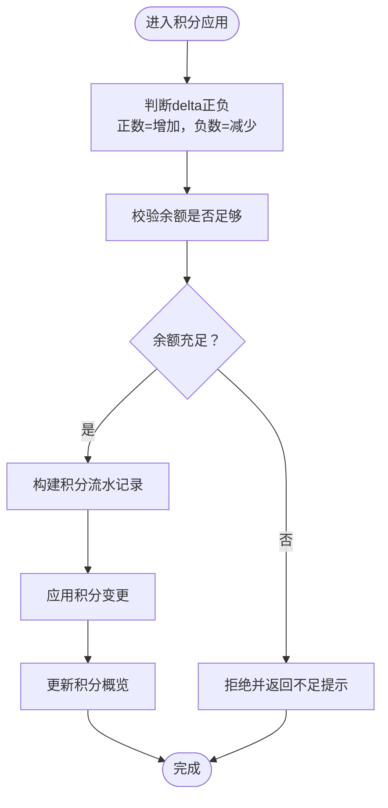
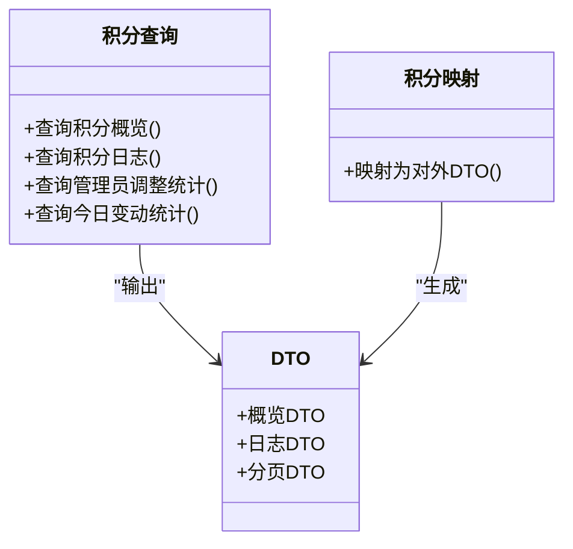
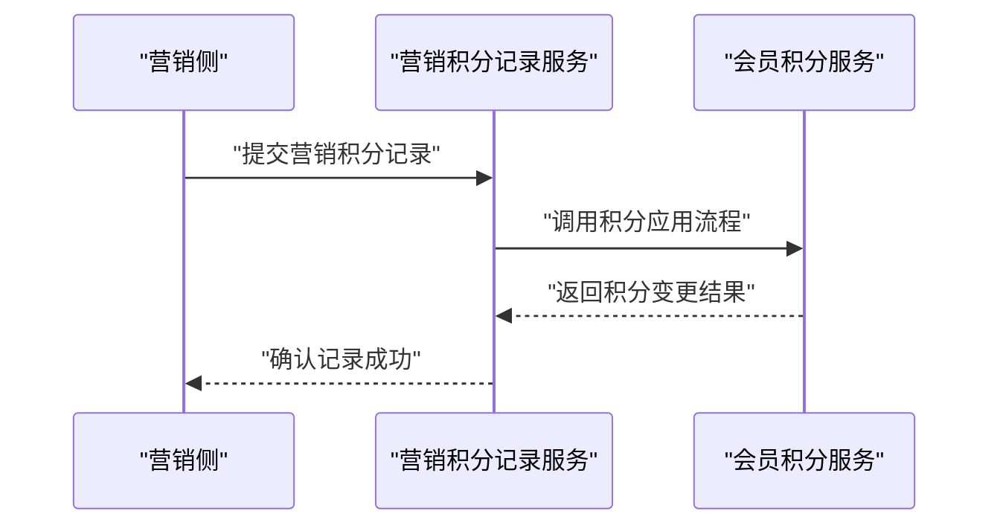
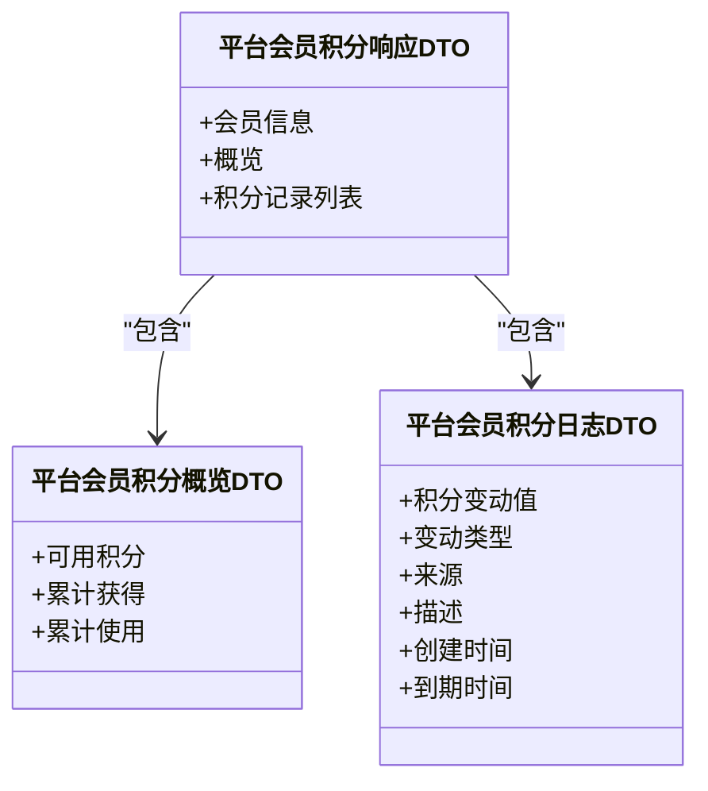
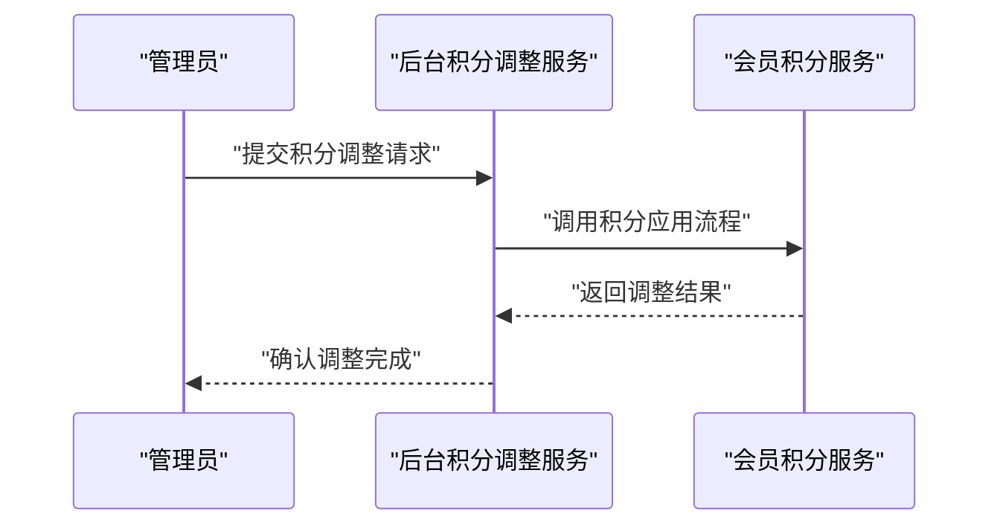
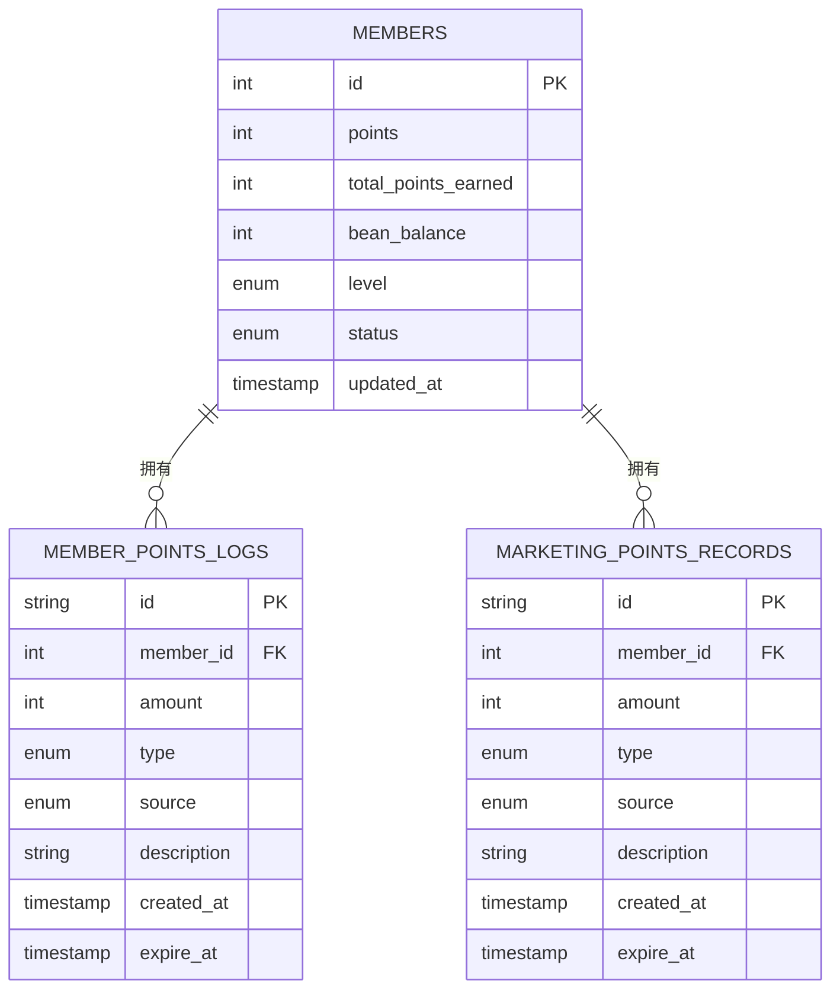
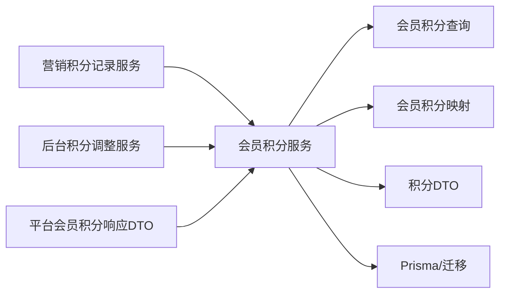

# 积分管理

<cite>
**本文引用的文件**
- [marketing-points-records.service.ts](file://src/purely-profit/marketing/marketing-points-records.service.ts)
- [marketing.service.points-records.spec.ts](file://src/purely-profit/marketing/marketing.service.points-records.spec.ts)
- [member-points.dto.ts](file://src/purely-profit/member/members/dto/member-points.dto.ts)
- [members-points.config.ts](file://src/purely-profit/member/members/members-points.config.ts)
- [members-points.mapper.ts](file://src/purely-profit/member/members/members-points.mapper.ts)
- [members-points.query.ts](file://src/purely-profit/member/members/members-points.query.ts)
- [members-points.service.ts](file://src/purely-profit/member/members/members-points.service.ts)
- [platform-membership-points.response.dto.ts](file://src/purely-profit/member/platform-membership/dto/platform-membership-points.response.dto.ts)
- [membership-admin-points-mutation.service.ts](file://src/purely-pulse/membership/membership-admin-points-mutation.service.ts)
- [members.prisma](file://prisma/purely-profit/member/members.prisma)
- [20260513180000_add_member_points_logs/migration.sql](file://prisma/migrations/20260513180000_add_member_points_logs/migration.sql)
- [20260515133000_add_marketing_points_records/migration.sql](file://prisma/migrations/20260515133000_add_marketing_points_records/migration.sql)
- [20260513193000_align_members_for_purelypulse/migration.sql](file://prisma/migrations/20260513193000_align_members_for_purelypulse/migration.sql)
</cite>

## 目录
1. [简介](#简介)
2. [项目结构](#项目结构)
3. [核心组件](#核心组件)
4. [架构总览](#架构总览)
5. [详细组件分析](#详细组件分析)
6. [依赖关系分析](#依赖关系分析)
7. [性能考量](#性能考量)
8. [故障排查指南](#故障排查指南)
9. [结论](#结论)
10. [附录](#附录)

## 简介
本文件面向营销积分管理功能，系统性阐述积分获取规则、积分使用记录、积分余额统计、积分计算算法、积分有效期管理、积分兑换规则等核心业务逻辑，并覆盖积分查询、积分报表、积分异常处理等管理功能。同时提供积分预测分析、积分使用率统计、积分营销效果评估等高级特性建议与实现路径，以及具体的积分管理 API 示例、积分规则配置与业务场景演示。

## 项目结构
积分管理模块主要分布在以下位置：
- 营销模块：营销积分记录服务与相关测试
- 会员模块：会员积分领域服务、查询、映射、DTO、配置
- 平台会员模块：平台会员积分响应 DTO
- Pulsar 会员管理：后台积分调整服务
- Prisma 模型与迁移：会员表、积分流水、营销积分记录等

图表来源
- [marketing-points-records.service.ts](file://src/purely-profit/marketing/marketing-points-records.service.ts)
- [members-points.service.ts](file://src/purely-profit/member/members/members-points.service.ts)
- [members-points.query.ts](file://src/purely-profit/member/members/members-points.query.ts)
- [members-points.mapper.ts](file://src/purely-profit/member/members/members-points.mapper.ts)
- [member-points.dto.ts](file://src/purely-profit/member/members/dto/member-points.dto.ts)
- [members-points.config.ts](file://src/purely-profit/member/members/members-points.config.ts)
- [platform-membership-points.response.dto.ts](file://src/purely-profit/member/platform-membership/dto/platform-membership-points.response.dto.ts)
- [membership-admin-points-mutation.service.ts](file://src/purely-pulse/membership/membership-admin-points-mutation.service.ts)
- [members.prisma](file://prisma/purely-profit/member/members.prisma)
- [20260513180000_add_member_points_logs/migration.sql](file://prisma/migrations/20260513180000_add_member_points_logs/migration.sql)
- [20260515133000_add_marketing_points_records/migration.sql](file://prisma/migrations/20260515133000_add_marketing_points_records/migration.sql)
- [20260513193000_align_members_for_purelypulse/migration.sql](file://prisma/migrations/20260513193000_align_members_for_purelypulse/migration.sql)

章节来源
- [marketing-points-records.service.ts](file://src/purely-profit/marketing/marketing-points-records.service.ts)
- [members-points.service.ts](file://src/purely-profit/member/members/members-points.service.ts)
- [members.prisma](file://prisma/purely-profit/member/members.prisma)

## 核心组件
- 会员积分服务：负责积分余额、积分流水的查询、映射与应用（增减、过期、兑换等）
- 会员积分查询：提供积分概览、日志列表、管理员调整统计等查询能力
- 会员积分映射：将数据库记录映射为对外 DTO
- 会员积分配置：定义积分资产服务的通用配置（概览、日志查询、映射、应用等）
- 营销积分记录服务：营销侧积分流水记录与统计
- 平台会员积分响应 DTO：平台会员维度的积分概览与明细
- 后台积分调整服务：管理员对会员积分进行手动调整
- 数据模型与迁移：会员表、积分流水、营销积分记录等

章节来源
- [members-points.service.ts](file://src/purely-profit/member/members/members-points.service.ts)
- [members-points.query.ts](file://src/purely-profit/member/members/members-points.query.ts)
- [members-points.mapper.ts](file://src/purely-profit/member/members/members-points.mapper.ts)
- [members-points.config.ts](file://src/purely-profit/member/members/members-points.config.ts)
- [marketing-points-records.service.ts](file://src/purely-profit/marketing/marketing-points-records.service.ts)
- [platform-membership-points.response.dto.ts](file://src/purely-profit/member/platform-membership/dto/platform-membership-points.response.dto.ts)
- [membership-admin-points-mutation.service.ts](file://src/purely-pulse/membership/membership-admin-points-mutation.service.ts)
- [members.prisma](file://prisma/purely-profit/member/members.prisma)

## 架构总览
积分管理采用“领域服务 + 查询 + 映射 + 配置 + DTO”的分层设计，结合 Prisma 数据模型与迁移，形成完整的积分生命周期闭环：获取、使用、过期、兑换、查询、报表与管理。

图表来源
- [marketing-points-records.service.ts](file://src/purely-profit/marketing/marketing-points-records.service.ts)
- [members-points.service.ts](file://src/purely-profit/member/members/members-points.service.ts)
- [members-points.query.ts](file://src/purely-profit/member/members/members-points.query.ts)
- [members-points.mapper.ts](file://src/purely-profit/member/members/members-points.mapper.ts)
- [member-points.dto.ts](file://src/purely-profit/member/members/dto/member-points.dto.ts)
- [members.prisma](file://prisma/purely-profit/member/members.prisma)

## 详细组件分析

### 会员积分服务与配置
- 服务职责：封装积分余额、积分流水的读写与应用逻辑；支持管理员调整、积分过期、兑换等操作
- 配置要点：通过配置对象定义概览查询、日志查询、映射函数、应用函数、权限提示、资产标签、不足提示等
- 关键流程：根据 delta 正负值决定增加或减少；校验余额是否足够；记录流水并更新概览

图表来源
- [members-points.config.ts](file://src/purely-profit/member/members/members-points.config.ts)
- [members-points.service.ts](file://src/purely-profit/member/members/members-points.service.ts)

章节来源
- [members-points.config.ts](file://src/purely-profit/member/members/members-points.config.ts)
- [members-points.service.ts](file://src/purely-profit/member/members/members-points.service.ts)

### 会员积分查询与映射
- 查询：提供积分概览、日志列表、管理员调整统计、今日变动统计等查询接口
- 映射：将数据库记录映射为对外 DTO，包括积分变动值、类型、来源、描述、创建时间、到期时间等
- 分页与权限：支持分页、权限控制与禁止访问提示

图表来源
- [members-points.query.ts](file://src/purely-profit/member/members/members-points.query.ts)
- [members-points.mapper.ts](file://src/purely-profit/member/members/members-points.mapper.ts)
- [member-points.dto.ts](file://src/purely-profit/member/members/dto/member-points.dto.ts)

章节来源
- [members-points.query.ts](file://src/purely-profit/member/members/members-points.query.ts)
- [members-points.mapper.ts](file://src/purely-profit/member/members/members-points.mapper.ts)
- [member-points.dto.ts](file://src/purely-profit/member/members/dto/member-points.dto.ts)

### 营销积分记录服务
- 职责：记录营销活动产生的积分流水，支持营销侧的积分统计与分析
- 测试：提供单元测试用例，验证积分记录的正确性与边界条件

图表来源
- [marketing-points-records.service.ts](file://src/purely-profit/marketing/marketing-points-records.service.ts)
- [marketing.service.points-records.spec.ts](file://src/purely-profit/marketing/marketing.service.points-records.spec.ts)

章节来源
- [marketing-points-records.service.ts](file://src/purely-profit/marketing/marketing-points-records.service.ts)
- [marketing.service.points-records.spec.ts](file://src/purely-profit/marketing/marketing.service.points-records.spec.ts)

### 平台会员积分响应 DTO
- 提供平台会员维度的积分概览与明细，包括可用积分、累计获得、累计使用、积分记录列表等
- 支持积分到期时间字段，便于前端展示与过期提醒

图表来源
- [platform-membership-points.response.dto.ts](file://src/purely-profit/member/platform-membership/dto/platform-membership-points.response.dto.ts)

章节来源
- [platform-membership-points.response.dto.ts](file://src/purely-profit/member/platform-membership/dto/platform-membership-points.response.dto.ts)

### 后台积分调整服务
- 职责：管理员对会员积分进行手动调整（增加或减少），记录调整原因与操作人
- 应用：通过会员积分服务的应用流程完成调整并生成对应流水

图表来源
- [membership-admin-points-mutation.service.ts](file://src/purely-pulse/membership/membership-admin-points-mutation.service.ts)
- [members-points.service.ts](file://src/purely-profit/member/members/members-points.service.ts)

章节来源
- [membership-admin-points-mutation.service.ts](file://src/purely-pulse/membership/membership-admin-points-mutation.service.ts)
- [members-points.service.ts](file://src/purely-profit/member/members/members-points.service.ts)

### 数据模型与迁移
- 会员模型：包含积分、累计获得积分、贝宝余额、状态等字段
- 积分流水：记录积分变动类型、来源、描述、创建时间、到期时间等
- 营销积分记录：营销侧积分流水记录
- 迁移：确保模型演进与索引优化，支持查询与统计

图表来源
- [members.prisma](file://prisma/purely-profit/member/members.prisma)
- [20260513180000_add_member_points_logs/migration.sql](file://prisma/migrations/20260513180000_add_member_points_logs/migration.sql)
- [20260515133000_add_marketing_points_records/migration.sql](file://prisma/migrations/20260515133000_add_marketing_points_records/migration.sql)
- [20260513193000_align_members_for_purelypulse/migration.sql](file://prisma/migrations/20260513193000_align_members_for_purelypulse/migration.sql)

章节来源
- [members.prisma](file://prisma/purely-profit/member/members.prisma)
- [20260513180000_add_member_points_logs/migration.sql](file://prisma/migrations/20260513180000_add_member_points_logs/migration.sql)
- [20260515133000_add_marketing_points_records/migration.sql](file://prisma/migrations/20260515133000_add_marketing_points_records/migration.sql)
- [20260513193000_align_members_for_purelypulse/migration.sql](file://prisma/migrations/20260513193000_align_members_for_purelypulse/migration.sql)

## 依赖关系分析
- 会员积分服务依赖查询与映射模块，通过配置对象统一管理应用流程
- 营销积分记录服务依赖会员积分服务以完成积分应用
- 平台会员积分响应 DTO 作为对外接口的一部分，被上层控制器使用
- 后台积分调整服务通过会员积分服务完成管理员操作
- 数据模型与迁移为所有积分相关功能提供持久化基础

图表来源
- [marketing-points-records.service.ts](file://src/purely-profit/marketing/marketing-points-records.service.ts)
- [members-points.service.ts](file://src/purely-profit/member/members/members-points.service.ts)
- [members-points.query.ts](file://src/purely-profit/member/members/members-points.query.ts)
- [members-points.mapper.ts](file://src/purely-profit/member/members/members-points.mapper.ts)
- [member-points.dto.ts](file://src/purely-profit/member/members/dto/member-points.dto.ts)
- [membership-admin-points-mutation.service.ts](file://src/purely-pulse/membership/membership-admin-points-mutation.service.ts)
- [platform-membership-points.response.dto.ts](file://src/purely-profit/member/platform-membership/dto/platform-membership-points.response.dto.ts)
- [members.prisma](file://prisma/purely-profit/member/members.prisma)

章节来源
- [marketing-points-records.service.ts](file://src/purely-profit/marketing/marketing-points-records.service.ts)
- [members-points.service.ts](file://src/purely-profit/member/members/members-points.service.ts)
- [members-points.query.ts](file://src/purely-profit/member/members/members-points.query.ts)
- [members-points.mapper.ts](file://src/purely-profit/member/members/members-points.mapper.ts)
- [member-points.dto.ts](file://src/purely-profit/member/members/dto/member-points.dto.ts)
- [membership-admin-points-mutation.service.ts](file://src/purely-pulse/membership/membership-admin-points-mutation.service.ts)
- [platform-membership-points.response.dto.ts](file://src/purely-profit/member/platform-membership/dto/platform-membership-points.response.dto.ts)
- [members.prisma](file://prisma/purely-profit/member/members.prisma)

## 性能考量
- 查询优化：利用索引与分页，避免一次性加载大量积分流水
- 批量处理：在批量积分调整或过期处理时，采用事务与批量写入降低锁竞争
- 缓存策略：对高频查询（如积分概览）可引入缓存，注意过期与一致性
- 异步任务：积分过期、报表统计等可异步执行，减轻主流程压力

## 故障排查指南
- 权限问题：若提示无权查看积分记录概览或日志，检查配置中的禁止访问消息与权限校验
- 余额不足：当积分不足时，服务会返回相应提示，需检查 delta 与当前余额
- 数据不一致：核对积分流水与概览更新是否在同一事务中完成
- 过期未生效：检查到期时间字段与过期逻辑是否正确执行

章节来源
- [members-points.config.ts](file://src/purely-profit/member/members/members-points.config.ts)
- [members-points.service.ts](file://src/purely-profit/member/members/members-points.service.ts)

## 结论
积分管理模块通过清晰的分层设计与完善的配置机制，实现了从积分获取、使用、过期到兑换与查询的全生命周期管理。配合平台会员维度的响应 DTO、后台管理与营销侧记录，能够满足日常运营与高级分析需求。建议在生产环境中进一步完善缓存、异步任务与监控告警体系，以提升稳定性与可维护性。

## 附录

### 积分计算算法与业务规则
- 基础算法：余额 = 余额 + delta（delta 为正表示获得，负表示使用/过期）
- 兑换规则：需校验余额是否足够，不足则拒绝
- 有效期管理：记录 expireAt 字段，到期后标记为不可用
- 统计口径：累计获得 = total_points_earned，累计使用 = 已使用/扣减

章节来源
- [member-points.dto.ts](file://src/purely-profit/member/members/dto/member-points.dto.ts)
- [members.prisma](file://prisma/purely-profit/member/members.prisma)

### 积分查询与报表
- 查询接口：积分概览、积分日志、管理员调整统计、今日变动统计
- 报表维度：按来源、类型、时间区间、会员等级等聚合统计
- 导出能力：支持导出积分流水与统计结果

章节来源
- [members-points.query.ts](file://src/purely-profit/member/members/members-points.query.ts)
- [members-points.mapper.ts](file://src/purely-profit/member/members/members-points.mapper.ts)

### 积分预测分析与使用率统计
- 预测分析：基于历史流水趋势，预测未来一段时间的积分流入与流出
- 使用率统计：使用/累计获得 × 100%，结合来源与类型进行交叉分析
- 营销效果评估：对比营销活动前后的积分获取与使用变化，评估ROI

章节来源
- [marketing-points-records.service.ts](file://src/purely-profit/marketing/marketing-points-records.service.ts)
- [members-points.query.ts](file://src/purely-profit/member/members/members-points.query.ts)

### 积分管理 API 示例（路径指引）
- 获取平台会员积分概览与明细：[platform-membership-points.response.dto.ts](file://src/purely-profit/member/platform-membership/dto/platform-membership-points.response.dto.ts)
- 会员积分概览与日志查询：[members-points.query.ts](file://src/purely-profit/member/members/members-points.query.ts)
- 会员积分调整（管理员）：[membership-admin-points-mutation.service.ts](file://src/purely-pulse/membership/membership-admin-points-mutation.service.ts)
- 营销积分记录：[marketing-points-records.service.ts](file://src/purely-profit/marketing/marketing-points-records.service.ts)

### 积分规则配置与业务场景演示
- 规则配置：通过配置对象统一管理概览、日志、映射与应用流程
- 场景示例：
  - 购物返积分：来源 purchase_bonus，类型 earn
  - 积分抵扣：来源 deduct_payment，类型 decrease
  - 管理员补发：来源 admin_adjust，类型 increase
  - 积分过期：来源 expire，类型 decrease

章节来源
- [members-points.config.ts](file://src/purely-profit/member/members/members-points.config.ts)
- [members.prisma](file://prisma/purely-profit/member/members.prisma)