# 营销推广模块

<cite>
**本文档引用的文件**
- [marketing.module.ts](file://src/purely-profit/marketing/marketing.module.ts)
- [marketing.domain.ts](file://src/purely-profit/marketing/marketing.domain.ts)
- [marketing.controller.ts](file://src/purely-profit/marketing/marketing.controller.ts)
- [marketing-customers.controller.ts](file://src/purely-profit/marketing/marketing-customers.controller.ts)
- [marketing-promotions.controller.ts](file://src/purely-profit/marketing/marketing-promotions.controller.ts)
- [marketing-products.controller.ts](file://src/purely-profit/marketing/marketing-products.controller.ts)
- [marketing-transactions.controller.ts](file://src/purely-profit/marketing/marketing-transactions.controller.ts)
- [marketing-overview.controller.ts](file://src/purely-profit/marketing/marketing-overview.controller.ts)
- [marketing-product-categories.controller.ts](file://src/purely-profit/marketing/marketing-product-categories.controller.ts)
- [marketing-customers.service.ts](file://src/purely-profit/marketing/marketing-customers.service.ts)
- [marketing-promotions.service.ts](file://src/purely-profit/marketing/marketing-promotions.service.ts)
- [marketing-products.service.ts](file://src/purely-profit/marketing/marketing-products.service.ts)
- [marketing-consumptions.service.ts](file://src/purely-profit/marketing/marketing-consumptions.service.ts)
- [marketing-recharges.service.ts](file://src/purely-profit/marketing/marketing-recharges.service.ts)
- [marketing-points-records.service.ts](file://src/purely-profit/marketing/marketing-points-records.service.ts)
- [marketing-facade.service.ts](file://src/purely-profit/marketing/marketing-facade.service.ts)
- [marketing-overview.facade.service.ts](file://src/purely-profit/marketing/marketing-overview.facade.service.ts)
- [marketing-products.facade.service.ts](file://src/purely-profit/marketing/marketing-products.facade.service.ts)
- [marketing-customers.facade.service.ts](file://src/purely-profit/marketing/marketing-customers.facade.service.ts)
- [marketing-promotions.facade.service.ts](file://src/purely-profit/marketing/marketing-promotions.facade.service.ts)
- [marketing-transactions.facade.service.ts](file://src/purely-profit/marketing/marketing-transactions.facade.service.ts)
- [marketing.types.ts](file://src/purely-profit/marketing/marketing.types.ts)
- [marketing.mapper.ts](file://src/purely-profit/marketing/marketing.mapper.ts)
- [marketing.query.ts](file://src/purely-profit/marketing/marketing.query.ts)
- [marketing-access.service.ts](file://src/purely-profit/marketing/marketing-access.service.ts)
- [marketing-shared.service.ts](file://src/purely-profit/marketing/marketing-shared.service.ts)
- [marketing.utils.ts](file://src/purely-profit/marketing/marketing.utils.ts)
- [promotion-params.schema.ts](file://src/purely-profit/marketing/schemas/promotion-params.schema.ts)
- [member-level-settings.schema.ts](file://src/purely-profit/marketing/schemas/member-level-settings.schema.ts)
- [marketing-overview.service.ts](file://src/purely-profit/marketing/marketing-overview.service.ts)
- [marketing.cache-keys.ts](file://src/redis/keys/marketing.cache-keys.ts)
- [cache-prewarm-marketing-overview.provider.ts](file://src/redis/cache-prewarm-marketing-overview.provider.ts)
- [20260613140000_add_points_activity_and_discount_day_types/migration.sql](file://prisma/migrations/20260613140000_add_points_activity_and_discount_day_types/migration.sql)
- [20260629120000_add_promotion_display_text/migration.sql](file://prisma/migrations/20260629120000_add_promotion_display_text/migration.sql)
</cite>

## 更新摘要
**所做更改**
- 引入基于Zod的促销参数验证系统，为所有促销类型提供严格的类型检查和数据规范化处理
- 新增会员等级配置Zod schema验证，支持安全的读写操作和默认值兜底机制
- 增强营销概览功能，集成会员等级配置管理和积分规则动态控制
- 实现展示文案预计算存储，确保前后端展示一致性
- 优化金额字段转换机制，支持元分和单位的精确处理

## 目录
1. [简介](#简介)
2. [项目结构](#项目结构)
3. [核心组件](#核心组件)
4. [架构总览](#架构总览)
5. [详细组件分析](#详细组件分析)
6. [Zod模式验证系统](#zod模式验证系统)
7. [会员等级配置管理](#会员等级配置管理)
8. [营销概览增强功能](#营销概览增强功能)
9. [展示文案预计算机制](#展示文案预计算机制)
10. [金额字段处理优化](#金额字段处理优化)
11. [依赖分析](#依赖分析)
12. [性能考虑](#性能考虑)
13. [故障排除指南](#故障排除指南)
14. [结论](#结论)
15. [附录](#附录)

## 简介
营销推广模块是企业级商业系统中的核心增长引擎，负责构建完整的客户生命周期管理体系与营销闭环。该模块以"客户为中心"的设计理念，整合了客户管理、促销活动、营销产品、消费记录、积分与充值等多个子域，形成从获客到留存、从促活到转化的全链路营销能力。

模块采用分层架构设计，通过控制器-服务-门面-领域模型的分层组织，确保业务逻辑清晰、可测试性强。同时，模块深度集成会员体系、商品体系与销售记录，实现跨模块的数据协同与业务联动。

**更新** 本次更新重点引入了基于Zod的模式验证系统，为所有促销活动参数提供严格的类型检查；新增了会员等级配置的schema验证；增强了营销概览功能的会员等级管理能力；实现了展示文案的预计算存储机制；优化了金额字段的处理逻辑。

## 项目结构
营销模块在代码层面采用按功能域划分的组织方式，每个核心功能都有独立的控制器、服务、门面和数据访问层：

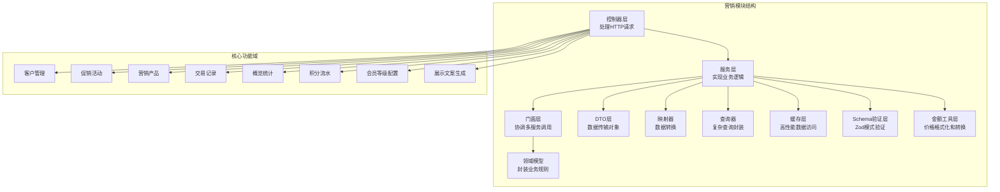

**图表来源**
- [marketing.module.ts](file://src/purely-profit/marketing/marketing.module.ts)
- [marketing.controller.ts](file://src/purely-profit/marketing/marketing.controller.ts)

**章节来源**
- [marketing.module.ts](file://src/purely-profit/marketing/marketing.module.ts)
- [marketing.controller.ts](file://src/purely-profit/marketing/marketing.controller.ts)

## 核心组件
营销模块由十个主要功能域构成，每个功能域都包含完整的CRUD操作和业务逻辑：

### 客户管理域
负责客户信息的全生命周期管理，包括基础信息维护、标签分类、等级管理、积分消费等核心功能。

### 促销活动域  
提供灵活的促销策略配置，支持多种促销类型（满减、折扣、赠品、积分充值、每日折扣等），具备活动状态管理、库存控制、参与条件设置等功能。

**更新** 引入了全面的Zod模式验证系统，为所有促销类型提供严格的数据验证和规范化处理，防止运行时无效促销配置。

### 营销产品域
管理营销推广所需的产品资源，包括产品分类、价格策略、库存管理、上下架控制等，支撑精准营销的物料准备。

### 交易记录域
记录所有与营销相关的消费行为，包括购买记录、积分兑换、充值记录等，为营销效果分析提供数据基础。

### 积分流水域
记录所有营销相关的积分变动历史，包括管理员调整、消费抵扣、活动奖励等各类积分流水，为积分审计和分析提供完整数据支持。

### 概览统计域
提供营销整体数据的汇总分析，包括销售额、客流量、转化率、ROI等关键指标的实时展示。

**更新** 营销概览功能得到全面增强，集成了会员等级配置管理和积分规则动态控制，提供更丰富的数据分析能力。

### Schema验证域
**新增** 基于Zod的模式验证系统，为营销活动参数提供严格的类型检查、数据验证和规范化处理，确保数据的一致性和安全性。

### 权限控制域
通过细粒度的权限管理，确保不同角色只能访问相应的营销功能，保障数据安全与业务合规。

### 价格格式化域
实现了完整的价格显示格式化和验证机制，支持字符串格式的价格输入并转换为内部cent值存储，确保价格数据的精确性和一致性。

### 展示文案生成域
**新增** 实现了促销展示文案的预计算和存储机制，根据促销类型和参数自动生成标准化的前端展示文案，确保前后端展示的一致性。

**章节来源**
- [marketing-customers.service.ts](file://src/purely-profit/marketing/marketing-customers.service.ts)
- [marketing-promotions.service.ts](file://src/purely-profit/marketing/marketing-promotions.service.ts)
- [marketing-products.service.ts](file://src/purely-profit/marketing/marketing-products.service.ts)
- [marketing-consumptions.service.ts](file://src/purely-profit/marketing/marketing-consumptions.service.ts)
- [marketing-recharges.service.ts](file://src/purely-profit/marketing/marketing-recharges.service.ts)
- [marketing-points-records.service.ts](file://src/purely-profit/marketing/marketing-points-records.service.ts)
- [promotion-params.schema.ts](file://src/purely-profit/marketing/schemas/promotion-params.schema.ts)
- [member-level-settings.schema.ts](file://src/purely-profit/marketing/schemas/member-level-settings.schema.ts)
- [marketing-overview.service.ts](file://src/purely-profit/marketing/marketing-overview.service.ts)
- [marketing.mapper.ts](file://src/purely-profit/marketing/marketing.mapper.ts)

## 架构总览
营销模块采用典型的三层架构模式，通过依赖注入实现松耦合设计：

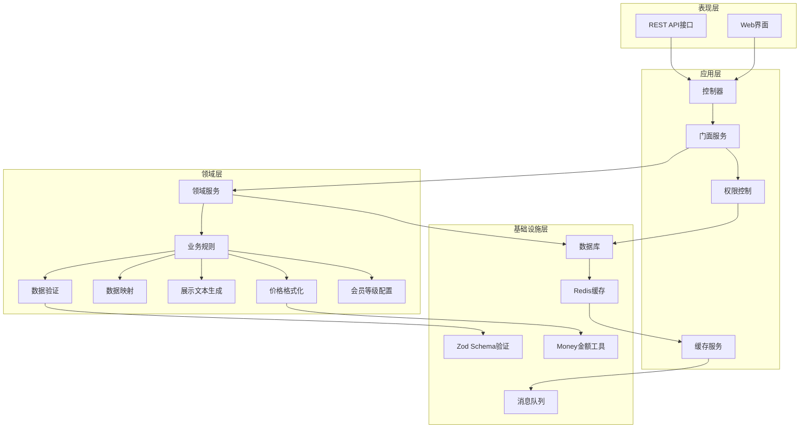

**图表来源**
- [marketing.module.ts](file://src/purely-profit/marketing/marketing.module.ts)
- [marketing-access.service.ts](file://src/purely-profit/marketing/marketing-access.service.ts)

**章节来源**
- [marketing.domain.ts](file://src/purely-profit/marketing/marketing.domain.ts)
- [marketing-access.service.ts](file://src/purely-profit/marketing/marketing-access.service.ts)

## 详细组件分析

### 促销活动组件分析
促销活动模块提供灵活的营销策略配置，支持多种促销类型和复杂的参与条件。

**更新** 引入了全面的Zod模式验证系统，为所有促销类型提供严格的数据验证和规范化处理。

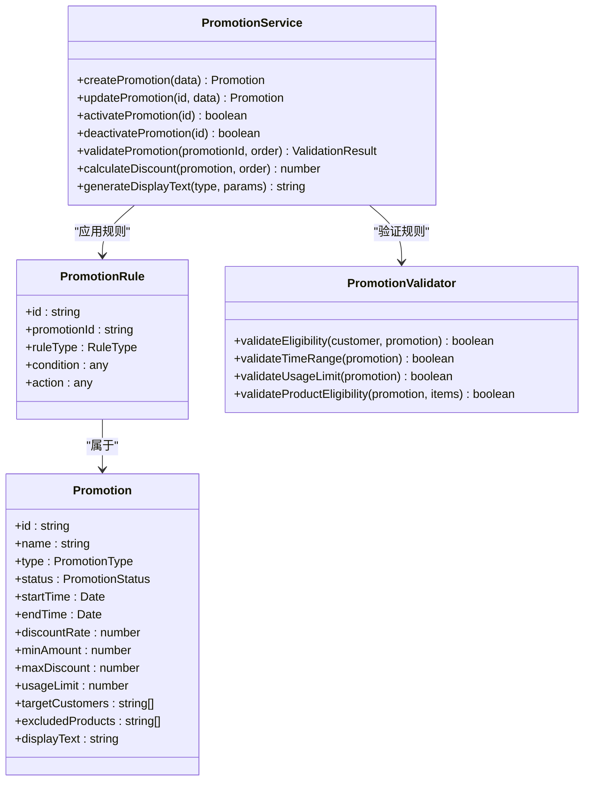

**图表来源**
- [marketing-promotions.service.ts](file://src/purely-profit/marketing/marketing-promotions.service.ts)
- [marketing-promotions.facade.service.ts](file://src/purely-profit/marketing/marketing-promotions.facade.service.ts)
- [marketing.mapper.ts](file://src/purely-profit/marketing/marketing.mapper.ts)

#### 促销活动执行流程

**图表来源**
- [marketing-promotions.service.ts](file://src/purely-profit/marketing/marketing-promotions.service.ts)
- [marketing.mapper.ts](file://src/purely-profit/marketing/marketing.mapper.ts)

**章节来源**
- [marketing-promotions.controller.ts](file://src/purely-profit/marketing/marketing-promotions.controller.ts)
- [marketing-promotions.service.ts](file://src/purely-profit/marketing/marketing-promotions.service.ts)
- [marketing-promotions.facade.service.ts](file://src/purely-profit/marketing/marketing-promotions.facade.service.ts)

### 营销产品组件分析
营销产品模块管理推广所需的各类产品资源，支持产品分类、定价策略和库存控制。

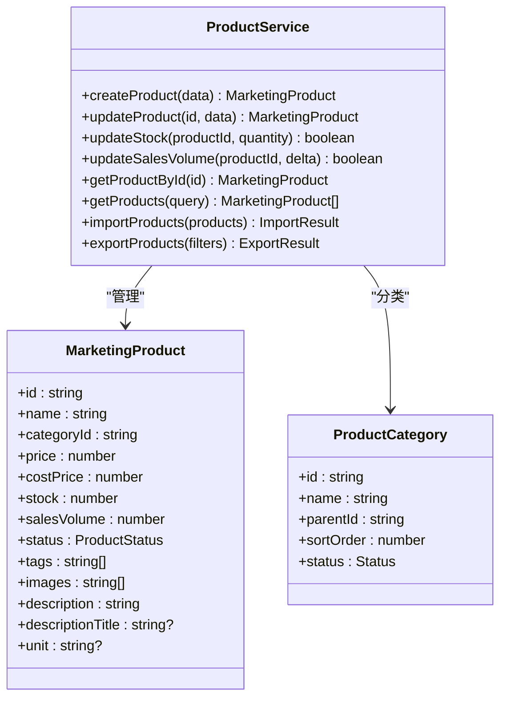

**图表来源**
- [marketing-products.service.ts](file://src/purely-profit/marketing/marketing-products.service.ts)
- [marketing-products.facade.service.ts](file://src/purely-profit/marketing/marketing-products.facade.service.ts)

**章节来源**
- [marketing-products.controller.ts](file://src/purely-profit/marketing/marketing-products.controller.ts)
- [marketing-products.service.ts](file://src/purely-profit/marketing/marketing-products.service.ts)
- [marketing-products.facade.service.ts](file://src/purely-profit/marketing/marketing-products.facade.service.ts)

### 交易记录组件分析
交易记录模块完整追踪所有营销相关的消费行为，为营销效果分析提供数据基础。

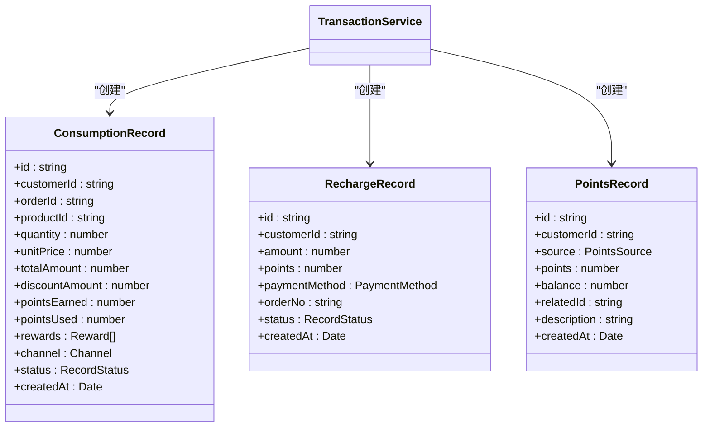

**图表来源**
- [marketing-consumptions.service.ts](file://src/purely-profit/marketing/marketing-consumptions.service.ts)
- [marketing-recharges.service.ts](file://src/purely-profit/marketing/marketing-recharges.service.ts)
- [marketing-points-records.service.ts](file://src/purely-profit/marketing/marketing-points-records.service.ts)

**章节来源**
- [marketing-transactions.controller.ts](file://src/purely-profit/marketing/marketing-transactions.controller.ts)
- [marketing-consumptions.service.ts](file://src/purely-profit/marketing/marketing-consumptions.service.ts)
- [marketing-recharges.service.ts](file://src/purely-profit/marketing/marketing-recharges.service.ts)
- [marketing-points-records.service.ts](file://src/purely-profit/marketing/marketing-points-records.service.ts)

### 概览统计组件分析
概览统计模块提供营销整体数据的汇总分析，支持实时监控和趋势分析。

**更新** 集成了会员等级配置管理和积分规则动态控制功能。

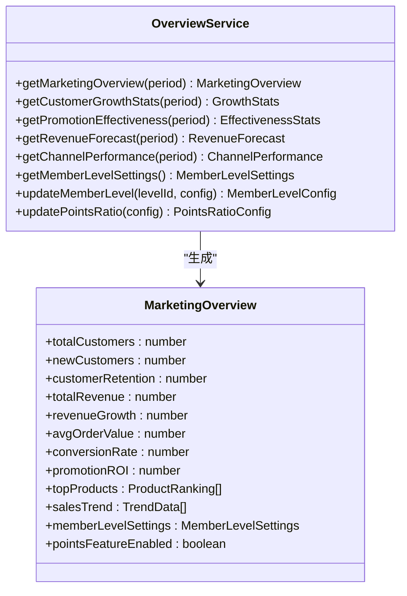

**图表来源**
- [marketing-overview.service.ts](file://src/purely-profit/marketing/marketing-overview.service.ts)
- [marketing-overview.facade.service.ts](file://src/purely-profit/marketing/marketing-overview.facade.service.ts)

**章节来源**
- [marketing-overview.controller.ts](file://src/purely-profit/marketing/marketing-overview.controller.ts)
- [marketing-overview.service.ts](file://src/purely-profit/marketing/marketing-overview.service.ts)
- [marketing-overview.facade.service.ts](file://src/purely-profit/marketing/marketing-overview.facade.service.ts)

## Zod模式验证系统

### 验证系统架构
营销模块引入了基于Zod的全面模式验证系统，为所有促销活动参数提供严格的类型检查和数据规范化处理。

**更新** 新增的Zod验证系统包括：
- **类型安全**：为每种促销类型定义独立的Zod schema
- **数据验证**：严格的参数验证和范围检查
- **格式转换**：自动的参数格式化和标准化
- **向后兼容**：支持新旧参数格式的自动转换

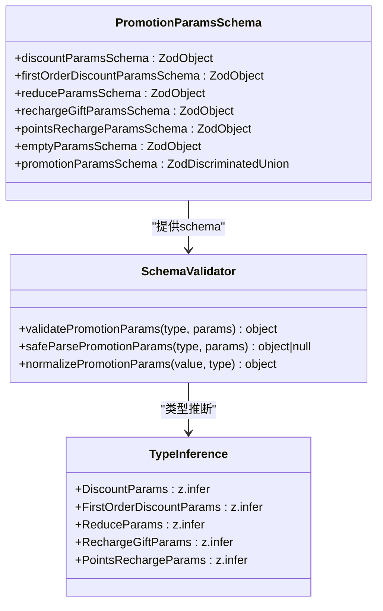

**图表来源**
- [promotion-params.schema.ts](file://src/purely-profit/marketing/schemas/promotion-params.schema.ts)

### 验证流程设计

**图表来源**
- [promotion-params.schema.ts](file://src/purely-profit/marketing/schemas/promotion-params.schema.ts)

### 各类型验证规则
系统为每种促销类型定义了详细的验证规则：

**更新** 各类型的验证规则详情：
- **折扣类型**：discountRate必须为1-99的整数，rate必须为0.01-0.99的小数，二者至少提供一个
- **满减类型**：threshold和reduceAmount必须为正数，支持小数元单位
- **充值赠送**：gradients数组至少包含一个梯度，支持giftAmount或giftRatio
- **首单优惠**：discountRate或rate至少提供一个，可选audience字段
- **积分充值**：rechargeRatioPercent或pointsRatio为正数
- **空参数类型**：free和points_2x类型接受空对象或仅banner字段

**章节来源**
- [promotion-params.schema.ts](file://src/purely-profit/marketing/schemas/promotion-params.schema.ts)

## 会员等级配置管理

### 配置验证系统
会员等级配置管理模块提供了完整的Zod schema验证，确保会员等级配置的安全性和一致性。

**更新** 新增的会员等级配置验证系统包括：
- **等级配置验证**：严格的会员等级配置schema验证
- **积分规则验证**：积分兑换和获取规则的schema验证
- **默认值兜底**：配置验证失败时自动回退到默认值
- **并发保护**：使用数据库事务和锁机制保证配置更新的原子性

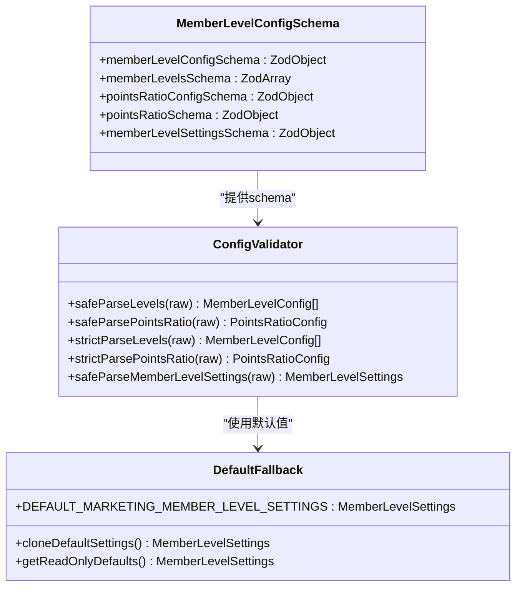

**图表来源**
- [member-level-settings.schema.ts](file://src/purely-profit/marketing/schemas/member-level-settings.schema.ts)

### 配置管理流程
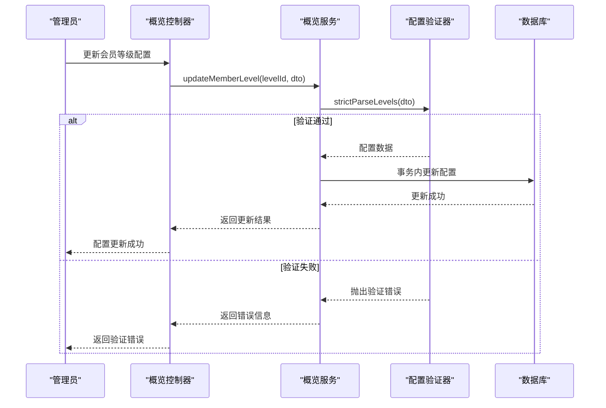

**图表来源**
- [marketing-overview.service.ts](file://src/purely-profit/marketing/marketing-overview.service.ts)

### 配置特性
系统实现了多项会员等级配置特性：

**更新** 配置管理的核心特性：
- **等级门槛校验**：确保铂金等级门槛小于钻石等级门槛
- **百分比转换**：自动处理折扣率百分比和小数的转换
- **描述清理**：自动清理描述中的空白字符
- **状态同步**：有活跃积分活动时强制启用积分功能
- **并发安全**：使用PostgreSQL advisory lock保证配置更新的原子性

**章节来源**
- [member-level-settings.schema.ts](file://src/purely-profit/marketing/schemas/member-level-settings.schema.ts)
- [marketing-overview.service.ts](file://src/purely-profit/marketing/marketing-overview.service.ts)

## 营销概览增强功能

### 概览功能增强
营销模块的概览功能得到全面增强，集成了会员等级配置管理和积分规则动态控制。

**更新** 新增的概览增强功能包括：
- **会员等级配置管理**：支持动态修改会员等级配置和积分规则
- **积分功能开关**：根据活跃积分活动自动控制积分功能状态
- **微信收款配置**：集成微信支付配置信息的展示
- **邀请码管理**：支持门店邀请码的生成和二维码展示
- **缓存预热**：支持营销概览数据的缓存预热机制

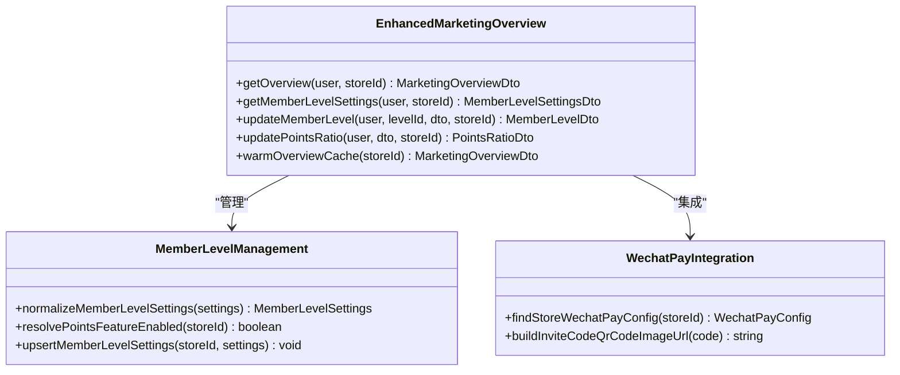

**图表来源**
- [marketing-overview.service.ts](file://src/purely-profit/marketing/marketing-overview.service.ts)
- [marketing-overview.facade.service.ts](file://src/purely-profit/marketing/marketing-overview.facade.service.ts)

### 概览数据增强流程
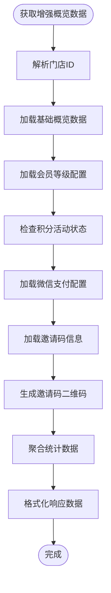

**图表来源**
- [marketing-overview.service.ts](file://src/purely-profit/marketing/marketing-overview.service.ts)

### 缓存预热机制
系统实现了营销概览数据的缓存预热机制，提升系统响应性能。

**更新** 缓存预热的关键特性：
- **定时预热**：支持定时任务预热营销概览数据
- **智能失效**：数据变更时自动清除相关缓存
- **批量预热**：支持按门店维度批量预热缓存
- **监控指标**：提供缓存预热的性能监控指标

**章节来源**
- [marketing-overview.controller.ts](file://src/purely-profit/marketing/marketing-overview.controller.ts)
- [marketing-overview.service.ts](file://src/purely-profit/marketing/marketing-overview.service.ts)
- [marketing-overview.facade.service.ts](file://src/purely-profit/marketing/marketing-overview.facade.service.ts)
- [cache-prewarm-marketing-overview.provider.ts](file://src/redis/cache-prewarm-marketing-overview.provider.ts)

## 展示文案预计算机制

### 文案生成系统
营销模块实现了促销展示文案的预计算和存储机制，确保前后端展示的一致性。

**更新** 新增的展示文案预计算系统包括：
- **多类型支持**：支持折扣、满减、充值赠送、首单优惠、积分充值等多种促销类型
- **智能格式化**：自动处理数字格式、货币单位和文案结构
- **兼容性处理**：支持新旧参数格式的自动转换和兼容
- **预计算存储**：在创建/更新促销时预计算展示文案并存储到数据库

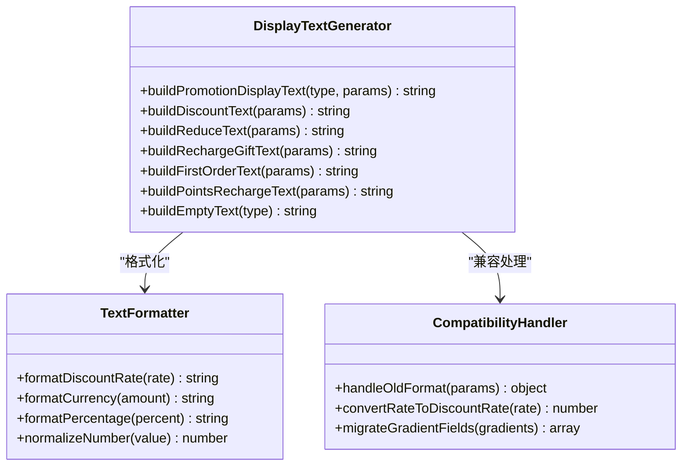

**图表来源**
- [marketing.mapper.ts](file://src/purely-profit/marketing/marketing.mapper.ts)

### 文案生成流程
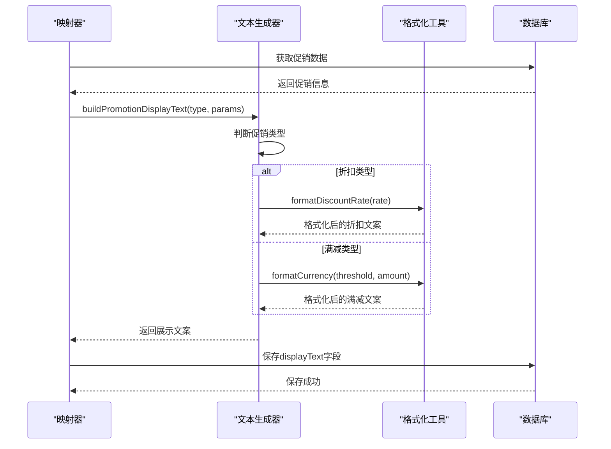

**图表来源**
- [marketing.mapper.ts](file://src/purely-profit/marketing/marketing.mapper.ts)

### 支持的促销类型和文案格式
系统支持以下促销类型的展示文本生成：

**更新** 各类型的具体文案格式：
- **折扣类型**：`打 X 折` 或 `打 X.X 折`（如"打 8 折"、"打 8.5 折"）
- **满减类型**：`满 ¥X 减 ¥Y`（如"满 ¥50 减 ¥8"）
- **充值赠送**：`充 ¥X 赠 ¥Y` 或 `充 ¥X 赠 ¥Y 起`（多档时追加"起"字）
- **首单优惠**：`首单 X.X 折`（如"首单 7.5 折"）
- **积分充值**：`充 ¥100 赠 X 积分`（支持小数点后两位）
- **免单类型**：`免单`
- **双倍积分**：`双倍积分`

**章节来源**
- [marketing.mapper.ts](file://src/purely-profit/marketing/marketing.mapper.ts)

## 金额字段处理优化

### 金额处理机制
营销模块实现了完善的金额字段处理机制，确保元分和单位的正确转换。

**更新** 新增的金额处理功能包括：
- **智能解析**：优先使用Zod schema进行严格验证和解析
- **降级处理**：当Zod验证失败时回退到手写规范化逻辑
- **格式兼容**：支持新旧参数格式的自动转换
- **类型安全**：确保最终输出的数据结构符合预期

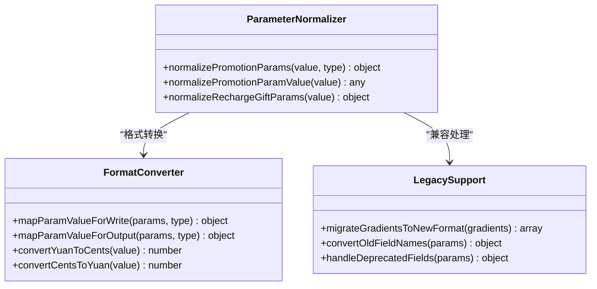

**图表来源**
- [marketing.mapper.ts](file://src/purely-profit/marketing/marketing.mapper.ts)

### 规范化处理流程
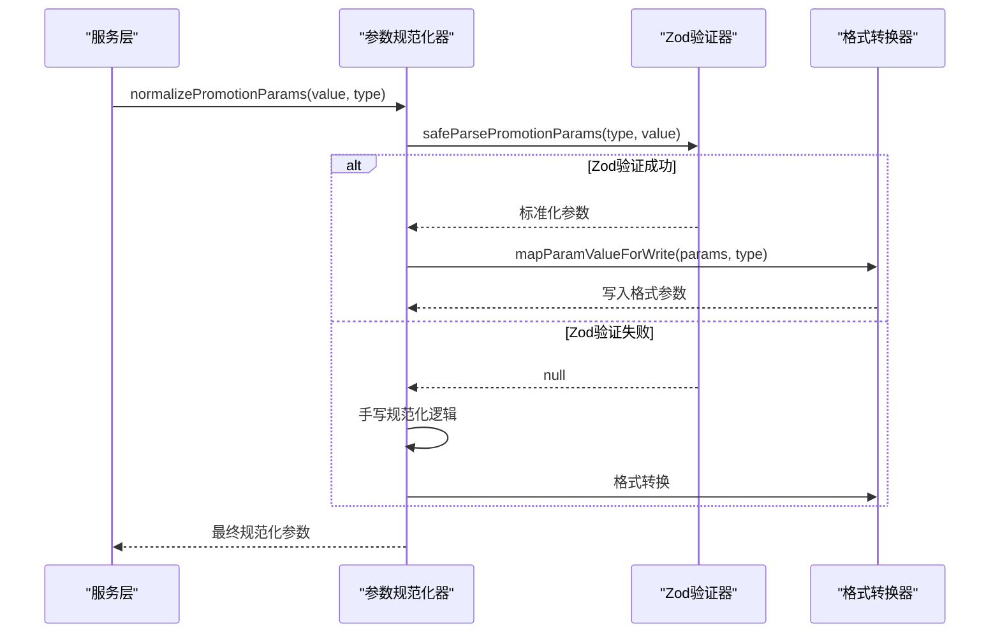

**图表来源**
- [marketing.mapper.ts](file://src/purely-profit/marketing/marketing.mapper.ts)

### 金额字段处理
系统实现了统一的金额字段处理机制，确保元分和单位的正确转换。

**更新** 金额处理的特性：
- **写入转换**：前端输入的元单位自动转换为数据库存储的分单位
- **输出转换**：数据库的分单位自动转换为前端显示的元单位
- **精度保证**：使用Money工具类确保金额计算的精度
- **字段识别**：自动识别需要转换的金额字段名称

**章节来源**
- [marketing.mapper.ts](file://src/purely-profit/marketing/marketing.mapper.ts)

## 依赖分析
营销模块与系统其他模块存在紧密的依赖关系，形成了完整的业务生态：

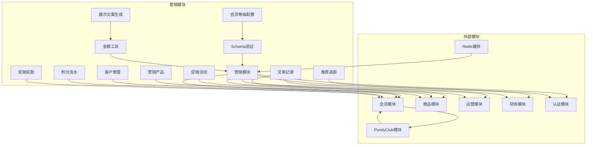

**图表来源**
- [marketing-customers.service.ts](file://src/purely-profit/marketing/marketing-customers.service.ts)
- [marketing-promotions.service.ts](file://src/purely-profit/marketing/marketing-promotions.service.ts)
- [marketing-products.service.ts](file://src/purely-profit/marketing/marketing-products.service.ts)
- [marketing-consumptions.service.ts](file://src/purely-profit/marketing/marketing-consumptions.service.ts)
- [promotion-params.schema.ts](file://src/purely-profit/marketing/schemas/promotion-params.schema.ts)
- [member-level-settings.schema.ts](file://src/purely-profit/marketing/schemas/member-level-settings.schema.ts)
- [marketing-overview.service.ts](file://src/purely-profit/marketing/marketing-overview.service.ts)
- [marketing.mapper.ts](file://src/purely-profit/marketing/marketing.mapper.ts)

### 数据模型关系图
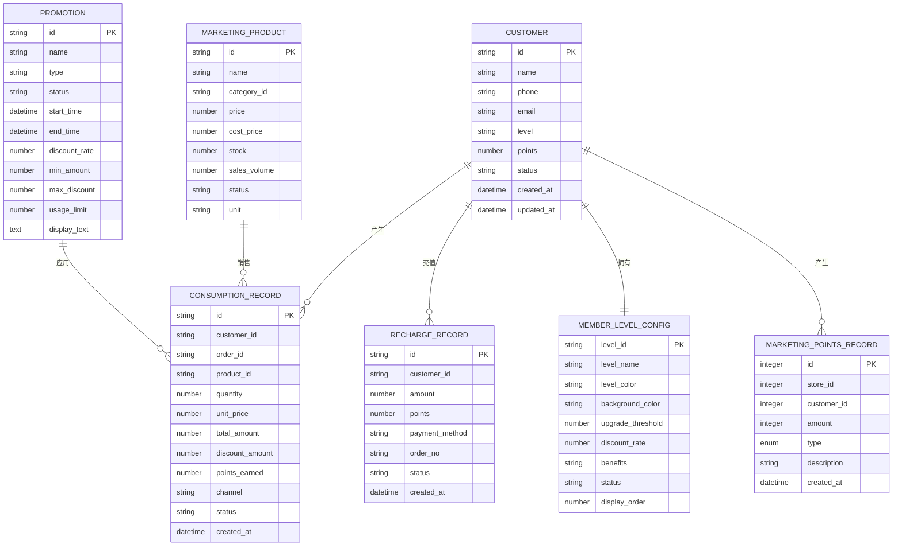

**图表来源**
- [customers.prisma](file://prisma/purely-profit/marketing/customers.prisma)
- [promotions.prisma](file://prisma/purely-profit/marketing/promotions.prisma)
- [products.prisma](file://prisma/purely-profit/marketing/products.prisma)
- [marketing-points-records.prisma](file://prisma/purely-profit/marketing/marketing-points-records.prisma)

**章节来源**
- [marketing.types.ts](file://src/purely-profit/marketing/marketing.types.ts)
- [marketing.mapper.ts](file://src/purely-profit/marketing/marketing.mapper.ts)

## 性能考虑
营销模块在设计时充分考虑了性能优化，采用了多种策略来提升系统响应速度和吞吐量：

### 缓存策略
- **热点数据缓存**：客户积分、促销活动状态、热门产品信息等高频访问数据
- **分页缓存**：列表查询结果按查询条件进行缓存，减少重复查询
- **会话缓存**：用户登录状态和权限信息的短期缓存
- **会员等级缓存**：动态会员等级配置的缓存机制
- **促销类型缓存**：新增促销类型的枚举和配置缓存
- **概览数据缓存**：增强的营销概览数据缓存机制
- **可配置TTL缓存**：客户列表缓存TTL为60秒，促销列表缓存TTL为60秒
- **后台刷新缓存**：在缓存即将过期前自动刷新，确保数据新鲜度
- **短期详情缓存**：顾客详情缓存TTL为15秒，显著提升高频访问性能

### 查询优化
- **索引优化**：在常用查询字段上建立复合索引，如客户手机号、促销活动时间范围、促销类型
- **批量操作**：支持批量导入导出，减少网络往返次数
- **延迟加载**：非关键信息采用延迟加载策略
- **描述标题索引**：为新增的description_title字段建立索引优化
- **单位字段索引**：为新增的unit字段建立索引优化
- **缓存键优化**：使用结构化的缓存键提高查找效率

### 异步处理
- **异步任务**：积分计算、报表生成、邮件通知等耗时操作异步化
- **消息队列**：营销推送、数据分析等解耦处理
- **缓存失效**：营销概览数据的智能缓存失效机制
- **后台刷新**：客户和促销列表的后台数据刷新

### 幂等性性能优化
- **原子更新**：使用数据库原子操作确保并发安全
- **批量处理**：支持批量检查和更新未充值的推广记录
- **索引优化**：为partner_id和registered_at建立复合索引
- **异步奖励**：推广奖励发放采用异步处理，不阻塞主流程
- **缓存失效**：奖励发放后自动清除相关缓存

### 展示文案生成性能优化
- **预计算存储**：促销展示文案在创建/更新时预计算并存储到数据库
- **缓存优化**：展示文本直接读取数据库字段，避免运行时计算
- **一致性保证**：确保前后端展示文案的完全一致性

### 参数验证性能优化
- **Schema缓存**：Zod schema编译结果缓存，避免重复编译
- **快速路径**：常见参数格式的快速验证路径
- **降级处理**：验证失败时的快速回退机制

### 金额处理性能优化
- **Money工具缓存**：Money工具类的实例缓存
- **Decimal.js缓存**：Decimal对象的缓存机制
- **批量转换**：支持批量金额转换操作
- **精度控制优化**：优化精度控制算法，减少计算开销

## 故障排除指南
营销模块提供了完善的错误处理和监控机制：

### 缓存相关问题
- **缓存未命中**：检查缓存键是否正确构建，确认TTL配置合理
- **缓存数据过期**：验证后台刷新机制是否正常运行
- **缓存失效不及时**：检查数据变更时的缓存清理逻辑
- **缓存键冲突**：确认缓存键的唯一性和结构化设计
- **短期详情缓存**：检查15秒TTL的顾客详情缓存是否正常工作

### 退款相关问题
- **退款金额超限**：检查累计充值金额和累计退款金额，确认退款不超过最大可退本金
- **余额不足**：验证客户当前实际余额，确保退款金额不超过可用余额
- **赠送清零计算错误**：检查赠送清零金额的计算逻辑和时间顺序
- **退款记录缺失**：核对退款记录的时间戳和ID排序

### 积分调整相关问题
- **积分余额不足**：检查客户当前积分余额，确认扣除金额不超过可用余额
- **会员积分同步失败**：验证关联会员是否存在，检查会员积分状态
- **并发调整冲突**：系统自动使用条件更新防止并发扣减，如遇冲突请稍后重试
- **事务回滚**：检查数据库连接状态，确认事务执行过程中没有异常
- **权限不足**：确认当前用户具有marketing:manage权限
- **手机号关联问题**：检查客户手机号是否正确关联到会员系统

### 价格格式化相关问题
- **字符串价格转换失败**：检查输入格式，确认字符串为有效的数字格式
- **精度丢失问题**：验证Decimal.js的使用，确保高精度计算
- **格式化输出异常**：检查格式化规则，确认输出格式符合预期
- **金额验证失败**：验证金额范围和类型，检查边界条件处理
- **Money对象创建失败**：检查输入参数，确认数值在有效范围内

### 展示文本生成问题
- **文案为空**：检查促销参数是否完整，确认参数格式是否符合要求
- **文案格式错误**：验证参数类型和数值范围，检查特殊字符处理
- **前后端不一致**：确认后端displayText字段是否正确生成和存储
- **兼容性错误**：检查旧格式参数的转换逻辑是否正常

### 参数验证问题
- **验证失败**：检查Zod schema定义，确认参数结构符合要求
- **类型不匹配**：验证数据类型，检查数值范围和格式
- **兼容性问题**：检查新旧参数格式的转换逻辑
- **性能问题**：监控验证性能，优化schema定义和验证逻辑

### 金额处理相关问题
- **元分转换错误**：检查转换逻辑，确认1元=100分的转换规则
- **精度计算错误**：验证Decimal.js的使用，确保高精度计算
- **四舍五入异常**：检查舍入规则，确认使用正确的舍入方法
- **范围溢出问题**：验证数值范围，防止超出安全整数范围
- **Money对象异常**：检查Money对象的状态，确认内部cent值正确

### 会员等级配置问题
- **配置验证失败**：检查Zod schema定义，确认配置结构符合要求
- **等级门槛冲突**：验证铂金等级门槛是否小于钻石等级门槛
- **并发更新冲突**：检查数据库锁机制，确认配置更新的原子性
- **默认值回退**：验证配置验证失败时的默认值回退逻辑
- **积分功能状态**：检查活跃积分活动对积分功能状态的强制控制

### 营销概览问题
- **概览数据过期**：验证缓存失效机制和数据同步状态
- **会员等级配置异常**：检查配置schema验证和默认值回退逻辑
- **积分功能状态异常**：验证活跃积分活动的检测逻辑
- **微信支付配置缺失**：检查微信支付配置表的查询逻辑
- **邀请码生成失败**：验证邀请码生成和二维码生成逻辑
- **缓存预热失败**：检查缓存预热任务的执行状态和错误日志

### 常见问题及解决方案
- **客户积分异常**：检查积分变更日志，确认是否存在并发修改
- **促销活动失效**：验证活动时间范围和使用限制，检查新增促销类型的配置
- **产品库存不一致**：检查库存锁定机制和事务一致性
- **交易记录缺失**：核对交易流水和数据库同步状态
- **首单优惠不生效**：检查会员首单资格验证和促销配置
- **积分充值活动异常**：验证充值金额阈值、赠送积分计算和活动有效期
- **每日折扣活动异常**：检查时间段限制、商品适用性和星期限制
- **会员等级显示异常**：验证等级配置同步和兼容性检查
- **描述标题显示异常**：检查description_title字段的设置和格式
- **促销类型冲突**：验证促销类型的唯一性约束和冲突解决
- **历史类型修复失败**：检查points2x到discount的类型转换是否正确
- **概览数据过期**：验证缓存失效机制和数据同步状态
- **缓存性能下降**：监控缓存命中率，调整TTL和刷新策略
- **短期详情缓存问题**：检查15秒TTL的顾客详情缓存配置和失效机制
- **退款金额计算错误**：验证本金充值和余额限制的校验逻辑
- **并发保护失效**：检查促销管理的并发控制机制
- **单位字段缺失**：确认产品单位字段的设置和查询支持
- **电话号码规范化失败**：检查国家码去除和非数字字符过滤逻辑
- **交易安全更新异常**：验证事务包裹和手机号同步机制
- **产品查询性能问题**：监控分类筛选和排序选项的执行效率
- **错误处理性能**：检查异常分类和错误映射的处理速度

**章节来源**
- [marketing.utils.ts](file://src/purely-profit/marketing/marketing.utils.ts)
- [marketing-customers.service.ts](file://src/purely-profit/marketing/marketing-customers.service.ts)
- [marketing-promotions.service.ts](file://src/purely-profit/marketing/marketing-promotions.service.ts)
- [marketing-products.service.ts](file://src/purely-profit/marketing/marketing-products.service.ts)
- [marketing.mapper.ts](file://src/purely-profit/marketing/marketing.mapper.ts)
- [promotion-params.schema.ts](file://src/purely-profit/marketing/schemas/promotion-params.schema.ts)
- [member-level-settings.schema.ts](file://src/purely-profit/marketing/schemas/member-level-settings.schema.ts)
- [marketing-overview.service.ts](file://src/purely-profit/marketing/marketing-overview.service.ts)

## 结论
营销推广模块通过模块化的架构设计和完善的业务功能，为企业提供了全方位的营销解决方案。模块不仅支持基础的客户管理和促销活动，更重要的是建立了完整的营销数据闭环，能够支撑精准营销、客户分群、效果评估等高级功能。

**更新** 本次更新重点引入了基于Zod的模式验证系统，为所有促销活动参数提供严格的类型检查；新增了会员等级配置的schema验证；增强了营销概览功能的会员等级管理能力；实现了展示文案的预计算存储机制；优化了金额字段的处理逻辑。

新增的核心功能包括：
- **Zod模式验证系统**：为所有促销参数提供严格的类型检查和数据规范化
- **会员等级配置管理**：支持动态修改会员等级配置和积分规则
- **营销概览增强**：集成会员等级配置管理和积分规则动态控制
- **展示文案预计算**：预计算并存储促销展示文案，确保前后端一致性
- **金额处理优化**：完善的元分和单位转换机制，支持新旧格式兼容

这些改进显著提升了营销模块的智能化水平和数据安全性，为营销活动执行提供了更加智能和安全的技术支撑。同时，新的功能与现有的缓存系统、权限控制和数据模型完美集成，确保了系统的稳定性和可扩展性。

模块的强耦合设计确保了各功能域之间的协同工作，而弱耦合的接口设计保证了系统的可扩展性和可维护性。通过与会员、商品、运营等模块的深度集成，营销模块能够为企业创造持续的增长价值。

## 附录

### API 接口规范
营销模块提供RESTful API接口，支持标准的CRUD操作和业务特定的操作。

### 数据模型定义
- **客户模型**：包含基本信息、等级、积分、状态等字段
- **促销模型**：包含类型、时间范围、折扣规则、使用限制、展示文案等字段
- **产品模型**：包含价格、库存、销量、状态、描述标题、单位等字段
- **交易模型**：包含消费记录、充值记录、积分变动等
- **会员等级配置模型**：包含等级信息、权益、显示配置等
- **积分流水模型**：包含积分变动类型、描述、时间戳等字段

### 业务场景示例
- **新客首单优惠**：基于客户生命周期的个性化促销，支持动态配置和实时验证
- **积分充值活动**：客户充值时获得额外积分奖励，提升客户价值和粘性
- **每日折扣促销**：限时折扣活动，营造紧迫感和促进即时消费
- **会员等级营销**：针对不同等级客户的差异化服务，支持动态权益配置
- **节日促销活动**：限时促销和组合套餐的营销策略
- **积分商城**：积分兑换和消费返利的激励机制
- **动态促销管理**：根据市场变化快速调整促销策略的能力
- **产品描述优化**：通过描述标题提升产品展示效果和专业性
- **促销类型管理**：确保促销活动的准确性和一致性
- **历史数据修复**：解决长期存在的数据类型错误问题
- **概览数据过期**：验证缓存失效机制和数据同步状态
- **缓存性能优化**：通过智能缓存提升系统响应速度和用户体验
- **展示文案生成**：根据促销参数自动生成标准化展示文案
- **Zod验证系统**：为促销参数提供严格的类型检查和数据规范化
- **会员等级配置**：支持动态修改会员等级和积分规则
- **营销概览增强**：集成会员等级配置管理和积分规则控制
- **金额处理优化**：完善的元分和单位转换机制

### 新增促销类型说明
- **points_recharge**：积分充值促销，客户充值达到指定金额可获得额外积分奖励
- **discount_day**：每日折扣促销，在特定时间段内对指定商品或类别提供折扣优惠

### 功能增强说明
- **描述标题功能**：为营销产品提供专门的描述标题字段，增强产品展示的专业性
- **唯一性约束**：确保促销类型的准确性和一致性，防止冲突配置
- **历史修复**：解决points2x折扣类型的历史错误，确保折扣活动正常参与计算
- **概览增强**：提供更丰富的营销数据分析和决策支持功能
- **缓存系统改进**：通过可配置TTL、后台刷新和自动失效机制提升系统性能
- **Zod验证系统**：为所有促销参数提供严格的类型检查和数据规范化
- **会员等级配置**：支持动态修改会员等级配置和积分规则
- **展示文案预计算**：预计算并存储促销展示文案，确保前后端一致性
- **金额处理优化**：完善的元分和单位转换机制，支持新旧格式兼容

### 缓存配置参数
- **客户列表缓存TTL**：60秒
- **促销列表缓存TTL**：60秒
- **顾客详情缓存TTL**：15秒（短期详情缓存）
- **后台刷新提前时间**：20秒
- **缓存键命名规范**：统一的命名空间和结构化设计
- **缓存失效模式**：按门店ID的批量失效机制

### 积分调整配置参数
- **管理员权限**：marketing:manage
- **积分调整范围**：正数增加，负数扣除
- **余额校验**：扣除金额不能超过当前余额
- **并发控制**：使用条件更新防止并发冲突
- **事务保证**：所有操作在单个事务中执行
- **同步机制**：自动同步到关联会员的积分账户
- **审计记录**：完整记录每次调整的历史信息

### 展示文本生成配置
- **支持类型**：discount、discount_day、reduce、recharge_gift、first_order_discount、points_recharge、free、points_2x
- **文案格式**：标准化的中文展示文案
- **兼容性**：支持新旧参数格式的自动转换
- **存储位置**：促销表的display_text字段

### Zod验证配置
- **验证模式**：严格模式用于写入，宽松模式用于读取
- **类型安全**：完整的TypeScript类型推断
- **错误处理**：详细的验证错误信息和提示
- **性能优化**：schema编译结果缓存

### 会员等级配置配置
- **等级配置验证**：严格的会员等级配置schema验证
- **积分规则验证**：积分兑换和获取规则的schema验证
- **默认值兜底**：配置验证失败时自动回退到默认值
- **并发保护**：使用数据库事务和锁机制保证配置更新的原子性
- **等级门槛校验**：确保铂金等级门槛小于钻石等级门槛
- **百分比转换**：自动处理折扣率百分比和小数的转换

### 营销概览配置
- **缓存预热**：支持定时任务预热营销概览数据
- **会员等级管理**：支持动态修改会员等级配置
- **积分功能控制**：根据活跃积分活动自动控制积分功能状态
- **微信支付集成**：集成微信支付配置信息的展示
- **邀请码管理**：支持门店邀请码的生成和二维码展示

### 金额处理配置
- **元分转换**：1元=100分的标准转换规则
- **精度控制**：使用Decimal.js确保高精度计算
- **字段识别**：自动识别需要转换的金额字段名称
- **格式兼容**：支持新旧参数格式的自动转换
- **类型安全**：确保最终输出的数据结构符合预期