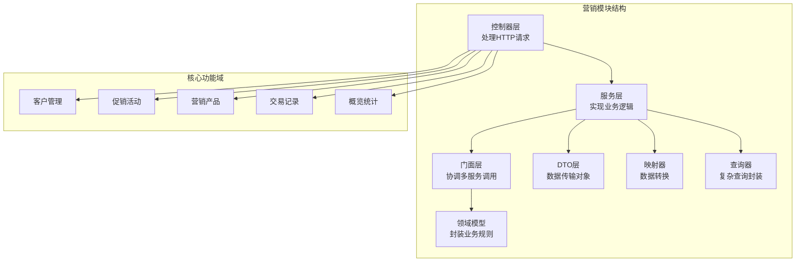
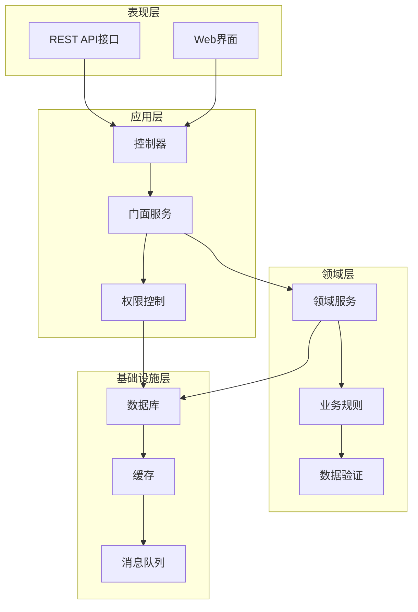
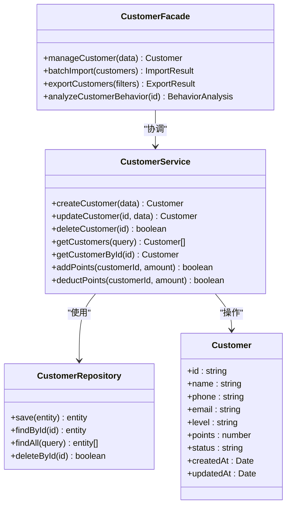
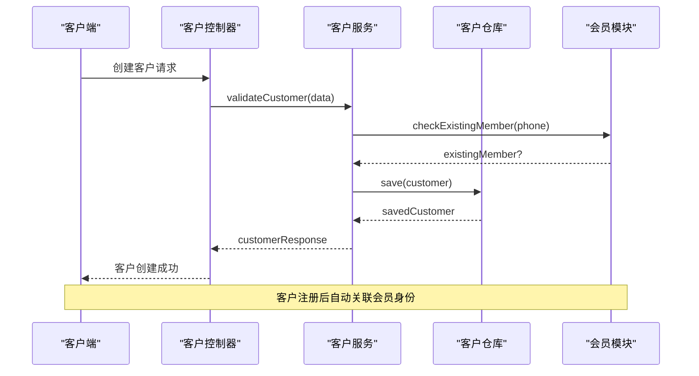
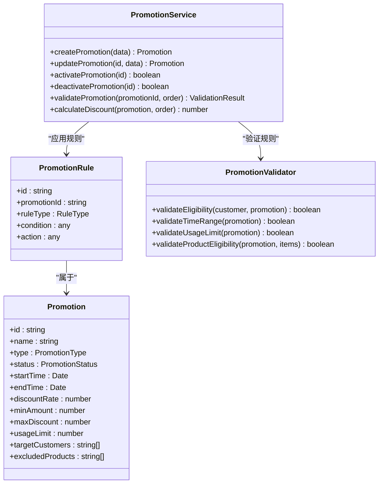
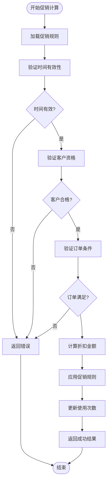
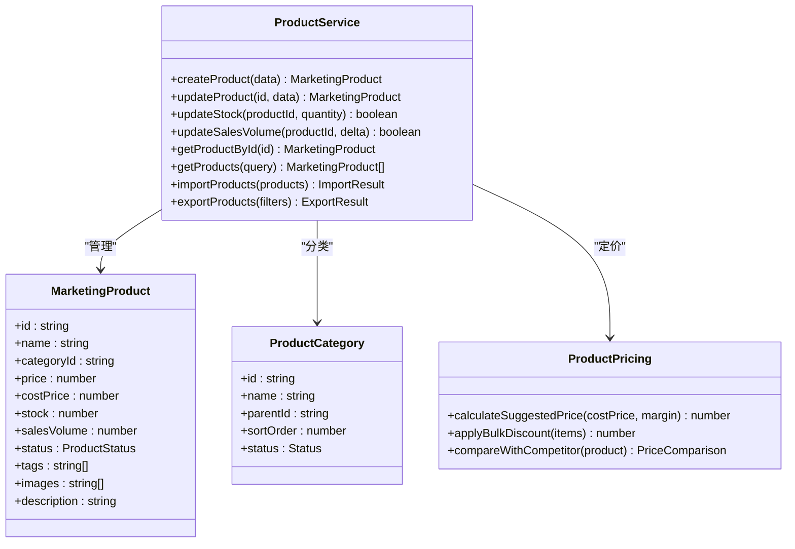
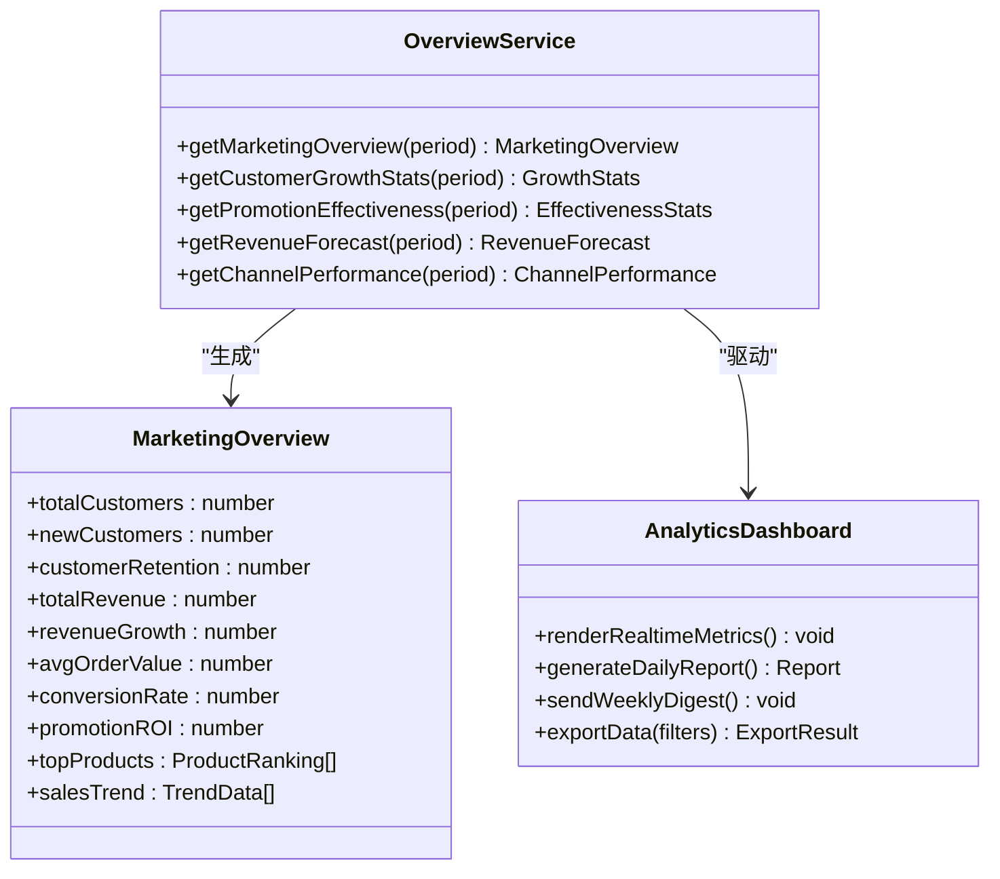
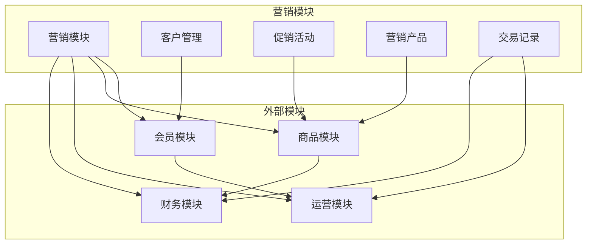
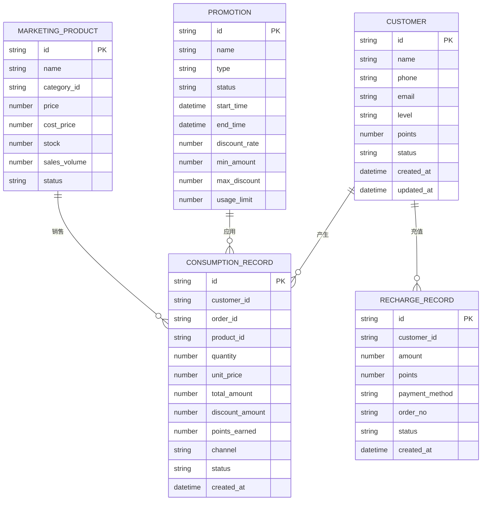

# 营销推广模块

<cite>
**本文档引用的文件**
- [marketing.module.ts](file://src/purely-profit/marketing/marketing.module.ts)
- [marketing.domain.ts](file://src/purely-profit/marketing/marketing.domain.ts)
- [marketing.controller.ts](file://src/purely-profit/marketing/marketing.controller.ts)
- [marketing-customers.controller.ts](file://src/purely-profit/marketing/marketing-customers.controller.ts)
- [marketing-promotions.controller.ts](file://src/purely-profit/marketing/marketing-promotions.controller.ts)
- [marketing-products.controller.ts](file://src/purely-profit/marketing/marketing-products.controller.ts)
- [marketing-transactions.controller.ts](file://src/purely-profit/marketing/marketing-transactions.controller.ts)
- [marketing-overview.controller.ts](file://src/purely-profit/marketing/marketing-overview.controller.ts)
- [marketing-product-categories.controller.ts](file://src/purely-profit/marketing/marketing-product-categories.controller.ts)
- [marketing-customers.service.ts](file://src/purely-profit/marketing/marketing-customers.service.ts)
- [marketing-promotions.service.ts](file://src/purely-profit/marketing/marketing-promotions.service.ts)
- [marketing-products.service.ts](file://src/purely-profit/marketing/marketing-products.service.ts)
- [marketing-consumptions.service.ts](file://src/purely-profit/marketing/marketing-consumptions.service.ts)
- [marketing-recharges.service.ts](file://src/purely-profit/marketing/marketing-recharges.service.ts)
- [marketing-points-records.service.ts](file://src/purely-profit/marketing/marketing-points-records.service.ts)
- [marketing-facade.service.ts](file://src/purely-profit/marketing/marketing-facade.service.ts)
- [marketing-overview.facade.service.ts](file://src/purely-profit/marketing/marketing-overview.facade.service.ts)
- [marketing-products.facade.service.ts](file://src/purely-profit/marketing/marketing-products.facade.service.ts)
- [marketing-customers.facade.service.ts](file://src/purely-profit/marketing/marketing-customers.facade.service.ts)
- [marketing-promotions.facade.service.ts](file://src/purely-profit/marketing/marketing-promotions.facade.service.ts)
- [marketing-transactions.facade.service.ts](file://src/purely-profit/marketing/marketing-transactions.facade.service.ts)
- [marketing.types.ts](file://src/purely-profit/marketing/marketing.types.ts)
- [marketing.mapper.ts](file://src/purely-profit/marketing/marketing.mapper.ts)
- [marketing.query.ts](file://src/purely-profit/marketing/marketing.query.ts)
- [marketing-access.service.ts](file://src/purely-profit/marketing/marketing-access.service.ts)
- [marketing-shared.service.ts](file://src/purely-profit/marketing/marketing-shared.service.ts)
- [marketing.utils.ts](file://src/purely-profit/marketing/marketing.utils.ts)
- [marketing-response.dto.ts](file://src/purely-profit/marketing/dto/marketing-response.dto.ts)
- [marketing-query.dto.ts](file://src/purely-profit/marketing/dto/marketing-query.dto.ts)
- [marketing-customer-query.dto.ts](file://src/purely-profit/marketing/dto/marketing-customer-query.dto.ts)
- [marketing-promotion-query.dto.ts](file://src/purely-profit/marketing/dto/marketing-promotion-query.dto.ts)
- [marketing-consumption-query.dto.ts](file://src/purely-profit/marketing/dto/marketing-consumption-query.dto.ts)
- [marketing-recharge-query.dto.ts](file://src/purely-profit/marketing/dto/marketing-recharge-query.dto.ts)
- [marketing-product.dto.ts](file://src/purely-profit/marketing/dto/marketing-product.dto.ts)
- [marketing-pagination-query.dto.ts](file://src/purely-profit/marketing/dto/marketing-pagination-query.dto.ts)
- [customers.prisma](file://prisma/purely-profit/marketing/customers.prisma)
- [promotions.prisma](file://prisma/purely-profit/marketing/promotions.prisma)
- [products.prisma](file://prisma/purely-profit/marketing/products.prisma)
- [members.prisma](file://prisma/purely-profit/member/members.prisma)
- [member-points-logs.prisma](file://prisma/purely-profit/member/member-points-logs.prisma)
- [sales-records.prisma](file://prisma/purely-profit/operations/sales-records.prisma)
- [marketing-points-records.prisma](file://prisma/purely-profit/marketing/marketing-points-records.prisma)
- [marketing-module-migration.sql](file://prisma/migrations/20260514064726_add_marketing_module/migration.sql)
- [marketing-points-records-migration.sql](file://prisma/migrations/20260515133000_add_marketing_points_records/migration.sql)
- [marketing-products-migration.sql](file://prisma/migrations/20260514064726_add_marketing_module/migration.sql)
- [marketing-customers-migration.sql](file://prisma/migrations/20260514064726_add_marketing_module/migration.sql)
- [marketing-promotions-migration.sql](file://prisma/migrations/20260514064726_add_marketing_module/migration.sql)
- [marketing-sales-records-migration.sql](file://prisma/migrations/20260514064726_add_marketing_module/migration.sql)
- [marketing-points-records-migration.sql](file://prisma/migrations/20260515133000_add_marketing_points_records/migration.sql)
- [marketing-products-migration.sql](file://prisma/migrations/20260514064726_add_marketing_module/migration.sql)
- [marketing-customers-migration.sql](file://prisma/migrations/20260514064726_add_marketing_module/migration.sql)
- [marketing-promotions-migration.sql](file://prisma/migrations/20260514064726_add_marketing_module/migration.sql)
- [marketing-sales-records-migration.sql](file://prisma/migrations/20260514064726_add_marketing_module/migration.sql)
</cite>

## 目录
1. [简介](#简介)
2. [项目结构](#项目结构)
3. [核心组件](#核心组件)
4. [架构总览](#架构总览)
5. [详细组件分析](#详细组件分析)
6. [依赖分析](#依赖分析)
7. [性能考虑](#性能考虑)
8. [故障排除指南](#故障排除指南)
9. [结论](#结论)
10. [附录](#附录)

## 简介
营销推广模块是企业级商业系统中的核心增长引擎，负责构建完整的客户生命周期管理体系与营销闭环。该模块以"客户为中心"的设计理念，整合了客户管理、促销活动、营销产品、消费记录、积分与充值等多个子域，形成从获客到留存、从促活到转化的全链路营销能力。

模块采用分层架构设计，通过控制器-服务-门面-领域模型的分层组织，确保业务逻辑清晰、可测试性强。同时，模块深度集成会员体系、商品体系与销售记录，实现跨模块的数据协同与业务联动。

## 项目结构
营销模块在代码层面采用按功能域划分的组织方式，每个核心功能都有独立的控制器、服务、门面和数据访问层：

**图表来源**
- [marketing.module.ts](file://src/purely-profit/marketing/marketing.module.ts)
- [marketing.controller.ts](file://src/purely-profit/marketing/marketing.controller.ts)

**章节来源**
- [marketing.module.ts](file://src/purely-profit/marketing/marketing.module.ts)
- [marketing.controller.ts](file://src/purely-profit/marketing/marketing.controller.ts)

## 核心组件
营销模块由七个主要功能域构成，每个功能域都包含完整的CRUD操作和业务逻辑：

### 客户管理域
负责客户信息的全生命周期管理，包括基础信息维护、标签分类、等级管理、积分消费等核心功能。

### 促销活动域  
提供灵活的促销策略配置，支持多种促销类型（满减、折扣、赠品等），具备活动状态管理、库存控制、参与条件设置等功能。

### 营销产品域
管理营销推广所需的产品资源，包括产品分类、价格策略、库存管理、上下架控制等，支撑精准营销的物料准备。

### 交易记录域
记录所有与营销相关的消费行为，包括购买记录、积分兑换、充值记录等，为营销效果分析提供数据基础。

### 概览统计域
提供营销整体数据的汇总分析，包括销售额、客流量、转化率、ROI等关键指标的实时展示。

### 权限控制域
通过细粒度的权限管理，确保不同角色只能访问相应的营销功能，保障数据安全与业务合规。

**章节来源**
- [marketing-customers.service.ts](file://src/purely-profit/marketing/marketing-customers.service.ts)
- [marketing-promotions.service.ts](file://src/purely-profit/marketing/marketing-promotions.service.ts)
- [marketing-products.service.ts](file://src/purely-profit/marketing/marketing-products.service.ts)
- [marketing-consumptions.service.ts](file://src/purely-profit/marketing/marketing-consumptions.service.ts)
- [marketing-recharges.service.ts](file://src/purely-profit/marketing/marketing-recharges.service.ts)
- [marketing-points-records.service.ts](file://src/purely-profit/marketing/marketing-points-records.service.ts)

## 架构总览
营销模块采用典型的三层架构模式，通过依赖注入实现松耦合设计：

**图表来源**
- [marketing.module.ts](file://src/purely-profit/marketing/marketing.module.ts)
- [marketing-access.service.ts](file://src/purely-profit/marketing/marketing-access.service.ts)

**章节来源**
- [marketing.domain.ts](file://src/purely-profit/marketing/marketing.domain.ts)
- [marketing-access.service.ts](file://src/purely-profit/marketing/marketing-access.service.ts)

## 详细组件分析

### 客户管理组件分析
客户管理是营销模块的核心基础，负责维护客户档案、行为轨迹和价值评估。

**图表来源**
- [marketing-customers.service.ts](file://src/purely-profit/marketing/marketing-customers.service.ts)
- [marketing-customers.facade.service.ts](file://src/purely-profit/marketing/marketing-customers.facade.service.ts)

#### 客户生命周期管理流程

**图表来源**
- [marketing-customers.controller.ts](file://src/purely-profit/marketing/marketing-customers.controller.ts)
- [marketing-customers.service.ts](file://src/purely-profit/marketing/marketing-customers.service.ts)

**章节来源**
- [marketing-customers.controller.ts](file://src/purely-profit/marketing/marketing-customers.controller.ts)
- [marketing-customers.service.ts](file://src/purely-profit/marketing/marketing-customers.service.ts)
- [marketing-customers.facade.service.ts](file://src/purely-profit/marketing/marketing-customers.facade.service.ts)

### 促销活动组件分析
促销活动模块提供灵活的营销策略配置，支持多种促销类型和复杂的参与条件。

**图表来源**
- [marketing-promotions.service.ts](file://src/purely-profit/marketing/marketing-promotions.service.ts)
- [marketing-promotions.facade.service.ts](file://src/purely-profit/marketing/marketing-promotions.facade.service.ts)

#### 促销活动执行流程

**图表来源**
- [marketing-promotions.service.ts](file://src/purely-profit/marketing/marketing-promotions.service.ts)

**章节来源**
- [marketing-promotions.controller.ts](file://src/purely-profit/marketing/marketing-promotions.controller.ts)
- [marketing-promotions.service.ts](file://src/purely-profit/marketing/marketing-promotions.service.ts)
- [marketing-promotions.facade.service.ts](file://src/purely-profit/marketing/marketing-promotions.facade.service.ts)

### 营销产品组件分析
营销产品模块管理推广所需的各类产品资源，支持产品分类、定价策略和库存控制。

**图表来源**
- [marketing-products.service.ts](file://src/purely-profit/marketing/marketing-products.service.ts)
- [marketing-products.facade.service.ts](file://src/purely-profit/marketing/marketing-products.facade.service.ts)

**章节来源**
- [marketing-products.controller.ts](file://src/purely-profit/marketing/marketing-products.controller.ts)
- [marketing-products.service.ts](file://src/purely-profit/marketing/marketing-products.service.ts)
- [marketing-products.facade.service.ts](file://src/purely-profit/marketing/marketing-products.facade.service.ts)

### 交易记录组件分析
交易记录模块完整追踪所有营销相关的消费行为，为营销效果分析提供数据基础。

**图表来源**
- [marketing-consumptions.service.ts](file://src/purely-profit/marketing/marketing-consumptions.service.ts)
- [marketing-recharges.service.ts](file://src/purely-profit/marketing/marketing-recharges.service.ts)
- [marketing-points-records.service.ts](file://src/purely-profit/marketing/marketing-points-records.service.ts)

**章节来源**
- [marketing-transactions.controller.ts](file://src/purely-profit/marketing/marketing-transactions.controller.ts)
- [marketing-consumptions.service.ts](file://src/purely-profit/marketing/marketing-consumptions.service.ts)
- [marketing-recharges.service.ts](file://src/purely-profit/marketing/marketing-recharges.service.ts)
- [marketing-points-records.service.ts](file://src/purely-profit/marketing/marketing-points-records.service.ts)

### 概览统计组件分析
概览统计模块提供营销整体数据的汇总分析，支持实时监控和趋势分析。

**图表来源**
- [marketing-overview.service.ts](file://src/purely-profit/marketing/marketing-overview.service.ts)
- [marketing-overview.facade.service.ts](file://src/purely-profit/marketing/marketing-overview.facade.service.ts)

**章节来源**
- [marketing-overview.controller.ts](file://src/purely-profit/marketing/marketing-overview.controller.ts)
- [marketing-overview.service.ts](file://src/purely-profit/marketing/marketing-overview.service.ts)
- [marketing-overview.facade.service.ts](file://src/purely-profit/marketing/marketing-overview.facade.service.ts)

## 依赖分析
营销模块与系统其他模块存在紧密的依赖关系，形成了完整的业务生态：

**图表来源**
- [marketing-customers.service.ts](file://src/purely-profit/marketing/marketing-customers.service.ts)
- [marketing-promotions.service.ts](file://src/purely-profit/marketing/marketing-promotions.service.ts)
- [marketing-products.service.ts](file://src/purely-profit/marketing/marketing-products.service.ts)
- [marketing-consumptions.service.ts](file://src/purely-profit/marketing/marketing-consumptions.service.ts)

### 数据模型关系图

**图表来源**
- [customers.prisma](file://prisma/purely-profit/marketing/customers.prisma)
- [promotions.prisma](file://prisma/purely-profit/marketing/promotions.prisma)
- [products.prisma](file://prisma/purely-profit/marketing/products.prisma)
- [marketing-points-records.prisma](file://prisma/purely-profit/marketing/marketing-points-records.prisma)

**章节来源**
- [marketing.types.ts](file://src/purely-profit/marketing/marketing.types.ts)
- [marketing.mapper.ts](file://src/purely-profit/marketing/marketing.mapper.ts)

## 性能考虑
营销模块在设计时充分考虑了性能优化，采用了多种策略来提升系统响应速度和吞吐量：

### 缓存策略
- **热点数据缓存**：客户积分、促销活动状态、热门产品信息等高频访问数据
- **分页缓存**：列表查询结果按查询条件进行缓存，减少重复查询
- **会话缓存**：用户登录状态和权限信息的短期缓存

### 查询优化
- **索引优化**：在常用查询字段上建立复合索引，如客户手机号、促销活动时间范围
- **批量操作**：支持批量导入导出，减少网络往返次数
- **延迟加载**：非关键信息采用延迟加载策略

### 异步处理
- **异步任务**：积分计算、报表生成、邮件通知等耗时操作异步化
- **消息队列**：营销推送、数据分析等解耦处理

## 故障排除指南
营销模块提供了完善的错误处理和监控机制：

### 常见问题及解决方案
- **客户积分异常**：检查积分变更日志，确认是否存在并发修改
- **促销活动失效**：验证活动时间范围和使用限制
- **产品库存不一致**：检查库存锁定机制和事务一致性
- **交易记录缺失**：核对交易流水和数据库同步状态

### 监控指标
- **响应时间**：接口平均响应时间、P95/P99延迟
- **错误率**：业务错误率、系统错误率
- **吞吐量**：每秒请求数、并发用户数
- **业务指标**：转化率、客单价、复购率

**章节来源**
- [marketing.utils.ts](file://src/purely-profit/marketing/marketing.utils.ts)

## 结论
营销推广模块通过模块化的架构设计和完善的业务功能，为企业提供了全方位的营销解决方案。模块不仅支持基础的客户管理和促销活动，更重要的是建立了完整的营销数据闭环，能够支撑精准营销、客户分群、效果评估等高级功能。

模块的强耦合设计确保了各功能域之间的协同工作，而弱耦合的接口设计保证了系统的可扩展性和可维护性。通过与会员、商品、运营等模块的深度集成，营销模块能够为企业创造持续的增长价值。

## 附录

### API 接口规范
营销模块提供RESTful API接口，支持标准的CRUD操作和业务特定的操作。

### 数据模型定义
- **客户模型**：包含基本信息、等级、积分、状态等字段
- **促销模型**：包含类型、时间范围、折扣规则、使用限制等
- **产品模型**：包含价格、库存、销量、状态等字段
- **交易模型**：包含消费记录、充值记录、积分变动等

### 业务场景示例
- **新客首单优惠**：基于客户生命周期的个性化促销
- **会员等级营销**：针对不同等级客户的差异化服务
- **节日促销活动**：限时促销和组合套餐的营销策略
- **积分商城**：积分兑换和消费返利的激励机制