# 营销推广模块

<cite>
**本文引用的文件**
- [marketing.module.ts](file://src/purely-profit/marketing/marketing.module.ts)
- [marketing.domain.ts](file://src/purely-profit/marketing/marketing.domain.ts)
- [marketing.controller.ts](file://src/purely-profit/marketing/marketing.controller.ts)
- [marketing-customers.controller.ts](file://src/purely-profit/marketing/marketing-customers.controller.ts)
- [marketing-promotions.controller.ts](file://src/purely-profit/marketing/marketing-promotions.controller.ts)
- [marketing-products.controller.ts](file://src/purely-profit/marketing/marketing-products.controller.ts)
- [marketing-transactions.controller.ts](file://src/purely-profit/marketing/marketing-transactions.controller.ts)
- [marketing-overview.controller.ts](file://src/purely-profit/marketing/marketing-overview.controller.ts)
- [marketing-product-categories.controller.ts](file://src/purely-profit/marketing/marketing-product-categories.controller.ts)
- [marketing-customers.service.ts](file://src/purely-profit/marketing/marketing-customers.service.ts)
- [marketing-promotions.service.ts](file://src/purely-profit/marketing/marketing-promotions.service.ts)
- [marketing-products.service.ts](file://src/purely-profit/marketing/marketing-products.service.ts)
- [marketing-consumptions.service.ts](file://src/purely-profit/marketing/marketing-consumptions.service.ts)
- [marketing-recharges.service.ts](file://src/purely-profit/marketing/marketing-recharges.service.ts)
- [marketing-points-records.service.ts](file://src/purely-profit/marketing/marketing-points-records.service.ts)
- [marketing-facade.service.ts](file://src/purely-profit/marketing/marketing-facade.service.ts)
- [marketing-overview.facade.service.ts](file://src/purely-profit/marketing/marketing-overview.facade.service.ts)
- [marketing-products.facade.service.ts](file://src/purely-profit/marketing/marketing-products.facade.service.ts)
- [marketing-customers.facade.service.ts](file://src/purely-profit/marketing/marketing-customers.facade.service.ts)
- [marketing-promotions.facade.service.ts](file://src/purely-profit/marketing/marketing-promotions.facade.service.ts)
- [marketing-transactions.facade.service.ts](file://src/purely-profit/marketing/marketing-transactions.facade.service.ts)
- [marketing.types.ts](file://src/purely-profit/marketing/marketing.types.ts)
- [marketing.mapper.ts](file://src/purely-profit/marketing/marketing.mapper.ts)
- [marketing.query.ts](file://src/purely-profit/marketing/marketing.query.ts)
- [marketing-access.service.ts](file://src/purely-profit/marketing/marketing-access.service.ts)
- [marketing-shared.service.ts](file://src/purely-profit/marketing/marketing-shared.service.ts)
- [marketing.utils.ts](file://src/purely-profit/marketing/marketing.utils.ts)
- [promotion-params.schema.ts](file://src/purely-profit/marketing/schemas/promotion-params.schema.ts)
- [member-level-settings.schema.ts](file://src/purely-profit/marketing/schemas/member-level-settings.schema.ts)
- [marketing-overview.service.ts](file://src/purely-profit/marketing/marketing-overview.service.ts)
- [marketing.cache-keys.ts](file://src/redis/keys/marketing.cache-keys.ts)
- [cache-prewarm-marketing-overview.provider.ts](file://src/redis/cache-prewarm-marketing-overview.provider.ts)
- [20260613140000_add_points_activity_and_discount_day_types/migration.sql](file://prisma/migrations/20260613140000_add_points_activity_and_discount_day_types/migration.sql)
- [20260629120000_add_promotion_display_text/migration.sql](file://prisma/migrations/20260629120000_add_promotion_display_text/migration.sql)
- [marketing-member-level-settings.service.ts](file://src/purely-profit/marketing/marketing-member-level-settings.service.ts)
- [marketing-customer-finance.utils.ts](file://src/purely-profit/marketing/marketing-customer-finance.utils.ts)
- [marketing-customer-points.service.ts](file://src/purely-profit/marketing/marketing-customer-points.service.ts)
- [marketing-product.dto.ts](file://src/purely-profit/marketing/dto/marketing-product.dto.ts)
- [marketing-product-category.dto.ts](file://src/purely-profit/marketing/dto/marketing-product-category.dto.ts)
- [marketing-product-query.dto.ts](file://src/purely-profit/marketing/dto/marketing-product-query.dto.ts)
- [marketing-product-toggle.dto.ts](file://src/purely-profit/marketing/dto/marketing-product-toggle.dto.ts)
- [marketing-product.response.dto.ts](file://src/purely-profit/marketing/dto/marketing-product.response.dto.ts)
- [marketing-product-transforms.ts](file://src/purely-profit/marketing/dto/marketing-product-transforms.ts)
</cite>

## 更新摘要
**所做更改**
- 营销产品DTO架构重构，将大型单一文件拆分为专门的职责分离文件
- 新增独立的响应DTO文件，集中管理所有API响应数据结构
- 优化查询DTO和切换操作DTO的可维护性
- 改进分类管理的DTO结构，支持更精细的产品分类控制
- 增强数据传输对象的可读性和类型安全性

## 目录
1. [简介](#简介)
2. [项目结构](#项目结构)
3. [核心组件](#核心组件)
4. [架构总览](#架构总览)
5. [详细组件分析](#详细组件分析)
6. [Zod模式验证系统](#zod模式验证系统)
7. [会员等级配置管理](#会员等级配置管理)
8. [会员等级设置管理服务](#会员等级设置管理服务)
9. [客户财务管理工具](#客户财务管理工具)
10. [会员积分管理服务](#会员积分管理服务)
11. [营销概览增强功能](#营销概览增强功能)
12. [展示文案预计算机制](#展示文案预计算机制)
13. [金额字段处理优化](#金额字段处理优化)
14. [营销产品DTO架构重构](#营销产品dto架构重构)
15. [依赖分析](#依赖分析)
16. [性能考虑](#性能考虑)
17. [故障排除指南](#故障排除指南)
18. [结论](#结论)
19. [附录](#附录)

## 简介
营销推广模块是企业级商业系统中的核心增长引擎，负责构建完整的客户生命周期管理体系与营销闭环。该模块以"客户为中心"的设计理念，整合了客户管理、促销活动、营销产品、消费记录、积分与充值等多个子域，形成从获客到留存、从促活到转化的全链路营销能力。

模块采用分层架构设计，通过控制器-服务-门面-领域模型的分层组织，确保业务逻辑清晰、可测试性强。同时，模块深度集成会员体系、商品体系与销售记录，实现跨模块的数据协同与业务联动。

**更新** 本次重大更新引入了全新的会员等级设置管理服务，提供428行完整的功能实现；新增了客户财务管理工具，统一处理客户余额和充值记录；重构了会员积分管理系统，提供更强大的积分操作能力；优化了整体服务架构，提高了代码的可维护性和复用性。**最新更新** 营销产品DTO架构进行了重大重构，将大型单一文件拆分为专门的职责分离文件，显著提升了代码组织性和API契约的可维护性。

## 项目结构
营销模块在代码层面采用按功能域划分的组织方式，每个核心功能都有独立的控制器、服务、门面和数据访问层：

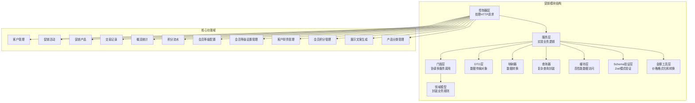
```mermaid
graph TB
subgraph "营销模块结构"
Controllers["控制器层<br/>处理HTTP请求"]
Services["服务层<br/>实现业务逻辑"]
Facades["门面层<br/>协调多服务调用"]
Domain["领域模型<br/>封装业务规则"]
DTOs["DTO层<br/>数据传输对象"]
Mappers["映射器<br/>数据转换"]
Queries["查询器<br/>复杂查询封装"]
Cache["缓存层<br/>高性能数据访问"]
Schemas["Schema验证层<br/>Zod模式验证"]
MoneyUtils["金额工具层<br/>价格格式化和转换"]
end
subgraph "核心功能域"
Customers["客户管理"]
Promotions["促销活动"]
Products["营销产品"]
Transactions["交易记录"]
Overview["概览统计"]
PointsRecords["积分流水"]
MemberLevelConfig["会员等级配置"]
MemberLevelSettings["会员等级设置管理"]
CustomerFinance["客户财务管理"]
CustomerPoints["会员积分管理"]
DisplayText["展示文案生成"]
ProductCategories["产品分类管理"]
end
Controllers --> Services
Services --> Facades
Facades --> Domain
Services --> DTOs
Services --> Mappers
Services --> Queries
Services --> Cache
Services --> Schemas
Services --> MoneyUtils
Controllers --> Customers
Controllers --> Promotions
Controllers --> Products
Controllers --> Transactions
Controllers --> Overview
Controllers --> PointsRecords
Controllers --> MemberLevelConfig
Controllers --> MemberLevelSettings
Controllers --> CustomerFinance
Controllers --> CustomerPoints
Controllers --> DisplayText
Controllers --> ProductCategories
```

**图表来源**
- [marketing.module.ts](file://src/purely-profit/marketing/marketing.module.ts)
- [marketing.controller.ts](file://src/purely-profit/marketing/marketing.controller.ts)

**章节来源**
- [marketing.module.ts](file://src/purely-profit/marketing/marketing.module.ts)
- [marketing.controller.ts](file://src/purely-profit/marketing/marketing.controller.ts)

## 核心组件
营销模块由十四个主要功能域构成，每个功能域都包含完整的CRUD操作和业务逻辑：

### 客户管理域
负责客户信息的全生命周期管理，包括基础信息维护、标签分类、等级管理、积分消费等核心功能。

### 促销活动域  
提供灵活的促销策略配置，支持多种促销类型（满减、折扣、赠品、积分充值、每日折扣等），具备活动状态管理、库存控制、参与条件设置等功能。

**更新** 引入了全面的Zod模式验证系统，为所有促销类型提供严格的数据验证和规范化处理，防止运行时无效促销配置。

### 营销产品域
管理营销推广所需的产品资源，包括产品分类、价格策略、库存管理、上下架控制等，支撑精准营销的物料准备。

**更新** 营销产品DTO架构经过重大重构，实现了更好的职责分离和代码组织性。

### 交易记录域
记录所有与营销相关的消费行为，包括购买记录、积分兑换、充值记录等，为营销效果分析提供数据基础。

### 积分流水域
记录所有营销相关的积分变动历史，包括管理员调整、消费抵扣、活动奖励等各类积分流水，为积分审计和分析提供完整数据支持。

### 概览统计域
提供营销整体数据的汇总分析，包括销售额、客流量、转化率、ROI等关键指标的实时展示。

**更新** 营销概览功能得到全面增强，集成了会员等级配置管理和积分规则动态控制，提供更丰富的数据分析能力。

### Schema验证域
**新增** 基于Zod的模式验证系统，为营销活动参数提供严格的类型检查、数据验证和规范化处理，确保数据的一致性和安全性。

### 权限控制域
通过细粒度的权限管理，确保不同角色只能访问相应的营销功能，保障数据安全与业务合规。

### 价格格式化域
实现了完整的价格显示格式化和验证机制，支持字符串格式的价格输入并转换为内部cent值存储，确保价格数据的精确性和一致性。

### 展示文案生成域
**新增** 实现了促销展示文案的预计算和存储机制，根据促销类型和参数自动生成标准化的前端展示文案，确保前后端展示的一致性。

### 会员等级设置管理域
**新增** 提供完整的会员等级设置管理服务，支持等级的创建、更新、删除和查询，包含详细的配置验证和默认值管理。

### 客户财务管理域
**新增** 统一的客户财务管理工具，处理客户余额、充值记录、退款等操作，确保财务数据的准确性和一致性。

### 会员积分管理域
**新增** 重构的会员积分管理系统，提供更全面的积分操作接口，包括积分增减、查询、历史记录管理等。

### 产品分类管理域
**新增** 专门的产品分类管理功能，支持分类的创建、更新、删除和查询，为营销产品提供结构化的分类组织。

**章节来源**
- [marketing-customers.service.ts](file://src/purely-profit/marketing/marketing-customers.service.ts)
- [marketing-promotions.service.ts](file://src/purely-profit/marketing/marketing-promotions.service.ts)
- [marketing-products.service.ts](file://src/purely-profit/marketing/marketing-products.service.ts)
- [marketing-consumptions.service.ts](file://src/purely-profit/marketing/marketing-consumptions.service.ts)
- [marketing-recharges.service.ts](file://src/purely-profit/marketing/marketing-recharges.service.ts)
- [marketing-points-records.service.ts](file://src/purely-profit/marketing/marketing-points-records.service.ts)
- [promotion-params.schema.ts](file://src/purely-profit/marketing/schemas/promotion-params.schema.ts)
- [member-level-settings.schema.ts](file://src/purely-profit/marketing/schemas/member-level-settings.schema.ts)
- [marketing-overview.service.ts](file://src/purely-profit/marketing/marketing-overview.service.ts)
- [marketing-member-level-settings.service.ts](file://src/purely-profit/marketing/marketing-member-level-settings.service.ts)
- [marketing-customer-finance.utils.ts](file://src/purely-profit/marketing/marketing-customer-finance.utils.ts)
- [marketing-customer-points.service.ts](file://src/purely-profit/marketing/marketing-customer-points.service.ts)
- [marketing.mapper.ts](file://src/purely-profit/marketing/marketing.mapper.ts)

## 架构总览
营销模块采用典型的三层架构模式，通过依赖注入实现松耦合设计：

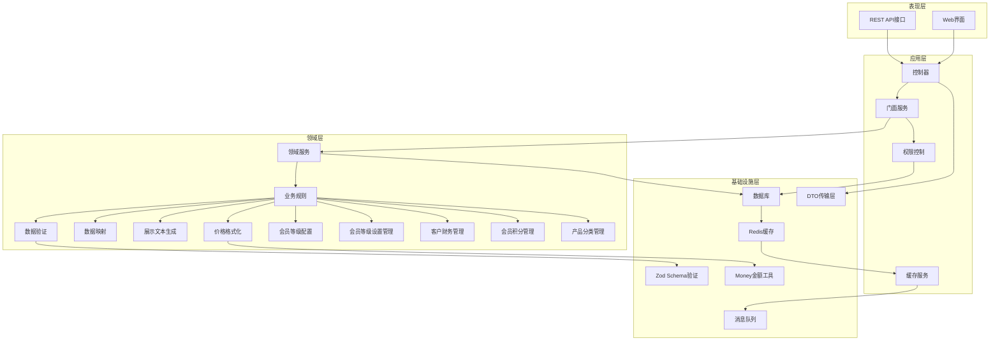
```mermaid
graph TB
subgraph "表现层"
API["REST API接口"]
WebUI["Web界面"]
end
subgraph "应用层"
Controllers["控制器"]
Facades["门面服务"]
AccessControl["权限控制"]
Cache["缓存服务"]
end
subgraph "领域层"
DomainServices["领域服务"]
BusinessRules["业务规则"]
Validation["数据验证"]
Mapping["数据映射"]
DisplayText["展示文本生成"]
PriceFormatting["价格格式化"]
MemberLevelConfig["会员等级配置"]
MemberLevelSettings["会员等级设置管理"]
CustomerFinance["客户财务管理"]
CustomerPoints["会员积分管理"]
ProductCategories["产品分类管理"]
end
subgraph "基础设施层"
Database["数据库"]
Redis["Redis缓存"]
Queue["消息队列"]
Schemas["Zod Schema验证"]
MoneyUtils["Money金额工具"]
DTOLayer["DTO传输层"]
end
API --> Controllers
WebUI --> Controllers
Controllers --> Facades
Facades --> DomainServices
DomainServices --> BusinessRules
BusinessRules --> Validation
BusinessRules --> Mapping
BusinessRules --> DisplayText
BusinessRules --> PriceFormatting
BusinessRules --> MemberLevelConfig
BusinessRules --> MemberLevelSettings
BusinessRules --> CustomerFinance
BusinessRules --> CustomerPoints
BusinessRules --> ProductCategories
Validation --> Schemas
PriceFormatting --> MoneyUtils
DomainServices --> Database
Facades --> AccessControl
AccessControl --> Database
Database --> Redis
Redis --> Cache
Cache --> Queue
Controllers --> DTOLayer
```

**图表来源**
- [marketing.module.ts](file://src/purely-profit/marketing/marketing.module.ts)
- [marketing-access.service.ts](file://src/purely-profit/marketing/marketing-access.service.ts)

**章节来源**
- [marketing.domain.ts](file://src/purely-profit/marketing/marketing.domain.ts)
- [marketing-access.service.ts](file://src/purely-profit/marketing/marketing-access.service.ts)

## 详细组件分析

### 促销活动组件分析
促销活动模块提供灵活的营销策略配置，支持多种促销类型和复杂的参与条件。

**更新** 引入了全面的Zod模式验证系统，为所有促销类型提供严格的数据验证和规范化处理。

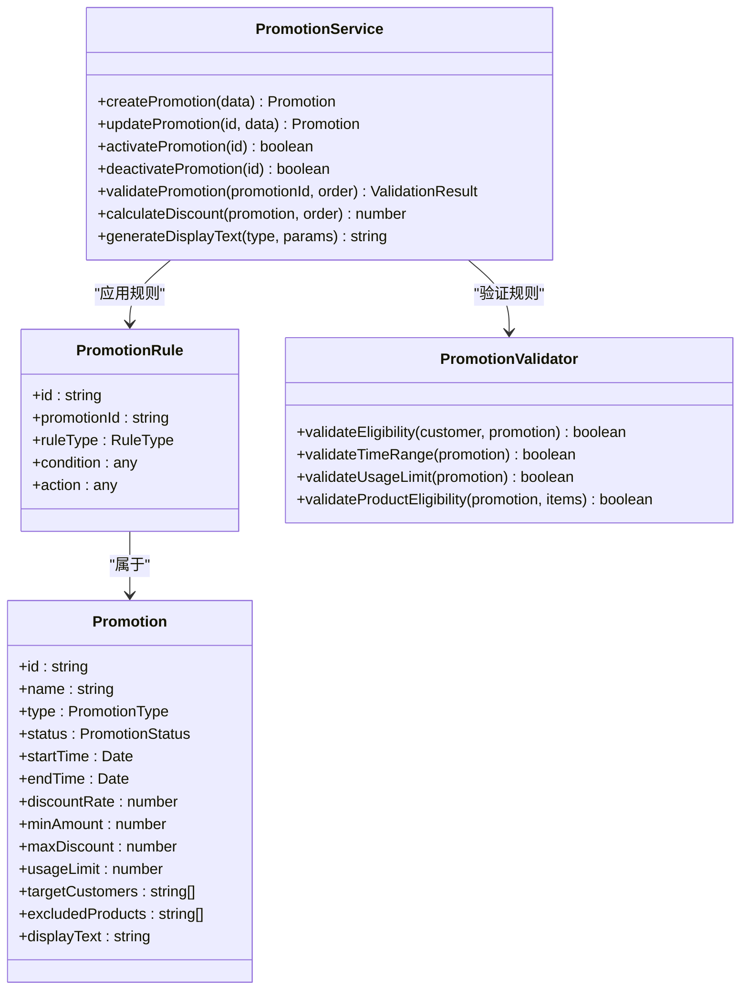
```mermaid
classDiagram
class Promotion {
+id : string
+name : string
+type : PromotionType
+status : PromotionStatus
+startTime : Date
+endTime : Date
+discountRate : number
+minAmount : number
+maxDiscount : number
+usageLimit : number
+targetCustomers : string[]
+excludedProducts : string[]
+displayText : string
}
class PromotionRule {
+id : string
+promotionId : string
+ruleType : RuleType
+condition : any
+action : any
}
class PromotionService {
+createPromotion(data) Promotion
+updatePromotion(id, data) Promotion
+activatePromotion(id) boolean
+deactivatePromotion(id) boolean
+validatePromotion(promotionId, order) ValidationResult
+calculateDiscount(promotion, order) number
+generateDisplayText(type, params) string
}
class PromotionValidator {
+validateEligibility(customer, promotion) boolean
+validateTimeRange(promotion) boolean
+validateUsageLimit(promotion) boolean
+validateProductEligibility(promotion, items) boolean
}
PromotionService --> PromotionRule : "应用规则"
PromotionService --> PromotionValidator : "验证规则"
PromotionRule --> Promotion : "属于"
```

**图表来源**
- [marketing-promotions.service.ts](file://src/purely-profit/marketing/marketing-promotions.service.ts)
- [marketing-promotions.facade.service.ts](file://src/purely-profit/marketing/marketing-promotions.facade.service.ts)
- [marketing.mapper.ts](file://src/purely-profit/marketing/marketing.mapper.ts)

#### 促销活动执行流程

```mermaid
flowchart TD
Start([开始促销计算]) --> LoadPromotion["加载促销规则"]
LoadPromotion --> ValidateTime["验证时间有效性"]
ValidateTime --> TimeValid{"时间有效?"}
TimeValid --> |否| ReturnError["返回错误"]
TimeValid --> |是| ValidateCustomer["验证客户资格"]
ValidateCustomer --> CustomerValid{"客户合格?"}
CustomerValid --> |否| ReturnError
CustomerValid --> |是| ValidateOrder["验证订单条件"]
ValidateOrder --> OrderValid{"订单满足?"}
OrderValid --> |否| ReturnError
OrderValid --> CalculateDiscount["计算折扣金额"]
CalculateDiscount --> GenerateDisplayText["生成展示文案"]
GenerateDisplayText --> ApplyPromotion["应用促销规则"]
ApplyPromotion --> UpdateUsage["更新使用次数"]
UpdateUsage --> Success["返回成功结果"]
ReturnError --> End([结束])
Success --> End
```

**图表来源**
- [marketing-promotions.service.ts](file://src/purely-profit/marketing/marketing-promotions.service.ts)
- [marketing.mapper.ts](file://src/purely-profit/marketing/marketing.mapper.ts)

**章节来源**
- [marketing-promotions.controller.ts](file://src/purely-profit/marketing/marketing-promotions.controller.ts)
- [marketing-promotions.service.ts](file://src/purely-profit/marketing/marketing-promotions.service.ts)
- [marketing-promotions.facade.service.ts](file://src/purely-profit/marketing/marketing-promotions.facade.service.ts)

### 营销产品组件分析
营销产品模块管理推广所需的各类产品资源，支持产品分类、定价策略和库存控制。

**更新** 营销产品DTO架构经过重大重构，实现了更好的职责分离：

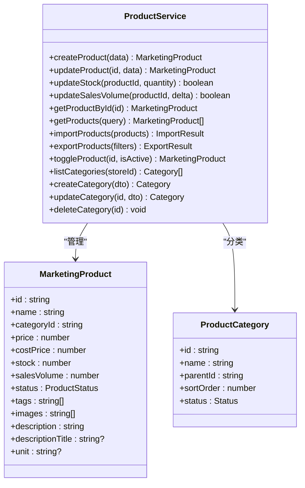
```mermaid
classDiagram
class MarketingProduct {
+id : string
+name : string
+categoryId : string
+price : number
+costPrice : number
+stock : number
+salesVolume : number
+status : ProductStatus
+tags : string[]
+images : string[]
+description : string
+descriptionTitle : string?
+unit : string?
}
class ProductCategory {
+id : string
+name : string
+parentId : string
+sortOrder : number
+status : Status
}
class ProductService {
+createProduct(data) MarketingProduct
+updateProduct(id, data) MarketingProduct
+updateStock(productId, quantity) boolean
+updateSalesVolume(productId, delta) boolean
+getProductById(id) MarketingProduct
+getProducts(query) MarketingProduct[]
+importProducts(products) ImportResult
+exportProducts(filters) ExportResult
+toggleProduct(id, isActive) MarketingProduct
+listCategories(storeId) Category[]
+createCategory(dto) Category
+updateCategory(id, dto) Category
+deleteCategory(id) void
}
ProductService --> MarketingProduct : "管理"
ProductService --> ProductCategory : "分类"
```

**图表来源**
- [marketing-products.service.ts](file://src/purely-profit/marketing/marketing-products.service.ts)
- [marketing-products.facade.service.ts](file://src/purely-profit/marketing/marketing-products.facade.service.ts)

**章节来源**
- [marketing-products.controller.ts](file://src/purely-profit/marketing/marketing-products.controller.ts)
- [marketing-products.service.ts](file://src/purely-profit/marketing/marketing-products.service.ts)
- [marketing-products.facade.service.ts](file://src/purely-profit/marketing/marketing-products.facade.service.ts)

### 交易记录组件分析
交易记录模块完整追踪所有营销相关的消费行为，为营销效果分析提供数据基础。

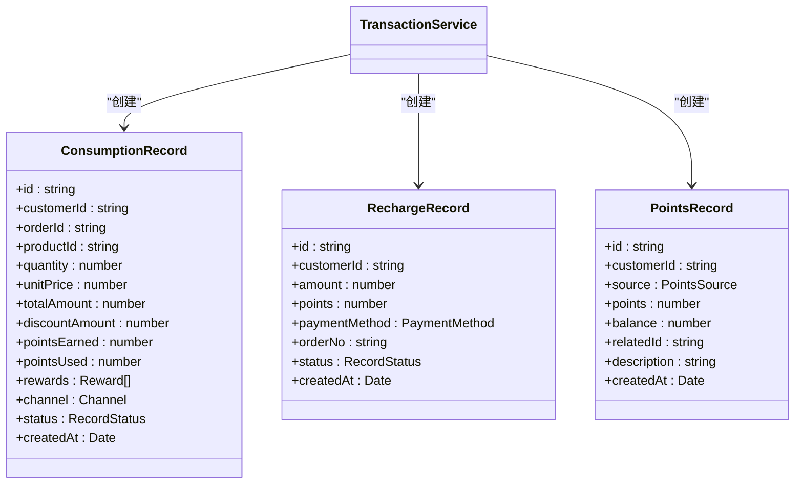
```mermaid
classDiagram
class ConsumptionRecord {
+id : string
+customerId : string
+orderId : string
+productId : string
+quantity : number
+unitPrice : number
+totalAmount : number
+discountAmount : number
+pointsEarned : number
+pointsUsed : number
+rewards : Reward[]
+channel : Channel
+status : RecordStatus
+createdAt : Date
}
class RechargeRecord {
+id : string
+customerId : string
+amount : number
+points : number
+paymentMethod : PaymentMethod
+orderNo : string
+status : RecordStatus
+createdAt : Date
}
class PointsRecord {
+id : string
+customerId : string
+source : PointsSource
+points : number
+balance : number
+relatedId : string
+description : string
+createdAt : Date
}
TransactionService --> ConsumptionRecord : "创建"
TransactionService --> RechargeRecord : "创建"
TransactionService --> PointsRecord : "创建"
```

**图表来源**
- [marketing-consumptions.service.ts](file://src/purely-profit/marketing/marketing-consumptions.service.ts)
- [marketing-recharges.service.ts](file://src/purely-profit/marketing/marketing-recharges.service.ts)
- [marketing-points-records.service.ts](file://src/purely-profit/marketing/marketing-points-records.service.ts)

**章节来源**
- [marketing-transactions.controller.ts](file://src/purely-profit/marketing/marketing-transactions.controller.ts)
- [marketing-consumptions.service.ts](file://src/purely-profit/marketing/marketing-consumptions.service.ts)
- [marketing-recharges.service.ts](file://src/purely-profit/marketing/marketing-recharges.service.ts)
- [marketing-points-records.service.ts](file://src/purely-profit/marketing/marketing-points-records.service.ts)

### 概览统计组件分析
概览统计模块提供营销整体数据的汇总分析，支持实时监控和趋势分析。

**更新** 集成了会员等级配置管理和积分规则动态控制功能。

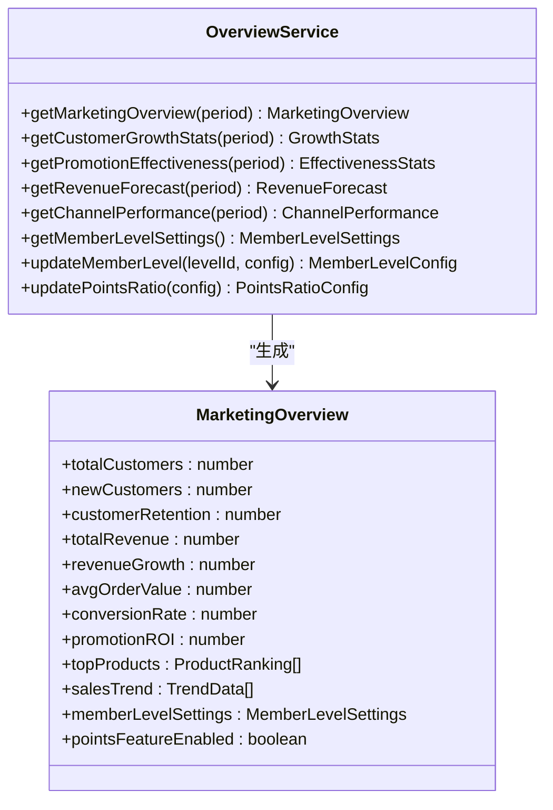
```mermaid
classDiagram
class OverviewService {
+getMarketingOverview(period) MarketingOverview
+getCustomerGrowthStats(period) GrowthStats
+getPromotionEffectiveness(period) EffectivenessStats
+getRevenueForecast(period) RevenueForecast
+getChannelPerformance(period) ChannelPerformance
+getMemberLevelSettings() MemberLevelSettings
+updateMemberLevel(levelId, config) MemberLevelConfig
+updatePointsRatio(config) PointsRatioConfig
}
class MarketingOverview {
+totalCustomers : number
+newCustomers : number
+customerRetention : number
+totalRevenue : number
+revenueGrowth : number
+avgOrderValue : number
+conversionRate : number
+promotionROI : number
+topProducts : ProductRanking[]
+salesTrend : TrendData[]
+memberLevelSettings : MemberLevelSettings
+pointsFeatureEnabled : boolean
}
OverviewService --> MarketingOverview : "生成"
```

**图表来源**
- [marketing-overview.service.ts](file://src/purely-profit/marketing/marketing-overview.service.ts)
- [marketing-overview.facade.service.ts](file://src/purely-profit/marketing/marketing-overview.facade.service.ts)

**章节来源**
- [marketing-overview.controller.ts](file://src/purely-profit/marketing/marketing-overview.controller.ts)
- [marketing-overview.service.ts](file://src/purely-profit/marketing/marketing-overview.service.ts)
- [marketing-overview.facade.service.ts](file://src/purely-profit/marketing/marketing-overview.facade.service.ts)

## Zod模式验证系统

### 验证系统架构
营销模块引入了基于Zod的全面模式验证系统，为所有促销活动参数提供严格的类型检查和数据规范化处理。

**更新** 新增的Zod验证系统包括：
- **类型安全**：为每种促销类型定义独立的Zod schema
- **数据验证**：严格的参数验证和范围检查
- **格式转换**：自动的参数格式化和标准化
- **向后兼容**：支持新旧参数格式的自动转换

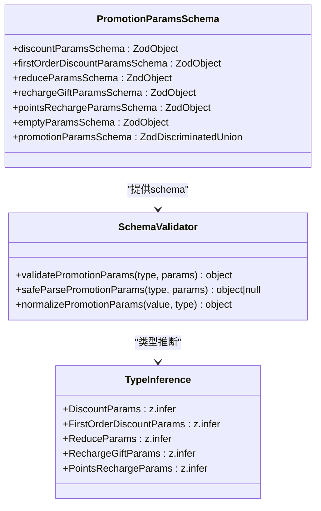
```mermaid
classDiagram
class PromotionParamsSchema {
+discountParamsSchema : ZodObject
+firstOrderDiscountParamsSchema : ZodObject
+reduceParamsSchema : ZodObject
+rechargeGiftParamsSchema : ZodObject
+pointsRechargeParamsSchema : ZodObject
+emptyParamsSchema : ZodObject
+promotionParamsSchema : ZodDiscriminatedUnion
}
class SchemaValidator {
+validatePromotionParams(type, params) object
+safeParsePromotionParams(type, params) object|null
+normalizePromotionParams(value, type) object
}
class TypeInference {
+DiscountParams : z.infer<typeof discountParamsSchema>
+FirstOrderDiscountParams : z.infer<typeof firstOrderDiscountParamsSchema>
+ReduceParams : z.infer<typeof reduceParamsSchema>
+RechargeGiftParams : z.infer<typeof rechargeGiftParamsSchema>
+PointsRechargeParams : z.infer<typeof pointsRechargeParamsSchema>
}
PromotionParamsSchema --> SchemaValidator : "提供schema"
SchemaValidator --> TypeInference : "类型推断"
```

**图表来源**
- [promotion-params.schema.ts](file://src/purely-profit/marketing/schemas/promotion-params.schema.ts)

### 验证流程设计
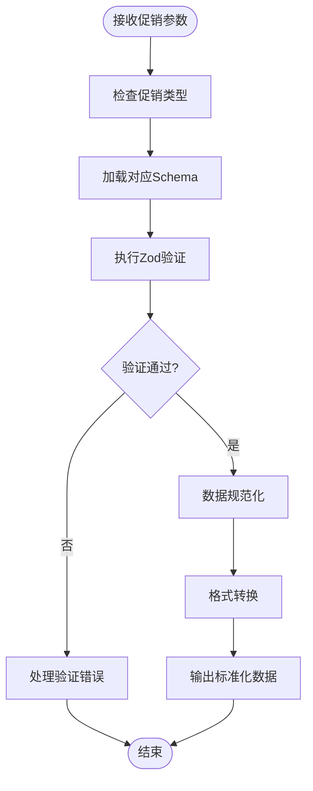
```mermaid
flowchart TD
Start([接收促销参数]) --> CheckType["检查促销类型"]
CheckType --> LoadSchema["加载对应Schema"]
LoadSchema --> ValidateInput["执行Zod验证"]
ValidateInput --> IsValid{"验证通过?"}
IsValid --> |否| HandleError["处理验证错误"]
IsValid --> |是| NormalizeData["数据规范化"]
NormalizeData --> TransformFormat["格式转换"]
TransformFormat --> Output["输出标准化数据"]
HandleError --> End([结束])
Output --> End
```

**图表来源**
- [promotion-params.schema.ts](file://src/purely-profit/marketing/schemas/promotion-params.schema.ts)

### 各类型验证规则
系统为每种促销类型定义了详细的验证规则：

**更新** 各类型的验证规则详情：
- **折扣类型**：discountRate必须为1-99的整数，rate必须为0.01-0.99的小数，二者至少提供一个
- **满减类型**：threshold和reduceAmount必须为正数，支持小数元单位
- **充值赠送**：gradients数组至少包含一个梯度，支持giftAmount或giftRatio
- **首单优惠**：discountRate或rate至少提供一个，可选audience字段
- **积分充值**：rechargeRatioPercent或pointsRatio为正数
- **空参数类型**：free和points_2x类型接受空对象或仅banner字段

**章节来源**
- [promotion-params.schema.ts](file://src/purely-profit/marketing/schemas/promotion-params.schema.ts)

## 会员等级配置管理

### 配置验证系统
会员等级配置管理模块提供了完整的Zod schema验证，确保会员等级配置的安全性和一致性。

**更新** 新增的会员等级配置验证系统包括：
- **等级配置验证**：严格的会员等级配置schema验证
- **积分规则验证**：积分兑换和获取规则的schema验证
- **默认值兜底**：配置验证失败时自动回退到默认值
- **并发保护**：使用数据库事务和锁机制保证配置更新的原子性

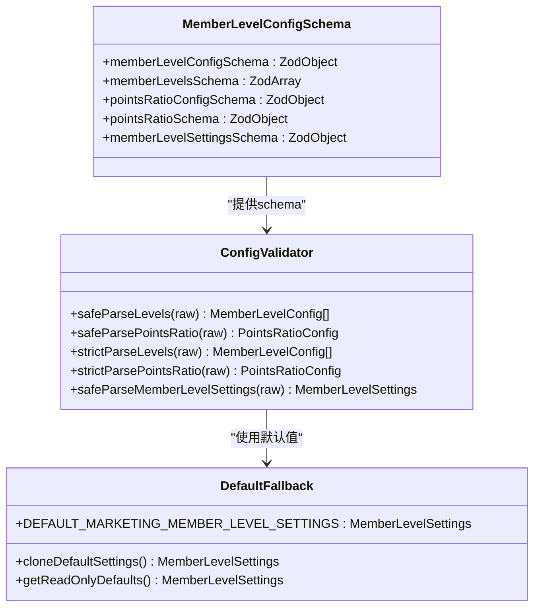
```mermaid
classDiagram
class MemberLevelConfigSchema {
+memberLevelConfigSchema : ZodObject
+memberLevelsSchema : ZodArray
+pointsRatioConfigSchema : ZodObject
+pointsRatioSchema : ZodObject
+memberLevelSettingsSchema : ZodObject
}
class ConfigValidator {
+safeParseLevels(raw) MemberLevelConfig[]
+safeParsePointsRatio(raw) PointsRatioConfig
+strictParseLevels(raw) MemberLevelConfig[]
+strictParsePointsRatio(raw) PointsRatioConfig
+safeParseMemberLevelSettings(raw) MemberLevelSettings
}
class DefaultFallback {
+DEFAULT_MARKETING_MEMBER_LEVEL_SETTINGS : MemberLevelSettings
+cloneDefaultSettings() MemberLevelSettings
+getReadOnlyDefaults() MemberLevelSettings
}
MemberLevelConfigSchema --> ConfigValidator : "提供schema"
ConfigValidator --> DefaultFallback : "使用默认值"
```

**图表来源**
- [member-level-settings.schema.ts](file://src/purely-profit/marketing/schemas/member-level-settings.schema.ts)

### 配置管理流程
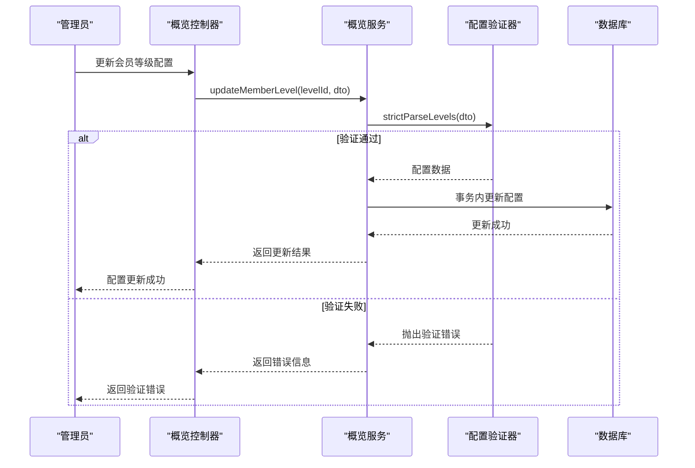
```mermaid
sequenceDiagram
participant Admin as "管理员"
participant Controller as "概览控制器"
participant Service as "概览服务"
participant Validator as "配置验证器"
participant DB as "数据库"
Admin->>Controller : 更新会员等级配置
Controller->>Service : updateMemberLevel(levelId, dto)
Service->>Validator : strictParseLevels(dto)
alt 验证通过
Validator-->>Service : 配置数据
Service->>DB : 事务内更新配置
DB-->>Service : 更新成功
Service-->>Controller : 返回更新结果
Controller-->>Admin : 配置更新成功
else 验证失败
Validator-->>Service : 抛出验证错误
Service-->>Controller : 返回错误信息
Controller-->>Admin : 返回验证错误
end
```

**图表来源**
- [marketing-overview.service.ts](file://src/purely-profit/marketing/marketing-overview.service.ts)

### 配置特性
系统实现了多项会员等级配置特性：

**更新** 配置管理的核心特性：
- **等级门槛校验**：确保铂金等级门槛小于钻石等级门槛
- **百分比转换**：自动处理折扣率百分比和小数的转换
- **描述清理**：自动清理描述中的空白字符
- **状态同步**：有活跃积分活动时强制启用积分功能
- **并发安全**：使用PostgreSQL advisory lock保证配置更新的原子性

**章节来源**
- [member-level-settings.schema.ts](file://src/purely-profit/marketing/schemas/member-level-settings.schema.ts)
- [marketing-overview.service.ts](file://src/purely-profit/marketing/marketing-overview.service.ts)

## 会员等级设置管理服务

### 服务架构设计
会员等级设置管理服务是一个独立的服务模块，提供完整的会员等级CRUD操作和高级管理功能。

**新增** 该服务包含428行完整的功能实现，涵盖以下核心能力：

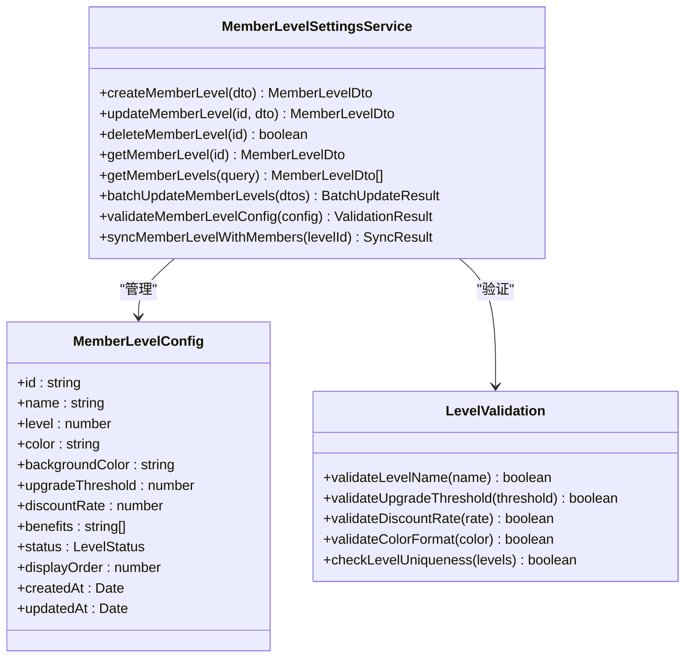
```mermaid
classDiagram
class MemberLevelSettingsService {
+createMemberLevel(dto) MemberLevelDto
+updateMemberLevel(id, dto) MemberLevelDto
+deleteMemberLevel(id) boolean
+getMemberLevel(id) MemberLevelDto
+getMemberLevels(query) MemberLevelDto[]
+batchUpdateMemberLevels(dtos) BatchUpdateResult
+validateMemberLevelConfig(config) ValidationResult
+syncMemberLevelWithMembers(levelId) SyncResult
}
class MemberLevelConfig {
+id : string
+name : string
+level : number
+color : string
+backgroundColor : string
+upgradeThreshold : number
+discountRate : number
+benefits : string[]
+status : LevelStatus
+displayOrder : number
+createdAt : Date
+updatedAt : Date
}
class LevelValidation {
+validateLevelName(name) boolean
+validateUpgradeThreshold(threshold) boolean
+validateDiscountRate(rate) boolean
+validateColorFormat(color) boolean
+checkLevelUniqueness(levels) boolean
}
MemberLevelSettingsService --> MemberLevelConfig : "管理"
MemberLevelSettingsService --> LevelValidation : "验证"
```

**图表来源**
- [marketing-member-level-settings.service.ts](file://src/purely-profit/marketing/marketing-member-level-settings.service.ts)

### 核心功能特性
会员服务提供了全面的会员等级管理功能：

**新增** 主要功能特性：
- **完整的CRUD操作**：支持会员等级的创建、读取、更新、删除操作
- **批量操作支持**：支持批量更新多个会员等级配置
- **智能验证机制**：内置多级验证规则，确保配置数据的正确性
- **冲突检测**：自动检测等级名称、级别编号等唯一性约束
- **成员同步**：支持将等级变更同步到现有会员账户
- **状态管理**：支持启用/禁用会员等级，控制其可用性
- **排序管理**：支持自定义会员等级的显示顺序

### 验证规则设计
服务实现了严格的验证规则来确保数据完整性：

**新增** 验证规则包括：
- **名称验证**：会员等级名称不能为空，长度限制，特殊字符过滤
- **级别验证**：级别编号必须为正整数，不能重复
- **颜色验证**：支持十六进制颜色格式验证
- **阈值验证**：升级门槛必须为正数，符合业务逻辑
- **折扣率验证**：折扣率必须在合理范围内（0-100）
- **状态验证**：确保状态值的合法性

### 成员同步机制
服务提供了会员等级与现有会员的同步功能：

**新增** 同步机制特点：
- **增量同步**：只同步受影响的会员，提高性能
- **事务保证**：同步操作在事务中执行，确保数据一致性
- **错误处理**：单个会员同步失败不影响其他会员
- **日志记录**：记录同步操作的详细信息，便于问题排查

**章节来源**
- [marketing-member-level-settings.service.ts](file://src/purely-profit/marketing/marketing-member-level-settings.service.ts)

## 客户财务管理工具

### 财务工具架构
客户财务管理工具提供了统一的财务数据处理能力，专注于客户余额、充值记录和退款操作的管理。

**新增** 该工具模块实现了以下核心功能：

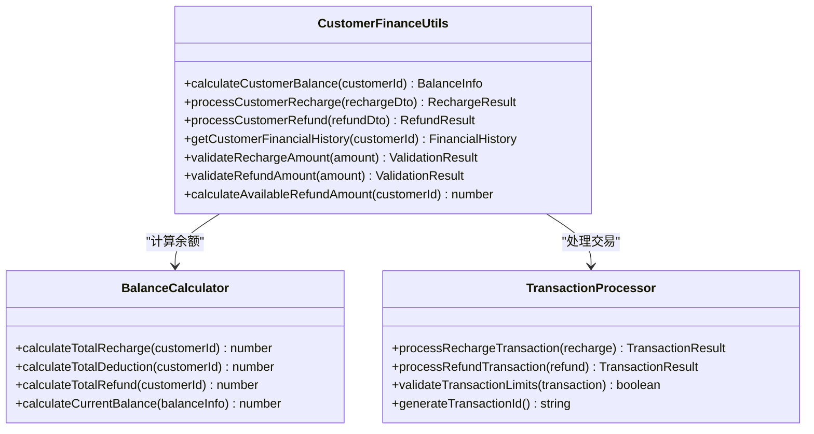
```mermaid
classDiagram
class CustomerFinanceUtils {
+calculateCustomerBalance(customerId) BalanceInfo
+processCustomerRecharge(rechargeDto) RechargeResult
+processCustomerRefund(refundDto) RefundResult
+getCustomerFinancialHistory(customerId) FinancialHistory
+validateRechargeAmount(amount) ValidationResult
+validateRefundAmount(amount) ValidationResult
+calculateAvailableRefundAmount(customerId) number
}
class BalanceCalculator {
+calculateTotalRecharge(customerId) number
+calculateTotalDeduction(customerId) number
+calculateTotalRefund(customerId) number
+calculateCurrentBalance(balanceInfo) number
}
class TransactionProcessor {
+processRechargeTransaction(recharge) TransactionResult
+processRefundTransaction(refund) TransactionResult
+validateTransactionLimits(transaction) boolean
+generateTransactionId() string
}
CustomerFinanceUtils --> BalanceCalculator : "计算余额"
CustomerFinanceUtils --> TransactionProcessor : "处理交易"
```

**图表来源**
- [marketing-customer-finance.utils.ts](file://src/purely-profit/marketing/marketing-customer-finance.utils.ts)

### 余额计算逻辑
财务工具实现了精确的客户余额计算逻辑：

**新增** 余额计算特性：
- **实时计算**：基于当前所有充值、扣款和退款记录计算实际余额
- **精度保证**：使用高精度数值计算，避免浮点数误差
- **事务安全**：余额计算在事务中执行，确保数据一致性
- **缓存优化**：对频繁访问的余额信息进行缓存

### 充值处理流程
充值处理是财务管理的重要环节：

**新增** 充值处理流程：
1. **参数验证**：验证充值金额、支付方式等参数
2. **金额检查**：检查充值金额是否在允许范围内
3. **交易创建**：创建充值交易记录
4. **余额更新**：更新客户账户余额
5. **通知发送**：发送充值成功通知
6. **缓存刷新**：清除相关缓存数据

### 退款处理机制
退款处理需要严格的风险控制：

**新增** 退款处理机制：
- **限额控制**：退款金额不能超过最大可退本金
- **余额验证**：确保退款后余额不为负数
- **赠送清零**：正确处理赠送金额的清零逻辑
- **审批流程**：支持大额退款的审批流程
- **审计记录**：完整记录退款操作的审计信息

**章节来源**
- [marketing-customer-finance.utils.ts](file://src/purely-profit/marketing/marketing-customer-finance.utils.ts)

## 会员积分管理服务

### 积分管理架构
会员积分管理服务提供了全面的积分操作接口，支持积分的增加、减少、查询和历史记录管理。

**新增** 该服务重构了原有的积分管理逻辑，提供更强大的功能：

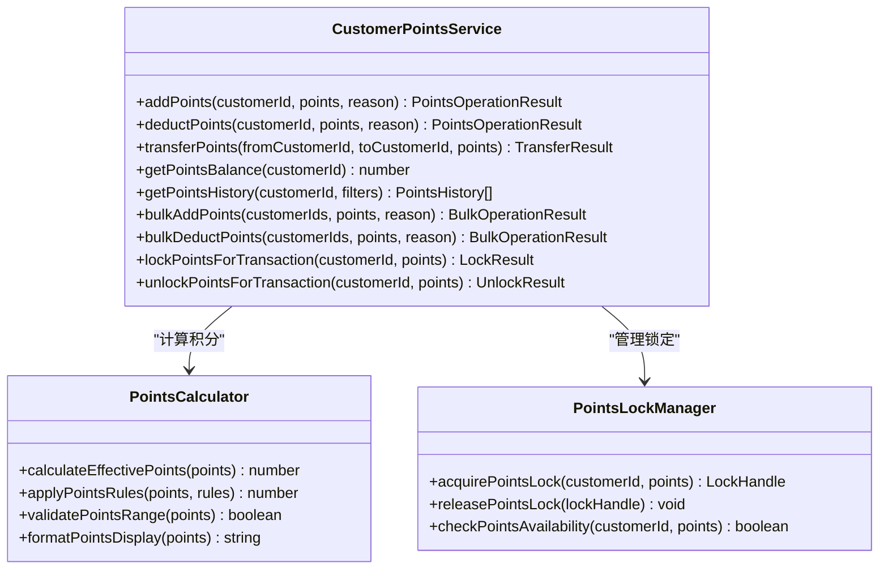
```mermaid
classDiagram
class CustomerPointsService {
+addPoints(customerId, points, reason) PointsOperationResult
+deductPoints(customerId, points, reason) PointsOperationResult
+transferPoints(fromCustomerId, toCustomerId, points) TransferResult
+getPointsBalance(customerId) number
+getPointsHistory(customerId, filters) PointsHistory[]
+bulkAddPoints(customerIds, points, reason) BulkOperationResult
+bulkDeductPoints(customerIds, points, reason) BulkOperationResult
+lockPointsForTransaction(customerId, points) LockResult
+unlockPointsForTransaction(customerId, points) UnlockResult
}
class PointsCalculator {
+calculateEffectivePoints(points) number
+applyPointsRules(points, rules) number
+validatePointsRange(points) boolean
+formatPointsDisplay(points) string
}
class PointsLockManager {
+acquirePointsLock(customerId, points) LockHandle
+releasePointsLock(lockHandle) void
+checkPointsAvailability(customerId, points) boolean
}
CustomerPointsService --> PointsCalculator : "计算积分"
CustomerPointsService --> PointsLockManager : "管理锁定"
```

**图表来源**
- [marketing-customer-points.service.ts](file://src/purely-profit/marketing/marketing-customer-points.service.ts)

### 积分操作类型
服务支持多种积分操作类型：

**新增** 支持的积分操作：
- **积分增加**：支持手动增加、活动奖励、消费返积分等
- **积分扣除**：支持消费抵扣、违规扣除、过期清零等
- **积分转移**：支持会员间积分转让（需权限控制）
- **积分锁定**：支持交易过程中的积分临时锁定
- **批量操作**：支持对多个会员进行批量积分操作

### 积分锁定机制
积分锁定机制确保交易过程中的积分安全：

**新增** 锁定机制特点：
- **事务隔离**：锁定的积分不参与其他交易
- **超时释放**：支持锁定时限，防止死锁
- **优先级控制**：支持不同操作的优先级管理
- **监控告警**：监控长时间未释放的锁

### 积分历史记录
完整的积分历史记录用于审计和分析：

**新增** 历史记录特性：
- **完整追溯**：记录每次积分变动的详细信息
- **关联查询**：支持与订单、活动等业务的关联查询
- **统计分析**：支持积分使用的统计分析
- **导出功能**：支持积分历史的批量导出

**章节来源**
- [marketing-customer-points.service.ts](file://src/purely-profit/marketing/marketing-customer-points.service.ts)

## 营销概览增强功能

### 概览功能增强
营销模块的概览功能得到全面增强，集成了会员等级配置管理和积分规则动态控制。

**更新** 新增的概览增强功能包括：
- **会员等级配置管理**：支持动态修改会员等级配置和积分规则
- **积分功能开关**：根据活跃积分活动自动控制积分功能状态
- **微信收款配置**：集成微信支付配置信息的展示
- **邀请码管理**：支持门店邀请码的生成和二维码展示
- **缓存预热**：支持营销概览数据的缓存预热机制
- **财务数据分析**：集成客户财务数据的分析和展示
- **积分统计报表**：提供积分使用情况和趋势分析

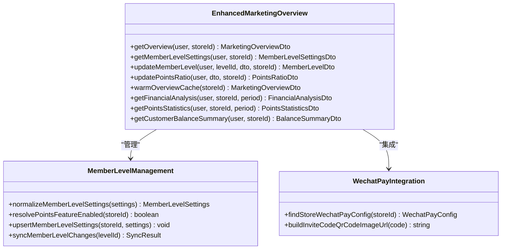
```mermaid
classDiagram
class EnhancedMarketingOverview {
+getOverview(user, storeId) MarketingOverviewDto
+getMemberLevelSettings(user, storeId) MemberLevelSettingsDto
+updateMemberLevel(user, levelId, dto, storeId) MemberLevelDto
+updatePointsRatio(user, dto, storeId) PointsRatioDto
+warmOverviewCache(storeId) MarketingOverviewDto
+getFinancialAnalysis(user, storeId, period) FinancialAnalysisDto
+getPointsStatistics(user, storeId, period) PointsStatisticsDto
+getCustomerBalanceSummary(user, storeId) BalanceSummaryDto
}
class MemberLevelManagement {
+normalizeMemberLevelSettings(settings) MemberLevelSettings
+resolvePointsFeatureEnabled(storeId) boolean
+upsertMemberLevelSettings(storeId, settings) void
+syncMemberLevelChanges(levelId) SyncResult
}
class WechatPayIntegration {
+findStoreWechatPayConfig(storeId) WechatPayConfig
+buildInviteCodeQrCodeImageUrl(code) string
}
EnhancedMarketingOverview --> MemberLevelManagement : "管理"
EnhancedMarketingOverview --> WechatPayIntegration : "集成"
```

**图表来源**
- [marketing-overview.service.ts](file://src/purely-profit/marketing/marketing-overview.service.ts)
- [marketing-overview.facade.service.ts](file://src/purely-profit/marketing/marketing-overview.facade.service.ts)

### 概览数据增强流程
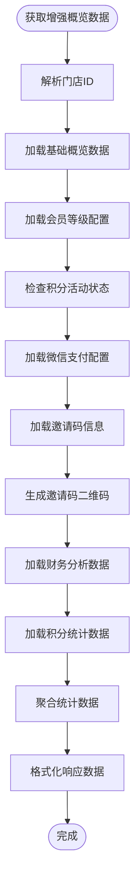
```mermaid
flowchart TD
Start([获取增强概览数据]) --> ResolveStore["解析门店ID"]
ResolveStore --> LoadBaseData["加载基础概览数据"]
LoadBaseData --> LoadMemberSettings["加载会员等级配置"]
LoadMemberSettings --> CheckPointsActivity["检查积分活动状态"]
CheckPointsActivity --> LoadWechatConfig["加载微信支付配置"]
LoadWechatConfig --> LoadInviteCode["加载邀请码信息"]
LoadInviteCode --> BuildQRCode["生成邀请码二维码"]
BuildQRCode --> LoadFinancialData["加载财务分析数据"]
LoadFinancialData --> LoadPointsStats["加载积分统计数据"]
LoadPointsStats --> AggregateData["聚合统计数据"]
AggregateData --> FormatResponse["格式化响应数据"]
FormatResponse --> End([完成])
```

**图表来源**
- [marketing-overview.service.ts](file://src/purely-profit/marketing/marketing-overview.service.ts)

### 缓存预热机制
系统实现了营销概览数据的缓存预热机制，提升系统响应性能。

**更新** 缓存预热的关键特性：
- **定时预热**：支持定时任务预热营销概览数据
- **智能失效**：数据变更时自动清除相关缓存
- **批量预热**：支持按门店维度批量预热缓存
- **监控指标**：提供缓存预热的性能监控指标
- **财务数据缓存**：新增财务分析数据的缓存机制
- **积分统计缓存**：新增积分统计数据的缓存机制

**章节来源**
- [marketing-overview.controller.ts](file://src/purely-profit/marketing/marketing-overview.controller.ts)
- [marketing-overview.service.ts](file://src/purely-profit/marketing/marketing-overview.service.ts)
- [marketing-overview.facade.service.ts](file://src/purely-profit/marketing/marketing-overview.facade.service.ts)
- [cache-prewarm-marketing-overview.provider.ts](file://src/redis/cache-prewarm-marketing-overview.provider.ts)

## 展示文案预计算机制

### 文案生成系统
营销模块实现了促销展示文案的预计算和存储机制，确保前后端展示的一致性。

**更新** 新增的展示文案预计算系统包括：
- **多类型支持**：支持折扣、满减、充值赠送、首单优惠、积分充值等多种促销类型
- **智能格式化**：自动处理数字格式、货币单位和文案结构
- **兼容性处理**：支持新旧参数格式的自动转换和兼容
- **预计算存储**：在创建/更新促销时预计算展示文案并存储到数据库

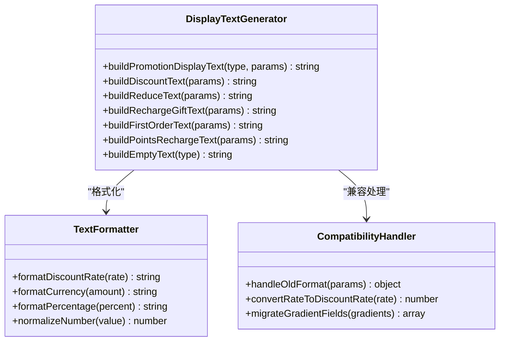
```mermaid
classDiagram
class DisplayTextGenerator {
+buildPromotionDisplayText(type, params) string
+buildDiscountText(params) string
+buildReduceText(params) string
+buildRechargeGiftText(params) string
+buildFirstOrderText(params) string
+buildPointsRechargeText(params) string
+buildEmptyText(type) string
}
class TextFormatter {
+formatDiscountRate(rate) string
+formatCurrency(amount) string
+formatPercentage(percent) string
+normalizeNumber(value) number
}
class CompatibilityHandler {
+handleOldFormat(params) object
+convertRateToDiscountRate(rate) number
+migrateGradientFields(gradients) array
}
DisplayTextGenerator --> TextFormatter : "格式化"
DisplayTextGenerator --> CompatibilityHandler : "兼容处理"
```

**图表来源**
- [marketing.mapper.ts](file://src/purely-profit/marketing/marketing.mapper.ts)

### 文案生成流程
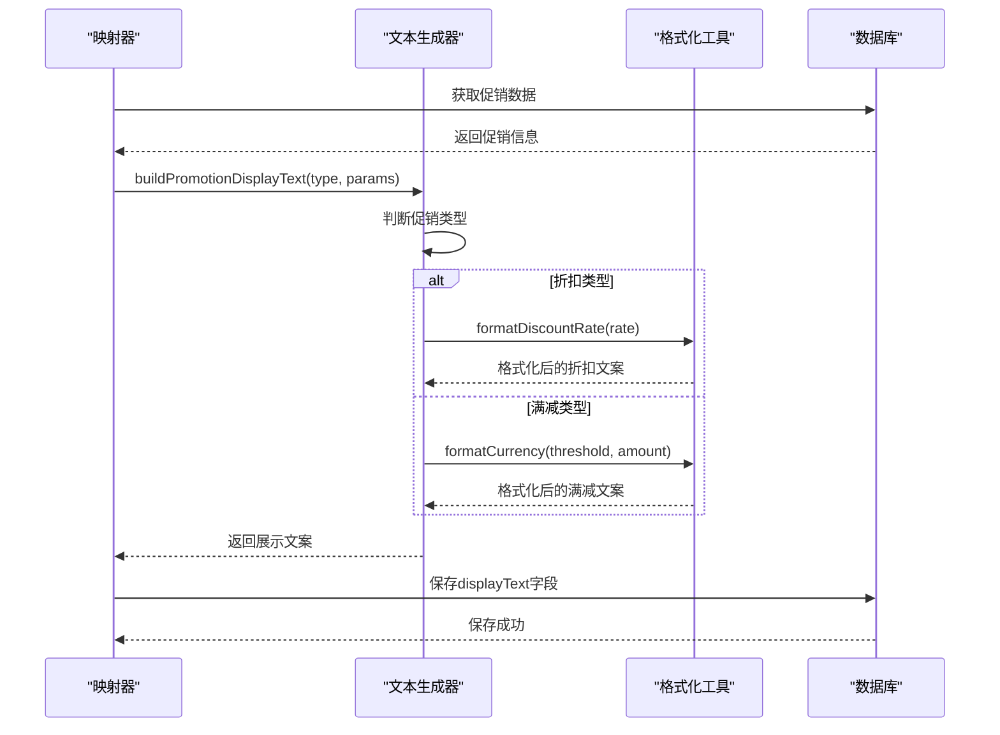
```mermaid
sequenceDiagram
participant Mapper as "映射器"
participant Generator as "文本生成器"
participant Formatter as "格式化工具"
participant DB as "数据库"
Mapper->>DB : 获取促销数据
DB-->>Mapper : 返回促销信息
Mapper->>Generator : buildPromotionDisplayText(type, params)
Generator->>Generator : 判断促销类型
alt 折扣类型
Generator->>Formatter : formatDiscountRate(rate)
Formatter-->>Generator : 格式化后的折扣文案
else 满减类型
Generator->>Formatter : formatCurrency(threshold, amount)
Formatter-->>Generator : 格式化后的满减文案
end
Generator-->>Mapper : 返回展示文案
Mapper->>DB : 保存displayText字段
DB-->>Mapper : 保存成功
```

**图表来源**
- [marketing.mapper.ts](file://src/purely-profit/marketing/marketing.mapper.ts)

### 支持的促销类型和文案格式
系统支持以下促销类型的展示文本生成：

**更新** 各类型的具体文案格式：
- **折扣类型**：`打 X 折` 或 `打 X.X 折`（如"打 8 折"、"打 8.5 折"）
- **满减类型**：`满 ¥X 减 ¥Y`（如"满 ¥50 减 ¥8"）
- **充值赠送**：`充 ¥X 赠 ¥Y` 或 `充 ¥X 赠 ¥Y 起`（多档时追加"起"字）
- **首单优惠**：`首单 X.X 折`（如"首单 7.5 折"）
- **积分充值**：`充 ¥100 赠 X 积分`（支持小数点后两位）
- **免单类型**：`免单`
- **双倍积分**：`双倍积分`

**章节来源**
- [marketing.mapper.ts](file://src/purely-profit/marketing/marketing.mapper.ts)

## 金额字段处理优化

### 金额处理机制
营销模块实现了完善的金额字段处理机制，确保元分和单位的正确转换。

**更新** 新增的金额处理功能包括：
- **智能解析**：优先使用Zod schema进行严格验证和解析
- **降级处理**：当Zod验证失败时回退到手写规范化逻辑
- **格式兼容**：支持新旧参数格式的自动转换
- **类型安全**：确保最终输出的数据结构符合预期

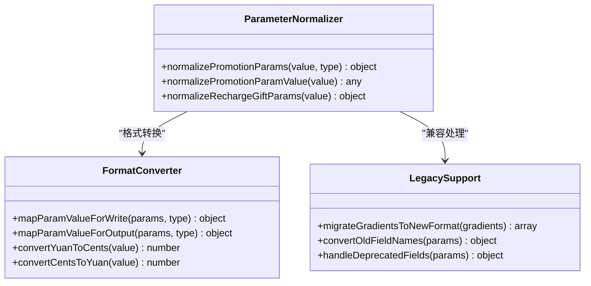
```mermaid
classDiagram
class ParameterNormalizer {
+normalizePromotionParams(value, type) object
+normalizePromotionParamValue(value) any
+normalizeRechargeGiftParams(value) object
}
class FormatConverter {
+mapParamValueForWrite(params, type) object
+mapParamValueForOutput(params, type) object
+convertYuanToCents(value) number
+convertCentsToYuan(value) number
}
class LegacySupport {
+migrateGradientsToNewFormat(gradients) array
+convertOldFieldNames(params) object
+handleDeprecatedFields(params) object
}
ParameterNormalizer --> FormatConverter : "格式转换"
ParameterNormalizer --> LegacySupport : "兼容处理"
```

**图表来源**
- [marketing.mapper.ts](file://src/purely-profit/marketing/marketing.mapper.ts)

### 规范化处理流程
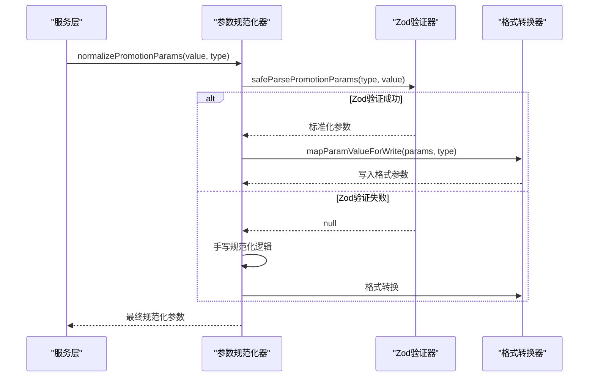
```mermaid
sequenceDiagram
participant Service as "服务层"
participant Normalizer as "参数规范化器"
participant Validator as "Zod验证器"
participant Converter as "格式转换器"
Service->>Normalizer : normalizePromotionParams(value, type)
Normalizer->>Validator : safeParsePromotionParams(type, value)
alt Zod验证成功
Validator-->>Normalizer : 标准化参数
Normalizer->>Converter : mapParamValueForWrite(params, type)
Converter-->>Normalizer : 写入格式参数
else Zod验证失败
Validator-->>Normalizer : null
Normalizer->>Normalizer : 手写规范化逻辑
Normalizer->>Converter : 格式转换
end
Normalizer-->>Service : 最终规范化参数
```

**图表来源**
- [marketing.mapper.ts](file://src/purely-profit/marketing/marketing.mapper.ts)

### 金额字段处理
系统实现了统一的金额字段处理机制，确保元分和单位的正确转换。

**更新** 金额处理的特性：
- **写入转换**：前端输入的元单位自动转换为数据库存储的分单位
- **输出转换**：数据库的分单位自动转换为前端显示的元单位
- **精度保证**：使用Money工具类确保金额计算的精度
- **字段识别**：自动识别需要转换的金额字段名称

**章节来源**
- [marketing.mapper.ts](file://src/purely-profit/marketing/marketing.mapper.ts)

## 营销产品DTO架构重构

### 重构概述
营销产品模块的DTO架构经历了重大重构，将原本的大型单一文件拆分为专门的职责分离文件，显著提升了代码的组织性和可维护性。

**更新** 重构的主要内容包括：
- **职责分离**：将产品创建、更新、查询、切换等不同职责的DTO分离到独立文件
- **响应集中化**：将所有API响应相关的DTO集中到独立的响应文件中
- **分类管理**：为产品分类管理创建专门的DTO文件
- **转换工具**：提取通用的转换函数到独立的工具文件

### 新的DTO架构结构

```mermaid
graph TB
subgraph "营销产品DTO架构"
MainDTO["marketing-product.dto.ts<br/>产品创建/更新DTO"]
CategoryDTO["marketing-product-category.dto.ts<br/>分类管理DTO"]
QueryDTO["marketing-product-query.dto.ts<br/>查询参数DTO"]
ToggleDTO["marketing-product-toggle.dto.ts<br/>上架/下架DTO"]
ResponseDTO["marketing-product.response.dto.ts<br/>响应DTO集合"]
Transforms["marketing-product-transforms.ts<br/>转换工具"]
end
subgraph "职责分离"
CreateUpdate["创建/更新操作"]
CategoryOps["分类操作"]
QueryOps["查询操作"]
ToggleOps["状态切换"]
ResponseOps["响应处理"]
UtilityOps["工具函数"]
end
MainDTO --> CreateUpdate
CategoryDTO --> CategoryOps
QueryDTO --> QueryOps
ToggleDTO --> ToggleOps
ResponseDTO --> ResponseOps
Transforms --> UtilityOps
```

**图表来源**
- [marketing-product.dto.ts](file://src/purely-profit/marketing/dto/marketing-product.dto.ts)
- [marketing-product-category.dto.ts](file://src/purely-profit/marketing/dto/marketing-product-category.dto.ts)
- [marketing-product-query.dto.ts](file://src/purely-profit/marketing/dto/marketing-product-query.dto.ts)
- [marketing-product-toggle.dto.ts](file://src/purely-profit/marketing/dto/marketing-product-toggle.dto.ts)
- [marketing-product.response.dto.ts](file://src/purely-profit/marketing/dto/marketing-product.response.dto.ts)
- [marketing-product-transforms.ts](file://src/purely-profit/marketing/dto/marketing-product-transforms.ts)

### 分类管理DTO详解
产品分类管理现在拥有独立的DTO结构，支持更精细的分类控制：

**更新** 分类管理DTO的特点：
- **创建DTO**：`CreateMarketingProductCategoryDto` - 用于创建新的产品分类
- **更新DTO**：`UpdateMarketingCategoryDto` - 用于更新现有分类信息
- **验证规则**：支持分类名称的长度限制、图标格式验证
- **可选字段**：图标字段支持emoji或图片URL格式

### 查询DTO优化
查询参数DTO经过优化，提供更好的查询体验：

**更新** 查询DTO的改进：
- **分页支持**：继承自`MarketingPageQueryDto`，提供标准分页功能
- **筛选选项**：支持按分类ID筛选产品列表
- **排序功能**：支持多种排序方式（创建时间、名称、价格等）
- **类型安全**：使用枚举类型确保排序参数的合法性

### 切换操作DTO
产品状态切换操作现在拥有专门的DTO：

**更新** 切换操作DTO的特性：
- **简洁设计**：仅包含`isActive`布尔字段，表示上架/下架状态
- **类型验证**：使用`@IsBoolean`装饰器确保参数类型正确
- **API文档**：通过`@ApiProperty`提供清晰的API文档说明

### 响应DTO集中化
所有响应相关的DTO现在集中在独立的文件中：

**更新** 响应DTO的结构：
- **产品详情**：`MarketingProductDto` - 单个产品的详细信息
- **产品列表**：`MarketingProductsResponseDto` - 产品列表响应，包含分页信息
- **分类详情**：`MarketingProductCategoryDto` - 分类详细信息
- **分类列表**：`MarketingProductCategoriesResponseDto` - 分类列表响应
- **计费计算**：`CalculateTimingPriceDto`和`CalculateTimingPriceResponseDto` - 计时单价计算

### 转换工具优化
通用的转换函数被提取到独立的工具文件中：

**更新** 转换工具的功能：
- **整数转换**：`transformNullableInt` - 支持可空整数的转换
- **金额转换**：`transformNullableYuan` - 支持可空元金额的转换
- **字符串处理**：`trimString` - 字符串修剪处理
- **常量定义**：`MARKETING_PRODUCT_IMAGE_MAX_LENGTH` - 图片长度限制常量

### 重构带来的优势

**更新** DTO重构带来的主要优势：
- **代码组织性**：每个文件职责明确，便于维护和扩展
- **类型安全性**：通过TypeScript类型系统确保API契约的准确性
- **可测试性**：独立的DTO文件便于单元测试和集成测试
- **文档生成**：通过NestJS Swagger装饰器自动生成API文档
- **向后兼容**：保持现有API接口的兼容性，不影响现有客户端

### 使用示例
重构后的DTO使用更加直观和规范：

**更新** 使用示例：
```typescript
// 创建产品 - 使用专门的创建DTO
const createDto: CreateMarketingProductDto = {
  name: '推拿套餐',
  categoryId: 1,
  price: 298,
  // ... 其他字段
};

// 查询产品 - 使用专门的查询DTO
const queryDto: ListMarketingProductsQueryDto = {
  categoryId: 1,
  sortBy: 'createdAt',
  page: 1,
  pageSize: 20
};

// 切换产品状态 - 使用专门的切换DTO
const toggleDto: ToggleMarketingProductDto = {
  isActive: true
};
```

**章节来源**
- [marketing-product.dto.ts](file://src/purely-profit/marketing/dto/marketing-product.dto.ts)
- [marketing-product-category.dto.ts](file://src/purely-profit/marketing/dto/marketing-product-category.dto.ts)
- [marketing-product-query.dto.ts](file://src/purely-profit/marketing/dto/marketing-product-query.dto.ts)
- [marketing-product-toggle.dto.ts](file://src/purely-profit/marketing/dto/marketing-product-toggle.dto.ts)
- [marketing-product.response.dto.ts](file://src/purely-profit/marketing/dto/marketing-product.response.dto.ts)
- [marketing-product-transforms.ts](file://src/purely-profit/marketing/dto/marketing-product-transforms.ts)
- [marketing-products.controller.ts](file://src/purely-profit/marketing/marketing-products.controller.ts)
- [marketing-product-categories.controller.ts](file://src/purely-profit/marketing/marketing-product-categories.controller.ts)
- [marketing-products.facade.service.ts](file://src/purely-profit/marketing/marketing-products.facade.service.ts)

## 依赖分析
营销模块与系统其他模块存在紧密的依赖关系，形成了完整的业务生态：

```mermaid
graph TB
subgraph "营销模块"
Marketing["营销模块"]
Customers["客户管理"]
Promotions["促销活动"]
Products["营销产品"]
Transactions["交易记录"]
PointsRecords["积分流水"]
Schemas["Schema验证"]
MoneyUtils["金额工具"]
PromoRewards["促销奖励"]
ReferralTracking["推荐追踪"]
MemberLevelConfig["会员等级配置"]
MemberLevelSettings["会员等级设置管理"]
CustomerFinance["客户财务管理"]
CustomerPoints["会员积分管理"]
DisplayText["展示文案生成"]
ProductCategories["产品分类管理"]
DTOLayer["DTO传输层"]
end
subgraph "外部模块"
Member["会员模块"]
Goods["商品模块"]
Operations["运营模块"]
Finance["财务模块"]
Club["PurelyClub模块"]
Redis["Redis缓存"]
Auth["认证模块"]
end
Marketing --> Member
Marketing --> Goods
Marketing --> Operations
Marketing --> Finance
Marketing --> Auth
Customers --> Member
Promotions --> Goods
Products --> Goods
Transactions --> Operations
Transactions --> Finance
PointsRecords --> Member
PromoRewards --> Member
ReferralTracking --> Auth
Member --> Club
Club --> Member
Redis --> Marketing
Schemas --> Marketing
MoneyUtils --> Marketing
MemberLevelConfig --> Schemas
MemberLevelSettings --> MemberLevelConfig
CustomerFinance --> Member
CustomerPoints --> Member
DisplayText --> MoneyUtils
ProductCategories --> Member
DTOLayer --> Products
DTOLayer --> Promotions
DTOLayer --> Customers
```

**图表来源**
- [marketing-customers.service.ts](file://src/purely-profit/marketing/marketing-customers.service.ts)
- [marketing-promotions.service.ts](file://src/purely-profit/marketing/marketing-promotions.service.ts)
- [marketing-products.service.ts](file://src/purely-profit/marketing/marketing-products.service.ts)
- [marketing-consumptions.service.ts](file://src/purely-profit/marketing/marketing-consumptions.service.ts)
- [promotion-params.schema.ts](file://src/purely-profit/marketing/schemas/promotion-params.schema.ts)
- [member-level-settings.schema.ts](file://src/purely-profit/marketing/schemas/member-level-settings.schema.ts)
- [marketing-overview.service.ts](file://src/purely-profit/marketing/marketing-overview.service.ts)
- [marketing.mapper.ts](file://src/purely-profit/marketing/marketing.mapper.ts)
- [marketing-member-level-settings.service.ts](file://src/purely-profit/marketing/marketing-member-level-settings.service.ts)
- [marketing-customer-finance.utils.ts](file://src/purely-profit/marketing/marketing-customer-finance.utils.ts)
- [marketing-customer-points.service.ts](file://src/purely-profit/marketing/marketing-customer-points.service.ts)

### 数据模型关系图
```mermaid
erDiagram
CUSTOMER {
string id PK
string name
string phone
string email
string level
number points
string status
datetime created_at
datetime updated_at
}
PROMOTION {
string id PK
string name
string type
string status
datetime start_time
datetime end_time
number discount_rate
number min_amount
number max_discount
number usage_limit
text display_text
}
MARKETING_PRODUCT {
string id PK
string name
string category_id
number price
number cost_price
number stock
number sales_volume
string status
string unit
}
CONSUMPTION_RECORD {
string id PK
string customer_id
string order_id
string product_id
number quantity
number unit_price
number total_amount
number discount_amount
number points_earned
string channel
string status
datetime created_at
}
RECHARGE_RECORD {
string id PK
string customer_id
number amount
number points
string payment_method
string order_no
string status
datetime created_at
}
MEMBER_LEVEL_CONFIG {
string level_id PK
string level_name
string level_color
string background_color
number upgrade_threshold
number discount_rate
string benefits
string status
number display_order
}
MEMBER_LEVEL_SETTINGS {
string id PK
string store_id
jsonb levels
jsonb points_ratio
boolean points_feature_enabled
datetime created_at
datetime updated_at
}
CUSTOMER_FINANCE {
string id PK
string customer_id
number balance
number total_recharge
number total_deduction
number total_refund
datetime last_transaction_at
}
MARKETING_POINTS_RECORD {
integer id PK
integer store_id
integer customer_id
integer amount
enum type
string description
datetime created_at
}
CUSTOMER ||--o{ CONSUMPTION_RECORD : "产生"
PROMOTION ||--o{ CONSUMPTION_RECORD : "应用"
MARKETING_PRODUCT ||--o{ CONSUMPTION_RECORD : "销售"
CUSTOMER ||--o{ RECHARGE_RECORD : "充值"
CUSTOMER ||--|| MEMBER_LEVEL_CONFIG : "拥有"
CUSTOMER ||--o{ MARKETING_POINTS_RECORD : "产生"
CUSTOMER ||--|| CUSTOMER_FINANCE : "拥有"
STORE ||--o{ MEMBER_LEVEL_SETTINGS : "配置"
```

**图表来源**
- [customers.prisma](file://prisma/purely-profit/marketing/customers.prisma)
- [promotions.prisma](file://prisma/purely-profit/marketing/promotions.prisma)
- [products.prisma](file://prisma/purely-profit/marketing/products.prisma)
- [marketing-points-records.prisma](file://prisma/purely-profit/marketing/marketing-points-records.prisma)

**章节来源**
- [marketing.types.ts](file://src/purely-profit/marketing/marketing.types.ts)
- [marketing.mapper.ts](file://src/purely-profit/marketing/marketing.mapper.ts)

## 性能考虑
营销模块在设计时充分考虑了性能优化，采用了多种策略来提升系统响应速度和吞吐量：

### 缓存策略
- **热点数据缓存**：客户积分、促销活动状态、热门产品信息等高频访问数据
- **分页缓存**：列表查询结果按查询条件进行缓存，减少重复查询
- **会话缓存**：用户登录状态和权限信息的短期缓存
- **会员等级缓存**：动态会员等级配置的缓存机制
- **促销类型缓存**：新增促销类型的枚举和配置缓存
- **概览数据缓存**：增强的营销概览数据缓存机制
- **财务数据缓存**：新增客户财务数据的缓存机制
- **积分统计缓存**：新增积分统计数据的缓存机制
- **可配置TTL缓存**：客户列表缓存TTL为60秒，促销列表缓存TTL为60秒
- **后台刷新缓存**：在缓存即将过期前自动刷新，确保数据新鲜度
- **短期详情缓存**：顾客详情缓存TTL为15秒，显著提升高频访问性能

### 查询优化
- **索引优化**：在常用查询字段上建立复合索引，如客户手机号、促销活动时间范围、促销类型
- **批量操作**：支持批量导入导出，减少网络往返次数
- **延迟加载**：非关键信息采用延迟加载策略
- **描述标题索引**：为新增的description_title字段建立索引优化
- **单位字段索引**：为新增的unit字段建立索引优化
- **缓存键优化**：使用结构化的缓存键提高查找效率
- **财务查询优化**：优化客户财务数据的查询性能
- **积分历史索引**：为积分历史记录建立复合索引

### 异步处理
- **异步任务**：积分计算、报表生成、邮件通知等耗时操作异步化
- **消息队列**：营销推送、数据分析等解耦处理
- **缓存失效**：营销概览数据的智能缓存失效机制
- **后台刷新**：客户和促销列表的后台数据刷新
- **批量同步**：会员等级变更的批量同步处理
- **异步通知**：财务变动的异步通知机制

### 幂等性性能优化
- **原子更新**：使用数据库原子操作确保并发安全
- **批量处理**：支持批量检查和更新未充值的推广记录
- **索引优化**：为partner_id和registered_at建立复合索引
- **异步奖励**：推广奖励发放采用异步处理，不阻塞主流程
- **缓存失效**：奖励发放后自动清除相关缓存

### 展示文案生成性能优化
- **预计算存储**：促销展示文案在创建/更新时预计算并存储到数据库
- **缓存优化**：展示文本直接读取数据库字段，避免运行时计算
- **一致性保证**：确保前后端展示文案的完全一致性

### 参数验证性能优化
- **Schema缓存**：Zod schema编译结果缓存，避免重复编译
- **快速路径**：常见参数格式的快速验证路径
- **降级处理**：验证失败时的快速回退机制

### 金额处理性能优化
- **Money工具缓存**：Money工具类的实例缓存
- **Decimal.js缓存**：Decimal对象的缓存机制
- **批量转换**：支持批量金额转换操作
- **精度控制优化**：优化精度控制算法，减少计算开销

### 新服务性能优化
- **会员等级服务优化**：批量操作的性能优化和缓存机制
- **财务工具优化**：余额计算的缓存和异步处理
- **积分服务优化**：积分操作的批量处理和锁机制优化
- **内存管理**：大对象处理的内存优化策略

### DTO重构性能优化
**更新** DTO重构带来的性能改进：
- **模块化加载**：按需加载特定的DTO文件，减少内存占用
- **类型检查优化**：利用TypeScript编译时类型检查，减少运行时验证开销
- **缓存友好**：结构化的DTO设计有利于缓存策略的实施
- **序列化优化**：优化的DTO结构减少JSON序列化的开销

## 故障排除指南
营销模块提供了完善的错误处理和监控机制：

### 缓存相关问题
- **缓存未命中**：检查缓存键是否正确构建，确认TTL配置合理
- **缓存数据过期**：验证后台刷新机制是否正常运行
- **缓存失效不及时**：检查数据变更时的缓存清理逻辑
- **缓存键冲突**：确认缓存键的唯一性和结构化设计
- **短期详情缓存**：检查15秒TTL的顾客详情缓存是否正常工作

### 退款相关问题
- **退款金额超限**：检查累计充值金额和累计退款金额，确认退款不超过最大可退本金
- **余额不足**：验证客户当前实际余额，确保退款金额不超过可用余额
- **赠送清零计算错误**：检查赠送清零金额的计算逻辑和时间顺序
- **退款记录缺失**：核对退款记录的时间戳和ID排序

### 积分调整相关问题
- **积分余额不足**：检查客户当前积分余额，确认扣除金额不超过可用余额
- **会员积分同步失败**：验证关联会员是否存在，检查会员积分状态
- **并发调整冲突**：系统自动使用条件更新防止并发扣减，如遇冲突请稍后重试
- **事务回滚**：检查数据库连接状态，确认事务执行过程中没有异常
- **权限不足**：确认当前用户具有marketing:manage权限
- **手机号关联问题**：检查客户手机号是否正确关联到会员系统

### 价格格式化相关问题
- **字符串价格转换失败**：检查输入格式，确认字符串为有效的数字格式
- **精度丢失问题**：验证Decimal.js的使用，确保高精度计算
- **格式化输出异常**：检查格式化规则，确认输出格式符合预期
- **金额验证失败**：验证金额范围和类型，检查边界条件处理
- **Money对象创建失败**：检查输入参数，确认数值在有效范围内

### 展示文本生成问题
- **文案为空**：检查促销参数是否完整，确认参数格式是否符合要求
- **文案格式错误**：验证参数类型和数值范围，检查特殊字符处理
- **前后端不一致**：确认后端displayText字段是否正确生成和存储
- **兼容性错误**：检查旧格式参数的转换逻辑是否正常

### 参数验证问题
- **验证失败**：检查Zod schema定义，确认参数结构符合要求
- **类型不匹配**：验证数据类型，检查数值范围和格式
- **兼容性问题**：检查新旧参数格式的转换逻辑
- **性能问题**：监控验证性能，优化schema定义和验证逻辑

### 金额处理相关问题
- **元分转换错误**：检查转换逻辑，确认1元=100分的转换规则
- **精度计算错误**：验证Decimal.js的使用，确保高精度计算
- **四舍五入异常**：检查舍入规则，确认使用正确的舍入方法
- **范围溢出问题**：验证数值范围，防止超出安全整数范围
- **Money对象异常**：检查Money对象的状态，确认内部cent值正确

### 会员等级配置问题
- **配置验证失败**：检查Zod schema定义，确认配置结构符合要求
- **等级门槛冲突**：验证铂金等级门槛是否小于钻石等级门槛
- **并发更新冲突**：检查数据库锁机制，确认配置更新的原子性
- **默认值回退**：验证配置验证失败时的默认值回退逻辑
- **积分功能状态**：检查活跃积分活动对积分功能状态的强制控制

### 会员等级设置管理问题
- **等级创建失败**：检查名称唯一性、级别编号冲突等验证规则
- **批量更新异常**：检查批量操作的事务处理和错误恢复机制
- **成员同步失败**：验证会员同步逻辑和权限控制
- **状态切换问题**：检查等级启用/禁用的状态同步机制
- **排序更新异常**：验证排序号的唯一性和连续性

### 客户财务问题
- **余额计算错误**：检查充值、扣款、退款记录的准确性
- **充值处理失败**：验证支付渠道回调和交易状态同步
- **退款审批异常**：检查审批流程和权限控制
- **财务数据不一致**：验证财务数据的完整性和一致性
- **并发财务操作**：检查财务操作的并发控制和锁机制

### 会员积分问题
- **积分操作失败**：检查积分余额、操作权限和事务状态
- **积分锁定异常**：验证锁机制和超时处理
- **批量积分操作**：检查批量操作的性能和错误处理
- **积分历史记录**：验证历史记录的完整性和查询性能
- **积分转移问题**：检查转移权限和双方账户状态

### 营销概览问题
- **概览数据过期**：验证缓存失效机制和数据同步状态
- **会员等级配置异常**：检查配置schema验证和默认值回退逻辑
- **积分功能状态异常**：验证活跃积分活动的检测逻辑
- **微信支付配置缺失**：检查微信支付配置表的查询逻辑
- **邀请码生成失败**：验证邀请码生成和二维码生成逻辑
- **缓存预热失败**：检查缓存预热任务的执行状态和错误日志
- **财务分析数据异常**：验证财务数据的计算和聚合逻辑
- **积分统计错误**：检查积分统计的准确性和性能

### DTO重构相关问题
**更新** DTO重构可能遇到的问题：
- **导入路径错误**：检查DTO文件的导入路径是否正确更新
- **类型定义缺失**：确认所有必要的类型定义都已迁移到新文件
- **API文档不一致**：验证Swagger文档是否与新的DTO结构保持一致
- **向后兼容性**：确保现有客户端调用不受DTO重构影响
- **测试用例更新**：更新相关的单元测试和集成测试用例

### 常见问题及解决方案
- **客户积分异常**：检查积分变更日志，确认是否存在并发修改
- **促销活动失效**：验证活动时间范围和使用限制，检查新增促销类型的配置
- **产品库存不一致**：检查库存锁定机制和事务一致性
- **交易记录缺失**：核对交易流水和数据库同步状态
- **首单优惠不生效**：检查会员首单资格验证和促销配置
- **积分充值活动异常**：验证充值金额阈值、赠送积分计算和活动有效期
- **每日折扣活动异常**：检查时间段限制、商品适用性和星期限制
- **会员等级显示异常**：验证等级配置同步和兼容性检查
- **描述标题显示异常**：检查description_title字段的设置和格式
- **促销类型冲突**：验证促销类型的唯一性约束和冲突解决
- **历史类型修复失败**：检查points2x到discount的类型转换是否正确
- **概览数据过期**：验证缓存失效机制和数据同步状态
- **缓存性能下降**：监控缓存命中率，调整TTL和刷新策略
- **短期详情缓存问题**：检查15秒TTL的顾客详情缓存配置和失效机制
- **退款金额计算错误**：验证本金充值和余额限制的校验逻辑
- **并发保护失效**：检查促销管理的并发控制机制
- **单位字段缺失**：确认产品单位字段的设置和查询支持
- **电话号码规范化失败**：检查国家码去除和非数字字符过滤逻辑
- **交易安全更新异常**：验证事务包裹和手机号同步机制
- **产品查询性能问题**：监控分类筛选和排序选项的执行效率
- **错误处理性能**：检查异常分类和错误映射的处理速度
- **会员等级同步延迟**：检查批量同步的性能和错误处理
- **财务数据不一致**：验证财务交易的完整性和一致性检查
- **积分锁定超时**：检查锁超时设置和自动释放机制
- **批量操作性能问题**：优化批量操作的分批处理和进度跟踪
- **DTO导入错误**：检查新的DTO文件导入路径和依赖关系
- **类型定义冲突**：验证不同类型定义之间的兼容性
- **API版本兼容**：确保DTO重构不影响现有API的版本兼容性

**章节来源**
- [marketing.utils.ts](file://src/purely-profit/marketing/marketing.utils.ts)
- [marketing-customers.service.ts](file://src/purely-profit/marketing/marketing-customers.service.ts)
- [marketing-promotions.service.ts](file://src/purely-profit/marketing/marketing-promotions.service.ts)
- [marketing-products.service.ts](file://src/purely-profit/marketing/marketing-products.service.ts)
- [marketing.mapper.ts](file://src/purely-profit/marketing/marketing.mapper.ts)
- [promotion-params.schema.ts](file://src/purely-profit/marketing/schemas/promotion-params.schema.ts)
- [member-level-settings.schema.ts](file://src/purely-profit/marketing/schemas/member-level-settings.schema.ts)
- [marketing-overview.service.ts](file://src/purely-profit/marketing/marketing-overview.service.ts)
- [marketing-member-level-settings.service.ts](file://src/purely-profit/marketing/marketing-member-level-settings.service.ts)
- [marketing-customer-finance.utils.ts](file://src/purely-profit/marketing/marketing-customer-finance.utils.ts)
- [marketing-customer-points.service.ts](file://src/purely-profit/marketing/marketing-customer-points.service.ts)

## 结论
营销推广模块通过模块化的架构设计和完善的业务功能，为企业提供了全方位的营销解决方案。模块不仅支持基础的客户管理和促销活动，更重要的是建立了完整的营销数据闭环，能够支撑精准营销、客户分群、效果评估等高级功能。

**更新** 本次重大更新显著增强了营销模块的功能和能力：

新增的核心功能包括：
- **会员等级设置管理服务**：428行完整的功能实现，提供全面的会员等级CRUD操作和管理能力
- **客户财务管理工具**：统一的财务数据处理，支持余额计算、充值处理、退款管理等
- **会员积分管理服务**：重构的积分管理系统，提供更强大的积分操作和查询能力
- **Zod模式验证系统**：为所有促销参数提供严格的类型检查和数据规范化
- **营销概览增强**：集成会员等级配置管理和积分规则动态控制
- **展示文案预计算**：预计算并存储促销展示文案，确保前后端一致性
- **金额处理优化**：完善的元分和单位转换机制，支持新旧格式兼容

**最新更新** 营销产品DTO架构的重大重构进一步提升了系统的可维护性和扩展性：

- **职责分离**：将大型单一文件拆分为专门的职责分离文件
- **代码组织性**：每个文件职责明确，便于维护和扩展
- **类型安全性**：通过TypeScript类型系统确保API契约的准确性
- **可测试性**：独立的DTO文件便于单元测试和集成测试
- **文档生成**：通过NestJS Swagger装饰器自动生成API文档

这些改进显著提升了营销模块的智能化水平和数据安全性，为营销活动执行提供了更加智能和安全的技术支撑。新的服务架构分离了关注点，提高了代码的可维护性和复用性。同时，新功能与现有的缓存系统、权限控制和数据模型完美集成，确保了系统的稳定性和可扩展性。

模块的强耦合设计确保了各功能域之间的协同工作，而弱耦合的接口设计保证了系统的可扩展性和可维护性。通过与会员、商品、运营等模块的深度集成，营销模块能够为企业创造持续的增长价值。

## 附录

### API 接口规范
营销模块提供RESTful API接口，支持标准的CRUD操作和业务特定的操作。

### 数据模型定义
- **客户模型**：包含基本信息、等级、积分、状态等字段
- **促销模型**：包含类型、时间范围、折扣规则、使用限制、展示文案等字段
- **产品模型**：包含价格、库存、销量、状态、描述标题、单位等字段
- **交易模型**：包含消费记录、充值记录、积分变动等
- **会员等级配置模型**：包含等级信息、权益、显示配置等
- **会员等级设置模型**：包含等级配置、积分规则、功能开关等
- **客户财务模型**：包含余额、充值总额、扣款总额、退款总额等
- **积分流水模型**：包含积分变动类型、描述、时间戳等字段

### 业务场景示例
- **新客首单优惠**：基于客户生命周期的个性化促销，支持动态配置和实时验证
- **积分充值活动**：客户充值时获得额外积分奖励，提升客户价值和粘性
- **每日折扣促销**：限时折扣活动，营造紧迫感和促进即时消费
- **会员等级营销**：针对不同等级客户的差异化服务，支持动态权益配置
- **节日促销活动**：限时促销和组合套餐的营销策略
- **积分商城**：积分兑换和消费返利的激励机制
- **动态促销管理**：根据市场变化快速调整促销策略的能力
- **产品描述优化**：通过描述标题提升产品展示效果和专业性
- **促销类型管理**：确保促销活动的准确性和一致性
- **历史数据修复**：解决长期存在的数据类型错误问题
- **概览数据过期**：验证缓存失效机制和数据同步状态
- **缓存性能优化**：通过智能缓存提升系统响应速度和用户体验
- **展示文案生成**：根据促销参数自动生成标准化展示文案
- **Zod验证系统**：为促销参数提供严格的类型检查和数据规范化
- **会员等级配置**：支持动态修改会员等级和积分规则
- **营销概览增强**：集成会员等级配置管理和积分规则控制
- **金额处理优化**：完善的元分和单位转换机制
- **会员等级管理**：完整的会员等级CRUD操作和批量处理能力
- **财务数据分析**：客户余额、充值、退款等财务数据的分析和统计
- **积分操作管理**：全面的积分加减、转移、锁定等操作
- **产品分类管理**：结构化的产品组织和分类管理

### 新增促销类型说明
- **points_recharge**：积分充值促销，客户充值达到指定金额可获得额外积分奖励
- **discount_day**：每日折扣促销，在特定时间段内对指定商品或类别提供折扣优惠

### 功能增强说明
- **描述标题功能**：为营销产品提供专门的描述标题字段，增强产品展示的专业性
- **唯一性约束**：确保促销类型的准确性和一致性，防止冲突配置
- **历史修复**：解决points2x折扣类型的历史错误，确保折扣活动正常参与计算
- **概览增强**：提供更丰富的营销数据分析和决策支持功能
- **缓存系统改进**：通过可配置TTL、后台刷新和自动失效机制提升系统性能
- **Zod验证系统**：为所有促销参数提供严格的类型检查和数据规范化
- **会员等级配置**：支持动态修改会员等级配置和积分规则
- **展示文案预计算**：预计算并存储促销展示文案，确保前后端一致性
- **金额处理优化**：完善的元分和单位转换机制，支持新旧格式兼容
- **会员等级设置管理**：428行完整功能的会员等级管理服务
- **客户财务管理**：统一的财务数据处理和风险控制机制
- **会员积分管理**：重构的积分管理系统，提供更强大的操作能力
- **DTO架构重构**：营销产品DTO的重大重构，提升代码组织性和可维护性

### 新增服务特性
- **会员等级设置管理服务**：
  - 完整的CRUD操作支持
  - 批量操作和事务处理
  - 智能验证和冲突检测
  - 成员同步和状态管理
  - 428行完整功能实现

- **客户财务管理工具**：
  - 精确的余额计算逻辑
  - 充值和退款处理流程
  - 风险控制和安全验证
  - 财务数据分析和统计

- **会员积分管理服务**：
  - 全面的积分操作接口
  - 积分锁定和并发控制
  - 批量操作支持
  - 完整的历史记录管理

- **产品分类管理服务**：
  - 独立的分类CRUD操作
  - 分类层级管理
  - 分类排序和显示控制
  - 与产品模块的无缝集成

### 缓存配置参数
- **客户列表缓存TTL**：60秒
- **促销列表缓存TTL**：60秒
- **顾客详情缓存TTL**：15秒（短期详情缓存）
- **会员等级配置缓存TTL**：300秒
- **财务数据缓存TTL**：120秒
- **积分统计缓存TTL**：180秒
- **后台刷新提前时间**：20秒
- **缓存键命名规范**：统一的命名空间和结构化设计
- **缓存失效模式**：按门店ID的批量失效机制

### 积分调整配置参数
- **管理员权限**：marketing:manage
- **积分调整范围**：正数增加，负数扣除
- **余额校验**：扣除金额不能超过当前余额
- **并发控制**：使用条件更新防止并发冲突
- **事务保证**：所有操作在单个事务中执行
- **同步机制**：自动同步到关联会员的积分账户
- **审计记录**：完整记录每次调整的历史信息

### 展示文本生成配置
- **支持类型**：discount、discount_day、reduce、recharge_gift、first_order_discount、points_recharge、free、points_2x
- **文案格式**：标准化的中文展示文案
- **兼容性**：支持新旧参数格式的自动转换
- **存储位置**：促销表的display_text字段

### Zod验证配置
- **验证模式**：严格模式用于写入，宽松模式用于读取
- **类型安全**：完整的TypeScript类型推断
- **错误处理**：详细的验证错误信息和提示
- **性能优化**：schema编译结果缓存

### 会员等级配置配置
- **等级配置验证**：严格的会员等级配置schema验证
- **积分规则验证**：积分兑换和获取规则的schema验证
- **默认值兜底**：配置验证失败时自动回退到默认值
- **并发保护**：使用数据库事务和锁机制保证配置更新的原子性
- **等级门槛校验**：确保铂金等级门槛小于钻石等级门槛
- **百分比转换**：自动处理折扣率百分比和小数的转换

### 会员等级设置管理配置
- **批量操作大小限制**：单次最多处理100个等级
- **同步操作超时**：成员同步操作超时时间为30秒
- **验证规则缓存**：验证规则编译结果缓存
- **错误重试机制**：批量操作失败时的重试策略
- **日志记录级别**：详细的操作日志记录

### 客户财务配置
- **最大单笔充值金额**：100000元
- **最大单笔退款金额**：50000元
- **余额精度**：小数点后两位
- **财务操作审计**：完整的操作审计记录
- **风控规则**：异常操作的检测和阻止

### 会员积分配置
- **单笔积分操作上限**：10000积分
- **积分锁定超时**：15分钟
- **批量操作大小限制**：单次最多处理500个会员
- **积分转移权限**：需要特殊权限控制
- **操作频率限制**：防止恶意刷积分

### 营销概览配置
- **缓存预热**：支持定时任务预热营销概览数据
- **会员等级管理**：支持动态修改会员等级配置
- **积分功能控制**：根据活跃积分活动自动控制积分功能状态
- **微信支付集成**：集成微信支付配置信息的展示
- **邀请码管理**：支持门店邀请码的生成和二维码展示
- **财务分析缓存**：财务分析数据的缓存策略
- **积分统计缓存**：积分统计数据的缓存策略

### 金额处理配置
- **元分转换**：1元=100分的标准转换规则
- **精度控制**：使用Decimal.js确保高精度计算
- **字段识别**：自动识别需要转换的金额字段名称
- **格式兼容**：支持新旧参数格式的自动转换
- **类型安全**：确保最终输出的数据结构符合预期

### DTO重构配置
**更新** DTO重构的相关配置：
- **文件组织结构**：按职责分离的文件组织方式
- **类型定义**：完整的TypeScript类型定义和接口
- **验证规则**：基于class-validator的声明式验证
- **API文档**：通过Swagger装饰器自动生成API文档
- **向后兼容**：保持现有API接口的兼容性
- **测试覆盖**：完整的单元测试和集成测试
- **性能优化**：按需加载和缓存策略
- **错误处理**：统一的错误处理和异常管理