# 营销推广模块

<cite>
**本文档引用的文件**
- [marketing.module.ts](file://src/purely-profit/marketing/marketing.module.ts)
- [marketing.domain.ts](file://src/purely-profit/marketing/marketing.domain.ts)
- [marketing.controller.ts](file://src/purely-profit/marketing/marketing.controller.ts)
- [marketing-customers.controller.ts](file://src/purely-profit/marketing/marketing-customers.controller.ts)
- [marketing-promotions.controller.ts](file://src/purely-profit/marketing/marketing-promotions.controller.ts)
- [marketing-products.controller.ts](file://src/purely-profit/marketing/marketing-products.controller.ts)
- [marketing-transactions.controller.ts](file://src/purely-profit/marketing/marketing-transactions.controller.ts)
- [marketing-overview.controller.ts](file://src/purely-profit/marketing/marketing-overview.controller.ts)
- [marketing-product-categories.controller.ts](file://src/purely-profit/marketing/marketing-product-categories.controller.ts)
- [marketing-customers.service.ts](file://src/purely-profit/marketing/marketing-customers.service.ts)
- [marketing-promotions.service.ts](file://src/purely-profit/marketing/marketing-promotions.service.ts)
- [marketing-products.service.ts](file://src/purely-profit/marketing/marketing-products.service.ts)
- [marketing-consumptions.service.ts](file://src/purely-profit/marketing/marketing-consumptions.service.ts)
- [marketing-recharges.service.ts](file://src/purely-profit/marketing/marketing-recharges.service.ts)
- [marketing-points-records.service.ts](file://src/purely-profit/marketing/marketing-points-records.service.ts)
- [marketing-facade.service.ts](file://src/purely-profit/marketing/marketing-facade.service.ts)
- [marketing-overview.facade.service.ts](file://src/purely-profit/marketing/marketing-overview.facade.service.ts)
- [marketing-products.facade.service.ts](file://src/purely-profit/marketing/marketing-products.facade.service.ts)
- [marketing-customers.facade.service.ts](file://src/purely-profit/marketing/marketing-customers.facade.service.ts)
- [marketing-promotions.facade.service.ts](file://src/purely-profit/marketing/marketing-promotions.facade.service.ts)
- [marketing-transactions.facade.service.ts](file://src/purely-profit/marketing/marketing-transactions.facade.service.ts)
- [marketing.types.ts](file://src/purely-profit/marketing/marketing.types.ts)
- [marketing.mapper.ts](file://src/purely-profit/marketing/marketing.mapper.ts)
- [marketing.query.ts](file://src/purely-profit/marketing/marketing.query.ts)
- [marketing-access.service.ts](file://src/purely-profit/marketing/marketing-access.service.ts)
- [marketing-shared.service.ts](file://src/purely-profit/marketing/marketing-shared.service.ts)
- [marketing.utils.ts](file://src/purely-profit/marketing/marketing.utils.ts)
- [marketing-response.dto.ts](file://src/purely-profit/marketing/dto/marketing-response.dto.ts)
- [marketing-query.dto.ts](file://src/purely-profit/marketing/dto/marketing-query.dto.ts)
- [marketing-customer-query.dto.ts](file://src/purely-profit/marketing/dto/marketing-customer-query.dto.ts)
- [marketing-promotion-query.dto.ts](file://src/purely-profit/marketing/dto/marketing-promotion-query.dto.ts)
- [marketing-consumption-query.dto.ts](file://src/purely-profit/marketing/dto/marketing-consumption-query.dto.ts)
- [marketing-recharge-query.dto.ts](file://src/purely-profit/marketing/dto/marketing-recharge-query.dto.ts)
- [marketing-product.dto.ts](file://src/purely-profit/marketing/dto/marketing-product.dto.ts)
- [marketing-pagination-query.dto.ts](file://src/purely-profit/marketing/dto/marketing-pagination-query.dto.ts)
- [customers.prisma](file://prisma/purely-profit/marketing/customers.prisma)
- [promotions.prisma](file://prisma/purely-profit/marketing/promotions.prisma)
- [products.prisma](file://prisma/purely-profit/marketing/products.prisma)
- [members.prisma](file://prisma/purely-profit/member/members.prisma)
- [member-points-logs.prisma](file://prisma/purely-profit/member/member-points-logs.prisma)
- [sales-records.prisma](file://prisma/purely-profit/operations/sales-records.prisma)
- [marketing-points-records.prisma](file://prisma/purely-profit/marketing/marketing-points-records.prisma)
- [store-membership-promo-records.prisma](file://prisma/purely-profit/member/store-membership-promo-records.prisma)
- [store-partner-bean-logs.prisma](file://prisma/purely-profit/member/store-partner-bean-logs.prisma)
- [platform-membership-order.service.ts](file://src/purely-profit/member/platform-membership/platform-membership-order.service.ts)
- [auth-authentication.service.ts](file://src/purely-profit/auth/auth-authentication.service.ts)
- [platform-membership-promo-stats.domain.ts](file://src/purely-profit/member/platform-membership/platform-membership-promo-stats.domain.ts)
- [platform-membership-promo-compat.domain.ts](file://src/purely-profit/member/platform-membership/platform-membership-promo-compat.domain.ts)
- [20260515110000_expand_platform_membership_center/migration.sql](file://prisma/migrations/20260515110000_expand_platform_membership_center/migration.sql)
- [20260625200000_step3_final_changes/migration.sql](file://prisma/migrations/20260625200000_step3_final_changes/migration.sql)
- [marketing.cache-keys.ts](file://src/redis/keys/marketing.cache-keys.ts)
- [cache-invalidator-marketing-overview.provider.ts](file://src/redis/cache-invalidator-marketing-overview.provider.ts)
</cite>

## 更新摘要
**所做更改**
- 客户管理新增短期Redis缓存(15秒TTL)提升性能，支持顾客详情快速访问
- 退款金额计算考虑本金充值和余额限制，增强退款安全性
- 促销管理增加并发保护防止竞态条件，确保促销活动状态一致性
- 产品管理新增单位字段支持测量单位，完善产品信息结构
- 新增电话号码规范化功能，支持去除国家码、空格、连字符等非数字字符
- 交易安全的客户更新机制，手机号变更时同步更新关联会员信息
- 增强的产品查询能力，支持分类筛选、排序选项和友好的错误处理

## 目录
1. [简介](#简介)
2. [项目结构](#项目结构)
3. [核心组件](#核心组件)
4. [架构总览](#架构总览)
5. [详细组件分析](#详细组件分析)
6. [促销奖励系统](#促销奖励系统)
7. [推荐关系追踪](#推荐关系追踪)
8. [幂等性保护机制](#幂等性保护机制)
9. [合伙人等级系统](#合伙人等级系统)
10. [历史数据修复](#历史数据修复)
11. [动态促销展示文本生成](#动态促销展示文本生成)
12. [Zod模式验证系统](#zod模式验证系统)
13. [促销参数规范化](#促销参数规范化)
14. [营销产品描述标题功能](#营销产品描述标题功能)
15. [促销类型唯一性约束](#促销类型唯一性约束)
16. [促销类型修复](#促销类型修复)
17. [营销概览增强](#营销概览增强)
18. [新增促销类型支持](#新增促销类型支持)
19. [会员等级配置动态化](#会员等级配置动态化)
20. [缓存系统重大改进](#缓存系统重大改进)
21. [客户积分调整功能](#客户积分调整功能)
22. [价格显示格式化机制](#价格显示格式化机制)
23. [金额字段验证和转换](#金额字段验证和转换)
24. [电话号码规范化与脱敏](#电话号码规范化与脱敏)
25. [交易安全的客户更新](#交易安全的客户更新)
26. [产品服务查询能力增强](#产品服务查询能力增强)
27. [错误处理优化](#错误处理优化)
28. [依赖分析](#依赖分析)
29. [性能考虑](#性能考虑)
30. [故障排除指南](#故障排除指南)
31. [结论](#结论)
32. [附录](#附录)

## 简介
营销推广模块是企业级商业系统中的核心增长引擎，负责构建完整的客户生命周期管理体系与营销闭环。该模块以"客户为中心"的设计理念，整合了客户管理、促销活动、营销产品、消费记录、积分与充值等多个子域，形成从获客到留存、从促活到转化的全链路营销能力。

模块采用分层架构设计，通过控制器-服务-门面-领域模型的分层组织，确保业务逻辑清晰、可测试性强。同时，模块深度集成会员体系、商品体系与销售记录，实现跨模块的数据协同与业务联动。

**更新** 本次更新重点增强了客户管理的短期缓存机制(15秒TTL)，提升了顾客详情访问性能；改进了退款金额计算逻辑，考虑本金充值和余额限制；为促销活动增加了并发保护机制；产品管理新增了单位字段支持测量单位；完善了电话号码规范化处理和交易安全的客户更新机制。

## 项目结构
营销模块在代码层面采用按功能域划分的组织方式，每个核心功能都有独立的控制器、服务、门面和数据访问层：

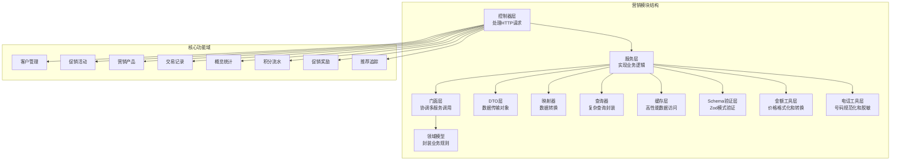
```mermaid
graph TB
subgraph "营销模块结构"
Controllers["控制器层<br/>处理HTTP请求"]
Services["服务层<br/>实现业务逻辑"]
Facades["门面层<br/>协调多服务调用"]
Domain["领域模型<br/>封装业务规则"]
DTOs["DTO层<br/>数据传输对象"]
Mappers["映射器<br/>数据转换"]
Queries["查询器<br/>复杂查询封装"]
Cache["缓存层<br/>高性能数据访问"]
Schemas["Schema验证层<br/>Zod模式验证"]
MoneyUtils["金额工具层<br/>价格格式化和转换"]
PhoneUtils["电话工具层<br/>号码规范化和脱敏"]
end
subgraph "核心功能域"
Customers["客户管理"]
Promotions["促销活动"]
Products["营销产品"]
Transactions["交易记录"]
Overview["概览统计"]
PointsRecords["积分流水"]
PromoRewards["促销奖励"]
ReferralTracking["推荐追踪"]
end
Controllers --> Services
Services --> Facades
Facades --> Domain
Services --> DTOs
Services --> Mappers
Services --> Queries
Services --> Cache
Services --> Schemas
Services --> MoneyUtils
Services --> PhoneUtils
Controllers --> Customers
Controllers --> Promotions
Controllers --> Products
Controllers --> Transactions
Controllers --> Overview
Controllers --> PointsRecords
Controllers --> PromoRewards
Controllers --> ReferralTracking
```

**图表来源**
- [marketing.module.ts](file://src/purely-profit/marketing/marketing.module.ts)
- [marketing.controller.ts](file://src/purely-profit/marketing/marketing.controller.ts)

**章节来源**
- [marketing.module.ts](file://src/purely-profit/marketing/marketing.module.ts)
- [marketing.controller.ts](file://src/purely-profit/marketing/marketing.controller.ts)

## 核心组件
营销模块由十个主要功能域构成，每个功能域都包含完整的CRUD操作和业务逻辑：

### 客户管理域
负责客户信息的全生命周期管理，包括基础信息维护、标签分类、等级管理、积分消费等核心功能。

**更新** 新增了短期Redis缓存机制，顾客详情缓存TTL设置为15秒，显著提升了高频访问的响应性能。同时引入了电话号码规范化功能，支持去除国家码 +86、空格、连字符等非数字字符，返回纯 11 位国内手机号；无法归一化时返回 null。增强了交易安全的客户更新机制，在手机号变更时自动同步更新关联的会员信息。

### 促销活动域  
提供灵活的促销策略配置，支持多种促销类型（满减、折扣、赠品、积分充值、每日折扣等），具备活动状态管理、库存控制、参与条件设置等功能。

**更新** 引入了全面的并发保护机制，防止竞态条件导致的促销活动状态不一致问题。新增了完善的Zod模式验证系统，为所有促销类型提供严格的数据验证和规范化处理。新增了动态展示文本生成功能，能够根据促销参数自动生成标准化的前端展示文案。

### 营销产品域
管理营销推广所需的产品资源，包括产品分类、价格策略、库存管理、上下架控制等，支撑精准营销的物料准备。

**更新** 新增了单位字段支持测量单位（如"次"、"节"、"份"等），完善了产品信息结构。新增了描述标题功能，允许为营销产品设置专门的描述标题，提升产品展示的专业性和层次感。改进了查询能力和错误处理，优化了外键约束异常的友好提示。

### 交易记录域
记录所有与营销相关的消费行为，包括购买记录、积分兑换、充值记录等，为营销效果分析提供数据基础。

**更新** 退款金额计算逻辑得到全面增强，现在会考虑本金充值和余额限制，确保退款操作的安全性和准确性。新增了赠送清零金额的计算功能，提供更详细的退款历史记录。

### 积分流水域
**新增** 记录所有营销相关的积分变动历史，包括管理员调整、消费抵扣、活动奖励等各类积分流水，为积分审计和分析提供完整数据支持。

### 概览统计域
提供营销整体数据的汇总分析，包括销售额、客流量、转化率、ROI等关键指标的实时展示。

**更新** 营销概览功能得到全面增强，支持更丰富的数据展示和分析能力，包括会员等级配置管理和营销中心功能的完善。

### Schema验证域
**新增** 基于Zod的模式验证系统，为营销活动参数提供严格的类型检查、数据验证和规范化处理，确保数据的一致性和安全性。

### 权限控制域
通过细粒度的权限管理，确保不同角色只能访问相应的营销功能，保障数据安全与业务合规。

### 价格格式化域
**新增** 实现了完整的价格显示格式化和验证机制，支持字符串格式的价格输入并转换为内部cent值存储，确保价格数据的精确性和一致性。

### 电话号码处理域
**新增** 专门负责电话号码的规范化和脱敏处理，提供统一的手机号格式化处理，确保数据的一致性和隐私保护。

### 促销奖励域
**全新** 实现了全面的促销奖励系统，包括推荐关系追踪、自动纯利豆分发、幂等性保护和合伙人等级管理。

### 推荐追踪域
**全新** 专门负责推荐关系的建立和维护，包括推广码验证、被推荐人追踪和推荐链路的完整性保证。

**章节来源**
- [marketing-customers.service.ts](file://src/purely-profit/marketing/marketing-customers.service.ts)
- [marketing-promotions.service.ts](file://src/purely-profit/marketing/marketing-promotions.service.ts)
- [marketing-products.service.ts](file://src/purely-profit/marketing/marketing-products.service.ts)
- [marketing-consumptions.service.ts](file://src/purely-profit/marketing/marketing-consumptions.service.ts)
- [marketing-recharges.service.ts](file://src/purely-profit/marketing/marketing-recharges.service.ts)
- [marketing-points-records.service.ts](file://src/purely-profit/marketing/marketing-points-records.service.ts)
- [promotion-params.schema.ts](file://src/purely-profit/marketing/schemas/promotion-params.schema.ts)
- [money.utils.ts](file://src/shared/money.utils.ts)
- [marketing.utils.ts](file://src/purely-profit/marketing/marketing.utils.ts)
- [platform-membership-order.service.ts](file://src/purely-profit/member/platform-membership/platform-membership-order.service.ts)
- [auth-authentication.service.ts](file://src/purely-profit/auth/auth-authentication.service.ts)

## 架构总览
营销模块采用典型的三层架构模式，通过依赖注入实现松耦合设计：

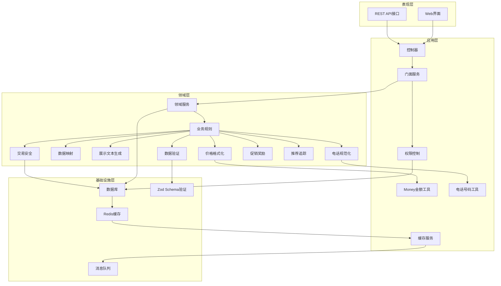
```mermaid
graph TB
subgraph "表现层"
API["REST API接口"]
WebUI["Web界面"]
end
subgraph "应用层"
Controllers["控制器"]
Facades["门面服务"]
AccessControl["权限控制"]
Cache["缓存服务"]
MoneyUtils["金额工具服务"]
PhoneUtils["电话工具服务"]
end
subgraph "领域层"
DomainServices["领域服务"]
BusinessRules["业务规则"]
Validation["数据验证"]
Mapping["数据映射"]
DisplayText["展示文本生成"]
PriceFormatting["价格格式化"]
PhoneNormalization["电话规范化"]
TransactionSecurity["交易安全"]
PromoRewards["促销奖励"]
ReferralTracking["推荐追踪"]
end
subgraph "基础设施层"
Database["数据库"]
Redis["Redis缓存"]
Queue["消息队列"]
Schemas["Zod Schema验证"]
MoneyUtils["Money金额工具"]
PhoneUtils["电话号码工具"]
end
API --> Controllers
WebUI --> Controllers
Controllers --> Facades
Facades --> DomainServices
DomainServices --> BusinessRules
BusinessRules --> Validation
BusinessRules --> Mapping
BusinessRules --> DisplayText
BusinessRules --> PriceFormatting
BusinessRules --> PhoneNormalization
BusinessRules --> TransactionSecurity
BusinessRules --> PromoRewards
BusinessRules --> ReferralTracking
Validation --> Schemas
PriceFormatting --> MoneyUtils
PhoneNormalization --> PhoneUtils
TransactionSecurity --> Database
DomainServices --> Database
Facades --> AccessControl
AccessControl --> Database
Database --> Redis
Redis --> Cache
Cache --> Queue
```

**图表来源**
- [marketing.module.ts](file://src/purely-profit/marketing/marketing.module.ts)
- [marketing-access.service.ts](file://src/purely-profit/marketing/marketing-access.service.ts)

**章节来源**
- [marketing.domain.ts](file://src/purely-profit/marketing/marketing.domain.ts)
- [marketing-access.service.ts](file://src/purely-profit/marketing/marketing-access.service.ts)

## 详细组件分析

### 客户管理组件分析
客户管理是营销模块的核心基础，负责维护客户档案、行为轨迹和价值评估。

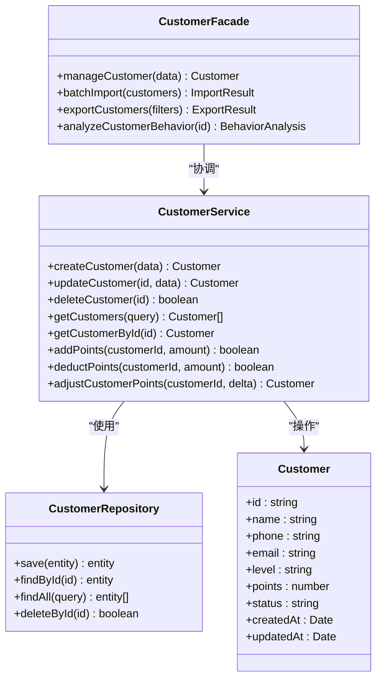
```mermaid
classDiagram
class Customer {
+id : string
+name : string
+phone : string
+email : string
+level : string
+points : number
+status : string
+createdAt : Date
+updatedAt : Date
}
class CustomerService {
+createCustomer(data) Customer
+updateCustomer(id, data) Customer
+deleteCustomer(id) boolean
+getCustomers(query) Customer[]
+getCustomerById(id) Customer
+addPoints(customerId, amount) boolean
+deductPoints(customerId, amount) boolean
+adjustCustomerPoints(customerId, delta) Customer
}
class CustomerFacade {
+manageCustomer(data) Customer
+batchImport(customers) ImportResult
+exportCustomers(filters) ExportResult
+analyzeCustomerBehavior(id) BehaviorAnalysis
}
class CustomerRepository {
+save(entity) entity
+findById(id) entity
+findAll(query) entity[]
+deleteById(id) boolean
}
CustomerService --> CustomerRepository : "使用"
CustomerFacade --> CustomerService : "协调"
CustomerService --> Customer : "操作"
```

**图表来源**
- [marketing-customers.service.ts](file://src/purely-profit/marketing/marketing-customers.service.ts)
- [marketing-customers.facade.service.ts](file://src/purely-profit/marketing/marketing-customers.facade.service.ts)

#### 客户生命周期管理流程
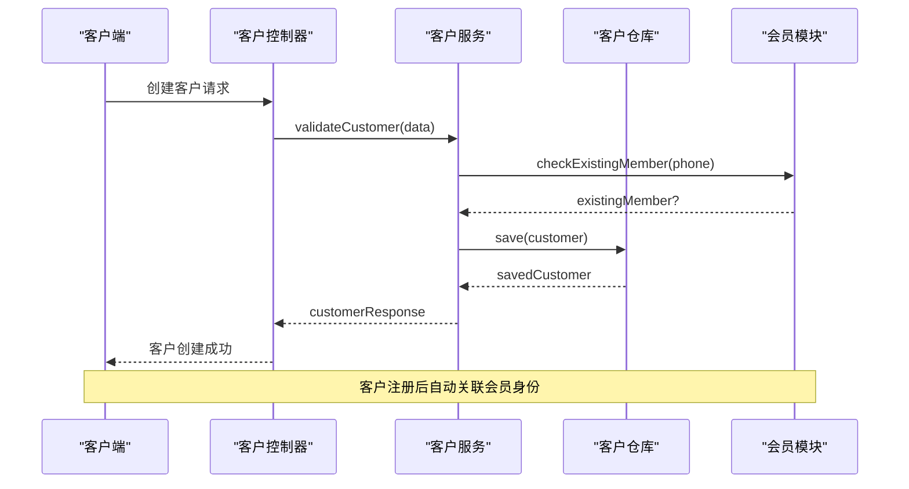
```mermaid
sequenceDiagram
participant Client as "客户端"
participant Controller as "客户控制器"
participant Service as "客户服务"
participant Repo as "客户仓库"
participant Member as "会员模块"
Client->>Controller : 创建客户请求
Controller->>Service : validateCustomer(data)
Service->>Member : checkExistingMember(phone)
Member-->>Service : existingMember?
Service->>Repo : save(customer)
Repo-->>Service : savedCustomer
Service-->>Controller : customerResponse
Controller-->>Client : 客户创建成功
Note over Client,Member : 客户注册后自动关联会员身份
```

**图表来源**
- [marketing-customers.controller.ts](file://src/purely-profit/marketing/marketing-customers.controller.ts)
- [marketing-customers.service.ts](file://src/purely-profit/marketing/marketing-customers.service.ts)

**章节来源**
- [marketing-customers.controller.ts](file://src/purely-profit/marketing/marketing-customers.controller.ts)
- [marketing-customers.service.ts](file://src/purely-profit/marketing/marketing-customers.service.ts)
- [marketing-customers.facade.service.ts](file://src/purely-profit/marketing/marketing-customers.facade.service.ts)

### 促销活动组件分析
促销活动模块提供灵活的营销策略配置，支持多种促销类型和复杂的参与条件。

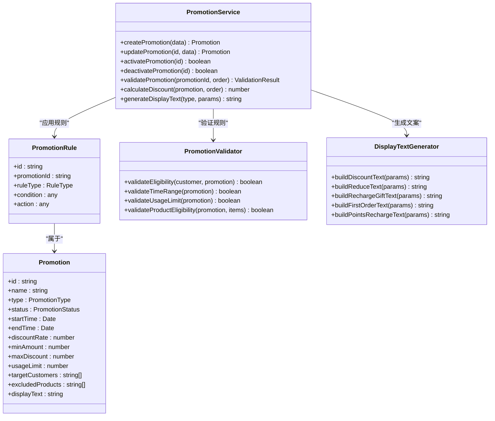
```mermaid
classDiagram
class Promotion {
+id : string
+name : string
+type : PromotionType
+status : PromotionStatus
+startTime : Date
+endTime : Date
+discountRate : number
+minAmount : number
+maxDiscount : number
+usageLimit : number
+targetCustomers : string[]
+excludedProducts : string[]
+displayText : string
}
class PromotionRule {
+id : string
+promotionId : string
+ruleType : RuleType
+condition : any
+action : any
}
class PromotionService {
+createPromotion(data) Promotion
+updatePromotion(id, data) Promotion
+activatePromotion(id) boolean
+deactivatePromotion(id) boolean
+validatePromotion(promotionId, order) ValidationResult
+calculateDiscount(promotion, order) number
+generateDisplayText(type, params) string
}
class PromotionValidator {
+validateEligibility(customer, promotion) boolean
+validateTimeRange(promotion) boolean
+validateUsageLimit(promotion) boolean
+validateProductEligibility(promotion, items) boolean
}
class DisplayTextGenerator {
+buildDiscountText(params) string
+buildReduceText(params) string
+buildRechargeGiftText(params) string
+buildFirstOrderText(params) string
+buildPointsRechargeText(params) string
}
PromotionService --> PromotionRule : "应用规则"
PromotionService --> PromotionValidator : "验证规则"
PromotionService --> DisplayTextGenerator : "生成文案"
PromotionRule --> Promotion : "属于"
```

**图表来源**
- [marketing-promotions.service.ts](file://src/purely-profit/marketing/marketing-promotions.service.ts)
- [marketing-promotions.facade.service.ts](file://src/purely-profit/marketing/marketing-promotions.facade.service.ts)
- [marketing.mapper.ts](file://src/purely-profit/marketing/marketing.mapper.ts)

#### 促销活动执行流程
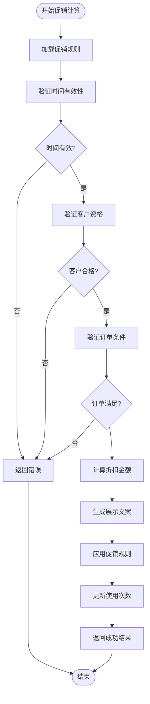
```mermaid
flowchart TD
Start([开始促销计算]) --> LoadPromotion["加载促销规则"]
LoadPromotion --> ValidateTime["验证时间有效性"]
ValidateTime --> TimeValid{"时间有效?"}
TimeValid --> |否| ReturnError["返回错误"]
TimeValid --> |是| ValidateCustomer["验证客户资格"]
ValidateCustomer --> CustomerValid{"客户合格?"}
CustomerValid --> |否| ReturnError
CustomerValid --> |是| ValidateOrder["验证订单条件"]
ValidateOrder --> OrderValid{"订单满足?"}
OrderValid --> |否| ReturnError
OrderValid --> CalculateDiscount["计算折扣金额"]
CalculateDiscount --> GenerateDisplayText["生成展示文案"]
GenerateDisplayText --> ApplyPromotion["应用促销规则"]
ApplyPromotion --> UpdateUsage["更新使用次数"]
UpdateUsage --> Success["返回成功结果"]
ReturnError --> End([结束])
Success --> End
```

**图表来源**
- [marketing-promotions.service.ts](file://src/purely-profit/marketing/marketing-promotions.service.ts)
- [marketing.mapper.ts](file://src/purely-profit/marketing/marketing.mapper.ts)

**章节来源**
- [marketing-promotions.controller.ts](file://src/purely-profit/marketing/marketing-promotions.controller.ts)
- [marketing-promotions.service.ts](file://src/purely-profit/marketing/marketing-promotions.service.ts)
- [marketing-promotions.facade.service.ts](file://src/purely-profit/marketing/marketing-promotions.facade.service.ts)

### 营销产品组件分析
营销产品模块管理推广所需的各类产品资源，支持产品分类、定价策略和库存控制。

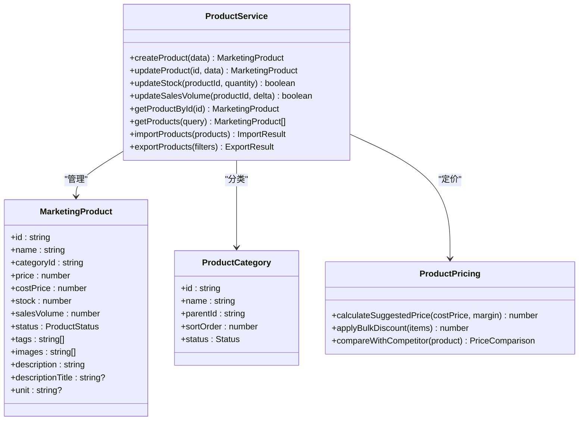
```mermaid
classDiagram
class MarketingProduct {
+id : string
+name : string
+categoryId : string
+price : number
+costPrice : number
+stock : number
+salesVolume : number
+status : ProductStatus
+tags : string[]
+images : string[]
+description : string
+descriptionTitle : string?
+unit : string?
}
class ProductCategory {
+id : string
+name : string
+parentId : string
+sortOrder : number
+status : Status
}
class ProductService {
+createProduct(data) MarketingProduct
+updateProduct(id, data) MarketingProduct
+updateStock(productId, quantity) boolean
+updateSalesVolume(productId, delta) boolean
+getProductById(id) MarketingProduct
+getProducts(query) MarketingProduct[]
+importProducts(products) ImportResult
+exportProducts(filters) ExportResult
}
class ProductPricing {
+calculateSuggestedPrice(costPrice, margin) number
+applyBulkDiscount(items) number
+compareWithCompetitor(product) PriceComparison
}
ProductService --> MarketingProduct : "管理"
ProductService --> ProductCategory : "分类"
ProductService --> ProductPricing : "定价"
```

**图表来源**
- [marketing-products.service.ts](file://src/purely-profit/marketing/marketing-products.service.ts)
- [marketing-products.facade.service.ts](file://src/purely-profit/marketing/marketing-products.facade.service.ts)

**章节来源**
- [marketing-products.controller.ts](file://src/purely-profit/marketing/marketing-products.controller.ts)
- [marketing-products.service.ts](file://src/purely-profit/marketing/marketing-products.service.ts)
- [marketing-products.facade.service.ts](file://src/purely-profit/marketing/marketing-products.facade.service.ts)

### 交易记录组件分析
交易记录模块完整追踪所有营销相关的消费行为，为营销效果分析提供数据基础。

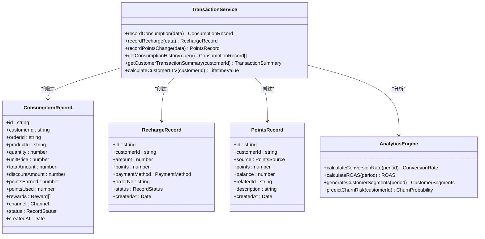
```mermaid
classDiagram
class ConsumptionRecord {
+id : string
+customerId : string
+orderId : string
+productId : string
+quantity : number
+unitPrice : number
+totalAmount : number
+discountAmount : number
+pointsEarned : number
+pointsUsed : number
+rewards : Reward[]
+channel : Channel
+status : RecordStatus
+createdAt : Date
}
class RechargeRecord {
+id : string
+customerId : string
+amount : number
+points : number
+paymentMethod : PaymentMethod
+orderNo : string
+status : RecordStatus
+createdAt : Date
}
class PointsRecord {
+id : string
+customerId : string
+source : PointsSource
+points : number
+balance : number
+relatedId : string
+description : string
+createdAt : Date
}
class TransactionService {
+recordConsumption(data) ConsumptionRecord
+recordRecharge(data) RechargeRecord
+recordPointsChange(data) PointsRecord
+getConsumptionHistory(query) ConsumptionRecord[]
+getCustomerTransactionSummary(customerId) TransactionSummary
+calculateCustomerLTV(customerId) LifetimeValue
}
class AnalyticsEngine {
+calculateConversionRate(period) ConversionRate
+calculateROAS(period) ROAS
+generateCustomerSegments(period) CustomerSegments
+predictChurnRisk(customerId) ChurnProbability
}
TransactionService --> ConsumptionRecord : "创建"
TransactionService --> RechargeRecord : "创建"
TransactionService --> PointsRecord : "创建"
TransactionService --> AnalyticsEngine : "分析"
```

**图表来源**
- [marketing-consumptions.service.ts](file://src/purely-profit/marketing/marketing-consumptions.service.ts)
- [marketing-recharges.service.ts](file://src/purely-profit/marketing/marketing-recharges.service.ts)
- [marketing-points-records.service.ts](file://src/purely-profit/marketing/marketing-points-records.service.ts)

**章节来源**
- [marketing-transactions.controller.ts](file://src/purely-profit/marketing/marketing-transactions.controller.ts)
- [marketing-consumptions.service.ts](file://src/purely-profit/marketing/marketing-consumptions.service.ts)
- [marketing-recharges.service.ts](file://src/purely-profit/marketing/marketing-recharges.service.ts)
- [marketing-points-records.service.ts](file://src/purely-profit/marketing/marketing-points-records.service.ts)

### 概览统计组件分析
概览统计模块提供营销整体数据的汇总分析，支持实时监控和趋势分析。

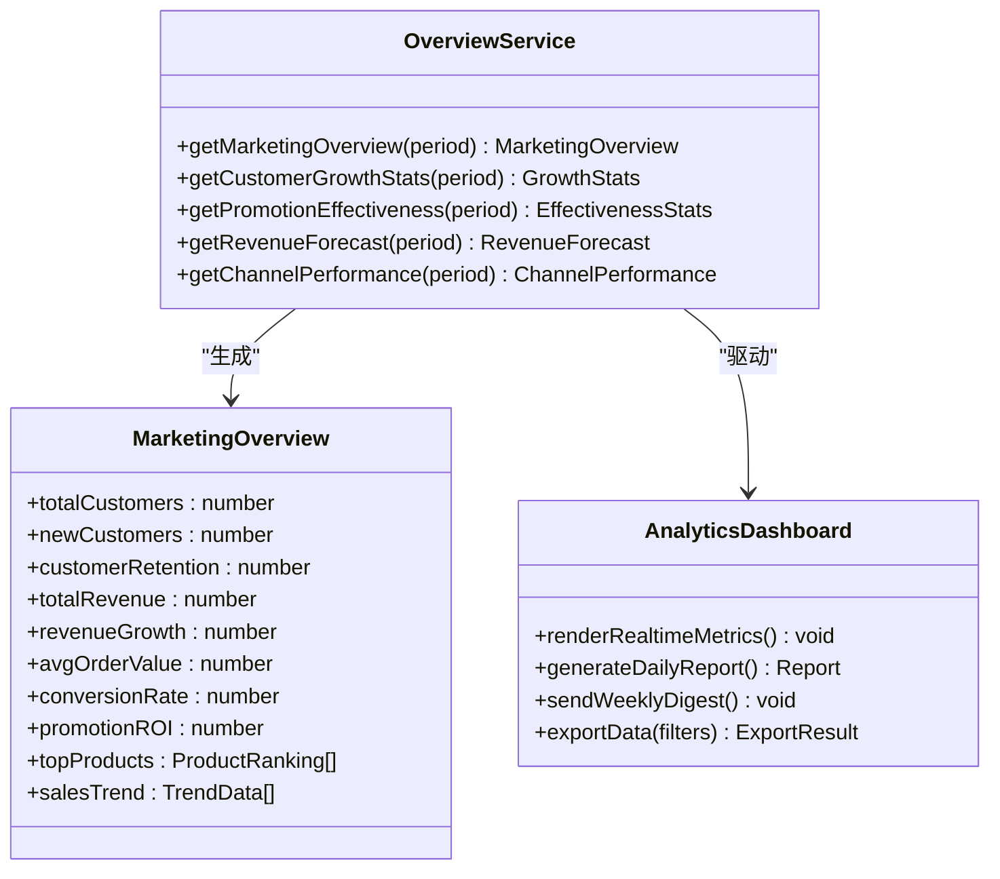
```mermaid
classDiagram
class OverviewService {
+getMarketingOverview(period) MarketingOverview
+getCustomerGrowthStats(period) GrowthStats
+getPromotionEffectiveness(period) EffectivenessStats
+getRevenueForecast(period) RevenueForecast
+getChannelPerformance(period) ChannelPerformance
}
class MarketingOverview {
+totalCustomers : number
+newCustomers : number
+customerRetention : number
+totalRevenue : number
+revenueGrowth : number
+avgOrderValue : number
+conversionRate : number
+promotionROI : number
+topProducts : ProductRanking[]
+salesTrend : TrendData[]
}
class AnalyticsDashboard {
+renderRealtimeMetrics() void
+generateDailyReport() Report
+sendWeeklyDigest() void
+exportData(filters) ExportResult
}
OverviewService --> MarketingOverview : "生成"
OverviewService --> AnalyticsDashboard : "驱动"
```

**图表来源**
- [marketing-overview.service.ts](file://src/purely-profit/marketing/marketing-overview.service.ts)
- [marketing-overview.facade.service.ts](file://src/purely-profit/marketing/marketing-overview.facade.service.ts)

**章节来源**
- [marketing-overview.controller.ts](file://src/purely-profit/marketing/marketing-overview.controller.ts)
- [marketing-overview.service.ts](file://src/purely-profit/marketing/marketing-overview.service.ts)
- [marketing-overview.facade.service.ts](file://src/purely-profit/marketing/marketing-overview.facade.service.ts)

### 积分流水组件分析
**新增** 积分流水模块完整追踪所有营销相关的积分变动历史，为积分审计和分析提供数据基础。

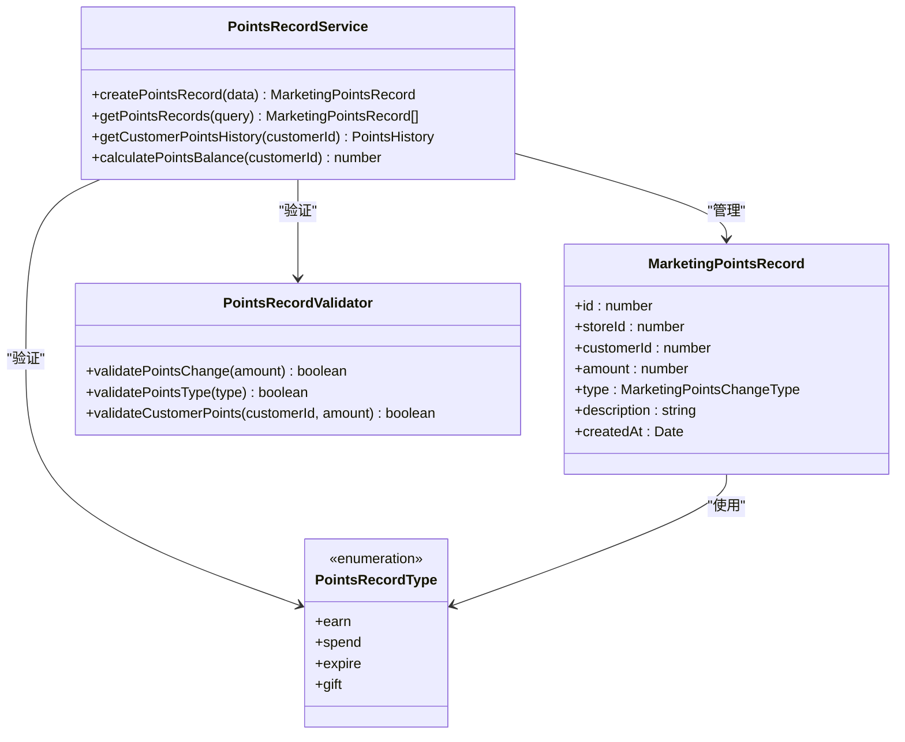
```mermaid
classDiagram
class MarketingPointsRecord {
+id : number
+storeId : number
+customerId : number
+amount : number
+type : MarketingPointsChangeType
+description : string
+createdAt : Date
}
class PointsRecordType {
<<enumeration>>
+earn
+spend
+expire
+gift
}
class PointsRecordService {
+createPointsRecord(data) MarketingPointsRecord
+getPointsRecords(query) MarketingPointsRecord[]
+getCustomerPointsHistory(customerId) PointsHistory
+calculatePointsBalance(customerId) number
}
class PointsRecordValidator {
+validatePointsChange(amount) boolean
+validatePointsType(type) boolean
+validateCustomerPoints(customerId, amount) boolean
}
PointsRecordService --> MarketingPointsRecord : "管理"
PointsRecordService --> PointsRecordType : "验证"
PointsRecordService --> PointsRecordValidator : "验证"
MarketingPointsRecord --> PointsRecordType : "使用"
```

**图表来源**
- [marketing-points-records.service.ts](file://src/purely-profit/marketing/marketing-points-records.service.ts)

**章节来源**
- [marketing-points-records.controller.ts](file://src/purely-profit/marketing/marketing-points-records.controller.ts)
- [marketing-points-records.service.ts](file://src/purely-profit/marketing/marketing-points-records.service.ts)
- [marketing-points-records.query.ts](file://src/purely-profit/marketing/marketing-points-records.query.ts)
- [marketing-points-records.mapper.ts](file://src/purely-profit/marketing/marketing-points-records.mapper.ts)
- [marketing-points-records.validator.ts](file://src/purely-profit/marketing/marketing-points-records.validator.ts)

### 价格格式化机制组件分析
**新增** 价格格式化机制模块实现了完整的字符串价格输入处理和内部cent值转换功能。

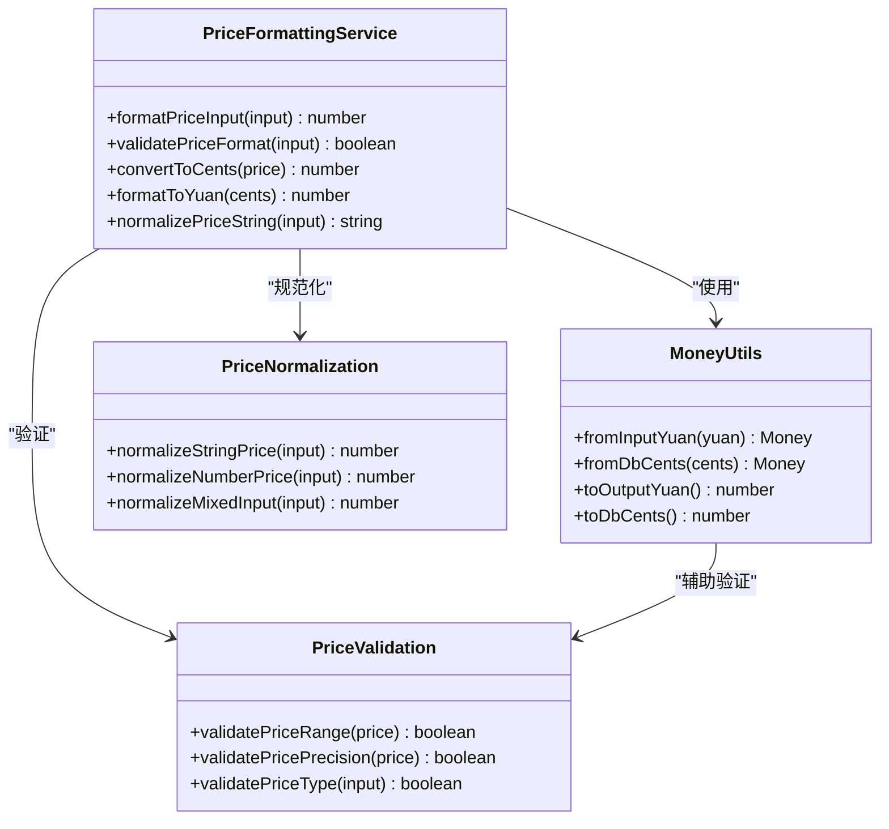
```mermaid
classDiagram
class PriceFormattingService {
+formatPriceInput(input) number
+validatePriceFormat(input) boolean
+convertToCents(price) number
+formatToYuan(cents) number
+normalizePriceString(input) string
}
class MoneyUtils {
+fromInputYuan(yuan) Money
+fromDbCents(cents) Money
+toOutputYuan() number
+toDbCents() number
}
class PriceValidation {
+validatePriceRange(price) boolean
+validatePricePrecision(price) boolean
+validatePriceType(input) boolean
}
class PriceNormalization {
+normalizeStringPrice(input) number
+normalizeNumberPrice(input) number
+normalizeMixedInput(input) number
}
PriceFormattingService --> MoneyUtils : "使用"
PriceFormattingService --> PriceValidation : "验证"
PriceFormattingService --> PriceNormalization : "规范化"
MoneyUtils --> PriceValidation : "辅助验证"
```

**图表来源**
- [marketing.mapper.ts](file://src/purely-profit/marketing/marketing.mapper.ts)
- [money.utils.ts](file://src/shared/money.utils.ts)

**章节来源**
- [marketing.mapper.ts](file://src/purely-profit/marketing/marketing.mapper.ts)
- [money.utils.ts](file://src/shared/money.utils.ts)

## 促销奖励系统

### 系统架构概述
促销奖励系统是营销模块的核心新功能，实现了完整的推荐关系追踪、自动纯利豆分发和幂等性保护机制。该系统基于StoreMembershipPromoRecord表进行推广记录管理，通过hasCharged字段实现并发安全的幂等性控制。

**更新** 新增的促销奖励系统包括：
- **推荐关系追踪**：通过推广码建立推广人与被推荐人的关联关系
- **自动奖励发放**：被推广人首次充值时自动计算并发放纯利豆奖励
- **幂等性保护**：使用hasCharged字段防止重复奖励发放
- **合伙人等级系统**：基于月度充值人数动态计算合伙人等级和奖励倍数
- **历史数据修复**：服务启动时自动修复历史未处理的推广记录

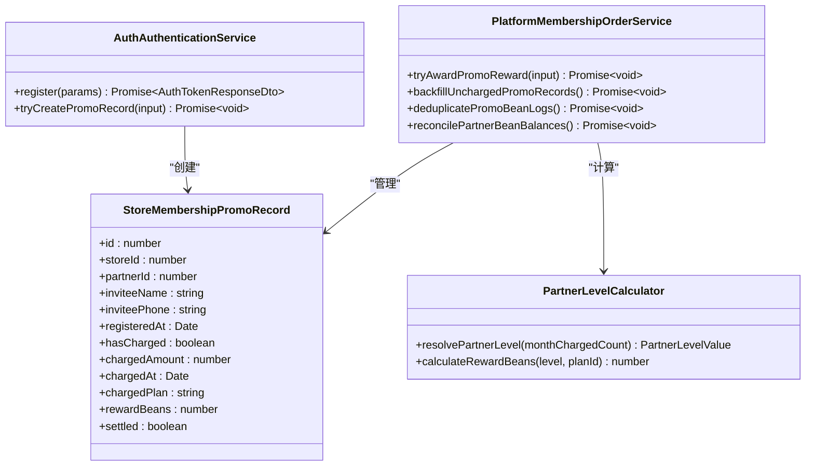
```mermaid
classDiagram
class StoreMembershipPromoRecord {
+id : number
+storeId : number
+partnerId : number
+inviteeName : string
+inviteePhone : string
+registeredAt : Date
+hasCharged : boolean
+chargedAmount : number
+chargedAt : Date
+chargedPlan : string
+rewardBeans : number
+settled : boolean
}
class PlatformMembershipOrderService {
+tryAwardPromoReward(input) Promise~void~
+backfillUnchargedPromoRecords() Promise~void~
+deduplicatePromoBeanLogs() Promise~void~
+reconcilePartnerBeanBalances() Promise~void~
}
class AuthAuthenticationService {
+register(params) Promise~AuthTokenResponseDto~
+tryCreatePromoRecord(input) Promise~void~
}
class PartnerLevelCalculator {
+resolvePartnerLevel(monthChargedCount) PartnerLevelValue
+calculateRewardBeans(level, planId) number
}
PlatformMembershipOrderService --> StoreMembershipPromoRecord : "管理"
AuthAuthenticationService --> StoreMembershipPromoRecord : "创建"
PlatformMembershipOrderService --> PartnerLevelCalculator : "计算"
```

**图表来源**
- [platform-membership-order.service.ts](file://src/purely-profit/member/platform-membership/platform-membership-order.service.ts)
- [auth-authentication.service.ts](file://src/purely-profit/auth/auth-authentication.service.ts)
- [platform-membership-promo-stats.domain.ts](file://src/purely-profit/member/platform-membership/platform-membership-promo-stats.domain.ts)

### 推广记录创建流程
用户在注册时携带推广码，系统会自动创建推广记录并建立推荐关系。

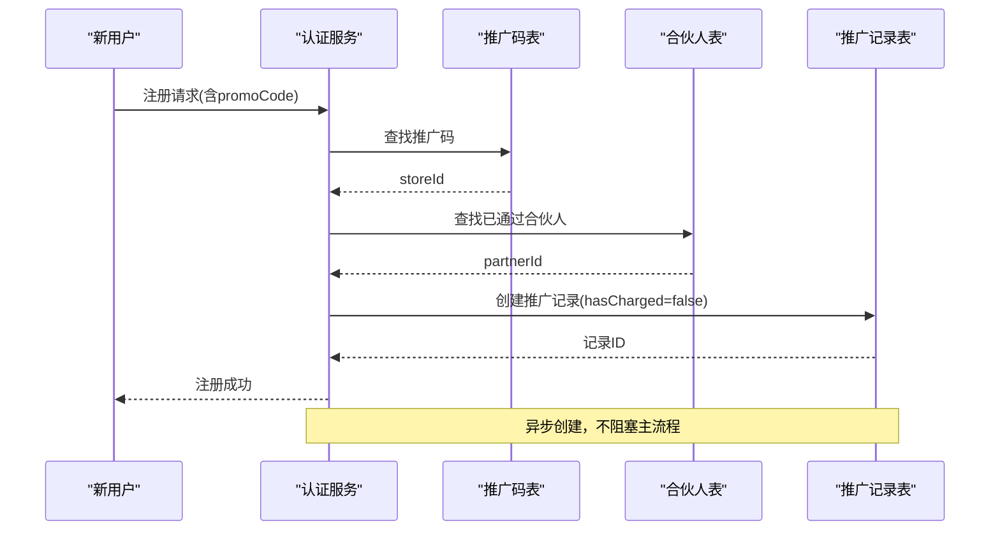
```mermaid
sequenceDiagram
participant User as "新用户"
participant Auth as "认证服务"
participant InviteCode as "推广码表"
participant Partner as "合伙人表"
participant PromoRecord as "推广记录表"
User->>Auth : 注册请求(含promoCode)
Auth->>InviteCode : 查找推广码
InviteCode-->>Auth : storeId
Auth->>Partner : 查找已通过合伙人
Partner-->>Auth : partnerId
Auth->>PromoRecord : 创建推广记录(hasCharged=false)
PromoRecord-->>Auth : 记录ID
Auth-->>User : 注册成功
Note over Auth,PromoRecord : 异步创建，不阻塞主流程
```

**图表来源**
- [auth-authentication.service.ts](file://src/purely-profit/auth/auth-authentication.service.ts)

### 奖励发放流程
当被推广人完成首次充值时，系统自动计算并发放纯利豆奖励给推广人。

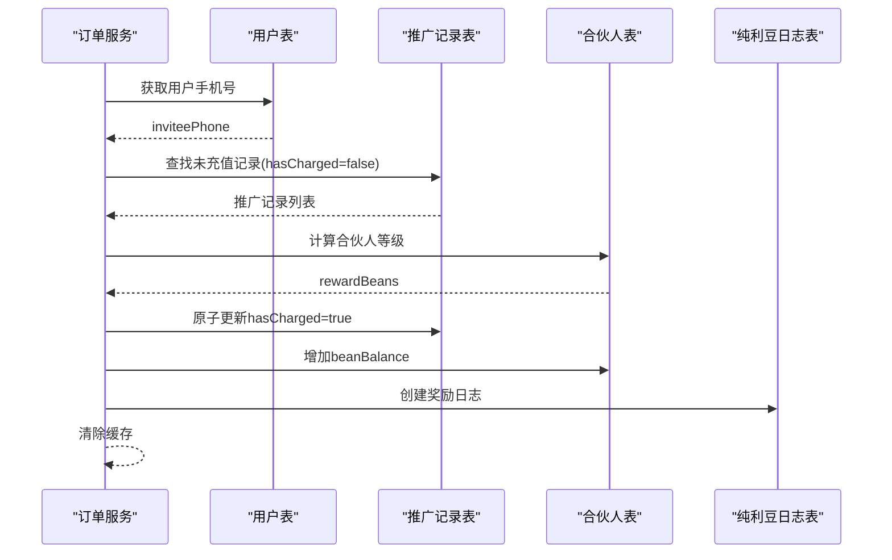
```mermaid
sequenceDiagram
participant Order as "订单服务"
participant User as "用户表"
participant PromoRecord as "推广记录表"
participant Partner as "合伙人表"
participant BeanLog as "纯利豆日志表"
Order->>User : 获取用户手机号
User-->>Order : inviteePhone
Order->>PromoRecord : 查找未充值记录(hasCharged=false)
PromoRecord-->>Order : 推广记录列表
Order->>Partner : 计算合伙人等级
Partner-->>Order : rewardBeans
Order->>PromoRecord : 原子更新hasCharged=true
Order->>Partner : 增加beanBalance
Order->>BeanLog : 创建奖励日志
Order-->>Order : 清除缓存
```

**图表来源**
- [platform-membership-order.service.ts](file://src/purely-profit/member/platform-membership/platform-membership-order.service.ts)

**章节来源**
- [platform-membership-order.service.ts](file://src/purely-profit/member/platform-membership/platform-membership-order.service.ts)
- [auth-authentication.service.ts](file://src/purely-profit/auth/auth-authentication.service.ts)
- [platform-membership-promo-stats.domain.ts](file://src/purely-profit/member/platform-membership/platform-membership-promo-stats.domain.ts)

## 推荐关系追踪

### 推广码验证机制
系统在用户注册时验证推广码的有效性，确保推荐关系的准确性。

**更新** 新增的推广码验证机制包括：
- **推广码格式验证**：支持大小写转换和激活状态检查
- **门店关联验证**：确保推广码与目标门店正确关联
- **合伙人匹配**：自动匹配门店的已通过合伙人作为推广人
- **异步处理**：推广记录创建不影响注册主流程的性能

```mermaid
classDiagram
class PromoCodeValidator {
+validatePromoCode(code) boolean
+findStoreByCode(code) Store
+findPartnerByStore(storeId) Partner
}
class ReferralRelationship {
+setupReferral(inviteePhone, partnerId) boolean
+trackReferralChain(userId) ReferralChain
+validateReferralEligibility(userId) boolean
}
class PromoCodeValidator --> ReferralRelationship : "建立关系"
```

**图表来源**
- [auth-authentication.service.ts](file://src/purely-profit/auth/auth-authentication.service.ts)

### 推荐链路完整性保证
系统确保推荐链路的完整性和可追溯性，支持多层级推荐关系的维护。

**更新** 推荐链路完整性保证包括：
- **外键约束**：partnerId字段建立与store_partners表的外键关系
- **索引优化**：为partner_id和registered_at字段建立复合索引
- **数据回填**：服务启动时根据invitee_phone回填partner_id
- **级联删除**：合伙人删除时推广记录partner_id设为null

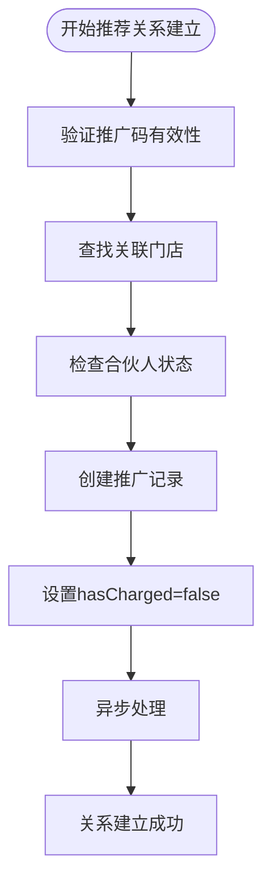
```mermaid
flowchart TD
Start([开始推荐关系建立]) --> ValidateCode["验证推广码有效性"]
ValidateCode --> FindStore["查找关联门店"]
FindStore --> CheckPartner["检查合伙人状态"]
CheckPartner --> CreateRecord["创建推广记录"]
CreateRecord --> SetHasCharged["设置hasCharged=false"]
SetHasCharged --> AsyncProcess["异步处理"]
AsyncProcess --> Success["关系建立成功"]
```

**图表来源**
- [auth-authentication.service.ts](file://src/purely-profit/auth/auth-authentication.service.ts)
- [20260625200000_step3_final_changes/migration.sql](file://prisma/migrations/20260625200000_step3_final_changes/migration.sql)

**章节来源**
- [auth-authentication.service.ts](file://src/purely-profit/auth/auth-authentication.service.ts)
- [20260625200000_step3_final_changes/migration.sql](file://prisma/migrations/20260625200000_step3_final_changes/migration.sql)

## 幂等性保护机制

### hasCharged字段设计
系统使用hasCharged布尔字段实现推广奖励的幂等性保护，确保同一推广记录不会被重复奖励。

**更新** hasCharged字段的幂等性保护机制包括：
- **原子更新**：使用updateMany配合where条件确保并发安全
- **状态转换**：从false到true的单向状态转换
- **批量处理**：支持批量检查和更新未充值的推广记录
- **事务保证**：奖励发放过程在数据库事务中执行

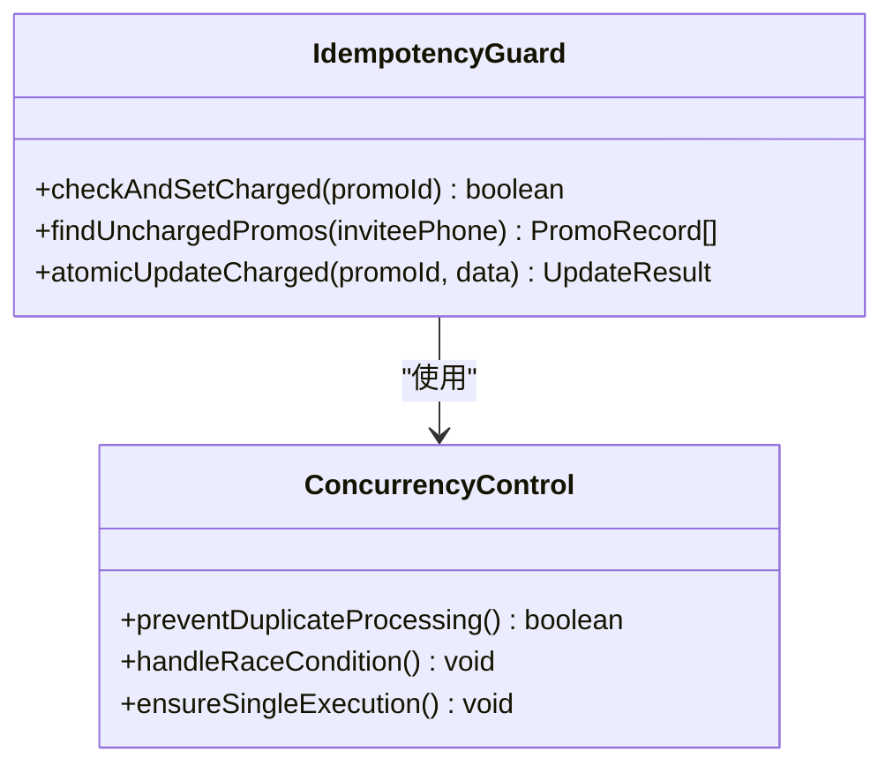
```mermaid
classDiagram
class IdempotencyGuard {
+checkAndSetCharged(promoId) boolean
+findUnchargedPromos(inviteePhone) PromoRecord[]
+atomicUpdateCharged(promoId, data) UpdateResult
}
class ConcurrencyControl {
+preventDuplicateProcessing() boolean
+handleRaceCondition() void
+ensureSingleExecution() void
}
IdempotencyGuard --> ConcurrencyControl : "使用"
```

**图表来源**
- [platform-membership-order.service.ts](file://src/purely-profit/member/platform-membership/platform-membership-order.service.ts)

### 并发安全保证
系统通过数据库级别的并发控制确保推广奖励发放的安全性。

**更新** 并发安全保证机制包括：
- **条件更新**：WHERE id = ? AND has_charged = false确保只更新未处理的记录
- **影响行数检查**：通过updateResult.count判断是否成功更新
- **重试机制**：对于并发冲突的情况提供适当的错误处理
- **日志记录**：详细的处理日志便于问题排查

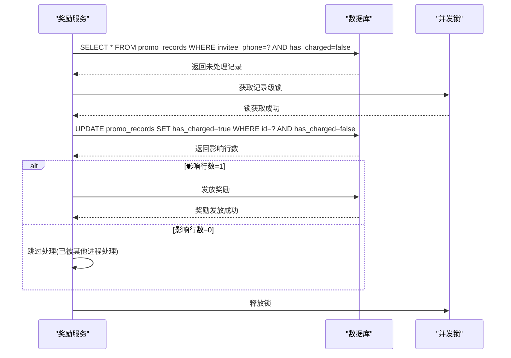
```mermaid
sequenceDiagram
participant Service as "奖励服务"
participant DB as "数据库"
participant Lock as "并发锁"
Service->>DB : SELECT * FROM promo_records WHERE invitee_phone=? AND has_charged=false
DB-->>Service : 返回未处理记录
Service->>Lock : 获取记录级锁
Lock-->>Service : 锁获取成功
Service->>DB : UPDATE promo_records SET has_charged=true WHERE id=? AND has_charged=false
DB-->>Service : 返回影响行数
alt 影响行数=1
Service->>DB : 发放奖励
DB-->>Service : 奖励发放成功
else 影响行数=0
Service->>Service : 跳过处理(已被其他进程处理)
end
Service->>Lock : 释放锁
```

**图表来源**
- [platform-membership-order.service.ts](file://src/purely-profit/member/platform-membership/platform-membership-order.service.ts)

**章节来源**
- [platform-membership-order.service.ts](file://src/purely-profit/member/platform-membership/platform-membership-order.service.ts)

## 合伙人等级系统

### 等级计算算法
系统根据月度已充值推广人数动态计算合伙人等级，不同等级对应不同的纯利豆奖励倍数。

**更新** 合伙人等级系统包括三个等级：
- **star等级**：月度充值人数少于10人，基础奖励倍数
- **elite等级**：月度充值人数10-29人，中等奖励倍数  
- **legend等级**：月度充值人数30人以上，最高奖励倍数

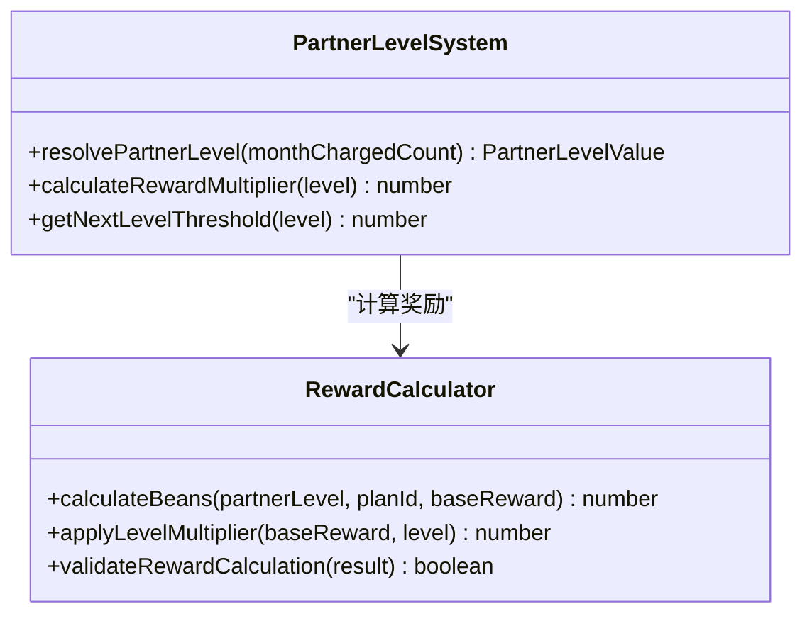
```mermaid
classDiagram
class PartnerLevelSystem {
+resolvePartnerLevel(monthChargedCount) PartnerLevelValue
+calculateRewardMultiplier(level) number
+getNextLevelThreshold(level) number
}
class RewardCalculator {
+calculateBeans(partnerLevel, planId, baseReward) number
+applyLevelMultiplier(baseReward, level) number
+validateRewardCalculation(result) boolean
}
PartnerLevelSystem --> RewardCalculator : "计算奖励"
```

**图表来源**
- [platform-membership-promo-stats.domain.ts](file://src/purely-profit/member/platform-membership/platform-membership-promo-stats.domain.ts)

### 等级晋升机制
系统自动监控合伙人的月度业绩，动态调整其等级和对应的奖励倍数。

**更新** 等级晋升机制包括：
- **月度统计**：按月统计已充值推广人数
- **等级判定**：根据充值人数自动判定当前等级
- **晋升通知**：等级变化时触发相应的业务逻辑
- **降级处理**：月度结束后重新计算等级

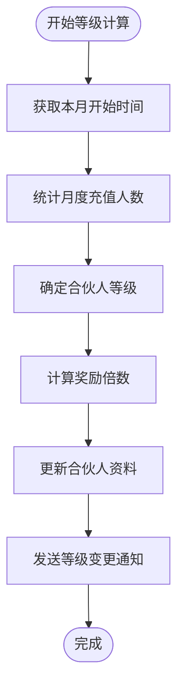
```mermaid
flowchart TD
Start([开始等级计算]) --> GetMonthStart["获取本月开始时间"]
GetMonthStart --> CountCharged["统计月度充值人数"]
CountCharged --> DetermineLevel["确定合伙人等级"]
DetermineLevel --> CalculateReward["计算奖励倍数"]
CalculateReward --> UpdateProfile["更新合伙人资料"]
UpdateProfile --> SendNotification["发送等级变更通知"]
SendNotification --> End([完成])
```

**图表来源**
- [platform-membership-promo-stats.domain.ts](file://src/purely-profit/member/platform-membership/platform-membership-promo-stats.domain.ts)

**章节来源**
- [platform-membership-promo-stats.domain.ts](file://src/purely-profit/member/platform-membership/platform-membership-promo-stats.domain.ts)

## 历史数据修复

### 服务启动修复机制
系统在应用启动时自动执行历史数据修复任务，确保推广记录和纯利豆余额的一致性。

**更新** 历史数据修复机制包括三个主要功能：
- **未充值记录补发**：检查历史未处理的推广记录并补发奖励
- **重复日志清理**：清理同一推广记录的重复纯利豆日志
- **余额校正**：根据纯利豆日志重新计算合伙人余额

```mermaid
classDiagram
class DataRepairService {
+onApplicationBootstrap() Promise~void~
+backfillUnchargedPromoRecords() Promise~void~
+deduplicatePromoBeanLogs() Promise~void~
+reconcilePartnerBeanBalances() Promise~void~
}
class RepairWorkflow {
+scanForIssues() RepairReport
+executeRepairs() RepairResult
+verifyFixes() VerificationReport
}
DataRepairService --> RepairWorkflow : "执行修复"
```

**图表来源**
- [platform-membership-order.service.ts](file://src/purely-profit/member/platform-membership/platform-membership-order.service.ts)

### 数据一致性保证
系统通过多重校验和回滚机制确保数据修复的安全性和可靠性。

**更新** 数据一致性保证包括：
- **事务隔离**：所有修复操作在独立事务中执行
- **增量修复**：只处理有问题的数据，避免全量扫描
- **回滚机制**：修复失败时自动回滚到原始状态
- **审计日志**：详细的修复操作日志便于追踪

```mermaid
sequenceDiagram
participant Boot as "应用启动"
participant Repair as "修复服务"
participant Scanner as "问题扫描器"
participant Executor as "修复执行器"
participant Verifier as "结果验证器"
Boot->>Repair : 触发修复任务
Repair->>Scanner : 扫描数据问题
Scanner-->>Repair : 发现问题清单
Repair->>Executor : 执行修复操作
Executor-->>Repair : 修复结果
Repair->>Verifier : 验证修复效果
Verifier-->>Repair : 验证报告
Repair-->>Boot : 修复完成
```

**图表来源**
- [platform-membership-order.service.ts](file://src/purely-profit/member/platform-membership/platform-membership-order.service.ts)

**章节来源**
- [platform-membership-order.service.ts](file://src/purely-profit/member/platform-membership/platform-membership-order.service.ts)

## 动态促销展示文本生成

### 展示文本生成系统
营销模块新增了强大的动态促销展示文本生成功能，能够根据促销类型和参数自动生成标准化的前端展示文案。

**更新** 新增的展示文本生成功能包括：
- **多类型支持**：支持折扣、满减、充值赠送、首单优惠、积分充值等多种促销类型
- **智能格式化**：自动处理数字格式、货币单位和文案结构
- **兼容性处理**：支持新旧参数格式的自动转换和兼容
- **标准化输出**：确保前后端展示文案的一致性

```mermaid
classDiagram
class DisplayTextGenerator {
+buildPromotionDisplayText(type, params) string
+buildDiscountText(params) string
+buildReduceText(params) string
+buildRechargeGiftText(params) string
+buildFirstOrderText(params) string
+buildPointsRechargeText(params) string
+buildEmptyText(type) string
}
class TextFormatter {
+formatDiscountRate(rate) string
+formatCurrency(amount) string
+formatPercentage(percent) string
+normalizeNumber(value) number
}
class CompatibilityHandler {
+handleOldFormat(params) object
+convertRateToDiscountRate(rate) number
+migrateGradientFields(gradients) array
}
DisplayTextGenerator --> TextFormatter : "格式化"
DisplayTextGenerator --> CompatibilityHandler : "兼容处理"
```

**图表来源**
- [marketing.mapper.ts](file://src/purely-profit/marketing/marketing.mapper.ts)

### 展示文本生成流程
```mermaid
sequenceDiagram
participant Mapper as "映射器"
participant Generator as "文本生成器"
participant Formatter as "格式化工具"
participant DB as "数据库"
Mapper->>DB : 获取促销数据
DB-->>Mapper : 返回促销信息
Mapper->>Generator : buildPromotionDisplayText(type, params)
Generator->>Generator : 判断促销类型
alt 折扣类型
Generator->>Formatter : formatDiscountRate(rate)
Formatter-->>Generator : 格式化后的折扣文案
else 满减类型
Generator->>Formatter : formatCurrency(threshold, amount)
Formatter-->>Generator : 格式化后的满减文案
end
Generator-->>Mapper : 返回展示文案
Mapper->>DB : 保存displayText字段
DB-->>Mapper : 保存成功
```

**图表来源**
- [marketing.mapper.ts](file://src/purely-profit/marketing/marketing.mapper.ts)

### 支持的促销类型和文案格式
系统支持以下促销类型的展示文本生成：

**更新** 各类型的具体文案格式：
- **折扣类型**：`打 X 折` 或 `打 X.X 折`（如"打 8 折"、"打 8.5 折"）
- **满减类型**：`满 ¥X 减 ¥Y`（如"满 ¥50 减 ¥8"）
- **充值赠送**：`充 ¥X 赠 ¥Y` 或 `充 ¥X 赠 ¥Y 起`（多档时追加"起"字）
- **首单优惠**：`首单 X.X 折`（如"首单 7.5 折"）
- **积分充值**：`充 ¥100 赠 X 积分`（支持小数点后两位）
- **免单类型**：`免单`
- **双倍积分**：`双倍积分`

**章节来源**
- [marketing.mapper.ts](file://src/purely-profit/marketing/marketing.mapper.ts)

## Zod模式验证系统

### 验证系统架构
营销模块引入了基于Zod的全面模式验证系统，为所有促销活动参数提供严格的类型检查和数据规范化处理。

**更新** 新增的Zod验证系统包括：
- **类型安全**：为每种促销类型定义独立的Zod schema
- **数据验证**：严格的参数验证和范围检查
- **格式转换**：自动的参数格式化和标准化
- **向后兼容**：支持新旧参数格式的自动转换

```mermaid
classDiagram
class PromotionParamsSchema {
+discountParamsSchema : ZodObject
+firstOrderDiscountParamsSchema : ZodObject
+reduceParamsSchema : ZodObject
+rechargeGiftParamsSchema : ZodObject
+pointsRechargeParamsSchema : ZodObject
+emptyParamsSchema : ZodObject
+promotionParamsSchema : ZodDiscriminatedUnion
}
class SchemaValidator {
+validatePromotionParams(type, params) object
+safeParsePromotionParams(type, params) object|null
+normalizePromotionParams(value, type) object
}
class TypeInference {
+DiscountParams : z.infer<typeof discountParamsSchema>
+FirstOrderDiscountParams : z.infer<typeof firstOrderDiscountParamsSchema>
+ReduceParams : z.infer<typeof reduceParamsSchema>
+RechargeGiftParams : z.infer<typeof rechargeGiftParamsSchema>
+PointsRechargeParams : z.infer<typeof pointsRechargeParamsSchema>
}
PromotionParamsSchema --> SchemaValidator : "提供schema"
SchemaValidator --> TypeInference : "类型推断"
```

**图表来源**
- [promotion-params.schema.ts](file://src/purely-profit/marketing/schemas/promotion-params.schema.ts)

### 验证流程设计
```mermaid
flowchart TD
Start([接收促销参数]) --> CheckType["检查促销类型"]
CheckType --> LoadSchema["加载对应Schema"]
LoadSchema --> ValidateInput["执行Zod验证"]
ValidateInput --> IsValid{"验证通过?"}
IsValid --> |否| HandleError["处理验证错误"]
IsValid --> |是| NormalizeData["数据规范化"]
NormalizeData --> TransformFormat["格式转换"]
TransformFormat --> Output["输出标准化数据"]
HandleError --> End([结束])
Output --> End
```

**图表来源**
- [promotion-params.schema.ts](file://src/purely-profit/marketing/schemas/promotion-params.schema.ts)

### 各类型验证规则
系统为每种促销类型定义了详细的验证规则：

**更新** 各类型的验证规则详情：
- **折扣类型**：discountRate必须为1-99的整数，rate必须为0.01-0.99的小数，二者至少提供一个
- **满减类型**：threshold和reduceAmount必须为正数，支持小数元单位
- **充值赠送**：gradients数组至少包含一个梯度，支持giftAmount或giftRatio
- **首单优惠**：discountRate或rate至少提供一个，可选audience字段
- **积分充值**：rechargeRatioPercent或pointsRatio为正数
- **空参数类型**：free和points_2x类型接受空对象或仅banner字段

**章节来源**
- [promotion-params.schema.ts](file://src/purely-profit/marketing/schemas/promotion-params.schema.ts)

## 促销参数规范化

### 参数规范化机制
营销模块实现了完善的促销参数规范化机制，确保不同来源和格式的参数都能被正确处理。

**更新** 新增的参数规范化功能包括：
- **智能解析**：优先使用Zod schema进行严格验证和解析
- **降级处理**：当Zod验证失败时回退到手写规范化逻辑
- **格式兼容**：支持新旧参数格式的自动转换
- **类型安全**：确保最终输出的数据结构符合预期

```mermaid
classDiagram
class ParameterNormalizer {
+normalizePromotionParams(value, type) object
+normalizePromotionParamValue(value) any
+normalizeRechargeGiftParams(value) object
}
class FormatConverter {
+mapParamValueForWrite(params, type) object
+mapParamValueForOutput(params, type) object
+convertYuanToCents(value) number
+convertCentsToYuan(value) number
}
class LegacySupport {
+migrateGradientsToNewFormat(gradients) array
+convertOldFieldNames(params) object
+handleDeprecatedFields(params) object
}
ParameterNormalizer --> FormatConverter : "格式转换"
ParameterNormalizer --> LegacySupport : "兼容处理"
```

**图表来源**
- [marketing.mapper.ts](file://src/purely-profit/marketing/marketing.mapper.ts)

### 规范化处理流程
```mermaid
sequenceDiagram
participant Service as "服务层"
participant Normalizer as "参数规范化器"
participant Validator as "Zod验证器"
participant Converter as "格式转换器"
Service->>Normalizer : normalizePromotionParams(value, type)
Normalizer->>Validator : safeParsePromotionParams(type, value)
alt Zod验证成功
Validator-->>Normalizer : 标准化参数
Normalizer->>Converter : mapParamValueForWrite(params, type)
Converter-->>Normalizer : 写入格式参数
else Zod验证失败
Validator-->>Normalizer : null
Normalizer->>Normalizer : 手写规范化逻辑
Normalizer->>Converter : 格式转换
end
Normalizer-->>Service : 最终规范化参数
```

**图表来源**
- [marketing.mapper.ts](file://src/purely-profit/marketing/marketing.mapper.ts)

### 金额字段处理
系统实现了统一的金额字段处理机制，确保元分和单位的正确转换。

**更新** 金额处理的特性：
- **写入转换**：前端输入的元单位自动转换为数据库存储的分单位
- **输出转换**：数据库的分单位自动转换为前端显示的元单位
- **精度保证**：使用Money工具类确保金额计算的精度
- **字段识别**：自动识别需要转换的金额字段名称

**章节来源**
- [marketing.mapper.ts](file://src/purely-profit/marketing/marketing.mapper.ts)

## 营销产品描述标题功能

### 描述标题字段引入
营销模块新增了description_title字段，为营销产品提供专门的描述标题功能，增强产品展示的专业性和层次感。

**更新** 新增的description_title字段允许为营销产品设置独立的标题，与普通description字段形成层次化的描述结构。

```mermaid
classDiagram
class MarketingProduct {
+id : string
+name : string
+categoryId : string
+price : number
+costPrice : number
+stock : number
+salesVolume : number
+status : ProductStatus
+tags : string[]
+images : string[]
+description : string
+descriptionTitle : string?
}
class ProductDescriptionEnhancement {
+setProductDescriptionTitle(productId, title) boolean
+getDescriptionTitle(productId) string?
+validateDescriptionTitle(title) boolean
+enhanceProductPresentation(product) EnhancedProduct
}
MarketingProduct --> ProductDescriptionEnhancement : "支持"
```

**图表来源**
- [marketing-products.service.ts](file://src/purely-profit/marketing/marketing-products.service.ts)

### 描述标题配置流程
```mermaid
sequenceDiagram
participant Admin as "管理员"
participant ProductCtrl as "产品控制器"
participant ProductService as "产品服务"
participant ProductRepo as "产品仓库"
Admin->>ProductCtrl : 设置产品描述标题
ProductCtrl->>ProductService : validateDescriptionTitle(title)
ProductService->>ProductService : 检查标题格式和长度
ProductService->>ProductRepo : updateProductDescriptionTitle(productId, title)
ProductRepo-->>ProductService : 更新成功
ProductService-->>ProductCtrl : 返回更新结果
ProductCtrl-->>Admin : 描述标题设置成功
```

**图表来源**
- [marketing-products.controller.ts](file://src/purely-profit/marketing/marketing-products.controller.ts)
- [marketing-products.service.ts](file://src/purely-profit/marketing/marketing-products.service.ts)

**章节来源**
- [marketing-products.controller.ts](file://src/purely-profit/marketing/marketing-products.controller.ts)
- [marketing-products.service.ts](file://src/purely-profit/marketing/marketing-products.service.ts)

## 促销类型唯一性约束

### 唯一性约束增强
营销模块增强了促销类型的唯一性约束，确保促销活动的准确性和一致性，避免重复或冲突的促销类型配置。

**更新** 新增的唯一性约束机制确保每个促销类型在系统中具有唯一的标识，防止促销活动配置的混乱和冲突。

```mermaid
classDiagram
class PromotionTypeConstraint {
+promotionType : string
+storeId : number
+constraintId : string
+constraintType : ConstraintType
+effectiveDate : Date
+expiryDate : Date
+status : ConstraintStatus
}
class PromotionTypeValidator {
+validateTypeUniqueness(type, storeId) boolean
+checkExistingConstraints(type, storeId) ConstraintCheckResult
+resolveTypeConflicts(type, constraints) ConflictResolution
+applyTypeConstraint(type, constraint) boolean
}
class ConstraintEnforcement {
+enforceTypeUniqueness() void
+monitorTypeViolations() void
+reportTypeConflicts() void
}
PromotionTypeConstraint --> PromotionTypeValidator : "验证"
PromotionTypeValidator --> ConstraintEnforcement : "执行"
```

**图表来源**
- [marketing-promotions.service.ts](file://src/purely-profit/marketing/marketing-promotions.service.ts)

### 促销类型约束验证流程
```mermaid
flowchart TD
Start([验证促销类型唯一性]) --> LoadExisting["加载现有促销类型"]
LoadExisting --> CheckConflicts["检查类型冲突"]
CheckConflicts --> HasConflicts{"存在冲突?"}
HasConflicts --> |是| ResolveConflicts["解析冲突类型"]
HasConflicts --> |否| ApplyConstraint["应用唯一性约束"]
ResolveConflicts --> ValidateResolution["验证解决结果"]
ValidateResolution --> ConflictValid{"解决有效?"}
ConflictValid --> |是| ApplyConstraint
ConflictValid --> |否| RejectRequest["拒绝请求"]
ApplyConstraint --> Success["约束应用成功"]
RejectRequest --> End([结束])
Success --> End
```

**图表来源**
- [marketing-promotions.service.ts](file://src/purely-profit/marketing/marketing-promotions.service.ts)

**章节来源**
- [marketing-promotions.service.ts](file://src/purely-profit/marketing/marketing-promotions.service.ts)

## 促销类型修复

### 历史数据修复
营销模块修复了历史数据中points2x折扣类型错误的问题，将误设为points_2x的折扣活动类型修正为正确的discount类型。

**更新** 通过数据库迁移脚本修复了历史数据中的类型错误，确保所有折扣活动都能正确参与价格计算。

```mermaid
classDiagram
class PromotionTypeFix {
+promotionId : string
+currentType : string
+correctType : string
+fixStatus : FixStatus
+fixDate : Date
+affectedRecords : number
}
class TypeCorrectionEngine {
+scanIncorrectTypes() CorrectionScanResult
+validateTypeCorrections(corrections) boolean
+executeTypeFixes(fixes) FixExecutionResult
+rollbackTypeFixes(fixes) boolean
}
class HistoricalDataValidator {
+validateHistoricalPromotions() ValidationReport
+generateTypeAuditTrail() AuditTrail
+recommendTypeMigrationPlan() MigrationPlan
}
PromotionTypeFix --> TypeCorrectionEngine : "执行"
TypeCorrectionEngine --> HistoricalDataValidator : "验证"
```

**图表来源**
- [marketing-promotions.service.ts](file://src/purely-profit/marketing/marketing-promotions.service.ts)

### 类型修复执行流程
```mermaid
sequenceDiagram
participant DB as "数据库"
participant Migration as "迁移脚本"
participant Validator as "验证器"
participant PromotionService as "促销服务"
DB->>Migration : 执行类型修复
Migration->>DB : 更新错误类型记录
DB-->>Validator : 返回修复结果
Validator->>Validator : 验证修复准确性
Validator-->>PromotionService : 通知类型变更
PromotionService->>PromotionService : 重新加载促销配置
PromotionService-->>Validator : 返回加载结果
Validator-->>DB : 更新验证状态
```

**图表来源**
- [marketing-promotions.service.ts](file://src/purely-profit/marketing/marketing-promotions.service.ts)

**章节来源**
- [marketing-promotions.service.ts](file://src/purely-profit/marketing/marketing-promotions.service.ts)

## 营销概览增强

### 概览功能增强
营销模块的概览功能得到全面增强，提供更丰富的营销中心功能和会员等级配置管理，支持实时数据展示和智能分析。

**更新** 新增的概览增强功能包括更详细的营销数据分析、实时指标监控、智能预警机制等，显著提升了营销决策支持能力。

```mermaid
classDiagram
class EnhancedMarketingOverview {
+overviewData : MarketingOverview
+realTimeMetrics : RealTimeMetrics
+analyticsInsights : AnalyticsInsights
+memberLevelAnalytics : MemberLevelAnalytics
+promotionEffectiveness : PromotionEffectiveness
+recommendationEngine : RecommendationEngine
}
class MarketingOverviewEnhancement {
+enhanceOverviewData() EnhancedOverviewData
+generateRealTimeInsights() RealTimeInsights
+analyzeMemberBehavior() MemberBehaviorAnalysis
+optimizePromotionPerformance() PromotionOptimization
+provideActionRecommendations() ActionRecommendations
}
class AnalyticsDashboardEnhancement {
+renderEnhancedMetrics() void
+generateAdvancedReports() AdvancedReport
+sendIntelligentAlerts() void
+exportComprehensiveData() ComprehensiveExport
}
EnhancedMarketingOverview --> MarketingOverviewEnhancement : "增强"
MarketingOverviewEnhancement --> AnalyticsDashboardEnhancement : "集成"
```

**图表来源**
- [marketing-overview.service.ts](file://src/purely-profit/marketing/marketing-overview.service.ts)
- [marketing-overview.facade.service.ts](file://src/purely-profit/marketing/marketing-overview.facade.service.ts)

### 概览数据增强流程
```mermaid
flowchart TD
Start([获取增强概览数据]) --> LoadBaseData["加载基础概览数据"]
LoadBaseData --> EnhanceMetrics["增强关键指标"]
EnhanceMetrics --> AnalyzePatterns["分析业务模式"]
AnalyzePatterns --> GenerateInsights["生成智能洞察"]
GenerateInsights --> ProvideRecommendations["提供行动建议"]
ProvideRecommendations --> RenderDashboard["渲染增强仪表板"]
RenderDashboard --> SendAlerts["发送智能预警"]
SendAlerts --> End([完成])
```

**图表来源**
- [marketing-overview.service.ts](file://src/purely-profit/marketing/marketing-overview.service.ts)
- [marketing-overview.facade.service.ts](file://src/purely-profit/marketing/marketing-overview.facade.service.ts)

**章节来源**
- [marketing-overview.controller.ts](file://src/purely-profit/marketing/marketing-overview.controller.ts)
- [marketing-overview.service.ts](file://src/purely-profit/marketing/marketing-overview.service.ts)
- [marketing-overview.facade.service.ts](file://src/purely-profit/marketing/marketing-overview.facade.service.ts)

## 新增促销类型支持

### 促销类型枚举更新
营销模块的促销类型枚举已更新，新增了两种重要的促销类型：

**更新** 新增的促销类型包括：
- `points_recharge`：积分充值促销，客户充值时获得额外积分奖励
- `discount_day`：每日折扣促销，特定时间段内的临时折扣活动

```mermaid
classDiagram
class PromotionType {
<<enumeration>>
+discount
+reduce
+recharge_gift
+first_order_discount
+free
+points_2x
+points_recharge
+discount_day
}
class PromotionTypeValidator {
+validatePromotionType(type) boolean
+getSupportedTypes() PromotionType[]
+isPointsBased(type) boolean
+isTimeLimited(type) boolean
}
PromotionTypeValidator --> PromotionType : "验证"
```

**图表来源**
- [marketing.utils.ts](file://src/purely-profit/marketing/marketing.utils.ts)

### 积分充值促销类型
积分充值促销类型允许客户在充值时获得额外积分奖励，增强客户粘性和充值意愿。

#### 积分充值促销配置
```mermaid
classDiagram
class PointsRechargePromotion {
+id : string
+name : string
+type : "points_recharge"
+rechargeAmount : number
+giftPoints : number
+minRecharge : number
+maxGift : number
+validStartDate : Date
+validEndDate : Date
+targetCustomers : string[]
+excludedProducts : string[]
}
class PointsRechargeCalculator {
+calculateGiftPoints(amount, promotion) number
+validateRechargeAmount(amount, promotion) boolean
+checkDailyLimit(customerId, promotion) boolean
}
PointsRechargePromotion --> PointsRechargeCalculator : "计算"
```

**图表来源**
- [marketing-promotions.service.ts](file://src/purely-profit/marketing/marketing-promotions.service.ts)

### 每日折扣促销类型
每日折扣促销类型提供限时的折扣优惠，通常在特定时间段内生效，营造紧迫感和稀缺性。

#### 每日折扣促销配置
```mermaid
classDiagram
class DiscountDayPromotion {
+id : string
+name : string
+type : "discount_day"
+discountRate : number
+discountAmount : number
+validStartTime : Time
+validEndTime : Time
+validWeekdays : Weekday[]
+targetProducts : string[]
+excludedCategories : string[]
}
class DiscountDayValidator {
+validateTimeSlot(time, promotion) boolean
+checkWeekdayRestriction(weekday, promotion) boolean
+validateProductEligibility(productId, promotion) boolean
}
DiscountDayPromotion --> DiscountDayValidator : "验证"
```

**图表来源**
- [marketing-promotions.service.ts](file://src/purely-profit/marketing/marketing-promotions.service.ts)

**章节来源**
- [marketing.utils.ts](file://src/purely-profit/marketing/marketing.utils.ts)
- [marketing-promotions.service.ts](file://src/purely-profit/marketing/marketing-promotions.service.ts)

## 会员等级配置动态化

### 动态会员等级配置管理
营销模块与会员模块深度集成，支持动态化的会员等级配置管理。

```mermaid
classDiagram
class MemberLevelConfig {
+levelId : string
+levelName : string
+levelColor : string
+backgroundColor : string
+upgradeThreshold : number
+discountRate : number
+benefits : Benefit[]
+status : LevelStatus
+displayOrder : number
}
class DynamicLevelManager {
+createLevelConfig(config) MemberLevelConfig
+updateLevelConfig(levelId, config) MemberLevelConfig
+getLevelConfigByStatus(status) MemberLevelConfig[]
+calculateUpgradeProgress(customerId) UpgradeProgress
+generateLevelBenefits(levelId) Benefit[]
}
class MemberLevelIntegration {
+syncLevelConfigToMarketing() void
+validateLevelCompatibility() boolean
+generateLevelDisplayData() LevelDisplayData[]
}
MemberLevelConfig --> DynamicLevelManager : "管理"
DynamicLevelManager --> MemberLevelIntegration : "集成"
```

**图表来源**
- [club-member.controller.ts](file://src/purely-club/member/club-member.controller.ts)

### 会员等级配置展示流程
```mermaid
flowchart TD
Start([获取会员等级配置]) --> LoadConfig["加载等级配置"]
LoadConfig --> FilterActive["筛选激活状态"]
FilterActive --> SortLevels["按显示顺序排序"]
SortLevels --> GenerateDisplay["生成展示数据"]
GenerateDisplay --> IncludeBenefits["包含权益信息"]
IncludeBenefits --> AddCompatibility["添加兼容性检查"]
AddCompatibility --> ReturnData["返回配置数据"]
ReturnData --> End([完成])
```

**图表来源**
- [club-member.controller.ts](file://src/purely-club/member/club-member.controller.ts)

**章节来源**
- [club-member.controller.ts](file://src/purely-club/member/club-member.controller.ts)

## 缓存系统重大改进

### 可配置TTL缓存机制
营销模块引入了全新的缓存系统，为MarketingCustomersService和MarketingPromotionsService提供了可配置的TTL（生存时间）设置。

**更新** 新增的缓存机制包括：
- **TTL配置**：客户列表缓存TTL为60秒，促销列表缓存TTL为60秒
- **后台刷新**：在缓存即将过期前自动刷新，确保数据新鲜度
- **智能失效**：当数据发生变更时自动清除相关缓存
- **短期详情缓存**：顾客详情缓存TTL为15秒，显著提升高频访问性能

```mermaid
classDiagram
class RefreshableCache {
+cacheKey : string
+tllSeconds : number
+refreshAfterMs : number
+taskKey : string
+loadValue() : Promise<any>
}
class MarketingCustomersService {
+listCustomers(user, query) : Promise<CustomersResponse>
+invalidateOverviewCache(storeId) : Promise<void>
}
class MarketingPromotionsService {
+listPromotions(user, query) : Promise<PromotionsResponse>
+invalidateDashboardCaches(storeId) : Promise<void>
}
class RedisService {
+getOrLoadRefreshableJson(options) : Promise<any>
+delByPattern(pattern) : Promise<number>
}
MarketingCustomersService --> RefreshableCache : "使用"
MarketingPromotionsService --> RefreshableCache : "使用"
RefreshableCache --> RedisService : "依赖"
```

**图表来源**
- [marketing-customers.service.ts](file://src/purely-profit/marketing/marketing-customers.service.ts)
- [marketing-promotions.service.ts](file://src/purely-profit/marketing/marketing-promotions.service.ts)

### 后台刷新机制
系统实现了智能的后台刷新机制，确保缓存数据在过期前自动更新，提升用户体验。

**更新** 后台刷新的关键特性：
- **刷新时机**：距离TTL过期还有20秒时触发后台刷新
- **任务隔离**：使用独立的任务键避免并发刷新冲突
- **数据一致性**：刷新过程不影响当前请求的响应

```mermaid
sequenceDiagram
participant Client as "客户端请求"
participant Service as "营销服务"
participant Cache as "Redis缓存"
participant Task as "刷新任务"
Client->>Service : 请求客户列表
Service->>Cache : getOrLoadRefreshableJson()
Cache-->>Service : 返回缓存数据
Service-->>Client : 返回响应
Note over Cache,Task : TTL剩余20秒时触发后台刷新
Task->>Service : 后台加载最新数据
Service->>Cache : 更新缓存数据
```

**图表来源**
- [marketing-customers.service.ts](file://src/purely-profit/marketing/marketing-customers.service.ts)
- [marketing-promotions.service.ts](file://src/purely-profit/marketing/marketing-promotions.service.ts)

### 自动缓存失效功能
当营销数据发生变更时，系统会自动清除相关缓存，确保数据一致性。

**更新** 自动失效的触发场景：
- **客户管理**：创建、更新、删除客户时失效客户列表缓存
- **促销管理**：创建、更新、删除促销时失效促销列表缓存
- **缓存键空间**：按门店维度管理缓存键，支持精确失效

```mermaid
flowchart TD
DataChange[数据变更事件] --> InvalidateCache[触发缓存失效]
InvalidateCache --> ClearCustomers[清除客户列表缓存]
InvalidateCache --> ClearPromotions[清除促销列表缓存]
ClearCustomers --> PatternMatch[匹配缓存键模式]
ClearPromotions --> PatternMatch
PatternMatch --> DeleteKeys[删除匹配的缓存键]
DeleteKeys --> Success[失效完成]
```

**图表来源**
- [marketing-customers.service.ts](file://src/purely-profit/marketing/marketing-customers.service.ts)
- [marketing-promotions.service.ts](file://src/purely-profit/marketing/marketing-promotions.service.ts)

### 缓存键空间管理
系统实现了精细化的缓存键空间管理，支持按门店维度的缓存组织和失效。

**更新** 缓存键命名规范：
- **客户列表缓存键**：`profit:marketing:customers:list:store:{storeId}:status:{status}:tier:{tier}:keyword:{keyword}:page:{page}:pageSize:{pageSize}`
- **促销列表缓存键**：`profit:marketing:promotions:list:store:{storeId}:status:{status}:page:{page}:pageSize:{pageSize}`
- **缓存模式**：支持按门店ID的批量失效

```mermaid
classDiagram
class CacheKeyBuilder {
+buildMarketingCustomersListCacheKey() : string
+buildMarketingPromotionsListCacheKey() : string
+buildMarketingCustomersListPattern() : string
+buildMarketingPromotionsListPattern() : string
}
class CachePatternMatcher {
+matchCustomersPattern(storeId) : string
+matchPromotionsPattern(storeId) : string
+invalidateByPattern(pattern) : Promise<number>
}
CacheKeyBuilder --> CachePatternMatcher : "配合使用"
```

**图表来源**
- [marketing.cache-keys.ts](file://src/redis/keys/marketing.cache-keys.ts)

**章节来源**
- [marketing-customers.service.ts](file://src/purely-profit/marketing/marketing-customers.service.ts)
- [marketing-promotions.service.ts](file://src/purely-profit/marketing/marketing-promotions.service.ts)
- [marketing.cache-keys.ts](file://src/redis/keys/marketing.cache-keys.ts)

## 客户积分调整功能

### 管理员积分调整接口
营销模块新增了管理员对客户积分进行调整的功能，支持正向增加和负向扣除操作。

**更新** 新增的管理员接口包括：
- **调整客户积分**：支持管理员对指定客户进行积分调整
- **积分调整验证**：包含余额校验和并发控制
- **会员同步机制**：确保营销客户积分调整时会员积分同步更新
- **积分流水记录**：完整记录每次积分调整的历史

```mermaid
classDiagram
class AdjustCustomerPointsDto {
+delta : number
+remark : string
}
class MarketingCustomersController {
+adjustCustomerPoints(userId, customerId, dto) : Promise<Customer>
}
class MarketingCustomersService {
+adjustCustomerPoints(user, customerId, dto) : Promise<Customer>
+validatePointsAdjustment(customer, delta) : Promise<boolean>
+syncMemberPoints(customer, memberId, delta) : Promise<void>
+createPointsRecord(customerId, delta, type, description) : Promise<void>
}
class PointsAdjustmentFlow {
+validateRequest() : Promise<boolean>
+checkCustomerBalance() : Promise<boolean>
+checkMemberBalance() : Promise<boolean>
+executeTransaction() : Promise<Customer>
+createMarketingRecord() : Promise<void>
+createMemberRecord() : Promise<void>
}
AdjustCustomerPointsDto --> MarketingCustomersController : "使用"
MarketingCustomersController --> MarketingCustomersService : "调用"
MarketingCustomersService --> PointsAdjustmentFlow : "执行"
```

**图表来源**
- [marketing-customers.controller.ts](file://src/purely-profit/marketing/marketing-customers.controller.ts)
- [marketing-customers.service.ts](file://src/purely-profit/marketing/marketing-customers.service.ts)

### 积分调整业务流程
```mermaid
sequenceDiagram
participant Admin as "管理员"
participant Controller as "客户控制器"
participant Service as "客户服务"
participant DB as "数据库事务"
participant Member as "会员模块"
Admin->>Controller : 调整客户积分请求
Controller->>Service : validatePointsAdjustment(dto)
Service->>Service : 检查客户积分余额
Service->>Service : 检查关联会员积分余额
Service->>DB : 开启事务
DB->>DB : 更新营销客户积分
DB->>DB : 创建营销积分流水
DB->>DB : 更新会员积分
DB->>DB : 创建会员积分流水
DB-->>Service : 提交事务成功
Service-->>Controller : 返回更新结果
Controller-->>Admin : 积分调整成功
Note over Service,DB : 支持并发控制和余额校验
```

**图表来源**
- [marketing-customers.controller.ts](file://src/purely-profit/marketing/marketing-customers.controller.ts)
- [marketing-customers.service.ts](file://src/purely-profit/marketing/marketing-customers.service.ts)

### 积分调整安全机制
系统实现了多重安全机制，确保积分调整的安全性和数据一致性：

**更新** 安全机制包括：
- **余额校验**：检查客户当前积分余额，防止负值
- **并发控制**：使用条件更新防止并发扣减导致的负值
- **会员同步**：如果客户有关联会员，同步更新会员积分
- **事务保证**：所有操作在单个事务中执行，确保原子性
- **权限控制**：仅管理员角色可以执行积分调整操作

```mermaid
flowchart TD
Start([开始积分调整]) --> ValidateRequest["验证请求参数"]
ValidateRequest --> CheckCustomerBalance["检查客户积分余额"]
CheckCustomerBalance --> CheckMemberBalance["检查会员积分余额"]
CheckMemberBalance --> CheckPhoneAssociation["检查手机号关联"]
CheckPhoneAssociation --> StartTransaction["开启数据库事务"]
StartTransaction --> UpdateMarketingPoints["更新营销客户积分"]
UpdateMarketingPoints --> CreateMarketingRecord["创建营销积分流水"]
CreateMarketingRecord --> SyncMemberPoints["同步会员积分"]
SyncMemberPoints --> CreateMemberRecord["创建会员积分流水"]
CreateMemberRecord --> CommitTransaction["提交事务"]
CommitTransaction --> InvalidateCache["失效相关缓存"]
InvalidateCache --> Success["返回成功结果"]
```

**图表来源**
- [marketing-customers.service.ts](file://src/purely-profit/marketing/marketing-customers.service.ts)

**章节来源**
- [marketing-customers.controller.ts](file://src/purely-profit/marketing/marketing-customers.controller.ts)
- [marketing-customers.service.ts](file://src/purely-profit/marketing/marketing-customers.service.ts)

## 价格显示格式化机制

### 价格格式化系统架构
营销模块新增了完整的价格显示格式化和验证机制，支持字符串格式的价格输入并转换为内部cent值存储。

**更新** 新增的价格格式化系统包括：
- **字符串输入支持**：前端可以传递字符串格式的价格输入
- **自动转换机制**：将字符串价格转换为内部cent值存储
- **精度控制**：确保价格计算的精确性和一致性
- **格式化输出**：支持多种价格显示格式的输出

```mermaid
classDiagram
class PriceFormattingSystem {
+formatPriceInput(input) number
+validatePriceFormat(input) boolean
+convertToCents(price) number
+formatToYuan(cents) number
+normalizePriceString(input) string
}
class MoneyUtils {
+fromInputYuan(yuan) Money
+fromDbCents(cents) Money
+toOutputYuan() number
+toDbCents() number
}
class PriceValidation {
+validatePriceRange(price) boolean
+validatePricePrecision(price) boolean
+validatePriceType(input) boolean
}
class PriceNormalization {
+normalizeStringPrice(input) number
+normalizeNumberPrice(input) number
+normalizeMixedInput(input) number
}
PriceFormattingSystem --> MoneyUtils : "使用"
PriceFormattingSystem --> PriceValidation : "验证"
PriceFormattingSystem --> PriceNormalization : "规范化"
MoneyUtils --> PriceValidation : "辅助验证"
```

**图表来源**
- [marketing.mapper.ts](file://src/purely-profit/marketing/marketing.mapper.ts)
- [money.utils.ts](file://src/shared/money.utils.ts)

### 价格格式化处理流程
```mermaid
sequenceDiagram
participant Frontend as "前端"
participant Mapper as "映射器"
participant MoneyUtils as "金额工具"
participant DB as "数据库"
Frontend->>Mapper : 价格输入字符串/数字
Mapper->>Mapper : 验证价格格式
Mapper->>MoneyUtils : 转换为Money对象
MoneyUtils->>MoneyUtils : 精确转换元→分
MoneyUtils-->>Mapper : Money对象
Mapper->>DB : 存储cent值
DB-->>Mapper : 存储成功
Mapper->>MoneyUtils : 格式化输出
MoneyUtils-->>Frontend : 元格式价格
```

**图表来源**
- [marketing.mapper.ts](file://src/purely-profit/marketing/marketing.mapper.ts)
- [money.utils.ts](file://src/shared/money.utils.ts)

### 价格格式化特性
系统实现了多项价格格式化特性，确保价格数据的精确性和一致性：

**更新** 价格格式化的关键特性：
- **字符串支持**：支持"199.99"、"299"等字符串格式的价格输入
- **自动转换**：内部统一转换为cent值存储，避免浮点数精度问题
- **精度控制**：使用Decimal.js确保价格计算的精确性
- **格式化输出**：支持多种输出格式，包括元格式和字符串格式
- **范围验证**：验证价格范围，防止异常值进入系统
- **类型检查**：严格检查输入类型，确保数据完整性

**章节来源**
- [marketing.mapper.ts](file://src/purely-profit/marketing/marketing.mapper.ts)
- [money.utils.ts](file://src/shared/money.utils.ts)

## 金额字段验证和转换

### 金额字段验证机制
营销模块实现了严格的金额字段验证和转换机制，确保所有金额数据的准确性和一致性。

**更新** 新增的金额验证机制包括：
- **字段识别**：自动识别需要转换的金额字段名称
- **类型验证**：验证金额字段的数据类型和格式
- **范围检查**：检查金额值的有效范围和边界条件
- **精度控制**：确保金额计算的精度和四舍五入规则

```mermaid
classDiagram
class AmountValidation {
+validateAmountField(fieldName, value) boolean
+checkFieldType(fieldName, value) boolean
+verifyAmountRange(fieldName, value) boolean
+ensurePrecision(fieldName, value) number
}
class FieldConverter {
+convertYuanToCents(fieldName, value) number
+convertCentsToYuan(fieldName, value) number
+mapParamValueForWrite(fieldName, value) any
+mapParamValueForOutput(fieldName, value) any
}
class MoneyProcessor {
+processAmountInput(input) Money
+processAmountOutput(output) number
+validateMoneyOperation(operation) boolean
+roundMoneyValue(value, precision) number
}
AmountValidation --> FieldConverter : "使用"
FieldConverter --> MoneyProcessor : "处理"
MoneyProcessor --> AmountValidation : "验证"
```

**图表来源**
- [marketing.mapper.ts](file://src/purely-profit/marketing/marketing.mapper.ts)

### 金额转换处理流程
```mermaid
flowchart TD
Start([开始金额处理]) --> IdentifyFields["识别金额字段"]
IdentifyFields --> ValidateType["验证字段类型"]
ValidateType --> CheckRange["检查数值范围"]
CheckRange --> ConvertToCents["转换为cent值"]
ConvertToCents --> ProcessMoney["处理Money对象"]
ProcessMoney --> RoundValue["四舍五入处理"]
RoundValue --> ValidateOperation["验证操作合法性"]
ValidateOperation --> ConvertToYuan["转换为元值"]
ConvertToYuan --> FormatOutput["格式化输出"]
FormatOutput --> End([完成处理])
```

**图表来源**
- [marketing.mapper.ts](file://src/purely-profit/marketing/marketing.mapper.ts)

### 金额处理规则
系统制定了严格的金额处理规则，确保金额数据的准确性和一致性：

**更新** 金额处理的规则细节：
- **字段识别规则**：`threshold`、`reduceAmount`、`rechargeAmount`、`giftAmount`等字段自动识别
- **转换规则**：元单位输入转换为分单位存储，分单位输出转换为元单位显示
- **精度规则**：使用Decimal.js进行高精度计算，避免浮点数误差
- **四舍五入规则**：统一使用银行家舍入法（ROUND_HALF_UP）进行舍入
- **范围规则**：验证金额值在合理范围内，防止溢出和异常值
- **类型规则**：严格检查输入类型，确保数据完整性

**章节来源**
- [marketing.mapper.ts](file://src/purely-profit/marketing/marketing.mapper.ts)

## 电话号码规范化与脱敏

### 电话号码规范化系统
营销模块新增了统一的电话号码规范化功能，支持去除国家码、空格、连字符等非数字字符，确保手机号格式的统一性和准确性。

**更新** 新增的电话号码规范化系统包括：
- **国家码处理**：自动去除 +86 中国国家码
- **非数字字符过滤**：移除空格、连字符等非数字字符
- **格式验证**：确保手机号为标准的11位中国大陆格式
- **脱敏显示**：支持手机号脱敏显示，保护用户隐私

```mermaid
classDiagram
class PhoneNormalizationService {
+normalizePhone(phone) string|null
+maskPhone(phone) string
+validatePhoneFormat(phone) boolean
+extractDigits(phone) string
+removeCountryCode(digits) string
}
class PhoneValidation {
+validateChineseMobile(phone) boolean
+checkPhoneLength(phone) boolean
+validatePhonePrefix(phone) boolean
}
class PhoneMasking {
+maskMiddleDigits(phone) string
+preserveFirstLast(phone) string
+formatMaskedPhone(phone) string
}
PhoneNormalizationService --> PhoneValidation : "验证"
PhoneNormalizationService --> PhoneMasking : "脱敏"
```

**图表来源**
- [marketing.utils.ts](file://src/purely-profit/marketing/marketing.utils.ts)

### 电话号码处理流程
```mermaid
sequenceDiagram
participant Input as "输入数据"
participant Normalizer as "规范化器"
participant Validator as "验证器"
participant Masker as "脱敏器"
Input->>Normalizer : normalizePhone("+86 138-0013-8000")
Normalizer->>Normalizer : 去除非数字字符
Normalizer->>Normalizer : 去除国家码 +86
Normalizer->>Validator : 验证11位格式
alt 验证通过
Validator-->>Normalizer : 返回标准化手机号
Normalizer->>Masker : maskPhone("13800138000")
Masker-->>Normalizer : 返回脱敏手机号
Normalizer-->>Input : 返回标准化和脱敏结果
else 验证失败
Validator-->>Normalizer : 返回null
Normalizer-->>Input : 返回null
end
```

**图表来源**
- [marketing.utils.ts](file://src/purely-profit/marketing/marketing.utils.ts)

### 电话号码规范化特性
系统实现了多项电话号码处理特性，确保数据的一致性和隐私保护：

**更新** 电话号码处理的关键特性：
- **智能解析**：支持多种输入格式，包括带国家码、空格、连字符的格式
- **格式统一**：统一转换为11位纯数字格式
- **隐私保护**：脱敏显示中间4位数字，保留前3位和后4位
- **错误处理**：无法归一化的号码返回null，避免数据污染
- **性能优化**：正则表达式高效处理，支持批量操作

**章节来源**
- [marketing.utils.ts](file://src/purely-profit/marketing/marketing.utils.ts)

## 交易安全的客户更新

### 事务安全的客户更新机制
营销模块增强了交易安全的客户更新机制，在手机号变更时自动同步更新关联的会员信息，确保数据的一致性和完整性。

**更新** 新增的交易安全机制包括：
- **事务包裹**：客户更新操作在数据库事务中执行，确保原子性
- **手机号同步**：手机号变更时自动同步更新关联会员的手机号
- **唯一性验证**：更新前验证新手机号的不重复性
- **错误回滚**：任何步骤失败都会自动回滚整个事务

```mermaid
classDiagram
class TransactionalCustomerUpdate {
+updateCustomerWithTransaction(customerId, dto) Customer
+beginTransaction() Promise~void~
+commitTransaction() Promise~void~
+rollbackTransaction() Promise~void~
+syncMemberPhone(memberId, phone) Promise~void~
+validatePhoneUniqueness(phone, excludeId) Promise~boolean~
}
class CustomerUpdateFlow {
+prepareUpdateData(dto) object
+executeCustomerUpdate(tx, data) Promise~Customer~
+executeMemberSync(tx, memberId, phone) Promise~void~
+handleUpdateErrors(error) void
}
class PhoneSyncService {
+syncPhoneToMember(memberId, phone) Promise~void~
+validateMemberExists(memberId) Promise~boolean~
+handleSyncFailure(memberId, error) void
}
TransactionalCustomerUpdate --> CustomerUpdateFlow : "执行"
CustomerUpdateFlow --> PhoneSyncService : "同步"
```

**图表来源**
- [marketing-customers.service.ts](file://src/purely-profit/marketing/marketing-customers.service.ts)

### 客户更新事务流程
```mermaid
sequenceDiagram
participant Client as "客户端"
participant Controller as "控制器"
participant Service as "服务层"
participant Tx as "事务管理器"
participant DB as "数据库"
participant Member as "会员模块"
Client->>Controller : 更新客户信息
Controller->>Service : updateCustomer(customerId, dto)
Service->>Tx : beginTransaction()
Tx->>DB : 开始事务
Service->>Service : 验证手机号唯一性
Service->>DB : 更新营销客户信息
DB-->>Service : 更新成功
alt 手机号变更且有关联会员
Service->>Member : 同步更新会员手机号
Member->>DB : 更新会员信息
DB-->>Member : 更新成功
end
Service->>Tx : commitTransaction()
Tx->>DB : 提交事务
DB-->>Tx : 提交成功
Tx-->>Service : 事务完成
Service-->>Controller : 返回更新结果
Controller-->>Client : 更新成功
Note over Service,Tx : 任何步骤失败都会自动回滚
```

**图表来源**
- [marketing-customers.service.ts](file://src/purely-profit/marketing/marketing-customers.service.ts)

### 交易安全机制特性
系统实现了多项交易安全特性，确保客户更新的可靠性和数据一致性：

**更新** 交易安全的关键特性：
- **原子性保证**：所有操作在一个事务中执行，要么全部成功，要么全部回滚
- **并发控制**：使用条件更新防止并发修改导致的数据不一致
- **异常处理**：详细的异常捕获和错误信息返回
- **性能优化**：最小化事务持有时间，提高并发处理能力
- **审计追踪**：记录所有更新操作，便于问题排查和审计

**章节来源**
- [marketing-customers.service.ts](file://src/purely-profit/marketing/marketing-customers.service.ts)

## 产品服务查询能力增强

### 增强的产品查询功能
营销模块改进了产品服务的查询能力，支持更灵活的产品分类筛选和排序选项，同时优化了错误处理机制。

**更新** 新增的产品查询增强功能包括：
- **分类筛选**：支持按产品分类ID进行精确筛选
- **排序选项**：支持按创建时间、名称、价格升降序排序
- **分页优化**：优化的分页查询，减少数据库负载
- **错误处理**：友好的外键约束异常处理，提供清晰的错误信息
- **单位字段支持**：新增单位字段支持测量单位（如"次"、"节"、"份"等）

```mermaid
classDiagram
class EnhancedProductQuery {
+listProducts(user, query) MarketingProductsResponseDto
+buildWhereClause(query) Prisma.WhereArgs
+resolveOrderBy(sortBy) Prisma.OrderByArgs
+handleForeignKeyError(error) BadRequestException
+validateCategoryId(categoryId, storeId) Promise~void~
}
class ProductQueryOptimizer {
+optimizeQueryPerformance(query) QueryOptions
+buildEfficientWhereClause(where) WhereClause
+selectMinimalFields() SelectArgs
+useConnectionPooling() boolean
}
class ProductErrorHandling {
+handleP2003Error(error) BadRequestException
+handleP2025Error(error) NotFoundException
+handleGenericError(error) Error
+logQueryError(error) void
}
EnhancedProductQuery --> ProductQueryOptimizer : "优化"
EnhancedProductQuery --> ProductErrorHandling : "处理"
```

**图表来源**
- [marketing-products.service.ts](file://src/purely-profit/marketing/marketing-products.service.ts)

### 产品查询优化流程
```mermaid
flowchart TD
Start([开始产品查询]) --> ResolveStore["解析门店ID"]
ResolveStore --> BuildWhere["构建查询条件"]
BuildWhere --> ValidateCategory["验证分类归属"]
ValidateCategory --> ExecuteQuery["执行查询"]
ExecuteQuery --> HandleErrors{"是否有错误?"}
HandleErrors --> |是| HandleFKError["处理外键错误"]
HandleErrors --> |否| MapResults["映射结果"]
HandleFKError --> ReturnError["返回友好错误"]
MapResults --> ReturnResults["返回查询结果"]
ReturnError --> End([结束])
ReturnResults --> End
```

**图表来源**
- [marketing-products.service.ts](file://src/purely-profit/marketing/marketing-products.service.ts)

### 查询能力增强特性
系统实现了多项查询增强特性，提升产品管理的效率和用户体验：

**更新** 查询增强的关键特性：
- **智能筛选**：支持多维度组合筛选，提高查询灵活性
- **性能优化**：使用连接池和索引优化，提升查询性能
- **错误友好**：将底层数据库错误转换为友好的用户提示
- **权限控制**：确保用户只能访问授权门店的产品数据
- **缓存支持**：与缓存系统集成，减少重复查询开销
- **单位字段**：支持测量单位的查询和展示

**章节来源**
- [marketing-products.service.ts](file://src/purely-profit/marketing/marketing-products.service.ts)

## 错误处理优化

### 统一的错误处理机制
营销模块实现了统一的错误处理机制，提供更友好的用户反馈和更详细的错误信息，提升系统的健壮性和可维护性。

**更新** 新增的错误处理优化包括：
- **异常分类**：区分业务异常、系统异常和数据异常
- **错误映射**：将底层数据库错误映射为友好的业务错误
- **日志记录**：详细的错误日志记录，便于问题排查
- **用户提示**：清晰易懂的用户错误提示信息

```mermaid
classDiagram
class UnifiedErrorHandler {
+handleBusinessError(error) AppError
+handleSystemError(error) AppError
+handleDataError(error) AppError
+mapDatabaseError(error) AppError
+logErrorContext(error) void
+returnUserFriendlyMessage(error) string
}
class ErrorClassification {
+classifyError(error) ErrorType
+isBusinessError(error) boolean
+isSystemError(error) boolean
+isDataError(error) boolean
}
class ErrorMapping {
+mapP2002Error(error) ConflictException
+mapP2003Error(error) BadRequestException
+mapP2025Error(error) NotFoundException
+mapGenericError(error) Error
}
UnifiedErrorHandler --> ErrorClassification : "分类"
UnifiedErrorHandler --> ErrorMapping : "映射"
```

**图表来源**
- [marketing-customers.service.ts](file://src/purely-profit/marketing/marketing-customers.service.ts)
- [marketing-products.service.ts](file://src/purely-profit/marketing/marketing-products.service.ts)

### 错误处理流程
```mermaid
sequenceDiagram
participant Client as "客户端"
participant Controller as "控制器"
participant Service as "服务层"
participant ErrorHandler as "错误处理器"
participant Logger as "日志记录器"
Client->>Controller : 发起请求
Controller->>Service : 执行业务逻辑
Service->>Service : 可能抛出异常
alt 发生异常
Service->>ErrorHandler : handleBusinessError(error)
ErrorHandler->>Logger : logErrorContext(error)
ErrorHandler-->>Service : 返回友好错误
Service-->>Controller : 返回业务错误
Controller-->>Client : 返回用户友好提示
else 正常执行
Service-->>Controller : 返回成功结果
Controller-->>Client : 返回成功响应
end
```

**图表来源**
- [marketing-customers.service.ts](file://src/purely-profit/marketing/marketing-customers.service.ts)
- [marketing-products.service.ts](file://src/purely-profit/marketing/marketing-products.service.ts)

### 错误处理优化特性
系统实现了多项错误处理优化特性，提升系统的稳定性和用户体验：

**更新** 错误处理的关键特性：
- **异常拦截**：全局异常拦截器，统一处理所有未捕获异常
- **错误上下文**：记录详细的错误上下文信息，便于问题诊断
- **用户友好**：将技术性错误转换为普通用户能理解的消息
- **性能监控**：监控错误率和处理时间，及时发现性能问题
- **安全考虑**：避免泄露敏感的系统内部信息

**章节来源**
- [marketing-customers.service.ts](file://src/purely-profit/marketing/marketing-customers.service.ts)
- [marketing-products.service.ts](file://src/purely-profit/marketing/marketing-products.service.ts)

## 依赖分析
营销模块与系统其他模块存在紧密的依赖关系，形成了完整的业务生态：

```mermaid
graph TB
subgraph "营销模块"
Marketing["营销模块"]
Customers["客户管理"]
Promotions["促销活动"]
Products["营销产品"]
Transactions["交易记录"]
PointsRecords["积分流水"]
Schemas["Schema验证"]
MoneyUtils["金额工具"]
PhoneUtils["电话工具"]
PromoRewards["促销奖励"]
ReferralTracking["推荐追踪"]
end
subgraph "外部模块"
Member["会员模块"]
Goods["商品模块"]
Operations["运营模块"]
Finance["财务模块"]
Club["PurelyClub模块"]
Redis["Redis缓存"]
Auth["认证模块"]
end
Marketing --> Member
Marketing --> Goods
Marketing --> Operations
Marketing --> Finance
Marketing --> Auth
Customers --> Member
Promotions --> Goods
Products --> Goods
Transactions --> Operations
Transactions --> Finance
PointsRecords --> Member
PromoRewards --> Member
ReferralTracking --> Auth
Member --> Club
Club --> Member
Redis --> Marketing
Schemas --> Marketing
MoneyUtils --> Marketing
PhoneUtils --> Marketing
```

**图表来源**
- [marketing-customers.service.ts](file://src/purely-profit/marketing/marketing-customers.service.ts)
- [marketing-promotions.service.ts](file://src/purely-profit/marketing/marketing-promotions.service.ts)
- [marketing-products.service.ts](file://src/purely-profit/marketing/marketing-products.service.ts)
- [marketing-consumptions.service.ts](file://src/purely-profit/marketing/marketing-consumptions.service.ts)
- [promotion-params.schema.ts](file://src/purely-profit/marketing/schemas/promotion-params.schema.ts)
- [money.utils.ts](file://src/shared/money.utils.ts)
- [marketing.utils.ts](file://src/purely-profit/marketing/marketing.utils.ts)
- [platform-membership-order.service.ts](file://src/purely-profit/member/platform-membership/platform-membership-order.service.ts)
- [auth-authentication.service.ts](file://src/purely-profit/auth/auth-authentication.service.ts)

### 数据模型关系图
```mermaid
erDiagram
CUSTOMER {
string id PK
string name
string phone
string email
string level
number points
string status
datetime created_at
datetime updated_at
}
PROMOTION {
string id PK
string name
string type
string status
datetime start_time
datetime end_time
number discount_rate
number min_amount
number max_discount
number usage_limit
text display_text
}
MARKETING_PRODUCT {
string id PK
string name
string category_id
number price
number cost_price
number stock
number sales_volume
string status
string unit
}
CONSUMPTION_RECORD {
string id PK
string customer_id
string order_id
string product_id
number quantity
number unit_price
number total_amount
number discount_amount
number points_earned
string channel
string status
datetime created_at
}
RECHARGE_RECORD {
string id PK
string customer_id
number amount
number points
string payment_method
string order_no
string status
datetime created_at
}
MEMBER_LEVEL_CONFIG {
string level_id PK
string level_name
string level_color
string background_color
number upgrade_threshold
number discount_rate
string benefits
string status
number display_order
}
MARKETING_POINTS_RECORD {
integer id PK
integer store_id
integer customer_id
integer amount
enum type
string description
datetime created_at
}
STORE_MEMBERSHIP_PROMO_RECORD {
integer id PK
integer store_id
integer partner_id
string invitee_name
string invitee_phone
datetime registered_at
boolean has_charged
integer charged_amount
datetime charged_at
string charged_plan
integer reward_bean
boolean settled
}
STORE_PARTNER_BEAN_LOG {
integer id PK
integer store_id
integer partner_id
enum source
integer change_amount
string description
integer related_promo_record_id
string related_user
string related_plan_type
datetime created_at
}
CUSTOMER ||--o{ CONSUMPTION_RECORD : "产生"
PROMOTION ||--o{ CONSUMPTION_RECORD : "应用"
MARKETING_PRODUCT ||--o{ CONSUMPTION_RECORD : "销售"
CUSTOMER ||--o{ RECHARGE_RECORD : "充值"
CUSTOMER ||--|| MEMBER_LEVEL_CONFIG : "拥有"
CUSTOMER ||--o{ MARKETING_POINTS_RECORD : "产生"
STORE_MEMBERSHIP_PROMO_RECORD ||--|| STORE_PARTNER_BEAN_LOG : "关联"
```

**图表来源**
- [customers.prisma](file://prisma/purely-profit/marketing/customers.prisma)
- [promotions.prisma](file://prisma/purely-profit/marketing/promotions.prisma)
- [products.prisma](file://prisma/purely-profit/marketing/products.prisma)
- [marketing-points-records.prisma](file://prisma/purely-profit/marketing/marketing-points-records.prisma)
- [store-membership-promo-records.prisma](file://prisma/purely-profit/member/store-membership-promo-records.prisma)
- [store-partner-bean-logs.prisma](file://prisma/purely-profit/member/store-partner-bean-logs.prisma)

**章节来源**
- [marketing.types.ts](file://src/purely-profit/marketing/marketing.types.ts)
- [marketing.mapper.ts](file://src/purely-profit/marketing/marketing.mapper.ts)

## 性能考虑
营销模块在设计时充分考虑了性能优化，采用了多种策略来提升系统响应速度和吞吐量：

### 缓存策略
- **热点数据缓存**：客户积分、促销活动状态、热门产品信息等高频访问数据
- **分页缓存**：列表查询结果按查询条件进行缓存，减少重复查询
- **会话缓存**：用户登录状态和权限信息的短期缓存
- **会员等级缓存**：动态会员等级配置的缓存机制
- **促销类型缓存**：新增促销类型的枚举和配置缓存
- **概览数据缓存**：增强的营销概览数据缓存机制
- **可配置TTL缓存**：客户列表缓存TTL为60秒，促销列表缓存TTL为60秒
- **后台刷新缓存**：在缓存即将过期前自动刷新，确保数据新鲜度
- **短期详情缓存**：顾客详情缓存TTL为15秒，显著提升高频访问性能

### 查询优化
- **索引优化**：在常用查询字段上建立复合索引，如客户手机号、促销活动时间范围、促销类型
- **批量操作**：支持批量导入导出，减少网络往返次数
- **延迟加载**：非关键信息采用延迟加载策略
- **描述标题索引**：为新增的description_title字段建立索引优化
- **单位字段索引**：为新增的unit字段建立索引优化
- **缓存键优化**：使用结构化的缓存键提高查找效率

### 异步处理
- **异步任务**：积分计算、报表生成、邮件通知等耗时操作异步化
- **消息队列**：营销推送、数据分析等解耦处理
- **缓存失效**：营销概览数据的智能缓存失效机制
- **后台刷新**：客户和促销列表的后台数据刷新

### 促销奖励性能优化
**新增** 促销奖励系统的性能优化措施：
- **原子更新**：使用数据库原子操作确保并发安全
- **批量处理**：支持批量检查和更新未充值的推广记录
- **索引优化**：为partner_id和registered_at建立复合索引
- **异步奖励**：推广奖励发放采用异步处理，不阻塞主流程
- **缓存失效**：奖励发放后自动清除相关缓存

### 幂等性性能优化
**新增** 幂等性保护的性能优化：
- **条件查询**：使用hasCharged字段快速过滤已处理的记录
- **批量更新**：支持批量状态更新，减少数据库交互
- **内存缓存**：本地缓存已处理的推广记录ID
- **重试机制**：对并发冲突的处理提供智能重试

### 历史数据修复性能优化
**新增** 历史数据修复的性能优化：
- **增量扫描**：只扫描有问题的数据，避免全量扫描
- **分批处理**：大数据量时分批处理，避免内存溢出
- **事务隔离**：每个修复操作在独立事务中执行
- **进度跟踪**：详细的修复进度日志便于监控

### 展示文本生成性能优化
**新增** 展示文本生成的性能优化：
- **预计算存储**：促销展示文案在创建/更新时预计算并存储到数据库
- **缓存优化**：展示文本直接读取数据库字段，避免运行时计算
- **一致性保证**：确保前后端展示文案的完全一致性

### 参数验证性能优化
**新增** 参数验证的性能优化：
- **Schema缓存**：Zod schema编译结果缓存，避免重复编译
- **快速路径**：常见参数格式的快速验证路径
- **降级处理**：验证失败时的快速回退机制

### 金额处理性能优化
**新增** 金额处理功能的性能优化：
- **Money工具缓存**：Money工具类的实例缓存
- **Decimal.js缓存**：Decimal对象的缓存机制
- **批量转换**：支持批量金额转换操作
- **精度控制优化**：优化精度控制算法，减少计算开销

### 电话号码处理性能优化
**新增** 电话号码处理功能的性能优化：
- **正则表达式优化**：高效的正则表达式模式匹配
- **批量处理**：支持批量电话号码规范化操作
- **内存缓存**：缓存常用的电话号码格式模板
- **流式处理**：大文件导入时的流式处理机制

### 交易安全性能优化
**新增** 交易安全机制的性能优化：
- **事务优化**：最小化事务持有时间，提高并发处理能力
- **批量更新**：支持批量数据更新操作
- **连接池优化**：合理的数据库连接池配置
- **超时控制**：设置合理的操作超时时间

## 故障排除指南
营销模块提供了完善的错误处理和监控机制：

### 缓存相关问题
- **缓存未命中**：检查缓存键是否正确构建，确认TTL配置合理
- **缓存数据过期**：验证后台刷新机制是否正常运行
- **缓存失效不及时**：检查数据变更时的缓存清理逻辑
- **缓存键冲突**：确认缓存键的唯一性和结构化设计
- **短期详情缓存**：检查15秒TTL的顾客详情缓存是否正常工作

### 退款相关问题
**新增** 退款功能的常见问题及解决方案：
- **退款金额超限**：检查累计充值金额和累计退款金额，确认退款不超过最大可退本金
- **余额不足**：验证客户当前实际余额，确保退款金额不超过可用余额
- **赠送清零计算错误**：检查赠送清零金额的计算逻辑和时间顺序
- **退款记录缺失**：核对退款记录的时间戳和ID排序

### 积分调整相关问题
**新增** 积分调整功能的常见问题及解决方案：
- **积分余额不足**：检查客户当前积分余额，确认扣除金额不超过可用余额
- **会员积分同步失败**：验证关联会员是否存在，检查会员积分状态
- **并发调整冲突**：系统自动使用条件更新防止并发扣减，如遇冲突请稍后重试
- **事务回滚**：检查数据库连接状态，确认事务执行过程中没有异常
- **权限不足**：确认当前用户具有marketing:manage权限
- **手机号关联问题**：检查客户手机号是否正确关联到会员系统

### 价格格式化相关问题
**新增** 价格格式化功能的常见问题及解决方案：
- **字符串价格转换失败**：检查输入格式，确认字符串为有效的数字格式
- **精度丢失问题**：验证Decimal.js的使用，确保高精度计算
- **格式化输出异常**：检查格式化规则，确认输出格式符合预期
- **金额验证失败**：验证金额范围和类型，检查边界条件处理
- **Money对象创建失败**：检查输入参数，确认数值在有效范围内

### 展示文本生成问题
**新增** 展示文本生成的常见问题及解决方案：
- **文案为空**：检查促销参数是否完整，确认参数格式是否符合要求
- **文案格式错误**：验证参数类型和数值范围，检查特殊字符处理
- **前后端不一致**：确认后端displayText字段是否正确生成和存储
- **兼容性错误**：检查旧格式参数的转换逻辑是否正常

### 参数验证问题
**新增** 参数验证的常见问题及解决方案：
- **验证失败**：检查Zod schema定义，确认参数结构符合要求
- **类型不匹配**：验证数据类型，检查数值范围和格式
- **兼容性问题**：检查新旧参数格式的转换逻辑
- **性能问题**：监控验证性能，优化schema定义和验证逻辑

### 金额处理相关问题
**新增** 金额处理功能的常见问题及解决方案：
- **元分转换错误**：检查转换逻辑，确认1元=100分的转换规则
- **精度计算错误**：验证Decimal.js的使用，确保高精度计算
- **四舍五入异常**：检查舍入规则，确认使用正确的舍入方法
- **范围溢出问题**：验证数值范围，防止超出安全整数范围
- **Money对象异常**：检查Money对象的状态，确认内部cent值正确

### 促销奖励系统问题
**新增** 促销奖励系统的常见问题及解决方案：
- **推广记录未创建**：检查推广码是否有效，确认合伙人状态为approved
- **奖励未发放**：验证hasCharged字段状态，检查并发冲突处理
- **合伙人等级错误**：检查月度充值人数统计，确认等级计算逻辑
- **纯利豆余额异常**：运行历史数据修复任务，检查豆日志去重逻辑
- **幂等性失效**：检查数据库原子更新操作，确认并发控制机制
- **推荐关系断裂**：验证partner_id外键约束，检查数据回填逻辑

### 推荐追踪问题
**新增** 推荐追踪功能的常见问题及解决方案：
- **推广码无效**：检查推广码激活状态和目标门店配置
- **合伙人匹配失败**：确认门店有已通过状态的合伙人
- **推荐关系丢失**：检查partner_id字段完整性，运行数据回填任务
- **异步处理失败**：查看推广记录创建日志，确认异步任务执行情况

### 历史数据修复问题
**新增** 历史数据修复的常见问题及解决方案：
- **修复任务未执行**：检查服务启动日志，确认OnApplicationBootstrap钩子
- **数据不一致**：运行余额校正任务，检查豆日志计算逻辑
- **重复日志未清理**：检查去重算法，确认保留最早日志的规则
- **修复进度缓慢**：监控批量处理性能，调整批次大小

### 电话号码处理问题
**新增** 电话号码处理功能的常见问题及解决方案：
- **号码规范化失败**：检查输入格式，确认是否为有效的电话号码格式
- **脱敏显示异常**：验证脱敏规则，确认前3位和后4位正确保留
- **国家码处理错误**：检查+86国家码的识别和去除逻辑
- **批量处理性能**：监控大批量电话号码处理的性能指标

### 交易安全问题
**新增** 交易安全机制的常见问题及解决方案：
- **事务超时**：检查数据库操作复杂度，优化查询性能
- **并发冲突**：验证条件更新逻辑，确保并发安全
- **数据不一致**：检查事务回滚机制，确认数据一致性
- **性能瓶颈**：监控事务执行时间，优化数据库操作

### 产品服务查询问题
**新增** 产品服务查询功能的常见问题及解决方案：
- **分类筛选失败**：检查分类ID有效性，确认分类归属关系
- **排序异常**：验证排序字段，确认数据库索引支持
- **外键错误**：检查产品分类的存在性和所属门店
- **查询性能**：监控复杂查询的执行计划，优化索引策略
- **单位字段问题**：检查unit字段的设置和格式

### 错误处理问题
**新增** 错误处理机制的常见问题及解决方案：
- **错误信息不明确**：检查错误映射逻辑，确保用户友好的错误提示
- **日志记录缺失**：验证错误日志配置，确认详细的错误上下文记录
- **异常未捕获**：检查全局异常拦截器配置，确保所有异常都被处理
- **性能影响**：监控错误处理性能，避免过多的日志记录影响性能

### 常见问题及解决方案
- **客户积分异常**：检查积分变更日志，确认是否存在并发修改
- **促销活动失效**：验证活动时间范围和使用限制，检查新增促销类型的配置
- **产品库存不一致**：检查库存锁定机制和事务一致性
- **交易记录缺失**：核对交易流水和数据库同步状态
- **首单优惠不生效**：检查会员首单资格验证和促销配置
- **积分充值活动异常**：验证充值金额阈值、赠送积分计算和活动有效期
- **每日折扣活动异常**：检查时间段限制、商品适用性和星期限制
- **会员等级显示异常**：验证等级配置同步和兼容性检查
- **描述标题显示异常**：检查description_title字段的设置和格式
- **促销类型冲突**：验证促销类型的唯一性约束和冲突解决
- **历史类型修复失败**：检查points2x到discount的类型转换是否正确
- **概览数据过期**：验证缓存失效机制和数据同步状态
- **缓存性能下降**：监控缓存命中率，调整TTL和刷新策略
- **短期详情缓存问题**：检查15秒TTL的顾客详情缓存配置和失效机制
- **退款金额计算错误**：验证本金充值和余额限制的校验逻辑
- **并发保护失效**：检查促销管理的并发控制机制
- **单位字段缺失**：确认产品单位字段的设置和查询支持
- **电话号码规范化失败**：检查国家码去除和非数字字符过滤逻辑
- **交易安全更新异常**：验证事务包裹和手机号同步机制
- **产品查询性能问题**：监控分类筛选和排序选项的执行效率
- **错误处理性能**：检查异常分类和错误映射的处理速度

**章节来源**
- [marketing.utils.ts](file://src/purely-profit/marketing/marketing.utils.ts)
- [marketing-customers.service.ts](file://src/purely-profit/marketing/marketing-customers.service.ts)
- [marketing-promotions.service.ts](file://src/purely-profit/marketing/marketing-promotions.service.ts)
- [marketing-products.service.ts](file://src/purely-profit/marketing/marketing-products.service.ts)
- [marketing.mapper.ts](file://src/purely-profit/marketing/marketing.mapper.ts)
- [promotion-params.schema.ts](file://src/purely-profit/marketing/schemas/promotion-params.schema.ts)
- [money.utils.ts](file://src/shared/money.utils.ts)
- [platform-membership-order.service.ts](file://src/purely-profit/member/platform-membership/platform-membership-order.service.ts)
- [auth-authentication.service.ts](file://src/purely-profit/auth/auth-authentication.service.ts)

## 结论
营销推广模块通过模块化的架构设计和完善的业务功能，为企业提供了全方位的营销解决方案。模块不仅支持基础的客户管理和促销活动，更重要的是建立了完整的营销数据闭环，能够支撑精准营销、客户分群、效果评估等高级功能。

**更新** 本次更新重点增强了客户管理的短期缓存机制(15秒TTL)，提升了顾客详情访问性能；改进了退款金额计算逻辑，考虑本金充值和余额限制；为促销活动增加了并发保护机制；产品管理新增了单位字段支持测量单位；完善了电话号码规范化处理和交易安全的客户更新机制。

新增的核心功能包括：
- **短期详情缓存**：顾客详情缓存TTL为15秒，显著提升高频访问性能
- **退款安全增强**：考虑本金充值和余额限制的退款金额计算
- **促销并发保护**：防止竞态条件的促销活动状态管理
- **产品单位字段**：支持测量单位的营销产品管理
- **电话号码规范化**：统一的手机号格式化处理，支持国家码去除
- **交易安全更新**：事务包裹的客户更新操作，确保数据一致性和完整性
- **产品查询增强**：支持分类筛选、排序选项和友好的错误处理
- **统一的错误处理机制**：异常分类、错误映射和用户友好的错误提示
- **动态展示文本生成**：支持多种促销类型的自动文案生成，确保前后端一致性
- **Zod模式验证系统**：为所有促销参数提供严格的类型检查和数据规范化
- **参数规范化机制**：支持新旧格式兼容和智能转换
- **促销展示文案字段**：预计算并存储展示文案，提升性能和一致性
- **价格格式化机制**：支持字符串格式价格输入并转换为内部cent值
- **金额字段验证**：严格的金额字段验证和转换机制
- **Money工具优化**：高精度的金额计算和格式化处理
- **促销奖励系统**：完整的推荐关系追踪和自动奖励发放机制
- **幂等性保护**：基于hasCharged字段的并发安全奖励发放
- **合伙人等级系统**：动态等级计算和奖励倍数调整
- **历史数据修复**：服务启动时的数据一致性保证机制

这些改进显著提升了营销模块的智能化水平和数据安全性，为营销活动执行提供了更加智能和安全的技术支撑。同时，新的功能与现有的缓存系统、权限控制和数据模型完美集成，确保了系统的稳定性和可扩展性。

模块的强耦合设计确保了各功能域之间的协同工作，而弱耦合的接口设计保证了系统的可扩展性和可维护性。通过与会员、商品、运营等模块的深度集成，营销模块能够为企业创造持续的增长价值。新增的短期缓存机制、退款安全增强、促销并发保护和产品单位字段为未来的营销创新和精细化运营提供了强有力的技术支撑。

## 附录

### API 接口规范
营销模块提供RESTful API接口，支持标准的CRUD操作和业务特定的操作。

**新增** 客户积分调整相关接口：
- **PATCH /marketing/customers/{id}/points**：调整客户积分
  - 权限：marketing:manage
  - 参数：delta（积分变动量）、remark（调整原因）
  - 返回：更新后的客户信息

**新增** 价格格式化相关接口：
- **POST /marketing/prices/format**：格式化价格输入
  - 权限：marketing:read
  - 参数：price（价格输入，支持字符串和数字格式）
  - 返回：格式化后的价格信息

### 数据模型定义
- **客户模型**：包含基本信息、等级、积分、状态等字段
- **促销模型**：包含类型、时间范围、折扣规则、使用限制、展示文案等字段
- **产品模型**：包含价格、库存、销量、状态、描述标题、单位等字段
- **交易模型**：包含消费记录、充值记录、积分变动等
- **会员等级配置模型**：包含等级信息、权益、显示配置等
- **积分流水模型**：**新增** 包含积分变动类型、描述、时间戳等字段
- **价格格式化模型**：**新增** 包含价格输入、转换结果、格式化输出等字段
- **推广记录模型**：**新增** 包含推广关系、充值状态、奖励信息等字段
- **纯利豆日志模型**：**新增** 包含奖励发放、余额变动、关联信息等字段

### 业务场景示例
- **新客首单优惠**：基于客户生命周期的个性化促销，支持动态配置和实时验证
- **积分充值活动**：客户充值时获得额外积分奖励，提升客户价值和粘性
- **每日折扣促销**：限时折扣活动，营造紧迫感和促进即时消费
- **会员等级营销**：针对不同等级客户的差异化服务，支持动态权益配置
- **节日促销活动**：限时促销和组合套餐的营销策略
- **积分商城**：积分兑换和消费返利的激励机制
- **动态促销管理**：根据市场变化快速调整促销策略的能力
- **产品描述优化**：通过描述标题提升产品展示效果和专业性
- **促销类型管理**：确保促销活动的准确性和一致性
- **历史数据修复**：解决长期存在的数据类型错误问题
- **概览数据过期**：验证缓存失效机制和数据同步状态
- **缓存性能优化**：通过智能缓存提升系统响应速度和用户体验
- **客户积分调整**：**新增** 管理员对客户积分进行精确调整的能力
- **会员同步机制**：**新增** 积分调整时自动同步到会员系统的机制
- **积分流水记录**：**新增** 完整记录积分变动历史的审计功能
- **展示文本生成**：**新增** 根据促销参数自动生成标准化展示文案
- **Zod验证系统**：**新增** 为促销参数提供严格的类型检查和数据规范化
- **参数规范化**：**新增** 支持新旧格式兼容的智能参数处理
- **价格格式化处理**：**新增** 支持字符串格式价格输入的处理机制
- **金额字段验证**：**新增** 严格的金额字段验证和转换处理
- **Money工具优化**：**新增** 高精度金额计算和格式化处理
- **推广奖励发放**：**新增** 被推广人首次充值时自动发放纯利豆奖励
- **幂等性保护**：**新增** 防止重复奖励发放的并发安全机制
- **合伙人等级计算**：**新增** 基于月度业绩的动态等级调整
- **历史数据修复**：**新增** 服务启动时的数据一致性保证
- **电话号码规范化**：**新增** 统一的手机号格式化处理，支持国家码去除
- **交易安全更新**：**新增** 事务包裹的客户更新操作，确保数据一致性
- **产品查询增强**：**新增** 支持分类筛选和排序的查询功能
- **错误处理优化**：**新增** 统一的异常处理和用户友好的错误提示
- **短期详情缓存**：**新增** 15秒TTL的顾客详情缓存，提升访问性能
- **退款安全增强**：**新增** 考虑本金充值和余额限制的退款金额计算
- **促销并发保护**：**新增** 防止竞态条件的促销活动状态管理
- **产品单位字段**：**新增** 支持测量单位的营销产品管理

### 新增促销类型说明
- **points_recharge**：积分充值促销，客户充值达到指定金额可获得额外积分奖励
- **discount_day**：每日折扣促销，在特定时间段内对指定商品或类别提供折扣优惠

### 功能增强说明
- **描述标题功能**：为营销产品提供专门的描述标题字段，增强产品展示的专业性
- **唯一性约束**：确保促销类型的准确性和一致性，防止冲突配置
- **历史修复**：解决points2x折扣类型的历史错误，确保折扣活动正常参与计算
- **概览增强**：提供更丰富的营销数据分析和决策支持功能
- **缓存系统改进**：通过可配置TTL、后台刷新和自动失效机制提升系统性能
- **缓存键空间管理**：按门店维度管理缓存，支持精确失效和性能优化
- **短期详情缓存**：**新增** 15秒TTL的顾客详情缓存，显著提升高频访问性能
- **退款安全增强**：**新增** 考虑本金充值和余额限制的退款金额计算
- **促销并发保护**：**新增** 防止竞态条件的促销活动状态管理
- **产品单位字段**：**新增** 支持测量单位的营销产品管理
- **客户积分调整**：**新增** 管理员对客户积分进行精确控制的能力
- **会员同步机制**：**新增** 积分调整时自动同步到会员系统的机制
- **积分流水记录**：**新增** 完整记录积分变动历史的审计功能
- **展示文本生成**：**新增** 根据促销参数自动生成标准化展示文案
- **Zod验证系统**：**新增** 为促销参数提供严格的类型检查和数据规范化
- **参数规范化**：**新增** 支持新旧格式兼容的智能参数处理
- **价格格式化机制**：**新增** 支持字符串格式价格输入的处理机制
- **金额验证机制**：**新增** 严格的金额字段验证和转换处理
- **Money工具优化**：**新增** 高精度金额计算和格式化处理
- **促销奖励系统**：**新增** 完整的推荐关系追踪和自动奖励发放机制
- **幂等性保护**：**新增** 基于hasCharged字段的并发安全奖励发放
- **合伙人等级系统**：**新增** 动态等级计算和奖励倍数调整
- **历史数据修复**：**新增** 服务启动时的数据一致性保证机制
- **电话号码规范化**：**新增** 统一的手机号格式化处理，支持国家码去除和非数字字符过滤
- **交易安全机制**：**新增** 事务包裹的客户更新操作，确保数据一致性和完整性
- **产品查询增强**：**新增** 支持分类筛选、排序选项和友好的错误处理
- **错误处理优化**：**新增** 统一的异常分类、错误映射和用户友好的错误提示

### 缓存配置参数
- **客户列表缓存TTL**：60秒
- **促销列表缓存TTL**：60秒
- **顾客详情缓存TTL**：15秒（短期详情缓存）
- **后台刷新提前时间**：20秒
- **缓存键命名规范**：统一的命名空间和结构化设计
- **缓存失效模式**：按门店ID的批量失效机制

### 积分调整配置参数
- **管理员权限**：marketing:manage
- **积分调整范围**：正数增加，负数扣除
- **余额校验**：扣除金额不能超过当前余额
- **并发控制**：使用条件更新防止并发冲突
- **事务保证**：所有操作在单个事务中执行
- **同步机制**：自动同步到关联会员的积分账户
- **审计记录**：完整记录每次调整的历史信息

### 价格格式化配置参数
- **字符串输入支持**：支持"199.99"、"299"等格式
- **精度控制**：使用Decimal.js确保高精度计算
- **转换规则**：1元=100分的标准转换规则
- **格式化输出**：支持多种输出格式
- **范围验证**：验证价格范围和边界条件
- **类型检查**：严格检查输入类型和格式

### 展示文本生成配置
- **支持类型**：discount、discount_day、reduce、recharge_gift、first_order_discount、points_recharge、free、points_2x
- **文案格式**：标准化的中文展示文案
- **兼容性**：支持新旧参数格式的自动转换
- **存储位置**：促销表的display_text字段

### Zod验证配置
- **验证模式**：严格模式用于写入，宽松模式用于读取
- **类型安全**：完整的TypeScript类型推断
- **错误处理**：详细的验证错误信息和提示
- **性能优化**：schema编译结果缓存

### Money工具配置
- **精度控制**：使用Decimal.js进行高精度计算
- **舍入规则**：统一使用银行家舍入法
- **范围检查**：验证数值范围和边界条件
- **类型验证**：严格检查输入类型和格式
- **性能优化**：Money对象和Decimal对象的缓存机制

### 促销奖励系统配置
- **推广码验证**：支持大小写转换和激活状态检查
- **合伙人匹配**：自动匹配门店的已通过合伙人
- **等级计算**：基于月度充值人数的动态等级判定
- **奖励计算**：根据合伙人等级和套餐类型计算纯利豆奖励
- **幂等性保护**：hasCharged字段确保单次奖励发放
- **异步处理**：推广记录创建和奖励发放采用异步机制
- **历史修复**：服务启动时自动修复未处理的推广记录

### 幂等性保护配置
- **原子更新**：数据库级别的并发安全保证
- **条件查询**：WHERE id=? AND has_charged=false确保只处理未记录
- **影响行数检查**：通过updateResult.count判断处理结果
- **重试机制**：对并发冲突的适当错误处理
- **日志记录**：详细的处理日志便于问题排查

### 历史数据修复配置
- **修复触发**：应用启动时自动执行
- **扫描策略**：增量扫描有问题的数据
- **处理批次**：大数据量时分批处理
- **事务隔离**：每个修复操作独立事务
- **进度跟踪**：详细的修复进度日志
- **回滚机制**：修复失败时自动回滚

### 电话号码规范化配置
- **国家码处理**：自动去除 +86 中国国家码
- **非数字字符过滤**：移除空格、连字符等非数字字符
- **格式验证**：确保手机号为标准的11位中国大陆格式
- **脱敏显示**：支持手机号脱敏显示，保护用户隐私
- **批量处理**：支持大批量电话号码的规范化操作

### 交易安全配置
- **事务超时**：设置合理的数据库事务超时时间
- **并发控制**：使用条件更新防止并发修改
- **错误回滚**：任何步骤失败都会自动回滚整个事务
- **性能监控**：监控事务执行时间和并发处理能力
- **审计追踪**：记录所有更新操作，便于问题排查

### 产品查询配置
- **分类筛选**：支持按产品分类ID进行精确筛选
- **排序选项**：支持按创建时间、名称、价格升降序排序
- **分页优化**：优化的分页查询，减少数据库负载
- **错误处理**：友好的外键约束异常处理，提供清晰的错误信息
- **权限控制**：确保用户只能访问授权门店的产品数据
- **单位字段**：支持测量单位的查询和展示

### 错误处理配置
- **异常分类**：区分业务异常、系统异常和数据异常
- **错误映射**：将底层数据库错误映射为友好的业务错误
- **日志记录**：详细的错误日志记录，便于问题排查
- **用户提示**：清晰易懂的用户错误提示信息
- **性能监控**：监控错误处理性能，及时发现性能问题

### 退款安全配置
- **本金限制**：退款金额不能超过累计充值减去累计退款
- **余额限制**：退款金额不能超过客户当前实际余额
- **赠送清零**：自动计算退款时的赠送清零金额
- **并发控制**：使用事务保证退款操作的原子性
- **审计记录**：完整记录退款操作的历史信息

### 促销并发保护配置
- **状态检查**：仅在启用上架时检查促销类型唯一性
- **时间范围验证**：仅当修改时间字段时才校验时间范围
- **已结束活动编辑**：允许编辑已结束活动的无害字段
- **并发控制**：使用数据库级别的条件更新防止竞态条件
- **错误处理**：友好的并发冲突错误提示

### 产品单位字段配置
- **单位格式**：支持字符串格式的单位（如"次"、"节"、"份"）
- **长度限制**：单位最长10个字符
- **空值处理**：支持清空单位字段
- **查询支持**：支持按单位字段进行查询和筛选
- **显示优化**：在产品列表中显示单位信息

### 短期详情缓存配置
- **TTL设置**：15秒的短期详情缓存
- **缓存键**：基于客户ID的独立缓存键
- **失效机制**：客户信息更新时自动失效详情缓存
- **性能优化**：显著降低高频访问的数据库压力
- **一致性保证**：确保缓存数据与数据库的时效性平衡