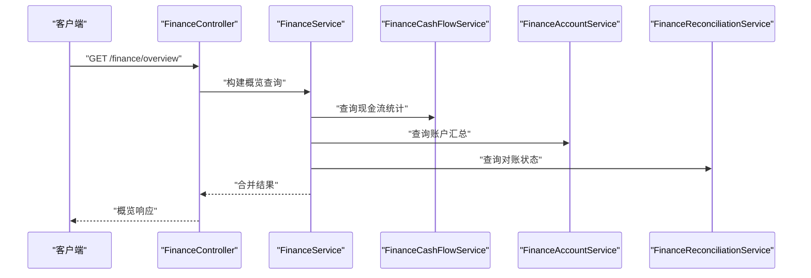
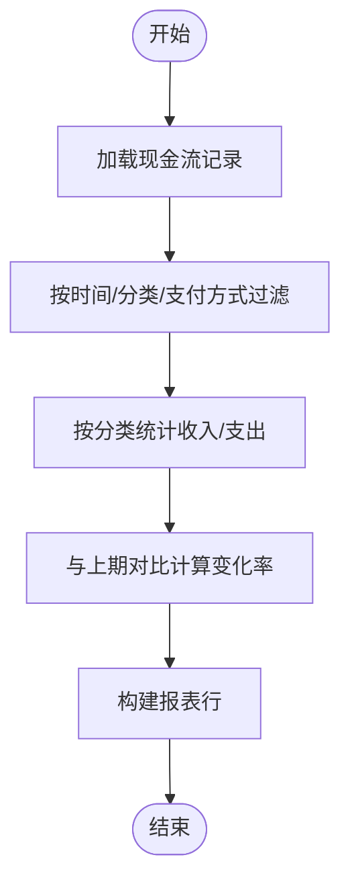
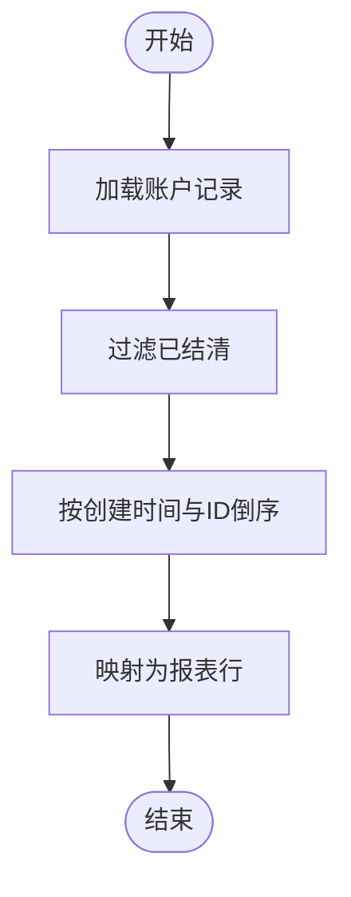
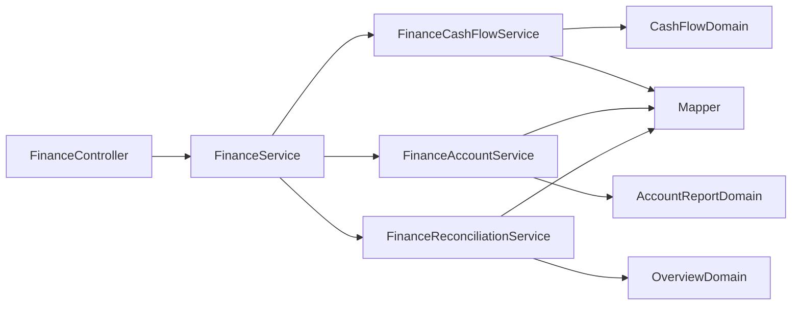

# 现金流管理

<cite>
**本文引用的文件**
- [prisma/schema.prisma](file://prisma/schema.prisma)
- [prisma/purely-profit/finance/cash-flows.prisma](file://prisma/purely-profit/finance/cash-flows.prisma)
- [prisma/purely-profit/finance/accounts.prisma](file://prisma/purely-profit/finance/accounts.prisma)
- [prisma/purely-profit/finance/reconciliations.prisma](file://prisma/purely-profit/finance/reconciliations.prisma)
- [prisma/migrations/20260514213000_add_finance_management/migration.sql](file://prisma/migrations/20260514213000_add_finance_management/migration.sql)
- [src/purely-profit/finance/finance.controller.ts](file://src/purely-profit/finance/finance.controller.ts)
- [src/purely-profit/finance/finance.service.ts](file://src/purely-profit/finance/finance.service.ts)
- [src/purely-profit/finance/finance-cash-flow.service.ts](file://src/purely-profit/finance/finance-cash-flow.service.ts)
- [src/purely-profit/finance/finance-account.service.ts](file://src/purely-profit/finance/finance-account.service.ts)
- [src/purely-profit/finance/finance-reconciliation.service.ts](file://src/purely-profit/finance/finance-reconciliation.service.ts)
- [src/purely-profit/finance/finance-cash-flow.domain.ts](file://src/purely-profit/finance/finance-cash-flow.domain.ts)
- [src/purely-profit/finance/finance-account-report.domain.ts](file://src/purely-profit/finance/finance-account-report.domain.ts)
- [src/purely-profit/finance/finance-overview.domain.ts](file://src/purely-profit/finance/finance-overview.domain.ts)
- [src/purely-profit/finance/finance.mapper.ts](file://src/purely-profit/finance/finance.mapper.ts)
- [src/purely-profit/finance/dto/finance-cash-flow.query.dto.ts](file://src/purely-profit/finance/dto/finance-cash-flow.query.dto.ts)
- [src/purely-profit/finance/dto/finance-cash-flow.response.dto.ts](file://src/purely-profit/finance/dto/finance-cash-flow.response.dto.ts)
- [src/purely-profit/finance/dto/finance-account.query.dto.ts](file://src/purely-profit/finance/dto/finance-account.query.dto.ts)
- [src/purely-profit/finance/dto/finance-account.response.dto.ts](file://src/purely-profit/finance/dto/finance-account.response.dto.ts)
- [src/purely-profit/finance/dto/finance-reconciliation.query.dto.ts](file://src/purely-profit/finance/dto/finance-reconciliation.query.dto.ts)
- [src/purely-profit/finance/dto/finance-reconciliation.response.dto.ts](file://src/purely-profit/finance/dto/finance-reconciliation.response.dto.ts)
- [src/purely-profit/finance/dto/finance-overview.query.dto.ts](file://src/purely-profit/finance/dto/finance-overview.query.dto.ts)
- [src/purely-profit/finance/dto/finance-overview.response.dto.ts](file://src/purely-profit/finance/dto/finance-overview.response.dto.ts)
- [src/purely-profit/finance/dto/finance-report.query.dto.ts](file://src/purely-profit/finance/dto/finance-report.query.dto.ts)
- [src/purely-profit/finance/dto/finance-report.response.dto.ts](file://src/purely-profit/finance/dto/finance-report.response.dto.ts)
- [src/purely-profit/finance/finance.constants.ts](file://src/purely-profit/finance/finance.constants.ts)
- [src/purely-profit/finance/finance-date.utils.ts](file://src/purely-profit/finance/finance-date.utils.ts)
- [src/purely-profit/finance/finance-money.utils.ts](file://src/purely-profit/finance/finance-money.utils.ts)
- [src/purely-profit/finance/finance-range.utils.ts](file://src/purely-profit/finance/finance-range.utils.ts)
- [src/purely-profit/operations/sales-record/sales-record.service.ts](file://src/purely-profit/operations/sales-record/sales-record.service.ts)
- [src/purely-profit/operations/purchases/purchases.service.ts](file://src/purely-profit/operations/purchases/purchases.service.ts)
- [test/finance.e2e-spec.ts](file://test/finance.e2e-spec.ts)
</cite>

## 目录
1. [简介](#简介)
2. [项目结构](#项目结构)
3. [核心组件](#核心组件)
4. [架构总览](#架构总览)
5. [详细组件分析](#详细组件分析)
6. [依赖分析](#依赖分析)
7. [性能考虑](#性能考虑)
8. [故障排除指南](#故障排除指南)
9. [结论](#结论)
10. [附录](#附录)

## 简介
本文件系统性阐述“现金流管理”功能的设计与实现，覆盖以下主题：
- 现金流基础：流入/流出、收支记录、现金流分类与支付方式
- 预测与分析：现金流统计、趋势分析、报表生成
- 管理功能：现金流图表、预警、报告、对账
- 高级特性：现金流调节、优化与风险控制
- 关联关系：与销售订单、采购订单的联动
- 数据来源与算法：预测模型与时间范围处理
- API 使用示例与计算逻辑说明

## 项目结构
财务模块采用按领域分层的组织方式，核心文件位于 src/purely-profit/finance 下，并通过 Prisma 定义数据库模式。迁移脚本定义了枚举类型（方向、分类、支付方式、账户类型/状态/类别、对账类型/状态）。

```mermaid
graph TB
subgraph "Prisma 模式"
CF["cash-flows.prisma<br/>现金流记录"]
AC["accounts.prisma<br/>应收应付账户"]
RC["reconciliations.prisma<br/>对账单"]
end
subgraph "控制器与服务"
CTRL["finance.controller.ts"]
SVC["finance.service.ts"]
CFSVC["finance-cash-flow.service.ts"]
ACSVC["finance-account.service.ts"]
RCSVC["finance-reconciliation.service.ts"]
end
subgraph "领域与映射"
CFD["finance-cash-flow.domain.ts"]
ACRD["finance-account-report.domain.ts"]
OVRD["finance-overview.domain.ts"]
MAP["finance.mapper.ts"]
end
subgraph "DTO"
QCF["finance-cash-flow.query.dto.ts"]
RCF["finance-cash-flow.response.dto.ts"]
QAC["finance-account.query.dto.ts"]
RAC["finance-account.response.dto.ts"]
QRC["finance-reconciliation.query.dto.ts"]
RRC["finance-reconciliation.response.dto.ts"]
QOV["finance-overview.query.dto.ts"]
ROV["finance-overview.response.dto.ts"]
QRPT["finance-report.query.dto.ts"]
RRPT["finance-report.response.dto.ts"]
end
PRISMA["schema.prisma"] --> CF
PRISMA --> AC
PRISMA --> RC
CTRL --> SVC
SVC --> CFSVC
SVC --> ACSVC
SVC --> RCSVC
CFSVC --> CFD
ACSVC --> ACRD
RCSVC --> OVRD
CFSVC --> MAP
ACSVC --> MAP
RCSVC --> MAP
CFSVC --> QCF
CFSVC --> RCF
ACSVC --> QAC
ACSVC --> RAC
RCSVC --> QRC
RCSVC --> RRC
SVC --> QOV
SVC --> ROV
SVC --> QRPT
SVC --> RRPT
```

**图示来源**
- [prisma/schema.prisma](file://prisma/schema.prisma)
- [prisma/purely-profit/finance/cash-flows.prisma](file://prisma/purely-profit/finance/cash-flows.prisma)
- [prisma/purely-profit/finance/accounts.prisma](file://prisma/purely-profit/finance/accounts.prisma)
- [prisma/purely-profit/finance/reconciliations.prisma](file://prisma/purely-profit/finance/reconciliations.prisma)
- [src/purely-profit/finance/finance.controller.ts](file://src/purely-profit/finance/finance.controller.ts)
- [src/purely-profit/finance/finance.service.ts](file://src/purely-profit/finance/finance.service.ts)
- [src/purely-profit/finance/finance-cash-flow.service.ts](file://src/purely-profit/finance/finance-cash-flow.service.ts)
- [src/purely-profit/finance/finance-account.service.ts](file://src/purely-profit/finance/finance-account.service.ts)
- [src/purely-profit/finance/finance-reconciliation.service.ts](file://src/purely-profit/finance/finance-reconciliation.service.ts)
- [src/purely-profit/finance/finance-cash-flow.domain.ts](file://src/purely-profit/finance/finance-cash-flow.domain.ts)
- [src/purely-profit/finance/finance-account-report.domain.ts](file://src/purely-profit/finance/finance-account-report.domain.ts)
- [src/purely-profit/finance/finance-overview.domain.ts](file://src/purely-profit/finance/finance-overview.domain.ts)
- [src/purely-profit/finance/finance.mapper.ts](file://src/purely-profit/finance/finance.mapper.ts)
- [src/purely-profit/finance/dto/finance-cash-flow.query.dto.ts](file://src/purely-profit/finance/dto/finance-cash-flow.query.dto.ts)
- [src/purely-profit/finance/dto/finance-cash-flow.response.dto.ts](file://src/purely-profit/finance/dto/finance-cash-flow.response.dto.ts)
- [src/purely-profit/finance/dto/finance-account.query.dto.ts](file://src/purely-profit/finance/dto/finance-account.query.dto.ts)
- [src/purely-profit/finance/dto/finance-account.response.dto.ts](file://src/purely-profit/finance/dto/finance-account.response.dto.ts)
- [src/purely-profit/finance/dto/finance-reconciliation.query.dto.ts](file://src/purely-profit/finance/dto/finance-reconciliation.query.dto.ts)
- [src/purely-profit/finance/dto/finance-reconciliation.response.dto.ts](file://src/purely-profit/finance/dto/finance-reconciliation.response.dto.ts)
- [src/purely-profit/finance/dto/finance-overview.query.dto.ts](file://src/purely-profit/finance/dto/finance-overview.query.dto.ts)
- [src/purely-profit/finance/dto/finance-overview.response.dto.ts](file://src/purely-profit/finance/dto/finance-overview.response.dto.ts)
- [src/purely-profit/finance/dto/finance-report.query.dto.ts](file://src/purely-profit/finance/dto/finance-report.query.dto.ts)
- [src/purely-profit/finance/dto/finance-report.response.dto.ts](file://src/purely-profit/finance/dto/finance-report.response.dto.ts)

**章节来源**
- [prisma/schema.prisma](file://prisma/schema.prisma)
- [prisma/migrations/20260514213000_add_finance_management/migration.sql](file://prisma/migrations/20260514213000_add_finance_management/migration.sql)

## 核心组件
- 现金流记录（Cash Flow）
  - 字段：方向（收入/支出）、分类（销售、退款、转账、营销、税费等）、金额、支付方式（现金、微信、支付宝、刷卡、银行、其他）、摘要、日期、备注
  - 查询与分页：支持按时间范围、分类、支付方式筛选；返回分页结果
- 应收应付账户（Account）
  - 类型：应收、应付；状态：待处理、部分、已结清、逾期；类别：销售信用、预付款、供应商欠款、贷款、押金、其他
  - 统计：总金额、已付、剩余、到期日、状态推导
- 对账（Reconciliation）
  - 类型：日/周/月/付款/供应商/自定义；状态：草稿、已确认、差异、已调整
  - 条目：账面金额、实际金额、差异、备注
- 报表与概览
  - 现金流报表行：日期标签、标题、方向、分类标签、金额、支付标签
  - 账户报表行：类型、对手方、金额、剩余、状态标签、日期标签
  - 概览：总收入、总支出、净现金流、环比变化、记录数、应收/应付汇总

**章节来源**
- [prisma/migrations/20260514213000_add_finance_management/migration.sql](file://prisma/migrations/20260514213000_add_finance_management/migration.sql)
- [src/purely-profit/finance/finance-cash-flow.domain.ts](file://src/purely-profit/finance/finance-cash-flow.domain.ts)
- [src/purely-profit/finance/finance-account-report.domain.ts](file://src/purely-profit/finance/finance-account-report.domain.ts)
- [src/purely-profit/finance/finance-overview.domain.ts](file://src/purely-profit/finance/finance-overview.domain.ts)
- [src/purely-profit/finance/finance.mapper.ts](file://src/purely-profit/finance/finance.mapper.ts)

## 架构总览
财务模块遵循“控制器 -> 服务 -> 领域/查询 -> 映射”的分层设计。控制器负责请求路由与参数校验，服务聚合业务逻辑并调用领域方法，领域层封装数据转换与报表构建，映射层统一输出 DTO 并处理分页元信息。

**图示来源**
- [src/purely-profit/finance/finance.controller.ts](file://src/purely-profit/finance/finance.controller.ts)
- [src/purely-profit/finance/finance.service.ts](file://src/purely-profit/finance/finance.service.ts)
- [src/purely-profit/finance/finance-cash-flow.service.ts](file://src/purely-profit/finance/finance-cash-flow.service.ts)
- [src/purely-profit/finance/finance-account.service.ts](file://src/purely-profit/finance/finance-account.service.ts)
- [src/purely-profit/finance/finance-reconciliation.service.ts](file://src/purely-profit/finance/finance-reconciliation.service.ts)

## 详细组件分析

### 现金流记录（Cash Flow）
- 数据模型
  - 方向：收入/支出
  - 分类：销售、退款、转账（转入/转出）、其他收入/支出
  - 支付方式：现金、微信、支付宝、刷卡、银行、其他
  - 时间范围：起止时间、周期（日/周/月）
- 查询与分页
  - 输入：时间范围、分类、支付方式、分页参数
  - 输出：分页列表，包含每条记录的分类标签、支付标签、金额、日期标签
- 报表行构建
  - 将原始记录映射为报表行，统一金额格式化与日期标签
- 计算逻辑
  - 按分类统计收入/支出小计，用于概览与对比
  - 与上期对比计算环比百分比变化

**图示来源**
- [src/purely-profit/finance/finance-cash-flow.domain.ts](file://src/purely-profit/finance/finance-cash-flow.domain.ts)
- [src/purely-profit/finance/finance.mapper.ts](file://src/purely-profit/finance/finance.mapper.ts)
- [src/purely-profit/finance/dto/finance-cash-flow.query.dto.ts](file://src/purely-profit/finance/dto/finance-cash-flow.query.dto.ts)
- [src/purely-profit/finance/dto/finance-cash-flow.response.dto.ts](file://src/purely-profit/finance/dto/finance-cash-flow.response.dto.ts)

**章节来源**
- [src/purely-profit/finance/finance-cash-flow.domain.ts](file://src/purely-profit/finance/finance-cash-flow.domain.ts)
- [src/purely-profit/finance/finance.mapper.ts](file://src/purely-profit/finance/finance.mapper.ts)
- [src/purely-profit/finance/dto/finance-cash-flow.query.dto.ts](file://src/purely-profit/finance/dto/finance-cash-flow.query.dto.ts)
- [src/purely-profit/finance/dto/finance-cash-flow.response.dto.ts](file://src/purely-profit/finance/dto/finance-cash-flow.response.dto.ts)

### 应收应付账户（Account）
- 数据模型
  - 类型：应收/应付；状态：待处理/部分/已结清/逾期；类别：销售信用/预付款/供应商欠款/贷款/押金/其他
  - 字段：对手方、总金额、已付、剩余、到期日、日期、备注
- 报表行构建
  - 过滤已结清记录，按创建时间与 ID 倒序排序
  - 显示类型标签、状态标签、日期标签与金额字段
- 衍生字段
  - 基于已付/总金额推导剩余与状态

**图示来源**
- [src/purely-profit/finance/finance-account-report.domain.ts](file://src/purely-profit/finance/finance-account-report.domain.ts)
- [src/purely-profit/finance/finance.mapper.ts](file://src/purely-profit/finance/finance.mapper.ts)

**章节来源**
- [src/purely-profit/finance/finance-account-report.domain.ts](file://src/purely-profit/finance/finance-account-report.domain.ts)
- [src/purely-profit/finance/finance.mapper.ts](file://src/purely-profit/finance/finance.mapper.ts)

### 对账（Reconciliation）
- 数据模型
  - 类型：日/周/月/付款/供应商/自定义；状态：草稿/已确认/差异/已调整
  - 条目：账面金额、实际金额、差异、备注
- 概览
  - 统计对账状态分布与差异情况，辅助风险识别

**章节来源**
- [src/purely-profit/finance/finance-reconciliation.service.ts](file://src/purely-profit/finance/finance-reconciliation.service.ts)
- [src/purely-profit/finance/dto/finance-reconciliation.query.dto.ts](file://src/purely-profit/finance/dto/finance-reconciliation.query.dto.ts)
- [src/purely-profit/finance/dto/finance-reconciliation.response.dto.ts](file://src/purely-profit/finance/dto/finance-reconciliation.response.dto.ts)

### 报表与概览（Overview）
- 概览指标
  - 总收入、总支出、净现金流、记录数、应收/应付合计、与上期对比百分比
- 时间范围
  - 支持按日/周/月等周期进行范围切分与环比计算

**章节来源**
- [src/purely-profit/finance/finance-overview.domain.ts](file://src/purely-profit/finance/finance-overview.domain.ts)
- [src/purely-profit/finance/finance-range.utils.ts](file://src/purely-profit/finance/finance-range.utils.ts)
- [src/purely-profit/finance/dto/finance-overview.query.dto.ts](file://src/purely-profit/finance/dto/finance-overview.query.dto.ts)
- [src/purely-profit/finance/dto/finance-overview.response.dto.ts](file://src/purely-profit/finance/dto/finance-overview.response.dto.ts)

## 依赖分析
- 控制器依赖服务层，服务层聚合多个子服务以完成复合查询与统计
- 领域层与映射层解耦查询结果与输出 DTO，便于扩展与测试
- DTO 层严格约束输入/输出结构，确保接口稳定性

**图示来源**
- [src/purely-profit/finance/finance.controller.ts](file://src/purely-profit/finance/finance.controller.ts)
- [src/purely-profit/finance/finance.service.ts](file://src/purely-profit/finance/finance.service.ts)
- [src/purely-profit/finance/finance-cash-flow.service.ts](file://src/purely-profit/finance/finance-cash-flow.service.ts)
- [src/purely-profit/finance/finance-account.service.ts](file://src/purely-profit/finance/finance-account.service.ts)
- [src/purely-profit/finance/finance-reconciliation.service.ts](file://src/purely-profit/finance/finance-reconciliation.service.ts)
- [src/purely-profit/finance/finance-cash-flow.domain.ts](file://src/purely-profit/finance/finance-cash-flow.domain.ts)
- [src/purely-profit/finance/finance-account-report.domain.ts](file://src/purely-profit/finance/finance-account-report.domain.ts)
- [src/purely-profit/finance/finance-overview.domain.ts](file://src/purely-profit/finance/finance-overview.domain.ts)
- [src/purely-profit/finance/finance.mapper.ts](file://src/purely-profit/finance/finance.mapper.ts)

**章节来源**
- [src/purely-profit/finance/finance.controller.ts](file://src/purely-profit/finance/finance.controller.ts)
- [src/purely-profit/finance/finance.service.ts](file://src/purely-profit/finance/finance.service.ts)

## 性能考虑
- 查询优化
  - 使用索引与范围查询（时间、状态、分类），避免全表扫描
  - 分页参数限制单页规模，结合游标或偏移量策略
- 内存与序列化
  - 批量映射时复用格式化函数，减少重复计算
  - DTO 层仅暴露必要字段，降低序列化开销
- 缓存与预热
  - 对高频报表（概览、账户汇总）可引入缓存与预热机制
- 异步处理
  - 大数据量导出与复杂统计可异步执行并提供进度反馈

## 故障排除指南
- 常见问题
  - 查询无结果：检查时间范围是否正确、是否存在过滤条件导致空集
  - 金额异常：核对货币单位与格式化规则，确保四舍五入策略一致
  - 对账差异：逐项核对账面与实际金额，确认条目完整性
- 排查步骤
  - 启用日志记录请求参数与查询 SQL
  - 校验 DTO 参数与枚举值范围
  - 对比上期数据与计算公式，定位异常区间

**章节来源**
- [src/purely-profit/finance/finance-money.utils.ts](file://src/purely-profit/finance/finance-money.utils.ts)
- [src/purely-profit/finance/finance-date.utils.ts](file://src/purely-profit/finance/finance-date.utils.ts)

## 结论
本模块以清晰的分层架构实现了从现金流记录到报表概览的完整闭环，具备良好的扩展性与可维护性。通过严格的 DTO 约束与领域映射，既保证了接口稳定性，也为后续的预测、预警与风控能力打下坚实基础。

## 附录

### API 使用示例与计算逻辑说明
- 获取概览
  - 请求：GET /finance/overview
  - 输入：时间范围、周期
  - 输出：总收入、总支出、净现金流、环比变化、记录数、应收/应付合计
  - 计算：基于现金流统计与账户衍生字段，按周期切分并对比上期
- 获取现金流记录
  - 请求：GET /finance/cash-flow
  - 输入：时间范围、分类、支付方式、分页
  - 输出：分页列表，含分类标签、支付标签、金额、日期标签
  - 计算：按分类汇总收入/支出，构建报表行
- 获取账户报表
  - 请求：GET /finance/accounts
  - 输入：类型、状态、时间范围、分页
  - 输出：分页列表，含类型标签、状态标签、剩余金额、到期日
  - 计算：过滤已结清，按创建时间倒序排序
- 获取对账
  - 请求：GET /finance/reconciliations
  - 输入：类型、状态、时间范围、分页
  - 输出：分页列表，含差异与备注
  - 计算：统计差异分布与状态分布

**章节来源**
- [src/purely-profit/finance/finance.controller.ts](file://src/purely-profit/finance/finance.controller.ts)
- [src/purely-profit/finance/finance.service.ts](file://src/purely-profit/finance/finance.service.ts)
- [src/purely-profit/finance/dto/finance-overview.query.dto.ts](file://src/purely-profit/finance/dto/finance-overview.query.dto.ts)
- [src/purely-profit/finance/dto/finance-cash-flow.query.dto.ts](file://src/purely-profit/finance/dto/finance-cash-flow.query.dto.ts)
- [src/purely-profit/finance/dto/finance-account.query.dto.ts](file://src/purely-profit/finance/dto/finance-account.query.dto.ts)
- [src/purely-profit/finance/dto/finance-reconciliation.query.dto.ts](file://src/purely-profit/finance/dto/finance-reconciliation.query.dto.ts)

### 现金流与销售/采购的关联关系
- 销售订单
  - 现金流记录可由销售订单生成，对应“销售”分类与相应支付方式
  - 账户记录体现应收账款（应收类型），到期日与订单周期相关
- 采购订单
  - 现金流记录可由采购订单生成，对应“采购”分类与相应支付方式
  - 账户记录体现应付账款（应付类型），到期日与采购周期相关

**章节来源**
- [src/purely-profit/operations/sales-record/sales-record.service.ts](file://src/purely-profit/operations/sales-record/sales-record.service.ts)
- [src/purely-profit/operations/purchases/purchases.service.ts](file://src/purely-profit/operations/purchases/purchases.service.ts)

### 现金流预测的数据来源与算法
- 数据来源
  - 历史现金流记录（按分类与周期统计）
  - 账户余额与到期日（预测未来资金流入/流出）
  - 对账差异（识别异常波动）
- 算法建议
  - 时间序列：移动平均、指数平滑
  - 回归分析：线性/多项式拟合，预测未来周期
  - 规则阈值：设定预警线（如连续N期负现金流、余额低于阈值）
- 实施要点
  - 选择合适的周期（日/周/月）与窗口大小
  - 结合季节性与趋势因子
  - 提供置信区间与误差评估

### 现金流图表、预警与报告
- 图表
  - 收支趋势图：按周期展示收入/支出与净现金流
  - 分类占比图：分类维度的收支占比
  - 余额预测图：历史与预测曲线对比
- 预警
  - 负现金流预警、余额不足预警、逾期账款预警
  - 可配置阈值与通知渠道
- 报告
  - 日报/周报/月报模板，自动填充指标与趋势
  - 导出 PDF/Excel，支持自定义字段

### 现金流调节、优化与风险控制
- 调节
  - 对账差异调整、异常交易冲正、跨期记账修正
- 优化
  - 加速收款（缩短回款周期）、延后付款（利用账期）、优化支付方式
- 风险控制
  - 设置额度与审批流程、监控异常波动、建立应急资金池

### 测试参考
- 端到端测试
  - 覆盖概览、现金流、账户、对账的典型场景
  - 包含边界值与异常输入（空集、超界、非法枚举）

**章节来源**
- [test/finance.e2e-spec.ts](file://test/finance.e2e-spec.ts)