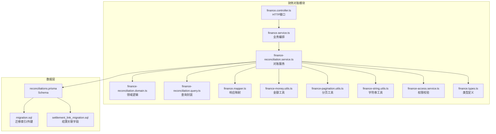
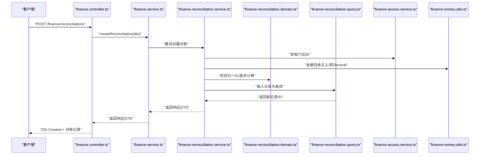
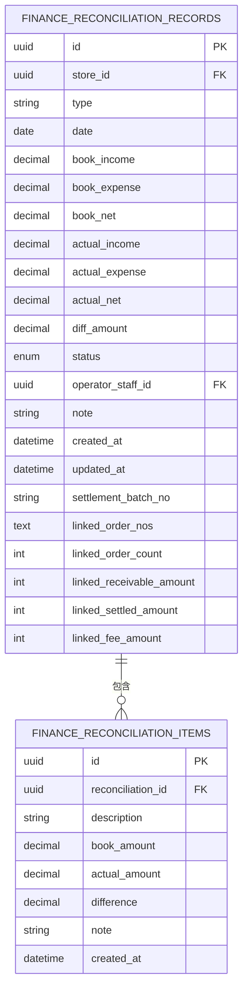
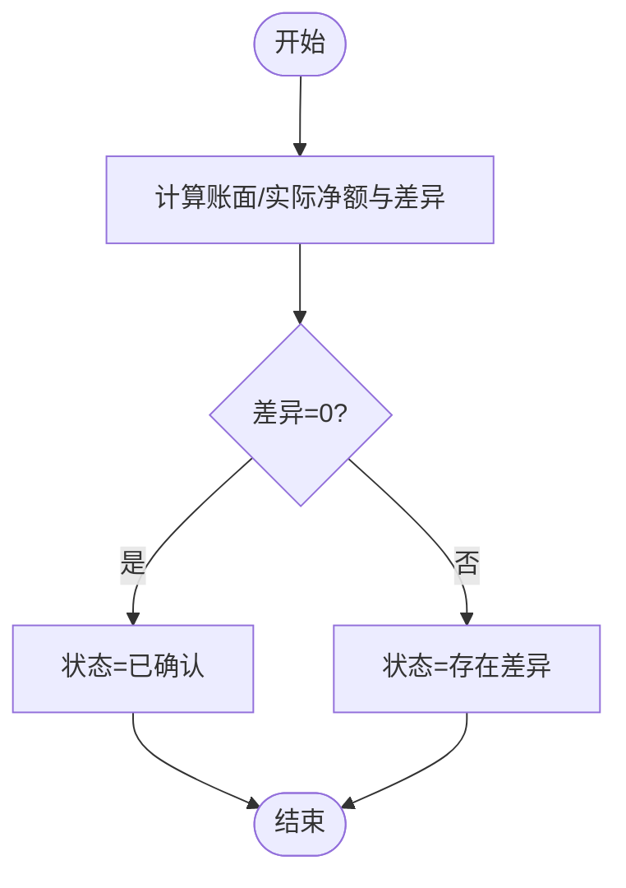
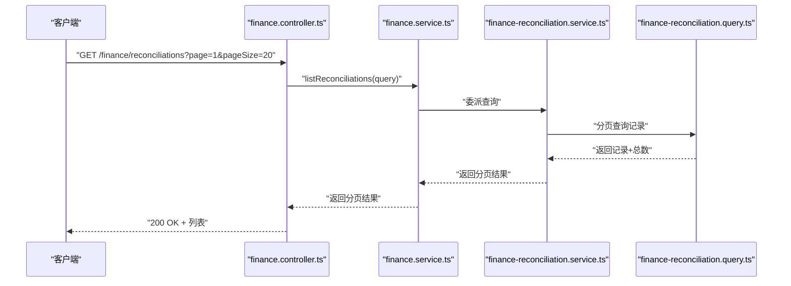
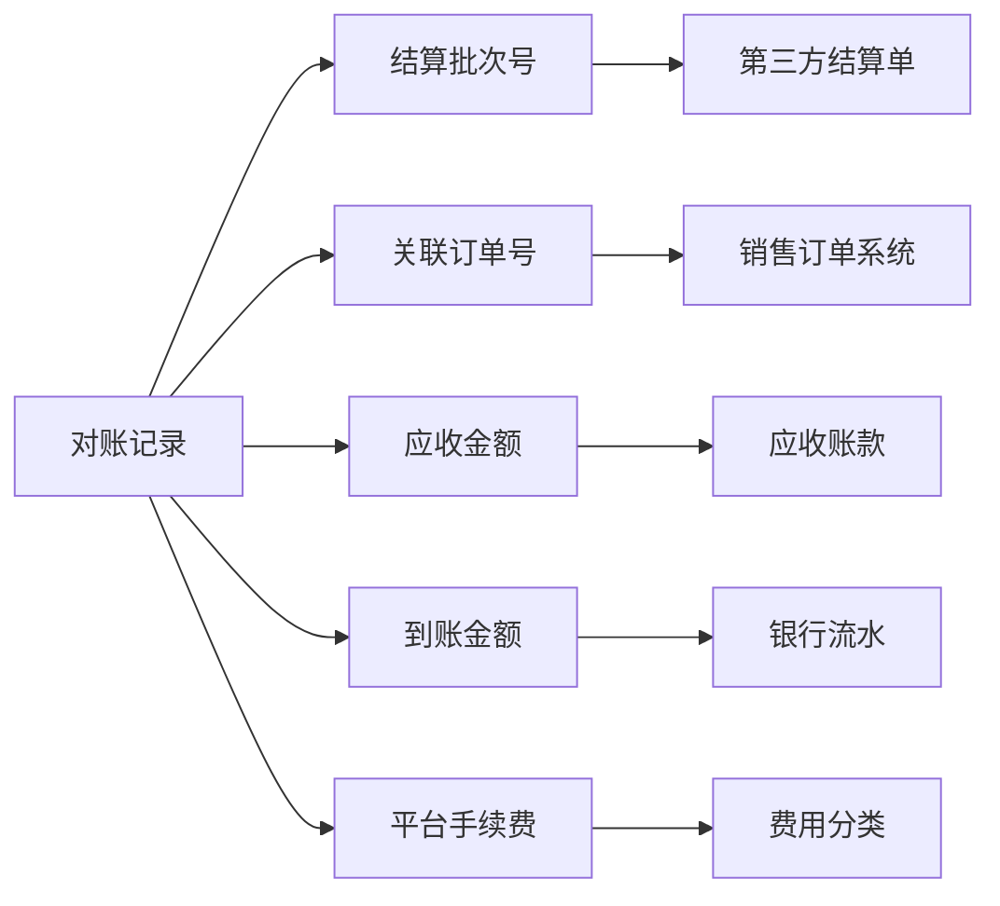
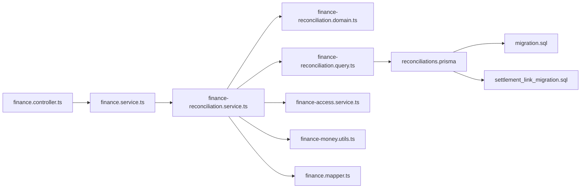

# 财务对账

<cite>
**本文引用的文件**
- [finance-reconciliation.service.ts](file://src/purely-profit/finance/finance-reconciliation.service.ts)
- [finance-reconciliation.domain.ts](file://src/purely-profit/finance/finance-reconciliation.domain.ts)
- [finance-reconciliation.query.ts](file://src/purely-profit/finance/finance-reconciliation.query.ts)
- [finance.controller.ts](file://src/purely-profit/finance/finance.controller.ts)
- [finance-reconciliation.query.dto.ts](file://src/purely-profit/finance/dto/finance-reconciliation.query.dto.ts)
- [finance-reconciliation.response.dto.ts](file://src/purely-profit/finance/dto/finance-reconciliation.response.dto.ts)
- [reconciliations.prisma](file://prisma/purely-profit/finance/reconciliations.prisma)
- [migration.sql](file://prisma/migrations/20260514213000_add_finance_management/migration.sql)
- [add_reconciliation_settlement_link_fields migration.sql](file://prisma/migrations/20260705200000_add_reconciliation_settlement_link_fields/migration.sql)
- [finance.service.ts](file://src/purely-profit/finance/finance.service.ts)
- [finance-access.service.ts](file://src/purely-profit/finance/finance-access.service.ts)
- [finance-money.utils.ts](file://src/purely-profit/finance/finance-money.utils.ts)
- [finance-pagination.utils.ts](file://src/purely-profit/finance/finance-pagination.utils.ts)
- [finance-string.utils.ts](file://src/purely-profit/finance/finance-string.utils.ts)
- [finance.mapper.ts](file://src/purely-profit/finance/finance.mapper.ts)
- [finance.types.ts](file://src/purely-profit/finance/finance.types.ts)
- [finance.e2e-spec.ts](file://test/finance.e2e-spec.ts)
</cite>

## 更新摘要
**变更内容**
- 新增结算批次关联字段支持，包括 settlement_batch_no、linked_order_nos、linked_receivable_amount、linked_settled_amount 等字段
- 增强了对账记录与平台手续费分类的追踪能力
- 更新了数据模型、DTO 定义和服务层实现以支持新的结算关联功能

## 目录
1. [简介](#简介)
2. [项目结构](#项目结构)
3. [核心组件](#核心组件)
4. [架构总览](#架构总览)
5. [详细组件分析](#详细组件分析)
6. [依赖关系分析](#依赖关系分析)
7. [性能考量](#性能考量)
8. [故障排查指南](#故障排查指南)
9. [结论](#结论)
10. [附录](#附录)

## 简介
本文件系统性阐述财务对账模块的设计与实现，覆盖银行对账、账目核对、差异处理、对账周期与规则、对账流程、自动与手工对账、对账统计、异常处理、对账报告与审计等能力。同时解释对账与银行流水、财务凭证的关联关系，并给出对账差异的分类与处理机制说明。文末提供对账 API 的调用示例与业务场景演示。

**更新** 新增结算批次关联功能，支持对账记录与支付结算批次的关联追踪，包括订单号、应收金额、到账金额和平台手续费等信息。

## 项目结构
财务对账模块位于"纯利润"后端工程的财务子域中，采用按职责分层组织：DTO 定义、领域模型、查询封装、服务层、控制器与数据库映射。核心文件包括：
- DTO：输入输出参数定义（创建、列表、确认、统计）
- 领域：对账状态归一化、差异计算、条目构建
- 查询：对账记录与条目的查询、分页、更新、删除
- 服务：业务编排、权限校验、金额精度处理
- 控制器：HTTP 接口暴露
- 数据模型：Prisma Schema 与迁移脚本
- 工具：金额四舍五入、字符串裁剪、分页构造

**图表来源**
- [finance.controller.ts](file://src/purely-profit/finance/finance.controller.ts)
- [finance.service.ts](file://src/purely-profit/finance/finance.service.ts)
- [finance-reconciliation.service.ts](file://src/purely-profit/finance/finance-reconciliation.service.ts)
- [finance-reconciliation.domain.ts](file://src/purely-profit/finance/finance-reconciliation.domain.ts)
- [finance-reconciliation.query.ts](file://src/purely-profit/finance/finance-reconciliation.query.ts)
- [finance.mapper.ts](file://src/purely-profit/finance/finance.mapper.ts)
- [reconciliations.prisma](file://prisma/purely-profit/finance/reconciliations.prisma)
- [migration.sql](file://prisma/migrations/20260514213000_add_finance_management/migration.sql)
- [add_reconciliation_settlement_link_fields migration.sql](file://prisma/migrations/20260705200000_add_reconciliation_settlement_link_fields/migration.sql)

**章节来源**
- [finance.controller.ts](file://src/purely-profit/finance/finance.controller.ts)
- [finance.service.ts](file://src/purely-profit/finance/finance.service.ts)
- [finance-reconciliation.service.ts](file://src/purely-profit/finance/finance-reconciliation.service.ts)
- [finance-reconciliation.domain.ts](file://src/purely-profit/finance/finance-reconciliation.domain.ts)
- [finance-reconciliation.query.ts](file://src/purely-profit/finance/finance-reconciliation.query.ts)
- [finance.mapper.ts](file://src/purely-profit/finance/finance.mapper.ts)
- [reconciliations.prisma](file://prisma/purely-profit/finance/reconciliations.prisma)
- [migration.sql](file://prisma/migrations/20260514213000_add_finance_management/migration.sql)

## 核心组件
- 对账记录与条目
  - 记录：包含期初/期末日期、账面收入/支出/净额、实际收入/支出/净额、差异金额、状态、操作人、备注等
  - 条目：对账差异明细项，含描述、账面金额、实际金额、差异、备注
- 对账状态
  - 初始化、存在差异、已调整、已确认
- 金额处理
  - 统一使用金额工具进行四舍五入与 Decimal 转换，确保精度一致
- 分页与映射
  - 使用分页工具构造分页元信息，使用映射器将实体转换为响应 DTO
- 权限与作用域
  - 通过访问控制服务获取当前用户可操作的门店 ID，限制对账范围

**更新** 新增结算批次关联字段：
- settlementBatchNo：到账批次号，用于标识支付结算批次
- linkedOrderNos：关联销售单号列表，逗号分隔存储
- linkedOrderCount：关联销售单数量
- linkedReceivableAmount：关联应收金额（单位：分）
- linkedSettledAmount：本次到账金额（单位：分）
- linkedFeeAmount：平台手续费（单位：分）

**章节来源**
- [finance-reconciliation.domain.ts](file://src/purely-profit/finance/finance-reconciliation.domain.ts)
- [finance-reconciliation.service.ts](file://src/purely-profit/finance/finance-reconciliation.service.ts)
- [finance-money.utils.ts](file://src/purely-profit/finance/finance-money.utils.ts)
- [finance-pagination.utils.ts](file://src/purely-profit/finance/finance-pagination.utils.ts)
- [finance-access.service.ts](file://src/purely-profit/finance/finance-access.service.ts)

## 架构总览
对账模块遵循"控制器-服务-领域-查询-数据"的分层架构。控制器负责接收请求并调用服务；服务负责业务编排、权限校验与金额处理；领域负责状态归一化与差异计算；查询封装数据库交互；数据层由 Prisma Schema 与迁移脚本定义。

**图表来源**
- [finance.controller.ts](file://src/purely-profit/finance/finance.controller.ts)
- [finance.service.ts](file://src/purely-profit/finance/finance.service.ts)
- [finance-reconciliation.service.ts](file://src/purely-profit/finance/finance-reconciliation.service.ts)
- [finance-reconciliation.domain.ts](file://src/purely-profit/finance/finance-reconciliation.domain.ts)
- [finance-reconciliation.query.ts](file://src/purely-profit/finance/finance-reconciliation.query.ts)
- [finance-access.service.ts](file://src/purely-profit/finance/finance-access.service.ts)
- [finance-money.utils.ts](file://src/purely-profit/finance/finance-money.utils.ts)

## 详细组件分析

### 对账记录与条目模型
- 记录字段
  - 期类型（如月度）、状态、日期、账面/实际收支与净额、差异金额、操作人、备注、扩展字段（渠道、对手方等）
  - **新增** 结算关联字段：到账批次号、关联订单号、应收金额、到账金额、平台手续费等
- 条目字段
  - 描述、账面金额、实际金额、差异、备注
- 关系
  - 一条对账记录可包含多条差异条目，二者通过外键关联

**图表来源**
- [reconciliations.prisma](file://prisma/purely-profit/finance/reconciliations.prisma)
- [migration.sql](file://prisma/migrations/20260514213000_add_finance_management/migration.sql)
- [add_reconciliation_settlement_link_fields migration.sql](file://prisma/migrations/20260705200000_add_reconciliation_settlement_link_fields/migration.sql)

**章节来源**
- [reconciliations.prisma](file://prisma/purely-profit/finance/reconciliations.prisma)
- [migration.sql](file://prisma/migrations/20260514213000_add_finance_management/migration.sql)
- [add_reconciliation_settlement_link_fields migration.sql](file://prisma/migrations/20260705200000_add_reconciliation_settlement_link_fields/migration.sql)

### 对账状态与规则
- 状态归一化
  - 当差异金额为零时，状态归一化为"已确认"
  - 否则为"存在差异"
- 创建时的状态推导
  - 依据传入状态与差异金额共同决定最终状态
- 确认流程
  - 支持二次确认并允许补充调整备注

**图表来源**
- [finance-reconciliation.domain.ts](file://src/purely-profit/finance/finance-reconciliation.domain.ts)
- [finance-reconciliation.service.ts](file://src/purely-profit/finance/finance-reconciliation.service.ts)

**章节来源**
- [finance-reconciliation.domain.ts](file://src/purely-profit/finance/finance-reconciliation.domain.ts)
- [finance-reconciliation.service.ts](file://src/purely-profit/finance/finance-reconciliation.service.ts)

### 对账流程与API
- 创建对账
  - 输入：期类型、期日期、账面/实际收支、可选条目、状态、备注等
  - 处理：金额归一化、差异计算、状态归一化、持久化
  - 输出：完整对账记录（含条目）
- 列表与分页
  - 支持按门店、类型、日期范围、状态等条件筛选
- 确认对账
  - 将状态从"存在差异"调整为"已确认"，可附加调整备注
- 删除对账
  - 仅允许删除未生效或特定状态下的记录（具体约束见查询层）

**图表来源**
- [finance.controller.ts](file://src/purely-profit/finance/finance.controller.ts)
- [finance.service.ts](file://src/purely-profit/finance/finance.service.ts)
- [finance-reconciliation.service.ts](file://src/purely-profit/finance/finance-reconciliation.service.ts)
- [finance-reconciliation.query.ts](file://src/purely-profit/finance/finance-reconciliation.query.ts)

**章节来源**
- [finance.controller.ts](file://src/purely-profit/finance/finance.controller.ts)
- [finance.service.ts](file://src/purely-profit/finance/finance.service.ts)
- [finance-reconciliation.service.ts](file://src/purely-profit/finance/finance-reconciliation.service.ts)
- [finance-reconciliation.query.ts](file://src/purely-profit/finance/finance-reconciliation.query.ts)

### 结算批次关联功能
**新增** 结算批次关联功能增强了对账记录的追踪能力，支持以下关键字段：

- **settlementBatchNo**：到账批次号，用于标识支付结算批次，便于与第三方支付平台的结算单进行关联
- **linkedOrderNos**：关联销售单号列表，以逗号分隔的形式存储多个订单号
- **linkedOrderCount**：关联销售单数量，便于快速统计
- **linkedReceivableAmount**：关联应收金额，表示这些订单的应收总额
- **linkedSettledAmount**：本次到账金额，表示实际收到的金额
- **linkedFeeAmount**：平台手续费，表示平台收取的手续费金额

**图表来源**
- [finance-reconciliation.service.ts](file://src/purely-profit/finance/finance-reconciliation.service.ts)
- [finance-reconciliation.domain.ts](file://src/purely-profit/finance/finance-reconciliation.domain.ts)
- [finance-reconciliation.query.dto.ts](file://src/purely-profit/finance/dto/finance-reconciliation.query.dto.ts)

**章节来源**
- [finance-reconciliation.service.ts](file://src/purely-profit/finance/finance-reconciliation.service.ts)
- [finance-reconciliation.domain.ts](file://src/purely-profit/finance/finance-reconciliation.domain.ts)
- [finance-reconciliation.query.dto.ts](file://src/purely-profit/finance/dto/finance-reconciliation.query.dto.ts)
- [finance-reconciliation.response.dto.ts](file://src/purely-profit/finance/dto/finance-reconciliation.response.dto.ts)

### 自动对账与手工对账
- 自动对账
  - 基于银行流水与财务凭证的匹配算法，生成对账差异条目，自动计算差异金额与状态
- 手工对账
  - 人工核对差异条目，补充调整备注，确认后状态变为"已确认"
- 混合策略
  - 自动对账作为基线，手工对账用于修正与审批

（本小节为概念性说明，不直接分析具体文件）

### 对账统计与报告
- 统计维度
  - 按门店、类型、日期范围、状态统计对账数量与差异总额
- 报告输出
  - 导出对账清单、差异明细、调整记录与审计轨迹

**更新** 新增结算批次维度的统计分析，支持按批次号、关联订单等进行汇总统计。

**章节来源**
- [finance-reconciliation.service.ts](file://src/purely-profit/finance/finance-reconciliation.service.ts)

### 对账异常处理与审计
- 异常处理
  - 删除不存在的对账单返回"未找到"错误
  - 金额计算异常统一通过金额工具保障精度
- 审计
  - 记录操作人、创建/更新时间、调整备注，支持按操作人与时间排序查询

**更新** 新增结算批次相关的审计信息，包括批次号变更、关联订单修改等操作记录。

**章节来源**
- [finance-reconciliation.service.ts](file://src/purely-profit/finance/finance-reconciliation.service.ts)
- [finance-reconciliation.service.spec.ts](file://src/purely-profit/finance/finance-reconciliation.service.spec.ts)

### 对账与银行流水、财务凭证的关联
- 银行流水
  - 作为"实际"数据源，驱动对账差异的产生与核对
- 财务凭证
  - 作为"账面"数据源，与银行流水进行比对
- 关联方式
  - 通过期类型与日期范围对齐，逐笔匹配或聚合匹配

**更新** 新增结算批次关联，将对账记录与第三方支付平台的结算单进行关联，提供更完整的资金流向追踪。

**章节来源**
- [finance-reconciliation.domain.ts](file://src/purely-profit/finance/finance-reconciliation.domain.ts)
- [finance-reconciliation.query.ts](file://src/purely-profit/finance/finance-reconciliation.query.ts)

### 对账差异的分类与处理机制
- 分类
  - 时间差异、金额差异、重复入账、手续费差异、退款差异、其他
- 处理机制
  - 自动生成差异条目；手工核对后调整；必要时生成会计分录并更新凭证

**更新** 新增平台手续费差异的特殊处理，通过 linkedFeeAmount 字段专门跟踪平台收取的手续费差异。

**章节来源**
- [finance-reconciliation.domain.ts](file://src/purely-profit/finance/finance-reconciliation.domain.ts)
- [finance-reconciliation.query.ts](file://src/purely-profit/finance/finance-reconciliation.query.ts)

## 依赖关系分析
- 组件耦合
  - 服务层依赖领域、查询、工具与访问控制；控制器依赖服务；查询依赖数据层
- 外部依赖
  - Prisma 作为 ORM，提供类型安全的数据访问
- 索引与约束
  - 对账记录按门店、类型、日期建立复合索引；条目按记录与创建时间建立索引；外键约束保证数据一致性

**图表来源**
- [finance.controller.ts](file://src/purely-profit/finance/finance.controller.ts)
- [finance.service.ts](file://src/purely-profit/finance/finance.service.ts)
- [finance-reconciliation.service.ts](file://src/purely-profit/finance/finance-reconciliation.service.ts)
- [finance-reconciliation.domain.ts](file://src/purely-profit/finance/finance-reconciliation.domain.ts)
- [finance-reconciliation.query.ts](file://src/purely-profit/finance/finance-reconciliation.query.ts)
- [finance-access.service.ts](file://src/purely-profit/finance/finance-access.service.ts)
- [finance-money.utils.ts](file://src/purely-profit/finance/finance-money.utils.ts)
- [finance.mapper.ts](file://src/purely-profit/finance/finance.mapper.ts)
- [reconciliations.prisma](file://prisma/purely-profit/finance/reconciliations.prisma)
- [migration.sql](file://prisma/migrations/20260514213000_add_finance_management/migration.sql)
- [add_reconciliation_settlement_link_fields migration.sql](file://prisma/migrations/20260705200000_add_reconciliation_settlement_link_fields/migration.sql)

**章节来源**
- [finance.controller.ts](file://src/purely-profit/finance/finance.controller.ts)
- [finance.service.ts](file://src/purely-profit/finance/finance.service.ts)
- [finance-reconciliation.service.ts](file://src/purely-profit/finance/finance-reconciliation.service.ts)
- [finance-reconciliation.domain.ts](file://src/purely-profit/finance/finance-reconciliation.domain.ts)
- [finance-reconciliation.query.ts](file://src/purely-profit/finance/finance-reconciliation.query.ts)
- [finance-access.service.ts](file://src/purely-profit/finance/finance-access.service.ts)
- [finance-money.utils.ts](file://src/purely-profit/finance/finance-money.utils.ts)
- [finance.mapper.ts](file://src/purely-profit/finance/finance.mapper.ts)
- [reconciliations.prisma](file://prisma/purely-profit/finance/reconciliations.prisma)
- [migration.sql](file://prisma/migrations/20260514213000_add_finance_management/migration.sql)

## 性能考量
- 查询优化
  - 利用复合索引加速按门店、类型、日期范围的筛选
  - 分页查询避免一次性加载大量记录
- 金额处理
  - 统一的金额工具减少浮点误差，提升对账准确性
- 并发控制
  - 对账状态变更需加锁或使用乐观锁，防止并发冲突

**更新** 新增结算批次字段的索引优化，考虑对 settlementBatchNo 和 linkedOrderNos 字段建立适当的索引以提升查询性能。

（本节为通用建议，不直接分析具体文件）

## 故障排查指南
- 常见问题
  - 对账记录不存在：检查记录ID与权限范围
  - 金额不一致：核查金额工具与Decimal转换是否正确
  - 状态异常：确认状态归一化逻辑与差异金额计算
- 定位方法
  - 查看服务层日志与异常栈
  - 核对查询层SQL与索引使用情况
  - 使用测试用例验证边界条件

**更新** 新增结算批次相关问题的排查：
- 结算批次号重复：检查批次号的唯一性约束
- 关联订单号格式错误：验证逗号分隔的订单号格式
- 金额转换异常：检查分与元的转换逻辑

**章节来源**
- [finance-reconciliation.service.ts](file://src/purely-profit/finance/finance-reconciliation.service.ts)
- [finance-reconciliation.service.spec.ts](file://src/purely-profit/finance/finance-reconciliation.service.spec.ts)

## 结论
财务对账模块以清晰的分层设计实现了从银行流水到财务凭证的自动化核对与手工复核闭环。通过对账记录与条目的规范化建模、状态归一化与差异计算、权限与分页工具的集成，提供了高可用、可审计、可扩展的对账能力。结合自动与手工对账策略，能够有效降低对账成本并提升准确性。

**更新** 新增的结算批次关联功能进一步增强了对账系统的追踪能力，支持更精细化的资金流向管理和平台手续费分类，为财务分析和审计提供了更全面的数据支持。

## 附录

### 对账 API 示例与调用说明
- 创建对账
  - 方法与路径：POST /finance/reconciliations
  - 请求体：包含期类型、期日期、账面/实际收支、可选条目、状态、备注等
  - **新增** 结算关联字段：settlementBatchNo、linkedOrderNos、linkedReceivableAmount、linkedSettledAmount、linkedFeeAmount
  - 成功响应：返回完整的对账记录（含条目）
  - 参考路径：[finance.controller.ts](file://src/purely-profit/finance/finance.controller.ts)
- 列表与分页
  - 方法与路径：GET /finance/reconciliations
  - 查询参数：页码、每页数量、门店ID、类型、日期范围、状态等
  - 成功响应：分页对象，包含记录数组与分页元信息
  - 参考路径：[finance.controller.ts](file://src/purely-profit/finance/finance.controller.ts)
- 确认对账
  - 方法与路径：PATCH /finance/reconciliations/{id}/confirm
  - 请求体：调整备注
  - 成功响应：返回已确认的对账记录
  - 参考路径：[finance.controller.ts](file://src/purely-profit/finance/finance.controller.ts)
- 删除对账
  - 方法与路径：DELETE /finance/reconciliations/{id}
  - 成功响应：无内容
  - 参考路径：[finance.controller.ts](file://src/purely-profit/finance/finance.controller.ts)

**章节来源**
- [finance.controller.ts](file://src/purely-profit/finance/finance.controller.ts)
- [finance.service.ts](file://src/purely-profit/finance/finance.service.ts)

### 业务场景演示
- 月度对账
  - 场景：按月对齐银行流水与财务凭证，自动生成差异条目，手工核对后确认
  - 关键点：期类型=月度、期日期=当月最后一天、差异归零即确认
- 季度对账
  - 场景：季度汇总差异，识别手续费、退款等差异类别，生成调整备注
  - 关键点：期类型=季度、期日期=季度末、批量核对与审批
- 异常对账
  - 场景：出现大额差异或跨期差异，需要人工介入与专项审计
  - 关键点：保留调整备注、审计轨迹、必要时生成会计分录
- **新增** 结算批次对账
  - 场景：针对第三方支付平台的结算批次进行对账，关联具体订单和手续费
  - 关键点：设置结算批次号、关联订单号列表、记录应收和到账金额差异

**章节来源**
- [finance-reconciliation.domain.ts](file://src/purely-profit/finance/finance-reconciliation.domain.ts)
- [finance-reconciliation.service.ts](file://src/purely-profit/finance/finance-reconciliation.service.ts)

### 结算批次关联字段详解
**新增** 结算批次关联功能的详细字段说明：

- **settlementBatchNo**（到账批次号）
  - 类型：字符串
  - 用途：标识第三方支付平台的结算批次，便于与平台结算单进行关联
  - 示例："MT20260518001"

- **linkedOrderNos**（关联销售单号）
  - 类型：字符串数组
  - 存储：数据库中以逗号分隔的字符串形式存储
  - 用途：记录与该对账记录关联的所有销售订单号
  - 示例：["SO-001", "SO-002", "SO-003"]

- **linkedOrderCount**（关联订单数量）
  - 类型：整数
  - 用途：快速统计关联的订单数量，便于报表展示

- **linkedReceivableAmount**（关联应收金额）
  - 类型：整数（单位：分）
  - 用途：记录关联订单的应收总金额
  - 示例：500000（表示5000元）

- **linkedSettledAmount**（本次到账金额）
  - 类型：整数（单位：分）
  - 用途：记录实际到账的金额
  - 示例：480000（表示4800元）

- **linkedFeeAmount**（平台手续费）
  - 类型：整数（单位：分）
  - 用途：记录平台收取的手续费金额
  - 示例：20000（表示200元）

**章节来源**
- [finance-reconciliation.query.dto.ts](file://src/purely-profit/finance/dto/finance-reconciliation.query.dto.ts)
- [finance-reconciliation.response.dto.ts](file://src/purely-profit/finance/dto/finance-reconciliation.response.dto.ts)
- [finance-reconciliation.domain.ts](file://src/purely-profit/finance/finance-reconciliation.domain.ts)
- [finance-reconciliation.service.ts](file://src/purely-profit/finance/finance-reconciliation.service.ts)