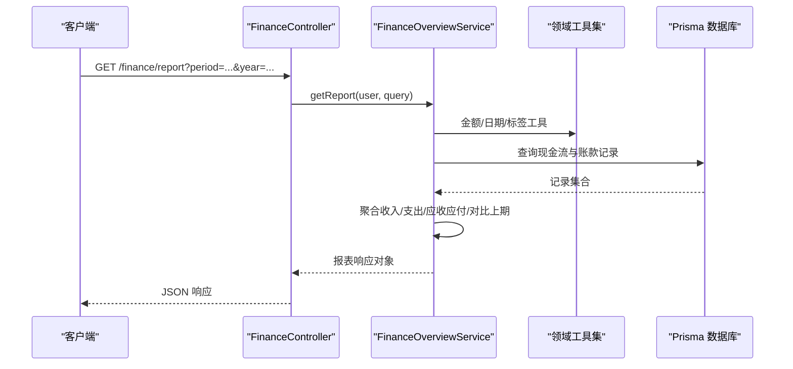
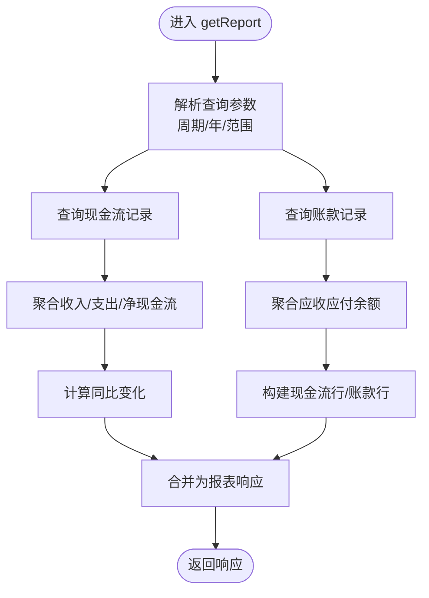
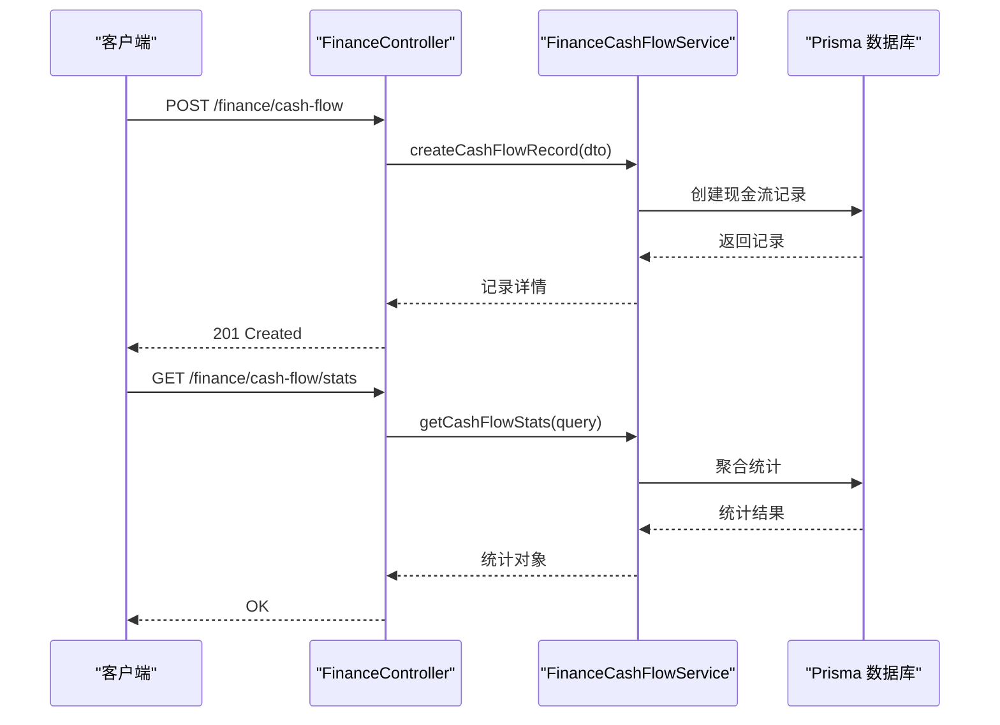
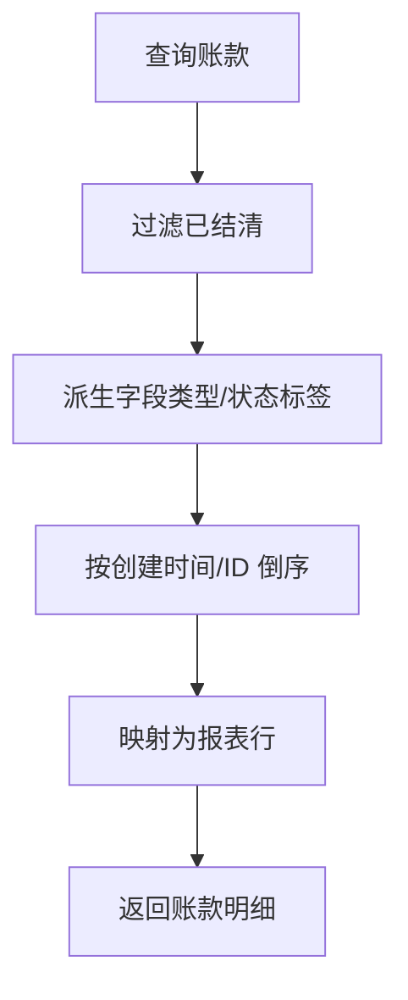
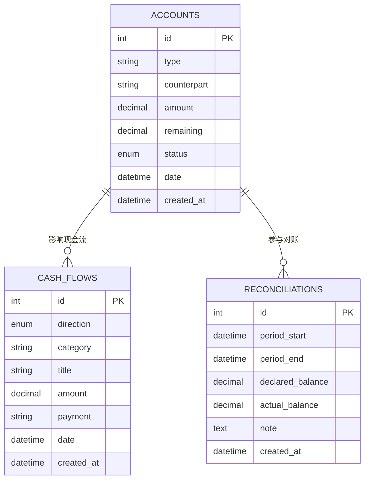
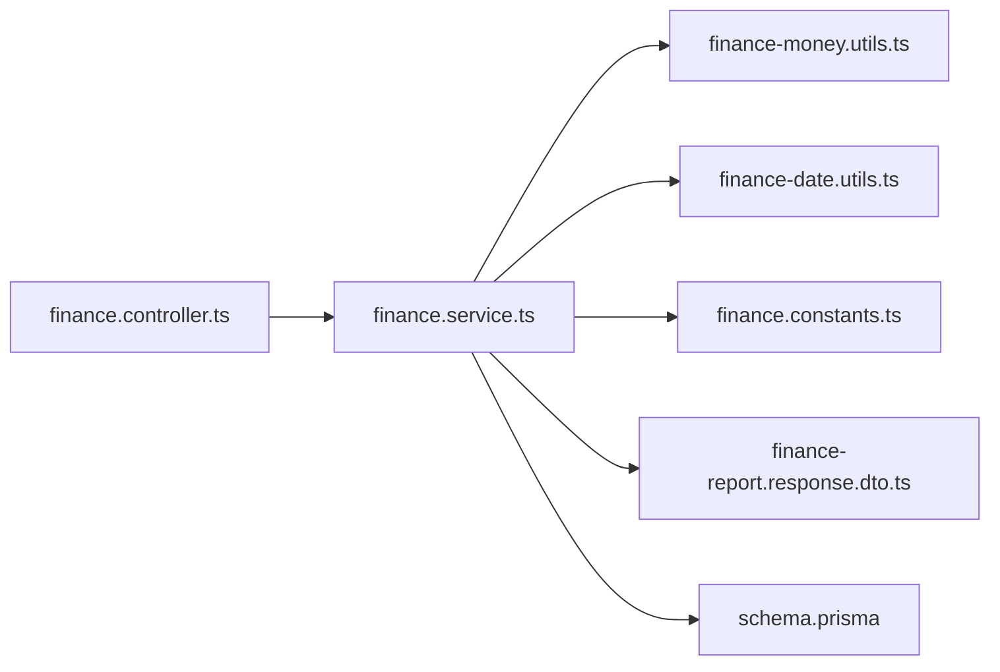

# 财务报表

<cite>
**本文引用的文件**
- [finance.controller.ts](file://src/purely-profit/finance/finance.controller.ts)
- [finance.service.ts](file://src/purely-profit/finance/finance.service.ts)
- [finance-overview.service.ts](file://src/purely-profit/finance/finance-overview.service.ts)
- [finance-account-report.domain.ts](file://src/purely-profit/finance/finance-account-report.domain.ts)
- [finance-cash-flow.domain.ts](file://src/purely-profit/finance/finance-cash-flow.domain.ts)
- [finance-account.domain.ts](file://src/purely-profit/finance/finance-account.domain.ts)
- [finance.constants.ts](file://src/purely-profit/finance/finance.constants.ts)
- [finance-date.utils.ts](file://src/purely-profit/finance/finance-date.utils.ts)
- [finance-money.utils.ts](file://src/purely-profit/finance/finance-money.utils.ts)
- [finance.types.ts](file://src/purely-profit/finance/finance.types.ts)
- [finance-report.response.dto.ts](file://src/purely-profit/finance/dto/finance-report.response.dto.ts)
- [finance-report.query.dto.ts](file://src/purely-profit/finance/dto/finance-report.query.dto.ts)
- [finance-account.query.dto.ts](file://src/purely-profit/finance/dto/finance-account.query.dto.ts)
- [finance-cash-flow.query.dto.ts](file://src/purely-profit/finance/dto/finance-cash-flow.query.dto.ts)
- [finance-overview.query.dto.ts](file://src/purely-profit/finance/dto/finance-overview.query.dto.ts)
- [finance-reconciliation.query.dto.ts](file://src/purely-profit/finance/dto/finance-reconciliation.query.dto.ts)
- [finance-query.dto.ts](file://src/purely-profit/finance/dto/finance-query.dto.ts)
- [finance-access.service.ts](file://src/purely-profit/finance/finance-access.service.ts)
- [schema.prisma](file://prisma/schema.prisma)
- [accounts.prisma](file://prisma/purely-profit/finance/accounts.prisma)
- [cash-flows.prisma](file://prisma/purely-profit/finance/cash-flows.prisma)
- [reconciliations.prisma](file://prisma/purely-profit/finance/reconciliations.prisma)
- [finance-overview.service.spec.ts](file://src/purely-profit/finance/finance-overview.service.spec.ts)
- [finance.controller.spec.ts](file://src/purely-profit/finance/finance.controller.spec.ts)
</cite>

## 目录
1. [简介](#简介)
2. [项目结构](#项目结构)
3. [核心组件](#核心组件)
4. [架构总览](#架构总览)
5. [详细组件分析](#详细组件分析)
6. [依赖关系分析](#依赖关系分析)
7. [性能考虑](#性能考虑)
8. [故障排查指南](#故障排查指南)
9. [结论](#结论)
10. [附录](#附录)

## 简介
本文件系统性阐述财务报表功能的设计与实现，覆盖资产负债表、损益表、现金流量表等核心报表的生成机制，明确数据来源、计算逻辑、展示模型与扩展能力（定制、导出、分析、模板配置、权限控制、自动化）。通过代码级的架构图与流程图，帮助开发者与产品人员快速理解“从数据到报表”的全链路。

## 项目结构
财务报表相关代码集中在 `src/purely-profit/finance` 目录，采用按职责分层的模块化组织：
- 控制器层：对外暴露 HTTP 接口，负责参数解析与响应封装
- 服务层：业务编排与领域逻辑，协调查询、聚合与映射
- 领域工具：金额、日期、标签映射等通用工具
- DTO 层：请求/响应的数据契约
- 数据模型：Prisma Schema 定义财务相关实体

```mermaid
graph TB
subgraph "控制器层"
C1["finance.controller.ts"]
end
subgraph "服务层"
S1["finance.service.ts"]
S2["finance-overview.service.ts"]
S3["finance-cash-flow.service.ts"]
S4["finance-account.service.ts"]
S5["finance-reconciliation.service.ts"]
end
subgraph "领域工具"
U1["finance-money.utils.ts"]
U2["finance-date.utils.ts"]
U3["finance-string.utils.ts"]
U4["finance.constants.ts"]
end
subgraph "DTO"
D1["finance-report.response.dto.ts"]
D2["finance-report.query.dto.ts"]
D3["finance-account.query.dto.ts"]
D4["finance-cash-flow.query.dto.ts"]
D5["finance-overview.query.dto.ts"]
D6["finance-reconciliation.query.dto.ts"]
D7["finance-query.dto.ts"]
end
subgraph "数据模型"
M1["schema.prisma"]
M2["accounts.prisma"]
M3["cash-flows.prisma"]
M4["reconciliations.prisma"]
end
C1 --> S1
C1 --> S2
C1 --> S3
C1 --> S4
C1 --> S5
S1 --> U1
S1 --> U2
S1 --> U4
S2 --> U1
S2 --> U2
S3 --> U1
S3 --> U2
S4 --> U1
S4 --> U2
S5 --> U1
S5 --> U2
S1 --> D1
S1 --> D2
S2 --> D5
S3 --> D4
S4 --> D3
S5 --> D6
S1 --> M1
S2 --> M1
S3 --> M1
S4 --> M1
S5 --> M1
```

图表来源
- [finance.controller.ts:1-200](file://src/purely-profit/finance/finance.controller.ts#L1-L200)
- [finance.service.ts:1-300](file://src/purely-profit/finance/finance.service.ts#L1-L300)
- [finance.money.utils.ts:1-120](file://src/purely-profit/finance/finance-money.utils.ts#L1-L120)
- [finance-date.utils.ts:1-120](file://src/purely-profit/finance/finance-date.utils.ts#L1-L120)
- [finance.constants.ts:1-200](file://src/purely-profit/finance/finance.constants.ts#L1-L200)
- [finance-report.response.dto.ts:1-120](file://src/purely-profit/finance/dto/finance-report.response.dto.ts#L1-L120)
- [finance-report.query.dto.ts:1-120](file://src/purely-profit/finance/dto/finance-report.query.dto.ts#L1-L120)
- [schema.prisma:1-300](file://prisma/schema.prisma#L1-L300)

章节来源
- [finance.controller.ts:1-200](file://src/purely-profit/finance/finance.controller.ts#L1-L200)
- [finance.service.ts:1-300](file://src/purely-profit/finance/finance.service.ts#L1-L300)
- [finance.money.utils.ts:1-120](file://src/purely-profit/finance/finance-money.utils.ts#L1-L120)
- [finance-date.utils.ts:1-120](file://src/purely-profit/finance/finance-date.utils.ts#L1-L120)
- [finance.constants.ts:1-200](file://src/purely-profit/finance/finance.constants.ts#L1-L200)
- [finance-report.response.dto.ts:1-120](file://src/purely-profit/finance/dto/finance-report.response.dto.ts#L1-L120)
- [finance-report.query.dto.ts:1-120](file://src/purely-profit/finance/dto/finance-report.query.dto.ts#L1-L120)
- [schema.prisma:1-300](file://prisma/schema.prisma#L1-L300)

## 核心组件
- 报表中心（总览）：聚合期内收入、支出、净现金流、应收应付等指标，并输出现金流水与账款明细
- 现金流管理：记录收支流水，支持分类、支付方式、日期筛选与统计
- 应收应付管理：记录账款类型、对手方、金额、剩余、状态与日期
- 对账管理：对账单与差异处理
- 权限与访问控制：基于角色与资源的细粒度权限校验
- 工具与常量：金额运算、日期格式化、标签映射、分页与范围工具

章节来源
- [finance-overview.service.ts:1-200](file://src/purely-profit/finance/finance-overview.service.ts#L1-L200)
- [finance-account-report.domain.ts:1-141](file://src/purely-profit/finance/finance-account-report.domain.ts#L1-L141)
- [finance-cash-flow.domain.ts:1-200](file://src/purely-profit/finance/finance-cash-flow.domain.ts#L1-L200)
- [finance-account.domain.ts:1-200](file://src/purely-profit/finance/finance-account.domain.ts#L1-L200)
- [finance-access.service.ts:1-200](file://src/purely-profit/finance/finance-access.service.ts#L1-L200)

## 架构总览
财务报表采用“控制器-服务-领域工具-DTO-数据模型”的分层架构，控制器负责接口入口与参数校验，服务层编排查询与聚合，领域工具提供金额与日期等通用能力，DTO 明确数据契约，Prisma Schema 描述底层数据结构。

图表来源
- [finance.controller.ts:1-200](file://src/purely-profit/finance/finance.controller.ts#L1-L200)
- [finance-overview.service.ts:1-200](file://src/purely-profit/finance/finance-overview.service.ts#L1-L200)
- [finance.money.utils.ts:1-120](file://src/purely-profit/finance/finance-money.utils.ts#L1-L120)
- [finance-date.utils.ts:1-120](file://src/purely-profit/finance/finance-date.utils.ts#L1-L120)
- [schema.prisma:1-300](file://prisma/schema.prisma#L1-L300)

## 详细组件分析

### 报表中心（总览）与报表构建
- 输入：周期（如年）、年份、时间范围等查询参数
- 输出：汇总指标（收入、支出、净现金流、记录数、应收应付）+ 现金流明细 + 账款明细
- 关键流程：
  - 聚合计收与支出，计算净现金流与同比变化
  - 统计未结清的应收应付余额
  - 将现金流与账款映射为报表行

图表来源
- [finance-overview.service.ts:1-200](file://src/purely-profit/finance/finance-overview.service.ts#L1-L200)
- [finance-account-report.domain.ts:1-141](file://src/purely-profit/finance/finance-account-report.domain.ts#L1-L141)
- [finance.money.utils.ts:1-120](file://src/purely-profit/finance/finance-money.utils.ts#L1-L120)
- [finance-date.utils.ts:1-120](file://src/purely-profit/finance/finance-date.utils.ts#L1-L120)

章节来源
- [finance-overview.service.ts:1-200](file://src/purely-profit/finance/finance-overview.service.ts#L1-L200)
- [finance-account-report.domain.ts:1-141](file://src/purely-profit/finance/finance-account-report.domain.ts#L1-L141)
- [finance-report.response.dto.ts:1-120](file://src/purely-profit/finance/dto/finance-report.response.dto.ts#L1-L120)

### 现金流管理
- 功能：新增、删除、列表查询、统计
- 数据来源：cash-flows 模型
- 关键点：方向（收入/支出）、分类、支付方式、日期、金额
- 统计：总流入、总流出、净现金流、记录数、同比变化

图表来源
- [finance.controller.ts:1-200](file://src/purely-profit/finance/finance.controller.ts#L1-L200)
- [finance-cash-flow.service.ts:1-200](file://src/purely-profit/finance/finance-cash-flow.service.ts#L1-L200)
- [cash-flows.prisma:1-200](file://prisma/purely-profit/finance/cash-flows.prisma#L1-L200)

章节来源
- [finance-cash-flow.domain.ts:1-200](file://src/purely-profit/finance/finance-cash-flow.domain.ts#L1-L200)
- [finance-cash-flow.query.dto.ts:1-120](file://src/purely-profit/finance/dto/finance-cash-flow.query.dto.ts#L1-L120)
- [cash-flows.prisma:1-200](file://prisma/purely-profit/finance/cash-flows.prisma#L1-L200)

### 应收应付管理
- 功能：查询账款、过滤状态、按时间排序
- 数据来源：accounts 模型
- 关键点：类型（应收/应付）、对手方、总金额、剩余金额、状态、日期
- 报表集成：未结清余额纳入应收应付汇总

图表来源
- [finance-account-report.domain.ts:1-141](file://src/purely-profit/finance/finance-account-report.domain.ts#L1-L141)
- [finance-account.domain.ts:1-200](file://src/purely-profit/finance/finance-account.domain.ts#L1-L200)
- [accounts.prisma:1-200](file://prisma/purely-profit/finance/accounts.prisma#L1-L200)

章节来源
- [finance-account-report.domain.ts:1-141](file://src/purely-profit/finance/finance-account-report.domain.ts#L1-L141)
- [finance-account.query.dto.ts:1-120](file://src/purely-profit/finance/dto/finance-account.query.dto.ts#L1-L120)
- [accounts.prisma:1-200](file://prisma/purely-profit/finance/accounts.prisma#L1-L200)

### 对账管理
- 功能：对账单查询、差异核对、调整
- 数据来源：reconciliations 模型
- 扩展：可与报表联动，用于发现异常波动与差异原因

章节来源
- [finance-reconciliation.service.ts:1-200](file://src/purely-profit/finance/finance-reconciliation.service.ts#L1-L200)
- [finance-reconciliation.query.dto.ts:1-120](file://src/purely-profit/finance/dto/finance-reconciliation.query.dto.ts#L1-L120)
- [reconciliations.prisma:1-200](file://prisma/purely-profit/finance/reconciliations.prisma#L1-L200)

### 权限控制
- 基于装饰器与守卫进行权限校验
- 支持子账户阻断、权限组合与资源访问控制

章节来源
- [finance-access.service.ts:1-200](file://src/purely-profit/finance/finance-access.service.ts#L1-L200)

### 数据模型与数据源
- Prisma Schema 定义了 accounts、cash-flows、reconciliations 等财务实体
- 通过 Prisma Service 进行查询与聚合

图表来源
- [schema.prisma:1-300](file://prisma/schema.prisma#L1-L300)
- [accounts.prisma:1-200](file://prisma/purely-profit/finance/accounts.prisma#L1-L200)
- [cash-flows.prisma:1-200](file://prisma/purely-profit/finance/cash-flows.prisma#L1-L200)
- [reconciliations.prisma:1-200](file://prisma/purely-profit/finance/reconciliations.prisma#L1-L200)

## 依赖关系分析
- 控制器依赖服务层；服务层依赖领域工具与 DTO；服务层与 Prisma 数据模型交互
- 报表构建依赖金额与日期工具、标签映射常量
- 查询参数通过 DTO 校验，确保输入一致性

图表来源
- [finance.controller.ts:1-200](file://src/purely-profit/finance/finance.controller.ts#L1-L200)
- [finance.service.ts:1-300](file://src/purely-profit/finance/finance.service.ts#L1-L300)
- [finance.money.utils.ts:1-120](file://src/purely-profit/finance/finance-money.utils.ts#L1-L120)
- [finance-date.utils.ts:1-120](file://src/purely-profit/finance/finance-date.utils.ts#L1-L120)
- [finance.constants.ts:1-200](file://src/purely-profit/finance/finance.constants.ts#L1-L200)
- [finance-report.response.dto.ts:1-120](file://src/purely-profit/finance/dto/finance-report.response.dto.ts#L1-L120)
- [schema.prisma:1-300](file://prisma/schema.prisma#L1-L300)

章节来源
- [finance.controller.ts:1-200](file://src/purely-profit/finance/finance.controller.ts#L1-L200)
- [finance.service.ts:1-300](file://src/purely-profit/finance/finance.service.ts#L1-L300)
- [finance.money.utils.ts:1-120](file://src/purely-profit/finance/finance-money.utils.ts#L1-L120)
- [finance-date.utils.ts:1-120](file://src/purely-profit/finance/finance-date.utils.ts#L1-L120)
- [finance.constants.ts:1-200](file://src/purely-profit/finance/finance.constants.ts#L1-L200)
- [finance-report.response.dto.ts:1-120](file://src/purely-profit/finance/dto/finance-report.response.dto.ts#L1-L120)
- [schema.prisma:1-300](file://prisma/schema.prisma#L1-L300)

## 性能考虑
- 聚合计算在服务层完成，避免重复扫描数据库
- 使用金额工具进行高精度数值运算，减少浮点误差
- 合理利用索引与范围查询（日期、状态），降低查询成本
- 对大列表分页与排序，避免一次性加载过多数据

## 故障排查指南
- 参数校验失败：检查 DTO 字段与示例值是否匹配
- 报表为空：确认查询周期/年份/范围是否正确，是否存在数据
- 金额不一致：检查金额工具的加减与四舍五入策略
- 权限拒绝：确认用户角色与资源授权是否满足

章节来源
- [finance.controller.spec.ts:112-157](file://src/purely-profit/finance/finance.controller.spec.ts#L112-L157)
- [finance-overview.service.spec.ts:260-417](file://src/purely-profit/finance/finance-overview.service.spec.ts#L260-L417)

## 结论
财务报表模块以清晰的分层架构实现了从数据到报表的闭环：控制器统一入口，服务层编排聚合，领域工具保障数值与日期处理，DTO 明确契约，Prisma 提供稳定的数据模型。该设计便于扩展报表类型、增强分析能力与完善权限体系。

## 附录

### 报表 API 示例（路径与用途）
- GET /finance/report
  - 功能：获取报表中心数据（汇总、现金流明细、账款明细）
  - 查询参数：周期（如 year）、年份等
  - 响应：报表响应对象
  - 参考路径：[finance.controller.ts:1-200](file://src/purely-profit/finance/finance.controller.ts#L1-L200)，[finance-report.response.dto.ts:1-120](file://src/purely-profit/finance/dto/finance-report.response.dto.ts#L1-L120)

- GET /finance/cash-flow/stats
  - 功能：获取现金流统计（总流入、总流出、净现金流、记录数、同比变化）
  - 查询参数：时间范围、分类、支付方式等
  - 响应：统计对象
  - 参考路径：[finance-cash-flow.query.dto.ts:1-120](file://src/purely-profit/finance/dto/finance-cash-flow.query.dto.ts#L1-L120)

- POST /finance/cash-flow
  - 功能：新增现金流记录
  - 请求体：现金流创建 DTO
  - 响应：创建后的记录
  - 参考路径：[finance-cash-flow.domain.ts:1-200](file://src/purely-profit/finance/finance-cash-flow.domain.ts#L1-L200)

- GET /finance/account
  - 功能：查询账款（应收/应付），支持过滤与排序
  - 查询参数：类型、状态、时间范围等
  - 响应：账款列表
  - 参考路径：[finance-account.query.dto.ts:1-120](file://src/purely-profit/finance/dto/finance-account.query.dto.ts#L1-L120)

- GET /finance/reconciliation
  - 功能：对账单查询与差异核对
  - 查询参数：期间、状态等
  - 响应：对账结果
  - 参考路径：[finance-reconciliation.query.dto.ts:1-120](file://src/purely-profit/finance/dto/finance-reconciliation.query.dto.ts#L1-L120)

### 数据结构说明
- 报表响应对象
  - 字段：summary（汇总）、cashFlowRows（现金流明细）、accountRows（账款明细）
  - 参考路径：[finance-report.response.dto.ts:1-120](file://src/purely-profit/finance/dto/finance-report.response.dto.ts#L1-L120)

- 汇总指标
  - 字段：totalIncome、totalExpense、netCashFlow、recordCount、receivableTotal、payableTotal、compareLastPeriod
  - 参考路径：[finance-account-report.domain.ts:1-141](file://src/purely-profit/finance/finance-account-report.domain.ts#L1-L141)

- 现金流行
  - 字段：id、dateLabel、title、direction、categoryLabel、amount、paymentLabel
  - 参考路径：[finance-report.response.dto.ts:1-120](file://src/purely-profit/finance/dto/finance-report.response.dto.ts#L1-L120)

- 账款行
  - 字段：id、type、typeLabel、counterpart、amount、remaining、statusLabel、statusKey、dateLabel
  - 参考路径：[finance-report.response.dto.ts:1-120](file://src/purely-profit/finance/dto/finance-report.response.dto.ts#L1-L120)

### 业务场景演示
- 年度报表生成
  - 步骤：选择周期为 year，设置 year=2025，调用 /finance/report
  - 预期：返回 2025 年汇总与明细
  - 参考测试：[finance-overview.service.spec.ts:260-417](file://src/purely-profit/finance/finance-overview.service.spec.ts#L260-L417)

- 现金流统计
  - 步骤：调用 /finance/cash-flow/stats，传入时间范围
  - 预期：返回总流入、总流出、净现金流与同比变化
  - 参考测试：[finance.controller.spec.ts:112-157](file://src/purely-profit/finance/finance.controller.spec.ts#L112-L157)

### 报表数据聚合算法与时间维度
- 聚合算法
  - 收入/支出：遍历现金流记录，按方向累加金额
  - 净现金流：收入减去支出，保留合理精度
  - 应收应付：对未结清账款按类型累加剩余金额
  - 同比变化：与上期净现金流比较，计算百分比变化
  - 参考路径：[finance-account-report.domain.ts:1-141](file://src/purely-profit/finance/finance-account-report.domain.ts#L1-L141)

- 时间维度
  - 日期格式化：统一输出“YYYY-M-D”标签
  - 周期选择：支持年/月/自定义范围
  - 参考路径：[finance-date.utils.ts:1-120](file://src/purely-profit/finance/finance-date.utils.ts#L1-L120)，[finance-overview.query.dto.ts:1-120](file://src/purely-profit/finance/dto/finance-overview.query.dto.ts#L1-L120)

### 报表与财务分析的关系
- 报表中心提供基础指标，支持进一步的财务分析（趋势、结构、比率）
- 现金流与账款明细支撑流动性与信用分析
- 对账管理辅助发现异常与风险点