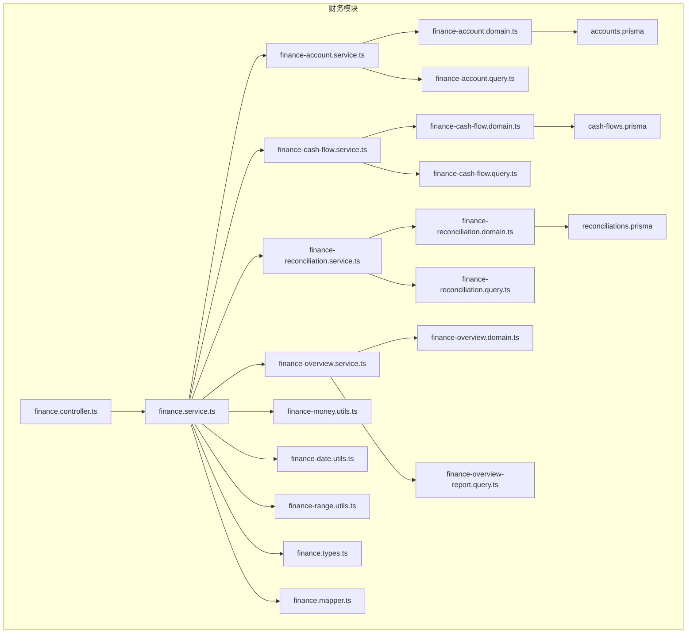
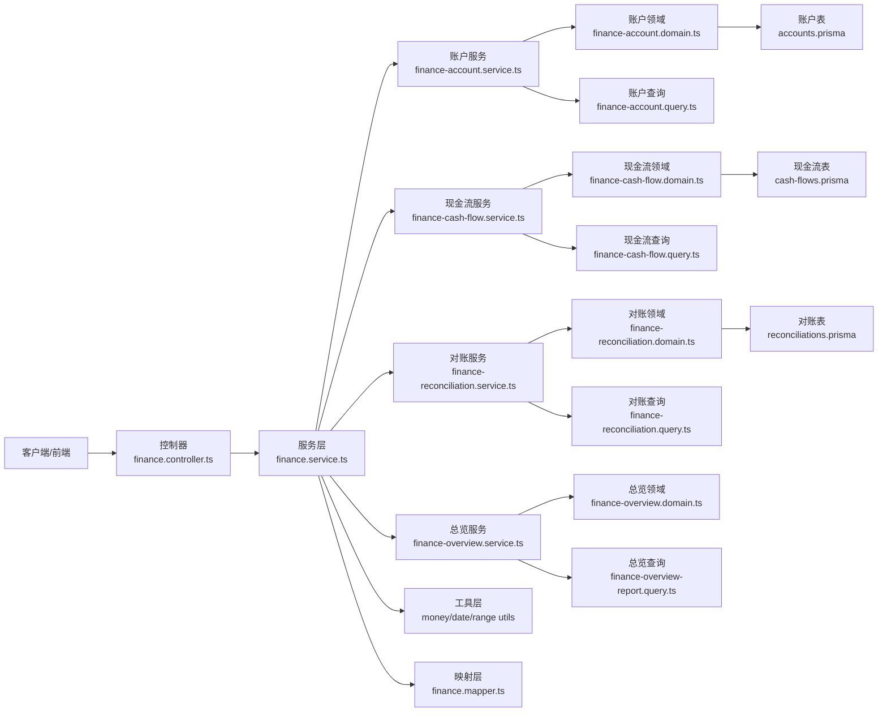
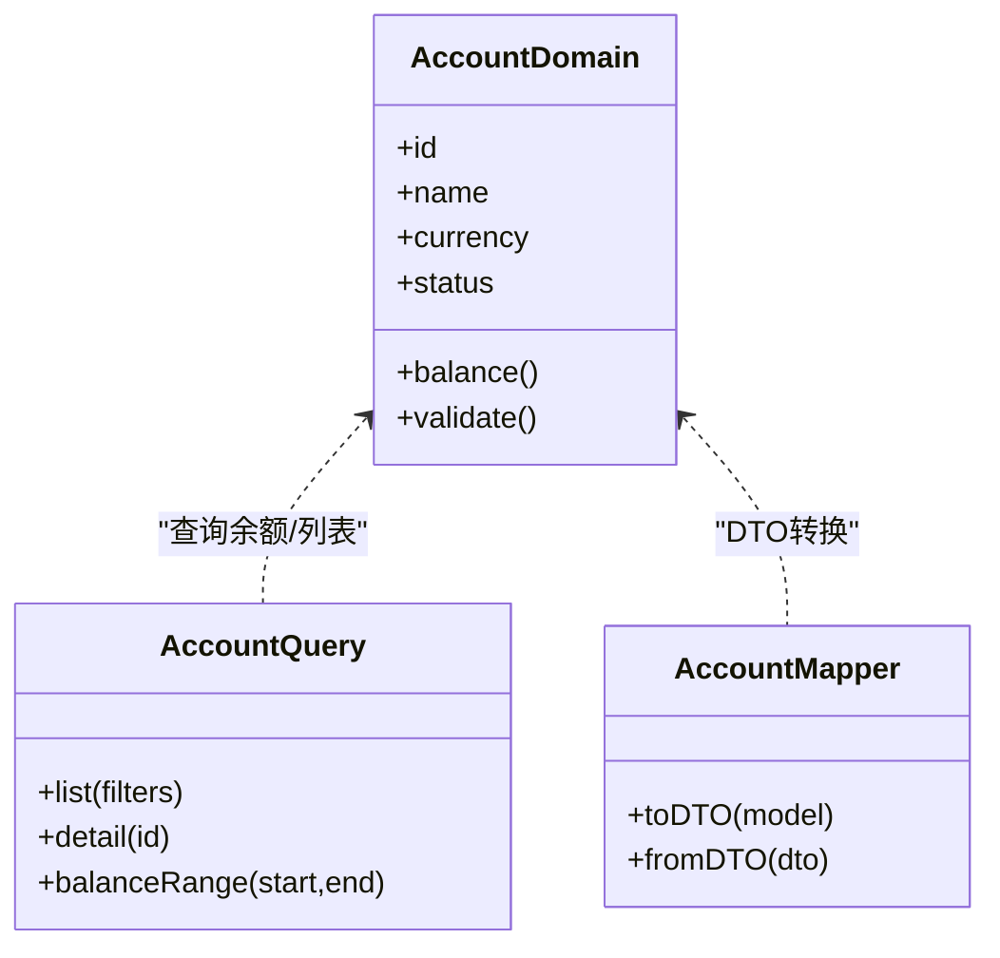
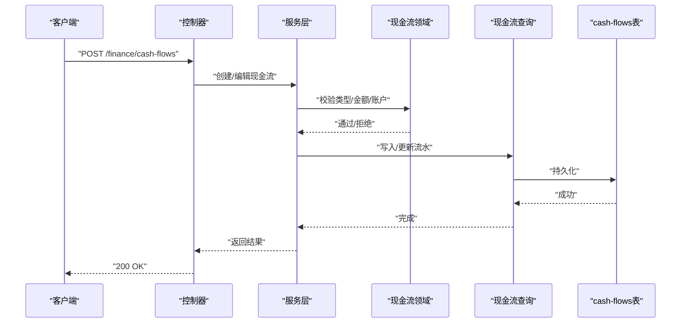
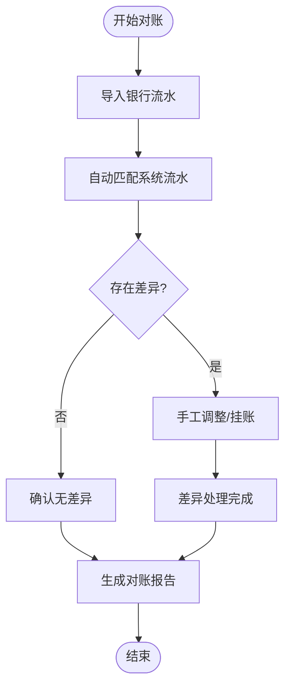
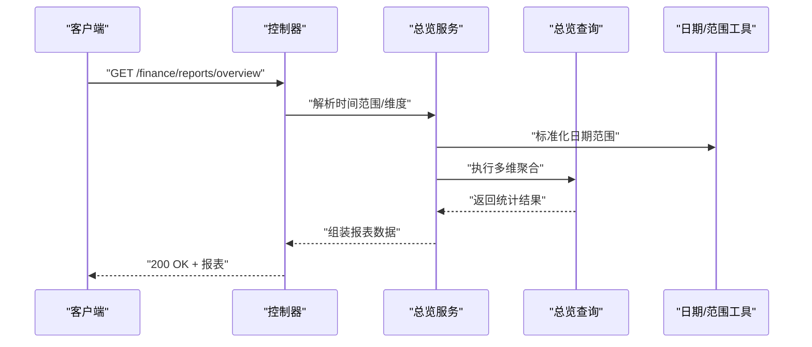
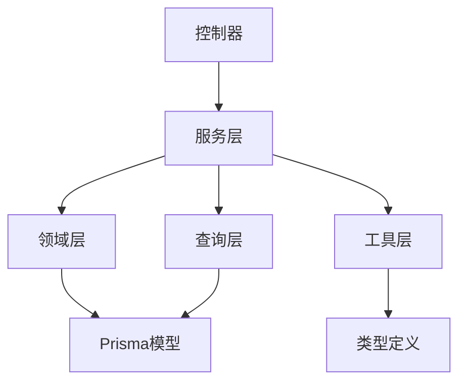

# 财务管理模块

<cite>
**本文引用的文件**
- [finance.controller.ts](file://src/purely-profit/finance/finance.controller.ts)
- [finance.service.ts](file://src/purely-profit/finance/finance.service.ts)
- [finance-account.service.ts](file://src/purely-profit/finance/finance-account.service.ts)
- [finance-cash-flow.service.ts](file://src/purely-profit/finance/finance-cash-flow.service.ts)
- [finance-reconciliation.service.ts](file://src/purely-profit/finance/finance-reconciliation.service.ts)
- [finance-overview.service.ts](file://src/purely-profit/finance/finance-overview.service.ts)
- [finance-account.domain.ts](file://src/purely-profit/finance/finance-account.domain.ts)
- [finance-cash-flow.domain.ts](file://src/purely-profit/finance/finance-cash-flow.domain.ts)
- [finance-reconciliation.domain.ts](file://src/purely-profit/finance/finance-reconciliation.domain.ts)
- [finance-overview.domain.ts](file://src/purely-profit/finance/finance-overview.domain.ts)
- [finance-account.query.ts](file://src/purely-profit/finance/finance-account.query.ts)
- [finance-cash-flow.query.ts](file://src/purely-profit/finance/finance-cash-flow.query.ts)
- [finance-reconciliation.query.ts](file://src/purely-profit/finance/finance-reconciliation.query.ts)
- [finance-overview-report.query.ts](file://src/purely-profit/finance/finance-overview-report.query.ts)
- [finance-money.utils.ts](file://src/purely-profit/finance/finance-money.utils.ts)
- [finance-date.utils.ts](file://src/purely-profit/finance/finance-date.utils.ts)
- [finance-range.utils.ts](file://src/purely-profit/finance/finance-range.utils.ts)
- [finance.constants.ts](file://src/purely-profit/finance/finance.constants.ts)
- [finance.types.ts](file://src/purely-profit/finance/finance.types.ts)
- [finance.mapper.ts](file://src/purely-profit/finance/finance.mapper.ts)
- [accounts.prisma](file://prisma/purely-profit/finance/accounts.prisma)
- [cash-flows.prisma](file://prisma/purely-profit/finance/cash-flows.prisma)
- [reconciliations.prisma](file://prisma/purely-profit/finance/reconciliations.prisma)
- [schema.prisma](file://prisma/schema.prisma)
- [finance.module.ts](file://src/purely-profit/finance/finance.module.ts)
- [finance-access.service.ts](file://src/purely-profit/finance/finance-access.service.ts)
- [finance.controller.spec.ts](file://src/purely-profit/finance/finance.controller.spec.ts)
- [finance.service.spec.ts](file://src/purely-profit/finance/finance.service.spec.ts)
- [finance.e2e-spec.ts](file://test/finance.e2e-spec.ts)
</cite>

## 目录
1. [简介](#简介)
2. [项目结构](#项目结构)
3. [核心组件](#核心组件)
4. [架构总览](#架构总览)
5. [详细组件分析](#详细组件分析)
6. [依赖关系分析](#依赖关系分析)
7. [性能考虑](#性能考虑)
8. [故障排除指南](#故障排除指南)
9. [结论](#结论)
10. [附录](#附录)

## 简介
本文件系统化梳理财务管理模块的设计与实现，覆盖账户管理、现金流管理、财务对账、财务报表、凭证管理、预算控制与风险监控等核心能力，并说明与银行、税务系统的集成思路。文档以代码为依据，结合数据模型、接口定义与业务流程图，帮助开发者与产品人员快速理解并高效使用该模块。

## 项目结构
财务管理模块采用按功能分层的组织方式：控制器负责对外接口与参数校验；服务层封装业务逻辑；领域层承载核心实体与规则；查询层负责复杂筛选与聚合；映射层统一DTO与数据库模型转换；Prisma 定义财务相关数据表结构。

图表来源
- [finance.controller.ts:1-200](file://src/purely-profit/finance/finance.controller.ts#L1-L200)
- [finance.service.ts:1-300](file://src/purely-profit/finance/finance.service.ts#L1-L300)
- [finance-account.service.ts:1-200](file://src/purely-profit/finance/finance-account.service.ts#L1-L200)
- [finance-cash-flow.service.ts:1-200](file://src/purely-profit/finance/finance-cash-flow.service.ts#L1-L200)
- [finance-reconciliation.service.ts:1-200](file://src/purely-profit/finance/finance-reconciliation.service.ts#L1-L200)
- [finance-overview.service.ts:1-200](file://src/purely-profit/finance/finance-overview.service.ts#L1-L200)
- [finance-account.domain.ts:1-200](file://src/purely-profit/finance/finance-account.domain.ts#L1-L200)
- [finance-cash-flow.domain.ts:1-200](file://src/purely-profit/finance/finance-cash-flow.domain.ts#L1-L200)
- [finance-reconciliation.domain.ts:1-200](file://src/purely-profit/finance/finance-reconciliation.domain.ts#L1-L200)
- [finance-overview.domain.ts:1-200](file://src/purely-profit/finance/finance-overview.domain.ts#L1-L200)
- [finance-account.query.ts:1-200](file://src/purely-profit/finance/finance-account.query.ts#L1-L200)
- [finance-cash-flow.query.ts:1-200](file://src/purely-profit/finance/finance-cash-flow.query.ts#L1-L200)
- [finance-reconciliation.query.ts:1-200](file://src/purely-profit/finance/finance-reconciliation.query.ts#L1-L200)
- [finance-overview-report.query.ts:1-200](file://src/purely-profit/finance/finance-overview-report.query.ts#L1-L200)
- [finance-money.utils.ts:1-100](file://src/purely-profit/finance/finance-money.utils.ts#L1-L100)
- [finance-date.utils.ts:1-100](file://src/purely-profit/finance/finance-date.utils.ts#L1-L100)
- [finance-range.utils.ts:1-100](file://src/purely-profit/finance/finance-range.utils.ts#L1-L100)
- [finance.types.ts:1-200](file://src/purely-profit/finance/finance.types.ts#L1-L200)
- [finance.mapper.ts:1-200](file://src/purely-profit/finance/finance.mapper.ts#L1-L200)
- [accounts.prisma:1-200](file://prisma/purely-profit/finance/accounts.prisma#L1-L200)
- [cash-flows.prisma:1-200](file://prisma/purely-profit/finance/cash-flows.prisma#L1-L200)
- [reconciliations.prisma:1-200](file://prisma/purely-profit/finance/reconciliations.prisma#L1-L200)

章节来源
- [finance.module.ts:1-100](file://src/purely-profit/finance/finance.module.ts#L1-L100)
- [schema.prisma:1-200](file://prisma/schema.prisma#L1-L200)

## 核心组件
- 控制器层：统一暴露财务相关HTTP接口，负责请求参数解析、权限校验与响应包装。
- 服务层：编排业务流程，协调领域对象与查询对象，处理金额、日期与范围等通用逻辑。
- 领域层：账户、现金流、对账、总览等核心实体与规则，封装不变量与业务约束。
- 查询层：复杂筛选、分页、聚合与时间范围查询的封装，降低控制器与服务层负担。
- 工具层：金额计算、日期处理、范围工具，确保一致性与可维护性。
- 映射层：DTO与数据库模型之间的转换，保证接口契约稳定。
- 数据模型：账户、现金流、对账单三类核心表，支撑余额计算、流水追踪与对账闭环。

章节来源
- [finance.controller.ts:1-200](file://src/purely-profit/finance/finance.controller.ts#L1-L200)
- [finance.service.ts:1-300](file://src/purely-profit/finance/finance.service.ts#L1-L300)
- [finance-account.domain.ts:1-200](file://src/purely-profit/finance/finance-account.domain.ts#L1-L200)
- [finance-cash-flow.domain.ts:1-200](file://src/purely-profit/finance/finance-cash-flow.domain.ts#L1-L200)
- [finance-reconciliation.domain.ts:1-200](file://src/purely-profit/finance/finance-reconciliation.domain.ts#L1-L200)
- [finance-overview.domain.ts:1-200](file://src/purely-profit/finance/finance-overview.domain.ts#L1-L200)
- [finance-account.query.ts:1-200](file://src/purely-profit/finance/finance-account.query.ts#L1-L200)
- [finance-cash-flow.query.ts:1-200](file://src/purely-profit/finance/finance-cash-flow.query.ts#L1-L200)
- [finance-reconciliation.query.ts:1-200](file://src/purely-profit/finance/finance-reconciliation.query.ts#L1-L200)
- [finance-money.utils.ts:1-100](file://src/purely-profit/finance/finance-money.utils.ts#L1-L100)
- [finance-date.utils.ts:1-100](file://src/purely-profit/finance/finance-date.utils.ts#L1-L100)
- [finance-range.utils.ts:1-100](file://src/purely-profit/finance/finance-range.utils.ts#L1-L100)
- [finance.mapper.ts:1-200](file://src/purely-profit/finance/finance.mapper.ts#L1-L200)
- [accounts.prisma:1-200](file://prisma/purely-profit/finance/accounts.prisma#L1-L200)
- [cash-flows.prisma:1-200](file://prisma/purely-profit/finance/cash-flows.prisma#L1-L200)
- [reconciliations.prisma:1-200](file://prisma/purely-profit/finance/reconciliations.prisma#L1-L200)

## 架构总览
财务模块遵循“控制器-服务-领域-查询”的分层架构，通过工具与映射层解耦业务与基础设施，数据持久化由Prisma驱动。模块内聚度高、职责清晰，便于扩展与测试。

图表来源
- [finance.controller.ts:1-200](file://src/purely-profit/finance/finance.controller.ts#L1-L200)
- [finance.service.ts:1-300](file://src/purely-profit/finance/finance.service.ts#L1-L300)
- [finance-account.service.ts:1-200](file://src/purely-profit/finance/finance-account.service.ts#L1-L200)
- [finance-cash-flow.service.ts:1-200](file://src/purely-profit/finance/finance-cash-flow.service.ts#L1-L200)
- [finance-reconciliation.service.ts:1-200](file://src/purely-profit/finance/finance-reconciliation.service.ts#L1-L200)
- [finance-overview.service.ts:1-200](file://src/purely-profit/finance/finance-overview.service.ts#L1-L200)
- [finance-account.domain.ts:1-200](file://src/purely-profit/finance/finance-account.domain.ts#L1-L200)
- [finance-cash-flow.domain.ts:1-200](file://src/purely-profit/finance/finance-cash-flow.domain.ts#L1-L200)
- [finance-reconciliation.domain.ts:1-200](file://src/purely-profit/finance/finance-reconciliation.domain.ts#L1-L200)
- [finance-overview.domain.ts:1-200](file://src/purely-profit/finance/finance-overview.domain.ts#L1-L200)
- [finance-account.query.ts:1-200](file://src/purely-profit/finance/finance-account.query.ts#L1-L200)
- [finance-cash-flow.query.ts:1-200](file://src/purely-profit/finance/finance-cash-flow.query.ts#L1-L200)
- [finance-reconciliation.query.ts:1-200](file://src/purely-profit/finance/finance-reconciliation.query.ts#L1-L200)
- [finance-overview-report.query.ts:1-200](file://src/purely-profit/finance/finance-overview-report.query.ts#L1-L200)
- [finance-money.utils.ts:1-100](file://src/purely-profit/finance/finance-money.utils.ts#L1-L100)
- [finance-date.utils.ts:1-100](file://src/purely-profit/finance/finance-date.utils.ts#L1-L100)
- [finance-range.utils.ts:1-100](file://src/purely-profit/finance/finance-range.utils.ts#L1-L100)
- [finance.mapper.ts:1-200](file://src/purely-profit/finance/finance.mapper.ts#L1-L200)
- [accounts.prisma:1-200](file://prisma/purely-profit/finance/accounts.prisma#L1-L200)
- [cash-flows.prisma:1-200](file://prisma/purely-profit/finance/cash-flows.prisma#L1-L200)
- [reconciliations.prisma:1-200](file://prisma/purely-profit/finance/reconciliations.prisma#L1-L200)

## 详细组件分析

### 账户管理
- 功能要点
  - 账户开立、信息维护与状态变更
  - 账户余额计算：基于已入账现金流汇总，支持时间范围与币种维度
  - 支持多账户并行管理，账户间隔离
- 关键实现
  - 领域对象封装账户不变量与余额计算规则
  - 查询层提供账户列表、详情与余额聚合查询
  - 映射层统一账户DTO与数据库模型
- 业务场景
  - 新增银行账户后自动纳入余额统计
  - 调整账户启用/停用状态不影响历史数据
- 复杂度与性能
  - 余额计算为O(n)扫描现金流，建议按月或按日建立汇总缓存

图表来源
- [finance-account.domain.ts:1-200](file://src/purely-profit/finance/finance-account.domain.ts#L1-L200)
- [finance-account.query.ts:1-200](file://src/purely-profit/finance/finance-account.query.ts#L1-L200)
- [finance.mapper.ts:1-200](file://src/purely-profit/finance/finance.mapper.ts#L1-L200)

章节来源
- [finance-account.service.ts:1-200](file://src/purely-profit/finance/finance-account.service.ts#L1-L200)
- [finance-account.domain.ts:1-200](file://src/purely-profit/finance/finance-account.domain.ts#L1-L200)
- [finance-account.query.ts:1-200](file://src/purely-profit/finance/finance-account.query.ts#L1-L200)
- [accounts.prisma:1-200](file://prisma/purely-profit/finance/accounts.prisma#L1-L200)

### 现金流管理
- 功能要点
  - 收入/支出流水登记、调整与冲销
  - 流水分类与摘要归档，支持按账户、科目、时间范围检索
  - 实时余额更新与对账前准备
- 关键实现
  - 领域对象封装流水类型、方向与金额校验
  - 查询层支持分页、过滤与聚合统计
  - 工具层提供金额精度与货币单位处理
- 业务场景
  - 销售收款、采购付款、费用报销等场景自动记账
  - 月末批量核对时可按账户导出现金流明细

图表来源
- [finance.controller.ts:1-200](file://src/purely-profit/finance/finance.controller.ts#L1-L200)
- [finance.service.ts:1-300](file://src/purely-profit/finance/finance.service.ts#L1-L300)
- [finance-cash-flow.domain.ts:1-200](file://src/purely-profit/finance/finance-cash-flow.domain.ts#L1-L200)
- [finance-cash-flow.query.ts:1-200](file://src/purely-profit/finance/finance-cash-flow.query.ts#L1-L200)
- [cash-flows.prisma:1-200](file://prisma/purely-profit/finance/cash-flows.prisma#L1-L200)

章节来源
- [finance-cash-flow.service.ts:1-200](file://src/purely-profit/finance/finance-cash-flow.service.ts#L1-L200)
- [finance-cash-flow.domain.ts:1-200](file://src/purely-profit/finance/finance-cash-flow.domain.ts#L1-L200)
- [finance-cash-flow.query.ts:1-200](file://src/purely-profit/finance/finance-cash-flow.query.ts#L1-L200)
- [finance-money.utils.ts:1-100](file://src/purely-profit/finance/finance-money.utils.ts#L1-L100)
- [cash-flows.prisma:1-200](file://prisma/purely-profit/finance/cash-flows.prisma#L1-L200)

### 财务对账
- 功能要点
  - 自动/手动对账：比对系统流水与银行流水差异
  - 对账差异处理：调平、挂账、备注与后续处理
  - 对账报告：生成对账汇总与明细
- 关键实现
  - 领域对象封装对账单、差异项与处理状态
  - 查询层提供对账范围、差异统计与处理记录
  - 与银行系统对接：通过标准化接口或文件导入（见集成说明）
- 业务场景
  - 每月银行对账单导入后自动匹配系统流水
  - 手工对账时标记差异并生成处理任务

图表来源
- [finance-reconciliation.domain.ts:1-200](file://src/purely-profit/finance/finance-reconciliation.domain.ts#L1-L200)
- [finance-reconciliation.query.ts:1-200](file://src/purely-profit/finance/finance-reconciliation.query.ts#L1-L200)
- [reconciliations.prisma:1-200](file://prisma/purely-profit/finance/reconciliations.prisma#L1-L200)

章节来源
- [finance-reconciliation.service.ts:1-200](file://src/purely-profit/finance/finance-reconciliation.service.ts#L1-L200)
- [finance-reconciliation.domain.ts:1-200](file://src/purely-profit/finance/finance-reconciliation.domain.ts#L1-L200)
- [finance-reconciliation.query.ts:1-200](file://src/purely-profit/finance/finance-reconciliation.query.ts#L1-L200)
- [reconciliations.prisma:1-200](file://prisma/purely-profit/finance/reconciliations.prisma#L1-L200)

### 财务报表与总览
- 功能要点
  - 收支总览：按时间维度统计收入/支出/净流入
  - 科目汇总：按科目/部门/项目维度拆分
  - 报表导出：Excel/PDF格式，支持自定义时间范围
- 关键实现
  - 领域对象封装报表维度与计算口径
  - 查询层提供多维聚合与排序
  - 工具层提供日期范围与货币处理
- 业务场景
  - 月度经营分析会前生成收支趋势与科目分布
  - 年度决算时导出全量报表归档

图表来源
- [finance.controller.ts:1-200](file://src/purely-profit/finance/finance.controller.ts#L1-L200)
- [finance-overview.service.ts:1-200](file://src/purely-profit/finance/finance-overview.service.ts#L1-L200)
- [finance-overview-report.query.ts:1-200](file://src/purely-profit/finance/finance-overview-report.query.ts#L1-L200)
- [finance-date.utils.ts:1-100](file://src/purely-profit/finance/finance-date.utils.ts#L1-L100)
- [finance-range.utils.ts:1-100](file://src/purely-profit/finance/finance-range.utils.ts#L1-L100)

章节来源
- [finance-overview.service.ts:1-200](file://src/purely-profit/finance/finance-overview.service.ts#L1-L200)
- [finance-overview.domain.ts:1-200](file://src/purely-profit/finance/finance-overview.domain.ts#L1-L200)
- [finance-overview-report.query.ts:1-200](file://src/purely-profit/finance/finance-overview-report.query.ts#L1-L200)
- [finance-date.utils.ts:1-100](file://src/purely-profit/finance/finance-date.utils.ts#L1-L100)
- [finance-range.utils.ts:1-100](file://src/purely-profit/finance/finance-range.utils.ts#L1-L100)

### 凭证管理、预算控制与风险监控
- 凭证管理
  - 将现金流与会计科目绑定，形成可审计的会计凭证
  - 支持凭证模板、批量生成与导出
- 预算控制
  - 基于科目/部门/项目的预算额度与实际花费对比
  - 超预算预警与审批流程接入
- 风险监控
  - 异常交易识别：大额、频繁、跨账户异常转账
  - 风险指标阈值配置与告警推送

章节来源
- [finance-cash-flow.domain.ts:1-200](file://src/purely-profit/finance/finance-cash-flow.domain.ts#L1-L200)
- [finance-account.domain.ts:1-200](file://src/purely-profit/finance/finance-account.domain.ts#L1-L200)
- [finance.constants.ts:1-200](file://src/purely-profit/finance/finance.constants.ts#L1-L200)

### 数据模型与字段说明
- 账户表(accounts)
  - 字段：标识、名称、币种、状态、创建/更新时间
  - 用途：支撑余额计算与资金归集
- 现金流表(cash-flows)
  - 字段：流水号、账户、科目、类型(收入/支出)、金额、摘要、发生时间、状态
  - 用途：流水登记、余额汇总、报表统计
- 对账表(reconciliations)
  - 字段：对账期、账户、系统笔数/金额、银行笔数/金额、差异笔数/金额、状态、处理记录
  - 用途：对账闭环与差异追踪

章节来源
- [accounts.prisma:1-200](file://prisma/purely-profit/finance/accounts.prisma#L1-L200)
- [cash-flows.prisma:1-200](file://prisma/purely-profit/finance/cash-flows.prisma#L1-L200)
- [reconciliations.prisma:1-200](file://prisma/purely-profit/finance/reconciliations.prisma#L1-L200)
- [schema.prisma:1-200](file://prisma/schema.prisma#L1-L200)

### 财务API接口概览
- 账户管理
  - GET /finance/accounts：账户列表与余额
  - GET /finance/accounts/:id：账户详情
  - POST /finance/accounts：新建账户
  - PUT /finance/accounts/:id：更新账户
- 现金流管理
  - GET /finance/cash-flows：现金流列表与汇总
  - GET /finance/cash-flows/:id：现金流详情
  - POST /finance/cash-flows：新增现金流
  - PUT /finance/cash-flows/:id：修改现金流
  - DELETE /finance/cash-flows/:id：删除现金流
- 对账管理
  - POST /finance/reconciliations/import：导入银行流水
  - POST /finance/reconciliations/match：自动匹配
  - POST /finance/reconciliations/process：处理差异
  - GET /finance/reconciliations/report：对账报告
- 报表总览
  - GET /finance/reports/overview：收支总览
  - GET /finance/reports/subjects：科目汇总
  - GET /finance/reports/export：报表导出

章节来源
- [finance.controller.ts:1-200](file://src/purely-profit/finance/finance.controller.ts#L1-L200)
- [finance.types.ts:1-200](file://src/purely-profit/finance/finance.types.ts#L1-L200)

### 财务数据导入导出与税务处理
- 导入导出
  - 银行流水导入：支持CSV/Excel，字段映射与清洗
  - 报表导出：Excel/PDF，可自定义时间范围与维度
- 税务处理
  - 生成税表基础数据（如应税收入、可抵扣成本）
  - 与税务系统对接：标准接口或文件协议，支持定时同步与人工对账

章节来源
- [finance-reconciliation.query.ts:1-200](file://src/purely-profit/finance/finance-reconciliation.query.ts#L1-L200)
- [finance-overview-report.query.ts:1-200](file://src/purely-profit/finance/finance-overview-report.query.ts#L1-L200)

### 与银行、税务系统的集成
- 银行系统
  - 文件导入：定期下载银行流水并解析入库
  - 接口对接：标准化REST接口拉取流水（需另行开发适配器）
- 税务系统
  - 数据抽取：从财务报表中提取税务口径数据
  - 报送接口：按税务要求格式化并上报（需另行开发适配器）

章节来源
- [finance-reconciliation.service.ts:1-200](file://src/purely-profit/finance/finance-reconciliation.service.ts#L1-L200)
- [finance-reconciliation.domain.ts:1-200](file://src/purely-profit/finance/finance-reconciliation.domain.ts#L1-L200)

## 依赖关系分析
- 组件耦合
  - 控制器仅依赖服务层接口，低耦合高内聚
  - 服务层依赖领域与查询，避免直接访问数据库
  - 领域层不依赖外部框架，便于单元测试
- 外部依赖
  - Prisma作为ORM，负责数据持久化
  - 工具层提供金额与日期处理，减少重复逻辑
- 循环依赖
  - 未发现循环依赖，分层清晰

图表来源
- [finance.controller.ts:1-200](file://src/purely-profit/finance/finance.controller.ts#L1-L200)
- [finance.service.ts:1-300](file://src/purely-profit/finance/finance.service.ts#L1-L300)
- [finance.types.ts:1-200](file://src/purely-profit/finance/finance.types.ts#L1-L200)
- [schema.prisma:1-200](file://prisma/schema.prisma#L1-L200)

章节来源
- [finance.service.ts:1-300](file://src/purely-profit/finance/finance.service.ts#L1-L300)
- [finance.types.ts:1-200](file://src/purely-profit/finance/finance.types.ts#L1-L200)

## 性能考虑
- 查询优化
  - 为账户、现金流、对账表建立必要索引，提升范围查询与聚合性能
  - 分页查询默认限制最大页大小，防止超大数据集返回
- 计算优化
  - 余额与报表聚合尽量在数据库侧完成，减少应用层内存压力
  - 金额计算使用定点运算，避免浮点误差
- 缓存策略
  - 对高频报表与账户余额设置短期缓存，降低重复计算
- 并发控制
  - 对账与余额更新采用乐观锁或事务，保证一致性

## 故障排除指南
- 常见问题
  - 余额不一致：检查是否存在未过账/作废流水，核对对账状态
  - 导入失败：检查银行文件格式与字段映射，确认编码与分隔符
  - 报表为空：确认时间范围是否正确，检查过滤条件
- 排查步骤
  - 查看服务层日志与错误码
  - 使用查询层提供的调试接口验证中间结果
  - 单元测试与端到端测试辅助定位问题

章节来源
- [finance.service.spec.ts:1-200](file://src/purely-profit/finance/finance.service.spec.ts#L1-L200)
- [finance.controller.spec.ts:1-200](file://src/purely-profit/finance/finance.controller.spec.ts#L1-L200)
- [finance.e2e-spec.ts:1-200](file://test/finance.e2e-spec.ts#L1-L200)

## 结论
财务管理模块以清晰的分层设计与完善的领域模型为基础，覆盖账户、现金流、对账、报表等核心能力，并预留凭证、预算、风控与税务对接空间。通过查询层与工具层的抽象，模块具备良好的可扩展性与可维护性，适合在多租户与多币种场景下演进。

## 附录
- 权限与访问控制
  - 通过访问控制服务限制敏感操作与报表查看范围
- 开发规范
  - DTO命名与字段对齐Prisma模型，保持一致性
  - 所有金额字段统一使用最小货币单位（分/分为单位），避免小数点误差

章节来源
- [finance-access.service.ts:1-200](file://src/purely-profit/finance/finance-access.service.ts#L1-L200)