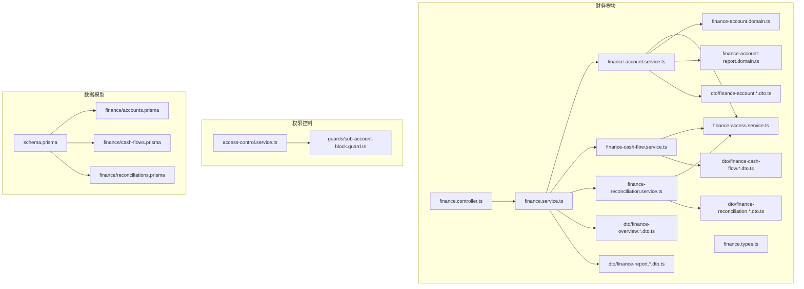
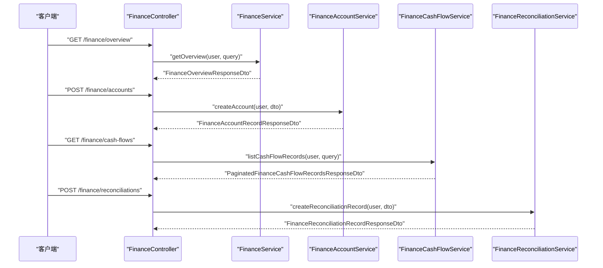
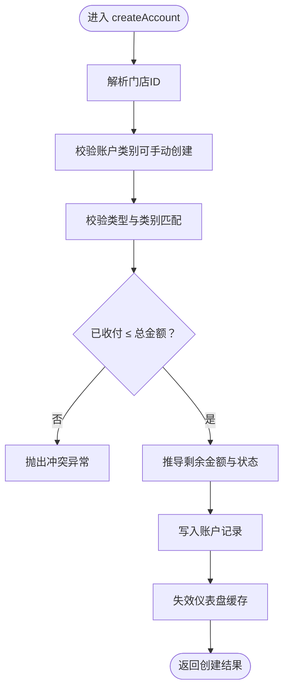
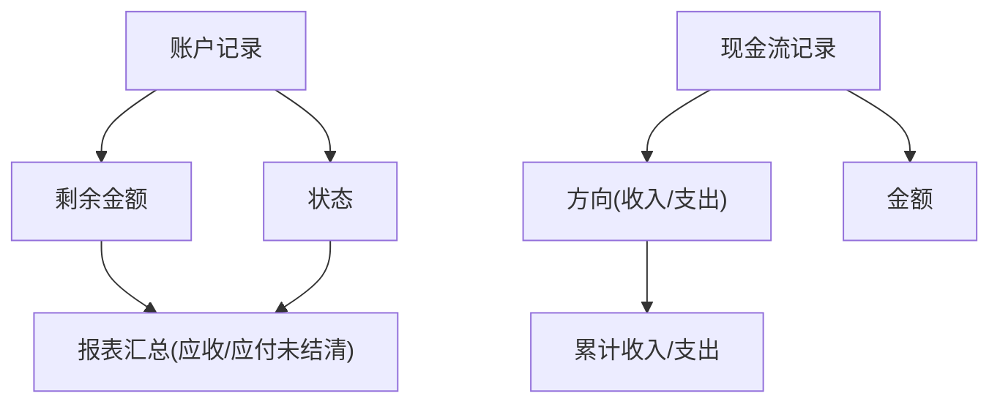
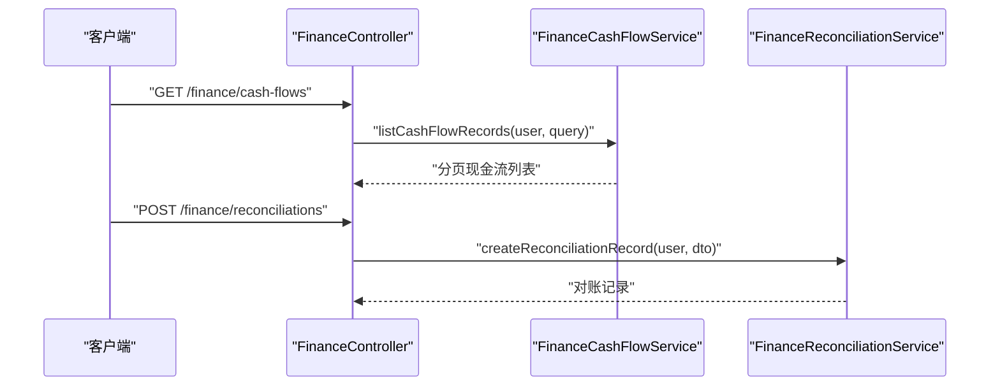
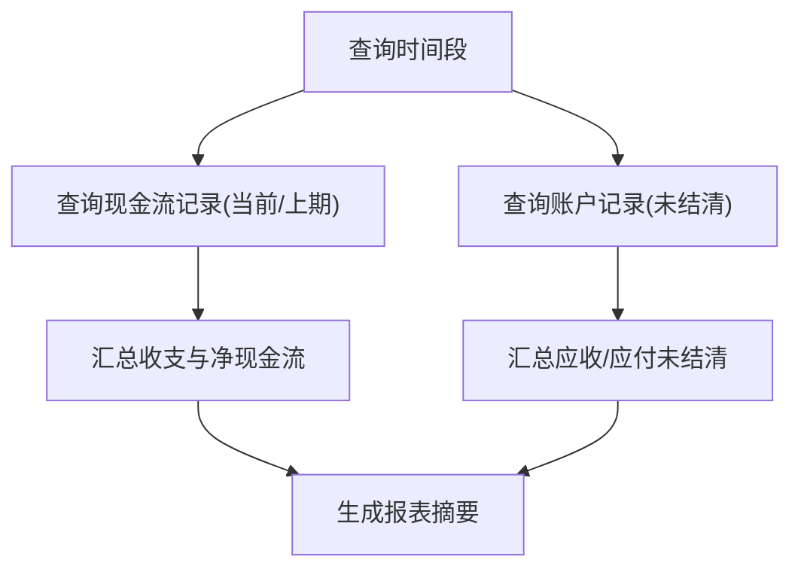
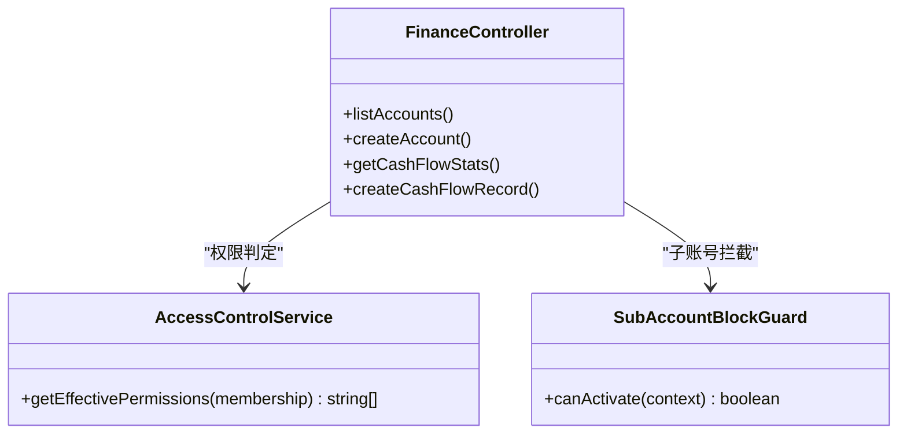
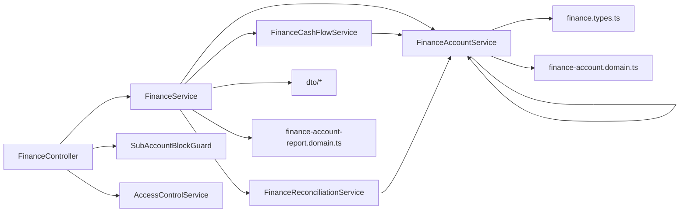

# 账户管理

<cite>
**本文引用的文件**
- [src/purely-profit/finance/finance.controller.ts](file://src/purely-profit/finance/finance.controller.ts)
- [src/purely-profit/finance/finance.service.ts](file://src/purely-profit/finance/finance.service.ts)
- [src/purely-profit/finance/finance-account.service.ts](file://src/purely-profit/finance/finance-account.service.ts)
- [src/purely-profit/finance/finance-account.domain.ts](file://src/purely-profit/finance/finance-account.domain.ts)
- [src/purely-profit/finance/finance-account-report.domain.ts](file://src/purely-profit/finance/finance-account-report.domain.ts)
- [src/purely-profit/finance/finance-cash-flow.service.ts](file://src/purely-profit/finance/finance-cash-flow.service.ts)
- [src/purely-profit/finance/finance-reconciliation.service.ts](file://src/purely-profit/finance/finance-reconciliation.service.ts)
- [src/purely-profit/finance/finance.types.ts](file://src/purely-profit/finance/finance.types.ts)
- [src/purely-profit/finance/dto/finance-account.response.dto.ts](file://src/purely-profit/finance/dto/finance-account.response.dto.ts)
- [src/purely-profit/finance/dto/finance-account.query.dto.ts](file://src/purely-profit/finance/dto/finance-account.query.dto.ts)
- [src/purely-profit/finance/dto/finance-cash-flow.response.dto.ts](file://src/purely-profit/finance/dto/finance-cash-flow.response.dto.ts)
- [src/purely-profit/finance/dto/finance-reconciliation.response.dto.ts](file://src/purely-profit/finance/dto/finance-reconciliation.response.dto.ts)
- [src/purely-profit/finance/dto/finance-report.response.dto.ts](file://src/purely-profit/finance/dto/finance-report.response.dto.ts)
- [src/purely-profit/finance/dto/finance-overview.response.dto.ts](file://src/purely-profit/finance/dto/finance-overview.response.dto.ts)
- [src/purely-profit/finance/finance-access.service.ts](file://src/purely-profit/finance/finance-access.service.ts)
- [src/purely-profit/access-control/access-control.service.ts](file://src/purely-profit/access-control/access-control.service.ts)
- [src/purely-profit/access-control/guards/sub-account-block.guard.ts](file://src/purely-profit/access-control/guards/sub-account-block.guard.ts)
- [prisma/schema.prisma](file://prisma/schema.prisma)
- [prisma/purely-profit/finance/accounts.prisma](file://prisma/purely-profit/finance/accounts.prisma)
- [prisma/purely-profit/finance/cash-flows.prisma](file://prisma/purely-profit/finance/cash-flows.prisma)
- [prisma/purely-profit/finance/reconciliations.prisma](file://prisma/purely-profit/finance/reconciliations.prisma)
</cite>

## 目录
1. [简介](#简介)
2. [项目结构](#项目结构)
3. [核心组件](#核心组件)
4. [架构总览](#架构总览)
5. [详细组件分析](#详细组件分析)
6. [依赖分析](#依赖分析)
7. [性能考虑](#性能考虑)
8. [故障排查指南](#故障排查指南)
9. [结论](#结论)
10. [附录](#附录)

## 简介
本文件系统化梳理账户管理功能，覆盖银行账户、现金账户、收入账户等各类账户的创建、修改、注销、查询、余额计算、分类、权限控制、对账与统计报表等完整业务闭环。文档以代码为依据，结合数据模型与服务层流程，提供面向开发与运营的可执行参考。

## 项目结构
账户管理位于“purely-profit”子域下的“finance”模块，采用分层设计：控制器（Controller）负责HTTP接口编排，服务（Service）封装业务逻辑，领域函数（Domain）处理数据转换与统计，Prisma定义数据模型，访问控制模块保障权限与子账号限制。

图表来源
- [src/purely-profit/finance/finance.controller.ts:1-200](file://src/purely-profit/finance/finance.controller.ts#L1-L200)
- [src/purely-profit/finance/finance.service.ts:1-200](file://src/purely-profit/finance/finance.service.ts#L1-L200)
- [src/purely-profit/finance/finance-account.service.ts:1-200](file://src/purely-profit/finance/finance-account.service.ts#L1-L200)
- [src/purely-profit/finance/finance-account-report.domain.ts:1-200](file://src/purely-profit/finance/finance-account-report.domain.ts#L1-L200)
- [src/purely-profit/finance/finance.types.ts:1-200](file://src/purely-profit/finance/finance.types.ts#L1-L200)
- [src/purely-profit/access-control/access-control.service.ts:1-200](file://src/purely-profit/access-control/access-control.service.ts#L1-L200)
- [prisma/schema.prisma:1-200](file://prisma/schema.prisma#L1-L200)

章节来源
- [src/purely-profit/finance/finance.controller.ts:1-200](file://src/purely-profit/finance/finance.controller.ts#L1-L200)
- [src/purely-profit/finance/finance.service.ts:1-200](file://src/purely-profit/finance/finance.service.ts#L1-L200)
- [prisma/schema.prisma:1-200](file://prisma/schema.prisma#L1-L200)

## 核心组件
- 财务服务聚合器：统一对外暴露概览、报表、现金流、账户、对账等能力。
- 账户服务：负责账户列表、统计、创建、更新、删除及缓存失效。
- 现金流服务：负责现金流记录的查询、统计与创建。
- 对账服务：负责对账记录的查询、统计与创建。
- 报表领域：负责账户类报表汇总与行级明细构建。
- 访问控制：基于角色与子账号状态进行权限校验与拦截。
- 数据模型：账户、现金流、对账在Prisma中建模，支持跨表关联与索引。

章节来源
- [src/purely-profit/finance/finance.service.ts:41-120](file://src/purely-profit/finance/finance.service.ts#L41-L120)
- [src/purely-profit/finance/finance-account.service.ts:46-185](file://src/purely-profit/finance/finance-account.service.ts#L46-L185)
- [src/purely-profit/finance/finance-account-report.domain.ts:47-141](file://src/purely-profit/finance/finance-account-report.domain.ts#L47-L141)
- [src/purely-profit/finance/finance-access.service.ts:1-200](file://src/purely-profit/finance/finance-access.service.ts#L1-L200)
- [src/purely-profit/access-control/access-control.service.ts:62-120](file://src/purely-profit/access-control/access-control.service.ts#L62-L120)

## 架构总览
账户管理遵循“控制器-服务-领域-数据模型”的分层架构，控制器负责参数解析与响应封装，服务层协调各子域并注入权限校验，领域函数专注数据转换与统计，Prisma提供持久化与查询能力。

图表来源
- [src/purely-profit/finance/finance.controller.ts:1-200](file://src/purely-profit/finance/finance.controller.ts#L1-L200)
- [src/purely-profit/finance/finance.service.ts:50-120](file://src/purely-profit/finance/finance.service.ts#L50-L120)
- [src/purely-profit/finance/finance-account.service.ts:89-185](file://src/purely-profit/finance/finance-account.service.ts#L89-L185)
- [src/purely-profit/finance/finance-cash-flow.service.ts:1-200](file://src/purely-profit/finance/finance-cash-flow.service.ts#L1-L200)
- [src/purely-profit/finance/finance-reconciliation.service.ts:1-200](file://src/purely-profit/finance/finance-reconciliation.service.ts#L1-L200)

## 详细组件分析

### 账户服务与API
- 列表与统计
  - 支持按类型、状态、关键词过滤，分页返回账户集合与总数。
  - 提供账户维度的统计视图（如应收/应付未结清金额）。
- 创建
  - 校验账户类别与类型的匹配性，校验已收付金额不超过总金额。
  - 自动推导剩余金额与状态，写入数据库并触发仪表盘缓存失效。
- 更新
  - 基于记录ID更新账户信息，完成后同样失效缓存。
- 删除
  - 校验记录存在性后删除，并失效缓存。
- 权限与作用域
  - 通过财务域访问服务解析当前门店ID，确保操作限定在当前门店范围内。
  - 结合子账号守卫与权限服务，限制不同角色的账户操作能力。

图表来源
- [src/purely-profit/finance/finance-account.service.ts:89-125](file://src/purely-profit/finance/finance-account.service.ts#L89-L125)
- [src/purely-profit/finance/finance-access.service.ts:1-200](file://src/purely-profit/finance/finance-access.service.ts#L1-L200)

章节来源
- [src/purely-profit/finance/finance-account.service.ts:54-185](file://src/purely-profit/finance/finance-account.service.ts#L54-L185)
- [src/purely-profit/finance/finance-account.domain.ts:1-200](file://src/purely-profit/finance/finance-account.domain.ts#L1-L200)
- [src/purely-profit/finance/dto/finance-account.response.dto.ts:1-200](file://src/purely-profit/finance/dto/finance-account.response.dto.ts#L1-L200)
- [src/purely-profit/finance/dto/finance-account.query.dto.ts:1-200](file://src/purely-profit/finance/dto/finance-account.query.dto.ts#L1-L200)

### 账户余额计算与状态机
- 余额计算
  - 账户记录包含“总金额/已收付/剩余/到期日/日期/状态”，余额由“剩余金额”直接体现。
  - 报表领域函数对当前期与上期现金流进行收支累加，得出净现金流与同比变化。
- 状态变更
  - 状态由推导逻辑生成，典型状态包括“未结清/部分结清/已结清”等；报表会忽略“已结清”状态的账户。
- 关联关系
  - 账户与现金流记录通过外键关联，对账记录用于核对账户与实际流水一致性。

图表来源
- [src/purely-profit/finance/finance-account-report.domain.ts:47-141](file://src/purely-profit/finance/finance-account-report.domain.ts#L47-L141)
- [src/purely-profit/finance/finance-account.domain.ts:1-200](file://src/purely-profit/finance/finance-account.domain.ts#L1-L200)

章节来源
- [src/purely-profit/finance/finance-account-report.domain.ts:47-141](file://src/purely-profit/finance/finance-account-report.domain.ts#L47-L141)
- [src/purely-profit/finance/finance-account.domain.ts:1-200](file://src/purely-profit/finance/finance-account.domain.ts#L1-L200)

### 现金流与对账
- 现金流
  - 支持分页查询、统计汇总（如收入/支出计数与金额），并可创建新的现金流记录。
- 对账
  - 支持对账记录的创建与查询，用于核对账户与实际流水差异，形成对账差异与调整建议。

图表来源
- [src/purely-profit/finance/finance.controller.ts:1-200](file://src/purely-profit/finance/finance.controller.ts#L1-L200)
- [src/purely-profit/finance/finance-cash-flow.service.ts:1-200](file://src/purely-profit/finance/finance-cash-flow.service.ts#L1-L200)
- [src/purely-profit/finance/finance-reconciliation.service.ts:1-200](file://src/purely-profit/finance/finance-reconciliation.service.ts#L1-L200)

章节来源
- [src/purely-profit/finance/finance-cash-flow.service.ts:1-200](file://src/purely-profit/finance/finance-cash-flow.service.ts#L1-L200)
- [src/purely-profit/finance/finance-reconciliation.service.ts:1-200](file://src/purely-profit/finance/finance-reconciliation.service.ts#L1-L200)
- [src/purely-profit/finance/dto/finance-cash-flow.response.dto.ts:1-200](file://src/purely-profit/finance/dto/finance-cash-flow.response.dto.ts#L1-L200)
- [src/purely-profit/finance/dto/finance-reconciliation.response.dto.ts:1-200](file://src/purely-profit/finance/dto/finance-reconciliation.response.dto.ts#L1-L200)

### 报表与统计
- 概览与报表
  - 财务概览提供时间范围内的关键指标；报表提供账户维度的汇总与明细。
- 报表字段
  - 汇总包含：总收入、总支出、净现金流、记录条数、应收/应付未结清总额、环比变动百分比。
  - 明细包含：账户类型、对手方、总金额、剩余金额、状态、日期标签等。

图表来源
- [src/purely-profit/finance/finance.service.ts:57-120](file://src/purely-profit/finance/finance.service.ts#L57-L120)
- [src/purely-profit/finance/finance-account-report.domain.ts:47-141](file://src/purely-profit/finance/finance-account-report.domain.ts#L47-L141)
- [src/purely-profit/finance/dto/finance-report.response.dto.ts:1-200](file://src/purely-profit/finance/dto/finance-report.response.dto.ts#L1-L200)

章节来源
- [src/purely-profit/finance/finance.service.ts:57-120](file://src/purely-profit/finance/finance.service.ts#L57-L120)
- [src/purely-profit/finance/finance-account-report.domain.ts:47-141](file://src/purely-profit/finance/finance-account-report.domain.ts#L47-L141)

### 权限控制与子账号限制
- 角色权限
  - 不同子账号角色具备不同的财务相关权限集合，例如“出纳”“财务”“店长”等。
- 子账号拦截
  - 通过守卫在请求进入控制器前判断是否允许访问财务域或特定接口。
- 组合策略
  - 控制器与服务层均依赖访问控制服务进行权限判定，确保跨模块一致。

图表来源
- [src/purely-profit/access-control/access-control.service.ts:62-120](file://src/purely-profit/access-control/access-control.service.ts#L62-L120)
- [src/purely-profit/access-control/guards/sub-account-block.guard.ts:1-200](file://src/purely-profit/access-control/guards/sub-account-block.guard.ts#L1-L200)
- [src/purely-profit/finance/finance.controller.ts:1-200](file://src/purely-profit/finance/finance.controller.ts#L1-L200)

章节来源
- [src/purely-profit/access-control/access-control.service.ts:62-120](file://src/purely-profit/access-control/access-control.service.ts#L62-L120)
- [src/purely-profit/access-control/guards/sub-account-block.guard.ts:1-200](file://src/purely-profit/access-control/guards/sub-account-block.guard.ts#L1-L200)
- [src/purely-profit/finance/finance.controller.ts:1-200](file://src/purely-profit/finance/finance.controller.ts#L1-L200)

## 依赖分析
- 控制器依赖服务聚合器，服务聚合器再依赖具体子域服务。
- 账户/现金流/对账服务均依赖财务访问服务解析门店上下文。
- 报表领域函数依赖账户与现金流数据，不直接依赖控制器。
- 权限控制模块独立于业务逻辑，通过守卫与服务注入实现横切关注点。

图表来源
- [src/purely-profit/finance/finance.controller.ts:1-200](file://src/purely-profit/finance/finance.controller.ts#L1-L200)
- [src/purely-profit/finance/finance.service.ts:1-200](file://src/purely-profit/finance/finance.service.ts#L1-L200)
- [src/purely-profit/finance/finance-account.service.ts:1-200](file://src/purely-profit/finance/finance-account.service.ts#L1-L200)
- [src/purely-profit/finance/finance-account-report.domain.ts:1-200](file://src/purely-profit/finance/finance-account-report.domain.ts#L1-L200)
- [src/purely-profit/finance/finance.types.ts:1-200](file://src/purely-profit/finance/finance.types.ts#L1-L200)
- [src/purely-profit/access-control/access-control.service.ts:1-200](file://src/purely-profit/access-control/access-control.service.ts#L1-L200)
- [src/purely-profit/access-control/guards/sub-account-block.guard.ts:1-200](file://src/purely-profit/access-control/guards/sub-account-block.guard.ts#L1-L200)

章节来源
- [src/purely-profit/finance/finance.service.ts:41-120](file://src/purely-profit/finance/finance.service.ts#L41-L120)
- [src/purely-profit/finance/finance-account.service.ts:46-185](file://src/purely-profit/finance/finance-account.service.ts#L46-L185)

## 性能考虑
- 分页与筛选
  - 列表查询支持分页与多维筛选，避免一次性加载全量数据。
- 缓存失效
  - 账户增删改后主动失效仪表盘相关缓存，保证数据一致性与性能平衡。
- 查询优化
  - 报表统计涉及多表聚合，建议在Prisma层使用索引与预聚合字段，减少复杂计算成本。
- 并发控制
  - 对同一账户的并发修改需结合数据库事务与锁机制，避免余额与状态错乱。

## 故障排查指南
- 参数校验失败
  - 已收付金额不得大于总金额；账户类型与类别必须匹配；关键词搜索需去除多余空白。
- 权限不足
  - 子账号角色权限受限，无法访问财务或特定接口；检查守卫与权限映射配置。
- 记录不存在
  - 更新/删除前先确认记录存在；若不存在则抛出“未找到”异常。
- 缓存未刷新
  - 账户变更后需等待缓存失效；若仍显示旧数据，检查缓存失效调用链。

章节来源
- [src/purely-profit/finance/finance-account.service.ts:99-125](file://src/purely-profit/finance/finance-account.service.ts#L99-L125)
- [src/purely-profit/finance/finance-account.service.ts:163-178](file://src/purely-profit/finance/finance-account.service.ts#L163-L178)
- [src/purely-profit/access-control/guards/sub-account-block.guard.ts:1-200](file://src/purely-profit/access-control/guards/sub-account-block.guard.ts#L1-L200)

## 结论
账户管理模块以清晰的分层与严格的权限控制为基础，围绕账户生命周期（创建/更新/删除/查询）、余额与状态计算、报表与对账等核心能力，提供了可扩展、可维护的财务账户管理体系。通过Prisma数据模型与服务层协作，能够稳定支撑业务增长与合规要求。

## 附录

### 数据模型与字段说明
- 账户表
  - 字段要点：类型、类别、对手方、总金额、已收付、剩余、到期日、日期、状态、备注、门店ID、操作员ID。
- 现金流表
  - 字段要点：方向（收入/支出）、金额、账户ID、时间、摘要、门店ID。
- 对账表
  - 字段要点：对账周期、差异金额、调整项、核对人、核对时间、备注、门店ID。

章节来源
- [prisma/purely-profit/finance/accounts.prisma:1-200](file://prisma/purely-profit/finance/accounts.prisma#L1-L200)
- [prisma/purely-profit/finance/cash-flows.prisma:1-200](file://prisma/purely-profit/finance/cash-flows.prisma#L1-L200)
- [prisma/purely-profit/finance/reconciliations.prisma:1-200](file://prisma/purely-profit/finance/reconciliations.prisma#L1-L200)
- [prisma/schema.prisma:1-200](file://prisma/schema.prisma#L1-L200)

### API示例与调用路径
- 获取财务概览
  - 路径：GET /finance/overview
  - 请求体：参见概览查询DTO
  - 返回体：概览响应DTO
  - 实现路径：[src/purely-profit/finance/finance.controller.ts:1-200](file://src/purely-profit/finance/finance.controller.ts#L1-L200)，[src/purely-profit/finance/finance.service.ts:50-62](file://src/purely-profit/finance/finance.service.ts#L50-L62)
- 列出账户
  - 路径：GET /finance/accounts
  - 请求体：账户查询DTO（类型/状态/关键词/分页）
  - 返回体：账户分页响应DTO
  - 实现路径：[src/purely-profit/finance/finance-account.service.ts:54-78](file://src/purely-profit/finance/finance-account.service.ts#L54-L78)
- 创建账户
  - 路径：POST /finance/accounts
  - 请求体：创建账户DTO（类型/类别/对手方/金额/已收付/到期日/日期/备注）
  - 返回体：账户记录响应DTO
  - 实现路径：[src/purely-profit/finance/finance-account.service.ts:89-125](file://src/purely-profit/finance/finance-account.service.ts#L89-L125)
- 更新账户
  - 路径：PUT /finance/accounts/:id
  - 请求体：更新账户DTO
  - 返回体：账户记录响应DTO
  - 实现路径：[src/purely-profit/finance/finance-account.service.ts:131-161](file://src/purely-profit/finance/finance-account.service.ts#L131-L161)
- 删除账户
  - 路径：DELETE /finance/accounts/:id
  - 返回体：空
  - 实现路径：[src/purely-profit/finance/finance-account.service.ts:163-178](file://src/purely-profit/finance/finance-account.service.ts#L163-L178)
- 获取账户统计
  - 路径：GET /finance/accounts/stats
  - 返回体：账户统计DTO
  - 实现路径：[src/purely-profit/finance/finance-account.service.ts:80-87](file://src/purely-profit/finance/finance-account.service.ts#L80-L87)
- 列出现金流
  - 路径：GET /finance/cash-flows
  - 返回体：现金流分页响应DTO
  - 实现路径：[src/purely-profit/finance/finance.service.ts:64-69](file://src/purely-profit/finance/finance.service.ts#L64-L69)，[src/purely-profit/finance/finance-cash-flow.service.ts:1-200](file://src/purely-profit/finance/finance-cash-flow.service.ts#L1-L200)
- 获取现金流统计
  - 路径：GET /finance/cash-flows/stats
  - 返回体：现金流统计DTO
  - 实现路径：[src/purely-profit/finance/finance.service.ts:71-76](file://src/purely-profit/finance/finance.service.ts#L71-L76)，[src/purely-profit/finance/finance-cash-flow.service.ts:1-200](file://src/purely-profit/finance/finance-cash-flow.service.ts#L1-L200)
- 创建现金流
  - 路径：POST /finance/cash-flows
  - 返回体：现金流记录响应DTO
  - 实现路径：[src/purely-profit/finance/finance.service.ts:78-83](file://src/purely-profit/finance/finance.service.ts#L78-L83)，[src/purely-profit/finance/finance-cash-flow.service.ts:1-200](file://src/purely-profit/finance/finance-cash-flow.service.ts#L1-L200)
- 获取报表
  - 路径：GET /finance/report
  - 返回体：报表响应DTO（摘要+明细）
  - 实现路径：[src/purely-profit/finance/finance.service.ts:57-62](file://src/purely-profit/finance/finance.service.ts#L57-L62)，[src/purely-profit/finance/finance-account-report.domain.ts:47-141](file://src/purely-profit/finance/finance-account-report.domain.ts#L47-L141)