# 交接班管理

<cite>
**本文档引用的文件**
- [handover.controller.ts](file://src/purely-profit/operations/handover/handover.controller.ts)
- [handover.service.ts](file://src/purely-profit/operations/handover/handover.service.ts)
- [handover-page.service.ts](file://src/purely-profit/operations/handover/handover-page.service.ts)
- [handover-confirm.service.ts](file://src/purely-profit/operations/handover/handover-confirm.service.ts)
- [handover-confirm-shift.service.ts](file://src/purely-profit/operations/handover/handover-confirm-shift.service.ts)
- [handover-confirm-shift-fallback.service.ts](file://src/purely-profit/operations/handover/handover-confirm-shift-fallback.service.ts)
- [handover-records.service.ts](file://src/purely-profit/operations/handover/handover-records.service.ts)
- [handover-records-query.service.ts](file://src/purely-profit/operations/handover/handover-records-query.service.ts)
- [handover-records-revenue.service.ts](file://src/purely-profit/operations/handover/handover-records-revenue.service.ts)
- [handover-order-item.mapper.ts](file://src/purely-profit/operations/handover/handover-order-item.mapper.ts)
- [handover-page-order-items.ts](file://src/purely-profit/operations/handover/handover-page-order-items.ts)
- [handover-page-payment.ts](file://src/purely-profit/operations/handover/handover-page-payment.ts)
- [handover-additional-items.service.ts](file://src/purely-profit/operations/handover/handover-additional-items.service.ts)
- [handover-module.ts](file://src/purely-profit/operations/handover/handover.module.ts)
- [handover-access.ts](file://src/purely-profit/operations/handover/handover.access.ts)
- [handover.constants.ts](file://src/purely-profit/operations/handover/handover.constants.ts)
- [handover.types.ts](file://src/purely-profit/operations/handover/handover.types.ts)
- [handover-shared.dto.ts](file://src/purely-profit/operations/handover/dto/handover-shared.dto.ts)
- [handover.dto.ts](file://src/purely-profit/operations/handover/dto/handover.dto.ts)
- [handover-records.dto.ts](file://src/purely-profit/operations/handover/dto/handover-records.dto.ts)
- [handover-page.dto.ts](file://src/purely-profit/operations/handover/dto/handover-page.dto.ts)
- [handover-additional-items.dto.ts](file://src/purely-profit/operations/handover/dto/handover-additional-items.dto.ts)
- [access-control.constants.ts](file://src/purely-profit/access-control/access-control.constants.ts)
- [subject-capability.service.ts](file://src/purely-profit/access-control/subject-capability.service.ts)
- [store-sub-account.service.ts](file://src/purely-profit/member/platform-membership/store-sub-account.service.ts)
- [platform-membership-access.service.ts](file://src/purely-profit/member/platform-membership/platform-membership-access.service.ts)
- [store-accounts.prisma](file://prisma/purely-profit/store-accounts.prisma)
- [handover.prisma](file://prisma/purely-profit/operations/handover.prisma)
- [employee-shift-definitions.prisma](file://prisma/migrations/20260601170000_add_employee_shift_definitions/)
- [handover-record-shift-snapshots.prisma](file://prisma/migrations/20260605183000_add_handover_record_shift_snapshots/)
- [handover-additional-items.prisma](file://prisma/migrations/20260601120000_add_handover_additional_items/)
- [finance-account.prisma](file://prisma/purely-profit/finance/accounts.prisma)
- [finance-cash-flows.prisma](file://prisma/purely-profit/finance/cash-flows.prisma)
- [staff-employees.prisma](file://prisma/purely-profit/staff/employees.prisma)
- [handover-page-query.builders.ts](file://src/purely-profit/operations/handover/handover-page-query.builders.ts)
- [handover-page-shift-info.ts](file://src/purely-profit/operations/handover/handover-page-shift-info.ts)
- [handover-record-batch-preloader.service.ts](file://src/purely-profit/operations/handover/handover-record-batch-preloader.service.ts)
- [handover-record-operator-profile.service.ts](file://src/purely-profit/operations/handover/handover-record-operator-profile.service.ts)
- [handover-shift-handover-status.service.ts](file://src/purely-profit/operations/handover/handover-shift-handover-status.service.ts)
- [handover-page-shift-selector.service.ts](file://src/purely-profit/operations/handover/handover-page-shift-selector.service.ts)
- [handover-page-shift-view.service.ts](file://src/purely-profit/operations/handover/handover-page-shift-view.service.ts)
- [handover-page-shift.service.ts](file://src/purely-profit/operations/handover/handover-page-shift.service.ts)
- [access-control.service.ts](file://src/purely-profit/access-control/access-control.service.ts)
- [store-sub-account-slot.service.ts](file://src/purely-profit/member/platform-membership/store-sub-account-slot.service.ts)
- [store-sub-account-read.service.ts](file://src/purely-profit/member/platform-membership/store-sub-account-read.service.ts)
- [handover.mapper.ts](file://src/purely-profit/operations/handover/handover.mapper.ts)
- [handover.shared.ts](file://src/purely-profit/operations/handover/handover.shared.ts)
- [space-session-payload.shared.ts](file://src/purely-profit/operations/spaces/space-session-payload.shared.ts)
- [handover-page-payment.spec.ts](file://src/purely-profit/operations/handover/handover-page-payment.spec.ts)
- [space-session.constants.ts](file://src/purely-profit/operations/spaces/dto/space-session.constants.ts)
- [handover.utils.ts](file://src/purely-profit/operations/handover/handover.utils.ts)
- [handover-confirm-shift.service.spec.ts](file://src/purely-profit/operations/handover/handover-confirm-shift.service.spec.ts)
- [migration.sql](file://prisma/migrations/20260711200000_handover_additional_item_name_snapshot/migration.sql)
</cite>

## 更新摘要
**所做更改**
- **订单项映射功能增强**：通过 handover-order-item.mapper.ts 的改进，提升了订单项目映射的准确性和支付方式的智能识别
- **收入跟踪精确度提升**：handover-records-revenue.service.ts 增强了退款计算逻辑，确保续费溢出的正确处理
- **支付方式显示优化**：支持团购券平台的智能标签显示，包括"美团团购"、"抖音团购"等平台特定标识
- **退款处理逻辑改进**：完善了空间会话退款的计算和展示，确保退款金额的准确性
- **数据完整性保护**：增强了额外物品快照系统，防止历史数据丢失

## 目录
1. [引言](#引言)
2. [项目结构](#项目结构)
3. [核心组件](#核心组件)
4. [架构总览](#架构总览)
5. [详细组件分析](#详细组件分析)
6. [依赖关系分析](#依赖关系分析)
7. [性能考量](#性能考量)
8. [故障排查指南](#故障排查指南)
9. [结论](#结论)
10. [附录](#附录)

## 引言
本文件系统性阐述交接班管理功能的设计与实现，覆盖交接班准备、交接班确认、交接班结算三大业务阶段，以及交接班记录、统计与报表、监控与分析、优化与预警、异常处理等高级能力。同时说明与员工排班、财务结算的集成机制，并提供可操作的 API 使用示例与业务场景演示。

**重大增强更新** 本次更新重点反映了交接班模块的重大改进：通过 handover-order-item.mapper.ts 和 handover-records-revenue.service.ts 的增强，显著提高了交接班报告的准确性和收入计算的精确度。新增的智能支付方式识别、完善的退款处理逻辑和增强的数据完整性保护，为交接班管理提供了更加可靠和准确的业务支持。

## 项目结构
交接班模块位于 operations/handover 子目录，经过模块化重构后采用更加清晰的职责分层组织方式：控制器负责对外接口；服务层封装业务流程；专门的页面处理模块负责数据组装和转换；DTO 定义数据契约；Prisma 模式定义数据库结构；权限控制与平台子账号能力贯穿全局。

```mermaid
graph TB
subgraph "交接班核心模块"
C["handover.controller.ts"]
S["handover.service.ts"]
M["handover.module.ts"]
ACC["handover.access.ts"]
CON["handover.constants.ts"]
T["handover.types.ts"]
end
subgraph "页面处理模块新架构"
POI["handover-page-order-items.ts<br/>订单处理"]
PP["handover-page-payment.ts<br/>支付处理"]
PQB["handover-page-query.builders.ts<br/>查询构建"]
PSI["handover-page-shift-info.ts<br/>班次信息"]
end
subgraph "支持服务新增"
BPL["handover-record-batch-preloader.service.ts<br/>批量预加载器"]
OPS["handover-record-operator-profile.service.ts<br/>操作员档案服务"]
HSS["handover-shift-handover-status.service.ts<br/>交班状态服务"]
PSS["handover-page-shift-selector.service.ts<br/>班次选择服务"]
PSV["handover-page-shift-view.service.ts<br/>班次视图服务"]
PS["handover-page-shift.service.ts<br/>页面班次服务"]
end
subgraph "传统服务层"
P["handover-page.service.ts"]
CF["handover-confirm.service.ts"]
CS["handover-confirm-shift.service.ts"]
CSF["handover-confirm-shift-fallback.service.ts<br/>班次回退服务"]
R["handover-records.service.ts"]
RQ["handover-records-query.service.ts"]
RR["handover-records-revenue.service.ts"]
AI["handover-additional-items.service.ts"]
end
subgraph "DTO层"
DTO["dto/*.ts"]
end
C --> S
S --> P
S --> CF
S --> CS
S --> CSF
S --> R
R --> RQ
R --> RR
S --> AI
S --> DTO
M --> C
M --> S
M --> P
M --> CF
M --> CS
M --> CSF
M --> R
M --> AI
S --> ACC
S --> CON
S --> T
P --> POI
P --> PP
P --> PQB
P --> PSI
P --> BPL
P --> OPS
P --> HSS
P --> PSS
P --> PSV
P --> PS
```

**图表来源**
- [handover.controller.ts](file://src/purely-profit/operations/handover/handover.controller.ts)
- [handover.service.ts](file://src/purely-profit/operations/handover/handover.service.ts)
- [handover-page.service.ts](file://src/purely-profit/operations/handover/handover-page.service.ts)
- [handover-page-order-items.ts](file://src/purely-profit/operations/handover/handover-page-order-items.ts)
- [handover-page-payment.ts](file://src/purely-profit/operations/handover/handover-page-payment.ts)
- [handover-page-query.builders.ts](file://src/purely-profit/operations/handover/handover-page-query.builders.ts)
- [handover-page-shift-info.ts](file://src/purely-profit/operations/handover/handover-page-shift-info.ts)
- [handover-record-batch-preloader.service.ts](file://src/purely-profit/operations/handover/handover-record-batch-preloader.service.ts)
- [handover-record-operator-profile.service.ts](file://src/purely-profit/operations/handover/handover-record-operator-profile.service.ts)
- [handover-shift-handover-status.service.ts](file://src/purely-profit/operations/handover/handover-shift-handover-status.service.ts)
- [handover-page-shift-selector.service.ts](file://src/purely-profit/operations/handover/handover-page-shift-selector.service.ts)
- [handover-page-shift-view.service.ts](file://src/purely-profit/operations/handover/handover-page-shift-view.service.ts)
- [handover-page-shift.service.ts](file://src/purely-profit/operations/handover/handover-page-shift.service.ts)
- [handover-confirm-shift-fallback.service.ts](file://src/purely-profit/operations/handover/handover-confirm-shift-fallback.service.ts)

## 核心组件
- **控制器层**：承接外部请求，路由到对应服务，返回标准化响应。
- **服务层**：
  - 交接班页面服务：负责交接班页面的展示与交互状态管理，现已重构为模块化架构。
  - 交接班确认服务：负责交接班确认流程的校验与落库，支持4小时宽限期逻辑。
  - **新增** 交接班班次回退服务：专门处理班次确认失败时的智能回退逻辑，确保系统稳定性。
  - 交接班记录服务：负责记录的增删改查、详情与汇总。
  - 交接班额外事项服务：负责交接班补充事项的维护，支持快照系统和外键保护。
  - 交接班记录查询与收入统计：负责历史记录检索与收入汇总，优化退款计算逻辑。
- **页面处理模块**：
  - 订单处理模块：专门处理订单项目、退款和客人应付项目的构建逻辑。
  - 支付处理模块：专注于支付方式统计、占比计算和收入汇总，支持团购券支付桶分类。
  - 查询构建模块：提供统一的数据库查询条件构建器。
  - 班次信息管理模块：负责班次信息的构建和展示。
- **支持服务**：
  - 批量预加载器：优化大量数据的预加载性能。
  - 操作员档案服务：管理操作员信息和头像显示。
  - 交班状态服务：处理交班完成状态的判断逻辑。
  - 班次选择服务：复杂的班次选择和过滤逻辑，支持宽限期匹配。
  - 班次视图服务：处理班次信息的展示逻辑。
  - 页面班次服务：协调各个班次相关服务的统一入口。
- **DTO 层**：定义请求/响应的数据结构，确保前后端契约一致，**已增强** 销售记录响应DTO。
- **权限与能力**：通过权限常量与子账号能力判定，限制可使用范围。
- **数据模型**：基于 Prisma 模式，支撑交接班记录、轮班快照、额外事项、财务账户与现金流等。

## 架构总览
交接班管理遵循"控制器-服务-数据访问"的分层架构，结合权限与平台子账号能力进行访问控制，数据持久化通过 Prisma 模式映射至数据库表。新的模块化架构进一步细化了职责分离，提升了代码的可维护性和测试性。

```mermaid
graph TB
Client["客户端/前端"] --> Ctrl["handover.controller.ts"]
Ctrl --> Svc["handover.service.ts"]
Svc --> Page["handover-page.service.ts"]
Page --> OrderItems["handover-page-order-items.ts"]
Page --> Payment["handover-page-payment.ts"]
Page --> QueryBuilders["handover-page-query.builders.ts"]
Page --> ShiftInfo["handover-page-shift-info.ts"]
Page --> BatchPreloader["handover-record-batch-preloader.service.ts"]
Page --> OperatorProfile["handover-record-operator-profile.service.ts"]
Page --> HandoverStatus["handover-shift-handover-status.service.ts"]
Page --> ShiftSelector["handover-page-shift-selector.service.ts"]
Page --> ShiftView["handover-page-shift-view.service.ts"]
Page --> ShiftService["handover-page-shift.service.ts"]
Svc --> Confirm["handover-confirm.service.ts"]
Svc --> ConfirmShift["handover-confirm-shift.service.ts"]
Svc --> ConfirmShiftFallback["handover-confirm-shift-fallback.service.ts"]
Svc --> Records["handover-records.service.ts"]
Records --> Query["handover-records-query.service.ts"]
Records --> Revenue["handover-records-revenue.service.ts"]
Svc --> Items["handover-additional-items.service.ts"]
Svc --> AccCtrl["handover.access.ts"]
Svc --> Consts["handover.constants.ts"]
Svc --> Types["handover.types.ts"]
Svc --> DB["Prisma 模式<br/>handover.prisma 等"]
```

**图表来源**
- [handover.controller.ts](file://src/purely-profit/operations/handover/handover.controller.ts)
- [handover.service.ts](file://src/purely-profit/operations/handover/handover.service.ts)
- [handover-page.service.ts](file://src/purely-profit/operations/handover/handover-page.service.ts)
- [handover-page-order-items.ts](file://src/purely-profit/operations/handover/handover-page-order-items.ts)
- [handover-page-payment.ts](file://src/purely-profit/operations/handover/handover-page-payment.ts)
- [handover-page-query.builders.ts](file://src/purely-profit/operations/handover/handover-page-query.builders.ts)
- [handover-page-shift-info.ts](file://src/purely-profit/operations/handover/handover-page-shift-info.ts)
- [handover-record-batch-preloader.service.ts](file://src/purely-profit/operations/handover/handover-record-batch-preloader.service.ts)
- [handover-record-operator-profile.service.ts](file://src/purely-profit/operations/handover/handover-record-operator-profile.service.ts)
- [handover-shift-handover-status.service.ts](file://src/purely-profit/operations/handover/handover-shift-handover-status.service.ts)
- [handover-page-shift-selector.service.ts](file://src/purely-profit/operations/handover/handover-page-shift-selector.service.ts)
- [handover-page-shift-view.service.ts](file://src/purely-profit/operations/handover/handover-page-shift-view.service.ts)
- [handover-page-shift.service.ts](file://src/purely-profit/operations/handover/handover-page-shift.service.ts)
- [handover-confirm-shift-fallback.service.ts](file://src/purely-profit/operations/handover/handover-confirm-shift-fallback.service.ts)

## 详细组件分析

### 业务流程总览（准备-确认-结算）
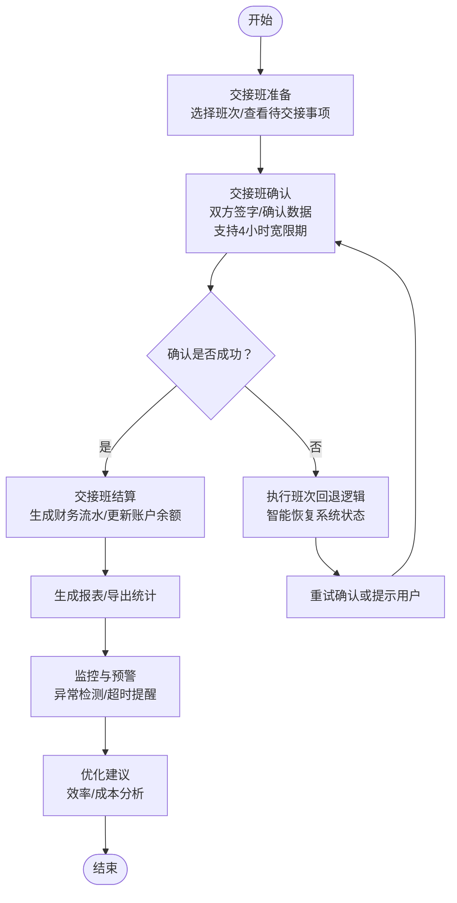

### 交接班准备（页面与班次选择）
- **页面服务重构**：经过模块化重构后，页面服务现在协调多个专门的模块来处理不同的业务逻辑。
- **班次选择服务**：新的HandoverPageShiftSelectorService负责复杂的班次选择逻辑，支持收银员、经理、老板等不同角色的权限控制。
- **班次视图服务**：HandoverPageShiftViewService处理班次信息的展示逻辑，包括操作员信息显示和接班人候选者查找。
- **批量预加载优化**：HandoverRecordBatchPreloaderService通过并行查询和内存缓存显著提升了大量数据的加载性能。

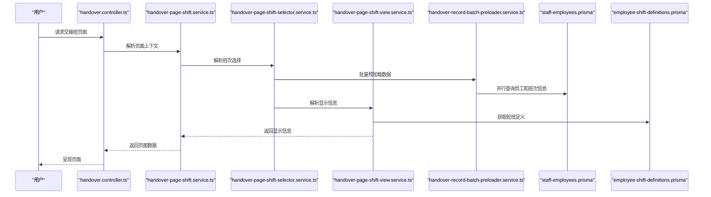

**章节来源**
- [handover-page-shift.service.ts](file://src/purely-profit/operations/handover/handover-page-shift.service.ts)
- [handover-page-shift-selector.service.ts](file://src/purely-profit/operations/handover/handover-page-shift-selector.service.ts)
- [handover-page-shift-view.service.ts](file://src/purely-profit/operations/handover/handover-page-shift-view.service.ts)
- [handover-record-batch-preloader.service.ts](file://src/purely-profit/operations/handover/handover-record-batch-preloader.service.ts)
- [handover-page.dto.ts](file://src/purely-profit/operations/handover/dto/handover-page.dto.ts)

### 交接班确认（双人核对与落库）
- 确认服务负责校验交接数据完整性、金额一致性与班次状态。
- 支持班次切换确认与单日多班次确认。
- 落库时生成交接班记录与轮班快照，保证审计可追溯。
- 支持4小时宽限期逻辑，允许在班次结束后4小时内仍可引用该班次进行交班确认。

#### 新增：交接班班次回退处理服务详解
**新增** 详细介绍新增的交接班班次回退处理服务，这是本次更新的核心特性之一：

##### 回退机制设计
- **核心目的**：当交接班确认失败时，提供智能的回退机制，确保系统状态的一致性
- **回退策略**：根据失败原因自动选择合适的回退方案
- **状态恢复**：确保数据库和内存状态的一致性和完整性

##### 技术实现细节
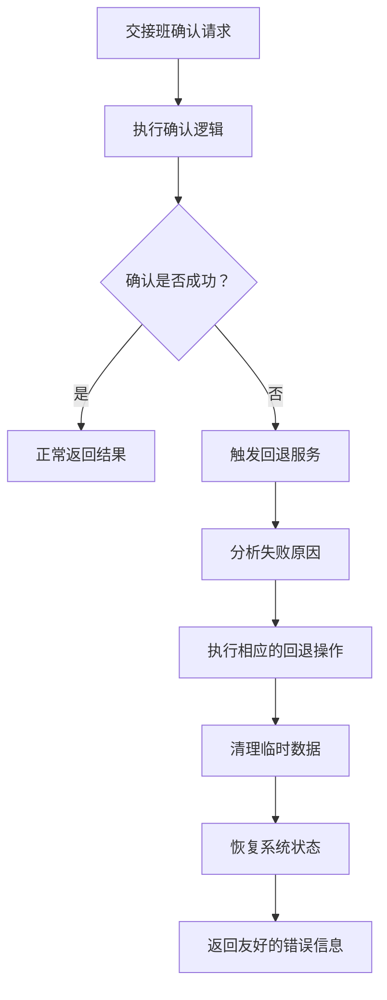

**图表来源**
- [handover-confirm-shift-fallback.service.ts](file://src/purely-profit/operations/handover/handover-confirm-shift-fallback.service.ts)

##### 回退场景处理
- **事务回滚**：数据库事务失败时的自动回滚处理
- **状态清理**：清理部分写入的临时数据和中间状态
- **资源释放**：释放占用的系统资源和锁
- **错误恢复**：提供详细的错误信息和恢复建议

**章节来源**
- [handover-confirm-shift-fallback.service.ts](file://src/purely-profit/operations/handover/handover-confirm-shift-fallback.service.ts)
- [handover-confirm-shift.service.ts](file://src/purely-profit/operations/handover/handover-confirm-shift.service.ts)

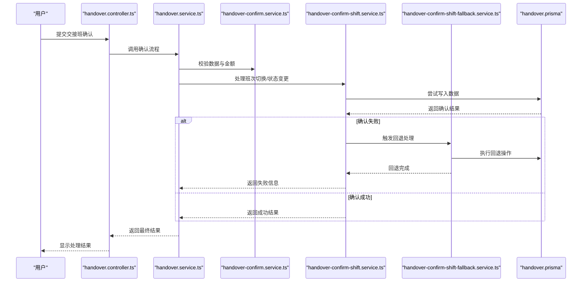

**图表来源**
- [handover.controller.ts](file://src/purely-profit/operations/handover/handover.controller.ts)
- [handover.service.ts](file://src/purely-profit/operations/handover/handover.service.ts)
- [handover-confirm.service.ts](file://src/purely-profit/operations/handover/handover-confirm.service.ts)
- [handover-confirm-shift.service.ts](file://src/purely-profit/operations/handover/handover-confirm-shift.service.ts)
- [handover-confirm-shift-fallback.service.ts](file://src/purely-profit/operations/handover/handover-confirm-shift-fallback.service.ts)
- [handover.prisma](file://prisma/purely-profit/operations/handover.prisma)

**章节来源**
- [handover.service.ts](file://src/purely-profit/operations/handover/handover.service.ts)
- [handover-confirm.service.ts](file://src/purely-profit/operations/handover/handover-confirm.service.ts)
- [handover-confirm-shift.service.ts](file://src/purely-profit/operations/handover/handover-confirm-shift.service.ts)
- [handover-confirm-shift-fallback.service.ts](file://src/purely-profit/operations/handover/handover-confirm-shift-fallback.service.ts)

### 交接班结算（财务对接）
- 结算环节将交接班收入与支出归集到财务账户，生成现金流记录。
- 对接财务账户与现金流表，确保账实相符。
- 支持按日/班次维度生成结算摘要，便于对账与报表。
- 优化空间会话营收计算逻辑，确保退款和续费溢出的正确处理。

#### 退款计算逻辑优化
- **综合计算规则**：退款金额 = (prepaidAmount + renewTotal) - consumption
- **消费金额**：consumption = timeCost + itemsCost
- **边界处理**：仅当 prepaidAmount > 0 且 refundAmount > 0 时计入退款

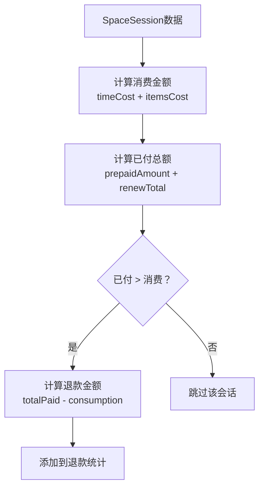

**章节来源**
- [handover-records-revenue.service.ts](file://src/purely-profit/operations/handover/handover-records-revenue.service.ts)
- [finance-account.prisma](file://prisma/purely-profit/finance/accounts.prisma)
- [finance-cash-flows.prisma](file://prisma/purely-profit/finance/cash-flows.prisma)

### 交接班记录与统计
- 记录服务提供增删改查、详情查看与批量查询。
- 查询服务支持按日期、班次、员工、门店等条件筛选。
- 统计服务汇总收入、支出、差额等关键指标，支持导出。

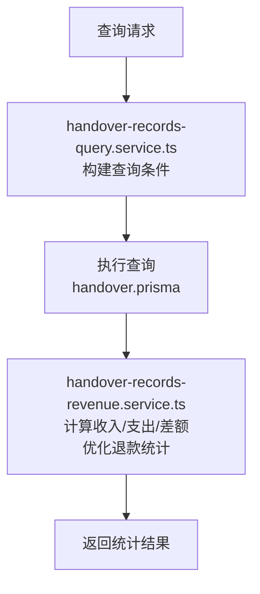

**章节来源**
- [handover-records.service.ts](file://src/purely-profit/operations/handover/handover-records.service.ts)
- [handover-records-query.service.ts](file://src/purely-profit/operations/handover/handover-records-query.service.ts)
- [handover-records-revenue.service.ts](file://src/purely-profit/operations/handover/handover-records-revenue.service.ts)

### 交接班额外事项（增强版）
- 额外事项用于记录交接中的特殊事件或待办，支持新增、编辑、删除与查询。
- 与交接班记录关联，形成完整的交接档案。
- 新增额外物品快照系统，防止定义删除后历史数据丢失。

#### 额外物品快照系统详解
- **快照字段**：item_name_snapshot 字段存储附加项名称的快照值
- **外键约束**：从 CASCADE 改为 RESTRICT，防止删除被历史数据引用的附加项定义
- **数据回填**：迁移脚本自动从现有附加项定义回填快照数据

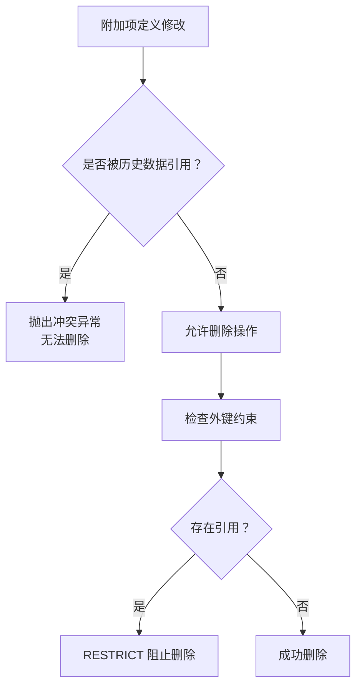

**章节来源**
- [handover-additional-items.service.ts](file://src/purely-profit/operations/handover/handover-additional-items.service.ts)
- [handover.mapper.ts](file://src/purely-profit/operations/handover/handover.mapper.ts)
- [migration.sql](file://prisma/migrations/20260711200000_handover_additional_item_name_snapshot/migration.sql)

### 错误处理增强
- **并发冲突处理**：应用层校验通过但数据库唯一约束冲突时的处理
- **重复删除保护**：并发删除场景下的幂等性保证
- **冲突异常映射**：将数据库错误码转换为友好的业务异常
- **回退机制**：新增的班次回退服务提供完善的异常恢复机制

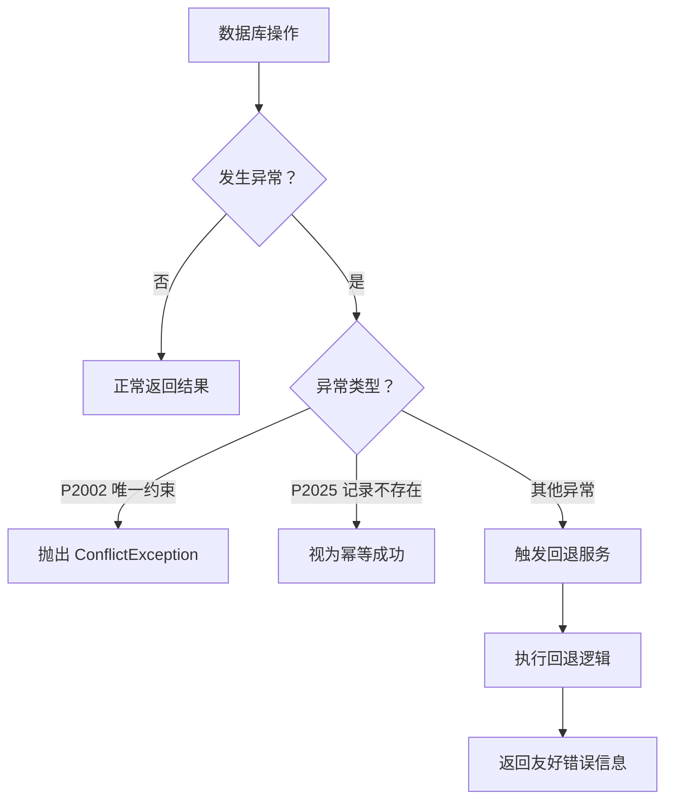

**章节来源**
- [handover-additional-items.service.ts](file://src/purely-profit/operations/handover/handover-additional-items.service.ts)
- [handover-confirm-shift-fallback.service.ts](file://src/purely-profit/operations/handover/handover-confirm-shift-fallback.service.ts)

### 权限与子账号能力
- 权限常量定义"交接班"相关权限码，用于细粒度控制。
- 主题能力服务将"交接班管理"作为模块之一，决定界面可见性与入口。
- 平台子账号服务提供"可使用交接班"的能力判定，结合门店配置与角色状态生效。

**更新** 财务子账户现在拥有完整的交接班管理权限，包括查看、创建和更新交接班记录的能力。

**章节来源**
- [access-control.constants.ts](file://src/purely-profit/access-control/access-control.constants.ts)
- [subject-capability.service.ts](file://src/purely-profit/access-control/subject-capability.service.ts)
- [store-sub-account.service.ts](file://src/purely-profit/member/platform-membership/store-sub-account.service.ts)
- [platform-membership-access.service.ts](file://src/purely-profit/member/platform-membership/platform-membership-access.service.ts)
- [access-control.service.ts](file://src/purely-profit/access-control/access-control.service.ts)

### 团购券支付映射增强
- **平台特定标签显示**：系统能够正确显示'美团团购'、'抖音团购'等平台特定标签
- **支付桶分类机制**：在开台项场景下，当顾客的支付方式为团购券时，系统会将其归入独立的"团购"支付桶
- **显示覆盖机制**：团购券交易在前端显示为具体平台标签，统一使用特定颜色标识

#### 销售记录响应DTO完善
**更新** 详细介绍销售记录响应DTO的完善功能：

##### DTO结构增强
- **完整性提升**：新增更多必要的响应字段，确保数据传输的完整性
- **兼容性保证**：保持向后兼容，不影响现有API调用
- **类型安全**：强化TypeScript类型定义，提升开发体验

##### 技术实现
- **字段扩展**：为销售记录添加更多业务相关的响应字段
- **数据验证**：增强响应数据的验证和格式化逻辑
- **性能优化**：优化DTO序列化和反序列化性能

**章节来源**
- [handover-page-payment.ts](file://src/purely-profit/operations/handover/handover-page-payment.ts)
- [handover.constants.ts](file://src/purely-profit/operations/handover/handover.constants.ts)
- [handover.mapper.ts](file://src/purely-profit/operations/handover/handover.mapper.ts)
- [handover-records.dto.ts](file://src/purely-profit/operations/handover/dto/handover-records.dto.ts)

### 退款处理逻辑改进
- **退款展示格式增强**：退款行商品名追加" · 退款"后缀，与历史退款订单保持一致
- **退款计算逻辑优化**：正确处理续费溢出的退款场景，不再忽略续费部分
- **精度保证**：使用 Money 工具类确保金额计算的精确性

#### 技术实现细节
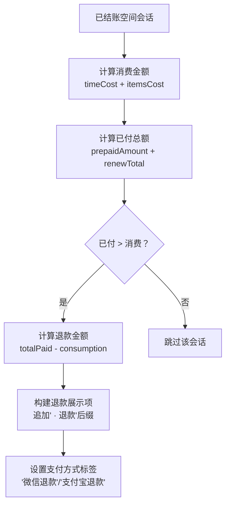

**章节来源**
- [handover-page-order-items.ts](file://src/purely-profit/operations/handover/handover-page-order-items.ts)
- [handover.mapper.ts](file://src/purely-profit/operations/handover/handover.mapper.ts)
- [handover-page-payment.ts](file://src/purely-profit/operations/handover/handover-page-payment.ts)

### 模块化重构详解
- **订单处理模块**：专门处理订单项目、退款和客人应付项目的构建逻辑
- **支付处理模块**：专注于支付方式统计、占比计算和收入汇总，支持团购券支付桶分类
- **查询构建模块**：提供统一的数据库查询条件构建器
- **班次信息管理模块**：负责班次信息的构建和展示
- **批量预加载服务**：优化大量数据的预加载性能
- **操作员档案服务**：管理操作员信息和头像显示
- **交班状态服务**：处理交班完成状态的判断逻辑
- **班次选择服务**：复杂的班次选择和过滤逻辑
- **班次视图服务**：处理班次信息的展示逻辑
- **页面班次服务**：协调各个班次相关服务的统一入口

#### computeRefundAmountFromSessions函数详解
- **核心用途**：基于已结账的空间会话数据计算总退款金额
- **计算逻辑**：当预付款金额大于实际消费金额时，计算差额作为退款
- **数据类型**：接收SpaceSession数组，返回退款金额（元）

#### buildRefundItemsFromSessions函数详解
- **主要职责**：将SpaceSession退款数据转换为交接班展示格式
- **数据转换**：将内部退款计算结果转换为前端友好的订单项格式
- **信息丰富**：包含支付方式、操作员、时间等完整交易信息

#### buildGuestPayableItems函数详解
- **专门用途**：处理空间会话的客人应付项目，确保这些项目的正确计算和显示
- **计算逻辑**：当消费金额大于预付款时，计算客人需要支付的差额
- **数据整合**：整合时间费用、物品费用和预付款信息

**章节来源**
- [handover-page-order-items.ts](file://src/purely-profit/operations/handover/handover-page-order-items.ts)
- [handover-page-payment.ts](file://src/purely-profit/operations/handover/handover-page-payment.ts)
- [handover-page-query.builders.ts](file://src/purely-profit/operations/handover/handover-page-query.builders.ts)
- [handover-page-shift-info.ts](file://src/purely-profit/operations/handover/handover-page-shift-info.ts)
- [handover-record-batch-preloader.service.ts](file://src/purely-profit/operations/handover/handover-record-batch-preloader.service.ts)
- [handover-record-operator-profile.service.ts](file://src/purely-profit/operations/handover/handover-record-operator-profile.service.ts)
- [handover-shift-handover-status.service.ts](file://src/purely-profit/operations/handover/handover-shift-handover-status.service.ts)
- [handover-page-shift-selector.service.ts](file://src/purely-profit/operations/handover/handover-page-shift-selector.service.ts)
- [handover-page-shift-view.service.ts](file://src/purely-profit/operations/handover/handover-page-shift-view.service.ts)
- [handover-page-shift.service.ts](file://src/purely-profit/operations/handover/handover-page-shift.service.ts)

### 订单项映射功能增强
**新增** 详细介绍订单项映射功能的重大改进：

#### 智能支付方式识别
- **开台项优先识别**：对于预付款和台位费，优先使用 SpaceSession 上的顾客支付方式
- **续费项智能处理**：从 sessionRenewRecords 中提取真实的支付方式，支持多种续费方式
- **团购券特殊处理**：当顾客使用团购券时，显示平台特定的标签如"美团团购"、"抖音团购"

#### 订单项目名称优化
- **空间会话商品**：使用"空间名 · 商品名"格式，如"大包2 · 预付款"
- **普通商品前缀**：无空间会话的商品统一添加"收银台 · "前缀
- **续费项显示**：去除"抵扣"二字，仅显示"续费"，提升可读性

#### 操作员信息增强
- **开台项操作员**：优先使用 SpaceSession 的开台操作员信息
- **结账项操作员**：使用 SaleOrder 的操作员信息
- **角色识别优化**：准确识别门店主账号、经理和普通员工的角色

**章节来源**
- [handover-order-item.mapper.ts](file://src/purely-profit/operations/handover/handover-order-item.mapper.ts)
- [handover.constants.ts](file://src/purely-profit/operations/handover/handover.constants.ts)
- [handover.types.ts](file://src/purely-profit/operations/handover/handover.types.ts)

### 收入跟踪精确度提升
**新增** 详细介绍收入跟踪功能的精确度改进：

#### 退款计算逻辑优化
- **综合退款计算**：退款金额 = (prepaidAmount + renewTotal) - consumption
- **续费溢出处理**：正确处理续费导致的退款场景，不再忽略续费部分
- **精度保证**：使用 Money 工具类确保金额计算的精确性

#### 支付方式统计增强
- **团购券分类**：开台项顾客使用团购券时，归入独立的"团购"支付桶
- **平台标签显示**：支持"美团团购"、"抖音团购"等平台特定标签
- **占比计算优化**：准确的支付方式占比计算，支持前端直接展示

#### 收入汇总改进
- **非空间订单**：additionalRevenue 仅包含非空间订单的收入
- **空间会话收入**：spaceRevenue 包含空间会话的消费金额
- **本班营业额**：totalRevenue = additionalRevenue + spaceRevenue

**章节来源**
- [handover-records-revenue.service.ts](file://src/purely-profit/operations/handover/handover-records-revenue.service.ts)
- [handover-page-payment.ts](file://src/purely-profit/operations/handover/handover-page-payment.ts)
- [handover.constants.ts](file://src/purely-profit/operations/handover/handover.constants.ts)

## 依赖关系分析
- **模块内聚**：控制器仅做路由与参数透传，核心逻辑集中在服务层，保持高内聚低耦合。
- **外部依赖**：依赖 Prisma 进行数据持久化；依赖财务模块进行结算；依赖员工与排班模块获取人员与班次信息。
- **权限耦合**：权限与子账号能力贯穿各层，确保功能可用性与安全性。
- **模块化依赖**：新的模块化架构中，页面服务协调多个专门的模块，各模块职责清晰，依赖关系明确。
- **回退机制依赖**：新增的班次回退服务与主确认服务紧密协作，提供可靠的异常处理能力。
- **映射依赖**：订单项映射功能依赖于正确的支付方式识别和平台标签映射。

```mermaid
graph TB
C["handover.controller.ts"] --> S["handover.service.ts"]
S --> P["handover-page.service.ts"]
P --> POI["handover-page-order-items.ts"]
P --> PP["handover-page-payment.ts"]
P --> PQB["handover-page-query.builders.ts"]
P --> PSI["handover-page-shift-info.ts"]
P --> BPL["handover-record-batch-preloader.service.ts"]
P --> OPS["handover-record-operator-profile.service.ts"]
P --> HSS["handover-shift-handover-status.service.ts"]
P --> PSS["handover-page-shift-selector.service.ts"]
P --> PSV["handover-page-shift-view.service.ts"]
P --> PS["handover-page-shift.service.ts"]
S --> CF["handover-confirm.service.ts"]
S --> CS["handover-confirm-shift.service.ts"]
S --> CSF["handover-confirm-shift-fallback.service.ts"]
S --> R["handover-records.service.ts"]
R --> RQ["handover-records-query.service.ts"]
R --> RR["handover-records-revenue.service.ts"]
S --> Items["handover-order-item.mapper.ts"]
S --> AI["handover-additional-items.service.ts"]
S --> AccCtrl["handover.access.ts"]
S --> CONST["handover.constants.ts"]
S --> TYPES["handover.types.ts"]
S --> DB["Prisma 模式"]
```

**章节来源**
- [handover-module.ts](file://src/purely-profit/operations/handover/handover.module.ts)
- [handover.service.ts](file://src/purely-profit/operations/handover/handover.service.ts)

## 性能考量
- **分页与索引**：查询服务应配合数据库索引与分页策略，避免大范围扫描。
- **批量写入**：结算与确认流程尽量合并事务，减少往返开销。
- **缓存与预热**：高频查询（如班次定义）可引入缓存，降低数据库压力。
- **异步处理**：对耗时的报表生成与导出采用异步队列，提升用户体验。
- **批量预加载优化**：新的批量预加载服务通过并行查询和内存缓存显著提升了大量数据的加载性能。
- **模块化性能**：模块化分解减少了单一文件的复杂度，提升了编译和运行效率。
- **查询优化**：统一的查询构建器确保了查询条件的最优化和复用。
- **支付桶分类性能**：团购券支付桶分类逻辑采用高效的Map结构和条件判断，对性能影响极小。
- **快照系统性能**：额外物品快照系统避免了运行时关联查询，提升了数据访问性能。
- **宽限期逻辑性能**：4小时宽限期逻辑采用简单的时间比较，对性能影响微乎其微。
- **回退机制性能**：班次回退服务采用轻量级的状态检查和清理逻辑，对整体性能影响极小。
- **映射性能优化**：订单项映射功能采用优化的算法，减少不必要的计算和数据处理。

## 故障排查指南
- **权限不足**：若提示不可使用交接班功能，检查主题能力与子账号配置，确认 canUseHandover 开关与门店启用状态。
- **数据不一致**：确认交接班确认前后的金额校验、班次状态与轮班快照是否完整落库。
- **财务异常**：核对结算后账户余额与现金流是否匹配，排查重复记账或遗漏记录。
- **接口错误**：对照 DTO 字段与必填项，确保请求体格式正确；查看控制器返回的状态码与错误信息。
- **模块化问题**：如果某个功能模块失效，检查对应的独立模块是否正确导入和依赖注入。
- **批量预加载异常**：如果数据加载缓慢，检查批量预加载器的并行查询是否正常执行，内存Map是否正确构建。
- **班次选择错误**：如果班次选择逻辑异常，检查HandoverPageShiftSelectorService的权限判断和班次匹配逻辑。
- **操作员信息显示异常**：检查HandoverRecordOperatorProfileService的头像解析和名称回退逻辑。
- **财务子账户权限问题**：检查财务角色的 canUseHandover 标志位和 FINANCE_ALLOWED_HOME_MODULES 配置。
- **团购券支付分类异常**：检查 prepaidCustomerPaymentMethod 字段是否正确设置，确认开台项的产品名称识别逻辑。
- **平台标签显示异常**：检查 prepaidGrouponPlatform 字段值，确认 buildGrouponLabel 函数的平台映射逻辑。
- **退款处理异常**：检查退款计算逻辑，确认 sessionRenewRecords 数据是否正确累加。
- **额外物品删除失败**：检查是否存在历史数据引用，确认 RESTRICT 外键约束是否生效。
- **宽限期逻辑异常**：检查 HANDOVER_SHIFT_GRACE_HOURS 常量值和班次时间计算逻辑。
- **并发冲突异常**：检查数据库唯一约束冲突处理，确认 P2002 错误码映射是否正确。
- **交接班确认失败**：检查班次回退服务是否正确执行，确认回退逻辑是否覆盖了所有异常场景。
- **回退机制异常**：检查回退服务的依赖注入和状态清理逻辑，确保系统状态的一致性。
- **订单项映射异常**：检查支付方式识别逻辑，确认开台项和续费项的处理是否正确。
- **收入统计不准确**：检查退款计算逻辑，确认续费溢出金额是否正确计入退款统计。

**章节来源**
- [handover-access.ts](file://src/purely-profit/operations/handover/handover.access.ts)
- [store-sub-account.service.ts](file://src/purely-profit/member/platform-membership/store-sub-account.service.ts)
- [platform-membership-access.service.ts](file://src/purely-profit/member/platform-membership/platform-membership-access.service.ts)
- [handover-confirm.service.ts](file://src/purely-profit/operations/handover/handover-confirm.service.ts)
- [handover-records-revenue.service.ts](file://src/purely-profit/operations/handover/handover-records-revenue.service.ts)
- [handover-record-batch-preloader.service.ts](file://src/purely-profit/operations/handover/handover-record-batch-preloader.service.ts)
- [handover-page-shift-selector.service.ts](file://src/purely-profit/operations/handover/handover-page-shift-selector.service.ts)
- [handover-record-operator-profile.service.ts](file://src/purely-profit/operations/handover/handover-record-operator-profile.service.ts)
- [access-control.service.ts](file://src/purely-profit/access-control/access-control.service.ts)
- [handover-page-payment.ts](file://src/purely-profit/operations/handover/handover-page-payment.ts)
- [handover.constants.ts](file://src/purely-profit/operations/handover/handover.constants.ts)
- [handover-additional-items.service.ts](file://src/purely-profit/operations/handover/handover-additional-items.service.ts)
- [handover-confirm-shift.service.ts](file://src/purely-profit/operations/handover/handover-confirm-shift.service.ts)
- [handover-confirm-shift-fallback.service.ts](file://src/purely-profit/operations/handover/handover-confirm-shift-fallback.service.ts)
- [handover-order-item.mapper.ts](file://src/purely-profit/operations/handover/handover-order-item.mapper.ts)

## 结论
交接班管理以清晰的三层架构实现从准备、确认到结算的全链路闭环，结合权限与子账号能力保障安全可控，通过与财务与员工排班系统的深度集成实现高效运营。

**重大增强总结** 本次更新实现了交接班模块的重大改进：通过 handover-order-item.mapper.ts 和 handover-records-revenue.service.ts 的增强，显著提高了交接班报告的准确性和收入计算的精确度。新增的智能支付方式识别、完善的退款处理逻辑和增强的数据完整性保护，为交接班管理提供了更加可靠和准确的业务支持。建议在后续版本中继续完善数据完整性保护和性能优化，进一步提升系统的健壮性。

## 附录

### API 使用示例与业务场景
以下为常见业务场景的调用路径与要点说明（以路径代替具体代码）：

- **场景一：打开交接班页面**
  - 路径参考：[handover-page-shift.service.ts](file://src/purely-profit/operations/handover/handover-page-shift.service.ts)
  - 关键点：通过模块化架构协调多个服务，支持批量预加载和权限控制。

- **场景二：提交交接班确认**
  - 路径参考：[handover-confirm.service.ts](file://src/purely-profit/operations/handover/handover-confirm.service.ts)
  - 关键点：金额校验、班次状态变更、写入交接班记录与轮班快照。

- **场景三：处理交接班确认失败**
  - 路径参考：[handover-confirm-shift-fallback.service.ts](file://src/purely-profit/operations/handover/handover-confirm-shift-fallback.service.ts)
  - 关键点：智能回退机制，确保系统状态一致性，提供友好的错误信息。

- **场景四：生成结算并入账**
  - 路径参考：[handover-records-revenue.service.ts](file://src/purely-profit/operations/handover/handover-records-revenue.service.ts)
  - 关键点：汇总收入/支出，更新财务账户，创建现金流记录。

- **场景五：查询历史交接班记录**
  - 路径参考：[handover-records-query.service.ts](file://src/purely-profit/operations/handover/handover-records-query.service.ts)
  - 关键点：按日期、班次、员工、门店筛选，支持分页与排序。

- **场景六：维护交接班额外事项**
  - 路径参考：[handover-additional-items.service.ts](file://src/purely-profit/operations/handover/handover-additional-items.service.ts)
  - 关键点：新增/编辑/删除交接事项，与交接班记录关联，支持快照系统和外键保护。

- **场景七：处理订单项目和退款**
  - 路径参考：[handover-page-order-items.ts](file://src/purely-profit/operations/handover/handover-page-order-items.ts)
  - 关键点：使用buildGuestPayableItems和buildRefundItemsFromSessions函数处理空间会话的应付和退款。

- **场景八：计算支付方式统计（含团购券）**
  - 路径参考：[handover-page-payment.ts](file://src/purely-profit/operations/handover/handover-page-payment.ts)
  - 关键点：使用mapPaymentItems和attachPaymentRatios函数进行支付方式统计，支持团购券支付桶分类。

- **场景九：批量预加载数据**
  - 路径参考：[handover-record-batch-preloader.service.ts](file://src/purely-profit/operations/handover/handover-record-batch-preloader.service.ts)
  - 关键点：并行查询员工、班次和档案信息，使用内存Map缓存提高性能。

- **场景十：财务子账户访问交接班管理**
  - 路径参考：[access-control.service.ts](file://src/purely-profit/access-control/access-control.service.ts)
  - 关键点：财务角色自动获得交接班管理权限，无需额外配置。

- **场景十一：处理团购券开台支付**
  - 路径参考：[handover-page-payment.ts](file://src/purely-profit/operations/handover/handover-page-payment.ts)
  - 关键点：当开台项顾客使用团购券时，自动归入"团购"支付桶，显示正确的平台标签和颜色。

- **场景十二：处理4小时宽限期内的班次选择**
  - 路径参考：[handover-confirm-shift.service.ts](file://src/purely-profit/operations/handover/handover-confirm-shift.service.ts)
  - 关键点：班次结束后4小时内仍可引用该班次进行交班确认，提升操作灵活性。

- **场景十三：处理额外物品快照数据**
  - 路径参考：[handover.mapper.ts](file://src/purely-profit/operations/handover/handover.mapper.ts)
  - 关键点：优先读取 itemNameSnapshot 字段，防止附加项定义删除后显示异常。

- **场景十四：处理销售记录响应DTO**
  - 路径参考：[handover-records.dto.ts](file://src/purely-profit/operations/handover/dto/handover-records.dto.ts)
  - 关键点：使用增强的销售记录响应DTO，确保数据传输的完整性和准确性。

- **场景十五：智能支付方式识别**
  - 路径参考：[handover-order-item.mapper.ts](file://src/purely-profit/operations/handover/handover-order-item.mapper.ts)
  - 关键点：自动识别开台项和续费项的支付方式，支持团购券平台标签显示。

- **场景十六：精确退款计算**
  - 路径参考：[handover-records-revenue.service.ts](file://src/purely-profit/operations/handover/handover-records-revenue.service.ts)
  - 关键点：综合考虑预付款和续费金额，准确计算退款金额。

**章节来源**
- [handover-page-shift.service.ts](file://src/purely-profit/operations/handover/handover-page-shift.service.ts)
- [handover-confirm.service.ts](file://src/purely-profit/operations/handover/handover-confirm.service.ts)
- [handover-confirm-shift-fallback.service.ts](file://src/purely-profit/operations/handover/handover-confirm-shift-fallback.service.ts)
- [handover-records-revenue.service.ts](file://src/purely-profit/operations/handover/handover-records-revenue.service.ts)
- [handover-records-query.service.ts](file://src/purely-profit/operations/handover/handover-records-query.service.ts)
- [handover-additional-items.service.ts](file://src/purely-profit/operations/handover/handover-additional-items.service.ts)
- [handover-page-order-items.ts](file://src/purely-profit/operations/handover/handover-page-order-items.ts)
- [handover-page-payment.ts](file://src/purely-profit/operations/handover/handover-page-payment.ts)
- [handover-record-batch-preloader.service.ts](file://src/purely-profit/operations/handover/handover-record-batch-preloader.service.ts)
- [access-control.service.ts](file://src/purely-profit/access-control/access-control.service.ts)
- [handover-confirm-shift.service.ts](file://src/purely-profit/operations/handover/handover-confirm-shift.service.ts)
- [handover.mapper.ts](file://src/purely-profit/operations/handover/handover.mapper.ts)
- [handover-records.dto.ts](file://src/purely-profit/operations/handover/dto/handover-records.dto.ts)
- [handover-order-item.mapper.ts](file://src/purely-profit/operations/handover/handover-order-item.mapper.ts)

### 交接班管理与员工排班、财务结算的集成机制
- **与员工排班集成**：通过员工与轮班定义表获取班次时间、人员安排，确保交接班的合法性与时序正确。
- **与财务结算集成**：结算阶段将交接班数据映射到财务账户与现金流，保证账目一致与可追溯。
- **模块化集成**：新的模块化架构中，各个服务通过依赖注入松耦合集成，便于单独测试和维护。
- **财务协作集成**：财务子账户现在可以直接参与交接班流程，实现财务与运营的无缝协作。
- **支付方式集成**：支持团购券等特殊支付方式的准确分类和统计，确保财务数据的完整性。
- **快照系统集成**：额外物品快照系统与主数据解耦，提升数据完整性和系统稳定性。
- **宽限期集成**：4小时宽限期逻辑与班次选择系统集成，提升操作灵活性。
- **回退机制集成**：班次回退服务与主确认流程紧密集成，提供可靠的异常处理能力。
- **映射功能集成**：订单项映射功能与支付方式识别系统集成，确保收入统计的准确性。

**章节来源**
- [staff-employees.prisma](file://prisma/purely-profit/staff/employees.prisma)
- [employee-shift-definitions.prisma](file://prisma/migrations/20260601170000_add_employee_shift_definitions/)
- [finance-account.prisma](file://prisma/purely-profit/finance/accounts.prisma)
- [finance-cash-flows.prisma](file://prisma/purely-profit/finance/cash-flows.prisma)
- [access-control.service.ts](file://src/purely-profit/access-control/access-control.service.ts)
- [handover-page-payment.ts](file://src/purely-profit/operations/handover/handover-page-payment.ts)
- [handover-additional-items.service.ts](file://src/purely-profit/operations/handover/handover-additional-items.service.ts)
- [handover-confirm-shift.service.ts](file://src/purely-profit/operations/handover/handover-confirm-shift.service.ts)
- [handover-confirm-shift-fallback.service.ts](file://src/purely-profit/operations/handover/handover-confirm-shift-fallback.service.ts)
- [handover-order-item.mapper.ts](file://src/purely-profit/operations/handover/handover-order-item.mapper.ts)

### 数据迁移和兼容性处理
- **额外物品快照迁移**：为 store_handover_additional_values 表添加 item_name_snapshot 字段，从 store_handover_additional_items 表回填现有记录的快照数据，将外键约束从 CASCADE 改为 RESTRICT，回填完成后设置 NOT NULL 约束。
- **兼容性保证**：现有 API 接口保持不变，不影响前端调用；当快照字段为空时，自动回退到关联查询获取名称；支持新旧数据格式的混合处理；迁移失败时可安全回滚，不影响系统正常运行。

**章节来源**
- [migration.sql](file://prisma/migrations/20260711200000_handover_additional_item_name_snapshot/migration.sql)
- [handover.mapper.ts](file://src/purely-profit/operations/handover/handover.mapper.ts)
- [handover-additional-items.service.ts](file://src/purely-profit/operations/handover/handover-additional-items.service.ts)

### 新增服务技术细节
**新增** 详细介绍新增的交接班班次回退处理服务的技术实现：

#### 核心功能
- **异常捕获**：监听交接班确认过程中的各种异常情况
- **状态检查**：检查当前系统状态，确定合适的回退策略
- **资源清理**：清理临时数据和占用的系统资源
- **状态恢复**：恢复到安全的系统状态

#### 技术实现
- **依赖注入**：通过NestJS依赖注入容器管理服务间的依赖关系
- **事务管理**：确保回退操作的原子性和一致性
- **日志记录**：详细记录回退过程，便于问题排查
- **错误处理**：提供友好的错误信息和恢复建议

#### 回退策略
- **数据库回滚**：对于数据库操作失败，执行事务回滚
- **内存清理**：清理内存中的临时数据和缓存
- **锁释放**：释放占用的分布式锁和资源锁
- **状态同步**：确保各子系统状态的一致性

**章节来源**
- [handover-confirm-shift-fallback.service.ts](file://src/purely-profit/operations/handover/handover-confirm-shift-fallback.service.ts)

### 订单项映射技术细节
**新增** 详细介绍订单项映射功能的技术实现：

#### 支付方式识别逻辑
- **开台项优先**：对于预付款和台位费，优先使用 SpaceSession.prepaidCustomerPaymentMethod
- **续费项处理**：从 sessionRenewRecords 中提取真实的支付方式，支持多种续费方式
- **团购券特殊处理**：当顾客使用团购券时，显示平台特定的标签

#### 订单项目名称构建
- **空间会话商品**：使用"空间名 · 商品名"格式
- **普通商品前缀**：无空间会话的商品统一添加"收银台 · "前缀
- **续费项显示**：去除"抵扣"二字，仅显示"续费"

#### 操作员信息解析
- **开台项操作员**：优先使用 SpaceSession.openOperatorNameSnapshot
- **结账项操作员**：使用 SaleOrder.operatorNameSnapshot
- **角色识别**：准确识别门店主账号、经理和普通员工的角色

**章节来源**
- [handover-order-item.mapper.ts](file://src/purely-profit/operations/handover/handover-order-item.mapper.ts)
- [handover.constants.ts](file://src/purely-profit/operations/handover/handover.constants.ts)
- [handover.types.ts](file://src/purely-profit/operations/handover/handover.types.ts)

### 收入跟踪技术细节
**新增** 详细介绍收入跟踪功能的技术实现：

#### 退款计算算法
- **综合计算**：退款金额 = (prepaidAmount + renewTotal) - consumption
- **续费溢出**：正确处理续费导致的退款场景
- **精度保证**：使用 Money 工具类确保金额计算的精确性

#### 支付方式统计
- **团购券分类**：开台项顾客使用团购券时，归入独立的"团购"支付桶
- **平台标签**：支持"美团团购"、"抖音团购"等平台特定标签
- **占比计算**：准确的支付方式占比计算

#### 收入汇总逻辑
- **非空间订单**：additionalRevenue 仅包含非空间订单的收入
- **空间会话收入**：spaceRevenue 包含空间会话的消费金额
- **本班营业额**：totalRevenue = additionalRevenue + spaceRevenue

**章节来源**
- [handover-records-revenue.service.ts](file://src/purely-profit/operations/handover/handover-records-revenue.service.ts)
- [handover-page-payment.ts](file://src/purely-profit/operations/handover/handover-page-payment.ts)
- [handover.constants.ts](file://src/purely-profit/operations/handover/handover.constants.ts)