# 交接班管理

<cite>
**本文档引用的文件**
- [handover.controller.ts](file://src/purely-profit/operations/handover/handover.controller.ts)
- [handover.service.ts](file://src/purely-profit/operations/handover/handover.service.ts)
- [handover-page.service.ts](file://src/purely-profit/operations/handover/handover-page.service.ts)
- [handover-confirm.service.ts](file://src/purely-profit/operations/handover/handover-confirm.service.ts)
- [handover-confirm-shift.service.ts](file://src/purely-profit/operations/handover/handover-confirm-shift.service.ts)
- [handover-records.service.ts](file://src/purely-profit/operations/handover/handover-records.service.ts)
- [handover-records-query.service.ts](file://src/purely-profit/operations/handover/handover-records-query.service.ts)
- [handover-records-revenue.service.ts](file://src/purely-profit/operations/handover/handover-records-revenue.service.ts)
- [handover-additional-items.service.ts](file://src/purely-profit/operations/handover/handover-additional-items.service.ts)
- [handover-module.ts](file://src/purely-profit/operations/handover/handover.module.ts)
- [handover-access.ts](file://src/purely-profit/operations/handover/handover.access.ts)
- [handover.constants.ts](file://src/purely-profit/operations/handover/handover.constants.ts)
- [handover.types.ts](file://src/purely-profit/operations/handover/handover.types.ts)
- [handover-shared.dto.ts](file://src/purely-profit/operations/handover/dto/handover-shared.dto.ts)
- [handover.dto.ts](file://src/purely-profit/operations/handover/dto/handover.dto.ts)
- [handover-records.dto.ts](file://src/purely-profit/operations/handover/dto/handover-records.dto.ts)
- [handover-page.dto.ts](file://src/purely-profit/operations/handover/dto/handover-page.dto.ts)
- [handover-additional-items.dto.ts](file://src/purely-profit/operations/handover/dto/handover-additional-items.dto.ts)
- [access-control.constants.ts](file://src/purely-profit/access-control/access-control.constants.ts)
- [subject-capability.service.ts](file://src/purely-profit/access-control/subject-capability.service.ts)
- [store-sub-account.service.ts](file://src/purely-profit/member/platform-membership/store-sub-account.service.ts)
- [platform-membership-access.service.ts](file://src/purely-profit/member/platform-membership/platform-membership-access.service.ts)
- [store-accounts.prisma](file://prisma/purely-profit/store-accounts.prisma)
- [handover.prisma](file://prisma/purely-profit/operations/handover.prisma)
- [employee-shift-definitions.prisma](file://prisma/migrations/20260601170000_add_employee_shift_definitions/)
- [handover-record-shift-snapshots.prisma](file://prisma/migrations/20260605183000_add_handover_record_shift_snapshots/)
- [handover-additional-items.prisma](file://prisma/migrations/20260601120000_add_handover_additional_items/)
- [finance-account.prisma](file://prisma/purely-profit/finance/accounts.prisma)
- [finance-cash-flows.prisma](file://prisma/purely-profit/finance/cash-flows.prisma)
- [staff-employees.prisma](file://prisma/purely-profit/staff/employees.prisma)
- [handover-page-order-items.ts](file://src/purely-profit/operations/handover/handover-page-order-items.ts)
- [handover-page-payment.ts](file://src/purely-profit/operations/handover/handover-page-payment.ts)
- [handover-page-query.builders.ts](file://src/purely-profit/operations/handover/handover-page-query.builders.ts)
- [handover-page-shift-info.ts](file://src/purely-profit/operations/handover/handover-page-shift-info.ts)
- [handover-record-batch-preloader.service.ts](file://src/purely-profit/operations/handover/handover-record-batch-preloader.service.ts)
- [handover-record-operator-profile.service.ts](file://src/purely-profit/operations/handover/handover-record-operator-profile.service.ts)
- [handover-shift-handover-status.service.ts](file://src/purely-profit/operations/handover/handover-shift-handover-status.service.ts)
- [handover-page-shift-selector.service.ts](file://src/purely-profit/operations/handover/handover-page-shift-selector.service.ts)
- [handover-page-shift-view.service.ts](file://src/purely-profit/operations/handover/handover-page-shift-view.service.ts)
- [handover-page-shift.service.ts](file://src/purely-profit/operations/handover/handover-page-shift.service.ts)
- [access-control.service.ts](file://src/purely-profit/access-control/access-control.service.ts)
- [store-sub-account-slot.service.ts](file://src/purely-profit/member/platform-membership/store-sub-account-slot.service.ts)
- [store-sub-account-read.service.ts](file://src/purely-profit/member/platform-membership/store-sub-account-read.service.ts)
- [handover.mapper.ts](file://src/purely-profit/operations/handover/handover.mapper.ts)
- [handover.shared.ts](file://src/purely-profit/operations/handover/handover.shared.ts)
- [space-session-payload.shared.ts](file://src/purely-profit/operations/spaces/space-session-payload.shared.ts)
- [handover-page-payment.spec.ts](file://src/purely-profit/operations/handover/handover-page-payment.spec.ts)
- [space-session.constants.ts](file://src/purely-profit/operations/spaces/dto/space-session.constants.ts)
</cite>

## 更新摘要
**所做更改**
- **团购平台显示逻辑增强**：系统现在能够正确显示'美团团购'、'抖音团购'等平台特定标签，而不是通用的'团购'
- **退款处理逻辑改进**：添加了正确的后缀标识和空间名称格式化，确保退款项的准确展示
- **支付桶分类机制优化**：增强了开台项场景下的支付方式识别和归类逻辑
- **测试用例完善**：增加了针对团购券支付处理和退款功能的完整测试用例

## 目录
1. [引言](#引言)
2. [项目结构](#项目结构)
3. [核心组件](#核心组件)
4. [架构总览](#架构总览)
5. [详细组件分析](#详细组件分析)
6. [依赖关系分析](#依赖关系分析)
7. [性能考量](#性能考量)
8. [故障排查指南](#故障排查指南)
9. [结论](#结论)
10. [附录](#附录)

## 引言
本文件系统性阐述交接班管理功能的设计与实现，覆盖交接班准备、交接班确认、交接班结算三大业务阶段，以及交接班记录、统计与报表、监控与分析、优化与预警、异常处理等高级能力。同时说明与员工排班、财务结算的集成机制，并提供可操作的 API 使用示例与业务场景演示。

**重大支付处理增强** 本次更新重点反映了团购券支付映射的改进：系统现在能够为团购券交易创建单独的支付桶，确保在交接班统计中准确区分团购券支付与其他支付方式。特别重要的是，系统现在能够正确显示'美团团购'、'抖音团购'等平台特定标签，而不是通用的'团购'。这一改进特别适用于开台项（预付款/台位费）场景，当顾客使用团购券时，系统将自动将其归入"团购"桶，而不是按照门店侧的结算方式进行归类。

## 项目结构
交接班模块位于 operations/handover 子目录，经过模块化重构后采用更加清晰的职责分层组织方式：控制器负责对外接口；服务层封装业务流程；专门的页面处理模块负责数据组装和转换；DTO 定义数据契约；Prisma 模式定义数据库结构；权限控制与平台子账号能力贯穿全局。

```mermaid
graph TB
subgraph "交接班核心模块"
C["handover.controller.ts"]
S["handover.service.ts"]
M["handover.module.ts"]
ACC["handover.access.ts"]
CON["handover.constants.ts"]
T["handover.types.ts"]
end
subgraph "页面处理模块新架构"
POI["handover-page-order-items.ts<br/>订单处理"]
PP["handover-page-payment.ts<br/>支付处理"]
PQB["handover-page-query.builders.ts<br/>查询构建"]
PSI["handover-page-shift-info.ts<br/>班次信息"]
end
subgraph "支持服务新增"
BPL["handover-record-batch-preloader.service.ts<br/>批量预加载器"]
OPS["handover-record-operator-profile.service.ts<br/>操作员档案服务"]
HSS["handover-shift-handover-status.service.ts<br/>交班状态服务"]
PSS["handover-page-shift-selector.service.ts<br/>班次选择服务"]
PSV["handover-page-shift-view.service.ts<br/>班次视图服务"]
PS["handover-page-shift.service.ts<br/>页面班次服务"]
end
subgraph "传统服务层"
P["handover-page.service.ts"]
CF["handover-confirm.service.ts"]
CS["handover-confirm-shift.service.ts"]
R["handover-records.service.ts"]
RQ["handover-records-query.service.ts"]
RR["handover-records-revenue.service.ts"]
AI["handover-additional-items.service.ts"]
end
subgraph "DTO层"
DTO["dto/*.ts"]
end
C --> S
S --> P
S --> CF
S --> CS
S --> R
R --> RQ
R --> RR
S --> AI
S --> DTO
M --> C
M --> S
M --> P
M --> CF
M --> CS
M --> R
M --> AI
S --> ACC
S --> CON
S --> T
P --> POI
P --> PP
P --> PQB
P --> PSI
P --> BPL
P --> OPS
P --> HSS
P --> PSS
P --> PSV
P --> PS
```

**图表来源**
- [handover.controller.ts](file://src/purely-profit/operations/handover/handover.controller.ts)
- [handover.service.ts](file://src/purely-profit/operations/handover/handover.service.ts)
- [handover-page.service.ts](file://src/purely-profit/operations/handover/handover-page.service.ts)
- [handover-page-order-items.ts](file://src/purely-profit/operations/handover/handover-page-order-items.ts)
- [handover-page-payment.ts](file://src/purely-profit/operations/handover/handover-page-payment.ts)
- [handover-page-query.builders.ts](file://src/purely-profit/operations/handover/handover-page-query.builders.ts)
- [handover-page-shift-info.ts](file://src/purely-profit/operations/handover/handover-page-shift-info.ts)
- [handover-record-batch-preloader.service.ts](file://src/purely-profit/operations/handover/handover-record-batch-preloader.service.ts)
- [handover-record-operator-profile.service.ts](file://src/purely-profit/operations/handover/handover-record-operator-profile.service.ts)
- [handover-shift-handover-status.service.ts](file://src/purely-profit/operations/handover/handover-shift-handover-status.service.ts)
- [handover-page-shift-selector.service.ts](file://src/purely-profit/operations/handover/handover-page-shift-selector.service.ts)
- [handover-page-shift-view.service.ts](file://src/purely-profit/operations/handover/handover-page-shift-view.service.ts)
- [handover-page-shift.service.ts](file://src/purely-profit/operations/handover/handover-page-shift.service.ts)

## 核心组件
- **控制器层**：承接外部请求，路由到对应服务，返回标准化响应。
- **服务层**：
  - 交接班页面服务：负责交接班页面的展示与交互状态管理，现已重构为模块化架构。
  - 交接班确认服务：负责交接班确认流程的校验与落库。
  - 交接班记录服务：负责记录的增删改查、详情与汇总。
  - 交接班额外事项服务：负责交接班补充事项的维护。
  - 交接班记录查询与收入统计：负责历史记录检索与收入汇总。
- **页面处理模块（新增）**：
  - 订单处理模块：专门处理订单项目、退款和客人应付项目的构建逻辑。
  - 支付处理模块：专注于支付方式统计、占比计算和收入汇总，**已增强** 支持团购券支付桶分类。
  - 查询构建模块：提供统一的数据库查询条件构建器。
  - 班次信息管理模块：负责班次信息的构建和展示。
- **支持服务（新增）**：
  - 批量预加载器：优化大量数据的预加载性能。
  - 操作员档案服务：管理操作员信息和头像显示。
  - 交班状态服务：处理交班完成状态的判断逻辑。
  - 班次选择服务：复杂的班次选择和过滤逻辑。
  - 班次视图服务：处理班次信息的展示逻辑。
  - 页面班次服务：协调各个班次相关服务的统一入口。
- **DTO 层**：定义请求/响应的数据结构，确保前后端契约一致。
- **权限与能力**：通过权限常量与子账号能力判定，限制可使用范围。**已更新** 财务子账户现在拥有交接班管理的完整访问权限。
- **数据模型**：基于 Prisma 模式，支撑交接班记录、轮班快照、额外事项、财务账户与现金流等。

## 架构总览
交接班管理遵循"控制器-服务-数据访问"的分层架构，结合权限与平台子账号能力进行访问控制，数据持久化通过 Prisma 模式映射至数据库表。新的模块化架构进一步细化了职责分离，提升了代码的可维护性和测试性。

```mermaid
graph TB
Client["客户端/前端"] --> Ctrl["handover.controller.ts"]
Ctrl --> Svc["handover.service.ts"]
Svc --> Page["handover-page.service.ts"]
Page --> OrderItems["handover-page-order-items.ts"]
Page --> Payment["handover-page-payment.ts"]
Page --> QueryBuilders["handover-page-query.builders.ts"]
Page --> ShiftInfo["handover-page-shift-info.ts"]
Page --> BatchPreloader["handover-record-batch-preloader.service.ts"]
Page --> OperatorProfile["handover-record-operator-profile.service.ts"]
Page --> HandoverStatus["handover-shift-handover-status.service.ts"]
Page --> ShiftSelector["handover-page-shift-selector.service.ts"]
Page --> ShiftView["handover-page-shift-view.service.ts"]
Page --> ShiftService["handover-page-shift.service.ts"]
Svc --> Confirm["handover-confirm.service.ts"]
Svc --> ConfirmShift["handover-confirm-shift.service.ts"]
Svc --> Records["handover-records.service.ts"]
Records --> Query["handover-records-query.service.ts"]
Records --> Revenue["handover-records-revenue.service.ts"]
Svc --> Items["handover-additional-items.service.ts"]
Svc --> AccCtrl["handover.access.ts"]
Svc --> Consts["handover.constants.ts"]
Svc --> Types["handover.types.ts"]
Svc --> DB["Prisma 模式<br/>handover.prisma 等"]
```

**图表来源**
- [handover.controller.ts](file://src/purely-profit/operations/handover/handover.controller.ts)
- [handover.service.ts](file://src/purely-profit/operations/handover/handover.service.ts)
- [handover-page.service.ts](file://src/purely-profit/operations/handover/handover-page.service.ts)
- [handover-page-order-items.ts](file://src/purely-profit/operations/handover/handover-page-order-items.ts)
- [handover-page-payment.ts](file://src/purely-profit/operations/handover/handover-page-payment.ts)
- [handover-page-query.builders.ts](file://src/purely-profit/operations/handover/handover-page-query.builders.ts)
- [handover-page-shift-info.ts](file://src/purely-profit/operations/handover/handover-page-shift-info.ts)
- [handover-record-batch-preloader.service.ts](file://src/purely-profit/operations/handover/handover-record-batch-preloader.service.ts)
- [handover-record-operator-profile.service.ts](file://src/purely-profit/operations/handover/handover-record-operator-profile.service.ts)
- [handover-shift-handover-status.service.ts](file://src/purely-profit/operations/handover/handover-shift-handover-status.service.ts)
- [handover-page-shift-selector.service.ts](file://src/purely-profit/operations/handover/handover-page-shift-selector.service.ts)
- [handover-page-shift-view.service.ts](file://src/purely-profit/operations/handover/handover-page-shift-view.service.ts)
- [handover-page-shift.service.ts](file://src/purely-profit/operations/handover/handover-page-shift.service.ts)

## 详细组件分析

### 业务流程总览（准备-确认-结算）
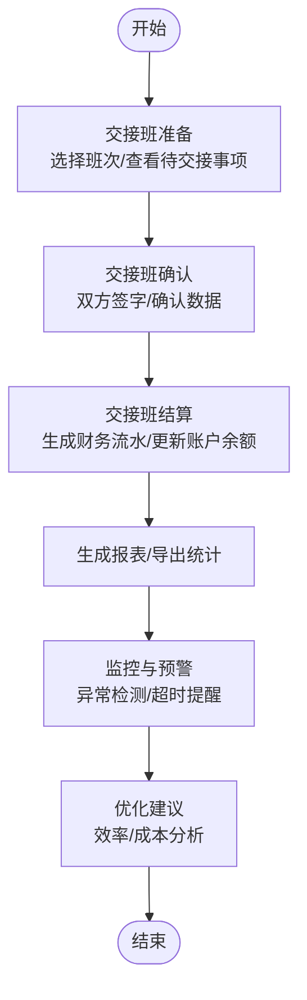

### 交接班准备（页面与班次选择）
- **页面服务重构**：经过模块化重构后，页面服务现在协调多个专门的模块来处理不同的业务逻辑。
- **班次选择服务**：新的HandoverPageShiftSelectorService负责复杂的班次选择逻辑，支持收银员、经理、老板等不同角色的权限控制。
- **班次视图服务**：HandoverPageShiftViewService处理班次信息的展示逻辑，包括操作员信息显示和接班人候选者查找。
- **批量预加载优化**：HandoverRecordBatchPreloaderService通过并行查询和内存缓存显著提升了大量数据的加载性能。

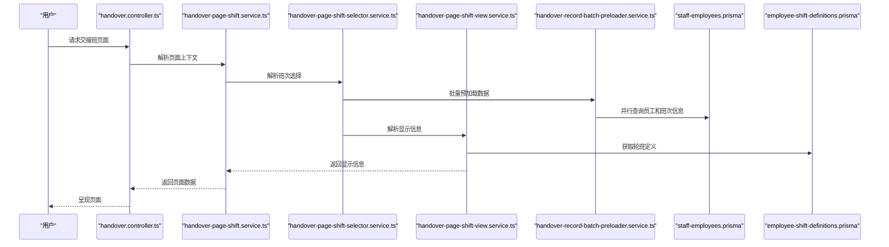

**图表来源**
- [handover-page-shift.service.ts](file://src/purely-profit/operations/handover/handover-page-shift.service.ts)
- [handover-page-shift-selector.service.ts](file://src/purely-profit/operations/handover/handover-page-shift-selector.service.ts)
- [handover-page-shift-view.service.ts](file://src/purely-profit/operations/handover/handover-page-shift-view.service.ts)
- [handover-record-batch-preloader.service.ts](file://src/purely-profit/operations/handover/handover-record-batch-preloader.service.ts)
- [staff-employees.prisma](file://prisma/purely-profit/staff/employees.prisma)
- [employee-shift-definitions.prisma](file://prisma/migrations/20260601170000_add_employee_shift_definitions/)

**章节来源**
- [handover-page-shift.service.ts](file://src/purely-profit/operations/handover/handover-page-shift.service.ts)
- [handover-page-shift-selector.service.ts](file://src/purely-profit/operations/handover/handover-page-shift-selector.service.ts)
- [handover-page-shift-view.service.ts](file://src/purely-profit/operations/handover/handover-page-shift-view.service.ts)
- [handover-record-batch-preloader.service.ts](file://src/purely-profit/operations/handover/handover-record-batch-preloader.service.ts)
- [handover-page.dto.ts](file://src/purely-profit/operations/handover/dto/handover-page.dto.ts)
- [employee-shift-definitions.prisma](file://prisma/migrations/20260601170000_add_employee_shift_definitions/)

### 交接班确认（双人核对与落库）
- 确认服务负责校验交接数据完整性、金额一致性与班次状态。
- 支持班次切换确认与单日多班次确认。
- 落库时生成交接班记录与轮班快照，保证审计可追溯。

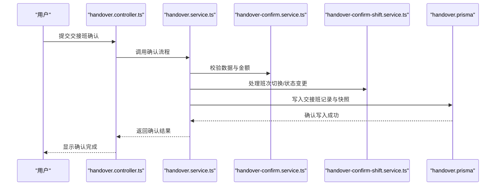

**图表来源**
- [handover.controller.ts](file://src/purely-profit/operations/handover/handover.controller.ts)
- [handover.service.ts](file://src/purely-profit/operations/handover/handover.service.ts)
- [handover-confirm.service.ts](file://src/purely-profit/operations/handover/handover-confirm.service.ts)
- [handover-confirm-shift.service.ts](file://src/purely-profit/operations/handover/handover-confirm-shift.service.ts)
- [handover.prisma](file://prisma/purely-profit/operations/handover.prisma)

**章节来源**
- [handover.service.ts](file://src/purely-profit/operations/handover/handover.service.ts)
- [handover-confirm.service.ts](file://src/purely-profit/operations/handover/handover-confirm.service.ts)
- [handover-confirm-shift.service.ts](file://src/purely-profit/operations/handover/handover-confirm-shift.service.ts)

### 交接班结算（财务对接）
- 结算环节将交接班收入与支出归集到财务账户，生成现金流记录。
- 对接财务账户与现金流表，确保账实相符。
- 支持按日/班次维度生成结算摘要，便于对账与报表。

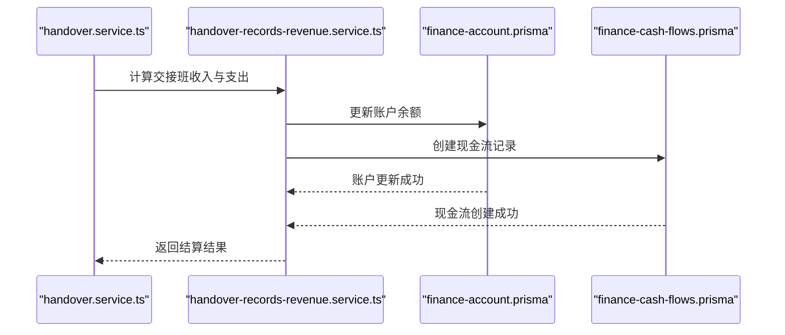

**图表来源**
- [handover.service.ts](file://src/purely-profit/operations/handover/handover.service.ts)
- [handover-records-revenue.service.ts](file://src/purely-profit/operations/handover/handover-records-revenue.service.ts)
- [finance-account.prisma](file://prisma/purely-profit/finance/accounts.prisma)
- [finance-cash-flows.prisma](file://prisma/purely-profit/finance/cash-flows.prisma)

**章节来源**
- [handover-records-revenue.service.ts](file://src/purely-profit/operations/handover/handover-records-revenue.service.ts)
- [finance-account.prisma](file://prisma/purely-profit/finance/accounts.prisma)
- [finance-cash-flows.prisma](file://prisma/purely-profit/finance/cash-flows.prisma)

### 交接班记录与统计
- 记录服务提供增删改查、详情查看与批量查询。
- 查询服务支持按日期、班次、员工、门店等条件筛选。
- 统计服务汇总收入、支出、差额等关键指标，支持导出。

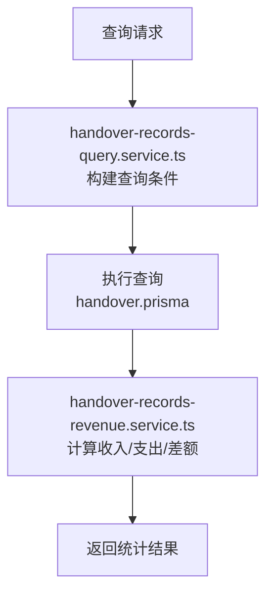

**图表来源**
- [handover-records.service.ts](file://src/purely-profit/operations/handover/handover-records.service.ts)
- [handover-records-query.service.ts](file://src/purely-profit/operations/handover/handover-records-query.service.ts)
- [handover-records-revenue.service.ts](file://src/purely-profit/operations/handover/handover-records-revenue.service.ts)
- [handover.prisma](file://prisma/purely-profit/operations/handover.prisma)

**章节来源**
- [handover-records.service.ts](file://src/purely-profit/operations/handover/handover-records.service.ts)
- [handover-records-query.service.ts](file://src/purely-profit/operations/handover/handover-records-query.service.ts)
- [handover-records-revenue.service.ts](file://src/purely-profit/operations/handover/handover-records-revenue.service.ts)

### 交接班额外事项
- 额外事项用于记录交接中的特殊事件或待办，支持新增、编辑、删除与查询。
- 与交接班记录关联，形成完整的交接档案。

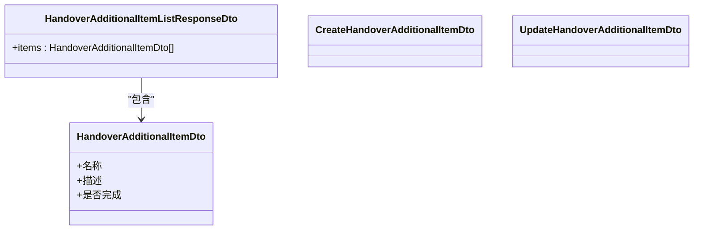

**图表来源**
- [handover-additional-items.dto.ts](file://src/purely-profit/operations/handover/dto/handover-additional-items.dto.ts)
- [handover-additional-items.service.ts](file://src/purely-profit/operations/handover/handover-additional-items.service.ts)
- [handover-additional-items.prisma](file://prisma/migrations/20260601120000_add_handover_additional_items/)

**章节来源**
- [handover-additional-items.service.ts](file://src/purely-profit/operations/handover/handover-additional-items.service.ts)
- [handover-additional-items.dto.ts](file://src/purely-profit/operations/handover/dto/handover-additional-items.dto.ts)

### 权限与子账号能力
- 权限常量定义"交接班"相关权限码，用于细粒度控制。
- 主题能力服务将"交接班管理"作为模块之一，决定界面可见性与入口。
- 平台子账号服务提供"可使用交接班"的能力判定，结合门店配置与角色状态生效。

**重大更新** 财务子账户现在拥有完整的交接班管理权限，包括查看、创建和更新交接班记录的能力。

**图表来源**
- [access-control.constants.ts](file://src/purely-profit/access-control/access-control.constants.ts)
- [subject-capability.service.ts](file://src/purely-profit/access-control/subject-capability.service.ts)
- [store-sub-account.service.ts](file://src/purely-profit/member/platform-membership/store-sub-account.service.ts)
- [platform-membership-access.service.ts](file://src/purely-profit/member/platform-membership/platform-membership-access.service.ts)
- [access-control.service.ts](file://src/purely-profit/access-control/access-control.service.ts)

**章节来源**
- [access-control.constants.ts](file://src/purely-profit/access-control/access-control.constants.ts)
- [subject-capability.service.ts](file://src/purely-profit/access-control/subject-capability.service.ts)
- [store-sub-account.service.ts](file://src/purely-profit/member/platform-membership/store-sub-account.service.ts)
- [platform-membership-access.service.ts](file://src/purely-profit/member/platform-membership/platform-membership-access.service.ts)
- [access-control.service.ts](file://src/purely-profit/access-control/access-control.service.ts)

### 财务子账户权限扩展详解
**新增** 详细介绍财务子账户在交接班管理中的权限扩展：

#### 权限配置变更
- **基础权限**：财务子账户现在拥有 `handover:view`、`handover:create`、`handover:update` 三个核心权限
- **首页模块可见性**：财务角色在首页可以看到"交接班管理"入口
- **能力快照**：`canUseHandoverManagement` 属性对财务角色返回 `true`

#### 角色权限矩阵
| 角色 | 交接班查看 | 交接班创建 | 交接班更新 | 首页可见性 |
|------|------------|------------|------------|------------|
| 收银员 | ✅ | ✅ | ✅ | ✅ |
| 财务 | ✅ | ✅ | ✅ | ✅ |
| 店长 | ✅ | ✅ | ✅ | ✅ |

#### 权限控制流程
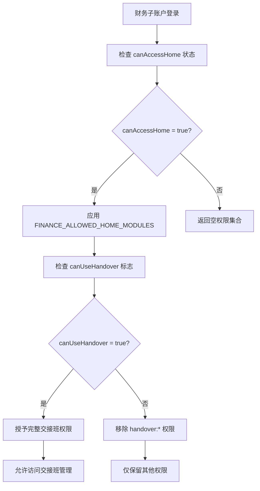

**图表来源**
- [access-control.service.ts](file://src/purely-profit/access-control/access-control.service.ts)
- [subject-capability.service.ts](file://src/purely-profit/access-control/subject-capability.service.ts)

#### 实际应用场景
- **财务审核**：财务人员可以查看历史交接班记录，进行财务审核和对账
- **协同管理**：财务团队可以与运营人员协作，共同管理班次交接流程
- **数据一致性**：确保交接班数据与财务系统的一致性
- **审计追踪**：完整的交接班操作审计日志，便于财务审计

**章节来源**
- [access-control.service.ts](file://src/purely-profit/access-control/access-control.service.ts)
- [subject-capability.service.ts](file://src/purely-profit/access-control/subject-capability.service.ts)
- [store-sub-account-slot.service.ts](file://src/purely-profit/member/platform-membership/store-sub-account-slot.service.ts)

### 团购券支付映射增强详解
**重大更新** 详细介绍团购券支付映射的增强功能，这是本次更新的核心改进：

#### 平台特定标签显示机制
- **核心改进**：系统现在能够正确显示'美团团购'、'抖音团购'等平台特定标签，而不是通用的'团购'
- **标签构建函数**：`buildGrouponLabel` 函数根据 `prepaidGrouponPlatform` 字段动态生成平台特定标签
- **平台映射**：支持拼音值（meituan、douyin、tiktok）到中文标签的自动转换
- **回退逻辑**：当平台值为空时，回退到默认的'团购'标签

#### 支付桶分类机制
- **核心逻辑**：在开台项（预付款/台位费）场景下，当顾客的支付方式为团购券时，系统会将其归入独立的"团购"支付桶
- **分类规则**：`isSessionStartItem(item.productName) && item.order.spaceSession?.prepaidCustomerPaymentMethod === 'groupon_voucher'`
- **桶键值**：使用 `'groupon_voucher'` 作为特殊的支付桶键值，区别于标准的 SalesPaymentMethod 枚举

#### 显示覆盖机制
- **平台标签**：团购券交易在前端显示为'美团团购'、'抖音团购'等具体平台标签
- **颜色标识**：统一使用 `#b45309` 颜色标识团购券交易
- **覆盖条件**：仅当开台项且顾客支付方式为团购券时才触发显示覆盖
- **回退逻辑**：非团购券场景下，正常显示门店侧的结算方式（现金、微信、支付宝等）

#### 技术实现细节
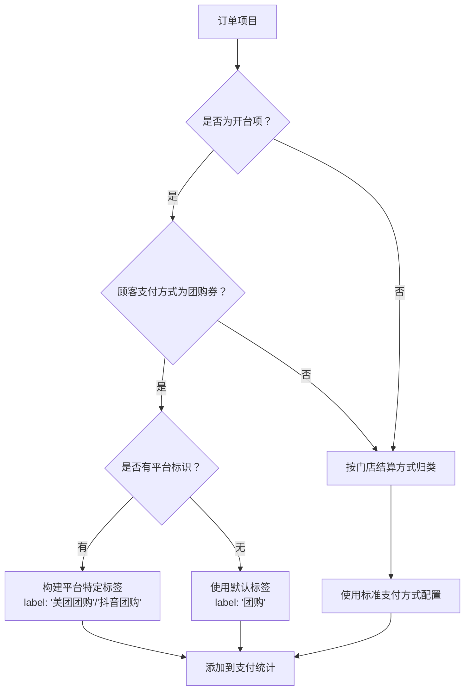

**图表来源**
- [handover-page-payment.ts](file://src/purely-profit/operations/handover/handover-page-payment.ts)
- [handover.constants.ts](file://src/purely-profit/operations/handover/handover.constants.ts)
- [handover.mapper.ts](file://src/purely-profit/operations/handover/handover.mapper.ts)

#### 数据源支持
- **顾客支付方式字段**：`SpaceSession.prepaidCustomerPaymentMethod` 存储顾客实际的支付方式
- **结算渠道字段**：`SpaceSession.prepaidGrouponPlatform` 记录结算渠道（美团、抖音等）
- **派生逻辑**：系统会根据团购券码或平台信息自动推导顾客支付方式

#### 测试验证
- **单元测试覆盖**：完整的测试用例验证团购券支付桶分类的正确性
- **边界情况处理**：涵盖预付款、台位费等多种开台场景
- **兼容性保证**：确保非团购券场景下的正常处理逻辑

**章节来源**
- [handover-page-payment.ts](file://src/purely-profit/operations/handover/handover-page-payment.ts)
- [handover.constants.ts](file://src/purely-profit/operations/handover/handover.constants.ts)
- [handover.mapper.ts](file://src/purely-profit/operations/handover/handover.mapper.ts)
- [handover-page-payment.spec.ts](file://src/purely-profit/operations/handover/handover-page-payment.spec.ts)
- [space-session-payload.shared.ts](file://src/purely-profit/operations/spaces/space-session-payload.shared.ts)

### 退款处理逻辑改进详解
**新增** 详细介绍退款处理逻辑的改进，这是本次更新的另一个重要特性：

#### 退款展示格式增强
- **后缀标识**：退款行商品名追加" · 退款"后缀，与历史退款订单保持一致
- **空间名称格式化**：当存在空间名称时，格式化为"空间名 · 退款"
- **回退逻辑**：无空间名时回退到"空间退款"默认名称

#### 退款计算逻辑优化
- **综合计算**：退款金额 = (prepaidAmount + renewTotal) - consumption
- **续费支持**：正确处理续费溢出的退款场景，不再忽略续费部分
- **精度保证**：使用 Money 工具类确保金额计算的精确性

#### 技术实现细节
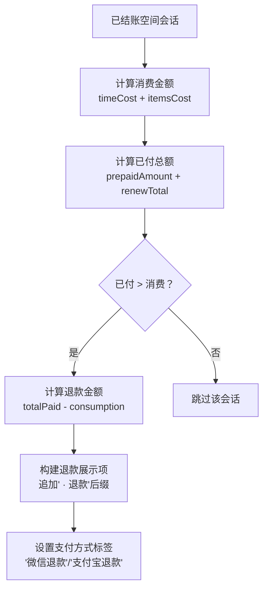

**图表来源**
- [handover-page-order-items.ts](file://src/purely-profit/operations/handover/handover-page-order-items.ts)
- [handover.mapper.ts](file://src/purely-profit/operations/handover/handover.mapper.ts)
- [handover-page-payment.ts](file://src/purely-profit/operations/handover/handover-page-payment.ts)

#### 数据完整性保证
- **支付方式**：优先从 saleOrder.paymentMethod 获取，回退到最新续费记录的支付方式
- **操作员信息**：支持 operatorNameSnapshot 和 operatorStaff.name 双重回退
- **时间戳**：使用 endTime 作为交易时间，支持 null 值处理
- **颜色标识**：根据支付方式设置相应的颜色标识

**章节来源**
- [handover-page-order-items.ts](file://src/purely-profit/operations/handover/handover-page-order-items.ts)
- [handover.mapper.ts](file://src/purely-profit/operations/handover/handover.mapper.ts)
- [handover-page-payment.ts](file://src/purely-profit/operations/handover/handover-page-payment.ts)

### 模块化重构详解
**重大更新** 本次重构将原645行的handover-page.shared.ts文件拆分为多个专门的模块，显著提升了代码的可维护性和性能表现。

#### 订单处理模块（handover-page-order-items.ts）
- **核心功能**：专门处理订单项目、退款和客人应付项目的构建逻辑
- **主要函数**：
  - `buildGuestPayableItems`：构建空间会话的客人应付项目
  - `buildRefundItemsFromSessions`：从已结账的空间会话中构建退款展示项
  - `mergeDisplayedOrderItems`：合并各种类型的订单项目并排序
- **技术特点**：支持多种支付方式的处理，包含详细的操作员信息和时间戳管理

#### 支付处理模块（handover-page-payment.ts）
- **核心功能**：专注于支付方式统计、占比计算和收入汇总，**已增强** 支持团购券支付桶分类
- **主要函数**：
  - `mapPaymentItems`：按支付方式分组并转换单位，**已更新** 支持团购券桶分类
  - `attachPaymentRatios`：为每个收款项附加占比
  - `computeRefundAmountFromSessions`：从SpaceSession数据计算退款金额
  - `buildRevenueAmounts`：构建收入金额汇总
- **技术特点**：使用Money工具类确保金额计算的精确性，支持整数百分比计算

#### 查询构建模块（handover-page-query.builders.ts）
- **核心功能**：提供统一的数据库查询条件构建器
- **主要函数**：
  - `buildSaleOrderWhere`：构建销售订单查询条件
  - `buildNonSpaceSessionOrderWhere`：构建非空间会话订单查询条件
  - `buildCashFlowWhere`：构建现金流水查询条件
  - `buildSpaceRefundOrderWhere`：构建空间退款订单查询条件
- **技术特点**：统一的查询条件格式，支持时间范围和门店过滤

#### 班次信息管理模块（handover-page-shift-info.ts）
- **核心功能**：负责班次信息的构建和展示
- **主要函数**：
  - `buildShiftInfo`：构建基础班次信息
  - `buildPageShiftInfo`：构建页面显示的完整班次信息
- **技术特点**：支持多种班次类型和时间回退逻辑

#### 批量预加载服务（handover-record-batch-preloader.service.ts）
- **核心功能**：优化大量数据的预加载性能
- **主要特性**：
  - 并行执行所有预加载查询
  - 智能的时间范围计算
  - 内存Map结构的数据缓存
  - 支持精确匹配和兜底匹配策略
- **性能优势**：显著减少数据库往返次数，提升批量操作性能

#### 操作员档案服务（handover-record-operator-profile.service.ts）
- **核心功能**：管理操作员信息和头像显示
- **主要方法**：
  - `resolveFromPreloaded`：从预加载数据中解析操作员档案
  - `resolveSingle`：单条查询操作员档案
  - `resolveOperatorName`：解析操作员显示名称
- **技术特点**：支持头像的多级回退逻辑，确保显示完整性

#### 交班状态服务（handover-shift-handover-status.service.ts）
- **核心功能**：处理交班完成状态的判断逻辑
- **主要方法**：
  - `isShiftHandedOver`：检查单个班次是否已完成交班
  - `attachCompletionStatus`：为班次列表批量附加交班完成状态
  - `loadHandedOverShiftIds`：一次性加载所有已交班的shift标识集合
- **技术特点**：支持精确ID匹配和时间范围兜底匹配

#### 班次选择服务（handover-page-shift-selector.service.ts）
- **核心功能**：复杂的班次选择和过滤逻辑
- **主要方法**：
  - `resolveShiftSelection`：解析班次选择的核心方法
  - `resolveOwnedShiftSelection`：解析拥有者的班次选择
  - `resolveDisplayTargetEmployeeId`：解析显示目标员工ID
- **技术特点**：支持收银员、经理、老板等不同角色的权限控制

#### 班次视图服务（handover-page-shift-view.service.ts）
- **核心功能**：处理班次信息的展示逻辑
- **主要方法**：
  - `resolveDisplayOperatorInfo`：解析显示的操作员信息
  - `findReceiverCandidate`：查找接班人候选者
  - `resolveDisplayTargetEmployeeId`：解析显示目标员工ID
- **技术特点**：集成子账号服务，支持复杂的权限验证

#### 页面班次服务（handover-page-shift.service.ts）
- **核心功能**：协调各个班次相关服务的统一入口
- **主要方法**：
  - `resolvePageShiftContext`：解析页面班次上下文的统一入口
  - `resolveHandoverCompletedAndNoUpcomingShift`：判断交班完成且无后续班次
- **技术特点**：整合所有班次相关的服务，提供统一的业务逻辑

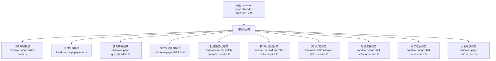

**图表来源**
- [handover-page-order-items.ts](file://src/purely-profit/operations/handover/handover-page-order-items.ts)
- [handover-page-payment.ts](file://src/purely-profit/operations/handover/handover-page-payment.ts)
- [handover-page-query.builders.ts](file://src/purely-profit/operations/handover/handover-page-query.builders.ts)
- [handover-page-shift-info.ts](file://src/purely-profit/operations/handover/handover-page-shift-info.ts)
- [handover-record-batch-preloader.service.ts](file://src/purely-profit/operations/handover/handover-record-batch-preloader.service.ts)
- [handover-record-operator-profile.service.ts](file://src/purely-profit/operations/handover/handover-record-operator-profile.service.ts)
- [handover-shift-handover-status.service.ts](file://src/purely-profit/operations/handover/handover-shift-handover-status.service.ts)
- [handover-page-shift-selector.service.ts](file://src/purely-profit/operations/handover/handover-page-shift-selector.service.ts)
- [handover-page-shift-view.service.ts](file://src/purely-profit/operations/handover/handover-page-shift-view.service.ts)
- [handover-page-shift.service.ts](file://src/purely-profit/operations/handover/handover-page-shift.service.ts)

**章节来源**
- [handover-page-order-items.ts](file://src/purely-profit/operations/handover/handover-page-order-items.ts)
- [handover-page-payment.ts](file://src/purely-profit/operations/handover/handover-page-payment.ts)
- [handover-page-query.builders.ts](file://src/purely-profit/operations/handover/handover-page-query.builders.ts)
- [handover-page-shift-info.ts](file://src/purely-profit/operations/handover/handover-page-shift-info.ts)
- [handover-record-batch-preloader.service.ts](file://src/purely-profit/operations/handover/handover-record-batch-preloader.service.ts)
- [handover-record-operator-profile.service.ts](file://src/purely-profit/operations/handover/handover-record-operator-profile.service.ts)
- [handover-shift-handover-status.service.ts](file://src/purely-profit/operations/handover/handover-shift-handover-status.service.ts)
- [handover-page-shift-selector.service.ts](file://src/purely-profit/operations/handover/handover-page-shift-selector.service.ts)
- [handover-page-shift-view.service.ts](file://src/purely-profit/operations/handover/handover-page-shift-view.service.ts)
- [handover-page-shift.service.ts](file://src/purely-profit/operations/handover/handover-page-shift.service.ts)

### computeRefundAmountFromSessions函数详解
**新增** 详细介绍新引入的核心退款计算函数，该函数专门用于从SpaceSession数据计算退款金额。

#### 函数功能
- **核心用途**：基于已结账的空间会话数据计算总退款金额
- **计算逻辑**：当预付款金额大于实际消费金额时，计算差额作为退款
- **数据类型**：接收SpaceSession数组，返回退款金额（元）

#### 技术实现
- **输入参数**：`sessions: Array<{timeCost, itemsCost, prepaidAmount}>`
- **计算规则**：`refund = prepaidAmount - (timeCost + itemsCost)`
- **过滤条件**：仅处理`prepaidAmount > 0`且`refund > 0`的会话
- **精度处理**：使用Money工具类确保金额计算的精确性

#### 应用场景
- **交接班统计**：在交接班页面和记录中准确显示退款金额
- **财务报表**：为财务报告提供准确的退款数据
- **数据分析**：支持退款趋势分析和业务洞察

**章节来源**
- [handover-page-payment.ts](file://src/purely-profit/operations/handover/handover-page-payment.ts)

### buildRefundItemsFromSessions函数详解
**新增** 详细介绍新引入的退款展示项构建函数，该函数专门用于从SpaceSession数据构建退款明细。

#### 函数功能
- **主要职责**：将SpaceSession退款数据转换为交接班展示格式
- **数据转换**：将内部退款计算结果转换为前端友好的订单项格式
- **信息丰富**：包含支付方式、操作员、时间等完整交易信息

#### 技术实现
- **输入类型**：`settledSessions: Array<SpaceSessionWithDetails>`
- **输出格式**：`HandoverOrderItemDto[]`标准订单项格式
- **字段映射**：正确映射spaceName、paymentMethod、operatorName等关键字段
- **排序逻辑**：按照时间倒序排列，退款项优先显示

#### 数据完整性
- **支付方式**：从saleOrder.paymentMethod获取，默认为微信支付
- **操作员信息**：支持operatorNameSnapshot和operatorStaff.name双重回退
- **时间戳**：使用endTime作为交易时间，支持null值处理
- **颜色标识**：根据支付方式设置相应的颜色标识

**章节来源**
- [handover-page-order-items.ts](file://src/purely-profit/operations/handover/handover-page-order-items.ts)

### buildGuestPayableItems函数详解
**新增** 详细介绍空间会话客人应付项目的构建函数，该函数专门处理空间会话的应付账款。

#### 函数功能
- **专门用途**：处理空间会话的客人应付项目，确保这些项目的正确计算和显示
- **计算逻辑**：当消费金额大于预付款时，计算客人需要支付的差额
- **数据整合**：整合时间费用、物品费用和预付款信息

#### 技术实现
- **参数类型**：`settledSessions: Parameters<typeof buildGuestPayableItems>[0] = []`
- **默认值处理**：当未提供参数时，默认为空数组
- **项目构建**：根据空间会话的结算状态构建相应的应付项目
- **金额计算**：`payableAmount = (timeCost + itemsCost) - prepaidAmount`

#### 应用场景
- **空间会话结算**：在交接班结算过程中，正确处理空间会话的应付项目
- **收入统计**：确保空间会话相关的收入被正确计入统计
- **报表生成**：为报表提供准确的空间会话应付项目数据

**章节来源**
- [handover-page-order-items.ts](file://src/purely-profit/operations/handover/handover-page-order-items.ts)

## 依赖关系分析
- **模块内聚**：控制器仅做路由与参数透传，核心逻辑集中在服务层，保持高内聚低耦合。
- **外部依赖**：依赖 Prisma 进行数据持久化；依赖财务模块进行结算；依赖员工与排班模块获取人员与班次信息。
- **权限耦合**：权限与子账号能力贯穿各层，确保功能可用性与安全性。
- **模块化依赖**：新的模块化架构中，页面服务协调多个专门的模块，各模块职责清晰，依赖关系明确。

```mermaid
graph TB
C["handover.controller.ts"] --> S["handover.service.ts"]
S --> P["handover-page.service.ts"]
P --> POI["handover-page-order-items.ts"]
P --> PP["handover-page-payment.ts"]
P --> PQB["handover-page-query.builders.ts"]
P --> PSI["handover-page-shift-info.ts"]
P --> BPL["handover-record-batch-preloader.service.ts"]
P --> OPS["handover-record-operator-profile.service.ts"]
P --> HSS["handover-shift-handover-status.service.ts"]
P --> PSS["handover-page-shift-selector.service.ts"]
P --> PSV["handover-page-shift-view.service.ts"]
P --> PS["handover-page-shift.service.ts"]
S --> CF["handover-confirm.service.ts"]
S --> CS["handover-confirm-shift.service.ts"]
S --> R["handover-records.service.ts"]
R --> RQ["handover-records-query.service.ts"]
R --> RR["handover-records-revenue.service.ts"]
S --> AI["handover-additional-items.service.ts"]
S --> ACC["handover.access.ts"]
S --> CONST["handover.constants.ts"]
S --> TYPES["handover.types.ts"]
S --> DB["Prisma 模式"]
```

**图表来源**
- [handover.controller.ts](file://src/purely-profit/operations/handover/handover.controller.ts)
- [handover.service.ts](file://src/purely-profit/operations/handover/handover.service.ts)
- [handover-page.service.ts](file://src/purely-profit/operations/handover/handover-page.service.ts)
- [handover-page-order-items.ts](file://src/purely-profit/operations/handover/handover-page-order-items.ts)
- [handover-page-payment.ts](file://src/purely-profit/operations/handover/handover-page-payment.ts)
- [handover-page-query.builders.ts](file://src/purely-profit/operations/handover/handover-page-query.builders.ts)
- [handover-page-shift-info.ts](file://src/purely-profit/operations/handover/handover-page-shift-info.ts)
- [handover-record-batch-preloader.service.ts](file://src/purely-profit/operations/handover/handover-record-batch-preloader.service.ts)
- [handover-record-operator-profile.service.ts](file://src/purely-profit/operations/handover/handover-record-operator-profile.service.ts)
- [handover-shift-handover-status.service.ts](file://src/purely-profit/operations/handover/handover-shift-handover-status.service.ts)
- [handover-page-shift-selector.service.ts](file://src/purely-profit/operations/handover/handover-page-shift-selector.service.ts)
- [handover-page-shift-view.service.ts](file://src/purely-profit/operations/handover/handover-page-shift-view.service.ts)
- [handover-page-shift.service.ts](file://src/purely-profit/operations/handover/handover-page-shift.service.ts)

**章节来源**
- [handover-module.ts](file://src/purely-profit/operations/handover/handover.module.ts)
- [handover.service.ts](file://src/purely-profit/operations/handover/handover.service.ts)

## 性能考量
- **分页与索引**：查询服务应配合数据库索引与分页策略，避免大范围扫描。
- **批量写入**：结算与确认流程尽量合并事务，减少往返开销。
- **缓存与预热**：高频查询（如班次定义）可引入缓存，降低数据库压力。
- **异步处理**：对耗时的报表生成与导出采用异步队列，提升用户体验。
- **批量预加载优化**：新的批量预加载服务通过并行查询和内存缓存显著提升了大量数据的加载性能。
- **模块化性能**：模块化分解减少了单一文件的复杂度，提升了编译和运行效率。
- **查询优化**：统一的查询构建器确保了查询条件的最优化和复用。
- **支付桶分类性能**：团购券支付桶分类逻辑采用高效的Map结构和条件判断，对性能影响极小。

## 故障排查指南
- **权限不足**：若提示不可使用交接班功能，检查主题能力与子账号配置，确认 canUseHandover 开关与门店启用状态。
- **数据不一致**：确认交接班确认前后的金额校验、班次状态与轮班快照是否完整落库。
- **财务异常**：核对结算后账户余额与现金流是否匹配，排查重复记账或遗漏记录。
- **接口错误**：对照 DTO 字段与必填项，确保请求体格式正确；查看控制器返回的状态码与错误信息。
- **模块化问题**：如果某个功能模块失效，检查对应的独立模块是否正确导入和依赖注入。
- **批量预加载异常**：如果数据加载缓慢，检查批量预加载器的并行查询是否正常执行，内存Map是否正确构建。
- **班次选择错误**：如果班次选择逻辑异常，检查HandoverPageShiftSelectorService的权限判断和班次匹配逻辑。
- **操作员信息显示异常**：检查HandoverRecordOperatorProfileService的头像解析和名称回退逻辑。
- **财务子账户权限问题**：检查财务角色的 `canUseHandover` 标志位和 `FINANCE_ALLOWED_HOME_MODULES` 配置。
- **团购券支付分类异常**：检查 `prepaidCustomerPaymentMethod` 字段是否正确设置，确认开台项的产品名称识别逻辑。
- **平台标签显示异常**：检查 `prepaidGrouponPlatform` 字段值，确认 `buildGrouponLabel` 函数的平台映射逻辑。
- **退款处理异常**：检查退款计算逻辑，确认 `sessionRenewRecords` 数据是否正确累加。

**章节来源**
- [handover-access.ts](file://src/purely-profit/operations/handover/handover.access.ts)
- [store-sub-account.service.ts](file://src/purely-profit/member/platform-membership/store-sub-account.service.ts)
- [platform-membership-access.service.ts](file://src/purely-profit/member/platform-membership/platform-membership-access.service.ts)
- [handover-confirm.service.ts](file://src/purely-profit/operations/handover/handover-confirm.service.ts)
- [handover-records-revenue.service.ts](file://src/purely-profit/operations/handover/handover-records-revenue.service.ts)
- [handover-record-batch-preloader.service.ts](file://src/purely-profit/operations/handover/handover-record-batch-preloader.service.ts)
- [handover-page-shift-selector.service.ts](file://src/purely-profit/operations/handover/handover-page-shift-selector.service.ts)
- [handover-record-operator-profile.service.ts](file://src/purely-profit/operations/handover/handover-record-operator-profile.service.ts)
- [access-control.service.ts](file://src/purely-profit/access-control/access-control.service.ts)
- [handover-page-payment.ts](file://src/purely-profit/operations/handover/handover-page-payment.ts)
- [handover.constants.ts](file://src/purely-profit/operations/handover/handover.constants.ts)

## 结论
交接班管理以清晰的三层架构实现从准备、确认到结算的全链路闭环，结合权限与子账号能力保障安全可控，通过与财务与员工排班系统的深度集成实现高效运营。

**重大支付处理增强总结** 本次团购券支付映射增强和退款处理改进显著提升了交接班统计的准确性和业务灵活性。通过为团购券交易创建单独的支付桶，系统现在能够正确显示'美团团购'、'抖音团购'等平台特定标签，实现了更精确的支付方式分类和报告。特别是在开台项场景中，系统能够正确区分顾客实际使用的团购券与门店侧的结算方式。退款处理逻辑的改进确保了续费溢出金额的准确退还，避免了资金损失。建议在后续版本中继续完善支付方式的扩展机制，支持更多第三方平台的团购券处理。

## 附录

### API 使用示例与业务场景
以下为常见业务场景的调用路径与要点说明（以路径代替具体代码）：

- **场景一：打开交接班页面**
  - 路径参考：[handover-page-shift.service.ts](file://src/purely-profit/operations/handover/handover-page-shift.service.ts)
  - 关键点：通过模块化架构协调多个服务，支持批量预加载和权限控制。

- **场景二：提交交接班确认**
  - 路径参考：[handover-confirm.service.ts](file://src/purely-profit/operations/handover/handover-confirm.service.ts)
  - 关键点：金额校验、班次状态变更、写入交接班记录与轮班快照。

- **场景三：生成结算并入账**
  - 路径参考：[handover-records-revenue.service.ts](file://src/purely-profit/operations/handover/handover-records-revenue.service.ts)
  - 关键点：汇总收入/支出，更新财务账户，创建现金流记录。

- **场景四：查询历史交接班记录**
  - 路径参考：[handover-records-query.service.ts](file://src/purely-profit/operations/handover/handover-records-query.service.ts)
  - 关键点：按日期、班次、员工、门店筛选，支持分页与排序。

- **场景五：维护交接班额外事项**
  - 路径参考：[handover-additional-items.service.ts](file://src/purely-profit/operations/handover/handover-additional-items.service.ts)
  - 关键点：新增/编辑/删除交接事项，与交接班记录关联。

- **场景六：处理订单项目和退款**
  - 路径参考：[handover-page-order-items.ts](file://src/purely-profit/operations/handover/handover-page-order-items.ts)
  - 关键点：使用buildGuestPayableItems和buildRefundItemsFromSessions函数处理空间会话的应付和退款。

- **场景七：计算支付方式统计（含团购券）**
  - 路径参考：[handover-page-payment.ts](file://src/purely-profit/operations/handover/handover-page-payment.ts)
  - 关键点：使用mapPaymentItems和attachPaymentRatios函数进行支付方式统计，**已增强** 支持团购券支付桶分类。

- **场景八：批量预加载数据**
  - 路径参考：[handover-record-batch-preloader.service.ts](file://src/purely-profit/operations/handover/handover-record-batch-preloader.service.ts)
  - 关键点：并行查询员工、班次和档案信息，使用内存Map缓存提高性能。

- **场景九：财务子账户访问交接班管理**
  - 路径参考：[access-control.service.ts](file://src/purely-profit/access-control/access-control.service.ts)
  - 关键点：财务角色自动获得交接班管理权限，无需额外配置。

- **场景十：处理团购券开台支付**
  - 路径参考：[handover-page-payment.ts](file://src/purely-profit/operations/handover/handover-page-payment.ts)
  - 关键点：当开台项顾客使用团购券时，自动归入"团购"支付桶，显示正确的平台标签和颜色。

**章节来源**
- [handover-page-shift.service.ts](file://src/purely-profit/operations/handover/handover-page-shift.service.ts)
- [handover-confirm.service.ts](file://src/purely-profit/operations/handover/handover-confirm.service.ts)
- [handover-records-revenue.service.ts](file://src/purely-profit/operations/handover/handover-records-revenue.service.ts)
- [handover-records-query.service.ts](file://src/purely-profit/operations/handover/handover-records-query.service.ts)
- [handover-additional-items.service.ts](file://src/purely-profit/operations/handover/handover-additional-items.service.ts)
- [handover-page-order-items.ts](file://src/purely-profit/operations/handover/handover-page-order-items.ts)
- [handover-page-payment.ts](file://src/purely-profit/operations/handover/handover-page-payment.ts)
- [handover-record-batch-preloader.service.ts](file://src/purely-profit/operations/handover/handover-record-batch-preloader.service.ts)
- [access-control.service.ts](file://src/purely-profit/access-control/access-control.service.ts)

### 交接班管理与员工排班、财务结算的集成机制
- **与员工排班集成**：通过员工与轮班定义表获取班次时间、人员安排，确保交接班的合法性与时序正确。
- **与财务结算集成**：结算阶段将交接班数据映射到财务账户与现金流，保证账目一致与可追溯。
- **模块化集成**：新的模块化架构中，各个服务通过依赖注入松耦合集成，便于单独测试和维护。
- **财务协作集成**：财务子账户现在可以直接参与交接班流程，实现财务与运营的无缝协作。
- **支付方式集成**：**已增强** 支持团购券等特殊支付方式的准确分类和统计，确保财务数据的完整性。

**章节来源**
- [staff-employees.prisma](file://prisma/purely-profit/staff/employees.prisma)
- [employee-shift-definitions.prisma](file://prisma/migrations/20260601170000_add_employee_shift_definitions/)
- [finance-account.prisma](file://prisma/purely-profit/finance/accounts.prisma)
- [finance-cash-flows.prisma](file://prisma/purely-profit/finance/cash-flows.prisma)
- [access-control.service.ts](file://src/purely-profit/access-control/access-control.service.ts)
- [handover-page-payment.ts](file://src/purely-profit/operations/handover/handover-page-payment.ts)

### 模块化重构技术细节
**重大更新** 详细说明了交接班页面功能从单一文件到模块化架构的重大重构内容：

#### 核心变更点
1. **文件拆分**：将645行的handover-page.shared.ts拆分为10个专门的模块和服务
2. **职责分离**：每个模块专注于特定的业务领域，如订单处理、支付统计、查询构建等
3. **性能优化**：引入批量预加载机制，通过并行查询和内存缓存提升性能
4. **可维护性提升**：模块化架构使得代码更易于理解、测试和维护

#### 技术实现细节
- **依赖注入**：使用NestJS的依赖注入容器管理服务间的依赖关系
- **并行查询**：批量预加载器使用Promise.all并行执行多个数据库查询
- **内存缓存**：使用Map数据结构在内存中缓存查询结果，避免重复查询
- **类型安全**：每个模块都有明确的TypeScript类型定义，确保类型安全
- **单元测试**：为新模块编写了全面的单元测试，确保功能正确性

#### 影响范围
- 所有交接班页面的功能都受益于这一模块化重构
- 系统性能得到显著提升，特别是在处理大量数据时
- 代码的可维护性和可扩展性大幅改善
- 单元测试覆盖率显著提高，系统稳定性增强

#### 测试验证
- 为每个新模块编写了专门的单元测试
- 覆盖了各种边界情况和异常场景
- 性能测试验证了批量预加载的效果
- 集成测试确保了模块间的协作正常

**章节来源**
- [handover-page-order-items.ts](file://src/purely-profit/operations/handover/handover-page-order-items.ts)
- [handover-page-payment.ts](file://src/purely-profit/operations/handover/handover-page-payment.ts)
- [handover-page-query.builders.ts](file://src/purely-profit/operations/handover/handover-page-query.builders.ts)
- [handover-page-shift-info.ts](file://src/purely-profit/operations/handover/handover-page-shift-info.ts)
- [handover-record-batch-preloader.service.ts](file://src/purely-profit/operations/handover/handover-record-batch-preloader.service.ts)
- [handover-record-operator-profile.service.ts](file://src/purely-profit/operations/handover/handover-record-operator-profile.service.ts)
- [handover-shift-handover-status.service.ts](file://src/purely-profit/operations/handover/handover-shift-handover-status.service.ts)
- [handover-page-shift-selector.service.ts](file://src/purely-profit/operations/handover/handover-page-shift-selector.service.ts)
- [handover-page-shift-view.service.ts](file://src/purely-profit/operations/handover/handover-page-shift-view.service.ts)
- [handover-page-shift.service.ts](file://src/purely-profit/operations/handover/handover-page-shift.service.ts)