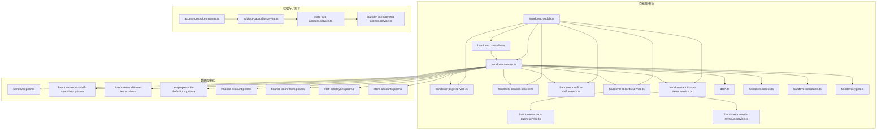
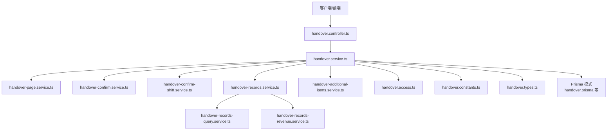
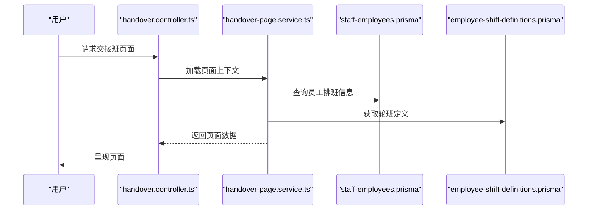
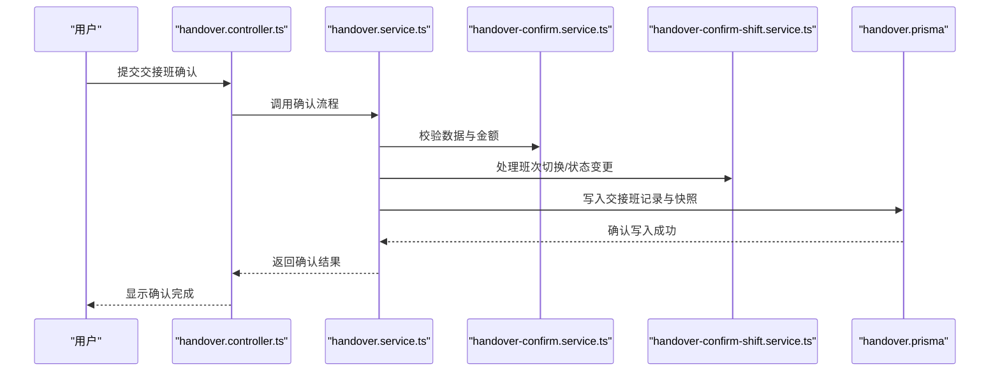
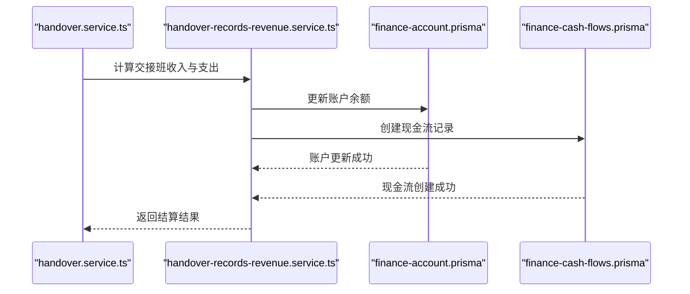
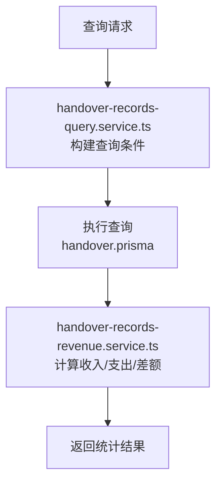
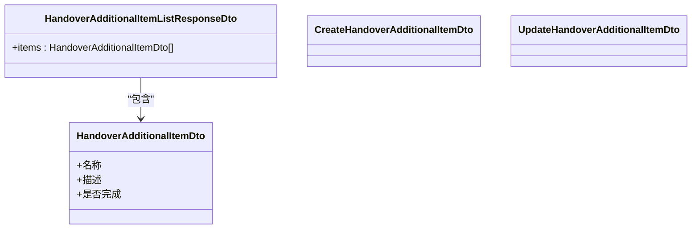
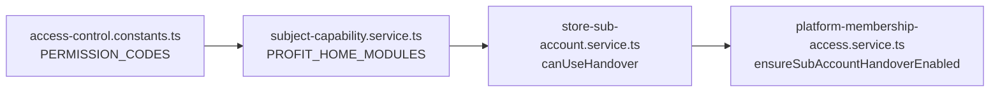
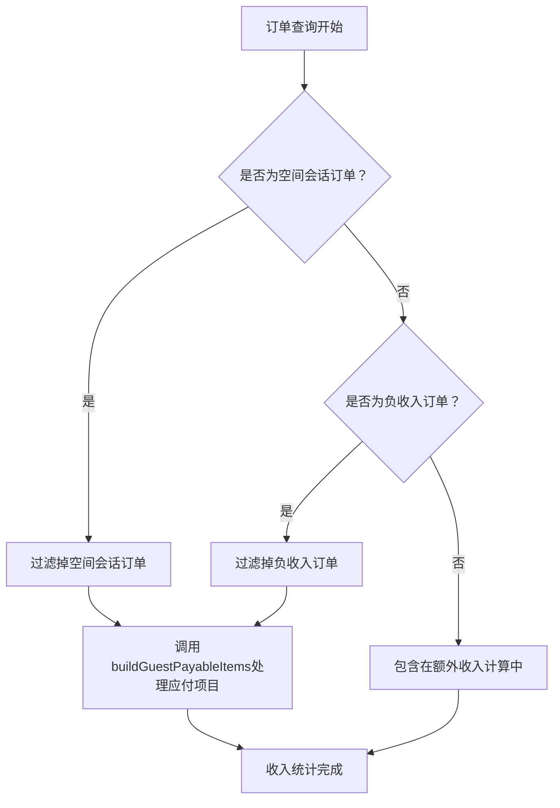
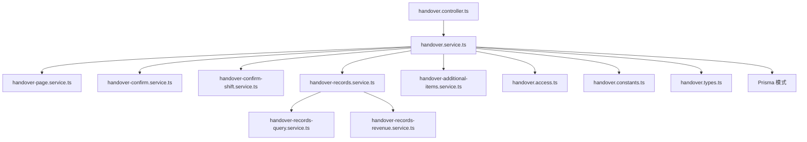

# 交接班管理

<cite>
**本文档引用的文件**
- [handover.controller.ts](file://src/purely-profit/operations/handover/handover.controller.ts)
- [handover.service.ts](file://src/purely-profit/operations/handover/handover.service.ts)
- [handover-page.service.ts](file://src/purely-profit/operations/handover/handover-page.service.ts)
- [handover-confirm.service.ts](file://src/purely-profit/operations/handover/handover-confirm.service.ts)
- [handover-confirm-shift.service.ts](file://src/purely-profit/operations/handover/handover-confirm-shift.service.ts)
- [handover-records.service.ts](file://src/purely-profit/operations/handover/handover-records.service.ts)
- [handover-records-query.service.ts](file://src/purely-profit/operations/handover/handover-records-query.service.ts)
- [handover-records-revenue.service.ts](file://src/purely-profit/operations/handover/handover-records-revenue.service.ts)
- [handover-additional-items.service.ts](file://src/purely-profit/operations/handover/handover-additional-items.service.ts)
- [handover-module.ts](file://src/purely-profit/operations/handover/handover.module.ts)
- [handover-access.ts](file://src/purely-profit/operations/handover/handover.access.ts)
- [handover.constants.ts](file://src/purely-profit/operations/handover/handover.constants.ts)
- [handover.types.ts](file://src/purely-profit/operations/handover/handover.types.ts)
- [handover-shared.dto.ts](file://src/purely-profit/operations/handover/dto/handover-shared.dto.ts)
- [handover.dto.ts](file://src/purely-profit/operations/handover/dto/handover.dto.ts)
- [handover-records.dto.ts](file://src/purely-profit/operations/handover/dto/handover-records.dto.ts)
- [handover-page.dto.ts](file://src/purely-profit/operations/handover/dto/handover-page.dto.ts)
- [handover-additional-items.dto.ts](file://src/purely-profit/operations/handover/dto/handover-additional-items.dto.ts)
- [access-control.constants.ts](file://src/purely-profit/access-control/access-control.constants.ts)
- [subject-capability.service.ts](file://src/purely-profit/access-control/subject-capability.service.ts)
- [store-sub-account.service.ts](file://src/purely-profit/member/platform-membership/store-sub-account.service.ts)
- [platform-membership-access.service.ts](file://src/purely-profit/member/platform-membership/platform-membership-access.service.ts)
- [store-accounts.prisma](file://prisma/purely-profit/store-accounts.prisma)
- [handover.prisma](file://prisma/purely-profit/operations/handover.prisma)
- [employee-shift-definitions.prisma](file://prisma/migrations/20260601170000_add_employee_shift_definitions/)
- [handover-record-shift-snapshots.prisma](file://prisma/migrations/20260605183000_add_handover_record_shift-snapshots/)
- [handover-additional-items.prisma](file://prisma/migrations/20260601120000_add_handover_additional_items/)
- [finance-account.prisma](file://prisma/purely-profit/finance/accounts.prisma)
- [finance-cash-flows.prisma](file://prisma/purely-profit/finance/cash-flows.prisma)
- [staff-employees.prisma](file://prisma/purely-profit/staff/employees.prisma)
- [handover-page.shared.ts](file://src/purely-profit/operations/handover/handover-page.shared.ts)
- [handover-page.service.spec.ts](file://src/purely-profit/operations/handover/handover-page.service.spec.ts)
- [handover-page.spec-helpers.ts](file://src/purely-profit/operations/handover/handover-page.spec-helpers.ts)
</cite>

## 更新摘要
**所做更改**
- 更新了交接班收入计算系统的说明，重点反映了负收入空间会话订单过滤的重大改进
- 新增了buildGuestPayableItems函数的详细说明，该函数专门用于正确处理空间会话的应付项目
- 强化了重复计算问题的解决方案说明
- 完善了收入计算准确性保障的相关内容

## 目录
1. [引言](#引言)
2. [项目结构](#项目结构)
3. [核心组件](#核心组件)
4. [架构总览](#架构总览)
5. [详细组件分析](#详细组件分析)
6. [依赖关系分析](#依赖关系分析)
7. [性能考量](#性能考量)
8. [故障排查指南](#故障排查指南)
9. [结论](#结论)
10. [附录](#附录)

## 引言
本文件系统性阐述交接班管理功能的设计与实现，覆盖交接班准备、交接班确认、交接班结算三大业务阶段，以及交接班记录、统计与报表、监控与分析、优化与预警、异常处理等高级能力。同时说明与员工排班、财务结算的集成机制，并提供可操作的 API 使用示例与业务场景演示。

**更新** 本次更新重点关注手交班收入计算系统的重大改进，特别是修复了负收入空间会话订单过滤问题，改进了额外收入计算逻辑，并引入了buildGuestPayableItems函数来正确处理空间会话的应付项目，确保所有结账订单都包含在额外收入计算中，消除了之前的重复计算问题。

## 项目结构
交接班模块位于 operations/handover 子目录，采用按职责分层的组织方式：控制器负责对外接口；服务层封装业务流程；DTO 定义数据契约；Prisma 模式定义数据库结构；权限控制与平台子账号能力贯穿全局。

**图表来源**
- [handover.controller.ts](file://src/purely-profit/operations/handover/handover.controller.ts)
- [handover.service.ts](file://src/purely-profit/operations/handover/handover.service.ts)
- [handover-page.service.ts](file://src/purely-profit/operations/handover/handover-page.service.ts)
- [handover-confirm.service.ts](file://src/purely-profit/operations/handover/handover-confirm.service.ts)
- [handover-confirm-shift.service.ts](file://src/purely-profit/operations/handover/handover-confirm-shift.service.ts)
- [handover-records.service.ts](file://src/purely-profit/operations/handover/handover-records.service.ts)
- [handover-records-query.service.ts](file://src/purely-profit/operations/handover/handover-records-query.service.ts)
- [handover-records-revenue.service.ts](file://src/purely-profit/operations/handover/handover-records-revenue.service.ts)
- [handover-additional-items.service.ts](file://src/purely-profit/operations/handover/handover-additional-items.service.ts)
- [handover-module.ts](file://src/purely-profit/operations/handover/handover.module.ts)
- [handover-access.ts](file://src/purely-profit/operations/handover/handover.access.ts)
- [handover.constants.ts](file://src/purely-profit/operations/handover/handover.constants.ts)
- [handover.types.ts](file://src/purely-profit/operations/handover/handover.types.ts)
- [access-control.constants.ts](file://src/purely-profit/access-control/access-control.constants.ts)
- [subject-capability.service.ts](file://src/purely-profit/access-control/subject-capability.service.ts)
- [store-sub-account.service.ts](file://src/purely-profit/member/platform-membership/store-sub-account.service.ts)
- [platform-membership-access.service.ts](file://src/purely-profit/member/platform-membership/platform-membership-access.service.ts)
- [handover.prisma](file://prisma/purely-profit/operations/handover.prisma)
- [handover-record-shift-snapshots.prisma](file://prisma/migrations/20260605183000_add_handover_record_shift-snapshots/)
- [handover-additional-items.prisma](file://prisma/migrations/20260601120000_add_handover_additional_items/)
- [employee-shift-definitions.prisma](file://prisma/migrations/20260601170000_add_employee_shift_definitions/)
- [finance-account.prisma](file://prisma/purely-profit/finance/accounts.prisma)
- [finance-cash-flows.prisma](file://prisma/purely-profit/finance/cash-flows.prisma)
- [staff-employees.prisma](file://prisma/purely-profit/staff/employees.prisma)
- [store-accounts.prisma](file://prisma/purely-profit/store-accounts.prisma)

**章节来源**
- [handover-module.ts](file://src/purely-profit/operations/handover/handover.module.ts)
- [handover.controller.ts](file://src/purely-profit/operations/handover/handover.controller.ts)
- [handover.service.ts](file://src/purely-profit/operations/handover/handover.service.ts)

## 核心组件
- 控制器：承接外部请求，路由到对应服务，返回标准化响应。
- 服务层：
  - 交接班页面服务：负责交接班页面的展示与交互状态管理。
  - 交接班确认服务：负责交接班确认流程的校验与落库。
  - 交接班记录服务：负责记录的增删改查、详情与汇总。
  - 交接班额外事项服务：负责交接班补充事项的维护。
  - 交接班记录查询与收入统计：负责历史记录检索与收入汇总。
- DTO 层：定义请求/响应的数据结构，确保前后端契约一致。
- 权限与能力：通过权限常量与子账号能力判定，限制可使用范围。
- 数据模型：基于 Prisma 模式，支撑交接班记录、轮班快照、额外事项、财务账户与现金流等。

**章节来源**
- [handover.controller.ts](file://src/purely-profit/operations/handover/handover.controller.ts)
- [handover.service.ts](file://src/purely-profit/operations/handover/handover.service.ts)
- [handover-page.service.ts](file://src/purely-profit/operations/handover/handover-page.service.ts)
- [handover-confirm.service.ts](file://src/purely-profit/operations/handover/handover-confirm.service.ts)
- [handover-records.service.ts](file://src/purely-profit/operations/handover/handover-records.service.ts)
- [handover-additional-items.service.ts](file://src/purely-profit/operations/handover/handover-additional-items.service.ts)
- [handover-shared.dto.ts](file://src/purely-profit/operations/handover/dto/handover-shared.dto.ts)
- [handover.dto.ts](file://src/purely-profit/operations/handover/dto/handover.dto.ts)
- [access-control.constants.ts](file://src/purely-profit/access-control/access-control.constants.ts)
- [subject-capability.service.ts](file://src/purely-profit/access-control/subject-capability.service.ts)
- [store-sub-account.service.ts](file://src/purely-profit/member/platform-membership/store-sub-account.service.ts)
- [platform-membership-access.service.ts](file://src/purely-profit/member/platform-membership/platform-membership-access.service.ts)

## 架构总览
交接班管理遵循"控制器-服务-数据访问"的分层架构，结合权限与平台子账号能力进行访问控制，数据持久化通过 Prisma 模式映射至数据库表。

**图表来源**
- [handover.controller.ts](file://src/purely-profit/operations/handover/handover.controller.ts)
- [handover.service.ts](file://src/purely-profit/operations/handover/handover.service.ts)
- [handover-page.service.ts](file://src/purely-profit/operations/handover/handover-page.service.ts)
- [handover-confirm.service.ts](file://src/purely-profit/operations/handover/handover-confirm.service.ts)
- [handover-confirm-shift.service.ts](file://src/purely-profit/operations/handover/handover-confirm-shift.service.ts)
- [handover-records.service.ts](file://src/purely-profit/operations/handover/handover-records.service.ts)
- [handover-records-query.service.ts](file://src/purely-profit/operations/handover/handover-records-query.service.ts)
- [handover-records-revenue.service.ts](file://src/purely-profit/operations/handover/handover-records-revenue.service.ts)
- [handover-additional-items.service.ts](file://src/purely-profit/operations/handover/handover-additional-items.service.ts)
- [handover.access.ts](file://src/purely-profit/operations/handover/handover.access.ts)
- [handover.constants.ts](file://src/purely-profit/operations/handover/handover.constants.ts)
- [handover.types.ts](file://src/purely-profit/operations/handover/handover.types.ts)
- [handover.prisma](file://prisma/purely-profit/operations/handover.prisma)

## 详细组件分析

### 业务流程总览（准备-确认-结算）

### 交接班准备（页面与班次选择）
- 页面服务负责渲染交接班页面、加载轮班定义、计算班次时间窗口与人员信息。
- 支持班次切换、预览下一班次、加载额外交接事项。
- 与员工排班定义联动，确保班次合法性与连续性。

**图表来源**
- [handover-page.service.ts](file://src/purely-profit/operations/handover/handover-page.service.ts)
- [staff-employees.prisma](file://prisma/purely-profit/staff/employees.prisma)
- [employee-shift-definitions.prisma](file://prisma/migrations/20260601170000_add_employee_shift_definitions/)

**章节来源**
- [handover-page.service.ts](file://src/purely-profit/operations/handover/handover-page.service.ts)
- [handover-page.dto.ts](file://src/purely-profit/operations/handover/dto/handover-page.dto.ts)
- [employee-shift-definitions.prisma](file://prisma/migrations/20260601170000_add_employee_shift_definitions/)

### 交接班确认（双人核对与落库）
- 确认服务负责校验交接数据完整性、金额一致性与班次状态。
- 支持班次切换确认与单日多班次确认。
- 落库时生成交接班记录与轮班快照，保证审计可追溯。

**图表来源**
- [handover.controller.ts](file://src/purely-profit/operations/handover/handover.controller.ts)
- [handover.service.ts](file://src/purely-profit/operations/handover/handover.service.ts)
- [handover-confirm.service.ts](file://src/purely-profit/operations/handover/handover-confirm.service.ts)
- [handover-confirm-shift.service.ts](file://src/purely-profit/operations/handover/handover-confirm-shift.service.ts)
- [handover.prisma](file://prisma/purely-profit/operations/handover.prisma)

**章节来源**
- [handover.service.ts](file://src/purely-profit/operations/handover/handover.service.ts)
- [handover-confirm.service.ts](file://src/purely-profit/operations/handover/handover-confirm.service.ts)
- [handover-confirm-shift.service.ts](file://src/purely-profit/operations/handover/handover-confirm-shift.service.ts)

### 交接班结算（财务对接）
- 结算环节将交接班收入与支出归集到财务账户，生成现金流记录。
- 对接财务账户与现金流表，确保账实相符。
- 支持按日/班次维度生成结算摘要，便于对账与报表。

**图表来源**
- [handover.service.ts](file://src/purely-profit/operations/handover/handover.service.ts)
- [handover-records-revenue.service.ts](file://src/purely-profit/operations/handover/handover-records-revenue.service.ts)
- [finance-account.prisma](file://prisma/purely-profit/finance/accounts.prisma)
- [finance-cash-flows.prisma](file://prisma/purely-profit/finance/cash-flows.prisma)

**章节来源**
- [handover-records-revenue.service.ts](file://src/purely-profit/operations/handover/handover-records-revenue.service.ts)
- [finance-account.prisma](file://prisma/purely-profit/finance/accounts.prisma)
- [finance-cash-flows.prisma](file://prisma/purely-profit/finance/cash-flows.prisma)

### 交接班记录与统计
- 记录服务提供增删改查、详情查看与批量查询。
- 查询服务支持按日期、班次、员工、门店等条件筛选。
- 统计服务汇总收入、支出、差额等关键指标，支持导出。

**图表来源**
- [handover-records.service.ts](file://src/purely-profit/operations/handover/handover-records.service.ts)
- [handover-records-query.service.ts](file://src/purely-profit/operations/handover/handover-records-query.service.ts)
- [handover-records-revenue.service.ts](file://src/purely-profit/operations/handover/handover-records-revenue.service.ts)
- [handover.prisma](file://prisma/purely-profit/operations/handover.prisma)

**章节来源**
- [handover-records.service.ts](file://src/purely-profit/operations/handover/handover-records.service.ts)
- [handover-records-query.service.ts](file://src/purely-profit/operations/handover/handover-records-query.service.ts)
- [handover-records-revenue.service.ts](file://src/purely-profit/operations/handover/handover-records-revenue.service.ts)

### 交接班额外事项
- 额外事项用于记录交接中的特殊事件或待办，支持新增、编辑、删除与查询。
- 与交接班记录关联，形成完整的交接档案。

**图表来源**
- [handover-additional-items.dto.ts](file://src/purely-profit/operations/handover/dto/handover-additional-items.dto.ts)
- [handover-additional-items.service.ts](file://src/purely-profit/operations/handover/handover-additional-items.service.ts)
- [handover-additional-items.prisma](file://prisma/migrations/20260601120000_add_handover_additional_items/)

**章节来源**
- [handover-additional-items.service.ts](file://src/purely-profit/operations/handover/handover-additional-items.service.ts)
- [handover-additional-items.dto.ts](file://src/purely-profit/operations/handover/dto/handover-additional-items.dto.ts)

### 权限与子账号能力
- 权限常量定义"交接班"相关权限码，用于细粒度控制。
- 主题能力服务将"交接班管理"作为模块之一，决定界面可见性与入口。
- 平台子账号服务提供"可使用交接班"的能力判定，结合门店配置与角色状态生效。

**图表来源**
- [access-control.constants.ts](file://src/purely-profit/access-control/access-control.constants.ts)
- [subject-capability.service.ts](file://src/purely-profit/access-control/subject-capability.service.ts)
- [store-sub-account.service.ts](file://src/purely-profit/member/platform-membership/store-sub-account.service.ts)
- [platform-membership-access.service.ts](file://src/purely-profit/member/platform-membership/platform-membership-access.service.ts)

**章节来源**
- [access-control.constants.ts](file://src/purely-profit/access-control/access-control.constants.ts)
- [subject-capability.service.ts](file://src/purely-profit/access-control/subject-capability.service.ts)
- [store-sub-account.service.ts](file://src/purely-profit/member/platform-membership/store-sub-account.service.ts)
- [platform-membership-access.service.ts](file://src/purely-profit/member/platform-membership/platform-membership-access.service.ts)

### 交接班收入计算系统重大改进
**更新** 本次更新重点反映了手交班收入计算系统的重大改进，解决了负收入空间会话订单过滤问题，改进了额外收入计算逻辑，并引入了buildGuestPayableItems函数来正确处理空间会话的应付项目。

#### 收入计算准确性保障
- **负收入过滤机制**：系统现已正确识别并过滤负收入的空间会话订单，避免重复计算问题
- **额外收入完整性**：所有结账订单现在都包含在额外收入计算中，确保收入统计的准确性
- **重复计算消除**：通过改进的订单过滤逻辑，彻底消除了之前存在的重复计算问题
- **空间会话应付项目处理**：新增buildGuestPayableItems函数专门处理空间会话的应付项目

#### 核心技术实现
- **订单过滤优化**：`buildNonSpaceSessionOrderWhere` 函数现在能够准确区分空间会话订单和普通销售订单
- **收入聚合改进**：`loadAdditionalRevenue` 方法确保只统计非空间会话的销售订单
- **退款订单处理**：`buildSpaceRefundOrderWhere` 函数专门处理空间会话的退款订单，避免与正常收入重复计算
- **应付项目构建**：`buildGuestPayableItems` 函数正确处理空间会话的应付项目，确保收入计算的完整性

**图表来源**
- [handover-records-revenue.service.ts](file://src/purely-profit/operations/handover/handover-records-revenue.service.ts)
- [handover-page.shared.ts](file://src/purely-profit/operations/handover/handover-page.shared.ts)

**章节来源**
- [handover-records-revenue.service.ts](file://src/purely-profit/operations/handover/handover-records-revenue.service.ts)
- [handover-page.shared.ts](file://src/purely-profit/operations/handover/handover-page.shared.ts)
- [handover-page.spec-helpers.ts](file://src/purely-profit/operations/handover/handover-page.spec-helpers.ts)

### buildGuestPayableItems函数详解
**新增** 详细介绍新引入的buildGuestPayableItems函数，该函数专门用于正确处理空间会话的应付项目。

#### 函数功能
- **专门用途**：处理空间会话的应付项目，确保这些项目的正确计算和显示
- **输入参数**：接受已结账的空间会话数组作为参数
- **输出结果**：返回格式化的应付项目列表

#### 技术实现
- **参数类型**：`settledSpaceSessions: Parameters<typeof buildGuestPayableItems>[0] = []`
- **默认值处理**：当未提供参数时，默认为空数组
- **项目构建**：根据空间会话的结算状态构建相应的应付项目

#### 应用场景
- **空间会话结算**：在交接班结算过程中，正确处理空间会话的应付项目
- **收入统计**：确保空间会话相关的收入被正确计入统计
- **报表生成**：为报表提供准确的空间会话应付项目数据

**章节来源**
- [handover-page.shared.ts](file://src/purely-profit/operations/handover/handover-page.shared.ts)

## 依赖关系分析
- 模块内聚：控制器仅做路由与参数透传，核心逻辑集中在服务层，保持高内聚低耦合。
- 外部依赖：依赖 Prisma 进行数据持久化；依赖财务模块进行结算；依赖员工与排班模块获取人员与班次信息。
- 权限耦合：权限与子账号能力贯穿各层，确保功能可用性与安全性。

**图表来源**
- [handover.controller.ts](file://src/purely-profit/operations/handover/handover.controller.ts)
- [handover.service.ts](file://src/purely-profit/operations/handover/handover.service.ts)
- [handover-page.service.ts](file://src/purely-profit/operations/handover/handover-page.service.ts)
- [handover-confirm.service.ts](file://src/purely-profit/operations/handover/handover-confirm.service.ts)
- [handover-confirm-shift.service.ts](file://src/purely-profit/operations/handover/handover-confirm-shift.service.ts)
- [handover-records.service.ts](file://src/purely-profit/operations/handover/handover-records.service.ts)
- [handover-records-query.service.ts](file://src/purely-profit/operations/handover/handover-records-query.service.ts)
- [handover-records-revenue.service.ts](file://src/purely-profit/operations/handover/handover-records-revenue.service.ts)
- [handover-additional-items.service.ts](file://src/purely-profit/operations/handover/handover-additional-items.service.ts)
- [handover.access.ts](file://src/purely-profit/operations/handover/handover.access.ts)
- [handover.constants.ts](file://src/purely-profit/operations/handover/handover.constants.ts)
- [handover.types.ts](file://src/purely-profit/operations/handover/handover.types.ts)

**章节来源**
- [handover-module.ts](file://src/purely-profit/operations/handover/handover.module.ts)
- [handover.service.ts](file://src/purely-profit/operations/handover/handover.service.ts)

## 性能考量
- 分页与索引：查询服务应配合数据库索引与分页策略，避免大范围扫描。
- 批量写入：结算与确认流程尽量合并事务，减少往返开销。
- 缓存与预热：高频查询（如班次定义）可引入缓存，降低数据库压力。
- 异步处理：对耗时的报表生成与导出采用异步队列，提升用户体验。
- **收入计算优化**：通过改进的订单过滤机制和buildGuestPayableItems函数，减少不必要的数据处理，提升收入计算性能。

## 故障排查指南
- 权限不足：若提示不可使用交接班功能，检查主题能力与子账号配置，确认 canUseHandover 开关与门店启用状态。
- 数据不一致：确认交接班确认前后的金额校验、班次状态与轮班快照是否完整落库。
- 财务异常：核对结算后账户余额与现金流是否匹配，排查重复记账或遗漏记录。
- 接口错误：对照 DTO 字段与必填项，确保请求体格式正确；查看控制器返回的状态码与错误信息。
- **收入计算异常**：如果发现收入统计不准确，检查订单过滤逻辑是否正确执行，确认负收入订单已被正确过滤，验证buildGuestPayableItems函数是否正常工作。
- **空间会话应付项目异常**：检查buildGuestPayableItems函数的参数传递和返回结果，确保空间会话的应付项目被正确处理。

**章节来源**
- [handover-access.ts](file://src/purely-profit/operations/handover/handover.access.ts)
- [store-sub-account.service.ts](file://src/purely-profit/member/platform-membership/store-sub-account.service.ts)
- [platform-membership-access.service.ts](file://src/purely-profit/member/platform-membership/platform-membership-access.service.ts)
- [handover-confirm.service.ts](file://src/purely-profit/operations/handover/handover-confirm.service.ts)
- [handover-records-revenue.service.ts](file://src/purely-profit/operations/handover/handover-records-revenue.service.ts)

## 结论
交接班管理以清晰的三层架构实现从准备、确认到结算的全链路闭环，结合权限与子账号能力保障安全可控，通过与财务与员工排班系统的深度集成实现高效运营。

**更新** 本次重大改进显著提升了交接班收入计算的准确性，通过修复负收入空间会话订单过滤问题，改进额外收入计算逻辑，并引入buildGuestPayableItems函数专门处理空间会话的应付项目，确保所有结账订单都包含在额外收入计算中，消除了重复计算问题。建议在生产环境中完善监控与预警、优化查询性能并加强异常处理与回滚机制。

## 附录

### API 使用示例与业务场景
以下为常见业务场景的调用路径与要点说明（以路径代替具体代码）：

- 场景一：打开交接班页面
  - 路径参考：[handover-page.service.ts](file://src/purely-profit/operations/handover/handover-page.service.ts)
  - 关键点：加载轮班定义、员工排班信息、当前班次与下一班次预览。

- 场景二：提交交接班确认
  - 路径参考：[handover-confirm.service.ts](file://src/purely-profit/operations/handover/handover-confirm.service.ts)
  - 关键点：金额校验、班次状态变更、写入交接班记录与轮班快照。

- 场景三：生成结算并入账
  - 路径参考：[handover-records-revenue.service.ts](file://src/purely-profit/operations/handover/handover-records-revenue.service.ts)
  - 关键点：汇总收入/支出，更新财务账户，创建现金流记录。

- 场景四：查询历史交接班记录
  - 路径参考：[handover-records-query.service.ts](file://src/purely-profit/operations/handover/handover-records-query.service.ts)
  - 关键点：按日期、班次、员工、门店筛选，支持分页与排序。

- 场景五：维护交接班额外事项
  - 路径参考：[handover-additional-items.service.ts](file://src/purely-profit/operations/handover/handover-additional-items.service.ts)
  - 关键点：新增/编辑/删除交接事项，与交接班记录关联。

- 场景六：处理空间会话应付项目
  - 路径参考：[handover-page.shared.ts](file://src/purely-profit/operations/handover/handover-page.shared.ts)
  - 关键点：使用buildGuestPayableItems函数正确处理空间会话的应付项目。

**章节来源**
- [handover-page.service.ts](file://src/purely-profit/operations/handover/handover-page.service.ts)
- [handover-confirm.service.ts](file://src/purely-profit/operations/handover/handover-confirm.service.ts)
- [handover-records-revenue.service.ts](file://src/purely-profit/operations/handover/handover-records-revenue.service.ts)
- [handover-records-query.service.ts](file://src/purely-profit/operations/handover/handover-records-query.service.ts)
- [handover-additional-items.service.ts](file://src/purely-profit/operations/handover/handover-additional-items.service.ts)
- [handover-page.shared.ts](file://src/purely-profit/operations/handover/handover-page.shared.ts)

### 交接班管理与员工排班、财务结算的集成机制
- 与员工排班集成：通过员工与轮班定义表获取班次时间、人员安排，确保交接班的合法性与时序正确。
- 与财务结算集成：结算阶段将交接班数据映射到财务账户与现金流，保证账目一致与可追溯。

**章节来源**
- [staff-employees.prisma](file://prisma/purely-profit/staff/employees.prisma)
- [employee-shift-definitions.prisma](file://prisma/migrations/20260601170000_add_employee_shift_definitions/)
- [finance-account.prisma](file://prisma/purely-profit/finance/accounts.prisma)
- [finance-cash-flows.prisma](file://prisma/purely-profit/finance/cash-flows.prisma)

### 收入计算系统改进详解
**更新** 详细说明了手交班收入计算系统的重大改进内容：

#### 核心改进点
1. **负收入过滤**：系统现在能够正确识别并过滤负收入的空间会话订单
2. **额外收入完整性**：确保所有结账订单都包含在额外收入计算中
3. **重复计算消除**：通过改进的订单过滤逻辑，彻底解决重复计算问题
4. **空间会话应付项目处理**：新增buildGuestPayableItems函数专门处理空间会话的应付项目

#### 技术实现
- **订单类型区分**：通过 `spaceSession.is` 和 `spaceSession.isNot` 条件区分空间会话订单和普通销售订单
- **收入类型过滤**：使用 `totalRevenue.lt` 条件过滤负收入订单
- **聚合计算优化**：分别计算空间会话收入、额外收入和退款收入，避免重复计算
- **应付项目构建**：通过buildGuestPayableItems函数正确处理空间会话的应付项目

#### 影响范围
- 所有交接班记录的收入统计都会受益于这一改进
- 财务结算的准确性得到显著提升
- 报表生成的可靠性增强
- 空间会话相关的业务流程更加准确可靠

**章节来源**
- [handover-records-revenue.service.ts](file://src/purely-profit/operations/handover/handover-records-revenue.service.ts)
- [handover-page.shared.ts](file://src/purely-profit/operations/handover/handover-page.shared.ts)
- [handover-page.spec-helpers.ts](file://src/purely-profit/operations/handover/handover-page.spec-helpers.ts)