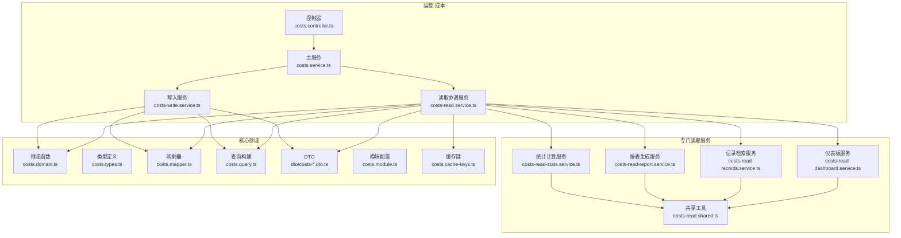
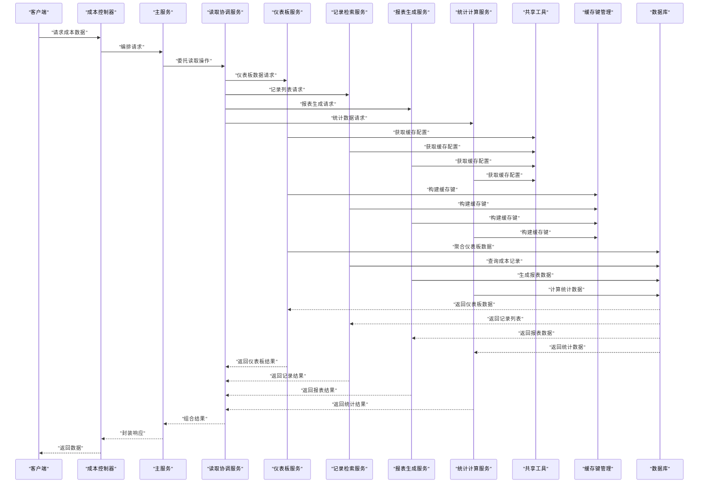
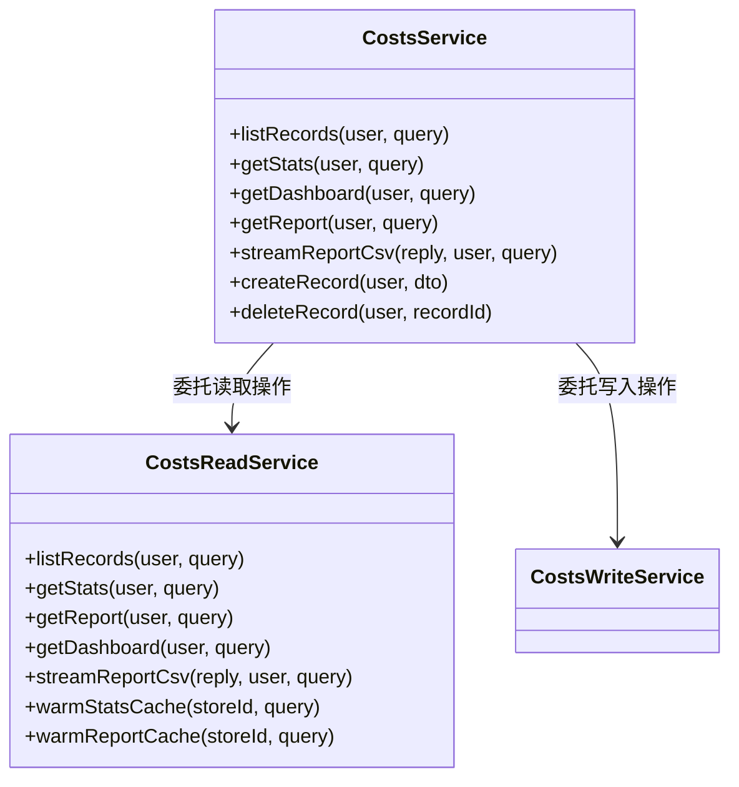
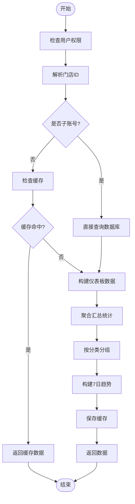
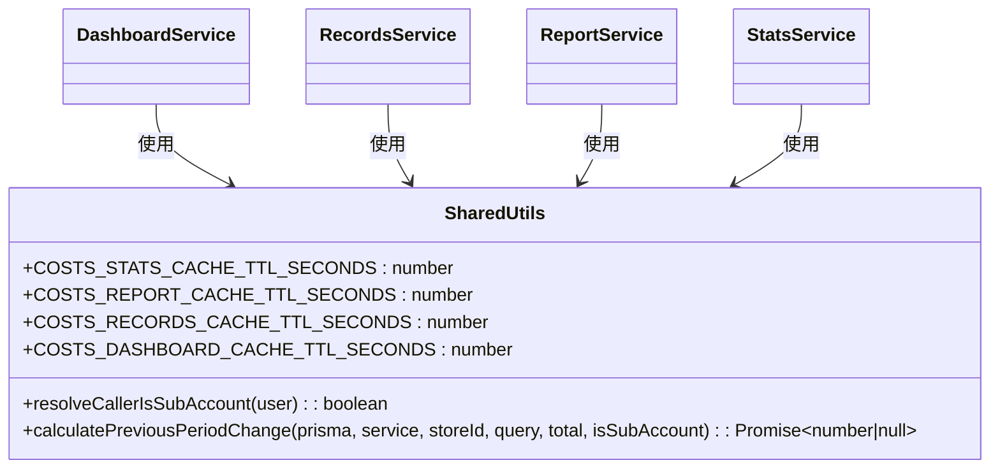
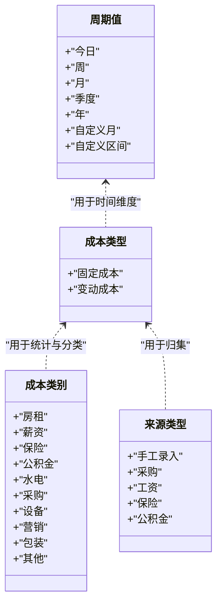
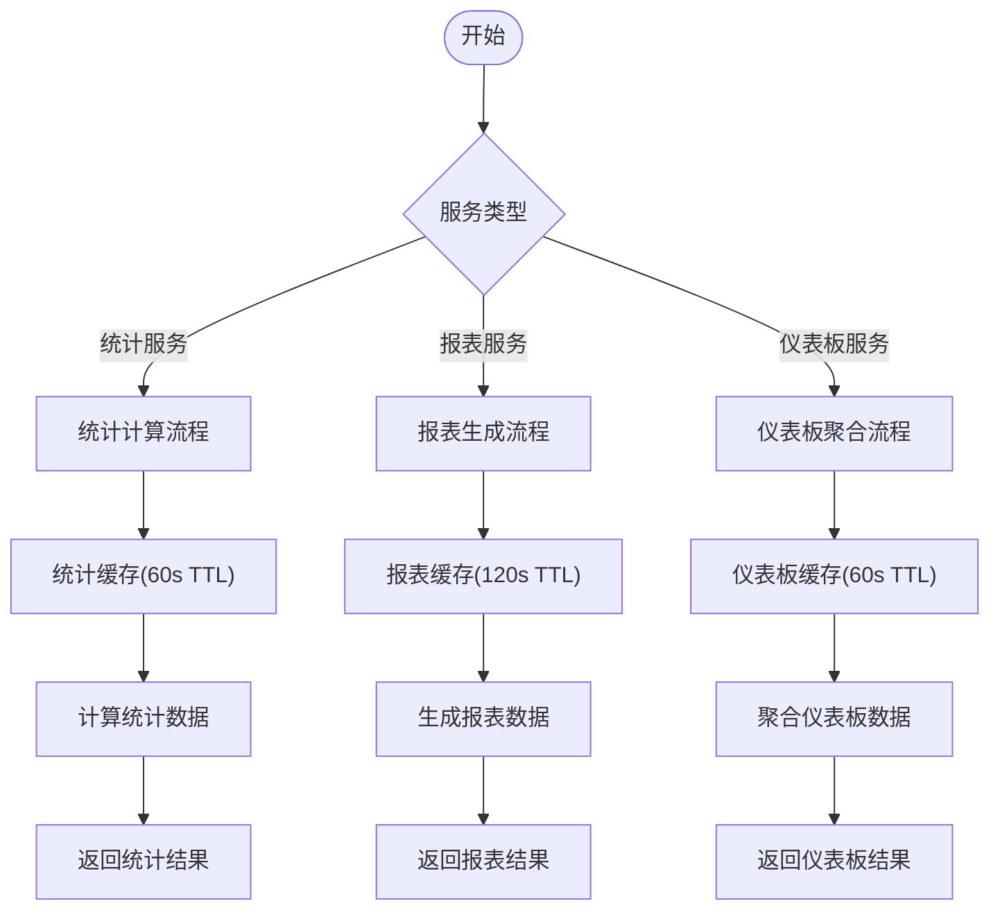
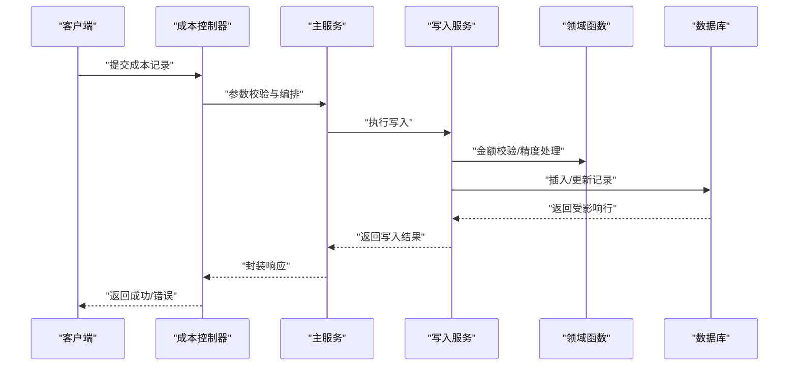
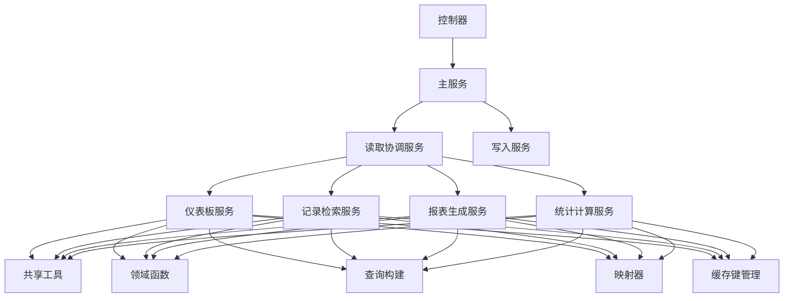

# 成本管理

<cite>
**本文引用的文件**
- [costs.controller.ts](file://src/purely-profit/operations/costs/costs.controller.ts)
- [costs.service.ts](file://src/purely-profit/operations/costs/costs.service.ts)
- [costs-read.service.ts](file://src/purely-profit/operations/costs/costs-read.service.ts)
- [costs-write.service.ts](file://src/purely-profit/operations/costs/costs-write.service.ts)
- [costs-read-dashboard.service.ts](file://src/purely-profit/operations/costs/costs-read-dashboard.service.ts)
- [costs-read-records.service.ts](file://src/purely-profit/operations/costs/costs-read-records.service.ts)
- [costs-read-report.service.ts](file://src/purely-profit/operations/costs/costs-read-report.service.ts)
- [costs-read-stats.service.ts](file://src/purely-profit/operations/costs/costs-read-stats.service.ts)
- [costs-read.shared.ts](file://src/purely-profit/operations/costs/costs-read.shared.ts)
- [costs.domain.ts](file://src/purely-profit/operations/costs/costs.domain.ts)
- [costs.types.ts](file://src/purely-profit/operations/costs/costs.types.ts)
- [costs.query.ts](file://src/purely-profit/operations/costs/costs.query.ts)
- [costs.mapper.ts](file://src/purely-profit/operations/costs/costs.mapper.ts)
- [costs.module.ts](file://src/purely-profit/operations/costs/costs.module.ts)
- [costs-response.dto.ts](file://src/purely-profit/operations/costs/dto/costs-response.dto.ts)
- [costs-query.dto.ts](file://src/purely-profit/operations/costs/dto/costs-query.dto.ts)
- [costs.cache-keys.ts](file://src/redis/keys/costs.cache-keys.ts)
</cite>

## 更新摘要
**变更内容**
- 成本读取服务进行了重大重构，从单一服务拆分为四个专门服务：仪表板数据聚合、记录检索、报表生成和统计计算
- 主服务从524行减少到更专注的实现，大幅提升了代码组织性
- 新增共享实用程序模块来包含跨服务使用的通用逻辑
- 每个专门服务都具备独立的缓存策略和性能优化
- 改进查询构建器，增强历史窗口处理和权限控制
- 优化映射逻辑，提升金额精度和数据处理效率
- 增强报告生成能力，支持流式CSV导出和更好的分页处理
- 优化缓存键结构，提高缓存命中率和管理效率

## 目录
1. [简介](#简介)
2. [项目结构](#项目结构)
3. [核心组件](#核心组件)
4. [架构总览](#架构总览)
5. [详细组件分析](#详细组件分析)
6. [依赖分析](#依赖分析)
7. [性能考虑](#性能考虑)
8. [故障排查指南](#故障排查指南)
9. [结论](#结论)
10. [附录](#附录)

## 简介
本文件系统性阐述成本管理功能的设计与实现，覆盖成本核算、成本分类、成本控制、成本归集、成本分配、成本分析、成本预算、成本预警、成本报表、成本优化、成本预测与成本异常处理等关键能力。经过重大重构后，系统采用更加精细化的服务拆分架构，将原本集中的成本读取逻辑拆分为四个专门的服务模块，每个模块专注于特定业务场景，显著提升了代码的可维护性和性能表现。

## 项目结构
成本管理位于"operations"子域下，采用按功能分层的模块化组织。经过重构后，成本读取服务被拆分为四个专门的服务：仪表板数据聚合服务、记录检索服务、报表生成服务和统计计算服务。同时新增了共享实用程序模块来包含跨服务使用的通用逻辑。

**图表来源**
- [costs.controller.ts](file://src/purely-profit/operations/costs/costs.controller.ts)
- [costs.service.ts](file://src/purely-profit/operations/costs/costs.service.ts)
- [costs-read.service.ts](file://src/purely-profit/operations/costs/costs-read.service.ts)
- [costs-read-dashboard.service.ts](file://src/purely-profit/operations/costs/costs-read-dashboard.service.ts)
- [costs-read-records.service.ts](file://src/purely-profit/operations/costs/costs-read-records.service.ts)
- [costs-read-report.service.ts](file://src/purely-profit/operations/costs/costs-read-report.service.ts)
- [costs-read-stats.service.ts](file://src/purely-profit/operations/costs/costs-read-stats.service.ts)
- [costs-read.shared.ts](file://src/purely-profit/operations/costs/costs-read.shared.ts)
- [costs.cache-keys.ts](file://src/redis/keys/costs.cache-keys.ts)

**章节来源**
- [costs.controller.ts](file://src/purely-profit/operations/costs/costs.controller.ts)
- [costs.service.ts](file://src/purely-profit/operations/costs/costs.service.ts)
- [costs-read.service.ts](file://src/purely-profit/operations/costs/costs-read.service.ts)
- [costs-read-dashboard.service.ts](file://src/purely-profit/operations/costs/costs-read-dashboard.service.ts)
- [costs-read-records.service.ts](file://src/purely-profit/operations/costs/costs-read-records.service.ts)
- [costs-read-report.service.ts](file://src/purely-profit/operations/costs/costs-read-report.service.ts)
- [costs-read-stats.service.ts](file://src/purely-profit/operations/costs/costs-read-stats.service.ts)
- [costs-read.shared.ts](file://src/purely-profit/operations/costs/costs-read.shared.ts)
- [costs.cache-keys.ts](file://src/redis/keys/costs.cache-keys.ts)

## 核心组件
- **控制器**：暴露成本查询、统计、报表等HTTP接口，负责参数校验与响应封装。
- **主服务**：简化后的编排层，协调各个专门服务完成业务逻辑。
- **读取协调服务**：作为读取操作的统一入口，委托给专门的读取服务。
- **仪表板数据聚合服务**：专门处理仪表盘数据的聚合计算，包括汇总、分类和趋势分析。
- **记录检索服务**：专注于成本记录的列表查询和分页处理。
- **报表生成服务**：负责复杂报表的生成和数据导出功能。
- **统计计算服务**：处理成本统计数据计算和同比分析。
- **写入服务**：负责成本记录的创建、更新、删除与一致性校验。
- **共享工具模块**：提供跨服务使用的通用逻辑，如缓存TTL配置、调用者身份解析等。
- **领域函数**：提供金额求和、同比计算、日期范围构建等纯函数。
- **类型与DTO**：统一成本周期、类型、类别、来源类型、过滤器与查询/响应结构。
- **查询与映射**：构建Prisma查询条件、聚合与映射为前端可用结构。
- **缓存键管理**：统一管理各类成本数据的Redis缓存键结构。

**章节来源**
- [costs.controller.ts](file://src/purely-profit/operations/costs/costs.controller.ts)
- [costs.service.ts](file://src/purely-profit/operations/costs/costs.service.ts)
- [costs-read.service.ts](file://src/purely-profit/operations/costs/costs-read.service.ts)
- [costs-read-dashboard.service.ts](file://src/purely-profit/operations/costs/costs-read-dashboard.service.ts)
- [costs-read-records.service.ts](file://src/purely-profit/operations/costs/costs-read-records.service.ts)
- [costs-read-report.service.ts](file://src/purely-profit/operations/costs/costs-read-report.service.ts)
- [costs-read-stats.service.ts](file://src/purely-profit/operations/costs/costs-read-stats.service.ts)
- [costs-read.shared.ts](file://src/purely-profit/operations/costs/costs-read.shared.ts)
- [costs.cache-keys.ts](file://src/redis/keys/costs.cache-keys.ts)

## 架构总览
成本管理遵循"控制器-服务-专门服务-领域-查询"的分层架构，通过类型与DTO确保输入输出一致，通过映射器将数据库实体转换为业务视图。重构后的架构将读取操作进一步细分为四个专门的服务，每个服务都有独立的缓存策略和性能优化。

**图表来源**
- [costs.controller.ts](file://src/purely-profit/operations/costs/costs.controller.ts)
- [costs.service.ts](file://src/purely-profit/operations/costs/costs.service.ts)
- [costs-read.service.ts](file://src/purely-profit/operations/costs/costs-read.service.ts)
- [costs-read-dashboard.service.ts](file://src/purely-profit/operations/costs/costs-read-dashboard.service.ts)
- [costs-read-records.service.ts](file://src/purely-profit/operations/costs/costs-read-records.service.ts)
- [costs-read-report.service.ts](file://src/purely-profit/operations/costs/costs-read-report.service.ts)
- [costs-read-stats.service.ts](file://src/purely-profit/operations/costs/costs-read-stats.service.ts)
- [costs-read.shared.ts](file://src/purely-profit/operations/costs/costs-read.shared.ts)
- [costs.cache-keys.ts](file://src/redis/keys/costs.cache-keys.ts)

## 详细组件分析

### 重构后的服务架构

#### 主服务（简化版）
重构后的主服务从原来的524行精简到104行，主要负责方法转发和业务编排，不再包含具体的业务逻辑。

**图表来源**
- [costs.service.ts](file://src/purely-profit/operations/costs/costs.service.ts)
- [costs-read.service.ts](file://src/purely-profit/operations/costs/costs-read.service.ts)

#### 专门读取服务

##### 仪表板数据聚合服务
专门处理仪表盘数据的聚合计算，包括汇总统计、分类分析和近7日趋势数据。

**图表来源**
- [costs-read-dashboard.service.ts](file://src/purely-profit/operations/costs/costs-read-dashboard.service.ts)

##### 记录检索服务
专注于成本记录的列表查询和分页处理，支持多种筛选条件和排序选项。

##### 报表生成服务
负责复杂报表的生成和数据导出功能，支持JSON和CSV格式导出。

##### 统计计算服务
处理成本统计数据计算和同比分析，包括固定成本、变动成本和总成本的计算。

#### 共享实用程序模块
新增的共享模块包含跨服务使用的通用逻辑：

**图表来源**
- [costs-read.shared.ts](file://src/purely-profit/operations/costs/costs-read.shared.ts)
- [costs-read-dashboard.service.ts](file://src/purely-profit/operations/costs/costs-read-dashboard.service.ts)
- [costs-read-records.service.ts](file://src/purely-profit/operations/costs/costs-read-records.service.ts)
- [costs-read-report.service.ts](file://src/purely-profit/operations/costs/costs-read-report.service.ts)
- [costs-read-stats.service.ts](file://src/purely-profit/operations/costs/costs-read-stats.service.ts)

**章节来源**
- [costs.service.ts](file://src/purely-profit/operations/costs/costs.service.ts)
- [costs-read.service.ts](file://src/purely-profit/operations/costs/costs-read.service.ts)
- [costs-read-dashboard.service.ts](file://src/purely-profit/operations/costs/costs-read-dashboard.service.ts)
- [costs-read-records.service.ts](file://src/purely-profit/operations/costs/costs-read-records.service.ts)
- [costs-read-report.service.ts](file://src/purely-profit/operations/costs/costs-read-report.service.ts)
- [costs-read-stats.service.ts](file://src/purely-profit/operations/costs/costs-read-stats.service.ts)
- [costs-read.shared.ts](file://src/purely-profit/operations/costs/costs-read.shared.ts)

### 成本类型与枚举
- **周期值**：支持今日、周、月、季度、年、自定义月、自定义区间等。
- **成本类型**：固定成本与变动成本两类。
- **成本类别**：房租、薪资、保险、公积金、水电、采购、设备、营销、包装、其他等。
- **成本来源类型**：手工录入、采购、工资、保险、公积金等。
- **过滤器**：支持全部与具体类别的筛选。

**图表来源**
- [costs.types.ts](file://src/purely-profit/operations/costs/costs.types.ts)

**章节来源**
- [costs.types.ts](file://src/purely-profit/operations/costs/costs.types.ts)

### 成本统计与报表（重构后）
重构后的统计与报表功能分布在专门的服務中：

#### 统计计算服务
- **统计摘要**：总成本、固定成本、变动成本、记录数、与上一周期对比百分比。
- **缓存策略**：60秒TTL，15秒刷新间隔。
- **子账号优化**：子账号直接查库，不走缓存。

#### 报表生成服务
- **分类汇总**：按类别聚合成本占比与绝对值。
- **明细行**：支持按类别过滤的成本明细，含人工成本行。
- **导出功能**：支持JSON和CSV格式导出。
- **缓存策略**：120秒TTL，30秒刷新间隔。

#### 仪表板聚合服务
- **趋势分析**：近7日成本趋势数据。
- **分类可视化**：按类别聚合的数据用于图表展示。
- **实时性**：针对仪表板场景优化的缓存策略。

**图表来源**
- [costs-read-stats.service.ts](file://src/purely-profit/operations/costs/costs-read-stats.service.ts)
- [costs-read-report.service.ts](file://src/purely-profit/operations/costs/costs-read-report.service.ts)
- [costs-read-dashboard.service.ts](file://src/purely-profit/operations/costs/costs-read-dashboard.service.ts)
- [costs-read.shared.ts](file://src/purely-profit/operations/costs/costs-read.shared.ts)

**章节来源**
- [costs-read-stats.service.ts](file://src/purely-profit/operations/costs/costs-read-stats.service.ts)
- [costs-read-report.service.ts](file://src/purely-profit/operations/costs/costs-read-report.service.ts)
- [costs-read-dashboard.service.ts](file://src/purely-profit/operations/costs/costs-read-dashboard.service.ts)
- [costs-read.shared.ts](file://src/purely-profit/operations/costs/costs-read.shared.ts)

### 成本写入与一致性（写入服务）
- **创建/更新/删除**：提供成本记录的增删改能力，确保金额精度与类型一致性。
- **数据校验**：校验周期、类型、类别、来源类型与金额范围。
- **事务与幂等**：建议在批量导入或外部同步时使用事务，避免重复写入。

**图表来源**
- [costs.controller.ts](file://src/purely-profit/operations/costs/costs.controller.ts)
- [costs.service.ts](file://src/purely-profit/operations/costs/costs.service.ts)
- [costs-write.service.ts](file://src/purely-profit/operations/costs/costs-write.service.ts)
- [costs.domain.ts](file://src/purely-profit/operations/costs/costs.domain.ts)

**章节来源**
- [costs.controller.ts](file://src/purely-profit/operations/costs/costs.controller.ts)
- [costs.service.ts](file://src/purely-profit/operations/costs/costs.service.ts)
- [costs-write.service.ts](file://src/purely-profit/operations/costs/costs-write.service.ts)
- [costs.domain.ts](file://src/purely-profit/operations/costs/costs.domain.ts)

### 查询构建器增强
重构后的查询构建器增强了历史窗口处理和权限控制：

#### 历史感知查询
- **历史窗口限制**：根据会员订阅状态限制可访问的历史数据范围
- **权限控制**：子账号受限于主账号的historyDays配置
- **日期范围构建**：智能处理各种周期类型的日期范围计算

#### 查询优化
- **并行查询**：使用Promise.all并发执行多个查询操作
- **聚合优化**：在数据库层面进行聚合计算，减少数据传输
- **索引利用**：合理利用日期、类别、来源类型索引

**章节来源**
- [costs.query.ts](file://src/purely-profit/operations/costs/costs.query.ts)

### 映射逻辑优化
重构后的映射逻辑提升了金额精度和数据处理效率：

#### 金额处理
- **高精度运算**：使用Money类进行精确的金额计算
- **单位转换**：统一的数据库分币到输出元的转换
- **四舍五入规则**：标准化的百分比计算和舍入处理

#### 数据转换
- **日期格式化**：统一的日期格式化和标签生成
- **空值处理**：完善的可选字段处理逻辑
- **类型安全**：严格的类型检查和转换

**章节来源**
- [costs.mapper.ts](file://src/purely-profit/operations/costs/costs.mapper.ts)

### 报告生成能力增强
重构后的报告生成服务提供了更强大的功能：

#### 流式导出
- **CSV导出**：支持O(1)内存占用的流式CSV导出
- **权限控制**：导出功能需要额外的权限验证
- **文件格式**：标准化的CSV格式和编码处理

#### 分页优化
- **智能分页**：支持灵活的页大小和偏移量控制
- **元信息**：完整的分页元数据和导航信息
- **性能优化**：优化的COUNT查询和LIMIT处理

**章节来源**
- [costs-read-report.service.ts](file://src/purely-profit/operations/costs/costs-read-report.service.ts)

### 缓存键优化
重构后的缓存键管理提供了更高效的缓存策略：

#### 缓存键结构
- **标准化命名**：统一的`profit:costs:*`命名空间
- **参数化设计**：支持多种查询参数的缓存键生成
- **模式匹配**：提供模式匹配功能便于批量失效

#### 差异化策略
- **统计缓存**：60秒TTL，15秒刷新间隔
- **报表缓存**：120秒TTL，30秒刷新间隔  
- **记录缓存**：30秒TTL，10秒刷新间隔
- **仪表板缓存**：60秒TTL，15秒刷新间隔

**章节来源**
- [costs.cache-keys.ts](file://src/redis/keys/costs.cache-keys.ts)

## 依赖分析
- **模块内聚**：重构后的成本模块内部职责更加清晰，主服务仅做编排，专门的读取服务各自负责特定业务场景，领域函数提供纯计算，查询与映射解耦数据访问。
- **外部依赖**：依赖Prisma进行数据库访问，依赖Decimal进行高精度金额运算，依赖Redis进行缓存管理。
- **风险点**：各专门服务的缓存策略需要独立维护；子账号权限控制需要在每个服务中单独处理；跨服务的数据一致性需要通过事务保障。

**图表来源**
- [costs.controller.ts](file://src/purely-profit/operations/costs/costs.controller.ts)
- [costs.service.ts](file://src/purely-profit/operations/costs/costs.service.ts)
- [costs-read.service.ts](file://src/purely-profit/operations/costs/costs-read.service.ts)
- [costs-read-dashboard.service.ts](file://src/purely-profit/operations/costs/costs-read-dashboard.service.ts)
- [costs-read-records.service.ts](file://src/purely-profit/operations/costs/costs-read-records.service.ts)
- [costs-read-report.service.ts](file://src/purely-profit/operations/costs/costs-read-report.service.ts)
- [costs-read-stats.service.ts](file://src/purely-profit/operations/costs/costs-read-stats.service.ts)
- [costs-read.shared.ts](file://src/purely-profit/operations/costs/costs-read.shared.ts)
- [costs.cache-keys.ts](file://src/redis/keys/costs.cache-keys.ts)

**章节来源**
- [costs.controller.ts](file://src/purely-profit/operations/costs/costs.controller.ts)
- [costs.service.ts](file://src/purely-profit/operations/costs/costs.service.ts)
- [costs-read.service.ts](file://src/purely-profit/operations/costs/costs-read.service.ts)
- [costs-read-dashboard.service.ts](file://src/purely-profit/operations/costs/costs-read-dashboard.service.ts)
- [costs-read-records.service.ts](file://src/purely-profit/operations/costs/costs-read-records.service.ts)
- [costs-read-report.service.ts](file://src/purely-profit/operations/costs/costs-read-report.service.ts)
- [costs-read-stats.service.ts](file://src/purely-profit/operations/costs/costs-read-stats.service.ts)
- [costs-read.shared.ts](file://src/purely-profit/operations/costs/costs-read.shared.ts)
- [costs.cache-keys.ts](file://src/redis/keys/costs.cache-keys.ts)

## 性能考虑
- **服务拆分优化**：重构后将读取操作拆分为四个专门服务，每个服务可以独立优化和扩展。
- **差异化缓存策略**：统计服务60秒TTL，报表服务120秒TTL，记录服务30秒TTL，仪表板服务60秒TTL。
- **子账号优化**：子账号直接查库，避免缓存复杂性，提升实时性。
- **聚合计算**：在专门服务中进行一次性查询后聚合，避免多次往返数据库。
- **精度控制**：使用高精度运算库处理金额，减少浮点误差。
- **索引与查询**：合理利用日期、类别、来源类型索引，缩短查询时间。
- **批量导入**：写入服务支持批量操作，建议使用事务与分页写入，降低锁竞争。
- **流式处理**：大文件导出采用流式处理，避免内存溢出。
- **并发优化**：使用Promise.all并发执行独立查询，提升整体性能。

## 故障排查指南
- **同比为空**：当上期总成本为零时，同比返回空值，属预期行为。
- **金额不一致**：检查金额精度与四舍五入规则，确认Decimal运算是否正确。
- **日期范围异常**：确认周期参数与自定义日期范围是否正确构建。
- **写入失败**：检查来源类型、成本类型与类别是否在允许集合内，金额是否合法。
- **缓存问题**：检查各专门服务的缓存配置和TTL设置。
- **子账号权限**：确认子账号的权限控制和历史窗口限制。
- **服务间通信**：检查读取协调服务与各专门服务之间的调用关系。
- **缓存键冲突**：检查缓存键生成逻辑，确保不同查询参数产生不同的缓存键。
- **历史窗口限制**：确认会员订阅状态和历史窗口配置是否正确应用。

**章节来源**
- [costs.domain.ts](file://src/purely-profit/operations/costs/costs.domain.ts)
- [costs-read-stats.service.ts](file://src/purely-profit/operations/costs/costs-read-stats.service.ts)
- [costs-read-report.service.ts](file://src/purely-profit/operations/costs/costs-read-report.service.ts)
- [costs-read-dashboard.service.ts](file://src/purely-profit/operations/costs/costs-read-dashboard.service.ts)
- [costs-read.shared.ts](file://src/purely-profit/operations/costs/costs-read.shared.ts)
- [costs.cache-keys.ts](file://src/redis/keys/costs.cache-keys.ts)

## 结论
成本管理模块经过重大重构后，采用了更加精细化的服务拆分架构。通过将原本集中的成本读取逻辑拆分为仪表板数据聚合、记录检索、报表生成和统计计算四个专门服务，并新增共享实用程序模块，系统显著提升了代码的可维护性、性能和可扩展性。每个专门服务都有独立的缓存策略和性能优化，能够更好地支撑成本核算、成本控制与成本分析等核心业务需求。

## 附录

### API 一览（示例）
- **获取成本统计摘要**
  - 方法：GET
  - 路径：/operations/costs/stats
  - 查询参数：周期、自定义日期范围、成本类型过滤、类别过滤
  - 返回：总成本、固定成本、变动成本、记录数、同比变化率
- **获取成本报表**
  - 方法：GET
  - 路径：/operations/costs/report
  - 查询参数：周期、自定义日期范围、类别过滤
  - 返回：摘要、分类占比、明细行（可按类别过滤）
- **获取成本页仪表盘数据**
  - 方法：GET
  - 路径：/operations/costs/dashboard
  - 查询参数：周期、自定义日期范围、成本类型过滤
  - 返回：汇总统计、分类数据、近7日趋势
- **新增/更新/删除成本记录**
  - 方法：POST/PUT/DELETE
  - 路径：/operations/costs
  - 请求体：成本记录（来源类型、成本类型、类别、金额、日期等）
  - 返回：写入结果或错误信息

**章节来源**
- [costs.controller.ts](file://src/purely-profit/operations/costs/costs.controller.ts)
- [costs-response.dto.ts](file://src/purely-profit/operations/costs/dto/costs-response.dto.ts)
- [costs-query.dto.ts](file://src/purely-profit/operations/costs/dto/costs-query.dto.ts)