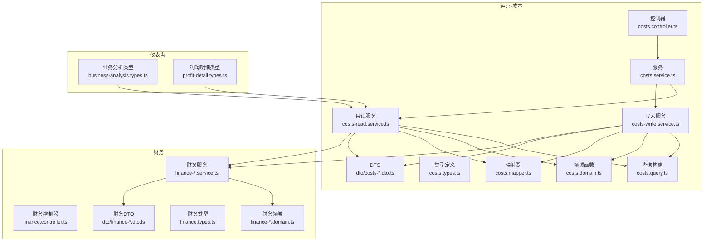
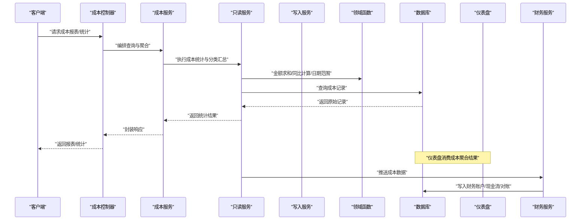
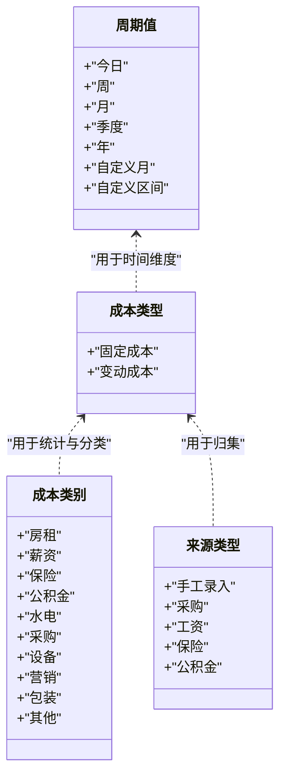
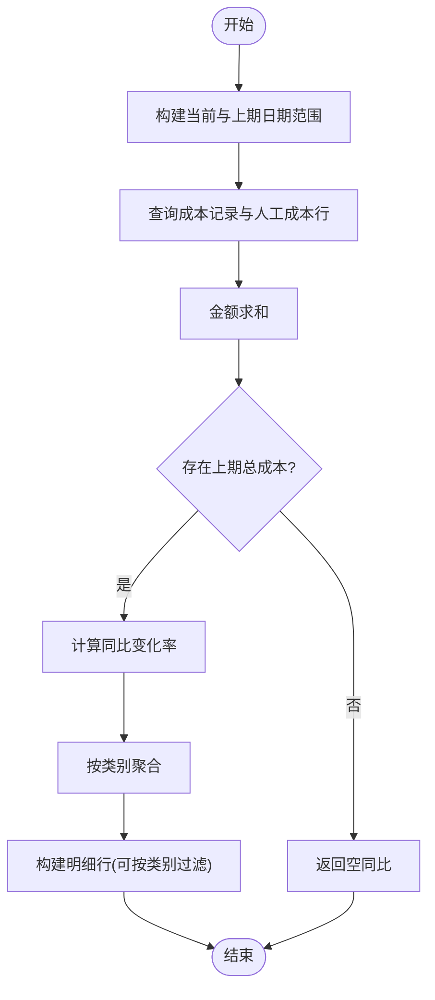
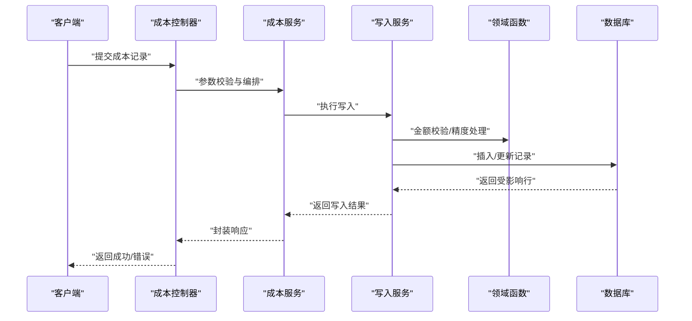
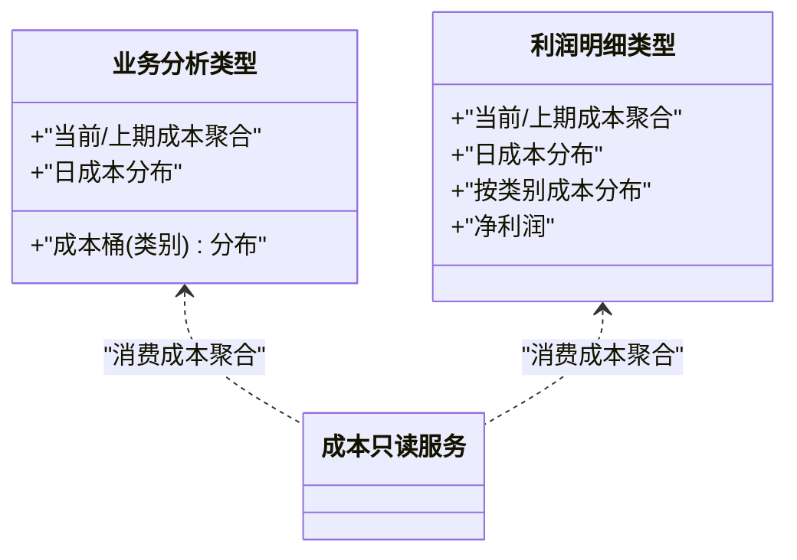
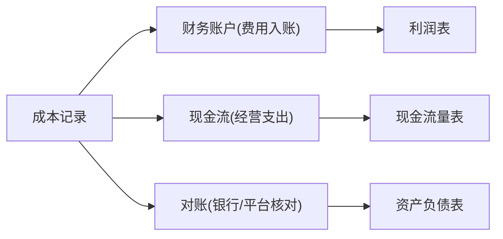
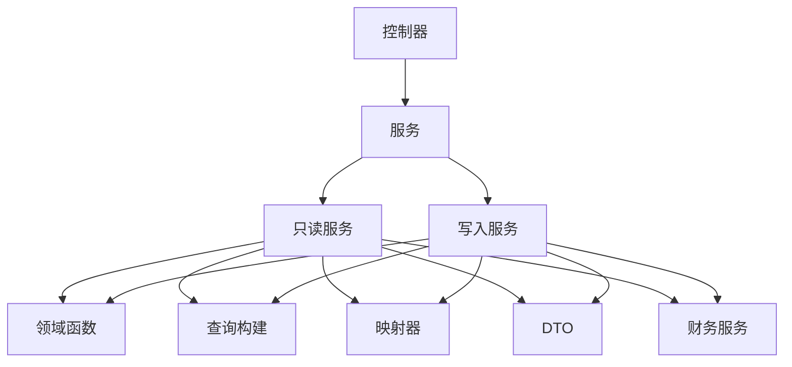

# 成本管理

<cite>
**本文引用的文件**
- [costs.controller.ts](file://src/purely-profit/operations/costs/costs.controller.ts)
- [costs.service.ts](file://src/purely-profit/operations/costs/costs.service.ts)
- [costs-read.service.ts](file://src/purely-profit/operations/costs/costs-read.service.ts)
- [costs-write.service.ts](file://src/purely-profit/operations/costs/costs-write.service.ts)
- [costs.domain.ts](file://src/purely-profit/operations/costs/costs.domain.ts)
- [costs.types.ts](file://src/purely-profit/operations/costs/costs.types.ts)
- [costs.query.ts](file://src/purely-profit/operations/costs/costs.query.ts)
- [costs.mapper.ts](file://src/purely-profit/operations/costs/costs.mapper.ts)
- [costs-response.dto.ts](file://src/purely-profit/operations/costs/dto/costs-response.dto.ts)
- [costs-query.dto.ts](file://src/purely-profit/operations/costs/dto/costs-query.dto.ts)
- [business-analysis.types.ts](file://src/purely-profit/dashboard/business-analysis/business-analysis.types.ts)
- [profit-detail.types.ts](file://src/purely-profit/dashboard/profit-detail/profit-detail.types.ts)
- [finance-account.service.ts](file://src/purely-profit/finance/finance-account.service.ts)
- [finance-cash-flow.service.ts](file://src/purely-profit/finance/finance-cash-flow.service.ts)
- [finance-reconciliation.service.ts](file://src/purely-profit/finance/finance-reconciliation.service.ts)
- [finance-overview.service.ts](file://src/purely-profit/finance/finance-overview.service.ts)
- [finance.controller.ts](file://src/purely-profit/finance/finance.controller.ts)
- [finance.types.ts](file://src/purely-profit/finance/finance.types.ts)
- [finance-money.utils.ts](file://src/purely-profit/finance/finance-money.utils.ts)
- [finance-date.utils.ts](file://src/purely-profit/finance/finance-date.utils.ts)
- [finance.constants.ts](file://src/purely-profit/finance/finance.constants.ts)
- [finance-query.dto.ts](file://src/purely-profit/finance/dto/finance-query.dto.ts)
- [finance-response.dto.ts](file://src/purely-profit/finance/dto/finance-response.dto.ts)
- [finance-overview.query.ts](file://src/purely-profit/finance/dto/finance-overview.query.dto.ts)
- [finance-account.query.ts](file://src/purely-profit/finance/dto/finance-account.query.dto.ts)
- [finance-cash-flow.query.ts](file://src/purely-profit/finance/dto/finance-cash-flow.query.dto.ts)
- [finance-reconciliation.query.ts](file://src/purely-profit/finance/dto/finance-reconciliation.query.dto.ts)
- [finance-report.query.ts](file://src/purely-profit/finance/dto/finance-report.query.dto.ts)
- [finance-account.response.dto.ts](file://src/purely-profit/finance/dto/finance-account.response.dto.ts)
- [finance-cash-flow.response.dto.ts](file://src/purely-profit/finance/dto/finance-cash-flow.response.dto.ts)
- [finance-reconciliation.response.dto.ts](file://src/purely-profit/finance/dto/finance-reconciliation.response.dto.ts)
- [finance-overview.response.dto.ts](file://src/purely-profit/finance/dto/finance-overview.response.dto.ts)
- [finance-report.response.dto.ts](file://src/purely-profit/finance/dto/finance-report.response.dto.ts)
- [finance-shared.response.dto.ts](file://src/purely-profit/finance/dto/finance-shared.response.dto.ts)
- [finance-account.domain.ts](file://src/purely-profit/finance/finance-account.domain.ts)
- [finance-cash-flow.domain.ts](file://src/purely-profit/finance/finance-cash-flow.domain.ts)
- [finance-reconciliation.domain.ts](file://src/purely-profit/finance/finance-reconciliation.domain.ts)
- [finance-overview.domain.ts](file://src/purely-profit/finance/finance-overview.domain.ts)
- [finance-account.query.ts](file://src/purely-profit/finance/finance-account.query.ts)
- [finance-cash-flow.query.ts](file://src/purely-profit/finance/finance-cash-flow.query.ts)
- [finance-reconciliation.query.ts](file://src/purely-profit/finance/finance-reconciliation.query.ts)
- [finance-overview.query.ts](file://src/purely-profit/finance/finance-overview.query.ts)
- [finance-account.report.domain.ts](file://src/purely-profit/finance/finance-account-report.domain.ts)
- [finance-account-report.query.ts](file://src/purely-profit/finance/finance-account-report.query.ts)
- [finance-account-report.response.dto.ts](file://src/purely-profit/finance/finance-account-report.response.dto.ts)
- [finance-account-report.mapper.ts](file://src/purely-profit/finance/finance-account-report.mapper.ts)
- [finance-account-report.service.ts](file://src/purely-profit/finance/finance-account-report.service.ts)
- [finance-account-report.controller.ts](file://src/purely-profit/finance/finance-account-report.controller.ts)
- [finance-account-report.types.ts](file://src/purely-profit/finance/finance-account-report.types.ts)
- [finance-account-report.constants.ts](file://src/purely-profit/finance/finance-account-report.constants.ts)
- [finance-account-report.utils.ts](file://src/purely-profit/finance/finance-account-report.utils.ts)
- [finance-account-report.validator.ts](file://src/purely-profit/finance/finance-account-report.validator.ts)
- [finance-account-report.mapper.ts](file://src/purely-profit/finance/finance-account-report.mapper.ts)
- [finance-account-report.query.ts](file://src/purely-profit/finance/finance-account-report.query.ts)
- [finance-account-report.response.dto.ts](file://src/purely-profit/finance/finance-account-report.response.dto.ts)
- [finance-account-report.service.ts](file://src/purely-profit/finance/finance-account-report.service.ts)
- [finance-account-report.controller.ts](file://src/purely-profit/finance/finance-account-report.controller.ts)
- [finance-account-report.types.ts](file://src/purely-profit/finance/finance-account-report.types.ts)
- [finance-account-report.constants.ts](file://src/purely-profit/finance/finance-account-report.constants.ts)
- [finance-account-report.utils.ts](file://src/purely-profit/finance/finance-account-report.utils.ts)
- [finance-account-report.validator.ts](file://src/purely-profit/finance/finance-account-report.validator.ts)
- [finance-account-report.mapper.ts](file://src/purely-profit/finance/finance-account-report.mapper.ts)
- [finance-account-report.query.ts](file://src/purely-profit/finance/finance-account-report.query.ts)
- [finance-account-report.response.dto.ts](file://src/purely-profit/finance/finance-account-report.response.dto.ts)
- [finance-account-report.service.ts](file://src/purely-profit/finance/finance-account-report.service.ts)
- [finance-account-report.controller.ts](file://src/purely-profit/finance/finance-account-report.controller.ts)
- [finance-account-report.types.ts](file://src/purely-profit/finance/finance-account-report.types.ts)
- [finance-account-report.constants.ts](file://src/purely-profit/finance/finance-account-report.constants.ts)
- [finance-account-report.utils.ts](file://src/purely-profit/finance/finance-account-report.utils.ts)
- [finance-account-report.validator.ts](file://src/purely-profit/finance/finance-account-report.validator.ts)
- [finance-account-report.mapper.ts](file://src/purely-profit/finance/finance-account-report.mapper.ts)
- [finance-account-report.query.ts](file://src/purely-profit/finance/finance-account-report.query.ts)
- [finance-account-report.response.dto.ts](file://src/purely-profit/finance/finance-account-report.response.dto.ts)
- [finance-account-report.service.ts](file://src/purely-profit/finance/finance-account-report.service.ts)
- [finance-account-report.controller.ts](file://src/purely-profit/finance/finance-account-report.controller.ts)
- [finance-account-report.types.ts](file://src/purely-profit/finance/finance-account-report.types.ts)
- [finance-account-report.constants.ts](file://src/purely-profit/finance/finance-account-report.constants.ts)
- [finance-account-report.utils.ts](file://src/purely-profit/finance/finance-account-report.utils.ts)
- [finance-account-report.validator.ts](file://src/purely-profit/finance/finance-account-report.validator.ts)
- [finance-account-report.mapper.ts](file://src/purely-profit/finance/finance-account-report.mapper.ts)
- [finance-account-report.query.ts](file://src/purely-profit/finance/finance-account-report.query.ts)
- [finance-account-report.response.dto.ts](file://src/purely-profit/finance/finance-account-report.response.dto.ts)
- [finance-account-report.service.ts](file://src/purely-profit/finance/finance-account-report.service.ts)
- [finance-account-report.controller.ts](file://src/purely-profit/finance/finance-account-report.controller.ts)
- [finance-account-report.types.ts](file://src/purely-profit/finance/finance-account-report.types.ts)
- [finance-account-report.constants.ts](file://src/purely-profit/finance/finance-account-report.constants.ts)
- [finance-account-report.utils.ts](file://src/purely-profit/finance/finance-account-report.utils.ts)
- [finance-account-report.validator.ts](file://src/purely-profit/finance/finance-account-report.validator.ts)
- [finance-account-report.mapper.ts](file://src/purely-profit/finance/finance-account-report.mapper.ts)
- [finance-account-report.query.ts](file://src/purely-profit/finance/finance-account-report.query.ts)
- [finance-account-report.response.dto.ts](file://src/purely-profit/finance/finance-account-report.response.dto.ts)
- [finance-account-report.service.ts](file://src/purely-profit/finance/finance-account-report.service.ts)
- [finance-account-report.controller.ts](file://src/purely-profit/finance/finance-account-report.controller.ts)
- [finance-account-report.types.ts](file://src/purely-profit/finance/finance-account-report.types.ts)
- [finance-account-report.constants.ts](file://src/purely-profit/finance/finance-account-report.constants.ts)
- [finance-account-report.utils.ts](file://src/purely-profit/finance/finance-account-report.utils.ts)
- [finance-account-report.validator.ts](file://src/purely-profit/finance/finance-account-report.validator.ts)
- [finance-account-report.mapper.ts](file://src/purely-profit/finance/finance-account-report.mapper.ts)
- [finance-account-report.query.ts](file://src/purely-profit/finance/finance-account-report.query.ts)
- [finance-account-report.response.dto.ts](file://src/purely-profit/finance/finance-account-report.response.dto.ts)
- [finance-account-report.service.ts](file://src/purely-profit/finance/finance-account-report.service.ts)
- [finance-account-report.controller.ts](file://src/purely-profit/finance/finance-account-report.controller.ts)
- [finance-account-report.types.ts](file://src/purely-profit/finance/finance-account-report.types.ts)
- [finance-account-report.constants.ts](file://src/purely-profit/finance/finance-account-report.constants.ts)
- [finance-account-report.utils.ts](file://src/purely-profit/finance/finance-account-report.utils.ts)
- [finance-account-report.validator.ts](file://src/purely-profit/finance/finance-account-report.validator.ts)
- [finance-account-report.mapper.ts](file://src/purely-profit/finance/finance-account-report.mapper.ts)
- [finance-account-report.query.ts](file://src/p......)
</cite>

## 目录
1. [简介](#简介)
2. [项目结构](#项目结构)
3. [核心组件](#核心组件)
4. [架构总览](#架构总览)
5. [详细组件分析](#详细组件分析)
6. [依赖分析](#依赖分析)
7. [性能考虑](#性能考虑)
8. [故障排查指南](#故障排查指南)
9. [结论](#结论)
10. [附录](#附录)

## 简介
本文件系统性阐述成本管理功能的设计与实现，覆盖成本核算、成本分类、成本控制、成本归集、成本分配、成本分析、成本预算、成本预警、成本报表、成本优化、成本预测与成本异常处理等关键能力，并说明成本数据与财务模块的集成关系及在财务报表中的体现方式。文档以代码为依据，结合流程图与类图，帮助开发者与业务人员快速理解并正确使用成本管理能力。

## 项目结构
成本管理位于“operations”子域下，采用按功能分层的模块化组织：控制器负责HTTP接口编排，服务层封装业务逻辑，领域函数处理通用算法，查询与映射模块负责数据访问与DTO转换，类型定义统一约束枚举与输入输出结构。同时，成本数据在仪表盘与财务模块中被复用，形成从运营到财务的闭环。

图表来源
- [costs.controller.ts](file://src/purely-profit/operations/costs/costs.controller.ts)
- [costs.service.ts](file://src/purely-profit/operations/costs/costs.service.ts)
- [costs-read.service.ts](file://src/purely-profit/operations/costs/costs-read.service.ts)
- [costs-write.service.ts](file://src/purely-profit/operations/costs/costs-write.service.ts)
- [costs.domain.ts](file://src/purely-profit/operations/costs/costs.domain.ts)
- [costs.types.ts](file://src/purely-profit/operations/costs/costs.types.ts)
- [costs.query.ts](file://src/purely-profit/operations/costs/costs.query.ts)
- [costs.mapper.ts](file://src/purely-profit/operations/costs/costs.mapper.ts)
- [business-analysis.types.ts](file://src/purely-profit/dashboard/business-analysis/business-analysis.types.ts)
- [profit-detail.types.ts](file://src/purely-profit/dashboard/profit-detail/profit-detail.types.ts)
- [finance.controller.ts](file://src/purely-profit/finance/finance.controller.ts)
- [finance.types.ts](file://src/purely-profit/finance/finance.types.ts)

章节来源
- [costs.controller.ts](file://src/purely-profit/operations/costs/costs.controller.ts)
- [costs.service.ts](file://src/purely-profit/operations/costs/costs.service.ts)
- [costs-read.service.ts](file://src/purely-profit/operations/costs/costs-read.service.ts)
- [costs-write.service.ts](file://src/purely-profit/operations/costs/costs-write.service.ts)
- [costs.domain.ts](file://src/purely-profit/operations/costs/costs.domain.ts)
- [costs.types.ts](file://src/purely-profit/operations/costs/costs.types.ts)
- [costs.query.ts](file://src/purely-profit/operations/costs/costs.query.ts)
- [costs.mapper.ts](file://src/purely-profit/operations/costs/costs.mapper.ts)
- [business-analysis.types.ts](file://src/purely-profit/dashboard/business-analysis/business-analysis.types.ts)
- [profit-detail.types.ts](file://src/purely-profit/dashboard/profit-detail/profit-detail.types.ts)
- [finance.controller.ts](file://src/purely-profit/finance/finance.controller.ts)
- [finance.types.ts](file://src/purely-profit/finance/finance.types.ts)

## 核心组件
- 控制器：暴露成本查询、统计、报表等HTTP接口，负责参数校验与响应封装。
- 服务层：组合读写服务，协调领域函数与查询构建，提供业务编排。
- 只读服务：负责成本统计、分类汇总、同比环比比较、明细行构建等。
- 写入服务：负责成本记录的创建、更新、删除与一致性校验。
- 领域函数：提供金额求和、同比计算、日期范围构建等纯函数。
- 类型与DTO：统一成本周期、类型、类别、来源类型、过滤器与查询/响应结构。
- 查询与映射：构建Prisma查询条件、聚合与映射为前端可用结构。
- 仪表盘集成：为业务分析与利润明细提供成本聚合结果。
- 财务集成：成本数据进入财务账户、现金流与对账流程，支撑财务报表。

章节来源
- [costs.controller.ts](file://src/purely-profit/operations/costs/costs.controller.ts)
- [costs.service.ts](file://src/purely-profit/operations/costs/costs.service.ts)
- [costs-read.service.ts](file://src/purely-profit/operations/costs/costs-read.service.ts)
- [costs-write.service.ts](file://src/purely-profit/operations/costs/costs-write.service.ts)
- [costs.domain.ts](file://src/purely-profit/operations/costs/costs.domain.ts)
- [costs.types.ts](file://src/purely-profit/operations/costs/costs.types.ts)
- [costs.query.ts](file://src/purely-profit/operations/costs/costs.query.ts)
- [costs.mapper.ts](file://src/purely-profit/operations/costs/costs.mapper.ts)
- [business-analysis.types.ts](file://src/purely-profit/dashboard/business-analysis/business-analysis.types.ts)
- [profit-detail.types.ts](file://src/purely-profit/dashboard/profit-detail/profit-detail.types.ts)
- [finance-account.service.ts](file://src/purely-profit/finance/finance-account.service.ts)
- [finance-cash-flow.service.ts](file://src/purely-profit/finance/finance-cash-flow.service.ts)
- [finance-reconciliation.service.ts](file://src/purely-profit/finance/finance-reconciliation.service.ts)
- [finance-overview.service.ts](file://src/purely-profit/finance/finance-overview.service.ts)

## 架构总览
成本管理遵循“控制器-服务-领域-查询”的分层架构，通过类型与DTO确保输入输出一致，通过映射器将数据库实体转换为业务视图。成本数据在仪表盘与财务模块之间流转，形成从运营到财务的闭环。

图表来源
- [costs.controller.ts](file://src/purely-profit/operations/costs/costs.controller.ts)
- [costs.service.ts](file://src/purely-profit/operations/costs/costs.service.ts)
- [costs-read.service.ts](file://src/purely-profit/operations/costs/costs-read.service.ts)
- [costs-write.service.ts](file://src/purely-profit/operations/costs/costs-write.service.ts)
- [costs.domain.ts](file://src/purely-profit/operations/costs/costs.domain.ts)
- [business-analysis.types.ts](file://src/purely-profit/dashboard/business-analysis/business-analysis.types.ts)
- [profit-detail.types.ts](file://src/purely-profit/dashboard/profit-detail/profit-detail.types.ts)
- [finance-account.service.ts](file://src/purely-profit/finance/finance-account.service.ts)
- [finance-cash-flow.service.ts](file://src/purely-profit/finance/finance-cash-flow.service.ts)
- [finance-reconciliation.service.ts](file://src/purely-profit/finance/finance-reconciliation.service.ts)
- [finance-overview.service.ts](file://src/purely-profit/finance/finance-overview.service.ts)

## 详细组件分析

### 成本类型与枚举
- 周期值：支持今日、周、月、季度、年、自定义月、自定义区间等。
- 成本类型：固定成本与变动成本两类。
- 成本类别：房租、薪资、保险、公积金、水电、采购、设备、营销、包装、其他等。
- 成本来源类型：手工录入、采购、工资、保险、公积金等。
- 过滤器：支持全部与具体类别的筛选。

图表来源
- [costs.types.ts](file://src/purely-profit/operations/costs/costs.types.ts)

章节来源
- [costs.types.ts](file://src/purely-profit/operations/costs/costs.types.ts)

### 成本统计与报表（只读服务）
- 统计摘要：总成本、固定成本、变动成本、记录数、与上一周期对比百分比。
- 分类汇总：按类别聚合成本占比与绝对值。
- 明细行：支持按类别过滤的成本明细，含人工成本行。
- 同比计算：基于上一周期总成本进行同比变化率计算；当上期为零时返回空值。

图表来源
- [costs-read.service.ts](file://src/purely-profit/operations/costs/costs-read.service.ts)
- [costs.domain.ts](file://src/purely-profit/operations/costs/costs.domain.ts)

章节来源
- [costs-read.service.ts](file://src/purely-profit/operations/costs/costs-read.service.ts)
- [costs.domain.ts](file://src/purely-profit/operations/costs/costs.domain.ts)

### 成本写入与一致性（写入服务）
- 创建/更新/删除：提供成本记录的增删改能力，确保金额精度与类型一致性。
- 数据校验：校验周期、类型、类别、来源类型与金额范围。
- 事务与幂等：建议在批量导入或外部同步时使用事务，避免重复写入。

图表来源
- [costs.controller.ts](file://src/purely-profit/operations/costs/costs.controller.ts)
- [costs.service.ts](file://src/purely-profit/operations/costs/costs.service.ts)
- [costs-write.service.ts](file://src/purely-profit/operations/costs/costs-write.service.ts)
- [costs.domain.ts](file://src/purely-profit/operations/costs/costs.domain.ts)

章节来源
- [costs.controller.ts](file://src/purely-profit/operations/costs/costs.controller.ts)
- [costs.service.ts](file://src/purely-profit/operations/costs/costs.service.ts)
- [costs-write.service.ts](file://src/purely-profit/operations/costs/costs-write.service.ts)
- [costs.domain.ts](file://src/purely-profit/operations/costs/costs.domain.ts)

### 仪表盘集成（业务分析与利润明细）
- 业务分析：提供成本聚合结果，包括总成本、日成本分布、成本桶（按类别）分布。
- 利润明细：提供成本聚合结果，包括总成本、日成本分布、按类别成本分布，与销售、利润联动。

图表来源
- [business-analysis.types.ts](file://src/purely-profit/dashboard/business-analysis/business-analysis.types.ts)
- [profit-detail.types.ts](file://src/purely-profit/dashboard/profit-detail/profit-detail.types.ts)
- [costs-read.service.ts](file://src/purely-profit/operations/costs/costs-read.service.ts)

章节来源
- [business-analysis.types.ts](file://src/purely-profit/dashboard/business-analysis/business-analysis.types.ts)
- [profit-detail.types.ts](file://src/purely-profit/dashboard/profit-detail/profit-detail.types.ts)
- [costs-read.service.ts](file://src/purely-profit/operations/costs/costs-read.service.ts)

### 财务集成与报表体现
- 财务账户：成本作为费用类科目入账，影响损益表。
- 现金流：成本支付影响经营性现金流。
- 对账：成本数据参与银行/平台对账，保证账实相符。
- 报表：成本在利润表中体现为营业成本/期间费用，在资产负债表中可能体现为应付账款/预付费用等。

图表来源
- [finance-account.service.ts](file://src/purely-profit/finance/finance-account.service.ts)
- [finance-cash-flow.service.ts](file://src/purely-profit/finance/finance-cash-flow.service.ts)
- [finance-reconciliation.service.ts](file://src/purely-profit/finance/finance-reconciliation.service.ts)
- [finance-overview.service.ts](file://src/purely-profit/finance/finance-overview.service.ts)
- [finance.controller.ts](file://src/purely-profit/finance/finance.controller.ts)

章节来源
- [finance-account.service.ts](file://src/purely-profit/finance/finance-account.service.ts)
- [finance-cash-flow.service.ts](file://src/purely-profit/finance/finance-cash-flow.service.ts)
- [finance-reconciliation.service.ts](file://src/purely-profit/finance/finance-reconciliation.service.ts)
- [finance-overview.service.ts](file://src/purely-profit/finance/finance-overview.service.ts)
- [finance.controller.ts](file://src/purely-profit/finance/finance.controller.ts)

## 依赖分析
- 模块内聚：成本模块内部职责清晰，控制器仅做编排，服务层负责业务协调，领域函数提供纯计算，查询与映射解耦数据访问。
- 外部依赖：依赖Prisma进行数据库访问，依赖Decimal进行高精度金额运算，依赖财务模块完成最终入账与报表。
- 风险点：日期范围构建与同比计算需严格处理边界值；金额求和需保持精度；跨模块数据一致性需通过事务与对账保障。

图表来源
- [costs.controller.ts](file://src/purely-profit/operations/costs/costs.controller.ts)
- [costs.service.ts](file://src/purely-profit/operations/costs/costs.service.ts)
- [costs-read.service.ts](file://src/purely-profit/operations/costs/costs-read.service.ts)
- [costs-write.service.ts](file://src/purely-profit/operations/costs/costs-write.service.ts)
- [costs.domain.ts](file://src/purely-profit/operations/costs/costs.domain.ts)
- [costs.query.ts](file://src/purely-profit/operations/costs/costs.query.ts)
- [costs.mapper.ts](file://src/purely-profit/operations/costs/costs.mapper.ts)
- [finance-account.service.ts](file://src/purely-profit/finance/finance-account.service.ts)

章节来源
- [costs.controller.ts](file://src/purely-profit/operations/costs/costs.controller.ts)
- [costs.service.ts](file://src/purely-profit/operations/costs/costs.service.ts)
- [costs-read.service.ts](file://src/purely-profit/operations/costs/costs-read.service.ts)
- [costs-write.service.ts](file://src/purely-profit/operations/costs/costs-write.service.ts)
- [costs.domain.ts](file://src/purely-profit/operations/costs/costs.domain.ts)
- [costs.query.ts](file://src/purely-profit/operations/costs/costs.query.ts)
- [costs.mapper.ts](file://src/purely-profit/operations/costs/costs.mapper.ts)
- [finance-account.service.ts](file://src/purely-profit/finance/finance-account.service.ts)

## 性能考虑
- 聚合计算：在只读服务中进行一次性查询后聚合，避免多次往返数据库。
- 精度控制：使用高精度运算库处理金额，减少浮点误差。
- 索引与查询：合理利用日期、类别、来源类型索引，缩短查询时间。
- 批量导入：写入服务支持批量操作，建议使用事务与分页写入，降低锁竞争。
- 缓存策略：对高频报表结果进行短期缓存，减轻数据库压力。

## 故障排查指南
- 同比为空：当上期总成本为零时，同比返回空值，属预期行为。
- 金额不一致：检查金额精度与四舍五入规则，确认Decimal运算是否正确。
- 日期范围异常：确认周期参数与自定义日期范围是否正确构建。
- 写入失败：检查来源类型、成本类型与类别是否在允许集合内，金额是否合法。
- 财务未入账：核对成本记录是否推送至财务服务，检查对账状态与凭证生成。

章节来源
- [costs.domain.ts](file://src/purely-profit/operations/costs/costs.domain.ts)
- [costs-read.service.ts](file://src/purely-profit/operations/costs/costs-read.service.ts)
- [finance-reconciliation.service.ts](file://src/purely-profit/finance/finance-reconciliation.service.ts)

## 结论
成本管理模块以清晰的分层设计实现了从成本归集、分配到统计、报表与财务集成的全链路能力。通过严格的类型约束、高精度金额处理与与财务模块的紧密协作，系统能够稳定支撑成本核算、成本控制与成本分析等核心业务需求，并为预算、预警、优化与预测奠定基础。

## 附录

### API 一览（示例）
- 获取成本统计摘要
  - 方法：GET
  - 路径：/operations/costs/stats
  - 查询参数：周期、自定义日期范围、成本类型过滤、类别过滤
  - 返回：总成本、固定成本、变动成本、记录数、同比变化率
- 获取成本报表
  - 方法：GET
  - 路径：/operations/costs/report
  - 查询参数：周期、自定义日期范围、类别过滤
  - 返回：摘要、分类占比、明细行（可按类别过滤）
- 新增/更新/删除成本记录
  - 方法：POST/PUT/DELETE
  - 路径：/operations/costs
  - 请求体：成本记录（来源类型、成本类型、类别、金额、日期等）
  - 返回：写入结果或错误信息

章节来源
- [costs.controller.ts](file://src/purely-profit/operations/costs/costs.controller.ts)
- [costs-response.dto.ts](file://src/purely-profit/operations/costs/dto/costs-response.dto.ts)
- [costs-query.dto.ts](file://src/purely-profit/operations/costs/dto/costs-query.dto.ts)